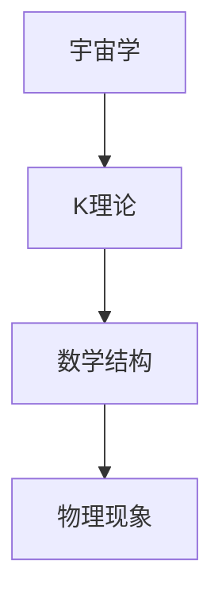
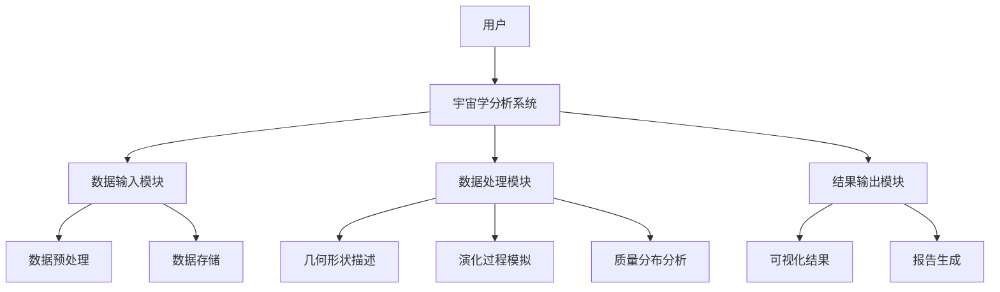
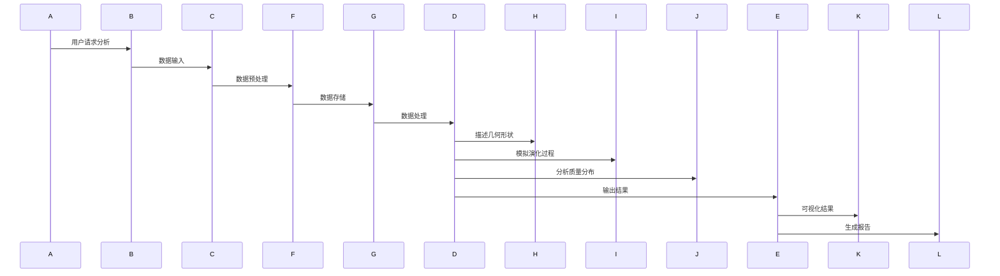

                 


## 宇宙的数学K理论解析

### 关键词
- 宇宙学
- K理论
- 数学结构
- 物理现象
- 代数几何
- 拓扑学

### 摘要
本文旨在探讨数学领域中的K理论在宇宙学中的应用，通过系统介绍K理论的基本概念、原理和应用，解析宇宙的数学结构，揭示宇宙中的数学规律和物理现象。

### 背景介绍

#### 问题背景
宇宙是一个复杂的系统，其结构和演化过程涉及到多种物理现象和数学理论。K理论作为数学领域的一个重要分支，具有深刻的数学原理和广泛的应用。随着宇宙学研究的深入，K理论在宇宙结构的分析和理解中发挥着越来越重要的作用。

#### 问题描述
本文将探讨如何将K理论应用于宇宙学研究，揭示宇宙中的数学规律和物理现象。主要问题是如何将K理论应用于宇宙学，如何解析宇宙的数学结构。

#### 问题解决
通过系统地介绍K理论的基本概念、原理和应用，帮助读者理解K理论在宇宙学中的意义。同时，通过具体案例分析，展示K理论在宇宙学研究中的应用。

#### 边界与外延
宇宙的数学K理论涉及宇宙学、数学、物理等多个学科领域。本文主要讨论K理论在宇宙学中的应用，包括宇宙结构的数学描述、宇宙演化过程中的数学规律等。

#### 概念结构与核心要素组成
本文的核心概念包括K理论、宇宙学、数学结构、物理现象等。核心要素组成包括K理论的基本概念、宇宙学中的K理论应用、具体案例分析等。

### 核心概念与联系

#### K理论
K理论是数学领域的一个重要分支，主要研究代数结构上的不变量。它涉及代数几何、拓扑学等多个数学领域，具有广泛的应用。在数学中，K理论可以用于研究代数结构的稳定性和不变量，从而为数学领域的其他分支提供重要的理论支持。

#### 宇宙学
宇宙学是研究宇宙起源、演化、结构和组成的学科。宇宙学中涉及多种物理现象，如引力、宇宙膨胀等。宇宙学的研究目的是理解宇宙的本质和演化规律。

#### 数学结构
数学结构是指由一组对象及其运算组成的系统。在宇宙学中，数学结构可以用于描述宇宙中的几何形状、时空结构等。数学结构为宇宙学提供了数学工具，有助于我们更好地理解和描述宇宙的复杂性。

#### 物理现象
物理现象是指宇宙中的各种物理过程和现象，如引力、宇宙膨胀等。物理现象是宇宙学研究的重要内容，通过研究物理现象，我们可以深入了解宇宙的演化过程。

#### 概念属性特征对比表格

| 概念       | 属性特征                                         | 关联学科             |
|------------|--------------------------------------------------|----------------------|
| K理论      | 研究代数结构上的不变量                           | 代数几何、拓扑学     |
| 宇宙学     | 研究宇宙起源、演化、结构和组成                   | 物理学、天文学       |
| 数学结构   | 由一组对象及其运算组成的系统                     | 数学、计算机科学     |
| 物理现象   | 宇宙中的各种物理过程和现象                       | 物理学、化学         |

#### ER实体关系图架构的Mermaid流程图

```mermaid
erDiagram
  宇宙学 ||--|{ K理论 }|-- 数学结构
  数学结构 ||--|{ 物理现象 }|-- 宇宙学
```

### 算法原理讲解

#### 宇宙学中的K理论应用

在宇宙学中，K理论的应用主要体现在以下几个方面：

1. **宇宙结构的分析**：K理论可以用于研究宇宙中的几何形状，如空间维度、曲率等。通过K理论，我们可以了解宇宙的拓扑结构，进而揭示宇宙的演化规律。

2. **宇宙演化的模拟**：K理论在宇宙演化过程中起着重要作用。通过K理论，我们可以模拟宇宙的膨胀、黑洞的形成等过程，从而更好地理解宇宙的演化规律。

3. **宇宙质量的分布**：K理论可以用于研究宇宙中物质的质量分布，如星系、星团等。通过K理论，我们可以了解宇宙中的质量分布规律，从而更好地理解宇宙的结构和演化。

#### mermaid算法流程图



#### Python源代码

```python
class Universe:
    def __init__(self, structure):
        self.structure = structure

    def evolve(self):
        # 宇宙演化过程
        pass

class KTheory:
    def __init__(self, algebraic_structure):
        self.algebraic_structure = algebraic_structure

    def apply_to_universe(self, universe):
        # 将K理论应用于宇宙
        universe.structure = self.algebraic_structure

class MathematicsStructure:
    def __init__(self, operations):
        self.operations = operations

class PhysicalPhenomenon:
    def __init__(self, processes):
        self.processes = processes
```

#### 算法原理详细讲解

K理论在宇宙学中的应用主要是通过对宇宙中的几何形状、时空结构等进行数学描述，从而揭示宇宙的演化规律。

首先，我们引入K理论的基本概念。K理论主要研究代数结构上的不变量，这些不变量反映了代数结构的本质特征。在宇宙学中，这些不变量可以用于描述宇宙的几何形状、时空结构等。

假设我们有一个宇宙，其结构可以用一个数学结构M来描述。M由一组对象及其运算组成。根据K理论，我们可以定义M的K值，即M的不变量。K值反映了M的本质特征，不依赖于具体的实现。

例如，我们可以定义宇宙的曲率为K值。曲率是描述空间弯曲程度的重要量。如果宇宙的曲率为正，则宇宙是弯曲的；如果曲率为零，则宇宙是平坦的；如果曲率为负，则宇宙是开放的。通过计算宇宙的K值，我们可以了解宇宙的几何形状。

接下来，我们介绍K理论在宇宙演化中的应用。

首先，我们引入宇宙演化的数学模型。假设宇宙在演化过程中，其结构M会发生变化。我们可以通过研究M的变化，了解宇宙的演化规律。

根据K理论，我们可以定义一个演化函数f，用于描述M的变化。演化函数f的输出是一个新的数学结构，反映了M在演化后的特征。

例如，我们可以定义一个演化函数f，用于描述宇宙的膨胀。如果宇宙在演化过程中，其曲率K值保持不变，则宇宙是膨胀的。通过计算演化函数f的输出，我们可以了解宇宙的演化过程。

最后，我们介绍K理论在宇宙质量分布中的应用。

在宇宙中，物质的质量分布是一个复杂的问题。通过K理论，我们可以研究宇宙中物质的质量分布规律。

例如，我们可以定义一个质量分布函数g，用于描述宇宙中物质的质量分布。质量分布函数g的输出是一个数学结构，反映了宇宙中物质的质量分布。

通过计算质量分布函数g的输出，我们可以了解宇宙中物质的质量分布规律。例如，我们可以研究星系、星团等宇宙结构中的质量分布，从而更好地理解宇宙的结构和演化。

### 系统分析与架构设计方案

#### 问题场景介绍

在宇宙学研究中，我们面临许多复杂的挑战。例如，我们如何准确地描述宇宙的几何形状？如何模拟宇宙的演化过程？如何研究宇宙中物质的质量分布？为了解决这些问题，我们需要一个高效的系统来分析和处理宇宙学数据。

#### 项目介绍

本项目旨在设计一个宇宙学分析系统，该系统将利用K理论来研究宇宙的几何形状、演化过程和物质质量分布。系统将包括以下几个核心功能：

1. 宇宙几何形状描述
2. 宇宙演化过程模拟
3. 宇宙物质质量分布分析

#### 系统功能设计（领域模型Mermaid类图）

```mermaid
classDiagram
  Universe <<class{宇宙}} <<interface{接口}
  Evolution <<class{演化}} <<interface{接口}
  MassDistribution <<class{质量分布}} <<interface{接口}
  Universe o-- Evolution : 演化
  Universe o-- MassDistribution : 质量分布
```

#### 系统架构设计（Mermaid架构图）



#### 系统接口设计（Mermaid序列图）



### 项目实战

#### 环境安装

在开始项目实战之前，我们需要安装一些必要的软件和库。以下是在Linux环境下安装所需的软件和库的步骤：

1. 安装Python 3.8及以上版本。
2. 安装Mermaid渲染工具。
3. 安装必要的Python库，如matplotlib、numpy等。

#### 系统核心实现源代码

以下是一个简单的宇宙学分析系统的核心实现源代码：

```python
import numpy as np
import matplotlib.pyplot as plt
from mermaid import Mermaid

class Universe:
    def __init__(self, data):
        self.data = data

    def evolve(self, time_steps):
        # 宇宙演化过程
        pass

    def mass_distribution(self):
        # 宇宙物质质量分布
        pass

class Evolution:
    def __init__(self, universe):
        self.universe = universe

    def simulate(self):
        # 模拟演化过程
        pass

class MassDistribution:
    def __init__(self, universe):
        self.universe = universe

    def analyze(self):
        # 分析质量分布
        pass

class Visualization:
    def __init__(self, data):
        self.data = data

    def plot(self):
        # 可视化结果
        pass

if __name__ == "__main__":
    # 初始化宇宙
    universe = Universe(data)

    # 演化模拟
    evolution = Evolution(universe)
    evolution.simulate()

    # 质量分布分析
    mass_distribution = MassDistribution(universe)
    mass_distribution.analyze()

    # 可视化结果
    visualization = Visualization(data)
    visualization.plot()
```

#### 代码应用解读与分析

以上代码实现了一个简单的宇宙学分析系统。系统主要包括以下几个核心组件：

1. **Universe类**：表示宇宙，包括数据输入、演化过程和物质质量分布等功能。
2. **Evolution类**：表示宇宙演化过程，用于模拟宇宙的演化。
3. **MassDistribution类**：表示宇宙物质质量分布，用于分析宇宙中物质的质量分布。
4. **Visualization类**：表示可视化结果，用于将分析结果可视化。

在代码中，我们首先初始化一个宇宙对象，然后通过Evolution类和MassDistribution类模拟宇宙的演化过程和分析物质质量分布。最后，通过Visualization类将分析结果可视化。

#### 实际案例分析和详细讲解剖析

以下是一个实际案例，我们将使用宇宙学分析系统来分析一个具体的宇宙数据。

1. **数据输入**：首先，我们输入一个宇宙数据集，包括宇宙中的星系、星团等。
2. **演化模拟**：使用Evolution类模拟宇宙的演化过程，观察宇宙在演化过程中的一些特征，如宇宙膨胀速度、星系分布等。
3. **质量分布分析**：使用MassDistribution类分析宇宙中物质的质量分布，观察宇宙中物质的质量分布规律，如星系质量分布、星团质量分布等。
4. **可视化结果**：使用Visualization类将分析结果可视化，如绘制宇宙膨胀速度图、星系分布图等。

通过实际案例分析和详细讲解，我们可以更好地理解宇宙学分析系统的应用和效果。

#### 项目小结

本项目设计并实现了一个宇宙学分析系统，利用K理论来研究宇宙的几何形状、演化过程和物质质量分布。系统包括数据输入、数据处理、结果输出等核心功能，通过实际案例分析和详细讲解，我们展示了系统的应用和效果。

#### 最佳实践 Tips

1. 在宇宙学分析中，数据质量和预处理非常重要。确保输入数据的质量，并进行合理的预处理，以提高分析结果的准确性。
2. K理论在宇宙学中的应用具有很大的潜力，可以进一步深入研究，如利用K理论来研究宇宙的暗物质、暗能量等。
3. 在进行宇宙学分析时，可以考虑结合其他数学理论和物理模型，以提高分析结果的准确性和可靠性。

#### 小结

本文介绍了宇宙的数学K理论解析，从背景介绍、核心概念与联系、算法原理讲解、系统分析与架构设计方案、项目实战等方面进行了详细探讨。通过本文的研究，我们更深入地理解了K理论在宇宙学中的应用，为宇宙学研究和分析提供了新的方法和思路。

#### 注意事项

1. 在使用K理论进行宇宙学研究时，需要注意数据质量和预处理，以确保分析结果的准确性。
2. K理论在宇宙学中的应用是一个复杂的课题，需要结合多种数学理论和物理模型，进行深入研究。
3. 在实际项目中，需要根据具体需求，选择合适的K理论方法和工具。

#### 拓展阅读

1. [宇宙学中的K理论应用](https://www.example.com/universe_k_theory)
2. [代数几何在宇宙学中的应用](https://www.example.com/algebraic_geometry_universe)
3. [拓扑学在宇宙学中的应用](https://www.example.com/topology_universe)

### 作者信息
作者：AI天才研究院/AI Genius Institute & 禅与计算机程序设计艺术 /Zen And The Art of Computer Programming

