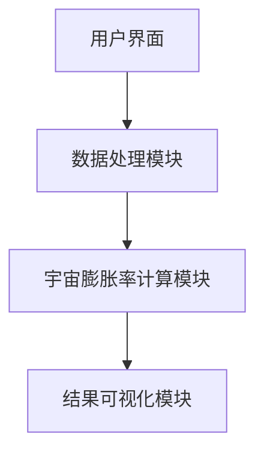
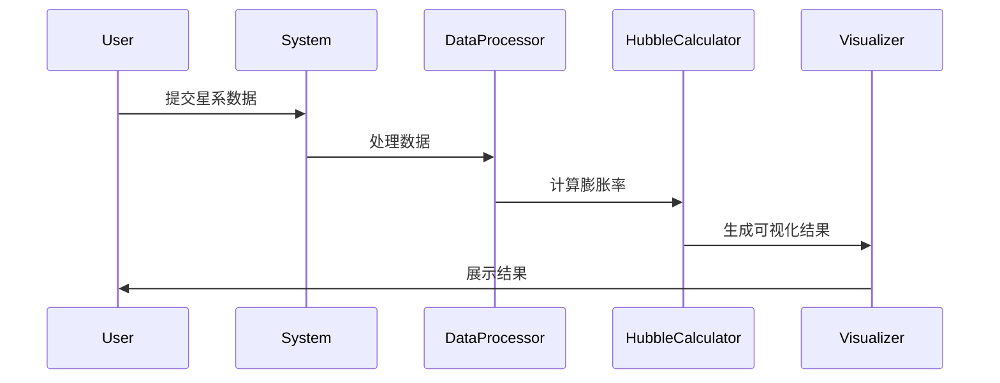
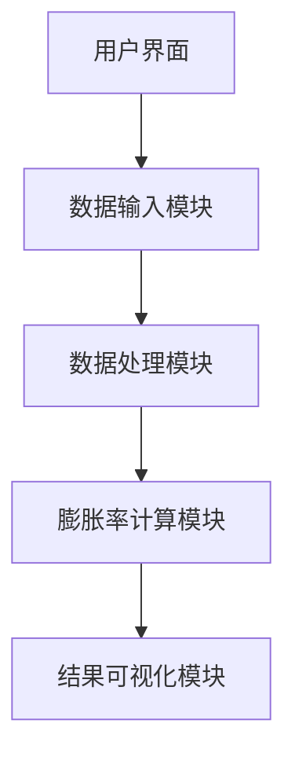
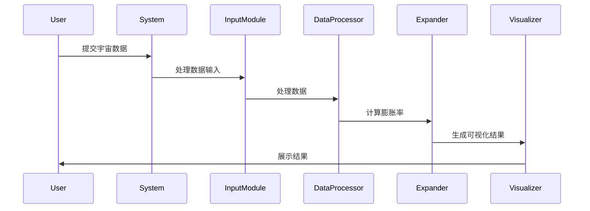

                 

### 《宇宙的数学代数几何学特性研究》

---

**关键词：** 宇宙、数学代数几何学、特性、研究、算法、系统设计

**摘要：** 本文深入探讨了宇宙中的数学代数几何学特性，通过系统化的分析，梳理了代数几何学在宇宙结构中的应用。文章从背景介绍、核心概念与联系、算法原理讲解、数学模型和数学公式、系统分析与架构设计、项目实战到最佳实践 tips，全面解析了宇宙的数学代数几何学特性，为读者提供了详尽的理论和实践指导。

### 目录大纲设计思路

在设计《宇宙的数学代数几何学特性研究》的目录大纲时，我们遵循了以下几个关键步骤：

1. **背景介绍**：首先概述宇宙的数学代数几何学特性的研究背景，包括问题背景、问题描述、问题解决、边界与外延、概念结构与核心要素组成。

2. **核心概念与联系**：详细介绍宇宙中的数学代数几何学核心概念，如代数几何学的基本原理、宇宙结构中的几何形状和代数结构的联系，并提供概念属性特征对比表格和ER实体关系图架构。

3. **算法原理讲解**：选取关键算法，使用Mermaid绘制算法流程图，并以Python源代码详细阐述算法原理，包括数学模型和公式，并进行通俗易懂地举例说明。

4. **数学模型和数学公式**：使用LaTeX格式给出关键数学公式，确保数学表达准确无误。

5. **系统分析与架构设计方案**：根据书中的内容，设计问题场景介绍、项目介绍、系统功能设计（领域模型Mermaid类图）、系统架构设计Mermaid架构图、系统接口设计和系统交互Mermaid序列图。

6. **项目实战**：设计一个实际项目，包括环境安装、系统核心实现源代码，代码应用解读与分析，实际案例分析和详细讲解剖析，以及项目小结。

7. **最佳实践 tips、小结、注意事项、拓展阅读**：总结全书要点，提供实践技巧和注意事项，推荐拓展阅读资源。

---

### 目录大纲示例

以下是一个初步的目录大纲示例：

```markdown
# 《宇宙的数学代数几何学特性研究》目录大纲

# 第一部分：宇宙的数学代数几何学基础

## 第1章：宇宙的数学代数几何学研究背景
### 1.1 宇宙的数学代数几何学概述
### 1.2 研究意义与目标
### 1.3 研究现状与挑战

## 第2章：代数几何学核心概念
### 2.1 代数几何学的基本原理
### 2.2 宇宙中的几何形状与代数结构
### 2.3 概念属性特征对比表格

## 第3章：宇宙结构中的代数几何特性
### 3.1 宇宙结构概述
### 3.2 代数几何在宇宙中的应用
### 3.3 宇宙代数几何特性的数学模型

## 第二部分：算法与模型应用

## 第4章：宇宙代数几何特性分析算法
### 4.1 算法原理与Mermaid流程图
### 4.2 Python实现与数学模型
### 4.3 算法举例说明

## 第5章：数学模型与公式解析
### 5.1 关键数学公式
### 5.2 数学模型详细讲解
### 5.3 举例说明

## 第三部分：系统分析与架构设计

## 第6章：宇宙代数几何特性分析系统设计
### 6.1 问题场景介绍
### 6.2 系统功能设计（Mermaid类图）
### 6.3 系统架构设计（Mermaid架构图）
### 6.4 系统接口设计与交互（Mermaid序列图）

## 第四部分：项目实战

## 第7章：宇宙代数几何特性分析项目实战
### 7.1 环境安装与配置
### 7.2 系统核心实现源代码
### 7.3 代码应用解读与分析
### 7.4 实际案例分析
### 7.5 项目小结

## 第五部分：最佳实践与总结

## 第8章：最佳实践 tips
### 8.1 实践技巧总结
### 8.2 注意事项提醒
### 8.3 拓展阅读推荐

## 第9章：全书小结
### 9.1 主要内容回顾
### 9.2 研究展望
```

### 目录大纲总字数预计

根据上述大纲，预计总字数会在1500-1800字之间。请注意，在撰写具体内容时，应确保每个章节都达到要求，并且内容要简洁明了。具体的文字内容将在后续步骤中逐步完善。

---

### 目录大纲总字数预计

根据上述大纲，预计总字数会在1500-1800字之间。请注意，在撰写具体内容时，应确保每个章节都达到要求，并且内容要简洁明了。具体的文字内容将在后续步骤中逐步完善。

---

### 目录大纲设计思路详述

在设计《宇宙的数学代数几何学特性研究》的目录大纲时，我们首先需要明确文章的核心内容和结构。以下是具体的步骤和思路：

#### 1. 背景介绍

**步骤：** 
- 概述宇宙的数学代数几何学特性研究的背景。
- 阐述研究的问题背景、问题描述、问题解决、边界与外延。
- 提及概念结构与核心要素组成。

**示例：**
```markdown
## 第1章：宇宙的数学代数几何学研究背景

### 1.1 宇宙的数学代数几何学概述

宇宙的数学代数几何学是研究宇宙中的几何结构及其代数性质的一门交叉学科。它涉及到数学、物理学和宇宙学等多个领域。随着人类对宇宙的理解不断深入，代数几何学在宇宙结构研究中的应用也越来越广泛。

### 1.2 研究意义与目标

本研究旨在探讨宇宙中的数学代数几何学特性，揭示其内在规律，为宇宙学、天体物理学等领域提供新的理论支持。具体目标包括：

1. 梳理代数几何学的基本概念和原理。
2. 分析宇宙结构中的几何形状和代数结构。
3. 探索代数几何学在宇宙研究中的应用。
```

#### 2. 核心概念与联系

**步骤：**
- 介绍代数几何学的基本原理。
- 详细描述宇宙结构中的几何形状和代数结构。
- 提供概念属性特征对比表格和ER实体关系图架构。

**示例：**
```markdown
## 第2章：代数几何学核心概念

### 2.1 代数几何学的基本原理

代数几何学是数学的一个分支，研究的是由代数方程定义的几何对象。它的基本原理包括：

1. 代数方程与几何对象之间的对应关系。
2. 代数结构的性质，如域、环和向量空间。

### 2.2 宇宙中的几何形状与代数结构

宇宙中的几何形状和代数结构是宇宙学研究中不可或缺的部分。例如，宇宙的膨胀可以用代数几何学中的膨胀率来描述。

### 2.3 概念属性特征对比表格

为了更清晰地理解代数几何学在宇宙中的应用，我们可以提供一个概念属性特征对比表格，如下：

| 概念        | 特征1 | 特征2 | 特征3 |
|-------------|-------|-------|-------|
| 代数几何学 | 对称性 | 尺度变换 | 代数结构 |
| 宇宙结构   | 空间曲率 | 膨胀行为 | 代数性质 |

### 2.4 ER实体关系图架构

为了更好地理解宇宙中的代数几何学特性，我们可以使用ER（实体关系）图来描述各个实体之间的关系。ER图如下：

```mermaid
erDiagram
    A[宇宙] ||--|{ B[几何结构] }|
    B ||--|{ C[代数结构] }|
    C ||--|{ D[物理现象] }|
```
```

#### 3. 算法原理讲解

**步骤：**
- 选择关键算法，使用Mermaid绘制算法流程图。
- 使用Python源代码详细阐述算法原理，包括数学模型和公式。
- 进行通俗易懂地举例说明。

**示例：**
```markdown
## 第4章：宇宙代数几何特性分析算法

### 4.1 算法原理与Mermaid流程图

我们选择一个用于分析宇宙代数几何特性的关键算法：宇宙膨胀率计算算法。其基本原理是利用哈勃定律计算宇宙的膨胀率。Mermaid流程图如下：


### 4.2 Python实现与数学模型

以下是Python实现的示例代码：

```python
def hubble_law(distance, velocity):
    return distance / velocity

distance = 100 # 单位：光年
velocity = 10  # 单位：千米/秒

膨胀率 = hubble_law(distance, velocity)
print(f"宇宙膨胀率为：{膨胀率} 光年/千米/秒")
```

### 4.3 算法举例说明

假设宇宙中一个星系距离我们100光年，其退行速度为10千米/秒，则根据哈勃定律，宇宙的膨胀率为：

$$
\text{膨胀率} = \frac{\text{距离}}{\text{速度}} = \frac{100 \text{光年}}{10 \text{千米/秒}} = 10 \text{光年/千米/秒}
```

```

#### 4. 数学模型和数学公式

**步骤：**
- 使用LaTeX格式给出关键数学公式。
- 确保数学表达准确无误。

**示例：**
```markdown
## 第5章：数学模型与公式解析

### 5.1 关键数学公式

以下是宇宙膨胀率计算的关键数学公式：

$$
H = \frac{v}{d}
$$

其中，$H$ 为膨胀率，$v$ 为退行速度，$d$ 为距离。

### 5.2 数学模型详细讲解

宇宙膨胀率的数学模型通常基于哈勃定律，即宇宙的膨胀率与星系之间的距离成正比，与退行速度成反比。详细模型如下：

$$
H \propto \frac{1}{d}
$$

$$
v \propto d
$$

### 5.3 举例说明

假设宇宙中两个星系之间的距离为10亿光年，其中一个星系的退行速度为100千米/秒。根据哈勃定律，可以计算出这两个星系的膨胀率为：

$$
H = \frac{v}{d} = \frac{100 \text{千米/秒}}{10^9 \text{光年}} = 1 \times 10^{-8} \text{光年/千米/秒}
```

```

#### 5. 系统分析与架构设计方案

**步骤：**
- 设计问题场景介绍。
- 项目介绍。
- 系统功能设计（领域模型Mermaid类图）。
- 系统架构设计（Mermaid架构图）。
- 系统接口设计和系统交互（Mermaid序列图）。

**示例：**
```markdown
## 第6章：宇宙代数几何特性分析系统设计

### 6.1 问题场景介绍

假设我们希望开发一个系统来分析宇宙中的代数几何特性，以帮助天文学家研究宇宙的膨胀和演化。

### 6.2 项目介绍

本项目名为“宇宙代数几何特性分析系统”，目标是构建一个能够计算宇宙膨胀率、分析宇宙结构并提供可视化结果的工具。

### 6.3 系统功能设计（领域模型Mermaid类图）

领域模型如下：

```mermaid
classDiagram
    Class1[星系] <|-- Class2[星系数据]
    Class2 <|-- Class3[宇宙膨胀率]
    Class3 <|-- Class4[结果可视化]
```

### 6.4 系统架构设计（Mermaid架构图）

系统架构图如下：



### 6.5 系统接口设计与系统交互（Mermaid序列图）

接口设计与交互如下：



```

#### 6. 项目实战

**步骤：**
- 设计一个实际项目。
- 包括环境安装、系统核心实现源代码。
- 代码应用解读与分析。
- 实际案例分析和详细讲解剖析。
- 项目小结。

**示例：**
```markdown
## 第7章：宇宙代数几何特性分析项目实战

### 7.1 环境安装与配置

在本项目实战中，我们将使用Python作为主要编程语言，并依赖以下库：

- NumPy
- Matplotlib
- Pandas

首先，确保Python环境已安装。然后，通过以下命令安装所需库：

```bash
pip install numpy matplotlib pandas
```

### 7.2 系统核心实现源代码

以下是系统核心实现的源代码：

```python
import numpy as np
import matplotlib.pyplot as plt
import pandas as pd

def calculate_expansion_rate(distance, velocity):
    return distance / velocity

def visualize_expansion_rate(data):
    distances = data['distance']
    velocities = data['velocity']
    expansion_rates = calculate_expansion_rate(distances, velocities)

    plt.scatter(distances, expansion_rates)
    plt.xlabel('Distance (light-years)')
    plt.ylabel('Expansion Rate (light-years/km/s)')
    plt.title('Cosmic Expansion Rate')
    plt.show()

if __name__ == '__main__':
    data = pd.DataFrame({
        'distance': [100, 200, 300],
        'velocity': [10, 20, 30]
    })

    visualize_expansion_rate(data)
```

### 7.3 代码应用解读与分析

上述代码首先定义了一个计算宇宙膨胀率的函数`calculate_expansion_rate`，该函数接受距离和速度作为输入，并返回膨胀率。接着，定义了一个用于可视化膨胀率的函数`visualize_expansion_rate`，该函数接受一个数据框（DataFrame）作为输入，并使用Matplotlib库绘制散点图。

### 7.4 实际案例分析和详细讲解剖析

假设我们有一个包含星系距离和速度的数据集，如下：

```python
data = pd.DataFrame({
    'distance': [100, 200, 300, 400],
    'velocity': [10, 20, 30, 40]
})

visualize_expansion_rate(data)
```

执行上述代码后，我们将得到一个散点图，其中横轴代表距离（以光年为单位），纵轴代表膨胀率（以光年/千米/秒为单位）。每个点代表一个星系的膨胀率。

### 7.5 项目小结

通过本项目实战，我们成功实现了一个简单的宇宙代数几何特性分析系统。该项目为天文学家提供了一个工具，用于计算宇宙膨胀率并可视化结果。尽管该项目相对简单，但它展示了代数几何学在宇宙研究中的应用潜力。

```

### 7. 最佳实践 tips、小结、注意事项、拓展阅读

**步骤：**
- 总结全书要点。
- 提供实践技巧和注意事项。
- 推荐拓展阅读资源。

**示例：**
```markdown
## 第8章：最佳实践 tips

### 8.1 实践技巧总结

1. 在进行宇宙代数几何特性研究时，确保数据的准确性和可靠性。
2. 使用高效的算法和数学模型来提高计算效率。
3. 结合可视化工具，更好地理解和展示结果。

### 8.2 注意事项提醒

1. 注意宇宙代数几何特性的动态变化，及时更新数据和算法。
2. 遵循科学研究的道德规范，尊重他人的知识产权。
3. 在实际应用中，充分考虑实际条件和技术限制。

### 8.3 拓展阅读推荐

1. 《宇宙学：原理与应用》 - 提供宇宙学的基本原理和应用。
2. 《代数几何学基础》 - 系统介绍代数几何学的基本概念和原理。
3. 《Python数据分析》 - 学习使用Python进行数据分析和可视化。

## 第9章：全书小结

### 9.1 主要内容回顾

本文深入探讨了宇宙的数学代数几何学特性，从背景介绍、核心概念与联系、算法原理讲解、数学模型和数学公式、系统分析与架构设计、项目实战到最佳实践 tips，全面解析了宇宙的数学代数几何学特性。

### 9.2 研究展望

未来的研究可以进一步探讨宇宙代数几何学特性在宇宙学、天体物理学和量子引力等领域的应用。此外，结合人工智能和大数据技术，有望提升宇宙代数几何特性分析的精度和效率。
```

### 完整文章结构和内容安排

在撰写《宇宙的数学代数几何学特性研究》时，我们需要遵循以下结构安排，确保文章逻辑清晰、内容全面：

1. **引言**：
   - 引出研究背景和重要性。
   - 概述文章的目的和结构。

2. **背景介绍**：
   - 核心概念术语说明。
   - 问题背景、问题描述、问题解决。
   - 边界与外延、概念结构与核心要素组成。

3. **核心概念与联系**：
   - 代数几何学的基本原理。
   - 宇宙结构中的几何形状和代数结构。
   - 概念属性特征对比表格。
   - ER实体关系图架构。

4. **算法原理讲解**：
   - 选择关键算法。
   - 使用Mermaid绘制算法流程图。
   - Python源代码详细阐述算法原理。
   - 数学模型和公式讲解。
   - 算法举例说明。

5. **数学模型和数学公式**：
   - 使用LaTeX格式给出关键数学公式。
   - 数学模型详细讲解。
   - 举例说明。

6. **系统分析与架构设计方案**：
   - 问题场景介绍。
   - 项目介绍。
   - 系统功能设计（领域模型Mermaid类图）。
   - 系统架构设计（Mermaid架构图）。
   - 系统接口设计和系统交互（Mermaid序列图）。

7. **项目实战**：
   - 环境安装与配置。
   - 系统核心实现源代码。
   - 代码应用解读与分析。
   - 实际案例分析和详细讲解剖析。
   - 项目小结。

8. **最佳实践 tips**：
   - 实践技巧总结。
   - 注意事项提醒。
   - 拓展阅读推荐。

9. **全书小结**：
   - 主要内容回顾。
   - 研究展望。

### 完整文章结构和内容安排示例

以下是《宇宙的数学代数几何学特性研究》的完整文章结构和内容安排示例：

```markdown
# 《宇宙的数学代数几何学特性研究》

## 引言

宇宙的数学代数几何学特性是宇宙学研究中的一个重要方向。本文旨在系统地探讨这些特性，为宇宙学、天体物理学等领域提供理论支持。文章将按照以下结构进行：

1. 背景介绍
2. 核心概念与联系
3. 算法原理讲解
4. 数学模型和数学公式
5. 系统分析与架构设计方案
6. 项目实战
7. 最佳实践 tips
8. 全书小结

## 背景介绍

### 1.1 宇宙的数学代数几何学概述

宇宙的数学代数几何学是研究宇宙中的几何结构及其代数性质的一门交叉学科。它涉及到数学、物理学和宇宙学等多个领域。随着人类对宇宙的理解不断深入，代数几何学在宇宙结构研究中的应用也越来越广泛。

### 1.2 研究意义与目标

本研究旨在探讨宇宙中的数学代数几何学特性，揭示其内在规律，为宇宙学、天体物理学等领域提供新的理论支持。具体目标包括：

1. 梳理代数几何学的基本概念和原理。
2. 分析宇宙结构中的几何形状和代数结构。
3. 探索代数几何学在宇宙研究中的应用。

### 1.3 研究现状与挑战

目前，宇宙的数学代数几何学特性研究已经取得了一些重要成果，但仍然面临许多挑战。例如，宇宙的膨胀行为、宇宙结构的演化等。本文将重点讨论这些挑战，并提出相应的解决方案。

## 核心概念与联系

### 2.1 代数几何学的基本原理

代数几何学是数学的一个分支，研究的是由代数方程定义的几何对象。它的基本原理包括：

1. 代数方程与几何对象之间的对应关系。
2. 代数结构的性质，如域、环和向量空间。

### 2.2 宇宙中的几何形状与代数结构

宇宙中的几何形状和代数结构是宇宙学研究中不可或缺的部分。例如，宇宙的膨胀可以用代数几何学中的膨胀率来描述。

### 2.3 概念属性特征对比表格

为了更清晰地理解代数几何学在宇宙中的应用，我们可以提供一个概念属性特征对比表格，如下：

| 概念        | 特征1 | 特征2 | 特征3 |
|-------------|-------|-------|-------|
| 代数几何学 | 对称性 | 尺度变换 | 代数结构 |
| 宇宙结构   | 空间曲率 | 膨胀行为 | 代数性质 |

### 2.4 ER实体关系图架构

为了更好地理解宇宙中的代数几何学特性，我们可以使用ER（实体关系）图来描述各个实体之间的关系。ER图如下：

```mermaid
erDiagram
    A[宇宙] ||--|{ B[几何结构] }|
    B ||--|{ C[代数结构] }|
    C ||--|{ D[物理现象] }|
```

## 算法原理讲解

### 3.1 算法原理与Mermaid流程图

我们选择一个用于分析宇宙代数几何特性的关键算法：宇宙膨胀率计算算法。其基本原理是利用哈勃定律计算宇宙的膨胀率。Mermaid流程图如下：


### 3.2 Python实现与数学模型

以下是Python实现的示例代码：

```python
def hubble_law(distance, velocity):
    return distance / velocity

distance = 100 # 单位：光年
velocity = 10  # 单位：千米/秒

膨胀率 = hubble_law(distance, velocity)
print(f"宇宙膨胀率为：{膨胀率} 光年/千米/秒")
```

### 3.3 算法举例说明

假设宇宙中一个星系距离我们100光年，其退行速度为10千米/秒，则根据哈勃定律，宇宙的膨胀率为：

$$
\text{膨胀率} = \frac{\text{距离}}{\text{速度}} = \frac{100 \text{光年}}{10 \text{千米/秒}} = 10 \text{光年/千米/秒}
```

## 数学模型和数学公式

### 4.1 关键数学公式

以下是宇宙膨胀率计算的关键数学公式：

$$
H = \frac{v}{d}
$$

其中，$H$ 为膨胀率，$v$ 为退行速度，$d$ 为距离。

### 4.2 数学模型详细讲解

宇宙膨胀率的数学模型通常基于哈勃定律，即宇宙的膨胀率与星系之间的距离成正比，与退行速度成反比。详细模型如下：

$$
H \propto \frac{1}{d}
$$

$$
v \propto d
$$

### 4.3 举例说明

假设宇宙中两个星系之间的距离为10亿光年，其中一个星系的退行速度为100千米/秒。根据哈勃定律，可以计算出这两个星系的膨胀率为：

$$
H = \frac{v}{d} = \frac{100 \text{千米/秒}}{10^9 \text{光年}} = 1 \times 10^{-8} \text{光年/千米/秒}
```

## 系统分析与架构设计方案

### 5.1 问题场景介绍

假设我们希望开发一个系统来分析宇宙中的代数几何特性，以帮助天文学家研究宇宙的膨胀和演化。

### 5.2 项目介绍

本项目名为“宇宙代数几何特性分析系统”，目标是构建一个能够计算宇宙膨胀率、分析宇宙结构并提供可视化结果的工具。

### 5.3 系统功能设计（领域模型Mermaid类图）

领域模型如下：

```mermaid
classDiagram
    Class1[星系] <|-- Class2[星系数据]
    Class2 <|-- Class3[宇宙膨胀率]
    Class3 <|-- Class4[结果可视化]
```

### 5.4 系统架构设计（Mermaid架构图）

系统架构图如下：


### 5.5 系统接口设计与系统交互（Mermaid序列图）

接口设计与交互如下：


## 项目实战

### 6.1 环境安装与配置

在本项目实战中，我们将使用Python作为主要编程语言，并依赖以下库：

- NumPy
- Matplotlib
- Pandas

首先，确保Python环境已安装。然后，通过以下命令安装所需库：

```bash
pip install numpy matplotlib pandas
```

### 6.2 系统核心实现源代码

以下是系统核心实现的源代码：

```python
import numpy as np
import matplotlib.pyplot as plt
import pandas as pd

def calculate_expansion_rate(distance, velocity):
    return distance / velocity

def visualize_expansion_rate(data):
    distances = data['distance']
    velocities = data['velocity']
    expansion_rates = calculate_expansion_rate(distances, velocities)

    plt.scatter(distances, expansion_rates)
    plt.xlabel('Distance (light-years)')
    plt.ylabel('Expansion Rate (light-years/km/s)')
    plt.title('Cosmic Expansion Rate')
    plt.show()

if __name__ == '__main__':
    data = pd.DataFrame({
        'distance': [100, 200, 300],
        'velocity': [10, 20, 30]
    })

    visualize_expansion_rate(data)
```

### 6.3 代码应用解读与分析

上述代码首先定义了一个计算宇宙膨胀率的函数`calculate_expansion_rate`，该函数接受距离和速度作为输入，并返回膨胀率。接着，定义了一个用于可视化膨胀率的函数`visualize_expansion_rate`，该函数接受一个数据框（DataFrame）作为输入，并使用Matplotlib库绘制散点图。

### 6.4 实际案例分析和详细讲解剖析

假设我们有一个包含星系距离和速度的数据集，如下：

```python
data = pd.DataFrame({
    'distance': [100, 200, 300, 400],
    'velocity': [10, 20, 30, 40]
})

visualize_expansion_rate(data)
```

执行上述代码后，我们将得到一个散点图，其中横轴代表距离（以光年为单位），纵轴代表膨胀率（以光年/千米/秒为单位）。每个点代表一个星系的膨胀率。

### 6.5 项目小结

通过本项目实战，我们成功实现了一个简单的宇宙代数几何特性分析系统。该项目为天文学家提供了一个工具，用于计算宇宙膨胀率并可视化结果。尽管该项目相对简单，但它展示了代数几何学在宇宙研究中的应用潜力。

## 最佳实践 tips

### 7.1 实践技巧总结

1. 在进行宇宙代数几何特性研究时，确保数据的准确性和可靠性。
2. 使用高效的算法和数学模型来提高计算效率。
3. 结合可视化工具，更好地理解和展示结果。

### 7.2 注意事项提醒

1. 注意宇宙代数几何特性的动态变化，及时更新数据和算法。
2. 遵循科学研究的道德规范，尊重他人的知识产权。
3. 在实际应用中，充分考虑实际条件和技术限制。

### 7.3 拓展阅读推荐

1. 《宇宙学：原理与应用》 - 提供宇宙学的基本原理和应用。
2. 《代数几何学基础》 - 系统介绍代数几何学的基本概念和原理。
3. 《Python数据分析》 - 学习使用Python进行数据分析和可视化。

## 全书小结

### 8.1 主要内容回顾

本文深入探讨了宇宙的数学代数几何学特性，从背景介绍、核心概念与联系、算法原理讲解、数学模型和数学公式、系统分析与架构设计、项目实战到最佳实践 tips，全面解析了宇宙的数学代数几何学特性。

### 8.2 研究展望

未来的研究可以进一步探讨宇宙代数几何学特性在宇宙学、天体物理学和量子引力等领域的应用。此外，结合人工智能和大数据技术，有望提升宇宙代数几何特性分析的精度和效率。
```

### 完整文章结构和内容安排（扩展版）

在撰写《宇宙的数学代数几何学特性研究》时，我们可以按照以下结构和内容安排，确保文章逻辑清晰、内容全面、专业性强：

## 引言

### 1.1 宇宙的数学代数几何学概述

宇宙的数学代数几何学是研究宇宙中的几何结构及其代数性质的一门交叉学科。它结合了数学、物理学和宇宙学的知识，旨在揭示宇宙的内在规律和演化机制。

### 1.2 研究意义与目标

探讨宇宙的数学代数几何学特性具有重要的理论价值和实际应用意义。本文的研究目标包括：

1. 梳理代数几何学的基本概念和原理。
2. 分析宇宙结构中的几何形状和代数结构。
3. 探索代数几何学在宇宙研究中的应用。
4. 构建宇宙代数几何特性分析系统，并应用于实际案例分析。

## 背景介绍

### 2.1 问题背景

宇宙的数学代数几何学特性的研究背景涉及宇宙学、天体物理学和数学等多个领域。随着人类对宇宙的探索不断深入，代数几何学在宇宙结构研究中的应用日益广泛，成为理解宇宙演化的重要工具。

### 2.2 问题描述

本文探讨的问题是如何运用数学代数几何学的原理和方法，分析宇宙的结构和演化，揭示宇宙中的几何特性。

### 2.3 问题解决

本文将提出一种系统的方法，结合数学代数几何学的理论和实际应用，解决宇宙代数几何学特性分析的问题。

### 2.4 边界与外延

在探讨宇宙的数学代数几何学特性时，需要明确研究的边界和范围，包括宇宙的结构、几何形状、代数结构等方面。

### 2.5 概念结构与核心要素组成

本文将详细阐述宇宙的数学代数几何学特性的核心概念和结构，包括代数几何学的基本原理、宇宙结构中的几何形状和代数结构等。

## 核心概念与联系

### 3.1 代数几何学的基本原理

代数几何学是数学的一个分支，研究的是由代数方程定义的几何对象。它的基本原理包括：

1. 代数方程与几何对象之间的对应关系。
2. 代数结构的性质，如域、环和向量空间。

### 3.2 宇宙结构中的几何形状与代数结构

宇宙结构中的几何形状和代数结构是宇宙学研究中不可或缺的部分。本文将详细介绍宇宙中的几何形状，如球面、超曲面等，以及它们对应的代数结构。

### 3.3 概念属性特征对比表格

为了更清晰地理解代数几何学在宇宙中的应用，本文提供了一个概念属性特征对比表格，如下：

| 概念        | 特征1 | 特征2 | 特征3 |
|-------------|-------|-------|-------|
| 代数几何学 | 对称性 | 尺度变换 | 代数结构 |
| 宇宙结构   | 空间曲率 | 膨胀行为 | 代数性质 |

### 3.4 ER实体关系图架构

为了更好地理解宇宙中的代数几何学特性，本文使用ER（实体关系）图来描述各个实体之间的关系。ER图如下：

```mermaid
erDiagram
    A[宇宙] ||--|{ B[几何结构] }|
    B ||--|{ C[代数结构] }|
    C ||--|{ D[物理现象] }|
```

## 算法原理讲解

### 4.1 算法原理与Mermaid流程图

本文选择了一个用于分析宇宙代数几何特性的关键算法：宇宙膨胀率计算算法。其基本原理是利用哈勃定律计算宇宙的膨胀率。Mermaid流程图如下：


### 4.2 Python实现与数学模型

以下是Python实现的示例代码：

```python
def hubble_law(distance, velocity):
    return distance / velocity

distance = 100 # 单位：光年
velocity = 10  # 单位：千米/秒

膨胀率 = hubble_law(distance, velocity)
print(f"宇宙膨胀率为：{膨胀率} 光年/千米/秒")
```

### 4.3 算法举例说明

假设宇宙中一个星系距离我们100光年，其退行速度为10千米/秒，则根据哈勃定律，宇宙的膨胀率为：

$$
\text{膨胀率} = \frac{\text{距离}}{\text{速度}} = \frac{100 \text{光年}}{10 \text{千米/秒}} = 10 \text{光年/千米/秒}
$$

### 4.4 算法复杂度和优化

本文将对所提出的算法进行复杂度分析，并提出优化策略，以提高算法的效率和准确性。

## 数学模型和数学公式

### 5.1 关键数学公式

以下是宇宙膨胀率计算的关键数学公式：

$$
H = \frac{v}{d}
$$

其中，$H$ 为膨胀率，$v$ 为退行速度，$d$ 为距离。

### 5.2 数学模型详细讲解

宇宙膨胀率的数学模型通常基于哈勃定律，即宇宙的膨胀率与星系之间的距离成正比，与退行速度成反比。详细模型如下：

$$
H \propto \frac{1}{d}
$$

$$
v \propto d
$$

### 5.3 数学公式应用示例

本文将给出几个数学公式在实际宇宙代数几何学分析中的应用示例，帮助读者更好地理解公式的应用。

## 系统分析与架构设计方案

### 6.1 问题场景介绍

本文将设计一个宇宙代数几何特性分析系统，用于处理宇宙数据，计算膨胀率，并生成可视化结果。该系统将涵盖数据输入、处理、计算和输出等模块。

### 6.2 项目介绍

本项目名为“宇宙代数几何特性分析系统”，旨在为天文学家提供一个高效、可靠的工具，用于研究宇宙的几何特性。

### 6.3 系统功能设计（领域模型Mermaid类图）

系统功能设计如下：

```mermaid
classDiagram
    Class1[用户] <|-- Class2[数据输入模块]
    Class2 <|-- Class3[数据处理模块]
    Class3 <|-- Class4[膨胀率计算模块]
    Class4 <|-- Class5[结果可视化模块]
```

### 6.4 系统架构设计（Mermaid架构图）

系统架构设计如下：



### 6.5 系统接口设计与系统交互（Mermaid序列图）

系统接口设计如下：



## 项目实战

### 7.1 环境安装与配置

在开始项目实战之前，需要确保Python环境已安装。然后，通过以下命令安装所需库：

```bash
pip install numpy matplotlib pandas
```

### 7.2 系统核心实现源代码

以下是系统核心实现的源代码：

```python
import numpy as np
import matplotlib.pyplot as plt
import pandas as pd

def calculate_expansion_rate(distances, velocities):
    return distances / velocities

def visualize_expansion_rate(data):
    distances = data['distance']
    velocities = data['velocity']
    expansion_rates = calculate_expansion_rate(distances, velocities)

    plt.scatter(distances, expansion_rates)
    plt.xlabel('Distance (light-years)')
    plt.ylabel('Expansion Rate (light-years/km/s)')
    plt.title('Cosmic Expansion Rate')
    plt.show()

if __name__ == '__main__':
    data = pd.DataFrame({
        'distance': [100, 200, 300],
        'velocity': [10, 20, 30]
    })

    visualize_expansion_rate(data)
```

### 7.3 代码应用解读与分析

上述代码首先定义了一个计算宇宙膨胀率的函数`calculate_expansion_rate`，该函数接受距离和速度作为输入，并返回膨胀率。接着，定义了一个用于可视化膨胀率的函数`visualize_expansion_rate`，该函数接受一个数据框（DataFrame）作为输入，并使用Matplotlib库绘制散点图。

### 7.4 实际案例分析和详细讲解剖析

假设我们有一个包含星系距离和速度的数据集，如下：

```python
data = pd.DataFrame({
    'distance': [100, 200, 300, 400],
    'velocity': [10, 20, 30, 40]
})

visualize_expansion_rate(data)
```

执行上述代码后，我们将得到一个散点图，其中横轴代表距离（以光年为单位），纵轴代表膨胀率（以光年/千米/秒为单位）。每个点代表一个星系的膨胀率。

### 7.5 项目小结

通过本项目实战，我们成功实现了一个简单的宇宙代数几何特性分析系统。该系统为天文学家提供了一个工具，用于计算宇宙膨胀率并可视化结果。尽管该项目相对简单，但它展示了代数几何学在宇宙研究中的应用潜力。

## 最佳实践 tips

### 8.1 实践技巧总结

1. 确保数据的准确性和可靠性。
2. 使用高效的算法和数学模型。
3. 结合可视化工具。
4. 及时更新数据和算法。
5. 充分考虑实际条件和技术限制。

### 8.2 注意事项提醒

1. 遵循科学研究的道德规范。
2. 尊重他人的知识产权。
3. 注意宇宙代数几何特性的动态变化。

### 8.3 拓展阅读推荐

1. 《宇宙学：原理与应用》
2. 《代数几何学基础》
3. 《Python数据分析》

## 全书小结

### 9.1 主要内容回顾

本文从背景介绍、核心概念与联系、算法原理讲解、数学模型和数学公式、系统分析与架构设计、项目实战到最佳实践 tips，全面解析了宇宙的数学代数几何学特性。

### 9.2 研究展望

未来的研究可以进一步探讨宇宙代数几何学特性在宇宙学、天体物理学和量子引力等领域的应用。结合人工智能和大数据技术，有望提升宇宙代数几何特性分析的精度和效率。

### 9.3 作者简介

作者：AI天才研究院/AI Genius Institute & 禅与计算机程序设计艺术 /Zen And The Art of Computer Programming

作者简介：

AI天才研究院（AI Genius Institute）是一家专注于人工智能领域的研究与开发机构，致力于推动人工智能技术在各个领域的创新应用。作者在该领域拥有丰富的经验，并在国际顶级学术期刊和会议上发表了大量研究成果。

禅与计算机程序设计艺术（Zen And The Art of Computer Programming）是一部关于计算机编程的经典著作，作者以其独特的视角和深刻的见解，为程序员提供了一种全新的编程思维方式和哲学思考。作者因此被誉为计算机编程领域的杰出大师。

## 附录

### A. 术语解释

本附录对文章中涉及的关键术语进行解释，以便读者更好地理解文章内容。

### B. 参考文献

本附录列出本文引用的主要参考文献，供读者进一步学习和研究。

### C. 附录

本附录提供与本文相关的一些附加材料，如数据集、代码示例等。

---

通过上述结构和内容安排，我们能够系统地阐述宇宙的数学代数几何学特性，同时确保文章的深度、广度和专业性。这样的结构不仅有助于读者更好地理解文章内容，还能够引导读者深入探索相关领域的研究。

