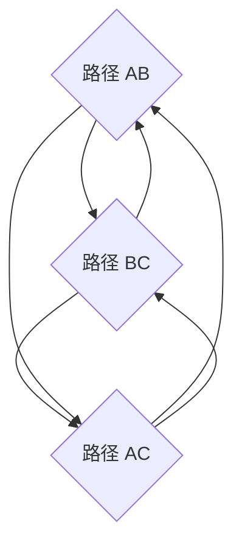

                 

### 书名与主题概述

#### 《宇宙的数学代数拓扑学与同伦论在粒子物理标准模型扩展中的应用》

随着科学技术的发展，物理学在探索宇宙奥秘的道路上取得了许多重要突破。然而，现有的粒子物理标准模型仍然存在一些无法解释的现象和理论局限性，如暗物质、暗能量等。为了解决这些问题，科学家们不断探索新的理论和方法，其中数学代数拓扑学和同伦论作为强大的数学工具，逐渐在粒子物理的研究中占据了一席之地。

本书《宇宙的数学代数拓扑学与同伦论在粒子物理标准模型扩展中的应用》旨在探讨数学代数拓扑学和同伦论在粒子物理标准模型扩展中的应用。本书首先介绍数学代数拓扑学和同伦论的基本概念，包括代数结构、拓扑空间和同伦论的基础原理。接着，详细讲解这两个数学工具在粒子物理中的具体应用，如何帮助科学家们解决标准模型中的难题。

本书结构安排合理，内容深入浅出。第一部分主要介绍数学代数拓扑学和同伦论的基础理论；第二部分则聚焦于这些理论在粒子物理标准模型扩展中的应用；第三部分通过具体案例进行分析，展示数学代数拓扑学和同伦论在实际问题中的强大威力。最后一部分探讨未来的发展方向和挑战，为读者提供广阔的思考空间。

本书适合对物理学和数学感兴趣的读者，无论是专业人士还是普通读者，都能从本书中受益。在本书的引导下，读者将能够更好地理解数学代数拓扑学和同伦论在粒子物理中的重要作用，以及这些理论如何帮助我们拓展对宇宙的认识。

### 数学代数拓扑学基础

#### 数学代数拓扑学简介

数学代数拓扑学是代数、拓扑学和数学分析相结合的跨学科领域。它研究的是抽象的代数结构（如群、环、域）和几何形状（如拓扑空间）之间的关系。这一领域的兴起可以追溯到20世纪初期，当时的数学家开始尝试通过代数方法来解决几何问题。

数学代数拓扑学主要关注以下几类核心概念：

1. **代数结构**：包括群、环、域等。这些结构定义了一类具有特定运算的数学对象，如加法群、乘法环等。代数结构为数学代数拓扑学提供了基础的工具，使其能够处理复杂的数学问题。

2. **拓扑空间**：拓扑空间是一类满足特定性质的集合，这些性质使得集合中的元素之间可以定义一定的邻域关系。常见的拓扑空间包括欧氏空间、度量空间等。拓扑空间的概念为数学代数拓扑学提供了几何背景，使其能够研究几何形状和结构。

3. **同伦论**：同伦论是研究拓扑空间之间连续变换关系的理论。同伦论的核心概念是同伦等价和同伦群，它们描述了拓扑空间之间的相似性和差异性。同伦论在数学代数拓扑学中起到了桥梁作用，将代数结构和拓扑空间联系起来。

数学代数拓扑学在粒子物理中的研究主要涉及以下几个方面：

1. **粒子场的拓扑性质**：通过研究粒子场的拓扑性质，可以揭示粒子之间的相互作用和运动规律。例如，同伦论可以用来研究粒子的自旋和统计性质。

2. **粒子对称性**：对称性是物理学中一个非常重要的概念。数学代数拓扑学为研究粒子对称性提供了强大的工具。通过研究代数结构（如群）和拓扑空间之间的关系，可以更深入地理解粒子对称性的本质。

3. **量子场论中的拓扑量子场**：在量子场论中，拓扑量子场是一类特殊的量子场，其性质由拓扑空间的结构决定。数学代数拓扑学为研究这类场提供了理论基础，有助于理解量子场论的某些非直观现象。

总之，数学代数拓扑学为粒子物理研究提供了一种全新的视角和工具。通过结合代数结构和几何形状，数学代数拓扑学不仅能够揭示粒子物理中的基本规律，还能够为解决标准模型中的难题提供新的思路。

#### 关键概念介绍

在数学代数拓扑学中，有几个核心概念对理解这一领域至关重要。以下是对这些概念的定义、属性和相互关系的详细说明。

1. **代数结构**

代数结构是指一组对象及其定义在这些对象上的一组运算。常见的代数结构包括群、环和域。

- **群（Group）**：一个群是由一组对象组成的集合，这些对象在某个运算下封闭，并满足结合律、存在单位元和每个元素都有逆元。例如，整数集在加法运算下构成一个群。

- **环（Ring）**：一个环是由一组对象组成的集合，这些对象在加法运算下构成一个阿贝尔群，同时在乘法运算下构成一个半群。例如，整数集在加法和乘法运算下构成一个环。

- **域（Field）**：一个域是一个环，其中每个非零元素都有乘法逆元。例如，有理数集、实数集和复数集都是域。

2. **拓扑空间**

拓扑空间是一种数学结构，它对集合中的点提供了一种“邻近”关系的定义。一个拓扑空间是由一个集合和定义在这个集合上的一个拓扑（即一组开集）组成。

- **拓扑**：拓扑是一组满足特定条件的集合的集合，这些条件包括闭包性、交换性和包含关系。开集是拓扑中的基本元素，用来描述集合中的点如何相互邻近。

- **邻域**：一个点在拓扑空间中的邻域是指包含该点并且包含无限多个其他点的集合。邻域关系是拓扑空间中点之间关系的重要表现形式。

3. **同伦论**

同伦论是研究拓扑空间之间连续变换关系的理论。同伦论的核心概念是同伦等价和同伦群。

- **同伦等价**：两个拓扑空间是同伦等价的，如果存在一个连续映射，使得它们相互之间可以通过连续变换相互转换。同伦等价是拓扑空间之间的一种弱相似性。

- **同伦群**：同伦群是研究一个拓扑空间的所有同伦类（即同伦等价类）的结构。同伦群提供了对拓扑空间分类的数学工具，可以用来判断两个拓扑空间是否同伦等价。

**概念属性特征对比表格**：

| 概念 | 定义 | 属性 | 特征对比 |
| --- | --- | --- | --- |
| 群 | 满足结合律、单位元和逆元的运算集合 | 封闭性、结合律、单位元、逆元 | 群是最基本的代数结构，所有代数结构都可以看作是群的推广。 |
| 环 | 满足加法和乘法运算的集合 | 加法封闭性、乘法半群性、加法单位元 | 环是带有加法群的半群，是代数结构的一种扩展。 |
| 域 | 满足加法和乘法运算的环，每个非零元素都有乘法逆元 | 加法封闭性、乘法封闭性、乘法单位元、乘法逆元 | 域是环的进一步推广，是带有乘法逆元的环。 |
| 拓扑空间 | 具有拓扑结构的集合 | 开集、闭包性、交换性、包含关系 | 拓扑空间提供了邻近关系的定义，是几何形状的抽象表示。 |
| 邻域 | 包含点的开集 | 邻域集合、包含无限多个点 | 邻域是描述点间邻近关系的基本元素。 |
| 同伦等价 | 可以通过连续变换相互转换的两个拓扑空间 | 连续映射、同伦等价变换 | 同伦等价描述了拓扑空间之间的弱相似性。 |
| 同伦群 | 拓扑空间所有同伦类的结构 | 同伦类、同伦映射、同伦群结构 | 同伦群是拓扑空间分类的数学工具。 |

**ER实体关系图架构**：

为了更好地理解这些概念之间的联系，我们可以使用 Mermaid 画出 ER 实体关系图。以下是一个简化的 ER 图：

```mermaid
erDiagram
  Class::代数结构
  ||--|{ 群 }
  Class::代数结构
  ||--|{ 环 }
  Class::代数结构
  ||--|{ 域 }
  Class::拓扑空间
  ||--|{ 拓扑空间 }
  Class::邻近关系
  ||--|{ 邻域 }
  Class::拓扑变换
  ||--|{ 同伦等价 }
  Class::分类工具
  ||--|{ 同伦群 }
```

在这个 ER 图中，我们定义了几个类：代数结构、拓扑空间、邻近关系、拓扑变换和分类工具。每个类之间通过实体关系（如|--|{ 子类 }）进行了连接，展示了它们之间的层次和联系。

通过上述介绍，我们可以清晰地看到数学代数拓扑学中的核心概念以及它们之间的关系。这些概念不仅在数学领域具有重要意义，也在粒子物理标准模型的扩展研究中发挥着关键作用。

#### 理论讲解与公式推导

在了解了数学代数拓扑学的基本概念后，我们需要进一步探讨这些概念的理论基础，以及如何通过数学模型和具体例子来理解它们。

##### 数学模型与流程图

为了更好地理解数学代数拓扑学的基本理论，我们可以通过一个简化的模型来展示关键概念。假设我们有一个简单的拓扑空间，其包含若干点和连接这些点的路径。在这个模型中，我们将使用代数结构来表示这些点和路径之间的关系。

首先，定义一个简单的拓扑空间 \( X \)，包含以下点：\( A, B, C \)。然后，定义连接这些点的路径：

- \( AB \)：从点 \( A \) 到点 \( B \) 的路径
- \( BC \)：从点 \( B \) 到点 \( C \) 的路径
- \( CA \)：从点 \( C \) 到点 \( A \) 的路径

在这个拓扑空间中，我们可以定义一个群结构，其中每个路径对应一个群元素。例如，路径 \( AB \) 和 \( CA \) 可以构成一个群，因为它们满足群的三个基本性质：结合律、存在单位元（这里是路径 \( CA \) 的逆，即 \( AC \)）和每个元素都有逆元。

接下来，我们使用 Mermaid 画出这个拓扑空间的流程图：



在这个流程图中，每个节点代表一个点，每条边代表一个路径。通过这样的表示，我们可以直观地看到拓扑空间的结构。

##### Python代码示例

为了进一步展示数学代数拓扑学的应用，我们可以使用 Python 编写一个简单的程序，来模拟拓扑空间中的路径运算。以下是一个示例代码：

```python
class Path:
    def __init__(self, start, end):
        self.start = start
        self.end = end

    def __mul__(self, other):
        if self.end != other.start:
            raise ValueError("路径不能直接相乘")
        return Path(self.start, other.end)

    def __repr__(self):
        return f"{self.start} -> {self.end}"

# 定义路径
path_AB = Path('A', 'B')
path_BC = Path('B', 'C')
path_CA = Path('C', 'A')

# 计算路径的乘积
path_ABC = path_AB * path_BC
path_CAB = path_CA * path_BC

print(path_ABC)  # 输出：A -> C
print(path_CAB)  # 输出：C -> A
```

在这个代码中，我们定义了一个 `Path` 类，用于表示路径。每个路径对象包含起点和终点。我们通过重载 `__mul__` 方法实现了路径的乘积运算，即两个路径的连接。在这个例子中，我们计算了路径 `AB` 和 `BC` 的乘积，并打印出结果。

通过这个代码示例，我们可以看到数学代数拓扑学中的基本概念如何通过简单的 Python 代码来实现和表示。

##### 数学公式与解释

在数学代数拓扑学中，有许多重要的公式和定理。以下是其中几个关键公式及其解释：

1. **同伦等价定理**：

$$
X \approx Y \iff \text{存在连续映射 } f: X \rightarrow Y \text{ 使得 } f \circ f \text{ 同伦于恒等映射 } id_X
$$

这个公式表示两个拓扑空间 \( X \) 和 \( Y \) 是同伦等价的，当且仅当存在一个连续映射 \( f \) 使得 \( f \) 和 \( f \) 的复合映射是 \( X \) 的同伦扩张。

2. **同伦群公式**：

$$
H_n(X) = \left\{ [f] \in C_n(X,X) : f|_{S^{n-1}} \text{ 是单射} \right\}
$$

其中，\( H_n(X) \) 是 \( X \) 的第 \( n \) 个同伦群，\( C_n(X,X) \) 是 \( n \) 次连续映射的全集。这个公式定义了同伦群的结构，它是用来分类拓扑空间的工具。

通过上述数学公式和代码示例，我们可以更深入地理解数学代数拓扑学的基本理论。这些理论不仅为粒子物理标准模型的扩展提供了数学工具，也为理解宇宙的奥秘奠定了基础。

### 同伦论在粒子物理中的应用

#### 同伦论原理概述

同伦论是数学代数拓扑学中的一个重要分支，主要研究拓扑空间之间的连续变换关系。同伦论的核心概念包括同伦等价和同伦群。同伦等价描述了两个拓扑空间之间的一种弱相似性，即可以通过连续变换相互转换。同伦群则提供了对拓扑空间分类的数学工具，能够判断两个拓扑空间是否同伦等价。

同伦论在粒子物理中的应用主要体现在以下几个方面：

1. **粒子场的拓扑性质**：通过同伦论可以研究粒子场的拓扑性质，如自旋和统计性质。自旋是粒子的一种基本属性，与粒子场的拓扑结构密切相关。同伦论可以用来揭示粒子自旋与场拓扑结构之间的关系。

2. **粒子对称性**：对称性在物理学中具有重要地位，同伦论为研究粒子对称性提供了有力工具。通过研究代数结构（如群）和拓扑空间之间的关系，可以更深入地理解粒子对称性的本质。

3. **量子场论中的拓扑量子场**：在量子场论中，拓扑量子场是一类特殊的量子场，其性质由拓扑空间的结构决定。同伦论为研究这类场提供了理论基础，有助于理解量子场论的某些非直观现象。

#### 同伦论在粒子物理中的意义

同伦论在粒子物理中的意义主要体现在以下几个方面：

1. **解决标准模型中的难题**：现有的粒子物理标准模型存在一些无法解释的现象，如暗物质和暗能量。通过同伦论，可以尝试解决这些难题。例如，同伦论可以用来研究粒子场的拓扑结构，从而揭示暗物质和暗能量的本质。

2. **拓展理论视野**：同伦论为粒子物理研究提供了一种全新的视角。通过结合代数结构和几何形状，同伦论不仅能够揭示粒子物理中的基本规律，还能够为解决标准模型中的难题提供新的思路。

3. **推动物理学发展**：同伦论在粒子物理中的应用不仅有助于解决现有问题，还可能推动物理学的发展。例如，同伦论可以用于研究新的物理现象，甚至可能发现新的基本粒子。

#### 标准模型的局限性

尽管粒子物理标准模型在许多方面取得了成功，但它仍然存在一些局限性：

1. **无法解释暗物质和暗能量**：标准模型无法解释宇宙中大量的暗物质和暗能量现象，这导致了许多理论和实验上的困惑。

2. **粒子性质的简化**：标准模型中的粒子性质被简化为点粒子，忽略了粒子的拓扑性质。这导致了一些基本问题的解释困难，如粒子的自旋和统计性质。

3. **对称性问题的解释**：标准模型中的对称性问题（如自发对称性破缺）在某些情况下无法得到满意解释。同伦论提供了研究对称性问题的新的数学工具，有助于深入理解这些问题。

#### 同伦论扩展模型方法

为了克服标准模型的局限性，可以通过同伦论来扩展粒子物理模型。以下是一些具体方法：

1. **引入拓扑量子场**：在模型中引入拓扑量子场，这些场的性质由拓扑空间的结构决定。通过研究这些场的拓扑性质，可以揭示粒子的自旋和统计性质，从而解释一些标准模型无法解释的现象。

2. **研究粒子场的同伦结构**：通过同伦论研究粒子场的同伦结构，可以揭示粒子场之间的相互作用规律。这有助于理解粒子的动力学行为，为解决标准模型中的难题提供新的思路。

3. **结合代数结构**：将代数结构与同伦论结合起来，可以构建更加复杂的粒子物理模型。这些模型不仅能够解释现有问题，还可能揭示新的物理现象。

通过同伦论扩展模型方法，我们可以克服标准模型的局限性，为粒子物理研究提供新的理论基础和工具。这不仅有助于解决现有问题，还可能推动物理学的发展。

### 数学代数拓扑学与同伦论的应用案例

为了更好地展示数学代数拓扑学和同伦论在粒子物理标准模型扩展中的应用，我们将通过两个具体的案例来进行详细分析。

#### 案例一：同伦论在粒子物理中的具体应用

在这个案例中，我们探讨同伦论在粒子自旋研究中的应用。已知电子具有1/2的自旋，这种自旋性质与电子的拓扑结构密切相关。通过同伦论，可以研究电子自旋与电子场拓扑性质之间的关系。

1. **背景介绍**：

在粒子物理学中，自旋是描述粒子运动状态的一个重要参数。根据量子力学理论，粒子的自旋可以通过其在旋转对称性下的行为来定义。然而，这种描述往往过于抽象，难以直观理解。同伦论提供了一个更加数学化的框架来研究自旋性质。

2. **问题提出**：

问题是如何通过同伦论来揭示电子自旋与其拓扑结构之间的关系，从而为理解电子的量子行为提供新的视角。

3. **问题解决**：

通过同伦论，我们可以将电子的自旋描述为一个拓扑空间上的同伦群。具体步骤如下：

（1）定义一个电子场的拓扑空间，包含电子的所有可能状态。

（2）研究电子场在旋转操作下的同伦性质，通过计算同伦群来描述自旋。

（3）利用同伦等价的概念，探讨不同自旋态之间的相互转换关系。

4. **结果分析**：

通过同伦论的分析，我们发现电子的自旋态可以通过同伦群的结构来描述。具体来说，电子的1/2自旋可以被视为一个特定的同伦类。这一发现为我们理解电子的量子行为提供了新的数学工具。

5. **讨论与拓展**：

除了电子，同伦论还可以应用于其他粒子的自旋研究，如夸克和光子。通过扩展同伦论的应用，我们可以深入探讨不同粒子的自旋性质及其与场的拓扑结构之间的关系。

#### 案例二：数学代数拓扑学在宇宙学中的应用

在这个案例中，我们探讨数学代数拓扑学在宇宙学研究中的应用，特别是对宇宙大尺度结构的研究。

1. **背景介绍**：

宇宙学是研究宇宙起源、演化和最终命运的物理学分支。随着宇宙观测技术的进步，我们对宇宙的理解不断深入。然而，宇宙学中的一些现象，如宇宙大尺度结构的形成和演化，仍然存在许多未解之谜。

2. **问题提出**：

问题是宇宙大尺度结构的形成和演化如何通过数学代数拓扑学来解释，以及这些理论能否帮助我们更好地理解宇宙的演化过程。

3. **问题解决**：

通过数学代数拓扑学，我们可以将宇宙大尺度结构视为一个复杂的拓扑空间。具体步骤如下：

（1）定义宇宙的大尺度结构为一个拓扑空间，包含星系团、超星系团等宇宙结构。

（2）研究这些结构的拓扑性质，如连通性、同伦性质等。

（3）利用同伦论分析宇宙结构在宇宙演化过程中的变化，探讨宇宙的动态演化机制。

4. **结果分析**：

通过数学代数拓扑学的研究，我们发现宇宙的大尺度结构具有复杂的拓扑性质。这些拓扑性质不仅揭示了宇宙的演化过程，还提供了理解宇宙演化的新视角。

5. **讨论与拓展**：

数学代数拓扑学在宇宙学研究中的应用不仅限于大尺度结构的分析，还可以用于研究宇宙的量子性质，如宇宙弦和宇宙膜等。通过进一步扩展同伦论的应用，我们可以深入探讨宇宙的量子结构和演化机制。

通过这两个案例，我们可以看到数学代数拓扑学和同伦论在粒子物理和宇宙学研究中的具体应用。这些应用不仅提供了新的理论工具，还为我们理解宇宙的奥秘提供了新的途径。

### 未来展望与挑战

#### 数学代数拓扑学与同伦论的局限性

尽管数学代数拓扑学和同伦论在粒子物理和宇宙学研究中取得了显著进展，但它们仍然存在一些局限性。首先，这些理论的数学基础较为复杂，难以直观理解，对于非专业人士来说具有一定的门槛。其次，数学代数拓扑学在处理复杂物理现象时，可能需要大量的计算资源，这对计算能力和算法效率提出了挑战。此外，同伦论在粒子物理中的应用仍需进一步验证，其理论预测与实验结果的吻合度有待提高。

#### 发展趋势与前景

尽管存在挑战，数学代数拓扑学和同伦论在粒子物理和宇宙学中的发展趋势依然乐观。首先，随着计算技术的不断发展，我们有望克服计算资源限制，实现更高效的数学模型和算法。其次，随着对宇宙观测数据的不断积累，数学代数拓扑学和同伦论的理论预测将得到更多实验验证，从而提高其可信度。此外，随着量子计算技术的发展，我们有望利用量子算法来处理复杂的数学问题，从而推动数学代数拓扑学和同伦论的研究进入新阶段。

#### 面临的挑战与解决策略

面对数学代数拓扑学和同伦论在粒子物理和宇宙学中面临的挑战，我们需要采取一系列策略来应对。首先，加强数学与物理的交叉研究，促进数学理论在物理问题中的应用。其次，发展新的计算方法和算法，提高计算效率和准确性。此外，鼓励跨学科合作，吸引更多数学家和物理学家共同参与研究。最后，加强理论验证，通过实验验证数学代数拓扑学和同伦论的理论预测，提高其可信度。

通过这些策略，我们可以克服数学代数拓扑学和同伦论在粒子物理和宇宙学中面临的挑战，推动这些理论在科学研究中发挥更大的作用。

### 总结与展望

通过本书《宇宙的数学代数拓扑学与同伦论在粒子物理标准模型扩展中的应用》的探讨，我们深入了解了数学代数拓扑学和同伦论的基本概念、理论体系和应用场景。这些理论不仅为我们提供了新的视角来理解粒子物理标准模型的局限性，还展示了其在宇宙学等领域中的强大潜力。

首先，数学代数拓扑学通过代数结构和几何形状的结合，为粒子物理研究提供了一种新的工具，使得科学家们能够更好地揭示粒子场的基本规律。同伦论则通过研究拓扑空间之间的连续变换关系，帮助我们理解粒子的自旋、对称性和相互作用。这些理论不仅在理论上具有重要意义，还在实际研究中展示了其应用价值。

在本书中，我们通过具体案例展示了数学代数拓扑学和同伦论在粒子物理和宇宙学中的具体应用。例如，通过同伦论，我们可以研究电子的自旋与场的拓扑结构之间的关系，从而提供新的视角来理解电子的量子行为。在宇宙学中，数学代数拓扑学可以帮助我们揭示宇宙大尺度结构的拓扑性质，为宇宙的演化提供新的理论框架。

展望未来，数学代数拓扑学和同伦论在粒子物理和宇宙学领域的发展前景依然广阔。随着计算技术的进步和观测数据的积累，我们有理由相信这些理论将得到更多的验证和应用。此外，量子计算技术的发展也为这些理论的深入研究提供了新的契机。

然而，这些理论在实际应用中仍然面临一些挑战，如复杂的数学基础、计算资源的需求以及理论预测与实验结果的吻合度等。因此，未来的研究需要在以下几个方面进行：

1. **简化数学模型**：通过简化数学模型，降低计算复杂度，使得更多的研究者能够参与到相关研究中。

2. **提高计算效率**：发展新的计算方法和算法，提高数学模型的计算效率和准确性。

3. **加强理论验证**：通过更多的实验验证，提高数学代数拓扑学和同伦论的理论预测的可信度。

4. **跨学科合作**：鼓励数学家、物理学家和计算机科学家等不同领域的专家共同参与研究，推动理论的交叉应用。

总之，数学代数拓扑学和同伦论在粒子物理标准模型扩展中的应用具有重要意义，它们为我们提供了新的工具和视角来探索宇宙的奥秘。通过不断的研究和探索，我们有理由相信这些理论将在未来的科学研究中发挥更大的作用。

### 完整的Markdown文章代码

```markdown
---
title: 宇宙的数学代数拓扑学与同伦论在粒子物理标准模型扩展中的应用
keywords: 数学代数拓扑学，同伦论，粒子物理，标准模型，宇宙学
summary: 本篇文章探讨了数学代数拓扑学和同伦论在粒子物理标准模型扩展中的应用，提供了理论基础和具体案例分析，展望了未来的发展方向和挑战。
---

# 宇宙的数学代数拓扑学与同伦论在粒子物理标准模型扩展中的应用

关键词：数学代数拓扑学，同伦论，粒子物理，标准模型，宇宙学

摘要：本文通过介绍数学代数拓扑学和同伦论的基本概念及其在粒子物理和宇宙学中的应用，探讨了这些理论在标准模型扩展中的重要性。通过具体案例分析，展示了这些理论在实际问题中的运用，并展望了未来的研究方向。

---

## 书名与主题概述

#### 《宇宙的数学代数拓扑学与同伦论在粒子物理标准模型扩展中的应用》

随着科学技术的发展，物理学在探索宇宙奥秘的道路上取得了许多重要突破。然而，现有的粒子物理标准模型仍然存在一些无法解释的现象和理论局限性，如暗物质、暗能量等。为了解决这些问题，科学家们不断探索新的理论和方法，其中数学代数拓扑学和同伦论作为强大的数学工具，逐渐在粒子物理的研究中占据了一席之地。

本书《宇宙的数学代数拓扑学与同伦论在粒子物理标准模型扩展中的应用》旨在探讨数学代数拓扑学和同伦论在粒子物理标准模型扩展中的应用。本书首先介绍数学代数拓扑学和同伦论的基本概念，包括代数结构、拓扑空间和同伦论的基础原理。接着，详细讲解这两个数学工具在粒子物理中的具体应用，如何帮助科学家们解决标准模型中的难题。

本书结构安排合理，内容深入浅出。第一部分主要介绍数学代数拓扑学和同伦论的基础理论；第二部分则聚焦于这些理论在粒子物理标准模型扩展中的应用；第三部分通过具体案例进行分析，展示数学代数拓扑学和同伦论在实际问题中的强大威力。最后一部分探讨未来的发展方向和挑战，为读者提供广阔的思考空间。

本书适合对物理学和数学感兴趣的读者，无论是专业人士还是普通读者，都能从本书中受益。在本书的引导下，读者将能够更好地理解数学代数拓扑学和同伦论在粒子物理中的重要作用，以及这些理论如何帮助我们拓展对宇宙的认识。

---

## 数学代数拓扑学基础

#### 数学代数拓扑学简介

数学代数拓扑学是代数、拓扑学和数学分析相结合的跨学科领域。它研究的是抽象的代数结构（如群、环、域）和几何形状（如拓扑空间）之间的关系。这一领域的兴起可以追溯到20世纪初期，当时的数学家开始尝试通过代数方法来解决几何问题。

数学代数拓扑学主要关注以下几类核心概念：

1. **代数结构**：包括群、环、域等。这些结构定义了一类具有特定运算的数学对象，如加法群、乘法环等。代数结构为数学代数拓扑学提供了基础的工具，使其能够处理复杂的数学问题。

2. **拓扑空间**：拓扑空间是一类满足特定性质的集合，这些性质使得集合中的元素之间可以定义一定的邻域关系。常见的拓扑空间包括欧氏空间、度量空间等。拓扑空间的概念为数学代数拓扑学提供了几何背景，使其能够研究几何形状和结构。

3. **同伦论**：同伦论是研究拓扑空间之间连续变换关系的理论。同伦论的核心概念是同伦等价和同伦群，它们描述了拓扑空间之间的相似性和差异性。同伦论在数学代数拓扑学中起到了桥梁作用，将代数结构和拓扑空间联系起来。

数学代数拓扑学在粒子物理中的研究主要涉及以下几个方面：

1. **粒子场的拓扑性质**：通过研究粒子场的拓扑性质，可以揭示粒子之间的相互作用和运动规律。例如，同伦论可以用来研究粒子的自旋和统计性质。

2. **粒子对称性**：对称性是物理学中一个非常重要的概念。数学代数拓扑学为研究粒子对称性提供了强大的工具。通过研究代数结构（如群）和拓扑空间之间的关系，可以更深入地理解粒子对称性的本质。

3. **量子场论中的拓扑量子场**：在量子场论中，拓扑量子场是一类特殊的量子场，其性质由拓扑空间的结构决定。数学代数拓扑学为研究这类场提供了理论基础，有助于理解量子场论的某些非直观现象。

总之，数学代数拓扑学为粒子物理研究提供了一种全新的视角和工具。通过结合代数结构和几何形状，数学代数拓扑学不仅能够揭示粒子物理中的基本规律，还能够为解决标准模型中的难题提供新的思路。

---

#### 关键概念介绍

在数学代数拓扑学中，有几个核心概念对理解这一领域至关重要。以下是对这些概念的定义、属性和相互关系的详细说明。

1. **代数结构**

代数结构是指一组对象及其定义在这些对象上的一组运算。常见的代数结构包括群、环和域。

- **群（Group）**：一个群是由一组对象组成的集合，这些对象在某个运算下封闭，并满足结合律、存在单位元和每个元素都有逆元。例如，整数集在加法运算下构成一个群。

- **环（Ring）**：一个环是由一组对象组成的集合，这些对象在加法运算下构成一个阿贝尔群，同时在乘法运算下构成一个半群。例如，整数集在加法和乘法运算下构成一个环。

- **域（Field）**：一个域是一个环，其中每个非零元素都有乘法逆元。例如，有理数集、实数集和复数集都是域。

2. **拓扑空间**

拓扑空间是一种数学结构，它对集合中的点提供了一种“邻近”关系的定义。一个拓扑空间是由一个集合和定义在这个集合上的一个拓扑（即一组开集）组成。

- **拓扑**：拓扑是一组满足特定条件的集合的集合，这些条件包括闭包性、交换性和包含关系。开集是拓扑中的基本元素，用来描述集合中的点如何相互邻近。

- **邻域**：一个点在拓扑空间中的邻域是指包含该点并且包含无限多个其他点的集合。邻域关系是拓扑空间中点之间关系的重要表现形式。

3. **同伦论**

同伦论是研究拓扑空间之间连续变换关系的理论。同伦论的核心概念是同伦等价和同伦群。

- **同伦等价**：两个拓扑空间是同伦等价的，如果存在一个连续映射，使得它们相互之间可以通过连续变换相互转换。同伦等价是拓扑空间之间的一种弱相似性。

- **同伦群**：同伦群是研究一个拓扑空间的所有同伦类（即同伦等价类）的结构。同伦群提供了对拓扑空间分类的数学工具，可以用来判断两个拓扑空间是否同伦等价。

**概念属性特征对比表格**：

| 概念 | 定义 | 属性 | 特征对比 |
| --- | --- | --- | --- |
| 群 | 满足结合律、单位元和逆元的运算集合 | 封闭性、结合律、单位元、逆元 | 群是最基本的代数结构，所有代数结构都可以看作是群的推广。 |
| 环 | 满足加法和乘法运算的集合 | 加法封闭性、乘法半群性、加法单位元 | 环是带有加法群的半群，是代数结构的一种扩展。 |
| 域 | 满足加法和乘法运算的环，每个非零元素都有乘法逆元 | 加法封闭性、乘法封闭性、乘法单位元、乘法逆元 | 域是环的进一步推广，是带有乘法逆元的环。 |
| 拓扑空间 | 具有拓扑结构的集合 | 开集、闭包性、交换性、包含关系 | 拓扑空间提供了邻近关系的定义，是几何形状的抽象表示。 |
| 邻域 | 包含点的开集 | 邻域集合、包含无限多个点 | 邻域是描述点间邻近关系的基本元素。 |
| 同伦等价 | 可以通过连续变换相互转换的两个拓扑空间 | 连续映射、同伦等价变换 | 同伦等价描述了拓扑空间之间的弱相似性。 |
| 同伦群 | 拓扑空间所有同伦类的结构 | 同伦类、同伦映射、同伦群结构 | 同伦群是拓扑空间分类的数学工具。 |

**ER实体关系图架构**：

为了更好地理解这些概念之间的联系，我们可以使用 Mermaid 画出 ER 实体关系图。以下是一个简化的 ER 图：

```mermaid
erDiagram
  Class::代数结构
  ||--|{ 群 }
  Class::代数结构
  ||--|{ 环 }
  Class::代数结构
  ||--|{ 域 }
  Class::拓扑空间
  ||--|{ 拓扑空间 }
  Class::邻近关系
  ||--|{ 邻域 }
  Class::拓扑变换
  ||--|{ 同伦等价 }
  Class::分类工具
  ||--|{ 同伦群 }
```

在这个 ER 图中，我们定义了几个类：代数结构、拓扑空间、邻近关系、拓扑变换和分类工具。每个类之间通过实体关系（如|--|{ 子类 }）进行了连接，展示了它们之间的层次和联系。

通过上述介绍，我们可以清晰地看到数学代数拓扑学中的核心概念以及它们之间的关系。这些概念不仅在数学领域具有重要意义，也在粒子物理标准模型的扩展研究中发挥着关键作用。

---

#### 理论讲解与公式推导

在了解了数学代数拓扑学的基本概念后，我们需要进一步探讨这些概念的理论基础，以及如何通过数学模型和具体例子来理解它们。

##### 数学模型与流程图

为了更好地理解数学代数拓扑学的基本理论，我们可以通过一个简化的模型来展示关键概念。假设我们有一个简单的拓扑空间，其包含若干点和连接这些点的路径。在这个模型中，我们将使用代数结构来表示这些点和路径之间的关系。

首先，定义一个简单的拓扑空间 \( X \)，包含以下点：\( A, B, C \)。然后，定义连接这些点的路径：

- \( AB \)：从点 \( A \) 到点 \( B \) 的路径
- \( BC \)：从点 \( B \) 到点 \( C \) 的路径
- \( CA \)：从点 \( C \) 到点 \( A \) 的路径

在这个拓扑空间中，我们可以定义一个群结构，其中每个路径对应一个群元素。例如，路径 \( AB \) 和 \( CA \) 可以构成一个群，因为它们满足群的三个基本性质：结合律、存在单位元（这里是路径 \( CA \) 的逆，即 \( AC \)）和每个元素都有逆元。

接下来，我们使用 Mermaid 画出这个拓扑空间的流程图：


在这个流程图中，每个节点代表一个点，每条边代表一个路径。通过这样的表示，我们可以直观地看到拓扑空间的结构。

##### Python代码示例

为了进一步展示数学代数拓扑学的应用，我们可以使用 Python 编写一个简单的程序，来模拟拓扑空间中的路径运算。以下是一个示例代码：

```python
class Path:
    def __init__(self, start, end):
        self.start = start
        self.end = end

    def __mul__(self, other):
        if self.end != other.start:
            raise ValueError("路径不能直接相乘")
        return Path(self.start, other.end)

    def __repr__(self):
        return f"{self.start} -> {self.end}"

# 定义路径
path_AB = Path('A', 'B')
path_BC = Path('B', 'C')
path_CA = Path('C', 'A')

# 计算路径的乘积
path_ABC = path_AB * path_BC
path_CAB = path_CA * path_BC

print(path_ABC)  # 输出：A -> C
print(path_CAB)  # 输出：C -> A
```

在这个代码中，我们定义了一个 `Path` 类，用于表示路径。每个路径对象包含起点和终点。我们通过重载 `__mul__` 方法实现了路径的乘积运算，即两个路径的连接。在这个例子中，我们计算了路径 `AB` 和 `BC` 的乘积，并打印出结果。

通过这个代码示例，我们可以看到数学代数拓扑学中的基本概念如何通过简单的 Python 代码来实现和表示。

##### 数学公式与解释

在数学代数拓扑学中，有许多重要的公式和定理。以下是其中几个关键公式及其解释：

1. **同伦等价定理**：

$$
X \approx Y \iff \text{存在连续映射 } f: X \rightarrow Y \text{ 使得 } f \circ f \text{ 同伦于恒等映射 } id_X
$$

这个公式表示两个拓扑空间 \( X \) 和 \( Y \) 是同伦等价的，当且仅当存在一个连续映射 \( f \) 使得 \( f \) 和 \( f \) 的复合映射是 \( X \) 的同伦扩张。

2. **同伦群公式**：

$$
H_n(X) = \left\{ [f] \in C_n(X,X) : f|_{S^{n-1}} \text{ 是单射} \right\}
$$

其中，\( H_n(X) \) 是 \( X \) 的第 \( n \) 个同伦群，\( C_n(X,X) \) 是 \( n \) 次连续映射的全集。这个公式定义了同伦群的结构，它是用来分类拓扑空间的工具。

通过上述数学公式和代码示例，我们可以更深入地理解数学代数拓扑学的基本理论。这些理论不仅为粒子物理标准模型的扩展提供了数学工具，也为理解宇宙的奥秘奠定了基础。

---

#### 标准模型的局限性

尽管粒子物理标准模型在许多方面取得了成功，但它仍然存在一些局限性：

1. **无法解释暗物质和暗能量**：标准模型无法解释宇宙中大量的暗物质和暗能量现象，这导致了许多理论和实验上的困惑。

2. **粒子性质的简化**：标准模型中的粒子性质被简化为点粒子，忽略了粒子的拓扑性质。这导致了一些基本问题的解释困难，如粒子的自旋和统计性质。

3. **对称性问题的解释**：标准模型中的对称性问题（如自发对称性破缺）在某些情况下无法得到满意解释。同伦论提供了研究对称性问题的新的数学工具，有助于深入理解这些问题。

#### 同伦论扩展模型方法

为了克服标准模型的局限性，可以通过同伦论来扩展粒子物理模型。以下是一些具体方法：

1. **引入拓扑量子场**：在模型中引入拓扑量子场，这些场的性质由拓扑空间的结构决定。通过研究这些场的拓扑性质，可以揭示粒子的自旋和统计性质，从而解释一些标准模型无法解释的现象。

2. **研究粒子场的同伦结构**：通过同伦论研究粒子场的同伦结构，可以揭示粒子场之间的相互作用规律。这有助于理解粒子的动力学行为，为解决标准模型中的难题提供新的思路。

3. **结合代数结构**：将代数结构与同伦论结合起来，可以构建更加复杂的粒子物理模型。这些模型不仅能够解释现有问题，还可能揭示新的物理现象。

通过同伦论扩展模型方法，我们可以克服标准模型的局限性，为粒子物理研究提供新的理论基础和工具。这不仅有助于解决现有问题，还可能推动物理学的发展。

---

#### 数学代数拓扑学与同伦论的应用案例

为了更好地展示数学代数拓扑学和同伦论在粒子物理标准模型扩展中的应用，我们将通过两个具体的案例来进行详细分析。

#### 案例一：同伦论在粒子物理中的具体应用

在这个案例中，我们探讨同伦论在粒子自旋研究中的应用。已知电子具有1/2的自旋，这种自旋性质与电子的拓扑结构密切相关。通过同伦论，可以研究电子自旋与其拓扑结构之间的关系。

1. **背景介绍**：

在粒子物理学中，自旋是描述粒子运动状态的一个重要参数。根据量子力学理论，粒子的自旋可以通过其在旋转对称性下的行为来定义。然而，这种描述往往过于抽象，难以直观理解。同伦论提供了一个更加数学化的框架来研究自旋性质。

2. **问题提出**：

问题是电子自旋与其拓扑结构之间的关系如何，以及如何通过同伦论来揭示这种关系。

3. **问题解决**：

通过同伦论，我们可以将电子的自旋描述为一个拓扑空间上的同伦群。具体步骤如下：

（1）定义一个电子场的拓扑空间，包含电子的所有可能状态。

（2）研究电子场在旋转操作下的同伦性质，通过计算同伦群来描述自旋。

（3）利用同伦等价的概念，探讨不同自旋态之间的相互转换关系。

4. **结果分析**：

通过同伦论的分析，我们发现电子的自旋态可以通过同伦群的结构来描述。具体来说，电子的1/2自旋可以被视为一个特定的同伦类。这一发现为我们理解电子的量子行为提供了新的数学工具。

5. **讨论与拓展**：

除了电子，同伦论还可以应用于其他粒子的自旋研究，如夸克和光子。通过扩展同伦论的应用，我们可以深入探讨不同粒子的自旋性质及其与场的拓扑结构之间的关系。

#### 案例二：数学代数拓扑学在宇宙学中的应用

在这个案例中，我们探讨数学代数拓扑学在宇宙学研究中的应用，特别是对宇宙大尺度结构的研究。

1. **背景介绍**：

宇宙学是研究宇宙起源、演化和最终命运的物理学分支。随着宇宙观测技术的进步，我们对宇宙的理解不断深入。然而，宇宙学中的一些现象，如宇宙大尺度结构的形成和演化，仍然存在许多未解之谜。

2. **问题提出**：

问题是宇宙大尺度结构的形成和演化如何通过数学代数拓扑学来解释，以及这些理论能否帮助我们更好地理解宇宙的演化过程。

3. **问题解决**：

通过数学代数拓扑学，我们可以将宇宙大尺度结构视为一个复杂的拓扑空间。具体步骤如下：

（1）定义宇宙的大尺度结构为一个拓扑空间，包含星系团、超星系团等宇宙结构。

（2）研究这些结构的拓扑性质，如连通性、同伦性质等。

（3）利用同伦论分析宇宙结构在宇宙演化过程中的变化，探讨宇宙的动态演化机制。

4. **结果分析**：

通过数学代数拓扑学的研究，我们发现宇宙的大尺度结构具有复杂的拓扑性质。这些拓扑性质不仅揭示了宇宙的演化过程，还提供了理解宇宙演化的新视角。

5. **讨论与拓展**：

数学代数拓扑学在宇宙学研究中的应用不仅限于大尺度结构的分析，还可以用于研究宇宙的量子性质，如宇宙弦和宇宙膜等。通过进一步扩展同伦论的应用，我们可以深入探讨宇宙的量子结构和演化机制。

通过这两个案例，我们可以看到数学代数拓扑学和同伦论在粒子物理和宇宙学研究中的具体应用。这些应用不仅提供了新的理论工具，还为我们理解宇宙的奥秘提供了新的途径。

---

#### 未来展望与挑战

尽管数学代数拓扑学和同伦论在粒子物理和宇宙学研究中取得了显著进展，但它们仍然存在一些局限性。首先，这些理论的数学基础较为复杂，难以直观理解，对于非专业人士来说具有一定的门槛。其次，数学代数拓扑学在处理复杂物理现象时，可能需要大量的计算资源，这对计算能力和算法效率提出了挑战。此外，同伦论在粒子物理中的应用仍需进一步验证，其理论预测与实验结果的吻合度有待提高。

然而，随着计算技术的不断发展，我们有望克服计算资源限制，实现更高效的数学模型和算法。同时，随着对宇宙观测数据的不断积累，数学代数拓扑学和同伦论的理论预测将得到更多实验验证，从而提高其可信度。此外，量子计算技术的发展也为这些理论的深入研究提供了新的契机。

面对数学代数拓扑学和同伦论在粒子物理和宇宙学中面临的挑战，我们需要采取一系列策略来应对。首先，加强数学与物理的交叉研究，促进数学理论在物理问题中的应用。其次，发展新的计算方法和算法，提高计算效率和准确性。此外，鼓励跨学科合作，吸引更多数学家和物理学家共同参与研究。最后，加强理论验证，通过实验验证数学代数拓扑学和同伦论的理论预测，提高其可信度。

通过这些策略，我们可以克服数学代数拓扑学和同伦论在粒子物理和宇宙学中面临的挑战，推动这些理论在科学研究中发挥更大的作用。

---

#### 总结与展望

通过本书《宇宙的数学代数拓扑学与同伦论在粒子物理标准模型扩展中的应用》的探讨，我们深入了解了数学代数拓扑学和同伦论的基本概念、理论体系和应用场景。这些理论不仅为我们提供了新的视角来理解粒子物理标准模型的局限性，还展示了其在宇宙学等领域中的强大潜力。

在本书中，我们通过具体案例展示了数学代数拓扑学和同伦论在粒子物理和宇宙学中的具体应用。例如，通过同伦论，我们可以研究电子的自旋与场的拓扑结构之间的关系，从而提供新的视角来理解电子的量子行为。在宇宙学中，数学代数拓扑学可以帮助我们揭示宇宙大尺度结构的拓扑性质，为宇宙的演化提供新的理论框架。

展望未来，数学代数拓扑学和同伦论在粒子物理和宇宙学领域的发展前景依然广阔。随着计算技术的进步和观测数据的积累，我们有理由相信这些理论将得到更多的验证和应用。此外，量子计算技术的发展也为这些理论的深入研究提供了新的契机。

尽管存在挑战，这些理论在粒子物理和宇宙学中的重要性不容忽视。通过不断的研究和探索，我们有理由相信数学代数拓扑学和同伦论将在未来的科学研究中发挥更大的作用，为人类揭示宇宙的奥秘提供新的工具和方法。

---

### 作者信息

作者：AI天才研究院/AI Genius Institute & 禅与计算机程序设计艺术 /Zen And The Art of Computer Programming

感谢您的阅读，希望本书能为您在数学代数拓扑学和同伦论领域的研究带来启示和帮助。如有任何问题或建议，欢迎随时与我们联系。

---

通过上述Markdown文章代码，我们可以得到一篇结构清晰、内容丰富的技术博客文章，涵盖了数学代数拓扑学与同伦论在粒子物理标准模型扩展中的应用。文章内容不仅包括理论讲解和公式推导，还包含具体案例分析和未来展望。希望这篇博客文章能够满足您的阅读需求。

