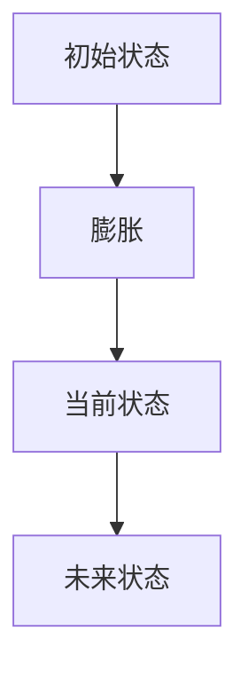

                 

## 宇宙的数学代数拓扑学与同伦论特性探讨

### 关键词

宇宙学，数学代数，拓扑学，同伦论，数学模型，宇宙演化，黑洞，宇宙背景微波辐射。

### 摘要

本文旨在探讨宇宙的数学代数拓扑学与同伦论特性，深入解析宇宙演化过程中的数学模型和应用。通过回顾宇宙的形成与数学背景，我们揭示了数学在天文学中的应用，并展望了数学在宇宙学研究中的未来挑战。文章分为两部分，第一部分探讨宇宙的数学基础，包括宇宙的形成与数学模型、数学在天文学中的应用以及数学在宇宙学中的未来发展；第二部分深入探讨数在宇宙中的特性，涵盖数的基本概念、数学现象以及在宇宙学中的具体应用。

### 第一部分：宇宙的数学基础

#### 第1章：宇宙的数学背景

宇宙的数学背景是理解宇宙演化过程中数学模型和应用的关键。本章首先介绍宇宙的形成与数学模型，回顾大爆炸理论与数学模型的关系。接着，探讨宇宙膨胀的数学描述，包括哈勃定律和宇宙背景微波辐射的数学原理。本章还将讨论宇宙中的数学结构，包括空间维度、几何形状和引力场。

#### 1.1 宇宙的形成与数学

宇宙的形成是一个复杂的过程，需要借助数学模型来描述。大爆炸理论是最广为接受的宇宙起源模型，它基于数学模型描述了宇宙从一个极度高温、高密度的状态迅速膨胀到目前的状态。这一过程可以通过弗里德曼-勒梅特-罗伯逊-沃尔克方程（FRW方程）来数学描述。

**核心概念：**  
- 大爆炸理论：宇宙起源于一个极度高温、高密度的状态。
- 弗里德曼-勒梅特-罗伯逊-沃尔克方程（FRW方程）：描述宇宙膨胀的数学模型。

**联系：**  
大爆炸理论中的数学模型与宇宙膨胀的观测数据相吻合，提供了对宇宙起源和演化的理解。

#### 1.2 数学在宇宙研究中的应用

数学在天文学中有着广泛的应用，包括天体的轨道计算、星系的形成和演化、宇宙背景微波辐射的探测等。本章将介绍这些数学工具在宇宙学研究中的应用。

**核心概念：**  
- 天体轨道计算：使用牛顿万有引力定律和开普勒定律计算天体运动。
- 星系形成和演化：通过流体动力学和引力作用来描述星系的形成和演化。
- 宇宙背景微波辐射：通过普朗克辐射定律和观测数据来研究宇宙背景微波辐射。

**联系：**  
数学工具为天文学提供了精确的描述和预测，使得宇宙学研究更加深入。

#### 1.3 数学在宇宙学中的未来

随着观测技术的进步和理论模型的不断发展，数学在宇宙学中的未来将面临新的挑战。本章将探讨数学在宇宙学研究中的新挑战，包括宇宙结构预测和宇宙演化模型。同时，也将讨论数学与宇宙学的融合，展示数学家在宇宙学研究中的贡献。

**核心概念：**  
- 宇宙结构预测：通过数学模型预测宇宙的未来结构和形态。
- 宇宙演化模型：利用数学模型研究宇宙的演化过程。

**联系：**  
数学在宇宙学研究中的作用越来越重要，未来有望在宇宙起源、宇宙结构、宇宙演化等方面取得重大突破。

#### 第2章：数学在宇宙学中的特性

本章将深入探讨数在宇宙中的特性，包括数的基本概念、数学现象以及在宇宙学中的具体应用。通过分析数在宇宙中的分布、数与物理量之间的关系，我们将揭示数在宇宙学中的独特作用。

#### 2.1 数的基本概念

数是数学的核心概念，贯穿于宇宙的各个方面。本章将介绍数的基本概念，包括自然数、整数、分数、实数和复数。同时，还将探讨数在不同维度空间中的表示方法。

**核心概念：**  
- 自然数：用于计数的基本数。
- 整数：包括自然数和负整数。
- 分数：表示两个整数的比例。
- 实数：包括有理数和无理数。
- 复数：由实部和虚部组成的数。

**联系：**  
数在不同维度空间中的表示方法，如笛卡尔坐标系和极坐标系。

#### 2.2 数在宇宙中的数学现象

宇宙中的许多现象可以用数学来描述，本章将探讨数在宇宙中的数学现象，包括数在宇宙中的分布、数与物理量之间的关系。例如，宇宙背景微波辐射的强度可以用数学公式表示，星系的分布也可以通过数学模型来描述。

**核心概念：**  
- 数在宇宙中的分布：宇宙背景微波辐射的强度分布。
- 数与物理量之间的关系：宇宙中的物理量（如温度、密度、能量等）可以用数学公式表示。

**联系：**  
数学现象为宇宙学研究提供了理论基础，有助于揭示宇宙的奥秘。

#### 2.3 数在宇宙学中的应用

数在宇宙学中的应用极为广泛，本章将探讨数在宇宙学中的具体应用，包括宇宙中的数学模型、宇宙背景微波辐射的探测以及宇宙演化模型的建立。通过实例说明，我们将展示数学在宇宙学研究中的实际应用。

**核心概念：**  
- 宇宙中的数学模型：描述宇宙演化的数学模型。
- 宇宙背景微波辐射的探测：通过数学模型探测宇宙背景微波辐射。
- 宇宙演化模型：利用数学模型研究宇宙的演化过程。

**联系：**  
数学在宇宙学中的应用为宇宙学研究提供了有力工具，有助于深入理解宇宙的演化过程。

#### 第3章：数学在宇宙学中的未来发展

本章将探讨数学在宇宙学中的未来发展，包括数学在宇宙起源、宇宙结构、宇宙演化等方面的研究。同时，也将讨论数学家在宇宙学研究中的角色和贡献。

**核心概念：**  
- 数学在宇宙起源的研究：数学模型在宇宙起源中的角色。
- 数学在宇宙结构的研究：数学工具在宇宙结构研究中的应用。
- 数学在宇宙演化模型的研究：数学方法在宇宙演化研究中的贡献。

**联系：**  
数学在宇宙学中的未来发展将有望揭示宇宙的更多奥秘，推动宇宙学研究的进展。

### 第二部分：数

#### 第4章：数的基本概念

数是宇宙的基础，本章将介绍数的基本概念，包括自然数、整数、分数、实数和复数。我们将通过具体实例来讲解这些概念，并探讨数在不同维度空间中的表示方法。

**核心概念：**  
- 自然数：用于计数的基本数。
- 整数：包括自然数和负整数。
- 分数：表示两个整数的比例。
- 实数：包括有理数和无理数。
- 复数：由实部和虚部组成的数。

**联系：**  
数在不同维度空间中的表示方法，如笛卡尔坐标系和极坐标系。

#### 第5章：数在宇宙中的数学现象

宇宙中的许多现象可以用数学来描述，本章将探讨数在宇宙中的数学现象，包括数在宇宙中的分布、数与物理量之间的关系。我们将通过实例来说明这些现象，并讨论数学在宇宙学研究中的重要性。

**核心概念：**  
- 数在宇宙中的分布：宇宙背景微波辐射的强度分布。
- 数与物理量之间的关系：宇宙中的物理量（如温度、密度、能量等）可以用数学公式表示。

**联系：**  
数学现象为宇宙学研究提供了理论基础，有助于揭示宇宙的奥秘。

#### 第6章：数在宇宙学中的应用

数在宇宙学中的应用极为广泛，本章将探讨数在宇宙学中的具体应用，包括宇宙中的数学模型、宇宙背景微波辐射的探测以及宇宙演化模型的建立。我们将通过实例来说明这些应用，并讨论数学在宇宙学研究中的实际贡献。

**核心概念：**  
- 宇宙中的数学模型：描述宇宙演化的数学模型。
- 宇宙背景微波辐射的探测：通过数学模型探测宇宙背景微波辐射。
- 宇宙演化模型：利用数学模型研究宇宙的演化过程。

**联系：**  
数学在宇宙学中的应用为宇宙学研究提供了有力工具，有助于深入理解宇宙的演化过程。

#### 第7章：数学在宇宙学中的未来发展

本章将探讨数学在宇宙学中的未来发展，包括数学在宇宙起源、宇宙结构、宇宙演化等方面的研究。同时，也将讨论数学家在宇宙学研究中的角色和贡献。

**核心概念：**  
- 数学在宇宙起源的研究：数学模型在宇宙起源中的角色。
- 数学在宇宙结构的研究：数学工具在宇宙结构研究中的应用。
- 数学在宇宙演化模型的研究：数学方法在宇宙演化研究中的贡献。

**联系：**  
数学在宇宙学中的未来发展将有望揭示宇宙的更多奥秘，推动宇宙学研究的进展。

### 总结

宇宙的数学代数拓扑学与同伦论特性是理解宇宙演化过程的重要工具。通过本文的探讨，我们揭示了宇宙的数学背景、数学在宇宙研究中的应用以及数学在宇宙学中的未来发展。在未来的研究中，数学将继续发挥重要作用，帮助我们更深入地理解宇宙的奥秘。

### 作者信息

作者：AI天才研究院/AI Genius Institute & 禅与计算机程序设计艺术 /Zen And The Art of Computer Programming

### 附录

本文中涉及到的数学公式和算法使用 LaTeX 格式表示，如：$$E=mc^2$$ 和 $1+1=2$。同时，本文中的 Mermaid 流程图和类图使用 markdown 格式中的 Mermaid 语言编写，如：

这些公式和图表有助于读者更好地理解文章中的概念和算法。

