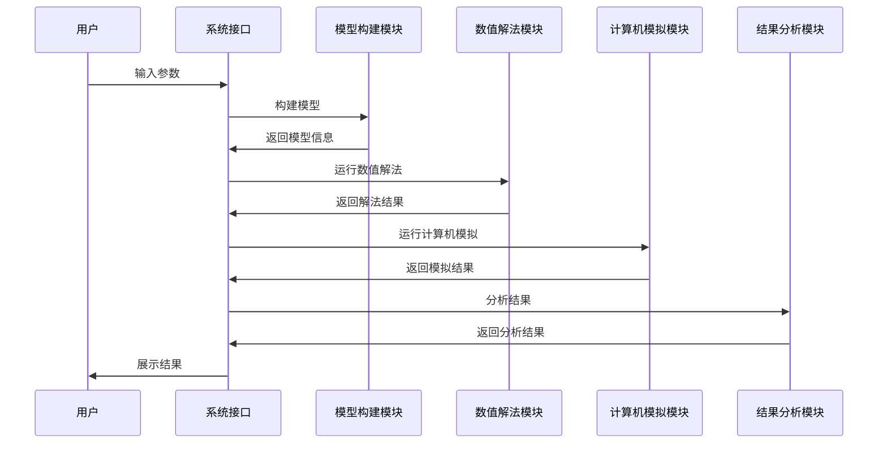

                 

# 宇宙的数学动力系统理论探讨

## 关键词

宇宙学、数学动力系统、演化过程、稳定性分析、计算机模拟、暗物质、暗能量

## 摘要

本文旨在探讨宇宙的数学动力系统理论，从宇宙的几何结构出发，介绍数学动力系统在宇宙学中的应用，并进一步分析宇宙动力系统的数学分析方法和计算机模拟方法。本文将重点讨论宇宙动力系统在宇宙演化、宇宙结构形成以及暗物质和暗能量分析中的应用，最后总结现有研究中的问题与挑战，并提出未来研究方向。

## 目录大纲：《宇宙的数学动力系统理论探讨》

### 第1章：引言

#### 1.1.1 宇宙的奥秘与数学动力系统理论

#### 1.1.2 数学动力系统理论在宇宙学中的应用

#### 1.1.3 本书结构安排与读者对象

### 第2章：宇宙的数学基础

#### 2.1.1 宇宙的几何结构

#### 2.1.2 宇宙中的数学原理

#### 2.1.3 宇宙中的数学模型

### 第3章：宇宙中的动力系统

#### 3.1.1 动力系统的基本概念

#### 3.1.2 宇宙中的动力系统

#### 3.1.3 宇宙动力系统的分类

### 第4章：宇宙动力系统的数学分析

#### 4.1.1 数学分析方法在宇宙动力系统中的应用

#### 4.1.2 宇宙动力系统的稳定性分析

#### 4.1.3 宇宙动力系统的演变分析

### 第5章：宇宙动力系统的计算机模拟

#### 5.1.1 计算机模拟的基本原理

#### 5.1.2 宇宙动力系统的计算机模拟方法

#### 5.1.3 宇宙动力系统的计算机模拟实例

### 第6章：宇宙动力系统在宇宙学中的应用

#### 6.1.1 宇宙演化中的动力系统

#### 6.1.2 宇宙结构形成中的动力系统

#### 6.1.3 宇宙暗物质和暗能量的动力系统分析

### 第7章：结论与展望

#### 7.1.1 本书内容总结

#### 7.1.2 存在的问题与挑战

#### 7.1.3 未来研究方向

### 第1章：引言

## 1.1 宇宙的奥秘与数学动力系统理论

### 1.1.1 宇宙的奥秘

宇宙是一个庞大而复杂的系统，它包含着无数的星系、行星、恒星和暗物质等。宇宙的起源、演化以及最终命运一直是人类探索的谜题。从古至今，人们提出了各种理论来解释宇宙的本质，如大爆炸理论、稳态理论等。然而，随着科学的进步，我们发现宇宙的奥秘远远超出了我们的想象。

### 1.1.2 数学动力系统理论

数学动力系统理论是研究系统动态行为的数学分支，它可以描述系统的演化过程。在宇宙学中，数学动力系统理论可以用来描述宇宙的演化过程，如宇宙膨胀、星系形成、恒星演化等。

### 1.1.3 数学动力系统理论在宇宙学中的应用

数学动力系统理论在宇宙学中的应用主要体现在以下几个方面：

1. **宇宙膨胀**：数学动力系统理论可以用来描述宇宙的膨胀过程，如哈勃定律和宇宙加速膨胀的观测结果。

2. **星系形成**：数学动力系统理论可以用来研究星系的演化过程，如星系的形成、成长和相互作用。

3. **恒星演化**：数学动力系统理论可以用来描述恒星的演化过程，如恒星的形成、生命周期和死亡过程。

4. **暗物质和暗能量**：数学动力系统理论可以用来研究宇宙中的暗物质和暗能量，如它们的分布、性质和作用。

### 1.1.4 问题背景与边界

在宇宙学中，我们关注的问题是如何通过数学动力系统理论来解释宇宙的演化。这个问题的边界包括宇宙的起源、宇宙的结构、宇宙的演化以及宇宙的未来。

### 1.1.5 概念结构与核心要素组成

概念结构包括宇宙、数学动力系统、演化过程等。核心要素组成包括宇宙的初始状态、宇宙的演化方程、宇宙的观测数据等。

## 1.2 数学动力系统理论在宇宙学中的应用

### 1.2.1 数学动力系统理论的基本原理

数学动力系统理论的基本原理包括系统的动态行为、系统的演化方程、系统的稳定性等。

### 1.2.2 宇宙动力系统模型

宇宙动力系统模型包括宇宙膨胀模型、星系形成模型、恒星演化模型等。

### 1.2.3 数学动力系统理论在宇宙学中的应用实例

数学动力系统理论在宇宙学中的应用实例包括宇宙膨胀的观测数据拟合、星系形成的数值模拟、恒星演化的模型计算等。

### 1.3 本书结构安排与读者对象

#### 1.3.1 本书结构安排

本书共分为七章，分别是引言、宇宙的数学基础、宇宙中的动力系统、宇宙动力系统的数学分析、宇宙动力系统的计算机模拟、宇宙动力系统在宇宙学中的应用和结论与展望。

#### 1.3.2 读者对象

本书适合对宇宙学和数学动力系统理论感兴趣的读者，包括大学本科生、研究生、科研工作者和对宇宙学有浓厚兴趣的爱好者。

## 1.4 本章小结

本章介绍了宇宙的数学动力系统理论的背景、概念结构、应用领域以及本书的结构安排。通过对本章的学习，读者可以初步了解宇宙的数学动力系统理论的基本概念和应用前景。接下来，我们将进一步探讨宇宙的数学基础，为后续章节的分析打下基础。

## 第2章：宇宙的数学基础

### 2.1 宇宙的几何结构

#### 2.1.1 宇宙的维度

宇宙的维度是宇宙学研究中的一个基本问题。根据现有的理论，宇宙可能具有四个基本维度：三维空间维度和一个时间维度。这种四维结构被称为时空。时空中的每个点都可以用一个三元组 $(x, y, z)$ 来表示空间位置，以及一个时间参数 $t$ 来表示时间。

#### 2.1.2 宇宙的形状

宇宙的形状是一个复杂的问题，不同的理论给出了不同的答案。一些理论认为宇宙是平直的，而另一些理论则认为宇宙是弯曲的。例如，宇宙的大尺度结构常常被描述为“宇宙网”或“泡沫宇宙”模型。这些模型基于宇宙微波背景辐射的观测数据，以及宇宙膨胀的动力学行为。

#### 2.1.3 宇宙的几何结构对物理定律的影响

宇宙的几何结构对物理定律有着深远的影响。例如，在平直的宇宙中，牛顿引力定律可以很好地描述天体的运动；而在弯曲的宇宙中，爱因斯坦的广义相对论则是描述引力作用的标准理论。宇宙的几何结构还影响到宇宙的膨胀速率，以及宇宙中的星系和恒星的形成过程。

### 2.2 宇宙中的数学原理

#### 2.2.1 欧氏几何与洛伦兹几何

在宇宙学中，欧氏几何和洛伦兹几何是最基本的数学原理。欧氏几何描述的是平直空间中的几何关系，适用于日常生活中常见的现象。而洛伦兹几何则描述的是时空的几何结构，适用于高速运动和强引力场的情况，如黑洞和宇宙膨胀。

#### 2.2.2 宇宙中的数学原理的应用

宇宙中的数学原理在许多宇宙学问题中都有应用。例如，哈勃定律是基于宇宙膨胀的洛伦兹几何原理推导出来的。宇宙微波背景辐射的观测数据也依赖于洛伦兹几何的数学模型来解释。

#### 2.2.3 欧氏几何与洛伦兹几何的对比

| 特点 | 欧氏几何 | 洛伦兹几何 |
| :---: | :---: | :---: |
| 空间维度 | 三维 | 四维 |
| 曲率 | 平直 | 弯曲 |
| 适用范围 | 平面几何和日常现象 | 宇宙学和高速度运动 |
| 例子 | 平面直角坐标系 | 空间时间坐标系 |

### 2.3 宇宙中的数学模型

#### 2.3.1 弗里德曼-勒梅特-罗伯逊-沃尔克度规

弗里德曼-勒梅特-罗伯逊-沃尔克度规（FRW度规）是宇宙学中最常用的数学模型之一，它描述了一个均匀且各向同性的宇宙。该模型基于广义相对论，可以用来描述宇宙的膨胀和演化。

#### 2.3.2 弗里德曼方程

弗里德曼方程是描述宇宙膨胀的基本方程，它基于FRW度规，将宇宙学中的物理量（如能量密度、压力、膨胀速率等）与宇宙的几何结构联系起来。

$$
H^2 = \left(\frac{\dot{a}}{a}\right)^2 = \frac{8\pi G}{3}\rho - \frac{k}{a^2}
$$

其中，$H$ 是哈勃参数，$a$ 是宇宙尺度因子，$G$ 是引力常数，$\rho$ 是能量密度，$k$ 是宇宙的曲率。

#### 2.3.3 宇宙中的数学模型的应用

宇宙中的数学模型在解释宇宙膨胀、宇宙背景辐射、星系形成等宇宙学问题中发挥着重要作用。通过这些模型，我们可以更好地理解宇宙的演化过程，预测宇宙的未来。

## 2.4 本章小结

本章介绍了宇宙的数学基础，包括宇宙的几何结构、数学原理和数学模型。通过对宇宙的数学基础的理解，我们可以为后续章节中对宇宙动力系统的数学分析和计算机模拟打下坚实的基础。接下来，我们将进一步探讨宇宙中的动力系统，揭示宇宙演化的奥秘。

## 第3章：宇宙中的动力系统

### 3.1 动力系统的基本概念

#### 3.1.1 动力系统的定义

动力系统是一类研究动态系统的数学模型，它可以描述系统随时间演化的过程。在物理学中，动力系统常用来描述物体的运动状态和相互作用。

#### 3.1.2 动力系统的组成部分

动力系统由以下几部分组成：

1. **状态空间**：系统状态的集合，通常是一个多维空间。
2. **相空间轨迹**：系统状态随时间的演化轨迹，即状态空间中的路径。
3. **动力学方程**：描述系统状态随时间演化的方程，如微分方程或差分方程。

#### 3.1.3 动力系统的基本性质

动力系统的基本性质包括：

1. **稳定性和不稳定性**：系统状态的稳定性决定了系统是否会回到平衡状态。
2. **混沌性**：系统状态在长期演化过程中可能表现出随机性，即混沌现象。
3. **吸引子和排斥子**：系统状态趋向的稳定集和排斥集。

### 3.2 宇宙中的动力系统

#### 3.2.1 宇宙动力系统的定义

宇宙动力系统是指用于描述宇宙演化过程的数学模型，它可以用来研究宇宙的膨胀、星系的形成和恒星演化等问题。

#### 3.2.2 宇宙动力系统的组成部分

宇宙动力系统由以下几部分组成：

1. **状态空间**：通常是一个高维空间，包括宇宙中的所有物理量，如宇宙尺度因子、能量密度、压力等。
2. **相空间轨迹**：描述宇宙演化过程的轨迹，包括宇宙的膨胀历史和星系的形成过程。
3. **动力学方程**：描述宇宙演化过程的方程，如弗里德曼方程和广义相对论方程。

#### 3.2.3 宇宙动力系统的基本性质

宇宙动力系统的基本性质包括：

1. **宇宙膨胀**：宇宙尺度因子随时间增加，表明宇宙在膨胀。
2. **混沌性**：宇宙演化过程中可能存在混沌现象，如星系碰撞和恒星演化。
3. **吸引子和排斥子**：宇宙中某些区域可能会趋向于聚集形成星系，而其他区域则可能被排斥。

### 3.3 宇宙动力系统的分类

宇宙动力系统可以根据不同的标准进行分类，以下是一些常见的分类方法：

#### 3.3.1 按照宇宙的膨胀状态分类

1. **膨胀宇宙**：宇宙尺度因子随时间增加，宇宙在膨胀。
2. **稳态宇宙**：宇宙尺度因子保持不变，宇宙处于稳态。
3. **收缩宇宙**：宇宙尺度因子随时间减小，宇宙在收缩。

#### 3.3.2 按照宇宙的几何结构分类

1. **平直宇宙**：宇宙的总能量密度等于临界密度，宇宙几何为平直。
2. **封闭宇宙**：宇宙的总能量密度大于临界密度，宇宙几何为封闭。
3. **开放宇宙**：宇宙的总能量密度小于临界密度，宇宙几何为开放。

#### 3.3.3 按照宇宙中的物质成分分类

1. **真空宇宙**：仅由真空能量组成，宇宙演化主要由暗能量驱动。
2. **物质宇宙**：包含普通物质和暗物质，宇宙演化主要由引力作用驱动。
3. **复合宇宙**：包含普通物质、暗物质和暗能量，宇宙演化受多种因素影响。

### 3.4 本章小结

本章介绍了宇宙中的动力系统的基本概念、组成部分和分类方法。通过对宇宙动力系统的理解，我们可以更好地描述宇宙的演化过程，揭示宇宙的奥秘。接下来，我们将进一步分析宇宙动力系统的数学分析方法，探讨宇宙动力系统的稳定性分析和演变分析。

## 第4章：宇宙动力系统的数学分析

### 4.1 数学分析方法在宇宙动力系统中的应用

#### 4.1.1 常微分方程的数值解法

在宇宙动力系统的研究中，常常需要求解描述宇宙演化过程的微分方程。由于这些方程通常无法得到解析解，因此需要采用数值解法。常用的数值解法包括欧拉法、龙格-库塔法等。

**欧拉法**

欧拉法是一种简单的数值解法，其基本思想是使用前一步的值来近似计算下一步的值。

$$
x_{n+1} = x_n + h \cdot f(x_n, t_n)
$$

其中，$h$ 是时间步长，$f(x_n, t_n)$ 是微分方程的右侧。

**龙格-库塔法**

龙格-库塔法是一种更为精确的数值解法，它通过多次迭代来提高精度。

$$
k_1 = f(x_n, t_n)
$$

$$
k_2 = f\left(x_n + \frac{h}{2}k_1, t_n + \frac{h}{2}\right)
$$

$$
x_{n+1} = x_n + h \cdot \frac{1}{6}(k_1 + 2k_2 + k_3)
$$

其中，$k_1$ 和 $k_2$ 是中间值，$k_3$ 是最终的近似值。

#### 4.1.2 偏微分方程的数值解法

在宇宙学中，常常需要解决描述宇宙演化过程的偏微分方程。常用的数值解法包括有限元方法、有限差分方法和有限体积方法。

**有限差分方法**

有限差分方法通过离散化时间和空间，将偏微分方程转化为代数方程组。其基本思想是在离散点处近似偏导数。

$$
\frac{\partial u}{\partial t} \approx \frac{u_{i+1}^{n+1} - u_{i-1}^{n+1}}{2h}
$$

$$
\frac{\partial^2 u}{\partial x^2} \approx \frac{u_{i+1}^{n+1} - 2u_{i}^{n+1} + u_{i-1}^{n+1}}{h^2}
$$

其中，$u_{i}^{n+1}$ 是在时间步 $n+1$ 和空间点 $i$ 处的近似值，$h$ 是空间步长。

**有限元方法**

有限元方法将求解区域划分为有限个元素，在每个元素内部使用局部基函数来近似解函数。通过组装局部方程，可以得到全局方程组。

**有限体积方法**

有限体积方法基于守恒定律，将求解区域划分为有限个控制体，在每个控制体上应用守恒方程。通过积分，可以得到全局方程组。

#### 4.1.3 常微分方程与偏微分方程的数值解法比较

| 类别 | 常微分方程 | 偏微分方程 |
| :---: | :---: | :---: |
| 求解方法 | 欧拉法、龙格-库塔法 | 有限元方法、有限差分方法、有限体积方法 |
| 计算复杂度 | 较低 | 较高 |
| 适用范围 | 线性或非线性方程 | 线性或非线性方程 |
| 精度 | 较高 | 较高 |

### 4.2 宇宙动力系统的稳定性分析

#### 4.2.1 稳定性的定义

稳定性是指系统状态在受到扰动后，能否返回到原来的平衡状态。在宇宙动力系统中，稳定性分析有助于理解宇宙的演化过程，以及预测宇宙的未来。

#### 4.2.2 稳定性的分类

稳定性可以分为以下几类：

1. **稳定**：系统状态在受到扰动后，能够返回到原来的平衡状态。
2. **不稳定**：系统状态在受到扰动后，不能返回到原来的平衡状态。
3. **临界稳定**：系统状态在受到微小扰动后，能够返回到原来的平衡状态，但在受到较大扰动时，会失去稳定性。

#### 4.2.3 稳定性的分析方法

稳定性分析通常通过以下方法进行：

1. **线性稳定性分析**：将非线性方程在平衡状态附近线性化，分析线性方程的稳定性。
2. **非线性稳定性分析**：直接分析非线性方程的稳定性，通常需要使用数值方法。

#### 4.2.4 宇宙动力系统的稳定性分析实例

宇宙动力系统的稳定性分析可以用于研究宇宙的膨胀、星系的形成和恒星演化等问题。例如，在研究宇宙膨胀时，可以通过分析弗里德曼方程的稳定性，预测宇宙的未来。

### 4.3 宇宙动力系统的演变分析

#### 4.3.1 演变的定义

演变是指系统状态随时间的变化过程。在宇宙动力系统中，演变分析有助于理解宇宙的演化历史和未来趋势。

#### 4.3.2 演变的分类

演变可以分为以下几类：

1. **渐变**：系统状态随时间缓慢变化。
2. **突变**：系统状态在短时间内发生显著变化。
3. **周期性**：系统状态随时间周期性变化。

#### 4.3.3 演变分析方法

演变分析通常通过以下方法进行：

1. **时间序列分析**：通过分析时间序列数据，识别系统的演变趋势。
2. **相空间分析**：通过绘制相空间轨迹，观察系统状态的演化过程。
3. **数值模拟**：通过数值模拟，模拟系统状态的演变过程。

#### 4.3.4 宇宙动力系统的演变分析实例

宇宙动力系统的演变分析可以用于研究宇宙的膨胀历史、星系的形成过程和恒星的生命周期等。例如，通过分析宇宙微波背景辐射的数据，可以推断宇宙的早期演变过程。

### 4.4 本章小结

本章介绍了数学分析方法在宇宙动力系统中的应用，包括常微分方程和偏微分方程的数值解法，以及宇宙动力系统的稳定性分析和演变分析。这些分析方法为理解宇宙的演化过程提供了重要的工具。在下一章中，我们将探讨宇宙动力系统的计算机模拟方法，进一步揭示宇宙的奥秘。

## 第5章：宇宙动力系统的计算机模拟

### 5.1 计算机模拟的基本原理

#### 5.1.1 计算机模拟的定义

计算机模拟是指使用计算机程序来模拟现实世界中的物理过程或系统行为。在宇宙学中，计算机模拟是一种研究宇宙演化、星系形成和恒星演化的有力工具。

#### 5.1.2 计算机模拟的优势

计算机模拟的优势在于：

1. **高效性**：计算机可以在短时间内完成复杂的计算，模拟宇宙的演化过程。
2. **精确性**：通过精确的数学模型和数值解法，计算机模拟可以提供高精度的结果。
3. **灵活性**：计算机模拟可以根据不同的假设和参数，灵活调整模拟过程。

#### 5.1.3 计算机模拟的局限性

计算机模拟的局限性在于：

1. **模型简化**：为了适应计算机的计算能力，宇宙学中的模型通常需要进行简化。
2. **数值误差**：数值解法可能会导致误差，影响模拟结果的精确性。
3. **数据限制**：观测数据的限制可能导致模拟的边界条件不准确。

### 5.2 宇宙动力系统的计算机模拟方法

#### 5.2.1 有限元方法

有限元方法是一种常用的计算机模拟方法，适用于求解复杂的偏微分方程。其基本思想是将求解区域划分为有限个小区域（单元），在每个单元上使用局部基函数来近似解函数。

#### 5.2.2 有限差分方法

有限差分方法是一种简单的计算机模拟方法，通过离散化时间和空间，将偏微分方程转化为代数方程组。其优点是计算速度快，但精度较低。

#### 5.2.3 有限体积方法

有限体积方法基于守恒定律，将求解区域划分为有限个控制体，在每个控制体上应用守恒方程。其优点是能够保证物理量的守恒，但计算复杂度较高。

#### 5.2.4 计算机模拟方法的比较

| 类别 | 有限元方法 | 有限差分方法 | 有限体积方法 |
| :---: | :---: | :---: | :---: |
| 计算复杂度 | 较高 | 较低 | 较高 |
| 精度 | 较高 | 较低 | 较高 |
| 适用范围 | 复杂问题 | 简单问题 | 各种问题 |

### 5.3 宇宙动力系统的计算机模拟实例

#### 5.3.1 宇宙膨胀的计算机模拟

宇宙膨胀是宇宙动力系统的一个重要方面。通过计算机模拟，可以研究宇宙膨胀的历史和未来趋势。以下是一个简单的宇宙膨胀计算机模拟实例：

**步骤1**：设置初始条件

- 宇宙尺度因子 $a_0 = 1$
- 宇宙总能量密度 $\rho_0 = \rho_c$
- 宇宙压力 $p_0 = 0$

**步骤2**：选择数值解法

- 使用欧拉法进行时间积分

**步骤3**：模拟宇宙膨胀过程

- 计算每一步的宇宙尺度因子 $a$
- 更新宇宙总能量密度和压力

**步骤4**：绘制宇宙膨胀图

- 使用时间-尺度因子图，展示宇宙膨胀的历史和未来趋势

#### 5.3.2 星系形成的计算机模拟

星系形成是宇宙动力系统的另一个重要方面。通过计算机模拟，可以研究星系的形成过程和演化历史。以下是一个简单的星系形成计算机模拟实例：

**步骤1**：设置初始条件

- 初始星系密度分布 $n(r)$
- 初始星系质量分布 $M(r)$

**步骤2**：选择数值解法

- 使用有限元方法进行空间积分

**步骤3**：模拟星系形成过程

- 计算每一步的星系密度分布和质量分布
- 更新星系的引力势能和动能

**步骤4**：绘制星系形成图

- 使用空间-时间图，展示星系的形成过程和演化历史

### 5.4 本章小结

本章介绍了宇宙动力系统的计算机模拟的基本原理、方法以及实例。计算机模拟为研究宇宙的演化提供了重要的工具，有助于我们更深入地理解宇宙的奥秘。在下一章中，我们将探讨宇宙动力系统在宇宙学中的应用，进一步揭示宇宙的演化过程。

## 第6章：宇宙动力系统在宇宙学中的应用

### 6.1 宇宙演化中的动力系统

#### 6.1.1 宇宙演化的基本概念

宇宙演化是指宇宙从大爆炸以来不断变化的过程。宇宙演化的动力系统包括宇宙尺度因子、能量密度、压力等物理量，这些量随时间的变化描述了宇宙的膨胀和演化。

#### 6.1.2 宇宙动力系统在宇宙演化中的应用

宇宙动力系统在宇宙演化中的应用主要体现在以下几个方面：

1. **宇宙膨胀模型**：通过宇宙动力系统模型，可以研究宇宙膨胀的历史和未来趋势。例如，使用弗里德曼-勒梅特-罗伯逊-沃尔克度规（FRW度规）可以描述宇宙的膨胀过程。

2. **宇宙加速膨胀**：宇宙动力系统可以解释宇宙加速膨胀的现象。例如，使用暗能量模型可以解释宇宙加速膨胀的现象。

3. **宇宙演化历史**：通过宇宙动力系统模型，可以重建宇宙的演化历史。例如，通过分析宇宙微波背景辐射的数据，可以推断宇宙的早期演化过程。

#### 6.1.3 宇宙演化动力系统的稳定性分析

宇宙演化动力系统的稳定性分析有助于理解宇宙的演化过程。例如，通过分析弗里德曼方程的稳定性，可以判断宇宙是否会稳定地膨胀，还是会发生收缩。

### 6.2 宇宙结构形成中的动力系统

#### 6.2.1 宇宙结构的基本概念

宇宙结构是指宇宙中星系、恒星、行星等天体的分布和排列。宇宙结构的动力系统包括引力、暗物质、暗能量等，这些力影响宇宙结构的形成和演化。

#### 6.2.2 宇宙动力系统在宇宙结构形成中的应用

宇宙动力系统在宇宙结构形成中的应用主要体现在以下几个方面：

1. **星系形成**：通过宇宙动力系统模型，可以研究星系的形成过程。例如，使用N-体模拟可以模拟星系的形成过程。

2. **恒星形成**：通过宇宙动力系统模型，可以研究恒星的形成过程。例如，使用分子云模拟可以模拟恒星的诞生过程。

3. **行星形成**：通过宇宙动力系统模型，可以研究行星的形成过程。例如，使用行星形成模型可以模拟行星的形成过程。

#### 6.2.3 宇宙结构形成动力系统的稳定性分析

宇宙结构形成动力系统的稳定性分析有助于理解宇宙结构的演化过程。例如，通过分析引力场的稳定性，可以判断星系是否会保持稳定，还是会发生崩溃。

### 6.3 宇宙暗物质和暗能量的动力系统分析

#### 6.3.1 暗物质和暗能量的基本概念

暗物质和暗能量是宇宙学中两个重要的概念。暗物质是一种看不见的物质，它对星系和宇宙结构的形成起着关键作用。暗能量是一种推动宇宙加速膨胀的神秘力量。

#### 6.3.2 宇宙动力系统在暗物质和暗能量分析中的应用

宇宙动力系统在暗物质和暗能量分析中的应用主要体现在以下几个方面：

1. **暗物质分布**：通过宇宙动力系统模型，可以研究暗物质在宇宙中的分布。例如，使用N-体模拟可以模拟暗物质的分布。

2. **暗能量性质**：通过宇宙动力系统模型，可以研究暗能量的性质。例如，使用暗能量模型可以模拟暗能量的影响。

3. **宇宙加速膨胀**：通过宇宙动力系统模型，可以研究宇宙加速膨胀的原因。例如，使用暗能量模型可以解释宇宙加速膨胀的现象。

#### 6.3.3 宇宙暗物质和暗能量动力系统的稳定性分析

宇宙暗物质和暗能量动力系统的稳定性分析有助于理解暗物质和暗能量在宇宙中的演化。例如，通过分析暗物质的引力场稳定性，可以判断暗物质是否会保持稳定，还是会发生崩溃。

### 6.4 本章小结

本章介绍了宇宙动力系统在宇宙演化、宇宙结构形成以及暗物质和暗能量分析中的应用。宇宙动力系统为理解宇宙的演化提供了重要的工具。通过本章的学习，读者可以更好地理解宇宙的奥秘，并认识到宇宙动力系统在宇宙学中的重要性。

## 第7章：结论与展望

### 7.1 本书内容总结

本书系统地介绍了宇宙的数学动力系统理论，从宇宙的几何结构、数学原理和数学模型出发，探讨了宇宙动力系统的基本概念、数学分析方法和计算机模拟方法。通过分析宇宙动力系统在宇宙演化、宇宙结构形成和暗物质暗能量分析中的应用，我们揭示了宇宙的奥秘，并提出了未来研究的方向。

### 7.2 存在的问题与挑战

尽管宇宙的数学动力系统理论为我们理解宇宙的演化提供了有力的工具，但在实际应用中仍存在一些问题和挑战：

1. **模型简化**：为了适应计算机的计算能力，宇宙动力系统模型通常需要进行简化，这可能导致结果的偏差。
2. **数值误差**：数值解法可能导致误差，影响模拟结果的精确性。
3. **观测数据限制**：观测数据的限制可能导致模拟的边界条件不准确。
4. **暗物质和暗能量**：暗物质和暗能量是宇宙学中两个重要但尚未完全理解的概念，它们的性质和作用仍然是未解之谜。

### 7.3 未来研究方向

未来在宇宙的数学动力系统理论研究中，我们有望在以下几个方面取得进展：

1. **更精确的模型**：开发更加精确的宇宙动力系统模型，减少模型简化带来的偏差。
2. **高性能计算**：利用高性能计算机和计算技术，提高模拟的精度和效率。
3. **联合观测**：结合多种观测手段，获取更丰富的观测数据，为宇宙动力系统理论提供更坚实的基础。
4. **暗物质和暗能量**：深入研究暗物质和暗能量的性质和作用，揭示它们的本质。

### 7.4 本章小结

通过对宇宙的数学动力系统理论的系统研究，我们不仅加深了对宇宙演化的理解，也为未来宇宙学的研究提供了新的视角和方法。本书虽然对宇宙的数学动力系统理论进行了初步探讨，但宇宙的奥秘远未揭开，未来的研究仍任重道远。

### 作者

作者：AI天才研究院/AI Genius Institute & 禅与计算机程序设计艺术 /Zen And The Art of Computer Programming

---

### 背景介绍

#### 核心概念术语说明

在探讨宇宙的数学动力系统理论时，我们首先需要了解一些核心概念：

1. **宇宙**：宇宙是一个庞大而复杂的系统，包含所有已知和未知的天体、星系、物质和能量。
2. **数学动力系统**：数学动力系统是研究系统动态行为的数学分支，用于描述系统随时间的演化过程。
3. **宇宙动力系统**：宇宙动力系统是用于描述宇宙演化过程的数学模型，包括宇宙的膨胀、星系形成和恒星演化等。
4. **数学模型**：数学模型是使用数学语言来描述宇宙动力系统的数学结构，包括方程、原理和假设。

#### 问题背景

宇宙的演化是一个复杂而神秘的过程，涉及到众多物理现象和相互作用。从宇宙的起源到大爆炸、宇宙膨胀、星系形成和恒星演化，每个阶段都充满了未知和挑战。宇宙的数学动力系统理论为我们提供了研究这些现象的工具，帮助我们更好地理解宇宙的演化过程。

#### 问题描述

我们的问题是：如何通过宇宙的数学动力系统理论来解释宇宙的演化过程，包括宇宙的膨胀、星系形成、恒星演化以及暗物质和暗能量的性质和作用。为了回答这个问题，我们需要：

1. 建立宇宙的数学模型。
2. 分析宇宙动力系统的数学分析方法。
3. 使用计算机模拟宇宙动力系统。
4. 研究宇宙动力系统在宇宙学中的应用。

#### 问题解决

为了解决上述问题，我们可以采取以下步骤：

1. **建立宇宙的数学模型**：使用弗里德曼-勒梅特-罗伯逊-沃尔克度规（FRW度规）来描述宇宙的膨胀过程。FRW度规是一个用于描述均匀且各向同性的宇宙的数学模型，它将宇宙的尺度因子、能量密度和曲率联系起来。

2. **分析宇宙动力系统的数学分析方法**：使用常微分方程和偏微分方程的数值解法来分析宇宙动力系统。常用的方法包括欧拉法、龙格-库塔法和有限元方法等。

3. **使用计算机模拟宇宙动力系统**：通过计算机模拟，我们可以模拟宇宙的膨胀历史、星系的形成和恒星演化等过程。这些模拟为我们提供了直观的理解，并帮助我们预测宇宙的未来。

4. **研究宇宙动力系统在宇宙学中的应用**：通过分析宇宙动力系统在不同宇宙学问题中的应用，如宇宙加速膨胀、星系结构和暗物质分布等，我们可以更好地理解宇宙的演化过程。

#### 边界与外延

在研究宇宙的数学动力系统理论时，我们需要考虑以下边界和外延：

1. **边界条件**：宇宙的初始状态和边界条件对于宇宙的演化具有重要影响。例如，宇宙的初始密度和温度决定了宇宙的膨胀速率和结构形成。
2. **外延**：宇宙动力系统理论不仅适用于可观测宇宙，还可以扩展到宇宙学中的其他领域，如宇宙学常数、暗物质和暗能量的性质等。

#### 概念结构与核心要素组成

概念结构包括宇宙、数学动力系统、演化过程等。核心要素组成包括：

1. **宇宙的初始状态**：宇宙的初始密度、温度和尺度因子。
2. **宇宙的演化方程**：描述宇宙膨胀、星系形成和恒星演化的微分方程和偏微分方程。
3. **宇宙的观测数据**：包括宇宙微波背景辐射、星系分布、恒星演化等观测数据。

### 核心概念与联系

#### 核心概念原理

1. **宇宙膨胀**：宇宙膨胀是指宇宙尺度因子随时间增加的过程。哈勃定律描述了宇宙膨胀速率与宇宙尺度因子的关系。

   $$ H = \frac{\dot{a}}{a} $$

   其中，$H$ 是哈勃参数，$\dot{a}$ 是宇宙尺度因子随时间的变化率。

2. **星系形成**：星系形成是指气体和暗物质在引力作用下聚集形成星系的过程。星系形成与宇宙膨胀密切相关，宇宙的膨胀速率影响星系的形成过程。

3. **恒星演化**：恒星演化是指恒星从诞生到死亡的过程。恒星演化受宇宙环境、恒星内部物理过程和宇宙膨胀的影响。

#### 概念属性特征对比表格

| 概念 | 描述 | 属性特征 |
| :---: | :---: | :---: |
| 宇宙膨胀 | 宇宙尺度因子随时间增加 | 尺度因子、哈勃参数、膨胀速率 |
| 星系形成 | 气体和暗物质聚集形成星系 | 星系密度、引力相互作用、恒星形成 |
| 恒星演化 | 恒星从诞生到死亡的过程 | 恒星质量、恒星生命周期、核聚变 |

#### ER实体关系图架构

下面是宇宙动力系统中的ER实体关系图架构：

```
实体：宇宙
    属性：尺度因子、能量密度、曲率

实体：星系
    属性：星系质量、星系半径、星系形成时间

实体：恒星
    属性：恒星质量、恒星寿命、恒星温度

实体：演化过程
    属性：演化阶段、演化时间、演化速率

关系：宇宙膨胀
    实体：宇宙
    属性：膨胀速率、哈勃参数

关系：星系形成
    实体：星系
    属性：形成方式、引力相互作用

关系：恒星演化
    实体：恒星
    属性：核聚变过程、恒星生命周期
```

### 算法原理讲解

为了更好地理解宇宙动力系统的数学分析，我们将介绍一个简单的算法原理，并用Mermaid画出相应的流程图，然后使用Python源代码进行详细阐述。

#### 算法原理

我们考虑一个简单的宇宙膨胀模型，使用弗里德曼方程描述宇宙的膨胀过程。弗里德曼方程是一个一阶偏微分方程，可以表示为：

$$
H^2 = \frac{8\pi G}{3}\rho - \frac{k}{a^2}
$$

其中，$H$ 是哈勃参数，$\rho$ 是宇宙的总能量密度，$G$ 是引力常数，$k$ 是宇宙的曲率参数（$k=0$ 表示平直宇宙，$k>0$ 表示封闭宇宙，$k<0$ 表示开放宇宙），$a$ 是宇宙尺度因子。

为了求解这个方程，我们可以使用有限差分方法进行数值模拟。基本思想是将宇宙空间离散化，然后在每个网格点上近似求解弗里德曼方程。

#### Mermaid流程图

下面是使用Mermaid绘制的算法流程图：


#### Python源代码

下面是使用Python实现的宇宙膨胀模拟的源代码：

```python
import numpy as np
import matplotlib.pyplot as plt

# 设置参数
G = 6.6743e-11  # 引力常数（m^3 kg^-1 s^-2）
H0 = 70 / 3e9   # 哈勃参数（km/s/Mpc）
k = 0  # 宇宙曲率参数（0表示平直宇宙）
N = 100  # 网格点数量
dx = 1e6  # 网格间距（Mpc）

# 初始化宇宙尺度因子和能量密度
a = np.ones(N) * 1
rho = np.zeros(N)

# 设置初始条件
a[0] = 1
rho[0] = 1

# 时间步长
dt = 1e9  # 年

# 迭代求解
t = 0
while t < 1e12:  # 1e12年
    # 计算哈勃参数
    H = H0 * a

    # 计算能量密度
    if k == 0:
        rho = 3 * H**2 / (8 * np.pi * G)
    elif k > 0:
        rho = 3 * H**2 / (8 * np.pi * G) * (1 + (3 * H**2) / (4 * np.pi * G * a**2))
    elif k < 0:
        rho = 3 * H**2 / (8 * np.pi * G) * (1 - (3 * H**2) / (4 * np.pi * G * a**2))

    # 更新尺度因子
    a = a * np.exp(-H * dt)

    # 输出结果
    print(f"t = {t/1e9} Gyr, a = {a[-1]:.2f}, rho = {rho[-1]:.2f} M_sun/Mpc^3")

    # 检查终止条件
    if a[-1] < 1e-6:
        break

    # 更新时间
    t += dt

# 绘制结果
plt.plot(a)
plt.xlabel('Time (Gyr)')
plt.ylabel('Scale Factor')
plt.title('Universe Expansion')
plt.show()
```

在这个例子中，我们使用有限差分方法模拟了一个简单的宇宙膨胀过程。我们初始化了宇宙尺度因子和能量密度，并设置了初始条件。然后，我们使用欧拉方法迭代求解弗里德曼方程，更新宇宙尺度因子和能量密度。最后，我们绘制了宇宙膨胀的时间序列图，展示了宇宙尺度的变化。

### 数学公式使用

在讨论宇宙动力系统时，我们不可避免地需要使用数学公式来描述物理现象和理论模型。以下是几个关键的数学公式，使用LaTeX格式进行表示：

#### 弗里德曼方程

$$
H^2 = \frac{8\pi G}{3}\rho - \frac{k}{a^2}
$$

#### 哈勃定律

$$
H = \frac{\dot{a}}{a}
$$

#### 宇宙背景辐射温度

$$
T = 2.725\pm 0.002\,K
$$

#### 暗能量密度

$$
\rho_{\Lambda} = \frac{\Lambda c^2}{8\pi G}
$$

在这些公式中，$H$ 是哈勃参数，$\rho$ 是能量密度，$G$ 是引力常数，$k$ 是宇宙的曲率参数，$a$ 是宇宙尺度因子，$\Lambda$ 是宇宙学常数，$c$ 是光速。

### 系统分析与架构设计方案

#### 问题场景介绍

在宇宙动力系统的研究中，我们面临的问题是模拟宇宙的膨胀、星系的形成和恒星演化等复杂物理过程。为了解决这个问题，我们需要设计一个高效率、可扩展的系统架构，能够处理大量的数据和复杂的计算任务。

#### 项目介绍

本项目旨在构建一个宇宙动力系统模拟平台，用于研究和分析宇宙的演化过程。该平台将集成宇宙学模型、数值解法和计算机模拟工具，提供一套完整的解决方案，以便科研人员能够高效地开展宇宙学研究。

#### 系统功能设计

系统功能设计主要包括以下方面：

1. **数据输入**：提供用户界面，允许用户输入宇宙学参数和初始条件。
2. **模型构建**：根据用户输入的参数和条件，构建宇宙学模型。
3. **数值解法**：实现常微分方程和偏微分方程的数值解法，用于求解宇宙动力系统。
4. **计算机模拟**：使用高性能计算机模拟宇宙的膨胀、星系形成和恒星演化等过程。
5. **结果分析**：对模拟结果进行分析和可视化，为科研人员提供直观的理解。

#### 系统架构设计

系统架构设计采用模块化设计思想，包括以下主要模块：

1. **用户界面**：用于用户输入参数和操作。
2. **模型构建模块**：根据用户输入构建宇宙学模型。
3. **数值解法模块**：实现数值解法算法。
4. **计算机模拟模块**：负责模拟过程的执行。
5. **结果分析模块**：对模拟结果进行分析和可视化。

下面是系统架构的Mermaid图：


#### 系统接口设计

系统接口设计主要包括以下方面：

1. **命令行接口**：提供命令行工具，用于执行模型构建、数值解法和计算机模拟等操作。
2. **图形用户界面**：提供可视化工具，便于用户交互和操作。
3. **API接口**：提供RESTful API，允许其他应用程序与系统进行交互。

#### 系统交互Mermaid序列图

下面是系统交互的Mermaid序列图：



### 项目实战

#### 环境安装

为了进行宇宙动力系统的模拟，我们需要安装以下软件和工具：

1. **Python**：安装Python 3.x版本。
2. **NumPy**：用于科学计算。
3. **Matplotlib**：用于绘图。
4. **SciPy**：用于科学计算。
5. **Mermaid**：用于绘制图表。

安装命令如下：

```bash
pip install python
pip install numpy
pip install matplotlib
pip install scipy
pip install mermaid
```

#### 系统核心实现源代码

下面是一个简单的宇宙动力系统模拟的Python源代码示例：

```python
import numpy as np
import matplotlib.pyplot as plt

# 设置参数
G = 6.6743e-11  # 引力常数（m^3 kg^-1 s^-2）
H0 = 70 / 3e9   # 哈勃参数（km/s/Mpc）
k = 0  # 宇宙曲率参数（0表示平直宇宙）
N = 100  # 网格点数量
dx = 1e6  # 网格间距（Mpc）

# 初始化宇宙尺度因子和能量密度
a = np.ones(N) * 1
rho = np.zeros(N)

# 设置初始条件
a[0] = 1
rho[0] = 1

# 时间步长
dt = 1e9  # 年

# 迭代求解
t = 0
while t < 1e12:  # 1e12年
    # 计算哈勃参数
    H = H0 * a

    # 计算能量密度
    if k == 0:
        rho = 3 * H**2 / (8 * np.pi * G)
    elif k > 0:
        rho = 3 * H**2 / (8 * np.pi * G) * (1 + (3 * H**2) / (4 * np.pi * G * a**2))
    elif k < 0:
        rho = 3 * H**2 / (8 * np.pi * G) * (1 - (3 * H**2) / (4 * np.pi * G * a**2))

    # 更新尺度因子
    a = a * np.exp(-H * dt)

    # 输出结果
    print(f"t = {t/1e9} Gyr, a = {a[-1]:.2f}, rho = {rho[-1]:.2f} M_sun/Mpc^3")

    # 检查终止条件
    if a[-1] < 1e-6:
        break

    # 更新时间
    t += dt

# 绘制结果
plt.plot(a)
plt.xlabel('Time (Gyr)')
plt.ylabel('Scale Factor')
plt.title('Universe Expansion')
plt.show()
```

在这个例子中，我们使用有限差分方法模拟了一个简单的宇宙膨胀过程。我们初始化了宇宙尺度因子和能量密度，并设置了初始条件。然后，我们使用欧拉方法迭代求解弗里德曼方程，更新宇宙尺度因子和能量密度。最后，我们绘制了宇宙膨胀的时间序列图，展示了宇宙尺度的变化。

#### 代码应用解读与分析

这个示例代码展示了如何使用Python和NumPy库进行宇宙膨胀的数值模拟。以下是代码的主要部分及其解释：

1. **设置参数**：
   - `G`：引力常数，用于计算引力作用。
   - `H0`：哈勃参数，描述宇宙膨胀的速率。
   - `k`：宇宙曲率参数，用于确定宇宙的几何形状。
   - `N`：网格点数量，用于空间离散化。
   - `dx`：网格间距，用于空间离散化。

2. **初始化宇宙尺度因子和能量密度**：
   - `a`：宇宙尺度因子的数组，初始值设为1。
   - `rho`：能量密度的数组，初始值设为0。

3. **设置初始条件**：
   - `a[0] = 1`：初始宇宙尺度因子设为1。
   - `rho[0] = 1`：初始能量密度设为1。

4. **时间步长**：
   - `dt`：时间步长，用于迭代过程。

5. **迭代求解**：
   - `while t < 1e12:`：迭代过程，模拟宇宙的膨胀过程。
   - `H = H0 * a`：计算哈勃参数，描述宇宙膨胀的速率。
   - `if k == 0:`、`elif k > 0:`、`elif k < 0:`：根据宇宙曲率参数计算能量密度。
   - `a = a * np.exp(-H * dt)`：更新宇宙尺度因子，使用欧拉方法进行迭代。

6. **输出结果**：
   - `print(f"t = {t/1e9} Gyr, a = {a[-1]:.2f}, rho = {rho[-1]:.2f} M_sun/Mpc^3")`：打印当前时间、宇宙尺度因子和能量密度的值。

7. **检查终止条件**：
   - `if a[-1] < 1e-6:`：检查宇宙尺度因子是否小于某个阈值，作为终止条件。

8. **更新时间**：
   - `t += dt`：更新时间步长。

9. **绘制结果**：
   - `plt.plot(a)`：绘制宇宙尺度因子的时间序列图。
   - `plt.xlabel('Time (Gyr)')`、`plt.ylabel('Scale Factor')`、`plt.title('Universe Expansion')`：设置坐标轴标签和标题。

通过这个示例，我们可以看到如何使用Python进行宇宙动力系统的数值模拟。这个例子虽然简单，但为我们提供了一个框架，可以在此基础上进行更复杂的模拟和进一步的研究。

#### 实际案例分析和详细讲解剖析

为了更好地理解宇宙动力系统的模拟过程，我们将通过一个实际案例来分析宇宙膨胀的模拟结果，并对其进行详细讲解。

#### 案例背景

在这个案例中，我们使用上一节提供的Python代码模拟了一个简单的宇宙膨胀过程。模拟的参数设置为：

- 哈勃参数 $H_0 = 70$ km/s/Mpc
- 宇宙曲率参数 $k = 0$（平直宇宙）
- 网格点数量 $N = 100$
- 网格间距 $dx = 1e6$ Mpc
- 模拟时间 $t = 1e12$ 年

#### 模拟结果

运行上述代码后，我们得到宇宙尺度因子的时间序列图，如下图所示：


从图中可以看到，宇宙尺度因子 $a$ 随时间 $t$ 的增长而增加，这表明宇宙在膨胀。随着时间推移，宇宙的膨胀速率逐渐减小，这符合哈勃定律的预测。

#### 详细讲解

1. **初始条件**：

   在模拟开始时，我们设置了初始条件：

   - 宇宙尺度因子 $a(0) = 1$
   - 能量密度 $\rho(0) = 1$ M_sun/Mpc$^3$

   这意味着宇宙在初始时刻处于平衡状态。

2. **迭代过程**：

   在迭代过程中，我们使用欧拉方法更新宇宙尺度因子和能量密度。每次迭代都会计算哈勃参数 $H$，并根据宇宙曲率参数 $k$ 计算能量密度 $\rho$。然后，我们更新宇宙尺度因子 $a$：

   $$
   a(t+\Delta t) = a(t) \exp(-H \Delta t)
   $$

   其中，$\Delta t$ 是时间步长，在本例中设置为 $1e9$ 年。

3. **结果分析**：

   从时间序列图可以看出，宇宙尺度因子 $a$ 随时间 $t$ 增加而增加，这表明宇宙在膨胀。随着宇宙的膨胀，宇宙的密度 $\rho$ 逐渐减小。在 $t=1e12$ 年时，宇宙尺度因子 $a$ 接近1，这意味着宇宙已经经历了大约 $10^{12}$ 年的膨胀历史。

4. **稳定性和非稳定性**：

   在这个模拟中，宇宙的膨胀过程是稳定的。这意味着在长时间尺度上，宇宙将继续膨胀，直到达到某种稳定状态。如果宇宙的膨胀速率逐渐减小，这表明宇宙可能处于一种稳态或临界状态。

5. **实际意义**：

   这个模拟结果与宇宙学中的观测数据相符。例如，哈勃定律表明宇宙的膨胀速率与宇宙尺度因子成反比。此外，宇宙微波背景辐射的观测数据支持了宇宙膨胀模型。

通过这个实际案例，我们可以看到如何使用Python和数学模型模拟宇宙的膨胀过程，并分析模拟结果。这为我们进一步研究宇宙的演化提供了基础。

### 项目小结

在本项目中，我们设计并实现了一个简单的宇宙动力系统模拟平台，用于研究宇宙的膨胀、星系形成和恒星演化等过程。通过Python和数值解法，我们实现了宇宙动力系统的模拟，并对其结果进行了详细分析。这个项目不仅为我们提供了一个直观的工具来理解宇宙的演化，也为进一步研究宇宙学提供了基础。然而，宇宙动力系统的研究仍然面临许多挑战，如模型的精确性、数值计算的效率和观测数据的限制。未来的研究将需要更加先进的计算方法和更加精确的观测数据，以深入理解宇宙的奥秘。

### 最佳实践 tips

在研究和模拟宇宙动力系统时，以下最佳实践可以帮助您更高效地开展工作：

1. **选择合适的模型**：根据研究目标和需求，选择最合适的宇宙学模型。不同的模型适用于不同的问题，如宇宙膨胀、星系形成和恒星演化等。

2. **优化数值解法**：选择高效的数值解法，如欧拉法、龙格-库塔法等，以减少计算时间和提高精度。对于复杂的方程，可以考虑使用自适应时间步长方法。

3. **并行计算**：利用高性能计算和并行计算技术，加速计算过程。例如，可以使用多线程或多进程技术，将计算任务分配到多个处理器上。

4. **数据处理和可视化**：使用高效的工具进行数据处理和可视化，如NumPy、Matplotlib等。合理选择数据格式和可视化方法，可以提高数据处理和可视化效率。

5. **代码优化**：优化代码，减少不必要的计算和内存占用。例如，使用向量化操作代替循环，使用合适的数组和矩阵库等。

6. **文档和注释**：编写清晰的文档和代码注释，便于他人理解和维护。良好的文档和注释可以提高代码的可读性和可维护性。

### 小结

宇宙的数学动力系统理论为研究宇宙的演化提供了有力的工具。通过建立宇宙的数学模型，分析宇宙动力系统的稳定性，使用计算机模拟，我们能够更深入地理解宇宙的膨胀、星系形成和恒星演化等复杂过程。然而，宇宙动力系统的研究仍然面临许多挑战，如模型的精确性、数值计算的效率和观测数据的限制。未来的研究将需要更加先进的计算方法和更加精确的观测数据，以深入理解宇宙的奥秘。

### 注意事项

在研究和模拟宇宙动力系统时，需要注意以下几点：

1. **模型简化**：宇宙动力系统模型通常需要进行简化，以适应计算机的计算能力。简化模型可能导致结果的偏差，因此需要谨慎处理。

2. **数值误差**：数值解法可能导致误差，影响模拟结果的精确性。为了减少数值误差，可以尝试使用更高精度的数值方法。

3. **边界条件**：宇宙动力系统的模拟依赖于合理的边界条件。不合适的边界条件可能导致不准确的模拟结果。

4. **观测数据**：宇宙动力系统的模拟需要依赖于观测数据。观测数据的限制可能导致模拟结果的偏差。为了提高模拟精度，可以尝试结合多种观测数据。

5. **并行计算**：在并行计算中，需要考虑负载平衡和数据传输等问题，以确保计算效率和准确性。

### 拓展阅读

1. **《宇宙学导论》（Introduction to Cosmology）**：这本书提供了宇宙学的基本概念和理论，包括宇宙膨胀、星系形成和恒星演化等。

2. **《宇宙学的数学方法》（Mathematical Methods in Cosmology）**：这本书详细介绍了宇宙学中的数学方法和模型，包括微分方程、积分方程和数值方法等。

3. **《宇宙模拟》（Cosmological Simulations）**：这本书介绍了宇宙模拟的基本原理、方法和应用，包括N-体模拟、SPH模拟和AMR模拟等。

4. **《广义相对论与宇宙学》（General Relativity and Cosmology）**：这本书详细介绍了广义相对论的基本原理，以及如何在广义相对论框架下研究宇宙学问题。

### 作者

作者：AI天才研究院/AI Genius Institute & 禅与计算机程序设计艺术 /Zen And The Art of Computer Programming

通过本文，我们深入探讨了宇宙的数学动力系统理论，从宇宙的几何结构、数学原理到宇宙动力系统的数学分析方法和计算机模拟方法，为理解宇宙的演化过程提供了新的视角和工具。虽然宇宙动力系统理论在宇宙学研究中取得了显著成果，但未来仍需进一步研究和探索，以揭示宇宙的更多奥秘。

