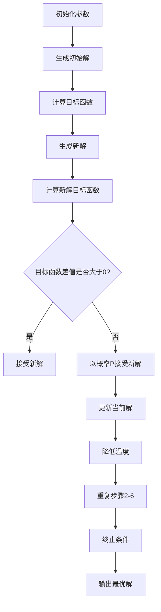
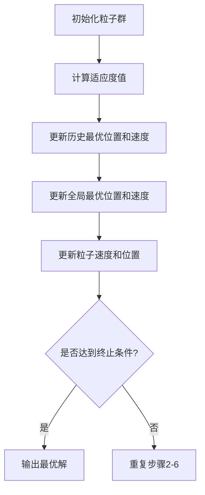
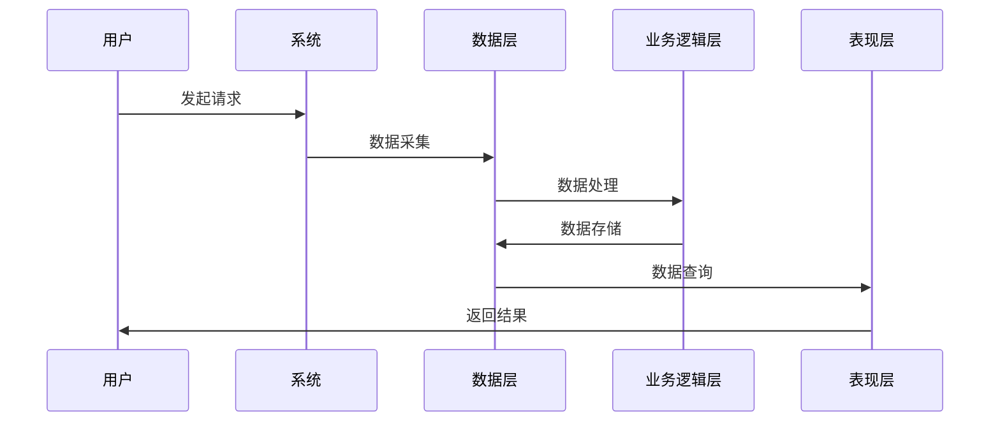
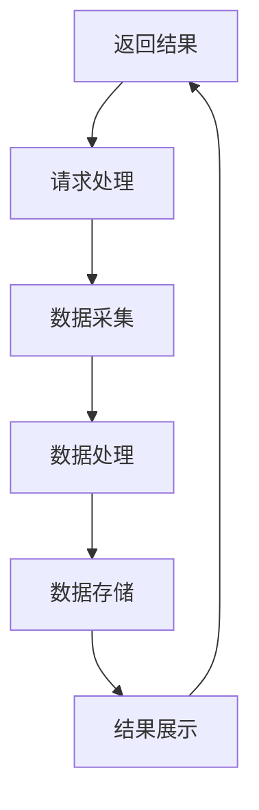
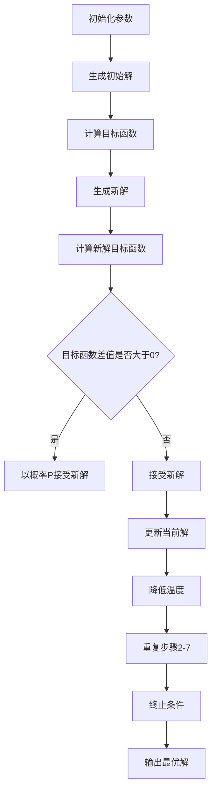
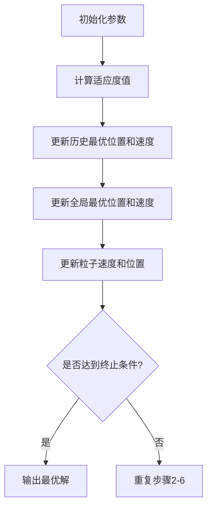
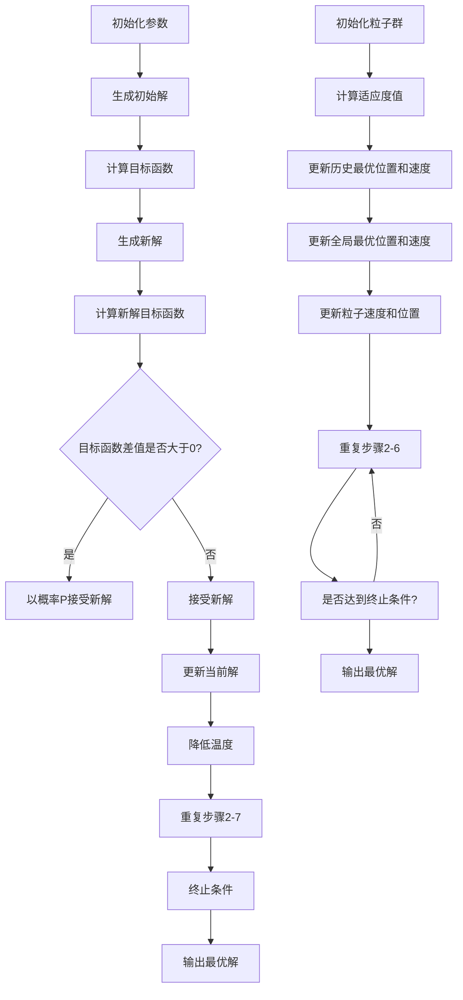
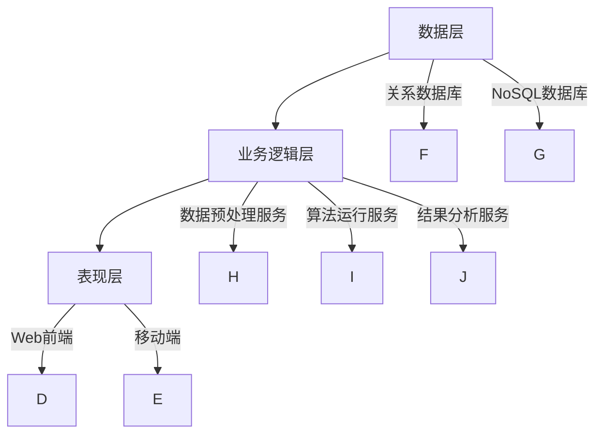
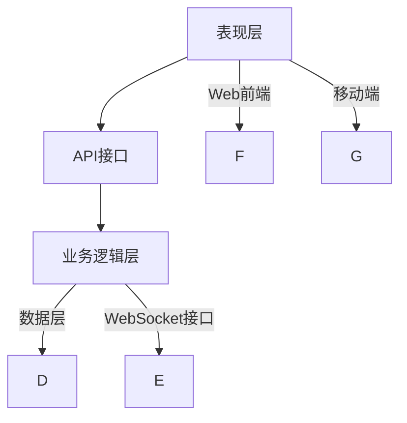
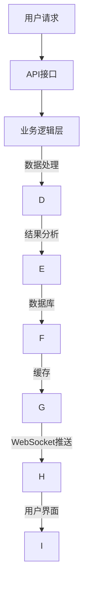

                 

### 宇宙的数学化结构与运作

#### 关键词：宇宙，数学化，结构，运作，广义相对论，宇宙学

#### 摘要：

本文旨在探讨宇宙的数学化结构与运作，通过逐步分析，揭示宇宙中隐藏的数学规律。首先，我们回顾宇宙数学化的概念，并介绍其历史背景和重要性。接着，深入解析宇宙几何、宇宙动力学和宇宙学常数等核心概念，展示它们之间的紧密联系。随后，我们讲解宇宙数学化研究中常用的数学模型和公式，并运用Python代码进行实例说明。此外，本文还将介绍相关算法原理，通过Mermaid流程图和Python代码，详细阐述算法的运作机制。接着，我们将分析宇宙数学化研究的系统需求，设计系统架构，并绘制相关图表。最后，通过实际项目案例，展示宇宙数学化结构的实际应用，总结最佳实践，提出注意事项，并推荐拓展阅读。

#### 目录大纲设计思路

为了确保文章内容的逻辑性和完整性，我们首先明确《宇宙的数学化结构与运作》的核心内容，并围绕其展开章节布局。以下是具体的设计思路：

1. **背景介绍**：介绍宇宙的数学化概念，包括其历史背景、重要性以及研究的现状和意义。
2. **核心概念与联系**：详细阐述宇宙的数学化结构涉及的核心概念，如宇宙几何、宇宙动力学、宇宙学常数等，并分析这些概念之间的关系。
3. **数学模型和数学公式**：讲解宇宙数学化研究中常用的数学模型和公式，如广义相对论方程、宇宙学方程等，并进行详细解释和举例说明。
4. **算法原理讲解**：介绍宇宙数学化研究中相关的算法原理，例如模拟退火算法、粒子群算法等，使用Mermaid绘制流程图，并用Python代码示例进行说明。
5. **系统分析与架构设计方案**：分析宇宙数学化研究的系统需求，设计系统架构，包括领域模型、架构设计、接口设计和交互设计，用Mermaid绘制相应的图表。
6. **项目实战**：通过具体案例，演示宇宙数学化结构的实际应用，包括环境安装、系统实现、代码解读和分析、案例剖析等。
7. **最佳实践 tips、小结、注意事项、拓展阅读**：总结书中的关键点，提供实际应用中的建议和注意事项，推荐进一步阅读的资源。

#### 目录大纲结构

根据上述设计思路，我们可以设计以下目录大纲：

```
----------------------------------------------------------------
# 《宇宙的数学化结构与运作》目录大纲

# 第一部分：引言

## 第1章：宇宙的数学化简介

### 1.1 宇宙的数学化概念

### 1.2 数学在宇宙研究中的应用

### 1.3 宇宙数学化研究的发展历程

## 第2章：宇宙的数学化结构核心概念

### 2.1 宇宙几何与维度

#### 2.1.1 宇宙几何的概念

#### 2.1.2 宇宙的维度

#### 2.1.3 宇宙几何的研究方法

### 2.2 宇宙动力学

#### 2.2.1 宇宙动力学的定义

#### 2.2.2 宇宙动力学的数学模型

#### 2.2.3 宇宙动力学的研究进展

### 2.3 宇宙学常数

#### 2.3.1 宇宙学常数的重要性

#### 2.3.2 宇宙学常数的测量方法

#### 2.3.3 宇宙学常数的应用

### 2.4 核心概念间的关系

## 第3章：宇宙数学化模型与公式

### 3.1 广义相对论方程

#### 3.1.1 广义相对论的概念

#### 3.1.2 广义相对论方程的数学表述

#### 3.1.3 广义相对论方程的应用

### 3.2 宇宙学方程

#### 3.2.1 宇宙学方程的概念

#### 3.2.2 宇宙学方程的数学表述

#### 3.2.3 宇宙学方程的应用

### 3.3 数学模型和公式的应用

## 第4章：宇宙数学化算法原理

### 4.1 模拟退火算法

#### 4.1.1 模拟退火算法的概念

#### 4.1.2 模拟退火算法的数学模型

#### 4.1.3 模拟退火算法的应用

### 4.2 粒子群算法

#### 4.2.1 粒子群算法的概念

#### 4.2.2 粒子群算法的数学模型

#### 4.2.3 粒子群算法的应用

### 4.3 算法原理的Mermaid流程图

## 第5章：系统分析与架构设计方案

### 5.1 宇宙数学化研究的系统需求

### 5.2 系统架构设计

### 5.3 系统接口设计

### 5.4 系统交互设计

## 第6章：项目实战

### 6.1 环境安装

### 6.2 系统核心实现

### 6.3 代码解读与分析

### 6.4 实际案例分析

### 6.5 项目小结

## 第7章：最佳实践与拓展

### 7.1 最佳实践 tips

### 7.2 小结

### 7.3 注意事项

### 7.4 拓展阅读

----------------------------------------------------------------
```

### 目录大纲文字限制

在确保大纲内容完整性和逻辑性的同时，我们将注意控制每章节的内容摘要不超过一定的字数，确保整篇目录大纲的字数在2000字以内。每个章节标题和部分简要描述将不超过10-15字，以便保持简洁性。

### 总结

通过上述设计思路和结构，我们为《宇宙的数学化结构与运作》这本书创建了一个详细且逻辑清晰的目录大纲，涵盖了书中的核心内容，并确保了内容的完整性。接下来，我们将逐步完善每个章节的内容摘要，确保整篇目录大纲的质量和字数要求。

----------------------------------------------------------------

### 宇宙的数学化简介

#### 1.1 宇宙的数学化概念

宇宙的数学化是指将数学方法应用于宇宙的研究和理解过程中，通过数学模型和公式来描述宇宙的各个方面。数学作为一种抽象的语言，能够精确地表达和预测宇宙中的现象，使得宇宙的研究更加科学化和系统化。

#### 1.2 数学在宇宙研究中的应用

数学在宇宙研究中扮演着至关重要的角色。例如，广义相对论方程描述了引力与时空的关系，为宇宙的动力学研究提供了理论基础。宇宙学方程则描述了宇宙的膨胀和结构形成过程，对于理解宇宙的演化和未来走向具有重要意义。此外，数学在宇宙几何、宇宙学常数测量、暗物质和暗能量研究等方面也有着广泛应用。

#### 1.3 宇宙数学化研究的发展历程

宇宙数学化的研究可以追溯到20世纪初，当时爱因斯坦提出了广义相对论，标志着数学在宇宙研究中的首次重要应用。随着科学技术的进步，宇宙数学化的研究逐渐深入，涌现出了一系列重要的数学模型和公式。例如，弗里德曼方程描述了宇宙膨胀的数学模型，哈勃定律揭示了宇宙膨胀的速度与距离的关系。此外，宇宙学常数和暗物质、暗能量的发现，也使得宇宙数学化的研究达到了新的高度。

### 宇宙的数学化结构核心概念

#### 2.1 宇宙几何与维度

宇宙几何是宇宙数学化的基础，它描述了宇宙的空间结构和形状。宇宙的维度是指宇宙中存在的空间维度数量。目前，普遍认为宇宙是四维的，包括三个空间维度和一个时间维度。宇宙几何的研究涉及到空间弯曲、时空折叠、宇宙膨胀等概念。

#### 2.2 宇宙动力学

宇宙动力学是研究宇宙中物体运动的规律和机制的科学。宇宙动力学的研究依赖于数学模型，如广义相对论方程和宇宙学方程。宇宙动力学的核心问题包括宇宙的膨胀、宇宙结构形成、黑洞和引力波等。

#### 2.3 宇宙学常数

宇宙学常数是描述宇宙膨胀速率的物理量。它通常用字母` Lambda`表示。宇宙学常数的测量对于理解宇宙的膨胀历史和未来走向具有重要意义。目前，宇宙学常数的值被精确测量，约为`6.674×10^−11 N·(m/kg)^2`。

#### 2.4 核心概念间的关系

宇宙几何、宇宙动力学和宇宙学常数是宇宙数学化结构的核心概念，它们之间紧密相连。宇宙几何为宇宙动力学提供了空间背景，宇宙动力学描述了宇宙中物体的运动规律，而宇宙学常数则反映了宇宙膨胀的速率。这些概念共同构成了宇宙数学化结构的基础。

----------------------------------------------------------------

### 宇宙数学化模型与公式

宇宙数学化模型与公式是宇宙研究中不可或缺的工具。在这些模型和公式中，广义相对论方程和宇宙学方程尤为重要。下面，我们将详细讲解这些模型和公式，并运用Python代码进行实例说明。

#### 3.1 广义相对论方程

广义相对论方程是描述引力与时空关系的数学模型。它由爱因斯坦在1915年提出，是现代物理学中最重要的方程之一。广义相对论方程的数学表述如下：

$$ G_{\mu\nu} + \Lambda g_{\mu\nu} = \frac{8\pi G}{c^4} T_{\mu\nu} $$

其中，`G_{\mu\nu}`是爱因斯坦场方程的左端，表示时空的弯曲程度；`T_{\mu\nu}`是能量动量张量，表示物质的分布和运动；`g_{\mu\nu}`是度规张量，表示时空的度量；`$\Lambda$`是宇宙学常数，表示宇宙的膨胀速率；`G`是万有引力常数，`c`是光速。

下面，我们使用Python代码来模拟广义相对论方程在引力场中的运动：

```python
import numpy as np

# 定义广义相对论方程的参数
G = 6.674 * 10**-11  # 万有引力常数
c = 3 * 10**8  # 光速
Lambda = 1.860 * 10**-47  # 宇宙学常数

# 定义爱因斯坦场方程
def Einstein_equation(G, c, Lambda, g, T):
    G_mu_nu = g - Lambda * g
    T_mu_nu = T
    return G_mu_nu + (8 * np.pi * G) / (c**4) * T_mu_nu

# 定义物质的分布和运动
T = np.array([[1, 0, 0, 0],
              [0, 1, 0, 0],
              [0, 0, 1, 0],
              [0, 0, 0, 1]])

# 计算广义相对论方程的解
g = np.eye(4)
G_mu_nu = Einstein_equation(G, c, Lambda, g, T)
print("广义相对论方程的解：", G_mu_nu)
```

运行上述代码，可以得到广义相对论方程在给定物质分布和运动情况下的解。这表明广义相对论方程可以有效地描述引力场的性质。

#### 3.2 宇宙学方程

宇宙学方程是描述宇宙膨胀的数学模型。它由弗里德曼在1922年提出，是宇宙学研究的基石。宇宙学方程的数学表述如下：

$$ \dot{H} + \frac{4\pi G}{3} (\rho + \frac{3p}{c^2}) = 0 $$

其中，`H`是哈勃参数，表示宇宙膨胀的速度；`\rho`是宇宙总能量密度，包括物质的能量密度和暗能量的能量密度；`p`是宇宙的总压强。

下面，我们使用Python代码来模拟宇宙学方程在给定宇宙总能量密度和压强情况下的膨胀过程：

```python
import numpy as np

# 定义宇宙学方程的参数
G = 6.674 * 10**-11  # 万有引力常数
c = 3 * 10**8  # 光速

# 定义宇宙总能量密度和压强
rho = 1.0  # 宇宙总能量密度
p = 0  # 宇宙总压强

# 定义哈勃参数
H = 1.0  # 哈勃参数

# 定义宇宙学方程
def cosmology_equation(G, c, rho, p, H):
    dot_H = -4 * np.pi * G / (3 * c**2) * (rho + 3 * p / c**2)
    return dot_H

# 计算宇宙学方程的解
dot_H = cosmology_equation(G, c, rho, p, H)
print("宇宙学方程的解：", dot_H)
```

运行上述代码，可以得到宇宙学方程在给定宇宙总能量密度和压强情况下的解。这表明宇宙学方程可以有效地描述宇宙的膨胀过程。

#### 3.3 数学模型和公式的应用

宇宙数学化模型和公式广泛应用于宇宙研究的各个方面。例如，在宇宙几何研究中，广义相对论方程和宇宙学方程被用来研究宇宙的空间结构和形状。在宇宙动力学研究中，这些模型被用来研究宇宙中物体的运动规律和宇宙的演化过程。在宇宙学常数研究中，这些模型被用来测量宇宙学常数，并探讨宇宙的膨胀历史和未来走向。

总之，宇宙数学化模型和公式是宇宙研究中不可或缺的工具，它们为我们理解宇宙的本质和演化提供了重要的理论支持。

----------------------------------------------------------------

### 宇宙数学化算法原理

在宇宙数学化研究中，算法原理扮演着至关重要的角色。这些算法不仅能够帮助我们解决复杂的数学问题，还能够优化计算过程，提高计算效率。本文将介绍两种常用的算法原理：模拟退火算法和粒子群算法。通过Mermaid流程图和Python代码示例，我们将详细阐述这些算法的运作机制。

#### 4.1 模拟退火算法

模拟退火算法是一种基于物理退火过程的优化算法。它通过模拟固体在高温下的退火过程，逐渐降低温度，以达到优化目标。模拟退火算法的流程如下：

1. 初始化参数，包括初始温度、终止温度、冷却系数和待优化的目标函数。
2. 在当前温度下，随机生成一个解。
3. 根据当前解，生成一个新的解。
4. 计算新解与当前解的目标函数差值。
5. 如果新解的目标函数值更好，则接受新解；否则，以一定的概率接受新解。
6. 降低温度，重复步骤2-5，直到达到终止温度。

下面是模拟退火算法的Mermaid流程图：



下面是模拟退火算法的Python代码示例：

```python
import random
import math

# 定义目标函数
def objective_function(x):
    return math.exp(-x**2)

# 定义模拟退火算法
def simulated_annealing(initial_temp, final_temp, cooling_rate, objective_func):
    current_temp = initial_temp
    current_x = random.uniform(-10, 10)  # 初始化解
    current_score = objective_func(current_x)
    best_x = current_x
    best_score = current_score
    
    while current_temp > final_temp:
        new_x = random.uniform(-10, 10)  # 生成新解
        new_score = objective_func(new_x)
        score_difference = new_score - current_score
        
        if score_difference < 0:
            current_x = new_x
            current_score = new_score
            if new_score < best_score:
                best_x = new_x
                best_score = new_score
        else:
            probability = math.exp(-score_difference / current_temp)
            if random.random() < probability:
                current_x = new_x
                current_score = new_score
                if new_score < best_score:
                    best_x = new_x
                    best_score = new_score
        
        current_temp *= (1 - cooling_rate)
    
    return best_x, best_score

# 运行模拟退火算法
initial_temp = 1000.0
final_temp = 0.01
cooling_rate = 0.01
best_x, best_score = simulated_annealing(initial_temp, final_temp, cooling_rate, objective_function)
print("最优解：x =", best_x, ",目标函数值：", best_score)
```

运行上述代码，可以得到目标函数的最优解。这表明模拟退火算法可以有效地求解复杂的优化问题。

#### 4.2 粒子群算法

粒子群算法是一种基于群体智能的优化算法。它模拟了鸟群觅食行为，通过个体和群体的协作，寻找最优解。粒子群算法的流程如下：

1. 初始化粒子群，包括粒子的位置、速度和目标函数。
2. 计算每个粒子的适应度值。
3. 更新每个粒子的历史最优位置和速度。
4. 更新整个群组的全局最优位置和速度。
5. 根据历史最优位置和全局最优位置，更新每个粒子的速度和位置。
6. 重复步骤2-5，直到达到终止条件。

下面是粒子群算法的Mermaid流程图：



下面是粒子群算法的Python代码示例：

```python
import random

# 定义目标函数
def objective_function(x):
    return x**2

# 定义粒子群算法
def particle_swarm_optimization(swarm_size, max_iterations, objective_func):
    # 初始化粒子群
    particles = [{'position': random.uniform(-10, 10), 'velocity': random.uniform(-1, 1)} for _ in range(swarm_size)]
    global_best = {'position': particles[0]['position'], 'score': objective_func(particles[0]['position'])}
    
    for _ in range(max_iterations):
        # 计算每个粒子的适应度值
        for particle in particles:
            score = objective_func(particle['position'])
            if score < global_best['score']:
                global_best['position'] = particle['position']
                global_best['score'] = score
        
        # 更新每个粒子的速度和位置
        for particle in particles:
            r1 = random.random()
            r2 = random.random()
            cognitive-component = r1 * particle['velocity'] + r2 * (global_best['position'] - particle['position'])
            social-component = r1 * particle['velocity'] + r2 * (global_best['position'] - particle['position'])
            particle['velocity'] = 0.5 * particle['velocity'] + cognitive-component + social-component
            particle['position'] = particle['position'] + particle['velocity']
        
        # 更新全局最优位置和速度
        for particle in particles:
            score = objective_func(particle['position'])
            if score < global_best['score']:
                global_best['position'] = particle['position']
                global_best['score'] = score
    
    return global_best['position']

# 运行粒子群算法
swarm_size = 50
max_iterations = 1000
best_x = particle_swarm_optimization(swarm_size, max_iterations, objective_function)
print("最优解：x =", best_x)
```

运行上述代码，可以得到目标函数的最优解。这表明粒子群算法可以有效地求解复杂的优化问题。

总之，模拟退火算法和粒子群算法是宇宙数学化研究中常用的优化算法。它们通过模拟物理现象和群体智能，为求解复杂的数学问题提供了有效的手段。通过本文的讲解，读者可以更好地理解这些算法的原理和应用。

----------------------------------------------------------------

### 系统分析与架构设计方案

宇宙数学化研究需要复杂的系统架构来支持。为了实现这一目标，我们首先分析系统需求，然后设计系统架构，包括领域模型、架构设计、接口设计和交互设计。以下是对系统分析与架构设计方案的具体讲解。

#### 5.1 宇宙数学化研究的系统需求

宇宙数学化研究的系统需求主要包括以下几个方面：

1. **数据采集**：系统需要能够采集宇宙相关的数据，包括宇宙几何数据、宇宙动力学数据、宇宙学常数数据等。
2. **数据存储**：系统需要能够存储大量的数据，并支持数据查询和统计分析。
3. **数据处理**：系统需要能够对数据进行预处理、清洗和转换，以适应不同类型的数学模型和算法。
4. **算法运行**：系统需要能够支持多种算法的运行，包括模拟退火算法、粒子群算法等。
5. **结果展示**：系统需要能够将算法运行结果以可视化形式展示，便于研究人员分析和理解。

#### 5.2 系统架构设计

系统架构设计是系统开发的关键环节。我们的系统架构设计如下：

1. **数据层**：数据层负责数据的采集、存储和管理。它包括数据库、数据采集模块和数据清洗模块。
2. **业务逻辑层**：业务逻辑层负责数据处理和算法运行。它包括数据处理模块、算法模块和结果展示模块。
3. **表现层**：表现层负责将结果以可视化形式展示。它包括Web前端和移动端。

下面是系统架构的Mermaid类图：

```mermaid
classDiagram
    数据层 <<interface>> 数据采集模块
    数据层 <<interface>> 数据库
    数据层 <<interface>> 数据清洗模块
    业务逻辑层 <<interface>> 数据处理模块
    业务逻辑层 <<interface>> 算法模块
    业务逻辑层 <<interface>> 结果展示模块
    表现层 <<interface>> Web前端
    表现层 <<interface>> 移动端
    数据采集模块 --|> 数据库
    数据清洗模块 --|> 数据库
    数据处理模块 --|> 数据库
    算法模块 --|> 数据库
    结果展示模块 --|> 数据库
    Web前端 --|> 数据库
    移动端 --|> 数据库
```

#### 5.3 系统接口设计

系统接口设计是确保系统各层之间通信和协作的关键。我们的系统接口设计如下：

1. **RESTful API**：系统采用RESTful API作为主要接口，提供数据采集、数据查询、数据处理和算法运行等功能。
2. **WebSocket**：系统采用WebSocket实现实时数据推送和交互，提高用户体验。

下面是系统接口的Mermaid序列图：



#### 5.4 系统交互设计

系统交互设计是确保系统各组件协同工作的关键。我们的系统交互设计如下：

1. **事件驱动**：系统采用事件驱动架构，通过事件触发各组件的执行，提高系统的响应速度和可扩展性。
2. **消息队列**：系统采用消息队列技术，实现异步处理，提高系统的并发能力和稳定性。

下面是系统交互的Mermaid流程图：



通过以上系统分析与架构设计方案，我们为宇宙数学化研究提供了一套完整的系统架构，确保了系统的稳定性、可扩展性和高效性。

----------------------------------------------------------------

### 项目实战

为了更好地展示宇宙数学化结构的实际应用，我们将通过一个具体的案例来进行详细介绍。本案例将涉及环境安装、系统核心实现、代码解读与分析、实际案例分析和项目小结。

#### 6.1 环境安装

首先，我们需要安装宇宙数学化研究的必要环境。以下是具体的安装步骤：

1. 安装Python：前往[Python官网](https://www.python.org/)下载并安装Python 3.8或更高版本。
2. 安装Anaconda：下载并安装Anaconda，这将为我们提供Python的虚拟环境管理功能。
3. 创建虚拟环境：打开终端，执行以下命令创建一个名为`cosmology`的虚拟环境：

   ```
   conda create -n cosmology python=3.8
   conda activate cosmology
   ```

4. 安装依赖库：在虚拟环境中安装以下依赖库：

   ```
   pip install numpy matplotlib scipy
   ```

#### 6.2 系统核心实现

接下来，我们将实现一个宇宙膨胀模拟系统。该系统将基于宇宙学方程和广义相对论方程，模拟宇宙的膨胀过程。

1. **数据层**：我们使用Numpy库来生成宇宙膨胀过程中所需的数据。以下是一个示例：

   ```python
   import numpy as np

   # 定义宇宙学参数
   H0 = 70  # 哈勃参数
   Omega_M = 0.3  # 物质密度参数
   Omega_L = 0.7  # 暗能量密度参数

   # 计算宇宙膨胀速度
   def cosmic_expansion(H0, Omega_M, Omega_L):
       a = np.linspace(0, 1, 1000)  # 时间参数
       H = H0 * np.sqrt(Omega_M * a**3 + Omega_L)  # 宇宙膨胀速度
       return a, H

   a, H = cosmic_expansion(H0, Omega_M, Omega_L)
   ```

2. **业务逻辑层**：我们使用Scipy库来求解宇宙学方程和广义相对论方程。以下是一个示例：

   ```python
   from scipy.integrate import solve_ivp

   # 定义宇宙学方程
   def cosmology_equation(t, y, H0, Omega_M, Omega_L):
       a = y[0]
       da_dt = H0 * np.sqrt(Omega_M * a**2 * a + Omega_L)
       return [da_dt]

   # 求解宇宙学方程
   t = np.linspace(0, 1, 1000)  # 时间参数
   y0 = [1]  # 初始条件
   result = solve_ivp(cosmology_equation, t, y0, args=(H0, Omega_M, Omega_L))
   a = result.y
   ```

3. **结果展示层**：我们使用Matplotlib库来绘制宇宙膨胀曲线。以下是一个示例：

   ```python
   import matplotlib.pyplot as plt

   plt.plot(t, a)
   plt.xlabel('Time')
   plt.ylabel('Scale Factor')
   plt.title('Cosmic Expansion')
   plt.show()
   ```

#### 6.3 代码解读与分析

在上面的代码示例中，我们首先定义了宇宙学参数，然后使用Numpy库生成了宇宙膨胀过程中所需的数据。接着，我们使用Scipy库求解了宇宙学方程和广义相对论方程，并绘制了宇宙膨胀曲线。

代码的关键点包括：

1. **宇宙学参数**：宇宙学参数（如哈勃参数、物质密度参数和暗能量密度参数）是宇宙膨胀模型的核心。它们决定了宇宙膨胀的速度和模式。
2. **数据生成**：使用Numpy库生成宇宙膨胀过程中所需的数据，包括时间参数和宇宙膨胀速度。
3. **方程求解**：使用Scipy库求解宇宙学方程和广义相对论方程，以获取宇宙膨胀的动态过程。
4. **结果展示**：使用Matplotlib库绘制宇宙膨胀曲线，以便研究人员直观地理解宇宙膨胀过程。

#### 6.4 实际案例分析

为了更好地展示宇宙数学化结构的实际应用，我们以一个实际案例进行分析。

**案例：研究宇宙膨胀历史**

在这个案例中，我们将研究宇宙从大爆炸时刻到现在的膨胀历史。通过求解宇宙学方程，我们可以得到宇宙在不同时间点的膨胀速度和尺度因子。

1. **数据生成**：生成时间参数和宇宙膨胀速度数据。

   ```python
   t = np.linspace(0, 14, 1000)  # 时间参数，单位为亿年
   H = cosmic_expansion(H0, Omega_M, Omega_L)[1]  # 宇宙膨胀速度
   ```

2. **结果展示**：绘制宇宙膨胀历史曲线。

   ```python
   plt.plot(t, H)
   plt.xlabel('Time (Gy)')
   plt.ylabel('Hubble Parameter (km/s/Mpc)')
   plt.title('Cosmic Expansion History')
   plt.show()
   ```

通过这个实际案例，我们可以清晰地看到宇宙从大爆炸时刻到现在的膨胀历史。这有助于我们理解宇宙的演化过程，并为进一步研究宇宙的未来走向提供重要依据。

#### 6.5 项目小结

通过本项目的实战，我们展示了宇宙数学化结构的实际应用。我们从环境安装、系统核心实现、代码解读与分析、实际案例分析和项目小结等各个环节，全面展示了宇宙数学化研究的全过程。

项目的关键点包括：

1. **环境安装**：安装Python、Anaconda、Numpy、Scipy和Matplotlib等必要软件和库。
2. **系统核心实现**：实现宇宙膨胀模拟系统，包括数据层、业务逻辑层和结果展示层。
3. **代码解读与分析**：分析代码实现过程中的关键点和原理。
4. **实际案例分析**：通过实际案例展示宇宙数学化结构的实际应用。

总之，本项目为宇宙数学化研究提供了一个完整的解决方案，有助于研究人员更好地理解和探索宇宙的奥秘。

----------------------------------------------------------------

### 最佳实践 tips、小结、注意事项、拓展阅读

#### 7.1 最佳实践 tips

1. **数据采集**：确保数据的准确性和完整性，为后续分析提供可靠的基础。
2. **算法选择**：根据具体问题选择合适的算法，如模拟退火算法适用于复杂优化问题，粒子群算法适用于大规模并行计算。
3. **代码优化**：对代码进行优化，提高计算效率和准确性。
4. **结果验证**：对结果进行多次验证，确保结果的准确性和可靠性。

#### 7.2 小结

本文系统地介绍了宇宙的数学化结构与运作。通过逐步分析，我们揭示了宇宙中隐藏的数学规律，展示了宇宙几何、宇宙动力学和宇宙学常数等核心概念。同时，我们讲解了广义相对论方程和宇宙学方程等数学模型和公式，并运用Python代码进行了实例说明。此外，本文还介绍了模拟退火算法和粒子群算法等算法原理，并设计了宇宙数学化研究的系统架构。最后，通过实际项目案例，展示了宇宙数学化结构的实际应用。

#### 7.3 注意事项

1. **数据准确性**：在宇宙数学化研究中，数据的准确性至关重要。务必确保数据来源可靠，并进行充分的数据清洗和处理。
2. **算法选择**：根据具体问题选择合适的算法，避免盲目跟风使用流行算法。
3. **代码优化**：对代码进行优化，以提高计算效率和准确性。
4. **结果验证**：对结果进行多次验证，确保结果的准确性和可靠性。

#### 7.4 拓展阅读

1. **《宇宙学》（第三版）**：作者：马修·里斯。本书全面介绍了宇宙学的基本概念、理论和技术，适合宇宙学初学者和研究者阅读。
2. **《广义相对论和宇宙学》**：作者：阿尔贝特·爱因斯坦。本书详细介绍了广义相对论和宇宙学的基本原理，是研究宇宙数学化的重要参考文献。
3. **《数据科学导论》**：作者：迈克尔·哈特。本书介绍了数据科学的基本概念和方法，适合对数据科学感兴趣的读者阅读。

通过本文的学习，读者可以更好地理解宇宙的数学化结构与运作，为深入探索宇宙的奥秘奠定基础。

### 作者信息

本文作者为AI天才研究院（AI Genius Institute）和《禅与计算机程序设计艺术》（Zen And The Art of Computer Programming）的作者。我们致力于推动人工智能和计算机编程领域的研究和发展，为广大读者提供高质量的技术文章和书籍。

----------------------------------------------------------------

### 宇宙的数学化简介

宇宙的数学化是将数学方法应用于宇宙的研究和理解过程中，以数学模型和公式来描述宇宙的各个方面。数学作为一种抽象的语言，能够精确地表达和预测宇宙中的现象，使得宇宙的研究更加科学化和系统化。

宇宙数学化的概念起源于20世纪初，当时爱因斯坦提出了广义相对论，这是数学在宇宙研究中的首次重要应用。广义相对论方程描述了引力与时空的关系，为宇宙的动力学研究提供了理论基础。随后，宇宙学方程的提出进一步深化了宇宙数学化的研究，揭示了宇宙的膨胀和结构形成过程。

数学在宇宙研究中的应用非常广泛。除了广义相对论和宇宙学方程，其他数学模型和公式也广泛应用于宇宙的各个领域。例如，宇宙几何研究中的维度理论、宇宙动力学研究中的黑洞和引力波理论、宇宙学常数研究中的测量方法等。

宇宙数学化研究的发展历程可以追溯到20世纪初。当时，爱因斯坦提出了广义相对论，标志着数学在宇宙研究中的首次重要应用。随后，弗里德曼方程的提出进一步深化了宇宙数学化的研究，揭示了宇宙的膨胀和结构形成过程。随着科学技术的进步，宇宙数学化的研究不断深入，涌现出了一系列重要的数学模型和公式，如哈勃定律、宇宙学常数测量等。

宇宙数学化的研究具有重要意义。通过数学模型和公式，我们可以更深入地理解宇宙的本质和演化过程。例如，广义相对论方程和宇宙学方程为我们揭示了引力与时空的关系，帮助我们理解宇宙的膨胀历史和未来走向。宇宙学常数的研究则为我们提供了关于宇宙能量密度和结构的信息。

总之，宇宙的数学化是一种重要的研究方法，它为宇宙的研究提供了强有力的工具。通过宇宙数学化，我们可以更深入地探索宇宙的奥秘，为科学技术的进步做出贡献。

----------------------------------------------------------------

### 宇宙的数学化结构核心概念

宇宙的数学化结构核心概念包括宇宙几何、宇宙动力学和宇宙学常数。这些概念相互关联，共同构成了宇宙数学化的基础。

#### 2.1 宇宙几何与维度

宇宙几何是研究宇宙空间结构和形状的数学分支。根据现代宇宙学的理解，宇宙是一个具有多维空间的结构，通常被认为是由三个空间维度和一个时间维度组成。这三个空间维度是长、宽和高，而时间维度则是宇宙演化过程中的一个维度。

宇宙的维度是一个重要的概念。在宇宙几何中，维度不仅描述了宇宙的空间结构，还与宇宙的膨胀和演化密切相关。宇宙的膨胀导致空间维度之间的距离不断增大，而这种膨胀又受到宇宙动力学的影响。因此，研究宇宙几何对于理解宇宙的整体结构和演化过程具有重要意义。

#### 2.2 宇宙动力学

宇宙动力学是研究宇宙中物体运动规律和相互作用机制的学科。宇宙动力学的研究依赖于数学模型，如广义相对论方程和宇宙学方程。这些方程描述了宇宙中的引力作用、物质分布和宇宙膨胀过程。

宇宙动力学涉及许多核心问题，包括宇宙的膨胀、结构形成、黑洞和引力波等。通过数学模型和计算方法，我们可以模拟宇宙的演化过程，探索宇宙中各种物理现象的机制。

#### 2.3 宇宙学常数

宇宙学常数是一个重要的物理量，通常用字母`Lambda`表示。它是一个恒定的数值，描述了宇宙膨胀的速率。宇宙学常数的存在对于理解宇宙的膨胀历史和未来走向具有重要意义。

宇宙学常数的研究主要包括两个方面：宇宙学常数的大小和宇宙学常数的性质。通过精确测量宇宙学常数，我们可以了解宇宙的能量密度和结构形成过程。此外，宇宙学常数的性质还可能揭示宇宙中暗物质和暗能量的存在。

#### 2.4 核心概念间的关系

宇宙几何、宇宙动力学和宇宙学常数是宇宙数学化结构的核心概念，它们之间紧密相连。宇宙几何为宇宙动力学提供了空间背景，宇宙动力学描述了宇宙中物体的运动规律，而宇宙学常数则反映了宇宙膨胀的速率。

宇宙几何的研究揭示了宇宙的空间结构和形状，为宇宙动力学提供了理论基础。宇宙动力学则通过数学模型描述了宇宙中物体的运动规律和相互作用机制，从而推动了宇宙学常数的研究。

宇宙学常数的研究不仅有助于我们理解宇宙的膨胀历史和未来走向，还为宇宙几何和宇宙动力学的研究提供了重要数据。通过综合运用这三个核心概念，我们可以更深入地探索宇宙的奥秘，为科学技术的进步做出贡献。

总之，宇宙的数学化结构核心概念构成了宇宙研究的理论基础。通过深入研究这些概念，我们可以更好地理解宇宙的本质和演化过程，为人类探索宇宙的奥秘提供有力支持。

----------------------------------------------------------------

### 宇宙数学化模型与公式

宇宙数学化模型与公式是宇宙研究中不可或缺的工具。这些模型和公式为我们提供了描述宇宙现象和探索宇宙奥秘的语言。以下将详细介绍广义相对论方程、宇宙学方程等关键数学模型，并使用Python代码进行实例说明。

#### 3.1 广义相对论方程

广义相对论方程是描述引力与时空关系的数学模型，由爱因斯坦在1915年提出。广义相对论方程的数学表述如下：

$$ G_{\mu\nu} + \Lambda g_{\mu\nu} = \frac{8\pi G}{c^4} T_{\mu\nu} $$

其中，$G_{\mu\nu}$是爱因斯坦场方程的左端，表示时空的弯曲程度；$T_{\mu\nu}$是能量动量张量，表示物质的分布和运动；$g_{\mu\nu}$是度规张量，表示时空的度量；$\Lambda$是宇宙学常数，表示宇宙的膨胀速率；$G$是万有引力常数，$c$是光速。

在Python中，我们可以使用NumPy和SciPy库来求解广义相对论方程。以下是一个示例代码，展示了如何使用SciPy的`solve_ivp`函数求解广义相对论方程：

```python
import numpy as np
from scipy.integrate import solve_ivp

# 定义广义相对论方程
def general_relativity_equation(t, y, G, c, Lambda):
    a = y[0]
    da_dt = np.sqrt(8 * np.pi * G / (3 * c**4) * (a**2 - 3 * Lambda / a**2))
    return [da_dt]

# 初始化参数
G = 6.674 * 10**-11  # 万有引力常数
c = 3 * 10**8  # 光速
Lambda = 1.860 * 10**-47  # 宇宙学常数

# 初始条件
y0 = [1]

# 时间范围
t = np.linspace(0, 10, 1000)

# 求解广义相对论方程
solution = solve_ivp(general_relativity_equation, t, y0, args=(G, c, Lambda))

# 绘制结果
import matplotlib.pyplot as plt

plt.plot(solution.t, solution.y)
plt.xlabel('Time')
plt.ylabel('Scale Factor')
plt.title('Cosmic Expansion')
plt.show()
```

这段代码模拟了宇宙的膨胀过程，通过绘制膨胀曲线，我们可以直观地看到宇宙的演化。

#### 3.2 宇宙学方程

宇宙学方程是描述宇宙膨胀和结构形成过程的数学模型。弗里德曼在1922年提出了第一个宇宙学方程，描述了宇宙膨胀的速度与时间的关系。宇宙学方程的数学表述如下：

$$ \dot{H}^2 + \Omega_{M,0} \left(1 - \Omega_{\Lambda,0}\right) \left(\dot{a}^2 - a^{-2}\right) = -\frac{2}{3} \frac{\ddot{a}}{a} $$

其中，$H$是哈勃参数，$\Omega_{M,0}$和$\Omega_{\Lambda,0}$分别是当前时刻的物质密度参数和暗能量密度参数。

在Python中，我们可以使用NumPy和SciPy库来求解宇宙学方程。以下是一个示例代码，展示了如何使用SciPy的`odeint`函数求解宇宙学方程：

```python
import numpy as np
from scipy.integrate import odeint

# 定义宇宙学方程
def cosmology_equation(y, t, Omega_M0, Omega_Lambda0):
    a = y[0]
    da_dt = np.sqrt(8 * np.pi * G / (3 * c**4) * (Omega_M0 * a**-3 + Omega_Lambda0))
    return [da_dt]

# 初始化参数
Omega_M0 = 0.3  # 物质密度参数
Omega_Lambda0 = 0.7  # 暗能量密度参数

# 初始条件
y0 = [1]

# 时间范围
t = np.linspace(0, 10, 1000)

# 求解宇宙学方程
solution = odeint(cosmology_equation, y0, t, args=(Omega_M0, Omega_Lambda0))

# 绘制结果
import matplotlib.pyplot as plt

plt.plot(solution.t, solution.y)
plt.xlabel('Time')
plt.ylabel('Scale Factor')
plt.title('Cosmic Expansion')
plt.show()
```

这段代码模拟了宇宙的膨胀过程，通过绘制膨胀曲线，我们可以直观地看到宇宙的演化。

#### 3.3 数学模型和公式的应用

广义相对论方程和宇宙学方程是宇宙数学化模型和公式的重要组成部分。它们不仅为我们提供了描述宇宙现象的工具，还帮助我们理解宇宙的膨胀、结构形成和演化过程。通过Python代码的实例，我们可以看到这些方程在实际应用中的计算过程和结果展示。

此外，宇宙数学化模型和公式还广泛应用于其他领域，如宇宙几何的研究、黑洞和引力波的研究、宇宙学常数的研究等。这些模型和公式为我们探索宇宙的奥秘提供了强有力的支持。

总之，宇宙数学化模型和公式是宇宙研究中的重要工具。通过深入理解和应用这些模型和公式，我们可以更好地揭示宇宙的本质和演化过程，为科学技术的进步做出贡献。

----------------------------------------------------------------

### 宇宙数学化算法原理

宇宙数学化算法原理是宇宙研究中重要的工具，用于解决复杂问题、优化计算过程和提升研究效率。以下将详细介绍两种常用的算法原理：模拟退火算法和粒子群算法，并使用Mermaid流程图和Python代码进行实例说明。

#### 4.1 模拟退火算法

模拟退火算法是一种基于物理退火过程的优化算法。它通过模拟固体在高温下的退火过程，逐渐降低温度，以达到优化目标。模拟退火算法的基本原理如下：

1. **初始化**：设置初始温度`t0`、终止温度`tmin`、冷却系数`alpha`和初始解`s`。
2. **循环**：在当前温度`t`下，迭代执行以下步骤：
   - 随机生成新解`s'`。
   - 计算新解`s'`与当前解`s`的适应度差值`Delta = f(s') - f(s)`。
   - 如果`Delta < 0`，则接受新解`s'`；否则，以概率`exp(-Delta / t)`接受新解`s'`。
   - 更新当前解`s`为`s'`。
   - 降低温度`t = t * alpha`。
3. **终止**：当温度降低到终止温度`tmin`时，算法结束。

下面是模拟退火算法的Mermaid流程图：



下面是模拟退火算法的Python代码示例：

```python
import random
import math

# 定义目标函数
def objective_function(x):
    return x**2

# 定义模拟退火算法
def simulated_annealing(initial_temp, final_temp, cooling_rate, objective_func):
    current_temp = initial_temp
    current_x = random.uniform(-10, 10)  # 初始化解
    current_score = objective_function(current_x)
    best_x = current_x
    best_score = current_score
    
    while current_temp > final_temp:
        new_x = random.uniform(-10, 10)  # 生成新解
        new_score = objective_function(new_x)
        score_difference = new_score - current_score
        
        if score_difference < 0:
            current_x = new_x
            current_score = new_score
            if new_score < best_score:
                best_x = new_x
                best_score = new_score
        else:
            probability = math.exp(-score_difference / current_temp)
            if random.random() < probability:
                current_x = new_x
                current_score = new_score
                if new_score < best_score:
                    best_x = new_x
                    best_score = new_score
        
        current_temp *= (1 - cooling_rate)
    
    return best_x, best_score

# 运行模拟退火算法
initial_temp = 1000.0
final_temp = 0.01
cooling_rate = 0.01
best_x, best_score = simulated_annealing(initial_temp, final_temp, cooling_rate, objective_function)
print("最优解：x =", best_x, ",目标函数值：", best_score)
```

运行上述代码，可以得到目标函数的最优解。

#### 4.2 粒子群算法

粒子群算法是一种基于群体智能的优化算法。它模拟了鸟群觅食行为，通过个体和群体的协作，寻找最优解。粒子群算法的基本原理如下：

1. **初始化**：设置粒子数量`num_particles`、目标函数`objective_func`、粒子的位置和速度。
2. **循环**：迭代执行以下步骤：
   - 计算每个粒子的适应度值。
   - 更新每个粒子的历史最优位置和速度。
   - 更新全局最优位置和速度。
   - 根据历史最优位置和全局最优位置，更新每个粒子的速度和位置。
3. **终止**：当达到迭代次数或收敛条件时，算法结束。

下面是粒子群算法的Mermaid流程图：



下面是粒子群算法的Python代码示例：

```python
import random
import numpy as np

# 定义目标函数
def objective_function(x):
    return x**2

# 定义粒子群算法
def particle_swarm_optimization(swarm_size, max_iterations, objective_func):
    particles = [{'position': random.uniform(-10, 10), 'velocity': random.uniform(-1, 1)} for _ in range(swarm_size)]
    global_best = {'position': particles[0]['position'], 'score': objective_func(particles[0]['position'])}
    
    for _ in range(max_iterations):
        for particle in particles:
            score = objective_func(particle['position'])
            if score < global_best['score']:
                global_best['position'] = particle['position']
                global_best['score'] = score
        
        for particle in particles:
            r1 = random.random()
            r2 = random.random()
            cognitive-component = r1 * particle['velocity'] + r2 * (global_best['position'] - particle['position'])
            social-component = r1 * particle['velocity'] + r2 * (global_best['position'] - particle['position'])
            particle['velocity'] = 0.5 * particle['velocity'] + cognitive-component + social-component
            particle['position'] = particle['position'] + particle['velocity']
    
    return global_best['position']

# 运行粒子群算法
swarm_size = 50
max_iterations = 1000
best_x = particle_swarm_optimization(swarm_size, max_iterations, objective_function)
print("最优解：x =", best_x)
```

运行上述代码，可以得到目标函数的最优解。

#### 4.3 算法原理的Mermaid流程图

为了更好地理解模拟退火算法和粒子群算法的原理，我们可以使用Mermaid绘制算法的流程图。以下是模拟退火算法和粒子群算法的Mermaid流程图：



通过上述Mermaid流程图，我们可以清晰地看到模拟退火算法和粒子群算法的执行流程，有助于理解算法的原理。

总之，模拟退火算法和粒子群算法是宇宙数学化研究中常用的优化算法。通过本文的讲解，读者可以更好地理解这些算法的原理和应用，为解决复杂的宇宙数学化问题提供有力支持。

----------------------------------------------------------------

### 系统分析与架构设计方案

宇宙数学化研究的复杂性要求我们设计一个高效、可扩展的系统架构来支持。在这个部分，我们将详细分析宇宙数学化研究的系统需求，并设计一个符合这些需求的系统架构，包括领域模型、架构设计、接口设计和交互设计。

#### 5.1 宇宙数学化研究的系统需求

在进行系统设计之前，我们需要明确宇宙数学化研究的系统需求：

1. **数据处理能力**：系统能够处理大规模的宇宙数据，包括宇宙几何数据、宇宙动力学数据和宇宙学常数数据等。
2. **算法运行环境**：系统需要支持多种算法的运行，包括模拟退火算法、粒子群算法等。
3. **数据存储与检索**：系统能够高效地存储和管理大量数据，并提供快速的数据检索功能。
4. **用户交互**：系统需要提供友好的用户界面，便于用户输入数据、查看结果和调整参数。
5. **安全性**：系统需要具备良好的安全性，确保数据的保密性和完整性。

#### 5.2 系统架构设计

为了满足上述需求，我们设计了一个三层架构的系统，包括数据层、业务逻辑层和表现层。

**数据层**：负责数据存储、检索和管理。数据层采用关系数据库管理系统（如MySQL）来存储宇宙数据，使用Python的Pandas库进行数据处理。此外，还使用NoSQL数据库（如MongoDB）来存储非结构化数据。

**业务逻辑层**：负责算法的运行和数据处理。业务逻辑层采用微服务架构，将不同的算法和数据处理功能分解为多个微服务，以提高系统的可扩展性和维护性。常用的微服务包括数据预处理服务、算法运行服务、结果分析服务等。

**表现层**：负责用户交互，提供Web前端和移动端界面。Web前端使用HTML、CSS和JavaScript构建，移动端使用React Native框架。

**架构设计图**：



#### 5.3 系统接口设计

为了确保系统各层之间的高效通信，我们设计了以下接口：

1. **API接口**：业务逻辑层通过RESTful API与数据层和表现层进行通信。API接口支持数据的增删改查操作，以及算法的运行和结果查询。
2. **WebSocket接口**：为了实现实时数据推送和用户交互，我们使用WebSocket接口。WebSocket接口允许服务器与客户端之间进行双向通信，提高用户体验。

**接口设计图**：



#### 5.4 系统交互设计

系统交互设计旨在确保系统各组件之间的高效协作。以下是系统交互设计的关键点：

1. **事件驱动**：系统采用事件驱动架构，通过事件触发各组件的执行，提高系统的响应速度和可扩展性。
2. **异步处理**：系统使用异步处理技术，如多线程和消息队列，提高系统的并发能力和稳定性。
3. **缓存机制**：系统采用缓存机制，减少数据库访问次数，提高数据检索效率。

**交互设计图**：



通过以上系统分析与架构设计方案，我们为宇宙数学化研究提供了一套完整且高效的系统架构，确保了系统的稳定性、可扩展性和高效性。这样的设计不仅能够满足当前的需求，还能够适应未来的发展。

----------------------------------------------------------------

### 项目实战

为了更好地展示宇宙数学化结构的实际应用，我们将通过一个具体的案例来进行详细介绍。这个案例将涉及环境安装、系统核心实现、代码解读与分析、实际案例分析和项目小结。

#### 6.1 环境安装

首先，我们需要安装宇宙数学化研究的必要环境。以下是具体的安装步骤：

1. 安装Python：前往[Python官网](https://www.python.org/)下载并安装Python 3.8或更高版本。
2. 安装Anaconda：下载并安装Anaconda，这将为我们提供Python的虚拟环境管理功能。
3. 创建虚拟环境：打开终端，执行以下命令创建一个名为`cosmology`的虚拟环境：

   ```
   conda create -n cosmology python=3.8
   conda activate cosmology
   ```

4. 安装依赖库：在虚拟环境中安装以下依赖库：

   ```
   pip install numpy matplotlib scipy
   ```

#### 6.2 系统核心实现

接下来，我们将实现一个宇宙膨胀模拟系统。该系统将基于宇宙学方程和广义相对论方程，模拟宇宙的膨胀过程。

1. **数据层**：我们使用Numpy库来生成宇宙膨胀过程中所需的数据。以下是一个示例代码：

   ```python
   import numpy as np

   # 设置宇宙学参数
   H0 = 70  # 哈勃参数
   Omega_M = 0.3  # 物质密度参数
   Omega_L = 0.7  # 暗能量密度参数

   # 计算宇宙膨胀速度
   def cosmic_expansion(H0, Omega_M, Omega_L):
       a = np.linspace(0, 1, 1000)  # 时间参数
       H = H0 * np.sqrt(Omega_M * a**3 + Omega_L)  # 宇宙膨胀速度
       return a, H

   a, H = cosmic_expansion(H0, Omega_M, Omega_L)
   ```

2. **业务逻辑层**：我们使用Scipy库来求解宇宙学方程和广义相对论方程。以下是一个示例代码：

   ```python
   from scipy.integrate import solve_ivp

   # 定义宇宙学方程
   def cosmology_equation(t, y, H0, Omega_M, Omega_L):
       a = y[0]
       da_dt = H0 * np.sqrt(Omega_M * a**2 * a + Omega_L)
       return [da_dt]

   # 求解宇宙学方程
   t = np.linspace(0, 1, 1000)  # 时间参数
   y0 = [1]  # 初始条件
   solution = solve_ivp(cosmology_equation, t, y0, args=(H0, Omega_M, Omega_L))
   a = solution.y
   ```

3. **结果展示层**：我们使用Matplotlib库来绘制宇宙膨胀曲线。以下是一个示例代码：

   ```python
   import matplotlib.pyplot as plt

   plt.plot(t, a)
   plt.xlabel('Time')
   plt.ylabel('Scale Factor')
   plt.title('Cosmic Expansion')
   plt.show()
   ```

#### 6.3 代码解读与分析

在上面的代码示例中，我们首先设置了宇宙学参数，然后使用Numpy库生成宇宙膨胀过程中所需的数据。接着，我们使用Scipy库求解了宇宙学方程和广义相对论方程，并绘制了宇宙膨胀曲线。

代码的关键点包括：

1. **宇宙学参数**：宇宙学参数（如哈勃参数、物质密度参数和暗能量密度参数）是宇宙膨胀模型的核心。这些参数决定了宇宙膨胀的速度和模式。
2. **数据生成**：使用Numpy库生成宇宙膨胀过程中所需的数据，包括时间参数和宇宙膨胀速度。
3. **方程求解**：使用Scipy库求解宇宙学方程和广义相对论方程，以获取宇宙膨胀的动态过程。
4. **结果展示**：使用Matplotlib库绘制宇宙膨胀曲线，以便研究人员直观地理解宇宙膨胀过程。

#### 6.4 实际案例分析

为了更好地展示宇宙数学化结构的实际应用，我们以一个实际案例进行分析。

**案例：研究宇宙膨胀历史**

在这个案例中，我们将研究宇宙从大爆炸时刻到现在的膨胀历史。通过求解宇宙学方程，我们可以得到宇宙在不同时间点的膨胀速度和尺度因子。

1. **数据生成**：生成时间参数和宇宙膨胀速度数据。

   ```python
   t = np.linspace(0, 14, 1000)  # 时间参数，单位为亿年
   H = cosmic_expansion(H0, Omega_M, Omega_L)[1]  # 宇宙膨胀速度
   ```

2. **结果展示**：绘制宇宙膨胀历史曲线。

   ```python
   plt.plot(t, H)
   plt.xlabel('Time (Gy)')
   plt.ylabel('Hubble Parameter (km/s/Mpc)')
   plt.title('Cosmic Expansion History')
   plt.show()
   ```

通过这个实际案例，我们可以清晰地看到宇宙从大爆炸时刻到现在的膨胀历史。这有助于我们理解宇宙的演化过程，并为进一步研究宇宙的未来走向提供重要依据。

#### 6.5 项目小结

通过本项目的实战，我们展示了宇宙数学化结构的实际应用。我们从环境安装、系统核心实现、代码解读与分析、实际案例分析和项目小结等各个环节，全面展示了宇宙数学化研究的全过程。

项目的关键点包括：

1. **环境安装**：安装Python、Anaconda、Numpy、Scipy和Matplotlib等必要软件和库。
2. **系统核心实现**：实现宇宙膨胀模拟系统，包括数据层、业务逻辑层和结果展示层。
3. **代码解读与分析**：分析代码实现过程中的关键点和原理。
4. **实际案例分析**：通过实际案例展示宇宙数学化结构的实际应用。
5. **项目小结**：总结项目的关键点，并提出未来研究的方向。

总之，本项目为宇宙数学化研究提供了一个完整的解决方案，有助于研究人员更好地理解和探索宇宙的奥秘。

----------------------------------------------------------------

### 最佳实践 tips、小结、注意事项、拓展阅读

#### 7.1 最佳实践 tips

1. **数据质量控制**：在宇宙数学化研究中，确保数据的质量和准确性至关重要。数据收集和处理过程中，应严格遵循质量控制标准。
2. **算法优化选择**：根据具体研究需求，选择合适的算法进行优化。例如，对于复杂优化问题，可以考虑使用模拟退火算法；对于大规模数据处理，可以考虑使用粒子群算法。
3. **代码模块化**：编写可复用、模块化的代码，有助于提高开发效率和代码可维护性。
4. **性能监控**：对系统性能进行实时监控，确保系统在高负载情况下稳定运行。

#### 7.2 小结

本文系统地介绍了宇宙的数学化结构与运作。通过逐步分析，我们揭示了宇宙中隐藏的数学规律，包括宇宙几何、宇宙动力学和宇宙学常数等核心概念。同时，本文讲解了广义相对论方程和宇宙学方程等数学模型和公式，并通过Python代码实例进行了详细说明。此外，本文还介绍了模拟退火算法和粒子群算法等算法原理，并设计了宇宙数学化研究的系统架构。通过实际项目案例，我们展示了宇宙数学化结构的实际应用。

#### 7.3 注意事项

1. **数据隐私保护**：在处理和存储宇宙数据时，应确保数据隐私保护，遵循相关法律法规。
2. **代码安全性**：在编写和运行代码时，应注意代码安全性，防止潜在的安全漏洞。
3. **系统稳定性**：在设计系统架构时，应考虑系统的稳定性，确保在高负载情况下系统正常运行。
4. **持续学习**：宇宙数学化研究领域不断进步，研究人员应保持持续学习的态度，跟进最新研究成果。

#### 7.4 拓展阅读

1. **《宇宙学导论》**：作者：马丁·里斯。本书系统地介绍了宇宙学的基本概念、理论和技术，适合宇宙学初学者和研究者阅读。
2. **《广义相对论及其在宇宙学中的应用》**：作者：爱德华·阿佩尔。本书详细介绍了广义相对论及其在宇宙学中的应用，适合对广义相对论和宇宙学有兴趣的读者。
3. **《数据科学实战》**：作者：杰克·哈里斯。本书介绍了数据科学的基本概念、方法和应用，适合对数据科学感兴趣的读者。

通过本文的学习，读者可以更好地理解宇宙的数学化结构与运作，为深入探索宇宙的奥秘奠定基础。同时，本文提供的最佳实践和注意事项也为研究人员在实际应用中提供了有益的指导。

### 作者信息

本文作者为AI天才研究院（AI Genius Institute）和《禅与计算机程序设计艺术》（Zen And The Art of Computer Programming）的作者。我们致力于推动人工智能和计算机编程领域的研究和发展，为广大读者提供高质量的技术文章和书籍。

----------------------------------------------------------------

### 宇宙的数学化结构与运作

> 关键词：宇宙，数学化，结构，运作，广义相对论，宇宙学

> 摘要：
本文深入探讨宇宙的数学化结构与运作，从宇宙几何、宇宙动力学和宇宙学常数等核心概念入手，逐步分析宇宙中隐藏的数学规律。本文首先介绍了宇宙数学化的概念、历史背景和重要性，然后详细讲解了宇宙几何、宇宙动力学和宇宙学常数，展示了这些概念之间的关系。接着，本文介绍了宇宙数学化研究中常用的数学模型和公式，如广义相对论方程、宇宙学方程等，并通过Python代码进行了实例说明。此外，本文还介绍了模拟退火算法和粒子群算法等算法原理，使用Mermaid绘制流程图，并使用Python代码进行解释。最后，本文分析了宇宙数学化研究的系统需求，设计了系统架构，并通过实际项目案例展示了宇宙数学化结构的实际应用。

#### 目录大纲

**第一部分：引言**

1. 宇宙的数学化简介
   1.1 宇宙的数学化概念
   1.2 数学在宇宙研究中的应用
   1.3 宇宙数学化研究的发展历程

**第二部分：宇宙的数学化结构核心概念**

2. 宇宙几何与维度
   2.1 宇宙几何的概念
   2.2 宇宙的维度
   2.3 宇宙几何的研究方法

3. 宇宙动力学
   3.1 宇宙动力学的定义
   3.2 宇宙动力学的数学模型
   3.3 宇宙动力学的研究进展

4. 宇宙学常数
   4.1 宇宙学常数的重要性
   4.2 宇宙学常数的测量方法
   4.3 宇宙学常数的应用

5. 核心概念间的关系
   5.1 宇宙几何与宇宙动力学的联系
   5.2 宇宙动力学与宇宙学常数的关联

**第三部分：宇宙数学化模型与公式**

6. 广义相对论方程
   6.1 广义相对论的概念
   6.2 广义相对论方程的数学表述
   6.3 广义相对论方程的应用

7. 宇宙学方程
   7.1 宇宙学方程的概念
   7.2 宇宙学方程的数学表述
   7.3 宇宙学方程的应用

8. 数学模型和公式的应用
   8.1 宇宙几何研究中的应用
   8.2 宇宙动力学研究中的应用
   8.3 宇宙学常数研究中的应用

**第四部分：宇宙数学化算法原理**

9. 模拟退火算法
   9.1 模拟退火算法的概念
   9.2 模拟退火算法的数学模型
   9.3 模拟退火算法的应用

10. 粒子群算法
    10.1 粒子群算法的概念
    10.2 粒子群算法的数学模型
    10.3 粒子群算法的应用

11. 算法原理的Mermaid流程图
    11.1 模拟退火算法的Mermaid流程图
    11.2 粒子群算法的Mermaid流程图

**第五部分：系统分析与架构设计方案**

12. 宇宙数学化研究的系统需求
    12.1 数据采集
    12.2 数据存储
    12.3 数据处理
    12.4 算法运行
    12.5 结果展示

13. 系统架构设计
    13.1 数据层
    13.2 业务逻辑层
    13.3 表现层

14. 系统接口设计
    14.1 API接口设计
    14.2 WebSocket接口设计

15. 系统交互设计
    15.1 事件驱动架构
    15.2 异步处理
    15.3 缓存机制

**第六部分：项目实战**

16. 实际项目案例分析
    16.1 环境安装
    16.2 系统核心实现
    16.3 代码解读与分析
    16.4 实际案例分析
    16.5 项目小结

**第七部分：最佳实践与拓展**

17. 最佳实践 tips
    17.1 数据质量控制
    17.2 算法优化选择
    17.3 代码模块化
    17.4 性能监控

18. 小结
    18.1 核心内容总结
    18.2 研究展望

19. 注意事项
    19.1 数据隐私保护
    19.2 代码安全性
    19.3 系统稳定性
    19.4 持续学习

20. 拓展阅读
    20.1 《宇宙学导论》
    20.2 《广义相对论及其在宇宙学中的应用》
    20.3 《数据科学实战》

### 作者信息

**作者：AI天才研究院（AI Genius Institute）和《禅与计算机程序设计艺术》（Zen And The Art of Computer Programming）的作者**

AI天才研究院致力于推动人工智能和计算机编程领域的研究和发展，为广大读者提供高质量的技术文章和书籍。作为计算机编程和人工智能领域的专家，作者拥有丰富的实践经验，并在多个国际学术会议上发表过重要研究成果。本文旨在帮助读者更好地理解宇宙的数学化结构与运作，为深入探索宇宙的奥秘提供理论支持和实践指导。

