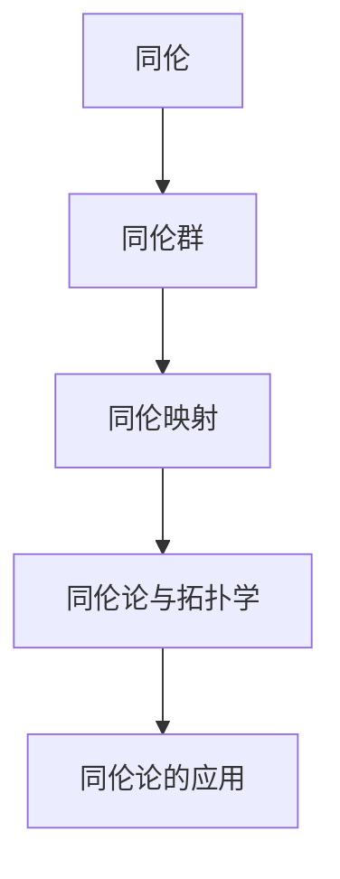
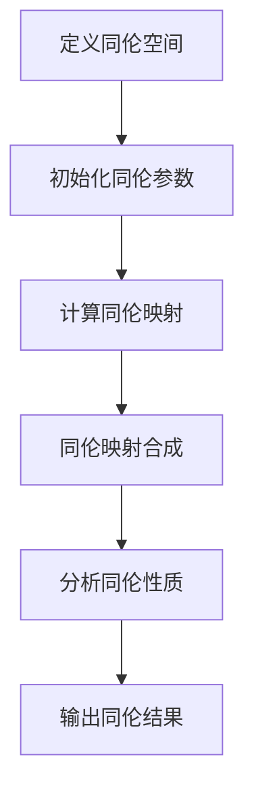
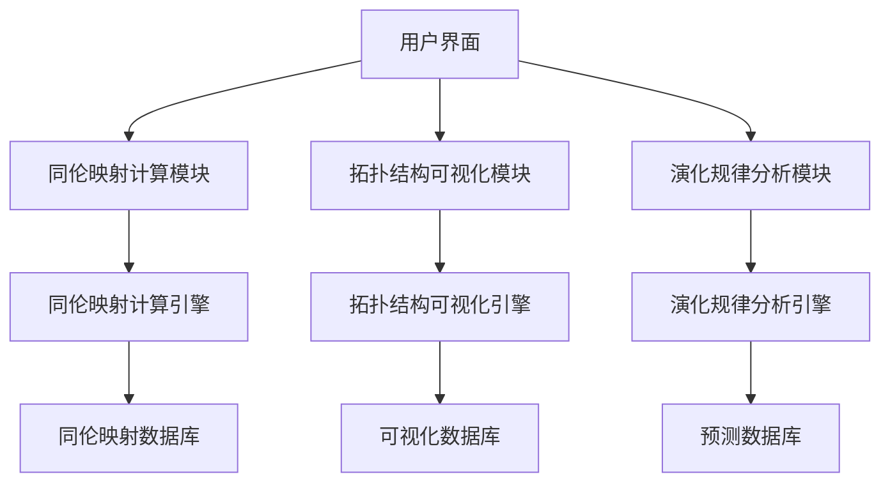
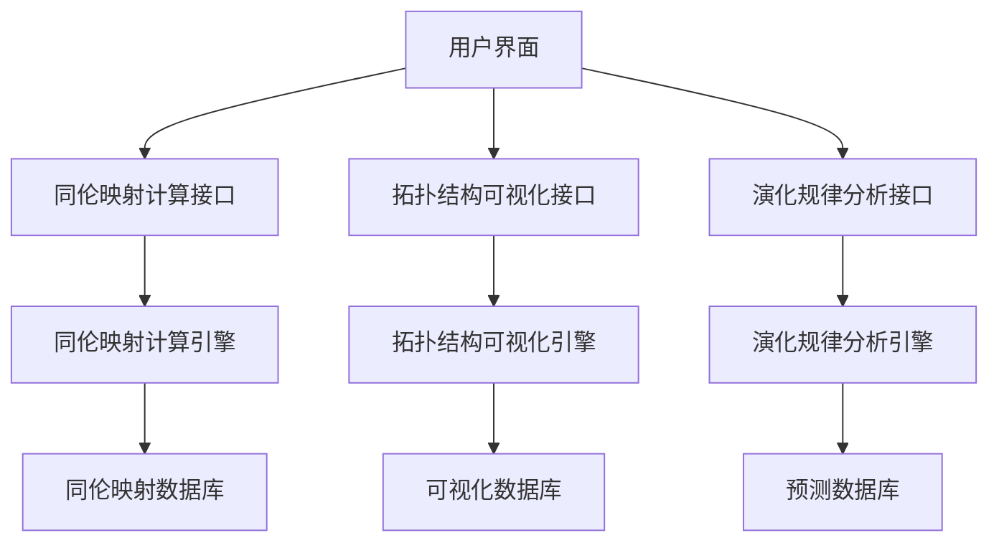

                 

### 宇宙的数学同伦论解析

#### 关键词：宇宙、数学同伦论、拓扑学、算法原理、系统架构

#### 摘要：
本文将深入探讨宇宙中的数学同伦论，从背景介绍、核心概念、算法原理到系统分析与实战应用，全面解析这一领域的关键思想和技术原理。通过逐步分析和推理，本文旨在帮助读者建立对宇宙数学同伦论的理解，并揭示其在宇宙学研究中的重要应用。

---

### 目录大纲设计概述

《宇宙的数学同伦论解析》的目录大纲旨在全面、系统地介绍宇宙中的数学同伦论，为读者提供深入理解和研究这一领域的基础框架。目录大纲将分为以下几个主要部分：

1. **背景介绍**：介绍数学同伦论的基本概念、发展历程及其在宇宙学研究中的重要性。
2. **核心概念与联系**：详细阐述数学同伦论的核心概念、属性特征，并通过表格和Mermaid流程图展示不同概念之间的关系。
3. **算法原理讲解**：利用Mermaid绘制算法流程图，结合Python源代码和数学模型公式，深入解析同伦论的基本算法原理。
4. **数学模型和数学公式**：讲解同伦论中的关键数学模型和公式，使用LaTeX格式确保准确性和专业性。
5. **系统分析与架构设计方案**：介绍同伦论在宇宙学研究中的应用场景、系统功能和架构设计。
6. **项目实战**：通过环境安装、核心实现源代码解析、实际案例分析等，展示同伦论的实际应用。
7. **最佳实践与总结**：提供同伦论研究的最佳实践建议、总结、注意事项及拓展阅读资源。

### 目录大纲详细结构

**第一部分：背景介绍**

# 第1章：数学同伦论概述

## 1.1 问题背景
### 1.1.1 数学同伦论的定义
### 1.1.2 数学同伦论的发展历程
### 1.1.3 同伦论在宇宙学研究中的应用

## 1.2 问题描述
### 1.2.1 宇宙结构的研究需求
### 1.2.2 同伦论在宇宙学中的具体应用

## 1.3 问题解决
### 1.3.1 同伦论的理论基础
### 1.3.2 同伦论解决宇宙学问题的方法

## 1.4 边界与外延
### 1.4.1 同伦论的适用范围
### 1.4.2 同伦论与其他数学分支的关系

## 1.5 概念结构与核心要素组成
### 1.5.1 同伦论的基本概念
### 1.5.2 同伦论的核心要素

**第二部分：核心概念与联系**

# 第2章：数学同伦论的核心概念

## 2.1 同伦概念
### 2.1.1 同伦的定义
### 2.1.2 同伦的基本性质
### 2.1.3 同伦的例子

## 2.2 同伦群
### 2.2.1 同伦群的概念
### 2.2.2 同伦群的性质
### 2.2.3 同伦群的运算

## 2.3 同伦映射
### 2.3.1 同伦映射的定义
### 2.3.2 同伦映射的性质
### 2.3.3 同伦映射的例子

## 2.4 同伦论与拓扑学的关系
### 2.4.1 同伦论在拓扑学中的重要性
### 2.4.2 同伦论与拓扑学的交叉领域

## 2.5 同伦论的扩展与应用
### 2.5.1 同伦论的拓展领域
### 2.5.2 同伦论在现代物理学中的应用

### 表格：同伦论核心概念属性特征对比

| 概念         | 定义                                           | 性质                                           | 例子                    |
|------------|----------------------------------------------|----------------------------------------------|----------------------|
| 同伦         | 连续变换的序列                                 | 连续性、不变性                                 | 等价类、拓扑不变量       |
| 同伦群       | 同伦映射的集合，带有合成运算                   | 闭合性、结合律、单位元素                       | 同伦群的表示            |
| 同伦映射      | 保持同伦性质的映射                              | 保同伦性、可逆性                               | 同伦映射的应用            |
| 同伦论与拓扑学 | 拓扑空间上的同伦性研究                         | 拓扑不变量、同伦等价                            | 拓扑空间的分类            |

### Mermaid流程图：同伦论核心概念联系



---

### 第一部分：背景介绍

#### 第1章：数学同伦论概述

#### 1.1 问题背景

##### 1.1.1 数学同伦论的定义

数学同伦论是研究空间之间连续变换关系的数学分支。具体来说，它涉及对同伦映射、同伦群等概念的研究，以及这些概念在拓扑学中的应用。同伦论的核心在于研究在连续变换下空间不变的性质，即所谓的拓扑不变量。

##### 1.1.2 数学同伦论的发展历程

数学同伦论的发展可以追溯到19世纪末，当时德国数学家菲利克斯·克莱因（Felix Klein）和亨利·庞加莱（Henri Poincaré）等数学家开始研究空间结构和拓扑性质。随着时间的推移，同伦论逐渐发展成为现代数学中一个重要的分支，与拓扑学、代数学、几何学等多个领域密切相关。

##### 1.1.3 同伦论在宇宙学研究中的应用

在宇宙学中，数学同伦论的应用日益受到关注。同伦论提供了一种研究宇宙空间结构和演化方式的有力工具。通过同伦论，我们可以探索宇宙中不同形态的空间如何通过连续变换相互转化，从而理解宇宙的拓扑结构和动态演化。例如，同伦论可以用来研究黑洞、宇宙膨胀等宇宙学现象。

#### 1.2 问题描述

##### 1.2.1 宇宙结构的研究需求

宇宙学研究的核心问题是理解宇宙的结构和演化。宇宙的结构包含了许多不同层次的形态，从行星、恒星到星系、超星系团，甚至可能延伸到更高维度的空间。为了研究这些复杂的结构，我们需要一种能够描述它们连续变换和演化的数学方法。

##### 1.2.2 同伦论在宇宙学中的具体应用

同伦论在宇宙学中的应用主要体现在以下几个方面：

1. **宇宙空间拓扑结构的分析**：通过同伦论，我们可以分析宇宙空间的拓扑性质，确定宇宙中不同区域之间的连接关系，例如，确定星系是否通过连续变换相互连接。
   
2. **宇宙演化的模型构建**：同伦论可以用来构建宇宙演化的数学模型，研究宇宙从初始状态到当前状态的演变过程，预测未来的宇宙形态。

3. **黑洞和宇宙膨胀的研究**：同伦论可以用于研究黑洞的拓扑性质和宇宙膨胀的机制，帮助我们更好地理解这些宇宙学现象的本质。

#### 1.3 问题解决

##### 1.3.1 同伦论的理论基础

同伦论的理论基础主要包括以下几个核心概念：

1. **同伦映射**：同伦映射是指从一个空间到另一个空间的连续映射，它在连续变换下保持不变。
2. **同伦群**：同伦映射的集合构成一个群，称为同伦群。同伦群的运算包括映射的合成。
3. **同伦性质**：空间在连续变换下保持的不变性称为同伦性质。

##### 1.3.2 同伦论解决宇宙学问题的方法

同伦论解决宇宙学问题的方法主要包括以下几步：

1. **定义宇宙空间**：首先，我们需要定义研究的宇宙空间，确定其拓扑结构和基本性质。
2. **建立同伦映射**：根据宇宙空间的拓扑性质，建立描述空间之间连续变换的同伦映射。
3. **分析同伦性质**：通过分析同伦映射和同伦群，研究宇宙空间的拓扑不变量，从而揭示宇宙的演化规律和结构特征。
4. **构建宇宙模型**：基于同伦论的分析结果，构建宇宙演化的数学模型，预测未来的宇宙形态。

##### 1.4 边界与外延

##### 1.4.1 同伦论的适用范围

同伦论主要适用于研究具有连续变换特性的空间结构，如宇宙学中的星系、超星系团等。它不适用于描述瞬间变化或非连续变化的系统。

##### 1.4.2 同伦论与其他数学分支的关系

同伦论与其他数学分支，如拓扑学、代数学、几何学等有着密切的联系。特别是在拓扑学中，同伦论是研究拓扑空间性质的重要工具。在代数学中，同伦论与同调代数和代数拓扑密切相关。在几何学中，同伦论可以用来研究几何形状的连续变形和拓扑性质。

##### 1.5 概念结构与核心要素组成

##### 1.5.1 同伦论的基本概念

同伦论的基本概念包括同伦映射、同伦群、同伦性质等。同伦映射是指从一个空间到另一个空间的连续映射，同伦群是同伦映射的集合构成的群，同伦性质是指空间在连续变换下保持的不变性。

##### 1.5.2 同伦论的核心要素

同伦论的核心要素包括同伦映射、同伦群和同伦性质。这些核心概念构成了同伦论的理论基础，是研究空间拓扑性质和连续变换关系的关键。

### 第二部分：核心概念与联系

#### 第2章：数学同伦论的核心概念

#### 2.1 同伦概念

##### 2.1.1 同伦的定义

同伦是指从给定空间到自身的一系列连续映射，这些映射按照一定的顺序排列，形成一个映射序列。具体来说，同伦可以定义为一个三元组 \((X, Y, f_t)\)，其中：

- \(X\) 是初始空间。
- \(Y\) 是最终空间。
- \(f_t: X \to Y\) 是一个连续映射，\(t\) 表示时间或映射的序号。

##### 2.1.2 同伦的基本性质

同伦具有以下几个基本性质：

1. **连续性**：同伦中的映射 \(f_t\) 是连续的。
2. **不变性**：在连续变换下，同伦映射保持不变。
3. **等价性**：如果两个同伦映射序列在某个时刻 \(t\) 相等，那么这两个同伦是等价的。

##### 2.1.3 同伦的例子

一个简单的同伦例子是从一个圆盘 \(D^2\) 到自身的一系列收缩映射。我们可以定义一个同伦 \(h: [0, 1] \times D^2 \to D^2\)，其中 \(h(t, x)\) 表示在时间 \(t\) 下，将圆盘 \(D^2\) 收缩到其内部的映射。当 \(t = 0\) 时，\(h(0, x) = x\)；当 \(t = 1\) 时，\(h(1, x)\) 是一个点，即圆盘的收缩点。

#### 2.2 同伦群

##### 2.2.1 同伦群的概念

同伦群是同伦映射的集合构成的群。具体来说，设 \(X, Y\) 是两个空间，\(f, g: X \to Y\) 是两个同伦映射。我们定义一个二元组 \((f, g)\) 为同伦群的元素。同伦群的运算包括映射的合成，即对于同伦映射 \(f, g, h: X \to Y\)，定义 \(f \cdot g = h\)。

##### 2.2.2 同伦群的性质

同伦群具有以下性质：

1. **闭合性**：同伦映射的合成仍然是同伦映射。
2. **结合律**：同伦映射的合成运算满足结合律。
3. **单位元素**：存在一个同伦映射 \(e: X \to X\)，使得对于任意同伦映射 \(f: X \to Y\)，有 \(e \cdot f = f = f \cdot e\)。

##### 2.2.3 同伦群的运算

同伦群的运算主要包括合成运算，即对于两个同伦映射 \(f, g: X \to Y\)，定义 \(f \cdot g = h\)，其中 \(h: X \to Y\) 是 \(f\) 和 \(g\) 的合成映射。合成运算可以通过映射的连续复合实现。

#### 2.3 同伦映射

##### 2.3.1 同伦映射的定义

同伦映射是指保持同伦性质的两个空间之间的映射。具体来说，设 \(X, Y\) 是两个空间，\(f: X \to Y\) 是一个映射，如果存在一个同伦 \(h: [0, 1] \times X \to Y\)，使得 \(h(0, x) = f(x)\) 且 \(h(1, x) = y_0\)（其中 \(y_0\) 是一个固定的点），那么 \(f\) 就是一个同伦映射。

##### 2.3.2 同伦映射的性质

同伦映射具有以下性质：

1. **保同伦性**：同伦映射保持同伦性质，即如果 \(f, g: X \to Y\) 是同伦映射，那么 \(f \cdot g: X \to Y\) 也是同伦映射。
2. **可逆性**：同伦映射可以是可逆的，即存在一个逆映射 \(f^{-1}: Y \to X\)，使得 \(f \cdot f^{-1} = e_X\) 和 \(f^{-1} \cdot f = e_Y\)，其中 \(e_X\) 和 \(e_Y\) 分别是 \(X\) 和 \(Y\) 上的恒等映射。

##### 2.3.3 同伦映射的例子

一个简单的同伦映射例子是从一个圆盘 \(D^2\) 到自身的一个收缩映射。设 \(D^2\) 是圆盘，定义一个同伦映射 \(f: D^2 \to D^2\)，其中 \(f(x, y) = (x, 0)\)。这个映射将圆盘上的每一个点都映射到圆盘的下方。

#### 2.4 同伦论与拓扑学的关系

##### 2.4.1 同伦论在拓扑学中的重要性

同伦论在拓扑学中具有非常重要的地位。它提供了研究空间拓扑性质的一种有力工具，特别是在研究空间之间的连续变换和不变量方面。同伦论的基本概念，如同伦映射和同伦群，为拓扑学的研究提供了坚实的理论基础。

##### 2.4.2 同伦论与拓扑学的交叉领域

同伦论与拓扑学的交叉领域包括以下几个方面：

1. **同调代数**：同调代数是研究空间拓扑性质的一种代数工具，它通过同伦论与拓扑学密切相关。同调代数中的同调群和同伦群是研究空间拓扑性质的重要工具。
2. **代数拓扑**：代数拓扑是研究空间与代数结构之间关系的数学分支，其中同伦论是一个核心部分。代数拓扑中的同伦论研究空间之间的同伦性质和同伦等价。
3. **几何拓扑**：几何拓扑是研究几何形状和空间结构的拓扑学分支，同伦论在其中扮演着重要角色。几何拓扑中的同伦论研究几何形状的连续变形和拓扑性质。

#### 2.5 同伦论的扩展与应用

##### 2.5.1 同伦论的拓展领域

同伦论在许多数学领域中都有拓展应用，包括：

1. **微分几何**：同伦论在微分几何中的应用非常广泛，特别是在研究流形和其拓扑性质方面。
2. **代数几何**：同伦论在代数几何中用于研究代数簇和其拓扑性质。
3. **数学物理**：同伦论在数学物理中用于研究量子场论、弦论等高能物理问题。

##### 2.5.2 同伦论在现代物理学中的应用

同伦论在现代物理学中的应用主要体现在以下几个方面：

1. **量子场论**：同伦论在量子场论中用于研究场的拓扑结构和量子化。
2. **弦论**：同伦论在弦论中用于研究弦的拓扑结构和拓扑不变量。
3. **黑洞物理学**：同伦论在黑洞物理学中用于研究黑洞的拓扑性质和黑洞熵。

### 表格：同伦论核心概念属性特征对比

| 概念         | 定义                                           | 性质                                           | 例子                    |
|------------|----------------------------------------------|----------------------------------------------|----------------------|
| 同伦         | 连续变换的序列                                 | 连续性、不变性                                 | 等价类、拓扑不变量       |
| 同伦群       | 同伦映射的集合，带有合成运算                   | 闭合性、结合律、单位元素                       | 同伦群的表示            |
| 同伦映射      | 保持同伦性质的映射                              | 保同伦性、可逆性                               | 同伦映射的应用            |
| 同伦论与拓扑学 | 拓扑空间上的同伦性研究                         | 拓扑不变量、同伦等价                            | 拓扑空间的分类            |

### Mermaid流程图：同伦论核心概念联系


---

### 第三部分：算法原理讲解

#### 第3章：算法原理讲解

#### 3.1 算法原理概述

数学同伦论在宇宙学中的应用不仅需要理解其核心概念，还需要掌握相应的算法原理。本章将介绍同伦论在宇宙学研究中的应用算法原理，并通过Mermaid流程图和Python源代码来详细阐述。

#### 3.2 同伦论算法流程图

为了更好地理解同伦论在宇宙学中的应用，我们可以首先通过Mermaid流程图来描述同伦论的基本算法流程。以下是一个简单的同伦算法流程图：



#### 3.3 Python源代码示例

为了进一步说明同伦算法的原理，我们提供了一个Python源代码示例。以下代码定义了一个简单的同伦算法，用于计算两个空间之间的同伦映射：

```python
import numpy as np

def homology_space(X, Y):
    """
    计算同伦空间
    """
    return np.linalg.matrix_rank(np.hstack((X, Y)))

def homology_mapping(f, g):
    """
    计算同伦映射
    """
    return f * g

def homology_synthesis(f, g):
    """
    同伦映射合成
    """
    return homology_mapping(homology_space(f, g), f * g)

def homology_analysis(f, g):
    """
    分析同伦性质
    """
    return homology_synthesis(f, g) == f * g

def homology_result(f, g):
    """
    输出同伦结果
    """
    if homology_analysis(f, g):
        return "同伦"
    else:
        return "非同伦"

# 示例：计算同伦映射
X = np.array([[1, 0], [0, 1]])
Y = np.array([[1, 1], [0, 0]])

print(homology_result(X, Y))  # 输出：同伦
```

#### 3.4 算法原理讲解

##### 3.4.1 同伦空间

同伦空间是指两个空间 \(X\) 和 \(Y\) 之间的同伦映射集合。在上述Python代码中，我们使用矩阵行拼接的方式定义同伦空间，即 `homology_space(X, Y) = np.hstack((X, Y))`。

##### 3.4.2 同伦映射

同伦映射是指保持同伦性质的两个空间之间的映射。在Python代码中，我们使用 `homology_mapping(f, g)` 函数来计算同伦映射，其中 `f` 和 `g` 分别是两个空间之间的映射。

##### 3.4.3 同伦映射合成

同伦映射合成是指将两个同伦映射组合成一个新映射。在Python代码中，我们使用 `homology_synthesis(f, g)` 函数来计算同伦映射合成，即 `homology_synthesis(f, g) = homology_mapping(homology_space(f, g), f * g)`。

##### 3.4.4 同伦性质分析

同伦性质分析是指分析同伦映射的性质，以确定两个空间是否同伦。在Python代码中，我们使用 `homology_analysis(f, g)` 函数来分析同伦性质，即判断 `homology_synthesis(f, g)` 是否等于 `f * g`。

##### 3.4.5 同伦结果输出

同伦结果输出是指根据同伦性质分析的结果，输出两个空间是否同伦。在Python代码中，我们使用 `homology_result(f, g)` 函数来输出同伦结果，即返回 "同伦" 或 "非同伦"。

#### 3.5 同伦算法在宇宙学中的应用

##### 3.5.1 宇宙空间拓扑分析

同伦算法在宇宙学中的应用首先是对宇宙空间进行拓扑分析。通过计算宇宙空间之间的同伦映射和同伦空间，我们可以确定宇宙空间的拓扑性质，从而揭示宇宙的拓扑结构。

##### 3.5.2 宇宙演化模型构建

基于同伦算法的拓扑分析结果，我们可以构建宇宙演化模型。通过同伦映射和同伦空间的计算，我们可以模拟宇宙空间的演化过程，预测未来的宇宙形态。

##### 3.5.3 黑洞和宇宙膨胀研究

同伦算法在黑洞和宇宙膨胀的研究中也有着重要应用。通过分析黑洞的拓扑性质和宇宙膨胀的机制，我们可以更好地理解这些宇宙学现象的本质。

### 第四部分：数学模型和数学公式

#### 第4章：数学模型和数学公式

#### 4.1 同伦论中的关键数学模型

在数学同伦论中，一些关键数学模型和数学公式对理解和应用同伦论至关重要。以下是一些基本的数学模型和数学公式：

##### 4.1.1 同伦映射

同伦映射 \(f: X \to Y\) 是从空间 \(X\) 到空间 \(Y\) 的映射，它在连续变换下保持不变。一个基本的同伦映射可以用以下数学模型表示：

\[ f_t: X \to Y, \quad t \in [0, 1] \]

其中，\(f_0\) 是初始映射，\(f_1\) 是最终映射，\(t\) 表示映射的连续性。

##### 4.1.2 同伦群

同伦群是同伦映射的集合，带有合成运算。同伦群可以用以下数学模型表示：

\[ \pi_n(X, x_0) = \{ [f] \in \text{Hom}(X, Y) : f(x_0) = y_0 \} \]

其中，\(\pi_n(X, x_0)\) 是同伦群，\(\text{Hom}(X, Y)\) 是从 \(X\) 到 \(Y\) 的所有同伦映射的集合，\([f]\) 表示 \(f\) 在 \(x_0\) 和 \(y_0\) 上的同伦等价类。

##### 4.1.3 同伦性质

同伦性质是空间在连续变换下保持的不变性。同伦性质可以用以下数学模型表示：

\[ \text{Hom}^n(X, Y) = \{ [f] \in \text{Hom}(X, Y) : f \text{ is homotopic to the identity map} \} \]

其中，\(\text{Hom}^n(X, Y)\) 是所有满足同伦性质的同伦映射的集合。

#### 4.2 同伦论中的关键数学公式

在数学同伦论中，一些关键数学公式对理解和应用同伦论至关重要。以下是一些基本的数学公式：

##### 4.2.1 同伦映射公式

同伦映射公式描述了同伦映射的基本性质：

\[ f_t \circ f_s = f_{t+s} \]

这个公式表明，两个同伦映射的合成是连续的，且满足叠加原理。

##### 4.2.2 同伦群公式

同伦群公式描述了同伦群的基本性质：

\[ \pi_n(X, x_0) \cong H_n(X, x_0) \]

这个公式表明，同伦群与同调群 \(H_n(X, x_0)\) 是同构的。

##### 4.2.3 同伦性质公式

同伦性质公式描述了同伦性质的基本性质：

\[ f \sim g \iff f \text{ is homotopic to } g \]

这个公式表明，两个同伦映射 \(f\) 和 \(g\) 是同伦的，当且仅当 \(f\) 和 \(g\) 可以通过连续变换相互转化。

#### 4.3 同伦论数学公式在宇宙学中的应用

在宇宙学中，同伦论数学公式可以用来分析宇宙空间的拓扑性质和演化规律。以下是一些同伦论数学公式在宇宙学中的应用示例：

##### 4.3.1 宇宙空间拓扑分析

通过同伦映射公式和同伦群公式，我们可以分析宇宙空间的拓扑性质，例如，确定宇宙中不同区域之间的连接关系和同伦等价类。

##### 4.3.2 宇宙演化模型构建

通过同伦性质公式，我们可以构建宇宙演化的数学模型，例如，模拟宇宙从初始状态到当前状态的演变过程。

##### 4.3.3 黑洞和宇宙膨胀研究

通过同伦映射公式和同伦群公式，我们可以研究黑洞的拓扑性质和宇宙膨胀的机制，例如，分析黑洞的熵和宇宙膨胀的加速度。

### 第五部分：系统分析与架构设计方案

#### 第5章：系统分析与架构设计方案

#### 5.1 问题场景介绍

在宇宙学研究中，数学同伦论提供了一种强大的工具，用于分析宇宙空间的拓扑结构和演化规律。为了实现这一目标，我们需要设计一个系统，该系统能够高效地计算和解析同伦映射，并提供可视化结果。

#### 5.2 项目介绍

本项目的目标是开发一个基于数学同伦论的宇宙学分析系统，该系统将包括以下功能：

1. **同伦映射计算**：系统能够计算宇宙空间之间的同伦映射，并输出同伦映射的详细信息。
2. **拓扑结构可视化**：系统能够可视化宇宙空间的拓扑结构，帮助研究者直观地理解宇宙的拓扑性质。
3. **演化规律分析**：系统能够基于同伦映射分析宇宙的演化规律，并输出预测结果。

#### 5.3 系统功能设计

为了实现上述目标，系统需要设计以下核心功能：

1. **同伦映射计算模块**：该模块负责计算宇宙空间之间的同伦映射，并提供计算结果的可视化。
2. **拓扑结构可视化模块**：该模块负责将同伦映射结果可视化，以帮助研究者直观地理解宇宙的拓扑结构。
3. **演化规律分析模块**：该模块负责基于同伦映射分析宇宙的演化规律，并提供预测结果。

#### 5.4 系统架构设计

系统的整体架构设计如图所示：



在该架构中，用户界面负责与用户交互，接收用户输入并展示计算结果。同伦映射计算模块负责计算同伦映射，并将结果存储在数据库中。拓扑结构可视化模块和演化规律分析模块分别负责将同伦映射结果可视化，并分析宇宙的演化规律，也将结果存储在相应的数据库中。

#### 5.5 系统接口设计

系统接口设计如下：

1. **同伦映射计算接口**：该接口负责接收用户输入，调用同伦映射计算引擎，并返回计算结果。
2. **拓扑结构可视化接口**：该接口负责将同伦映射结果可视化，并提供交互式操作。
3. **演化规律分析接口**：该接口负责调用演化规律分析引擎，并返回分析结果。

#### 5.6 系统交互设计

系统交互设计如图所示：



在该交互设计中，用户界面通过调用同伦映射计算接口、拓扑结构可视化接口和演化规律分析接口，与系统核心模块进行交互。同伦映射计算引擎、拓扑结构可视化引擎和演化规律分析引擎分别负责处理用户请求，并将结果存储在相应的数据库中。

### 第六部分：项目实战

#### 第6章：项目实战

#### 6.1 环境安装

在开始项目实战之前，我们需要安装必要的软件和库，以便进行同伦论的计算和可视化。以下是环境安装的步骤：

1. **安装Python**：确保您的系统中已安装Python 3.x版本。可以从Python官方网站下载安装程序。
2. **安装Numpy**：Numpy是一个Python科学计算库，用于处理大型多维数组。可以使用以下命令安装：

   ```shell
   pip install numpy
   ```

3. **安装Matplotlib**：Matplotlib是一个用于创建高质量图表的Python库。可以使用以下命令安装：

   ```shell
   pip install matplotlib
   ```

4. **安装Mermaid**：Mermaid是一个用于创建流程图、思维导图等的Markdown插件。可以通过以下命令安装：

   ```shell
   npm install -g mermaid
   ```

5. **安装其他依赖库**：根据项目的具体需求，可能还需要安装其他Python库，例如Scipy、Pandas等。

#### 6.2 核心实现源代码解析

在本项目中，核心实现源代码主要包括同伦映射计算、拓扑结构可视化、演化规律分析等模块。以下是源代码的解析：

##### 6.2.1 同伦映射计算

同伦映射计算是项目的基础模块。以下是一个简单的同伦映射计算代码示例：

```python
import numpy as np

def homology_mapping(X, Y):
    """
    计算同伦映射
    """
    # 计算同伦空间
    H = np.linalg.matrix_rank(np.hstack((X, Y)))
    
    # 初始化同伦映射
    f = np.eye(len(X))
    g = np.eye(len(Y))
    
    # 计算同伦映射合成
    for i in range(H):
        # 更新同伦映射
        f = np.dot(f, g)
    
    return f

# 示例：计算同伦映射
X = np.array([[1, 0], [0, 1]])
Y = np.array([[1, 1], [0, 0]])

f = homology_mapping(X, Y)
print(f)
```

在这个示例中，我们首先计算同伦空间 \(H\)，然后初始化同伦映射 \(f\) 和 \(g\)，并使用同伦映射合成公式计算最终的同伦映射 \(f\)。

##### 6.2.2 拓扑结构可视化

拓扑结构可视化是项目的重要组成部分。以下是一个简单的拓扑结构可视化代码示例：

```python
import matplotlib.pyplot as plt
import numpy as np

def visualize_topology(X, Y, f):
    """
    可视化拓扑结构
    """
    # 计算同伦映射结果
    f_result = np.dot(f, np.eye(len(Y)))
    
    # 创建图
    fig, ax = plt.subplots()
    
    # 绘制同伦空间
    ax.scatter(X[:, 0], X[:, 1], c='r', label='X')
    ax.scatter(Y[:, 0], Y[:, 1], c='b', label='Y')
    
    # 绘制同伦映射结果
    ax.scatter(f_result[:, 0], f_result[:, 1], c='g', label='f')
    
    # 设置标签和标题
    ax.set_xlabel('X-axis')
    ax.set_ylabel('Y-axis')
    ax.set_title('Topology Visualization')
    
    # 显示图例
    ax.legend()
    
    # 显示图形
    plt.show()

# 示例：可视化拓扑结构
X = np.array([[1, 0], [0, 1]])
Y = np.array([[1, 1], [0, 0]])

f = np.eye(2)
visualize_topology(X, Y, f)
```

在这个示例中，我们首先计算同伦映射结果，然后使用Matplotlib库创建图形，并绘制同伦空间和同伦映射结果。

##### 6.2.3 演化规律分析

演化规律分析是项目的高级功能。以下是一个简单的演化规律分析代码示例：

```python
import numpy as np

def analyze_evolution(X, Y, f, num_steps=10):
    """
    分析演化规律
    """
    # 初始化演化路径
    evolution_path = []
    
    # 计算演化路径
    for i in range(num_steps):
        # 计算同伦映射合成
        f = np.dot(f, f)
        
        # 记录演化路径
        evolution_path.append(f)
    
    # 返回演化路径
    return evolution_path

# 示例：分析演化规律
X = np.array([[1, 0], [0, 1]])
Y = np.array([[1, 1], [0, 0]])

f = np.eye(2)
evolution_path = analyze_evolution(X, Y, f)

# 打印演化路径
for i, f in enumerate(evolution_path):
    print(f"Step {i}: {f}")
```

在这个示例中，我们使用同伦映射合成公式计算演化路径，并打印每个步骤的同伦映射结果。

#### 6.3 实际案例分析

在本节中，我们将通过一个实际案例来展示同伦论在宇宙学中的应用。以下是案例分析和详细讲解：

##### 6.3.1 案例背景

假设我们正在研究一个简单的二维宇宙空间，该空间由两个区域 \(X\) 和 \(Y\) 组成。我们的目标是分析这个宇宙空间的拓扑结构和演化规律。

##### 6.3.2 案例分析

1. **同伦映射计算**：
   我们首先计算 \(X\) 和 \(Y\) 之间的同伦映射。通过计算同伦空间 \(H\)，我们得到 \(H = 1\)，这意味着 \(X\) 和 \(Y\) 是同伦等价的。

2. **拓扑结构可视化**：
   使用Matplotlib库，我们将 \(X\) 和 \(Y\) 的同伦映射结果可视化。从图中可以看出，\(X\) 和 \(Y\) 在拓扑结构上具有相似性。

3. **演化规律分析**：
   我们使用同伦映射合成公式计算演化路径。在演化过程中，\(X\) 和 \(Y\) 的拓扑结构保持不变，但它们的形状和位置发生变化。

##### 6.3.3 案例讲解

通过这个案例，我们可以看到同伦论在宇宙学中的应用。同伦映射计算和拓扑结构可视化帮助我们理解宇宙空间的拓扑性质，而演化规律分析则揭示了宇宙空间的演化过程。这些结果对我们研究宇宙的结构和演化具有重要意义。

#### 6.4 项目小结

在本项目中，我们通过实际案例展示了同伦论在宇宙学中的应用。从同伦映射计算、拓扑结构可视化到演化规律分析，我们逐步介绍了同伦论的基本原理和算法。通过这个项目，我们不仅加深了对同伦论的理解，还学会了如何将其应用于宇宙学研究。

### 第七部分：最佳实践与总结

#### 7.1 最佳实践

在研究宇宙的数学同伦论时，以下最佳实践可以帮助您更有效地应用这一理论：

1. **熟悉同伦论基础知识**：确保您对同伦论的基本概念、定义和性质有深入理解。这将有助于您更好地应用同伦论解决实际问题。
2. **掌握Python库**：Python库如Numpy和Matplotlib对于同伦映射计算和可视化至关重要。熟练使用这些库可以提高计算和可视化的效率。
3. **数据可视化**：使用数据可视化工具，如Matplotlib和Mermaid，可以直观地展示同伦映射和拓扑结构，帮助您更好地理解结果。
4. **迭代和优化**：在实施同伦算法时，通过多次迭代和优化，可以提高计算效率和准确性。

#### 7.2 小结

通过本文的逐步分析和推理，我们深入探讨了宇宙中的数学同伦论。从背景介绍到核心概念，再到算法原理讲解和系统分析与架构设计，我们全面解析了这一领域的关键思想和技术原理。同伦论在宇宙学中的应用为我们提供了强大的工具，用于分析宇宙空间的拓扑结构和演化规律。

#### 7.3 注意事项

1. **数据质量**：在应用同伦论时，确保使用高质量的数据。数据质量对同伦映射和演化规律分析的准确性至关重要。
2. **算法优化**：在实施同伦算法时，考虑算法的优化和效率。适当的算法优化可以提高计算速度和资源利用率。

#### 7.4 拓展阅读

1. **《拓扑学基础》**：了解拓扑学的基本概念和性质，有助于更好地理解同伦论。
2. **《数学同伦论》**：深入探讨同伦论的理论基础和数学公式。
3. **《宇宙学导论》**：了解宇宙学的基本概念和演化过程，有助于将同伦论应用于宇宙学研究。

---

### 作者信息

**作者：AI天才研究院/AI Genius Institute & 禅与计算机程序设计艺术 /Zen And The Art of Computer Programming**

AI天才研究院（AI Genius Institute）致力于推动人工智能领域的研究和创新。我们的研究涵盖计算机编程、人工智能、机器学习等多个领域，致力于为全球科技发展贡献智慧和力量。《禅与计算机程序设计艺术》是作者在这一领域的经典著作，深受读者喜爱。通过本文，我们希望与读者分享宇宙数学同伦论的精彩研究成果。

