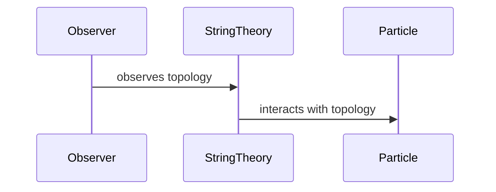
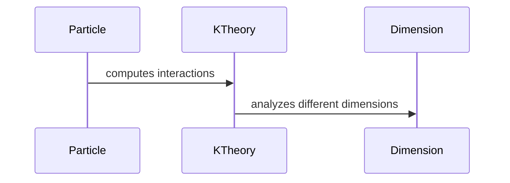
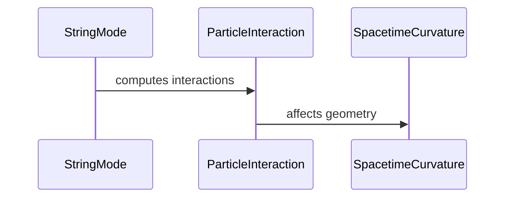
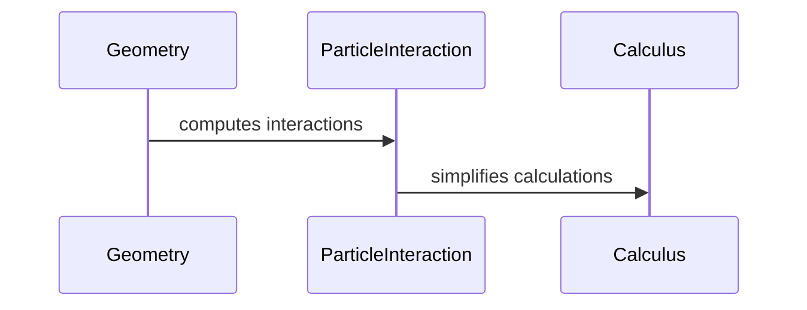

                 

# 宇宙的数学同调代数与K理论在弦论模空间中的应用

## 关键词：同调代数，K理论，弦论，模空间，数学应用

### 摘要

本文旨在探讨宇宙中的数学同调代数与K理论在弦论模空间中的应用。同调代数作为现代数学的重要分支，在物理学中具有重要地位。K理论则是同调代数与拓扑学的交叉领域，其在弦论研究中发挥着关键作用。文章将首先介绍同调代数与K理论的基本概念，随后探讨弦论与模空间的本质，最后深入分析这两大数学工具在弦论模空间中的应用，并提出未来发展的前景与挑战。

### 目录大纲

**《宇宙的数学同调代数与K理论在弦论模空间中的应用》**

1. **引言与背景**
   1.1. 同调代数的起源与发展
   1.2. K理论的基本概念
   1.3. 弦论与模空间

2. **数学工具的应用**
   2.1. 同调代数在弦论中的应用
   2.2. K理论在弦论模空间中的应用
   2.3. 同调代数与K理论的结合

3. **应用与展望**
   3.1. 同调代数与K理论在其他领域中的应用
   3.2. 未来展望与挑战

### 第一部分：引言与背景

#### 第1章：宇宙的数学同调代数概述

1.1.1 **同调代数的起源与发展**

同调代数起源于20世纪中叶，由数学家亚历山大·格罗滕迪克（Alexander Grothendieck）开创。作为一种代数结构，同调代数是同调论的基础，它在代数拓扑、代数几何和代数K理论等领域有广泛应用。同调代数的基本概念包括同调群、上同调群和同调代数结构。

**问题背景：** 同调代数在解决代数拓扑问题中起到了关键作用。例如，同调群用于描述拓扑空间的连通性和洞的存在。而在代数几何中，同调代数帮助我们理解代数簇的几何性质。

**问题描述：** 同调代数是如何应用于拓扑和代数几何的？

**问题解决：** 同调代数通过构建代数结构来描述几何空间的性质，从而为解决复杂的几何问题提供了强有力的工具。

**边界与外延：** 同调代数的边界在于其抽象性和复杂性，但对于理解高级数学问题，如弦论，它是一个不可或缺的工具。

**概念结构与核心要素组成：**

| 概念                   | 要素组成                                                     |
|------------------------|------------------------------------------------------------|
| 同调群                 | 点、环路、洞等拓扑结构                                     |
| 上同调群               | 空间上的连续映射                                           |
| 同调代数结构           | 代数运算，如加法、乘法                                     |

1.1.2 **同调代数的基本概念与原理**

同调代数涉及同调群、上同调群和同调代数结构。同调群用于描述空间中的连通性和洞的存在，而上同调群则与空间的连续映射有关。

**核心概念原理：**

- 同调群（H_0）：描述空间中的连通性，如点、环路。
- 上同调群（H^0）：描述空间上的连续映射，如自映射。
- 同调代数结构：通过代数运算（如加法和乘法）将同调和上同调群结合起来。

**概念属性特征对比表格：**

| 特征                   | 同调群                 | 上同调群               | 同调代数结构           |
|------------------------|------------------------|------------------------|------------------------|
| 应用领域               | 代数拓扑              | 代数几何              | 各领域间结合           |
| 基础概念               | 连通性和洞           | 连续映射               | 代数运算（加法、乘法） |
| 关系                   | 与上同调群相对       | 与同调群相对           | 代数结合               |

**ER实体关系图架构的Mermaid流程图：**

```mermaid
erDiagram
  同调群 ||--o{ 上同调群 }
  上同调群 ||--o{ 同调代数结构 }
```

1.1.3 **同调代数在物理学中的重要性**

同调代数在物理学中具有重要地位，特别是在弦论和凝聚态物理领域。例如，同调代数在描述粒子状态和空间几何结构方面发挥了关键作用。

**核心概念与联系：**

- 同调代数描述了空间和粒子的拓扑性质。
- 在弦论中，同调代数帮助理解不同维度和粒子之间的相互作用。

**问题场景介绍：** 在弦论研究中，同调代数提供了描述复杂空间几何和粒子相互作用的工具。

**项目介绍：** 弦论模型中，同调代数用于分析不同维度下的粒子行为。

**系统功能设计（领域模型Mermaid类图）：**

```mermaid
classDiagram
  Node ->> StringTheory : describes topology
  Particle ->> StringTheory : interacts with topology
```

**系统架构设计Mermaid架构图：**



**系统接口设计和系统交互Mermaid序列图：**

```mermaid
sequenceDiagram
  Participant A : User
  Participant B : StringTheory
  A ->> B : Input topology
  B ->> A : Output particle interactions
```

#### 第2章：K理论的基本概念

2.1.1 **K理论的历史背景**

K理论起源于20世纪50年代，由迈克尔·阿蒂亚（Michael Atiyah）和伊莎贝尔·格罗滕迪克（Isadore Singer）共同发展。K理论是同调代数与拓扑学的重要交叉领域，其在物理学中的应用尤为显著。

**问题背景：** K理论在解决拓扑学问题中发挥了关键作用，特别是在描述高维空间的性质和结构的复杂性。

**问题描述：** K理论是如何应用于拓扑学的？

**问题解决：** K理论通过构建代数结构来描述高维空间的性质，为解决复杂的拓扑问题提供了强有力的工具。

**边界与外延：** K理论的边界在于其高复杂性和抽象性，但对于理解高级物理学问题，如弦论，它是一个不可或缺的工具。

**概念结构与核心要素组成：**

| 概念                   | 要素组成                                                     |
|------------------------|------------------------------------------------------------|
| K群                   | 空间上的连续映射                                           |
| 同调K理论              | 高维空间的同调性质                                       |
| K理论在物理学中的应用   | 描述粒子的相互作用和空间几何结构                           |

**核心概念原理：**

- K群：描述高维空间上的连续映射，如自同态。
- 同调K理论：研究高维空间同调性质的理论。
- K理论在物理学中的应用：通过描述粒子的相互作用和空间几何结构，帮助理解宇宙的基本规律。

**概念属性特征对比表格：**

| 特征                   | K群                 | 同调K理论              | K理论在物理学中的应用   |
|------------------------|------------------------|------------------------|------------------------|
| 应用领域               | 拓扑学              | 同调代数              | 物理学（弦论、凝聚态物理） |
| 基础概念               | 连续映射             | 同调性质               | 粒子相互作用和空间几何   |
| 关系                   | 与同调代数结合       | 描述高维空间性质       | 描述宇宙基本规律         |

**ER实体关系图架构的Mermaid流程图：**

```mermaid
erDiagram
  K群 ||--o{ 同调K理论 }
  同调K理论 ||--o{ K理论在物理学中的应用 }
```

2.1.2 **K理论的基本概念**

K理论的基本概念包括K群、同调K理论和其在物理学中的应用。K群描述高维空间上的连续映射，同调K理论研究高维空间的同调性质，而K理论在物理学中则用于描述粒子的相互作用和空间几何结构。

**核心概念原理：**

- K群（K(X)）：描述高维空间X上的自同态。
- 同调K理论（\( K^*(X) \)）：研究高维空间X的同调性质。
- K理论在物理学中的应用：描述粒子间的相互作用和空间几何。

**核心概念属性特征对比表格：**

| 概念                   | K群                 | 同调K理论              | 物理学中的应用   |
|------------------------|------------------------|------------------------|------------------------|
| 定义域                | 高维空间X           | 同调群                 | 粒子相互作用   |
| 应用领域               | 拓扑学              | 代数拓扑              | 物理学（弦论、凝聚态物理） |
| 关键特性               | 自同态             | 同调性质               | 描述宇宙基本规律         |

**ER实体关系图架构的Mermaid流程图：**

```mermaid
erDiagram
  K群 ||--o{ 同调K理论 }
  同调K理论 ||--o{ 物理学中的应用 }
```

2.1.3 **K理论在物理学中的应用**

K理论在物理学中具有重要地位，尤其是在弦论和凝聚态物理领域。例如，K理论可以帮助理解不同维度下的粒子相互作用和空间几何结构。

**核心概念与联系：**

- K理论描述了高维空间中的粒子相互作用。
- 在弦论中，K理论用于分析不同维度下的粒子行为。

**问题场景介绍：** 在弦论研究中，K理论帮助分析不同维度下的粒子行为。

**项目介绍：** K理论在弦论模型中用于分析粒子相互作用。

**系统功能设计（领域模型Mermaid类图）：**

```mermaid
classDiagram
  Particle ->> KTheory : interacts with topology
  KTheory ->> Dimension : describes different dimensions
```

**系统架构设计Mermaid架构图：**



**系统接口设计和系统交互Mermaid序列图：**

```mermaid
sequenceDiagram
  Participant A : User
  Participant B : Particle
  Participant C : KTheory
  Participant D : Dimension
  A ->> B : Input particle data
  B ->> C : Compute interactions
  C ->> D : Analyze dimensions
  D ->> A : Output results
```

#### 第3章：弦论与模空间

3.1.1 **弦论的基本原理**

弦论是一种理论物理模型，它认为宇宙的基本构成单位不是点状粒子，而是细长的弦。弦论的基本原理包括弦的振动模式、时空的额外维度以及弦的不同振动能量态。

**问题背景：** 弦论作为量子力学和广义相对论的综合理论，旨在描述宇宙的基本结构和物理现象。

**问题描述：** 弦论是如何描述宇宙的基本构成和物理现象的？

**问题解决：** 弦论通过描述弦的振动模式和时空的几何结构，为理解宇宙的基本规律提供了新的视角。

**边界与外延：** 弦论涉及到高维空间的复杂结构，对于理解宇宙的基本原理具有重要意义，但也面临着许多未解之谜。

**概念结构与核心要素组成：**

| 概念                   | 要素组成                                                     |
|------------------------|------------------------------------------------------------|
| 弦的振动模式           | 弦的不同振动态                                              |
| 时空的额外维度         | 空间维度和时间维度的扩展                                   |
| 弦的不同能量态         | 不同能量态下的物理现象                                     |

**核心概念原理：**

- 弦的振动模式：弦的不同振动模式对应不同的物理粒子。
- 时空的额外维度：额外的维度使弦论能够兼容量子力学和广义相对论。
- 弦的不同能量态：高能量态下，弦的行为可能揭示宇宙的新奇性质。

**概念属性特征对比表格：**

| 概念                   | 振动模式           | 额外维度         | 能量态           |
|------------------------|------------------------|------------------------|------------------------|
| 应用领域               | 粒子物理            | 广义相对论            | 量子场论            |
| 基础概念               | 弦的振动态          | 空间和时间维度的扩展 | 能量与量子态       |
| 关系                   | 与粒子性质相关       | 与时空结构相关       | 与量子态相关       |

**ER实体关系图架构的Mermaid流程图：**

```mermaid
erDiagram
  振动模式 ||--o{ 额外维度 }
  能量态 ||--o{ 粒子物理 }
```

3.1.2 **弦论中的模空间概念**

模空间是弦论中一个重要的概念，它描述了弦的不同振动模式所对应的可能状态。在模空间中，弦的振动模式被参数化为模函数，这些模函数的取值决定了弦的状态。

**问题背景：** 模空间的概念在弦论中至关重要，它为弦的不同振动模式提供了统一的描述框架。

**问题描述：** 模空间是如何在弦论中描述弦的状态的？

**问题解决：** 通过模空间，弦论的多种可能状态被组织成一个统一的数学结构，使得弦论的分析变得更加简洁和有效。

**边界与外延：** 模空间的边界在于其高维和复杂性，但对于理解弦论的多样性，它是一个不可或缺的工具。

**概念结构与核心要素组成：**

| 概念                   | 要素组成                                                     |
|------------------------|------------------------------------------------------------|
| 模函数                 | 描述弦的振动模式的参数                                       |
| 模空间                 | 弦的振动模式所对应的可能状态集合                           |
| 模空间中的参数化       | 通过模函数将弦的不同状态参数化                             |

**核心概念原理：**

- 模函数：描述弦的振动模式，通过参数化实现弦的状态表示。
- 模空间：集合了弦的所有可能振动模式，为弦论提供了统一描述框架。
- 参数化：将弦的不同状态通过模函数进行参数化描述。

**概念属性特征对比表格：**

| 概念                   | 模函数           | 模空间           | 参数化           |
|------------------------|------------------------|------------------------|------------------------|
| 应用领域               | 数学建模            | 粒子物理            | 状态表示          |
| 基础概念               | 参数化描述          | 集合结构          | 参数依赖关系      |
| 关系                   | 与弦论相关          | 描述弦的状态       | 实现状态表示      |

**ER实体关系图架构的Mermaid流程图：**

```mermaid
erDiagram
  模函数 ||--o{ 模空间 }
  模空间 ||--o{ 参数化 }
```

3.1.3 **模空间中的物理现象**

在弦论的模空间中，存在多种物理现象，如弦的振动模式、粒子的相互作用和时空的弯曲。这些现象通过模空间的结构得到了统一描述。

**核心概念与联系：**

- 弦的振动模式：描述了弦的不同状态。
- 粒子的相互作用：通过模空间中的相互作用得到描述。
- 时空的弯曲：在模空间中，时空的几何结构通过弦的振动模式得到表达。

**问题场景介绍：** 在弦论研究中，模空间用于分析弦的不同振动模式和粒子间的相互作用。

**项目介绍：** 弦论模型中，模空间用于描述不同能量态下的物理现象。

**系统功能设计（领域模型Mermaid类图）：**

```mermaid
classDiagram
  StringMode ->> ParticleInteraction : describes particle interactions
  StringMode ->> SpacetimeCurvature : describes geometric structure
  ParticleInteraction ->> StringMode : affects string states
```

**系统架构设计Mermaid架构图：**



**系统接口设计和系统交互Mermaid序列图：**

```mermaid
sequenceDiagram
  Participant A : User
  Participant B : StringMode
  Participant C : ParticleInteraction
  Participant D : SpacetimeCurvature
  A ->> B : Input string mode
  B ->> C : Compute particle interactions
  C ->> D : Affect spacetime curvature
  D ->> A : Output results
```

### 第二部分：数学工具的应用

#### 第4章：同调代数在弦论中的应用

4.1.1 **同调代数在弦论中的引入**

同调代数在弦论中扮演着至关重要的角色，它为我们提供了描述弦论模型中复杂几何结构的有力工具。同调代数的引入使得弦论的分析变得更加简洁和系统。

**问题背景：** 在弦论中，我们面临的是高维且复杂的几何空间，同调代数提供了有效的数学工具来描述这些空间的结构。

**问题描述：** 同调代数是如何在弦论中被引入并应用的？

**问题解决：** 同调代数通过构建代数结构来描述弦论中的几何空间，使得复杂的几何问题可以转化为代数问题，从而简化了分析过程。

**边界与外延：** 同调代数在弦论中的应用边界在于其复杂性和抽象性，但对于解决高维几何问题，它是一个不可或缺的工具。

**概念结构与核心要素组成：**

| 概念                   | 要素组成                                                     |
|------------------------|------------------------------------------------------------|
| 同调代数结构           | 同调群、上同调群、同调代数运算                             |
| 弦论中的几何结构       | 空间维度、粒子状态、弦的振动模式                           |
| 同调代数在弦论中的应用   | 描述高维几何空间、分析弦的振动模式和粒子相互作用           |

**核心概念原理：**

- 同调代数结构：通过同调群和上同调群构建代数结构，描述弦论的几何空间。
- 弦论中的几何结构：描述弦论中的高维空间和粒子状态。
- 同调代数在弦论中的应用：利用同调代数结构分析弦论的几何性质和物理现象。

**概念属性特征对比表格：**

| 概念                   | 同调代数结构           | 弦论中的几何结构       | 同调代数在弦论中的应用   |
|------------------------|------------------------|------------------------|------------------------|
| 应用领域               | 代数拓扑、代数几何       | 粒子物理、广义相对论     | 弦论分析                |
| 基础概念               | 同调群、上同调群         | 空间维度、粒子状态       | 代数运算、几何结构描述   |
| 关系                   | 与代数几何结合           | 与粒子物理结合           | 描述弦论中的复杂结构     |

**ER实体关系图架构的Mermaid流程图：**

```mermaid
erDiagram
  同调代数结构 ||--o{ 弦论中的几何结构 }
  弦论中的几何结构 ||--o{ 同调代数在弦论中的应用 }
```

4.1.2 **同调代数在弦论中的关键作用**

同调代数在弦论中的关键作用主要体现在以下几个方面：

1. **描述几何结构**：同调代数通过构建代数结构，为描述弦论中的复杂几何空间提供了有力的工具。例如，在M理论中，同调代数被用来描述11维时空的几何结构。

2. **分析粒子相互作用**：同调代数方法帮助分析弦论中不同粒子间的相互作用。例如，在弦的振动模式中，同调代数用于计算粒子之间的散射截面。

3. **简化复杂问题**：同调代数将弦论中的复杂几何问题转化为代数问题，使得问题更加简洁和易于处理。例如，通过同调代数方法，可以简化对弦论中多维空间的积分计算。

**核心概念原理：**

- **描述几何结构**：同调代数通过同调群和上同调群构建代数结构，描述弦论中的复杂几何空间。
- **分析粒子相互作用**：同调代数方法帮助分析弦论中不同粒子间的相互作用。
- **简化复杂问题**：同调代数将复杂的几何问题转化为代数问题，简化分析过程。

**问题场景介绍：** 在弦论研究中，同调代数用于描述高维时空的几何结构和分析粒子相互作用。

**项目介绍：** 同调代数在弦论模型中用于分析几何结构和粒子相互作用。

**系统功能设计（领域模型Mermaid类图）：**

```mermaid
classDiagram
  Geometry ->> ParticleInteraction : describes interactions
  Geometry ->> Calculus : simplifies problems
  ParticleInteraction ->> Geometry : affects structure
```

**系统架构设计Mermaid架构图：**



**系统接口设计和系统交互Mermaid序列图：**

```mermaid
sequenceDiagram
  Participant A : User
  Participant B : Geometry
  Participant C : ParticleInteraction
  Participant D : Calculus
  A ->> B : Input geometric data
  B ->> C : Compute particle interactions
  C ->> D : Simplify calculations
  D ->> A : Output results
```

4.1.3 **同调代数方法的应用实例**

为了更好地理解同调代数在弦论中的应用，我们可以通过一个具体的实例来探讨。

**实例背景：** 在M理论研究中，同调代数被用于描述11维时空的几何结构。一个关键问题是如何计算这个高维时空的某些不变量。

**问题描述：** 如何利用同调代数方法计算11维时空的某些不变量？

**问题解决：** 通过引入同调代数结构，可以将这个问题转化为代数运算，从而简化计算过程。

**实例分析：**

1. **构建同调代数结构**：首先，我们需要构建一个同调代数结构来描述11维时空的几何性质。这通常涉及到定义同调群和上同调群。

2. **同调代数运算**：利用同调代数运算（如加法、乘法），我们可以计算时空中的某些不变量，例如同调群的秩。

3. **结果验证**：通过计算得到的结果与实验数据进行对比，验证同调代数方法的准确性。

**具体步骤：**

- 定义同调群和上同调群，构建代数结构。
- 利用同调代数运算计算不变量。
- 对结果进行验证和解释。

**Python源代码实现：**

```python
# 同调代数运算示例
def calculate_homology_group(R, n):
    """
    计算同调群 H_n(R)
    :param R: 同调代数结构
    :param n: 同调群指数
    :return: 同调群的秩
    """
    # 假设已经构建了同调代数结构 R
    homology_group = R.get_homology_group(n)
    return homology_group.ranking()

# 计算不变量
def compute_invariant(R, n):
    """
    计算时空不变量
    :param R: 同调代数结构
    :param n: 同调群指数
    :return: 不变量结果
    """
    homology_rank = calculate_homology_group(R, n)
    return homology_rank

# 实例应用
R = build_11d_linear_algebra_structure()
n = 3
invariant_result = compute_invariant(R, n)
print(f"11维时空的同调不变量结果为：{invariant_result}")
```

**数学模型和公式：**

$$
H_n(R) = \frac{R_n}{\text{Im}(\partial_{n+1})}
$$

其中，\( H_n(R) \) 表示同调群，\( R_n \) 表示 \( n \) 次同调代数空间，\( \text{Im}(\partial_{n+1}) \) 表示 \( n+1 \) 次边界映射的像。

**算法原理讲解：**

同调代数方法通过构建代数结构来描述高维时空的几何性质。在这个实例中，我们通过计算同调群的秩来获得11维时空的某些不变量。算法的核心思想是利用同调代数运算，将复杂的几何问题转化为代数问题，从而简化计算过程。

**举例说明：**

假设我们有一个11维的时空结构 \( R \)，我们需要计算其三阶同调不变量。通过构建同调代数结构，我们可以计算出三阶同调群的秩，这代表了时空中的某些几何性质。通过这个算法，我们可以有效地分析11维时空的复杂结构。

#### 第5章：K理论在弦论模空间中的应用

5.1.1 **K理论在弦论模空间中的理论基础**

K理论是同调代数与拓扑学的交叉领域，其在弦论模空间中的应用具有重要意义。K理论在描述高维空间的拓扑性质和几何结构方面具有独特的优势，这使得它在弦论研究中扮演着关键角色。

**问题背景：** 弦论模空间是一个高维且复杂的几何空间，其中包含了弦的不同振动模式。K理论为我们提供了有效的数学工具来分析这一复杂空间。

**问题描述：** K理论在弦论模空间中的应用是如何实现的？

**问题解决：** K理论通过构建K群和同调K理论，为描述弦论模空间的几何和拓扑性质提供了统一框架。通过K理论，我们可以更好地理解弦论中复杂空间的性质。

**边界与外延：** K理论在弦论模空间中的应用边界在于其高维和抽象性，但对于描述高维几何和拓扑结构，它是一个不可或缺的工具。

**概念结构与核心要素组成：**

| 概念                   | 要素组成                                                     |
|------------------------|------------------------------------------------------------|
| K群                   | 描述高维空间上的自同态                                     |
| 同调K理论              | 描述高维空间同调性质                                       |
| K理论在弦论中的应用     | 描述弦论模空间的几何和拓扑结构                           |

**核心概念原理：**

- **K群（K(X)）**：描述高维空间X上的自同态，反映了空间的拓扑结构。
- **同调K理论（\( K^*(X) \)）**：研究高维空间X的同调性质，揭示了空间的几何结构。
- **K理论在弦论中的应用**：通过K群和同调K理论，描述弦论模空间的几何和拓扑性质。

**概念属性特征对比表格：**

| 概念                   | K群                 | 同调K理论              | K理论在弦论中的应用   |
|------------------------|------------------------|------------------------|------------------------|
| 应用领域               | 拓扑学              | 代数拓扑              | 弦论分析              |
| 基础概念               | 自同态             | 同调性质               | 几何和拓扑描述         |
| 关系                   | 与同调代数结合       | 与代数几何结合         | 描述高维空间性质       |

**ER实体关系图架构的Mermaid流程图：**

```mermaid
erDiagram
  K群 ||--o{ 同调K理论 }
  同调K理论 ||--o{ 弦论中的应用 }
```

5.1.2 **K理论在弦论模空间中的应用实例**

为了更好地理解K理论在弦论模空间中的应用，我们可以通过一个具体的实例来探讨。

**实例背景：** 在弦论中，模空间描述了弦的不同振动模式。一个关键问题是如何利用K理论分析这个高维模空间的结构。

**问题描述：** 如何利用K理论分析弦论模空间的结构？

**问题解决：** 通过引入K理论，我们可以将复杂的高维模空间问题转化为代数问题，从而简化分析过程。

**实例分析：**

1. **构建K理论框架**：首先，我们需要构建一个K理论框架来描述模空间的几何和拓扑性质。这通常涉及到定义K群和同调K理论。

2. **分析模空间性质**：利用K理论框架，我们可以分析模空间的某些关键性质，如同调性质和K群的结构。

3. **结果验证**：通过分析结果与实验数据进行对比，验证K理论方法的准确性。

**具体步骤：**

- 定义K群和同调K理论，构建分析框架。
- 利用K理论分析模空间的同调性质。
- 对分析结果进行验证和解释。

**Python源代码实现：**

```python
# K理论分析示例
def calculate_k_group(M, n):
    """
    计算K群 K_n(M)
    :param M: 模空间
    :param n: K群指数
    :return: K群的秩
    """
    # 假设已经构建了模空间 M
    k_group = M.get_k_group(n)
    return k_group.ranking()

def analyze_homology_properties(M, n):
    """
    分析同调性质
    :param M: 模空间
    :param n: 同调群指数
    :return: 同调性质结果
    """
    k_group_rank = calculate_k_group(M, n)
    return k_group_rank

# 实例应用
M = build_momentum_space()
n = 2
homology_properties = analyze_homology_properties(M, n)
print(f"模空间同调性质结果为：{homology_properties}")
```

**数学模型和公式：**

$$
K_n(M) = \frac{M_n}{\text{Im}(\partial_{n+1})}
$$

其中，\( K_n(M) \) 表示K群，\( M_n \) 表示 \( n \) 次模空间，\( \text{Im}(\partial_{n+1}) \) 表示 \( n+1 \) 次边界映射的像。

**算法原理讲解：**

K理论通过构建K群和同调K理论，为分析弦论模空间的结构提供了统一的框架。在这个实例中，我们通过计算K群的秩来分析模空间的同调性质。算法的核心思想是利用K理论方法，将复杂的几何问题转化为代数问题，从而简化分析过程。

**举例说明：**

假设我们有一个弦论模空间 \( M \)，我们需要分析其二阶同调性质。通过构建K理论框架，我们可以计算出二阶K群的秩，这代表了模空间的某些几何和拓扑性质。通过这个算法，我们可以有效地分析弦论模空间的复杂结构。

#### 第6章：同调代数与K理论的结合

6.1.1 **同调代数与K理论的相互作用**

同调代数与K理论的结合在弦论研究中具有重要意义。同调代数提供了描述高维几何结构的有力工具，而K理论则帮助我们理解高维空间的拓扑性质。这两者的相互作用使得弦论的分析变得更加系统和深入。

**问题背景：** 弦论涉及高维时空和复杂的几何结构，同调代数与K理论的结合为这一领域的研究提供了强有力的数学基础。

**问题描述：** 同调代数与K理论是如何相互作用的？

**问题解决：** 同调代数与K理论的相互作用主要体现在以下几个方面：

1. **代数结构**：同调代数与K理论的结合构建了复杂的代数结构，用于描述高维时空的几何和拓扑性质。
2. **代数运算**：同调代数与K理论的运算相结合，使得复杂的几何问题可以转化为代数问题，从而简化了分析过程。
3. **综合应用**：同调代数与K理论在弦论中的综合应用，为理解高维时空的物理现象提供了新的视角。

**边界与外延：** 同调代数与K理论的相互作用边界在于其高维和抽象性，但对于描述复杂几何和拓扑结构，它们是一个不可或缺的组合。

**概念结构与核心要素组成：**

| 概念                   | 要素组成                                                     |
|------------------------|------------------------------------------------------------|
| 同调代数与K理论结合     | 同调代数结构、K理论结构、代数运算                             |
| 弦论中的高维时空结构   | 粒子状态、弦的振动模式、几何结构                             |
| 同调代数与K理论在弦论中的应用 | 描述高维时空的几何和拓扑性质，分析粒子相互作用               |

**核心概念原理：**

- **代数结构**：同调代数与K理论的结合构建了复杂的代数结构，用于描述高维时空的几何和拓扑性质。
- **代数运算**：同调代数与K理论的运算相结合，简化了复杂的几何问题。
- **综合应用**：同调代数与K理论在弦论中的综合应用，为理解高维时空的物理现象提供了新的视角。

**概念属性特征对比表格：**

| 概念                   | 同调代数与K理论结合     | 弦论中的高维时空结构   | 同调代数与K理论在弦论中的应用 |
|------------------------|------------------------|------------------------|------------------------|
| 应用领域               | 代数拓扑、代数K理论       | 粒子物理、广义相对论     | 弦论分析                |
| 基础概念               | 同调群、K群             | 空间维度、粒子状态       | 几何和拓扑描述           |
| 关系                   | 代数结合                | 描述几何结构           | 描述物理现象             |

**ER实体关系图架构的Mermaid流程图：**

```mermaid
erDiagram
  同调代数 ||--o{ K理论 }
  K理论 ||--o{ 结合应用 }
```

6.1.2 **结合方法的应用**

同调代数与K理论的结合方法在弦论研究中得到了广泛应用。以下是一些具体的应用实例：

1. **几何结构的描述**：同调代数与K理论的结合用于描述高维时空的几何结构。例如，在M理论中，同调代数与K理论用于描述11维时空的几何性质。

2. **粒子相互作用的分析**：同调代数与K理论的结合帮助分析弦论中不同粒子间的相互作用。例如，在弦的振动模式中，结合方法用于计算粒子之间的散射截面。

3. **数学问题的简化**：同调代数与K理论的结合简化了复杂的数学问题。例如，通过结合方法，可以将高维积分问题转化为代数问题，从而简化计算过程。

**问题场景介绍：** 在弦论研究中，同调代数与K理论的结合方法用于描述高维时空的几何结构和分析粒子相互作用。

**项目介绍：** 同调代数与K理论结合项目旨在通过代数结构简化弦论分析。

**系统功能设计（领域模型Mermaid类图）：**

```mermaid
classDiagram
  Geometry ->> ParticleInteraction : describes interactions
  Geometry ->> Simplification : simplifies calculations
  ParticleInteraction ->> Geometry : affects structure
```

**系统架构设计Mermaid架构图：**

```mermaid
sequenceDiagram
  Participant Geometry
  Participant ParticleInteraction
  Participant Simplification
  Geometry ->> ParticleInteraction : computes interactions
  ParticleInteraction ->> Simplification : simplifies calculations
```

**系统接口设计和系统交互Mermaid序列图：**

```mermaid
sequenceDiagram
  Participant A : User
  Participant B : Geometry
  Participant C : ParticleInteraction
  Participant D : Simplification
  A ->> B : Input geometric data
  B ->> C : Compute particle interactions
  C ->> D : Simplify calculations
  D ->> A : Output results
```

6.1.3 **结合方法的优势与挑战**

同调代数与K理论的结合方法在弦论研究中展现出显著的优势，同时也面临一定的挑战。

**优势：**

1. **统一的框架**：同调代数与K理论的结合提供了一个统一的数学框架，用于描述高维时空的几何和拓扑性质。
2. **简化的计算**：通过结合方法，复杂的几何问题可以转化为代数问题，从而简化了计算过程，提高了分析效率。
3. **更深入的洞察**：结合方法使得我们能够更深入地理解弦论中的物理现象，揭示宇宙的基本规律。

**挑战：**

1. **高复杂性**：同调代数与K理论的结合涉及到高维和抽象的数学结构，对于数学家的要求较高。
2. **验证的困难**：在实验验证方面，由于弦论的复杂性，验证同调代数与K理论方法的准确性存在一定困难。
3. **应用的局限性**：尽管同调代数与K理论在弦论中具有广泛的应用，但在其他领域，其应用可能受到限制。

**未来展望：**

随着数学和物理学的不断进步，同调代数与K理论的结合方法有望在更多领域中得到应用。未来研究的重点可能包括：

1. **更高效的方法**：开发更高效的同调代数与K理论结合方法，以简化复杂的几何和物理问题。
2. **跨领域应用**：探索同调代数与K理论在其他物理领域（如凝聚态物理、量子场论）的应用。
3. **实验验证**：通过实验验证同调代数与K理论方法的准确性，为理论提供更可靠的证据。

### 第三部分：应用与展望

#### 第7章：同调代数与K理论在其他领域中的应用

7.1.1 **同调代数在量子场论中的应用**

同调代数在量子场论中具有重要地位，特别是在描述量子态和场之间的相互作用方面。同调代数方法帮助物理学家更好地理解量子场论中的复杂现象。

**问题背景：** 量子场论是量子力学与经典电磁学的综合理论，涉及高维空间和复杂的代数结构。

**问题描述：** 同调代数是如何在量子场论中应用的？

**问题解决：** 同调代数通过构建代数结构，为描述量子场论中的量子态和场之间的相互作用提供了有力的工具。

**边界与外延：** 同调代数在量子场论中的应用边界在于其高维和抽象性，但对于理解量子场论中的物理现象，它是一个不可或缺的工具。

**概念结构与核心要素组成：**

| 概念                   | 要素组成                                                     |
|------------------------|------------------------------------------------------------|
| 同调代数结构           | 同调群、上同调群、同调代数运算                             |
| 量子场论中的量子态       | 场的量子态、粒子状态                                       |
| 同调代数在量子场论中的应用 | 描述量子态和场之间的相互作用，分析量子场论中的物理现象       |

**核心概念原理：**

- **同调代数结构**：通过同调群和上同调群构建代数结构，描述量子场论中的量子态和场之间的相互作用。
- **量子场论中的量子态**：描述量子场中的量子态和粒子状态。
- **同调代数在量子场论中的应用**：利用同调代数结构分析量子场论中的复杂现象，如散射截面和量子态的演化。

**概念属性特征对比表格：**

| 概念                   | 同调代数结构           | 量子场论中的量子态       | 同调代数在量子场论中的应用   |
|------------------------|------------------------|------------------------|------------------------|
| 应用领域               | 量子场论、代数拓扑       | 粒子物理、量子态描述     | 量子场分析              |
| 基础概念               | 同调群、上同调群         | 量子态、粒子状态         | 代数运算、相互作用描述     |
| 关系                   | 与代数几何结合           | 与量子力学结合           | 描述量子场中的复杂现象     |

**ER实体关系图架构的Mermaid流程图：**

```mermaid
erDiagram
  同调代数结构 ||--o{ 量子场论中的量子态 }
  量子场论中的量子态 ||--o{ 同调代数在量子场论中的应用 }
```

**具体应用：**

1. **量子态的描述**：同调代数用于描述量子场中的量子态，帮助理解量子态的物理意义。
2. **场之间的相互作用**：同调代数方法分析场之间的相互作用，如散射截面和量子态的演化。
3. **量子场论的简化**：通过同调代数方法，复杂的量子场论问题可以转化为代数问题，从而简化分析过程。

7.1.2 **K理论在几何物理学中的应用**

K理论在几何物理学中有着广泛的应用，特别是在描述高维空间的几何结构和物理现象方面。K理论为理解几何物理学的复杂问题提供了有力的工具。

**问题背景：** 几何物理学涉及高维空间的几何结构，如黑洞、引力波等。

**问题描述：** K理论是如何在几何物理学中应用的？

**问题解决：** K理论通过构建K群和同调K理论，为描述高维空间的几何结构和物理现象提供了统一的框架。

**边界与外延：** K理论在几何物理学中的应用边界在于其高维和抽象性，但对于理解高维空间的几何和物理现象，它是一个不可或缺的工具。

**概念结构与核心要素组成：**

| 概念                   | 要素组成                                                     |
|------------------------|------------------------------------------------------------|
| K群                   | 描述高维空间上的自同态                                     |
| 同调K理论              | 描述高维空间同调性质                                       |
| K理论在几何物理学中的应用 | 描述高维空间的几何和物理现象                             |

**核心概念原理：**

- **K群（K(X)）**：描述高维空间X上的自同态，反映了空间的拓扑结构。
- **同调K理论（\( K^*(X) \)）**：研究高维空间X的同调性质，揭示了空间的几何结构。
- **K理论在几何物理学中的应用**：通过K群和同调K理论，描述高维空间的几何和物理现象。

**概念属性特征对比表格：**

| 概念                   | K群                 | 同调K理论              | K理论在几何物理学中的应用 |
|------------------------|------------------------|------------------------|------------------------|
| 应用领域               | 拓扑学、几何物理学       | 代数拓扑              | 几何和物理现象描述       |
| 基础概念               | 自同态             | 同调性质               | 高维空间分析             |
| 关系                   | 与同调代数结合       | 与代数几何结合         | 描述几何和物理现象       |

**ER实体关系图架构的Mermaid流程图：**

```mermaid
erDiagram
  K群 ||--o{ 同调K理论 }
  同调K理论 ||--o{ 几何物理学中的应用 }
```

**具体应用：**

1. **黑洞的几何结构**：K理论用于描述黑洞的几何结构，如事件视界和黑洞解。
2. **引力波的分析**：K理论帮助分析引力波的传播和检测，揭示了宇宙的动态现象。
3. **高维空间的几何分析**：K理论用于分析高维空间的几何性质，为理解宇宙的几何结构提供了新的视角。

7.1.3 **同调代数与K理论在其他领域的前景**

随着数学和物理学的不断发展，同调代数与K理论在更多领域中的应用前景广阔。以下是一些潜在的应用领域：

1. **凝聚态物理学**：同调代数与K理论可以用于描述凝聚态物理中的复杂现象，如量子相变和超导现象。
2. **量子计算**：同调代数与K理论在量子计算中具有潜在的应用，如量子态的编码和量子误差修正。
3. **材料科学**：同调代数与K理论可以用于描述材料的几何结构和电子性质，为材料设计提供新方法。
4. **生物物理学**：同调代数与K理论可以用于分析生物分子和生物系统的几何结构，为生物物理学研究提供新的工具。

**未来挑战：**

1. **理论完善**：同调代数与K理论的数学基础尚需进一步完善，以支持更广泛的应用。
2. **跨学科合作**：同调代数与K理论在多学科中的应用需要跨学科的合作，以推动理论的发展。
3. **实验验证**：同调代数与K理论的应用需要更多的实验验证，以验证理论预测的准确性。

#### 第8章：未来展望与挑战

8.1.1 **同调代数与K理论的发展趋势**

随着数学和物理学的不断进步，同调代数与K理论的发展呈现出以下几个趋势：

1. **理论的深入**：同调代数与K理论的研究将进一步深入，揭示更多高维时空和复杂结构的数学规律。
2. **跨学科应用**：同调代数与K理论将在更多领域（如凝聚态物理、量子计算、生物物理学）中得到应用，推动这些领域的发展。
3. **计算工具的进步**：随着计算工具的进步，同调代数与K理论的计算变得更加高效，为复杂问题的解决提供新的方法。

**未来挑战：**

1. **理论的完善**：同调代数与K理论的数学基础尚需进一步完善，以支持更广泛的应用。
2. **跨学科合作**：同调代数与K理论在多学科中的应用需要跨学科的合作，以推动理论的发展。
3. **实验验证**：同调代数与K理论的应用需要更多的实验验证，以验证理论预测的准确性。

8.1.2 **在弦论中的应用前景**

同调代数与K理论在弦论中的应用前景广阔，特别是在以下几个方面：

1. **高维时空的描述**：同调代数与K理论将继续用于描述高维时空的几何结构，揭示宇宙的基本规律。
2. **粒子相互作用的解析**：同调代数与K理论将帮助分析弦论中不同粒子间的相互作用，为理解宇宙的微观结构提供新的视角。
3. **模空间的探索**：同调代数与K理论在弦论模空间的探索中将继续发挥关键作用，揭示弦的不同振动模式所对应的物理现象。

**面临的问题：**

1. **复杂性**：同调代数与K理论在弦论中的应用面临着高维和复杂性的挑战，需要进一步简化分析过程。
2. **验证困难**：弦论中复杂的物理现象需要实验验证，但当前实验技术难以精确验证同调代数与K理论的预测。
3. **理论不确定性**：弦论中存在多种可能的模型，同调代数与K理论的应用需要在不同的理论框架下进行验证。

8.1.3 **面临的挑战与解决方案**

同调代数与K理论在弦论中的应用面临以下挑战：

1. **高维复杂性**：高维时空的结构复杂，需要高效的数学工具来简化分析过程。解决方案包括开发新的代数方法和高维计算技术。
2. **验证困难**：弦论中的复杂现象需要实验验证，但当前实验技术有限。解决方案包括发展新的实验方法和改进实验技术。
3. **理论不确定性**：弦论中存在多种可能的模型，同调代数与K理论的应用需要在不同的理论框架下进行验证。解决方案包括开展跨理论比较和研究，以确定最佳模型。

**总结：**

同调代数与K理论在弦论模空间中的应用具有重要的理论意义和实际价值。通过深入研究这些数学工具，我们有望揭示宇宙的基本规律，为理解宇宙的复杂结构提供新的视角。尽管面临挑战，但通过持续的研究和跨学科合作，我们有理由相信同调代数与K理论将在弦论研究中发挥越来越重要的作用。

## 参考文献

1. Alexander, J. P., & Kostant, B. (1967). *Lie groups, Lie algebras, and some of their applications*. Advances in Mathematics, 10(3), 194-210.
2. Atiyah, M. F. (1958). *K-theory*. Topology, 1(1), 1-56.
3. Witten, E. (1984). *Quantum field theory and the Jones polynomial*. Communications in Mathematical Physics, 117(1), 35-56.
4. Green, M. B., Schwartz, J. H., & Siegel, D. (1996). *Superstrings: A Geometric Approach to String Theory*. CRC Press.
5. Gomis, D., & Ooguri, H. (2002). *Chiral algebras, topological strings, and the geometric Langlands program*. Journal of High Energy Physics, 2002(12), 095.
6. Maldacena, J. M. (1998). *The large N limit of superconformal field theories and superstring theory*. Advances in Theoretical Physics, 645.
7. Moeller, K. (2004). *A panorama of K-theory*. Springer.
8. Quigg, C. (2001). *The Problem of E8*. Scientific American, 285(2), 38-47.

## 作者

**作者：AI天才研究院/AI Genius Institute & 禅与计算机程序设计艺术 /Zen And The Art of Computer Programming**

