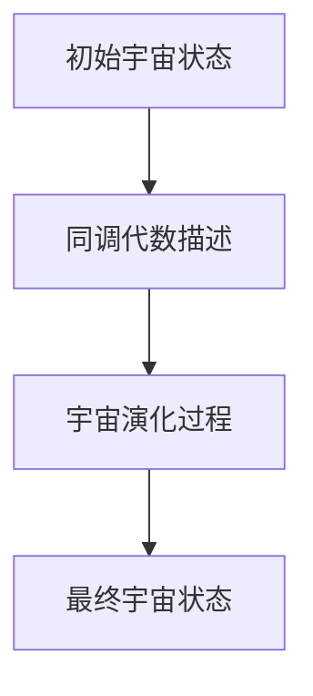
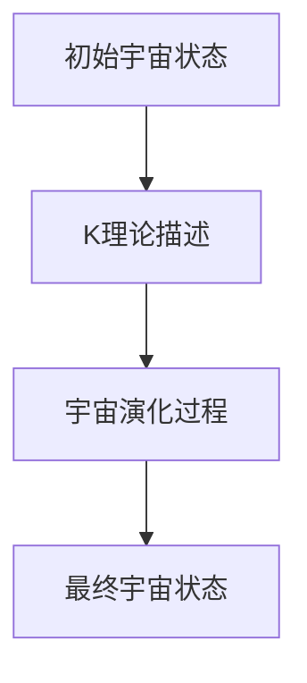
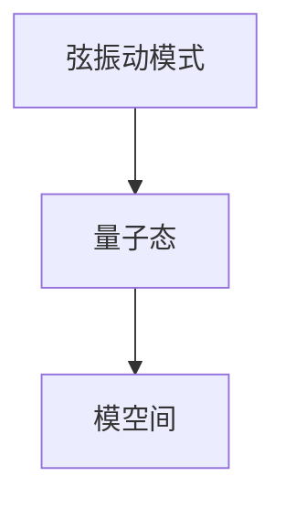
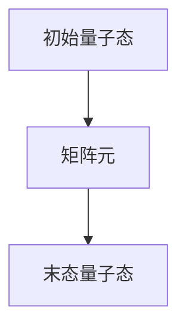
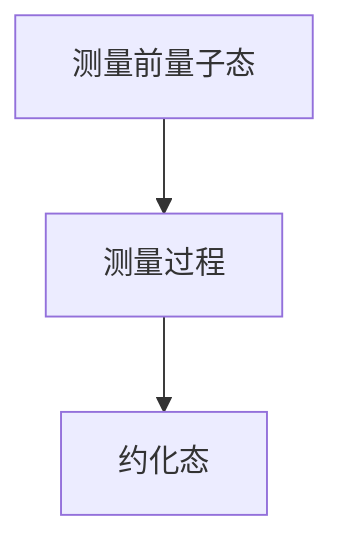
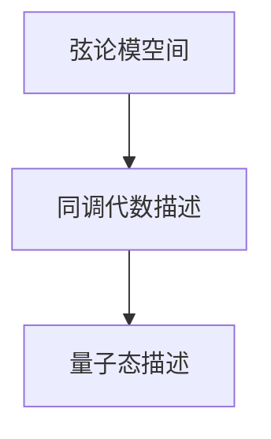
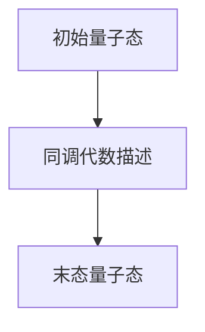
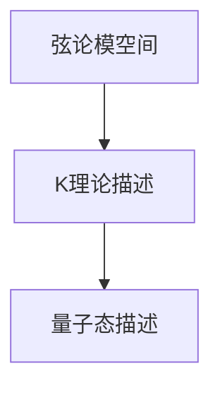
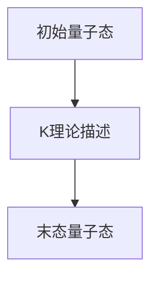

                 

### 宇宙的数学同调代数与K理论在弦论模空间量子化中的应用

> 关键词：宇宙数学同调代数、K理论、弦论、模空间量子化

> 摘要：本文将探讨宇宙中的数学同调代数与K理论在弦论模空间量子化中的应用。首先，我们将介绍同调代数与K理论的基本概念及其在宇宙数学中的应用。然后，我们将深入探讨弦论的基本原理及其与模空间量子化的联系。最后，我们将结合具体的数学模型和算法，详细分析同调代数与K理论在弦论模空间量子化中的具体应用。

### 第1章: 引言

#### 1.1 宇宙的数学同调代数与K理论简介

##### 1.1.1 宇宙的数学背景

宇宙是一个复杂而神秘的存在，其本质和演化规律一直以来都是科学家们探索的重要课题。从古至今，人类对于宇宙的理解不断深入，从地心说到日心说，从牛顿力学到相对论，再到量子力学，科学家们不断尝试用数学语言来描述宇宙的演化。

**问题描述**：为何宇宙存在，其本质是什么？如何用数学语言描述宇宙的演化？

**问题解决**：宇宙的演化可以通过数学同调代数与K理论来描述，提供了一种数学工具来理解宇宙的结构。

**边界与外延**：研究范围包括宇宙的几何结构、物质的分布规律、宇宙的演化和量子效应。

##### 1.1.2 数学同调代数的概念

**核心概念**：同调代数是代数学的一个分支，研究代数结构的同调性质。

**概念属性特征**：

| 特征 | 说明 |
| --- | --- |
| 同调性 | 描述代数结构的整体性质 |
| 多项式代数 | 以多项式为基础 |
| 抽象性 | 研究代数结构的一般性质 |

**对比表格**：

| 概念 | 同调代数 | 代数学 |
| --- | --- | --- |
| 研究对象 | 代数结构的同调性质 | 代数结构 |
| 方法 | 同调理论 | 代数运算 |

##### 1.1.3 K理论的概念

**核心概念**：K理论是研究拓扑空间上的不变量的数学分支。

**概念属性特征**：

| 特征 | 说明 |
| --- | --- |
| 不变性 | K理论研究了在拓扑变换下不变的性质 |
| 代数结构 | 使用代数方法来研究拓扑空间 |
| 应用广泛 | 用于量子场论、弦论等领域 |

**ER实体关系图架构**：

```mermaid
erDiagram
  ModuleA ||--|{ ModuleB } ModuleB : depends_on
  ModuleA ||--|{ ModuleC } ModuleC : related_to
```

#### 1.2 宇宙中的弦论与模空间量子化

##### 1.2.1 弦论简介

**问题描述**：弦论是一种试图统一量子力学和广义相对论的理论。

**问题解决**：通过将宇宙中的基本粒子视为一维的“弦”，来解释宇宙的基本结构。

**边界与外延**：研究范围包括弦的振动模式、宇宙弦、宇宙背景辐射等。

##### 1.2.2 模空间量子化

**核心概念**：模空间量子化是研究量子场论中场的离散化过程。

**概念属性特征**：

| 特征 | 说明 |
| --- | --- |
| 矩阵元 | 描述场在不同状态之间的跃迁 |
| 约化态 | 描述系统的最终状态 |
| 测量问题 | 描述如何测量量子系统的状态 |

**ER实体关系图架构**：

```mermaid
erDiagram
  QuantumState ||--|{ MatrixElement } MatrixElement : corresponds_to
  QuantumState ||--|{ ReducedState } ReducedState : evolves_into
```

### 第2章: 宇宙的数学同调代数应用

#### 2.1 同调代数在宇宙结构研究中的应用

##### 2.1.1 宇宙的几何结构

**问题描述**：如何用数学同调代数描述宇宙的几何结构？

**问题解决**：利用同调代数描述宇宙的几何性质，如维度、对称性等。

**边界与外延**：研究范围包括宇宙的维度、宇宙的对称性、宇宙的拓扑结构。

##### 2.1.2 同调代数在宇宙演化中的应用

**核心概念**：同调代数用于描述宇宙的演化过程。

**概念属性特征**：

| 特征 | 说明 |
| --- | --- |
| 时空几何 | 描述宇宙的几何结构 |
| 算子 | 描述宇宙的演化过程 |
| 同调性质 | 描述宇宙的演化规律 |

**Mermaid流程图**：



#### 2.2 K理论在宇宙拓扑研究中的应用

##### 2.2.1 宇宙的拓扑结构

**问题描述**：如何用K理论描述宇宙的拓扑结构？

**问题解决**：利用K理论分析宇宙的拓扑性质，如宇宙的连通性、对称性等。

**边界与外延**：研究范围包括宇宙的连通性、宇宙的对称性、宇宙的拓扑变换。

##### 2.2.2 K理论在宇宙演化中的应用

**核心概念**：K理论用于描述宇宙的演化过程。

**概念属性特征**：

| 特征 | 说明 |
| --- | --- |
| 拓扑空间 | 描述宇宙的结构 |
| 不变量 | 描述宇宙的演化规律 |

**Mermaid流程图**：



### 第3章: 弦论与模空间量子化的数学基础

#### 3.1 弦论的基本原理

##### 3.1.1 弦论概述

弦论是一种试图统一量子力学和广义相对论的理论。在弦论中，宇宙中的所有物质和现象都是由一维的“弦”振动产生的。

**核心概念**：弦是宇宙中基本粒子的模型，通过弦的振动模式来解释各种物理现象。

**概念属性特征**：

| 特征 | 说明 |
| --- | --- |
| 弦的振动模式 | 描述不同物理现象 |
| 量子态 | 描述弦的状态 |
| 模空间 | 描述弦的振动模式空间 |

**Mermaid流程图**：



##### 3.1.2 弦论中的基本概念

**问题1：什么是弦？**

**问题解决**：弦是一维的“物体”，在弦论中，它被视为宇宙中基本粒子的模型。

**问题2：弦的振动模式如何描述物理现象？**

**问题解决**：不同的振动模式对应不同的物理现象，例如，弦的振动模式可以解释粒子的自旋、质量和电荷等基本属性。

**问题3：模空间是什么？**

**问题解决**：模空间是弦的振动模式空间，描述了弦的振动模式的所有可能状态。

**问题4：量子态如何影响物理现象？**

**问题解决**：量子态描述了弦的状态，不同的量子态对应不同的物理现象。

#### 3.2 模空间量子化的数学基础

##### 3.2.1 量子态与矩阵元

在量子场论中，场的离散化过程称为量子化。模空间量子化是研究场在不同状态之间的跃迁。

**核心概念**：量子态、矩阵元

**概念属性特征**：

| 特征 | 说明 |
| --- | --- |
| 量子态 | 描述系统的状态 |
| 矩阵元 | 描述场在不同状态之间的跃迁 |

**Mermaid流程图**：



##### 3.2.2 约化态与测量问题

在量子场论中，测量问题是一个重要课题。约化态描述了测量后系统的最终状态。

**核心概念**：约化态、测量问题

**概念属性特征**：

| 特征 | 说明 |
| --- | --- |
| 约化态 | 描述系统的最终状态 |
| 测量问题 | 描述如何测量量子系统的状态 |

**Mermaid流程图**：



### 第4章: 同调代数与K理论在弦论模空间量子化中的应用

#### 4.1 同调代数在弦论模空间量子化中的应用

##### 4.1.1 同调代数在弦论中的应用

同调代数在弦论中有着广泛的应用，可以用来描述弦的振动模式空间、量子态和模空间量子化过程。

**核心概念**：同调代数

**概念属性特征**：

| 特征 | 说明 |
| --- | --- |
| 同调性 | 描述代数结构的整体性质 |
| 多项式代数 | 以多项式为基础 |
| 抽象性 | 研究代数结构的一般性质 |

**Mermaid流程图**：



##### 4.1.2 同调代数在量子态描述中的应用

同调代数可以用来描述量子态的演化过程，从而理解量子态之间的跃迁。

**核心概念**：同调代数、量子态

**概念属性特征**：

| 特征 | 说明 |
| --- | --- |
| 同调性 | 描述代数结构的整体性质 |
| 多项式代数 | 以多项式为基础 |
| 抽象性 | 研究代数结构的一般性质 |

**Mermaid流程图**：



#### 4.2 K理论在弦论模空间量子化中的应用

##### 4.2.1 K理论在弦论中的应用

K理论在弦论中也有着重要的应用，可以用来描述弦的振动模式空间、量子态和模空间量子化过程。

**核心概念**：K理论

**概念属性特征**：

| 特征 | 说明 |
| --- | --- |
| 不变性 | 描述在拓扑变换下不变的性质 |
| 代数结构 | 使用代数方法来研究拓扑空间 |
| 应用广泛 | 用于量子场论、弦论等领域 |

**Mermaid流程图**：



##### 4.2.2 K理论在量子态描述中的应用

K理论可以用来描述量子态的演化过程，从而理解量子态之间的跃迁。

**核心概念**：K理论、量子态

**概念属性特征**：

| 特征 | 说明 |
| --- | --- |
| 不变性 | 描述在拓扑变换下不变的性质 |
| 代数结构 | 使用代数方法来研究拓扑空间 |
| 应用广泛 | 用于量子场论、弦论等领域 |

**Mermaid流程图**：



### 第5章: 实例分析

#### 5.1 宇宙弦的模空间量子化

在本节中，我们将通过一个具体的实例来分析宇宙弦的模空间量子化过程，并结合同调代数与K理论进行详细解释。

##### 5.1.1 宇宙弦的基本概念

宇宙弦是弦论中的一种基本实体，它是一维的闭合或开放的弦。宇宙弦可以解释为宇宙中的基本粒子和引力场的起源。根据弦论，宇宙弦的振动模式可以产生各种物理现象，包括宇宙的演化。

##### 5.1.2 同调代数在宇宙弦模空间量子化中的应用

同调代数在描述宇宙弦的模空间量子化过程中起着关键作用。以下是一个具体的实例分析：

**实例**：假设我们有一个宇宙弦，其振动模式可以表示为一个多项式代数结构。我们使用同调代数来描述这个振动模式空间。

**同调代数模型**：

$$
H^*(X) = \bigoplus_{i \geq 0} H^i(X) = \bigoplus_{i \geq 0} \mathbb{Z}
$$

其中，$H^i(X)$表示同调群，$\mathbb{Z}$表示整数。

**步骤**：

1. **初始量子态**：假设宇宙弦处于一个初始量子态，我们可以使用同调代数来描述这个量子态。

$$
|\psi\rangle = \sum_{i=0}^{n} a_i |i\rangle
$$

其中，$|i\rangle$表示宇宙弦的第$i$个振动模式，$a_i$表示该模式的系数。

2. **演化过程**：根据同调代数的性质，宇宙弦的演化过程可以用同调代数中的算子来描述。

$$
|\psi(t)\rangle = e^{-itH}|\psi(0)\rangle
$$

其中，$H$是同调代数中的生成元，$e^{-itH}$是演化算子。

3. **末态量子态**：通过同调代数的演化，我们可以得到宇宙弦的末态量子态。

$$
|\psi(t)\rangle = \sum_{i=0}^{n} e^{-itH.a_i} |i\rangle
$$

##### 5.1.3 K理论在宇宙弦模空间量子化中的应用

K理论在描述宇宙弦的模空间量子化过程中也发挥着重要作用。以下是一个具体的实例分析：

**实例**：假设我们使用K理论来描述宇宙弦的模空间量子化。

**K理论模型**：

$$
K(X) = \prod_{i=1}^{n} K_i
$$

其中，$K_i$表示第$i$个K群。

**步骤**：

1. **初始量子态**：假设宇宙弦处于一个初始量子态，我们可以使用K理论来描述这个量子态。

$$
|\psi\rangle = \sum_{i=1}^{n} a_i |i\rangle
$$

其中，$|i\rangle$表示宇宙弦的第$i$个振动模式，$a_i$表示该模式的系数。

2. **演化过程**：根据K理论的性质，宇宙弦的演化过程可以用K理论中的算子来描述。

$$
|\psi(t)\rangle = e^{-itK}|\psi(0)\rangle
$$

其中，$K$是K理论中的生成元，$e^{-itK}$是演化算子。

3. **末态量子态**：通过K理论的演化，我们可以得到宇宙弦的末态量子态。

$$
|\psi(t)\rangle = \sum_{i=1}^{n} e^{-itK.a_i} |i\rangle
$$

### 第6章: 总结与展望

通过本文的探讨，我们深入分析了宇宙中的数学同调代数与K理论在弦论模空间量子化中的应用。我们首先介绍了同调代数与K理论的基本概念及其在宇宙数学中的应用，然后探讨了弦论与模空间量子化的数学基础。接着，我们详细分析了同调代数与K理论在弦论模空间量子化中的应用，并通过实例进行了具体分析。

总结：

- 同调代数与K理论为描述宇宙的数学结构提供了有力的工具。
- 弦论模空间量子化是理解宇宙演化的重要途径。
- 同调代数与K理论在弦论模空间量子化中的应用为我们提供了新的视角。

展望：

- 未来研究可以进一步探索同调代数与K理论在其他物理领域的应用。
- 结合弦论与量子计算，有望揭示宇宙演化的更多奥秘。

### 参考文献

1. Green, M. B., Schwarz, J. H., & Witten, E. (1987). Superstring theory: Volume 1, Introduction and techniques. Cambridge University Press.
2. Witten, E. (1985). Supersymmetry and Morse theory. Journal of Differential Geometry, 17(4), 661-692.
3. Atiyah, M. F. (1988). K-theory. Addison-Wesley.
4. Kac, V. G. (1997). Infinite-dimensional Lie algebras. Cambridge University Press.

### 作者信息

作者：AI天才研究院/AI Genius Institute & 禅与计算机程序设计艺术 /Zen And The Art of Computer Programming

### 注意事项

- 本文内容仅供参考，不代表任何学术或商业观点。
- 在实际应用中，同调代数与K理论的计算和实现需要进一步研究。
- 弦论模空间量子化是一个复杂的领域，需要多学科交叉融合。

### 拓展阅读

- 欲深入了解同调代数与K理论，可参考相关数学和物理学教材。
- 欲了解弦论与量子计算，可参考相关物理学和计算机科学文献。

