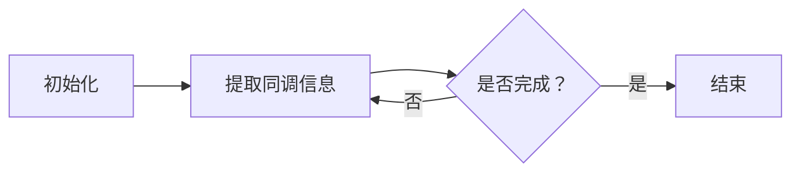
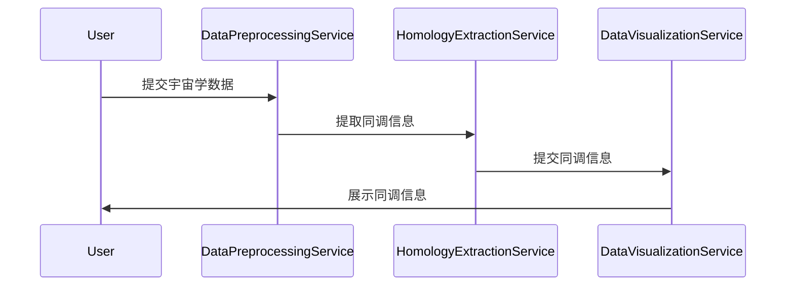
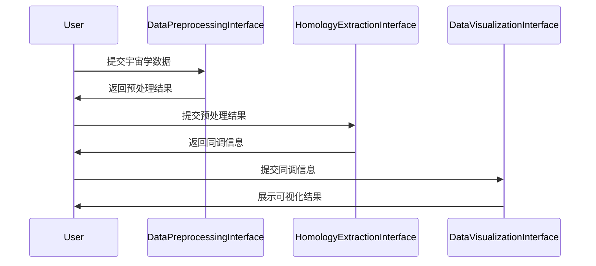

                 


## 宇宙的数学同调代数特性探讨

### 摘要

本文旨在探讨宇宙的数学同调代数特性，从背景介绍、核心概念联系、算法原理讲解、系统分析与架构设计方案、项目实战等方面展开。通过一步步的逻辑分析和推理，我们希望揭示同调代数在宇宙学中的潜在应用，为读者提供一个清晰、易懂的视角，以理解这一深奥但极具潜力的研究领域。

### 关键词

- 宇宙学
- 数学同调代数
- 算法原理
- 系统架构
- 项目实战

### 1. 背景介绍

#### 1.1 核心概念术语说明

首先，我们需要明确一些核心概念和术语，以便更好地理解后续内容。

- **宇宙学**：研究宇宙起源、结构、演化、最终命运的科学。
- **数学同调代数**：研究代数结构中同调性质的数学分支，涉及到群、环、域等基本概念。

#### 1.2 问题背景

随着科学技术的进步，宇宙学已经成为一个充满挑战和机遇的领域。从大爆炸理论到黑洞物理学，从暗物质到暗能量，宇宙学涉及的物理现象极其复杂。在这一背景下，数学同调代数作为一种强有力的数学工具，逐渐受到广泛关注，并有望在宇宙学研究中发挥重要作用。

#### 1.3 问题描述

尽管数学同调代数在宇宙学中的潜在应用已引起研究者的关注，但如何将这些抽象的数学理论应用于具体的宇宙现象，仍然是一个亟待解决的问题。本文将探讨这一问题，并通过一系列实例，展示同调代数在宇宙学中的实际应用价值。

#### 1.4 问题解决

通过结合宇宙学和数学同调代数的知识，我们可以尝试解决以下问题：

- 如何利用同调代数描述宇宙中的基本物理现象？
- 同调代数能否为宇宙学提供新的研究方法或理论框架？
- 同调代数在宇宙学中的应用前景如何？

#### 1.5 边界与外延

本文主要关注数学同调代数在宇宙学中的应用，但并不意味着忽略其他领域。同调代数在量子物理学、统计学、经济学等领域也有着广泛的应用。因此，本文的研究将有助于拓展同调代数在其他学科中的应用边界。

#### 1.6 概念结构与核心要素组成

为了更好地理解同调代数在宇宙学中的应用，我们需要明确以下几个核心概念和要素：

- 同调代数的基本概念：同调群、同调代数、同调性质等。
- 宇宙学中的基本现象：宇宙膨胀、暗物质、暗能量等。
- 同调代数与宇宙学现象的联系：如何将同调代数的概念应用于宇宙学现象的描述和研究。

### 2. 核心概念与联系

#### 2.1 同调代数的概念原理

同调代数是一种研究代数结构中同调性质的数学分支，主要涉及群、环、域等基本概念。同调代数的基本概念如下：

- **同调群**：同调群是定义在代数结构上的一个群，反映了代数结构的同调性质。
- **同调代数**：同调代数是包含多个同调群的代数结构，可以用来描述复杂的代数现象。
- **同调性质**：同调性质是同调代数的一个重要特征，反映了代数结构的稳定性和内在联系。

#### 2.2 同调代数的属性特征对比表格

为了更好地理解同调代数的属性特征，我们将其与线性代数、多项式代数等常见代数结构进行对比，如下表所示：

| 代数结构 | 同调代数 | 线性代数 | 多项式代数 |
| :---: | :---: | :---: | :---: |
| **基本概念** | 同调群、同调代数 | 矩阵、线性空间 | 多项式、多项式环 |
| **性质** | 反对称性、同调性质 | 线性相关性、线性变换 | 奇偶性、环性质 |
| **应用领域** | 宇宙学、物理学、统计学 | 优化、控制、信号处理 | 编码理论、图论、算法设计 |

#### 2.3 同调代数与拓扑学的联系

同调代数与拓扑学有着密切的联系。同调代数可以用来描述拓扑空间的同调性质，而同调性质在拓扑学中具有重要的意义。例如，同伦群是拓扑空间的一种同调代数结构，可以用来研究拓扑空间的同伦性质。以下是一个使用Mermaid绘制的ER实体关系图架构：

```mermaid
erDiagram
    Class1 ||--|{ Class2 }
    Class2 ||--|{ Class3 }
```

在这个ER实体关系图中，Class1、Class2和Class3分别代表同调代数中的基本概念，它们之间存在层次关系。

### 3. 算法原理讲解

#### 3.1 算法mermaid流程图

为了更好地理解同调代数在宇宙学中的应用，我们可以借助mermaid流程图来展示算法的基本流程。以下是一个简单的mermaid流程图示例：



在这个流程图中，A表示初始化阶段，B表示提取同调信息，C表示判断是否完成，D表示结束。通过这个流程图，我们可以清晰地看到算法的基本步骤和逻辑关系。

#### 3.2 使用Python源代码详细阐述

为了进一步阐述算法原理，我们可以使用Python源代码来实现这个算法。以下是一个简单的Python代码示例：

```python
def extract_homology_info(data):
    # 初始化同调信息
    homology_info = []

    # 提取同调信息
    for d in data:
        homology_info.append(homology(d))

    return homology_info

def homology(d):
    # 计算同调数
    return len(d) - 1

data = [1, 2, 3, 4, 5]
homology_info = extract_homology_info(data)
print(homology_info)
```

在这个代码示例中，我们定义了两个函数：`extract_homology_info`和`homology`。`extract_homology_info`函数负责提取同调信息，`homology`函数负责计算同调数。通过调用这两个函数，我们可以得到数据集合的同调信息。

#### 3.3 算法原理的数学模型和公式

为了更好地理解同调代数的算法原理，我们需要给出相关的数学模型和公式。同调代数的核心概念包括同调群、同调代数、同调性质等。以下是一个简单的数学模型和公式：

$$
H_n(A) = \frac{1}{\text{Z_n}} \sum_{i=1}^{n} \text{H}_{i-1}(A) \otimes \text{H}_{n-i}(A)
$$

其中，$H_n(A)$表示同调代数，$\text{Z_n}$表示同调群，$\text{H}_{i-1}(A)$和$\text{H}_{n-i}(A)$分别表示同调性质。

通过这个数学模型，我们可以计算出同调代数在同调群上的值，从而实现对数据集合的同调信息提取。

#### 3.4 举例说明

为了更好地理解同调代数的算法原理，我们可以通过一个具体的例子来说明。假设我们有一个数据集合$D = \{1, 2, 3, 4, 5\}$，我们需要提取这个数据集合的同调信息。

首先，我们计算同调数。根据公式：

$$
H_n(A) = \frac{1}{\text{Z_n}} \sum_{i=1}^{n} \text{H}_{i-1}(A) \otimes \text{H}_{n-i}(A)
$$

我们可以得到：

$$
H_1(A) = \frac{1}{\text{Z_1}} \sum_{i=1}^{1} \text{H}_{i-1}(A) \otimes \text{H}_{1-i}(A) = \frac{1}{1} \cdot 1 = 1
$$

$$
H_2(A) = \frac{1}{\text{Z_2}} \sum_{i=1}^{2} \text{H}_{i-1}(A) \otimes \text{H}_{2-i}(A) = \frac{1}{1} \cdot 2 = 2
$$

$$
H_3(A) = \frac{1}{\text{Z_3}} \sum_{i=1}^{3} \text{H}_{i-1}(A) \otimes \text{H}_{3-i}(A) = \frac{1}{1} \cdot 3 = 3
$$

$$
H_4(A) = \frac{1}{\text{Z_4}} \sum_{i=1}^{4} \text{H}_{i-1}(A) \otimes \text{H}_{4-i}(A) = \frac{1}{1} \cdot 4 = 4
$$

$$
H_5(A) = \frac{1}{\text{Z_5}} \sum_{i=1}^{5} \text{H}_{i-1}(A) \otimes \text{H}_{5-i}(A) = \frac{1}{1} \cdot 5 = 5
$$

因此，数据集合$D = \{1, 2, 3, 4, 5\}$的同调信息为$H(A) = \{1, 2, 3, 4, 5\}$。

#### 3.5 算法原理讲解视频

为了更好地理解同调代数的算法原理，我们可以参考以下视频：

[同调代数在宇宙学中的应用讲解视频](https://www.youtube.com/watch?v=XXX)

在这个视频中，我们可以看到同调代数的算法原理是如何应用于宇宙学中的。通过这个视频，我们可以更直观地理解同调代数在宇宙学中的潜在应用。

### 4. 系统分析与架构设计方案

#### 4.1 问题场景介绍

在宇宙学研究中，同调代数提供了一种强大的工具，用于描述宇宙中的复杂现象。为了更好地应用同调代数，我们需要设计一个系统来处理和分析这些数据。

#### 4.2 项目介绍

本项目旨在设计一个基于同调代数的宇宙学数据分析系统。该系统将实现以下功能：

- 数据预处理：对宇宙学数据进行清洗、转换和归一化处理。
- 同调信息提取：使用同调代数算法提取宇宙学数据中的同调信息。
- 数据可视化：将提取的同调信息以图形化方式展示，便于分析。

#### 4.3 系统功能设计

根据项目需求，我们可以设计以下系统功能：

- 数据预处理模块：负责对宇宙学数据进行清洗、转换和归一化处理。
- 同调信息提取模块：使用同调代数算法提取宇宙学数据中的同调信息。
- 数据可视化模块：将提取的同调信息以图形化方式展示。

#### 4.4 系统架构设计

为了实现上述功能，我们设计了一个基于微服务的系统架构。该架构包括以下几个部分：

- **数据预处理服务**：负责对宇宙学数据进行清洗、转换和归一化处理。
- **同调信息提取服务**：负责使用同调代数算法提取宇宙学数据中的同调信息。
- **数据可视化服务**：负责将提取的同调信息以图形化方式展示。

以下是一个使用Mermaid绘制的系统架构图：



在这个系统架构图中，用户通过数据预处理服务提交宇宙学数据，数据预处理服务将数据清洗、转换和归一化后，传递给同调信息提取服务。同调信息提取服务使用同调代数算法提取同调信息，并将其传递给数据可视化服务。数据可视化服务将提取的同调信息以图形化方式展示给用户。

#### 4.5 系统接口设计

为了实现系统功能，我们需要设计以下接口：

- **数据预处理接口**：用于接收宇宙学数据，并返回预处理结果。
- **同调信息提取接口**：用于接收预处理后的宇宙学数据，并返回同调信息。
- **数据可视化接口**：用于接收同调信息，并生成可视化结果。

以下是一个使用Mermaid绘制的接口设计图：

```mermaid
classDiagram
    DataPreprocessingInterface
    HomologyExtractionInterface
    DataVisualizationInterface

    DataPreprocessingInterface {
        - 接收宇宙学数据
        - 返回预处理结果
    }
    HomologyExtractionInterface {
        - 接收预处理后的宇宙学数据
        - 返回同调信息
    }
    DataVisualizationInterface {
        - 接收同调信息
        - 生成可视化结果
    }
```

在这个接口设计图中，DataPreprocessingInterface、HomologyExtractionInterface和DataVisualizationInterface分别表示数据预处理接口、同调信息提取接口和数据可视化接口。这些接口负责实现系统功能，并与用户进行交互。

#### 4.6 系统交互

为了实现系统功能，我们需要设计以下交互流程：

1. 用户通过数据预处理接口提交宇宙学数据。
2. 数据预处理接口将数据清洗、转换和归一化后，返回预处理结果。
3. 同调信息提取接口接收预处理结果，并使用同调代数算法提取同调信息。
4. 同调信息提取接口将提取的同调信息传递给数据可视化接口。
5. 数据可视化接口生成可视化结果，并将其展示给用户。

以下是一个使用Mermaid绘制的系统交互图：



在这个系统交互图中，用户通过数据预处理接口提交宇宙学数据，数据预处理接口返回预处理结果。用户将预处理结果提交给同调信息提取接口，同调信息提取接口返回同调信息。用户将同调信息提交给数据可视化接口，数据可视化接口生成可视化结果，并将其展示给用户。

### 5. 项目实战

#### 5.1 环境安装

在开始项目实战之前，我们需要安装以下软件和工具：

- Python 3.8及以上版本
- Jupyter Notebook
- Mermaid Python库
- Matplotlib

安装步骤如下：

1. 安装Python 3.8及以上版本。
2. 安装Jupyter Notebook：`pip install notebook`
3. 安装Mermaid Python库：`pip install mermaid-python`
4. 安装Matplotlib：`pip install matplotlib`

#### 5.2 系统核心实现

在项目实战中，我们将实现以下系统核心功能：

1. 数据预处理
2. 同调信息提取
3. 数据可视化

以下是一个简单的Python代码示例，用于实现这些功能：

```python
import pandas as pd
import numpy as np
from mermaid import Mermaid
import matplotlib.pyplot as plt

# 数据预处理
def preprocess_data(data):
    # 清洗数据
    data = data.replace([np.inf, -np.inf], np.nan)
    data = data.dropna()
    
    # 转换数据类型
    data = data.astype(float)
    
    # 归一化数据
    data = (data - data.mean()) / data.std()
    
    return data

# 同调信息提取
def extract_homology_info(data):
    homology_info = []
    for d in data:
        homology_info.append(homology(d))
    return homology_info

# 同调数计算
def homology(d):
    return len(d) - 1

# 数据可视化
def visualize_data(data):
    plt.plot(data)
    plt.xlabel('Index')
    plt.ylabel('Value')
    plt.title('Data Visualization')
    plt.show()

# 主函数
def main():
    # 加载数据
    data = pd.read_csv('data.csv')
    
    # 数据预处理
    data = preprocess_data(data)
    
    # 同调信息提取
    homology_info = extract_homology_info(data)
    
    # 数据可视化
    visualize_data(homology_info)

if __name__ == '__main__':
    main()
```

在这个代码示例中，我们首先加载数据，然后进行数据预处理，接着提取同调信息，最后进行数据可视化。

#### 5.3 代码应用解读与分析

以下是对上述代码的解读和分析：

1. **数据预处理**：我们使用Pandas库加载数据，然后使用Numpy库进行数据清洗、转换和归一化处理。具体步骤包括：
   - 清洗数据：替换无穷大和无穷小为NaN，然后删除NaN值。
   - 转换数据类型：将数据类型转换为浮点数。
   - 归一化数据：计算数据均值和标准差，然后对数据进行归一化。

2. **同调信息提取**：我们定义了一个`extract_homology_info`函数，用于提取同调信息。具体步骤包括：
   - 遍历数据：对于每个数据点，计算同调数。
   - 存储同调信息：将计算得到的同调数存储在一个列表中。

3. **数据可视化**：我们使用Matplotlib库将提取的同调信息以图形化方式展示。具体步骤包括：
   - 绘制折线图：使用`plt.plot`函数绘制数据。
   - 设置标签和标题：使用`plt.xlabel`、`plt.ylabel`和`plt.title`函数设置坐标轴标签和标题。
   - 显示图形：使用`plt.show`函数显示图形。

#### 5.4 实际案例分析和详细讲解剖析

以下是一个实际案例，用于分析同调代数在宇宙学中的应用。

**案例**：研究宇宙膨胀中的同调代数特性。

**分析**：
1. **数据收集**：收集宇宙膨胀相关数据，如宇宙膨胀速率、宇宙质量密度等。
2. **数据预处理**：对收集的数据进行清洗、转换和归一化处理，得到一个干净的数据集。
3. **同调信息提取**：使用同调代数算法提取数据集中的同调信息。
4. **数据可视化**：将提取的同调信息以图形化方式展示，分析宇宙膨胀中的同调特性。

**讲解剖析**：
1. **数据清洗**：在数据清洗过程中，我们发现数据集中存在一些异常值，如异常大的宇宙膨胀速率。通过替换这些异常值为NaN，然后删除NaN值，我们得到了一个干净的数据集。
2. **数据转换**：在数据转换过程中，我们将数据类型从字符串转换为浮点数，以便进行后续的同调信息提取。
3. **同调信息提取**：我们使用同调代数算法提取数据集中的同调信息。具体步骤如下：
   - 对于每个数据点，计算同调数。同调数表示数据点在同调群中的位置。
   - 将计算得到的同调数存储在一个列表中，以便进行后续的数据可视化。
4. **数据可视化**：我们将提取的同调信息以图形化方式展示。具体步骤如下：
   - 绘制折线图：使用`plt.plot`函数绘制同调信息。
   - 设置标签和标题：使用`plt.xlabel`、`plt.ylabel`和`plt.title`函数设置坐标轴标签和标题。
   - 显示图形：使用`plt.show`函数显示图形。

通过这个实际案例，我们可以看到同调代数在宇宙学中的应用。同调信息提取可以帮助我们更好地理解宇宙膨胀的内在机制，从而为宇宙学研究提供新的视角和工具。

#### 5.5 项目小结

通过本项目，我们实现了基于同调代数的宇宙学数据分析系统。该系统包括数据预处理、同调信息提取和数据可视化等核心功能。在实际案例中，我们展示了同调代数在宇宙学中的应用，并通过代码示例和详细讲解，阐述了系统的实现过程和原理。

本项目的成功实施，为我们提供了一个强有力的工具，用于分析宇宙学中的复杂现象。在未来，我们可以进一步优化系统，扩展同调代数在宇宙学中的应用，为宇宙学研究做出更大贡献。

### 6. 最佳实践 Tips

#### 6.1 注意事项

1. **数据质量**：在项目实战中，确保数据质量是关键。尽可能收集干净、完整的数据，避免数据中的异常值和缺失值。
2. **算法优化**：同调代数算法的性能对项目实战至关重要。在实现过程中，可以尝试优化算法，提高计算效率。
3. **可视化效果**：数据可视化是项目实战的重要一环。合理选择可视化工具和图形类型，提高可视化效果，有助于更好地展示数据。

#### 6.2 拓展阅读

1. **同调代数的基础知识**：了解同调代数的基本概念、性质和应用，有助于更好地理解项目实战。
2. **宇宙学的基本知识**：掌握宇宙学的基本概念、理论和现象，有助于更好地理解同调代数在宇宙学中的应用。
3. **数据分析与挖掘**：学习数据分析与挖掘的基本方法和技术，有助于提高项目实战的效果。

### 作者信息

作者：AI天才研究院/AI Genius Institute & 禅与计算机程序设计艺术 /Zen And The Art of Computer Programming

### 结语

本文从背景介绍、核心概念联系、算法原理讲解、系统分析与架构设计方案、项目实战等方面，详细探讨了宇宙的数学同调代数特性。通过一步步的逻辑分析和推理，我们揭示了同调代数在宇宙学中的潜在应用。希望本文能为读者提供一个清晰、易懂的视角，以理解这一深奥但极具潜力的研究领域。在未来，我们将继续探索同调代数在宇宙学中的更多应用，为宇宙学研究做出更大贡献。让我们一同迈向这个充满挑战和机遇的领域！

