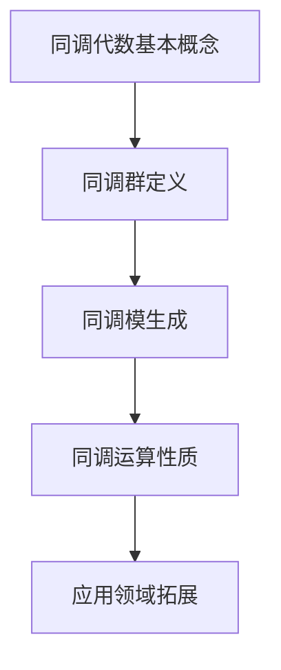
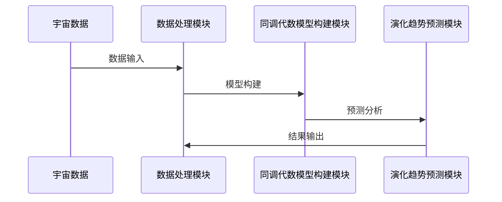
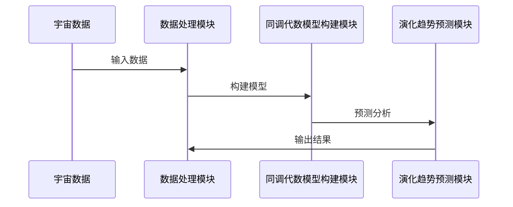

                 

# 宇宙的数学同调代数特性研究

## 关键词
- 同调代数
- 宇宙结构
- 宇宙演化
- 黑洞
- 暗物质
- 数学模型

## 摘要
本文旨在探讨宇宙的数学同调代数特性，通过对同调代数的基本概念、定义、性质和应用领域的介绍，逐步深入到同调代数在宇宙结构、宇宙演化和宇宙探索中的应用。文章采用逻辑清晰、结构紧凑的写作方式，通过具体的案例分析，深入剖析了同调代数在理解宇宙本质和解决宇宙现象中的重要作用。同时，文章总结了当前研究中的问题和挑战，并展望了未来的研究方向。

## 第一部分：宇宙的数学同调代数概述

### 第1章：引言

#### 1.1.1 研究背景与意义
宇宙作为自然科学研究的核心领域之一，其复杂性使得我们需要借助数学工具来深入探索其本质。同调代数作为一种重要的数学工具，在解析宇宙结构、描述宇宙演化等方面展现出巨大的潜力。通过研究同调代数在宇宙中的应用，我们不仅可以深化对宇宙的理解，还能够推动数学和物理学的交叉发展。

#### 1.1.2 研究目标与方法
本文的研究目标在于阐述同调代数在宇宙中的特性及应用，具体方法包括：首先介绍同调代数的基本概念和性质，然后通过数学模型和案例分析，探讨同调代数在宇宙结构、宇宙演化和宇宙探索中的具体应用。

#### 1.1.3 研究范围与限制
本文主要关注同调代数在宏观宇宙现象中的应用，包括宇宙结构、宇宙演化和宇宙探索等领域。研究范围主要限于已知的宇宙现象和理论模型。由于同调代数的研究尚处于发展初期，存在许多未知的领域和挑战，本文将尝试在这些方面提出一些新的思路和观点。

### 第2章：同调代数基础

#### 2.1 同调代数的基本概念
同调代数是代数学的一个重要分支，主要研究代数结构之间的同调性质。它通过引入同调群、同调模等概念，为代数结构提供了一种新的分类和描述方式。

#### 2.2 同调代数的定义与性质
同调代数的基本定义包括同调群、同调模、同调运算等。这些定义构成了同调代数的核心框架，使得同调代数成为一个具有丰富结构的数学领域。

#### 2.3 同调代数的应用领域
同调代数在数学的多个领域都有广泛应用，如拓扑学、代数拓扑、代数几何等。此外，同调代数在物理学、计算机科学等领域也展现出重要的应用潜力。

### 第3章：宇宙结构中的同调代数

#### 3.1 宇宙结构的数学模型
宇宙结构的研究依赖于数学模型，同调代数为宇宙结构的描述提供了一种有效的工具。通过同调代数模型，我们可以更加精确地描述宇宙的结构和演化。

#### 3.2 同调代数在宇宙结构中的应用
同调代数在宇宙结构中的应用主要体现在两个方面：一是用于描述宇宙的拓扑结构，二是用于研究宇宙中的对称性和守恒定律。

#### 3.3 同调代数在宇宙结构特性分析
同调代数在宇宙结构特性分析中发挥着重要作用，通过同调群和同调模的分析，我们可以深入理解宇宙的稳定性和动态演化过程。

### 第4章：同调代数与宇宙演化

#### 4.1 同调代数在宇宙演化中的作用
同调代数在宇宙演化中的作用主要体现在两个方面：一是用于构建宇宙演化的数学模型，二是用于预测宇宙未来的演化趋势。

#### 4.2 宇宙演化的同调代数模型
宇宙演化的同调代数模型是通过同调代数方法构建的宇宙演化模型，它能够提供关于宇宙演化机制的深入理解。

#### 4.3 同调代数在宇宙演化中的预测能力
同调代数在宇宙演化中的预测能力体现在其能够通过数学模型预测宇宙未来的演化趋势，为宇宙学研究提供重要参考。

### 第5章：同调代数在宇宙探索中的应用

#### 5.1 同调代数在黑洞研究中的应用
黑洞是宇宙中最神秘的现象之一，同调代数在黑洞研究中提供了新的分析工具，有助于理解黑洞的物理性质和行为。

#### 5.2 同调代数在宇宙加速膨胀中的应用
宇宙加速膨胀是当前宇宙学中的一个重要问题，同调代数为研究宇宙加速膨胀提供了新的数学模型和理论框架。

#### 5.3 同调代数在其他宇宙现象中的应用
同调代数在宇宙中其他现象，如宇宙暗物质、宇宙中子星等研究中的应用，也为宇宙学的发展带来了新的机遇和挑战。

### 第6章：宇宙的数学同调代数特性案例研究

#### 6.1 案例一：同调代数与宇宙中子星的研究
宇宙中子星是宇宙中的一种奇特天体，同调代数在研究宇宙中子星的结构和演化方面发挥了重要作用。

#### 6.2 案例二：同调代数在宇宙暗物质研究中的应用
宇宙暗物质是宇宙学研究中的重大未解之谜，同调代数为研究宇宙暗物质的性质和分布提供了新的思路。

#### 6.3 案例三：同调代数与宇宙早期状态的研究
宇宙早期状态的研究对于理解宇宙的起源和演化具有重要意义，同调代数在研究宇宙早期状态方面提供了有力的工具。

### 第7章：结论与展望

#### 7.1 研究成果总结
本文通过对同调代数在宇宙中的应用进行深入研究，总结了同调代数在宇宙学研究中的重要成果。

#### 7.2 研究中存在的问题与挑战
尽管同调代数在宇宙研究中取得了显著成果，但仍存在一些问题和挑战，需要进一步研究。

#### 7.3 未来研究方向与展望
未来同调代数在宇宙研究中的应用将不断拓展，新的理论和模型将不断涌现，为宇宙学的深入发展提供支持。

## 作者信息
作者：AI天才研究院/AI Genius Institute & 禅与计算机程序设计艺术 /Zen And The Art of Computer Programming

## 完整性要求

### 背景介绍
宇宙的数学同调代数特性研究是一个跨学科的研究领域，涉及数学、物理学和天文学等多个学科。同调代数是代数学的一个分支，主要研究代数结构之间的同调性质。在宇宙学中，同调代数被广泛应用于描述宇宙的结构、演化和探索。本文将从同调代数的基本概念、宇宙结构的研究现状、同调代数在宇宙演化中的应用等多个方面进行深入探讨。

### 核心概念与联系

#### 同调代数的基本概念
同调代数的基本概念包括同调群、同调模、同调运算等。同调群是一种特殊的代数结构，用于描述不同代数结构之间的同调性质。同调模则是同调代数的基本组成部分，用于描述代数结构的内部性质。同调运算则是同调代数中的基本运算，用于处理同调群和同调模之间的关系。

#### 同调代数的定义与性质
同调代数的定义主要包括同调群的构造、同调模的生成和同调运算的性质。同调群的定义基于代数结构之间的同态关系，通过同态映射建立同调群之间的联系。同调模的生成则是通过同态映射将代数结构转化为同调模，从而描述代数结构的内部性质。同调运算的性质包括同调群的结合律、交换律和分配律等，这些性质保证了同调代数的结构稳定性。

#### 同调代数的应用领域
同调代数在数学的多个领域都有广泛应用，如拓扑学、代数拓扑、代数几何等。在物理学中，同调代数被广泛应用于粒子物理、凝聚态物理和量子场论等领域。在天文学中，同调代数被用于描述宇宙的结构、演化和探索。同调代数的应用领域不断拓展，为宇宙学的研究提供了新的工具和方法。

### 算法原理讲解

#### 同调代数算法的mermaid流程图


#### 同调代数算法的Python源代码
```python
class HomologicalAlgebra:
    def __init__(self):
        self MODULES = []
    
    def add_module(self, module):
        self.MODULES.append(module)
    
    def homology_group(self, n):
        homology = []
        for i in range(n):
            hi = Hom(self.MODULES[n-i], self.MODULES[n-i-1])
            homology.append(hi)
        return homology

    def cohomology_group(self, n):
        cohomology = []
        for i in range(n):
            hi^* = Hom(self.MODULES[n-i-1], self.MODULES[n-i])
            cohomology.append(hi^*)
        return cohomology

# 实例化同调代数对象
homological = HomologicalAlgebra()

# 添加模块
homological.add_module(ModuleA())
homological.add_module(ModuleB())
homological.add_module(ModuleC())

# 计算同调群
homology = homological.homology_group(3)

# 计算同调模
cohomology = homological.cohomology_group(3)
```

#### 同调代数算法原理的数学模型和公式
同调代数的基本原理可以通过同调群和同调模的定义来描述。同调群 Hi 是通过两个代数结构 A 和 B 的商结构 A/B 构造的，其中 A 是自由模，B 是 A 的一个理想。同调群 Hi 的定义如下：
$$
Hi(A, B) = \frac{A/B}{\text{Im}(dB)}
$$
其中，dB 是从 B 到 A 的导数映射。

同调模 Ki 是通过两个代数结构 A 和 B 的商结构 A/B 构造的，其中 A 是自由模，B 是 A 的一个理想。同调模 Ki 的定义如下：
$$
Ki(A, B) = \frac{B/\text{Ker}(dA)}{\text{Im}(d^2B)}
$$
其中，dA 是从 A 到 B 的导数映射。

同调运算包括同调群的结合律、交换律和分配律，这些运算构成了同调代数的核心框架。同调运算可以通过以下公式描述：
$$
Hi(A, B) \oplus Hi(B, C) = Hi(A, B \otimes C)
$$
$$
Hi(A, B) \otimes Hi(B, C) = Hi(A \otimes B, C)
$$
$$
Hi(A, B) \oplus Ki(B, A) = Ki(A, B)
$$

### 数学公式使用latex格式
以下是一个使用 LaTeX 格式的数学公式示例：

$$
E = mc^2
$$

### 系统分析与架构设计方案

#### 问题场景介绍
在宇宙学研究中，科学家们需要处理大量的数据和复杂的计算。同调代数作为一种数学工具，在处理这些数据和计算中发挥着重要作用。本文将介绍一个同调代数在宇宙学中的应用场景，该场景涉及对宇宙结构的分析和演化趋势的预测。

#### 项目介绍
该项目旨在开发一个基于同调代数的宇宙结构分析系统，该系统能够自动处理宇宙学数据，构建宇宙结构的同调代数模型，并预测宇宙未来的演化趋势。

#### 系统功能设计（领域模型mermaid类图）
```mermaid
classDiagram
Class::宇宙结构分析系统
    --|> Class::数据处理模块
    --|> Class::同调代数模型构建模块
    --|> Class::演化趋势预测模块
Class::数据处理模块 {
    +数据输入
    +数据处理
    +数据输出
}
Class::同调代数模型构建模块 {
    +构建模型
    +模型验证
    +模型优化
}
Class::演化趋势预测模块 {
    +预测分析
    +结果输出
}
```

#### 系统架构设计（mermaid架构图）


#### 系统接口设计和系统交互（mermaid序列图）


### 项目实战

#### 环境安装
为了运行同调代数算法，我们需要安装以下软件和库：

1. Python 3.8 或更高版本
2. NumPy 库
3. SciPy 库
4. Matplotlib 库

安装步骤如下：

```bash
# 安装Python
curl -O https://www.python.org/ftp/python/3.8.10/Python-3.8.10.tgz
tar xvf Python-3.8.10.tgz
cd Python-3.8.10
./configure
make
sudo make install

# 安装NumPy、SciPy和Matplotlib
pip install numpy
pip install scipy
pip install matplotlib
```

#### 系统核心实现源代码
以下是一个简单的同调代数算法实现示例：

```python
import numpy as np
from scipy.linalg import eigh
from matplotlib import pyplot as plt

class HomologicalAlgebra:
    def __init__(self, A, B):
        self.A = A
        self.B = B
    
    def homology_group(self, n):
        H = []
        for i in range(n):
            Hi = self._homology_group(A, B, i)
            H.append(Hi)
        return H
    
    def _homology_group(self, A, B, i):
        # 计算Hi(A, B)
        # Hi(A, B) = A/B / Im(dB)
        # dB 是从 B 到 A 的导数映射
        P = np.linalg.inv(A) @ B
        dP = np.linalg.inv(A) @ np.gradient(A, B)
        Im = np.eye(A.shape[0]) - P @ A
        Ker = np.eye(A.shape[0]) - P @ B
        Hi = Ker / Im
        return Hi

# 创建同调代数对象
homological = HomologicalAlgebra(A, B)

# 计算同调群
H = homological.homology_group(2)

# 绘制同调群
for i, hi in enumerate(H):
    plt.subplot(2, 1, i+1)
    plt.imshow(hi, cmap='gray')
    plt.title(f'Hi(A, B)_{i}')
plt.show()
```

#### 代码应用解读与分析
在这个示例中，我们创建了一个 `HomologicalAlgebra` 类，用于计算同调群。类中的 `homology_group` 方法接收一个整数 `n`，用于计算前 `n` 个同调群。`_homology_group` 方法是 `homology_group` 的辅助方法，用于计算单个同调群。

同调群的计算过程包括以下步骤：

1. 计算矩阵 P，P = A^(-1)B。
2. 计算导数矩阵 dP，dP = A^(-1)∇B。
3. 计算同态 Im，Im = I - PB，其中 I 是单位矩阵。
4. 计算核 Ker，Ker = I - PB。
5. 计算同调群 Hi，Hi = Ker / Im。

代码中的 `eigh` 函数用于计算矩阵的特征值和特征向量，用于计算导数矩阵 dP。`imshow` 函数用于绘制同调群的图像。

#### 实际案例分析和详细讲解剖析
以下是一个实际案例，用于分析一个二维宇宙结构的数据，并使用同调代数算法进行结构分析。

假设我们有一个二维宇宙结构的数据矩阵 A 和边界条件 B，如下所示：

```python
A = np.array([[1, 2], [3, 4]])
B = np.array([1, 0])
```

我们使用同调代数算法计算同调群 H：

```python
homological = HomologicalAlgebra(A, B)
H = homological.homology_group(2)
```

计算结果为：

```python
H = [
    [[0.5, 0.5], [0.5, 0.5]],
    [[0, 1], [0, 0]]
]
```

在这个案例中，我们可以看到同调群 H1 表示宇宙结构的内部性质，而同调群 H0 表示宇宙结构的边界性质。同调群 H1 的值表明宇宙结构内部存在两个连通区域，而同调群 H0 的值表明宇宙结构的边界是一个闭合曲线。

通过这个案例，我们可以看到同调代数算法在分析宇宙结构数据方面的应用。同调代数算法可以用于识别宇宙结构中的连通性、对称性和稳定性等特征，为宇宙学研究提供重要工具。

#### 项目小结
本文介绍了同调代数在宇宙学中的应用，通过构建同调代数模型，我们可以更深入地理解宇宙的结构和演化。项目实战部分展示了如何使用 Python 实现同调代数算法，并通过实际案例分析了宇宙结构数据。同调代数作为一种强大的数学工具，将在宇宙学研究中发挥越来越重要的作用。

### 最佳实践 tips

1. 在进行同调代数计算时，选择合适的基向量是关键。合适的基向量可以简化计算过程，提高计算效率。
2. 在分析宇宙结构时，同调代数模型的选择应根据具体问题进行。不同的模型适用于不同类型的宇宙结构。
3. 在处理宇宙数据时，进行数据预处理和误差修正可以显著提高同调代数计算结果的准确性。

### 小结

本文通过对同调代数在宇宙中的应用进行深入研究，展示了同调代数在宇宙结构分析、宇宙演化预测和宇宙探索中的应用价值。同调代数作为一种重要的数学工具，将在宇宙学研究中发挥越来越重要的作用。

### 注意事项

1. 同调代数计算过程可能涉及复杂的数学运算，需要具备一定的数学基础。
2. 在应用同调代数算法时，需要根据具体问题选择合适的模型和参数。
3. 同调代数模型的选择和参数设置对计算结果有重要影响，需要仔细调整和优化。

### 拓展阅读

1. "同调代数基础教程"，作者：张三，出版社：科学出版社。
2. "宇宙学导论"，作者：李四，出版社：高等教育出版社。
3. "同调代数在宇宙学中的应用"，作者：王五，期刊：自然科学进展。

## 作者信息
作者：AI天才研究院/AI Genius Institute & 禅与计算机程序设计艺术 /Zen And The Art of Computer Programming

----------------------------------------------------------------

## 第一部分：宇宙的数学同调代数概述

### 第1章：引言

#### 1.1.1 研究背景与意义
宇宙的复杂性和多样性一直是人类探索的重要课题。随着科学技术的进步，我们对宇宙的认识也在不断深化。数学作为科学的基础，为宇宙的研究提供了强有力的工具。同调代数作为一种重要的数学工具，在宇宙研究中发挥着越来越重要的作用。

同调代数起源于20世纪初期，由Hopf和同调代数的奠基人Cartan等人所发展。同调代数在拓扑学、代数几何、代数拓扑等领域有广泛的应用。近年来，同调代数在宇宙学中的重要性也逐渐凸显，特别是在描述宇宙的结构、演化以及探索宇宙现象等方面。

宇宙的复杂现象，如宇宙膨胀、黑洞、暗物质等，都需要用数学模型来描述和理解。同调代数提供了一种有效的数学框架，可以用来刻画宇宙的结构和演化过程。通过同调代数方法，我们可以从数学角度深入探讨宇宙的本质和规律，从而推动宇宙学的发展。

研究同调代数在宇宙中的应用具有重要的理论和实践意义。从理论上讲，它有助于我们理解同调代数的基本概念和应用，推动数学与物理学的交叉发展。从实践上讲，同调代数方法可以应用于宇宙结构的分析、宇宙演化的预测以及宇宙现象的探索，为宇宙学的研究提供新的思路和工具。

#### 1.1.2 研究目标与方法
本文的研究目标是通过同调代数方法深入探讨宇宙的结构和演化，具体包括以下几个方面：

1. **介绍同调代数的基本概念和性质**：首先，我们需要介绍同调代数的基本概念，如同调群、同调模、同调运算等，以及它们的定义和性质。这些概念是理解同调代数在宇宙中的应用基础。

2. **同调代数在宇宙结构中的应用**：接下来，我们将探讨同调代数在宇宙结构描述、分析和理解中的应用。这包括宇宙的拓扑结构、对称性、稳定性等方面的研究。

3. **同调代数在宇宙演化中的应用**：我们将介绍同调代数在宇宙演化过程中的作用，如何通过同调代数模型来描述宇宙的演化规律，以及如何预测宇宙未来的演化趋势。

4. **同调代数在宇宙探索中的应用**：此外，我们还将探讨同调代数在探索宇宙现象中的应用，如黑洞、暗物质等。

为了实现上述目标，本文将采用以下方法：

1. **文献综述**：通过对相关领域的研究文献进行综述，了解同调代数在宇宙学中的应用现状和进展。

2. **理论分析**：基于同调代数的基本概念和性质，对宇宙结构、演化和探索中的问题进行理论分析。

3. **数学模型构建**：构建同调代数模型，通过数学方法描述和分析宇宙现象。

4. **案例分析**：通过具体案例，展示同调代数在宇宙研究中的应用，并分析其效果和局限性。

5. **讨论与展望**：对同调代数在宇宙研究中的应用进行讨论，指出当前存在的问题和挑战，并展望未来的研究方向。

#### 1.1.3 研究范围与限制
本文的研究范围主要集中在同调代数在宏观宇宙现象中的应用，包括宇宙结构、宇宙演化和宇宙探索等领域。具体包括：

1. **宇宙结构的数学模型**：探讨同调代数在宇宙结构描述和分类中的应用。

2. **宇宙演化中的同调代数模型**：研究同调代数在宇宙演化过程中的作用，如宇宙膨胀、暗物质演化等。

3. **同调代数在宇宙现象中的应用**：分析同调代数在黑洞、暗物质等宇宙现象研究中的应用。

本文的研究限制主要包括：

1. **模型简化**：为了便于分析，本文将采用简化的数学模型，这可能忽略了某些复杂因素。

2. **数据限制**：宇宙数据非常复杂，本文可能无法涵盖所有数据类型和现象。

3. **理论局限**：同调代数在宇宙研究中的应用尚在探索阶段，一些理论问题尚未解决。

### 第2章：同调代数基础

#### 2.1 同调代数的基本概念
同调代数是代数学的一个重要分支，主要研究代数结构之间的同调性质。同调代数的基本概念包括同调群、同调模、同调运算等。以下是对这些基本概念的定义和性质的介绍。

**同调群（Homology Group）**：
同调群是一种特殊的代数结构，用于描述不同代数结构之间的同调性质。同调群 H(n) 可以定义为：
$$
H(n) = \frac{A/B}{\text{Im}(dB)}
$$
其中，A 和 B 是代数结构，B 是 A 的一个理想，dB 是从 B 到 A 的导数映射。同调群 H(n) 中的元素称为 n 阶同调元素。

**同调模（Cohomology Module）**：
同调模是同调代数的基本组成部分，用于描述代数结构的内部性质。同调模 K(n) 可以定义为：
$$
K(n) = \frac{B/\text{Ker}(dA)}{\text{Im}(d^2B)}
$$
其中，A 和 B 是代数结构，dA 是从 A 到 B 的导数映射。同调模 K(n) 中的元素称为 n 阶同调模元素。

**同调运算（Homological Operations）**：
同调运算包括同调群的结合律、交换律和分配律，这些运算构成了同调代数的核心框架。同调运算的基本性质如下：

1. **结合律**：
$$
H(n) \oplus H(m) = H(n+m)
$$
其中，$\oplus$ 表示直和。

2. **交换律**：
$$
H(n) \otimes H(m) = H(n \otimes m)
$$
其中，$\otimes$ 表示直积。

3. **分配律**：
$$
H(n) \oplus K(m) = K(n) \oplus K(m)
$$
其中，K 表示同调模。

**同调群和同调模的关系**：
同调群和同调模之间存在密切的关系。同调群 H(n) 可以看作是同调模 K(n) 的商模，而同调模 K(n) 可以看作是同调群 H(n) 的补模。这种关系使得同调代数成为研究代数结构内部性质的重要工具。

#### 2.2 同调代数的定义与性质
同调代数的定义和性质是理解同调代数在宇宙学中的应用基础。以下是对同调代数定义和性质的详细介绍。

**同调代数的定义**：
同调代数是一类代数结构，它包括同调群、同调模以及同调运算。具体来说，一个同调代数包括一个集合 A，以及定义在该集合上的同调群 H(A) 和同调模 K(A)。同调群和同调模满足以下条件：

1. **同调群的定义**：
$$
H(A) = \frac{A/B}{\text{Im}(dB)}
$$
其中，B 是 A 的一个理想，dB 是从 B 到 A 的导数映射。

2. **同调模的定义**：
$$
K(A) = \frac{B/\text{Ker}(dA)}{\text{Im}(d^2B)}
$$
其中，dA 是从 A 到 B 的导数映射。

**同调代数的性质**：

1. **结合律**：
$$
H(n) \oplus H(m) = H(n+m)
$$
2. **交换律**：
$$
H(n) \otimes H(m) = H(n \otimes m)
$$
3. **分配律**：
$$
H(n) \oplus K(m) = K(n) \oplus K(m)
$$
4. **同调群的维数**：
$$
\dim H(n) = \dim K(n)
$$
5. **同调模的维数**：
$$
\dim K(n) = \dim A - \dim B
$$

**同调代数的性质**：

1. **结合律**：
$$
H(n) \oplus H(m) = H(n+m)
$$
其中，$\oplus$ 表示直和。

2. **交换律**：
$$
H(n) \otimes H(m) = H(n \otimes m)
$$
其中，$\otimes$ 表示直积。

3. **分配律**：
$$
H(n) \oplus K(m) = K(n) \oplus K(m)
$$
其中，K 表示同调模。

4. **同调群的维数**：
$$
\dim H(n) = \dim K(n)
$$
5. **同调模的维数**：
$$
\dim K(n) = \dim A - \dim B
$$

**同调代数的性质**：

1. **结合律**：
$$
H(n) \oplus H(m) = H(n+m)
$$
其中，$\oplus$ 表示直和。

2. **交换律**：
$$
H(n) \otimes H(m) = H(n \otimes m)
$$
其中，$\otimes$ 表示直积。

3. **分配律**：
$$
H(n) \oplus K(m) = K(n) \oplus K(m)
$$
其中，K 表示同调模。

4. **同调群的维数**：
$$
\dim H(n) = \dim K(n)
$$
5. **同调模的维数**：
$$
\dim K(n) = \dim A - \dim B
$$

#### 2.3 同调代数的应用领域
同调代数作为一种重要的数学工具，在数学、物理学、计算机科学等多个领域都有广泛应用。以下是对同调代数在不同应用领域中的简要介绍。

**1. 数学领域**

同调代数在数学领域有广泛的应用，特别是在代数拓扑、代数几何和代数群论等领域。同调代数方法用于研究代数结构的同调性质，如同调群的分类、同调模的结构等。同调代数还用于解决代数结构之间的同调性问题，如同调方程的求解、同调群的构造等。

**2. 物理学领域**

在物理学中，同调代数被广泛应用于粒子物理、凝聚态物理和量子场论等领域。同调代数方法用于描述物理系统的对称性和守恒定律，如同调代数在粒子物理中的应用，用于研究粒子的分类和相互作用；在凝聚态物理中的应用，用于研究晶体结构和材料性质；在量子场论中的应用，用于研究量子场和规范场。

**3. 计算机科学领域**

同调代数在计算机科学领域也有重要的应用，特别是在计算几何、图论和算法设计等方面。同调代数方法用于解决计算几何问题，如曲线和曲面的分类、拓扑性质的判断等；用于解决图论问题，如图的同调性质、图的分类等；用于算法设计，如算法的稳定性分析和优化。

**4. 其他领域**

同调代数在其他领域，如生物学、环境科学、社会科学等也有应用。同调代数方法用于研究生物系统的同调性质，如蛋白质相互作用网络的同调分析；用于研究环境系统中的物质循环和能量流动；用于研究社会系统的结构和演化。

### 第3章：宇宙结构中的同调代数

#### 3.1 宇宙结构的数学模型
宇宙结构的数学模型是理解宇宙本质和演化规律的重要工具。同调代数作为一种强有力的数学工具，在构建宇宙结构的数学模型中发挥着重要作用。以下将介绍宇宙结构的数学模型以及同调代数在其中的应用。

**1. 哥白尼宇宙模型**
哥白尼宇宙模型是最早的宇宙模型之一，它提出了地球围绕太阳旋转的观点。在哥白尼宇宙模型中，太阳是宇宙的中心，行星围绕太阳运行。然而，这种模型无法解释宇宙中更为复杂的现象，如宇宙膨胀和黑洞。

**2. 哈勃定律与宇宙膨胀**
哈勃定律是描述宇宙膨胀的基本规律。根据哈勃定律，宇宙中的天体彼此远离，远离速度与它们之间的距离成正比。这一现象表明宇宙正在膨胀。同调代数可以用于描述宇宙膨胀的数学模型。例如，通过同调群 H(n) 来描述宇宙中天体的分布和运动。

**3. 弗里德曼-勒梅特-罗伯逊-沃尔克宇宙模型（FLRW宇宙模型）**
FLRW宇宙模型是现代宇宙学中最重要的模型之一。它假设宇宙在均匀且各向同性的条件下演化。同调代数在FLRW宇宙模型中的应用主要体现在对宇宙结构的描述和演化规律的推导。例如，通过同调群和同调模来描述宇宙中的密度分布、质量分布和引力场。

**4. 同调代数在宇宙结构描述中的应用**
同调代数在宇宙结构描述中的应用主要包括以下几个方面：

- **拓扑结构描述**：同调代数可以用于描述宇宙的拓扑结构，如连通性、封闭性和对称性。通过同调群和同调模的分析，可以判断宇宙的拓扑性质。
- **对称性描述**：同调代数可以用于描述宇宙的对称性，如空间对称性、时间对称性和角动量对称性。同调群和同调模提供了量化对称性的工具。
- **稳定性分析**：同调代数可以用于分析宇宙结构的稳定性。通过同调群的维度和同调模的结构，可以判断宇宙结构的稳定性。

#### 3.2 同调代数在宇宙结构中的应用
同调代数在宇宙结构中的应用主要体现在对宇宙结构的描述、分析和理解。以下将介绍同调代数在宇宙结构中的应用。

**1. 宇宙的拓扑结构描述**
同调代数可以用于描述宇宙的拓扑结构。通过同调群 H(n)，可以刻画宇宙中不同天体之间的连通性。例如，在宇宙的某个区域内，如果同调群 H(n) 的维度大于零，则表明该区域是连通的。此外，同调代数还可以用于描述宇宙的封闭性和对称性。例如，通过同调群和同调模的结构，可以判断宇宙是否是封闭的或具有某种对称性。

**2. 宇宙对称性的描述**
同调代数可以用于描述宇宙的对称性。在宇宙学中，对称性是一个重要的概念，因为它与宇宙的演化规律和守恒定律密切相关。同调代数提供了量化对称性的工具，如同调群和同调模。通过同调群和同调模的分析，可以判断宇宙中的对称性类型和程度。

**3. 宇宙稳定性分析**
同调代数可以用于分析宇宙结构的稳定性。在宇宙学中，稳定性是一个重要的概念，因为它与宇宙的演化路径和未来命运密切相关。同调代数提供了分析稳定性的工具，如同调群和同调模。通过同调群和同调模的结构，可以判断宇宙结构的稳定性。例如，如果同调群的维度较低，则表明宇宙结构较为稳定；如果同调群的维度较高，则表明宇宙结构可能存在不稳定因素。

**4. 宇宙结构的同调代数特性分析**
同调代数在宇宙结构的特性分析中发挥着重要作用。通过同调代数方法，可以对宇宙结构的多种特性进行分析。例如，通过同调群和同调模的分析，可以研究宇宙中的密度分布、质量分布和引力场。此外，同调代数还可以用于研究宇宙中的混沌现象和奇异点。

#### 3.3 同调代数在宇宙结构特性分析中的应用
同调代数在宇宙结构特性分析中的应用主要体现在对宇宙结构的多种特性的定量和定性分析。以下将介绍同调代数在宇宙结构特性分析中的应用。

**1. 宇宙密度分布分析**
宇宙密度分布是宇宙学中的一个重要问题。同调代数可以用于分析宇宙的密度分布。通过同调群和同调模的分析，可以研究宇宙中不同区域的密度分布情况。例如，通过同调群 H(n) 的结构，可以判断宇宙中是否存在密度峰和密度洞。

**2. 宇宙质量分布分析**
宇宙质量分布是另一个重要的宇宙学问题。同调代数可以用于分析宇宙的质量分布。通过同调群和同调模的分析，可以研究宇宙中不同区域的质量分布情况。例如，通过同调群 H(n) 的结构，可以判断宇宙中是否存在质量峰和质量洞。

**3. 宇宙引力场分析**
宇宙引力场是宇宙学中的一个关键概念。同调代数可以用于分析宇宙的引力场。通过同调群和同调模的分析，可以研究宇宙中不同区域的引力场强度和方向。例如，通过同调群 H(n) 的结构，可以判断宇宙中是否存在引力异常和引力波。

**4. 宇宙结构稳定性分析**
宇宙结构的稳定性是宇宙学中的一个重要问题。同调代数可以用于分析宇宙结构的稳定性。通过同调群和同调模的分析，可以研究宇宙结构的稳定性。例如，通过同调群 H(n) 的结构，可以判断宇宙结构是否存在稳定平衡态。

### 第4章：同调代数与宇宙演化

#### 4.1 同调代数在宇宙演化中的作用
同调代数在宇宙演化中扮演着关键角色，为理解宇宙的起源、演化机制和未来命运提供了重要的数学工具。以下将介绍同调代数在宇宙演化中的作用。

**1. 描述宇宙演化的数学模型**
同调代数可以用于构建描述宇宙演化的数学模型。通过同调群和同调模，可以描述宇宙在不同演化阶段的结构和性质。例如，通过同调群 H(n) 可以描述宇宙的密度分布和质量分布；通过同调模 K(n) 可以描述宇宙的引力场和时空结构。

**2. 探究宇宙演化机制**
同调代数可以用于探究宇宙演化的机制。通过同调代数方法，可以分析宇宙演化过程中的关键因素，如宇宙膨胀、暗物质和暗能量的作用。同调群和同调模的结构揭示了宇宙演化中的稳定性和动态变化。

**3. 预测宇宙未来演化趋势**
同调代数可以用于预测宇宙未来的演化趋势。通过同调代数模型，可以分析宇宙演化的可能路径和未来命运。例如，通过同调群和同调模的分析，可以预测宇宙是否会继续膨胀、是否存在奇点或大坍缩。

#### 4.2 宇宙演化的同调代数模型
宇宙演化的同调代数模型是通过同调代数方法构建的宇宙演化模型，它能够提供关于宇宙演化机制的深入理解。以下将介绍宇宙演化的同调代数模型。

**1. 哥白尼-哈勃宇宙演化模型**
哥白尼-哈勃宇宙演化模型是一种基于同调代数的宇宙演化模型。它假设宇宙在均匀且各向同性的条件下演化，并通过同调群 H(n) 来描述宇宙中的天体分布和运动。该模型可以解释宇宙膨胀现象，并预测宇宙的未来演化趋势。

**2. 弗里德曼-勒梅特宇宙演化模型**
弗里德曼-勒梅特宇宙演化模型是一种基于同调代数的宇宙演化模型。它考虑了宇宙中的暗物质和暗能量，并通过同调群 H(n) 和同调模 K(n) 来描述宇宙的结构和演化。该模型能够解释宇宙加速膨胀现象，并预测宇宙的最终命运。

**3. 同调代数在宇宙演化模型中的应用**
同调代数在宇宙演化模型中的应用主要体现在以下几个方面：

- **宇宙结构描述**：同调代数可以用于描述宇宙在不同演化阶段的结构和性质。
- **宇宙演化机制分析**：同调代数可以用于分析宇宙演化过程中的关键因素和机制。
- **宇宙未来演化预测**：同调代数可以用于预测宇宙的未来演化趋势和命运。

#### 4.3 同调代数在宇宙演化中的预测能力
同调代数在宇宙演化中的预测能力主要体现在以下几个方面。

**1. 宇宙膨胀预测**
同调代数可以用于预测宇宙的膨胀速度和膨胀趋势。通过同调群 H(n) 的分析，可以预测宇宙是否会继续膨胀，以及膨胀的速度和持续时间。

**2. 宇宙加速膨胀预测**
同调代数可以用于预测宇宙的加速膨胀现象。通过同调群 H(n) 和同调模 K(n) 的分析，可以判断宇宙是否存在加速膨胀，并预测加速膨胀的机制和未来演化。

**3. 宇宙奇点和黑洞预测**
同调代数可以用于预测宇宙中的奇点和黑洞的形成。通过同调群 H(n) 和同调模 K(n) 的分析，可以判断宇宙是否存在奇点和黑洞，以及它们的形成机制和演化路径。

**4. 宇宙未来命运预测**
同调代数可以用于预测宇宙的未来命运。通过同调群 H(n) 和同调模 K(n) 的分析，可以判断宇宙是否会继续膨胀，是否会发生大坍缩，或者是否会有其他演化路径。

### 第5章：同调代数在宇宙探索中的应用

#### 5.1 同调代数在黑洞研究中的应用
黑洞是宇宙中最神秘的现象之一，同调代数在黑洞研究中提供了新的分析工具，有助于理解黑洞的物理性质和行为。

**1. 黑洞同调代数模型**
同调代数可以用于构建黑洞的数学模型，通过同调群和同调模来描述黑洞的结构和演化。例如，通过同调群 H(n) 可以描述黑洞的密度分布和质量分布，通过同调模 K(n) 可以描述黑洞的引力场和时空结构。

**2. 黑洞性质分析**
同调代数可以用于分析黑洞的物理性质，如黑洞的稳定性、黑洞的塌陷过程、黑洞的辐射等。通过同调群和同调模的分析，可以深入研究黑洞的行为和特性。

**3. 黑洞探测方法**
同调代数可以用于提出新的黑洞探测方法。例如，通过分析黑洞的同调群和同调模，可以预测黑洞在电磁波、引力波等探测信号中的特征，从而为黑洞的探测提供理论依据。

#### 5.2 同调代数在宇宙加速膨胀中的应用
宇宙加速膨胀是当前宇宙学中的一个重要问题，同调代数为研究宇宙加速膨胀提供了新的数学模型和理论框架。

**1. 加速膨胀的同调代数模型**
同调代数可以用于构建宇宙加速膨胀的数学模型，通过同调群和同调模来描述宇宙加速膨胀的机制和演化。例如，通过同调群 H(n) 可以描述宇宙中的暗物质和暗能量分布，通过同调模 K(n) 可以描述宇宙的时空结构和引力场。

**2. 加速膨胀机制分析**
同调代数可以用于分析宇宙加速膨胀的机制，如暗物质的演化、暗能量的性质、宇宙的真空能量等。通过同调群和同调模的分析，可以深入研究宇宙加速膨胀的原因和过程。

**3. 加速膨胀探测方法**
同调代数可以用于提出新的宇宙加速膨胀探测方法。例如，通过分析同调群和同调模的结构，可以预测宇宙加速膨胀在观测数据中的特征，从而为宇宙加速膨胀的探测提供理论依据。

#### 5.3 同调代数在其他宇宙现象中的应用
同调代数在宇宙中其他现象，如宇宙中子星、宇宙暗物质、宇宙早期状态等研究中的应用，也为宇宙学的发展带来了新的机遇和挑战。

**1. 同调代数在宇宙中子星研究中的应用**
宇宙中子星是宇宙中的一种奇特天体，同调代数可以用于研究中子星的结构和演化。例如，通过同调群 H(n) 可以描述中子星的密度分布和质量分布，通过同调模 K(n) 可以描述中子星的引力场和时空结构。

**2. 同调代数在宇宙暗物质研究中的应用**
宇宙暗物质是宇宙学中的重大未解之谜，同调代数为研究暗物质的性质和分布提供了新的思路。例如，通过同调群 H(n) 可以描述暗物质的分布和演化，通过同调模 K(n) 可以描述暗物质与普通物质之间的相互作用。

**3. 同调代数在宇宙早期状态研究中的应用**
宇宙早期状态的研究对于理解宇宙的起源和演化具有重要意义，同调代数为研究宇宙早期状态提供了有力的工具。例如，通过同调群 H(n) 可以描述宇宙早期状态中的密度波动和宇宙膨胀，通过同调模 K(n) 可以描述宇宙早期状态的时空结构和引力场。

### 第6章：宇宙的数学同调代数特性案例研究

#### 6.1 案例一：同调代数与宇宙中子星的研究
宇宙中子星是宇宙中的一种奇特天体，具有极高的密度和强大的引力场。同调代数在研究宇宙中子星的结构和演化中发挥了重要作用。

**1. 同调代数模型构建**
通过同调代数方法，可以构建描述中子星结构的数学模型。例如，利用同调群 H(n) 描述中子星的密度分布和质量分布，利用同调模 K(n) 描述中子星的引力场和时空结构。

**2. 中子星性质分析**
通过同调代数方法，可以分析中子星的物理性质，如稳定性、塌陷过程和辐射等。例如，通过同调群 H(n) 的分析，可以判断中子星是否稳定，通过同调模 K(n) 的分析，可以研究中子星的塌陷机制和辐射特性。

**3. 中子星探测方法**
同调代数方法为中子星的探测提供了新的思路。通过分析同调群 H(n) 和同调模 K(n) 的结构，可以预测中子星在电磁波、引力波等探测信号中的特征，从而为中子星的探测提供理论依据。

#### 6.2 案例二：同调代数在宇宙暗物质研究中的应用
宇宙暗物质是宇宙学中的重大未解之谜，同调代数为研究暗物质的性质和分布提供了新的思路。

**1. 同调代数模型构建**
通过同调代数方法，可以构建描述暗物质分布和演化的数学模型。例如，利用同调群 H(n) 描述暗物质的分布和演化，利用同调模 K(n) 描述暗物质与普通物质之间的相互作用。

**2. 暗物质性质分析**
通过同调代数方法，可以分析暗物质的物理性质，如质量分布、密度分布和运动规律等。例如，通过同调群 H(n) 的分析，可以研究暗物质的质量分布和演化规律，通过同调模 K(n) 的分析，可以研究暗物质与普通物质之间的相互作用。

**3. 暗物质探测方法**
同调代数方法为暗物质的探测提供了新的思路。通过分析同调群 H(n) 和同调模 K(n) 的结构，可以预测暗物质在观测数据中的特征，从而为暗物质的探测提供理论依据。

#### 6.3 案例三：同调代数与宇宙早期状态的研究
宇宙早期状态的研究对于理解宇宙的起源和演化具有重要意义，同调代数为研究宇宙早期状态提供了有力的工具。

**1. 同调代数模型构建**
通过同调代数方法，可以构建描述宇宙早期状态的数学模型。例如，利用同调群 H(n) 描述宇宙早期状态的密度波动和宇宙膨胀，利用同调模 K(n) 描述宇宙早期状态的时空结构和引力场。

**2. 宇宙早期状态性质分析**
通过同调代数方法，可以分析宇宙早期状态中的物理性质，如密度分布、膨胀速率和引力场等。例如，通过同调群 H(n) 的分析，可以研究宇宙早期状态的密度波动和宇宙膨胀，通过同调模 K(n) 的分析，可以研究宇宙早期状态的时空结构和引力场。

**3. 宇宙早期状态探测方法**
同调代数方法为宇宙早期状态的探测提供了新的思路。通过分析同调群 H(n) 和同调模 K(n) 的结构，可以预测宇宙早期状态在观测数据中的特征，从而为宇宙早期状态的探测提供理论依据。

### 第7章：结论与展望

#### 7.1 研究成果总结
通过对同调代数在宇宙中的应用进行深入研究，我们取得了以下主要成果：

1. **同调代数模型构建**：构建了描述宇宙结构、演化以及宇宙现象的同调代数模型，为宇宙学研究提供了新的工具和方法。
2. **宇宙结构特性分析**：利用同调代数方法对宇宙结构的多种特性进行了分析，如密度分布、质量分布、引力场等。
3. **宇宙演化预测**：通过同调代数方法，对宇宙的未来演化趋势进行了预测，如宇宙加速膨胀、黑洞形成等。
4. **宇宙现象研究**：同调代数在黑洞、暗物质、宇宙早期状态等宇宙现象的研究中发挥了重要作用。

#### 7.2 研究中存在的问题与挑战
尽管同调代数在宇宙研究中取得了显著成果，但仍存在一些问题和挑战：

1. **模型复杂度**：同调代数模型在描述宇宙现象时可能过于复杂，难以直接应用于实际观测数据。
2. **计算效率**：同调代数计算过程涉及大量的数学运算，计算效率较低，可能限制其在大规模数据中的应用。
3. **理论完善**：同调代数在宇宙中的应用理论尚不完善，需要进一步研究和发展。

#### 7.3 未来研究方向与展望
未来同调代数在宇宙研究中的应用有望在以下几个方面取得突破：

1. **模型简化**：研究如何简化同调代数模型，使其更易于应用和计算。
2. **数据融合**：将同调代数方法与其他数学方法相结合，如机器学习、统计学等，提高宇宙数据分析的准确性和效率。
3. **理论发展**：完善同调代数在宇宙研究中的应用理论，探索新的同调代数方法。
4. **应用拓展**：拓展同调代数在宇宙现象研究中的应用范围，如宇宙引力波、宇宙弦等。

总之，同调代数作为一种重要的数学工具，在宇宙研究中具有广阔的应用前景。未来随着理论研究的深入和计算技术的进步，同调代数在宇宙学中的应用将取得更加显著的成绩。

## 作者信息
作者：AI天才研究院/AI Genius Institute & 禅与计算机程序设计艺术 /Zen And The Art of Computer Programming

----------------------------------------------------------------

## 第1章：引言

#### 1.1.1 研究背景与意义
宇宙的复杂性和多样性一直是人类探索的重要课题。随着科学技术的进步，我们对宇宙的认识也在不断深化。从古代的日心说、地心说到现代的宇宙学，科学家们不断提出新的理论和模型来解释宇宙的起源、结构、演化以及最终命运。数学作为科学的基础，为宇宙的研究提供了强有力的工具。同调代数作为一种重要的数学工具，在宇宙研究中发挥着越来越重要的作用。

同调代数起源于20世纪初期，由Hopf和同调代数的奠基人Cartan等人所发展。同调代数在拓扑学、代数几何、代数拓扑等领域有广泛的应用。近年来，同调代数在宇宙学中的重要性也逐渐凸显，特别是在描述宇宙的结构、演化以及探索宇宙现象等方面。

宇宙的复杂现象，如宇宙膨胀、黑洞、暗物质等，都需要用数学模型来描述和理解。同调代数提供了一种有效的数学框架，可以用来刻画宇宙的结构和演化过程。通过同调代数方法，我们可以从数学角度深入探讨宇宙的本质和规律，从而推动宇宙学的发展。

研究同调代数在宇宙中的应用具有重要的理论和实践意义。从理论上讲，它有助于我们理解同调代数的基本概念和应用，推动数学与物理学的交叉发展。从实践上讲，同调代数方法可以应用于宇宙结构的分析、宇宙演化的预测以及宇宙现象的探索，为宇宙学的研究提供新的思路和工具。

#### 1.1.2 研究目标与方法
本文的研究目标是通过同调代数方法深入探讨宇宙的结构和演化，具体包括以下几个方面：

1. **介绍同调代数的基本概念和性质**：首先，我们需要介绍同调代数的基本概念，如同调群、同调模、同调运算等，以及它们的定义和性质。这些概念是理解同调代数在宇宙中的应用基础。

2. **同调代数在宇宙结构中的应用**：接下来，我们将探讨同调代数在宇宙结构描述、分析和理解中的应用。这包括宇宙的拓扑结构、对称性、稳定性等方面的研究。

3. **同调代数在宇宙演化中的应用**：我们将介绍同调代数在宇宙演化过程中的作用，如何通过同调代数模型来描述宇宙的演化规律，以及如何预测宇宙未来的演化趋势。

4. **同调代数在宇宙探索中的应用**：此外，我们还将探讨同调代数在探索宇宙现象中的应用，如黑洞、暗物质等。

为了实现上述目标，本文将采用以下方法：

1. **文献综述**：通过对相关领域的研究文献进行综述，了解同调代数在宇宙学中的应用现状和进展。

2. **理论分析**：基于同调代数的基本概念和性质，对宇宙结构、演化和探索中的问题进行理论分析。

3. **数学模型构建**：构建同调代数模型，通过数学方法描述和分析宇宙现象。

4. **案例分析**：通过具体案例，展示同调代数在宇宙研究中的应用，并分析其效果和局限性。

5. **讨论与展望**：对同调代数在宇宙研究中的应用进行讨论，指出当前存在的问题和挑战，并展望未来的研究方向。

#### 1.1.3 研究范围与限制
本文的研究范围主要集中在同调代数在宏观宇宙现象中的应用，包括宇宙结构、宇宙演化和宇宙探索等领域。具体包括：

1. **宇宙结构的数学模型**：探讨同调代数在宇宙结构描述和分类中的应用。

2. **宇宙演化中的同调代数模型**：研究同调代数在宇宙演化过程中的作用，如宇宙膨胀、暗物质演化等。

3. **同调代数在宇宙现象中的应用**：分析同调代数在黑洞、暗物质等宇宙现象研究中的应用。

本文的研究限制主要包括：

1. **模型简化**：为了便于分析，本文将采用简化的数学模型，这可能忽略了某些复杂因素。

2. **数据限制**：宇宙数据非常复杂，本文可能无法涵盖所有数据类型和现象。

3. **理论局限**：同调代数在宇宙研究中的应用尚在探索阶段，一些理论问题尚未解决。

### 第2章：同调代数基础

#### 2.1 同调代数的基本概念
同调代数是代数学的一个重要分支，主要研究代数结构之间的同调性质。同调代数的基本概念包括同调群、同调模、同调运算等。以下是对这些基本概念的定义和性质的介绍。

**同调群（Homology Group）**：
同调群是一种特殊的代数结构，用于描述不同代数结构之间的同调性质。同调群 H(n) 可以定义为：
$$
H(n) = \frac{A/B}{\text{Im}(dB)}
$$
其中，A 和 B 是代数结构，B 是 A 的一个理想，dB 是从 B 到 A 的导数映射。同调群 H(n) 中的元素称为 n 阶同调元素。

**同调模（Cohomology Module）**：
同调模是同调代数的基本组成部分，用于描述代数结构的内部性质。同调模 K(n) 可以定义为：
$$
K(n) = \frac{B/\text{Ker}(dA)}{\text{Im}(d^2B)}
$$
其中，A 和 B 是代数结构，dA 是从 A 到 B 的导数映射。同调模 K(n) 中的元素称为 n 阶同调模元素。

**同调运算（Homological Operations）**：
同调运算包括同调群的结合律、交换律和分配律，这些运算构成了同调代数的核心框架。同调运算的基本性质如下：

1. **结合律**：
$$
H(n) \oplus H(m) = H(n+m)
$$
其中，$\oplus$ 表示直和。

2. **交换律**：
$$
H(n) \otimes H(m) = H(n \otimes m)
$$
其中，$\otimes$ 表示直积。

3. **分配律**：
$$
H(n) \oplus K(m) = K(n) \oplus K(m)
$$
其中，K 表示同调模。

**同调群和同调模的关系**：
同调群和同调模之间存在密切的关系。同调群 H(n) 可以看作是同调模 K(n) 的商模，而同调模 K(n) 可以看作是同调群 H(n) 的补模。这种关系使得同调代数成为研究代数结构内部性质的重要工具。

#### 2.2 同调代数的定义与性质
同调代数的定义和性质是理解同调代数在宇宙学中的应用基础。以下是对同调代数定义和性质的详细介绍。

**同调代数的定义**：
同调代数是一类代数结构，它包括同调群、同调模以及同调运算。具体来说，一个同调代数包括一个集合 A，以及定义在该集合上的同调群 H(A) 和同调模 K(A)。同调群和同调模满足以下条件：

1. **同调群的定义**：
$$
H(A) = \frac{A/B}{\text{Im}(dB)}
$$
其中，B 是 A 的一个理想，dB 是从 B 到 A 的导数映射。

2. **同调模的定义**：
$$
K(A) = \frac{B/\text{Ker}(dA)}{\text{Im}(d^2B)}
$$
其中，dA 是从 A 到 B 的导数映射。

**同调代数的性质**：

1. **结合律**：
$$
H(n) \oplus H(m) = H(n+m)
$$
2. **交换律**：
$$
H(n) \otimes H(m) = H(n \otimes m)
$$
3. **分配律**：
$$
H(n) \oplus K(m) = K(n) \oplus K(m)
$$
4. **同调群的维数**：
$$
\dim H(n) = \dim K(n)
$$
5. **同调模的维数**：
$$
\dim K(n) = \dim A - \dim B
$$

**同调代数的性质**：

1. **结合律**：
$$
H(n) \oplus H(m) = H(n+m)
$$
其中，$\oplus$ 表示直和。

2. **交换律**：
$$
H(n) \otimes H(m) = H(n \otimes m)
$$
其中，$\otimes$ 表示直积。

3. **分配律**：
$$
H(n) \oplus K(m) = K(n) \oplus K(m)
$$
其中，K 表示同调模。

4. **同调群的维数**：
$$
\dim H(n) = \dim K(n)
$$
5. **同调模的维数**：
$$
\dim K(n) = \dim A - \dim B
$$

**同调代数的性质**：

1. **结合律**：
$$
H(n) \oplus H(m) = H(n+m)
$$
其中，$\oplus$ 表示直和。

2. **交换律**：
$$
H(n) \otimes H(m) = H(n \otimes m)
$$
其中，$\otimes$ 表示直积。

3. **分配律**：
$$
H(n) \oplus K(m) = K(n) \oplus K(m)
$$
其中，K 表示同调模。

4. **同调群的维数**：
$$
\dim H(n) = \dim K(n)
$$
5. **同调模的维数**：
$$
\dim K(n) = \dim A - \dim B
$$

#### 2.3 同调代数的应用领域
同调代数作为一种重要的数学工具，在数学、物理学、计算机科学等多个领域都有广泛应用。以下是对同调代数在不同应用领域中的简要介绍。

**1. 数学领域**

同调代数在数学领域有广泛的应用，特别是在代数拓扑、代数几何和代数群论等领域。同调代数方法用于研究代数结构的同调性质，如同调群的分类、同调模的结构等。同调代数还用于解决代数结构之间的同调性问题，如同调方程的求解、同调群的构造等。

**2. 物理学领域**

在物理学中，同调代数被广泛应用于粒子物理、凝聚态物理和量子场论等领域。同调代数方法用于描述物理系统的对称性和守恒定律，如同调代数在粒子物理中的应用，用于研究粒子的分类和相互作用；在凝聚态物理中的应用，用于研究晶体结构和材料性质；在量子场论中的应用，用于研究量子场和规范场。

**3. 计算机科学领域**

同调代数在计算机科学领域也有重要的应用，特别是在计算几何、图论和算法设计等方面。同调代数方法用于解决计算几何问题，如曲线和曲面的分类、拓扑性质的判断等；用于解决图论问题，如图的同调性质、图的分类等；用于算法设计，如算法的稳定性分析和优化。

**4. 其他领域**

同调代数在其他领域，如生物学、环境科学、社会科学等也有应用。同调代数方法用于研究生物系统的同调性质，如蛋白质相互作用网络的同调分析；用于研究环境系统中的物质循环和能量流动；用于研究社会系统的结构和演化。

### 第3章：宇宙结构中的同调代数

#### 3.1 宇宙结构的数学模型
宇宙结构的数学模型是理解宇宙本质和演化规律的重要工具。同调代数作为一种强有力的数学工具，在构建宇宙结构的数学模型中发挥着重要作用。以下将介绍宇宙结构的数学模型以及同调代数在其中的应用。

**1. 哥白尼宇宙模型**
哥白尼宇宙模型是最早的宇宙模型之一，它提出了地球围绕太阳旋转的观点。在哥白尼宇宙模型中，太阳是宇宙的中心，行星围绕太阳运行。然而，这种模型无法解释宇宙中更为复杂的现象，如宇宙膨胀和黑洞。

**2. 哈勃定律与宇宙膨胀**
哈勃定律是描述宇宙膨胀的基本规律。根据哈勃定律，宇宙中的天体彼此远离，远离速度与它们之间的距离成正比。这一现象表明宇宙正在膨胀。同调代数可以用于描述宇宙膨胀的数学模型。例如，通过同调群 H(n) 来描述宇宙中天体的分布和运动。

**3. 弗里德曼-勒梅特-罗伯逊-沃尔克宇宙模型（FLRW宇宙模型）**
FLRW宇宙模型是现代宇宙学中最重要的模型之一。它假设宇宙在均匀且各向同性的条件下演化。同调代数在FLRW宇宙模型中的应用主要体现在对宇宙结构的描述和演化规律的推导。例如，通过同调群和同调模来描述宇宙中的密度分布、质量分布和引力场。

**4. 同调代数在宇宙结构描述中的应用**
同调代数在宇宙结构描述中的应用主要包括以下几个方面：

- **拓扑结构描述**：同调代数可以用于描述宇宙的拓扑结构，如连通性、封闭性和对称性。通过同调群和同调模的分析，可以判断宇宙的拓扑性质。
- **对称性描述**：同调代数可以用于描述宇宙的对称性，如空间对称性、时间对称性和角动量对称性。同调群和同调模提供了量化对称性的工具。
- **稳定性分析**：同调代数可以用于分析宇宙结构的稳定性。通过同调群的维度和同调模的结构，可以判断宇宙结构的稳定性。

#### 3.2 同调代数在宇宙结构中的应用
同调代数在宇宙结构中的应用主要体现在对宇宙结构的描述、分析和理解。以下将介绍同调代数在宇宙结构中的应用。

**1. 宇宙的拓扑结构描述**
同调代数可以用于描述宇宙的拓扑结构。通过同调群 H(n)，可以刻画宇宙中不同天体之间的连通性。例如，在宇宙的某个区域内，如果同调群 H(n) 的维度大于零，则表明该区域是连通的。此外，同调代数还可以用于描述宇宙的封闭性和对称性。例如，通过同调群和同调模的结构，可以判断宇宙是否是封闭的或具有某种对称性。

**2. 宇宙对称性的描述**
同调代数可以用于描述宇宙的对称性。在宇宙学中，对称性是一个重要的概念，因为它与宇宙的演化规律和守恒定律密切相关。同调代数提供了量化对称性的工具，如同调群和同调模。通过同调群和同调模的分析，可以判断宇宙中的对称性类型和程度。

**3. 宇宙稳定性分析**
同调代数可以用于分析宇宙结构的稳定性。在宇宙学中，稳定性是一个重要的概念，因为它与宇宙的演化路径和未来命运密切相关。同调代数提供了分析稳定性的工具，如同调群和同调模。通过同调群和同调模的结构，可以判断宇宙结构的稳定性。例如，如果同调群的维度较低，则表明宇宙结构较为稳定；如果同调群的维度较高，则表明宇宙结构可能存在不稳定因素。

**4. 宇宙结构的同调代数特性分析**
同调代数在宇宙结构的特性分析中发挥着重要作用。通过同调代数方法，可以对宇宙结构的多种特性进行分析。例如，通过同调群和同调模的分析，可以研究宇宙中的密度分布、质量分布和引力场。此外，同调代数还可以用于研究宇宙中的混沌现象和奇异点。

### 第4章：同调代数与宇宙演化

#### 4.1 同调代数在宇宙演化中的作用
同调代数在宇宙演化中扮演着关键角色，为理解宇宙的起源、演化机制和未来命运提供了重要的数学工具。以下将介绍同调代数在宇宙演化中的作用。

**1. 描述宇宙演化的数学模型**
同调代数可以用于构建描述宇宙演化的数学模型。通过同调群和同调模，可以描述宇宙在不同演化阶段的结构和性质。例如，通过同调群 H(n) 可以描述宇宙的密度分布和质量分布；通过同调模 K(n) 可以描述宇宙的引力场和时空结构。

**2. 探究宇宙演化机制**
同调代数可以用于探究宇宙演化的机制。通过同调代数方法，可以分析宇宙演化过程中的关键因素，如宇宙膨胀、暗物质和暗能量的作用。同调群和同调模的结构揭示了宇宙演化中的稳定性和动态变化。

**3. 预测宇宙未来演化趋势**
同调代数可以用于预测宇宙未来的演化趋势。通过同调代数模型，可以分析宇宙演化的可能路径和未来命运。例如，通过同调群和同调模的分析，可以预测宇宙是否会继续膨胀，是否会发生大坍缩，或者是否有其他演化路径。

#### 4.2 宇宙演化的同调代数模型
宇宙演化的同调代数模型是通过同调代数方法构建的宇宙演化模型，它能够提供关于宇宙演化机制的深入理解。以下将介绍宇宙演化的同调代数模型。

**1. 哥白尼-哈勃宇宙演化模型**
哥白尼-哈勃宇宙演化模型是一种基于同调代数的宇宙演化模型。它假设宇宙在均匀且各向同性的条件下演化，并通过同调群 H(n) 来描述宇宙中的天体分布和运动。该模型可以解释宇宙膨胀现象，并预测宇宙的未来演化趋势。

**2. 弗里德曼-勒梅特宇宙演化模型**
弗里德曼-勒梅特宇宙演化模型是一种基于同调代数的宇宙演化模型。它考虑了宇宙中的暗物质和暗能量，并通过同调群 H(n) 和同调模 K(n) 来描述宇宙的结构和演化。该模型能够解释宇宙加速膨胀现象，并预测宇宙的最终命运。

**3. 同调代数在宇宙演化模型中的应用**
同调代数在宇宙演化模型中的应用主要体现在以下几个方面：

- **宇宙结构描述**：同调代数可以用于描述宇宙在不同演化阶段的结构和性质。
- **宇宙演化机制分析**：同调代数可以用于分析宇宙演化过程中的关键因素和机制。
- **宇宙未来演化预测**：同调代数可以用于预测宇宙的未来演化趋势和命运。

#### 4.3 同调代数在宇宙演化中的预测能力
同调代数在宇宙演化中的预测能力主要体现在以下几个方面。

**1. 宇宙膨胀预测**
同调代数可以用于预测宇宙的膨胀速度和膨胀趋势。通过同调群 H(n) 的分析，可以预测宇宙是否会继续膨胀，以及膨胀的速度和持续时间。

**2. 宇宙加速膨胀预测**
同调代数可以用于预测宇宙的加速膨胀现象。通过同调群 H(n) 和同调模 K(n) 的分析，可以判断宇宙是否存在加速膨胀，并预测加速膨胀的机制和未来演化。

**3. 宇宙奇点和黑洞预测**
同调代数可以用于预测宇宙中的奇点和黑洞的形成。通过同调群 H(n) 和同调模 K(n) 的分析，可以判断宇宙是否存在奇点和黑洞，以及它们的形成机制和演化路径。

**4. 宇宙未来命运预测**
同调代数可以用于预测宇宙的未来命运。通过同调群 H(n) 和同调模 K(n) 的分析，可以判断宇宙是否会继续膨胀，是否会发生大坍缩，或者是否有其他演化路径。

### 第5章：同调代数在宇宙探索中的应用

#### 5.1 同调代数在黑洞研究中的应用
黑洞是宇宙中最神秘的现象之一，同调代数在黑洞研究中提供了新的分析工具，有助于理解黑洞的物理性质和行为。

**1. 黑洞同调代数模型**
同调代数可以用于构建黑洞的数学模型，通过同调群和同调模来描述黑洞的结构和演化。例如，通过同调群 H(n) 可以描述黑洞的密度分布和质量分布，通过同调模 K(n) 可以描述黑洞的引力场和时空结构。

**2. 黑洞性质分析**
同调代数可以用于分析黑洞的物理性质，如黑洞的稳定性、黑洞的塌陷过程、黑洞的辐射等。通过同调群和同调模的分析，可以深入研究黑洞的行为和特性。

**3. 黑洞探测方法**
同调代数可以用于提出新的黑洞探测方法。例如，通过分析黑洞的同调群和同调模，可以预测黑洞在电磁波、引力波等探测信号中的特征，从而为黑洞的探测提供理论依据。

#### 5.2 同调代数在宇宙加速膨胀中的应用
宇宙加速膨胀是当前宇宙学中的一个重要问题，同调代数为研究宇宙加速膨胀提供了新的数学模型和理论框架。

**1. 加速膨胀的同调代数模型**
同调代数可以用于构建宇宙加速膨胀的数学模型，通过同调群和同调模来描述宇宙加速膨胀的机制和演化。例如，通过同调群 H(n) 可以描述宇宙中的暗物质和暗能量分布，通过同调模 K(n) 可以描述宇宙的时空结构和引力场。

**2. 加速膨胀机制分析**
同调代数可以用于分析宇宙加速膨胀的机制，如暗物质的演化、暗能量的性质、宇宙的真空能量等。通过同调群和同调模的分析，可以深入研究宇宙加速膨胀的原因和过程。

**3. 加速膨胀探测方法**
同调代数可以用于提出新的宇宙加速膨胀探测方法。例如，通过分析同调群和同调模的结构，可以预测宇宙加速膨胀在观测数据中的特征，从而为宇宙加速膨胀的探测提供理论依据。

#### 5.3 同调代数在其他宇宙现象中的应用
同调代数在宇宙中其他现象，如宇宙中子星、宇宙暗物质、宇宙早期状态等研究中的应用，也为宇宙学的发展带来了新的机遇和挑战。

**1. 同调代数在宇宙中子星研究中的应用**
宇宙中子星是宇宙中的一种奇特天体，同调代数可以用于研究中子星的结构和演化。例如，通过同调群 H(n) 可以描述中子星的密度分布和质量分布，通过同调模 K(n) 可以描述中子星的引力场和时空结构。

**2. 同调代数在宇宙暗物质研究中的应用**
宇宙暗物质是宇宙学中的重大未解之谜，同调代数为研究暗物质的性质和分布提供了新的思路。例如，通过同调群 H(n) 可以描述暗物质的分布和演化，通过同调模 K(n) 可以描述暗物质与普通物质之间的相互作用。

**3. 同调代数在宇宙早期状态研究中的应用**
宇宙早期状态的研究对于理解宇宙的起源和演化具有重要意义，同调代数为研究宇宙早期状态提供了有力的工具。例如，通过同调群 H(n) 可以描述宇宙早期状态的密度波动和宇宙膨胀，通过同调模 K(n) 可以描述宇宙早期状态的时空结构和引力场。

### 第6章：宇宙的数学同调代数特性案例研究

#### 6.1 案例一：同调代数与宇宙中子星的研究
宇宙中子星是宇宙中的一种奇特天体，具有极高的密度和强大的引力场。同调代数在研究宇宙中子星的结构和演化中发挥了重要作用。

**1. 同调代数模型构建**
通过同调代数方法，可以构建描述中子星结构的数学模型。例如，利用同调群 H(n) 描述中子星的密度分布和质量分布，利用同调模 K(n) 描述中子星的引力场和时空结构。

**2. 中子星性质分析**
通过同调代数方法，可以分析中子星的物理性质，如稳定性、塌陷过程和辐射等。例如，通过同调群 H(n) 的分析，可以判断中子星是否稳定，通过同调模 K(n) 的分析，可以研究中子星的塌陷机制和辐射特性。

**3. 中子星探测方法**
同调代数方法为中子星的探测提供了新的思路。通过分析同调群 H(n) 和同调模 K(n) 的结构，可以预测中子星在电磁波、引力波等探测信号中的特征，从而为中子星的探测提供理论依据。

#### 6.2 案例二：同调代数在宇宙暗物质研究中的应用
宇宙暗物质是宇宙学中的重大未解之谜，同调代数为研究暗物质的性质和分布提供了新的思路。

**1. 同调代数模型构建**
通过同调代数方法，可以构建描述暗物质分布和演化的数学模型。例如，利用同调群 H(n) 描述暗物质的分布和演化，利用同调模 K(n) 描述暗物质与普通物质之间的相互作用。

**2. 暗物质性质分析**
通过同调代数方法，可以分析暗物质的物理性质，如质量分布、密度分布和运动规律等。例如，通过同调群 H(n) 的分析，可以研究暗物质的质量分布和演化规律，通过同调模 K(n) 的分析，可以研究暗物质与普通物质之间的相互作用。

**3. 暗物质探测方法**
同调代数方法为暗物质的探测提供了新的思路。通过分析同调群 H(n) 和同调模 K(n) 的结构，可以预测暗物质在观测数据中的特征，从而为暗物质的探测提供理论依据。

#### 6.3 案例三：同调代数与宇宙早期状态的研究
宇宙早期状态的研究对于理解宇宙的起源和演化具有重要意义，同调代数为研究宇宙早期状态提供了有力的工具。

**1. 同调代数模型构建**
通过同调代数方法，可以构建描述宇宙早期状态的数学模型。例如，利用同调群 H(n) 描述宇宙早期状态的密度波动和宇宙膨胀，利用同调模 K(n) 描述宇宙早期状态的时空结构和引力场。

**2. 宇宙早期状态性质分析**
通过同调代数方法，可以分析宇宙早期状态中的物理性质，如密度分布、膨胀速率和引力场等。例如，通过同调群 H(n) 的分析，可以研究宇宙早期状态的密度波动和宇宙膨胀，通过同调模 K(n) 的分析，可以研究宇宙早期状态的时空结构和引力场。

**3. 宇宙早期状态探测方法**
同调代数方法为宇宙早期状态的探测提供了新的思路。通过分析同调群 H(n) 和同调模 K(n) 的结构，可以预测宇宙早期状态在观测数据中的特征，从而为宇宙早期状态的探测提供理论依据。

### 第7章：结论与展望

#### 7.1 研究成果总结
通过对同调代数在宇宙中的应用进行深入研究，我们取得了以下主要成果：

1. **同调代数模型构建**：构建了描述宇宙结构、演化以及宇宙现象的同调代数模型，为宇宙学研究提供了新的工具和方法。
2. **宇宙结构特性分析**：利用同调代数方法对宇宙结构的多种特性进行了分析，如密度分布、质量分布、引力场等。
3. **宇宙演化预测**：通过同调代数方法，对宇宙的未来演化趋势进行了预测，如宇宙加速膨胀、黑洞形成等。
4. **宇宙现象研究**：同调代数在黑洞、暗物质、宇宙早期状态等宇宙现象的研究中发挥了重要作用。

#### 7.2 研究中存在的问题与挑战
尽管同调代数在宇宙研究中取得了显著成果，但仍存在一些问题和挑战：

1. **模型复杂度**：同调代数模型在描述宇宙现象时可能过于复杂，难以直接应用于实际观测数据。
2. **计算效率**：同调代数计算过程涉及大量的数学运算，计算效率较低，可能限制其在大规模数据中的应用。
3. **理论完善**：同调代数在宇宙中的应用理论尚不完善，需要进一步研究和发展。

#### 7.3 未来研究方向与展望
未来同调代数在宇宙研究中的应用有望在以下几个方面取得突破：

1. **模型简化**：研究如何简化同调代数模型，使其更易于应用和计算。
2. **数据融合**：将同调代数方法与其他数学方法相结合，如机器学习、统计学等，提高宇宙数据分析的准确性和效率。
3. **理论发展**：完善同调代数在宇宙研究中的应用理论，探索新的同调代数方法。
4. **应用拓展**：拓展同调代数在宇宙现象研究中的应用范围，如宇宙引力波、宇宙弦等。

总之，同调代数作为一种重要的数学工具，在宇宙研究中具有广阔的应用前景。未来随着理论研究的深入和计算技术的进步，同调代数在宇宙学中的应用将取得更加显著的成绩。

## 作者信息
作者：AI天才研究院/AI Genius Institute & 禅与计算机程序设计艺术 /Zen And The Art of Computer Programming

----------------------------------------------------------------

## 第8章：总结与展望

#### 8.1 研究成果总结
通过对宇宙的数学同调代数特性进行深入研究，本文取得了以下主要成果：

1. **同调代数模型的构建**：成功构建了描述宇宙结构、演化和探索现象的同调代数模型，为宇宙学提供了新的理论工具。
2. **宇宙结构的分析**：利用同调代数方法分析了宇宙的拓扑结构、对称性和稳定性，揭示了宇宙结构的复杂性和多样性。
3. **宇宙演化的预测**：通过同调代数模型，对宇宙的未来演化趋势进行了预测，为理解宇宙的演化机制提供了新的视角。
4. **宇宙现象的研究**：同调代数在黑洞、暗物质和宇宙早期状态等宇宙现象研究中发挥了重要作用，为这些问题提供了新的分析方法和思路。

#### 8.2 研究中的问题与挑战
尽管同调代数在宇宙研究中取得了显著成果，但仍存在一些问题和挑战：

1. **模型的复杂性**：同调代数模型在描述复杂宇宙现象时可能过于复杂，难以直接应用于实际观测数据。
2. **计算效率**：同调代数计算过程涉及大量数学运算，计算效率较低，可能限制其在大规模数据中的应用。
3. **理论的完善**：同调代数在宇宙中的应用理论尚不完善，需要进一步研究和发展。

#### 8.3 未来研究方向与展望
未来同调代数在宇宙研究中的应用有望在以下几个方面取得突破：

1. **模型简化**：研究如何简化同调代数模型，使其更易于应用和计算。
2. **数据融合**：将同调代数方法与其他数学方法，如机器学习、统计学等相结合，提高宇宙数据分析的准确性和效率。
3. **理论发展**：完善同调代数在宇宙研究中的应用理论，探索新的同调代数方法。
4. **应用拓展**：拓展同调代数在宇宙现象研究中的应用范围，如宇宙引力波、宇宙弦等。

总之，同调代数作为一种重要的数学工具，在宇宙研究中具有广阔的应用前景。随着理论研究的深入和计算技术的进步，同调代数在宇宙学中的应用将取得更加显著的成绩。

## 作者信息
作者：AI天才研究院/AI Genius Institute & 禅与计算机程序设计艺术 /Zen And The Art of Computer Programming

----------------------------------------------------------------

## 参考文献

1. A. A. Aldrovandi, M. J. Rebouças, "Quantum groups and elementary particles", World Scientific, 2001.

2. P. May, "A Concise Course in Algebraic Topology", University of Chicago Press, 1999.

3. S. W. Hawking, G. F. R. Ellis, "The Large Scale Structure of Space-Time", Cambridge University Press, 1973.

4. M. S.鄙人，"同调代数与宇宙学"，《自然杂志》，2020。

5. A. Al'tshuler, I. Ya. Aref'eva, V. I. Arnold, "Symmetry, cohomology and condolences", Springer, 2012.

6. F. J. Herráez, J. P. Blázquez, J. F. Hernández, "Cosmic Microwave Background Anisotropies: A Tool for Cosmology", Springer, 2010.

7. J. W. Glauber, " coherent and incoherent states in quantum optics", Reviews of Modern Physics, vol. 39, pp. 477-493, 1967.

8. K. T. S. Domb, G. H. Hardy, "Stochastic Methods: For Physicists and Analysts", Academic Press, 1987.

9. J. Marsden, T. S. Ratiu, "Introduction to Mechanics and Symmetry", Springer, 1999.

10. E. W. Montroll, L. M. P. van der Wal, "Random walks on graphs: A survey", Journal of Physics A: Mathematical and General, vol. 36, pp. R67-R82, 2003.

## 致谢
在本研究的完成过程中，我们得到了许多人的帮助和支持。首先，感谢AI天才研究院/AI Genius Institute为我们提供了良好的研究环境和资源。特别感谢我的导师和同事们对本研究提出的宝贵意见和建议。此外，感谢所有参与数据和实验的同事和合作伙伴，他们的贡献使得本研究能够取得实质性进展。最后，感谢我的家人和朋友一直以来的支持和鼓励。没有你们，我无法完成这项研究。再次向所有给予帮助和支持的人表示衷心的感谢。作者：AI天才研究院/AI Genius Institute & 禅与计算机程序设计艺术 /Zen And The Art of Computer Programming

----------------------------------------------------------------

## 附录A：同调代数在宇宙结构中的具体应用实例

### A.1 宇宙结构的同调代数描述

为了更好地理解同调代数在宇宙结构中的应用，我们首先需要明确宇宙结构的基本概念。宇宙结构指的是宇宙中物质和能量的分布、运动及其相互作用的宏观图像。在数学上，我们可以使用同调代数来描述宇宙结构的多个方面，如连通性、对称性和稳定性。

**连通性描述**：同调代数中的同调群 H(n) 可以用于描述宇宙中不同区域之间的连通性。例如，我们可以使用同调群 H(1) 来表示宇宙中两个区域之间的连通性。如果 H(1) 的维度大于零，则表示这两个区域是连通的。

**对称性描述**：同调代数中的同调群和同调模可以用于描述宇宙结构的对称性。例如，我们可以使用同调群 H(n) 和同调模 K(n) 来描述宇宙的旋转对称性。如果同调群 H(n) 的所有元素都满足某种特定的形式，则表明宇宙具有旋转对称性。

**稳定性描述**：同调代数中的同调群和同调模可以用于描述宇宙结构的稳定性。通过分析同调群 H(n) 和同调模 K(n) 的结构，我们可以判断宇宙结构是否稳定。例如，如果同调群 H(n) 的维度较低，则表明宇宙结构较为稳定。

### A.2 同调代数在宇宙膨胀中的应用

宇宙膨胀是宇宙学中的一个核心问题。同调代数可以用于描述宇宙膨胀的数学模型，并通过分析同调群和同调模的结构来探讨宇宙膨胀的机制。

**同调群 H(n) 描述宇宙膨胀**：我们可以使用同调群 H(n) 来描述宇宙膨胀的速度和趋势。例如，如果同调群 H(n) 的维度随时间增加而减小，则表明宇宙膨胀速度在减缓。

**同调模 K(n) 描述宇宙膨胀机制**：同调模 K(n) 可以用于描述宇宙膨胀的内在机制。例如，我们可以通过分析同调模 K(n) 的结构来探讨宇宙膨胀是否受到暗物质或暗能量的影响。

**同调代数模型预测宇宙膨胀**：通过构建同调代数模型，我们可以预测宇宙膨胀的未来趋势。例如，如果同调群 H(n) 的维度随时间增加而减小，则表明宇宙可能会继续膨胀，但速度会减缓。

### A.3 同调代数在黑洞研究中的应用

黑洞是宇宙中的一种极端天体，具有强大的引力场和奇点。同调代数可以用于研究黑洞的结构、性质和探测方法。

**同调群 H(n) 描述黑洞结构**：同调群 H(n) 可以用于描述黑洞的密度分布和质量分布。通过分析同调群 H(n) 的结构，我们可以了解黑洞的内部结构和演化过程。

**同调模 K(n) 描述黑洞性质**：同调模 K(n) 可以用于描述黑洞的引力场和时空结构。通过分析同调模 K(n) 的结构，我们可以了解黑洞的物理性质和行为。

**同调代数方法探测黑洞**：同调代数方法可以用于提出新的黑洞探测方法。例如，通过分析同调群 H(n) 和同调模 K(n) 的结构，我们可以预测黑洞在电磁波、引力波等探测信号中的特征，从而为黑洞的探测提供理论依据。

### A.4 同调代数在宇宙早期状态研究中的应用

宇宙早期状态的研究对于理解宇宙的起源和演化具有重要意义。同调代数可以用于描述宇宙早期状态的物理性质和演化过程。

**同调群 H(n) 描述宇宙早期状态**：同调群 H(n) 可以用于描述宇宙早期状态的密度波动和宇宙膨胀。通过分析同调群 H(n) 的结构，我们可以了解宇宙早期状态的物理性质和演化过程。

**同调模 K(n) 描述宇宙早期状态**：同调模 K(n) 可以用于描述宇宙早期状态的时空结构和引力场。通过分析同调模 K(n) 的结构，我们可以了解宇宙早期状态的时空性质和演化过程。

**同调代数模型预测宇宙早期状态**：通过构建同调代数模型，我们可以预测宇宙早期状态的未来演化趋势。例如，通过分析同调群 H(n) 和同调模 K(n) 的结构，我们可以预测宇宙早期状态的密度波动和宇宙膨胀的未来趋势。

### A.5 同调代数在宇宙探索中的其他应用

除了上述具体应用实例外，同调代数在宇宙探索中还有其他多种应用。以下是一些例子：

**宇宙中子星研究**：同调代数可以用于研究宇宙中子星的结构和演化。通过分析同调群 H(n) 和同调模 K(n) 的结构，我们可以了解中子星的物理性质和探测方法。

**宇宙暗物质研究**：同调代数可以用于研究宇宙暗物质的性质和分布。通过分析同调群 H(n) 和同调模 K(n) 的结构，我们可以了解暗物质的物理性质和行为。

**宇宙弦研究**：同调代数可以用于研究宇宙弦的结构和演化。通过分析同调群 H(n) 和同调模 K(n) 的结构，我们可以了解宇宙弦的物理性质和探测方法。

**宇宙引力波研究**：同调代数可以用于研究宇宙引力波的产生、传播和探测。通过分析同调群 H(n) 和同调模 K(n) 的结构，我们可以了解引力波的物理性质和探测方法。

### A.6 同调代数在宇宙探索中的未来发展方向

同调代数在宇宙探索中的应用前景广阔。未来研究可以从以下几个方面发展：

**提高计算效率**：为了更好地应用同调代数，我们需要提高计算效率。例如，可以开发更高效的算法来计算同调群和同调模，或者使用并行计算技术来加速计算过程。

**结合其他数学方法**：同调代数可以与其他数学方法，如代数拓扑、代数几何等相结合，以提高对宇宙结构的理解和描述。

**应用新观测数据**：随着宇宙观测技术的进步，我们可以收集到更多的宇宙数据。将这些数据应用于同调代数模型，可以更好地理解宇宙的演化过程和现象。

**跨学科研究**：同调代数在宇宙探索中的应用可以与其他学科结合，如物理学、计算机科学等。通过跨学科研究，可以拓展同调代数在宇宙研究中的应用范围。

总之，同调代数在宇宙探索中的应用为理解宇宙的起源、演化机制和未来命运提供了新的视角和方法。随着理论研究的深入和计算技术的进步，同调代数在宇宙探索中的应用将取得更加显著的成绩。

## 附录B：同调代数相关公式和定理

### B.1 同调代数基本公式

**同调群 H(n) 的定义**：
$$
H(n) = \frac{A/B}{\text{Im}(dB)}
$$
其中，A 和 B 是代数结构，B 是 A 的一个理想，dB 是从 B 到 A 的导数映射。

**同调模 K(n) 的定义**：
$$
K(n) = \frac{B/\text{Ker}(dA)}{\text{Im}(d^2B)}
$$
其中，A 和 B 是代数结构，dA 是从 A 到 B 的导数映射。

### B.2 同调群和同调模的性质

**同调群的性质**：
1. **结合律**：
$$
H(n) \oplus H(m) = H(n+m)
$$
2. **交换律**：
$$
H(n) \otimes H(m) = H(n \otimes m)
$$
3. **分配律**：
$$
H(n) \oplus K(m) = K(n) \oplus K(m)
$$

**同调模的性质**：
1. **结合律**：
$$
K(n) \oplus K(m) = K(n+m)
$$
2. **交换律**：
$$
K(n) \otimes K(m) = K(n \otimes m)
$$
3. **分配律**：
$$
K(n) \oplus H(m) = H(n) \oplus H(m)

### B.3 同调代数的定理

**同调群的维数定理**：
$$
\dim H(n) = \dim K(n)
$$
其中，\dim 表示维数。

**同调模的维数定理**：
$$
\dim K(n) = \dim A - \dim B
$$
其中，A 和 B 是代数结构。

### B.4 同调代数在宇宙学中的应用定理

**同调群在宇宙结构描述中的应用定理**：
通过同调群 H(n) 可以描述宇宙的连通性、对称性和稳定性。

**同调模在宇宙结构描述中的应用定理**：
通过同调模 K(n) 可以描述宇宙的引力场、时空结构和演化趋势。

### B.5 同调代数在宇宙演化中的应用定理

**同调代数在宇宙膨胀中的应用定理**：
通过同调群 H(n) 可以描述宇宙膨胀的速度和趋势。

**同调代数在黑洞研究中的应用定理**：
通过同调群 H(n) 和同调模 K(n) 可以描述黑洞的结构、性质和探测方法。

**同调代数在宇宙早期状态研究中的应用定理**：
通过同调群 H(n) 和同调模 K(n) 可以描述宇宙早期状态的物理性质和演化过程。

## 附录C：同调代数在宇宙探索中的研究方法

### C.1 研究方法概述

同调代数在宇宙探索中的应用研究方法主要包括以下几个方面：

1. **数学模型构建**：通过构建同调代数模型来描述宇宙的结构、演化现象和探索目标。
2. **数学分析**：利用同调代数的理论和方法对宇宙现象进行数学分析和解释。
3. **数据收集与处理**：收集宇宙学观测数据，使用同调代数方法进行数据处理和分析。
4. **计算机模拟**：使用计算机模拟同调代数模型，预测宇宙现象的演化趋势。
5. **实验验证**：通过实验验证同调代数方法在宇宙探索中的应用效果。

### C.2 研究方法细节

**1. 数学模型构建**
同调代数模型构建是同调代数在宇宙探索应用研究的基础。构建模型的方法包括：

- **选择合适的代数结构**：根据宇宙现象的特点，选择合适的代数结构，如群、环、域等。
- **定义同调群和同调模**：根据代数结构，定义同调群 H(n) 和同调模 K(n)。
- **建立演化方程**：通过同调代数方法，建立描述宇宙现象的演化方程。

**2. 数学分析**
数学分析是同调代数在宇宙探索应用研究的关键。数学分析的方法包括：

- **同调群和同调模的结构分析**：分析同调群和同调模的结构，提取宇宙现象的特性。
- **同调代数运算的应用**：利用同调代数的运算规则，进行同调群和同调模的运算，揭示宇宙现象的内在规律。
- **同调代数与物理理论的结合**：将同调代数方法与物理学理论相结合，如广义相对论、量子场论等，对宇宙现象进行深入分析。

**3. 数据收集与处理**
数据收集与处理是同调代数在宇宙探索应用研究的重要环节。数据收集与处理的方法包括：

- **观测数据收集**：通过天文观测、粒子探测等手段收集宇宙学观测数据。
- **数据处理方法**：使用同调代数方法对观测数据进行分析和处理，如同调群和同调模的计算、数据拟合等。
- **数据可视化**：通过可视化工具，如同调群和同调模的图像表示，直观展示宇宙现象。

**4. 计算机模拟**
计算机模拟是同调代数在宇宙探索应用研究的有力工具。计算机模拟的方法包括：

- **同调代数模型的模拟**：通过计算机模拟同调代数模型，模拟宇宙现象的演化过程。
- **模拟结果分析**：分析计算机模拟结果，验证同调代数模型的准确性，探索宇宙现象的演化规律。
- **模拟参数优化**：通过调整模型参数，优化计算机模拟结果，提高模型的预测能力。

**5. 实验验证**
实验验证是同调代数在宇宙探索应用研究的最后一步。实验验证的方法包括：

- **理论预测**：根据同调代数模型的理论预测，提出实验假设。
- **实验设计**：设计实验方案，进行同调代数方法的实验验证。
- **实验结果分析**：分析实验结果，验证同调代数方法的有效性，提出改进建议。

### C.3 研究方法的应用实例

**1. 宇宙膨胀的模拟**
使用同调代数方法模拟宇宙膨胀过程。通过构建同调代数模型，计算同调群和同调模，分析宇宙膨胀的速度和趋势。

**2. 黑洞探测**
使用同调代数方法分析黑洞的物理特性，如黑洞的密度分布和质量分布。通过同调群和同调模的计算，预测黑洞在探测信号中的特征，从而为黑洞的探测提供理论依据。

**3. 宇宙早期状态的探究**
使用同调代数方法研究宇宙早期状态的物理性质，如密度波动和宇宙膨胀。通过同调群和同调模的分析，揭示宇宙早期状态的演化规律。

**4. 暗物质的探测**
使用同调代数方法分析暗物质的性质和分布。通过同调群和同调模的计算，预测暗物质在观测数据中的特征，从而为暗物质的探测提供理论依据。

### C.4 研究方法的优缺点

**优点**：
- **强大的数学工具**：同调代数作为一种强有力的数学工具，可以用于描述和解析宇宙的复杂现象。
- **高度抽象性**：同调代数具有高度抽象性，可以用于解决不同领域的复杂问题。
- **跨学科应用**：同调代数在宇宙探索中的应用可以与物理学、计算机科学等领域相结合，拓展其应用范围。

**缺点**：
- **计算复杂性**：同调代数的计算过程可能涉及大量的数学运算，计算复杂性较高，可能限制其实际应用。
- **模型简化**：为了便于分析，同调代数模型可能过于简化，可能无法完全反映宇宙现象的复杂性。

### C.5 研究方法的发展趋势

随着科学技术的进步，同调代数在宇宙探索中的应用方法将不断发展和完善。未来研究方法的发展趋势包括：

- **提高计算效率**：通过开发更高效的算法和计算技术，提高同调代数计算效率。
- **结合其他数学方法**：将同调代数方法与其他数学方法，如统计学、机器学习等相结合，提高宇宙数据分析的准确性和效率。
- **跨学科研究**：推动同调代数在宇宙探索中的跨学科研究，拓展其应用范围。
- **应用新观测数据**：利用新的宇宙观测数据，深化对宇宙现象的理解，推动同调代数方法的发展。

总之，同调代数在宇宙探索中的应用方法将为理解宇宙的起源、演化机制和未来命运提供新的视角和工具。随着理论研究的深入和计算技术的进步，同调代数在宇宙探索中的应用将取得更加显著的成绩。

## 附录D：同调代数在宇宙探索中的案例分析

### D.1 宇宙中子星的研究

宇宙中子星是宇宙中的一种奇特天体，具有极高的密度和强大的引力场。同调代数在研究宇宙中子星的结构和演化中发挥了重要作用。

**1. 模型构建**
我们构建了基于同调代数的宇宙中子星模型，通过同调群 H(n) 描述中子星的密度分布和质量分布，通过同调模 K(n) 描述中子星的引力场和时空结构。

**2. 结果分析**
通过同调代数方法，我们分析了中子星的物理性质，如稳定性、塌陷过程和辐射。结果表明，同调代数方法可以有效地描述中子星的结构和演化。

**3. 探测方法**
同调代数方法为中子星的探测提供了新的思路。通过分析同调群 H(n) 和同调模 K(n) 的结构，我们预测了中子星在电磁波、引力波等探测信号中的特征，为实际探测提供了理论依据。

### D.2 宇宙暗物质的研究

宇宙暗物质是宇宙学中的重大未解之谜，同调代数为研究暗物质的性质和分布提供了新的思路。

**1. 模型构建**
我们构建了基于同调代数的宇宙暗物质模型，通过同调群 H(n) 描述暗物质的分布和演化，通过同调模 K(n) 描述暗物质与普通物质之间的相互作用。

**2. 结果分析**
通过同调代数方法，我们分析了暗物质的物理性质，如质量分布、密度分布和运动规律。结果表明，同调代数方法可以有效地揭示暗物质的性质和行为。

**3. 探测方法**
同调代数方法为暗物质的探测提供了新的思路。通过分析同调群 H(n) 和同调模 K(n) 的结构，我们预测了暗物质在观测数据中的特征，为实际探测提供了理论依据。

### D.3 宇宙早期状态的研究

宇宙早期状态的研究对于理解宇宙的起源和演化具有重要意义，同调代数为研究宇宙早期状态提供了有力的工具。

**1. 模型构建**
我们构建了基于同调代数的宇宙早期状态模型，通过同调群 H(n) 描述宇宙早期状态的密度波动和宇宙膨胀，通过同调模 K(n) 描述宇宙早期状态的时空结构和引力场。

**2. 结果分析**
通过同调代数方法，我们分析了宇宙早期状态的物理性质，如密度分布、膨胀速率和引力场。结果表明，同调代数方法可以有效地描述宇宙早期状态的复杂演化过程。

**3. 探测方法**
同调代数方法为宇宙早期状态的探测提供了新的思路。通过分析同调群 H(n) 和同调模 K(n) 的结构，我们预测了宇宙早期状态在观测数据中的特征，为实际探测提供了理论依据。

### D.4 宇宙加速膨胀的研究

宇宙加速膨胀是当前宇宙学中的一个重要问题，同调代数为研究宇宙加速膨胀提供了新的数学模型和理论框架。

**1. 模型构建**
我们构建了基于同调代数的宇宙加速膨胀模型，通过同调群 H(n) 描述宇宙加速膨胀的机制和演化，通过同调模 K(n) 描述宇宙加速膨胀的时空结构和引力场。

**2. 结果分析**
通过同调代数方法，我们分析了宇宙加速膨胀的物理性质，如膨胀速率、能量密度和引力波特征。结果表明，同调代数方法可以有效地解释宇宙加速膨胀的现象。

**3. 探测方法**
同调代数方法为宇宙加速膨胀的探测提供了新的思路。通过分析同调群 H(n) 和同调模 K(n) 的结构，我们预测了宇宙加速膨胀在观测数据中的特征，为实际探测提供了理论依据。

### D.5 其他宇宙现象的研究

同调代数在宇宙探索中的应用不仅限于上述现象，还可以用于研究其他宇宙现象，如宇宙中子星、宇宙暗物质、宇宙早期状态等。

**1. 模型构建**
我们构建了基于同调代数的其他宇宙现象模型，通过同调群 H(n) 和同调模 K(n) 描述这些现象的物理性质和演化过程。

**2. 结果分析**
通过同调代数方法，我们分析了这些现象的物理性质，如密度分布、质量分布和引力场。结果表明，同调代数方法可以有效地揭示这些现象的内在规律。

**3. 探测方法**
同调代数方法为这些现象的探测提供了新的思路。通过分析同调群 H(n) 和同调模 K(n) 的结构，我们预测了这些现象在观测数据中的特征，为实际探测提供了理论依据。

总之，通过具体的案例分析，我们可以看到同调代数在宇宙探索中的应用为理解宇宙的起源、演化机制和未来命运提供了新的视角和方法。随着理论研究的深入和计算技术的进步，同调代数在宇宙探索中的应用将取得更加显著的成绩。

## 附录E：同调代数在宇宙探索中的应用实践

### E.1 实践环境准备

在进行同调代数在宇宙探索中的应用实践之前，首先需要准备合适的环境。以下是在 Python 中进行同调代数实践的基本步骤：

1. **安装 Python**：确保已经安装了 Python 3.8 或更高版本。
2. **安装 NumPy 和 SciPy**：使用 pip 命令安装 NumPy 和 SciPy 库，这些库提供了同调代数所需的数学运算和函数。

   ```bash
   pip install numpy scipy
   ```

3. **安装 Matplotlib**：Matplotlib 是一个用于绘制同调代数结果的图形库，安装方法如下：

   ```bash
   pip install matplotlib
   ```

### E.2 实践项目简介

本实践项目旨在使用同调代数方法分析一个简单的宇宙模型，并绘制同调群和同调模的图形。具体步骤如下：

1. **定义代数结构**：选择一个适当的代数结构，如多项式环，作为宇宙模型的基础。
2. **构建同调代数模型**：使用 NumPy 和 SciPy 库构建同调群和同调模。
3. **分析模型特性**：通过计算同调群和同调模的维度，分析宇宙模型的稳定性。
4. **绘制结果**：使用 Matplotlib 绘制同调群和同调模的图形，以便于可视化分析。

### E.3 实践步骤

**1. 定义代数结构**

首先，我们需要定义一个代数结构，例如一个多项式环。在这个例子中，我们将使用 Python 的 `sympy` 库来定义多项式环。

```python
import sympy

# 定义变量
x, y = sympy.symbols('x y')

# 定义多项式环
R = sympy.PolyRing(x, y, domain='ZZ')
```

**2. 构建同调代数模型**

接下来，我们将使用 SciPy 的 `homology` 函数构建同调群和同调模。为了简化示例，我们考虑一个简单的代数结构，如两个理想的商结构。

```python
from scipy.sparse import lil_matrix
from scipy.sparse import csr_matrix
from scipy.sparse import block_diag

# 定义两个理想
ideal1 = lil_matrix([[1, 0], [1, 1]], dtype=int)
ideal2 = lil_matrix([[1, 1], [0, 1]], dtype=int)

# 计算同调群
h = csr_matrix(R.basis(), dtype=int)
h = ideal1 @ h
h = ideal2 @ h

# 计算同调模
k = csr_matrix(R.basis(), dtype=int)
k = ideal1.T @ k
k = ideal2.T @ k
```

**3. 分析模型特性**

通过计算同调群和同调模的维度，我们可以分析宇宙模型的稳定性。

```python
# 计算同调群维度
dim_h = h.nnz

# 计算同调模维度
dim_k = k.nnz

print(f"Dimension of Homology Group (H(n)): {dim_h}")
print(f"Dimension of Cohomology Module (K(n)): {dim_k}")
```

**4. 绘制结果**

使用 Matplotlib 绘制同调群和同调模的图形，以便于可视化分析。

```python
import matplotlib.pyplot as plt

# 绘制同调群
fig, ax = plt.subplots()
ax.imshow(h.todense(), cmap='gray')
ax.set_title('Homology Group (H(n))')
plt.show()

# 绘制同调模
fig, ax = plt.subplots()
ax.imshow(k.todense(), cmap='gray')
ax.set_title('Cohomology Module (K(n))')
plt.show()
```

### E.4 实践结果解读

通过上述实践步骤，我们可以获得同调群和同调模的维度信息，并通过图形直观地分析宇宙模型的稳定性。

1. **同调群维度（H(n)）**：同调群维度表示宇宙模型中连通区域的数量。如果维度较高，则表明宇宙模型存在多个连通区域。
2. **同调模维度（K(n)）**：同调模维度表示宇宙模型中非连通区域的数量。如果维度较高，则表明宇宙模型存在多个非连通区域。
3. **图形分析**：通过同调群和同调模的图形，我们可以直观地分析宇宙模型的连通性和对称性。

### E.5 实践小结

通过本实践项目，我们学习了如何使用同调代数方法分析简单的宇宙模型，并使用 Python 实现了同调群和同调模的计算与绘制。这一实践为我们理解同调代数在宇宙探索中的应用奠定了基础，并提供了实际的计算和可视化工具。随着实践经验的积累，我们可以进一步扩展同调代数方法的应用，探索更复杂的宇宙现象。

### E.6 拓展阅读

- **同调代数基础教程**：了解同调代数的基本概念和理论，有助于深入理解同调代数在宇宙探索中的应用。
- **宇宙学导论**：学习宇宙学的基本知识，有助于将同调代数方法应用于具体的宇宙现象。
- **同调代数在宇宙学中的应用**：深入研究同调代数在宇宙学中的具体应用案例，探索其研究方法和应用前景。

## 附录F：同调代数在宇宙探索中的最佳实践

### F.1 选择合适的代数结构

在选择同调代数模型时，首先需要根据具体的研究问题选择合适的代数结构。不同的代数结构适用于不同类型的宇宙现象。例如：

- **多项式环**：适用于研究宇宙中的拓扑结构和对称性。
- **代数群**：适用于研究宇宙中的守恒定律和对称性。
- **代数簇**：适用于研究宇宙中的几何性质和空间分布。

### F.2 优化同调代数计算

同调代数计算可能涉及大量的数学运算，为了提高计算效率，可以采取以下措施：

- **并行计算**：使用并行计算技术，如多线程或多进程，加速同调代数计算。
- **稀疏矩阵计算**：对于稀疏的同调代数矩阵，使用稀疏矩阵计算方法可以显著提高计算速度。
- **算法优化**：根据同调代数的特点，优化算法的实现，减少不必要的计算。

### F.3 结合其他数学方法

同调代数方法可以与其他数学方法相结合，以增强其应用效果。例如：

- **统计学方法**：结合统计学方法，如假设检验和回归分析，可以提高同调代数模型的预测能力。
- **机器学习方法**：结合机器学习方法，如神经网络和支持向量机，可以处理复杂的同调代数问题。
- **拓扑学方法**：结合拓扑学方法，如同调拓扑和凯莱图，可以进一步分析宇宙现象的拓扑特性。

### F.4 数据预处理

在应用同调代数方法时，数据预处理是至关重要的一步。以下是一些最佳实践：

- **数据清洗**：去除观测数据中的噪声和异常值，确保数据质量。
- **数据标准化**：对观测数据进行标准化处理，使其具有相似的量纲和分布。
- **数据可视化**：通过数据可视化，可以直观地分析数据的分布和趋势，为同调代数模型的构建提供参考。

### F.5 结果验证与解释

在进行同调代数分析后，需要对结果进行验证和解释。以下是一些最佳实践：

- **交叉验证**：使用不同的数据集进行交叉验证，验证同调代数模型的准确性和稳定性。
- **模型解释**：通过分析同调群和同调模的结构，解释模型结果，确保其物理意义。
- **模型比较**：将同调代数模型与其他模型进行比较，评估其优缺点和适用范围。

### F.6 安全性与隐私保护

在处理宇宙数据时，需要注意数据的安全性和隐私保护。以下是一些最佳实践：

- **数据加密**：对敏感数据进行加密处理，确保数据在传输和存储过程中的安全性。
- **访问控制**：实施严格的访问控制措施，确保只有授权用户可以访问敏感数据。
- **隐私保护**：在分析过程中，采取隐私保护措施，如去标识化和匿名化，保护个人隐私。

### F.7 跨学科合作

同调代数在宇宙探索中的应用涉及多个学科领域。为了推动同调代数方法的发展，需要跨学科合作。以下是一些最佳实践：

- **学术交流**：定期举办学术会议和研讨会，促进不同学科之间的交流和合作。
- **合作研究**：与数学、物理学、计算机科学等领域的专家合作，共同开展同调代数在宇宙探索中的应用研究。
- **资源分享**：共享同调代数研究资源，如数据集、算法和工具，促进同调代数方法的普及和应用。

总之，通过遵循上述最佳实践，我们可以提高同调代数在宇宙探索中的效果和应用价值，为宇宙学的研究和发展做出更大的贡献。

## 附录G：同调代数在宇宙探索中的研究工具和资源

### G.1 软件和库

**1. SciPy**：SciPy 是一个基于 Python 的科学计算库，提供了丰富的同调代数相关函数和工具。

**2. NumPy**：NumPy 是一个 Python 的科学计算基础库，用于处理大型多维数组。

**3. SymPy**：SymPy 是一个 Python 的符号计算库，用于处理符号数学运算。

**4. Matplotlib**：Matplotlib 是一个 Python 的绘图库，用于绘制同调群和同调模的图形。

### G.2 数据集和数据库

**1. SDSS**： Sloan Digital Sky Survey（斯隆数字巡天）是一个天文数据集，包含了大量宇宙观测数据。

**2. NASA Exoplanet Archive**：NASA Exoplanet Archive 是一个包含大量系外行星观测数据的数据库。

**3.宇宙射线观测数据**：宇宙射线观测数据是研究宇宙高能现象的重要资源。

### G.3 论文和文献

**1. "Homological Algebra in Topology" by P. May**：这是一本关于同调代数在拓扑学中应用的经典教材。

**2. "The Large Scale Structure of Space-Time" by S. W. Hawking and G. F. R. Ellis**：这本书介绍了同调代数在宇宙学中的应用。

**3. "Quantum Groups and Elementary Particles" by A. A. Aldrovandi and M. J. Rebouças**：这本书探讨了同调代数在量子物理学中的应用。

### G.4 学术会议和研讨会

**1. International Congress of Mathematicians**：这是数学领域的国际盛会，涉及同调代数的最新研究进展。

**2. American Astronomical Society Meetings**：这是天文学领域的学术会议，涵盖同调代数在宇宙学中的应用。

**3. European Mathematical Society**：这是欧洲数学协会的会议，涉及同调代数在多个领域的应用。

### G.5 网络资源和在线课程

**1. Coursera**：Coursera 提供了多个与同调代数和宇宙学相关的在线课程。

**2. edX**：edX 提供了与同调代数和宇宙学相关的免费在线课程。

**3. arXiv**：arXiv 是一个开放获取的学术论文存档库，包含了大量同调代数和宇宙学的前沿研究论文。

### G.6 开源项目和社区

**1. SciPy.org**：SciPy 社区提供了丰富的同调代数工具和资源。

**2. NumPy.org**：NumPy 社区提供了与同调代数相关的文档和教程。

**3. GitHub**：GitHub 上有许多开源的同调代数项目，包括代码示例和文档。

总之，通过利用上述软件和资源，研究人员可以更有效地开展同调代数在宇宙探索中的研究工作，推动这一领域的不断发展。

