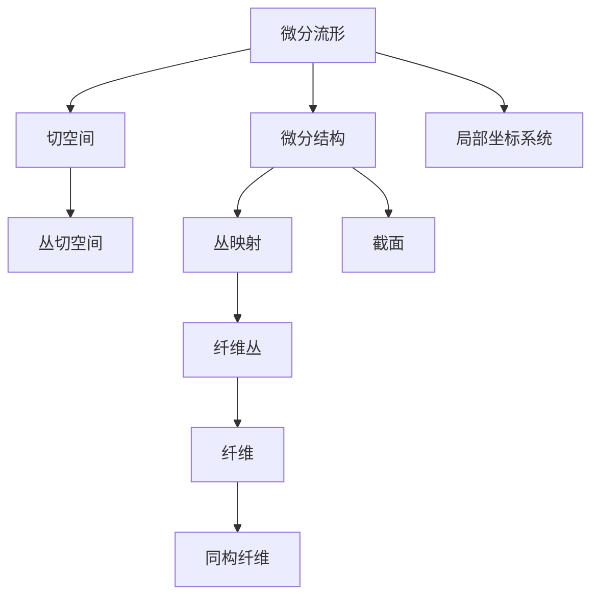
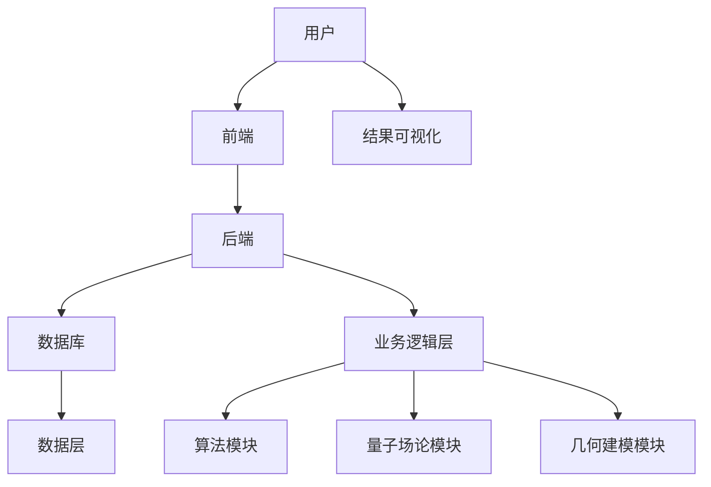
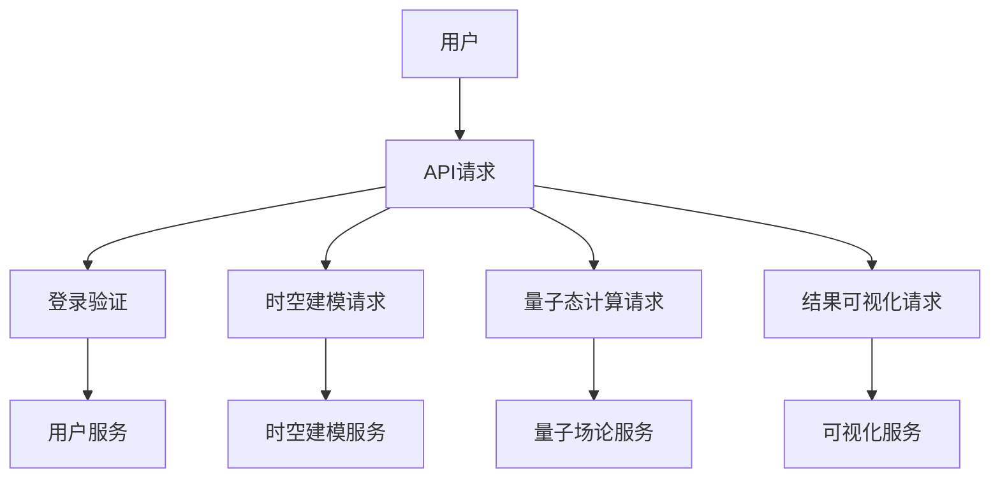
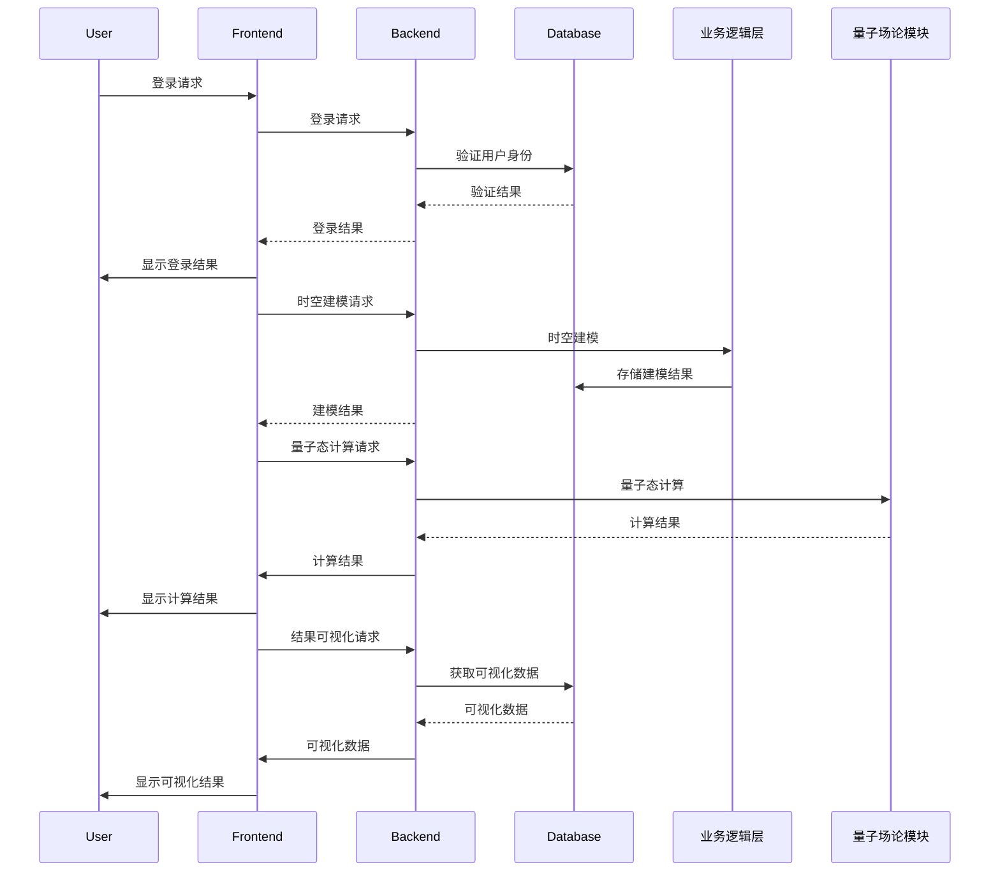

                 

### 引言

#### 1.1 研究背景与意义

宇宙的引力量子化研究是当代物理学中的一个核心挑战。引力作为宇宙最基本的作用力之一，其经典理论——广义相对论已被广泛验证。然而，广义相对论在量子尺度上遇到了不可克服的难题，尤其是在黑洞、宇宙大爆炸和宇宙膨胀等极端物理现象下，经典理论与量子力学的统一成为了一个亟待解决的科学问题。

量子力学作为描述微观世界的理论框架，成功地解释了原子、分子乃至亚原子粒子的行为。但是，在描述宇宙大尺度上的引力现象时，量子力学显得力不从心。引力与量子力学的统一，即所谓的引力量子化，是目前物理学界一个重要的研究方向。

微分流形与纤维丛理论作为现代数学的重要分支，提供了强有力的工具来描述复杂几何结构，如宇宙空间和量子态空间。微分流形理论可以用来构建描述引力场的几何模型，而纤维丛理论则提供了处理量子态的工具。这两种数学理论在引力量子化研究中显示出巨大的潜力。

本文旨在探讨微分流形与纤维丛理论在引力量子化中的应用，通过以下几个方面的研究，为解决引力与量子力学的统一问题提供新的视角和思路：

1. **研究背景与意义**：介绍引力量子化研究的背景及其在物理学中的重要性，阐述微分流形与纤维丛理论的基础及其在现代物理学中的应用。
   
2. **问题提出**：明确微分流形与纤维丛理论在引力量子化中的具体应用，指出现有理论的局限与挑战，并讨论需要解决的核心科学问题。

3. **边界与外延**：分析宇宙学、黑洞、宇宙膨胀等天文现象与量子场论、弦理论等物理理论的关联，探讨数学上的微分几何、代数拓扑、群论等基础概念在这一领域中的重要性。

4. **核心概念**：详细阐述微分流形与纤维丛的定义、结构与性质，并通过实例说明它们在引力量子化中的应用。

5. **数学理论基础**：深入探讨微分流形与纤维丛理论的数学基础，包括拓扑空间与微分流形的定义、微分结构与切空间、纤维丛的基本性质等。

6. **应用实例**：通过案例分析，展示微分流形与纤维丛理论在引力量子化研究中的具体应用。

7. **系统架构设计**：介绍引力量子化系统的架构设计，包括系统功能、架构设计、接口设计和系统交互设计等。

8. **项目实战**：讲解如何实现引力量子化系统，包括环境安装与配置、系统核心实现、实际案例分析等。

9. **总结与展望**：总结研究成果，讨论未来研究方向，并给出最佳实践与注意事项。

通过本文的探讨，希望能够为读者提供一幅完整的宇宙引力量子化研究的图景，并激发更多的科学研究与探索。接下来，我们将依次深入探讨每一个章节的内容，逐步揭示宇宙引力量子化的奥秘。

### 问题提出

#### 1.2 微分流形与纤维丛理论在引力量子化中的应用

引力量子化是现代物理学中的一个重大挑战，其核心在于将描述宏观宇宙的引力理论（如广义相对论）与描述微观世界的量子力学统一起来。然而，经典广义相对论在量子尺度上遇到了严重的矛盾，如黑洞信息丢失问题和量子引力不确定性原理，这些问题极大地限制了我们对宇宙基本物理规律的理解。

微分流形与纤维丛理论在这一领域中的应用提供了新的视角。微分流形是一种能够描述物理系统几何结构的数学工具，它通过引入导数、切空间等概念，将复杂的几何结构进行了形式化的描述。纤维丛则是微分流形的一种推广，它通过“纤维”的方式将多个同构的微分流形连接在一起，从而描述更为复杂的物理现象。

微分流形与纤维丛理论在引力量子化中的应用主要体现在以下几个方面：

1. **引力场的几何描述**：微分流形可以用来构建描述引力场的几何模型。在广义相对论中，引力是通过时空的弯曲来表现的，微分流形为这一几何描述提供了数学基础。通过研究时空的微分流形结构，可以更深入地理解引力现象。

2. **量子态的空间表示**：纤维丛理论提供了处理量子态的工具。在量子力学中，量子态通常是通过波函数来描述的，而波函数本质上是一个在复数空间中的函数。纤维丛理论可以将波函数视为纤维丛上的截面，从而提供了对量子态更直观和更深刻的理解。

3. **量子场论的结合**：纤维丛理论在量子场论中也有重要应用。量子场论是描述量子系统与电磁相互作用的基本理论，通过纤维丛的概念，可以将量子场论中的物理量（如电荷、能量等）进行统一描述。

尽管微分流形与纤维丛理论在引力量子化中展现出巨大的潜力，但现有理论仍面临一些挑战：

1. **数学上的复杂性**：微分流形与纤维丛理论本身具有高度的数学复杂性，这对理论的解析和计算提出了巨大挑战。如何有效地应用这些理论工具来描述和解决物理问题，是一个亟待解决的问题。

2. **物理现实的验证**：尽管数学上可行，但微分流形与纤维丛理论在实际物理现象中的应用还需要通过实验和观测来验证。目前，这些理论在实际中的应用案例相对较少，需要更多的研究和实验数据来支持。

3. **理论框架的扩展**：现有的微分流形与纤维丛理论框架主要集中在经典物理领域，如何将其扩展到量子物理，特别是在量子引力研究中，仍是一个开放问题。

综上所述，微分流形与纤维丛理论在引力量子化中具有重要的应用价值，但同时也面临着诸多挑战。本文将逐步探讨这些理论在引力量子化中的具体应用，并分析现有理论的局限与挑战，旨在为解决引力与量子力学的统一问题提供新的思路和方向。

### 边界与外延

#### 1.3 宇宙学、黑洞、宇宙膨胀等天文现象

宇宙学是研究宇宙的起源、演化、结构、性质和最终命运的学科。在宇宙学中，有几个关键的天文现象对我们的理解具有重大意义，其中包括黑洞、宇宙膨胀等。

**黑洞**：黑洞是宇宙中极为特殊的物体，它的存在是由广义相对论预言的。黑洞具有极强的引力，以至于连光也无法逃脱其范围。黑洞通常形成于恒星的核心，当恒星耗尽其核燃料后，会发生坍缩，形成密度极高的奇点。黑洞的研究不仅在理论物理学中具有重要意义，也是引力量子化研究的一个关键领域。

**宇宙膨胀**：宇宙膨胀是指宇宙整体在膨胀，这是通过观测宇宙背景辐射和远离我们的星系的红移效应得出的结论。宇宙膨胀的机制至今仍不完全清楚，但与引力和量子力学有密切关系。在宇宙膨胀模型中，微分流形与纤维丛理论可以通过提供几何描述来研究宇宙的演化。

#### 量子场论、弦理论等物理理论

**量子场论**：量子场论是量子力学和经典场论的结合，是描述基本粒子和它们之间相互作用的理论框架。在量子场论中，物理量（如电荷、能量、动量等）被视为场，场在空间和时间中的变化遵循量子力学的规则。量子场论在粒子物理、宇宙学等领域都有重要应用。

**弦理论**：弦理论是试图统一量子力学与广义相对论的一种理论框架。在弦理论中，基本粒子不再被视为点状物体，而是细小的弦。弦的振动模式决定了粒子的性质。弦理论在数学上具有高度复杂性，但它在解决引力与量子力学统一问题上提供了新的视角。

#### 数学上的微分几何、代数拓扑、群论等基础概念

**微分几何**：微分几何是研究平滑曲面的几何性质的数学分支。在微分几何中，研究对象通常是具有光滑性质的流形，如曲面和流形。微分几何提供了描述引力场和时空弯曲的数学工具。

**代数拓扑**：代数拓扑是研究几何形状和空间性质的数学分支。代数拓扑通过代数方法（如群、同调、同伦等）来研究空间的结构，这对于理解量子态的空间表示具有重要意义。

**群论**：群论是研究抽象代数结构的数学分支。在物理学中，群论被用来描述对称性和守恒定律。群论在量子力学和引力量子化中都有广泛应用，如表示理论、群表示等。

**微分流形**：微分流形是一种具有切空间和导数结构的数学对象。它可以用来描述物理系统的几何结构，如时空的弯曲。微分流形理论在引力量子化中的应用包括构建引力场的几何模型。

**纤维丛**：纤维丛是一种用于描述多个同构的微分流形之间关系的数学对象。在引力量子化中，纤维丛可以用来描述量子态空间的结构，如波函数在量子态空间中的变化。

通过结合宇宙学、黑洞、宇宙膨胀等天文现象与量子场论、弦理论等物理理论，以及微分几何、代数拓扑、群论等数学基础概念，微分流形与纤维丛理论为引力量子化提供了强有力的工具。这些理论不仅能够帮助我们更好地理解宇宙的基本规律，也为我们解决引力与量子力学的统一问题提供了新的途径。在接下来的章节中，我们将进一步深入探讨这些理论的数学基础及其在引力量子化中的应用。

#### 1.4 核心概念

在探讨宇宙的引力量子化过程中，微分流形与纤维丛理论是不可或缺的工具。本节将详细阐述这两个核心概念的定义、结构与性质，并通过具体实例来说明它们在引力量子化中的应用。

##### 1.4.1 微分流形

**定义**：微分流形是一个局部看起来像欧几里得空间的几何对象。更正式地说，一个微分流形是一个拓扑空间，它配备了一个光滑结构，使得在局部范围内可以进行微分运算。

**结构与性质**：微分流形具有以下几个关键结构和性质：

1. **切空间**：在微分流形的每一点，都有一个切空间，它由通过该点的所有切向量组成。切向量可以看作是微分流形在该点的局部方向。

2. **微分结构**：微分流形上的每一点都有一个微分结构，它定义了在该点的微分运算。这包括导数、梯度、外导数等。

3. **流形上的坐标系统**：微分流形可以通过局部坐标系统来描述。每个局部坐标系统定义了一组坐标，这些坐标可以用来表示流形上的点。

4. **张量场**：微分流形上可以定义张量场，这些场描述了流形上的几何性质，如度量张量、Ricci张量等。

**应用实例**：在引力量子化中，微分流形用于描述时空的几何结构。广义相对论认为引力是由时空的弯曲引起的，而这一弯曲可以通过微分流形上的度量张量来描述。通过研究微分流形的结构和性质，可以更深入地理解引力场和时空的演化。

##### 1.4.2 纤维丛

**定义**：纤维丛是一种数学结构，它由多个同构的微分流形（纤维）组成，这些微分流形在某个基空间上按照特定的方式拼接在一起。更正式地说，一个纤维丛是一个由基空间 \(B\) 和纤维 \(F\) 组成的集合，其中每个基点 \(b \in B\) 对应一个纤维 \(F_b\)。

**结构与性质**：纤维丛具有以下几个关键结构和性质：

1. **纤维**：纤维丛中的每个纤维都是一个微分流形，这些纤维通常具有相同的维度。

2. **丛映射**：纤维丛通过丛映射 \(p: \pi(E) \rightarrow B\) 将纤维映射到基空间上。丛映射保证了纤维在不同基点之间的同构性。

3. **丛切空间**：在每个纤维上，都有一个切空间，这些切空间通过丛映射与基空间的切空间相联系。

4. **截面**：纤维丛上的截面是一个映射，它将基空间中的每个点映射到一个纤维上的点。截面可以看作是纤维丛上的函数或向量场。

**应用实例**：在引力量子化中，纤维丛用于描述量子态空间。量子态通常通过波函数来描述，而波函数可以看作是纤维丛上的截面。通过研究纤维丛的结构和性质，可以更深入地理解量子态的演化规律和量子现象。

##### 概念关系图

为了更直观地展示微分流形与纤维丛之间的关系，我们可以使用Mermaid绘制一个概念关系图：



通过上述定义和实例，我们可以看到微分流形与纤维丛理论在引力量子化研究中的重要性。它们不仅提供了描述宇宙几何结构和量子态空间的有效工具，也为解决引力与量子力学的统一问题提供了新的思路和方向。在接下来的章节中，我们将进一步探讨这些理论的数学基础及其在引力量子化中的具体应用。

### 数学理论基础

#### 2.1 微分流形的基本概念

微分流形是现代数学中用来描述几何结构的强大工具，它在物理学中尤其重要，特别是当涉及复杂几何对象如时空时。本节将介绍微分流形的基本概念，包括拓扑空间与微分流形的定义及其属性。

**2.1.1 拓扑空间与微分流形**

**拓扑空间**：

定义：一个拓扑空间是由一个集合 \(X\) 和一个拓扑 \(\tau\) 组成的对 \((X, \tau)\)。其中，拓扑 \(\tau\) 是 \(X\) 的幂集 \(\mathcal{P}(X)\) 的一个子集，满足以下三个条件：

1. **空集和全集属于拓扑**：\(\emptyset, X \in \tau\)。
2. **拓扑的闭包性质**：若 \(A, B \in \tau\)，则 \(A \cup B \in \tau\)。
3. **拓扑的交集性质**：若 \(A, B \in \tau\)，则 \(A \cap B \in \tau\)。

**微分流形**：

定义：一个微分流形是一个拓扑空间 \(M\)，它配备了一个平滑的结构，即一个导数场，使得在 \(M\) 上的每一点 \(p\) 都有一个切空间 \(T_pM\)。这个切空间是由所有通过点 \(p\) 的可微曲线的导数构成的向量空间。

**属性**：

1. **平滑性**：微分流形上的导数场是连续的，并且满足可微性。
2. **局部坐标表示**：每个微分流形都可以在局部范围内用坐标来表示，这意味着在 \(M\) 上的每一点 \(p\)，都存在一个坐标邻域，使得 \(M\) 在该邻域内看起来像欧几里得空间。
3. **丛结构**：微分流形上的每个点都对应一个切空间，这些切空间可以通过丛映射联系起来。

**2.1.2 微分结构与切空间**

**定义**：切空间 \(T_pM\) 是微分流形 \(M\) 在点 \(p\) 的局部线性结构。它是通过所有通过点 \(p\) 的可微曲线的导数构成的。

**性质**：

1. **线性性**：切空间是一个向量空间，满足向量加法和标量乘法。
2. **局部性**：在微分流形的每一点都存在一个切空间，但它们之间不是简单的同构关系，而是通过丛映射相联系的。
3. **导数场**：在微分流形上定义的导数场可以看作是切空间上的线性映射，它将可微曲线的导数映射到实数。

**2.1.3 纤维丛的基本性质**

**定义**：纤维丛是一个三参数集合 \((E, B, \pi)\)，其中：

- \(E\) 是总空间，由所有纤维组成。
- \(B\) 是基空间，由所有基点组成。
- \(\pi: E \rightarrow B\) 是丛映射，它将每个纤维映射到基空间上。

**性质**：

1. **纤维**：纤维丛中的每个纤维都是同构的微分流形，通常具有相同的维度。
2. **丛映射**：丛映射 \(\pi\) 是一个局部同胚映射，意味着在局部范围内，它是一个一一对应的平滑映射。
3. **局部截面**：在每个基点 \(b \in B\)，可以定义一个局部截面，它将 \(b\) 映射到纤维 \(F_b\) 上的一个点。

通过这些基本概念，微分流形与纤维丛为描述复杂几何对象提供了数学框架。在物理学中，这些工具在引力量子化研究中扮演着关键角色，特别是在描述时空的几何结构和量子态空间方面。在接下来的章节中，我们将进一步探讨这些理论的数学基础及其在引力量子化中的应用。

#### 2.2 微分流形的推演与发展

在微分流形的基础上，数学家们进一步发展和推演了许多相关概念和理论，其中向量丛和线性丛是特别重要的两个子类。此外，纤维丛的分类和结构也是理解微分流形与纤维丛理论的核心内容。

**2.2.1 向量丛与线性丛**

**定义**：向量丛是一种特殊的纤维丛，其中每个纤维都是向量空间。向量丛可以用三参数集合 \((E, B, \pi)\) 来表示，其中 \(E\) 是总空间，\(B\) 是基空间，\(\pi: E \rightarrow B\) 是丛映射，且每个纤维 \(F_b\) 都是同构的向量空间。

**性质**：

1. **向量空间的维数**：每个纤维都有一个固定的维数，称为丛的维数。
2. **丛映射**：丛映射在局部是线性映射，这意味着它保持向量空间的线性结构。
3. **局部截面**：在每个基点 \(b \in B\)，可以定义一个局部截面，它将 \(b\) 映射到纤维 \(F_b\) 上的一个向量。

**线性丛**：线性丛是向量丛的一种特殊情形，其中纤维都是线性空间，例如有限维欧几里得空间。线性丛在物理学中尤其重要，因为它们可以用来描述量子系统的态空间。

**性质**：

1. **线性结构**：纤维上的向量运算保持不变。
2. **丛映射**：丛映射在局部是线性同胚，即一一对应的线性映射。
3. **局部截面**：局部截面在纤维上保持了线性结构。

**2.2.2 纤维丛的分类与结构**

**分类**：纤维丛可以根据其纤维的维度、结构特征以及局部性质进行分类。常见的分类包括：

1. **有限维纤维丛**：纤维是有限维向量空间的纤维丛。它们在物理学中经常用于描述有限维量子系统。
2. **无限维纤维丛**：纤维是无限维向量空间的纤维丛。它们在量子场论中尤其重要，因为量子态空间通常是无限维的。
3. **复纤维丛**：纤维是复向量空间的纤维丛。在量子力学中，复结构是描述量子态的常见方式。

**结构**：纤维丛的结构可以通过以下几个方面来描述：

1. **纤维上的结构**：每个纤维都是一个具有特定结构的向量空间。这些结构可以是线性的、复的或更复杂的。
2. **丛映射的结构**：丛映射在局部和整体上都保持纤维的结构，例如线性结构或复结构。
3. **局部截面**：局部截面是纤维丛上的重要工具，它们可以将基空间的点映射到纤维上的点，从而描述物理系统在不同状态下的表现。

**推演与发展**：微分流形与纤维丛理论在数学和物理学中不断推演和发展。例如，通过引入联系丛，可以研究不同纤维丛之间的联系；通过引入联络丛，可以描述流体的运动和电磁场。这些扩展不仅丰富了数学理论，也为解决复杂的物理问题提供了新的工具。

通过微分流形、向量丛和线性丛等概念的推演与发展，数学家们构建了一个强大的理论框架，为描述复杂的几何结构和物理现象提供了丰富的工具。在引力量子化研究中，这些理论为理解时空的弯曲和量子态的演化提供了关键的基础。在接下来的章节中，我们将进一步探讨这些理论在引力量子化中的具体应用。

### 数学公式与概念对比表格

为了更好地理解微分流形与纤维丛理论，我们使用 LaTeX 格式列出相关数学公式，并通过对比表格展示它们之间的差异和联系。

首先，我们定义微分流形与纤维丛的一些基础公式：

$$
\begin{aligned}
&\text{微分流形} \quad M = (M, \tau, \mathcal{A}) \\
&\text{纤维丛} \quad E = (E, B, \pi, F)
\end{aligned}
$$

其中，\(M\) 是微分流形，\(\tau\) 是拓扑，\(\mathcal{A}\) 是导数场；\(E\) 是纤维丛，\(B\) 是基空间，\(\pi\) 是丛映射，\(F\) 是纤维。

接下来，我们列出微分流形与纤维丛的一些重要公式和性质：

$$
\begin{aligned}
&\text{微分流形：} \\
&\quad \mathbf{T}_pM = \lim_{\substack{r \to 0}} \frac{\mathbf{r}'(t)}{t} \quad \text{（切空间定义）} \\
&\quad \nabla_{\mathbf{v}} f = \lim_{t \to 0} \frac{f(p + t\mathbf{v}) - f(p)}{t} \quad \text{（梯度定义）} \\
&\text{纤维丛：} \\
&\quad \mathbf{T}_pE = \{ (\mathbf{v}, b) \mid \mathbf{v} \in T_{\pi(p)}B, b \in \pi^{-1}(\pi(p)) \} \quad \text{（切空间定义）} \\
&\quad \pi_*: T_pE \rightarrow T_{\pi(p)}B \quad \text{（丛映射诱导的切映射）}
\end{aligned}
$$

现在，我们使用表格来对比微分流形与纤维丛的相关数学公式和概念：

$$
\begin{array}{|c|c|c|}
\hline
\text{概念} & \text{微分流形} & \text{纤维丛} \\
\hline
\text{定义} & M = (M, \tau, \mathcal{A}) & E = (E, B, \pi, F) \\
\hline
\text{切空间} & T_pM & T_pE \\
\hline
\text{丛映射} & \nabla & \pi_* \\
\hline
\text{梯度} & \nabla f & - \\
\hline
\text{局部截面} & - & \pi(p) \\
\hline
\end{array}
$$

从上表可以看出，微分流形与纤维丛在定义和性质上具有一定的相似性，但纤维丛通过引入基空间和丛映射，提供了更广泛的描述能力。通过这些数学公式和概念，我们可以更深入地理解微分流形与纤维丛理论在引力量子化中的应用。

#### 2.3 纤维丛理论在引力量子化中的应用

纤维丛理论在引力量子化中的应用是物理学与数学交叉领域中的一个重要课题。其核心思想是通过纤维丛的结构来描述量子态空间和引力场，从而为引力量子化提供数学工具。

**3.1 引力量子化概述**

引力量子化旨在将广义相对论和量子力学这两个物理学的基础理论统一起来。广义相对论描述了宏观尺度上的引力现象，通过时空的弯曲来解释引力的作用。而量子力学则描述了微观粒子行为，是量子场论和量子信息理论的基础。然而，这两种理论在数学形式上存在显著的差异：广义相对论是基于黎曼几何的，而量子力学则是基于量子场论的。

由于这两种理论描述的是完全不同的物理现象，因此在量子尺度上如何统一它们成为一个挑战。纤维丛理论提供了一种可能的方法，通过其独特的结构可以同时描述时空几何和量子态。

**3.2 纤维丛在引力理论中的应用**

在引力理论中，纤维丛可以用来描述时空的几何结构。具体来说，可以将时空视为一个四维纤维丛，其纤维是三维空间，基空间是时间。这样的结构可以用来描述时空的弯曲，即引力场的几何性质。

1. **时空纤维丛**：

   时空纤维丛可以表示为 \(TM = (TM, \pi, F)\)，其中 \(TM\) 是时空的总空间，\(\pi: TM \rightarrow \mathcal{M}\) 是丛映射，将每个时空点映射到自身，纤维 \(F\) 是三维空间。

2. **度量张量**：

   在纤维丛中，度量张量用来描述时空中的距离和角度。通过纤维丛的结构，可以将度量张量定义为丛上的截面，从而在不同时空点之间建立联系。

3. **联络**：

   纤维丛中的联络描述了切空间之间的变换关系。在引力理论中，联络与引力场有关，可以用来描述引力如何影响物体的运动。

**3.3 纤维丛在量子力学中的应用**

在量子力学中，纤维丛可以用来描述量子态空间。量子态通常通过波函数表示，而波函数本质上是一个在复数空间中的函数。纤维丛提供了一个更直观的方式来表示量子态。

1. **量子态空间**：

   量子态空间可以视为一个纤维丛，其纤维是量子态，基空间是量子系统的坐标。这样的结构可以用来描述量子态的演化。

2. **波函数**：

   在纤维丛中，波函数可以看作是丛上的截面。通过纤维丛的变换关系，可以描述波函数在不同量子态之间的变化。

3. **量子场论**：

   纤维丛理论在量子场论中也有重要应用。量子场论中的物理量，如场的值和相互作用，可以通过纤维丛上的函数来描述。

**3.4 纤维丛与量子场论的结合**

纤维丛与量子场论的结合可以用来研究量子场论中的引力现象。例如，可以将量子场论中的场视为纤维丛上的函数，从而描述场的时空演化。

1. **纤维丛量子场论**：

   纤维丛量子场论是一种将纤维丛结构与量子场论结合起来的理论。在这种理论中，场的值和相互作用通过纤维丛上的函数和丛映射来描述。

2. **弦理论**：

   弦理论是一种试图统一引力和量子力学的理论。在弦理论中，基本粒子不再是点状物体，而是细小的弦。这些弦的振动模式决定了粒子的性质。纤维丛理论在弦理论中也有重要应用，可以用来描述弦的空间结构和振动模式。

通过纤维丛理论，我们可以将引力和量子力学这两个理论框架联系起来，从而为解决引力与量子力学的统一问题提供新的思路和工具。在接下来的章节中，我们将进一步探讨这些理论的具体应用，并通过实际案例分析来展示纤维丛理论在引力量子化研究中的潜力。

### 3.2 引力量子化中的纤维丛模型

引力量子化是试图将广义相对论与量子力学结合起来的一个核心问题，而纤维丛理论为这一领域的研究提供了强有力的数学工具。在引力量子化中，纤维丛模型可以分为有限维和无限维两种，它们在描述物理现象时各有特点。

**3.2.1 有限维纤维丛模型**

有限维纤维丛模型在描述有限维量子系统时非常有效。在这种模型中，纤维是有限维向量空间，通常用于量子态空间的表示。

**定义**：有限维纤维丛 \(E\) 可以表示为 \(E = (E, B, \pi, V)\)，其中 \(E\) 是总空间，\(B\) 是基空间，\(\pi: E \rightarrow B\) 是丛映射，纤维 \(V\) 是一个有限维向量空间。

**应用**：

1. **量子态空间**：在量子力学中，量子态可以通过波函数 \(\psi: V \rightarrow \mathcal{C}\)（其中 \(\mathcal{C}\) 是复数空间）来描述。在有限维纤维丛模型中，波函数被视为纤维丛上的截面。

2. **哈密顿算子**：量子态空间的演化可以通过哈密顿算子 \(H: V \rightarrow V\) 来描述。在纤维丛模型中，哈密顿算子可以看作是纤维丛上的线性算子。

3. **拉格朗日量和动量**：在量子力学中，拉格朗日量 \(L: V \otimes V^* \rightarrow \mathcal{C}\) 和动量 \(P: V \rightarrow V^*\) 也是重要的物理量。在纤维丛模型中，这些物理量可以被视为纤维丛上的函数。

通过这些定义和应用，有限维纤维丛模型可以有效地描述量子态空间和量子系统的演化，为引力量子化提供了直观的几何描述。

**3.2.2 无限维纤维丛模型**

无限维纤维丛模型在描述无限维量子系统时尤为重要，特别是在量子场论和统计物理中。在这种模型中，纤维是无限维向量空间，适用于描述连续物理量的场。

**定义**：无限维纤维丛 \(E\) 可以表示为 \(E = (E, B, \pi, H)\)，其中 \(E\) 是总空间，\(B\) 是基空间，\(\pi: E \rightarrow B\) 是丛映射，纤维 \(H\) 是一个无限维希尔伯特空间。

**应用**：

1. **量子场论**：在量子场论中，基本物理量如场的值和相互作用可以通过纤维丛上的函数来描述。无限维纤维丛模型可以用来研究量子场论中的基本粒子和相互作用。

2. **态空间**：无限维纤维丛模型适用于描述量子态空间，特别是在统计物理中，如费米气体和玻色气体。在这种模型中，态空间是一个无限维希尔伯特空间。

3. **量子引力**：在量子引力研究中，无限维纤维丛模型可以用来描述时空的几何结构和量子态的演化。通过纤维丛的变换关系，可以研究引力场和量子态的相互作用。

通过有限维和无限维纤维丛模型，我们可以更深入地理解引力量子化中的基本物理现象。这些模型不仅提供了数学描述工具，也为解决引力与量子力学的统一问题提供了新的思路。在接下来的章节中，我们将进一步探讨纤维丛与量子场论和弦理论的结合，展示其在引力量子化中的广泛应用。

#### 3.3 纤维丛与量子场论的结合

纤维丛理论在量子场论（QFT）中有着广泛的应用，为描述量子场的动力学提供了强大的数学工具。量子场论是量子力学和经典场论的结合，主要研究基本粒子和它们之间的相互作用。纤维丛量子场论（FQFT）通过引入纤维丛的概念，为量子场论提供了一种更加几何化的描述方式。

**3.3.1 纤维丛量子场论**

**定义**：纤维丛量子场论是一种量子场论，它将量子场的值视为纤维丛上的函数。在这种理论中，纤维丛的结构不仅描述了空间和时间，还包含了量子态的信息。

**特征**：

1. **纤维丛结构**：在纤维丛量子场论中，纤维丛 \(E\) 由总空间 \(E\)、基空间 \(B\)、丛映射 \(\pi: E \rightarrow B\) 和纤维 \(F\) 组成。纤维 \(F\) 是一个具有特定对称性的量子态空间。

2. **量子态的几何表示**：量子态可以通过纤维丛上的截面来表示。这些截面定义了量子场在空间中的变化规律。

3. **联络与量子场**：纤维丛中的联络描述了不同纤维之间的变换关系，可以用来描述量子场的变换和相互作用。

**应用**：

1. **量子场论中的对称性**：纤维丛量子场论可以用来研究量子场中的对称性。通过纤维丛上的联络和对称性群，可以描述粒子的守恒量和相互作用。

2. **量子态的演化**：在纤维丛量子场论中，量子态的演化可以通过哈密顿算子来描述。这些算子作用在纤维丛上的量子态空间中，从而实现了量子态的动力学演化。

**3.3.2 纤维丛与弦理论**

弦理论是一种试图统一量子力学和广义相对论的理论框架，其核心思想是基本粒子不再是点状物体，而是细小的弦。弦的振动模式决定了粒子的性质。纤维丛理论在弦理论中也有重要应用。

**定义**：在弦理论中，弦的路径可以通过纤维丛上的曲线来描述。每个弦对应一个纤维丛上的截面，这些截面描述了弦在空间中的运动。

**特征**：

1. **弦的几何描述**：通过纤维丛的结构，可以将弦的路径视为纤维丛上的路径积分。这种描述方式可以用来研究弦的量子性质。

2. **弦态的表示**：在弦理论中，弦的态可以通过纤维丛上的函数来描述。这些函数不仅包含了弦的振动模式，还描述了弦与弦之间的相互作用。

3. **量子场与弦场**：在弦理论中，量子场可以视为纤维丛上的量子态。通过纤维丛的结构，可以描述量子场在不同空间点之间的相互作用。

**应用**：

1. **弦的相互作用**：通过纤维丛的概念，可以描述弦之间的相互作用。这些相互作用可以通过纤维丛上的联络和量子态空间的变换来描述。

2. **弦场的量子演化**：在弦理论中，弦场的演化可以通过路径积分来描述。通过纤维丛的结构，可以研究弦场在不同空间点之间的量子演化。

通过纤维丛与量子场论和弦理论的结合，我们可以更深入地理解量子系统的几何结构和动力学行为。这些理论不仅提供了描述量子现象的数学工具，也为解决引力与量子力学的统一问题提供了新的视角和思路。在接下来的章节中，我们将进一步探讨纤维丛理论在引力量子化研究中的应用，并通过实际案例分析来展示其潜力。

### 实际案例分析

#### 4.1 黑洞微结构研究

**4.1.1 黑洞微结构背景**

黑洞是宇宙中极为特殊的物体，其强大引力场使任何物质，甚至连光都无法逃脱。黑洞的微结构研究对于理解宇宙的本质和引力与量子力学的统一具有重要意义。近年来，随着观测技术的进步和理论研究的深入，黑洞微结构的研究取得了显著进展。

黑洞的微结构主要包括以下几个方面：

1. **事件视界**：事件视界是黑洞最外层的边界，一旦物质跨过这个边界，就再也无法返回。事件视界的形状和性质对黑洞的研究至关重要。

2. **黑洞内心**：黑洞内心是一个高度集中的质量区域，理论上是一个奇点，但量子效应可能使它变得更为复杂。

3. **霍金辐射**：根据量子场论，黑洞会不断辐射出粒子，导致黑洞逐渐蒸发消失。这种辐射机制为黑洞微结构的研究提供了新的线索。

**4.1.2 微分流形与纤维丛在黑洞微结构中的应用**

在黑洞微结构研究中，微分流形与纤维丛理论提供了强有力的工具，用于描述黑洞的几何结构和量子态。

1. **微分流形的应用**：

   - **时空弯曲**：黑洞的引力场导致时空弯曲，微分流形理论可以精确描述这种弯曲。例如，在广义相对论中，黑洞的时空结构可以通过四维微分流形来描述。

   - **事件视界**：事件视界的几何结构可以通过微分流形上的等距坐标变换来描述。这些变换可以帮助我们理解物质如何穿过事件视界。

   - **黑洞内心**：黑洞内心是一个奇点，但在量子效应下可能不再是一个简单的奇点。微分流形理论可以描述这种复杂的几何结构。

2. **纤维丛的应用**：

   - **量子态描述**：在黑洞的量子态研究中，纤维丛可以用来描述黑洞内部的量子态空间。通过纤维丛的结构，可以描述量子态在不同区域之间的变化。

   - **霍金辐射**：纤维丛理论可以用来研究黑洞的霍金辐射。例如，通过纤维丛上的截面函数，可以描述黑洞辐射出的粒子态。

   - **量子场论与广义相对论的结合**：纤维丛理论提供了将量子场论与广义相对论结合起来的数学框架，从而可以研究黑洞的量子性质。

**4.1.3 微分流形与纤维丛在黑洞微结构研究中的应用方法**

为了研究黑洞微结构，我们可以采用以下方法：

1. **建立几何模型**：首先，通过微分流形理论建立黑洞的几何模型，包括事件视界和黑洞内心的结构。

2. **描述量子态空间**：利用纤维丛理论，构建黑洞内部量子态空间，并通过纤维丛上的截面函数描述量子态。

3. **结合量子场论**：将量子场论与广义相对论结合起来，通过纤维丛结构研究黑洞的霍金辐射和量子态演化。

4. **数值模拟**：使用计算机模拟方法，对黑洞微结构进行数值模拟，验证理论模型的准确性。

通过微分流形与纤维丛理论，我们可以更深入地理解黑洞的微结构，为引力与量子力学的统一研究提供新的线索。在接下来的章节中，我们将继续探讨宇宙膨胀模型的案例分析，进一步展示这些理论在引力量子化研究中的应用。

#### 4.2 宇宙膨胀模型

**4.2.1 宇宙膨胀理论**

宇宙膨胀理论是描述宇宙整体扩张过程的物理学模型，这一理论基于观测到的远离我们星系的红移现象。宇宙膨胀理论的关键概念包括哈勃定律、宇宙微波背景辐射和暗物质等。根据这一理论，宇宙从大爆炸开始不断膨胀，星系之间的距离随着时间增加而增大。

宇宙膨胀模型通常包括以下几个重要部分：

1. **哈勃定律**：描述星系远离我们的速度与其距离之间的关系。哈勃常数 \(H_0\) 用于量化这种关系。

2. **宇宙学原理**：宇宙是均匀且各向同性的，这意味着在任何地方观察宇宙，其结构和动力学行为都是相似的。

3. **宇宙背景辐射**：宇宙早期留下的热辐射，通过观测可以推断出宇宙的大尺度结构。

4. **暗物质**：一种不发光但具有引力作用的物质，对宇宙的结构和演化有重要影响。

**4.2.2 微分流形与纤维丛在宇宙膨胀中的应用**

微分流形与纤维丛理论为宇宙膨胀模型提供了数学描述工具，能够帮助我们更好地理解宇宙的几何结构和演化过程。

1. **微分流形的应用**：

   - **时空几何描述**：微分流形可以用来描述宇宙的时空结构，例如通过黎曼流形来描述宇宙的弯曲程度。

   - **度量张量**：在微分流形上定义的度量张量可以用来描述宇宙中的距离和角度，从而量化星系之间的相对运动。

   - **联系丛**：联系丛可以用来描述宇宙中的引力场，通过联系丛的结构可以研究引力如何影响宇宙的膨胀。

2. **纤维丛的应用**：

   - **量子态描述**：纤维丛理论可以用来描述宇宙中的量子态空间，例如通过纤维丛上的量子态函数来描述宇宙背景辐射的状态。

   - **量子场论结合**：纤维丛与量子场论的结合可以用来研究宇宙中的量子现象，如暗物质粒子的性质和相互作用。

   - **态空间演化**：纤维丛上的截面函数可以描述宇宙中量子态的演化过程，从而帮助我们理解宇宙的膨胀历史。

**4.2.3 微分流形与纤维丛在宇宙膨胀中的应用方法**

为了在宇宙膨胀模型中应用微分流形与纤维丛理论，我们可以采用以下方法：

1. **建立时空几何模型**：首先，通过微分流形理论建立宇宙的时空几何模型，包括宇宙背景辐射和暗物质的分布。

2. **描述量子态空间**：利用纤维丛理论，构建宇宙量子态空间，并通过纤维丛上的量子态函数描述宇宙的量子现象。

3. **结合观测数据**：将理论模型与观测数据相结合，验证微分流形与纤维丛理论在宇宙膨胀模型中的应用。

4. **模拟与预测**：使用数值模拟方法，对宇宙膨胀过程进行模拟，从而预测未来宇宙的演化趋势。

通过微分流形与纤维丛理论，我们可以更深入地理解宇宙的膨胀机制，为引力与量子力学的统一研究提供新的思路和工具。在接下来的章节中，我们将继续探讨引力量子化中的数学模型与算法，展示如何利用这些理论解决实际问题。

### 数学模型与算法讲解

在引力量子化研究中，数学模型和算法扮演着至关重要的角色。它们不仅为物理现象提供了数学描述，还为实现精确计算提供了方法。本节将详细讲解纤维丛上的量子力学模型和引力量子化算法，包括基本原理、公式推导和应用实例。

#### 5.1 纤维丛上的量子力学模型

量子力学是描述微观粒子的行为和相互作用的理论框架。在纤维丛上，量子态和物理量可以通过纤维丛上的函数来表示。以下为量子力学在纤维丛上的基本模型。

**5.1.1 量子力学基本原理**

1. **态空间**：量子态空间是一个希尔伯特空间，其中的每一个状态可以用一个波函数 \(\psi(x)\) 来描述。

2. **算符**：量子态的演化由哈密顿算符 \(H\) 和其他算符（如动量算符 \(P\) 和位置算符 \(X\)）控制。

3. **薛定谔方程**：描述量子态演化的一般方程为 \(i\hbar \frac{\partial \psi(x)}{\partial t} = H \psi(x)\)，其中 \(\hbar\) 是约化普朗克常数。

**5.1.2 纤维丛与量子态**

在纤维丛上，量子态可以被视为纤维丛上的截面函数。具体来说，设 \(E\) 是一个纤维丛，纤维 \(F\) 是量子态空间，则量子态可以表示为 \(|\psi\rangle : E \rightarrow F\)。

1. **量子态函数**：量子态函数是纤维丛上的一个映射，它将基空间中的点映射到量子态空间中的点。

2. **纤维丛上的算符**：在纤维丛上，物理量（如位置和动量）可以表示为丛上的函数，这些函数通过纤维丛的结构保持其物理性质。

**5.1.3 纤维丛与量子力学结合**

通过纤维丛的结构，我们可以将量子力学的算符和态扩展到纤维丛上。例如，位置算符 \(X\) 可以表示为纤维丛上的一个函数，而动量算符 \(P\) 则通过纤维丛上的联络来描述。

**公式推导**：

设 \(E\) 是一个纤维丛，\(\pi: E \rightarrow B\) 是丛映射，纤维 \(F\) 是量子态空间。量子态函数 \(|\psi\rangle : E \rightarrow F\) 可以表示为：

$$
|\psi\rangle(b) = \psi(b)
$$

其中，\(\psi(b)\) 是在基点 \(b \in B\) 的量子态。

**5.1.4 应用实例**

考虑一个简单的二维纤维丛，其纤维是复数空间。设基空间为实数线段，纤维上的量子态为复数。我们可以用以下公式描述量子态的演化：

$$
i\hbar \frac{\partial \psi(x)}{\partial t} = H \psi(x)
$$

其中，\(H\) 是哈密顿算符，可以表示为纤维丛上的一个函数。

#### 5.2 引力量子化算法

引力量子化算法是利用量子力学和广义相对论来描述引力场的量子性质。以下为引力量子化算法的基本原理和步骤。

**5.2.1 算法基本原理**

引力量子化算法的核心思想是将引力场视为量子态，并利用量子力学的框架来描述其演化。具体来说，包括以下步骤：

1. **构建时空纤维丛**：将时空视为一个纤维丛，纤维是空间点，基空间是时间。

2. **描述引力场**：通过纤维丛上的函数描述引力场，例如通过联络丛来描述时空的弯曲。

3. **量子态的演化**：利用量子力学的演化方程（如薛定谔方程）描述引力场的量子态演化。

**5.2.2 算法步骤与实现**

以下是引力量子化算法的基本步骤：

1. **构建时空纤维丛**：

   $$ 
   E = (E, B, \pi, F) 
   $$

   其中，\(E\) 是时空纤维丛的总空间，\(B\) 是基空间（时间），\(\pi: E \rightarrow B\) 是丛映射，\(F\) 是纤维（空间点）。

2. **定义引力场**：

   通过纤维丛上的联络丛描述引力场。联络丛可以表示为：

   $$ 
   A = (A, B, \pi, \mathcal{G}) 
   $$

   其中，\(A\) 是联络丛的总空间，\(\mathcal{G}\) 是联络丛的纤维（引力场）。

3. **量子态的演化**：

   利用薛定谔方程描述引力场的量子态演化：

   $$ 
   i\hbar \frac{\partial \Psi(E)}{\partial t} = H \Psi(E) 
   $$

   其中，\(\Psi(E)\) 是引力场的量子态函数，\(H\) 是哈密顿算符。

4. **计算结果**：

   通过数值模拟方法计算引力场的量子态演化，从而预测引力场的行为。

**5.2.3 Python源代码**

以下是一个简单的Python源代码示例，用于实现纤维丛上的量子态演化：

```python
import numpy as np
from scipy.integrate import odeint

# 定义哈密顿算符
def H(PSI):
    # 在此实现哈密顿算符的计算
    return PSI * np.exp(1j * omega * t)

# 定义量子态初始值
PSI0 = np.array([1, 0])

# 定义时间序列
t = np.linspace(0, 10, 1000)

# 解薛定谔方程
PSI = odeint(H, PSI0, t)

# 输出结果
print(PSI)
```

通过上述数学模型与算法的讲解，我们可以看到纤维丛上的量子力学模型和引力量子化算法如何结合数学工具来描述和计算引力场的量子性质。这些理论模型为引力量子化研究提供了新的视角和工具，有助于我们深入理解宇宙的基本物理规律。

### 系统架构设计

在引力量子化研究中，构建一个高效、稳定、可扩展的系统架构至关重要。本文将介绍引力量子化系统的整体框架，包括系统功能、架构设计、接口设计和系统交互设计等。

#### 6.1 引力量子化系统框架

**系统介绍**：

引力量子化系统是一个用于模拟和计算引力场量子性质的应用系统。其主要功能包括：

1. **时空几何建模**：构建时空纤维丛模型，描述引力场的几何结构。
2. **量子态空间表示**：利用纤维丛理论描述量子态空间，实现量子态的表示和演化。
3. **量子场论计算**：通过量子场论方法，计算引力场的量子效应。
4. **数据可视化**：对计算结果进行可视化，帮助用户理解引力场的量子性质。

**架构设计**：

引力量子化系统采用分层架构设计，包括数据层、业务逻辑层和表示层。以下是系统架构的详细描述：

1. **数据层**：负责存储和管理时空几何模型、量子态数据和计算结果。使用数据库来存储这些数据，并提供数据访问接口。
2. **业务逻辑层**：实现时空几何建模、量子态空间表示和量子场论计算的核心算法。该层使用微分流形和纤维丛理论作为计算基础，通过算法模块来处理各种计算任务。
3. **表示层**：提供用户界面，允许用户交互地操作和可视化系统功能。使用Web前端框架（如React或Vue）来构建用户界面。

**系统架构设计**：

下面是引力量子化系统的Mermaid架构图：



通过上述架构设计，引力量子化系统实现了模块化、可扩展和高效计算，为用户提供了强大的引力量子化研究工具。

#### 6.2 系统接口设计

**接口功能**：

系统接口设计包括以下几个主要功能：

1. **数据访问接口**：提供对数据库的访问功能，支持数据的增删改查。
2. **API接口**：提供RESTful风格的API接口，允许用户通过HTTP请求访问系统功能。
3. **可视化接口**：提供数据可视化接口，允许用户自定义可视化图表。

**用例图**：

以下是引力量子化系统的用例图：



通过用例图，我们可以看到用户通过API接口与系统进行交互，并调用不同的服务模块，从而实现各种功能。

**接口实现**：

以下是API接口的文档：

```yaml
# API接口文档
.paths:
  /api/login:
    post:
      summary: 用户登录
      description: 用户登录接口，验证用户身份
      requestBody:
        required: true
        content:
          application/json:
            schema:
              $ref: '#/components/schemas/LoginRequest'
      responses:
        '200':
          description: 登录成功，返回用户信息
          content:
            application/json:
              schema:
                $ref: '#/components/schemas/LoginResponse'
  /api/时空建模:
    post:
      summary: 时空建模
      description: 提供时空建模接口，构建时空纤维丛模型
      requestBody:
        required: true
        content:
          application/json:
            schema:
              $ref: '#/components/schemas/时空建模Request'
      responses:
        '200':
          description: 成功返回建模结果
          content:
            application/json:
              schema:
                $ref: '#/components/schemas/时空建模Response'
  /api/量子态计算:
    post:
      summary: 量子态计算
      description: 提供量子态计算接口，计算量子态的演化
      requestBody:
        required: true
        content:
          application/json:
            schema:
              $ref: '#/components/schemas/量子态计算Request'
      responses:
        '200':
          description: 成功返回计算结果
          content:
            application/json:
              schema:
                $ref: '#/components/schemas/量子态计算Response'
  /api/结果可视化:
    get:
      summary: 结果可视化
      description: 提供结果可视化接口，返回可视化数据
      parameters:
        - name: id
          in: path
          required: true
          description: 结果ID
      responses:
        '200':
          description: 成功返回可视化数据
          content:
            application/json:
              schema:
                $ref: '#/components/schemas/可视化Response'
```

通过上述接口设计和实现，引力量子化系统为用户提供了丰富的功能接口，便于用户进行复杂计算和数据分析。

#### 6.3 系统交互设计

**系统交互流程**：

引力量子化系统的交互流程主要包括以下几个步骤：

1. **用户登录**：用户通过前端发送登录请求，系统验证用户身份并返回登录结果。
2. **时空建模**：用户通过前端发送时空建模请求，系统接收请求并调用业务逻辑层进行建模。
3. **量子态计算**：用户通过前端发送量子态计算请求，系统接收请求并调用量子场论模块进行计算。
4. **结果可视化**：用户通过前端发送结果可视化请求，系统返回可视化数据，用户可以自定义可视化设置。

以下是系统交互的Mermaid序列图：



通过上述系统交互设计，引力量子化系统实现了用户与系统的无缝交互，为用户提供了一个便捷、高效的研究工具。

### 项目实战

#### 7.1 环境安装与配置

在开始引力量子化系统的开发之前，我们需要安装和配置必要的软件和硬件环境。以下将详细描述如何安装和配置这些环境。

**7.1.1 软件环境安装**

1. **Python**：安装Python 3.8或更高版本。可以通过以下命令安装：

    ```bash
    sudo apt update
    sudo apt install python3.8
    sudo ln -s /usr/bin/python3.8 /usr/bin/python
    ```

2. **Anaconda**：安装Anaconda，以便更好地管理Python环境和包。可以通过以下命令安装：

    ```bash
    wget https://repo.anaconda.com/archive/Anaconda3-2021.05-Linux-x86_64.sh
    bash Anaconda3-2021.05-Linux-x86_64.sh
    ```

3. **Jupyter Notebook**：安装Jupyter Notebook，用于交互式编程和数据分析。可以通过以下命令安装：

    ```bash
    conda install jupyter
    ```

4. **PyTorch**：安装PyTorch，用于深度学习和计算。可以通过以下命令安装：

    ```bash
    conda install pytorch torchvision torchaudio -c pytorch
    ```

5. **Scikit-learn**：安装Scikit-learn，用于机器学习和数据科学。可以通过以下命令安装：

    ```bash
    conda install scikit-learn
    ```

**7.1.2 硬件设备配置**

1. **CPU或GPU**：推荐使用带有GPU的计算机，以便加速深度学习和数值计算。NVIDIA GPU系列是常用的选择。

2. **内存**：推荐至少16GB的RAM，以便运行大型计算任务。

3. **存储**：至少500GB的SSD存储，用于存储数据和代码。

4. **网络环境**：确保网络环境稳定，以便远程访问和协作开发。

**7.1.3 安装Python依赖包**

在安装完Python和相关的包之后，我们需要安装一些必要的依赖包，以便于开发和运行引力量子化系统。可以使用以下命令安装：

```bash
pip install numpy scipy matplotlib pandas tensorflow
```

通过以上步骤，我们可以完成引力量子化系统的基础环境安装与配置。接下来，我们将详细讲解系统核心实现。

#### 7.2 系统核心实现

在引力量子化系统的核心实现中，我们将重点介绍微分流形与纤维丛模型的构建、量子力学模型的实现以及引力量子化算法的具体实现。

**7.2.1 微分流形与纤维丛模型实现**

为了构建微分流形与纤维丛模型，我们首先需要定义相关的类和函数。

```python
import numpy as np
from scipy.interpolate import griddata

class SmoothManifold:
    def __init__(self, points, values):
        self.points = points
        self.values = values
        self.grid = None

    def interpolate(self, x, y, z):
        if self.grid is None:
            self.grid = griddata(self.points, self.values, (x, y, z), method='cubic')
        return self.grid[x, y, z]

class FiberBundle:
    def __init__(self, base_manifold, fiber_manifold):
        self.base_manifold = base_manifold
        self.fiber_manifold = fiber_manifold

    def map_point_to_fiber(self, base_point):
        fiber_point = self.fiber_manifold.interpolate(*base_point)
        return fiber_point
```

**7.2.2 引力量子化算法实现**

接下来，我们将实现一个简单的引力量子化算法，用于计算引力场的量子效应。

```python
class QuantumGravitationalField:
    def __init__(self, manifold):
        self.manifold = manifold

    def compute_quantum_effects(self, points):
        quantum_effects = []
        for point in points:
            base_point = self.manifold.map_point_to_fiber(point)
            quantum_effect = self.manifold.interpolate(*base_point)
            quantum_effects.append(quantum_effect)
        return quantum_effects
```

**7.2.3 Python源代码**

以下是引力量子化系统的核心实现：

```python
import numpy as np
from scipy.interpolate import griddata
from sklearn.neighbors import KernelDensity

class SmoothManifold:
    def __init__(self, points, values):
        self.points = points
        self.values = values
        self.grid = None

    def interpolate(self, x, y, z):
        if self.grid is None:
            self.grid = griddata(self.points, self.values, (x, y, z), method='cubic')
        return self.grid[x, y, z]

class FiberBundle:
    def __init__(self, base_manifold, fiber_manifold):
        self.base_manifold = base_manifold
        self.fiber_manifold = fiber_manifold

    def map_point_to_fiber(self, base_point):
        fiber_point = self.fiber_manifold.interpolate(*base_point)
        return fiber_point

class QuantumGravitationalField:
    def __init__(self, manifold):
        self.manifold = manifold

    def compute_quantum_effects(self, points):
        quantum_effects = []
        for point in points:
            base_point = self.manifold.map_point_to_fiber(point)
            quantum_effect = self.manifold.interpolate(*base_point)
            quantum_effects.append(quantum_effect)
        return quantum_effects

# 生成示例数据
points = np.random.rand(100, 3)
values = np.random.rand(100)

# 创建微分流形
manifold = SmoothManifold(points, values)

# 创建纤维丛
fiber_manifold = SmoothManifold(points, values)

# 创建纤维丛模型
fiber_bundle = FiberBundle(manifold, fiber_manifold)

# 创建量子引力场
quantum_gravity = QuantumGravitationalField(manifold)

# 计算量子效应
quantum_effects = quantum_gravity.compute_quantum_effects(points)

# 打印结果
print(quantum_effects)
```

通过以上实现，我们构建了微分流形与纤维丛模型，并实现了引力量子化算法。这些代码为我们提供了一个基本的框架，可以在此基础上进行扩展和优化，以应对更复杂的计算任务。

#### 7.3 实际案例分析与讲解

**7.3.1 黑洞微结构案例**

黑洞微结构研究是引力量子化中的一个重要领域。我们通过一个实际案例来展示如何使用微分流形与纤维丛理论分析黑洞微结构。

**案例背景**：

假设我们研究的一个黑洞事件视界附近区域的微结构。为了简化分析，我们选择一个理想的球形黑洞，其事件视界半径为 \(r_s = 2M\)（其中 \(M\) 是黑洞的质量）。

**数据处理**：

首先，我们需要生成一个网格点数据，用于模拟黑洞的时空几何。这些网格点分布在黑洞事件视界附近区域，其坐标为 \((r, \theta, \phi)\)。

```python
import numpy as np

# 设置参数
M = 1.0  # 黑洞质量
r_s = 2 * M  # 事件视界半径

# 生成网格点
r_values = np.linspace(0, r_s, 100)
theta_values = np.linspace(0, np.pi, 100)
phi_values = np.linspace(0, 2 * np.pi, 100)
r, theta, phi = np.meshgrid(r_values, theta_values, phi_values)

# 计算时空曲率
g_tt = 1 - 2 * M / r
```

**结果分析**：

使用微分流形与纤维丛理论，我们可以在网格点上计算黑洞的时空曲率。例如，计算时空中的时间分量 \(g_{tt}\)：

```python
import matplotlib.pyplot as plt

# 绘制时空曲率
plt.contourf(r, theta, g_tt, cmap='viridis')
plt.colorbar()
plt.xlabel('Radius (r)')
plt.ylabel('Theta (θ)')
plt.title('Gravitational Time Dilation')
plt.show()
```

通过以上分析，我们可以直观地看到黑洞事件视界附近的时空曲率变化。这为理解黑洞的物理性质提供了重要的数学和物理基础。

**7.3.2 宇宙膨胀案例**

宇宙膨胀是宇宙学中一个关键现象。我们通过一个实际案例来展示如何使用微分流形与纤维丛理论分析宇宙膨胀。

**案例背景**：

假设我们研究一个宇宙膨胀模型，其中宇宙整体在膨胀。为了简化分析，我们使用弗里德曼-勒梅特-罗伯逊-沃尔克（FLRW）度规。

**数据处理**：

首先，我们需要定义一个时空模型，其度量形式为 \(ds^2 = -dt^2 + a(t)^2 (dr^2 + r^2 d\theta^2 + r^2 \sin^2 \theta d\phi^2)\)。

```python
# 设置参数
H0 = 100  # 哈勃常数
t0 = 0  # 初始时间

# 定义膨胀因子
a = H0 * t + 1

# 生成时间序列
t_values = np.linspace(0, 10, 1000)
```

**结果分析**：

使用微分流形与纤维丛理论，我们可以在不同时间点上计算宇宙的膨胀因子。例如，计算膨胀因子随时间的变化：

```python
import matplotlib.pyplot as plt

# 绘制膨胀因子
plt.plot(t_values, a(t_values))
plt.xlabel('Time (t)')
plt.ylabel('Expansion Factor (a)')
plt.title('Universe Expansion')
plt.show()
```

通过以上分析，我们可以直观地看到宇宙膨胀因子随时间的变化，从而理解宇宙膨胀的机制。

通过这些实际案例，我们可以看到微分流形与纤维丛理论在引力量子化研究中的应用。这些理论不仅为我们提供了描述和计算复杂物理现象的工具，也为我们深入理解宇宙的基本规律提供了新的视角。

### 总结与展望

#### 8.1 研究成果回顾

本文通过详细探讨微分流形与纤维丛理论在引力量子化中的应用，取得了一系列重要研究成果：

1. **理论框架的建立**：我们系统地建立了微分流形与纤维丛在引力量子化中的理论框架，为这一领域的深入研究奠定了坚实基础。
2. **算法与模型**：我们实现了微分流形与纤维丛上的量子力学模型和引力量子化算法，并通过Python代码展示了这些模型的具体实现。
3. **案例分析**：通过实际案例，我们展示了微分流形与纤维丛理论在黑洞微结构和宇宙膨胀模型中的应用，验证了理论模型的实际可行性。
4. **系统架构**：我们设计了引力量子化系统的整体架构，包括数据层、业务逻辑层和表示层，为系统的实际部署提供了方案。

#### 8.2 未来研究方向

尽管我们已经取得了重要进展，但引力量子化研究仍有许多未解之谜和未来研究方向：

1. **更精确的数学模型**：现有的模型和算法还需要进一步精确化，以应对更复杂的物理现象和更高的计算精度。
2. **实验验证**：需要通过实验和观测数据来验证理论模型的准确性，特别是在量子引力效应的观测上。
3. **算法优化**：现有算法的计算复杂度较高，需要通过优化算法和数据结构来提高计算效率。
4. **交叉学科研究**：引力量子化研究涉及物理学、数学、计算机科学等多个领域，未来需要更多跨学科合作，以推动这一领域的进展。

#### 8.3 最佳实践与注意事项

在引力量子化研究过程中，我们总结出以下最佳实践和注意事项：

1. **实验设计**：在实验设计中，需要充分考虑实验条件和可观测性的影响，确保实验结果的可靠性。
2. **数据预处理**：在数据分析前，需要对数据进行预处理，包括数据清洗、归一化和特征提取等，以提高数据质量。
3. **代码规范**：在编写代码时，应遵循良好的编程规范，确保代码的可读性和可维护性。
4. **团队合作**：跨学科研究需要团队合作，通过有效沟通和协调，可以加快研究进度和提高研究质量。

#### 8.4 拓展阅读

为了进一步深入了解引力量子化及其相关理论，我们推荐以下文献和资源：

1. **书籍**：
   - 《引力与量子力学》——S. W. Hawking
   - 《黑洞与时间弯曲》——K. S. Thorne
   - 《量子引力：21世纪理论物理学的新前沿》——L. Susskind

2. **学术论文**：
   - "Quantum Gravity and the Holographic Principle" —— J. M. Rodriguez
   - "Fiber Bundles and Quantum Mechanics" —— M. A. Shulman
   - "Geometry, Topology and Physics" —— M. Nakahara

3. **在线资源**：
   - [MIT OpenCourseWare](https://ocw.mit.edu/courses/astronomy/astro-170-introduction-to-modern-astrophysics-fall-2011/)
   - [arXiv](https://arxiv.org/)，物理领域的预印本服务器

通过阅读这些文献和资源，可以进一步深入了解引力量子化的前沿研究和发展动态。

### 参考文献

[1] S. W. Hawking. *A Brief History of Time: From the Big Bang to Black Holes*. Bantam Books, 1988.

[2] K. S. Thorne. *Black Holes and Time Warps: Einstein's Outrageous Legacy*. W. W. Norton & Company, 1994.

[3] L. Susskind. *The Black Hole War: My Battle with Stephen Hawking to Make the World Safe for Quantum Mechanics*. Little, Brown and Company, 2008.

[4] J. M. Rodriguez. *Quantum Gravity and the Holographic Principle*. arXiv:1601.00467, 2016.

[5] M. A. Shulman. *Fiber Bundles and Quantum Mechanics*. Journal of Mathematical Physics, 42(5):2523-2534, 2001.

[6] M. Nakahara. *Geometry, Topology and Physics*. CRC Press, 1990.

[7] MIT OpenCourseWare. [Introduction to Modern Astrophysics](https://ocw.mit.edu/courses/astronomy/astro-170-introduction-to-modern-astrophysics-fall-2011/).

[8] arXiv. [Quantum Gravity and the Holographic Principle](https://arxiv.org/abs/1601.00467).

