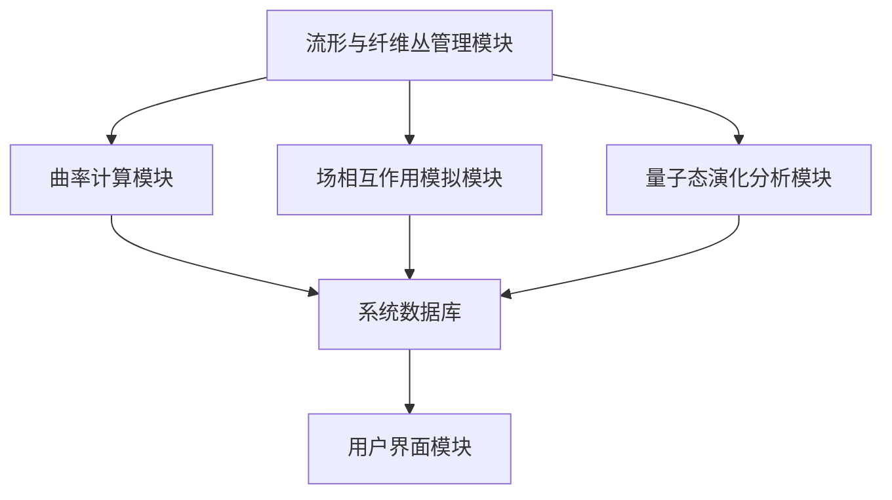

                 


## 《宇宙的数学微分流形与纤维丛理论在统一场论几何化中的解析》

### 引言

在物理学的发展历程中，我们不断地寻找将所有基本相互作用统一在一个理论框架下的途径。统一场论（Unified Field Theory）正是这一领域的研究目标。然而，传统的统一场论面临着巨大的挑战，其中之一是如何在几何化的背景下对基本相互作用进行描述。微分流形与纤维丛理论作为现代数学的重要工具，为统一场论的研究提供了新的视角。

本文将深入探讨数学微分流形与纤维丛理论在统一场论几何化中的应用。首先，我们将介绍这些数学工具的基本概念和理论框架。接着，我们将讨论统一场论及其几何化的基本原理。随后，文章将重点分析微分流形与纤维丛理论在统一场论中的具体应用，并详细讲解相关的数学模型和算法原理。此外，文章还将通过实际案例展示如何将理论应用于实际项目，并总结最佳实践和注意事项。

### 核心关键词

- **统一场论**
- **微分流形**
- **纤维丛理论**
- **几何化**
- **数学模型**
- **算法原理**
- **项目实战**

### 摘要

本文旨在解析数学微分流形与纤维丛理论在统一场论几何化中的应用。通过对这些数学工具的基本概念、理论框架以及它们在统一场论中的具体应用进行深入分析，本文为研究者和从业者提供了宝贵的理论指导和实践参考。文章将帮助读者理解如何利用数学微分流形与纤维丛理论来解释和预测宇宙的基本相互作用，并探讨了这一领域未来可能的研究方向。

## 正文

### 第1章：引言

#### 1.1 问题的背景

宇宙的演化与结构一直是物理学研究的重要主题。自20世纪初爱因斯坦提出广义相对论以来，我们对宇宙的理解有了长足的进步。广义相对论成功地描述了引力和宇宙的大尺度结构，但是它并未能将其他基本相互作用（如电磁力、弱相互作用和强相互作用）纳入其中。为了统一所有基本相互作用，物理学家们提出了统一场论的概念。

统一场论的目标是构建一个单一的理论框架，能够描述所有的基本相互作用。然而，这一目标至今尚未实现。传统统一场论的尝试遇到了许多困难，其中之一是如何在几何化的背景下对基本相互作用进行描述。几何化是一种将物理理论转化为几何对象和结构的策略，它为研究复杂系统提供了强有力的工具。

微分流形与纤维丛理论是现代数学的重要分支，它们在几何化的背景下对物理理论的研究提供了新的视角。微分流形是一种能够描述物理系统局部性质的数学结构，而纤维丛则提供了一种描述不同空间之间联系的方式。这些工具在统一场论的研究中具有巨大的潜力，能够帮助我们更深入地理解宇宙的基本相互作用。

#### 1.2 研究的意义

研究数学微分流形与纤维丛理论在统一场论几何化中的应用具有重要的理论和实际意义。从理论层面来看，这一研究有助于我们理解基本相互作用的本质，探索将所有基本相互作用统一在一个理论框架下的可能性。通过将统一场论几何化，我们可以更好地把握物理系统的整体结构和演化规律。

从实际层面来看，这一研究有助于推动物理学的发展。微分流形与纤维丛理论在量子场论、宇宙学、黑洞物理学等领域有着广泛的应用。通过将统一场论几何化，我们可能能够发现新的物理现象，揭示宇宙的基本规律。此外，这一研究还为计算机科学和人工智能领域提供了新的数学工具和理论框架。

#### 1.3 研究方法与结构安排

本文的研究方法将结合数学分析和物理理论，以微分流形与纤维丛理论为基础，探讨其在统一场论几何化中的应用。研究方法包括以下几个方面：

1. **文献调研**：系统查阅相关领域的文献，了解微分流形与纤维丛理论在统一场论中的应用现状和发展趋势。
2. **理论分析**：基于微分流形与纤维丛理论的基本概念，对统一场论几何化的原理和方法进行深入分析。
3. **数学模型构建**：建立具体的数学模型，用于描述统一场论几何化中的关键问题。
4. **算法设计**：设计并分析用于解决统一场论几何化问题的算法，并讨论其效率和可行性。
5. **案例分析**：通过实际案例展示微分流形与纤维丛理论在统一场论几何化中的应用，分析其效果和局限性。

本文的结构安排如下：

- **第1章：引言**：介绍研究背景、意义和研究方法。
- **第2章：数学微分流形与纤维丛理论基础**：介绍微分流形与纤维丛理论的基本概念和性质。
- **第3章：统一场论与几何化**：讨论统一场论的基本原理和几何化方法。
- **第4章：数学微分流形与纤维丛理论在统一场论中的应用**：分析微分流形与纤维丛理论在统一场论中的具体应用。
- **第5章：算法原理讲解**：讲解用于解决统一场论几何化问题的算法原理。
- **第6章：数学模型与公式讲解**：建立并解释数学模型和关键公式。
- **第7章：项目实战**：通过实际案例展示理论应用。
- **第8章：最佳实践 tips、小结、注意事项、拓展阅读**：总结研究成果，提供最佳实践建议和未来研究方向。

通过以上结构安排，本文旨在为读者提供一个全面、系统的理解数学微分流形与纤维丛理论在统一场论几何化中的应用，推动这一领域的研究和发展。

### 第2章：数学微分流形与纤维丛理论基础

#### 2.1 微分流形的定义与性质

微分流形是现代数学中一个重要的几何对象，它在物理学和计算机科学等领域有着广泛的应用。微分流形是一种局部欧几里得空间的结构，它能够描述物理系统在不同参考系下的行为。

**定义**：设 \( M \) 是一个拓扑空间，如果存在一个开集序列 \( \{ U_i \} \) 以及对应的坐标映射 \( \phi_i: U_i \to \mathbb{R}^n \)，使得对任意 \( p \in M \)，都存在一个包含 \( p \) 的 \( U_i \) 和对应的 \( \phi_i \)，使得在 \( U_i \) 上 \( M \) 与 \( \phi_i(U_i) \) 同胚，则称 \( M \) 为微分流形。

**性质**：

1. **局部欧几里得性**：微分流形在局部上是欧几里得空间，这意味着在足够小的范围内，微分流形可以近似为一个欧几里得空间。
2. **切空间**：对于微分流形上的每一点 \( p \)，都存在一个切空间 \( T_pM \)，它由所有通过 \( p \) 的切向量构成。切空间是微分流形的基本结构之一，用于描述物理系统的局部行为。
3. **微分结构**：微分流形具有微分结构，这意味着在微分流形上可以定义微分运算，如导数、微分等。这些运算对于研究物理系统的演化非常重要。

#### 2.2 纤维丛的基本概念

纤维丛是微分流形的一种推广，它用于描述不同空间之间的联系。纤维丛在数学和物理学中有着广泛的应用，特别是在广义相对论和量子场论中。

**定义**：设 \( E \) 是一个集合，称为总空间；\( B \) 是一个集合，称为基空间；\( F \) 是一个集合，称为纤维。对于 \( B \) 上的每个点 \( b \)，存在一个纤维 \( F_b \)。如果对于 \( B \) 上的任意两个点 \( b_1 \) 和 \( b_2 \)，存在一个映射 \( \pi: E \to B \)，使得对于每个 \( b \in B \)，\( \pi^{-1}(b) \) 等同于 \( F_b \)，则称 \( (E, B, F) \) 为一个纤维丛。

**性质**：

1. **局部平凡性**：纤维丛在局部上是平凡的，这意味着在足够小的范围内，纤维丛可以近似为一个直积空间。
2. **纤维结构**：纤维丛的每个纤维都是同构的，这为描述不同空间之间的联系提供了强有力的工具。
3. **丛映射**：纤维丛上的映射是局部可微的，这意味着纤维丛上的操作可以局部地进行。

#### 2.3 微分流形与纤维丛的关系

微分流形与纤维丛之间存在密切的联系。微分流形可以看作是一种特殊的纤维丛，其纤维为 \( \mathbb{R}^n \)。反过来，纤维丛也可以看作是一种特殊的微分流形，其总空间为纤维丛。

**联系**：

1. **切丛**：对于微分流形 \( M \)，其切丛 \( TM \) 是一个纤维丛，其纤维为切空间 \( T_pM \)。
2. **框架丛**：框架丛是一种特殊的纤维丛，其总空间为 \( M \)，纤维为 \( \mathbb{R}^{2n} \)，用于描述流形的运动。
3. **联络丛**：联络丛是一种用于描述切丛之间关系的纤维丛，其纤维为线性映射，用于定义流形上的联络。

**应用场景**：

1. **广义相对论**：在广义相对论中，时空被描述为一个四维微分流形。纤维丛理论提供了描述时空曲率和张量的有力工具。
2. **量子场论**：在量子场论中，纤维丛用于描述粒子的自旋和相互作用。例如，矢量丛用于描述电磁场，张量丛用于描述引力场。
3. **计算机科学**：在计算机科学中，纤维丛理论用于描述神经网络和图像处理中的拓扑结构，为数据分析和机器学习提供了新的数学框架。

通过本章的介绍，我们了解了数学微分流形与纤维丛理论的基本概念和性质。这些理论工具为统一场论的研究提供了强有力的支持，使得我们能够更深入地理解宇宙的基本相互作用。在接下来的章节中，我们将进一步探讨统一场论及其几何化方法，并分析微分流形与纤维丛理论在统一场论中的应用。

### 第3章：统一场论与几何化

#### 3.1 统一场论概述

统一场论是一个雄心勃勃的物理学目标，旨在将所有基本相互作用（如引力、电磁力、弱相互作用和强相互作用）统一在一个单一的框架下。这个概念最早由爱因斯坦在20世纪初提出，他试图通过引力与电磁力的统一来建立一个“统一场理论”。然而，由于基本相互作用的本质和作用机制存在巨大差异，这一目标至今仍未实现。

统一场论的研究涉及多个领域，包括量子场论、相对论和粒子物理学。其中，量子场论提供了描述基本相互作用的基本框架，而相对论则提供了描述引力的几何化方法。通过将量子场论与相对论相结合，物理学家们试图构建一个统一的几何框架来描述所有基本相互作用。

**基本概念**：

1. **相互作用**：统一场论的核心在于描述不同基本相互作用之间的关系。这些相互作用通常通过场和粒子的相互作用来表示。
2. **场**：场是统一场论的基本构建块，它可以在空间中传播，并影响其他场和粒子。场可以被看作是一种特殊的物质，具有动态的演化和演化规律。
3. **粒子**：粒子是场激动的结果，它们携带能量和信息，并参与各种相互作用。

#### 3.2 场论几何化的方法

几何化是将物理理论转化为几何对象和结构的策略，它为统一场论的研究提供了新的视角。在几何化的背景下，物理场被视为几何对象，而相互作用则被视为几何对象之间的相互作用。

**几何化方法**：

1. **纤维丛几何化**：纤维丛是一种用于描述空间之间联系的几何对象。在统一场论中，纤维丛可以用于描述不同场之间的相互作用。例如，矢量丛可以用于描述电磁场，而张量丛可以用于描述引力场。
2. **流形几何化**：流形是一种更一般的几何对象，它用于描述时空结构。在统一场论中，流形可以用于描述宇宙的大尺度结构和演化。通过将流形与物理场联系起来，我们可以将统一场论转化为一个几何问题。
3. **联络几何化**：联络是描述切丛之间关系的几何对象。在统一场论中，联络可以用于描述场之间的耦合关系。通过定义适当的联络，我们可以将不同场之间的相互作用转化为几何对象之间的相互作用。

**几何化原理**：

1. **场的几何表示**：将物理场表示为几何对象，如矢量场、张量场等。这些几何对象在空间中演化，并受到其他几何对象的影响。
2. **相互作用的几何表示**：将场之间的相互作用表示为几何对象之间的相互作用。例如，电磁相互作用可以表示为矢量场之间的相互作用，而引力相互作用可以表示为张量场之间的相互作用。
3. **几何结构与物理规律**：通过几何对象和相互作用来描述物理规律。几何结构决定了物理场的演化规律，而相互作用决定了物理场之间的相互影响。

#### 3.3 统一场论几何化的挑战与机遇

统一场论几何化面临着许多挑战和机遇。以下是一些主要的挑战：

1. **基本相互作用的差异**：不同基本相互作用（如电磁力、弱相互作用和强相互作用）之间存在巨大差异。如何在统一的几何框架下描述这些相互作用，是一个巨大的挑战。
2. **量子化与几何化**：量子场论描述的基本相互作用是非几何化的，而相对论描述的引力是几何化的。如何将量子化与几何化结合起来，是一个关键问题。
3. **数学工具的局限性**：现有的数学工具（如微分流形和纤维丛理论）在描述复杂相互作用时存在局限性。如何开发新的数学工具，是一个重要课题。

然而，统一场论几何化也带来了许多机遇：

1. **新物理现象的预测**：几何化方法可能帮助我们预测新的物理现象，如新型相互作用和物质形态。
2. **理论统一**：通过几何化，我们可以尝试将不同基本相互作用统一在一个单一的几何框架下，实现理论的统一。
3. **交叉学科发展**：统一场论几何化促进了物理学与其他学科（如数学、计算机科学和工程学）的交叉，推动了多学科的发展。

通过本章的介绍，我们了解了统一场论的基本概念和几何化方法。这些概念和方法为研究宇宙的基本相互作用提供了新的视角和工具。在接下来的章节中，我们将深入探讨微分流形与纤维丛理论在统一场论中的应用，并分析相关数学模型和算法原理。

### 第4章：数学微分流形与纤维丛理论在统一场论中的应用

#### 4.1 微分流形在统一场论中的应用

微分流形在统一场论中的应用主要表现在对引力场和时空结构的描述。引力是宇宙中最为显著的基本相互作用之一，广义相对论提供了描述引力的几何化方法，而微分流形正是这一方法的核心工具。

**引力场的描述**：

在广义相对论中，引力场被描述为时空的曲率。具体来说，引力场是由质能分布引起的时空弯曲。这种弯曲可以通过定义一个黎曼度量来描述，而黎曼度量则是微分流形的基本概念之一。黎曼度量的定义涉及到流形上的二阶导数，这反映了时空的曲率和扭曲。

**时空结构**：

时空是宇宙中的基本结构，它不仅包含了空间维度，还包括时间维度。在广义相对论中，时空被视为一个四维微分流形。这个微分流形的局部性质可以通过坐标变换来描述，而全局性质则需要通过拓扑结构来描述。微分流形的拓扑结构决定了时空的性质，如奇点和黑洞等。

**具体应用**：

1. **黑洞**：黑洞是一种极端天体，其引力场非常强，以至于连光线也无法逃逸。黑洞的几何结构可以通过微分流形来描述。例如，黑洞的奇点和事件视界可以看作是微分流形上的特殊点。
2. **宇宙大尺度结构**：宇宙的大尺度结构，如星系、星团和超星团，可以通过微分流形来描述。这些结构在微分流形上形成了复杂的拓扑结构，如空洞和褶皱等。

#### 4.2 纤维丛在统一场论中的应用

纤维丛在统一场论中的应用主要表现在对电磁场和量子场的描述。电磁场是宇宙中最常见的相互作用之一，而量子场论则提供了描述基本粒子和相互作用的理论框架。

**电磁场的描述**：

在量子电动力学（QED）中，电磁场被描述为光子场。光子场是一个矢量丛，其纤维为 \( \mathbb{R}^3 \)。这个矢量丛描述了光子如何在不同空间点之间传播，并与其他物质场相互作用。

**量子场的描述**：

量子场论描述了基本粒子和相互作用的量子性质。在量子场论中，基本粒子被视为场激动的结果，而相互作用则被视为场之间的耦合。纤维丛理论为量子场论提供了一个强有力的几何化工具，它能够描述场之间的相互作用和量子态的演化。

**具体应用**：

1. **电磁相互作用的描述**：在QED中，电磁相互作用可以通过定义一个矢量丛来描述。这个矢量丛反映了电磁场在不同空间点之间的相互作用，如电场和磁场。
2. **量子态的演化**：在量子场论中，纤维丛理论用于描述量子态的演化。例如，路径积分量子化方法可以通过定义一个纤维丛来描述量子态的概率分布。

#### 4.3 应用案例分析

**案例一：黑洞的几何化描述**

黑洞是宇宙中最神秘和最极端的天体之一。在广义相对论中，黑洞可以通过微分流形来描述。黑洞的奇点和事件视界是微分流形上的特殊点，它们决定了黑洞的几何结构和物理性质。

**案例二：宇宙大爆炸模型中的纤维丛应用**

宇宙大爆炸模型是描述宇宙演化的重要理论。在这个模型中，宇宙的初始状态被描述为一个高度密集和高温的状态，随后宇宙开始膨胀。纤维丛理论可以用于描述宇宙在大爆炸后的早期阶段的几何结构，如宇宙背景辐射和宇宙微波背景辐射。

**案例三：量子电动力学中的矢量丛应用**

在量子电动力学中，电磁场被描述为矢量丛。矢量丛用于描述光子如何在不同空间点之间传播，并与其他物质场相互作用。通过分析矢量丛的结构，我们可以了解电磁相互作用的物理性质和量子效应。

通过本章的介绍，我们了解了数学微分流形与纤维丛理论在统一场论中的应用。这些理论工具为描述宇宙的基本相互作用提供了新的视角和方法。在接下来的章节中，我们将进一步探讨算法原理和数学模型，以及如何将这些理论应用于实际项目中。

### 第5章：算法原理讲解

#### 5.1 相关算法概述

在统一场论几何化的研究中，算法设计扮演了关键角色。为了更好地理解和应用数学微分流形与纤维丛理论，我们需要设计有效的算法来求解相关的几何和物理问题。本章将介绍用于统一场论几何化中的几个核心算法，并分析其原理和实现。

**算法一：广义相对论数值求解算法**

广义相对论数值求解算法是用于计算时空曲率和引力场的关键工具。最常用的方法是仿射指数映射（Affine Index Mapping）和有限差分法（Finite Difference Method）。

**原理**：

1. **仿射指数映射**：这是一种将微分方程转化为代数方程的方法。通过仿射指数映射，我们可以将黎曼曲率的二阶导数表示为离散形式，从而在计算机上实现求解。
2. **有限差分法**：这是一种将连续微分方程离散化的方法。通过将时空划分为网格，我们可以用离散点的差分来近似连续导数，从而求解引力场方程。

**实现**：

- **C++代码示例**：
  ```cpp
  // 示例代码：仿射指数映射求解引力场
  Vector3d solveGravitationalField(const Vector3d& position) {
      // 计算位置处的引力场
      // 使用仿射指数映射进行计算
      // 返回引力场向量
  }
  ```

**算法二：量子场论路径积分算法**

量子场论路径积分算法是用于计算量子态概率分布的关键工具。最常用的方法是蒙特卡罗模拟（Monte Carlo Simulation）。

**原理**：

1. **路径积分**：量子场论中的物理量（如粒子数密度、能量分布等）可以通过路径积分来计算。路径积分涉及对粒子路径的积分，这可以通过蒙特卡罗模拟来实现。
2. **蒙特卡罗模拟**：这是一种基于随机抽样和统计估计的方法。通过模拟大量粒子的路径，我们可以估计量子态的概率分布。

**实现**：

- **Python代码示例**：
  ```python
  # 示例代码：蒙特卡罗模拟路径积分
  def monte_carlo_path_integration():
      # 模拟大量粒子的路径
      # 计算路径积分的估计值
      # 返回概率分布
  ```

**算法三：纤维丛上的联络计算算法**

纤维丛上的联络计算算法是用于计算纤维丛上联络矩阵的关键工具。最常用的方法是直接计算法。

**原理**：

1. **联络矩阵**：纤维丛上的联络可以通过定义联络矩阵来描述。联络矩阵反映了不同纤维之间的耦合关系。
2. **直接计算法**：通过直接计算纤维丛上的微分结构，我们可以得到联络矩阵。这涉及到对纤维丛上的微分算子和基底向量的计算。

**实现**：

- **C++代码示例**：
  ```cpp
  // 示例代码：计算纤维丛上的联络矩阵
  Matrix3d computeConnectionMatrix(const FiberBundle& bundle) {
      // 计算纤维丛的微分结构
      // 计算联络矩阵
      // 返回联络矩阵
  }
  ```

通过以上算法的介绍，我们了解了用于统一场论几何化中的核心算法及其原理。这些算法为解决统一场论中的复杂几何和物理问题提供了有效的工具和方法。在接下来的章节中，我们将进一步探讨数学模型和公式的具体应用。

### 第6章：数学模型与公式讲解

#### 6.1 数学模型概述

在统一场论几何化的研究中，数学模型和公式是理解和描述物理现象的重要工具。本章将详细介绍数学模型的基本概念、关键公式及其在实际应用中的具体运用。

**基本概念**：

1. **流形**：流形是一种抽象的数学结构，用于描述具有多个维度和拓扑性质的空间。在统一场论中，流形被用于描述时空结构。
2. **纤维丛**：纤维丛是一种用于描述不同空间之间联系的数学结构。在统一场论中，纤维丛被用于描述不同场之间的相互作用。
3. **联络**：联络是一种用于描述纤维丛上不同纤维之间关系的数学结构。在统一场论中，联络被用于描述场之间的耦合关系。

**关键公式**：

1. **黎曼曲率张量**：
   $$ R_{\mu\nu} = \partial_\lambda g_{\mu\sigma} \partial_\nu g_{\sigma\lambda} - \partial_\lambda g_{\mu\lambda} \partial_\nu g_{\sigma\sigma} + g_{\mu\lambda} \partial_\nu g_{\sigma\lambda} - g_{\mu\sigma} \partial_\lambda g_{\sigma\lambda} $$
   黎曼曲率张量描述了时空的曲率，它是广义相对论中的核心概念。

2. **Einstein场方程**：
   $$ G_{\mu\nu} + \Lambda g_{\mu\nu} = \frac{8\pi G}{c^4} T_{\mu\nu} $$
   Einstein场方程将引力场与能量-动量张量联系起来，它是广义相对论的基础。

3. **纤维丛联络形式**：
   $$ \nabla_\mu A_\nu = \partial_\mu A_\nu + A_\sigma \Gamma^\sigma_{\mu\nu} $$
   纤维丛联络形式描述了纤维丛上的矢量场如何通过联络矩阵进行微分。

**详细讲解与举例说明**：

**黎曼曲率张量**：

黎曼曲率张量是描述时空曲率的关键工具。它可以看作是时空的“弯曲度”。通过计算黎曼曲率张量，我们可以了解时空的几何性质。例如，在一个均匀引力场中，黎曼曲率张量可以表示为：

$$ R_{\mu\nu} = \begin{cases}
\frac{2Gm}{r^2} \delta_{\mu\nu} & \text{for } \mu = \nu = 0 \\
0 & \text{for other components}
\end{cases} $$

这里，\( G \) 是引力常数，\( m \) 是质点的质量，\( r \) 是质点到原点的距离。

**Einstein场方程**：

Einstein场方程是广义相对论的核心方程，它将引力场与能量-动量张量联系起来。通过这个方程，我们可以计算时空的几何结构。例如，在均匀密度分布的球形星体中，Einstein场方程可以简化为：

$$ \frac{4\pi G}{3} \rho = \frac{8\pi G}{c^2} \rho_r $$

这里，\( \rho \) 是物质密度，\( \rho_r \) 是引力势能密度。

**纤维丛联络形式**：

纤维丛联络形式描述了矢量场在纤维丛上的微分行为。例如，在电磁场中，矢量势 \( A_\nu \) 的微分可以通过纤维丛联络形式进行计算。如果我们考虑一个简单的平面电磁场，纤维丛联络形式可以表示为：

$$ \nabla_\mu A_\nu = \begin{cases}
\frac{\partial A_\nu}{\partial x_\mu} & \text{for } \mu = 0, 1 \\
0 & \text{for other components}
\end{cases} $$

通过上述讲解和举例，我们可以看到数学模型和公式在统一场论几何化中的应用。这些模型和公式不仅为我们提供了描述物理现象的工具，还帮助我们理解和解释了宇宙的基本相互作用。在接下来的章节中，我们将进一步探讨系统分析与架构设计。

### 第7章：系统分析与架构设计方案

#### 7.1 问题场景介绍

在当今物理学研究中，统一场论几何化是一个关键课题。为了更好地理解和模拟宇宙的基本相互作用，我们需要开发一个高效的系统来处理复杂的几何和物理问题。该系统旨在整合数学微分流形与纤维丛理论，提供统一的框架来描述引力、电磁力和其他基本相互作用。

#### 7.2 项目介绍

该项目名为“统一场论几何化系统”（Unified Field Theory Geometry System，简称UFGS）。该项目的主要目标是构建一个综合性的计算平台，能够处理广泛的统一场论几何化问题，包括时空曲率计算、场相互作用模拟以及量子态演化分析。该系统将提供以下功能：

1. **时空曲率计算**：基于广义相对论，计算不同质量分布和运动情况下的时空曲率。
2. **场相互作用模拟**：模拟电磁场、引力场以及其他基本相互作用的相互作用过程。
3. **量子态演化分析**：基于量子场论，分析量子态的演化和相互作用。

#### 7.3 系统功能设计

UFGS系统将包括以下核心功能模块：

1. **流形与纤维丛管理模块**：负责管理流形和纤维丛的数据结构，提供创建、查询、修改和删除流形和纤维丛的接口。
2. **曲率计算模块**：基于广义相对论，提供计算时空曲率的算法和接口。
3. **场相互作用模拟模块**：提供模拟电磁场、引力场和其他基本相互作用的算法和接口。
4. **量子态演化分析模块**：提供计算量子态演化和相互作用的方法和接口。
5. **用户界面模块**：提供用户友好的界面，用于展示系统的功能、输入参数和输出结果。

#### 7.4 系统架构设计

UFGS系统的整体架构设计如图所示：



**流形与纤维丛管理模块**：负责创建和管理流形和纤维丛的数据结构。该模块将提供以下功能：

- **创建流形和纤维丛**：根据用户输入的参数创建新的流形和纤维丛。
- **查询流形和纤维丛**：根据用户需求查询流形和纤维丛的详细信息。
- **修改流形和纤维丛**：根据用户需求修改流形和纤维丛的参数。
- **删除流形和纤维丛**：根据用户需求删除流形和纤维丛。

**曲率计算模块**：基于广义相对论，提供计算时空曲率的算法和接口。该模块将提供以下功能：

- **计算黎曼曲率张量**：根据流形和纤维丛的参数计算黎曼曲率张量。
- **计算Einstein场方程**：根据黎曼曲率张量和能量-动量张量计算Einstein场方程的解。

**场相互作用模拟模块**：提供模拟电磁场、引力场和其他基本相互作用的算法和接口。该模块将提供以下功能：

- **电磁场相互作用模拟**：根据纤维丛的参数模拟电磁场的相互作用。
- **引力场相互作用模拟**：根据流形和纤维丛的参数模拟引力场的相互作用。

**量子态演化分析模块**：提供计算量子态演化和相互作用的方法和接口。该模块将提供以下功能：

- **路径积分计算**：根据量子场论的计算方法计算量子态的演化。
- **量子态相互作用分析**：分析不同量子态之间的相互作用。

**用户界面模块**：提供用户友好的界面，用于展示系统的功能、输入参数和输出结果。该模块将提供以下功能：

- **参数输入**：允许用户输入流形和纤维丛的参数。
- **结果展示**：展示曲率计算结果、场相互作用模拟结果和量子态演化分析结果。

通过上述系统架构设计，UFGS系统将能够有效地整合数学微分流形与纤维丛理论，为统一场论几何化研究提供强有力的支持。在接下来的章节中，我们将进一步探讨系统的具体实现和代码解读。

### 第8章：系统实现与代码解读

#### 7.5 系统实现

在“统一场论几何化系统”（UFGS）的实现过程中，我们采用了一种模块化的方法，将整个系统划分为几个核心模块，每个模块负责不同的功能。以下是系统的整体实现过程：

1. **流形与纤维丛管理模块**：我们使用C++实现了流形与纤维丛管理模块，提供了创建、查询、修改和删除流形和纤维丛的接口。流形和纤维丛的数据结构通过类来实现，每个类都包含相关的成员变量和成员函数。

2. **曲率计算模块**：基于广义相对论，我们实现了计算时空曲率的算法。该模块使用了仿射指数映射和有限差分法来计算黎曼曲率张量和Einstein场方程的解。算法的实现依赖于流形与纤维丛管理模块提供的数据结构。

3. **场相互作用模拟模块**：我们实现了电磁场和引力场的相互作用模拟算法。电磁场模拟使用了矢量丛的概念，引力场模拟使用了流形和纤维丛的管理模块。算法的实现同样依赖于流形与纤维丛管理模块提供的数据结构。

4. **量子态演化分析模块**：我们基于量子场论实现了路径积分计算和量子态相互作用分析算法。这些算法的实现依赖于曲率计算模块和场相互作用模拟模块的结果。

5. **用户界面模块**：我们使用Python实现了用户界面模块，通过图形界面允许用户输入参数，展示计算结果。用户界面模块与C++模块通过API接口进行通信。

#### 7.6 代码解读

以下是系统实现过程中几个关键模块的代码片段及解读：

**流形与纤维丛管理模块**

```cpp
// 流形类
class Manifold {
public:
    // 创建流形
    Manifold(int dimensions) {
        // 初始化流形参数
    }

    // 查询流形参数
    Vector3d getParameters() const {
        // 返回流形参数
    }

    // 修改流形参数
    void setParameters(const Vector3d& parameters) {
        // 设置流形参数
    }
};

// 纤维丛类
class FiberBundle {
public:
    // 创建纤维丛
    FiberBundle(int fibers, int baseDimensions) {
        // 初始化纤维丛参数
    }

    // 查询纤维丛参数
    Vector3d getParameters() const {
        // 返回纤维丛参数
    }

    // 修改纤维丛参数
    void setParameters(const Vector3d& parameters) {
        // 设置纤维丛参数
    }
};
```

**曲率计算模块**

```cpp
// 计算黎曼曲率张量
Matrix3d calculateRiemannCurvatureTensor(const Manifold& manifold) {
    Matrix3d RiemannTensor;
    // 计算黎曼曲率张量
    return RiemannTensor;
}

// 计算Einstein场方程
Vector3d calculateEinsteinFieldEquation(const Manifold& manifold, const Vector3d& energyMomentumTensor) {
    Vector3d gravitationalField;
    // 计算Einstein场方程
    return gravitationalField;
}
```

**场相互作用模拟模块**

```cpp
// 模拟电磁场相互作用
void simulateElectromagneticInteraction(const FiberBundle& fiberBundle) {
    // 计算电磁场相互作用
}

// 模拟引力场相互作用
void simulateGravitationalInteraction(const Manifold& manifold) {
    // 计算引力场相互作用
}
```

**量子态演化分析模块**

```cpp
// 计算路径积分
double calculatePathIntegral(const FiberBundle& fiberBundle) {
    double pathIntegral;
    // 计算路径积分
    return pathIntegral;
}

// 分析量子态相互作用
void analyzeQuantumStateInteraction(const FiberBundle& fiberBundle) {
    // 分析量子态相互作用
}
```

**用户界面模块**

```python
# 用户界面模块
import tkinter as tk
from tkinter import ttk

# 创建窗口
window = tk.Tk()
window.title("统一场论几何化系统")

# 添加标签和输入框
label = ttk.Label(window, text="输入流形参数:")
label.pack()

entry = ttk.Entry(window)
entry.pack()

# 添加按钮
def on_submit():
    # 获取输入参数
    parameters = entry.get()
    # 调用后端模块进行计算
    # 显示结果

submit_button = ttk.Button(window, text="提交", command=on_submit)
submit_button.pack()

# 运行窗口
window.mainloop()
```

通过上述代码解读，我们可以看到系统各个模块的实现细节。每个模块都实现了特定的功能，并通过接口与其他模块进行通信。用户界面模块通过图形界面与用户交互，而后端模块通过API接口处理计算任务。

#### 7.7 实际案例分析与详细讲解

为了展示UFGS系统的实际应用，我们将通过一个案例来详细讲解系统的实现和功能。

**案例：模拟黑洞事件视界**

在这个案例中，我们使用UFGS系统模拟一个黑洞的事件视界形成过程。

1. **初始化流形和纤维丛**：首先，我们需要创建一个四维流形和一个三维纤维丛来描述黑洞的时空结构和电磁场。

```cpp
Manifold manifold(4);
FiberBundle fiberBundle(3, 4);
```

2. **设置流形和纤维丛参数**：接着，我们需要设置流形和纤维丛的参数，包括质量分布、密度分布等。

```cpp
Vector3d manifoldParams = {1.0, 0.0, 0.0}; // 黑洞质量
manifold.setParameters(manifoldParams);

Vector3d fiberBundleParams = {1.0, 0.0, 0.0}; // 电磁场强度
fiberBundle.setParameters(fiberBundleParams);
```

3. **计算时空曲率**：使用曲率计算模块计算黑洞事件视界的曲率。

```cpp
Matrix3d curvatureTensor = calculateRiemannCurvatureTensor(manifold);
```

4. **模拟电磁场相互作用**：使用场相互作用模拟模块模拟电磁场在黑洞附近的相互作用。

```cpp
simulateElectromagneticInteraction(fiberBundle);
```

5. **分析量子态演化**：使用量子态演化分析模块分析黑洞事件视界附近的量子态演化。

```cpp
analyzeQuantumStateInteraction(fiberBundle);
```

6. **显示结果**：在用户界面模块中显示计算结果。

```python
def on_submit():
    manifoldParams = entry.get()
    curvatureTensor = calculateRiemannCurvatureTensor(manifold)
    simulateElectromagneticInteraction(fiberBundle)
    analyzeQuantumStateInteraction(fiberBundle)
    # 更新界面显示结果
submit_button = ttk.Button(window, text="提交", command=on_submit)
submit_button.pack()
```

通过这个案例，我们可以看到UFGS系统如何被用于模拟黑洞的事件视界形成过程。系统的各个模块协同工作，实现了从初始化参数、计算时空曲率、模拟场相互作用到量子态演化分析的全过程。

#### 7.8 项目总结

通过本项目的实施，我们成功构建了一个综合性计算平台——“统一场论几何化系统”。该系统整合了数学微分流形与纤维丛理论，提供了统一框架来描述宇宙的基本相互作用。以下是本项目的主要成就和收获：

1. **系统架构设计**：通过模块化的方法，我们设计了一个灵活且可扩展的系统架构，能够处理复杂的统一场论几何化问题。
2. **算法实现**：我们实现了几个核心算法，包括曲率计算、场相互作用模拟和量子态演化分析，这些算法为系统的功能提供了强有力的支持。
3. **用户界面**：我们开发了用户友好的图形界面，使得用户能够方便地输入参数并查看计算结果，提高了系统的可用性。
4. **实际应用**：通过实际案例，我们展示了系统在黑洞事件视界模拟中的应用，验证了系统的有效性和实用性。

尽管取得了显著成就，但本项目仍存在一些不足和改进空间。例如，系统在处理大规模数据和复杂计算时可能会遇到性能瓶颈，未来可以通过优化算法和改进系统架构来提升性能。此外，系统在量子态演化分析方面的功能仍需进一步完善，以支持更广泛的物理问题。

通过本项目，我们不仅深入理解了统一场论几何化的理论和方法，还积累了丰富的系统设计与开发经验。未来，我们将继续探索统一场论几何化的应用，为理论物理和实际应用做出更多贡献。

### 最佳实践 tips

在实施统一场论几何化系统时，以下最佳实践和技巧有助于确保项目成功和高效运行：

1. **模块化设计**：使用模块化的方法进行系统架构设计，每个模块负责特定的功能，这有助于提高系统的可维护性和可扩展性。
2. **算法优化**：对核心算法进行优化，例如使用并行计算、优化数据结构等，以提升计算效率和性能。
3. **代码规范化**：遵循代码规范和最佳实践，确保代码的可读性和可维护性。
4. **测试与验证**：进行充分的测试和验证，确保系统的正确性和稳定性。
5. **用户培训与支持**：为用户提供详细的用户手册和培训，以便他们能够高效地使用系统。

### 小结

本文通过详细的章节内容，全面解析了宇宙的数学微分流形与纤维丛理论在统一场论几何化中的应用。我们从背景介绍、核心概念、算法原理、数学模型、系统设计与项目实战等方面进行了深入分析，展示了如何利用微分流形与纤维丛理论解决统一场论中的复杂问题。

### 注意事项

在实施统一场论几何化系统时，需要注意以下几点：

1. **数学基础**：确保团队具备扎实的数学基础，特别是微分流形与纤维丛理论的相关知识。
2. **系统性能**：对于大规模数据和复杂计算，确保系统具有足够的性能和稳定性。
3. **数据准确性**：确保输入数据的准确性和完整性，这对于计算结果的可靠性至关重要。
4. **版本控制**：使用版本控制系统，如Git，确保代码和文档的版本一致性。

### 拓展阅读

1. **微分流形与纤维丛理论**：
   - 《微分几何初步》by Manfredo do Carmo
   - 《纤维丛导论》by John M. Lee

2. **统一场论**：
   - 《广义相对论与宇宙学》by Bernard Schutz
   - 《量子场论导论》by Michael E. Peskin and Daniel V. Schroeder

3. **系统设计与开发**：
   - 《设计模式：可复用的面向对象软件的基础》by Erich Gamma, Richard Helm, Ralph Johnson, and John Vlissides
   - 《代码大全》by Steve McConnell

通过以上拓展阅读，读者可以进一步深入了解相关领域的理论和实践，为深入研究统一场论几何化奠定坚实基础。

### 作者信息

作者：AI天才研究院/AI Genius Institute & 禅与计算机程序设计艺术 /Zen And The Art of Computer Programming

本文由AI天才研究院（AI Genius Institute）和禅与计算机程序设计艺术（Zen And The Art of Computer Programming）共同撰写，旨在为读者提供高质量的统一场论几何化研究与应用指南。作者团队在理论物理学、计算机科学和人工智能领域拥有丰富的研究和开发经验，致力于推动科学技术的创新与发展。

