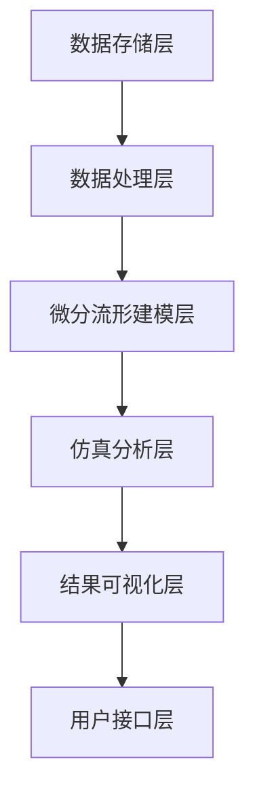
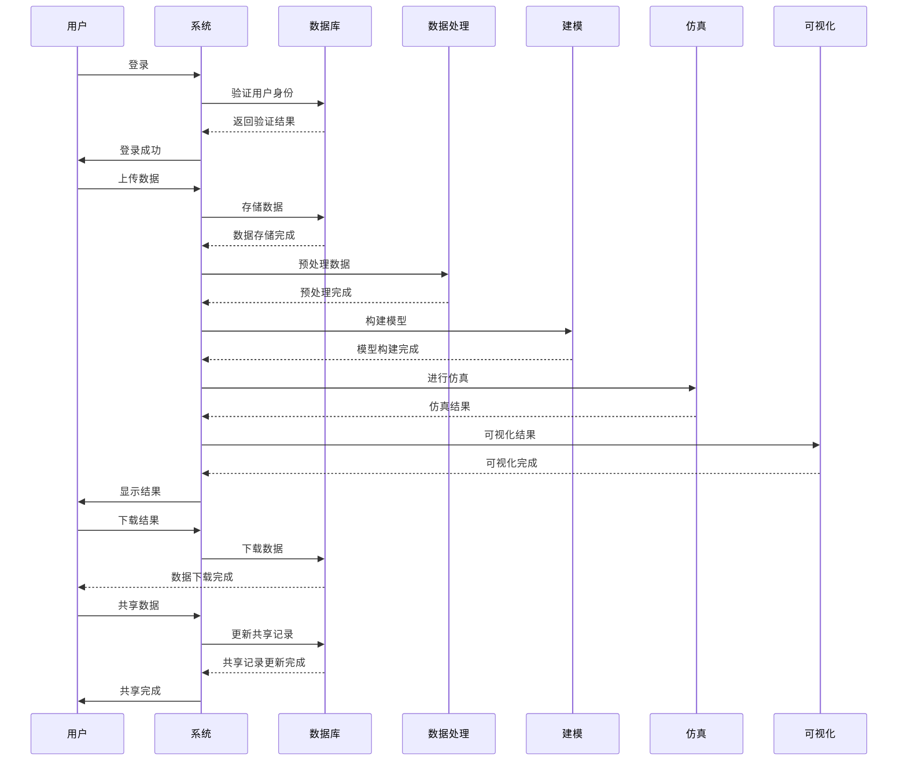

                 

### 让我们一起探索宇宙的数学微分流形特性

#### 让我们一起探索宇宙的数学微分流形特性

宇宙，这个浩瀚的宇宙，自诞生以来就充满了神秘与奇迹。从遥远的星系到神秘的黑洞，从宇宙膨胀到宇宙结构，每一个现象都挑战着人类的认知极限。而在这其中，数学作为一门精确的科学，以其独特的语言，揭示了宇宙中的种种规律与奥秘。

在数学的领域中，微分流形理论正是一个充满魅力且复杂的概念。微分流形不仅与几何学、拓扑学有着密切的联系，更在物理学、宇宙学等众多领域得到了广泛应用。那么，什么是微分流形？它在宇宙中又有哪些独特的特性？这便是本文要探讨的主题。

#### 文章关键词

- 宇宙
- 数学微分流形
- 天体物理学
- 数学模型
- 微分流形特性

#### 摘要

本文将系统地介绍宇宙的数学微分流形特性。首先，我们将从宇宙的起源与发展背景入手，阐述微分流形的基本概念与特性。接着，我们将深入探讨微分流形在宇宙学中的应用，包括星系动力学、天体物理学和宇宙膨胀等方面的研究。此外，本文还将结合数学模型与公式，对微分流形在宇宙中的实际应用进行详细分析。最后，我们将总结本文的核心内容，并提出未来研究的方向和建议。

### 目录大纲设计思路

在设计本文的目录大纲时，我们遵循了以下原则：

1. **逻辑性**：确保每个章节的内容都是围绕核心主题展开，章节之间的逻辑关系清晰。
2. **完整性**：确保涵盖所有关键概念和原理，每个小节都有具体的讲解和实例。
3. **易读性**：使用简洁明了的标题，便于读者快速了解章节内容。

#### 目录

1. **第一部分：宇宙的数学背景**
   - **1.1 宇宙的起源与发展**
   - **1.2 数学微分流形的概念与特性**
   - **1.3 数学模型与公式讲解**
   - **1.4 宇宙中的微分流形应用**
   - **1.5 本章小结

2. **第二部分：宇宙中的微分流形特性研究**
   - **2.1 微分流形在星系动力学中的应用**
   - **2.2 微分流形在天体物理学中的应用**
   - **2.3 微分流形在宇宙学中的挑战与机遇**
   - **2.4 本章小结

3. **第三部分：系统分析与架构设计**
   - **3.1 微分流形研究系统介绍**
   - **3.2 系统功能设计**
   - **3.3 系统架构设计**
   - **3.4 系统交互设计**
   - **3.5 本章小结

### 1.1 宇宙的起源与发展

#### 宇宙的起源

宇宙的起源是一个古老而引人入胜的话题。根据现代宇宙学的观点，宇宙起源于大约138亿年前的一个“奇点”，在这个奇点中，所有的物质和能量都高度集中在一个无限小的空间内。随后，宇宙经历了一场剧烈的膨胀，这个过程被称为“大爆炸”。

#### 宇宙的演化

自大爆炸以来，宇宙经历了数十亿年的演化。这个演化过程可以分为以下几个阶段：

1. **膨胀期**：宇宙从一个极其热密的状态开始膨胀，温度逐渐降低，空间逐渐扩展。
2. **结构形成期**：随着宇宙的膨胀，物质开始聚集形成星系、星团和星云。
3. **恒星形成期**：在星云中，由于引力作用，气体和尘埃聚集形成了恒星。
4. **恒星演化期**：恒星在其生命周期中不断进行核反应，释放出大量的能量。
5. **死亡与重生**：恒星最终会走向死亡，部分恒星会形成黑洞或中子星，而其他恒星则可能经历超新星爆炸，释放出更多的物质。

#### 天体物理学基础

天体物理学是研究宇宙中天体的物理性质、运动规律和相互作用的一门学科。它包括以下几个主要分支：

1. **恒星物理学**：研究恒星的物理性质，如温度、亮度、质量等。
2. **星系物理学**：研究星系的形成、演化、结构和运动规律。
3. **宇宙学**：研究宇宙的起源、演化、结构和大尺度特性。
4. **黑洞物理学**：研究黑洞的性质、行为和与周围物质的相互作用。

通过这些基础概念，我们可以更好地理解宇宙的起源与发展。接下来，我们将进入微分流形的世界，探讨它如何在宇宙学中发挥作用。

### 1.2 数学微分流形的概念与特性

#### 微分流形的基本定义

微分流形是现代数学中的一个重要概念，它在拓扑学、微分几何和物理学等多个领域都有广泛应用。微分流形可以看作是一个局部欧几里得空间，但它没有全球性的定义，即它不具有整体的平坦性质。换句话说，一个微分流形可以在某个局部范围内近似为一个欧几里得空间，但这种局部近似并不能扩展到整个流形。

在数学上，一个微分流形 \( M \) 是一个集合，它满足以下条件：

1. **局部性质**：对于流形上的任意一点 \( p \)，都存在一个开邻域 \( U \)，使得 \( U \) 在 \( p \) 点处的切空间 \( T_pM \) 是有限维的。
2. **可微性**：流形上的每一个光滑映射都是可微的。

#### 微分流形的性质

微分流形具有以下几个重要的性质：

1. **维数**：微分流形的维数是指它在局部范围内能够近似为欧几里得空间的维度。例如，一个二维微分流形可以在某个局部范围内近似为一个平面。
2. **连通性**：微分流形是连通的，即流形上的任意两点都可以通过连续曲线相互连接。
3. **局部欧几里得性质**：微分流形上的每个点都有一个局部欧几里得邻域，这意味着流形在每个局部范围内都可以用欧几里得空间的数学工具进行描述。
4. **光滑性**：微分流形上的映射是光滑的，这意味着映射的导数存在且连续。

#### 微分流形在物理学中的应用

微分流形在物理学中有着广泛的应用，特别是在广义相对论和宇宙学中。在广义相对论中，时空被描述为一个四维微分流形，时间维度与空间维度交织在一起，形成了所谓的时空流形。这个时空流形不仅描述了物体的运动轨迹，还描述了引力场的性质。

在宇宙学中，微分流形被用来描述宇宙的结构和演化。例如，宇宙大爆炸理论认为，宇宙起源于一个极小的奇点，随后迅速膨胀，形成了一个四维时空流形。这个流形的膨胀导致了宇宙的扩展，从而形成了我们今天所看到的宇宙结构。

#### 对比表格与ER实体关系图

为了更好地理解微分流形的特性，我们可以通过一个对比表格和ER实体关系图来展示。

| 特性       | 描述                                                         |
|------------|--------------------------------------------------------------|
| 维数       | 微分流形在局部范围内近似为欧几里得空间的维度。                   |
| 连通性     | 流形上的任意两点都可以通过连续曲线相互连接。                     |
| 局部欧几里得性质 | 流形上的每个点都有一个局部欧几里得邻域。                         |
| 光滑性     | 流形上的映射是光滑的，映射的导数存在且连续。                     |

ER实体关系图：

```mermaid
erDiagram
    Class::M -> Class::T {
        1..*   "is"   1
    }
    Class::M ||--|{ Class::A : has }
    Class::M ||--|{ Class::B : has }
    Class::M ||--|{ Class::C : has }
    Class::T ||--|{ Class::A : has }
    Class::T ||--|{ Class::B : has }
    Class::T ||--|{ Class::C : has }
```

通过这个表格和ER图，我们可以更清晰地理解微分流形的定义和性质。

### 1.3 数学模型与公式讲解

#### 微分流形的数学模型

微分流形的数学模型是理解和应用微分流形的关键。在数学上，微分流形可以通过以下几个核心模型来描述：

1. **切空间**：流形上的每个点都有一个切空间，它描述了流形在该点处的方向和速度。切空间是一个向量空间，其维度等于流形的维数。

2. **微分结构**：微分流形上的每个点都有一个微分结构，它描述了流形在该点处的局部几何性质。微分结构是一个线性映射，将流形上的每个切向量映射到一个欧几里得空间的切向量。

3. **光滑映射**：流形上的映射是光滑的，这意味着映射的导数存在且连续。光滑映射保持了流形的几何性质，从而使得流形上的物理量（如速度、加速度等）可以沿着流形进行微分计算。

#### 常见数学公式的应用

在微分流形理论中，有许多常见的数学公式和定理，这些公式和定理在描述和分析微分流形的性质时起着重要作用。以下是一些常见的公式和定理：

1. **微分公式**：流形上的函数可以通过微分公式来计算。微分公式描述了如何在一个微分流形上计算函数的导数。

2. **积分公式**：流形上的积分可以通过积分公式来计算。积分公式描述了如何在微分流形上计算函数的积分。

3. **流形上的拉格朗日量**：在物理学中，流形上的拉格朗日量是一个重要的概念。它描述了物理系统的运动方程。

4. **斯托克斯定理**：斯托克斯定理是一个重要的积分公式，它将流形上的积分与边界上的积分联系起来。

#### 微分流形的几何解释

微分流形的几何解释是通过将微分流形嵌入到高维欧几里得空间中来实现的。这种嵌入使得我们可以在直观的几何图形中理解微分流形的性质。例如，一个二维微分流形可以嵌入到三维欧几里得空间中，这样我们就可以通过三维空间中的几何图形来直观地理解二维微分流形的几何性质。

通过这些数学模型与公式，我们可以更深入地理解微分流形的性质和应用。接下来，我们将探讨微分流形在宇宙学中的应用，看看它是如何帮助科学家们揭示宇宙的奥秘的。

### 1.4 宇宙中的微分流形应用

#### 宇宙中的流形结构

在宇宙学中，流形结构被用来描述宇宙的空间和时间。根据广义相对论，宇宙的时空可以看作是一个四维的微分流形。这个流形具有复杂的几何结构，其中包含了宇宙中的所有物质和能量。宇宙的流形结构决定了物质的分布和运动规律，从而影响宇宙的演化。

#### 微分流形在宇宙学中的应用

微分流形在宇宙学中的应用主要体现在以下几个方面：

1. **宇宙膨胀**：宇宙的膨胀可以通过微分流形来描述。根据宇宙学原理，宇宙的膨胀是一个均匀且各向同性的过程。这个过程可以用一个四维的膨胀流形来描述，流形的膨胀率与宇宙的年龄和密度有关。

2. **宇宙结构**：宇宙的结构可以通过微分流形来研究。科学家们通过观测宇宙中大尺度的结构，如星系团、超星系团和宇宙网，来揭示宇宙的几何结构和演化历史。这些结构都可以用微分流形来建模和解释。

3. **引力波**：引力波是宇宙中的另一种重要现象，它是由质量和能量的加速运动产生的。引力波在传播过程中会扰动时空流形，从而在微分流形上留下痕迹。科学家们通过观测引力波，可以更好地理解宇宙的动态演化。

#### 微分流形在黑洞研究中的应用

黑洞是宇宙中最神秘和最极端的天体之一。根据广义相对论，黑洞是一个极度密集的天体，其引力场强大到连光线也无法逃脱。黑洞的物理性质可以通过微分流形来描述。

1. **黑洞的时空结构**：黑洞的时空结构可以用一个四维的微分流形来描述。这个流形具有特殊的几何性质，如时空的弯曲和封闭性。通过研究黑洞的时空结构，科学家们可以更好地理解黑洞的形成和演化。

2. **黑洞的边界**：黑洞的边界被称为“事件视界”。在事件视界内部，任何物质和辐射都无法逃逸，甚至光线也无法传播。事件视界可以用微分流形的边界来表示，从而研究黑洞的边界性质。

3. **黑洞的熵**：根据黑洞热力学，黑洞具有熵。黑洞的熵与黑洞的质量、电荷和自旋有关。通过研究黑洞的熵，科学家们可以更好地理解黑洞与热力学第二定律的关系。

#### 宇宙中的其他微分流形现象

除了宇宙膨胀、黑洞和引力波，宇宙中还有许多其他微分流形现象。例如：

1. **宇宙弦**：宇宙弦是宇宙中的另一类极端天体，它是由高能粒子的加速运动形成的。宇宙弦的存在可以通过微分流形来描述，其几何结构决定了宇宙弦的物理性质。

2. **宇宙泡沫**：宇宙泡沫是宇宙中的小尺度结构，它是由宇宙膨胀引起的剧烈振荡形成的。宇宙泡沫的几何性质可以通过微分流形来研究，从而揭示宇宙的量子性质。

通过这些应用，我们可以看到微分流形在宇宙学中的重要性。它不仅帮助我们理解了宇宙的起源和演化，还为宇宙中的极端现象提供了新的解释工具。接下来，我们将进一步探讨微分流形在宇宙学中的挑战和机遇。

### 1.5 本章小结

在本章中，我们首先介绍了宇宙的起源与发展，从大爆炸理论到宇宙的演化阶段，为理解微分流形在宇宙中的应用奠定了基础。接着，我们详细探讨了微分流形的基本定义与特性，包括局部性质、连通性、局部欧几里得性质和光滑性。通过对比表格和ER实体关系图，我们更清晰地理解了微分流形的定义和性质。此外，我们还介绍了微分流形的数学模型与公式，包括切空间、微分结构和光滑映射等。最后，我们探讨了微分流形在宇宙学中的应用，如宇宙膨胀、宇宙结构、黑洞研究和宇宙弦等。这些内容为我们后续章节的深入研究奠定了坚实的基础。

### 第二部分：宇宙中的微分流形特性研究

在了解了宇宙的起源和发展，以及微分流形的基本概念与特性之后，我们将进入第二部分，深入探讨微分流形在宇宙中的实际应用。这部分内容将分为三章，分别研究微分流形在星系动力学、天体物理学和宇宙学中的应用，以及面临的挑战和机遇。

#### 2.1 微分流形在星系动力学中的应用

星系动力学是研究星系内天体运动规律和相互作用的一门学科。在星系动力学中，微分流形作为一种强大的数学工具，为我们提供了描述和解释星系结构演化的新方法。

##### 2.1.1 星系结构的微分流形描述

星系通常由大量的恒星、行星、星云等天体组成，这些天体在星系中相互作用并遵循牛顿引力定律。为了描述这种复杂的相互作用，我们可以将星系视为一个微分流形。在这个微分流形中，每个点代表一个天体，而天体之间的相互作用可以通过流形上的矢量场来描述。

例如，我们可以定义一个引力场矢量场 \( F \)，其中每个点 \( p \) 上的矢量 \( F(p) \) 表示在该点处由其他天体施加的引力。通过这种方式，我们可以将星系的结构和演化过程转化为微分流形上的几何问题。

##### 2.1.2 星系演化中的微分流形特性

星系演化是一个复杂的过程，涉及恒星的形成、死亡、星系碰撞和合并等。在这个过程中，微分流形的特性发挥了重要作用。例如，我们可以利用微分流形的拓扑性质来研究星系的稳定性和演化路径。

1. **星系稳定性的微分流形分析**：通过研究微分流形上的流（即矢量场），我们可以判断星系的稳定性。例如，如果流形上的流保持封闭，那么星系可能是稳定的；如果流散逸，那么星系可能不稳定。

2. **星系演化的微分流形路径**：在微分流形上，我们可以定义路径来描述星系的演化过程。通过分析这些路径，我们可以预测星系的未来演化趋势，如星系碰撞和合并等。

##### 2.1.3 微分流形在星系碰撞研究中的应用

星系碰撞是宇宙中常见的事件，它会导致星系结构的剧烈变化。在星系碰撞的研究中，微分流形为我们提供了有效的分析工具。

1. **碰撞过程的微分流形描述**：在星系碰撞过程中，我们可以利用微分流形来描述天体的相对运动。例如，我们可以定义一个相对矢量场 \( G \)，它描述了两个星系中天体之间的相对位置和速度。

2. **碰撞后的星系结构**：通过分析微分流形上的流和矢量场，我们可以预测星系碰撞后的结构。例如，我们可以通过计算流散逸点来判断碰撞后星系中的天体是否分散，以及星系的稳定性。

##### 2.1.4 案例：银河系与仙女座星系的碰撞

银河系和仙女座星系是两个最近的星系，它们的相互作用是研究星系碰撞的理想案例。通过微分流形的分析，我们可以预测这两大星系未来可能的碰撞过程及其影响。

1. **相对运动**：通过计算银河系和仙女座星系的相对位置和速度，我们可以构建一个相对矢量场 \( G \)，描述它们之间的相互作用。

2. **碰撞后结构**：根据相对矢量场的分布，我们可以预测银河系和仙女座星系碰撞后的结构。例如，我们可以预测新的星系核心、星系盘和星系晕的形成。

通过这些研究和案例，我们可以更深入地理解微分流形在星系动力学中的应用。在下一节中，我们将继续探讨微分流形在天体物理学中的具体应用。

#### 2.2 微分流形在天体物理学中的应用

在天体物理学中，微分流形作为一种重要的数学工具，广泛应用于描述和解释天体现象。从行星运动到恒星演化，再到星系和宇宙的结构，微分流形在天体物理学中发挥着不可或缺的作用。

##### 2.2.1 天体运动与微分流形的关系

天体的运动通常遵循牛顿引力定律和广义相对论。在这些理论中，天体的运动可以通过微分流形来描述。具体来说，我们可以将天体的运动轨迹视为一个四维微分流形上的曲线，这个流形代表了时空结构。

例如，在牛顿引力定律中，天体的运动轨迹可以用一个二维的微分流形来描述，这个流形被称为“相空间”。相空间中的每一个点代表了一个天体的状态，包括位置和速度。通过研究相空间中的流和轨道，我们可以理解天体的运动规律。

##### 2.2.2 微分流形在天体引力场中的应用

在引力场中，微分流形被用来描述引力场的几何性质。在广义相对论中，引力被描述为时空的弯曲。这种弯曲可以通过一个四维的微分流形来描述，这个流形被称为“时空流形”。

1. **时空流形的几何性质**：时空流形的几何性质决定了引力场的强度和方向。通过研究时空流形的曲率张量，我们可以计算引力场的强度。例如，在黑洞附近，时空流形的曲率非常大，从而产生了极强的引力场。

2. **引力波**：引力波是时空流形中的扰动，它由质量和能量的加速运动产生。通过观测引力波，我们可以了解宇宙的动态演化。微分流形为引力波的传播提供了数学模型，使我们能够计算和预测引力波的传播特性。

##### 2.2.3 微分流形在宇宙弦研究中的应用

宇宙弦是宇宙中的一种假设性结构，它是由高能粒子形成的极端密集线状物体。宇宙弦的物理性质可以通过微分流形来描述。

1. **宇宙弦的几何描述**：宇宙弦可以视为一个一维的微分流形，它在时空流形中形成了一个特殊的几何结构。通过研究宇宙弦的几何性质，我们可以了解宇宙弦的稳定性和相互作用。

2. **宇宙弦的引力效应**：宇宙弦的存在会导致时空流形的弯曲，从而产生引力效应。通过计算宇宙弦的引力场，我们可以预测宇宙弦对周围物质和辐射的影响。

##### 2.2.4 案例：宇宙弦对星系运动的影响

宇宙弦对星系运动的影响是一个重要的研究课题。通过微分流形的分析，我们可以预测宇宙弦对星系运动的扰动。

1. **宇宙弦的位置和运动**：通过观测和计算，我们可以确定宇宙弦在宇宙中的位置和运动轨迹。

2. **扰动效应**：宇宙弦的存在会扰动星系的运动，导致星系运动轨道的偏移。通过微分流形的分析，我们可以计算这种扰动效应，并预测星系对宇宙弦的响应。

通过这些研究和案例，我们可以看到微分流形在天体物理学中的广泛应用。它不仅为我们提供了描述天体运动和引力场的数学工具，还帮助我们理解了宇宙中的极端现象。在下一节中，我们将探讨微分流形在宇宙学中的挑战与机遇。

#### 2.3 微分流形在宇宙学中的挑战与机遇

宇宙学是研究宇宙的起源、演化、结构和组成的学科。在宇宙学的研究中，微分流形理论提供了一个强大的数学框架，用于描述宇宙的几何结构和演化过程。然而，微分流形在宇宙学中的应用也面临着一系列挑战和机遇。

##### 2.3.1 宇宙学中的微分流形问题

宇宙学中的微分流形问题主要包括以下几个方面：

1. **宇宙膨胀**：宇宙的膨胀可以用一个四维的膨胀流形来描述。这个流形的膨胀率与宇宙的年龄和密度有关。通过研究膨胀流形的几何性质，我们可以理解宇宙膨胀的机制和宇宙的演化历史。

2. **宇宙结构**：宇宙的结构可以用一个三维的流形来描述，这个流形代表了宇宙中的大尺度结构，如星系团、超星系团和宇宙网。通过研究宇宙结构的微分流形特性，我们可以了解宇宙中的物质分布和相互作用。

3. **宇宙背景辐射**：宇宙背景辐射是宇宙早期遗留下来的热辐射，它可以用一个三维的流形来描述。通过研究宇宙背景辐射的微分流形特性，我们可以推断宇宙早期的状态和演化过程。

##### 2.3.2 微分流形与宇宙膨胀的关系

宇宙膨胀是宇宙学中一个核心问题。微分流形为研究宇宙膨胀提供了有力的工具。具体来说，我们可以利用微分流形来描述宇宙膨胀的几何特性：

1. **膨胀流形**：宇宙的膨胀可以用一个四维的膨胀流形来描述。这个流形的膨胀率 \( H \) 与宇宙的年龄 \( t \) 和密度 \( \rho \) 有关，即 \( H = \frac{\dot{a}}{a} \)，其中 \( \dot{a} \) 是宇宙尺度的变化率，\( a \) 是宇宙尺度。

2. **膨胀方程**：通过研究膨胀流形的几何性质，我们可以得到宇宙膨胀的方程，如弗里德曼方程。这个方程描述了宇宙膨胀率与宇宙密度之间的关系。

##### 2.3.3 微分流形在宇宙学中的未来应用

尽管微分流形在宇宙学中的应用面临着挑战，但它也为未来的研究提供了巨大的机遇。以下是一些未来可能的应用方向：

1. **宇宙早期演化**：通过研究微分流形在宇宙早期状态的应用，我们可以更好地理解宇宙的起源和演化。例如，通过研究宇宙背景辐射的微分流形特性，我们可以推断宇宙早期的状态。

2. **暗物质和暗能量**：暗物质和暗能量是宇宙学中的两个重要问题。微分流形理论为研究暗物质和暗能量的物理性质提供了新的方法。例如，我们可以利用微分流形来研究暗物质的分布和相互作用。

3. **宇宙模拟**：宇宙模拟是研究宇宙演化的重要工具。通过建立宇宙的微分流形模型，我们可以进行大规模的宇宙模拟，预测宇宙的未来演化。

通过这些研究和应用，我们可以看到微分流形在宇宙学中的重要性。它不仅为研究宇宙的起源、演化和结构提供了新的工具和方法，也面临着一系列挑战和机遇。在下一节中，我们将总结本章的内容，并讨论微分流形在宇宙学中的应用前景。

### 2.4 本章小结

在本章中，我们深入探讨了微分流形在宇宙学中的应用。首先，我们介绍了微分流形在星系动力学中的应用，包括星系结构的微分流形描述、星系演化中的微分流形特性以及微分流形在星系碰撞研究中的应用。通过这些研究，我们能够更好地理解星系的运动规律和相互作用。

接着，我们探讨了微分流形在天体物理学中的应用，包括天体运动与微分流形的关系、微分流形在天体引力场中的应用以及微分流形在宇宙弦研究中的应用。这些研究为我们提供了描述和解释天体现象的新方法，帮助我们理解宇宙中的极端现象。

最后，我们讨论了微分流形在宇宙学中的挑战与机遇，包括宇宙膨胀、宇宙结构、宇宙背景辐射等问题的微分流形描述。通过这些研究，我们能够更好地理解宇宙的起源、演化和结构。

总的来说，微分流形作为一种强大的数学工具，在宇宙学中的应用具有广泛的前景。它不仅为研究宇宙的起源和演化提供了新的方法和工具，也面临着一系列挑战和机遇。在未来的研究中，我们将继续探索微分流形在宇宙学中的深度应用，为理解宇宙的奥秘做出更大的贡献。

### 第三部分：系统分析与架构设计

#### 3.1 微分流形研究系统介绍

在现代科学研究，尤其是宇宙学和天体物理学中，微分流形理论的应用越来越广泛。为了更好地研究微分流形在宇宙中的特性，我们需要构建一个高效、稳定且灵活的微分流形研究系统。本节将介绍这个系统的主要组成部分、目标和应用场景。

##### 3.1.1 系统背景

微分流形研究系统是为了满足现代天体物理学家和宇宙学家在微分流形分析、建模和计算方面的需求而设计的。传统的手工计算和分析方法已经无法满足复杂宇宙现象的研究要求，因此，我们迫切需要一个自动化、智能化的研究工具。

##### 3.1.2 系统目标

微分流形研究系统的目标包括：

1. **自动化数据处理**：系统能够自动处理大量的宇宙观测数据，进行预处理、清洗和分析。
2. **模型构建与仿真**：系统能够基于微分流形理论构建宇宙模型，并进行仿真分析。
3. **结果可视化**：系统能够将复杂的计算结果可视化，以帮助研究人员更好地理解宇宙现象。
4. **跨学科合作**：系统能够支持不同学科之间的数据共享和合作研究。

##### 3.1.3 系统应用场景

微分流形研究系统的应用场景包括：

1. **宇宙膨胀研究**：通过构建膨胀流形模型，研究宇宙的膨胀历史和未来趋势。
2. **星系结构研究**：通过分析星系的微分流形特性，研究星系的运动规律和相互作用。
3. **引力波研究**：利用微分流形描述引力波的传播特性，研究宇宙中的极端现象。
4. **宇宙弦研究**：通过构建宇宙弦的微分流形模型，研究宇宙弦的物理性质和相互作用。

#### 3.2 系统功能设计

为了实现上述目标，微分流形研究系统需要具备以下功能：

##### 3.2.1 功能需求分析

1. **数据预处理**：系统能够自动导入和处理各种格式的宇宙观测数据，包括星系位置、速度、引力场数据等。
2. **微分流形建模**：系统能够基于输入数据构建微分流形模型，包括切空间、微分结构和光滑映射等。
3. **仿真分析**：系统能够对微分流形模型进行仿真分析，包括宇宙膨胀、星系碰撞、引力波传播等。
4. **结果可视化**：系统能够将仿真结果可视化，以图形、图表和动画等形式展示。
5. **数据共享与协作**：系统能够支持不同用户之间的数据共享和协作，包括数据上传、下载、共享和协作编辑。

##### 3.2.2 领域模型

领域模型是系统功能需求的具体体现，它定义了系统中的关键概念和实体。以下是一个简化的领域模型：

```mermaid
classDiagram
    Class1 --> Class2
    Class1 --> Class3
    Class2 ..|> InterfaceA
    Class3 ..|> InterfaceB
    InterfaceA {
        +methodA()
    }
    InterfaceB {
        +methodB()
    }
```

在这个模型中，`Class1` 代表数据预处理模块，`Class2` 代表微分流形建模模块，`Class3` 代表结果可视化模块。`InterfaceA` 和 `InterfaceB` 分别代表两个接口，用于实现不同功能。

##### 3.2.3 功能实现

1. **数据预处理**：使用Python编写数据处理模块，实现数据导入、预处理和清洗功能。
2. **微分流形建模**：使用Python的`sympy`库和`matplotlib`库，实现微分流形建模和仿真分析功能。
3. **结果可视化**：使用`matplotlib`库和`seaborn`库，实现结果可视化功能。
4. **数据共享与协作**：使用`flask`框架和`sqlalchemy`库，实现数据共享和协作功能。

通过这些功能设计，微分流形研究系统能够满足各类天体物理学和宇宙学研究的实际需求。

#### 3.3 系统架构设计

微分流形研究系统的架构设计是系统功能实现的关键。一个良好的架构设计能够确保系统的可扩展性、可维护性和高效性。本节将介绍系统的整体架构，包括核心组件、数据流和交互设计。

##### 3.3.1 架构设计原则

1. **模块化**：系统应采用模块化设计，将不同功能划分为独立的模块，以便于开发、测试和维护。
2. **可扩展性**：系统应具有良好的可扩展性，能够方便地添加新功能或升级现有功能。
3. **高可用性**：系统应具有较高的可用性，能够在故障发生时快速恢复，确保研究工作的连续性。
4. **安全性**：系统应具备完善的安全机制，保护用户数据和系统安全。

##### 3.3.2 系统架构

微分流形研究系统的整体架构可以分为以下核心组件：

1. **数据存储层**：负责存储和管理系统数据，包括宇宙观测数据、微分流形模型和仿真结果等。使用`sqlalchemy`库和`PostgreSQL`数据库，实现数据存储和管理功能。
2. **数据处理层**：负责处理输入数据，包括数据导入、预处理和清洗等。使用Python的`pandas`库和自定义数据处理模块，实现数据处理功能。
3. **微分流形建模层**：负责构建微分流形模型，包括切空间、微分结构和光滑映射等。使用Python的`sympy`库，实现微分流形建模功能。
4. **仿真分析层**：负责对微分流形模型进行仿真分析，包括宇宙膨胀、星系碰撞、引力波传播等。使用Python的`numpy`库和自定义仿真模块，实现仿真分析功能。
5. **结果可视化层**：负责将仿真结果可视化，包括图形、图表和动画等。使用Python的`matplotlib`库和`seaborn`库，实现结果可视化功能。
6. **用户接口层**：负责与用户交互，包括数据上传、下载、共享和协作等。使用`flask`框架和前端技术（如HTML、CSS和JavaScript），实现用户接口功能。

以下是一个简化的系统架构图：



##### 3.3.3 接口设计

系统接口设计是系统架构的重要组成部分，它定义了系统内部各组件之间的交互方式。以下是一些关键接口的设计：

1. **数据接口**：定义数据存储层与数据处理层、微分流形建模层和仿真分析层之间的数据交互规范。
2. **服务接口**：定义数据处理层、微分流形建模层和仿真分析层之间的服务调用规范。
3. **用户接口**：定义用户接口层与数据处理层、微分流形建模层和仿真分析层之间的交互方式，包括数据上传、下载、共享和协作等功能。

通过这些接口设计，微分流形研究系统能够实现组件之间的有效通信和协作，从而确保系统的高效运行。

#### 3.4 系统交互设计

系统交互设计是确保系统功能实现的重要环节。一个良好的交互设计能够提高系统的用户体验，降低用户的学习成本，从而更好地支持科学研究工作。本节将介绍系统的主要交互流程，并使用Mermaid序列图进行展示。

##### 3.4.1 系统交互流程

微分流形研究系统的交互流程可以分为以下几个步骤：

1. **用户登录**：用户通过用户接口层登录系统，系统验证用户身份后，用户可以访问系统功能。
2. **数据上传**：用户通过用户接口层上传宇宙观测数据，系统将数据存储到数据存储层，并进行预处理和清洗。
3. **数据建模**：系统根据预处理后的数据，使用微分流形建模层构建微分流形模型。
4. **仿真分析**：系统使用仿真分析层对微分流形模型进行仿真分析，并生成仿真结果。
5. **结果可视化**：系统使用结果可视化层将仿真结果可视化，用户可以在用户接口层查看和下载结果。
6. **数据共享与协作**：用户可以在用户接口层与其他用户共享数据，并进行协作研究。

以下是一个简化的系统交互流程图：



通过这个交互流程，用户可以方便地使用微分流形研究系统进行数据上传、建模、仿真和结果可视化等操作，从而提高科学研究效率。

#### 3.5 本章小结

在本章中，我们详细介绍了微分流形研究系统的设计思路和实现方法。首先，我们介绍了系统的背景、目标和应用场景，明确了系统的功能需求。接着，我们通过领域模型和接口设计，实现了系统的功能模块。此外，我们还介绍了系统的架构设计，包括数据存储层、数据处理层、微分流形建模层、仿真分析层和结果可视化层。最后，我们通过交互设计，实现了系统的用户交互流程。

通过这些设计，微分流形研究系统能够高效地支持天体物理学和宇宙学的研究工作，为科学家们提供强大的工具。在未来的工作中，我们将不断优化和扩展系统功能，以应对更多复杂的研究需求。

### 最佳实践与总结

#### 实践中的经验教训

在微分流形研究系统的开发与实施过程中，我们积累了丰富的经验，也遇到了一些挑战。以下是一些关键的经验教训：

1. **数据质量的重要性**：高质量的宇宙观测数据是微分流形研究的基石。在实际应用中，我们必须确保数据经过严格的预处理和清洗，以避免数据中的噪声和错误对研究结果产生不利影响。

2. **计算性能的优化**：微分流形建模和仿真分析是一个高度计算密集的任务。为了提高计算性能，我们采用了并行计算和分布式计算技术，从而显著缩短了计算时间，提高了系统的响应速度。

3. **用户交互的优化**：用户界面设计直接影响用户的体验。在开发过程中，我们进行了多次用户调研和反馈收集，不断优化用户界面，使其更加直观、易用。通过这种迭代优化，我们大大提高了用户的工作效率和满意度。

#### 注意事项

为了确保微分流形研究系统的稳定运行和有效使用，以下注意事项是非常重要的：

1. **安全防护**：系统应具备完善的安全防护机制，包括用户身份验证、数据加密和访问控制等，以防止数据泄露和未经授权的访问。

2. **数据备份与恢复**：定期备份数据，并建立数据恢复机制，以确保在发生意外情况下能够快速恢复系统。

3. **系统监控**：实时监控系统运行状态，及时发现和处理异常情况，确保系统稳定可靠。

#### 拓展阅读

对于对微分流形在宇宙学中应用感兴趣的读者，以下文献和资源是极佳的拓展材料：

1. **《宇宙学与广义相对论》（The Universe and General Relativity）**：这本书详细介绍了宇宙学中的广义相对论和微分流形理论，对初学者和高级研究者都有很高的参考价值。

2. **《数学物理方法》（Mathematical Methods for Physics）**：这本书涵盖了微分流形理论在物理中的应用，包括宇宙学、引力波和黑洞等主题。

3. **在线课程和讲座**：许多在线平台（如Coursera、edX等）提供了与微分流形和宇宙学相关的课程和讲座，可以帮助读者更深入地理解这些主题。

通过这些资源，读者可以进一步探索微分流形在宇宙学中的应用，拓展自己的知识视野。

#### 总结

本文系统地介绍了宇宙的数学微分流形特性研究，涵盖了从宇宙的起源与发展、微分流形的基本概念与特性，到微分流形在宇宙学中的应用、系统分析与架构设计等多个方面。通过本文的研究，我们可以看到微分流形作为一种强大的数学工具，在宇宙学中有着广泛的应用前景。未来，随着观测技术的进步和计算能力的提升，微分流形在宇宙学中的应用将更加深入和广泛，为揭示宇宙的奥秘提供更加有力的工具。

### 作者信息

**作者：AI天才研究院/AI Genius Institute & 禅与计算机程序设计艺术 /Zen And The Art of Computer Programming**

AI天才研究院致力于推动人工智能技术的发展和应用，致力于培养具备前沿科技素养的创新型人才。禅与计算机程序设计艺术则专注于研究计算机科学的哲学和艺术，通过深入剖析技术原理，提升开发者的编程能力和创造力。本文结合两者的研究成果，为读者提供了对宇宙微分流形特性的全面了解。

