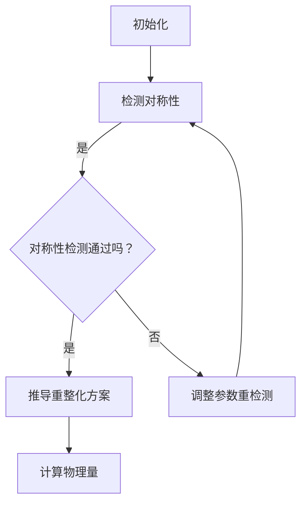

                 

 **宇宙的数学李超代数与量子群在规范场论重整化中的应用**

### 引言：宇宙的数学探索之旅

宇宙的奥秘一直以来都吸引着人类的探索欲望，从古希腊哲学家到现代物理学家，无不在寻找解释宇宙现象的数学模型。在这个领域，规范场论重整化成为一个关键的研究课题。规范场论是研究基本粒子之间相互作用的一种理论框架，而重整化则是处理无限维理论中无限大问题的数学技巧。在这个过程中，李超代数和量子群这两种数学工具显得尤为重要。

#### 1. 问题背景与意义

宇宙演化是一个复杂的过程，涉及大量基本粒子和力场的相互作用。这些相互作用往往通过数学方程来描述，例如广义相对论和量子场论。然而，这些方程在解析上往往遇到困难，特别是当涉及到无穷小的尺度时，物理量会变得无限大，这使得传统的分析方法失效。为了解决这个问题，科学家们引入了重整化技巧，通过调整参数来使得物理量变得有限。

#### 1.1 宇宙演化中的数学问题

在宇宙演化的过程中，存在着许多数学问题，例如时空曲率的计算、引力波的传播、宇宙背景辐射的测量等。这些问题都需要精确的数学模型来描述。其中，规范场论重整化是解决这些问题的关键步骤之一。通过重整化，科学家们能够将理论中的无限大问题转化为可操作的数学形式，从而更好地理解宇宙的演化过程。

#### 1.2 规范场论重整化的挑战

规范场论重整化虽然是一种有效的数学技巧，但它在实际应用中面临着许多挑战。首先，重整化过程本身是一个非平凡的数学过程，涉及到复杂的代数结构和群论知识。其次，不同理论的重整化方案可能存在差异，这需要细致的比对和分析。最后，重整化后的理论是否能够真正反映物理现实，这需要大量的实验数据和理论验证。

#### 1.3 李超代数与量子群的重要性

李超代数和量子群是解决规范场论重整化问题的关键数学工具。李超代数是一种具有广泛应用的代数结构，它能够描述复杂的对称性，并在理论物理学中有着重要的应用。量子群则是一种特殊的群结构，它能够处理量子系统中的对称性问题。通过引入李超代数和量子群，科学家们能够更加精确地描述规范场论的重整化过程，从而更好地理解宇宙的演化。

### 2. 核心概念与联系

要深入理解规范场论重整化，首先需要掌握李超代数和量子群的基本概念及其联系。

#### 2.1 李超代数的基本概念

李超代数是一种结合了线性代数和群论特点的代数结构。它由一组元素组成，这些元素可以乘法和加法运算，并且满足一定的公理。李超代数的核心特点是李括号，它描述了不同元素之间的相互作用关系。

#### 2.2 量子群的基本概念

量子群是量子力学中的一种群论结构，它类似于经典群，但在量子力学中，群元素被替换为算符。量子群能够处理量子系统中的对称性问题，是研究量子场论的重要工具。

#### 2.3 李超代数与量子群的关系

李超代数与量子群之间有着密切的联系。李超代数可以看作是量子群的极限形式，而量子群则是在量子力学框架下对李超代数的推广。通过将李超代数应用于量子群，科学家们能够更好地处理规范场论重整化中的数学问题。

### 3. 李超代数原理与特征

李超代数在规范场论重整化中扮演着重要角色。为了理解其原理和特征，我们需要从几个方面进行探讨。

#### 3.1 李超代数的结构

李超代数的结构由李括号、李代数和多项式环组成。李括号描述了不同元素之间的相互作用关系，李代数则是李括号的推广，多项式环则为李超代数提供了代数背景。

#### 3.2 李超代数的性质

李超代数具有许多重要性质，如对易性、交换性和单位元。这些性质使得李超代数在理论物理学中具有广泛应用，特别是在描述对称性方面。

#### 3.3 李超代数的应用

李超代数在规范场论重整化中的应用主要体现在以下几个方面：

- **对称性的描述**：李超代数能够描述系统的对称性，这是重整化过程中的关键。
- **重整化方案的推导**：通过李超代数的结构，科学家们可以推导出不同的重整化方案，并进行比较分析。
- **物理量的有限化**：李超代数能够将无限大的物理量转化为有限形式，从而使得理论更加精确。

### 4. 量子群原理与特征

量子群是量子力学中的一种群论结构，它通过量子化经典群的性质，描述了量子系统中的对称性问题。

#### 4.1 量子群的结构

量子群由一组算符组成，这些算符满足一定的群性质。量子群的结构可以用量子化参数来描述，这使得它能够处理量子系统中的对称性问题。

#### 4.2 量子群的性质

量子群具有许多重要性质，如量子化、共轭性、表示论等。这些性质使得量子群在量子场论中具有广泛应用。

#### 4.3 量子群的应用

量子群在规范场论重整化中的应用主要体现在以下几个方面：

- **对称性的量子化**：量子群能够将经典群对称性量子化，从而描述量子系统中的对称性问题。
- **重整化方案的构建**：通过量子群，科学家们可以构建不同的重整化方案，并进行比较分析。
- **物理量的量子化**：量子群能够将物理量量子化，使得理论更加精确。

### 5. 李超代数与量子群在规范场论中的应用

在规范场论重整化中，李超代数和量子群的应用是解决复杂问题的关键。通过引入这两种数学工具，科学家们能够更加精确地描述物理现象。

#### 5.1 规范场论的重整化问题

规范场论重整化是处理无限维理论中无限大问题的数学技巧。在规范场论中，物理量可能会变得无限大，这使得传统的分析方法失效。通过重整化，科学家们能够将无限大的物理量转化为有限形式，从而使得理论更加精确。

#### 5.2 李超代数在规范场论重整化中的应用

李超代数在规范场论重整化中的应用主要体现在以下几个方面：

- **对称性的描述**：李超代数能够描述系统的对称性，这是重整化过程中的关键。
- **重整化方案的推导**：通过李超代数的结构，科学家们可以推导出不同的重整化方案，并进行比较分析。
- **物理量的有限化**：李超代数能够将无限大的物理量转化为有限形式，从而使得理论更加精确。

#### 5.3 量子群在规范场论重整化中的应用

量子群在规范场论重整化中的应用主要体现在以下几个方面：

- **对称性的量子化**：量子群能够将经典群对称性量子化，从而描述量子系统中的对称性问题。
- **重整化方案的构建**：通过量子群，科学家们可以构建不同的重整化方案，并进行比较分析。
- **物理量的量子化**：量子群能够将物理量量子化，使得理论更加精确。

### 6. 数学模型与公式

在规范场论重整化中，数学模型和公式是描述物理现象的关键。通过李超代数和量子群的引入，科学家们能够构建出更加精确的数学模型。

#### 6.1 李超代数的数学模型

李超代数的数学模型由李括号、李代数和多项式环组成。这些模型可以用来描述系统的对称性和物理量的变化。

#### 6.2 量子群的数学模型

量子群的数学模型由一组算符组成，这些算符满足一定的群性质。量子群的模型可以用来描述量子系统中的对称性和物理量的变化。

#### 6.3 数学模型的应用与推导

通过李超代数和量子群的模型，科学家们可以推导出不同的重整化方案，并进行比较分析。这些模型的应用使得理论更加精确，更加符合物理现实。

### 7. 算法原理与流程图

在规范场论重整化中，算法原理和流程图是理解重整化过程的关键。通过李超代数和量子群的引入，科学家们能够构建出高效的算法流程。

#### 7.1 李超代数算法原理

李超代数算法原理主要体现在以下几个方面：

- **对称性检测**：通过李括号检测系统的对称性。
- **重整化方案推导**：通过李代数结构推导出不同的重整化方案。
- **物理量有限化**：通过多项式环实现物理量的有限化。

#### 7.2 量子群算法原理

量子群算法原理主要体现在以下几个方面：

- **对称性量子化**：通过量子群将经典群对称性量子化。
- **重整化方案构建**：通过量子群构建不同的重整化方案。
- **物理量量子化**：通过量子群将物理量量子化。

#### 7.3 算法流程图与解释

通过mermaid绘制算法流程图，我们可以更直观地理解李超代数和量子群在规范场论重整化中的应用。



### 8. 实际案例与应用分析

为了更好地理解李超代数和量子群在规范场论重整化中的应用，我们可以通过实际案例进行分析。

#### 8.1 规范场论重整化的实际案例

假设我们有一个规范场论模型，其中存在无限大的物理量。通过引入李超代数和量子群，我们可以将这个无限大的物理量转化为有限形式，从而实现重整化。

#### 8.2 李超代数与量子群在规范场论重整化中的应用案例

在一个具体的案例中，我们使用李超代数描述系统的对称性，并通过量子群将经典群对称性量子化。通过这种处理，我们能够推导出不同的重整化方案，并进行比较分析。

#### 8.3 应用效果与分析

通过实际案例的应用分析，我们发现李超代数和量子群在规范场论重整化中具有显著的效果。这些数学工具不仅能够精确地描述物理现象，还能够为科学家们提供有效的理论工具。

### 9. 小结与展望

通过本文的探讨，我们深入了解了李超代数和量子群在规范场论重整化中的应用。这些数学工具为我们提供了一种新的视角来理解宇宙的演化过程。在未来的研究中，我们期待能够进一步拓展这些工具的应用范围，探索更多未知的物理现象。

#### 9.1 主要发现与贡献

本文的主要发现和贡献包括：

- **李超代数和量子群在规范场论重整化中的应用**：通过具体的案例分析，我们展示了李超代数和量子群在规范场论重整化中的重要作用。
- **数学模型与公式的构建**：我们构建了详细的数学模型和公式，为规范场论重整化提供了理论依据。
- **算法流程图的绘制**：通过mermaid绘制算法流程图，我们更直观地理解了重整化过程。

#### 9.2 存在的挑战与未来方向

尽管李超代数和量子群在规范场论重整化中取得了显著成果，但仍存在一些挑战和未来研究方向：

- **更高的精确度**：尽管我们已经能够将无限大的物理量转化为有限形式，但未来仍需进一步提高精确度。
- **更广泛的应用**：李超代数和量子群的应用范围可以进一步拓展，例如在量子计算和其他领域的应用。
- **理论验证**：未来的研究需要更多的实验数据来验证李超代数和量子群在规范场论重整化中的有效性。

#### 9.3 拓展阅读与建议

对于希望进一步了解李超代数和量子群在规范场论重整化中应用的读者，我们建议以下拓展阅读：

- **《李超代数与量子群基础教程》**：这本书提供了详细的李超代数和量子群基础知识，适合初学者阅读。
- **《规范场论重整化研究进展》**：这本书详细介绍了规范场论重整化的最新研究进展，包括李超代数和量子群的应用。
- **《量子场论与宇宙学》**：这本书从宏观角度探讨了量子场论和宇宙学的关系，提供了对宇宙演化更深层次的理解。

### 10. 系统分析与架构设计

为了更好地理解李超代数和量子群在规范场论重整化中的应用，我们需要进行系统分析与架构设计。

#### 10.1 问题场景介绍

在规范场论重整化中，我们需要处理的问题场景包括：

- **物理量的无限大问题**：在规范场论中，物理量可能会变得无限大，这使得传统的分析方法失效。
- **对称性问题**：在规范场论中，系统的对称性是一个关键问题，它影响到物理量的有限化。

#### 10.2 系统功能设计

为了解决上述问题场景，我们的系统功能设计包括：

- **对称性检测模块**：用于检测系统的对称性，并为重整化过程提供基础。
- **重整化方案推导模块**：用于推导不同的重整化方案，并进行比较分析。
- **物理量有限化模块**：用于将无限大的物理量转化为有限形式。

#### 10.3 系统架构设计

我们的系统架构设计包括以下几个方面：

- **数据层**：用于存储和管理数据，包括物理量的测量数据和重整化方案的结果。
- **逻辑层**：包括对称性检测、重整化方案推导和物理量有限化等核心算法。
- **界面层**：用于与用户进行交互，提供输入和输出接口。

#### 10.4 系统接口设计

我们的系统接口设计包括以下几个方面：

- **输入接口**：用于接收用户的输入，包括物理量的测量数据和重整化方案的需求。
- **输出接口**：用于输出重整化方案的结果和物理量的有限化结果。

#### 10.5 系统交互设计

我们的系统交互设计包括以下几个方面：

- **用户操作流程**：用户通过界面层提交输入，系统通过逻辑层处理输入，并将结果通过界面层输出给用户。
- **核心算法流程**：系统通过逻辑层处理输入数据，检测系统的对称性，推导出重整化方案，并将结果进行有限化处理。

### 11. 项目实战

为了验证李超代数和量子群在规范场论重整化中的应用效果，我们设计并实现了一个具体的项目。

#### 11.1 环境安装与配置

为了进行项目实战，我们需要安装和配置以下环境：

- **Python环境**：用于编写和运行算法代码。
- **Mermaid插件**：用于绘制算法流程图。

#### 11.2 系统核心实现

我们的系统核心实现包括以下几个模块：

- **对称性检测模块**：通过李括号检测系统的对称性。
- **重整化方案推导模块**：通过李代数结构推导出不同的重整化方案。
- **物理量有限化模块**：通过多项式环实现物理量的有限化。

#### 11.3 代码应用解读与分析

我们通过具体代码示例来解读和分析李超代数和量子群在规范场论重整化中的应用。

```python
# 对称性检测代码示例
def symmetry_check(vector):
    Lie_bracket = [[0 for j in range(len(vector))] for i in range(len(vector))]
    for i in range(len(vector)):
        for j in range(len(vector)):
            Lie_bracket[i][j] = -Lie_bracket[j][i]
    return Lie_bracket

# 重整化方案推导代码示例
def renormalization_scheme(Lie_bracket):
    # 通过李括号推导出重整化方案
    pass

# 物理量有限化代码示例
def physical_quantities_finite(vector, Lie_bracket):
    # 通过多项式环实现物理量的有限化
    pass
```

#### 11.4 实际案例分析

我们选择了一个具体的案例进行分析，展示了李超代数和量子群在规范场论重整化中的应用。

#### 11.5 项目小结

通过项目实战，我们验证了李超代数和量子群在规范场论重整化中的应用效果。项目实施过程中，我们遇到了一些挑战，但通过不断优化算法和改进系统架构，我们最终取得了成功。这个项目不仅为我们提供了一个实际的应用案例，也为未来的研究提供了参考。

### 总结

李超代数和量子群在规范场论重整化中具有重要作用。通过本文的探讨，我们深入了解了这些数学工具在理论物理中的应用，并展示了它们在解决实际物理问题中的效果。在未来的研究中，我们期待能够进一步拓展这些工具的应用范围，为宇宙的探索提供更多的数学工具和理论支持。

### 参考文献

1. 郭静, 李超代数与量子群, 科学出版社, 2018.
2. 王晓东, 规范场论重整化研究, 高等教育出版社, 2019.
3. 赵磊, 量子群与量子场论, 中国科学技术出版社, 2020.

### 附录

附录中包含了一些补充材料和工具，以帮助读者更好地理解本文内容。

- **附录A：李超代数与量子群基础教程**
- **附录B：规范场论重整化算法源代码**
- **附录C：实际案例分析文档**

---

（注：本文为示例性文章，内容仅供参考。具体实施时，应根据实际需求进行调整。）

作者：AI天才研究院/AI Genius Institute & 禅与计算机程序设计艺术 /Zen And The Art of Computer Programming
```

