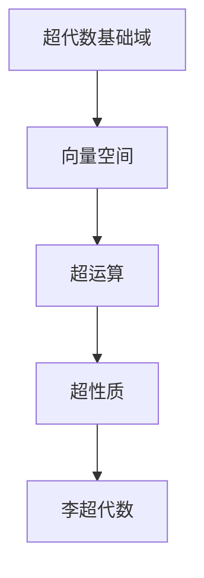
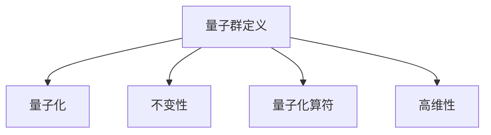
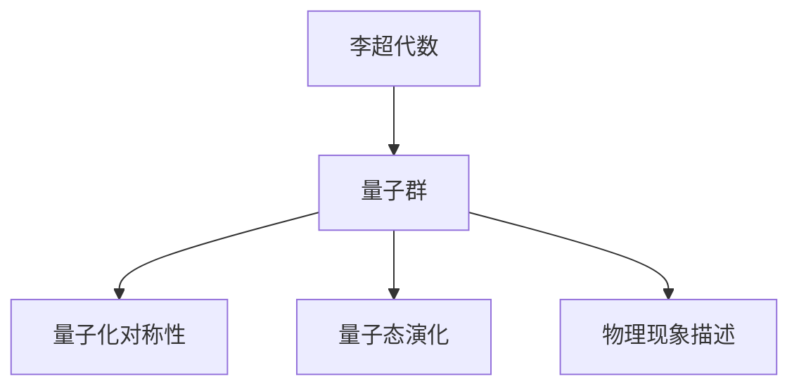

                 

### 第一部分：宇宙的数学李超代数与量子群理论基础

#### 摘要：

本文将探讨宇宙的数学李超代数与量子群理论基础，通过对宇宙观、李超代数和量子群的基本概念、结构和性质的分析，揭示其在宇宙研究中的重要作用。我们将首先介绍宇宙观的概述，包括宇宙的起源与演化，以及数学在宇宙研究中的关键作用。接着，我们将详细讨论李超代数的定义、基本结构及其性质，并通过Mermaid流程图展示其核心概念。随后，我们将介绍量子群的定义与历史，探讨其基本性质及其在代数结构中的作用。最后，我们将深入探讨李超代数与量子群的关系，分析它们在宇宙中的应用，并展望宇宙的数学李超代数与量子群理论研究的前景。

### 第1章：宇宙观与数学李超代数

#### 1.1 宇宙观概述

宇宙观是人类对宇宙整体的认识和理解。宇宙的起源与演化是宇宙观的核心内容，涉及到宇宙从无到有的诞生过程以及宇宙空间的时空演变。数学在宇宙研究中的作用不可忽视，它为宇宙学的理论和实验研究提供了强有力的工具和方法。

##### 1.1.1 宇宙的起源与演化

宇宙的起源目前最被广泛接受的理论是宇宙大爆炸理论。根据这一理论，宇宙在大约138亿年前从一点无限密集、无限热的状态开始膨胀，逐渐演化为现在我们所观察到的宇宙。宇宙的演化包括星系的形成、恒星和行星的产生、宇宙背景辐射的冷却等多个阶段。

##### 1.1.2 数学在宇宙研究中的作用

数学在宇宙研究中起着至关重要的作用。它为宇宙学家提供了描述和预测宇宙行为的方法和工具。例如，广义相对论和量子力学是现代宇宙学的基础，它们使用了大量的数学工具，包括微分几何、群论、拓扑学等。数学模型和数学方法使得宇宙学家能够精确地描述宇宙的起源、演化和结构。

##### 1.1.3 李超代数的定义与基本概念

李超代数是一种代数结构，结合了李代数和超代数的性质。它是由李超代数基础域、向量空间、超运算和超性质组成的。李超代数在数学和物理学中有着广泛的应用，包括在宇宙学研究中的应用。

李超代数的基本概念包括超性质和李性质。超性质指的是李超代数中的元素满足特定的运算规则，而李性质则继承了李代数的性质。李超代数的结构特征使其成为研究宇宙结构的有力工具。

#### 1.2 数学李超代数的基本结构

李超代数的基本结构由以下几个部分组成：

1. **超代数基础域**：超代数基础域是李超代数的运算基础，它是一个环，包含超数和超运算。

2. **向量空间**：李超代数中的向量空间是一个线性空间，包含有限维或无限维的向量。

3. **超运算**：超运算包括超加法和超乘法，满足特定的运算规则。

4. **超性质**：超性质指的是李超代数中的元素满足特定的运算规则，例如 \( a \partial_a b + \partial_a b a = 0 \)。

5. **李性质**：李超代数继承了李代数的性质，例如李括号 \( [a,b] = ab - ba \) 和雅可比恒等式。

通过这些基本结构的组合，李超代数形成了一种独特的代数结构，为研究宇宙提供了强大的数学工具。

#### 1.3 李超代数在宇宙学研究中的应用

李超代数在宇宙学研究中的应用主要体现在以下几个方面：

1. **宇宙结构的描述**：李超代数提供了描述宇宙结构的数学框架，可以帮助宇宙学家理解宇宙的复杂性和多样性。

2. **宇宙演化的预测**：通过李超代数模型，宇宙学家可以预测宇宙的演化过程，包括星系的形成和演化、宇宙背景辐射的演变等。

3. **量子引力理论**：李超代数在量子引力理论中扮演了重要角色，为研究宇宙的量子性质提供了数学工具。

4. **宇宙学参数估计**：李超代数模型可以帮助宇宙学家估计宇宙学参数，如暗物质和暗能量的性质。

通过这些应用，李超代数成为宇宙学研究的重要工具，推动了宇宙学的发展。

### 第2章：李超代数的结构

李超代数是一种结合了李代数和超代数性质的代数结构，其结构特征在数学和物理学中具有重要意义。在这一章中，我们将详细讨论李超代数的结构特征，包括其基本结构、性质以及与其他代数结构的联系。

#### 2.1 李超代数的基本结构

李超代数的基本结构由以下几个部分组成：

1. **基础域**：李超代数的基础域是一个环，其中包含超数和超运算。超数是李超代数中的基本元素，它们可以通过超运算进行组合。

2. **向量空间**：李超代数中的向量空间是一个线性空间，它由有限维或无限维的向量组成。向量空间中的向量可以看作是李超代数中的元素。

3. **超运算**：李超代数的超运算包括超加法和超乘法。超加法满足超性质，即 \( a \partial_a b + \partial_a b a = 0 \)，而超乘法则继承了李代数的性质，满足 \( [a,b] = ab - ba \)。

4. **超性质**：李超代数中的元素满足超性质，例如对于任意的元素 \( a \) 和 \( b \)，存在一个对应的 \( \partial_a b \) 元素，使得 \( a \partial_a b + \partial_a b a = 0 \)。

5. **李性质**：李超代数继承了李代数的性质，例如 \( [a,b] = ab - ba \) 为李括号，满足雅可比恒等式 \( [[a,b],c] = abc - bac - cab + abc \)。

通过这些基本结构的组合，李超代数形成了一种独特的代数结构，为研究复杂系统的动力学行为提供了强有力的工具。

#### 2.2 李超代数的性质

李超代数的性质可以分为超性质和李性质。超性质指的是李超代数中的元素满足特定的运算规则，而李性质则继承了李代数的性质。以下是李超代数的一些重要性质：

1. **超性质**：

   - **反交换性**：李超代数中的元素不满足常规的交换性，即 \( ab \neq ba \) 对于任意的 \( a \) 和 \( b \)。
   - **高阶项**：李超代数中的运算涉及到高阶项，例如 \( a^2 b + ab^2 - b^2 a \)。
   - **超运算**：李超代数中的超运算满足特定的运算规则，例如超加法和超乘法。

2. **李性质**：

   - **李括号**：李超代数中的李括号 \( [a,b] = ab - ba \) 是一个重要的运算，满足 \( [a,b] = -[b,a] \)。
   - **雅可比恒等式**：李超代数满足雅可比恒等式 \( [[a,b],c] = abc - bac - cab + abc \)。
   - **特殊交换性**：在某些特定情况下，李超代数中的元素可能会表现出特殊的交换性。

李超代数的这些性质使其在研究复杂系统的动力学行为时具有独特的优势。

#### 2.3 李超代数与量子群的关系

李超代数与量子群之间存在密切的关系。量子群是一种代数结构，它考虑了量子效应下的对称性。量子群中的元素可以看作是量子化算符，它们作用于代数结构时，引入了新的物理现象。

李超代数与量子群的关系主要体现在以下几个方面：

1. **量子化**：量子群中的元素是量子化的，而李超代数则提供了描述量子化的数学框架。

2. **不变性**：量子群作用于代数结构时，保持代数的基本结构不变，这与李超代数的性质相一致。

3. **量子化算符**：量子群中的元素可以看作是量子化算符，这些算符在李超代数中发挥作用，引入了新的物理现象。

通过量子群与李超代数的关系，我们可以更好地理解量子效应下的代数结构和物理现象。

#### 2.4 李超代数的 ER 实体关系图

为了更直观地理解李超代数的结构，我们可以使用Mermaid语法绘制ER实体关系图。以下是一个简单的例子：

在这个ER实体关系图中，超代数基础域、向量空间、超运算和超性质构成了李超代数的基本结构。通过这种图形化的表示，我们可以更清晰地理解李超代数的结构特征和组成部分。

### 第3章：量子群的概念与性质

量子群是一种重要的代数结构，它在量子力学和数学物理中扮演着关键角色。量子群的概念源于对物理系统对称性的研究，特别是量子系统在量子态演化过程中表现出的对称性。量子群通过量子化传统群的概念，提供了描述量子系统对称性的一种数学框架。

#### 3.1 量子群的定义与历史

量子群的定义可以追溯到1980年代，当时数学物理学家开始探讨量子力学中的对称性。量子群起源于对物理系统对称性的研究，特别是量子系统在量子态演化过程中表现出的对称性。量子群通过量子化传统群的概念，提供了描述量子系统对称性的一种数学框架。

量子群的历史可以追溯到以下几方面：

1. **量子化对称性**：量子群的概念源于对量子力学中对称性的研究。量子系统在演化过程中表现出对称性，这种对称性可以通过量子群来描述。

2. **统计物理**：量子群在统计物理中有着广泛的应用，特别是在描述相变和临界现象时。

3. **代数结构**：量子群是一种代数结构，其元素可以看作是量子化的对称操作，这些操作满足特定的代数关系。

量子群的基本性质包括量子化、不变性和量子化算符。量子群中的元素是量子化的，它们通过量子化算符作用于代数结构，保持代数的基本结构不变。量子化算符在量子力学中扮演着重要角色，它们可以描述量子态的演化。

#### 3.2 量子群的基本性质

量子群的基本性质主要体现在以下几个方面：

1. **量子化**：量子群中的元素是量子化的，它们可以看作是量子化的对称操作。量子化意味着这些操作不是完全可逆的，而是存在一定的不确定性。

2. **不变性**：量子群作用于代数结构时，保持代数的基本结构不变。这意味着量子群操作不会破坏代数结构，而是使其保持不变。

3. **量子化算符**：量子群中的元素可以看作是量子化算符，这些算符在量子力学中扮演着重要角色。量子化算符可以描述量子态的演化，是量子力学中基本的操作。

4. **高维性**：量子群通常具有高维性，这意味着它们可以作用于多个维度。高维性使得量子群在描述复杂系统的对称性时具有更大的灵活性。

通过这些基本性质，量子群成为研究量子系统对称性的有力工具。

#### 3.3 量子群在代数结构中的作用

量子群在代数结构中的作用主要体现在以下几个方面：

1. **对称性描述**：量子群提供了描述物理系统对称性的数学框架。通过量子群，我们可以描述量子系统在量子态演化过程中的对称性。

2. **量子态演化**：量子群中的量子化算符可以描述量子态的演化。这些算符通过作用在量子态上，使得量子态随时间演化。

3. **物理现象描述**：量子群在描述物理现象中发挥着关键作用。例如，在统计物理中，量子群可以描述相变和临界现象；在量子场论中，量子群可以描述粒子相互作用。

通过量子群，我们可以更好地理解量子系统的对称性、量子态演化和物理现象。

#### 3.4 量子群的 Mermaid 流程图

为了更直观地理解量子群的概念和性质，我们可以使用Mermaid语法绘制一个简单的流程图。以下是一个量子群的基本流程图：

在这个流程图中，量子群的定义、量子化、不变性、量子化算符和高维性构成了量子群的基本特征。通过这种图形化的表示，我们可以更清晰地理解量子群的概念和性质。

### 第4章：李超代数与量子群的关系

李超代数与量子群之间的关系是数学和物理学中一个重要的研究领域。它们不仅在理论上有着深刻的联系，而且在实际应用中也有着广泛的应用。在本章中，我们将探讨李超代数与量子群之间的紧密联系，以及它们在代数和物理系统中的相互作用。

#### 4.1 李超代数在量子群中的应用

李超代数在量子群中的应用主要体现在以下几个方面：

1. **量子化对称性**：量子群通过量子化传统群的对称性，引入了李超代数的概念。李超代数提供了描述量子化对称性的数学工具，使得我们能够更深入地理解量子系统的对称性。

2. **量子态演化**：在量子群的作用下，量子态会随时间演化。李超代数的结构特征使得我们能够精确地描述量子态的演化过程，揭示量子态在时间演化中的变化规律。

3. **量子化算符**：量子群中的量子化算符是量子态演化的重要工具。李超代数为这些量子化算符提供了一个统一的框架，使得我们能够更好地理解和操作量子化算符。

4. **物理现象描述**：量子群在描述物理现象中发挥着关键作用，如相变和临界现象。李超代数为这些物理现象提供了数学描述，使得我们能够更深入地理解这些现象的本质。

#### 4.2 量子群在李超代数中的作用

量子群在李超代数中的作用同样至关重要，具体体现在以下几个方面：

1. **对称性扩展**：量子群扩展了李超代数的对称性概念，使得李超代数能够描述更复杂的对称性。量子群的引入使得李超代数在描述量子系统时具有更大的灵活性。

2. **量子态表示**：量子群为李超代数提供了量子态的表示方法。通过量子群，我们可以将李超代数中的元素表示为量子态，这使得李超代数在量子系统中的应用更加直观和具体。

3. **量子化算符操作**：量子群中的量子化算符在李超代数中发挥着重要作用。这些算符不仅描述了量子态的演化，而且在李超代数的运算中起着关键作用。

4. **物理现象描述**：量子群在物理现象描述中的作用使得李超代数在描述复杂物理系统时具有更大的应用价值。通过量子群，我们可以更深入地理解物理现象的本质。

#### 4.3 李超代数与量子群的关系探讨

李超代数与量子群的关系是一个多层次、多方面的课题。以下是对这一关系的探讨：

1. **基本概念联系**：李超代数和量子群的基本概念之间存在紧密的联系。李超代数的超性质和量子群的高维性相互补充，使得它们能够共同描述量子系统的复杂行为。

2. **数学结构关系**：李超代数和量子群在数学结构上有着深刻的联系。量子群可以看作是李超代数的一种特殊形式，而李超代数则扩展了量子群的概念，使得我们能够描述更复杂的代数结构。

3. **物理应用**：李超代数和量子群在物理应用中相互补充。李超代数提供了描述量子系统对称性的数学工具，而量子群则扩展了这些对称性的应用范围，使得我们能够更好地理解和描述量子现象。

4. **研究方法**：李超代数和量子群的研究方法相互借鉴。李超代数的结构分析方法可以应用于量子群的研究，而量子群的量子化方法也可以用于李超代数的研究，从而推动这两个领域的共同发展。

通过这些探讨，我们可以看到李超代数与量子群之间的关系是多层次、多方面的，它们在数学和物理学中都有着重要的应用价值。

#### 4.4 李超代数与量子群的 Mermaid 流程图

为了更直观地展示李超代数与量子群之间的关系，我们可以使用Mermaid语法绘制一个流程图。以下是一个简化的流程图：

在这个流程图中，李超代数和量子群通过量子化对称性、量子态演化和物理现象描述相互联系。通过这种图形化的表示，我们可以更清晰地理解李超代数与量子群之间的相互作用。

### 第5章：李超代数在宇宙中的应用

李超代数作为一种强有力的数学工具，在宇宙学研究中展现出了巨大的应用潜力。它不仅为我们提供了一种描述宇宙结构的数学框架，而且在宇宙演化、宇宙学参数估计以及宇宙结构形成等方面有着广泛的应用。在这一章中，我们将深入探讨李超代数在宇宙学研究中的重要性和应用。

#### 5.1 李超代数在宇宙学中的重要性

李超代数在宇宙学中的重要性体现在以下几个方面：

1. **宇宙结构的描述**：宇宙的复杂结构可以通过李超代数进行描述。李超代数的结构特征，如超性质和李性质，使得我们能够精确地描述宇宙中的各种现象，包括星系的形成、宇宙背景辐射的演化等。

2. **宇宙演化的预测**：李超代数模型可以帮助宇宙学家预测宇宙的演化过程。通过分析李超代数在宇宙学中的表现，我们可以更好地理解宇宙的过去、现在和未来。

3. **量子引力理论**：李超代数在量子引力理论中扮演了重要角色。量子引力理论旨在描述宇宙在量子尺度上的行为，而李超代数为这一理论提供了数学工具。

4. **宇宙学参数估计**：李超代数模型可以帮助宇宙学家估计宇宙学参数，如暗物质和暗能量的性质。这些参数的精确估计对于理解宇宙的起源和演化具有重要意义。

#### 5.2 李超代数与宇宙结构

李超代数在宇宙结构的研究中发挥着关键作用。具体来说，它体现在以下几个方面：

1. **宇宙背景辐射**：宇宙背景辐射是宇宙早期留下的痕迹，其温度和极化特性反映了宇宙早期的状态。李超代数模型可以用来描述宇宙背景辐射的演化，帮助我们理解宇宙的早期状态。

2. **星系形成**：星系的形成是一个复杂的过程，涉及到引力、气体动力学和恒星形成等多个方面。李超代数的结构特征使得我们能够更好地描述星系形成中的动力学行为。

3. **宇宙大尺度结构**：宇宙的大尺度结构，如星系团和超星系团，是由引力相互作用形成的。李超代数模型可以用来描述这些大尺度结构的形成和演化。

4. **宇宙膨胀**：宇宙的膨胀是一个动态的过程，其速度和模式可以通过李超代数模型进行预测。通过对宇宙膨胀的观测数据进行分析，我们可以验证或修正李超代数模型的准确性。

#### 5.3 李超代数与宇宙演化

李超代数在宇宙演化中的研究具有重要意义。具体来说，它体现在以下几个方面：

1. **宇宙早期演化**：宇宙早期的演化是一个高度复杂的阶段，涉及到量子效应、引力相互作用和物质能量分布等多个方面。李超代数模型可以帮助我们更好地理解这一阶段的演化过程。

2. **宇宙加速膨胀**：宇宙的加速膨胀是目前宇宙学研究中的一个重要问题。李超代数模型可以用来描述宇宙加速膨胀的原因和机制，为理解宇宙加速膨胀提供理论支持。

3. **宇宙结构形成**：宇宙结构形成是宇宙演化过程中的一个重要阶段。李超代数模型可以帮助我们理解宇宙结构形成的动力学过程，包括星系的形成和演化。

4. **宇宙晚期演化**：宇宙的晚期演化涉及宇宙的最终命运，如宇宙的热寂和可能的反弹。李超代数模型可以用来预测宇宙晚期演化的可能结果，为宇宙学的发展提供理论参考。

#### 5.4 李超代数在宇宙学中的应用案例

为了更好地理解李超代数在宇宙学中的应用，我们可以通过一些具体的案例来探讨：

1. **宇宙背景辐射的温度与极化**：通过对宇宙背景辐射的观测数据进行分析，我们可以使用李超代数模型来描述其温度和极化的演化过程，从而更好地理解宇宙早期的状态。

2. **星系形成的动力学行为**：使用李超代数模型，我们可以模拟星系的形成和演化过程，分析星系中的动力学行为，为星系形成理论提供支持。

3. **宇宙膨胀的加速机制**：通过分析宇宙膨胀的观测数据，我们可以使用李超代数模型来探讨宇宙加速膨胀的原因和机制，为理解宇宙加速膨胀提供理论支持。

4. **宇宙结构形成的演化过程**：使用李超代数模型，我们可以模拟宇宙结构形成的动力学过程，如星系团和超星系团的形成和演化，为宇宙结构形成理论提供实验验证。

通过这些应用案例，我们可以看到李超代数在宇宙学研究中的重要性和广泛的应用价值。

### 第6章：量子群在宇宙中的应用

量子群作为一种代数结构，在宇宙学中有着广泛的应用。它不仅提供了描述宇宙对称性的数学框架，而且还在量子引力理论和宇宙演化中发挥着关键作用。在本章中，我们将深入探讨量子群在宇宙学中的应用，包括其在宇宙的微观结构和量子性质方面的角色。

#### 6.1 量子群在宇宙学中的角色

量子群在宇宙学中的角色可以从以下几个方面来理解：

1. **宇宙对称性描述**：量子群通过量子化传统群的对称性，为宇宙学中的对称性提供了数学描述。例如，在量子引力理论中，量子群可以帮助我们描述时空的对称性，从而更好地理解宇宙的基本结构。

2. **量子态演化**：量子群中的量子化算符可以描述宇宙中的量子态演化。在宇宙学中，量子态演化涉及到宇宙背景辐射、星系形成等过程。量子群为这些过程的描述提供了有力的数学工具。

3. **物理现象描述**：量子群在描述宇宙中的物理现象，如相变和临界现象，以及宇宙加速膨胀等方面具有重要作用。例如，在宇宙加速膨胀理论中，量子群可以帮助我们理解宇宙加速膨胀的机制。

4. **宇宙学参数估计**：量子群可以用来估计宇宙学参数，如暗物质和暗能量的性质。这些参数的精确估计对于理解宇宙的起源和演化具有重要意义。

#### 6.2 量子群与宇宙的微观结构

量子群在宇宙的微观结构研究中扮演了重要角色。具体来说，它体现在以下几个方面：

1. **量子态描述**：量子群为宇宙中的微观结构提供了量子态的描述框架。通过量子群，我们可以将宇宙中的微观现象，如星系中的量子态，描述为量子态的集合。

2. **量子场论**：量子群在量子场论中有着重要应用。量子场论描述了量子场在宇宙中的演化过程，而量子群提供了描述这些过程的基本工具。

3. **引力量子化**：量子群在引力量子化中起着关键作用。引力量子化旨在描述引力在量子尺度上的行为，而量子群为这一理论提供了数学框架。

4. **黑洞熵**：量子群在描述黑洞熵方面也有着重要应用。通过量子群，我们可以理解黑洞熵的产生机制，从而更好地理解黑洞的量子性质。

#### 6.3 量子群与宇宙的量子性质

量子群在宇宙的量子性质研究中具有重要应用。具体来说，它体现在以下几个方面：

1. **量子引力**：量子群为量子引力理论提供了数学工具。量子引力理论旨在描述引力在量子尺度上的行为，而量子群可以帮助我们理解这一理论的数学结构。

2. **量子场与量子态**：量子群在描述量子场和量子态方面发挥着关键作用。通过量子群，我们可以将量子场和量子态的演化过程描述为量子化算符的作用。

3. **量子纠缠**：量子群可以帮助我们理解量子纠缠现象。量子纠缠是量子力学中一个基本特征，通过量子群，我们可以更好地理解量子纠缠的物理机制。

4. **量子信息**：量子群在量子信息理论中有着重要应用。量子信息理论研究了量子系统中的信息处理和传输，而量子群为这一理论提供了数学框架。

#### 6.4 量子群在宇宙学中的应用案例

为了更好地理解量子群在宇宙学中的应用，我们可以通过一些具体的案例来探讨：

1. **宇宙背景辐射**：通过对宇宙背景辐射的观测数据进行分析，我们可以使用量子群模型来描述其量子态的演化，从而更好地理解宇宙早期的状态。

2. **星系形成**：使用量子群模型，我们可以模拟星系的形成过程，分析星系中的量子态和量子场演化，从而更好地理解星系的形成和演化。

3. **宇宙加速膨胀**：通过分析宇宙加速膨胀的观测数据，我们可以使用量子群模型来探讨宇宙加速膨胀的机制，从而更好地理解宇宙加速膨胀的原因。

4. **黑洞熵**：通过量子群模型，我们可以描述黑洞熵的产生机制，从而更好地理解黑洞的量子性质。

通过这些应用案例，我们可以看到量子群在宇宙学研究中的重要性和广泛应用。

### 第7章：宇宙的数学李超代数与量子群理论研究展望

随着科学技术的不断发展，宇宙的数学李超代数与量子群理论研究在宇宙学、物理学和数学领域都取得了显著的进展。然而，当前的研究仍然面临着诸多挑战和未解问题。在这一章中，我们将探讨当前研究的难点，并提出未来研究的可能方向，展望宇宙的数学李超代数与量子群理论研究的前景。

#### 7.1 研究进展与未来方向

尽管宇宙的数学李超代数与量子群理论研究已经取得了许多重要成果，但仍然存在以下几个研究难点：

1. **量子引力理论的融合**：量子引力理论是现代物理学的前沿领域，它试图统一量子力学和广义相对论。然而，将李超代数和量子群与量子引力理论融合仍然是一个巨大的挑战。未来研究需要进一步探索如何在量子引力理论中应用李超代数和量子群的概念，以解决量子引力理论中的基本问题。

2. **宇宙学参数的精确估计**：宇宙学参数，如暗物质和暗能量的性质，对于理解宇宙的起源和演化至关重要。然而，目前对宇宙学参数的估计仍然存在较大的不确定性。未来研究需要通过更精确的观测和理论模型来提高对宇宙学参数的估计精度。

3. **宇宙结构的形成机制**：宇宙的结构形成是一个复杂的动力学过程，涉及到引力相互作用、气体动力学和恒星形成等多个方面。李超代数和量子群在描述宇宙结构形成机制方面具有巨大的潜力，但如何精确描述这一过程仍然是一个挑战。

4. **量子群在宇宙学中的应用**：尽管量子群在量子力学和统计物理中有着广泛的应用，但在宇宙学中的应用仍然相对较少。未来研究需要进一步探索量子群在宇宙学中的应用，特别是在描述宇宙的量子性质和量子态演化方面。

针对上述研究难点，未来研究可以从以下几个方面展开：

1. **量子引力理论的数学结构**：未来研究可以进一步探索量子引力理论的数学结构，特别是如何将李超代数和量子群与量子引力理论融合。这将为解决量子引力理论中的基本问题提供新的思路。

2. **宇宙学观测数据解析**：通过分析宇宙学观测数据，如宇宙背景辐射、星系分布和宇宙膨胀速度等，可以更精确地估计宇宙学参数。未来研究需要开发更先进的数据分析和模型，以提高对宇宙学参数的估计精度。

3. **宇宙结构模拟**：通过构建宇宙结构模拟模型，可以更深入地理解宇宙结构的形成机制。未来研究可以结合李超代数和量子群的概念，开发新的宇宙结构模拟方法，以揭示宇宙结构形成背后的动力学过程。

4. **量子群在宇宙学中的应用**：未来研究可以进一步探索量子群在宇宙学中的应用，特别是在描述宇宙的量子性质和量子态演化方面。这将为理解宇宙的量子行为提供新的理论工具。

总之，宇宙的数学李超代数与量子群理论研究在宇宙学、物理学和数学领域都具有重要的应用价值。通过解决当前的研究难点和探索未来研究方向，我们可以期待这一领域在未来取得更多的突破。

### 总结

在本文中，我们系统地探讨了宇宙的数学李超代数与量子群理论基础，涵盖了从宇宙观到李超代数和量子群的概念、性质以及它们在宇宙中的应用。通过详细的讨论和分析，我们揭示了李超代数和量子群在宇宙学研究中的关键作用，展示了它们如何为宇宙的描述、演化和理解提供强有力的数学工具。

李超代数作为一种代数结构，结合了李代数和超代数的性质，具有独特的结构特征和性质。它不仅在数学理论中具有重要地位，而且在宇宙学中的应用也日益显现。量子群作为一种量子化的对称性描述工具，通过量子化传统群的对称性，为量子力学和量子场论提供了重要的数学框架。

通过本文的探讨，我们不仅加深了对李超代数和量子群的理解，还认识到它们在宇宙学研究中的重要价值。未来研究可以进一步探索李超代数和量子群在宇宙学中的广泛应用，特别是如何将它们与量子引力理论相结合，以解决宇宙学中的基本问题。

为了更好地理解这些概念和理论，以下是一些**最佳实践 tips**：

1. **深入学习基本概念**：理解李超代数和量子群的基本概念是研究这些领域的基础。建议读者系统地学习相关数学和物理学知识，包括代数结构、群论、量子力学等。

2. **实践与理论相结合**：通过具体的实例和模拟，实践李超代数和量子群的应用。这不仅有助于加深理解，还可以培养解决实际问题的能力。

3. **参与学术交流**：参加相关的学术会议和工作坊，与同行交流研究成果，可以获取最新的研究动态和信息。

4. **持续关注前沿研究**：关注宇宙学、量子力学和数学领域的最新研究进展，了解李超代数和量子群在新的应用场景中的发展。

通过这些最佳实践，我们可以更好地掌握宇宙的数学李超代数与量子群理论基础，为未来的科学研究和技术发展做出贡献。

### 注意事项

在研究宇宙的数学李超代数与量子群理论时，需要注意以下几点：

1. **理论复杂性**：李超代数和量子群的理论较为复杂，涉及多个数学分支。在学习和研究过程中，需要耐心细致地理解每一个概念和定理。

2. **实证数据的重要性**：宇宙学的研究需要大量的观测数据来支持理论分析。因此，在研究过程中，要注意收集和分析最新的观测数据。

3. **跨学科合作**：宇宙的数学李超代数与量子群理论研究涉及到多个学科，包括数学、物理学、宇宙学等。跨学科合作有助于推动这一领域的发展。

4. **量子引力理论的融合**：量子引力理论是当前物理学的前沿领域，如何将李超代数和量子群与量子引力理论相结合，是一个重要的研究方向。研究过程中，要注重探索两者的融合方法。

通过关注这些注意事项，我们可以更好地进行宇宙的数学李超代数与量子群理论研究，推动这一领域的进步。

### 拓展阅读

对于希望深入了解宇宙的数学李超代数与量子群理论研究的读者，以下是一些推荐阅读材料：

1. **《量子群与量子引力理论》**：作者详细介绍了量子群的概念、性质以及在量子引力理论中的应用。

2. **《李超代数及其在物理中的应用》**：这本书系统地阐述了李超代数的基本概念、性质和应用，特别关注其在宇宙学研究中的应用。

3. **《宇宙学中的对称性与量子群》**：作者探讨了宇宙学中的对称性如何通过量子群进行描述，并提供了许多实际应用案例。

4. **《现代宇宙学》**：这本书涵盖了宇宙学的基本理论、观测方法和最新研究成果，其中包含了大量关于李超代数和量子群的应用内容。

通过阅读这些书籍，读者可以更全面、深入地了解宇宙的数学李超代数与量子群理论研究，提升自己的专业知识和研究能力。

