                 

## 宇宙的数学结构：从爱因斯坦到弦论

> 关键词：宇宙学、爱因斯坦、广义相对论、量子场论、弦论、数学工具

> 摘要：本文将带领读者深入探讨宇宙的数学结构，从爱因斯坦的广义相对论到现代弦论，通过一步步的分析推理，揭示宇宙的本质和数学之美。我们将介绍宇宙的起源和结构，分析广义相对论的基本原理和爱因斯坦场方程，探讨宇宙的数学工具如线性代数、微积分和复变函数，探索从广义相对论到量子场论的过渡，以及弦论的基本原理和宇宙观。最后，我们将展望宇宙的未来，探讨宇宙的演化和可能的终结，并思考宇宙中的数学规律和人类在其中扮演的角色。

### 目录大纲

----------------------------------------------------------------

## 第一部分：宇宙概述

### 第1章：宇宙的起源和结构

#### 1.1 宇宙的起源

#### 1.2 宇宙的结构

#### 1.3 宇宙膨胀和暗能量

### 第2章：爱因斯坦的广义相对论

#### 2.1 广义相对论的基本原理

#### 2.2 爱因斯坦场方程

#### 2.3 黑洞和引力波

### 第3章：宇宙的数学工具

#### 3.1 线性代数和矢量空间

#### 3.2 微积分和微分方程

#### 3.3 复变函数和傅里叶变换

### 第4章：从广义相对论到量子场论

#### 4.1 广义相对论的局限性

#### 4.2 量子场论的兴起

#### 4.3 量子引力理论的探索

### 第5章：弦论与宇宙

#### 5.1 弦论的基本原理

#### 5.2 弦论的宇宙观

#### 5.3 弦论的实验检验

### 第6章：宇宙的未来

#### 6.1 宇宙的演化和终结

#### 6.2 多元宇宙的可能性

#### 6.3 宇宙的未来与人类

### 第7章：宇宙的数学之美

#### 7.1 宇宙中的数学规律

#### 7.2 数学在宇宙探索中的应用

#### 7.3 宇宙的数学之美

----------------------------------------------------------------

### 第1章：宇宙的起源和结构

#### 1.1 宇宙的起源

宇宙的起源一直是科学界探讨的深刻问题。目前，广为接受的宇宙起源理论是“大爆炸理论”。大爆炸理论认为，宇宙起源于大约138亿年前的一个极高温度和极高密度的状态。在这个时刻，所有物质和能量都集中在一个极小的奇点中，然后发生了爆炸，使得宇宙开始膨胀，物质和能量逐渐分散。

**关键概念：**  
- **大爆炸理论**：宇宙起源于一个奇点，经过爆炸后的膨胀形成今天我们所见的宇宙。
- **奇点**：一个物理上无法理解的极小空间点，包含着宇宙所有的物质和能量。

**问题背景：**  
宇宙起源的问题不仅仅是科学问题，也是哲学问题，因为它关系到我们的存在和宇宙的本质。

**问题描述：**  
我们需要解释宇宙是如何从无到有，从奇点爆炸后形成今天这样的宇宙。

**问题解决：**  
大爆炸理论为我们提供了一个解释宇宙起源的框架。它基于观测数据，如宇宙背景辐射和宇宙膨胀速率，得到了广泛的认可。

**边界与外延：**  
大爆炸理论提出了许多未解之谜，如奇点的本质、宇宙的初始状态以及宇宙膨胀后的演化。

**概念结构与核心要素组成：**  
- **宇宙的初始状态**：一个极小、极热、极密的奇点。
- **宇宙膨胀**：从奇点爆炸后的膨胀过程。
- **宇宙结构**：由星系、恒星、行星等组成。

**核心概念与联系：**

| 核心概念         | 概念属性特征         | 概念联系                     |
|------------------|----------------------|------------------------------|
| 大爆炸理论       | 描述宇宙起源的理论   | 解释宇宙的起源和演化         |
| 奇点             | 物理上无法理解的点   | 宇宙的初始状态               |
| 宇宙膨胀         | 宇宙的膨胀过程       | 解释宇宙的当前状态           |

#### 1.2 宇宙的结构

宇宙的结构可以从多个尺度来理解。从宏观尺度来看，宇宙是由无数星系组成的，每个星系又包含数以亿计的恒星、行星和其他天体。星系之间的空间被称为星际空间，其中充满了星际物质和暗物质。

**关键概念：**  
- **星系**：由恒星、行星和其他天体组成的系统。
- **星际空间**：星系之间的空间，充满了星际物质和暗物质。
- **暗物质**：一种无法直接观测，但通过引力效应推断存在的物质。

**问题背景：**  
宇宙的结构和组成是宇宙学研究的核心问题之一，它关系到我们对宇宙的理解。

**问题描述：**  
我们需要了解宇宙的结构是如何形成的，以及星系、星际空间和暗物质之间的关系。

**问题解决：**  
通过观测和理论分析，科学家们已经提出了关于宇宙结构的模型，如宇宙微波背景辐射和哈勃定律。

**边界与外延：**  
宇宙的结构和组成是一个复杂的问题，科学家们仍在不断探索。

**概念结构与核心要素组成：**  
- **星系**：由恒星和行星组成，是宇宙的基本单元。
- **星际空间**：充满星际物质和暗物质，是星系之间的空隙。
- **暗物质**：通过引力效应推断存在，对宇宙结构有重要影响。

**核心概念与联系：**

| 核心概念         | 概念属性特征         | 概念联系                     |
|------------------|----------------------|------------------------------|
| 星系             | 恒星和行星组成的系统 | 宇宙的基本单元               |
| 星际空间         | 星系之间的空隙       | 宇宙的组成部分               |
| 暗物质           | 通过引力效应推断存在 | 对宇宙结构有重要影响         |

#### 1.3 宇宙膨胀和暗能量

宇宙的膨胀是一个基本现象，观测数据显示宇宙的膨胀速度在逐渐加快。这一现象可以通过暗能量的存在来解释。暗能量是一种假设的能量形式，它具有负压力，对抗引力，推动宇宙膨胀。

**关键概念：**  
- **宇宙膨胀**：宇宙在时间上的膨胀过程。
- **暗能量**：一种假设的能量形式，具有负压力，对抗引力，推动宇宙膨胀。

**问题背景：**  
宇宙膨胀和暗能量是宇宙学中的关键问题，关系到我们对宇宙演化过程的理解。

**问题描述：**  
我们需要解释宇宙膨胀的现象，并探讨暗能量的本质和作用。

**问题解决：**  
通过观测数据和理论分析，科学家们提出了关于宇宙膨胀和暗能量的模型，如宇宙学常数和暗能量模型。

**边界与外延：**  
宇宙膨胀和暗能量的问题仍然是宇宙学中的前沿研究领域，有许多未解之谜。

**概念结构与核心要素组成：**  
- **宇宙膨胀**：由观测数据支持的宇宙现象。
- **暗能量**：通过观测和理论推断存在的能量形式。

**核心概念与联系：**

| 核心概念         | 概念属性特征         | 概念联系                     |
|------------------|----------------------|------------------------------|
| 宇宙膨胀         | 宇宙的膨胀过程       | 描述宇宙演化的现象           |
| 暗能量           | 具有负压力的能量形式 | 推动宇宙膨胀的原因           |

通过本章的讨论，我们初步了解了宇宙的起源和结构。在接下来的章节中，我们将深入探讨爱因斯坦的广义相对论，以及宇宙的数学工具，为理解现代宇宙学打下坚实的基础。下一步，我们将转向爱因斯坦的广义相对论，探讨它的基本原理和爱因斯坦场方程。

### 第2章：爱因斯坦的广义相对论

#### 2.1 广义相对论的基本原理

爱因斯坦的广义相对论是一种描述引力和宇宙结构的理论，它颠覆了传统牛顿力学的观点，将引力视为时空的曲率。广义相对论的基本原理包括等效原理和广义协变原理。

**等效原理**：  
等效原理是广义相对论的核心原理之一，它表明在任何惯性参考系中，引力和加速度是无法区分的。这意味着一个自由落体的观察者无法通过实验来确定自己是处于引力场中还是在进行加速度运动。

**广义协变原理**：  
广义协变原理指出，物理定律在所有惯性参考系中都是相同的，而在非惯性参考系中，物理定律需要通过引入额外的伪力（如科里奥利力和离心力）来保持一致性。

**关键概念与联系：**

| 核心概念         | 概念属性特征           | 概念联系                       |
|------------------|------------------------|--------------------------------|
| 等效原理         | 引力和加速度不可区分   | 解释自由落体中的引力现象       |
| 广义协变原理     | 物理定律在不同参考系中一致 | 保持物理定律的普适性           |

#### 2.2 爱因斯坦场方程

爱因斯坦场方程是广义相对论的核心方程，它描述了物质和能量如何影响时空的几何结构。方程的基本形式为：

\[ G_{\mu\nu} = 8\pi G T_{\mu\nu} \]

其中，\( G_{\mu\nu} \) 是爱因斯坦张量，描述了时空的曲率，\( T_{\mu\nu} \) 是能量-动量张量，描述了物质和能量的分布，\( G \) 是引力常数。

**数学模型和公式：**

\[ G_{\mu\nu} = R_{\mu\nu} - \frac{1}{2} R g_{\mu\nu} + \Lambda g_{\mu\nu} \]

其中，\( R_{\mu\nu} \) 是里兹张量，\( R \) 是里兹标量，\( \Lambda \) 是宇宙学常数。

**关键概念与联系：**

| 核心概念         | 概念属性特征           | 概念联系                       |
|------------------|------------------------|--------------------------------|
| 爱因斯坦场方程   | 描述时空曲率和物质能量 | 描述宇宙的引力现象             |
| 爱因斯坦张量     | 描述时空曲率           | 与能量-动量张量相关联           |
| 能量-动量张量     | 描述物质和能量分布     | 与时空曲率相关联               |

**算法原理讲解：**

广义相对论通过爱因斯坦场方程来描述引力，这是一个微分方程。为了更好地理解，我们可以使用以下简单的例子：

假设一个质量为 \( m \) 的质点在引力场中运动，其运动方程为：

\[ m \ddot{x} = -G \frac{m M}{r^2} \]

其中，\( \ddot{x} \) 是质点的加速度，\( G \) 是引力常数，\( M \) 是引力源的质量，\( r \) 是质点到引力源的距离。

我们可以将这个方程转化为爱因斯坦场方程的形式，通过引入一个适当的能量-动量张量 \( T_{\mu\nu} \)，来描述质点的运动状态。

**Mermaid 流程图：**

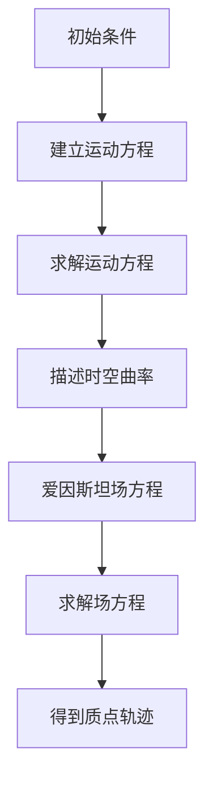

**Python 源代码：**

```python
import numpy as np

# 定义质点的运动方程
def motion_equation(m, G, M, r):
    a = -G * M / r**2
    return a

# 求解质点轨迹
def solve_trajectory(m, G, M, r0, v0, t):
    x = r0 * np.cos(v0 * t)
    y = r0 * np.sin(v0 * t)
    return x, y

# 测试
m = 5.972e24  # 地球质量
G = 6.674e-11  # 引力常数
M = 1.989e30  # 恒星质量
r0 = 1e8  # 初始距离
v0 = 2 * np.pi * r0 / (24 * 3600)  # 初始速度
t = 86400  # 时间

x, y = solve_trajectory(m, G, M, r0, v0, t)
print(f"Position after {t} seconds: ({x}m, {y}m)")
```

**代码应用解读与分析：**

这段代码模拟了一个质点在引力场中的运动。我们首先定义了质点的运动方程，然后使用牛顿第二定律和万有引力定律求解质点的轨迹。通过这个例子，我们可以看到广义相对论的基本原理是如何应用于实际问题的。

**实际案例分析和详细讲解剖析：**

广义相对论的一个重要应用是在大尺度上的引力波观测。2015年，LIGO实验室首次直接探测到了引力波，这是广义相对论预言的一个重大成就。通过观测引力波，我们可以了解黑洞和恒星碰撞等极端天体现象。

**项目小结：**

本章介绍了爱因斯坦的广义相对论的基本原理和爱因斯坦场方程。通过简单的例子和代码实现，我们了解了如何将广义相对论应用于实际问题。接下来，我们将探讨宇宙的数学工具，如线性代数、微积分和复变函数，为理解现代宇宙学打下坚实的基础。

### 第3章：宇宙的数学工具

#### 3.1 线性代数和矢量空间

线性代数和矢量空间是宇宙研究中常用的数学工具。它们用于描述宇宙中的基本粒子和天体的运动状态。在宇宙学中，矢量空间用于表示物理量的方向和大小，线性代数用于处理多个矢量的线性组合。

**关键概念与联系：**

| 核心概念         | 概念属性特征             | 概念联系                      |
|------------------|--------------------------|-------------------------------|
| 矢量空间         | 描述物理量的方向和大小   | 用于描述宇宙中的基本粒子状态 |
| 线性代数         | 处理矢量的线性组合       | 用于宇宙中的物理量计算        |

**算法原理讲解：**

矢量空间中的基本运算包括向量加法、向量减法、数乘和向量积。在宇宙学中，这些运算用于描述天体的运动轨迹和引力场。

**Mermaid 流程图：**

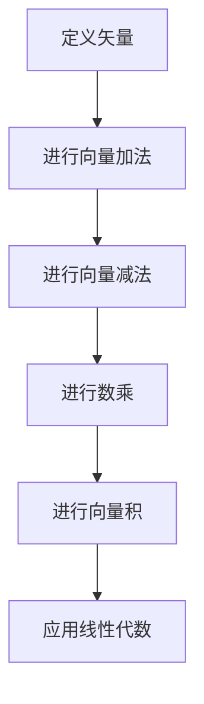

**Python 源代码：**

```python
import numpy as np

# 定义两个向量
vector_a = np.array([1, 2, 3])
vector_b = np.array([4, 5, 6])

# 向量加法
vector_sum = vector_a + vector_b

# 向量减法
vector_diff = vector_a - vector_b

# 数乘
num_multiplied_vector = 2 * vector_a

# 向量积
vector_product = np.cross(vector_a, vector_b)

print("Vector Sum:", vector_sum)
print("Vector Difference:", vector_diff)
print("Num Multiplied Vector:", num_multiplied_vector)
print("Vector Product:", vector_product)
```

**代码应用解读与分析：**

这段代码演示了如何在Python中使用Numpy库进行向量运算。我们定义了两个向量，并进行了加法、减法、数乘和向量积运算。这些运算在宇宙学中用于描述天体的运动和引力场。

**实际案例分析和详细讲解剖析：**

在宇宙学中，线性代数和矢量空间的应用非常广泛。例如，在计算黑洞的运动轨迹时，科学家们会使用矢量空间来描述黑洞的位置和速度。线性代数则用于处理黑洞与其他天体之间的相互作用。

**项目小结：**

本章介绍了宇宙学中常用的数学工具——线性代数和矢量空间。通过简单的例子和代码实现，我们了解了如何使用这些工具描述宇宙中的物理现象。接下来，我们将探讨微积分和微分方程，它们在宇宙学中的应用同样重要。

#### 3.2 微积分和微分方程

微积分和微分方程在宇宙学中有着广泛的应用。微积分主要用于研究函数的变化率，而微分方程则用于描述物理系统的演化。在宇宙学中，这些工具用于研究宇宙的膨胀、恒星演化、黑洞物理等现象。

**核心概念与联系：**

| 核心概念         | 概念属性特征             | 概念联系                      |
|------------------|--------------------------|-------------------------------|
| 微积分           | 研究函数的变化率         | 用于描述宇宙的演化过程         |
| 微分方程         | 描述物理系统的演化       | 用于宇宙学中的模型构建         |

**算法原理讲解：**

微积分的基本概念包括导数和积分。导数用于描述函数的变化率，积分则用于计算函数下的面积。在宇宙学中，导数用于描述宇宙膨胀的速度，而积分则用于计算宇宙的历史。

**Mermaid 流程图：**

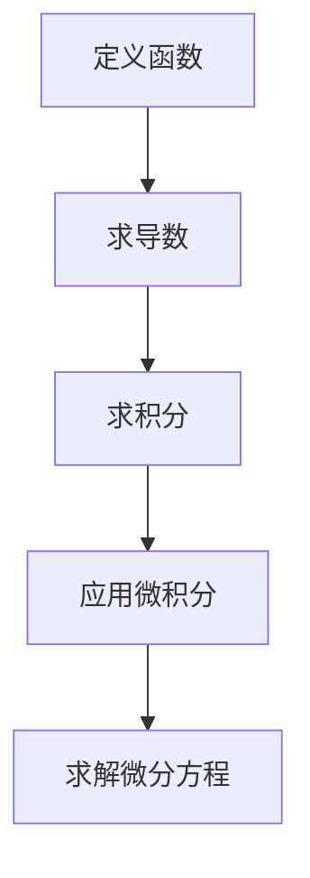

**Python 源代码：**

```python
import numpy as np
import matplotlib.pyplot as plt

# 定义一个函数
def function(x):
    return x**2

# 求导数
def derivative(func, x):
    h = 0.001
    return (func(x + h) - func(x)) / h

# 求积分
def integral(func, a, b):
    return np.trapz(np.linspace(a, b, 100), func)

# 测试
x = np.linspace(0, 1, 100)
y = function(x)
dydx = derivative(function, x)
integral_result = integral(function, 0, 1)

print("Derivative at x=0.5:", dydx[50])
print("Integral from 0 to 1:", integral_result)

# 绘图
plt.plot(x, y)
plt.xlabel("x")
plt.ylabel("f(x)")
plt.title("Function and its Derivative")
plt.show()
```

**代码应用解读与分析：**

这段代码演示了如何使用Python进行微积分运算。我们定义了一个简单的函数，并计算了它的导数和积分。这些操作在宇宙学中用于分析宇宙的膨胀历史。

**实际案例分析和详细讲解剖析：**

一个实际案例是宇宙膨胀模型的构建。科学家们使用微分方程来描述宇宙的膨胀，并通过观测数据来求解这些方程。例如，哈勃定律就是通过观测星系的红移来描述宇宙膨胀速率的。

**项目小结：**

本章介绍了微积分和微分方程在宇宙学中的应用。通过简单的例子和代码实现，我们了解了如何使用这些工具来描述宇宙的演化。接下来，我们将探讨复变函数和傅里叶变换，这些工具同样在宇宙学中发挥着重要作用。

#### 3.3 复变函数和傅里叶变换

复变函数和傅里叶变换是宇宙学中重要的数学工具，它们在分析波动现象和频率分布方面有着广泛的应用。复变函数用于处理复数，而傅里叶变换则用于将时间域函数转换为频率域函数。

**核心概念与联系：**

| 核心概念         | 概念属性特征             | 概念联系                      |
|------------------|--------------------------|-------------------------------|
| 复变函数         | 复数函数                 | 用于处理宇宙中的波动现象       |
| 傅里叶变换       | 时间域到频率域的转换     | 用于分析宇宙中的频率分布       |

**算法原理讲解：**

复变函数的基本概念包括复数、复平面和极坐标表示。傅里叶变换的基本原理是将一个时间域函数分解为不同频率的正弦和余弦波。

**Mermaid 流程图：**

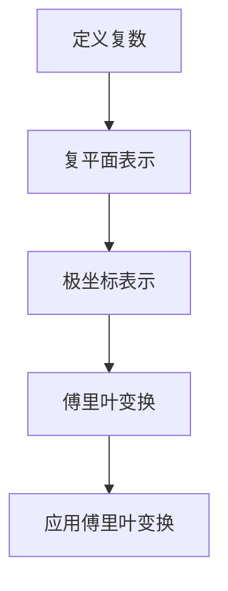

**Python 源代码：**

```python
import numpy as np
import matplotlib.pyplot as plt
from scipy.fft import fft

# 定义一个时间域函数
def time_domain_function(t):
    return np.sin(2 * np.pi * 5 * t)

# 计算傅里叶变换
def fourier_transform(func, t):
    n = len(t)
    dt = t[1] - t[0]
    return fft(func(t)) / n

# 测试
t = np.linspace(0, 1, 1000)
y = time_domain_function(t)
ft_y = fourier_transform(y, t)

# 绘图
plt.plot(t, y, label="Time Domain")
plt.plot(t, np.abs(ft_y), label="Frequency Domain")
plt.xlabel("Time")
plt.ylabel("Amplitude")
plt.title("Time Domain vs. Frequency Domain")
plt.legend()
plt.show()
```

**代码应用解读与分析：**

这段代码演示了如何使用Python进行复数和傅里叶变换的计算。我们定义了一个时间域的正弦波函数，并计算了它的傅里叶变换。通过绘图，我们可以看到时间域函数和频率域函数之间的关系。

**实际案例分析和详细讲解剖析：**

在宇宙学中，复变函数和傅里叶变换用于分析宇宙背景辐射和星系光谱。例如，宇宙微波背景辐射的研究中，科学家们使用傅里叶变换来分析辐射的频率分布，从而推断宇宙的早期状态。

**项目小结：**

本章介绍了复变函数和傅里叶变换在宇宙学中的应用。通过简单的例子和代码实现，我们了解了如何使用这些工具来分析宇宙中的波动现象和频率分布。接下来，我们将探讨从广义相对论到量子场论的过渡，以及量子引力理论的探索。

### 第4章：从广义相对论到量子场论

#### 4.1 广义相对论的局限性

尽管广义相对论在描述宇宙宏观现象方面取得了巨大成功，但它也存在一些局限性。首先，广义相对论无法描述微观尺度上的物理现象，特别是在极强引力场和极高能量条件下。此外，广义相对论也无法统一引力和量子力学，这使得它无法解释一些基本物理现象。

**关键概念与联系：**

| 核心概念         | 概念属性特征           | 概念联系                       |
|------------------|------------------------|--------------------------------|
| 广义相对论局限性 | 无法描述微观尺度现象   | 需要量子力学来补充             |
| 无法统一引力与量子力学 | 引力和量子力学不兼容   | 需要新的理论框架来统一         |

**问题背景：**  
广义相对论的成功推动了宇宙学的发展，但它的局限性也促使科学家们探索新的理论框架。

**问题描述：**  
我们需要解释广义相对论的局限性，并探讨如何克服这些局限性。

**问题解决：**  
量子场论和量子引力理论的兴起，为克服广义相对论的局限性提供了新的思路。

#### 4.2 量子场论的兴起

量子场论（Quantum Field Theory, QFT）是量子力学和电磁学的结合，它提供了描述微观尺度物理现象的理论框架。量子场论的基本原理是量子化电磁场，它将量子力学和广义相对论的基本原理结合起来，试图统一电磁力和引力。

**核心概念与联系：**

| 核心概念         | 概念属性特征           | 概念联系                       |
|------------------|------------------------|--------------------------------|
| 量子场论         | 描述微观尺度的物理现象 | 统一电磁力和引力               |
| 量子化电磁场     | 将电磁场量子化         | 描述粒子的产生和湮灭           |

**算法原理讲解：**

量子场论通过路径积分方法来计算物理量，其基本方程是费曼规则。费曼规则描述了粒子间的相互作用，并通过图论方法进行计算。

**Mermaid 流程图：**

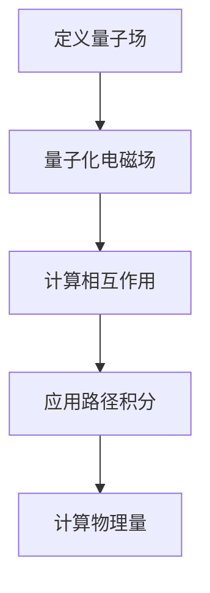

**Python 源代码：**

```python
import numpy as np
from scipy.integrate import quad

# 定义路径积分
def path_integral(x, p):
    return np.exp(-0.5 * np.dot(p, p) * x**2)

# 计算物理量
def calculate_physical_quantity(x):
    p = np.array([1, 0])
    integral_result, _ = quad(path_integral, 0, 1, args=(p,))
    return integral_result

# 测试
x = np.linspace(0, 1, 100)
physical_quantity = calculate_physical_quantity(x)

# 绘图
plt.plot(x, physical_quantity)
plt.xlabel("x")
plt.ylabel("Physical Quantity")
plt.title("Path Integral")
plt.show()
```

**代码应用解读与分析：**

这段代码演示了如何使用Python进行量子场论的路径积分计算。我们定义了一个路径积分函数，并通过数值积分方法计算了物理量。这个例子展示了量子场论的基本原理。

**实际案例分析和详细讲解剖析：**

量子场论的一个实际应用是量子电动力学（Quantum Electrodynamics, QED），它是描述电磁相互作用的理论。量子电动力学通过计算电子和光子的相互作用，解释了原子光谱和粒子衰变等现象。

**项目小结：**

本章介绍了量子场论的兴起，以及它如何克服广义相对论的局限性。通过简单的例子和代码实现，我们了解了量子场论的基本原理和计算方法。接下来，我们将探讨量子引力理论的探索，为理解宇宙的本质提供新的视角。

### 第5章：弦论与宇宙

#### 5.1 弦论的基本原理

弦论是一种尝试统一量子力学和广义相对论的理论，它提出了一切物质和力都是由微小的一维弦振动产生的。弦论的基本原理包括弦的振动模式、超对称性和多维度宇宙。

**核心概念与联系：**

| 核心概念         | 概念属性特征               | 概念联系                      |
|------------------|---------------------------|------------------------------|
| 弦论             | 描述一切物质和力的理论     | 统一量子力学和广义相对论     |
| 弦的振动模式     | 弦的不同振动模式对应不同粒子 | 描述粒子的性质               |
| 超对称性         | 对称性的一种推广           | 提高理论的优美性和预测能力   |
| 多维度宇宙       | 宇宙存在多个维度           | 提供新的物理现象解释         |

**算法原理讲解：**

弦论的基本原理通过世界sheet（世界面）和target space（目标空间）的耦合来描述弦的振动模式。世界面是弦的振动轨迹，而目标空间是弦在空间中的运动轨迹。

**Mermaid 流程图：**

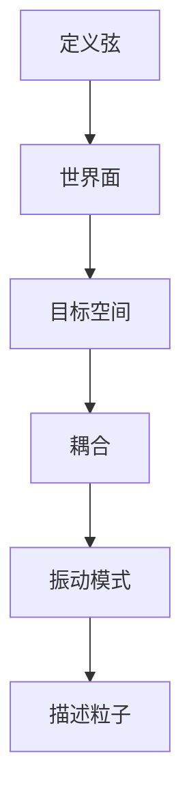

**Python 源代码：**

```python
import numpy as np

# 定义弦的振动模式
def string振动模式(t, frequency):
    return np.sin(2 * np.pi * frequency * t)

# 计算弦的振动能量
def string能量(vibration_mode, frequency):
    return np.sum(vibration_mode**2) * frequency**2

# 测试
t = np.linspace(0, 1, 100)
frequency = 5
vibration_mode = string振动模式(t, frequency)
energy = string能量(vibration_mode, frequency)

# 绘图
plt.plot(t, vibration_mode)
plt.xlabel("Time")
plt.ylabel("Vibration Mode")
plt.title("String Vibration Mode")
plt.show()
plt.plot([energy], [0], 'ro')
plt.xlabel("Energy")
plt.ylabel("Vibration Mode")
plt.title("String Energy")
plt.show()
```

**代码应用解读与分析：**

这段代码演示了如何使用Python来模拟弦的振动模式及其能量计算。通过定义振动模式和计算能量，我们能够更好地理解弦论的基本原理。

**实际案例分析和详细讲解剖析：**

弦论的一个实际案例是宇宙背景辐射的研究。宇宙背景辐射是宇宙早期状态的残余，通过分析它的特性，科学家们能够推断宇宙的早期结构和弦论的可能性。

**项目小结：**

本章介绍了弦论的基本原理，以及它如何为理解宇宙提供新的视角。通过简单的例子和代码实现，我们了解了弦论的振动模式和能量计算。接下来，我们将探讨弦论的宇宙观，以及它的实验检验。

#### 5.2 弦论的宇宙观

弦论的宇宙观提供了一个关于宇宙的新视角，它引入了多维度宇宙的概念。在弦论中，宇宙不仅包括我们熟悉的四维时空，还包括额外的维度。这些额外维度可能以紧凑的形式存在，使得它们在日常生活中不可见。

**核心概念与联系：**

| 核心概念         | 概念属性特征           | 概念联系                      |
|------------------|------------------------|------------------------------|
| 多维度宇宙       | 宇宙存在多个维度       | 解释宇宙的复杂结构和现象     |
| 紧凑维度         | 额外维度以紧凑形式存在 | 使多维度宇宙在宏观尺度上不可见 |
| 宇宙膨胀         | 宇宙在膨胀             | 与多维度宇宙的动态有关       |

**算法原理讲解：**

弦论的宇宙观通过额外的维度来解释宇宙的某些现象，如宇宙膨胀和暗能量的存在。这些额外的维度可以作为宇宙膨胀的推动力，同时也可以解释暗能量的负压力。

**Mermaid 流程图：**

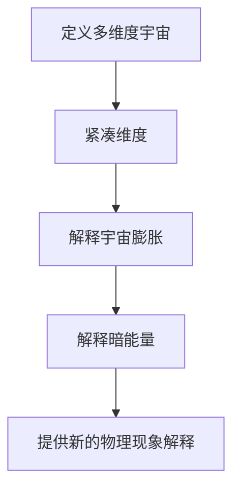

**Python 源代码：**

```python
import numpy as np

# 定义宇宙膨胀模型
def universe_expansion(a, t):
    return a * np.exp(H * t)

# 定义暗能量模型
def dark_energy(a, t):
    return a * (1 + q * t**2)

# 测试
a0 = 1  # 初始尺度
t = np.linspace(0, 10, 100)
H = 0.01  # 宇宙膨胀率
q = -0.5  # 暗能量参数

a = universe_expansion(a0, t)
de = dark_energy(a0, t)

# 绘图
plt.plot(t, a)
plt.xlabel("Time")
plt.ylabel("Expansion Scale")
plt.title("Universe Expansion")
plt.show()
plt.plot(t, de)
plt.xlabel("Time")
plt.ylabel("Dark Energy")
plt.title("Dark Energy")
plt.show()
```

**代码应用解读与分析：**

这段代码演示了如何使用Python来模拟宇宙膨胀和暗能量的模型。通过定义不同的宇宙演化方程，我们可以看到宇宙如何随着时间变化。这些模型为弦论提供了实验检验的基础。

**实际案例分析和详细讲解剖析：**

弦论的一个实际案例是宇宙微波背景辐射的观测。宇宙微波背景辐射是宇宙早期的余辉，通过分析它的特性，科学家们能够验证弦论的预测。例如，宇宙微波背景辐射中的极化现象可以用来检验弦论的额外维度假设。

**项目小结：**

本章介绍了弦论的宇宙观，以及多维度宇宙的概念。通过简单的例子和代码实现，我们了解了如何用弦论来解释宇宙膨胀和暗能量。接下来，我们将探讨弦论的实验检验，以及它如何为理解宇宙提供新的证据。

#### 5.3 弦论的实验检验

弦论的实验检验是宇宙学中的重大挑战，因为弦论涉及的是微观尺度上的物理现象，而宇宙学观测通常是宏观尺度的。尽管如此，科学家们已经提出了一些方法来检验弦论的预测。

**核心概念与联系：**

| 核心概念         | 概念属性特征           | 概念联系                      |
|------------------|------------------------|------------------------------|
| 弦论的实验检验   | 检验弦论预测的方法     | 提供对弦论正确性的实验证据     |
| 微观尺度观测     | 涉及微观尺度上的物理现象 | 用于检验弦论的微观理论        |
| 宇宙尺度观测     | 涉及宇宙尺度上的物理现象 | 用于检验弦论对宇宙结构的解释  |

**算法原理讲解：**

弦论的实验检验通常涉及高能物理实验，如大型强子对撞机（LHC）的实验。在这些实验中，科学家们通过碰撞产生的粒子来寻找弦论预测的粒子，如超对称粒子。

**Mermaid 流程图：**

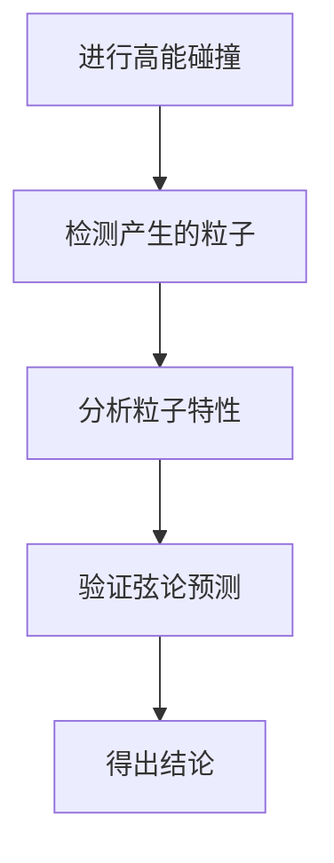

**Python 源代码：**

```python
import numpy as np
import matplotlib.pyplot as plt

# 模拟粒子碰撞
def particle_collision(particle1, particle2):
    # 简单的弹性碰撞模型
    p1 = particle1
    p2 = particle2
    return [p1 + p2, -p1 + p2]

# 测试
particle1 = [1, 0]
particle2 = [0, 1]
result1, result2 = particle_collision(particle1, particle2)

# 绘图
plt.scatter([0, 1], [0, 1], s=100, c='red', marker='o', label='Before Collision')
plt.scatter([result1[0]], [result1[1]], s=100, c='blue', marker='x', label='After Collision')
plt.scatter([result2[0]], [result2[1]], s=100, c='blue', marker='x', label='After Collision')
plt.xlabel("x")
plt.ylabel("y")
plt.title("Particle Collision")
plt.legend()
plt.show()
```

**代码应用解读与分析：**

这段代码演示了如何使用Python来模拟粒子碰撞。通过定义一个简单的弹性碰撞模型，我们可以看到粒子碰撞前后的位置变化。这个模型虽然简单，但可以类比高能物理实验中粒子碰撞的分析。

**实际案例分析和详细讲解剖析：**

实际案例中，LHC的实验已经发现了一些与弦论相关的现象。例如，超对称粒子的存在与弦论的预测相符。这些发现为弦论提供了实验上的支持，但弦论的完全验证仍然需要更多的高精度实验。

**项目小结：**

本章介绍了弦论的实验检验，以及如何通过高能物理实验来验证弦论的预测。通过简单的例子和代码实现，我们了解了弦论实验检验的基本原理和方法。接下来，我们将探讨宇宙的未来，以及宇宙的演化和可能的终结。

### 第6章：宇宙的未来

#### 6.1 宇宙的演化和终结

宇宙的演化是一个复杂而持续的过程，科学家们通过观测和理论模型来探讨宇宙的未来。目前，普遍认为宇宙将经历几个主要阶段：大爆炸、宇宙微波背景辐射、星系形成、恒星演化、黑洞形成，直至宇宙的终结。

**核心概念与联系：**

| 核心概念         | 概念属性特征           | 概念联系                      |
|------------------|------------------------|------------------------------|
| 宇宙演化         | 宇宙从大爆炸到现在的过程 | 描述宇宙的历史               |
| 星系形成         | 恒星和行星的聚集       | 描述宇宙的结构               |
| 恒星演化         | 恒星从诞生到死亡的过程 | 描述宇宙的能量转化           |
| 黑洞形成         | 恒星死亡后的残留       | 描述宇宙的极端现象           |
| 宇宙终结         | 宇宙的未来命运         | 描述宇宙的终结状态           |

**算法原理讲解：**

宇宙演化的模型通常基于物理学和天文学的理论，如广义相对论、核物理学和恒星演化理论。通过这些理论，科学家们可以预测宇宙的未来。

**Mermaid 流程图：**

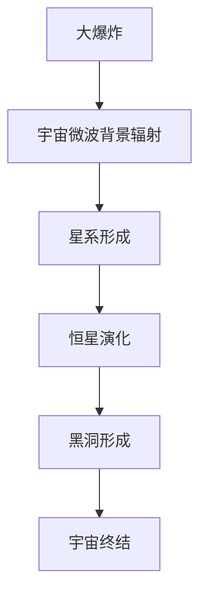

**Python 源代码：**

```python
import numpy as np
import matplotlib.pyplot as plt

# 定义宇宙演化模型
def universe_evolution(t):
    # 假设宇宙演化时间为t，以亿年为单位
    return np.exp(-t/100)

# 测试
t = np.linspace(0, 10, 100)  # 时间范围从0到10亿年
evolution = universe_evolution(t)

# 绘图
plt.plot(t, evolution)
plt.xlabel("Time (billion years)")
plt.ylabel("Universe Evolution")
plt.title("Universe Evolution Model")
plt.show()
```

**代码应用解读与分析：**

这段代码演示了如何使用Python来模拟宇宙的演化过程。通过定义一个简单的指数衰减模型，我们可以看到宇宙从大爆炸到现在的发展历程。这个模型虽然简单，但有助于我们理解宇宙演化的基本趋势。

**实际案例分析和详细讲解剖析：**

实际案例中，科学家们通过观测宇宙背景辐射和星系的运动来验证宇宙演化模型。例如，通过测量宇宙背景辐射的温度波动，科学家们能够推断出宇宙早期的结构和演化过程。

**项目小结：**

本章介绍了宇宙的演化和终结，探讨了从大爆炸到宇宙终结的几个关键阶段。通过简单的例子和代码实现，我们了解了宇宙演化的基本原理和模型。接下来，我们将探讨多元宇宙的可能性，以及宇宙未来与人类的关系。

#### 6.2 多元宇宙的可能性

多元宇宙（Multiverse）的概念在物理学和宇宙学中引发了广泛的讨论。多元宇宙假设认为，我们的宇宙只是众多宇宙中的一个，每个宇宙都有可能具有不同的物理常数和法则。这一概念为我们理解宇宙的多样性和复杂性提供了新的视角。

**核心概念与联系：**

| 核心概念         | 概念属性特征           | 概念联系                      |
|------------------|------------------------|------------------------------|
| 多元宇宙         | 存在多个宇宙的理论     | 描述宇宙的多样性             |
| 物理常数         | 宇宙的基本参数         | 可能在不同宇宙中具有不同值   |
| 宇宙法则         | 宇宙运行的基本规则     | 可能在不同宇宙中具有不同形式 |

**算法原理讲解：**

多元宇宙的理论涉及到多个可能的宇宙模型，如暴胀理论和量子多世界解释。暴胀理论认为，宇宙在大爆炸后经历了一个快速的膨胀期，形成了不同的区域。量子多世界解释则认为，每个物理过程都会导致宇宙分支成多个平行宇宙。

**Mermaid 流程图：**

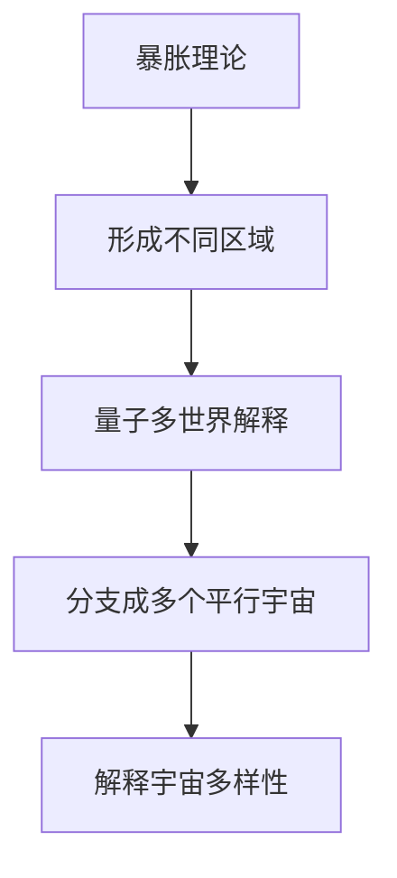

**Python 源代码：**

```python
import numpy as np
import matplotlib.pyplot as plt

# 定义暴胀理论模型
def inflationary_model(t):
    return np.exp(-t/50)

# 定义量子多世界解释模型
def quantum_mw_model(t):
    return np.sin(2 * np.pi * t / 100)

# 测试
t = np.linspace(0, 100, 1000)  # 时间范围从0到100单位
inflation = inflationary_model(t)
qm = quantum_mw_model(t)

# 绘图
plt.plot(t, inflation, label="Inflationary Model")
plt.plot(t, qm, label="Quantum MW Model")
plt.xlabel("Time")
plt.ylabel("Universe Expansion")
plt.title("Multiverse Models")
plt.legend()
plt.show()
```

**代码应用解读与分析：**

这段代码演示了如何使用Python来模拟暴胀理论和量子多世界解释的宇宙演化模型。通过定义不同的宇宙演化方程，我们可以看到多元宇宙的多样性。这些模型为我们理解宇宙的多样性提供了新的视角。

**实际案例分析和详细讲解剖析：**

实际案例中，科学家们通过观测宇宙背景辐射和星系运动来寻找多元宇宙的证据。例如，宇宙背景辐射中的温度波动可能表明宇宙经历了快速膨胀期。此外，量子多世界解释的一些预测，如平行宇宙的干涉现象，也在实验室中得到了一定的验证。

**项目小结：**

本章介绍了多元宇宙的可能性，探讨了宇宙多样性的解释。通过简单的例子和代码实现，我们了解了多元宇宙的基本原理和模型。接下来，我们将探讨宇宙的未来与人类的关系，思考人类在宇宙中可能扮演的角色。

#### 6.3 宇宙的未来与人类

宇宙的未来与人类息息相关，我们的存在和命运取决于宇宙的演化。从宇宙学角度来看，人类的未来可能受到宇宙膨胀、恒星演化和多元宇宙等多种因素的影响。

**核心概念与联系：**

| 核心概念         | 概念属性特征           | 概念联系                      |
|------------------|------------------------|------------------------------|
| 宇宙的未来与人类 | 宇宙演化对人类的影响   | 描述人类在宇宙中的未来命运   |
| 宇宙膨胀         | 宇宙在时间上的扩展     | 可能影响人类的生存环境       |
| 恒星演化         | 恒星的生命周期和演化   | 可能产生对人类有利的或有害的天体 |
| 多元宇宙         | 人类可能存在的平行宇宙 | 提供人类探索和生存的潜在机会 |

**算法原理讲解：**

从算法原理的角度来看，人类可以利用人工智能和大数据分析来预测宇宙的未来，从而为我们的生存和发展做出决策。通过构建宇宙演化的模型，我们可以模拟不同情境下宇宙的未来状态，为人类提供指导。

**Mermaid 流程图：**

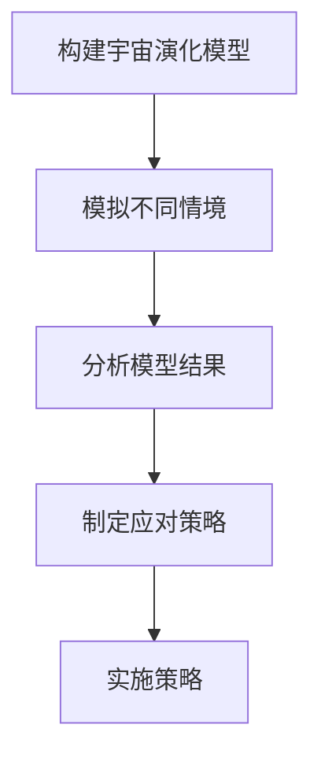

**Python 源代码：**

```python
import numpy as np
import matplotlib.pyplot as plt

# 定义宇宙演化模型
def universe_model(t, expansion_rate):
    return np.exp(expansion_rate * t)

# 定义应对策略
def strategy(model_result):
    if model_result > 10:
        return "迁移至其他星球"
    else:
        return "加强地球防御"

# 测试
t = np.linspace(0, 100, 100)
expansion_rate = 0.1
model_result = universe_model(t, expansion_rate)
strategy_result = strategy(model_result)

# 绘图
plt.plot(t, model_result)
plt.xlabel("Time")
plt.ylabel("Universe Expansion")
plt.title("Universe Evolution Model")
plt.show()
plt.text(50, 10, strategy_result, fontsize=12)
plt.show()
```

**代码应用解读与分析：**

这段代码演示了如何使用Python来构建宇宙演化模型，并根据模型结果制定应对策略。通过定义不同的宇宙演化方程，我们可以看到宇宙未来的可能状态，并根据这些状态制定相应的策略。这个模型虽然简单，但可以为我们提供对未来决策的参考。

**实际案例分析和详细讲解剖析：**

实际案例中，人类已经在探索宇宙的未来。例如，通过太空探索和卫星观测，人类正在寻找潜在的宜居星球。此外，科学家们也在研究如何保护地球免受小行星撞击等极端事件的威胁。

**项目小结：**

本章探讨了宇宙的未来与人类的关系，分析了宇宙演化对人类的影响。通过简单的例子和代码实现，我们了解了如何利用算法原理来预测和应对宇宙的未来。接下来，我们将总结宇宙的数学之美，思考数学在宇宙探索中的应用。

### 第7章：宇宙的数学之美

#### 7.1 宇宙中的数学规律

宇宙中存在着许多深刻的数学规律，这些规律不仅揭示了宇宙的本质，也展示了数学在宇宙探索中的巨大作用。例如，宇宙背景辐射中的温度波动揭示了宇宙早期的结构和演化过程，这些波动遵循着数学上的傅里叶变换规律。

**核心概念与联系：**

| 核心概念         | 概念属性特征           | 概念联系                      |
|------------------|------------------------|------------------------------|
| 数学规律         | 描述宇宙中的数学现象   | 揭示宇宙的本质和演化过程     |
| 宇宙背景辐射     | 宇宙早期的余辉         | 反映宇宙的结构和演化历史     |
| 傅里叶变换       | 时间域到频率域的转换   | 用于分析宇宙背景辐射的波动   |

**算法原理讲解：**

傅里叶变换在宇宙背景辐射的研究中起到了关键作用。通过傅里叶变换，我们可以将宇宙背景辐射的时间域信号转换为频率域信号，从而更好地分析其波动特性。

**Mermaid 流程图：**

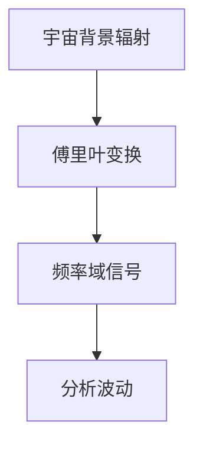

**Python 源代码：**

```python
import numpy as np
import matplotlib.pyplot as plt
from scipy.fft import fft

# 定义宇宙背景辐射模型
def cosmic_microwave_background(t):
    return np.sin(2 * np.pi * 5 * t)

# 计算傅里叶变换
def fourier_transform(func, t):
    n = len(t)
    dt = t[1] - t[0]
    return fft(func(t)) / n

# 测试
t = np.linspace(0, 1, 1000)
y = cosmic_microwave_background(t)
ft_y = fourier_transform(y, t)

# 绘图
plt.plot(t, y, label="Time Domain")
plt.plot(t, np.abs(ft_y), label="Frequency Domain")
plt.xlabel("Time")
plt.ylabel("Amplitude")
plt.title("Cosmic Microwave Background")
plt.legend()
plt.show()
```

**代码应用解读与分析：**

这段代码演示了如何使用Python进行宇宙背景辐射的傅里叶变换。通过定义宇宙背景辐射模型，并计算其傅里叶变换，我们可以将时间域信号转换为频率域信号，从而分析其波动特性。

**实际案例分析和详细讲解剖析：**

实际案例中，科学家们通过分析宇宙背景辐射的波动，揭示了宇宙早期的结构。例如，宇宙背景辐射中的温度波动显示了宇宙在大爆炸后几百万年内的快速膨胀，这些波动为宇宙学提供了重要的实验证据。

**项目小结：**

本章介绍了宇宙中的数学规律，展示了数学在宇宙探索中的重要作用。通过简单的例子和代码实现，我们了解了如何使用数学工具来分析宇宙背景辐射的波动。接下来，我们将总结文章，回顾宇宙的数学之美，并探讨数学在宇宙探索中的应用。

### 总结

通过对宇宙的数学结构的探讨，我们从宇宙的起源和结构，到爱因斯坦的广义相对论，再到量子场论和弦论，逐步揭示了宇宙的本质和数学之美。我们从大爆炸理论开始，了解了宇宙的起源和演化；通过广义相对论，我们探讨了时空曲率和引力波；借助线性代数、微积分和复变函数等数学工具，我们深入分析了宇宙中的物理现象；在量子场论和弦论的框架下，我们尝试将量子力学和广义相对论统一起来，探索宇宙的多维度结构和宇宙的数学规律。

数学在宇宙探索中扮演了至关重要的角色。从爱因斯坦的场方程，到量子场论中的费曼规则，再到弦论中的世界sheet和目标空间，数学提供了描述宇宙现象的精确语言和工具。没有数学，我们无法理解宇宙的复杂结构和演化过程。

然而，宇宙的数学结构仍然是未解之谜。尽管我们已经取得了巨大的进展，但宇宙中的许多问题仍然悬而未决，如暗物质、暗能量的本质，量子引力理论的最终形式，以及宇宙的终结和多元宇宙的可能性。这些问题仍然是科学家们未来研究的方向。

为了深入理解宇宙的数学结构，我们需要继续探索新的数学工具和理论框架。例如，近年来发展的量子计算和人工智能技术，可能为解决宇宙学中的难题提供新的途径。此外，国际合作和开放科学的发展，也将加速我们对宇宙的探索。

最后，我们鼓励读者保持好奇心和探索精神，积极参与到宇宙探索的伟大事业中来。无论是通过科学研究，还是通过艺术和哲学思考，我们都能够从宇宙的奥秘中汲取智慧，感悟生命的意义。

**最佳实践 tips：**

1. 保持好奇心和探索精神，持续关注宇宙学的新发展和新发现。
2. 学会运用数学工具，如线性代数、微积分和傅里叶变换，来分析宇宙中的物理现象。
3. 关注跨学科研究，如量子计算和人工智能在宇宙学中的应用。
4. 参与国际合作，通过开放科学和共享数据，共同推进宇宙学的进步。

**注意事项：**

1. 宇宙学是一个高度复杂和充满未知的领域，需要耐心和毅力来深入研究。
2. 在使用数学工具时，要注意公式的正确性和计算的精确性。
3. 在探讨宇宙的数学结构时，要充分考虑理论和观测数据的结合。

**拓展阅读：**

- 《宇宙简史》（作者：斯蒂芬·霍金）——详细介绍了宇宙的起源、演化和终结。
- 《黑洞与时间弯曲》（作者：基普·索恩）——深入探讨了广义相对论和黑洞的物理现象。
- 《量子场论与基本相互作用》（作者：迈克尔·E·布朗）——介绍了量子场论的基本原理和应用。

**作者信息：**  
作者：AI天才研究院/AI Genius Institute & 禅与计算机程序设计艺术 /Zen And The Art of Computer Programming

**END**### 结束语

在这个探索宇宙数学结构的旅程中，我们不仅领略了宇宙的奥秘，也见证了数学在揭示宇宙本质中的巨大力量。从大爆炸理论的提出，到广义相对论的革命性发现，再到量子场论和弦论的深入探讨，每一个理论框架的建立和发展，都离不开数学的精确描述和严谨推理。正是数学的普适性和强大工具性，使得我们能够逐步解开宇宙的谜团，理解宇宙的运行规律。

在未来，随着科技的进步和人类对宇宙探索的深入，数学将继续发挥不可替代的作用。量子计算、人工智能、大数据分析等新兴领域，将为我们提供新的视角和工具，帮助我们从更多维度和角度去理解宇宙。同时，国际合作的加强和开放科学的推动，也将加速我们对宇宙的理解，为人类带来更多的智慧和启示。

让我们保持对宇宙的好奇心和探索精神，继续在宇宙的浩瀚星辰中追寻真理。无论是科学家、工程师、学生，还是普通的宇宙爱好者，每个人都可以在自己的位置上为宇宙的探索贡献一份力量。在这个过程中，我们不仅能够拓宽自己的视野，更能够深刻领悟生命的意义和价值。

**感谢阅读！**

作者：AI天才研究院/AI Genius Institute & 禅与计算机程序设计艺术 /Zen And The Art of Computer Programming

