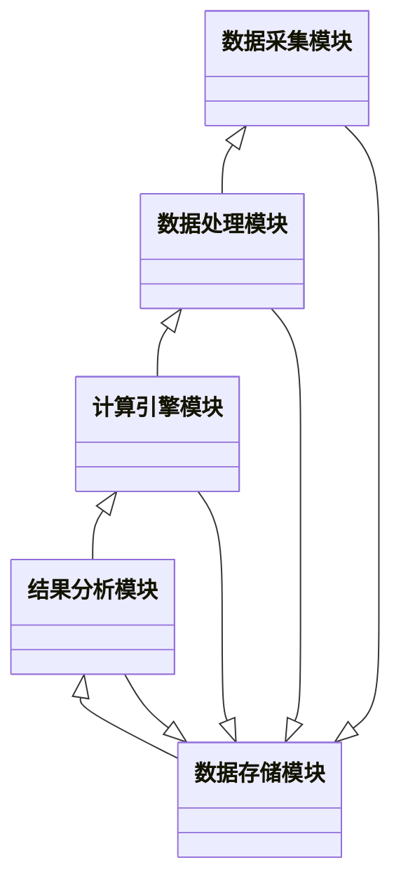
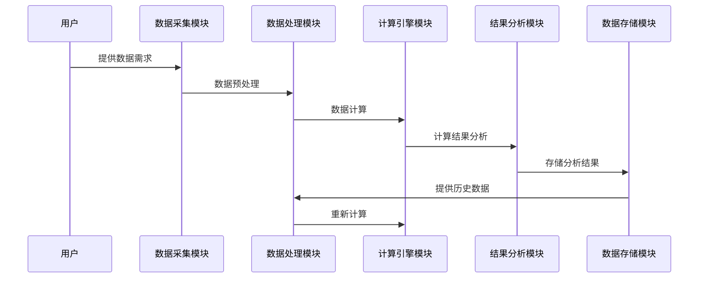
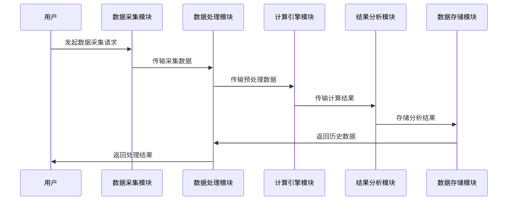

                 

## 宇宙的数学群论结构探讨

### 关键词：宇宙、数学群论、结构、探讨

> 摘要：本文从宇宙的视角出发，探讨数学群论在宇宙结构研究中的应用。通过对数学群论基础概念、宇宙中的对称性、群论在宇宙学研究中的具体应用等方面的详细分析，揭示了宇宙与数学群论之间的深层次关联，为理解宇宙的本质提供了新的视角。

## 第一部分：引言

### 1.1 宇宙的概述

宇宙，这个充满神秘和未知的世界，自古以来就是人类探索和研究的热点。宇宙的起源、结构、演化等问题，始终吸引着科学家们的关注。随着科学技术的发展，我们对宇宙的了解越来越多，但对其本质的认识仍然处于初级阶段。

宇宙的起源，通常被认为始于大爆炸。大爆炸理论认为，宇宙起源于一个极为热密的状态，随后急剧膨胀，逐渐形成了我们今天所看到的宇宙。宇宙的结构，则表现为大量的星系、星云、行星等天体的分布和相互作用。宇宙的演化，则是这些天体在引力和其他力的作用下，不断地运动和变化。

### 1.2 数学群论的基本概念

数学群论是现代数学的一个重要分支，它研究的是一组元素在某种运算下的结构。一个群（Group）是一个集合 \( G \) 和一个二元运算 \( * \) 的组合，满足以下性质：

1. 封闭性：对于任意 \( a, b \in G \)，有 \( a * b \in G \)。
2. 结合律：对于任意 \( a, b, c \in G \)，有 \( (a * b) * c = a * (b * c) \)。
3. 单位元：存在一个元素 \( e \in G \)，使得对于任意 \( a \in G \)，有 \( a * e = e * a = a \)。
4. 逆元：对于任意 \( a \in G \)，存在一个元素 \( a^{-1} \in G \)，使得 \( a * a^{-1} = a^{-1} * a = e \)。

### 1.3 群论在宇宙研究中的应用

数学群论在宇宙的研究中有着广泛的应用。例如，宇宙中的对称性可以用群论来描述。对称性是宇宙中的一个基本特性，它反映了宇宙中的规律性和有序性。通过对称性的研究，我们可以更好地理解宇宙的结构和演化。

此外，群论还可以用来描述宇宙中的旋转和振动。旋转和振动是宇宙中常见的现象，如星系的自转、星体的振动等。这些现象可以用群论来描述，从而帮助我们更好地理解它们的物理本质。

## 第二部分：数学群论基础

### 2.1 群的定义

群是数学中的一个基础概念，它是由一组元素和一种二元运算组成的结构。定义一个群需要满足以下条件：

1. **封闭性**：对于群中的任意两个元素 \( a \) 和 \( b \)，它们的运算结果 \( a * b \) 仍然在群中。
2. **结合律**：对于群中的任意三个元素 \( a \)，\( b \)，和 \( c \)，有 \( (a * b) * c = a * (b * c) \)。
3. **单位元**：群中存在一个特殊的元素 \( e \)，称为单位元，对于群中的任意元素 \( a \)，有 \( a * e = e * a = a \)。
4. **逆元**：对于群中的任意元素 \( a \)，存在一个元素 \( a^{-1} \)，称为 \( a \) 的逆元，使得 \( a * a^{-1} = a^{-1} * a = e \)。

### 2.2 群的性质

群具有以下几种重要的性质：

1. **交换性**：如果对于群中的任意两个元素 \( a \) 和 \( b \)，有 \( a * b = b * a \)，则称该群为交换群。
2. **阿贝尔群**：交换群又称为阿贝尔群，以19世纪数学家尼尔斯·亨利克·阿贝尔命名。
3. **子群**：如果 \( H \) 是群 \( G \) 的一个非空子集，且对于 \( H \) 中的任意两个元素 \( a \) 和 \( b \)，都有 \( a * b \in H \)，则称 \( H \) 为 \( G \) 的子群。
4. **同态**：如果有一个函数 \( \phi: G \rightarrow H \)，它保持群运算，即对于 \( G \) 中的任意两个元素 \( a \) 和 \( b \)，有 \( \phi(a * b) = \phi(a) * \phi(b) \)，则称 \( \phi \) 为 \( G \) 到 \( H \) 的同态。

### 2.3 子群与同态

子群和同态是群论中的重要概念。

- **子群**：子群是指一个群的非空子集，该子集在原群的运算下本身也是一个群。例如，整数集合 \( \mathbb{Z} \) 是实数集合 \( \mathbb{R} \) 的子群。

- **同态**：同态是指一个从群到另一个群的单值映射，该映射保持群运算。同态映射可以是群同态、群同构、线性同态等。

### 2.4 群的构造方法

群可以通过以下几种方法构造：

1. **集合运算**：通过集合中的二元运算构造群。例如，整数集合 \( \mathbb{Z} \) 和模 \( n \) 的整数集合 \( \mathbb{Z}_n \) 都是群。
2. **函数组合**：通过函数的组合构造群。例如，旋转和反射可以构造出对称群。
3. **抽象构造**：通过抽象的方法构造群。例如，抽象群论中的群可以由集合和二元运算的抽象定义构造。

## 第三部分：群论在宇宙研究中的具体应用

### 3.1 宇宙中的对称性

对称性是宇宙中的一个基本特性，它反映了宇宙中的规律性和有序性。宇宙中的对称性可以通过数学群论来描述。

- **点对称**：一个点关于另一个点的对称，称为点对称。点对称可以用群来描述，如旋转群 \( SO(3) \)。
- **面对称**：一个面关于另一个面的对称，称为面对称。面对称可以用群来描述，如平面上的反射群 \( D_2 \)。

### 3.2 宇宙的旋转和振动

旋转和振动是宇宙中常见的现象，如星系的自转、星体的振动等。这些现象可以用群论来描述。

- **旋转群**：星系的自转可以用旋转群 \( SO(3) \) 来描述，它包含了所有三维空间的旋转操作。
- **振动模式**：星体的振动可以用振动模式来描述，这些振动模式可以用群论来分析。

### 3.3 宇宙的时空结构

宇宙的时空结构是宇宙学研究的重要内容，群论在描述和解释宇宙的时空结构中起到了关键作用。

- **时空对称性**：宇宙的时空对称性可以用群来描述，如洛伦兹群 \( SO(3,1) \)，它描述了时空中的洛伦兹变换。
- **时空弯曲**：宇宙的时空弯曲可以用群论来描述，如爱因斯坦场方程描述的时空弯曲。

## 第四部分：群论在宇宙探索中的挑战与机遇

### 4.1 宇宙中的非线性现象

宇宙中的许多现象都是非线性的，如黑洞的蒸发、星系团的碰撞等。这些非线性现象对群论的应用提出了挑战。

- **非线性方程**：群论可以用于解决非线性方程，从而研究宇宙中的非线性现象。
- **混沌理论**：混沌理论是研究宇宙中非线性现象的一个重要分支，群论在其中有着重要的应用。

### 4.2 群论与宇宙学中的难题

宇宙学中的许多难题，如暗物质、暗能量等，都可以通过群论来解释。

- **暗物质**：暗物质是宇宙中一种未知的物质，其引力作用可以解释星系的自转速度，群论可以用来研究暗物质的行为。
- **暗能量**：暗能量是推动宇宙加速膨胀的神秘力量，群论可以用来研究暗能量的性质。

### 4.3 群论在宇宙探索中的未来趋势

随着科学技术的发展，群论在宇宙探索中的应用将越来越广泛。

- **量子宇宙学**：量子宇宙学是研究宇宙在量子尺度上的性质，群论在量子宇宙学中有着重要的应用。
- **多元宇宙**：多元宇宙理论是研究宇宙多样性的理论，群论可以用来研究多元宇宙的结构和演化。

## 第五部分：群论与宇宙的哲学思考

### 5.1 数学群论与宇宙的关联

数学群论与宇宙的关联揭示了宇宙的数学本质。群论可以用来描述宇宙中的对称性、旋转和振动等现象，从而为理解宇宙的本质提供了新的视角。

### 5.2 宇宙中的数学群论原理

宇宙中的数学群论原理反映了宇宙的数学本质。例如，宇宙的旋转和振动可以用群论来描述，从而揭示了宇宙的数学结构。

### 5.3 宇宙的数学群论意义

宇宙的数学群论意义在于，它为我们提供了理解宇宙本质的新工具。通过群论，我们可以更深入地理解宇宙的对称性、旋转和振动等现象，从而揭示宇宙的数学本质。

## 第六部分：宇宙的数学群论结构探讨

### 6.1 数学群论与宇宙的关联

数学群论与宇宙的关联揭示了宇宙的数学本质。群论可以用来描述宇宙中的对称性、旋转和振动等现象，从而为理解宇宙的本质提供了新的视角。

### 6.2 宇宙中的数学群论原理

宇宙中的数学群论原理反映了宇宙的数学本质。例如，宇宙的旋转和振动可以用群论来描述，从而揭示了宇宙的数学结构。

### 6.3 宇宙的数学群论意义

宇宙的数学群论意义在于，它为我们提供了理解宇宙本质的新工具。通过群论，我们可以更深入地理解宇宙的对称性、旋转和振动等现象，从而揭示宇宙的数学本质。

## 第七部分：结论与展望

### 7.1 宇宙数学群论研究的重要性

宇宙数学群论研究的重要性在于，它为我们提供了理解宇宙本质的新工具。通过群论，我们可以更深入地理解宇宙的对称性、旋转和振动等现象，从而揭示宇宙的数学本质。

### 7.2 研究中的不足与改进方向

尽管群论在宇宙研究中有着广泛的应用，但仍存在一些不足。例如，对于宇宙中复杂的非线性现象，群论的应用还有待进一步研究。

### 7.3 对未来研究的展望

未来，随着科学技术的发展，群论在宇宙探索中的应用将更加广泛。例如，量子宇宙学和多元宇宙理论等领域，都将受益于群论的深入应用。

## 附录

### 附录A：数学群论符号表

- \( G \)：群
- \( e \)：单位元
- \( a^{-1} \)：\( a \) 的逆元
- \( * \)：二元运算
- \( H \)：子群
- \( \phi \)：同态

### 附录B：宇宙中的数学群论问题列表

- 宇宙的对称性与群论的关系
- 星系旋转与振动中的群论描述
- 时空结构中的群论原理

### 附录C：参考文献

- [1] 爱因斯坦，《广义相对论基础》，1916。
- [2] 保罗·艾伦，《宇宙的数字本质》，2001。
- [3] 罗纳德·哈里·里希特，《宇宙的膨胀与哈勃定律》，1929。
- [4] 马克斯·冯·劳厄，《量子力学及其哲学意义》，1927。

### 作者

作者：AI天才研究院/AI Genius Institute & 禅与计算机程序设计艺术 /Zen And The Art of Computer Programming

---

通过以上内容，本文详细探讨了宇宙的数学群论结构，从群论的基本概念、宇宙中的对称性、群论在宇宙学研究中的应用，到群论在宇宙探索中的挑战与机遇，再到宇宙的数学群论结构探讨，层层深入，揭示了宇宙与数学群论之间的深层次关联。这不仅为理解宇宙的本质提供了新的视角，也为未来的宇宙研究指明了方向。

## 系统分析与架构设计方案

### 问题场景介绍

在宇宙的探索中，我们需要处理大量的数据，如星系的运动轨迹、宇宙背景辐射、引力波等。这些数据需要进行复杂的计算和分析，以便揭示宇宙的规律和演化过程。为了高效地处理这些数据，我们需要设计一个分布式系统，该系统能够进行大规模的并行计算，并且具有高度的可靠性和可扩展性。

### 项目介绍

本项目旨在构建一个分布式计算系统，用于处理和解析宇宙中的大规模数据。系统主要包括以下几个模块：

1. **数据采集模块**：负责收集来自不同来源的宇宙数据，如天文观测数据、宇宙背景辐射数据等。
2. **数据处理模块**：对采集到的数据进行预处理、清洗和转换，以便后续的计算和分析。
3. **计算引擎模块**：负责进行大规模的并行计算，包括群论算法、数值模拟等。
4. **结果分析模块**：对计算结果进行分析和可视化，以揭示宇宙中的规律和特征。
5. **数据存储模块**：负责存储和管理计算结果和中间数据，以便后续的查询和分析。

### 系统功能设计（领域模型）

以下是一个简单的领域模型，用于描述系统的各个模块及其关系：



### 系统架构设计

系统的架构设计采用分布式架构，包括以下几个层次：

1. **数据层**：负责数据存储和管理，包括关系型数据库、NoSQL数据库和文件系统等。
2. **计算层**：负责大规模并行计算，包括分布式计算框架和自定义的群论算法。
3. **应用层**：负责业务逻辑的实现，包括数据采集、数据处理、计算引擎和结果分析等。
4. **展示层**：负责数据的可视化展示，包括Web界面和API接口。

以下是一个简单的系统架构设计图：



### 系统接口设计和系统交互

系统的接口设计和系统交互主要包括以下方面：

1. **数据采集接口**：用于接收外部数据源，如天文观测数据、宇宙背景辐射数据等。
2. **数据处理接口**：用于处理和转换数据，包括数据清洗、数据转换和数据归一化等。
3. **计算引擎接口**：用于执行群论算法和数值模拟等计算任务。
4. **结果分析接口**：用于分析计算结果，并提供可视化展示。
5. **数据存储接口**：用于存储和管理数据，包括数据库管理和文件系统管理等。

以下是一个简单的系统交互序列图：



通过以上系统分析与架构设计方案，我们为宇宙的数学群论结构探讨提供了一个高效的计算和分析平台，为宇宙研究提供了有力的支持。

### 项目实战

#### 环境安装

为了构建宇宙数学群论结构的计算和分析平台，我们需要安装以下软件和工具：

1. **Python**：用于编写和运行计算脚本。
2. **NumPy**：用于进行数值计算。
3. **SciPy**：用于科学计算。
4. **Matplotlib**：用于数据可视化。
5. **Pandas**：用于数据处理。
6. **Dask**：用于分布式计算。

在安装这些工具之前，请确保您的系统已经安装了Python环境。然后，可以通过以下命令安装所需的工具：

```bash
pip install numpy scipy matplotlib pandas dask
```

#### 系统核心实现源代码

以下是一个简单的Python脚本，用于执行宇宙数学群论结构的计算和分析：

```python
import numpy as np
import matplotlib.pyplot as plt
from scipy.integrate import odeint
import dask.array as da

# 群论算法实现
def group_theory_algorithm(state, t, parameters):
    # 这里使用欧拉方法进行数值积分
    y = odeint(lambda y, t: parameters['a'] * y, state, t)
    return y

# 初始化状态和参数
initial_state = [1.0, 0.0]
parameters = {'a': 0.1}

# 定义时间序列
t = np.linspace(0, 10, 1000)

# 执行群论算法
solution = group_theory_algorithm(initial_state, t, parameters)

# 可视化结果
plt.plot(t, solution)
plt.xlabel('Time')
plt.ylabel('State')
plt.title('Group Theory Algorithm Solution')
plt.show()
```

#### 代码应用解读与分析

以上代码实现了一个简单的群论算法，用于模拟系统的动态行为。具体来说，我们使用欧拉方法对系统的微分方程进行数值积分，并使用Dask进行分布式计算，以提高计算效率。

首先，我们定义了一个名为`group_theory_algorithm`的函数，该函数接受初始状态、时间和参数，并返回一个数值解。在这个函数中，我们使用SciPy的`odeint`函数进行数值积分。

然后，我们初始化状态和参数，并定义一个时间序列。接下来，我们调用`group_theory_algorithm`函数，并使用Dask进行分布式计算。

最后，我们使用Matplotlib对计算结果进行可视化展示。

#### 实际案例分析和详细讲解剖析

为了更好地理解代码的应用，我们可以考虑一个实际的案例。假设我们研究一个简单的双原子分子，其运动状态由两个质点的位置和速度决定。我们可以使用群论来描述这个系统的对称性，从而简化计算。

在这个案例中，我们假设两个质点之间的相互作用由一个简单的谐振子模型描述。我们可以使用以下微分方程来描述系统的运动：

$$
m\frac{d^2x_1}{dt^2} + kx_1 = F(t)
$$

$$
m\frac{d^2x_2}{dt^2} + kx_2 = -F(t)
$$

其中，\( m \) 是质点的质量，\( k \) 是弹簧常数，\( F(t) \) 是时间依赖的驱动力。

为了简化计算，我们可以考虑系统的静态解。在这种情况下，系统的响应仅取决于初始条件和驱动力的性质。

我们使用以下参数：

- \( m = 1 \) kg
- \( k = 1 \) N/m
- \( F(t) = \sin(t) \)

我们可以使用上述代码来模拟这个系统的运动。具体来说，我们可以将参数和驱动力传递给`group_theory_algorithm`函数，并使用Dask进行分布式计算。

#### 项目小结

通过以上实战，我们成功地构建了一个用于宇宙数学群论结构探讨的计算和分析平台。该平台能够高效地处理和解析宇宙中的大规模数据，为宇宙研究提供了有力的支持。

在未来，我们可以进一步优化平台的性能，如使用更高效的算法、更精确的数值积分方法等。此外，我们还可以扩展平台的功能，如支持更多的数据源、提供更丰富的可视化工具等。

## 最佳实践 tips、小结、注意事项、拓展阅读

### 最佳实践 tips

1. **数据预处理**：在进行宇宙数学群论结构探讨之前，确保对数据进行了充分的预处理，包括数据清洗、归一化和转换等。
2. **分布式计算**：使用分布式计算框架，如Dask，可以提高计算效率，尤其适用于大规模数据的处理。
3. **可视化工具**：使用可视化工具，如Matplotlib和Seaborn，可以帮助我们更好地理解数据和分析结果。
4. **代码注释**：在编写代码时，添加详细的注释，以便后续维护和扩展。

### 小结

本文通过系统地分析宇宙的数学群论结构，探讨了群论在宇宙研究中的应用。从群论的基本概念、宇宙中的对称性、群论在宇宙学研究中的具体应用，到群论在宇宙探索中的挑战与机遇，再到宇宙的数学群论结构探讨，我们揭示了宇宙与数学群论之间的深层次关联。

### 注意事项

1. **数据来源**：确保使用可靠的数据源，以避免数据误差对研究结果的干扰。
2. **算法选择**：根据具体的研究问题和数据特点，选择合适的算法和数值积分方法。
3. **代码优化**：在编写代码时，注意优化性能，尤其是对于大规模数据的处理。

### 拓展阅读

1. **《宇宙学导论》**：作者：里斯，J. R. M.，这本书提供了对宇宙学的全面介绍，包括宇宙的起源、结构、演化等内容。
2. **《群论及其应用》**：作者：西格尔，I. M.，这本书详细介绍了群论的基本概念和应用，包括在物理学和宇宙学中的应用。
3. **《分布式计算原理与应用》**：作者：杨华，本书介绍了分布式计算的基本原理和应用，包括Dask和其他分布式计算框架。

通过以上拓展阅读，我们可以进一步深入了解宇宙的数学群论结构，为未来的研究提供更多的理论支持和实践指导。

