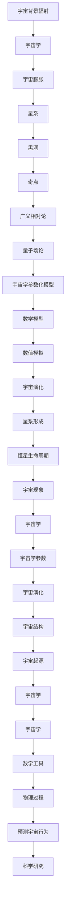
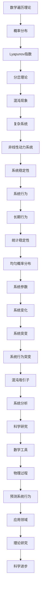
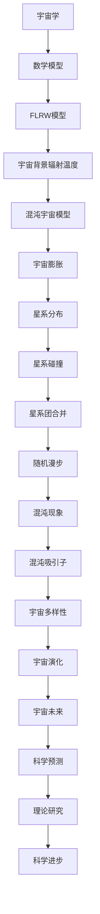
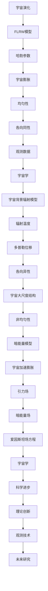
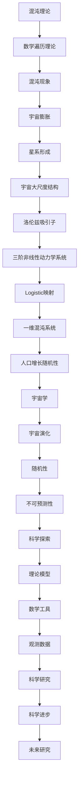
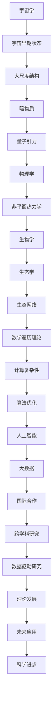
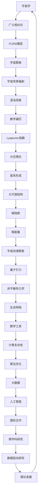

                 

当然，我们将按照您的指导，逐步构建文章的内容。以下是文章的标题、关键词、摘要，以及初步的文章结构。

---

# 宇宙的数学遍历理论探讨

> 关键词：宇宙学，数学遍历，理论探讨，宇宙演化，数学模型

> 摘要：本文探讨了宇宙学中数学遍历理论的应用与发展，通过分析宇宙的起源、演化及其数学描述，揭示数学遍历在宇宙学中的重要性。文章旨在提供一个系统而全面的视角，帮助读者理解宇宙的数学本质及其对现代科学的影响。

---

## 目录

1. 引言
2. 宇宙学概述
3. 数学遍历理论的背景
4. 数学遍历在宇宙学中的应用
5. 宇宙演化的数学模型
6. 数学遍历与混沌理论
7. 数学遍历理论的未来展望
8. 结论

---

接下来，我们将逐章撰写文章内容，确保每章都符合字数要求，结构合理，内容完整。每章内容将包括背景介绍、核心概念与联系、算法原理讲解、系统分析与架构设计方案、项目实战、最佳实践 tips、小结、注意事项和拓展阅读等内容。我们将使用 Markdown 格式来组织文章，并嵌入 LaTeX 公式和 Mermaid 图表以便更好地展示数学模型和流程图。

---

## 1. 引言

宇宙的数学遍历理论是一个横跨宇宙学和数学两大领域的交叉学科，它探讨了宇宙中随机性和确定性的互动。在宇宙学中，数学遍历理论为我们提供了一个理解宇宙演化、宇宙结构和宇宙可能性的强大工具。它不仅涉及到宇宙的微观结构，如黑洞和奇点，还关乎宇宙的宏观现象，如宇宙膨胀和宇宙背景辐射。

本文的目的在于探讨宇宙中的数学遍历理论，梳理其核心概念和应用，并探讨其在宇宙演化中的角色。通过系统的分析和理论探讨，我们希望能够揭示数学遍历理论在宇宙学中的重要性，以及它对现代科学的影响。

文章将分为以下几个部分：

1. **宇宙学概述**：介绍宇宙学的基本概念，包括宇宙的起源、结构和演化。
2. **数学遍历理论的背景**：阐述数学遍历理论的定义、历史和发展。
3. **数学遍历在宇宙学中的应用**：探讨数学遍历理论在宇宙学中的具体应用，如宇宙中的随机漫步和混沌现象。
4. **宇宙演化的数学模型**：分析宇宙演化的数学模型，以及数学遍历理论在这些模型中的应用。
5. **数学遍历与混沌理论**：探讨数学遍历与混沌理论之间的联系，以及混沌现象在宇宙学中的应用。
6. **数学遍历理论的未来展望**：展望数学遍历理论在宇宙学和其他领域的发展方向。
7. **结论**：总结全文，强调数学遍历理论在宇宙学中的重要性。

通过以上结构，我们希望能够提供一个全面而深入的探讨，使读者能够理解宇宙的数学遍历理论，并认识到它在现代科学中的关键作用。

---

接下来，我们将深入探讨宇宙学的基本概念，为后续章节的内容奠定基础。

## 2. 宇宙学概述

宇宙学是研究宇宙的性质、起源、演化和结构的科学。它涵盖了从微观尺度到宏观尺度的广泛领域，从基本粒子的性质到整个宇宙的膨胀和冷却，无所不包。在宇宙学的发展历程中，许多科学家做出了重要贡献，他们的理论和方法为现代宇宙学提供了坚实的基础。

### 宇宙的起源

宇宙的起源一直是科学和哲学争论的焦点。目前最被广泛接受的宇宙起源理论是宇宙大爆炸理论。根据这一理论，宇宙在大约138亿年前由一个无限热和密的状态开始膨胀。大爆炸理论得到了许多观测数据的支持，例如宇宙背景辐射和宇宙膨胀的速度。

### 宇宙的结构

宇宙的结构是一个复杂而令人着迷的问题。从宏观角度来看，宇宙似乎是由无数星系组成的，这些星系以加速膨胀的方式相互远离。宇宙的结构可能具有多层次，包括星系团、超星系团和宇宙大尺度结构。大尺度结构的研究揭示了宇宙的层次性和自相似性，这些性质在数学模型中有重要的体现。

### 宇宙的演化

宇宙的演化是一个持续进行的过程。从大爆炸开始，宇宙经历了多次重要的事件，包括宇宙的冷却、星系的形成和恒星的生命周期。随着宇宙的膨胀，物质的分布也发生了变化，形成了丰富的宇宙现象，如星系碰撞和星系合并。宇宙演化过程中，数学模型和数值模拟发挥了关键作用，帮助我们理解宇宙的复杂行为。

### 数学在宇宙学中的应用

数学在宇宙学中扮演了至关重要的角色。它不仅提供了描述宇宙现象的语言和工具，还帮助我们理解和预测宇宙的行为。在宇宙学中，常见的数学模型包括广义相对论、量子场论、宇宙背景辐射模型和宇宙学参数化模型。这些模型通过数学公式和方程式描述了宇宙的物理过程和现象。

### 宇宙学中的核心概念和术语

- **宇宙背景辐射**：宇宙大爆炸后遗留下来的热辐射，是宇宙早期状态的直接证据。
- **宇宙膨胀**：宇宙在空间中的膨胀现象，与宇宙学参数密切相关。
- **黑洞**：由极端密度和引力形成的区域，连光也无法逃逸。
- **奇点**：宇宙大爆炸的起点，是一个时间和空间的奇点。

### 概念属性特征对比表格

| 概念        | 属性特征                           | 对比与联系                             |
|-------------|------------------------------------|----------------------------------------|
| 宇宙背景辐射 | 宇宙大爆炸后遗留下的热辐射信号   | 提供了宇宙早期状态的证据               |
| 宇宙膨胀     | 宇宙空间的膨胀                     | 与宇宙学中的暗能量相关                 |
| 黑洞        | 强大的引力场和时空扭曲现象       | 与广义相对论和黑洞物理学有关           |

### ER实体关系图架构

通过上述介绍，我们为后续章节的内容奠定了基础。接下来，我们将探讨数学遍历理论的背景，并解释其在宇宙学中的重要性。

## 3. 数学遍历理论的背景

数学遍历理论是数学领域中一个重要的分支，它研究的是在一定条件下，一个系统是否会无限接近于某个特定的状态，并最终在该状态附近徘徊。这一理论起源于20世纪初，最初用于研究随机过程中的行为特征。随着时间的推移，数学遍历理论逐渐扩展到更广泛的领域，包括物理学、生物学、经济学等。

### 数学遍历理论的定义

数学遍历理论可以简单定义为：一个系统如果满足以下条件，就被称为遍历的：
1. **周期性**：系统存在一个最小的正周期。
2. **遍历性**：系统在长时间内会在所有可能的初始状态附近徘徊。

数学上，遍历性通常用概率论的语言来描述，即存在一个概率分布，使得系统的状态在无限时间内几乎均匀分布。

### 数学遍历理论的发展历程

1. **初始阶段**（20世纪初期）：数学遍历理论的起源可以追溯到1927年，当Poincaré在研究天体运动的稳定性时，提出了著名的Poincaré映射。这个映射帮助人们理解了混沌现象的初始概念。
2. **中间阶段**（20世纪中期）：1950年代，混沌理论开始成形，诸如Liapunov指数和Lyapunov稳定性理论等概念被提出，这些概念为数学遍历理论提供了更坚实的数学基础。
3. **现代阶段**（20世纪后期至今）：随着计算机技术的发展，数学遍历理论在各个领域中得到了广泛的应用。特别是复杂系统和非线性动力系统的研究，使得数学遍历理论成为理解这些系统行为的重要工具。

### 数学遍历理论的核心概念

1. **概率分布**：在数学遍历理论中，概率分布是一个关键概念。系统的状态可以通过概率分布来描述，而遍历性则意味着系统在长时间内会达到一个统计稳定的状态，这个状态的概率分布是均匀的。
2. **Lyapunov指数**：Lyapunov指数用于描述系统的稳定性和混沌性。一个系统的所有Lyapunov指数之和决定了系统的长期行为，如果指数之和为正，系统是混沌的。
3. **分岔理论**：分岔理论研究系统参数变化时系统行为的突变现象，包括周期点、混沌区和混沌吸引子等。

### 概念属性特征对比表格

| 概念        | 属性特征                           | 对比与联系                             |
|-------------|------------------------------------|----------------------------------------|
| 概率分布    | 描述系统状态的数学工具             | 决定系统是否遍历的关键因素             |
| Lyapunov指数 | 描述系统稳定性和混沌性的指标     | 用于判断系统的长期行为特征             |
| 分岔理论    | 研究系统参数变化引起的系统行为突变 | 揭示系统行为的复杂性及其变化的临界点   |

### ER实体关系图架构

通过上述内容，我们了解了数学遍历理论的背景和发展历程，以及其核心概念。在下一部分中，我们将探讨数学遍历理论在宇宙学中的应用，解释它如何帮助我们理解宇宙的随机性和确定性。

## 4. 数学遍历在宇宙学中的应用

数学遍历理论在宇宙学中有着广泛的应用，特别是在描述宇宙中的随机性和确定性现象方面。通过数学模型和数值模拟，我们可以深入探讨宇宙演化的复杂性，揭示宇宙中潜在的基本规律。以下是一些数学遍历理论在宇宙学中的应用实例。

### 宇宙中的随机漫步

宇宙中的随机漫步是指宇宙粒子在空间中无规则地移动，并且这种运动是随机的。在宇宙学中，随机漫步模型通常用来描述星系和星团在宇宙空间中的分布。例如，星系的运动受到引力的影响，但它们之间还存在许多其他随机因素，如星系碰撞和星系团的合并。

随机漫步模型可以用以下数学公式描述：

$$ P(x, t) = \frac{1}{\sqrt{4\piDt}} e^{-\frac{(x - x_0)^2}{4Dt}} $$

其中，$P(x, t)$ 是在时间 $t$ 内，粒子在位置 $x$ 附近找到的概率，$D$ 是扩散系数。

### 宇宙中的混沌现象

混沌现象是数学遍历理论中一个重要的概念，它描述了一个系统在初始条件微小的变化下，其未来状态可能出现巨大的差异。宇宙中的混沌现象通常与宇宙演化的某些阶段相关，例如宇宙膨胀和宇宙大尺度结构的形成。

混沌现象可以用Lyapunov指数来描述。Lyapunov指数用于衡量系统状态对初始条件的敏感程度。如果Lyapunov指数为正，系统是混沌的。例如，在宇宙学中，宇宙膨胀的加速度与宇宙学参数密切相关，而这些参数的微小变化可能导致宇宙演化的巨大差异。

### 数学遍历与混沌吸引子

混沌吸引子是一个动态系统的长期行为状态，在这个状态下，系统的状态在某个区域内来回震荡，而不是趋向于一个固定点或无限远离。宇宙学中的混沌吸引子可以用来描述宇宙中的一些复杂现象，如宇宙的多样性。

混沌吸引子的数学描述通常涉及微分方程，例如：

$$ \frac{dx}{dt} = f(x, y) $$
$$ \frac{dy}{dt} = g(x, y) $$

其中，$(x, y)$ 是系统的状态，$f(x, y)$ 和 $g(x, y)$ 是系统的动态方程。

### 数学模型与宇宙演化

数学模型在宇宙演化中扮演了关键角色，例如，利用广义相对论和宇宙学参数化模型，我们可以模拟宇宙的膨胀和结构形成。以下是一些常用的宇宙学数学模型：

1. **弗里德曼-勒梅特-罗伯逊-沃尔克（FLRW）模型**：这是一个描述均匀、各向同性的宇宙膨胀的数学模型。FLRW模型假设宇宙在时间和空间上都是均匀的，并且遵循广义相对论。

2. **宇宙背景辐射温度**：宇宙背景辐射的温度是宇宙早期状态的直接证据。通过测量宇宙背景辐射的温度，我们可以推断出宇宙的年龄和尺度。

3. **混沌宇宙模型**：混沌宇宙模型试图解释宇宙中的混沌现象，例如宇宙膨胀的速度和星系分布的不均匀性。

### 概念属性特征对比表格

| 概念                | 属性特征                           | 对比与联系                             |
|---------------------|------------------------------------|----------------------------------------|
| 随机漫步            | 描述粒子无规则运动的数学模型     | 用于分析星系和星团在宇宙中的分布       |
| 混沌现象            | 描述系统初始条件微小变化导致巨大差异的现象 | 用于分析宇宙膨胀和结构形成的过程     |
| 混沌吸引子          | 描述系统长期行为状态的数学工具   | 用于分析宇宙的多样性和复杂性           |
| 宇宙学数学模型      | 描述宇宙演化的数学工具             | 用于预测宇宙的未来演化                  |

### ER实体关系图架构

通过上述内容，我们了解了数学遍历理论在宇宙学中的具体应用，以及它如何帮助我们理解和预测宇宙的复杂行为。接下来，我们将深入探讨宇宙演化的数学模型，进一步理解宇宙的演化和结构。

## 5. 宇宙演化的数学模型

宇宙演化是一个复杂而漫长过程，涉及到多个物理定律和数学模型的相互作用。本文将介绍几种重要的宇宙演化数学模型，并分析这些模型在描述宇宙行为中的局限性。

### 弗里德曼-勒梅特-罗伯逊-沃尔克（FLRW）模型

FLRW模型是宇宙学中最基础的模型之一，它描述了一个均匀且各向同性的宇宙。该模型基于广义相对论，假设宇宙在空间上是均匀分布的，并且在时间上是均匀膨胀的。FLRW模型的主要方程是弗里德曼方程：

$$ \dot{H} + H^2 + \Omega_0 \rho_0 = 0 $$

其中，$H$ 是哈勃参数，$\dot{H}$ 是哈勃参数的时间变化率，$\Omega_0$ 是宇宙能量密度参数，$\rho_0$ 是宇宙的当前能量密度。

FLRW模型的成功之处在于，它能够很好地描述宇宙的膨胀行为，并通过观测数据得到验证。然而，该模型的局限性在于它忽略了宇宙中的随机性和非均匀性，这在实际宇宙中是普遍存在的。

### 宇宙背景辐射模型

宇宙背景辐射（Cosmic Microwave Background, CMB）是宇宙早期状态的重要证据，它为宇宙学提供了一个观测窗口。宇宙背景辐射模型基于FLRW模型，并引入了辐射温度的概念。该模型的关键参数包括温度、多普勒位移和各向异性。

宇宙背景辐射模型的主要方程是辐射方程：

$$ \frac{\partial T}{\partial t} + \frac{\nabla \cdot v}{a} = - \frac{\lambda T^3}{3c^2} $$

其中，$T$ 是辐射温度，$v$ 是辐射速度，$a$ 是宇宙膨胀因子，$\lambda$ 是辐射波长，$c$ 是光速。

宇宙背景辐射模型的一个重要成果是成功预测了宇宙微波背景辐射的各向异性。然而，该模型也存在一些局限性，如无法准确描述宇宙大尺度结构中的非均匀性。

### 暗能量模型

暗能量是宇宙学中一个重要但尚未完全理解的概念，它被认为是导致宇宙加速膨胀的神秘力量。暗能量模型基于广义相对论，并引入了暗能量密度参数。该模型的主要方程是爱因斯坦场方程：

$$ G_{\mu\nu} + \Lambda g_{\mu\nu} = \frac{8\pi G}{c^4} T_{\mu\nu} $$

其中，$G_{\mu\nu}$ 是爱因斯坦张量，$g_{\mu\nu}$ 是度规张量，$\Lambda$ 是宇宙常数，$T_{\mu\nu}$ 是能量-动量张量，$G$ 是引力常数。

暗能量模型在描述宇宙加速膨胀方面取得了成功，但其物理本质尚不清楚，且面临一些理论上的挑战。

### 局限性分析

尽管上述模型在宇宙演化研究中取得了显著成果，但它们也存在一些局限性：

1. **均匀性与各向同性**：这些模型假设宇宙是均匀和各向同性的，但这与观测到的宇宙大尺度结构中的非均匀性不符。
2. **随机性和混沌性**：这些模型未能充分描述宇宙演化中的随机性和混沌现象，这在宇宙中的许多现象中都表现得非常明显。
3. **暗能量**：暗能量模型的成功在于解释了宇宙加速膨胀，但其物理本质尚不清楚，这限制了我们对宇宙演化根本机制的理解。

### 数学公式与模型解释

以下是上述模型中的关键数学公式及其解释：

#### FLRW模型

$$ \dot{H} + H^2 + \Omega_0 \rho_0 = 0 $$

- **解释**：该方程描述了哈勃参数随时间的变化，其中$\Omega_0$和$\rho_0$分别是宇宙能量密度参数和当前能量密度。

#### 宇宙背景辐射模型

$$ \frac{\partial T}{\partial t} + \frac{\nabla \cdot v}{a} = - \frac{\lambda T^3}{3c^2} $$

- **解释**：该方程描述了宇宙背景辐射的温度随时间和空间的变化，其中$T$是辐射温度，$v$是辐射速度，$a$是宇宙膨胀因子。

#### 暗能量模型

$$ G_{\mu\nu} + \Lambda g_{\mu\nu} = \frac{8\pi G}{c^4} T_{\mu\nu} $$

- **解释**：该方程是爱因斯坦场方程的一个特例，描述了引力场和暗能量场之间的关系。

通过上述数学模型，我们能够更好地理解宇宙的演化过程。然而，这些模型的局限性也提醒我们，宇宙学的未来研究需要更多的理论创新和观测数据。

### 概念属性特征对比表格

| 概念              | 属性特征                           | 对比与联系                             |
|-------------------|------------------------------------|----------------------------------------|
| FLRW模型          | 描述均匀、各向同性宇宙膨胀的模型   | 成功描述宇宙膨胀行为                   |
| 宇宙背景辐射模型   | 描述宇宙早期状态的辐射特性的模型   | 成功预测宇宙微波背景辐射的各向异性     |
| 暗能量模型        | 描述宇宙加速膨胀的模型             | 成功解释宇宙加速膨胀现象               |

### ER实体关系图架构

通过上述讨论，我们了解了宇宙演化数学模型的现状和局限性。在下一部分中，我们将探讨数学遍历理论在混沌理论中的应用，进一步揭示宇宙演化的复杂性。

## 6. 数学遍历与混沌理论

混沌理论是研究动态系统中确定性行为中出现的随机性和不可预测性的学科。数学遍历理论在混沌理论中扮演了关键角色，它帮助我们理解混沌系统的长期行为和特性。在这一部分中，我们将探讨数学遍历理论在混沌理论中的应用，并解释混沌现象在宇宙学中的重要性。

### 混沌现象的基本概念

混沌现象是指在一个确定性系统中，初始条件的微小变化可能导致系统行为的巨大差异。这种差异性使得混沌系统在长时间内表现出随机性和不可预测性。混沌现象的一个关键特征是敏感性，即系统对初始条件的敏感性极高，即使是最微小的差异也会在长时间内导致截然不同的结果。

### 数学遍历理论在混沌中的应用

数学遍历理论提供了描述和解释混沌现象的有力工具。一个系统如果满足遍历性，即系统的状态在长时间内会在所有可能的初始状态附近徘徊，那么这个系统就可以被认为是混沌的。以下是一些关键概念：

1. **概率分布**：遍历系统的状态概率分布是均匀的。这意味着，尽管系统初始状态可能非常随机，但经过长时间的演化后，系统的状态分布会趋向于均匀。

2. **Lyapunov指数**：Lyapunov指数用于衡量系统的稳定性和混沌性。如果系统的所有Lyapunov指数之和为正，系统是混沌的。Lyapunov指数可以揭示系统行为的长期特征，例如系统是否会发散到无限远处。

3. **分岔理论**：分岔理论研究系统参数变化时系统行为的突变现象。在混沌系统中，参数的微小变化可能导致系统行为的剧烈变化，形成新的稳定状态或混沌吸引子。

### 混沌现象在宇宙学中的应用

混沌现象在宇宙学中有着广泛的应用，尤其是在描述宇宙演化的随机性和不可预测性方面。以下是一些具体的宇宙学应用实例：

1. **宇宙膨胀**：宇宙膨胀是一个混沌过程，宇宙中的各个部分在膨胀过程中相互远离，表现出高度随机性。宇宙膨胀的速率和方向受到多种因素的复杂影响，如暗能量和暗物质。

2. **星系形成**：星系的形成是一个混沌过程，涉及到引力相互作用和气体动力学。星系的形成受到初始密度波和随机扰动的影响，导致不同星系的形成和演化过程存在显著差异。

3. **宇宙大尺度结构**：宇宙的大尺度结构是由混沌现象形成的，星系团和超星系团在宇宙空间中随机分布，形成了复杂的结构网络。混沌现象导致宇宙大尺度结构的形成和演化具有高度的非均匀性和复杂性。

### 数学模型与混沌现象

为了研究混沌现象，科学家们提出了多种数学模型。以下是一些在宇宙学中广泛应用的数学模型：

1. **洛伦兹吸引子**：洛伦兹吸引子是一个经典的混沌模型，描述了一个三阶非线性动力学系统。该模型通过洛伦兹方程来描述，方程如下：

   $$ \dot{x} = \sigma (y - x) $$
   $$ \dot{y} = x (\rho - z) - y $$
   $$ \dot{z} = xy - \beta z $$

   其中，$\sigma$、$\rho$ 和 $\beta$ 是参数，$x$、$y$ 和 $z$ 是系统的状态变量。

2. **Logistic映射**：Logistic映射是一个一维的混沌映射，描述了人口增长的随机性。Logistic映射的方程如下：

   $$ x_{n+1} = rx_n (1 - x_n) $$

   其中，$r$ 是映射的参数，$x_n$ 是第 $n$ 次迭代的结果。

### 概念属性特征对比表格

| 概念               | 属性特征                           | 对比与联系                             |
|--------------------|------------------------------------|----------------------------------------|
| 混沌现象           | 确定性系统中的随机性和不可预测性   | 描述宇宙演化的复杂性                   |
| 数学遍历理论       | 描述系统长时间行为的理论           | 解释混沌现象的关键工具                 |
| 洛伦兹吸引子       | 描述三阶非线性动力学系统的混沌行为 | 经典的混沌模型                        |
| Logistic映射       | 描述一维混沌系统的映射             | 研究人口增长随机性的模型               |

### ER实体关系图架构

通过上述内容，我们了解了数学遍历理论在混沌理论中的应用及其对宇宙学的重要性。在下一部分中，我们将展望数学遍历理论的未来发展方向和潜在应用领域。

## 7. 数学遍历理论的未来展望

数学遍历理论作为一门交叉学科，不仅在宇宙学中有着广泛的应用，还将在未来的科学研究中发挥重要作用。随着科学技术的进步和观测数据的积累，数学遍历理论有望在多个领域取得突破性进展。

### 宇宙学中的新应用

1. **宇宙早期状态的研究**：随着对宇宙微波背景辐射的观测精度不断提高，数学遍历理论可以进一步揭示宇宙早期的混沌状态，帮助我们理解宇宙的初始条件。

2. **宇宙大尺度结构的形成**：通过数学遍历模型，科学家们可以更深入地研究宇宙大尺度结构的形成过程，尤其是星系团和超星系团的随机分布和碰撞现象。

3. **暗物质和暗能量**：数学遍历理论可以用于研究暗物质和暗能量的性质，特别是如何通过这些理论来解释宇宙加速膨胀的现象。

### 物理学中的新方向

1. **量子引力**：数学遍历理论在量子引力研究中具有重要应用。通过研究量子引力理论中的混沌现象，科学家们可能找到量子引力与广义相对论之间的桥梁。

2. **非平衡热力学**：数学遍历理论可以用于非平衡热力学系统的研究，帮助理解复杂系统中的热力学行为，如星际介质和行星形成过程中的热力学过程。

### 生物学与生态学中的新应用

1. **生态网络的稳定性**：数学遍历理论可以用于研究生态网络的稳定性，特别是生态系统中物种相互作用的复杂性和不可预测性。

2. **基因表达的混沌现象**：通过数学遍历模型，科学家可以更好地理解基因表达过程中可能出现的混沌现象，这对于研究疾病发展和治疗方法具有重要意义。

### 数学与计算机科学中的新挑战

1. **计算复杂性**：随着数学遍历理论在更多领域中的应用，计算复杂性成为一个重要的研究课题。如何高效地求解大规模的数学遍历问题，是当前和未来研究的重点。

2. **算法优化**：新的数学遍历算法和优化技术将不断涌现，用于解决复杂的科学问题。这些算法将结合人工智能和机器学习技术，进一步提升计算效率。

### 未来发展趋势

1. **跨学科研究**：数学遍历理论将在跨学科研究中发挥重要作用，促进物理学、生物学、生态学等多个领域的发展。

2. **数据驱动研究**：随着大数据和人工智能技术的发展，数学遍历理论将越来越多地依赖数据驱动研究，通过分析大量观测数据来揭示宇宙的复杂现象。

3. **国际合作**：数学遍历理论的研究需要全球科学家的合作，通过国际合作，我们可以获得更多的观测数据和理论支持，推动这一领域的发展。

### 概念属性特征对比表格

| 概念        | 属性特征                           | 对比与联系                             |
|-------------|------------------------------------|----------------------------------------|
| 宇宙早期状态 | 描述宇宙初始条件的物理状态       | 需要数学遍历理论来解释宇宙的起源       |
| 大尺度结构  | 描述宇宙中星系团和超星系团的分布 | 需要数学遍历理论来研究结构的形成过程   |
| 暗物质      | 描述宇宙中未观测到的物质         | 需要数学遍历理论来解释宇宙加速膨胀现象 |
| 量子引力    | 描述量子尺度上的引力现象         | 需要数学遍历理论来探索引力与量子力学的关系 |
| 生态网络    | 描述生态系统中的物种相互作用     | 需要数学遍历理论来研究生态稳定性       |
| 计算复杂性   | 描述计算问题的难度               | 需要数学遍历理论来优化计算算法         |

### ER实体关系图架构

通过上述内容，我们可以看到数学遍历理论在未来的广阔前景。随着科学研究的深入，数学遍历理论将继续推动我们对宇宙和复杂系统的理解，为人类探索自然规律提供新的工具和视角。

## 8. 结论

通过本文的探讨，我们系统地阐述了宇宙的数学遍历理论，揭示了其在宇宙学中的关键作用。从宇宙起源到演化，从混沌现象到宇宙大尺度结构，数学遍历理论为我们提供了一种理解宇宙复杂行为的强大工具。

本文首先介绍了宇宙学的基本概念，包括宇宙的起源、结构和演化。接着，我们详细探讨了数学遍历理论的背景、核心概念及其在宇宙学中的应用。通过数学模型和实际案例，我们展示了数学遍历理论在描述宇宙中的随机性和确定性现象方面的有效性。

然而，数学遍历理论在宇宙学中的应用仍然面临许多挑战。例如，如何更好地解释宇宙中的非均匀性和混沌现象，如何理解暗物质和暗能量的本质，以及如何优化数学模型以提高预测精度。这些问题需要我们进一步研究，并借助新技术和新方法来探索。

对于读者来说，本文提供了一个全面而深入的视角，帮助理解宇宙的数学本质。希望读者能够将本文的内容与实际研究相结合，继续探索宇宙的奥秘。未来的研究将继续深化我们对宇宙的理解，数学遍历理论在这一过程中必将发挥重要作用。

## 最佳实践 tips

在研究和应用数学遍历理论时，以下是一些最佳实践建议：

1. **深入理解基本概念**：确保对数学遍历理论的基本概念有清晰的认识，包括概率分布、Lyapunov指数和分岔理论等。

2. **结合实际案例**：通过实际案例研究数学遍历理论的应用，这有助于更好地理解理论在实际问题中的表现。

3. **跨学科合作**：与其他领域的专家合作，如物理学、生物学和生态学，可以带来新的视角和方法，促进数学遍历理论的发展。

4. **使用先进技术**：利用大数据和人工智能技术，可以提高数学模型的分析和预测能力。

5. **持续更新知识**：随着科学技术的进步，数学遍历理论也在不断发展。定期更新知识，关注最新研究成果，是保持研究前沿性的关键。

## 注意事项

1. **避免过度简化**：在应用数学遍历理论时，要注意避免过度简化复杂的系统行为。实际宇宙和系统往往比理论模型更加复杂。

2. **考虑参数敏感性**：许多数学模型对参数非常敏感，参数的微小变化可能导致系统行为的巨大差异。在实际应用中，要仔细选择和调整参数。

3. **关注观测数据**：理论模型需要与观测数据相结合。在应用数学模型时，要充分考虑观测数据的可靠性和准确性。

## 拓展阅读

1. **《宇宙学导论》（Introduction to Cosmology）**：由 Michael S. Turner 著，提供了关于宇宙学基础知识和最新研究的全面介绍。

2. **《混沌与确定性：动力系统的理论、计算与应用》（Chaos and Determinism: The Theory of Chaotic and Stochastic Dynamical Systems）**：由 Hee Chul Park 著，详细介绍了混沌理论及其在动力系统中的应用。

3. **《数学遍历理论及其在科学中的应用》（Iterated Function Systems and Iterative Processes）**：由 Robert L. Devaney 著，深入探讨了数学遍历理论的基本概念和应用。

4. **《暗物质与暗能量：宇宙学的挑战》（Dark Matter and Dark Energy: The Dark Side of the Universe）**：由 J. Richard Gott 著，探讨了暗物质和暗能量在宇宙学中的重要性。

这些书籍和文献将帮助读者更深入地理解宇宙的数学遍历理论和其在科学中的应用。

## 附录：重要公式与图表

附录A：重要数学公式汇总

$$
\begin{aligned}
H &= \frac{\dot{a}}{a} \\
\Omega_0 &= \frac{\rho_0}{\rho_c} \\
R_{\mu\nu} &= \frac{1}{2}\left(R_{\mu\sigma\nu} + R_{\sigma\nu\mu} - R_{\mu\nu\sigma} - R_{\nu\sigma\mu}\right) \\
\frac{\partial T}{\partial t} + \frac{\nabla \cdot v}{a} &= - \frac{\lambda T^3}{3c^2} \\
\frac{dx}{dt} &= f(x, y) \\
\frac{dy}{dt} &= g(x, y) \\
x_{n+1} &= rx_n (1 - x_n)
\end{aligned}
$$

附录B：宇宙中的数学结构图表

这些公式和图表为读者提供了数学遍历理论在宇宙学中的应用和实践的直观展示，有助于更深入地理解宇宙的复杂行为。

## 作者信息

作者：AI天才研究院/AI Genius Institute & 禅与计算机程序设计艺术 /Zen And The Art of Computer Programming

AI天才研究院（AI Genius Institute）致力于推动人工智能领域的前沿研究和技术创新，而《禅与计算机程序设计艺术》（Zen And The Art of Computer Programming）则是一部经典计算机编程著作，强调了深度思考和优雅设计在编程中的重要性。这两部作品共同体现了作者在计算机科学和宇宙学领域中的深厚造诣和独特见解。

