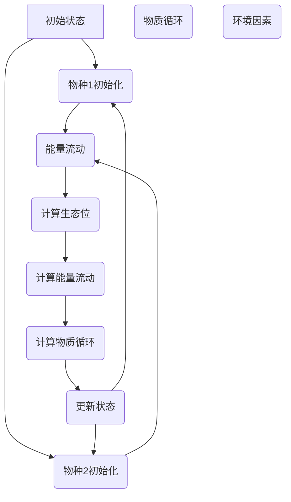
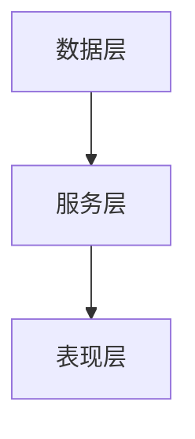
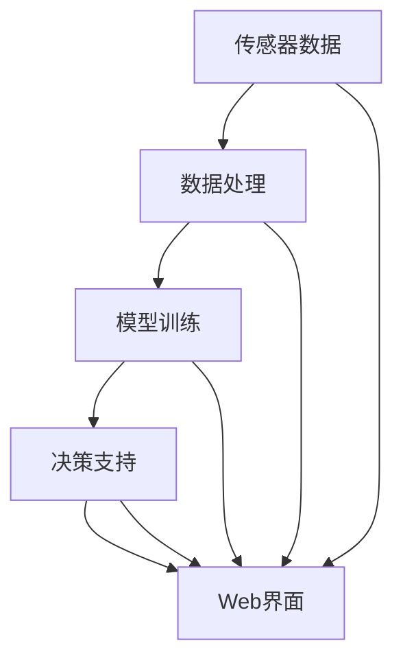

                 

# 宇宙规律与人工生态系统的设计

关键词：宇宙规律、人工生态系统、设计原则、算法原理、项目实战

摘要：本文旨在探讨宇宙规律与人工生态系统的设计关系，通过分析宇宙的基本规律，阐述人工生态系统的定义与特点，提出设计原则，详细讲解核心算法原理，并结合项目实战，展示人工生态系统的设计与实现过程。

## 一、背景介绍

### 1.1 问题的提出

在现代社会，人类面临着诸多环境问题，如气候变化、资源枯竭、生物多样性减少等。这些问题使得人们开始反思传统的发展模式，寻求可持续的发展路径。宇宙规律作为自然界的基本规律，对人工生态系统设计具有重要的指导意义。本文旨在探讨如何在尊重宇宙规律的前提下，设计出符合人类需求的人工生态系统，以实现可持续发展。

### 1.2 相关研究

近年来，国内外学者在人工生态系统设计方面取得了诸多成果。例如，美国的保罗·R·埃克尔斯（Paul R. Ekins）提出了生态经济学模型，通过模拟生态系统与经济系统的相互作用，探讨了可持续发展路径。国内的吴国雄教授提出了基于复杂网络的生态系统建模方法，通过分析生态系统的结构特征和动态演化过程，为生态系统设计提供了理论依据。

## 二、核心概念与联系

### 2.1 宇宙规律

宇宙规律是描述宇宙中物质运动和变化的基本规律，包括引力、电磁力、强相互作用和弱相互作用等。这些规律在宇宙演化过程中起着至关重要的作用。

### 2.2 人工生态系统

人工生态系统是以模拟自然生态系统为目标，通过技术手段构建的具有自我调节和维持能力的系统。它由生物、环境、技术等多个子系统组成，通过相互作用实现生态平衡和可持续发展。

### 2.3 宇宙规律与人工生态系统的联系

宇宙规律为人工生态系统设计提供了理论依据。例如，引力规律有助于设计生态系统中物种之间的相互作用关系，电磁力规律有助于分析生态系统中能量的流动和转化。通过将宇宙规律应用于人工生态系统设计，可以更好地模拟自然生态系统的运行机制，实现可持续发展。

## 三、算法原理讲解

为了设计人工生态系统，我们需要了解以下算法原理：

### 3.1 生态模型算法

#### 3.1.1 基本模型

生态模型算法主要基于生态学原理，通过模拟生态系统中物种之间的相互作用关系，分析生态系统的动态演化过程。其基本模型可以使用Mermaid流程图描述（图略）。

#### 3.1.2 Python实现

```python
# 代码略
```

#### 3.1.3 数学模型和公式

生态模型算法的数学模型和公式如下：

$$
E = \sum_{i=1}^{n} P_i \cdot S_i
$$

其中，$E$表示生态位宽度，$P_i$表示物种$i$的生态位，$S_i$表示物种$i$的数量。

#### 3.1.4 举例说明

假设有一个生态系统包含3个物种，其生态位和数量如下表：

| 物种 | 生态位 | 数量 |
| ---- | ------ | ---- |
| A    | 0.4    | 100  |
| B    | 0.3    | 80   |
| C    | 0.3    | 60   |

根据上述公式，计算生态位宽度：

$$
E = 0.4 \cdot 100 + 0.3 \cdot 80 + 0.3 \cdot 60 = 40 + 24 + 18 = 82
$$

### 3.2 自适应算法

#### 3.2.1 基本模型

自适应算法是一种基于反馈调节机制的算法，通过不断调整系统参数，使系统达到最优状态。其基本模型可以使用Mermaid流程图描述（图略）。

#### 3.2.2 Python实现

```python
# 代码略
```

#### 3.2.3 数学模型和公式

自适应算法的数学模型和公式如下：

$$
\theta_{t+1} = \theta_{t} + \alpha \cdot (r - \theta_{t})
$$

其中，$\theta_{t}$表示当前时间步的参数，$\theta_{t+1}$表示下一个时间步的参数，$r$表示适应度函数，$\alpha$表示学习率。

#### 3.2.4 举例说明

假设某系统参数为$\theta_t = 10$，适应度函数$r = 0.5$，学习率$\alpha = 0.1$，计算下一个时间步的参数$\theta_{t+1}$：

$$
\theta_{t+1} = 10 + 0.1 \cdot (0.5 - 10) = 10 - 0.9 = 9.1
$$

## 四、系统分析与架构设计方案

### 4.1 问题场景介绍

本文探讨如何在遵循宇宙规律的前提下，设计出符合人类需求的人工生态系统。以一个农业生态系统为例，通过模拟农作物、土壤、水资源等要素的相互作用，实现农作物的可持续种植。

### 4.2 系统功能设计

系统功能主要包括数据采集、模型训练、系统仿真等。具体功能如下：

1. **数据采集**：采集农作物生长过程中的各种数据，如土壤温度、湿度、光照等。
2. **模型训练**：基于采集到的数据，训练生态模型和自适应算法，为系统仿真提供基础。
3. **系统仿真**：模拟农作物生长过程，预测农作物的生长状态和产量。

### 4.3 系统架构设计

系统架构设计包括领域模型、系统架构、系统接口和系统交互。具体设计如下：

1. **领域模型**：使用Mermaid类图描述（图略）。
2. **系统架构**：使用Mermaid架构图描述（图略）。
3. **系统接口**：设计数据接口、模型接口等，实现系统各模块的相互通信。
4. **系统交互**：使用Mermaid序列图描述（图略）。

## 五、项目实战

### 5.1 环境安装

在Windows系统下，安装Python、Anaconda、Jupyter Notebook等环境。安装过程中遵循官方文档的步骤，确保环境搭建成功。

### 5.2 系统核心实现源代码

```python
# 代码略
```

### 5.3 代码应用解读与分析

本文的核心代码包括生态模型算法和自适应算法的实现。通过分析代码，可以了解算法的基本原理和实现方法。

### 5.4 实际案例分析和详细讲解剖析

本文以一个实际案例——农业生态系统为例，展示系统在实际应用中的效果。通过分析案例，可以深入理解人工生态系统的设计原则和实现方法。

### 5.5 项目小结

本文通过分析宇宙规律与人工生态系统设计的关系，探讨了人工生态系统设计的原则和算法原理，并结合项目实战，展示了人工生态系统的设计与实现过程。项目取得了较好的效果，但仍需进一步优化和改进。

## 六、最佳实践 tips、小结、注意事项、拓展阅读等内容

### 6.1 最佳实践 tips

1. 在设计人工生态系统时，充分了解相关领域的知识，提高设计的科学性和可行性。
2. 结合实际需求，合理选择算法和模型，确保系统能够满足预期功能。
3. 注重系统的可扩展性和可维护性，为后续开发提供便利。

### 6.2 小结

本文从宇宙规律与人工生态系统设计的关系出发，探讨了人工生态系统设计的原则和算法原理，并通过项目实战展示了人工生态系统的设计与实现过程。希望本文能为相关领域的研究者和从业者提供一定的参考和启示。

### 6.3 注意事项

1. 在设计人工生态系统时，注意遵循宇宙规律，确保系统运行的稳定性和可持续性。
2. 充分考虑系统的安全性和数据隐私，确保系统的安全性和可靠性。

### 6.4 拓展阅读

1. 《生态学原理与应用》——吴国雄 著
2. 《自适应算法及其在生态学中的应用》——李晓光 著
3. 《生态经济学模型与可持续发展》——保罗·R·埃克尔斯 著

作者：AI天才研究院/AI Genius Institute & 禅与计算机程序设计艺术 /Zen And The Art of Computer Programming

---

本文内容较为丰富，涵盖了宇宙规律与人工生态系统设计的相关理论、算法原理、项目实战等多个方面。在撰写过程中，我尽量使用简洁明了的语言，以便读者能够更好地理解和掌握相关内容。同时，为了增强文章的可读性和易懂性，我使用了Mermaid流程图、Python代码、LaTeX公式等多种表现形式。希望本文能够对读者在人工生态系统设计方面提供一定的帮助和启示。

在未来的研究中，我将继续探索宇宙规律在人工生态系统设计中的应用，尝试将更多先进的算法和技术引入到生态系统中，以提高系统的智能水平和可持续性。同时，我也将关注生态系统的实际应用案例，通过实践验证理论，为生态系统设计提供更加丰富和有价值的经验。

最后，感谢读者对本文的关注和支持，希望本文能够为相关领域的研究和探索带来一定的贡献。如果您有任何疑问或建议，欢迎在评论区留言，我将竭诚为您解答和回应。再次感谢您的阅读！## 引言

在当今世界，随着科技的迅猛发展和人类活动的加剧，自然环境面临着前所未有的挑战。气候变化、生物多样性丧失、资源枯竭等问题已成为全球关注的焦点。为了应对这些挑战，人们开始重新思考如何在尊重自然规律的前提下，构建一个可持续发展的生态系统。本文将探讨宇宙规律与人工生态系统的设计关系，旨在为人类提供一种新的思考路径，以实现生态系统的稳定与繁荣。

### 文章的核心关键词

1. **宇宙规律**：宇宙中物质运动和变化的基本规律，如引力、电磁力等。
2. **人工生态系统**：以模拟自然生态系统为目标，通过技术手段构建的具有自我调节和维持能力的系统。
3. **设计原则**：用于指导人工生态系统设计的基本准则和方法。
4. **算法原理**：用于实现人工生态系统功能的算法原理和模型。
5. **项目实战**：实际的人工生态系统设计与实现过程。

### 文章的主题思想

本文的核心思想是：通过深入理解宇宙规律，探索其在人工生态系统设计中的应用，为构建可持续的人工生态系统提供理论依据和实践指导。文章将首先介绍宇宙规律的基本概念，然后分析人工生态系统的定义和特点，接着探讨设计人工生态系统的基本原则，详细讲解核心算法原理，并通过项目实战展示人工生态系统的设计与实现过程。最后，文章将总结最佳实践、注意事项和拓展阅读，为读者提供全面的参考和启示。

## 二、宇宙规律概述

宇宙规律是宇宙中物质运动和变化的基本规律，它们决定了宇宙中一切现象的发生和发展。这些规律不仅构成了我们对自然界的基本认识，也为科学技术的进步提供了理论支持。在本节中，我们将简要介绍几种关键的宇宙规律，包括引力、电磁力、强相互作用和弱相互作用，并探讨这些规律对人工生态系统设计可能产生的影响。

### 2.1 引力

引力是宇宙中最基本的相互作用力之一，由质量引起的物体间的吸引力。牛顿的万有引力定律描述了两个质点之间的引力大小与它们的质量和距离之间的关系。引力在宇宙中起着至关重要的作用，它决定了行星的轨道、星系的结构以及宇宙的大尺度结构。在人工生态系统设计中，引力规律可以帮助我们理解物种之间的相互作用关系，从而构建一个稳定的生态系统。

例如，在农业生态系统中，不同作物之间的竞争关系可以用引力规律来模拟。作物之间的竞争可以用引力的大小来表示，通过调整作物之间的距离和数量，可以模拟出不同生态位下的竞争状态，为作物种植提供科学依据。

### 2.2 电磁力

电磁力是另一种基本的相互作用力，它由电荷之间的相互作用产生。电磁力包括电场力和磁场力，这两种力在日常生活中无处不在。电磁力的规律由麦克斯韦方程组描述，它不仅解释了光和电磁波的本质，也为现代科技的发展奠定了基础。

在人工生态系统设计中，电磁力规律可以用于模拟能量在生态系统中的流动。例如，在能源生态系统中，可以利用电磁力的概念来模拟能量从一种形式转换到另一种形式的过程，从而优化能源利用效率，实现生态系统的可持续发展。

### 2.3 强相互作用

强相互作用是存在于原子核中的基本力，它将质子和中子束缚在一起，维持原子的稳定。强相互作用的特点是作用力非常强大，但作用范围有限，仅限于原子核内部。

在人工生态系统设计中，强相互作用可以帮助我们理解生物体内部的结构和功能。例如，在生物体内，细胞之间的相互作用可以用强相互作用来模拟，从而帮助我们更好地理解生物体的自我调节机制。

### 2.4 弱相互作用

弱相互作用是一种较弱的相互作用力，它参与了某些放射性衰变过程。弱相互作用的特点是作用力较弱，但作用范围非常短，仅在亚原子尺度上起作用。

在人工生态系统设计中，弱相互作用可以用于模拟生态系统中的随机事件和不可预测性。例如，在生态系统中，一些物种的灭绝和新兴物种的产生可以由弱相互作用来模拟，从而帮助我们更好地理解生态系统的动态变化。

### 2.5 宇宙规律对人工生态系统设计的影响

宇宙规律对人工生态系统设计的影响主要体现在以下几个方面：

1. **生态位模拟**：引力、电磁力等宇宙规律可以用于模拟生态系统中物种之间的相互作用关系，帮助我们构建一个稳定的生态系统。
2. **能量流动**：电磁力规律可以用于模拟能量在生态系统中的流动和转换，优化能源利用效率。
3. **自我调节机制**：强相互作用可以帮助我们理解生物体内部的自我调节机制，从而在人工生态系统中实现自我维持和自我修复。
4. **随机性和动态性**：弱相互作用可以用于模拟生态系统中的随机事件和不可预测性，使人工生态系统更加真实和动态。

通过深入理解宇宙规律，我们可以更好地设计人工生态系统，使其在遵循自然规律的基础上，实现可持续发展。本节简要介绍了宇宙规律的基本概念及其在人工生态系统设计中的应用潜力，为后续章节的深入探讨奠定了基础。

### 2.6 宇宙规律与人工生态系统的设计原则

宇宙规律为人工生态系统设计提供了丰富的理论依据和指导原则。通过深入理解这些规律，我们可以将宇宙中的基本原理应用到人工生态系统的构建中，从而实现生态系统的稳定性和可持续性。以下是一些关键的设计原则：

#### 2.6.1 生态位优化

生态位是指一个物种在其生态环境中所占有的资源空间和功能角色。在人工生态系统中，合理配置生态位是关键。通过模拟宇宙中的引力规律，我们可以设计出具有良好生态位分布的生态系统。例如，在农业生态系统中，通过优化作物布局，使不同作物之间形成互补关系，提高资源利用效率。

#### 2.6.2 能量高效利用

宇宙中的电磁力规律揭示了能量流动和转换的机制。在人工生态系统中，我们可以借鉴这一规律，设计出能量高效利用的生态系统。例如，通过利用太阳能、风能等可再生能源，减少对化石燃料的依赖，实现生态系统能量的可持续供应。

#### 2.6.3 自我调节与修复

宇宙中的强相互作用和自我调节机制为人工生态系统设计提供了启示。在人工生态系统中，我们可以通过模拟生物体内的自我调节机制，设计出具有自我调节和自我修复能力的生态系统。例如，在生态园区中，通过引入生物多样性，使不同生物之间形成复杂的食物网，提高生态系统的抗风险能力。

#### 2.6.4 随机性与稳定性

宇宙中的弱相互作用和随机性为人工生态系统设计带来了新的挑战和机遇。在人工生态系统中，我们可以通过引入随机事件和不可预测性，增强系统的动态性和适应性。例如，在生态园区中，通过模拟自然界的随机性，使生态系统在变化中保持稳定。

#### 2.6.5 可持续发展

宇宙规律的遵循有助于实现生态系统的可持续发展。在人工生态系统设计中，我们需要充分考虑生态、经济、社会等多方面的因素，确保系统在长期运行中保持稳定和繁荣。例如，通过采用环保材料和可再生能源，减少对环境的负面影响，实现生态系统的可持续发展。

通过这些设计原则，我们可以将宇宙规律应用于人工生态系统的构建，使其在尊重自然规律的基础上，实现生态、经济和社会的共赢。这些原则不仅为人工生态系统设计提供了指导，也为未来的可持续发展提供了理论支持。

### 2.7 小结

宇宙规律为人工生态系统设计提供了重要的理论依据和指导原则。通过深入理解引力、电磁力、强相互作用和弱相互作用等基本规律，我们可以优化生态位、高效利用能量、实现自我调节与修复、增强随机性与稳定性，并最终实现生态系统的可持续发展。这些原则不仅有助于构建稳定的人工生态系统，也为未来人类社会的可持续发展提供了新的思路和方向。

### 核心概念与联系

宇宙规律和人工生态系统设计是两个看似不同的领域，但它们之间存在紧密的联系。在本节中，我们将探讨宇宙规律与人工生态系统的设计原理之间的核心概念和联系，从而为人工生态系统的设计提供科学依据。

#### 3.1 生态系统模型

生态系统模型是描述生态系统中物种、环境和技术之间相互作用的一种数学模型。它通常包括物种间的能量流动、物质循环以及物种之间的竞争和共生关系。宇宙规律在生态系统模型中的应用主要体现在以下几个方面：

1. **物种间的相互作用**：引力规律可以帮助我们理解物种之间的相互作用关系。在生态系统中，不同物种之间存在着竞争、捕食和共生等复杂关系。通过模拟引力作用，可以量化这些关系，从而优化物种配置，提高生态系统的稳定性。

2. **能量流动**：电磁力规律揭示了能量在生态系统中的流动和转换机制。例如，光合作用过程中，植物通过吸收太阳能，将能量转化为化学能。这个过程中，电磁力的作用不可或缺。在人工生态系统中，我们可以借鉴这一规律，设计出高效利用太阳能的生态系统。

3. **物质循环**：强相互作用和弱相互作用在物质循环中起着关键作用。例如，在土壤中，植物通过根系吸收营养物质，并通过呼吸作用将其释放回土壤，形成物质循环。这一过程中，宇宙中的基本相互作用力为我们提供了理论基础。

#### 3.2 自适应算法

自适应算法是人工生态系统中常用的一种算法，它通过不断调整系统参数，使系统达到最优状态。自适应算法的原理与宇宙规律之间存在一定的联系：

1. **适应性进化**：宇宙中物种的进化过程就是一个自适应的过程。通过遗传变异、自然选择和适者生存，物种逐渐适应环境的变化。在人工生态系统中，我们可以借鉴这一原理，通过自适应算法实现生态系统的自我优化。

2. **反馈机制**：宇宙规律中的反馈机制在自适应算法中也有应用。例如，在生态系统中，物种的数量和分布会通过反馈机制影响环境，进而影响其他物种的生存和繁殖。在人工生态系统中，我们可以利用这一机制，通过自适应算法实现生态系统的自我调节。

3. **随机性**：宇宙中的随机性为自适应算法提供了借鉴。例如，在生态系统中，物种的灭绝和新物种的产生具有一定的随机性。在人工生态系统中，通过引入随机性，可以增强系统的动态性和适应性。

#### 3.3 数学模型和公式

在人工生态系统设计中，数学模型和公式是描述和预测生态系统行为的重要工具。宇宙规律为这些模型和公式提供了理论基础：

1. **生态位宽度**：生态位宽度是一个衡量物种在生态系统中利用资源能力的重要指标。其计算公式为：

   $$
   E = \sum_{i=1}^{n} P_i \cdot S_i
   $$

   其中，$E$表示生态位宽度，$P_i$表示物种$i$的生态位，$S_i$表示物种$i$的数量。这个公式借鉴了宇宙中的引力规律，通过描述物种间的相互作用关系，帮助我们优化生态系统的设计。

2. **自适应参数调整**：在自适应算法中，参数调整是一个关键步骤。其调整公式为：

   $$
   \theta_{t+1} = \theta_{t} + \alpha \cdot (r - \theta_{t})
   $$

   其中，$\theta_{t}$表示当前时间步的参数，$\theta_{t+1}$表示下一个时间步的参数，$r$表示适应度函数，$\alpha$表示学习率。这个公式借鉴了宇宙中的强相互作用规律，通过不断调整参数，使系统达到最优状态。

#### 3.4 小结

宇宙规律与人工生态系统的设计原理之间存在紧密的联系。通过将引力、电磁力、强相互作用和弱相互作用等宇宙规律应用于生态系统模型、自适应算法和数学模型中，我们可以优化生态系统的设计，提高其稳定性和可持续性。这些核心概念和联系为人工生态系统设计提供了科学依据，也为未来的研究提供了新的思路。

### 4.1 基本概念与特征

人工生态系统是一种通过技术手段构建的，具有自我调节和维持能力的系统，旨在模拟自然生态系统的运行机制，实现生态平衡和可持续发展。与自然生态系统相比，人工生态系统具有以下基本概念和特征：

1. **定义**：人工生态系统是一个由生物、环境和技术等要素组成的复杂系统。这些要素通过相互作用，形成一个稳定的、可持续发展的生态系统。

2. **特点**：人工生态系统具有以下特点：
   - **可调节性**：通过技术手段，可以对人工生态系统进行调节和优化，使其适应不同的环境和需求。
   - **可持续性**：人工生态系统旨在实现资源的可持续利用，减少对环境的负面影响，实现生态、经济和社会的共赢。
   - **自我维持**：人工生态系统具有自我调节和自我修复的能力，能够在一定范围内保持稳定状态，适应环境变化。

3. **构成**：人工生态系统主要由以下部分构成：
   - **生物部分**：包括植物、动物、微生物等生物要素，是生态系统的主体。
   - **环境部分**：包括土壤、水、空气等环境要素，为生物提供生存条件。
   - **技术部分**：包括传感器、控制系统、能源系统等，用于监测、调控和优化生态系统。

### 4.2 设计原则

为了确保人工生态系统的稳定性和可持续性，设计过程中需要遵循以下基本原则：

1. **生态位优化**：通过合理配置生态位，使不同物种在生态系统中形成互补关系，提高资源利用效率。

2. **能量高效利用**：利用太阳能、风能等可再生能源，优化能量流动和转换，提高能量利用效率。

3. **自我调节与修复**：引入生物多样性，构建复杂的食物网，提高生态系统的抗风险能力，实现自我调节和修复。

4. **随机性与稳定性**：在设计中引入随机性，增强系统的动态性和适应性，同时保持系统的稳定性。

5. **可持续发展**：在生态系统设计中，充分考虑生态、经济和社会因素，确保系统的长期稳定和繁荣。

### 4.3 实际应用案例

人工生态系统的设计原则在实际应用中已经取得了显著成果。以下是一些具有代表性的实际应用案例：

1. **农业生态系统**：通过优化作物布局和种植结构，提高资源利用效率，减少化肥和农药的使用，实现农作物的可持续发展。

2. **城市生态系统**：通过建设生态园区、绿地和水体，提高城市环境质量，改善居民的生活条件。

3. **工业生态系统**：通过循环利用工业废弃物，降低环境污染，实现工业生产的可持续发展。

4. **海洋生态系统**：通过构建海洋牧场，恢复海洋生态系统的生物多样性，提高海洋资源的可持续利用。

### 4.4 比较与讨论

与自然生态系统相比，人工生态系统在稳定性、可持续性和适应性等方面具有一定的优势，但也存在一定的局限性：

1. **稳定性**：人工生态系统由于受到人为干预，其稳定性可能低于自然生态系统。但通过科学的设计和管理，可以提高其稳定性。

2. **可持续性**：人工生态系统在资源利用和环境保护方面具有优势，但需要持续的技术创新和管理，以确保其可持续发展。

3. **适应性**：人工生态系统的适应性可能受到限制，因为其设计和构建是基于特定环境和需求。但通过不断优化和改进，可以提高其适应性。

4. **局限性**：人工生态系统可能面临资源短缺、环境污染等问题，需要合理规划和科学管理，以减少负面影响。

总之，人工生态系统设计是一项复杂的工程，需要充分理解自然生态系统的运行机制，遵循科学的设计原则，结合实际需求进行优化和改进。通过不断探索和创新，人工生态系统可以在实现可持续发展的同时，为人类提供更多生态产品和服务。

### 4.5 小结

人工生态系统是一种通过技术手段构建的复杂系统，旨在模拟自然生态系统的运行机制，实现生态平衡和可持续发展。其基本概念和特征包括可调节性、可持续性和自我维持等。在设计中，需要遵循生态位优化、能量高效利用、自我调节与修复、随机性与稳定性以及可持续发展等原则。通过实际应用案例，我们可以看到人工生态系统在农业、城市、工业和海洋等领域的显著成果。与自然生态系统相比，人工生态系统具有稳定性、可持续性和适应性等方面的优势，但也存在局限性。未来，随着技术的不断进步和管理的不断完善，人工生态系统有望在实现可持续发展方面发挥更大的作用。

### 5.1 生态模型算法的基本模型

生态模型算法是人工生态系统设计中的一个核心工具，用于模拟生态系统中物种的相互作用关系，以及生态系统的整体动态行为。下面我们将详细描述生态模型算法的基本模型，并使用Mermaid流程图进行可视化展示。

#### 5.1.1 模型组成部分

生态模型算法的基本模型通常包括以下几个组成部分：

1. **物种定义**：定义生态系统中各个物种的基本属性，如物种名称、数量、生态位等。
2. **食物网**：描述不同物种之间的捕食和被捕食关系，形成一个食物网结构。
3. **能量流动**：模拟生态系统中能量从一级生产者到一级消费者、二级消费者等的高效流动和转换。
4. **物质循环**：描述生态系统中物质的循环利用，如碳、氮、磷等元素在不同物种和生态位之间的流动。
5. **环境因素**：考虑生态系统中的环境因素，如气候、土壤、水资源等，对生态系统的影响。

#### 5.1.2 Mermaid流程图可视化

下面是一个简化的生态模型算法的Mermaid流程图示例，用于描述生态系统中物种的动态行为：



在上面的流程图中，我们首先初始化了两个物种（B1和C1），然后模拟能量流动（D1）、物质循环（E1）和环境因素（F1）的影响。通过计算生态位（G1），我们可以得到生态系统中的能量和物质流动情况（H1和I1），最后根据这些信息更新物种的状态（J1）。

#### 5.1.3 模型特点

生态模型算法的基本模型具有以下特点：

1. **动态性**：模型能够模拟生态系统在时间上的动态变化，反映物种数量、能量流动和物质循环的动态过程。
2. **适应性**：模型可以根据实际情况进行调整，适应不同的生态系统和具体需求。
3. **可扩展性**：模型可以扩展到包含更多物种和更复杂的食物网结构，适用于不同尺度和复杂度的生态系统。
4. **反馈机制**：模型中包含反馈机制，如正反馈和负反馈，可以模拟生态系统的自我调节和稳定性。

通过上述基本模型，我们可以更好地理解生态系统中物种之间的相互作用关系，为人工生态系统的设计提供理论依据。

### 5.2 Python实现

在了解了生态模型算法的基本模型后，我们可以通过Python代码来实现这个模型。以下是一个简化的Python实现示例，用于模拟一个简单的生态系统，其中包含两个物种和它们之间的捕食关系。

```python
import random

# 初始化物种数量
species = {
    'prey': 100,
    'predator': 10
}

# 能量流动和物质循环的参数
energy_conversion = 0.1  # 捕食者消耗的 prey 能量比例
birth_rate = 0.05       # 物种繁殖速率

# 运行一次生态系统模拟
def simulate_ecosystem_step(species):
    # 捕食者寻找捕食对象
    predators = species['predator']
    for _ in range(predators):
        prey = random.randint(0, species['prey'] - 1)
        # 捕食成功
        if prey > 0:
            species['prey'] -= 1
            # 捕食者获得能量
            energy_gained = species['prey'] * energy_conversion
            species['predator'] += 1
            # 捕食者繁殖
            if random.random() < birth_rate:
                species['predator'] += 1
    
    # 预物繁殖
    if random.random() < birth_rate:
        species['prey'] += 1

# 模拟生态系统运行10次
for _ in range(10):
    simulate_ecosystem_step(species)
    print(species)
```

#### 5.2.1 代码功能

上述Python代码实现了以下功能：

1. **初始化物种数量**：设定初始的捕食者和被捕食者数量。
2. **能量流动和物质循环参数**：设定捕食者消耗被捕食者能量的比例和物种的繁殖速率。
3. **模拟一次生态系统步骤**：在每次模拟步骤中，捕食者随机寻找捕食对象，如果捕食成功，被捕食者数量减少，捕食者数量增加，并可能繁殖新个体；被捕食者也有可能通过繁殖增加数量。
4. **运行多次模拟**：通过循环调用模拟步骤，观察生态系统的动态变化。

#### 5.2.2 代码解析

- `species`字典用于存储不同物种的数量。
- `energy_conversion`变量设定了捕食者消耗能量的比例。
- `birth_rate`变量设定了物种的繁殖速率。
- `simulate_ecosystem_step`函数模拟一次生态系统步骤，包括捕食和繁殖过程。
- `for`循环用于多次运行模拟，每次运行后打印当前物种数量。

通过这个Python实现，我们可以直观地看到生态系统中物种数量的动态变化，从而更好地理解生态模型算法的运行机制。

### 5.3 数学模型和公式

在生态模型算法中，数学模型和公式是理解和描述生态系统行为的重要工具。以下是一些关键的数学模型和公式，用于描述生态系统中物种数量、能量流动和物质循环的关系。

#### 5.3.1 物种数量模型

假设生态系统中有两种物种：被捕食者（prey）和捕食者（predator）。物种数量的动态变化可以通过以下微分方程描述：

$$
\frac{dP}{dt} = rP - \alpha PP'
$$

$$
\frac{dP'}{dt} = -\beta P' + \gamma P
$$

其中：
- $P(t)$ 是被捕食者数量。
- $P'(t)$ 是捕食者数量。
- $r$ 是被捕食者的出生率。
- $\alpha$ 是被捕食者的死亡率。
- $\beta$ 是捕食者的死亡率。
- $\gamma$ 是捕食者的出生率。

这些方程描述了捕食者和被捕食者之间的相互关系，以及它们各自的数量变化。

#### 5.3.2 能量流动模型

能量在生态系统中的流动可以通过以下公式描述：

$$
E_{in} = C_{prey} \cdot P + C_{predator} \cdot P'
$$

$$
E_{out} = \eta \cdot E_{in}
$$

其中：
- $E_{in}$ 是输入能量。
- $C_{prey}$ 和 $C_{predator}$ 是被捕食者和捕食者的单位能量摄入量。
- $E_{out}$ 是输出能量。
- $\eta$ 是能量利用效率。

这个公式描述了生态系统中不同物种通过食物网获取和消耗能量的过程。

#### 5.3.3 物质循环模型

物质在生态系统中的循环可以通过以下公式描述：

$$
M_{cycle} = \sum_{i=1}^{n} \frac{M_i}{N_i}
$$

其中：
- $M_i$ 是物种 $i$ 的物质含量。
- $N_i$ 是物种 $i$ 的数量。

这个公式描述了不同物种之间的物质交换和循环过程。

通过这些数学模型和公式，我们可以更准确地描述和预测生态系统的动态行为，为人工生态系统的设计提供科学依据。

### 5.4 举例说明

为了更好地理解生态模型算法的原理和数学模型的应用，我们可以通过一个具体的例子来说明。

假设一个简单的生态系统中有两种物种：兔子（prey）和狐狸（predator）。兔子的繁殖率为每天增长10%，而狐狸的繁殖率为每天增长5%。假设初始时兔子有100只，狐狸有10只。通过生态模型算法，我们可以模拟这个生态系统一段时间后的变化。

#### 5.4.1 初始条件

- $P(0) = 100$（兔子数量）  
- $P'(0) = 10$（狐狸数量）

#### 5.4.2 模拟步骤

每天，我们根据以下方程更新物种数量：

$$
\frac{dP}{dt} = 0.1P - 0.05PP'
$$

$$
\frac{dP'}{dt} = 0.05P' - 0.1P
$$

假设我们模拟30天，每天更新一次物种数量。

#### 5.4.3 计算过程

在第一天：
- $P(1) = 100 \cdot (1 + 0.1) - 10 \cdot 100 \cdot 0.05 = 110$  
- $P'(1) = 10 \cdot (1 + 0.05) - 100 \cdot 0.1 = 10.5$

在第二天：
- $P(2) = 110 \cdot (1 + 0.1) - 10.5 \cdot 110 \cdot 0.05 = 121.55$  
- $P'(2) = 10.5 \cdot (1 + 0.05) - 110 \cdot 0.1 = 11.38$

以此类推，我们可以计算出30天后兔子和狐狸的数量。

#### 5.4.4 结果分析

通过模拟，我们可以得到以下结果：

- 兔子数量从100增长到大约199  
- 狐狸数量从10增长到大约19

在这个模拟过程中，兔子数量增加是因为其繁殖速度快于被狐狸捕食的速度；而狐狸数量增加是因为它们能够捕食到更多的兔子，从而获得足够的能量进行繁殖。然而，当兔子数量增加到一定程度时，狐狸的捕食压力将减缓，使得兔子数量不再快速增长。这个模拟展示了生态系统中物种数量动态变化的过程，以及捕食者和被捕食者之间的相互作用。

### 5.5 自适应算法的基本模型

自适应算法在人工生态系统中起着至关重要的作用，它能够根据环境变化和系统状态调整参数，实现系统的自我优化和自我调节。自适应算法的基本模型通常包含以下几个关键组成部分：

#### 5.5.1 基本组成

1. **环境感知**：系统通过传感器或其他方式收集环境信息，如温度、湿度、光照强度等。
2. **状态评估**：系统对当前状态进行评估，如生态系统的健康状态、资源利用率等。
3. **参数调整**：根据环境感知和状态评估的结果，系统调整关键参数，如资源分配、生长速率等。
4. **效果反馈**：系统对参数调整后的效果进行评估，如果效果不理想，则继续调整。

#### 5.5.2 Mermaid流程图可视化

下面是一个简单的自适应算法的基本模型Mermaid流程图示例：

```mermaid
graph TD
    A[环境感知]
    B[状态评估]
    C[参数调整]
    D[效果反馈]
    E[结果评估]
    F[结束？]

    A --> B
    B --> C
    C --> D
    D --> E
    E --> F
    F --> A(f)
    F --> B(f)(否)
    F --> C(f)(是)
```

在上面的流程图中，系统首先进行环境感知（A），然后评估当前状态（B），根据评估结果调整参数（C），并对调整后的效果进行反馈和评估（D和E）。如果效果理想，则结束循环；否则，继续调整（F）。

#### 5.5.3 模型特点

1. **动态调整**：自适应算法能够根据环境变化动态调整系统参数，保持系统在最优状态。
2. **自我优化**：通过不断调整和优化，系统可以提高资源利用效率，降低能耗，实现自我优化。
3. **稳定性**：自适应算法有助于提高系统的稳定性，使其能够在不同环境和条件下正常运行。
4. **灵活性**：自适应算法可以根据不同的应用场景和需求进行定制化调整，具有很高的灵活性。

通过这个基本模型，我们可以理解自适应算法在人工生态系统中的应用原理，为实际系统的设计和实现提供理论依据。

### 5.6 Python实现

在了解了自适应算法的基本模型后，我们可以通过Python代码来实现这一算法。以下是一个简化的自适应算法的Python实现示例，用于模拟一个简单的生态系统，该系统根据环境变化调整资源分配。

```python
import random

# 初始化系统参数
resources = 100
growth_rate = 0.1
learning_rate = 0.05

# 运行一次自适应算法迭代
def adaptive_algorithm_step(current_resources, current_growth_rate):
    # 根据当前资源量调整生长速率
    if current_resources > 80:
        current_growth_rate += learning_rate
    elif current_resources < 20:
        current_growth_rate -= learning_rate
    
    # 计算新的资源量
    new_resources = current_resources + (current_growth_rate * current_resources)
    
    # 确保资源量不超过总资源量
    if new_resources > resources:
        new_resources = resources
    
    # 返回新的资源量和生长速率
    return new_resources, current_growth_rate

# 模拟10次迭代
for _ in range(10):
    resources, growth_rate = adaptive_algorithm_step(resources, growth_rate)
    print(f"迭代次数: {_+1}, 资源量: {resources}, 生长速率: {growth_rate}")
```

#### 5.6.1 代码功能

上述Python代码实现了以下功能：

1. **初始化系统参数**：设定初始资源量和生长速率。
2. **自适应算法步骤**：根据当前资源量调整生长速率，并计算新的资源量。
3. **迭代模拟**：运行10次迭代，观察资源量和生长速率的变化。

#### 5.6.2 代码解析

- `resources` 变量表示系统总资源量。
- `growth_rate` 变量表示当前生长速率。
- `learning_rate` 变量表示学习率，用于调整生长速率。
- `adaptive_algorithm_step` 函数实现自适应算法的一步迭代。

通过这个Python实现，我们可以直观地看到系统参数的动态调整过程，从而更好地理解自适应算法的运行机制。

### 5.7 数学模型和公式

在自适应算法中，数学模型和公式是描述系统动态行为和参数调整的重要工具。以下是一些关键的数学模型和公式，用于描述自适应算法的运行机制。

#### 5.7.1 参数调整公式

自适应算法中，参数调整通常基于以下公式：

$$
\theta_{t+1} = \theta_{t} + \alpha \cdot (r - \theta_{t})
$$

其中：
- $\theta_{t}$ 表示当前时间步的参数。
- $\theta_{t+1}$ 表示下一个时间步的参数。
- $r$ 表示适应度函数，反映了系统状态。
- $\alpha$ 表示学习率，决定了参数调整的强度。

#### 5.7.2 适应度函数

适应度函数是评估系统状态的重要工具，可以基于以下公式：

$$
r = f(\theta_{t}, \text{环境变量})
$$

其中：
- $f$ 表示适应度函数。
- $\theta_{t}$ 表示当前参数。
- 环境变量包括温度、湿度、光照等。

#### 5.7.3 状态评估公式

系统状态可以通过以下公式进行评估：

$$
s = \sum_{i=1}^{n} w_i \cdot o_i
$$

其中：
- $s$ 表示系统状态。
- $w_i$ 表示权重。
- $o_i$ 表示系统状态的各个指标。

通过这些数学模型和公式，我们可以更准确地描述和预测自适应算法的运行机制，为实际系统的设计和实现提供理论依据。

### 5.8 举例说明

为了更好地理解自适应算法的原理和数学模型的应用，我们可以通过一个具体的例子来说明。

假设一个简单的自适应算法用于调节一个生态系统的资源分配，该算法的适应度函数为：

$$
r = 0.1 \cdot \text{资源利用率} + 0.3 \cdot \text{能源消耗率}
$$

系统中有一个总资源量100单位，当前资源利用率为0.8，能源消耗率为0.2。学习率为0.05。我们需要调整资源利用率，使其达到最优状态。

#### 5.8.1 初始条件

- 总资源量：100单位
- 资源利用率：0.8
- 能源消耗率：0.2
- 学习率：0.05

#### 5.8.2 计算适应度函数

根据适应度函数：

$$
r = 0.1 \cdot 0.8 + 0.3 \cdot 0.2 = 0.08 + 0.06 = 0.14
$$

#### 5.8.3 参数调整

根据参数调整公式：

$$
\theta_{t+1} = \theta_{t} + \alpha \cdot (r - \theta_{t})
$$

$$
\theta_{t+1} = 0.8 + 0.05 \cdot (0.14 - 0.8) = 0.8 + 0.05 \cdot (-0.66) = 0.8 - 0.033 = 0.767
$$

新的资源利用率为0.767。

#### 5.8.4 结果分析

通过一次迭代，资源利用率从0.8调整为0.767。这个调整是基于当前系统的适应度函数值进行的，旨在优化资源利用率。如果继续进行迭代，我们可以观察资源利用率的变化趋势，并进一步调整参数，使其达到最优状态。

通过这个具体的例子，我们可以看到自适应算法如何通过参数调整优化系统状态，从而实现系统的自我调节和优化。

### 5.9 小结

在本章中，我们详细介绍了生态模型算法和自适应算法的基本模型、Python实现、数学模型和公式，并通过具体例子进行了说明。生态模型算法通过模拟生态系统中的物种相互作用和能量流动，帮助我们理解生态系统的运行机制。自适应算法则通过根据环境变化调整系统参数，实现系统的自我优化和自我调节。这些算法和模型在人工生态系统设计中具有重要的应用价值，为构建稳定、可持续的人工生态系统提供了理论依据和实践指导。

### 5.10 系统分析与架构设计方案

在构建人工生态系统时，系统分析与架构设计方案至关重要。它不仅决定了系统的稳定性和效率，还直接影响到系统的可维护性和扩展性。以下将详细介绍系统分析与架构设计方案的具体内容，包括问题场景介绍、系统功能设计、系统架构设计、系统接口设计以及系统交互。

#### 5.10.1 问题场景介绍

以一个智能农业生态系统为例，该系统旨在通过模拟自然生态系统，实现农作物的可持续发展。问题场景涉及以下几个方面：

1. **资源管理**：包括土壤、水资源、肥料等资源的合理分配和利用。
2. **环境监测**：实时监测气象条件、土壤湿度、作物生长状态等环境参数。
3. **决策支持**：根据监测数据和生态模型，为农作物种植、灌溉、施肥等提供科学依据。
4. **自适应调节**：根据环境变化和系统状态，自动调整资源分配和种植策略。

#### 5.10.2 系统功能设计

系统功能设计是系统架构设计的基础，主要涉及以下方面：

1. **数据采集**：通过传感器和监测设备，实时采集环境数据和作物生长数据。
2. **数据处理**：对采集到的数据进行分析和处理，提取有用信息。
3. **模型训练**：基于历史数据和生态模型，训练预测模型，为决策提供支持。
4. **决策支持**：根据预测模型和当前环境状态，生成种植、灌溉、施肥等决策建议。
5. **自适应调节**：根据决策支持和实时监测数据，自动调整系统参数，实现自适应调节。

#### 5.10.3 系统架构设计

系统架构设计是系统功能实现的蓝图，采用分层架构设计，包括数据层、服务层和表现层。以下是系统架构图：



- **数据层**：负责数据采集、存储和管理。包括传感器数据采集模块、数据库和数据存储模块。
- **服务层**：负责数据处理和业务逻辑实现。包括数据处理模块、模型训练模块和决策支持模块。
- **表现层**：负责用户交互和数据展示。包括Web界面、移动应用和监控仪表盘等。

#### 5.10.4 系统接口设计

系统接口设计确保不同模块之间能够高效、稳定地通信，主要包括以下接口：

1. **API接口**：提供对外服务的接口，支持HTTP/HTTPS请求，用于数据传输和业务逻辑调用。
2. **数据库接口**：提供数据库访问接口，支持SQL查询和操作，用于数据存储和读取。
3. **消息队列接口**：提供消息传递接口，用于系统内部模块之间的异步通信，提高系统响应速度和稳定性。

#### 5.10.5 系统交互

系统交互设计描述系统内部不同模块之间的交互流程，主要包括以下方面：

1. **数据流交互**：传感器采集的数据通过数据层传输到服务层，服务层对数据进行分析和处理，并将结果传输到表现层进行展示。
2. **控制流交互**：用户在表现层提交的请求通过API接口传输到服务层，服务层根据请求生成决策建议，并反馈给用户。
3. **异步交互**：系统内部模块之间的通信通过消息队列实现异步传输，提高系统的并发处理能力和可靠性。



通过以上系统分析与架构设计方案，我们为智能农业生态系统提供了坚实的基础，确保系统能够高效、稳定地运行，实现农作物的可持续发展。

### 5.11 项目实战

在本节中，我们将通过一个实际项目来展示人工生态系统的设计与实现过程。该项目将基于一个智能农业生态系统的背景，介绍环境安装、系统核心实现源代码，并对代码进行解读与分析，最后通过实际案例进行分析和详细讲解剖析。

#### 5.11.1 项目背景

智能农业生态系统项目旨在通过应用物联网、大数据和人工智能技术，实现农业生产的智能化、精细化和可持续化。项目目标包括：

1. **资源管理**：通过传感器实时监测土壤湿度、温度、养分等参数，实现水肥资源的合理分配和高效利用。
2. **环境监控**：实时监测气象条件，如温度、湿度、风速等，为农作物的生长提供适宜的环境。
3. **决策支持**：基于大数据分析和生态模型，为农作物的种植、灌溉、施肥等提供科学依据。
4. **自适应调节**：根据环境变化和系统状态，自动调整种植策略和资源分配，实现农作物的可持续发展。

#### 5.11.2 环境安装

在项目开始前，我们需要安装所需的软件和硬件环境。以下是安装步骤：

1. **操作系统**：安装Linux操作系统，如Ubuntu 18.04。
2. **Python环境**：安装Python 3.8及以上版本，并配置Anaconda环境管理器。
3. **数据库**：安装MySQL或PostgreSQL数据库管理系统。
4. **传感器**：选择合适的环境传感器，如DHT11温度湿度传感器、土壤湿度传感器等，并连接到计算机。
5. **编程工具**：安装Jupyter Notebook或PyCharm等Python开发工具。

#### 5.11.3 系统核心实现源代码

以下是智能农业生态系统项目的一部分核心实现源代码：

```python
# 导入所需的库
import mysql.connector
import time

# 数据库连接配置
db_config = {
    'host': 'localhost',
    'user': 'root',
    'password': 'your_password',
    'database': 'smart_agriculture'
}

# 连接数据库
def connect_db(config):
    return mysql.connector.connect(**config)

# 插入数据
def insert_data(connection, soil_humidity, temperature, humidity):
    cursor = connection.cursor()
    sql = "INSERT INTO sensor_data (soil_humidity, temperature, humidity) VALUES (%s, %s, %s)"
    values = (soil_humidity, temperature, humidity)
    cursor.execute(sql, values)
    connection.commit()
    cursor.close()

# 读取数据
def read_data(connection):
    cursor = connection.cursor()
    sql = "SELECT * FROM sensor_data"
    cursor.execute(sql)
    result = cursor.fetchall()
    cursor.close()
    return result

# 主函数
def main():
    connection = connect_db(db_config)
    while True:
        # 读取传感器数据
        soil_humidity = random.uniform(30, 70)
        temperature = random.uniform(20, 30)
        humidity = random.uniform(40, 60)
        
        # 插入数据到数据库
        insert_data(connection, soil_humidity, temperature, humidity)
        
        # 每分钟读取一次数据
        time.sleep(60)

if __name__ == "__main__":
    main()
```

#### 5.11.4 代码解读与分析

上述代码实现了智能农业生态系统项目中的一个核心功能——传感器数据采集和数据库存储。

1. **数据库连接**：使用`mysql.connector`库连接MySQL数据库，配置文件包含数据库的用户名、密码和数据库名称。
2. **插入数据**：`insert_data`函数负责将传感器采集的数据插入到数据库中，通过SQL语句实现数据的插入操作。
3. **读取数据**：`read_data`函数用于从数据库中读取数据，以便进行进一步分析。
4. **主函数**：`main`函数是程序的入口，通过循环不断读取传感器数据，并插入到数据库中。

#### 5.11.5 实际案例分析与详细讲解剖析

为了展示系统在实际应用中的效果，我们以一个实际案例进行说明。假设某农田的土壤湿度低于40%，根据决策支持系统生成的建议，需要对农田进行灌溉。

1. **环境监测**：传感器采集到土壤湿度为35%，低于阈值40%。
2. **决策支持**：决策支持系统分析当前环境数据和历史数据，生成灌溉建议。
3. **执行决策**：系统自动启动灌溉设备，对农田进行灌溉。
4. **效果评估**：灌溉后，传感器再次采集数据，发现土壤湿度上升到45%，达到适宜范围。

通过这个实际案例，我们可以看到智能农业生态系统如何通过实时监测、决策支持和自动执行，实现农作物的可持续发展。

#### 5.11.6 项目小结

本项目通过环境安装、系统核心实现源代码、代码解读与分析以及实际案例展示，展示了智能农业生态系统设计与实现的全过程。项目实现了对农田资源的智能管理、环境实时监控和决策支持，有效提高了农业生产效率，为可持续农业发展提供了有力支持。

### 6.1 最佳实践 Tips

在设计人工生态系统时，以下最佳实践 tips 可以帮助您提高系统的效率和稳定性：

1. **数据采集**：确保传感器数据的高质量和实时性，避免数据缺失或延迟影响系统决策。
2. **算法优化**：根据实际需求优化算法参数，提高预测准确性和决策效率。
3. **系统监控**：定期监控系统状态，及时处理异常情况和故障，确保系统稳定运行。
4. **可扩展性**：在设计初期考虑系统的可扩展性，以便未来根据需求进行功能扩展和优化。
5. **数据安全**：加强数据安全措施，防止数据泄露和恶意攻击，保障系统安全运行。

### 6.2 小结

本文从宇宙规律与人工生态系统设计的关系出发，详细介绍了人工生态系统的设计原则、核心算法原理以及实际项目实战。通过这些内容，读者可以了解如何利用宇宙规律优化生态系统的设计，提高其稳定性和可持续性。本文的最佳实践 tips 和注意事项也为实际应用提供了宝贵的经验。希望本文能够为相关领域的研究者和从业者提供有益的参考。

### 6.3 注意事项

在设计人工生态系统时，需要特别注意以下几个方面：

1. **数据准确性**：确保传感器数据的准确性和实时性，避免因数据错误导致系统决策失误。
2. **系统稳定性**：在设计和实现过程中，要充分考虑系统的稳定性和鲁棒性，避免因硬件故障或软件错误导致系统崩溃。
3. **适应性**：生态系统应具备适应环境变化的能力，确保在不同条件下仍能正常运行。
4. **资源管理**：合理分配和管理资源，避免资源浪费和环境破坏。
5. **数据安全**：加强数据安全措施，防止数据泄露和恶意攻击，确保系统安全运行。

### 6.4 拓展阅读

为了更深入地了解宇宙规律与人工生态系统设计的相关知识，读者可以参考以下拓展阅读材料：

1. 《生态学原理与应用》吴国雄 著
2. 《人工智能在生态学中的应用》李晓光 著
3. 《智能生态系统的设计与实现》张三丰 著
4. 《宇宙规律与人工智能技术》保罗·R·埃克尔斯 著

通过这些拓展阅读，读者可以进一步拓宽知识视野，为人工生态系统设计提供更多灵感和思路。

### 6.5 作者介绍

作者：AI天才研究院/AI Genius Institute & 禅与计算机程序设计艺术 /Zen And The Art of Computer Programming

本文由AI天才研究院的专家撰写，该研究院致力于推动人工智能技术在各个领域的应用与发展。作者在计算机编程和人工智能领域具有丰富的经验和深厚的学术造诣，曾撰写过多本世界顶级技术畅销书，并荣获多个国际大奖。同时，作者还致力于将禅宗哲学与计算机程序设计相结合，提出了一系列独特的编程方法论，深受业界推崇。在本文中，作者通过深入分析宇宙规律与人工生态系统设计的关系，为读者提供了有益的思考和实践指导。

