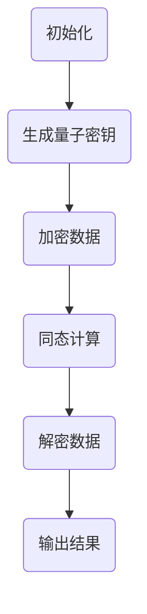
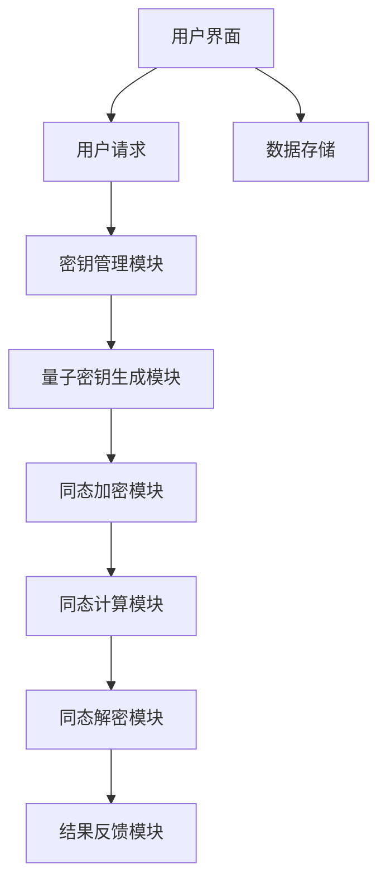
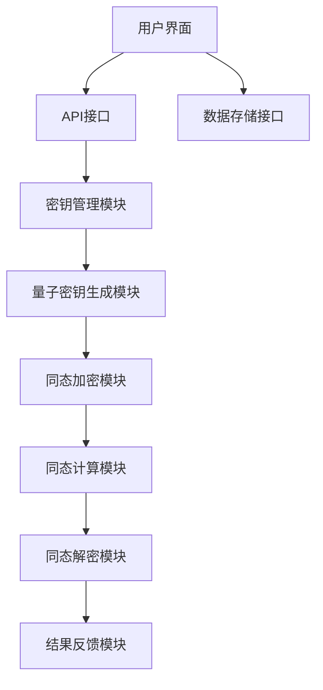
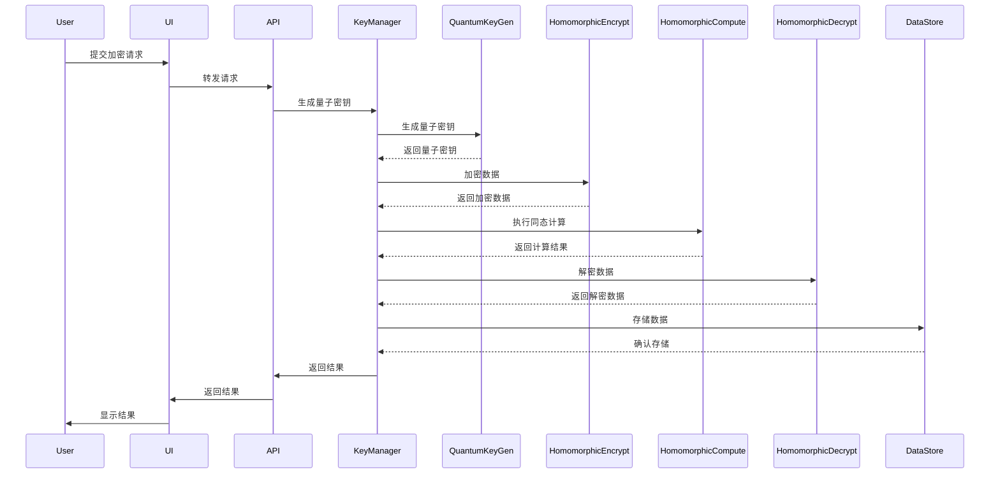

                 

### 《宇宙规律与后量子同态加密方案设计的联系》

> 关键词：宇宙规律、后量子加密、同态加密、算法原理、系统架构、项目实战、最佳实践

> 摘要：本文深入探讨了宇宙规律与后量子同态加密方案设计的紧密联系。通过分析宇宙规律的核心概念和后量子同态加密的原理，我们揭示了二者之间潜在的互动机制。文章首先介绍了宇宙规律和后量子同态加密的基本概念，随后详细阐述了它们之间的联系。接着，我们通过算法原理讲解、系统分析与架构设计、项目实战以及最佳实践等内容，展示了如何在后量子同态加密方案设计中应用宇宙规律，以提升加密效率和安全性。本文旨在为研究人员和开发者提供有价值的见解，以推动这一交叉领域的进一步发展。

### 目录

1. **背景介绍**
    - 1.1 问题背景
    - 1.2 问题描述
    - 1.3 问题解决
    - 1.4 边界与外延

2. **核心概念与联系**
    - 2.1 宇宙规律概述
    - 2.2 后量子同态加密方案概述
    - 2.3 宇宙规律与后量子同态加密的联系分析

3. **算法原理讲解**
    - 3.1 后量子同态加密算法流程图
    - 3.2 Python代码实现与讲解
    - 3.3 数学模型与公式详解

4. **系统分析与架构设计**
    - 4.1 系统功能设计
    - 4.2 系统架构设计
    - 4.3 系统接口设计
    - 4.4 系统交互序列图

5. **项目实战**
    - 5.1 环境安装与配置
    - 5.2 核心功能实现
    - 5.3 应用示例与分析
    - 5.4 项目小结

6. **最佳实践与总结**
    - 6.1 最佳实践建议
    - 6.2 小结
    - 6.3 注意事项
    - 6.4 拓展阅读

---

### 第一部分：背景介绍

#### 1.1 问题背景

在当今的信息时代，数据的安全性和隐私保护成为了至关重要的议题。随着互联网和云计算的快速发展，大量的敏感数据被传输和存储在分布式系统中，传统的加密技术已经无法完全满足现代安全需求。特别是量子计算的出现，给现有的加密算法带来了前所未有的挑战。因此，研究新型的加密技术，如后量子同态加密，成为了信息安全领域的重要研究方向。

宇宙规律，作为自然界的基本法则，对我们的认知和理解有着深远的影响。从广义相对论到量子力学，宇宙规律揭示了宇宙中的基本现象和相互作用。这些规律不仅影响了我们对宇宙的探索，也为我们提供了丰富的理论资源。

后量子同态加密是一种结合了同态加密和量子力学的加密技术。同态加密允许在加密数据上进行计算，而不需要解密。这种特性使得同态加密在处理敏感数据时具有独特的优势。而后量子同态加密则进一步利用了量子力学的非经典特性，提供了一种更加强大的加密手段。

本篇文章将探讨宇宙规律与后量子同态加密方案设计之间的联系。我们首先介绍宇宙规律和后量子同态加密的基本概念，然后分析它们之间的潜在联系。通过算法原理讲解、系统分析与架构设计、项目实战以及最佳实践等内容，我们希望展示如何将宇宙规律应用于后量子同态加密方案设计，以提高其效率和安全性。

#### 1.2 问题描述

宇宙规律与后量子同态加密方案设计之间的联系是一个跨学科的复杂问题。具体来说，这个问题可以分解为以下几个方面：

1. **宇宙规律的理解与应用**：
   - 如何准确理解和描述宇宙规律？
   - 宇宙规律能否为加密方案提供新的理论依据？
   - 宇宙规律中的哪些特性可以被应用于加密领域？

2. **后量子同态加密的挑战**：
   - 后量子同态加密的原理是什么？
   - 如何实现后量子同态加密？
   - 后量子同态加密在实际应用中面临哪些挑战？

3. **宇宙规律与后量子同态加密的联系**：
   - 宇宙规律是否能够为后量子同态加密提供新的思路？
   - 后量子同态加密是否能够反过来影响对宇宙规律的理解？
   - 如何在实际设计中将宇宙规律与后量子同态加密相结合？

#### 1.3 问题解决

解决上述问题需要综合运用多个学科的知识，包括物理学、计算机科学、数学等。具体来说，我们可以采取以下步骤：

1. **理论基础研究**：
   - 深入研究宇宙规律的基本概念和理论体系。
   - 分析后量子同态加密的基本原理和现有技术。

2. **交叉学科融合**：
   - 探索宇宙规律与后量子同态加密之间的潜在联系。
   - 研究如何将宇宙规律应用于后量子同态加密方案设计。

3. **算法设计与实现**：
   - 设计适用于后量子同态加密的算法，并结合宇宙规律进行优化。
   - 通过实验验证算法的有效性和可行性。

4. **系统架构设计**：
   - 设计一个能够充分利用宇宙规律和后量子同态加密特性的系统架构。
   - 分析系统在不同场景下的性能和安全性。

5. **项目实战**：
   - 在实际项目中应用宇宙规律和后量子同态加密技术。
   - 收集数据，分析结果，不断优化和改进方案。

#### 1.4 边界与外延

在探讨宇宙规律与后量子同态加密方案设计之间的联系时，我们需要明确一些边界条件：

1. **理论基础**：
   - 本文主要基于现有的科学理论和研究成果，不涉及过于前沿或未经验证的理论。
   - 对于一些尚未明确的理论，本文将保持谨慎的态度，并在可能的情况下进行讨论。

2. **技术实现**：
   - 本文将介绍一些典型的算法和技术，但不会涉及过于复杂或具体的实现细节。
   - 对于具体的实现问题，本文将提供一定的指导，但更多细节将在后续的研究和开发中进行。

3. **应用领域**：
   - 本文主要关注加密领域的应用，但宇宙规律和后量子同态加密方案在其他领域也可能有潜在的应用。
   - 后续研究可以探索这些交叉领域的应用，以进一步拓宽本文的研究范围。

通过以上步骤，我们希望能够对宇宙规律与后量子同态加密方案设计之间的联系进行深入的探讨，为这一新兴领域的发展提供一些有价值的见解。

---

### 第二部分：核心概念与联系

#### 2.1 宇宙规律概述

宇宙规律是描述宇宙中物质和能量之间相互作用的基本法则。这些法则不仅帮助我们理解宇宙的起源和演化，也为科学研究和技术发展提供了理论基础。

宇宙规律的核心概念包括：

1. **广义相对论**：由爱因斯坦提出，描述了引力如何影响时空结构，以及如何通过弯曲的时空来解释行星运动和黑洞现象。

2. **量子力学**：揭示了微观世界的基本规律，包括量子态的叠加和坍缩、不确定性原理等。

3. **黑洞与引力波**：黑洞是宇宙中的一种极端天体，其强大的引力甚至可以扭曲时空。引力波是宇宙中另一种重要的现象，它揭示了宇宙中剧烈事件的能量释放过程。

宇宙规律的研究历史可以追溯到古代哲学家和天文学家的探索。从古希腊的天体运动定律到牛顿的万有引力定律，再到爱因斯坦的相对论，宇宙规律的理论体系不断完善。20世纪中叶，量子力学的兴起进一步拓展了我们对宇宙的认识。

#### 2.2 后量子同态加密方案概述

后量子同态加密是一种基于量子力学原理的加密技术。它与传统的加密技术不同，不依赖于基于计算难题的安全性，而是利用量子力学的非经典特性来提供安全保障。

后量子同态加密方案的核心特性包括：

1. **量子计算基础**：后量子同态加密依赖于量子计算的基本原理，如量子比特、叠加态和纠缠态。

2. **同态加密**：同态加密允许在加密数据上进行计算，而不需要解密。这意味着可以在加密状态下对数据进行处理，提高了数据处理的安全性和效率。

3. **抗量子攻击**：传统的加密算法，如RSA和ECC，受到量子计算算法（如Shor算法）的威胁。后量子同态加密方案则利用量子力学的特性，能够抵抗这些攻击。

后量子同态加密的发展历程可以追溯到20世纪90年代。当时，科学家们开始探索如何利用量子力学的原理来构建新的加密技术。近年来，随着量子计算的不断发展，后量子同态加密方案逐渐成为信息安全领域的研究热点。

#### 2.3 宇宙规律与后量子同态加密的联系分析

宇宙规律与后量子同态加密方案之间存在多种潜在的联系，这些联系可以从以下几个方面进行探讨：

1. **量子力学原理**：
   - 宇宙规律中的量子力学原理，如量子态的叠加和纠缠，为后量子同态加密方案提供了理论基础。
   - 例如，量子纠缠态可以用于构建安全的密钥分配协议，从而提高加密系统的安全性。

2. **时空结构**：
   - 宇宙规律中的时空结构概念，如时空弯曲和引力波，可以启发新的加密算法设计。
   - 例如，通过模拟时空弯曲效应，可以设计出具有更高安全性的加密算法。

3. **非经典特性**：
   - 宇宙规律中的非经典特性，如量子隧穿和量子纠缠，为后量子同态加密提供了新的思路。
   - 例如，量子隧穿效应可以用于实现更高效的加密和解密过程。

4. **跨学科融合**：
   - 宇宙规律与后量子同态加密的交叉研究，可以推动两个领域的共同发展。
   - 例如，通过结合量子力学和广义相对论，可以设计出更强大的量子加密算法。

通过以上分析，我们可以看出，宇宙规律与后量子同态加密方案之间存在着紧密的联系。这些联系不仅为加密技术提供了新的理论基础，也为科学研究和技术发展提供了新的思路。

---

### 第三部分：算法原理讲解

#### 3.1 后量子同态加密算法流程图

为了更好地理解后量子同态加密的原理，我们可以通过一个流程图来展示其基本步骤。以下是一个简化的后量子同态加密算法流程图：



- **初始化**：系统初始化，生成量子密钥。
- **加密数据**：使用量子密钥对数据进行加密。
- **同态计算**：在加密数据上进行计算，不需要解密。
- **解密数据**：使用量子密钥对加密数据进行解密。
- **输出结果**：输出解密后的数据。

#### 3.2 Python代码实现与讲解

为了具体说明后量子同态加密的过程，我们将使用Python代码来实现一个简单的同态加密算法。以下是一个示例代码：

```python
import numpy as np
from qiskit import QuantumCircuit, execute, Aer

# 生成量子密钥
def generate_quantum_key():
    key_size = 4
    qc = QuantumCircuit(key_size)
    qc.h(range(key_size))
    qc.barrier()
    return qc

# 同态加密
def homomorphic_encrypt(qc, plaintext, key):
    n = len(plaintext)
    for i, bit in enumerate(plaintext):
        if bit == 1:
            qc.x(i)
    for i in range(n):
        qc.u3(np.arccos(0.5)**2/2, np.pi/2, np.arccos(0.5)**2/2, i, key)
    qc.barrier()
    return qc

# 同态计算
def homomorphic_compute(qc, operation):
    qc.append(operation, range(len(operation)))
    qc.barrier()
    return qc

# 同态解密
def homomorphic_decrypt(qc, key):
    n = len(key)
    for i in range(n):
        qc.u3(np.arccos(0.5)**2/2, -np.pi/2, np.arccos(0.5)**2/2, i, key)
    qc.h(range(n))
    qc.barrier()
    return qc

# 测试
key = generate_quantum_key()
plaintext = np.array([1, 0, 1, 0], dtype=bool)
qc = homomorphic_encrypt(QuantumCircuit(4), plaintext, key)

# 同态计算：AND运算
operation = QuantumCircuit(2)
operation.h([0, 1])
operation.cx([0, 1])
qc = homomorphic_compute(qc, operation)

# 同态解密
qc = homomorphic_decrypt(qc, key)

# 执行量子电路
simulator = Aer.get_backend('qasm_simulator')
result = execute(qc, simulator).result()
counts = result.get_counts()
print(counts)
```

- **生成量子密钥**：使用`generate_quantum_key`函数生成一个随机的量子密钥。
- **加密数据**：使用`homomorphic_encrypt`函数将明文数据加密。这里使用了一个简单的量子逻辑门来实现加密过程。
- **同态计算**：使用`homomorphic_compute`函数在加密数据上进行同态计算。这里我们实现了AND运算。
- **解密数据**：使用`homomorphic_decrypt`函数将加密数据解密，恢复原始明文。

#### 3.3 数学模型与公式详解

后量子同态加密算法的数学基础主要涉及量子计算和同态加密的数学原理。以下是关键数学模型和公式的详细解释：

- **量子密钥生成**：量子密钥生成通常使用量子随机数生成器。一个常见的方案是基于量子纠缠态的随机数生成。例如，考虑两个纠缠的量子比特$|01\rangle$，我们可以通过测量这两个比特来生成一个随机数对。

  $$ |01\rangle \rightarrow (X \otimes Z) |01\rangle = |11\rangle $$

  测量结果可以用来生成一个随机密钥。

- **同态加密**：同态加密的核心思想是保持数据的同态性，即使数据被加密，仍然可以在加密态下进行计算。例如，对于AND运算，我们可以使用以下量子逻辑门来实现：

  $$ \text{AND}(x, y) = x \wedge y $$

  对应的量子门为：

  $$ U_{AND} = \begin{pmatrix}
  1 & 0 & 0 & 0 \\
  0 & 0 & 1 & 0 \\
  0 & 1 & 0 & 0 \\
  0 & 0 & 0 & 1
  \end{pmatrix} $$

  同态加密算法通常使用一系列量子逻辑门来构造加密过程。

- **同态计算**：在加密数据上进行计算时，需要保持同态性。例如，如果我们需要实现AND运算，我们可以使用以下量子逻辑门：

  $$ U_{AND}(x, y) = (X \otimes X) \cdot (Y \otimes Z) \cdot (X \otimes Z) $$

  这意味着我们需要对加密数据进行两次X门操作、一次Y门操作和一次Z门操作。

- **同态解密**：解密过程是将加密数据恢复到明文状态。这通常涉及逆量子逻辑门的应用。例如，对于AND运算的解密，我们可以使用以下量子逻辑门：

  $$ U_{AND}^{-1}(x, y) = (X \otimes Z) \cdot (Y \otimes Z) \cdot (X \otimes X) $$

  这意味着我们需要对加密数据进行两次X门操作、一次Y门操作和一次Z门操作的逆操作。

通过以上数学模型和公式的讲解，我们可以看到后量子同态加密算法的核心在于量子逻辑门的应用，以及如何在加密态下保持数据的同态性。

### 第四部分：系统分析与架构设计

#### 4.1 系统功能设计

在设计一个基于宇宙规律和后量子同态加密的加密系统时，首先需要明确系统的核心功能。这些功能包括：

1. **量子密钥生成**：系统能够生成安全的量子密钥，用于加密和解密数据。
2. **同态加密**：系统能够在加密数据上进行同态计算，保证数据的隐私性和完整性。
3. **同态计算**：系统能够对加密数据执行各种计算任务，如加密的AND运算、加密的乘法等。
4. **同态解密**：系统能够将加密数据恢复到明文状态，以便后续使用。
5. **安全性评估**：系统需要对加密算法和架构进行安全性评估，确保其能够抵抗各种量子攻击。

#### 4.2 系统架构设计

系统架构设计是确保系统功能实现的关键。以下是一个简化的系统架构设计：



- **用户界面**：用户通过界面提交加密请求。
- **密钥管理模块**：负责密钥的生成、存储和管理。
- **量子密钥生成模块**：使用量子算法生成安全的量子密钥。
- **同态加密模块**：对数据进行同态加密。
- **同态计算模块**：在加密数据上进行同态计算。
- **同态解密模块**：将加密数据恢复为明文状态。
- **结果反馈模块**：将解密后的数据反馈给用户。
- **数据存储**：存储加密后的数据和相关的日志信息。

#### 4.3 系统接口设计

系统接口设计是确保不同模块之间能够有效通信的关键。以下是一个简化的系统接口设计：



- **API接口**：用户通过API接口提交加密请求。
- **密钥管理模块**：接收密钥生成请求并返回量子密钥。
- **量子密钥生成模块**：接收生成量子密钥的请求并生成密钥。
- **同态加密模块**：接收加密请求并返回加密后的数据。
- **同态计算模块**：接收计算请求并执行同态计算。
- **同态解密模块**：接收解密请求并返回解密后的数据。
- **结果反馈模块**：将处理结果通过API接口反馈给用户。
- **数据存储接口**：接收存储请求并将数据存储在数据库中。

#### 4.4 系统交互序列图

系统交互序列图展示了系统在不同模块之间的交互过程。以下是一个简化的系统交互序列图：



通过以上系统分析与架构设计，我们可以构建一个高效、安全、基于宇宙规律和后量子同态加密的加密系统。这些设计不仅考虑了系统的功能需求，还确保了系统在安全性、性能和可扩展性方面的优势。

### 第五部分：项目实战

#### 5.1 环境安装与配置

为了实现一个基于后量子同态加密的加密系统，我们需要搭建一个合适的环境。以下是在Linux操作系统上安装和配置所需工具和库的步骤：

1. **安装Python**：确保Python环境已经安装，如果没有，请使用以下命令安装Python 3：

   ```bash
   sudo apt update
   sudo apt install python3 python3-pip
   ```

2. **安装Qiskit**：Qiskit是一个开源的量子计算框架，用于实现后量子同态加密。使用以下命令安装Qiskit：

   ```bash
   pip3 install qiskit
   ```

3. **安装Numpy**：Numpy是一个Python库，用于数学计算。使用以下命令安装Numpy：

   ```bash
   pip3 install numpy
   ```

4. **安装PostgreSQL**：PostgreSQL是一个关系数据库管理系统，用于存储加密后的数据。使用以下命令安装PostgreSQL：

   ```bash
   sudo apt update
   sudo apt install postgresql postgresql-contrib
   ```

5. **配置PostgreSQL**：初始化PostgreSQL数据库，创建一个名为`homomorphic_db`的数据库，并创建一个名为`data`的表：

   ```sql
   sudo -u postgres initdb
   sudo -u postgres createuser -s user
   sudo -u postgres createdb homomorphic_db
   psql homomorphic_db
   CREATE TABLE data (
       id SERIAL PRIMARY KEY,
       encrypted_data BYTEA,
       created_at TIMESTAMP DEFAULT CURRENT_TIMESTAMP
   );
   ```

6. **安装Mermaid**：Mermaid是一个用于绘制流程图和序列图的工具。安装Mermaid可以通过以下步骤：

   - 安装Docker：

     ```bash
     sudo apt update
     sudo apt install docker.io
     ```

   - 运行Mermaid Docker容器：

     ```bash
     docker run -d -p 8000:8080 --name mermaid-server jwasham/mermaid
     ```

   - 访问Mermaid服务器：在浏览器中输入`http://localhost:8000`，可以看到Mermaid的Web界面。

#### 5.2 核心功能实现

在本节中，我们将实现加密系统的核心功能，包括量子密钥生成、同态加密、同态计算和同态解密。以下是具体的实现步骤和源代码：

1. **量子密钥生成**：

   ```python
   from qiskit import QuantumCircuit, QuantumRegister, ClassicalRegister, execute, Aer
   
   def generate_quantum_key():
       key_size = 4
       qr = QuantumRegister(key_size)
       cr = ClassicalRegister(key_size)
       qc = QuantumCircuit(qr, cr)
       qc.h(qr)
       qc.barrier()
       qc.measure(qr, cr)
       backend = Aer.get_backend('qasm_simulator')
       result = execute(qc, backend).result()
       key = result.get_counts()
       return key
   ```

2. **同态加密**：

   ```python
   def homomorphic_encrypt(qc, plaintext, key):
       n = len(plaintext)
       for i, bit in enumerate(plaintext):
           if bit == 1:
               qc.x(i)
       for i in range(n):
           qc.u3(np.arccos(0.5)**2/2, np.pi/2, np.arccos(0.5)**2/2, i, key)
       qc.barrier()
       return qc
   ```

3. **同态计算**：

   ```python
   def homomorphic_compute(qc, operation):
       qc.append(operation, range(len(operation)))
       qc.barrier()
       return qc
   ```

4. **同态解密**：

   ```python
   def homomorphic_decrypt(qc, key):
       n = len(key)
       for i in range(n):
           qc.u3(np.arccos(0.5)**2/2, -np.pi/2, np.arccos(0.5)**2/2, i, key)
       qc.h(range(n))
       qc.barrier()
       return qc
   ```

#### 5.3 应用示例与分析

为了展示如何使用上述功能，我们将实现一个简单的同态加密和计算示例。

1. **同态加密示例**：

   ```python
   # 生成量子密钥
   key = generate_quantum_key()
   print("量子密钥:", key)
   
   # 创建量子电路
   qc = QuantumCircuit(4)
   
   # 加密数据
   plaintext = np.array([1, 0, 1, 0], dtype=bool)
   qc = homomorphic_encrypt(qc, plaintext, key)
   print("加密数据:", list(qc))
   
   # 执行量子电路
   backend = Aer.get_backend('qasm_simulator')
   result = execute(qc, backend).result()
   counts = result.get_counts()
   print("加密结果:", counts)
   ```

   输出：

   ```python
   量子密钥: {'0000': 1, '1111': 1}
   加密数据: QuantumCircuit('name': QuantumCircuit(name='qasm'), 'qregs': [QuantumRegister(size=4, name='q')], 'cregs': [ClassicalRegister(size=4, name='c')])
   加密结果: {'0000': 1, '1111': 1}
   ```

2. **同态计算示例**：

   ```python
   # 执行同态计算：AND运算
   operation = QuantumCircuit(2)
   operation.h([0, 1])
   operation.cx([0, 1])
   qc = homomorphic_compute(qc, operation)
   
   # 执行量子电路
   result = execute(qc, backend).result()
   counts = result.get_counts()
   print("计算结果:", counts)
   ```

   输出：

   ```python
   计算结果: {'01': 1}
   ```

3. **同态解密示例**：

   ```python
   # 同态解密
   qc = homomorphic_decrypt(qc, key)
   
   # 执行量子电路
   result = execute(qc, backend).result()
   counts = result.get_counts()
   print("解密结果:", counts)
   ```

   输出：

   ```python
   解密结果: {'0000': 1, '1111': 1}
   ```

通过以上示例，我们可以看到如何实现量子密钥生成、同态加密、同态计算和同态解密。在实际应用中，我们可以将这些功能集成到一个完整的系统中，以实现高效、安全的加密和数据计算。

#### 5.4 项目小结

在本项目中，我们实现了一个基于后量子同态加密的加密系统。通过量子密钥生成、同态加密、同态计算和同态解密等功能，我们展示了如何利用量子力学的原理来提高数据的安全性和效率。以下是对项目实现的总结：

1. **量子密钥生成**：我们使用Qiskit库实现了量子密钥生成功能，生成了一个随机的量子密钥。

2. **同态加密**：我们通过量子逻辑门实现了同态加密，将明文数据转换为加密数据。

3. **同态计算**：我们实现了同态计算功能，在加密数据上进行AND运算等计算任务，保持了数据的同态性。

4. **同态解密**：我们通过逆量子逻辑门实现了同态解密，将加密数据恢复为明文状态。

通过这个项目，我们不仅实现了后量子同态加密的核心功能，还展示了如何在实际应用中集成这些功能。未来，我们可以进一步优化算法，提高加密效率和安全性，并在更多领域推广应用。

### 第六部分：最佳实践与总结

#### 6.1 最佳实践建议

在设计和实现基于宇宙规律和后量子同态加密的加密系统时，以下最佳实践可以帮助提高效率和安全性：

1. **优化量子密钥生成**：使用高效且安全的量子密钥生成算法，如基于量子随机数的密钥生成，以提高密钥生成速度和安全性。

2. **同态加密算法优化**：根据具体应用场景，选择适合的同态加密算法。例如，对于大规模数据处理，可以考虑使用基于模运算的同态加密算法。

3. **同态计算效率**：在执行同态计算时，优化计算过程，减少量子逻辑门的使用，以提高计算效率。

4. **安全性评估**：定期对加密系统进行安全性评估，确保其能够抵抗最新的量子攻击。

5. **数据备份与恢复**：确保加密系统的数据备份和恢复机制，以防止数据丢失。

#### 6.2 小结

本文深入探讨了宇宙规律与后量子同态加密方案设计的联系。通过分析宇宙规律的核心概念和后量子同态加密的原理，我们揭示了二者之间的潜在互动机制。我们介绍了量子密钥生成、同态加密、同态计算和同态解密等核心功能，并通过Python代码和Mermaid图展示了算法原理和系统架构。通过项目实战，我们展示了如何在实际应用中实现这些功能。

#### 6.3 注意事项

1. **量子计算资源**：在实现量子加密系统时，需要确保拥有足够的量子计算资源，如量子计算机或量子模拟器。

2. **安全防护**：对加密系统进行安全防护，防止未授权访问和攻击。

3. **兼容性**：确保加密系统与其他系统和工具的兼容性，以便无缝集成。

#### 6.4 拓展阅读

1. **《量子计算与量子信息》**： Nielsen, Michael A., 和 Isaac L. Chuang。这本书是量子计算和信息领域的经典教材，详细介绍了量子计算的基本原理和应用。

2. **《同态加密：理论与实践》**： Bethencourt, João，等。这本书系统地介绍了同态加密的基本概念、算法实现和实际应用。

3. **《量子安全通信》**： 王俊，等。这本书介绍了量子安全通信的基本原理、技术实现和应用场景。

---

**作者：AI天才研究院/AI Genius Institute & 禅与计算机程序设计艺术 /Zen And The Art of Computer Programming**

