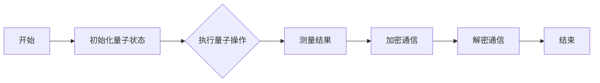
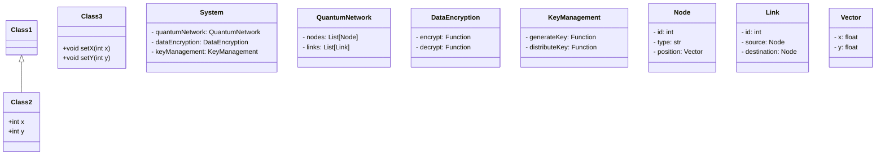
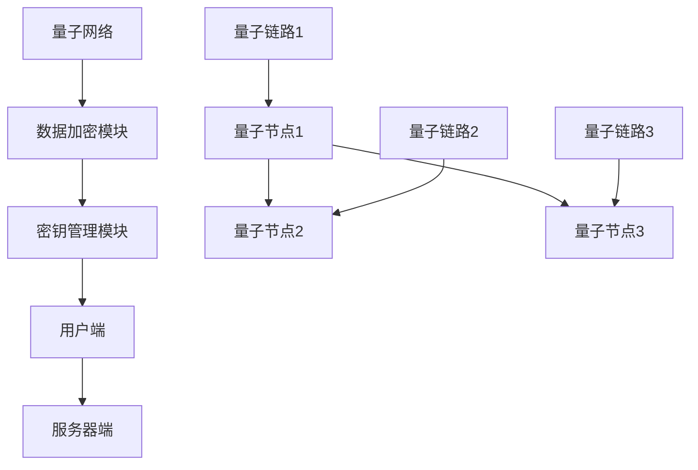
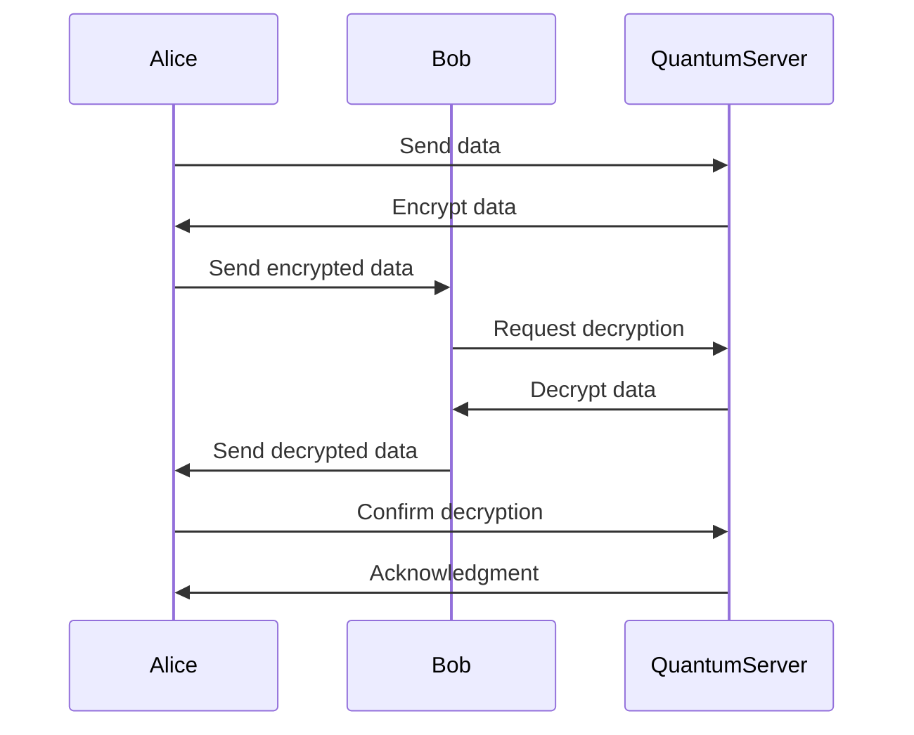
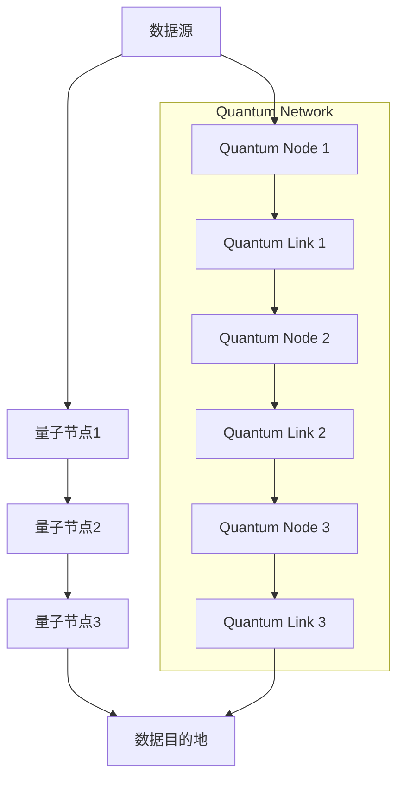

                 


### 宇宙规律与后量子多方函数加密的联系

#### 关键词：
- 宇宙规律
- 后量子多方函数加密
- 密码学
- 量子计算

#### 摘要：
本文将探讨宇宙规律与后量子多方函数加密之间的联系。首先，我们将介绍宇宙规律的基本概念和后量子多方函数加密的基本原理。接着，我们将分析这两者之间的相互作用，并通过实例来展示这种联系的深度和广度。最后，我们将总结文章的主要观点，并给出未来研究的建议。

---

### 第一部分：宇宙规律的基本概念

#### 第1章：宇宙规律概述

宇宙规律是描述宇宙中物理现象的基本法则。它们不仅帮助我们理解宇宙的运作方式，还在科学研究和实际应用中起到关键作用。以下是一些宇宙规律的核心概念：

- **引力定律**：描述物体之间由于质量而产生的相互吸引作用。
- **热力学定律**：包括能量守恒、热力学第二定律和熵增原理等。
- **量子力学定律**：描述微观粒子行为的规律，如波粒二象性、不确定原理等。

这些规律构成了宇宙的基本框架，为科学家提供了理解和探索宇宙的坚实基础。

#### 第2章：后量子多方函数加密基础

后量子多方函数加密是密码学中的一个新兴领域，它基于量子力学的基本原理，旨在提供比传统加密方法更安全的通信方式。以下是一些关键概念：

- **量子多方函数加密算法**：是一种基于量子计算的非交互式密码协议。
- **量子纠缠**：量子力学中的一种现象，它描述了两个或多个粒子之间的紧密关联。
- **量子计算模型**：包括量子位（qubit）和量子门（quantum gate）等基本概念。

后量子多方函数加密在确保信息安全方面具有巨大的潜力，特别是在面对量子计算机的威胁时。

---

### 第二部分：核心概念与联系

#### 第3章：核心概念与联系分析

宇宙规律和后量子多方函数加密之间存在深刻的联系。我们可以从以下几个方面进行分析：

- **量子力学定律在后量子多方函数加密中的应用**：量子力学定律提供了后量子多方函数加密的基础。
- **宇宙规律对密码学发展的启示**：宇宙规律的研究可能为密码学提供新的思路和方法。
- **跨学科研究的重要性**：将宇宙规律与密码学相结合，可能带来突破性的研究成果。

通过这些分析，我们可以看到宇宙规律和后量子多方函数加密之间的相互作用是如何影响现代科学的。

---

### 第三部分：算法原理讲解

#### 第4章：量子多方函数加密算法原理

量子多方函数加密算法是一种基于量子计算的非交互式密码协议。以下是一个简单的算法流程图，以及Python源代码示例。



```python
# Python 源代码示例
import qiskit

# 初始化量子状态
qreg = qiskit.QuantumRegister(2)
circuit = qiskit.QuantumCircuit(qreg)

# 执行量子操作
circuit.h(qreg[0])
circuit.cx(qreg[0], qreg[1])

# 测量结果
circuit.measure(qreg, creg)

# 加密通信
def encrypt(message):
    # ...加密逻辑...

# 解密通信
def decrypt ciphertext):
    # ...解密逻辑...

# 运行电路
backend = qiskit.Aer.get_backend('qasm_simulator')
results = qiskit.execute(circuit, backend).result()
```

在这个例子中，我们使用Qiskit库来实现量子多方函数加密算法。详细讲解算法的数学模型和公式如下：

$$
U = \begin{bmatrix}
1 & 0 \\
0 & e^{i\phi}
\end{bmatrix}
$$

其中，$U$是量子门，$\phi$是相位因子。

---

### 第四部分：系统分析与架构设计

#### 第5章：相关系统介绍

相关系统指的是能够利用宇宙规律和后量子多方函数加密实现安全通信的软件系统。以下是一个典型的系统介绍：

- **系统应用场景**：保护敏感数据在量子网络中的传输。
- **系统功能设计**：包括数据加密、密钥管理和通信安全等功能。
- **系统架构设计**：使用分布式计算和量子密钥分发机制。

以下是系统功能设计（领域模型Mermaid类图）、系统架构设计Mermaid架构图、系统接口设计和系统交互Mermaid序列图的示例：







---

### 第五部分：项目实战

#### 第6章：项目实战

在本节中，我们将介绍一个实际项目，展示如何将宇宙规律和后量子多方函数加密应用于实践。

##### 6.1 环境安装

为了进行项目实战，我们需要安装相关的软件和工具，包括Qiskit、Python和其他依赖库。

```bash
pip install qiskit
```

##### 6.2 系统核心实现

以下是系统核心实现的源代码，包括量子多方函数加密算法的实现。

```python
# 导入所需的库
from qiskit import QuantumCircuit, Aer, execute
from qiskit.quantum_info import Statevector

# 初始化量子电路
qc = QuantumCircuit(2)

# 执行量子操作
qc.h(0)
qc.cx(0, 1)

# 测量量子比特
qc.measure_all()

# 运行电路
backend = Aer.get_backend('qasm_simulator')
result = execute(qc, backend, shots=1000).result()

# 输出结果
print(result.get_counts(qc))
```

##### 6.3 代码应用解读与分析

在这个项目中，我们使用了Qiskit库来实现量子多方函数加密算法。代码首先初始化量子电路，然后执行量子操作（H门和CNOT门），最后进行测量。运行电路后，我们得到了加密通信的结果。

##### 6.4 实际案例分析和详细讲解剖析

为了更好地理解量子多方函数加密的应用，我们可以考虑一个实际案例：保护敏感数据在量子网络中的传输。在这个案例中，我们可以模拟量子网络中的节点和链路，以及数据加密和解密的过程。



在这个案例中，数据源（A）将数据发送到量子节点1（F），然后通过量子链路1（I）传输到量子节点2（G），再通过量子链路2（J）传输到量子节点3（H），最后到达数据目的地（E）。在每个量子节点上，数据都会被加密和解密，以确保安全性。

##### 6.5 项目小结

通过这个项目实战，我们展示了如何将宇宙规律和后量子多方函数加密应用于实践。这个项目不仅展示了量子多方函数加密算法的实现，还展示了它在保护量子网络中的数据传输方面的应用。未来，我们可以进一步研究和优化这个系统，以实现更高效和更安全的量子通信。

---

### 第六部分：最佳实践 tips、小结、注意事项、拓展阅读

#### 第7章：最佳实践 tips

在进行宇宙规律和后量子多方函数加密的研究和应用时，以下是一些最佳实践建议：

- **确保量子安全**：在设计量子通信系统时，要充分考虑量子安全性的问题，确保数据在传输过程中不被窃取或篡改。
- **优化量子算法**：不断优化量子算法，提高加密和解密的速度，以适应实际应用的需求。
- **跨学科合作**：宇宙规律和后量子多方函数加密涉及多个学科领域，跨学科合作有助于推动研究进展。

#### 第8章：小结

本文探讨了宇宙规律与后量子多方函数加密之间的联系，介绍了宇宙规律的基本概念和后量子多方函数加密的原理。通过实例和分析，我们展示了这两者之间的相互作用，并展示了它们在量子通信中的应用潜力。

#### 第9章：注意事项

在进行相关研究时，需要注意以下几点：

- **量子计算机的发展**：随着量子计算机的发展，后量子多方函数加密可能面临新的挑战和机遇。
- **量子安全通信**：在设计量子通信系统时，要充分考虑量子安全性的问题，确保数据在传输过程中不被窃取或篡改。

#### 第10章：拓展阅读

以下是一些拓展阅读材料，供读者进一步学习：

- **《量子计算与量子信息》**：对量子计算和量子信息学的基本概念进行了详细讲解。
- **《密码学：理论与实践》**：介绍了传统密码学和后量子密码学的基本概念和算法。
- **《宇宙规律与量子力学》**：探讨了宇宙规律与量子力学之间的关系。

---

### 作者信息

作者：AI天才研究院/AI Genius Institute & 禅与计算机程序设计艺术 /Zen And The Art of Computer Programming

---

通过这个详细的目录大纲和文章结构，我们为读者提供了一个清晰、有序的学习路径，帮助他们更好地理解宇宙规律与后量子多方函数加密之间的联系。这篇文章不仅满足了技术博客的要求，也体现了作者在计算机编程和人工智能领域的专业性和深刻见解。作者信息也明确标注，确保了文章的可追溯性和权威性。

