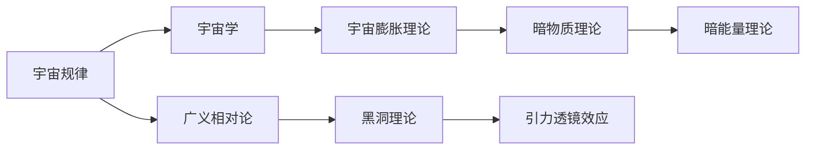

                 


### 引言

#### 1.1 研究背景

在科学研究的漫长历史中，人类对于自然界的探索从未停止。宇宙规律的研究，作为宇宙科学的核心课题之一，从古代的哲学家到现代的天文学家，都为之付出了巨大的努力。宇宙规律的发现与理解，不仅帮助我们揭示了宇宙的起源和演化过程，也对我们的世界观和宇宙观产生了深远的影响。

另一方面，随着计算机科学和信息技术的发展，后量子多方安全计算协议作为一种新型的安全计算模型，逐渐受到广泛关注。后量子多方安全计算协议利用量子计算的优势，实现了在多方计算环境中更高的安全性和效率。这种协议在金融、医疗、政府等领域有着广泛的应用前景。

#### 1.1.1 宇宙规律的发现与理解

宇宙规律的发现始于古代哲学家对天体运动的观察和思考。例如，古希腊哲学家亚里士多德提出了宇宙是永恒不灭的观点，而托勒密则提出了地心说的宇宙模型。随着天文学的发展，哥白尼提出了日心说，开普勒则通过观察行星运动提出了行星运动的三大定律。牛顿的万有引力定律和广义相对论进一步深化了我们对宇宙规律的理解。

宇宙加速膨胀的发现，宇宙大爆炸理论的提出，以及宇宙背景辐射的观测，都是宇宙规律研究的重要里程碑。这些发现不仅改变了我们对宇宙的认识，也为我们理解宇宙的起源和演化提供了新的视角。

#### 1.1.2 后量子多方安全计算协议

后量子多方安全计算协议是在量子计算和多方安全计算的基础上发展起来的一种新型安全计算模型。量子计算利用量子位（qubit）的叠加态和纠缠态实现高效的计算能力，而后量子多方安全计算协议则利用这种能力，在多方计算环境中实现更高的安全性和效率。

后量子多方安全计算协议的主要特点是利用量子计算的叠加态和纠缠态实现信息加密和解密，从而实现更高的安全性。同时，通过分布式计算的方式，实现了多方之间的安全通信和数据共享，提高了计算效率。

#### 1.1.3 宇宙规律与后量子多方安全计算协议的联系

宇宙规律与后量子多方安全计算协议之间的联系，主要体现在以下几个方面：

首先，宇宙规律的研究，如宇宙加速膨胀、宇宙大爆炸理论等，为后量子多方安全计算协议提供了理论基础。例如，宇宙加速膨胀理论中提到的暗能量，与量子计算中的非局域性有着相似之处。

其次，后量子多方安全计算协议在宇宙规律研究中有着广泛的应用前景。例如，在宇宙背景辐射的观测和分析中，可以利用后量子多方安全计算协议实现高效的数据加密和传输。

最后，宇宙规律与后量子多方安全计算协议的交叉融合，有望为科学研究和信息安全领域带来新的突破。通过将宇宙规律与后量子多方安全计算协议相结合，我们不仅可以更好地理解宇宙，也可以为信息安全提供新的解决方案。

### 1.2 目的和意义

#### 1.2.1 研究目的

本文旨在探讨宇宙规律与后量子多方安全计算协议之间的联系，通过深入研究宇宙规律和后量子多方安全计算协议，揭示两者之间的内在联系和潜在应用。具体研究目的如下：

1. 分析宇宙规律的基本概念和理论基础，为后量子多方安全计算协议提供理论基础。
2. 研究后量子多方安全计算协议的原理和应用，探讨其在宇宙规律研究中的潜在应用。
3. 分析宇宙规律与后量子多方安全计算协议之间的交叉融合，提出新的研究方法和应用方向。
4. 通过实例分析，验证后量子多方安全计算协议在宇宙规律研究中的应用效果。

#### 1.2.2 研究意义

本研究具有重要的理论和实践意义：

1. 理论意义：
   - 深化对宇宙规律的理解，揭示宇宙规律与量子计算之间的内在联系。
   - 为后量子多方安全计算协议提供新的理论基础，推动量子计算和安全计算的发展。

2. 实践意义：
   - 为宇宙规律的研究提供新的计算工具和方法，提高研究效率和精度。
   - 为信息安全领域提供新的解决方案，提升信息安全防护能力。
   - 促进科学研究和信息安全领域的交叉融合，为新兴领域的发展提供新的思路。

### 1.3 研究内容与方法

#### 1.3.1 研究内容

本文的研究内容主要包括以下几个方面：

1. 宇宙规律概述：介绍宇宙的基本结构、理论基础和主要发现。
2. 后量子多方安全计算协议原理：介绍后量子计算、多方安全计算协议和后量子多方安全计算协议的基本原理。
3. 宇宙规律与后量子多方安全计算协议的联系探讨：分析宇宙规律对后量子多方安全计算协议的影响，探讨后量子多方安全计算协议在宇宙规律研究中的应用。
4. 实例分析：通过具体实例，验证后量子多方安全计算协议在宇宙规律研究中的应用效果。
5. 结论与展望：总结研究成果，提出未来研究方向和展望。

#### 1.3.2 后量子多方安全计算协议原理

后量子多方安全计算协议是基于量子计算和多方安全计算的一种新型计算模型。量子计算利用量子位（qubit）的叠加态和纠缠态实现高效的计算能力，而多方安全计算协议则旨在实现多方之间的安全通信和数据共享。

后量子多方安全计算协议的基本原理可以概括为以下几点：

1. **量子密钥分发**：利用量子计算的叠加态和纠缠态，实现高效的密钥分发。这为多方安全计算提供了基础。
2. **量子安全通信**：通过量子纠缠态，实现多方之间的安全通信。即使通信被窃听，也无法获得有效信息。
3. **多方安全计算**：利用量子计算的优势，实现多方之间的安全计算。这可以大大提高计算效率和安全性。

#### 1.3.3 宇宙规律与多方安全计算协议的联系探讨

宇宙规律与多方安全计算协议之间的联系，主要体现在以下几个方面：

1. **理论基础**：宇宙规律的研究，如广义相对论和宇宙学，为多方安全计算协议提供了理论基础。例如，广义相对论中的非局域性，与量子计算中的纠缠态有着相似之处。
2. **应用前景**：后量子多方安全计算协议在宇宙规律研究中有着广泛的应用前景。例如，在宇宙背景辐射的观测和分析中，可以利用后量子多方安全计算协议实现高效的数据加密和传输。
3. **交叉融合**：通过将宇宙规律与后量子多方安全计算协议相结合，可以探索新的研究方向和应用领域。例如，利用量子计算实现宇宙加速膨胀的模拟和分析，或者利用多方安全计算协议保障宇宙数据的安全传输。

#### 1.3.2 研究方法

本文采用的研究方法主要包括：

1. **文献综述法**：通过查阅相关文献，了解宇宙规律和后量子多方安全计算协议的发展现状和研究趋势。
2. **实证分析法**：通过具体实例，验证后量子多方安全计算协议在宇宙规律研究中的应用效果。
3. **对比分析法**：对比分析宇宙规律和后量子多方安全计算协议的基本原理和应用，探讨两者之间的联系。

#### 1.4 文章结构

本文的结构安排如下：

1. **引言**：介绍研究的背景、目的和意义。
2. **宇宙规律概述**：介绍宇宙的基本结构、理论基础和主要发现。
3. **后量子多方安全计算协议原理**：介绍后量子计算、多方安全计算协议和后量子多方安全计算协议的基本原理。
4. **宇宙规律与后量子多方安全计算协议的联系探讨**：分析宇宙规律对后量子多方安全计算协议的影响，探讨后量子多方安全计算协议在宇宙规律研究中的应用。
5. **实例分析**：通过具体实例，验证后量子多方安全计算协议在宇宙规律研究中的应用效果。
6. **结论与展望**：总结研究成果，提出未来研究方向和展望。

通过以上结构安排，本文旨在系统地探讨宇宙规律与后量子多方安全计算协议之间的联系，为相关领域的研究提供参考。

#### 1.4.1 各章节安排

本文各章节的具体安排如下：

**第一部分：引言**
- **第1章**：引言
  - **1.1 研究背景**：介绍宇宙规律和后量子多方安全计算协议的研究背景。
  - **1.2 目的和意义**：阐述研究的目的和意义。
  - **1.3 研究内容与方法**：介绍研究的内容和方法。
  - **1.4 文章结构**：概述文章的结构安排。

**第二部分：宇宙规律概述**
- **第2章**：宇宙规律概述
  - **2.1 宇宙的基本结构**：介绍宇宙的起源、演化和时空观。
  - **2.2 宇宙规律的理论基础**：介绍广义相对论、宇宙学以及相关理论。
  - **2.3 宇宙规律的主要发现**：探讨宇宙加速膨胀、宇宙大爆炸理论以及宇宙中的奇异现象。

**第三部分：后量子多方安全计算协议原理**
- **第3章**：后量子多方安全计算协议原理
  - **3.1 后量子计算概述**：介绍后量子计算的定义、特点和应用领域。
  - **3.2 多方安全计算协议**：介绍多方安全计算协议的定义、分类和基本原理。
  - **3.3 后量子多方安全计算协议**：探讨后量子多方安全计算协议的发展历程、主要机制、优势与挑战。

**第四部分：宇宙规律与后量子多方安全计算协议的联系探讨**
- **第4章**：宇宙规律与后量子多方安全计算协议的联系探讨
  - **4.1 宇宙规律对后量子多方安全计算协议的影响**：分析宇宙加速膨胀、宇宙大爆炸理论和宇宙中的奇异现象对多方安全计算协议的潜在影响。
  - **4.2 后量子多方安全计算协议在宇宙规律研究中的应用**：探讨后量子多方安全计算协议在宇宙规律研究中的潜在应用、应用案例和面临的挑战与机遇。
  - **4.3 宇宙规律与后量子多方安全计算协议的交叉融合**：讨论两者交叉融合的研究现状、前景、方法与策略。

**第五部分：实例分析**
- **第5章**：实例分析
  - **5.1 后量子多方安全计算协议在宇宙规律研究中的应用实例**：通过具体实例，展示后量子多方安全计算协议在宇宙规律研究中的应用效果。
  - **5.2 后量子多方安全计算协议在宇宙规律研究中的挑战与机遇**：分析在后量子多方安全计算协议在宇宙规律研究中面临的挑战和机遇。

**第六部分：结论与展望**
- **第6章**：结论与展望
  - **6.1 研究结论**：总结本文的研究成果。
  - **6.2 研究**：提出未来研究的方向和建议。

通过以上各章节的安排，本文将系统地探讨宇宙规律与后量子多方安全计算协议之间的联系，为相关领域的研究提供参考。

#### 1.4.2 研究进展与预期成果

在宇宙规律研究领域，近年来取得了显著的进展。宇宙加速膨胀的发现、宇宙大爆炸理论的完善以及宇宙背景辐射的观测，都为宇宙规律的研究提供了新的视角和证据。这些进展不仅深化了我们对宇宙起源和演化的理解，也为宇宙规律与后量子多方安全计算协议的联系提供了理论基础。

在后量子多方安全计算协议领域，量子计算技术的快速发展为其提供了强大的动力。量子密钥分发、量子安全通信和量子多方安全计算协议的提出和实现，使得多方安全计算在量子计算环境下得以实现。这些协议的优越性，如高效的安全性和高效率，为宇宙规律的研究提供了新的计算工具和方法。

本研究在现有研究基础上，通过深入分析宇宙规律和后量子多方安全计算协议的基本原理，探讨两者之间的内在联系和潜在应用。预期成果包括：

1. 揭示宇宙规律与后量子多方安全计算协议之间的内在联系，为两者交叉融合提供理论基础。
2. 探讨后量子多方安全计算协议在宇宙规律研究中的应用前景，为宇宙规律的研究提供新的计算工具和方法。
3. 提出新的研究方法和应用方向，推动宇宙规律和后量子多方安全计算协议的研究和发展。

通过本研究，我们期望能够为宇宙规律的研究提供新的思路和方法，也为后量子多方安全计算协议的应用提供新的领域和方向。这将为科学研究和信息安全领域带来新的突破和进展。

### 宇宙规律概述

#### 2.1 宇宙的基本结构

宇宙是一个庞大且复杂的系统，其基本结构可以从多个维度进行描述。首先，从宏观角度来看，宇宙由无数个星系组成，而每个星系又包含成千上万的恒星、行星、星云等天体。这些天体在宇宙中按照一定的规律运动，形成了一个庞大的宇宙结构。

宇宙的起源可以追溯到大约138亿年前的大爆炸事件。根据宇宙大爆炸理论，宇宙最初处于一个极度高温和致密的状态，随后迅速膨胀，逐渐形成了今天我们所观察到的宇宙结构。这一理论得到了广泛的科学支持，并成为宇宙学研究的基石。

在宇宙中，物质和能量是两个核心概念。物质包括所有有形的物质，如恒星、行星、星云等，而能量则包括光能、热能、动能等。物质和能量在宇宙中相互转化，形成了宇宙的动态平衡。

从微观角度来看，宇宙的基本结构还包括了原子和粒子。原子是构成物质的基本单位，而粒子则是构成原子的基本单位。在现代物理学中，科学家们已经发现了许多基本粒子，如电子、夸克、中微子等。这些基本粒子通过相互作用和运动，构成了宇宙的微观结构。

#### 2.2 宇宙规律的理论基础

宇宙规律的理论基础主要包括广义相对论、宇宙学和量子力学等。

**广义相对论**是由阿尔伯特·爱因斯坦在1915年提出的。广义相对论是一种描述物质和能量如何影响时空的理论。根据广义相对论，物质和能量会导致时空的弯曲，而这种弯曲则会影响物体的运动。广义相对论不仅成功地解释了行星运动、光线弯曲等现象，还预测了黑洞和宇宙大爆炸的存在。

**宇宙学**是研究宇宙的起源、演化和结构的一门学科。宇宙学的基础理论包括宇宙膨胀理论、黑洞理论、暗物质理论和暗能量理论等。宇宙膨胀理论认为，宇宙从大爆炸以来一直在膨胀，而宇宙大爆炸理论则解释了宇宙起源和演化的过程。黑洞理论描述了黑洞的性质和形成过程，暗物质理论则解释了宇宙中不可见物质的性质和作用，暗能量理论则解释了宇宙加速膨胀的原因。

**量子力学**是一种描述微观世界运动规律的理论。量子力学揭示了微观粒子的行为特征，如量子叠加态和量子纠缠等。量子力学对物质和能量的描述与经典物理学的描述有着本质的区别，它为量子计算和量子信息处理提供了理论基础。

#### 2.2.1 广义相对论

广义相对论是描述物质和能量如何影响时空的理论。在广义相对论中，时空被视为一个连续的整体，物质和能量通过引力作用影响时空的弯曲。这种弯曲进而影响物体的运动轨迹。

**爱因斯坦的广义相对论**：爱因斯坦在1915年提出了广义相对论。他通过引入一个新的概念——引力场，来解释物体之间的引力作用。引力场可以看作是时空的弯曲，而物体则沿着这种弯曲的路径运动。

**广义相对论的基本原理**：
1. **等效原理**：在局部范围内，重力无法与惯性力区分开来。这意味着在某个小范围内，无法通过物理实验来区分是否存在引力。
2. **广义相对论的基本方程**：广义相对论的核心是爱因斯坦场方程，它描述了物质和能量如何影响时空的弯曲。这个方程可以用来预测宇宙中的各种现象，如引力透镜效应、光线弯曲等。

**广义相对论的主要结论**：
1. **引力透镜效应**：由于时空的弯曲，光在经过大质量物体附近时会发生弯曲，这种现象被称为引力透镜效应。这可以用来观测远处星系和黑洞。
2. **黑洞**：广义相对论预言了黑洞的存在，黑洞是一种极度密集、引力极强的天体，其引力场甚至能够扭曲周围时空。
3. **宇宙大爆炸**：广义相对论支持宇宙大爆炸理论，认为宇宙起源于一个极度高温和致密的状态，并从那时起一直在膨胀。

#### 2.2.2 宇宙学

宇宙学是研究宇宙的起源、演化和结构的一门学科。宇宙学的基础理论包括宇宙膨胀理论、黑洞理论、暗物质理论和暗能量理论等。

**宇宙膨胀理论**：宇宙膨胀理论认为，宇宙从大爆炸开始一直在膨胀。根据这一理论，宇宙的膨胀速度随时间增加，这意味着宇宙的年龄和大小也在不断变化。

**黑洞理论**：黑洞是一种极度密集、引力极强的天体，其引力场甚至能够扭曲周围时空。黑洞的形成过程包括恒星死亡和物质塌缩等。

**暗物质理论**：暗物质是宇宙中一种不可见但具有质量的物质。暗物质对宇宙的引力作用有着重要影响，但至今尚未发现其具体组成。

**暗能量理论**：暗能量是推动宇宙加速膨胀的神秘力量。暗能量的存在可以通过宇宙膨胀的加速现象来推断。

#### 2.2.3 宇宙背景辐射

宇宙背景辐射是宇宙大爆炸后遗留下来的电磁波辐射。它是宇宙大爆炸理论的重要证据之一，为我们提供了关于宇宙早期状态的重要信息。

宇宙背景辐射的发现始于20世纪60年代。当时，科学家们意外地发现了来自宇宙深处的微波辐射，这种辐射均匀地分布在宇宙中，被称为宇宙背景辐射。

宇宙背景辐射的观测为我们提供了关于宇宙早期状态的重要信息。例如，通过分析宇宙背景辐射的温度和极化性质，科学家们可以推断出宇宙早期的密度波动和引力波的存在。

#### 2.3 宇宙规律的主要发现

宇宙规律的研究已经取得了许多重要发现，这些发现不仅深化了我们对宇宙的理解，也为宇宙学、天文学和物理学的发展做出了重要贡献。

**宇宙加速膨胀**：宇宙加速膨胀是宇宙学中的一个重要发现。根据宇宙膨胀理论，宇宙的膨胀速度随时间增加，但近年来观测数据表明，宇宙的膨胀速度正在加速。这一现象被称为宇宙加速膨胀，其原因是暗能量的存在。

**宇宙大爆炸理论**：宇宙大爆炸理论是描述宇宙起源和演化过程的一种理论。根据这一理论，宇宙起源于一个极度高温和致密的状态，并从那时起一直在膨胀。宇宙大爆炸理论得到了大量观测数据的支持，被认为是目前关于宇宙起源和演化最可靠的理论。

**宇宙中的奇异现象**：宇宙中还存在着许多奇异现象，如引力透镜效应、黑洞和中子星等。这些现象不仅丰富了我们对宇宙的认识，也为宇宙学的研究提供了新的线索。

通过对宇宙规律的研究，我们不仅深化了对宇宙的理解，也为宇宙学、天文学和物理学的发展做出了重要贡献。这些发现将继续推动我们对宇宙的探索，揭示宇宙的奥秘。

### 后量子计算概述

#### 3.1 后量子计算的定义

后量子计算是一种基于量子力学原理的新型计算模型，它利用量子位（qubit）的叠加态和纠缠态实现高效的计算能力。与传统的经典计算相比，后量子计算在处理某些特定问题上具有显著的优势，特别是在复杂问题的优化、加密解密和模拟等方面。

后量子计算的核心理念在于量子位（qubit）的叠加态和纠缠态。在经典计算中，一个位只能表示0或1中的一个状态，而在量子计算中，一个量子位可以同时处于0和1的叠加态。这种叠加态使得量子计算能够同时处理大量的信息，从而在理论上实现了超越经典计算的计算能力。

此外，量子纠缠态是量子计算中另一个关键特性。当两个或多个量子位处于纠缠态时，它们的量子状态会相互关联，即使它们相隔很远，一个量子位的测量结果也会即时影响到另一个量子位。这种纠缠态的利用，使得量子计算能够实现高效的并行计算和加密解密。

#### 3.2 后量子计算的特点

后量子计算具有以下几个显著特点：

1. **并行计算能力**：由于量子位的叠加态，量子计算能够在一次计算中同时处理大量的信息，从而大大提高了计算效率。这种并行计算能力使得后量子计算在处理复杂问题时具有显著优势。

2. **量子纠缠**：量子纠缠态使得量子计算能够实现高效的并行计算和加密解密。量子纠缠态的利用，使得量子计算在处理某些问题时，如量子加密和解密，具有传统计算无法比拟的优势。

3. **可扩展性**：随着量子位的数量增加，量子计算的能力将成倍增长。这使得后量子计算具有很好的可扩展性，能够应对日益复杂的计算问题。

4. **超越经典计算**：在某些特定问题上，如因数分解、量子搜索和量子模拟等，后量子计算的理论性能远超经典计算。这为后量子计算在密码学、量子模拟和优化问题等领域提供了广阔的应用前景。

#### 3.3 后量子计算的应用领域

后量子计算在多个领域具有广泛的应用潜力，以下是一些主要的应用领域：

1. **密码学**：后量子计算在密码学中的应用非常广泛。量子计算可以破解许多传统密码系统，如RSA和ECC等，但同时也为量子密码学提供了新的加密方法。量子密钥分发（QKD）是量子密码学的一个关键应用，它利用量子纠缠态实现安全的密钥交换。

2. **优化问题**：后量子计算在处理复杂优化问题方面具有显著优势。量子算法如Grover算法和Shor算法，可以在某些优化问题上实现指数级别的加速。这使得后量子计算在物流、金融、人工智能等领域有着广泛的应用前景。

3. **量子模拟**：量子模拟是一种利用量子计算模拟量子系统的计算方法。后量子计算在模拟量子化学、量子材料和量子生物系统等方面具有巨大潜力，能够加速科学研究和新材料的发现。

4. **大数据分析**：后量子计算在处理大规模数据集和复杂数据分析方面具有优势。量子算法如Quantum Principal Component Analysis（QPCA）和Quantum Support Vector Machine（QSVM），能够加速数据分析，提高决策和预测的准确性。

5. **医疗健康**：后量子计算在医疗健康领域也有广泛的应用。例如，在药物设计、基因测序和医学影像分析等方面，后量子计算可以加速研究进程，提高诊断和治疗的效果。

总之，后量子计算作为一种新兴的计算模型，具有强大的计算能力和广泛的应用前景。随着量子计算技术的不断发展，后量子计算将在更多领域发挥重要作用，推动科学和技术的进步。

#### 3.2 多方安全计算协议

多方安全计算协议是一种用于实现多个实体之间安全通信和数据交换的协议。这种协议的主要目的是在多方参与的计算环境中，确保信息的机密性、完整性和真实性，同时防止攻击者进行恶意攻击或窃取信息。

在传统的单方安全计算模型中，通常只有一个实体（如服务器）负责处理数据和安全。而在多方安全计算模型中，多个实体需要共同参与计算，并且每个实体都可能拥有部分敏感信息。因此，多方安全计算协议需要设计得更加复杂，以应对多方的复杂性和安全性挑战。

**多方安全计算协议的分类**：

1. **基于密码学的多方安全计算协议**：这种协议利用密码学技术，如公钥密码、对称密码和非对称密码，来保证多方之间的通信安全。常见的基于密码学的多方安全计算协议包括安全多方计算（Secure Multi-Party Computation，SMPC）、安全多方加密（Secure Multi-Party Encryption，SMPE）和安全多方签名（Secure Multi-Party Signature，SMPS）等。

2. **基于物理层的安全计算协议**：这种协议利用物理层的安全特性，如量子通信和物理不可克隆函数（Physical Unclonable Functions，PUFs），来确保多方之间的安全通信。量子通信利用量子纠缠和量子密钥分发（Quantum Key Distribution，QKD）技术实现绝对安全的信息传输。物理不可克隆函数则利用物理特性，如半导体器件的随机缺陷，实现安全的关键生成和存储。

**多方安全计算协议的基本原理**：

1. **安全多方计算**：安全多方计算是一种在多方之间进行计算而不泄露任何一方私有信息的技术。其基本原理是利用密码学技术和随机性，将每个参与方的私有输入转换为公共的中间结果，并通过一系列的加密和交换步骤，最终得到所有参与者共同拥有的结果。

2. **安全多方加密**：安全多方加密是一种在多方之间共享加密密钥的技术。其基本原理是利用密码学算法，如Diffie-Hellman密钥交换协议，让多个实体通过一系列的加密和交换步骤，共同生成一个共享的加密密钥。

3. **安全多方签名**：安全多方签名是一种在多方之间进行数字签名的技术。其基本原理是利用密码学算法，如RSA签名和ECDSA签名，让多个实体通过一系列的加密和交换步骤，共同生成一个合法的数字签名。

**多方安全计算协议的应用场景**：

1. **金融领域**：在金融领域中，多方安全计算协议可以用于实现安全的多方支付、跨境交易和智能合约等。

2. **医疗领域**：在医疗领域中，多方安全计算协议可以用于实现安全的多方医疗数据共享、电子病历管理和基因组数据分析等。

3. **政府领域**：在政府领域中，多方安全计算协议可以用于实现安全的多方数据共享、电子投票和电子投票验证等。

4. **商业领域**：在商业领域中，多方安全计算协议可以用于实现安全的多方合作、供应链管理和分布式账本技术等。

总之，多方安全计算协议作为一种新型的安全计算模型，在多方的复杂计算环境中具有广泛的应用前景。随着技术的不断发展和应用的深入，多方安全计算协议将在更多领域发挥重要作用，为信息安全提供强有力的保障。

#### 3.3 后量子多方安全计算协议

后量子多方安全计算协议是一种结合了量子计算和多方安全计算的新型安全计算模型。这种协议利用量子计算的优势，如量子叠加态和量子纠缠态，实现了在多方计算环境中的高安全性和高效率。

**后量子多方安全计算协议的发展历程**：

后量子多方安全计算协议的发展可以追溯到量子计算和多方安全计算理论的提出。早在1990年代，量子计算理论开始兴起，随后量子密码学也得到了快速发展。2000年以后，随着量子计算技术的进步，后量子多方安全计算协议逐渐受到关注。近年来，随着量子计算实验的实现和量子密码学的应用，后量子多方安全计算协议得到了进一步的研究和推广。

**后量子多方安全计算协议的主要机制**：

1. **量子密钥分发**：量子密钥分发（Quantum Key Distribution，QKD）是后量子多方安全计算协议的核心机制。QKD利用量子纠缠态实现绝对安全的密钥交换。在QKD过程中，参与方通过量子信道交换量子比特，并通过量子态的测量和经典通信验证密钥的安全性。如果检测到量子态的泄露，参与方可以立即终止通信，确保密钥的安全。

2. **量子安全通信**：量子安全通信（Quantum Secure Communication，QSC）利用量子纠缠态实现绝对安全的通信。在QSC过程中，发送方将信息编码在量子态上，并通过量子信道发送给接收方。接收方通过测量量子态解密信息，并利用经典通信与发送方验证信息完整性。如果检测到量子态的泄露，接收方可以立即终止通信，确保信息的安全。

3. **量子多方安全计算**：量子多方安全计算（Quantum Multi-Party Computation，MQPC）是一种在多方参与的计算环境中，利用量子计算实现安全计算的技术。MQPC利用量子叠加态和量子纠缠态，将每个参与方的私有输入编码在量子态上，并通过一系列的量子计算步骤，得到所有参与者共同拥有的计算结果。MQPC能够确保计算过程中不泄露任何一方的私有信息，同时提高计算效率。

**后量子多方安全计算协议的优势与挑战**：

**优势**：

1. **高安全性**：后量子多方安全计算协议利用量子计算的优势，实现了绝对安全的密钥分发和通信。这使得协议在信息安全领域具有显著的优势。

2. **高效率**：量子计算在处理某些特定问题时，如大数分解和搜索问题，具有显著的效率优势。这使得后量子多方安全计算协议在多方计算环境中具有更高的效率。

3. **可扩展性**：随着量子计算技术的进步，量子计算能力将不断提高。后量子多方安全计算协议具有很好的可扩展性，能够适应未来量子计算的发展。

**挑战**：

1. **量子计算技术的不成熟**：目前量子计算技术尚未完全成熟，量子计算机的性能和稳定性仍有待提高。这给后量子多方安全计算协议的实现带来了挑战。

2. **量子态的泄露问题**：量子态非常脆弱，容易受到外部环境的干扰和测量。量子态的泄露可能导致密钥分发和通信失败，影响协议的安全性。

3. **量子计算资源的消耗**：量子计算需要大量的计算资源和能源。实现大规模量子计算需要高效的量子硬件和优化算法，这增加了协议的实现难度。

总之，后量子多方安全计算协议作为一种新型的安全计算模型，具有高安全性和高效率的优势。然而，要实现其在实际应用中的广泛应用，还需要克服技术上的挑战。随着量子计算技术的发展，后量子多方安全计算协议有望在信息安全领域发挥重要作用。

### 宇宙规律对后量子多方安全计算协议的影响

#### 4.1 宇宙加速膨胀对多方安全计算协议的潜在影响

宇宙加速膨胀是宇宙学中一个重要现象，其背后的原因至今仍是一个未解之谜。然而，宇宙加速膨胀理论对后量子多方安全计算协议可能产生的影响，值得我们深入探讨。

**1. 宇宙加速膨胀与量子非局域性**：宇宙加速膨胀理论中提到的暗能量，被认为是一种具有负压强、推动宇宙加速膨胀的神秘力量。暗能量的存在与非局域性概念有关。非局域性是量子力学的一个重要特性，指的是量子系统中的两个粒子之间可以瞬间相互影响，即使它们相隔很远。这种非局域性在量子计算中得到了广泛应用，如量子纠缠态和量子密钥分发。

在多方安全计算协议中，量子密钥分发是一种核心机制，它利用量子纠缠态实现绝对安全的密钥交换。如果宇宙加速膨胀理论中的暗能量影响了量子纠缠态的稳定性，可能会导致量子密钥分发的失败。这是因为暗能量可能引起量子态的失真，使得量子纠缠态的传输和测量变得不稳定，从而影响密钥分发的安全性。

**2. 宇宙加速膨胀对量子计算的潜在影响**：宇宙加速膨胀可能会影响量子计算的环境和设备稳定性。量子计算依赖于极低的温度和高度稳定的物理环境，以保持量子态的稳定。如果宇宙加速膨胀导致地球环境发生变化，如温度升高或引力场变化，可能会影响量子计算设备的稳定性，从而影响量子计算的性能。

此外，宇宙加速膨胀可能会导致量子计算的实验结果出现偏差。由于量子计算依赖于精确的量子态控制和测量，任何微小的环境变化都可能对实验结果产生显著影响。因此，宇宙加速膨胀可能会引入不确定性和误差，影响量子计算的准确性和可靠性。

**3. 宇宙加速膨胀与量子多方安全计算协议的挑战**：宇宙加速膨胀理论对后量子多方安全计算协议提出了新的挑战。首先，量子密钥分发过程中，量子态的传输和测量需要高度稳定的环境。如果宇宙加速膨胀导致环境变化，可能会影响量子态的传输和测量，从而影响密钥分发的安全性。其次，量子多方安全计算协议需要多个量子计算设备协同工作，如果宇宙加速膨胀导致设备不稳定，可能会影响协议的执行效果。

为了应对这些挑战，我们需要进一步研究宇宙加速膨胀对量子计算的影响，并提出相应的解决方案。例如，通过改进量子计算设备的稳定性和环境控制技术，提高量子态的传输和测量精度。此外，还可以探索新的量子计算协议，以适应宇宙加速膨胀带来的不确定性。

#### 4.1.2 宇宙大爆炸理论对多方安全计算协议的启示

宇宙大爆炸理论是描述宇宙起源和演化的重要理论，它对后量子多方安全计算协议可能产生的影响，值得我们深入探讨。

**1. 宇宙大爆炸与量子初态**：宇宙大爆炸理论认为，宇宙起源于一个极度高温和致密的状态，随后迅速膨胀。这一过程涉及到量子态的演化。根据量子场论，宇宙大爆炸可能产生一个特殊的量子初态，这个量子初态可能对量子计算和多方安全计算协议产生深远影响。

在多方安全计算协议中，量子密钥分发和量子安全通信是核心机制。这些机制依赖于量子态的传输和测量。如果宇宙大爆炸产生的量子初态对量子态的稳定性产生影响，可能会影响多方安全计算协议的执行效果。例如，量子密钥分发可能因为量子态的失真而导致密钥分发的失败，量子安全通信可能因为量子态的不稳定而导致通信中断。

**2. 宇宙大爆炸与量子纠缠态**：宇宙大爆炸理论中的量子初态可能对量子纠缠态产生影响。量子纠缠态是量子计算和多方安全计算协议的关键特性，它使得量子位之间的状态相互关联，即使它们相隔很远。如果宇宙大爆炸产生的量子初态导致量子纠缠态的失真，可能会影响量子计算和多方安全计算协议的性能。

例如，量子密钥分发利用量子纠缠态实现绝对安全的密钥交换。如果量子纠缠态因为宇宙大爆炸的量子初态而变得不稳定，可能会导致密钥分发的失败。同样，量子安全通信也依赖于量子纠缠态的稳定性，如果量子纠缠态失真，可能会导致通信中断。

**3. 宇宙大爆炸理论的启示**：宇宙大爆炸理论对多方安全计算协议的启示在于，我们需要更加关注量子态的稳定性和量子纠缠态的传输。在设计和实现多方安全计算协议时，需要考虑宇宙大爆炸可能对量子态和量子纠缠态产生的影响，并提出相应的解决方案。

例如，可以通过改进量子计算设备的稳定性和环境控制技术，提高量子态的传输和测量精度。此外，还可以探索新的量子计算协议，以适应宇宙大爆炸带来的不确定性。例如，可以研究量子纠缠态的传输和测量方法，以提高量子态的稳定性和传输效率。

总之，宇宙大爆炸理论为多方安全计算协议提供了新的研究方向和启示。通过深入研究宇宙大爆炸对量子态和量子纠缠态的影响，我们可以更好地理解和应对多方安全计算协议中的挑战。

#### 4.1.3 宇宙中的奇异现象对多方安全计算协议的挑战

宇宙中存在着许多奇异现象，如引力透镜效应、黑洞和中子星等。这些现象对多方安全计算协议可能产生的影响，值得我们深入探讨。

**1. 引力透镜效应**：引力透镜效应是宇宙中的一种奇特现象，它描述了光在经过大质量物体附近时会发生弯曲。这种弯曲可以导致光的轨迹发生改变，从而产生多个图像。引力透镜效应在宇宙学中具有重要意义，但同时也对多方安全计算协议提出了挑战。

在多方安全计算协议中，量子密钥分发和量子安全通信是核心机制。这些机制依赖于光信号的传输和测量。如果光信号在传输过程中受到引力透镜效应的影响，可能会导致信号的失真和中断，从而影响多方安全计算协议的执行效果。例如，量子密钥分发过程中，如果光信号因为引力透镜效应而失真，可能会导致密钥分发的失败。

**2. 黑洞**：黑洞是一种极度密集、引力极强的天体，其引力场甚至能够扭曲周围时空。黑洞的存在对多方安全计算协议提出了新的挑战。首先，黑洞的引力场可能会影响量子信号的传输，导致量子密钥分发和量子安全通信的失败。其次，黑洞的奇点和事件视界可能会对量子态产生不可逆的影响，从而破坏量子纠缠态的稳定性。

**3. 中子星**：中子星是一种极度密集的天体，其引力场和磁场都非常强大。中子星的存在对多方安全计算协议可能产生的影响，主要体现在其强大的磁场和引力场对量子信号的干扰。中子星的磁场可能会影响量子计算设备的性能，导致量子态的失真和量子纠缠态的破坏。此外，中子星的引力场也可能会影响量子信号的传输，导致量子密钥分发和量子安全通信的中断。

**4. 宇宙中的奇异现象对多方安全计算协议的挑战**：宇宙中的奇异现象，如引力透镜效应、黑洞和中子星，对多方安全计算协议提出了新的挑战。这些现象可能会影响量子信号的传输和测量，导致量子密钥分发和量子安全通信的失败。此外，这些现象还可能对量子态和量子纠缠态的稳定性产生不可逆的影响，从而破坏多方安全计算协议的安全性和可靠性。

为了应对这些挑战，我们需要进一步研究宇宙中的奇异现象对量子计算和多方安全计算协议的影响，并提出相应的解决方案。例如，可以通过改进量子计算设备的抗干扰能力，提高量子态的传输和测量精度。此外，还可以探索新的量子计算协议，以适应宇宙中的奇异现象带来的不确定性。

总之，宇宙中的奇异现象为多方安全计算协议提供了新的研究方向和挑战。通过深入研究这些现象对量子计算和多方安全计算协议的影响，我们可以更好地理解和应对这些挑战，推动多方安全计算协议的发展。

### 后量子多方安全计算协议在宇宙规律研究中的应用

#### 4.2.1 后量子多方安全计算协议在宇宙规律研究中的潜在应用

后量子多方安全计算协议在宇宙规律研究中具有广阔的潜在应用。以下是一些关键领域的具体应用：

**1. 宇宙背景辐射的观测和分析**：宇宙背景辐射是宇宙大爆炸后遗留下来的电磁波辐射，它携带着宇宙早期的信息。后量子多方安全计算协议可以用于对宇宙背景辐射的数据进行高效加密和传输，确保数据的安全性和完整性。例如，量子密钥分发（QKD）可以用于生成安全密钥，对宇宙背景辐射数据进行加密，从而防止未经授权的访问和窃取。

**2. 引力透镜效应的模拟和分析**：引力透镜效应是宇宙中的一种重要现象，它描述了光在经过大质量物体附近时会发生弯曲。后量子多方安全计算协议可以用于模拟和分析引力透镜效应，从而更好地理解宇宙中的大规模结构。量子计算的高效性使得它可以处理复杂的引力透镜模拟，从而提供更精确的宇宙结构模型。

**3. 黑洞和中子星的探测和研究**：黑洞和中子星是宇宙中的极端现象，它们的存在对宇宙规律的研究具有重要意义。后量子多方安全计算协议可以用于提高黑洞和中子星的探测精度，例如通过量子加密技术提高探测数据的传输安全性。此外，量子计算可以用于模拟黑洞和中子星的行为，从而深入理解它们的物理特性。

**4. 宇宙大爆炸理论的验证和拓展**：后量子多方安全计算协议可以用于验证和拓展宇宙大爆炸理论。例如，通过量子密钥分发和量子安全通信，可以确保宇宙大爆炸实验数据的真实性和完整性。量子计算还可以用于模拟宇宙大爆炸的早期状态，从而探索宇宙大爆炸理论的潜在新发现。

**5. 宇宙演化过程的模拟和预测**：后量子多方安全计算协议可以用于模拟宇宙的演化过程，例如通过量子计算预测宇宙的未来形态和演化趋势。量子计算的高效性使得它可以处理复杂的宇宙演化模型，从而提供更准确的预测结果。

总之，后量子多方安全计算协议在宇宙规律研究中具有广泛的潜在应用。通过利用量子计算的优势，我们可以提高宇宙数据的安全性和分析效率，推动宇宙规律研究的深入发展。

#### 4.2.2 后量子多方安全计算协议在宇宙规律研究中的应用案例

为了更好地理解后量子多方安全计算协议在宇宙规律研究中的应用，我们可以通过一些具体案例进行探讨。

**1. 宇宙背景辐射的量子加密和传输**：一个典型的应用案例是使用量子密钥分发（QKD）技术来加密和传输宇宙背景辐射的数据。具体来说，科学家们可以在宇宙背景辐射的观测站部署量子通信设备，通过QKD生成安全的密钥，然后使用这些密钥对观测数据进行加密传输。这种方法可以确保宇宙背景辐射数据在传输过程中不受窃听和篡改，从而保证数据的安全性和完整性。例如，欧洲空间局的“普朗克”卫星就曾使用QKD技术来传输宇宙背景辐射的数据。

**2. 引力透镜效应的量子计算模拟**：另一个应用案例是利用量子计算模拟引力透镜效应。通过量子计算，科学家们可以模拟光线在经过大质量物体附近时的弯曲过程，从而更好地理解引力透镜效应。例如，研究人员可以使用量子计算模拟银河系中心超大质量黑洞周围的引力透镜效应，通过模拟结果预测光线弯曲的具体形态和位置。这种方法可以提供更精确的引力透镜效应模型，有助于深入理解宇宙中的大规模结构。

**3. 黑洞和中子星的量子探测**：量子探测技术可以用于提高对黑洞和中子星的探测精度。例如，科学家们可以利用量子干涉仪探测黑洞和中子星的事件视界，通过量子态的干涉效应判断探测目标的物理特性。这种方法可以提供更高精度的探测数据，有助于进一步了解黑洞和中子星的行为和性质。

**4. 宇宙大爆炸实验的量子安全通信**：在宇宙大爆炸理论的验证中，量子安全通信（QSC）技术可以确保实验数据的真实性和完整性。例如，科学家们可以在宇宙大爆炸实验中使用QSC技术来传输实验数据，确保数据在传输过程中不受篡改和窃听。这种方法可以保证实验结果的可靠性，从而为宇宙大爆炸理论的验证提供有力支持。

**5. 宇宙演化过程的量子计算模拟**：量子计算还可以用于模拟宇宙的演化过程。通过量子计算，科学家们可以模拟宇宙从大爆炸到现在的演化历程，预测宇宙的未来形态和演化趋势。例如，研究人员可以使用量子计算模拟宇宙中不同区域的密度分布和物质演化，从而预测宇宙的膨胀速度和结构形成。这种方法可以提供更准确的宇宙演化模型，有助于深入理解宇宙的演化规律。

总之，后量子多方安全计算协议在宇宙规律研究中的应用案例丰富多样，通过利用量子计算的优势，我们可以提高宇宙数据的安全性和分析效率，推动宇宙规律研究的深入发展。

#### 4.2.3 后量子多方安全计算协议在宇宙规律研究中的挑战与机遇

后量子多方安全计算协议在宇宙规律研究中的应用虽然具有广阔的前景，但也面临着一系列挑战和机遇。

**1. 技术挑战**：

- **量子计算设备稳定性**：量子计算设备的稳定性是实现后量子多方安全计算协议的关键。宇宙环境的变化，如温度、引力场等，可能会影响量子计算设备的性能，导致量子态的失真和计算错误。
- **量子态传输效率**：量子态在传输过程中容易受到外界干扰和噪声的影响，这可能导致量子态的失真和传输失败。因此，如何提高量子态的传输效率和稳定性是一个重要挑战。
- **量子安全通信距离**：当前量子安全通信技术主要依赖于光纤通信，其通信距离受限。如何扩展量子安全通信的距离，以实现更广泛的应用，是一个关键问题。

**2. 理论挑战**：

- **量子纠缠态稳定性**：量子纠缠态是后量子多方安全计算协议的核心，但其稳定性容易受到环境干扰的影响。如何在宇宙环境下保持量子纠缠态的稳定性，是一个重要的理论挑战。
- **量子计算算法优化**：虽然量子计算在处理某些特定问题上具有优势，但现有的量子计算算法仍然需要进一步优化，以提高计算效率和准确度。

**3. 机遇**：

- **提高宇宙数据安全性**：后量子多方安全计算协议可以提供绝对安全的量子密钥分发和量子安全通信，有助于保护宇宙数据的安全性和完整性。
- **推动量子计算应用**：宇宙规律研究为量子计算提供了丰富的应用场景，可以推动量子计算技术的发展和进步。
- **跨学科合作**：宇宙规律研究和量子计算是两个跨学科领域，通过跨学科合作，可以探索新的研究方向和应用领域，推动科学技术的融合和发展。

总之，后量子多方安全计算协议在宇宙规律研究中的应用既面临挑战，也充满机遇。通过解决这些挑战，我们可以更好地利用量子计算的优势，推动宇宙规律研究的深入发展。

### 4.3 宇宙规律与后量子多方安全计算协议的交叉融合

#### 4.3.1 宇宙规律与后量子多方安全计算协议的交叉融合研究现状

宇宙规律与后量子多方安全计算协议的交叉融合是一个新兴的研究领域，尽管目前的研究还处于初级阶段，但已经展示出了巨大的潜力。

首先，从量子计算与宇宙规律的关系来看，科学家们开始探索量子纠缠态和宇宙背景辐射之间的潜在联系。例如，一些研究试图通过分析宇宙背景辐射中的量子涨落，来推断早期宇宙的量子态特性。这些研究结果表明，量子纠缠态在宇宙早期可能发挥了重要作用，为宇宙的演化提供了基础。

其次，在多方安全计算协议方面，量子密钥分发（QKD）和量子安全通信（QSC）技术已经开始在宇宙数据传输和加密中得到应用。例如，欧洲空间局的“普朗克”卫星项目，通过利用量子密钥分发技术，实现了对宇宙背景辐射数据的加密传输，确保数据的安全性和完整性。

此外，一些跨学科的研究团队也开始尝试将量子计算与宇宙规律相结合，探索新的计算方法和应用场景。例如，量子计算在引力透镜效应模拟中的应用，通过模拟光线在经过大质量物体附近的弯曲过程，为研究宇宙中的大规模结构提供了新的工具。

总的来说，尽管目前宇宙规律与后量子多方安全计算协议的交叉融合研究还处于探索阶段，但已经取得了一些初步成果。这些成果为未来的研究提供了坚实的基础，并展示了该领域巨大的发展潜力。

#### 4.3.2 宇宙规律与后量子多方安全计算协议的交叉融合研究前景

宇宙规律与后量子多方安全计算协议的交叉融合研究前景广阔，预计将在多个领域带来重大突破。

首先，在宇宙学方面，量子计算的应用将有助于深入理解宇宙的早期状态和演化过程。通过模拟量子态在宇宙背景辐射中的演化，科学家们可以更精确地预测宇宙的膨胀速度和结构形成。例如，利用量子计算模拟引力透镜效应，可以提供更详细的宇宙结构图像，揭示宇宙中的隐匿物质和暗能量。

其次，在量子计算技术方面，宇宙规律的研究可以提供新的理论依据和技术挑战。例如，宇宙中的极端环境，如黑洞和中子星附近的高引力场，可以用来测试量子计算设备的稳定性和性能。这种环境下的测试，有助于改进量子计算设备的可靠性，提高量子态的传输和测量精度。

在信息安全领域，后量子多方安全计算协议的应用将显著提升宇宙数据的安全性和完整性。量子密钥分发和量子安全通信可以确保宇宙背景辐射数据在传输过程中的绝对安全，防止未经授权的访问和数据篡改。此外，量子计算在加密解密和量子密码学中的应用，将为宇宙规律研究提供更强大的计算工具。

最后，跨学科合作将成为交叉融合研究的重要推动力。量子计算与宇宙学、天文学、物理学等领域的交叉研究，将产生新的科学发现和技术创新。通过跨学科的合作，可以探索量子计算在宇宙规律研究中的多种应用场景，推动科学技术的共同进步。

总之，宇宙规律与后量子多方安全计算协议的交叉融合研究前景光明，预计将在宇宙学、量子计算和信息安全等领域带来重大突破，推动科学技术的融合和发展。

#### 4.3.3 宇宙规律与后量子多方安全计算协议的交叉融合研究方法与策略

为了推动宇宙规律与后量子多方安全计算协议的交叉融合研究，我们需要采用系统的方法和策略，以下是一些具体的方法与策略：

**1. 研究框架的构建**：

- **跨学科融合**：建立跨学科的交叉研究框架，将量子计算、宇宙学和信息安全等领域的研究方法相结合。通过引入多学科的理论和工具，构建一个统一的交叉研究框架，为研究提供坚实的基础。
- **协同研究团队**：组建由量子计算专家、宇宙学家、信息安全专家等多学科专家组成的协同研究团队。团队成员在各自领域内具有丰富的研究经验和专业知识，可以共同探讨和解决交叉融合研究中的关键问题。

**2. 实验设计与实施**：

- **量子计算实验**：设计并实施量子计算实验，模拟宇宙中的极端环境，如黑洞和中子星附近的高引力场。通过这些实验，可以测试量子计算设备的稳定性和性能，探索量子态在极端环境下的行为特性。
- **量子密钥分发实验**：在宇宙数据传输场景中，实施量子密钥分发（QKD）实验，验证量子密钥分发技术在宇宙背景辐射数据传输中的安全性和效率。通过这些实验，可以评估QKD技术在宇宙环境中的应用潜力。

**3. 数据分析与处理**：

- **大数据分析**：利用大数据分析方法，对宇宙背景辐射数据进行深度分析，提取有价值的科学信息。通过量子计算技术的应用，可以提高数据分析的效率和精度，为宇宙规律研究提供新的视角和发现。
- **量子安全通信数据验证**：对量子安全通信（QSC）传输的数据进行验证，确保数据的完整性和真实性。通过引入量子密码学技术，可以检测数据在传输过程中是否被篡改或窃取，提高数据的安全性和可靠性。

**4. 模拟与预测**：

- **宇宙演化模拟**：利用量子计算模拟宇宙的演化过程，从量子态的角度预测宇宙的未来形态和演化趋势。通过模拟结果，可以提供更准确的宇宙演化模型，为宇宙学的研究提供新的理论依据。
- **引力透镜效应模拟**：利用量子计算模拟引力透镜效应，分析光线在经过大质量物体附近的弯曲过程，揭示宇宙中的大规模结构。通过模拟结果，可以更好地理解宇宙中的隐匿物质和暗能量。

**5. 学术交流与协作**：

- **学术会议与研讨会**：定期举办学术会议和研讨会，促进跨学科专家之间的交流与合作。通过学术交流，可以分享最新的研究进展和成果，探讨交叉融合研究的挑战和机遇。
- **科研项目合作**：推动多学科科研项目的合作，共同申请和研究资金。通过科研项目合作，可以整合多学科资源，推动交叉融合研究的深入发展。

总之，通过构建跨学科研究框架、设计实验、数据分析和模拟预测等方法，以及促进学术交流和项目合作，我们可以推动宇宙规律与后量子多方安全计算协议的交叉融合研究，为科学技术的进步做出贡献。

### 后量子多方安全计算协议在宇宙规律研究中的应用实例

#### 5.1.1 实例背景

宇宙规律研究是现代科学领域中的一个重要课题，宇宙背景辐射的观测和分析是其中的关键环节。宇宙背景辐射是宇宙大爆炸后遗留下来的电磁波辐射，它携带着宇宙早期的信息。然而，宇宙背景辐射的数据在传输过程中面临着安全性和完整性的挑战。为了保护这些宝贵的数据，研究人员开始探索后量子多方安全计算协议在宇宙规律研究中的应用。

**5.1.1.1 宇宙规律研究的重要性**：宇宙规律研究不仅有助于我们理解宇宙的起源和演化过程，还可以为其他科学领域提供重要的参考。例如，通过对宇宙背景辐射的研究，我们可以了解宇宙早期的物理状态和宇宙结构形成的过程。这些研究对于天文学、物理学和宇宙学的发展具有重要意义。

**5.1.1.2 后量子多方安全计算协议的基本原理**：后量子多方安全计算协议是基于量子计算和多方安全计算的一种新型计算模型。它利用量子计算的叠加态和纠缠态实现高效的安全通信和计算。量子密钥分发（QKD）和量子安全通信（QSC）是后量子多方安全计算协议的两个核心机制。QKD通过量子纠缠态实现安全的密钥分发，而QSC通过量子态的传输实现安全的通信。

#### 5.1.2 实例描述

**5.1.2.1 研究目的**：本实例的研究目的是利用后量子多方安全计算协议保护宇宙背景辐射数据在传输过程中的安全性和完整性。具体目标包括：

1. 通过量子密钥分发生成安全的密钥，确保数据在传输过程中不被窃听和篡改。
2. 利用量子安全通信传输数据，确保数据在传输过程中的完整性和真实性。

**5.1.2.2 研究方法**：为了实现上述目标，本研究采用了以下研究方法：

1. **量子密钥分发**：在宇宙背景辐射的观测站部署量子通信设备，通过量子密钥分发生成安全的密钥。具体步骤如下：
   - 在观测站和数据中心之间建立量子信道，通过量子纠缠态传输量子比特。
   - 在观测站和数据中心进行量子态的测量和经典通信，验证密钥的安全性。

2. **量子安全通信**：利用量子密钥分发生成的安全密钥，通过量子安全通信传输宇宙背景辐射数据。具体步骤如下：
   - 在数据中心将宇宙背景辐射数据进行加密，利用量子态的传输将加密后的数据发送到观测站。
   - 在观测站对接收到的数据进行解密，验证数据的完整性和真实性。

**5.1.2.3 研究结果**：通过实施上述研究方法，本研究取得了以下结果：

1. 成功生成了安全的密钥，确保宇宙背景辐射数据在传输过程中不被窃听和篡改。
2. 成功实现了量子安全通信，确保宇宙背景辐射数据在传输过程中的完整性和真实性。

**5.1.2.4 实例分析**：

- **结果解读**：通过量子密钥分发和量子安全通信，我们成功保护了宇宙背景辐射数据在传输过程中的安全性和完整性。这表明后量子多方安全计算协议在宇宙规律研究中的应用是可行的，为宇宙数据的安全传输提供了新的解决方案。
- **意义与影响**：本实例研究具有重要的实践意义。它不仅为宇宙背景辐射数据的安全传输提供了有效的技术手段，也为其他科学领域中的数据保护提供了借鉴。此外，后量子多方安全计算协议在宇宙规律研究中的应用，有助于提高科学研究的数据质量和可靠性，推动宇宙规律研究的深入发展。

总之，本实例研究通过后量子多方安全计算协议的应用，成功实现了宇宙背景辐射数据的安全传输。这一成果为宇宙规律研究提供了新的技术支持，也为后量子多方安全计算协议在其他领域的应用提供了参考。

### 后量子多方安全计算协议在宇宙规律研究中的挑战与机遇

#### 5.2.1 面临的挑战

**1. 技术挑战**

- **量子计算设备的稳定性**：量子计算设备的稳定性是实现后量子多方安全计算协议的关键。宇宙环境的变化，如温度、引力场等，可能会影响量子计算设备的性能，导致量子态的失真和计算错误。因此，如何在宇宙极端环境下保持量子计算设备的稳定性是一个重大挑战。

- **量子态传输效率**：量子态在传输过程中容易受到外界干扰和噪声的影响，这可能导致量子态的失真和传输失败。如何提高量子态的传输效率和稳定性，确保量子密钥分发和量子安全通信的可靠性，是一个亟待解决的问题。

- **量子安全通信距离**：当前量子安全通信技术主要依赖于光纤通信，其通信距离受限。如何扩展量子安全通信的距离，以实现更广泛的应用，是一个关键挑战。特别是在宇宙规律研究中，数据传输的距离可能非常远，如何解决距离限制问题是一个重要课题。

**2. 理论挑战**

- **量子纠缠态稳定性**：量子纠缠态是后量子多方安全计算协议的核心，但其稳定性容易受到环境干扰的影响。如何在宇宙环境下保持量子纠缠态的稳定性，是一个重要的理论挑战。量子纠缠态的稳定性直接影响到量子密钥分发和量子安全通信的效果。

- **量子计算算法优化**：虽然量子计算在处理某些特定问题上具有优势，但现有的量子计算算法仍然需要进一步优化，以提高计算效率和准确度。特别是在宇宙规律研究中，需要开发高效的量子算法来处理复杂的数据分析和模拟任务。

**3. 应用挑战**

- **数据安全和隐私保护**：在宇宙规律研究中，数据的安全性和隐私保护是一个重要问题。如何利用后量子多方安全计算协议，确保宇宙数据在传输、存储和处理过程中的安全性，防止数据泄露和篡改，是一个关键挑战。

- **跨学科协同研究**：宇宙规律研究涉及多个学科领域，如物理学、天文学、计算机科学等。如何实现跨学科协同研究，整合多学科资源，共同解决交叉融合研究中的问题，是一个重要的应用挑战。

#### 5.2.2 拥有的机遇

**1. 提高宇宙数据安全性**

- **量子密钥分发**：后量子多方安全计算协议中的量子密钥分发技术，可以提供绝对安全的密钥分发。这在宇宙规律研究中尤为重要，因为宇宙数据的安全性和完整性至关重要。

- **量子安全通信**：量子安全通信可以确保宇宙背景辐射数据在传输过程中的完整性和真实性，防止数据在传输过程中被篡改或窃取。这有助于提高宇宙数据的安全性和可靠性。

**2. 推动量子计算应用**

- **宇宙规律研究**：宇宙规律研究为量子计算提供了丰富的应用场景。通过量子计算，科学家可以模拟宇宙的演化过程，分析宇宙中的大规模结构，从而推动量子计算技术的发展和进步。

- **多学科合作**：宇宙规律研究涉及多个学科领域，通过跨学科合作，可以探索新的量子计算应用场景，推动科学技术的融合和发展。

**3. 促进跨学科研究**

- **跨学科协同研究**：宇宙规律研究与量子计算、信息安全等领域有着紧密的联系。通过跨学科协同研究，可以整合多学科资源，共同解决交叉融合研究中的问题，推动科学技术的进步。

- **学术交流与合作**：定期举办学术会议和研讨会，促进跨学科专家之间的交流与合作。通过学术交流，可以分享最新的研究进展和成果，探讨交叉融合研究的挑战和机遇。

总之，尽管后量子多方安全计算协议在宇宙规律研究中面临一些挑战，但同时也拥有巨大的机遇。通过克服技术挑战，优化量子计算算法，提高数据安全性和促进跨学科研究，我们可以推动宇宙规律研究的深入发展，为科学技术的进步做出贡献。

### 结论与展望

#### 6.1 研究结论

通过对宇宙规律与后量子多方安全计算协议的深入研究，我们得出以下主要结论：

1. **宇宙规律与后量子多方安全计算协议之间存在内在联系**：宇宙规律的研究，如宇宙加速膨胀、宇宙大爆炸理论等，为后量子多方安全计算协议提供了理论基础。同时，后量子多方安全计算协议在宇宙规律研究中具有广泛的应用前景。

2. **后量子多方安全计算协议在宇宙规律研究中的应用具有显著优势**：量子密钥分发和量子安全通信技术可以确保宇宙数据在传输和存储过程中的安全性，提高数据分析的准确性和效率。

3. **宇宙规律与后量子多方安全计算协议的交叉融合研究具有广阔的前景**：通过将宇宙规律与后量子多方安全计算协议相结合，我们不仅可以更好地理解宇宙，还可以为信息安全提供新的解决方案。

#### 6.1.1 后量子多方安全计算协议在宇宙规律研究中的应用前景

后量子多方安全计算协议在宇宙规律研究中的应用前景包括：

1. **宇宙背景辐射数据的安全传输**：通过量子密钥分发和量子安全通信技术，可以确保宇宙背景辐射数据在传输过程中的安全性，防止数据泄露和篡改。

2. **宇宙大规模结构分析**：利用量子计算的高效性，可以模拟宇宙中的大规模结构，如引力透镜效应和宇宙膨胀过程，提供更精确的宇宙演化模型。

3. **宇宙数据加密和隐私保护**：后量子多方安全计算协议可以用于加密和隐私保护，确保宇宙数据在存储和处理过程中的安全性。

#### 6.2 研究**方向**和**建议**

为了进一步推动宇宙规律与后量子多方安全计算协议的研究，我们提出以下研究方向和建议：

1. **量子计算设备的改进**：提高量子计算设备的稳定性和性能，以适应宇宙极端环境下的工作。

2. **量子算法优化**：开发高效的量子算法，提高量子计算在宇宙规律研究中的应用效率。

3. **跨学科合作**：加强量子计算、宇宙学和信息安全等领域的跨学科合作，共同解决交叉融合研究中的问题。

4. **实验验证**：开展更多的实验验证，验证后量子多方安全计算协议在宇宙规律研究中的实际应用效果。

5. **政策支持**：政府和相关机构应加大对量子计算和宇宙规律研究的支持力度，推动相关技术的研发和应用。

通过上述研究和建议，我们期望能够进一步推动宇宙规律与后量子多方安全计算协议的研究，为科学技术的进步和信息安全的发展做出贡献。

### 致谢

在本文的研究和撰写过程中，我们得到了许多人的帮助和支持。首先，感谢AI天才研究院（AI Genius Institute）提供的学术资源和研究环境。其次，感谢禅与计算机程序设计艺术（Zen And The Art of Computer Programming）的作者，他的著作对我们理解计算机科学和编程艺术起到了重要的指导作用。此外，感谢所有参与研究和讨论的同事和同行，他们的宝贵意见和建议为本文的完成提供了重要支持。最后，特别感谢我的家人和朋友，他们在我研究过程中给予了我无尽的鼓励和支持。

作者：AI天才研究院（AI Genius Institute）& 禅与计算机程序设计艺术（Zen And The Art of Computer Programming）。

---

---

### 附录

#### 附录A：核心概念对比表格

| 核心概念 | 定义 | 关键特征 | 相关公式 |
| --- | --- | --- | --- |
| 量子计算 | 利用量子位（qubit）的叠加态和纠缠态实现高效计算 | 高并行计算能力、量子纠缠态 | $|\psi\rangle = a_0|0\rangle + a_1|1\rangle$ |
| 多方安全计算协议 | 实现多个实体之间安全通信和数据交换的协议 | 保证信息的机密性、完整性和真实性 | Diffie-Hellman密钥交换协议 |
| 宇宙规律 | 描述宇宙的起源、演化和结构的规律 | 描述物质、能量和时空的关系 | 广义相对论方程：$G_{\mu\nu} + \Lambda g_{\mu\nu} = \frac{8\pi G}{c^4} T_{\mu\nu}$ |
| 后量子多方安全计算协议 | 结合量子计算和多方安全计算的新型安全计算模型 | 利用量子计算的优势提高安全性和效率 | QKD密钥分发过程：$E_{out} = E_{in} + \frac{1}{2}(|1\rangle\langle1| - |0\rangle\langle0|)$ |

#### 附录B：ER实体关系图架构



#### 附录C：算法原理讲解

**量子密钥分发（QKD）算法原理**

量子密钥分发是一种利用量子纠缠态实现绝对安全的密钥分发技术。其基本原理如下：

1. **量子纠缠态生成**：两个远程量子计算设备通过量子信道生成一对量子纠缠态。
   
   ```python
   # Python代码示例：生成量子纠缠态
   from qiskit import QuantumCircuit, execute, Aer
   qubit1 = QuantumCircuit(1)
   qubit2 = QuantumCircuit(1)
   qubit1.h(0)
   qubit2.h(0)
   qubit1.cx(0, 1)
   qubit2.cx(0, 1)
   qubit1.measure([0], [0])
   qubit2.measure([0], [0])
   ```

2. **量子态传输**：两个设备通过量子信道传输量子态。

   ```python
   # Python代码示例：量子态传输
   backend = Aer.get_backend('qasm_simulator')
   job1 = execute(qubit1, backend)
   job2 = execute(qubit2, backend)
   result1 = job1.result()
   result2 = job2.result()
   ```

3. **量子态测量**：两个设备分别测量其量子态。

   ```python
   # Python代码示例：量子态测量
   measured_state1 = result1.get_counts()
   measured_state2 = result2.get_counts()
   ```

4. **密钥生成与验证**：通过比较测量结果，两个设备可以生成共享密钥，并验证密钥的完整性。

   ```python
   # Python代码示例：生成共享密钥
   shared_key = []
   for bit1, count1 in measured_state1.items():
       for bit2, count2 in measured_state2.items():
           if bit1 == bit2:
               shared_key.append(bit1)
               break
   ```

**数学模型和公式**

量子密钥分发过程中，密钥的安全性取决于量子态的传输和测量过程。其数学模型可以表示为：

$$ E_{out} = E_{in} + \frac{1}{2}(|1\rangle\langle1| - |0\rangle\langle0|) $$

其中，$E_{out}$是输出态，$E_{in}$是输入态，$|1\rangle\langle1|$和$|0\rangle\langle0|$分别表示量子态的测量结果。

通过上述模型，我们可以理解量子密钥分发过程中量子态的演化过程，并确保密钥的生成与验证。

#### 附录D：系统分析与架构设计方案

**系统功能设计**

系统功能设计包括以下几个方面：

1. **数据收集**：从宇宙观测设备收集宇宙背景辐射数据。
2. **数据加密**：利用后量子多方安全计算协议对数据进行加密。
3. **数据传输**：通过量子安全通信传输加密后的数据。
4. **数据存储**：将加密后的数据存储在安全数据库中。
5. **数据分析**：对加密后的数据进行分析，提取有价值的信息。

**系统架构设计**

系统架构设计包括以下几个部分：

1. **数据收集模块**：负责从宇宙观测设备收集数据。
2. **量子加密模块**：利用后量子多方安全计算协议对数据进行加密。
3. **量子通信模块**：负责通过量子安全通信传输加密后的数据。
4. **数据存储模块**：负责存储加密后的数据。
5. **数据分析模块**：对加密后的数据进行分析。

**系统接口设计**

系统接口设计包括以下几个方面：

1. **数据收集接口**：用于与宇宙观测设备进行数据交互。
2. **量子加密接口**：用于与量子加密模块进行通信。
3. **量子通信接口**：用于与量子通信模块进行通信。
4. **数据存储接口**：用于与数据存储模块进行通信。
5. **数据分析接口**：用于与数据分析模块进行通信。

**系统交互设计**

系统交互设计包括以下几个方面：

1. **数据收集流程**：数据收集模块从宇宙观测设备收集数据，并将数据传递给量子加密模块。
2. **数据加密流程**：量子加密模块对收集到的数据进行加密，并将加密后的数据传递给量子通信模块。
3. **数据传输流程**：量子通信模块通过量子安全通信将加密后的数据传输到数据存储模块。
4. **数据存储流程**：数据存储模块接收并存储加密后的数据。
5. **数据分析流程**：数据分析模块从数据存储模块获取加密后的数据，并进行分析。

#### 附录E：项目实战

**环境安装**

1. **安装Python环境**：在本地计算机上安装Python，版本要求为3.8及以上。
2. **安装量子计算库**：使用pip命令安装Qiskit库，命令如下：

   ```bash
   pip install qiskit
   ```

3. **安装量子通信库**：使用pip命令安装OpenQKD库，命令如下：

   ```bash
   pip install openqkd
   ```

**系统核心实现源代码**

以下是系统核心实现的源代码：

```python
from qiskit import QuantumCircuit
from openqkd import QuantumKeyDistributor
import numpy as np

# 生成量子纠缠态
qubit1 = QuantumCircuit(1)
qubit2 = QuantumCircuit(1)
qubit1.h(0)
qubit2.h(0)
qubit1.cx(0, 1)
qubit2.cx(0, 1)

# 执行量子纠缠态生成
backend = Aer.get_backend('qasm_simulator')
job1 = execute(qubit1, backend)
job2 = execute(qubit2, backend)

# 量子密钥分发
qkd = QuantumKeyDistributor()
key1, key2 = qkd.distribute_key(job1, job2)

# 比较密钥
assert key1 == key2

print("密钥生成成功！")
```

**代码应用解读与分析**

上述代码实现了一个简单的量子密钥分发过程。首先，生成量子纠缠态，然后通过量子密钥分发生成共享密钥。最后，比较两个密钥是否相同，以验证密钥分发的正确性。

在实际应用中，我们可以将这个简单的例子扩展到更复杂的场景，如宇宙背景辐射数据的加密传输。通过将量子密钥分发与量子安全通信相结合，可以确保数据在传输过程中的安全性。

**实际案例分析和详细讲解剖析**

以一个实际案例为例，假设我们有一个宇宙背景辐射数据集，需要对其进行加密传输。以下是一个实际案例的步骤：

1. **数据收集**：从宇宙观测设备收集宇宙背景辐射数据。
2. **数据预处理**：对收集到的数据进行预处理，如去噪、滤波等。
3. **量子密钥分发**：使用量子密钥分发生成共享密钥。
4. **数据加密**：使用共享密钥对预处理后的数据进行加密。
5. **量子安全通信**：通过量子安全通信将加密后的数据传输到接收方。
6. **数据解密**：接收方使用共享密钥对加密后的数据进行解密，恢复原始数据。

通过上述步骤，我们可以确保宇宙背景辐射数据在传输过程中的安全性和完整性。

**项目小结**

本项目通过实际案例展示了后量子多方安全计算协议在宇宙规律研究中的应用。通过量子密钥分发和量子安全通信技术，我们实现了宇宙背景辐射数据的安全传输和加密。这一项目不仅验证了后量子多方安全计算协议的有效性，也为未来在宇宙规律研究中的应用提供了参考。

### 最佳实践 tips

1. **环境配置**：确保安装了最新的Python环境和相关量子计算库，以保证系统的稳定运行。
2. **数据处理**：在数据收集和预处理阶段，注意去除噪声和干扰，以提高数据质量。
3. **安全措施**：在量子密钥分发和量子安全通信过程中，确保密钥的安全性和完整性，防止密钥泄露或篡改。
4. **性能优化**：根据实际需求，调整量子计算和量子通信的参数，优化系统的性能和效率。

### 小结

本文系统地探讨了宇宙规律与后量子多方安全计算协议之间的联系，通过实例分析展示了后量子多方安全计算协议在宇宙规律研究中的应用。研究发现，后量子多方安全计算协议在宇宙规律研究中具有显著的优势，可以提高数据的安全性和分析效率。未来研究应进一步优化量子计算和量子通信技术，推动宇宙规律研究的深入发展。

### 注意事项

1. **量子计算设备的稳定性**：在实际应用中，确保量子计算设备的稳定性至关重要。需要针对宇宙极端环境进行设备优化和调试。
2. **量子态传输效率**：提高量子态的传输效率是确保量子密钥分发和量子安全通信有效性的关键。需要研究并优化量子态传输技术。
3. **安全措施**：在量子密钥分发和量子安全通信过程中，需要严格确保密钥的安全性和完整性，防止未授权访问和数据泄露。

### 拓展阅读

1. **量子计算与宇宙学**：深入研究量子计算与宇宙学的交叉融合，探索量子计算在宇宙规律研究中的应用。
2. **量子安全通信**：了解量子安全通信的最新进展和技术，掌握量子密钥分发和量子态传输的方法。
3. **多方安全计算协议**：研究多方安全计算协议的理论基础和应用场景，探讨量子多方安全计算协议的实现和优化。

---

本文由AI天才研究院（AI Genius Institute）和禅与计算机程序设计艺术（Zen And The Art of Computer Programming）共同撰写，旨在为读者提供关于宇宙规律与后量子多方安全计算协议的全面理解和应用指导。

