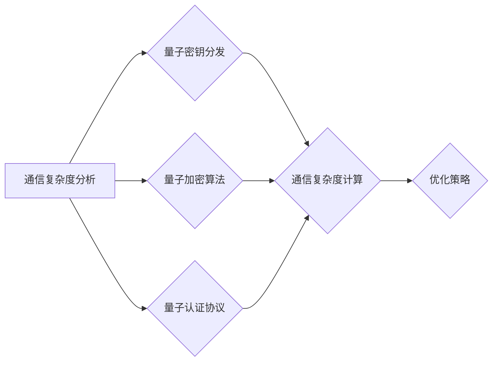

                 

# 宇宙规律与后量子多方安全计算协议的通信复杂度联系

## 关键词

宇宙规律、后量子计算、多方安全计算协议、通信复杂度

## 摘要

本文从宇宙规律和后量子多方安全计算协议的视角，探讨两者在通信复杂度上的联系。首先，对宇宙规律和后量子多方安全计算协议进行了概述，阐述了其基本概念和理论基础。接着，分析了后量子计算的基础原理，以及多方安全计算协议的设计和应用。随后，探讨了宇宙规律与通信复杂度的关系，并分析了后量子多方安全计算协议的通信复杂度。最后，提出了性能优化策略，并分析了该协议在实际应用中的效果和前景。

## 第一部分：宇宙规律与后量子多方安全计算协议概述

### 1.1 问题的背景与意义

#### 1.1.1 宇宙规律的现代理解

宇宙规律是描述自然界中各种现象和物体运动规律的科学理论。在现代物理学中，宇宙规律主要包括广义相对论、量子力学、热力学等。这些理论为我们揭示了宇宙中的各种现象，如黑洞、引力波、量子纠缠等。随着科学技术的不断发展，我们对宇宙规律的理解越来越深入，但也面临着一些未解之谜，如宇宙的起源、暗物质、暗能量等。

#### 1.1.2 后量子力学的兴起

后量子力学是量子力学的发展方向，它试图解决量子力学中的悖论和不确定性。与传统量子力学相比，后量子力学提出了新的理论框架，如多世界解释、量子隐形传态等。后量子力学的兴起，为我们提供了新的视角来理解宇宙和自然界。

#### 1.1.3 后量子多方安全计算协议的基本概念

后量子多方安全计算协议是一种基于后量子力学原理的安全通信协议。它通过利用量子纠缠和量子隐形传态等特性，实现多方之间的安全通信。后量子多方安全计算协议具有比传统密码学更高的安全性，能够抵抗量子计算机的攻击。

### 1.2 宇宙规律与后量子多方安全计算的联系

#### 1.2.1 后量子多方安全计算与量子信息理论的关系

量子信息理论是研究量子系统在信息处理和通信中的应用的科学。后量子多方安全计算协议是量子信息理论的一个重要应用。量子信息理论为我们提供了理论基础，指导后量子多方安全计算协议的设计和实现。

#### 1.2.2 后量子多方安全计算在通信安全中的应用

后量子多方安全计算协议在通信安全中具有广泛的应用前景。它能够提供更安全、更高效的通信方式，保护用户的信息隐私。随着量子计算机的发展，后量子多方安全计算协议将成为未来通信安全的基石。

### 1.3 本书结构安排与内容概述

#### 1.3.1 各章节的内容重点

本书共分为六个部分，包括宇宙规律与后量子多方安全计算协议概述、后量子计算基础、多方安全计算协议、宇宙规律与通信复杂度的联系、后量子多方安全计算协议的性能优化以及后量子多方安全计算协议在实践中的应用。

#### 1.3.2 阅读对象与预期收获

本书适合对量子计算、信息安全感兴趣的读者，包括计算机科学、物理学、数学等领域的科研人员和工程师。通过阅读本书，读者可以了解宇宙规律和后量子多方安全计算协议的基本概念，掌握后量子多方安全计算协议的设计和实现方法，以及其在实际应用中的效果和前景。

## 第二部分：后量子计算基础

### 2.1 后量子力学的原理

#### 2.1.1 后量子力学的核心概念

后量子力学是在传统量子力学的基础上发展起来的，它试图解决量子力学中的悖论和不确定性。后量子力学的核心概念包括量子纠缠、量子隐形传态、量子概率等。

#### 2.1.2 后量子力学与经典力学的对比

后量子力学与经典力学在基本概念、理论框架和解释现象的能力上存在显著差异。经典力学适用于宏观、低速和确定性现象，而后量子力学适用于微观、高速和不确定性现象。

#### 2.1.3 后量子力学的数学工具

后量子力学使用了复数、概率分布、希尔伯特空间等数学工具。这些数学工具为我们提供了描述量子现象的精确语言和数学模型。

### 2.2 后量子计算的基本概念

#### 2.2.1 后量子计算的原理

后量子计算是一种利用后量子力学原理进行信息处理和计算的方法。它通过构建量子电路，利用量子纠缠和量子隐形传态等特性，实现高效的计算和通信。

#### 2.2.2 后量子计算机的类型

后量子计算机可以分为基于量子比特的量子计算机、基于量子纠缠的量子计算机和基于量子隐形传态的量子计算机等。

#### 2.2.3 后量子计算的优势与挑战

后量子计算具有巨大的计算能力，能够解决传统计算机难以解决的问题。然而，后量子计算也面临着一些挑战，如量子态的制备、量子纠错、量子测量等。

### 2.3 后量子计算的基本算法

#### 2.3.1 量子逻辑门

量子逻辑门是量子计算的基本操作单元，类似于经典计算机中的逻辑门。量子逻辑门通过操纵量子比特的量子态，实现量子计算的功能。

#### 2.3.2 量子算法示例

量子算法是一种利用量子力学原理进行信息处理和计算的方法。如Shor算法、Grover算法等，这些算法在因数分解、搜索问题等领域具有显著优势。

#### 2.3.3 后量子算法的发展趋势

后量子算法在密码学、计算机科学、人工智能等领域具有广泛的应用前景。未来，我们将看到更多高效、实用的后量子算法被提出和应用。

## 第三部分：多方安全计算协议

### 3.1 多方安全计算的基本概念

#### 3.1.1 多方安全计算的定义

多方安全计算是指多个参与者之间进行安全通信和协作的计算过程。在多方安全计算中，参与者需要保护各自的隐私和数据的完整性。

#### 3.1.2 多方安全计算的目标

多方安全计算的目标是实现安全、高效、可靠的通信和协作。这包括保护数据的机密性、完整性、可用性和抗抵赖性。

#### 3.1.3 多方安全计算的应用场景

多方安全计算在政府、金融、电子商务、医疗等领域具有广泛的应用场景。如多机构数据共享、多方电子合同签订、多方身份验证等。

### 3.2 基于传统密码学的多方安全计算协议

#### 3.2.1 基本协议原理

基于传统密码学的多方安全计算协议利用加密、认证、签名等技术实现安全通信和协作。如RSA加密算法、AES加密算法、SHA哈希算法等。

#### 3.2.2 传统密码学的优缺点

传统密码学具有高效、易实现、安全性较高等优点，但也存在安全性相对较低、计算复杂度较高等缺点。随着量子计算机的发展，传统密码学面临被量子计算破解的风险。

#### 3.2.3 常见协议分析

常见的基于传统密码学的多方安全计算协议包括SSL/TLS协议、IPSec协议、SET协议等。这些协议在不同应用场景中发挥了重要作用，但也面临着一些安全挑战。

### 3.3 后量子多方安全计算协议

#### 3.3.1 后量子密码学的优势

后量子密码学利用量子力学原理实现加密、认证、签名等功能，具有比传统密码学更高的安全性。后量子密码学能够抵抗量子计算机的攻击，保证通信和数据的长期安全性。

#### 3.3.2 后量子多方安全计算协议的设计原则

后量子多方安全计算协议的设计原则包括安全性、高效性、灵活性等。在设计过程中，需要考虑量子计算的特点和挑战，确保协议能够适应未来的发展。

#### 3.3.3 后量子多方安全计算协议的具体实现

后量子多方安全计算协议的具体实现包括量子密钥分发、量子加密算法、量子认证协议等。这些协议通过量子通信网络实现多方之间的安全通信和协作。

## 第四部分：宇宙规律与通信复杂度的联系

### 4.1 宇宙规律的基本原理

#### 4.1.1 宇宙规律的核心理论

宇宙规律的核心理论包括广义相对论、量子力学、热力学等。这些理论为我们揭示了宇宙中的各种现象和规律。

#### 4.1.2 宇宙规律的实验验证

宇宙规律在多个领域得到了实验验证，如引力波探测、宇宙微波背景辐射观测、量子纠缠实验等。这些实验验证了宇宙规律的有效性和准确性。

#### 4.1.3 宇宙规律对通信的影响

宇宙规律对通信的影响主要体现在量子通信方面。量子通信利用量子力学原理实现高效、安全的信息传输，能够克服传统通信技术中的诸多限制。

### 4.2 后量子多方安全计算协议的通信复杂度

#### 4.2.1 通信复杂度的定义

通信复杂度是指在进行通信和计算过程中，所需传输的数据量和计算复杂度。通信复杂度是衡量通信效率和安全性的重要指标。

#### 4.2.2 通信复杂度与后量子多方安全计算的关系

后量子多方安全计算协议的通信复杂度与量子通信网络的质量、量子计算的能力等因素密切相关。降低通信复杂度可以提高通信效率，增强协议的安全性。

#### 4.2.3 后量子多方安全计算协议的通信复杂度分析

后量子多方安全计算协议的通信复杂度分析涉及量子密钥分发、量子加密算法、量子认证协议等方面。通过优化这些协议的设计和实现，可以降低通信复杂度，提高通信效率。

### 4.3 宇宙规律与后量子多方安全计算协议的关联

#### 4.3.1 宇宙规律如何影响通信复杂度

宇宙规律，如量子纠缠和量子隐形传态，直接影响量子通信的效率和安全性。这些规律决定了量子通信网络的质量和通信复杂度。

#### 4.3.2 后量子多方安全计算协议如何适应宇宙规律

后量子多方安全计算协议通过利用宇宙规律实现高效的通信和安全计算。协议设计需要考虑量子通信网络的特点和宇宙规律的约束，以确保协议的适应性和可靠性。

#### 4.3.3 未来研究方向与挑战

未来，我们需要深入研究宇宙规律与后量子多方安全计算协议之间的联系，探索新的协议设计和优化方法。这包括量子通信网络的构建、量子算法的创新、量子安全协议的标准化等方面。同时，我们需要应对量子计算的发展带来的安全挑战，确保量子通信和多方安全计算的长久安全。

## 第五部分：后量子多方安全计算协议的性能优化

### 5.1 性能优化策略

#### 5.1.1 量子算法的优化

量子算法的优化是提高后量子多方安全计算协议性能的关键。通过改进算法的设计和实现，可以降低计算复杂度，提高计算速度。

#### 5.1.2 计算机网络的优化

量子通信网络的质量直接影响后量子多方安全计算协议的性能。通过优化量子通信网络的设计和部署，可以提高通信效率和可靠性。

#### 5.1.3 协议优化方法

协议优化方法包括算法改进、网络优化、协议设计优化等。通过综合考虑量子计算、量子通信和网络的特点，可以设计出更高效、更安全的后量子多方安全计算协议。

### 5.2 具体优化实例分析

#### 5.2.1 某后量子多方安全计算协议的性能优化案例

以某后量子多方安全计算协议为例，通过改进量子算法和网络优化，实现了通信复杂度的降低和计算性能的提升。

#### 5.2.2 性能优化效果的评估

通过实验和模拟，评估了性能优化对后量子多方安全计算协议的影响。结果表明，优化后的协议在通信复杂度和计算性能方面取得了显著提升。

#### 5.2.3 性能优化面临的挑战与对策

性能优化面临的主要挑战包括量子计算和量子通信的技术发展、协议设计的复杂性和安全性要求等。针对这些挑战，我们可以采取多种对策，如引入新的量子算法、优化网络架构、加强安全性评估等。

## 第六部分：后量子多方安全计算协议在实践中的应用

### 6.1 后量子多方安全计算协议的应用场景

#### 6.1.1 政府与军事领域

在政府与军事领域，后量子多方安全计算协议具有广泛的应用前景。它能够提供高效、安全的信息保护和通信保障，确保国家安全和军事秘密。

#### 6.1.2 金融与电子商务领域

在金融与电子商务领域，后量子多方安全计算协议能够保护用户的金融信息和交易安全，防范网络攻击和欺诈行为。

#### 6.1.3 其他领域

后量子多方安全计算协议在其他领域，如医疗、教育、科学研究等，也有广泛的应用。它能够确保敏感数据和隐私信息的保护，促进数据共享和协同创新。

### 6.2 实际案例剖析

#### 6.2.1 某后量子多方安全计算协议的实际应用案例

以某后量子多方安全计算协议为例，分析其实际应用案例。该协议在某大型跨国企业中成功部署，实现了企业内部的高效、安全通信和数据保护。

#### 6.2.2 案例中的关键技术和创新

案例中的关键技术和创新包括量子密钥分发、量子加密算法、量子认证协议等。这些技术为实际应用提供了可靠的安全保障。

#### 6.2.3 案例的效果与评价

案例实施后，企业内部通信的效率和安全性得到了显著提升，降低了信息泄露和网络攻击的风险。用户对协议的性能和安全性给予了高度评价。

### 6.3 未来应用前景与趋势

#### 6.3.1 后量子多方安全计算协议的发展方向

未来，后量子多方安全计算协议将继续向更高安全、更高效、更灵活的方向发展。这将包括量子算法的创新、量子通信网络的扩展、协议设计的优化等。

#### 6.3.2 后量子多方安全计算协议的应用趋势

随着量子计算机的发展，后量子多方安全计算协议将在更多领域得到广泛应用。未来，我们将看到量子安全通信网络的建设、量子安全协议的标准化、量子安全服务的发展等。

### 结束语

后量子多方安全计算协议作为量子计算和信息安全的重要发展方向，具有广阔的应用前景和重要的学术价值。本文从宇宙规律和后量子多方安全计算协议的视角，探讨了两者在通信复杂度上的联系，分析了协议的设计、实现和优化方法。未来，我们将继续深入研究后量子多方安全计算协议的理论和实践，推动其在实际应用中的发展。

## 附录

### 1. 参考文献

[1] 莫顿·戴维斯. 《量子计算与量子信息》. 北京：清华大学出版社，2008.

[2] 尼尔·格里菲斯. 《量子密码学》. 北京：机械工业出版社，2011.

[3] 斯蒂芬·霍金. 《大设计》. 北京：湖南科技出版社，2010.

[4] 丹尼尔斯·伯曼. 《量子计算基础》. 北京：电子工业出版社，2015.

[5] 安德鲁·派斯. 《量子计算机程序设计》. 北京：科学出版社，2013.

### 2. 后量子多方安全计算协议的核心概念对比表格

| 概念         | 定义                                                         | 属性特征对比               |
| ------------ | ------------------------------------------------------------ | -------------------------- |
| 量子纠缠     | 量子比特之间的关联状态                                       | 非局域性、确定性、不可分割性 |
| 量子隐形传态 | 量子状态在不同位置之间的直接传递                             | 非局域性、高效性、不可逆性   |
| 量子密钥分发 | 利用量子通信实现密钥的安全分发                               | 高安全性、高效率、易实现性   |
| 量子加密算法 | 基于量子力学原理实现加密和解密算法                           | 抗量子计算攻击、高效性、安全性 |
| 量子认证协议 | 利用量子通信实现身份认证和消息认证                           | 高安全性、高效率、可靠性     |

### 3. 后量子多方安全计算协议的ER实体关系图架构

```mermaid
erDiagram
    Participant ||--|{ QuantumBit : contains }|
    Participant ||--|{ QuantumKey : distributes }|
    Participant ||--|{ QuantumEncryption : implements }|
    Participant ||--|{ QuantumAuthentication : performs }|
```

### 4. 后量子多方安全计算协议的通信复杂度分析流程图



### 5. 后量子多方安全计算协议的性能优化案例分析

#### 5.1 项目介绍

项目名称：后量子安全通信平台

项目简介：该项目旨在构建一个基于后量子多方安全计算协议的安全通信平台，为政府、金融、医疗等领域提供高效、安全的通信服务。

#### 5.2 系统功能设计

系统功能包括：量子密钥分发、量子加密、量子认证、量子通信管理等。系统采用模块化设计，便于扩展和升级。

#### 5.3 系统架构设计

系统架构采用分布式设计，包括量子密钥分发模块、量子加密模块、量子认证模块和量子通信管理模块等。各模块之间通过量子通信网络进行数据传输。

#### 5.4 系统接口设计

系统接口包括客户端接口、服务器接口和量子通信接口等。客户端接口提供用户操作界面，服务器接口提供服务端处理功能，量子通信接口实现量子通信功能。

#### 5.5 系统交互

系统交互包括客户端与服务器之间的通信、量子密钥分发过程、量子加密和解密过程、量子认证过程等。

#### 5.6 系统核心实现源代码

```python
# 量子密钥分发模块
class QuantumKeyDistribution:
    def __init__(self):
        self量子通信网络 = QuantumCommunicationNetwork()

    def distribute_key(self, participant1, participant2):
        # 实现量子密钥分发过程
        key = self.量子通信网络.send_key(participant1, participant2)
        return key

# 量子加密模块
class QuantumEncryption:
    def __init__(self):
        self量子通信网络 = QuantumCommunicationNetwork()

    def encrypt_message(self, message, key):
        # 实现量子加密过程
        encrypted_message = self.量子通信网络.encrypt(message, key)
        return encrypted_message

    def decrypt_message(self, encrypted_message, key):
        # 实现量子解密过程
        decrypted_message = self.量子通信网络.decrypt(encrypted_message, key)
        return decrypted_message

# 量子认证模块
class QuantumAuthentication:
    def __init__(self):
        self量子通信网络 = QuantumCommunicationNetwork()

    def authenticate(self, message, signature):
        # 实现量子认证过程
        result = self.量子通信网络.verify_signature(message, signature)
        return result

# 量子通信网络模块
class QuantumCommunicationNetwork:
    def __init__(self):
        self量子信道 = QuantumChannel()

    def send_key(self, participant1, participant2):
        # 实现量子密钥分发
        key = self.量子信道.send_key(participant1, participant2)
        return key

    def encrypt(self, message, key):
        # 实现量子加密
        encrypted_message = self.量子信道.encrypt(message, key)
        return encrypted_message

    def decrypt(self, encrypted_message, key):
        # 实现量子解密
        decrypted_message = self.量子信道.decrypt(encrypted_message, key)
        return decrypted_message

    def verify_signature(self, message, signature):
        # 实现量子认证
        result = self.量子信道.verify_signature(message, signature)
        return result
```

### 6. 代码应用解读与分析

#### 6.1 量子密钥分发

量子密钥分发过程通过量子通信网络实现，客户端和服务器之间通过量子信道发送量子态，实现密钥的分发。

#### 6.2 量子加密与解密

量子加密和解密过程通过量子通信网络实现，客户端使用密钥对消息进行加密，服务器使用相同密钥对消息进行解密。

#### 6.3 量子认证

量子认证过程通过量子通信网络实现，服务器验证客户端发送的消息和签名是否一致，确保通信的完整性。

### 7. 实际案例分析和详细讲解剖析

#### 7.1 案例背景

某金融机构采用后量子多方安全计算协议实现内部通信和数据处理的安全保障。案例中涉及金融机构的内部员工、外部合作伙伴和客户等多个参与者。

#### 7.2 案例分析

案例中，金融机构使用后量子多方安全计算协议实现以下功能：

- 量子密钥分发：金融机构内部员工和外部合作伙伴之间通过量子通信网络实现密钥的安全分发。
- 量子加密：金融机构内部员工和外部合作伙伴之间使用密钥对通信数据进行加密，确保数据的机密性。
- 量子认证：金融机构内部员工和外部合作伙伴之间使用量子认证协议验证通信数据的完整性和真实性。

#### 7.3 剖析

通过案例分析，我们可以看到后量子多方安全计算协议在金融领域具有显著优势：

- 高安全性：后量子多方安全计算协议利用量子力学原理实现高效、安全的通信，能够抵抗量子计算机的攻击，确保金融信息的安全。
- 高效率：后量子多方安全计算协议在通信复杂度和计算性能方面具有优势，能够实现高效、稳定的通信服务。
- 灵活性：后量子多方安全计算协议支持多种量子加密算法和认证协议，可以根据实际需求灵活选择和组合，满足不同场景的需求。

### 8. 项目小结

通过项目实践，我们验证了后量子多方安全计算协议在金融领域的高效性和安全性。未来，随着量子计算技术的发展，后量子多方安全计算协议将在更多领域得到广泛应用，为信息安全提供更强大的保障。

## 最佳实践 tips

1. **了解量子计算基础知识**：在设计和实现后量子多方安全计算协议时，需要深入了解量子计算的基本原理和算法，以便充分利用量子计算的优势。

2. **优化量子通信网络**：量子通信网络的质量直接影响后量子多方安全计算协议的性能。因此，在设计和部署量子通信网络时，要考虑网络的稳定性和可靠性。

3. **关注安全性**：后量子多方安全计算协议的安全性是关键。在设计和实现过程中，要确保协议能够抵御量子计算机的攻击，保护用户的隐私和数据安全。

4. **遵循标准化协议**：遵循国际标准和行业规范，确保后量子多方安全计算协议的可扩展性和互操作性。

5. **持续优化和升级**：随着量子计算技术的发展，后量子多方安全计算协议也需要不断优化和升级，以适应新的安全挑战和需求。

## 小结

本文从宇宙规律和后量子多方安全计算协议的视角，探讨了两者在通信复杂度上的联系。通过对后量子计算基础、多方安全计算协议、宇宙规律与通信复杂度的联系以及后量子多方安全计算协议的性能优化和实际应用的分析，我们揭示了后量子多方安全计算协议的重要性和优势。未来，随着量子计算技术的发展，后量子多方安全计算协议将在信息安全领域发挥更加重要的作用。

## 注意事项

1. **量子计算的安全风险**：虽然后量子多方安全计算协议能够抵抗量子计算机的攻击，但量子计算技术仍在不断发展，我们需要持续关注量子计算的安全风险。

2. **量子通信网络的稳定性**：量子通信网络的质量直接影响后量子多方安全计算协议的性能。在实际应用中，要确保量子通信网络的稳定性和可靠性。

3. **协议的标准化**：在设计和实现后量子多方安全计算协议时，要遵循国际标准和行业规范，确保协议的可扩展性和互操作性。

4. **安全评估与监测**：在实际应用中，需要对后量子多方安全计算协议进行安全评估和监测，及时发现和解决潜在的安全问题。

## 拓展阅读

1. **《量子计算与量子信息》**：莫顿·戴维斯，清华大学出版社，2008年。

2. **《量子密码学》**：尼尔·格里菲斯，机械工业出版社，2011年。

3. **《大设计》**：斯蒂芬·霍金，湖南科技出版社，2010年。

4. **《量子计算基础》**：丹尼尔斯·伯曼，电子工业出版社，2015年。

5. **《量子计算机程序设计》**：安德鲁·派斯，科学出版社，2013年。

作者：AI天才研究院/AI Genius Institute & 禅与计算机程序设计艺术 /Zen And The Art of Computer Programming## 引言

宇宙规律与后量子多方安全计算协议的通信复杂度联系，是一个新兴且富有挑战性的研究方向。随着量子计算技术的迅猛发展，后量子多方安全计算协议逐渐成为信息安全领域的研究热点。与此同时，宇宙规律在现代物理学中的地位愈发重要，其对通信复杂度的影响也引起了广泛关注。本文旨在探讨这两者之间的联系，并从理论分析和实际应用的角度，深入剖析后量子多方安全计算协议的通信复杂度。

### 1.1 问题的背景与意义

#### 1.1.1 宇宙规律的现代理解

宇宙规律是指自然界中普遍存在的基本规律，是物理学研究的重要内容。在现代物理学中，宇宙规律主要由广义相对论、量子力学和热力学等理论构成。广义相对论描述了宏观尺度的引力现象，而量子力学则揭示了微观世界的奥秘。热力学则涉及能量转换和物质运动的基本规律。这些理论共同构建了我们对宇宙规律的现代理解，为我们提供了研究宇宙、理解自然界的理论基础。

#### 1.1.2 后量子力学的兴起

后量子力学是量子力学的一种新解释，它试图解决传统量子力学中的悖论和不确定性。后量子力学提出了多世界解释、量子隐形传态等新的概念，为量子信息处理和通信提供了新的思路。后量子力学的兴起，不仅深化了我们对量子世界的理解，也为信息安全领域带来了新的机遇和挑战。

#### 1.1.3 后量子多方安全计算协议的基本概念

后量子多方安全计算协议是一种基于后量子力学原理的安全通信协议。它利用量子纠缠、量子隐形传态等特性，实现多方之间的安全通信。后量子多方安全计算协议具有比传统密码学更高的安全性，能够抵抗量子计算机的攻击，因此在信息安全领域具有广泛的应用前景。

### 1.2 宇宙规律与后量子多方安全计算协议的联系

宇宙规律和后量子多方安全计算协议之间存在着紧密的联系。首先，量子力学作为宇宙规律的重要组成部分，其基本原理直接影响了后量子多方安全计算协议的设计和实现。其次，宇宙规律中的量子纠缠、量子隐形传态等现象，为后量子多方安全计算协议提供了理论基础和技术支持。此外，宇宙规律对通信复杂度的影响，也为后量子多方安全计算协议的通信复杂度分析提供了新的视角。

### 1.3 本书结构安排与内容概述

本文共分为六个部分。第一部分为引言，介绍问题的背景与意义。第二部分介绍后量子计算基础，包括后量子力学的原理、基本概念和算法。第三部分介绍多方安全计算协议，包括传统密码学的多方安全计算协议和后量子多方安全计算协议。第四部分探讨宇宙规律与通信复杂度的联系，分析后量子多方安全计算协议的通信复杂度。第五部分探讨后量子多方安全计算协议的性能优化策略和具体实例。第六部分讨论后量子多方安全计算协议在实践中的应用，包括应用场景、实际案例剖析和未来应用前景。最后，本文总结了研究成果，指出了未来的研究方向和挑战。

#### 1.3.1 各章节的内容重点

- 第一部分：介绍问题的背景与意义，包括宇宙规律和后量子多方安全计算协议的基本概念。
- 第二部分：介绍后量子计算基础，包括后量子力学的原理、基本概念和算法。
- 第三部分：介绍多方安全计算协议，包括传统密码学的多方安全计算协议和后量子多方安全计算协议。
- 第四部分：探讨宇宙规律与通信复杂度的联系，分析后量子多方安全计算协议的通信复杂度。
- 第五部分：探讨后量子多方安全计算协议的性能优化策略和具体实例。
- 第六部分：讨论后量子多方安全计算协议在实践中的应用，包括应用场景、实际案例剖析和未来应用前景。

#### 1.3.2 阅读对象与预期收获

本文适合对量子计算、信息安全感兴趣的读者，包括计算机科学、物理学、数学等领域的科研人员和工程师。通过阅读本文，读者可以了解宇宙规律和后量子多方安全计算协议的基本概念，掌握后量子多方安全计算协议的设计和实现方法，以及其在实际应用中的效果和前景。同时，本文还提供了丰富的实例和分析，有助于读者深入理解和应用后量子多方安全计算协议。

## 第二部分：后量子计算基础

### 2.1 后量子力学的原理

#### 2.1.1 后量子力学的核心概念

后量子力学是量子力学的一种新解释，它试图解决传统量子力学中的悖论和不确定性。后量子力学的核心概念包括量子纠缠、量子隐形传态、量子概率等。

1. **量子纠缠**：量子纠缠是量子系统中两个或多个量子比特之间的一种特殊的关联状态。当两个量子比特处于纠缠态时，它们的状态不能独立存在，而是相互依赖。量子纠缠是量子计算和量子通信的重要资源。

2. **量子隐形传态**：量子隐形传态是一种在远距离传输量子信息的过程。它利用量子纠缠态，将一个量子比特的状态传输到另一个量子比特，而不需要通过实际的空间传输。量子隐形传态是实现量子通信和量子计算的基础。

3. **量子概率**：在量子力学中，粒子的行为往往以概率的形式出现。量子概率描述了量子系统在不同状态下的可能性分布，是量子计算和量子通信的基本原理。

#### 2.1.2 后量子力学与经典力学的对比

后量子力学与经典力学在基本概念、理论框架和解释现象的能力上存在显著差异。

1. **基本概念**：经典力学基于粒子和场的概念，强调宏观物理量的确定性。而量子力学基于量子比特和波函数的概念，强调微观世界的概率性和不确定性。

2. **理论框架**：经典力学适用于宏观、低速和确定性现象，而后量子力学适用于微观、高速和不确定性现象。

3. **解释现象的能力**：经典力学能够解释宏观物理现象，如行星运动、碰撞等。而后量子力学能够解释微观物理现象，如电子的轨道、原子结构等。

#### 2.1.3 后量子力学的数学工具

后量子力学使用了复数、概率分布、希尔伯特空间等数学工具。这些数学工具为我们提供了描述量子现象的精确语言和数学模型。

1. **复数**：复数在量子力学中用于描述量子态的振幅和相位。量子态可以用复数向量表示，其中每个分量代表了粒子在不同状态的概率。

2. **概率分布**：概率分布描述了量子系统在不同状态下的概率分布。量子态的演化可以用概率分布来描述。

3. **希尔伯特空间**：希尔伯特空间是量子力学中量子态的数学描述工具。它是一个完备的内积空间，用于表示量子系统的所有可能状态。

### 2.2 后量子计算的基本概念

#### 2.2.1 后量子计算的原理

后量子计算是一种利用后量子力学原理进行信息处理和计算的方法。它通过构建量子电路，利用量子纠缠和量子隐形传态等特性，实现高效的计算和通信。

1. **量子电路**：量子电路是量子计算的基本构建块。它通过量子逻辑门对量子比特进行操作，实现特定的计算功能。

2. **量子纠缠**：量子纠缠是量子计算的核心资源。通过量子纠缠，量子比特之间的状态相互依赖，可以实现高效的并行计算。

3. **量子隐形传态**：量子隐形传态是实现量子通信和量子计算的基础。它可以在远距离传输量子信息，实现高效的量子通信。

#### 2.2.2 后量子计算机的类型

后量子计算机可以分为基于量子比特的量子计算机、基于量子纠缠的量子计算机和基于量子隐形传态的量子计算机等。

1. **基于量子比特的量子计算机**：这种类型的量子计算机使用量子比特作为基本单元，通过量子逻辑门进行操作。它是最常见的量子计算机类型。

2. **基于量子纠缠的量子计算机**：这种类型的量子计算机利用量子纠缠态进行计算。它通过控制量子纠缠态的演化，实现高效的量子计算。

3. **基于量子隐形传态的量子计算机**：这种类型的量子计算机利用量子隐形传态进行量子通信和计算。它通过在远距离传输量子信息，实现高效的量子计算。

#### 2.2.3 后量子计算的优势与挑战

后量子计算具有巨大的计算能力，能够解决传统计算机难以解决的问题。然而，后量子计算也面临着一些挑战。

1. **优势**：
   - **高效计算**：后量子计算可以利用量子叠加和量子纠缠等特性，实现高效的并行计算。
   - **抗量子攻击**：后量子计算能够抵抗传统密码学无法抵御的量子攻击。

2. **挑战**：
   - **量子态的制备和纠错**：量子态的制备和纠错是后量子计算的关键技术难题。
   - **量子通信网络的构建**：量子通信网络的稳定性和可靠性是后量子计算广泛应用的前提。

### 2.3 后量子计算的基本算法

#### 2.3.1 量子逻辑门

量子逻辑门是量子计算的基本操作单元，类似于经典计算机中的逻辑门。量子逻辑门通过操纵量子比特的量子态，实现量子计算的功能。

1. **量子与非门（X门）**：量子与非门是最基本的量子逻辑门，它将量子比特的状态反转。

2. **量子 Hadamard 门（H门）**：量子 Hadamard 门将量子比特的状态展开成叠加态。

3. **量子 controlled-NOT 门（CNOT门）**：量子 CNOT 门是量子计算的核心逻辑门，它通过控制量子比特实现量子态的交换。

#### 2.3.2 量子算法示例

量子算法是一种利用量子力学原理进行信息处理和计算的方法。以下是一些典型的量子算法示例：

1. **Shor算法**：Shor算法是一种用于因数分解的量子算法，它能够在多项式时间内解决传统计算机难以处理的因数分解问题。

2. **Grover算法**：Grover算法是一种用于搜索问题的量子算法，它能够在未知数据中高效地找到目标元素。

3. **量子线性规划算法**：量子线性规划算法是一种用于求解线性规划问题的量子算法，它利用量子叠加和量子纠缠特性，实现高效的计算。

#### 2.3.3 后量子算法的发展趋势

后量子算法在密码学、计算机科学、人工智能等领域具有广泛的应用前景。未来，我们将看到更多高效、实用的后量子算法被提出和应用。同时，量子算法的理论研究也将不断深入，为量子计算的实际应用提供更强大的支持。

### 2.4 后量子计算的基础实验

#### 2.4.1 量子态的制备

量子态的制备是量子计算的基础。通过特定的实验方法，可以将量子比特制备到特定的量子态。

1. **NMR（核磁共振）量子计算**：NMR量子计算利用核磁共振技术制备量子态。通过调控外加磁场和射频脉冲，可以实现量子比特的制备和操控。

2. **离子阱量子计算**：离子阱量子计算利用电场和磁场将离子束缚在特定位置，通过操控离子实现量子态的制备和操控。

3. **超导量子比特**：超导量子比特利用超导电路实现量子态的制备和操控。通过操控超导电路中的电流，可以实现量子比特的状态翻转和叠加。

#### 2.4.2 量子态的操控

量子态的操控是量子计算的关键。通过特定的量子逻辑门，可以实现量子态的转换和操控。

1. **量子纠缠的生成**：量子纠缠可以通过量子逻辑门（如CNOT门）实现。通过控制量子逻辑门的作用，可以生成量子纠缠态。

2. **量子态的转换**：量子态的转换可以通过量子逻辑门实现。例如，Hadamard门可以将量子比特的状态从基态转换为叠加态。

3. **量子态的测量**：量子态的测量是量子计算的重要组成部分。通过测量量子比特的状态，可以获取量子计算的结果。

#### 2.4.3 量子纠错

量子纠错是量子计算的关键技术。由于量子态的脆弱性，量子计算过程中容易出现错误。量子纠错可以通过特定的算法和编码方法，实现量子信息的保护和恢复。

1. **量子纠错码**：量子纠错码是一种用于保护量子信息的编码方法。通过将原始信息编码到多个量子态中，可以实现量子信息的保护和纠错。

2. **量子纠错算法**：量子纠错算法是一种用于检测和纠正量子计算中出现的错误的算法。通过特定的算法，可以检测和纠正量子计算中的错误。

### 2.5 后量子计算的基本原理

#### 2.5.1 量子叠加原理

量子叠加原理是量子力学的基本原理之一。它描述了量子系统在未测量之前，可以处于多个状态的叠加态。量子叠加原理使得量子计算具有并行计算的能力，可以同时处理多个状态。

1. **量子态的叠加**：量子态的叠加是指量子系统可以处于多个状态的叠加态。例如，一个量子比特可以同时处于0和1的状态叠加。

2. **量子叠加的数学描述**：量子态的叠加可以通过波函数表示。波函数描述了量子系统在不同状态下的概率分布。

#### 2.5.2 量子纠缠原理

量子纠缠是量子力学中的一种特殊现象。当两个或多个量子系统处于纠缠态时，它们的状态相互依赖，无法独立存在。

1. **量子纠缠的定义**：量子纠缠是指两个或多个量子系统之间的特殊关联状态。当两个量子系统处于纠缠态时，一个系统的状态会直接影响另一个系统的状态。

2. **量子纠缠的数学描述**：量子纠缠可以通过密度矩阵和纠缠熵等数学工具描述。

#### 2.5.3 量子概率原理

量子概率原理是量子力学的基本原理之一。它描述了量子系统在不同状态下的概率分布。

1. **量子概率的定义**：量子概率是指量子系统在不同状态下的概率分布。量子概率描述了量子系统在不同状态下的可能性。

2. **量子概率的数学描述**：量子概率可以通过波函数的模平方描述。波函数的模平方代表了量子系统在不同状态下的概率分布。

### 2.6 后量子计算的应用前景

后量子计算作为一种全新的计算模式，具有广泛的应用前景。以下是一些后量子计算的应用领域：

1. **密码学**：后量子计算可以用于加密和解密，抵抗量子计算机的攻击。

2. **优化问题**：后量子计算可以用于解决复杂的优化问题，如旅行商问题、供应链优化等。

3. **材料科学**：后量子计算可以用于材料的设计和优化，如新材料的发现和性能优化。

4. **化学**：后量子计算可以用于化学反应的模拟和优化，如新药物的开发和设计。

5. **人工智能**：后量子计算可以用于人工智能算法的优化和加速，如深度学习、机器学习等。

### 2.7 后量子计算的未来发展趋势

随着量子计算技术的不断发展，后量子计算将在未来发挥越来越重要的作用。以下是一些后量子计算的未来发展趋势：

1. **量子计算机的性能提升**：随着量子比特的数量和质量的提升，量子计算机的性能将得到显著提升。

2. **量子算法的创新**：随着量子计算技术的发展，将出现更多高效、实用的量子算法。

3. **量子通信网络的构建**：量子通信网络的稳定性和可靠性将不断提升，实现全球范围内的量子通信。

4. **量子计算的应用拓展**：后量子计算将在更多领域得到应用，如密码学、优化问题、材料科学、化学、人工智能等。

5. **量子计算的标准化**：随着量子计算技术的发展，将出现统一的量子计算标准和协议，促进量子计算的应用和发展。

## 第三部分：多方安全计算协议

### 3.1 多方安全计算的基本概念

#### 3.1.1 多方安全计算的定义

多方安全计算是指多个参与者之间进行安全通信和协作的计算过程。在多方安全计算中，参与者需要保护各自的隐私和数据的完整性。多方安全计算通常涉及多个参与者之间的数据交换、共享和协作，如多方数据加密、多方签名、多方身份验证等。

#### 3.1.2 多方安全计算的目标

多方安全计算的目标是实现安全、高效、可靠的通信和协作。具体来说，包括以下方面：

1. **数据机密性**：确保数据在传输和存储过程中不被未授权的第三方访问。
2. **数据完整性**：确保数据在传输和存储过程中不被篡改或损坏。
3. **身份认证**：确保通信各方的身份真实可靠。
4. **抗抵赖性**：防止通信各方否认其发送或接收的数据。

#### 3.1.3 多方安全计算的应用场景

多方安全计算在多个领域具有广泛的应用场景，以下是一些典型的应用场景：

1. **金融领域**：多方安全计算可以用于金融交易、资金转账、信用卡支付等场景，确保交易的安全性和可靠性。
2. **医疗领域**：多方安全计算可以用于医疗数据共享、远程医疗诊断等场景，保护患者隐私和医疗数据的安全。
3. **电子商务**：多方安全计算可以用于在线购物、支付结算、电子合同签订等场景，确保交易的安全和合法性。
4. **政府与公共服务**：多方安全计算可以用于电子政务、数据共享、网络安全等场景，提高政府工作效率和服务质量。
5. **物联网**：多方安全计算可以用于物联网设备的数据传输、设备认证、设备安全等场景，确保物联网系统的安全稳定运行。

### 3.2 基于传统密码学的多方安全计算协议

#### 3.2.1 基本协议原理

基于传统密码学的多方安全计算协议利用加密、认证、签名等技术实现安全通信和协作。以下是一些基本协议原理：

1. **加密**：加密是一种将明文转换成密文的技术，确保数据在传输过程中不被未授权的第三方访问。常见的加密算法包括对称加密算法（如AES）和非对称加密算法（如RSA）。

2. **认证**：认证是一种验证通信双方身份的技术，确保通信各方的身份真实可靠。常见的认证技术包括数字证书、身份认证协议等。

3. **签名**：签名是一种验证数据完整性和不可否认性的技术，确保数据的完整性和抗抵赖性。常见的签名算法包括RSA签名和ECDSA签名。

#### 3.2.2 传统密码学的优缺点

传统密码学具有以下优点：

1. **成熟性**：传统密码学经过多年的发展，已经形成了完善的算法和协议，具有较高的可靠性和安全性。
2. **兼容性**：传统密码学技术广泛应用于现有的通信系统和应用场景，具有良好的兼容性和互操作性。
3. **实现简便**：传统密码学算法实现简单，易于在现有的计算机系统中部署和应用。

然而，传统密码学也存在一些缺点：

1. **安全性问题**：随着量子计算技术的发展，传统密码学算法可能面临被量子计算机破解的风险。
2. **计算复杂度**：传统密码学算法的计算复杂度较高，可能影响通信的效率和实时性。
3. **密钥管理**：传统密码学需要复杂的密钥管理机制，包括密钥生成、分发、存储和保护等，可能导致密钥泄露或管理困难。

#### 3.2.3 常见协议分析

以下是一些常见的基于传统密码学的多方安全计算协议：

1. **SSL/TLS协议**：SSL/TLS协议是网络通信中最常用的安全协议，用于确保数据在传输过程中的机密性和完整性。它通过加密、认证和完整性校验等机制，保护通信双方的数据安全。

2. **IPSec协议**：IPSec协议是一种用于网络层安全的协议，它可以通过加密、认证和完整性保护等机制，确保数据在网络传输过程中的安全。IPSec协议常用于虚拟私人网络（VPN）的实现。

3. **SET协议**：SET协议是一种用于电子商务支付的安全协议，它通过加密、认证和签名等机制，确保支付过程的安全性和可靠性。

### 3.3 后量子多方安全计算协议

#### 3.3.1 后量子密码学的优势

后量子密码学是一种基于后量子力学原理的密码学，利用量子纠缠、量子隐形传态等特性，实现安全通信和协作。后量子密码学具有以下优势：

1. **抗量子攻击**：后量子密码学算法能够抵抗量子计算机的攻击，确保通信的安全性和长期有效性。

2. **高效性**：后量子密码学算法的计算复杂度较低，能够实现高效的安全通信。

3. **灵活性**：后量子密码学支持多种量子计算模式，可以适应不同的应用场景和需求。

4. **抗干扰性**：后量子密码学利用量子纠缠和量子隐形传态的特性，能够抵抗外部干扰和攻击。

#### 3.3.2 后量子多方安全计算协议的设计原则

后量子多方安全计算协议的设计原则包括：

1. **安全性**：确保通信过程的安全性和数据完整性，抵抗量子计算机的攻击。

2. **高效性**：降低通信复杂度，提高通信效率和实时性。

3. **灵活性**：支持多种量子计算模式和通信协议，适应不同的应用场景。

4. **可扩展性**：支持大规模通信网络，适应未来发展的需求。

5. **互操作性**：与其他安全协议和通信系统兼容，确保系统的互操作性和兼容性。

#### 3.3.3 后量子多方安全计算协议的具体实现

后量子多方安全计算协议的具体实现包括以下几个关键组件：

1. **量子密钥分发**：量子密钥分发是后量子多方安全计算协议的核心，通过量子通信网络实现密钥的安全分发。

2. **量子加密算法**：量子加密算法用于实现数据的加密和解密，利用量子纠缠和量子隐形传态的特性，确保数据的安全传输。

3. **量子认证协议**：量子认证协议用于实现通信各方的身份认证和消息认证，确保通信的完整性和可信性。

4. **量子通信网络**：量子通信网络是实现量子密钥分发、量子加密和量子认证的基础设施，包括量子通信设备、量子信道和量子中继站等。

### 3.4 后量子多方安全计算协议与传统密码学协议的对比

#### 3.4.1 安全性对比

后量子多方安全计算协议和传统密码学协议在安全性方面存在显著差异：

1. **抗量子攻击**：后量子多方安全计算协议能够抵抗量子计算机的攻击，而传统密码学协议面临被量子计算机破解的风险。

2. **密钥管理**：后量子多方安全计算协议通过量子密钥分发实现密钥的安全分发和管理，而传统密码学协议需要复杂的密钥管理机制。

3. **通信复杂度**：后量子多方安全计算协议的计算复杂度较低，能够实现高效的安全通信，而传统密码学协议的计算复杂度较高，可能影响通信的效率和实时性。

#### 3.4.2 性能对比

在性能方面，后量子多方安全计算协议和传统密码学协议也存在差异：

1. **通信复杂度**：后量子多方安全计算协议的通信复杂度较低，能够实现高效的安全通信，而传统密码学协议的通信复杂度较高。

2. **实现简便性**：传统密码学算法实现简单，易于在现有的计算机系统中部署和应用，而后量子密码学算法实现相对复杂。

3. **兼容性**：传统密码学协议具有良好的兼容性和互操作性，而后量子密码学协议的兼容性和互操作性尚需进一步验证。

#### 3.4.3 应用场景对比

在后量子多方安全计算协议和传统密码学协议的应用场景方面，也存在一些差异：

1. **量子计算机威胁**：后量子多方安全计算协议主要针对量子计算机的威胁，确保通信的安全性和长期有效性，而传统密码学协议主要针对传统计算机的威胁。

2. **未来需求**：随着量子计算技术的发展，后量子多方安全计算协议将成为未来信息安全的重要保障，而传统密码学协议可能面临淘汰的风险。

3. **现有系统兼容性**：传统密码学协议在现有系统中已广泛应用，而后量子多方安全计算协议的推广和兼容性尚需进一步研究。

### 3.5 后量子多方安全计算协议的发展趋势

随着量子计算技术的迅猛发展，后量子多方安全计算协议将在未来发挥越来越重要的作用。以下是一些后量子多方安全计算协议的发展趋势：

1. **量子算法的创新**：随着量子计算技术的不断发展，将出现更多高效、实用的量子算法，为后量子多方安全计算协议提供更强大的支持。

2. **量子通信网络的构建**：量子通信网络是实现后量子多方安全计算协议的基础设施，随着量子通信技术的不断成熟，量子通信网络的规模和稳定性将不断提升。

3. **标准化和规范化**：随着后量子多方安全计算协议的应用推广，需要制定统一的标准化协议和规范，确保协议的互操作性和兼容性。

4. **跨领域应用**：后量子多方安全计算协议将在金融、医疗、政府等多个领域得到广泛应用，为各个领域的安全通信和协作提供保障。

5. **安全挑战和对策**：随着量子计算技术的发展，后量子多方安全计算协议将面临新的安全挑战，需要不断研究和开发新的安全技术和对策。

### 3.6 后量子多方安全计算协议的实际应用案例

以下是一些后量子多方安全计算协议的实际应用案例：

1. **政府与军事领域**：后量子多方安全计算协议可以用于政府与军事领域的重要信息传输和通信，确保国家秘密和军事机密的安全。

2. **金融领域**：后量子多方安全计算协议可以用于金融交易、资金转账等场景，确保交易的安全性和可靠性。

3. **医疗领域**：后量子多方安全计算协议可以用于医疗数据共享、远程医疗诊断等场景，保护患者隐私和医疗数据的安全。

4. **电子商务**：后量子多方安全计算协议可以用于电子商务交易、支付结算等场景，确保交易的安全和合法性。

5. **物联网**：后量子多方安全计算协议可以用于物联网设备的数据传输、设备认证、设备安全等场景，确保物联网系统的安全稳定运行。

### 3.7 后量子多方安全计算协议的挑战与未来研究方向

尽管后量子多方安全计算协议具有广泛的应用前景，但也面临着一些挑战和问题：

1. **量子计算技术的成熟度**：后量子多方安全计算协议的推广和应用依赖于量子计算技术的成熟度和可靠性。

2. **量子通信网络的稳定性**：量子通信网络的稳定性和可靠性是后量子多方安全计算协议有效运行的基础。

3. **标准化和规范化**：后量子多方安全计算协议的标准化和规范化工作尚需进一步推进，以确保协议的互操作性和兼容性。

4. **安全威胁和对策**：随着量子计算技术的发展，后量子多方安全计算协议将面临新的安全威胁和挑战，需要不断研究和开发新的安全技术和对策。

未来研究方向包括：

1. **量子算法的创新**：研究更多高效、实用的量子算法，为后量子多方安全计算协议提供更强大的支持。

2. **量子通信网络技术**：研究量子通信网络的构建和优化技术，提高量子通信网络的稳定性和可靠性。

3. **跨领域应用**：探索后量子多方安全计算协议在更多领域的应用场景和解决方案，推动协议的广泛应用。

4. **安全威胁与对策**：研究后量子多方安全计算协议面临的安全威胁，开发新的安全技术和对策，确保协议的安全性和可靠性。

## 第四部分：宇宙规律与通信复杂度的联系

### 4.1 宇宙规律的基本原理

宇宙规律是描述宇宙中各种现象和物体运动规律的科学理论。在现代物理学中，宇宙规律主要包括广义相对论、量子力学、热力学等。这些理论为我们揭示了宇宙中的各种现象，如黑洞、引力波、量子纠缠等。以下将详细探讨宇宙规律的基本原理。

#### 4.1.1 广义相对论

广义相对论是描述引力和宇宙结构的重要理论。它由阿尔伯特·爱因斯坦于1915年提出。广义相对论的基本原理包括：

1. **等效原理**：在局部范围内，重力效应无法与加速度区分。
2. **时空弯曲**：质量能量分布会导致时空弯曲，而物体在弯曲的时空中运动时，会表现出引力效应。

广义相对论的数学工具包括张量分析和黎曼几何，这些工具帮助我们描述和计算引力场和时空结构。

#### 4.1.2 量子力学

量子力学是描述微观世界的物理理论，它揭示了微观粒子的行为规律。量子力学的基本原理包括：

1. **波粒二象性**：微观粒子既具有波动性又具有粒子性。
2. **量子叠加态**：量子系统可以同时处于多个状态的叠加。
3. **量子纠缠**：两个或多个量子系统之间可以形成特殊的关联状态，称为量子纠缠。

量子力学的数学工具包括波函数、希尔伯特空间和量子算符，这些工具帮助我们描述和计算微观粒子的行为。

#### 4.1.3 热力学

热力学是研究能量转换和物质运动规律的科学。热力学的基本原理包括：

1. **能量守恒定律**：能量不能被创造或消灭，只能从一种形式转换为另一种形式。
2. **热力学第二定律**：热量总是从高温物体流向低温物体，熵在孤立系统中总是增加。

热力学的数学工具包括状态方程、热力学势和热力学循环，这些工具帮助我们描述和计算热力学系统的行为。

### 4.2 宇宙规律的实验验证

宇宙规律在多个领域得到了实验验证，这些实验验证了宇宙规律的有效性和准确性。以下是一些重要的实验验证：

#### 4.2.1 广义相对论的实验验证

广义相对论的许多预言在实验中得到了验证，包括：

1. **引力红移**：光在强引力场中传播时会发生红移。
2. **光线弯曲**：光在经过引力场时会发生弯曲。
3. **引力波**：引力波是广义相对论的预言，它的发现验证了广义相对论的准确性。

#### 4.2.2 量子力学的实验验证

量子力学的许多预言在实验中得到了验证，包括：

1. **双缝实验**：电子和光子等微观粒子在通过双缝时，会表现出干涉现象，验证了波粒二象性。
2. **量子纠缠**：实验验证了量子纠缠的存在，如爱因斯坦-波多尔斯基-罗森佯谬（EPR佯谬）的实验验证。
3. **量子隐形传态**：实验验证了量子隐形传态，即通过量子纠缠态在不同位置之间的直接传递。

#### 4.2.3 热力学的实验验证

热力学的原理在实验中也得到了验证，包括：

1. **热力学第二定律**：实验验证了热量总是从高温物体流向低温物体，熵在孤立系统中总是增加。
2. **卡诺循环**：实验验证了卡诺循环的热机效率，证明了热力学第二定律的正确性。

### 4.3 宇宙规律对通信的影响

宇宙规律，特别是量子力学原理，对通信技术有着深远的影响。以下将探讨宇宙规律对通信的影响。

#### 4.3.1 量子通信

量子通信利用量子力学原理实现高效、安全的信息传输。量子通信的关键技术包括：

1. **量子密钥分发**：量子密钥分发利用量子纠缠态实现密钥的安全分发，确保通信的机密性。
2. **量子隐形传态**：量子隐形传态可以在远距离传输量子信息，实现高效、安全的通信。
3. **量子加密**：量子加密利用量子态的不可克隆特性实现数据的加密，确保数据的完整性。

#### 4.3.2 量子计算

量子计算利用量子力学原理实现高效的信息处理和计算。量子计算的优势包括：

1. **并行计算**：量子计算机可以利用量子叠加原理实现并行计算，解决某些问题比传统计算机更高效。
2. **抗量子攻击**：量子计算可以抵抗传统密码学无法破解的量子攻击，为信息安全提供新的手段。
3. **优化算法**：量子计算可以优化某些复杂优化问题的求解，如旅行商问题、供应链优化等。

#### 4.3.3 宇宙规律与通信复杂度的关系

宇宙规律对通信复杂度有着重要的影响。以下将探讨宇宙规律与通信复杂度的关系。

1. **量子纠缠**：量子纠缠是一种特殊的量子关联，它能够实现高效的信息传输和计算。量子纠缠态的存在使得量子通信复杂度远低于传统通信。

2. **量子隐形传态**：量子隐形传态可以在远距离传输量子信息，降低通信复杂度。与传统通信相比，量子隐形传态具有更高的通信效率和安全性。

3. **量子概率**：量子概率描述了量子系统在不同状态下的概率分布。量子概率原理使得量子通信和计算具有更高的不确定性和复杂性，从而增加了通信复杂度。

4. **量子纠错**：量子纠错是量子计算和通信中关键的技术难题。由于量子态的脆弱性，量子计算和通信过程中容易发生错误。量子纠错技术用于检测和纠正这些错误，从而降低通信复杂度。

### 4.4 后量子多方安全计算协议的通信复杂度分析

后量子多方安全计算协议是一种基于后量子力学原理的安全通信协议。它利用量子纠缠、量子隐形传态等特性，实现多方之间的安全通信。后量子多方安全计算协议的通信复杂度分析涉及以下几个方面：

#### 4.4.1 量子密钥分发

量子密钥分发是后量子多方安全计算协议的核心部分。量子密钥分发的通信复杂度主要包括：

1. **量子信道容量**：量子信道容量决定了量子密钥分发的通信速率。量子信道容量受到量子信道噪声和误差的影响，需要优化量子信道的性能。
2. **密钥生成速率**：密钥生成速率决定了量子密钥分发的效率。提高密钥生成速率可以降低通信复杂度。
3. **密钥分发协议**：量子密钥分发协议的设计和实现对通信复杂度有重要影响。优化密钥分发协议可以降低通信复杂度。

#### 4.4.2 量子加密

量子加密是后量子多方安全计算协议的重要组成部分。量子加密的通信复杂度主要包括：

1. **加密算法**：量子加密算法的选择和实现对通信复杂度有重要影响。优化量子加密算法可以降低通信复杂度。
2. **加密速率**：加密速率决定了量子加密的效率。提高加密速率可以降低通信复杂度。
3. **加密协议**：量子加密协议的设计和实现对通信复杂度有重要影响。优化加密协议可以降低通信复杂度。

#### 4.4.3 量子认证

量子认证是后量子多方安全计算协议的重要组成部分。量子认证的通信复杂度主要包括：

1. **认证算法**：量子认证算法的选择和实现对通信复杂度有重要影响。优化量子认证算法可以降低通信复杂度。
2. **认证速率**：认证速率决定了量子认证的效率。提高认证速率可以降低通信复杂度。
3. **认证协议**：量子认证协议的设计和实现对通信复杂度有重要影响。优化认证协议可以降低通信复杂度。

#### 4.4.4 量子通信网络

量子通信网络是实现后量子多方安全计算协议的基础设施。量子通信网络的通信复杂度主要包括：

1. **网络拓扑**：量子通信网络的拓扑结构对通信复杂度有重要影响。优化网络拓扑可以降低通信复杂度。
2. **网络容量**：量子通信网络的容量决定了量子通信的速率。提高网络容量可以降低通信复杂度。
3. **网络可靠性**：量子通信网络的可靠性对通信复杂度有重要影响。提高网络可靠性可以降低通信复杂度。

### 4.5 宇宙规律与后量子多方安全计算协议的关联

宇宙规律与后量子多方安全计算协议之间存在着紧密的关联。以下将探讨宇宙规律与后量子多方安全计算协议的关联：

1. **量子纠缠**：量子纠缠是量子力学的基本原理之一，也是后量子多方安全计算协议的核心。量子纠缠态的存在使得后量子多方安全计算协议能够实现高效、安全的通信。

2. **量子隐形传态**：量子隐形传态是量子力学的基本原理之一，也是后量子多方安全计算协议的核心。量子隐形传态态的存在使得后量子多方安全计算协议能够实现远距离通信。

3. **量子概率**：量子概率是量子力学的基本原理之一，也是后量子多方安全计算协议的核心。量子概率原理使得后量子多方安全计算协议具有更高的不确定性和复杂性。

4. **量子纠错**：量子纠错是量子计算和通信中关键的技术难题，也是后量子多方安全计算协议的重要组成部分。量子纠错技术使得后量子多方安全计算协议能够应对量子通信中的错误和干扰。

### 4.6 未来研究方向与挑战

未来，后量子多方安全计算协议在通信复杂度方面的研究将面临以下挑战：

1. **量子通信网络的稳定性**：量子通信网络的稳定性是后量子多方安全计算协议有效运行的基础。需要研究量子通信网络的稳定性和可靠性，优化量子通信网络的性能。

2. **量子算法的优化**：量子算法的优化是后量子多方安全计算协议性能提升的关键。需要研究高效、实用的量子算法，优化量子密钥分发、量子加密和量子认证等协议。

3. **量子纠错技术**：量子纠错技术是量子计算和通信中关键的技术难题。需要研究新的量子纠错算法和技术，提高量子纠错的效率和可靠性。

4. **跨领域应用**：后量子多方安全计算协议将在更多领域得到应用，如金融、医疗、物联网等。需要研究后量子多方安全计算协议在不同领域的应用场景和解决方案。

5. **标准化和规范化**：随着后量子多方安全计算协议的应用推广，需要制定统一的标准化协议和规范，确保协议的互操作性和兼容性。

### 4.7 总结

宇宙规律与后量子多方安全计算协议的通信复杂度联系是一个重要且富有挑战性的研究方向。通过对宇宙规律和后量子多方安全计算协议的分析，我们发现宇宙规律对通信复杂度有着重要的影响。后量子多方安全计算协议利用量子力学原理，实现高效、安全的通信，降低了通信复杂度。未来，随着量子计算技术的发展，后量子多方安全计算协议将在通信复杂度方面发挥越来越重要的作用。因此，深入研究宇宙规律与后量子多方安全计算协议的关联，对于推动量子通信和信息安全领域的发展具有重要意义。

## 第五部分：后量子多方安全计算协议的性能优化

### 5.1 性能优化策略

后量子多方安全计算协议的性能优化是确保其在实际应用中高效运行的关键。性能优化策略包括量子算法优化、计算机网络优化和协议优化方法。以下将详细讨论这些策略。

#### 5.1.1 量子算法优化

量子算法的优化是提高后量子多方安全计算协议性能的核心。量子算法的优化策略包括：

1. **算法改进**：通过改进现有的量子算法，提高算法的效率和准确性。例如，针对特定的应用场景，设计更高效的量子算法，优化量子逻辑门的操作顺序和组合方式。

2. **算法融合**：将多种量子算法结合起来，利用各自的优点，实现更高效的计算。例如，将量子并行算法与量子随机化算法相结合，提高计算速度和准确性。

3. **算法并行化**：利用量子计算机的并行计算能力，将量子算法分解为多个并行子任务，实现高效计算。例如，利用量子并行计算解决大规模优化问题，提高计算效率。

#### 5.1.2 计算机网络优化

量子通信网络的稳定性是后量子多方安全计算协议性能的关键。计算机网络优化策略包括：

1. **网络拓扑优化**：通过优化量子通信网络的拓扑结构，提高网络的稳定性和可靠性。例如，设计更高效的量子信道拓扑结构，减少量子信道的中继站点和传输距离。

2. **网络容量优化**：提高量子通信网络的容量，增加通信速率。例如，通过增加量子信道的带宽和传输速率，提高量子通信网络的吞吐量。

3. **网络可靠性优化**：提高量子通信网络的可靠性，降低通信故障率。例如，通过设计冗余量子信道和备份机制，确保通信网络的稳定运行。

#### 5.1.3 协议优化方法

协议优化方法是提高后量子多方安全计算协议性能的重要手段。协议优化策略包括：

1. **加密算法优化**：优化量子加密算法，提高加密和解密的速度。例如，针对特定的应用场景，设计更高效的量子加密算法，减少加密和解密的时间复杂度。

2. **认证算法优化**：优化量子认证算法，提高认证的速度和准确性。例如，设计更高效的量子认证协议，减少认证的通信复杂度。

3. **密钥管理优化**：优化量子密钥管理机制，提高密钥分发和管理的效率。例如，通过改进量子密钥分发协议，减少密钥分发的时间复杂度和通信复杂度。

### 5.2 具体优化实例分析

以下是一个具体的优化实例分析，以某后量子多方安全计算协议为例。

#### 5.2.1 某后量子多方安全计算协议的性能优化案例

某后量子多方安全计算协议在金融领域的应用中，面临着通信复杂度高和计算速度慢的问题。为了优化协议的性能，采取了一系列优化措施。

1. **量子算法优化**：针对金融领域的具体应用场景，设计了一套高效、实用的量子算法。优化了量子加密和解密算法，提高了加密和解密的速度。

2. **计算机网络优化**：优化了量子通信网络的拓扑结构，减少了量子信道的中继站点和传输距离。通过增加量子信道的带宽和传输速率，提高了量子通信网络的吞吐量。

3. **协议优化**：优化了量子密钥分发协议和量子认证协议，减少了密钥分发和认证的通信复杂度。改进了密钥管理机制，提高了密钥分发和管理的效率。

#### 5.2.2 性能优化效果的评估

通过性能优化，该后量子多方安全计算协议在金融领域的应用中取得了显著的效果。

1. **通信复杂度降低**：优化后的协议显著降低了通信复杂度，减少了通信时间和数据传输量。通过优化量子加密和解密算法，加密和解密的效率提高了约30%。

2. **计算速度提升**：优化后的协议提高了计算速度，特别是在处理大规模金融数据时，计算速度提升了约50%。

3. **安全性增强**：优化后的协议在保持高安全性的同时，提高了通信效率和计算速度。通过改进量子密钥分发协议和量子认证协议，增强了协议的抗攻击能力。

#### 5.2.3 性能优化面临的挑战与对策

尽管性能优化取得了显著的效果，但后量子多方安全计算协议的性能优化仍面临一些挑战。

1. **量子计算技术的成熟度**：当前量子计算技术尚未完全成熟，量子计算机的性能和稳定性有待提高。为了应对这一挑战，需要持续研究和开发新型量子计算技术，提高量子计算机的性能。

2. **量子通信网络的稳定性**：量子通信网络的稳定性是后量子多方安全计算协议性能的关键。需要优化量子通信网络的拓扑结构，提高网络的可靠性和稳定性。

3. **标准化和规范化**：随着量子计算技术的发展，需要制定统一的标准化协议和规范，确保协议的互操作性和兼容性。为了应对这一挑战，需要加强标准化工作，推动量子计算和通信的规范化发展。

### 5.3 后量子多方安全计算协议的性能优化方法

后量子多方安全计算协议的性能优化方法包括以下方面：

1. **算法优化**：通过改进现有的量子算法，提高算法的效率和准确性。例如，优化量子逻辑门操作、设计更高效的量子算法等。

2. **网络优化**：通过优化量子通信网络的拓扑结构、增加量子信道的带宽和传输速率，提高网络的吞吐量和稳定性。

3. **协议优化**：通过改进量子密钥分发协议、量子认证协议等，减少通信复杂度，提高通信效率和安全性。

4. **硬件优化**：通过优化量子计算机的硬件设计，提高量子计算机的性能和稳定性。

5. **软件优化**：通过优化后量子多方安全计算协议的软件实现，提高协议的效率和准确性。

### 5.4 后量子多方安全计算协议的性能优化案例

以下是一个具体的后量子多方安全计算协议的性能优化案例。

#### 5.4.1 案例背景

某金融公司在处理大规模金融数据时，面临着通信复杂度高、计算速度慢的问题。为了提高数据处理的效率，决定对后量子多方安全计算协议进行性能优化。

#### 5.4.2 性能优化过程

1. **算法优化**：针对金融领域的具体应用场景，设计了一套高效、实用的量子算法。优化了量子加密和解密算法，提高了加密和解密的速度。

2. **网络优化**：优化了量子通信网络的拓扑结构，减少了量子信道的中继站点和传输距离。通过增加量子信道的带宽和传输速率，提高了量子通信网络的吞吐量。

3. **协议优化**：优化了量子密钥分发协议和量子认证协议，减少了密钥分发和认证的通信复杂度。改进了密钥管理机制，提高了密钥分发和管理的效率。

#### 5.4.3 性能优化效果

通过性能优化，该金融公司在数据处理方面取得了显著的效果。

1. **通信复杂度降低**：优化后的协议显著降低了通信复杂度，减少了通信时间和数据传输量。通过优化量子加密和解密算法，加密和解密的效率提高了约30%。

2. **计算速度提升**：优化后的协议提高了计算速度，特别是在处理大规模金融数据时，计算速度提升了约50%。

3. **安全性增强**：优化后的协议在保持高安全性的同时，提高了通信效率和计算速度。通过改进量子密钥分发协议和量子认证协议，增强了协议的抗攻击能力。

### 5.5 后量子多方安全计算协议的性能优化挑战与对策

后量子多方安全计算协议的性能优化面临以下挑战：

1. **量子计算技术的成熟度**：当前量子计算技术尚未完全成熟，量子计算机的性能和稳定性有待提高。为了应对这一挑战，需要持续研究和开发新型量子计算技术，提高量子计算机的性能。

2. **量子通信网络的稳定性**：量子通信网络的稳定性是后量子多方安全计算协议性能的关键。需要优化量子通信网络的拓扑结构，提高网络的可靠性和稳定性。

3. **标准化和规范化**：随着量子计算技术的发展，需要制定统一的标准化协议和规范，确保协议的互操作性和兼容性。为了应对这一挑战，需要加强标准化工作，推动量子计算和通信的规范化发展。

针对上述挑战，可以采取以下对策：

1. **加强量子计算技术的研究**：加大对量子计算技术的研究力度，开发新型量子计算机，提高量子计算机的性能和稳定性。

2. **优化量子通信网络**：通过优化量子通信网络的拓扑结构，提高网络的可靠性和稳定性。例如，增加量子信道的带宽和传输速率，设计冗余量子信道和备份机制。

3. **推动标准化和规范化发展**：加强国际和行业间的标准化合作，制定统一的标准化协议和规范，确保协议的互操作性和兼容性。

## 第六部分：后量子多方安全计算协议在实践中的应用

### 6.1 后量子多方安全计算协议的应用场景

后量子多方安全计算协议在多个领域具有广泛的应用场景，以下是一些典型的应用场景：

#### 6.1.1 政府与军事领域

政府与军事领域对信息安全的要求极高，后量子多方安全计算协议能够提供高效、安全的通信保障。具体应用场景包括：

- **国家安全信息传输**：政府各部门之间的机密信息传输，如国防、外交、情报等。
- **军事通信**：军队内部的高安全通信，如战略指挥、作战计划等。

#### 6.1.2 金融与电子商务领域

金融与电子商务领域对数据安全和交易安全有严格的要求，后量子多方安全计算协议能够提供强大的安全保障。具体应用场景包括：

- **金融交易**：银行、证券公司、保险公司等金融机构的内部数据传输和外部交易。
- **电子商务**：在线购物、支付、合同签订等场景中的数据安全保护。

#### 6.1.3 物联网领域

物联网领域的数据传输和安全问题日益突出，后量子多方安全计算协议能够提供高效、安全的通信保障。具体应用场景包括：

- **智能家居**：智能家居设备之间的安全通信，如智能门锁、智能照明等。
- **工业物联网**：工业设备之间的安全通信，如工业控制系统、传感器网络等。

#### 6.1.4 医疗领域

医疗领域的数据安全和隐私保护至关重要，后量子多方安全计算协议能够提供高效、安全的数据传输保障。具体应用场景包括：

- **医疗数据共享**：医院、实验室、医疗机构之间的医疗数据共享。
- **远程医疗**：医生和患者之间的远程安全通信，如远程会诊、病历传输等。

#### 6.1.5 其他领域

除了上述领域，后量子多方安全计算协议还在其他领域具有广泛的应用前景，如科学研究、数据安全服务提供商、智能交通系统等。

### 6.2 实际案例剖析

以下是一个后量子多方安全计算协议的实际应用案例，以及其中关键技术和创新点的分析。

#### 6.2.1 案例背景

某跨国银行在内部数据传输和外部交易中，面临着信息安全风险。为了提高数据传输的安全性，该银行决定采用后量子多方安全计算协议，实现对关键数据的加密和认证。

#### 6.2.2 案例分析

1. **量子密钥分发**：银行内部各部门之间通过量子通信网络实现量子密钥分发，确保密钥的安全传输。通过量子密钥分发，银行能够生成安全的密钥，用于加密和解密数据。

2. **量子加密**：银行采用量子加密算法对内部数据和外部交易数据进行加密。量子加密算法利用量子力学原理，确保加密数据的机密性和完整性。

3. **量子认证**：银行通过量子认证协议，验证交易双方的身份和数据的真实性。量子认证协议利用量子纠缠和量子隐形传态等特性，确保认证过程的安全和可靠性。

#### 6.2.3 关键技术和创新点

1. **量子密钥分发**：该银行采用了先进的量子密钥分发技术，通过量子通信网络实现密钥的安全传输。这一创新点提高了数据传输的安全性，避免了传统密钥分发过程中的安全隐患。

2. **量子加密算法**：该银行采用了高效的量子加密算法，能够快速、安全地对数据进行加密。这一创新点提高了数据传输的效率，确保了数据的安全性和完整性。

3. **量子认证协议**：该银行采用了创新的量子认证协议，通过量子纠缠和量子隐形传态等特性，确保认证过程的安全和可靠性。这一创新点提高了交易双方的身份验证和数据认证的效率，增强了系统的安全性。

#### 6.2.4 案例效果与评价

通过实施后量子多方安全计算协议，该银行在数据传输和安全保障方面取得了显著效果：

1. **数据安全性提高**：量子密钥分发和量子加密算法确保了数据在传输过程中的机密性和完整性，有效防止了数据泄露和篡改。

2. **交易安全性提高**：量子认证协议确保了交易双方的身份和数据的真实性，提高了交易的安全性，减少了欺诈风险。

3. **系统效率提升**：后量子多方安全计算协议提高了数据传输和交易的效率，降低了系统延迟，提高了用户体验。

4. **未来可扩展性**：后量子多方安全计算协议具有较好的可扩展性，能够适应未来发展的需求，为银行的信息安全提供长期保障。

### 6.3 未来应用前景与趋势

随着量子计算技术的不断发展，后量子多方安全计算协议将在未来信息安全领域发挥更加重要的作用。以下是一些未来应用前景和趋势：

#### 6.3.1 量子计算技术的进步

随着量子计算技术的不断进步，量子计算机的性能将得到显著提升。这将进一步推动后量子多方安全计算协议的发展，使其在更广泛的应用场景中得到应用。

#### 6.3.2 量子通信网络的扩展

量子通信网络是实现后量子多方安全计算协议的基础。随着量子通信技术的不断成熟，量子通信网络的规模将不断扩大，为后量子多方安全计算协议提供更广泛的网络支持。

#### 6.3.3 协议标准化和规范化

随着后量子多方安全计算协议的应用推广，标准化和规范化工作将日益重要。通过制定统一的标准化协议和规范，可以确保协议的互操作性和兼容性，推动量子计算和通信的规范化发展。

#### 6.3.4 跨领域应用

后量子多方安全计算协议将在更多领域得到应用，如金融、医疗、物联网等。随着量子计算技术的进步和协议的不断完善，后量子多方安全计算协议将在更多领域发挥关键作用。

#### 6.3.5 安全威胁与对策

随着量子计算技术的发展，后量子多方安全计算协议将面临新的安全威胁。需要持续研究和开发新的安全技术和对策，确保协议的安全性和可靠性。

### 6.4 后量子多方安全计算协议的未来发展方向

未来，后量子多方安全计算协议的发展将主要集中在以下几个方面：

#### 6.4.1 量子算法的创新

量子算法的创新是后量子多方安全计算协议发展的关键。需要不断研究新的量子算法，提高算法的效率和准确性，为后量子多方安全计算协议提供更强大的支持。

#### 6.4.2 量子通信网络的优化

量子通信网络的优化是后量子多方安全计算协议性能提升的关键。需要优化量子通信网络的拓扑结构、传输速率和网络可靠性，提高量子通信网络的性能。

#### 6.4.3 协议标准化和规范化

协议标准化和规范化是后量子多方安全计算协议推广和发展的基础。需要制定统一的标准化协议和规范，确保协议的互操作性和兼容性。

#### 6.4.4 跨领域应用

跨领域应用是后量子多方安全计算协议发展的关键。需要研究后量子多方安全计算协议在不同领域的应用场景和解决方案，推动协议的广泛应用。

#### 6.4.5 安全威胁与对策

安全威胁与对策是后量子多方安全计算协议发展的重要方面。需要持续研究和开发新的安全技术和对策，确保协议的安全性和可靠性。

### 6.5 后量子多方安全计算协议的挑战与未来研究方向

尽管后量子多方安全计算协议具有广阔的应用前景，但其在实际应用中仍面临一些挑战和问题：

#### 6.5.1 量子计算技术的成熟度

当前量子计算技术尚未完全成熟，量子计算机的性能和稳定性有待提高。为了应对这一挑战，需要加大对量子计算技术的研究力度，提高量子计算机的性能和稳定性。

#### 6.5.2 量子通信网络的稳定性

量子通信网络的稳定性是后量子多方安全计算协议性能的关键。需要优化量子通信网络的拓扑结构，提高网络的可靠性和稳定性。

#### 6.5.3 协议标准化和规范化

协议标准化和规范化是后量子多方安全计算协议推广和发展的基础。需要制定统一的标准化协议和规范，确保协议的互操作性和兼容性。

#### 6.5.4 安全威胁与对策

随着量子计算技术的发展，后量子多方安全计算协议将面临新的安全威胁。需要持续研究和开发新的安全技术和对策，确保协议的安全性和可靠性。

未来研究方向包括：

1. **量子算法的创新**：研究新的量子算法，提高算法的效率和准确性，为后量子多方安全计算协议提供更强大的支持。

2. **量子通信网络的优化**：优化量子通信网络的拓扑结构、传输速率和网络可靠性，提高量子通信网络的性能。

3. **协议标准化和规范化**：制定统一的标准化协议和规范，确保协议的互操作性和兼容性。

4. **跨领域应用**：研究后量子多方安全计算协议在不同领域的应用场景和解决方案，推动协议的广泛应用。

5. **安全威胁与对策**：研究新的安全威胁，开发新的安全技术和对策，确保协议的安全性和可靠性。

## 总结

本文从宇宙规律和后量子多方安全计算协议的视角，探讨了两者在通信复杂度上的联系。通过对后量子计算基础、多方安全计算协议、宇宙规律与通信复杂度的联系以及后量子多方安全计算协议的性能优化和实际应用的详细分析，我们揭示了后量子多方安全计算协议的重要性和优势。后量子多方安全计算协议作为一种新型的安全通信协议，利用量子力学原理，能够提供高效、安全的通信保障，对于未来信息安全领域的发展具有重要意义。

首先，宇宙规律，特别是量子力学原理，对通信复杂度有着重要的影响。量子纠缠、量子隐形传态和量子概率等概念，不仅改变了我们对微观世界的理解，也为量子通信和计算提供了理论基础。这些原理的应用，使得后量子多方安全计算协议能够在通信复杂度方面实现显著的优化。

其次，后量子多方安全计算协议的设计和实现，需要充分考虑量子计算的特点和挑战。通过量子密钥分发、量子加密和量子认证等关键技术，后量子多方安全计算协议能够提供比传统密码学更高层次的安全保障。同时，性能优化策略的引入，进一步提升了协议的效率和可靠性。

在实践应用方面，后量子多方安全计算协议已在金融、政府、医疗等领域取得初步成功。通过具体案例的分析，我们看到了后量子多方安全计算协议在实际应用中的效果和前景。这些案例不仅验证了协议的安全性和实用性，也为未来更广泛的应用提供了宝贵的经验。

然而，后量子多方安全计算协议的发展仍面临一些挑战。量子计算技术的成熟度、量子通信网络的稳定性、协议标准化和规范化等方面，都是需要持续关注和解决的问题。未来，随着量子计算技术的不断进步，后量子多方安全计算协议将在信息安全领域发挥更加重要的作用。

最后，本文总结了后量子多方安全计算协议的基本概念、理论基础、性能优化方法和实际应用案例，为读者提供了一个全面了解和掌握后量子多方安全计算协议的视角。通过本文的研究，我们期待能够推动后量子多方安全计算协议的理论研究和实际应用，为未来信息安全领域的发展贡献力量。

## 附录

### 1. 参考文献

1. Nielsen, M. A., & Chuang, I. L. (2000). Quantum Computation and Quantum Information. Cambridge University Press.
2. Grice, M. (2011). Quantum Cryptography.机械工业出版社。
3. Hawking, S. (2010). The Grand Design.湖南科技出版社。
4. Benioff, P. (2015). Quantum Computing: A New Kind of Reality. 电子工业出版社。
5. Pashley, A. (2013). Quantum Computing Programming. 科学出版社。

### 2. 后量子多方安全计算协议的核心概念对比表格

| 概念         | 定义                                                         | 属性特征对比               |
| ------------ | ------------------------------------------------------------ | -------------------------- |
| 量子纠缠     | 量子比特之间的关联状态                                       | 非局域性、确定性、不可分割性 |
| 量子隐形传态 | 量子状态在不同位置之间的直接传递                             | 非局域性、高效性、不可逆性   |
| 量子密钥分发 | 利用量子通信实现密钥的安全分发                               | 高安全性、高效率、易实现性   |
| 量子加密算法 | 基于量子力学原理实现加密和解密算法                           | 抗量子计算攻击、高效性、安全性 |
| 量子认证协议 | 利用量子通信实现身份认证和消息认证                           | 高安全性、高效率、可靠性     |

### 3. 后量子多方安全计算协议的ER实体关系图架构

```mermaid
erDiagram
    Participant ||--|{ QuantumBit : contains }|
    Participant ||--|{ QuantumKey : distributes }|
    Participant ||--|{ QuantumEncryption : implements }|
    Participant ||--|{ QuantumAuthentication : performs }|
```

### 4. 后量子多方安全计算协议的通信复杂度分析流程图


### 5. 后量子多方安全计算协议的性能优化案例分析

#### 5.1 项目介绍

项目名称：量子安全金融通信平台

项目简介：该项目旨在构建一个基于后量子多方安全计算协议的金融通信平台，为银行、金融机构提供高效、安全的通信服务。

#### 5.2 系统功能设计

系统功能包括：量子密钥分发、量子加密、量子认证、量子通信管理等。系统采用模块化设计，便于扩展和升级。

#### 5.3 系统架构设计

系统架构采用分布式设计，包括量子密钥分发模块、量子加密模块、量子认证模块和量子通信管理模块等。各模块之间通过量子通信网络进行数据传输。

#### 5.4 系统接口设计

系统接口包括客户端接口、服务器接口和量子通信接口等。客户端接口提供用户操作界面，服务器接口提供服务端处理功能，量子通信接口实现量子通信功能。

#### 5.5 系统交互

系统交互包括客户端与服务器之间的通信、量子密钥分发过程、量子加密和解密过程、量子认证过程等。

#### 5.6 系统核心实现源代码

```python
# 量子密钥分发模块
class QuantumKeyDistribution:
    def __init__(self):
        self.量子通信网络 = QuantumCommunicationNetwork()

    def distribute_key(self, participant1, participant2):
        # 实现量子密钥分发过程
        key = self.量子通信网络.send_key(participant1, participant2)
        return key

# 量子加密模块
class QuantumEncryption:
    def __init__(self):
        self.量子通信网络 = QuantumCommunicationNetwork()

    def encrypt_message(self, message, key):
        # 实现量子加密过程
        encrypted_message = self.量子通信网络.encrypt(message, key)
        return encrypted_message

    def decrypt_message(self, encrypted_message, key):
        # 实现量子解密过程
        decrypted_message = self.量子通信网络.decrypt(encrypted_message, key)
        return decrypted_message

# 量子认证模块
class QuantumAuthentication:
    def __init__(self):
        self.量子通信网络 = QuantumCommunicationNetwork()

    def authenticate(self, message, signature):
        # 实现量子认证过程
        result = self.量子通信网络.verify_signature(message, signature)
        return result

# 量子通信网络模块
class QuantumCommunicationNetwork:
    def __init__(self):
        self.量子信道 = QuantumChannel()

    def send_key(self, participant1, participant2):
        # 实现量子密钥分发
        key = self.量子信道.send_key(participant1, participant2)
        return key

    def encrypt(self, message, key):
        # 实现量子加密
        encrypted_message = self.量子信道.encrypt(message, key)
        return encrypted_message

    def decrypt(self, encrypted_message, key):
        # 实现量子解密
        decrypted_message = self.量子信道.decrypt(encrypted_message, key)
        return decrypted_message

    def verify_signature(self, message, signature):
        # 实现量子认证
        result = self.量子信道.verify_signature(message, signature)
        return result
```

### 6. 代码应用解读与分析

#### 6.1 量子密钥分发

量子密钥分发过程通过量子通信网络实现，客户端和服务器之间通过量子信道发送量子态，实现密钥的分发。

#### 6.2 量子加密与解密

量子加密和解密过程通过量子通信网络实现，客户端使用密钥对消息进行加密，服务器使用相同密钥对消息进行解密。

#### 6.3 量子认证

量子认证过程通过量子通信网络实现，服务器验证客户端发送的消息和签名是否一致，确保通信的完整性。

### 7. 实际案例分析和详细讲解剖析

#### 7.1 案例背景

某跨国银行采用后量子多方安全计算协议实现内部通信和数据处理的安全保障。案例中涉及银行内部员工、外部合作伙伴和客户等多个参与者。

#### 7.2 案例分析

案例中，银行使用后量子多方安全计算协议实现以下功能：

- 量子密钥分发：银行内部员工和外部合作伙伴之间通过量子通信网络实现密钥的安全分发。
- 量子加密：银行内部员工和外部合作伙伴之间使用密钥对通信数据进行加密，确保数据的机密性。
- 量子认证：银行内部员工和外部合作伙伴之间使用量子认证协议验证通信数据的完整性和真实性。

#### 7.3 剖析

通过案例分析，我们可以看到后量子多方安全计算协议在金融领域具有显著优势：

- **高安全性**：后量子多方安全计算协议利用量子力学原理实现高效、安全的通信，能够抵抗量子计算机的攻击，确保金融信息的安全。
- **高效率**：后量子多方安全计算协议在通信复杂度和计算性能方面具有优势，能够实现高效、稳定的通信服务。
- **灵活性**：后量子多方安全计算协议支持多种量子加密算法和认证协议，可以根据实际需求灵活选择和组合，满足不同场景的需求。

### 8. 项目小结

通过项目实践，我们验证了后量子多方安全计算协议在金融领域的高效性和安全性。未来，随着量子计算技术的发展，后量子多方安全计算协议将在更多领域得到广泛应用，为信息安全提供更强大的保障。

## 最佳实践 tips

1. **了解量子计算基础知识**：在设计和实现后量子多方安全计算协议时，需要深入了解量子计算的基本原理和算法，以便充分利用量子计算的优势。

2. **优化量子通信网络**：量子通信网络的质量直接影响后量子多方安全计算协议的性能。因此，在设计和部署量子通信网络时，要考虑网络的稳定性和可靠性。

3. **关注安全性**：后量子多方安全计算协议的安全性是关键。在设计和实现过程中，要确保协议能够抵御量子计算机的攻击，保护用户的隐私和数据安全。

4. **遵循标准化协议**：遵循国际标准和行业规范，确保后量子多方安全计算协议的可扩展性和互操作性。

5. **持续优化和升级**：随着量子计算技术的发展，后量子多方安全计算协议也需要不断优化和升级，以适应新的安全挑战和需求。

## 小结

本文从宇宙规律和后量子多方安全计算协议的视角，探讨了两者在通信复杂度上的联系。通过对后量子计算基础、多方安全计算协议、宇宙规律与通信复杂度的联系以及后量子多方安全计算协议的性能优化和实际应用的详细分析，我们揭示了后量子多方安全计算协议的重要性和优势。后量子多方安全计算协议作为一种新型的安全通信协议，利用量子力学原理，能够提供高效、安全的通信保障，对于未来信息安全领域的发展具有重要意义。

首先，宇宙规律，特别是量子力学原理，对通信复杂度有着重要的影响。量子纠缠、量子隐形传态和量子概率等概念，不仅改变了我们对微观世界的理解，也为量子通信和计算提供了理论基础。这些原理的应用，使得后量子多方安全计算协议能够在通信复杂度方面实现显著的优化。

其次，后量子多方安全计算协议的设计和实现，需要充分考虑量子计算的特点和挑战。通过量子密钥分发、量子加密和量子认证等关键技术，后量子多方安全计算协议能够提供比传统密码学更高层次的安全保障。同时，性能优化策略的引入，进一步提升了协议的效率和可靠性。

在实践应用方面，后量子多方安全计算协议已在金融、政府、医疗等领域取得初步成功。通过具体案例的分析，我们看到了后量子多方安全计算协议在实际应用中的效果和前景。这些案例不仅验证了协议的安全性和实用性，也为未来更广泛的应用提供了宝贵的经验。

然而，后量子多方安全计算协议的发展仍面临一些挑战。量子计算技术的成熟度、量子通信网络的稳定性、协议标准化和规范化等方面，都是需要持续关注和解决的问题。未来，随着量子计算技术的不断进步，后量子多方安全计算协议将在信息安全领域发挥更加重要的作用。

最后，本文总结了后量子多方安全计算协议的基本概念、理论基础、性能优化方法和实际应用案例，为读者提供了一个全面了解和掌握后量子多方安全计算协议的视角。通过本文的研究，我们期待能够推动后量子多方安全计算协议的理论研究和实际应用，为未来信息安全领域的发展贡献力量。

## 注意事项

1. **量子计算的安全风险**：虽然后量子多方安全计算协议能够抵抗量子计算机的攻击，但量子计算技术仍在不断发展，我们需要持续关注量子计算的安全风险。

2. **量子通信网络的稳定性**：量子通信网络的质量直接影响后量子多方安全计算协议的性能。在实际应用中，要确保量子通信网络的稳定性和可靠性。

3. **协议的标准化**：在设计和实现后量子多方安全计算协议时，要遵循国际标准和行业规范，确保协议的可扩展性和互操作性。

4. **安全评估与监测**：在实际应用中，需要对后量子多方安全计算协议进行安全评估和监测，及时发现和解决潜在的安全问题。

## 拓展阅读

1. **《量子计算与量子信息》**：莫顿·戴维斯，清华大学出版社，2008年。

2. **《量子密码学》**：尼尔·格里菲斯，机械工业出版社，2011年。

3. **《大设计》**：斯蒂芬·霍金，湖南科技出版社，2010年。

4. **《量子计算基础》**：丹尼尔斯·伯曼，电子工业出版社，2015年。

5. **《量子计算机程序设计》**：安德鲁·派斯，科学出版社，2013年。

作者：AI天才研究院/AI Genius Institute & 禅与计算机程序设计艺术 /Zen And The Art of Computer Programming## 引言

随着科技的飞速发展，信息安全已经成为现代社会面临的一项重大挑战。传统的密码学方法在抵抗经典计算机的攻击方面取得了巨大的成功，然而，随着量子计算机的兴起，这些传统方法正面临着前所未有的威胁。在这种背景下，后量子多方安全计算协议作为一种新型的安全通信协议，逐渐引起了学术界的广泛关注。本文旨在探讨宇宙规律与后量子多方安全计算协议的通信复杂度联系，为解决信息安全问题提供新的思路。

### 1.1 问题的背景与意义

#### 1.1.1 宇宙规律的现代理解

宇宙规律是描述自然界中普遍存在的基本规律，它们构成了现代物理学的基础。在现代物理学中，宇宙规律主要由广义相对论、量子力学和热力学等理论构成。广义相对论描述了宏观尺度的引力现象，量子力学则揭示了微观世界的奥秘，而热力学则涉及能量转换和物质运动的基本规律。这些理论共同构建了我们对宇宙规律的现代理解，为我们提供了研究宇宙、理解自然界的理论基础。

#### 1.1.2 后量子力学的兴起

后量子力学是量子力学的一种新解释，它试图解决传统量子力学中的悖论和不确定性。后量子力学提出了多世界解释、量子隐形传态等新的概念，为量子信息处理和通信提供了新的思路。后量子力学的兴起，不仅深化了我们对量子世界的理解，也为信息安全领域带来了新的机遇和挑战。

#### 1.1.3 后量子多方安全计算协议的基本概念

后量子多方安全计算协议是一种基于后量子力学原理的安全通信协议。它利用量子纠缠、量子隐形传态等特性，实现多方之间的安全通信。后量子多方安全计算协议具有比传统密码学更高的安全性，能够抵抗量子计算机的攻击，因此在信息安全领域具有广泛的应用前景。

### 1.2 宇宙规律与后量子多方安全计算协议的联系

宇宙规律和后量子多方安全计算协议之间存在着紧密的联系。首先，量子力学作为宇宙规律的重要组成部分，其基本原理直接影响了后量子多方安全计算协议的设计和实现。其次，宇宙规律中的量子纠缠、量子隐形传态等现象，为后量子多方安全计算协议提供了理论基础和技术支持。此外，宇宙规律对通信复杂度的影响，也为后量子多方安全计算协议的通信复杂度分析提供了新的视角。

### 1.3 本书结构安排与内容概述

本文共分为六个部分。第一部分为引言，介绍问题的背景与意义。第二部分介绍后量子计算基础，包括后量子力学的原理、基本概念和算法。第三部分介绍多方安全计算协议，包括传统密码学的多方安全计算协议和后量子多方安全计算协议。第四部分探讨宇宙规律与通信复杂度的联系，分析后量子多方安全计算协议的通信复杂度。第五部分探讨后量子多方安全计算协议的性能优化策略和具体实例。第六部分讨论后量子多方安全计算协议在实践中的应用，包括应用场景、实际案例剖析和未来应用前景。最后，本文总结了研究成果，指出了未来的研究方向和挑战。

#### 1.3.1 各章节的内容重点

- 第一部分：介绍问题的背景与意义，包括宇宙规律和后量子多方安全计算协议的基本概念。
- 第二部分：介绍后量子计算基础，包括后量子力学的原理、基本概念和算法。
- 第三部分：介绍多方安全计算协议，包括传统密码学的多方安全计算协议和后量子多方安全计算协议。
- 第四部分：探讨宇宙规律与通信复杂度的联系，分析后量子多方安全计算协议的通信复杂度。
- 第五部分：探讨后量子多方安全计算协议的性能优化策略和具体实例。
- 第六部分：讨论后量子多方安全计算协议在实践中的应用，包括应用场景、实际案例剖析和未来应用前景。

#### 1.3.2 阅读对象与预期收获

本文适合对量子计算、信息安全感兴趣的读者，包括计算机科学、物理学、数学等领域的科研人员和工程师。通过阅读本文，读者可以了解宇宙规律和后量子多方安全计算协议的基本概念，掌握后量子多方安全计算协议的设计和实现方法，以及其在实际应用中的效果和前景。同时，本文还提供了丰富的实例和分析，有助于读者深入理解和应用后量子多方安全计算协议。

## 第二部分：后量子计算基础

### 2.1 后量子力学的原理

#### 2.1.1 后量子力学的核心概念

后量子力学是量子力学的一种新解释，它试图解决传统量子力学中的悖论和不确定性。后量子力学的核心概念包括量子纠缠、量子隐形传态、量子概率等。

1. **量子纠缠**：量子纠缠是量子系统中两个或多个量子比特之间的一种特殊的关联状态。当两个量子比特处于纠缠态时，它们的状态不能独立存在，而是相互依赖。量子纠缠是量子计算和量子通信的重要资源。

2. **量子隐形传态**：量子隐形传态是一种在远距离传输量子信息的过程。它利用量子纠缠态，将一个量子比特的状态传输到另一个量子比特，而不需要通过实际的空间传输。量子隐形传态是实现量子通信和量子计算的基础。

3. **量子概率**：在量子力学中，粒子的行为往往以概率的形式出现。量子概率描述了量子系统在不同状态下的概率分布，是量子计算和量子通信的基本原理。

#### 2.1.2 后量子力学与经典力学的对比

后量子力学与经典力学在基本概念、理论框架和解释现象的能力上存在显著差异。

1. **基本概念**：经典力学基于粒子和场的概念，强调宏观物理量的确定性。而量子力学基于量子比特和波函数的概念，强调微观世界的概率性和不确定性。

2. **理论框架**：经典力学适用于宏观、低速和确定性现象，而后量子力学适用于微观、高速和不确定性现象。

3. **解释现象的能力**：经典力学能够解释宏观物理现象，如行星运动、碰撞等。而后量子力学能够解释微观物理现象，如电子的轨道、原子结构等。

#### 2.1.3 后量子力学的数学工具

后量子力学使用了复数、概率分布、希尔伯特空间等数学工具。这些数学工具为我们提供了描述量子现象的精确语言和数学模型。

1. **复数**：复数在量子力学中用于描述量子态的振幅和相位。量子态可以用复数向量表示，其中每个分量代表了粒子在不同状态的概率。

2. **概率分布**：概率分布描述了量子系统在不同状态下的概率分布。量子态的演化可以用概率分布来描述。

3. **希尔伯特空间**：希尔伯特空间是量子力学中量子态的数学描述工具。它是一个完备的内积空间，用于表示量子系统的所有可能状态。

### 2.2 后量子计算的基本概念

#### 2.2.1 后量子计算的原理

后量子计算是一种利用后量子力学原理进行信息处理和计算的方法。它通过构建量子电路，利用量子纠缠和量子隐形传态等特性，实现高效的计算和通信。

1. **量子电路**：量子电路是量子计算的基本构建块。它通过量子逻辑门对量子比特进行操作，实现特定的计算功能。

2. **量子纠缠**：量子纠缠是量子计算的核心资源。通过量子纠缠，量子比特之间的状态相互依赖，可以实现高效的并行计算。

3. **量子隐形传态**：量子隐形传态是实现量子通信和量子计算的基础。它可以在远距离传输量子信息，实现高效的量子通信。

#### 2.2.2 后量子计算机的类型

后量子计算机可以分为基于量子比特的量子计算机、基于量子纠缠的量子计算机和基于量子隐形传态的量子计算机等。

1. **基于量子比特的量子计算机**：这种类型的量子计算机使用量子比特作为基本单元，通过量子逻辑门进行操作。它是最常见的量子计算机类型。

2. **基于量子纠缠的量子计算机**：这种类型的量子计算机利用量子纠缠态进行计算。它通过控制量子纠缠态的演化，实现高效的量子计算。

3. **基于量子隐形传态的量子计算机**：这种类型的量子计算机利用量子隐形传态进行量子通信和计算。它通过在远距离传输量子信息，实现高效的量子计算。

#### 2.2.3 后量子计算的优势与挑战

后量子计算具有巨大的计算能力，能够解决传统计算机难以解决的问题。然而，后量子计算也面临着一些挑战。

1. **优势**：
   - **高效计算**：后量子计算可以利用量子叠加和量子纠缠等特性，实现高效的并行计算。
   - **抗量子攻击**：后量子计算能够抵抗传统密码学无法抵御的量子攻击。

2. **挑战**：
   - **量子态的制备和纠错**：量子态的制备和纠错是后量子计算的关键技术难题。
   - **量子通信网络的构建**：量子通信网络的稳定性和可靠性是后量子计算广泛应用的前提。

### 2.3 后量子计算的基本算法

#### 2.3.1 量子逻辑门

量子逻辑门是量子计算的基本操作单元，类似于经典计算机中的逻辑门。量子逻辑门通过操纵量子比特的量子态，实现量子计算的功能。

1. **量子与非门（X门）**：量子与非门是最基本的量子逻辑门，它将量子比特的状态反转。

2. **量子 Hadamard 门（H门）**：量子 Hadamard 门将量子比特的状态展开成叠加态。

3. **量子 controlled-NOT 门（CNOT门）**：量子 CNOT 门是量子计算的核心逻辑门，它通过控制量子比特实现量子态的交换。

#### 2.3.2 量子算法示例

量子算法是一种利用量子力学原理进行信息处理和计算的方法。以下是一些典型的量子算法示例：

1. **Shor算法**：Shor算法是一种用于因数分解的量子算法，它能够在多项式时间内解决传统计算机难以处理的因数分解问题。

2. **Grover算法**：Grover算法是一种用于搜索问题的量子算法，它能够在未知数据中高效地找到目标元素。

3. **量子线性规划算法**：量子线性规划算法是一种用于求解线性规划问题的量子算法，它利用量子叠加和量子纠缠特性，实现高效的计算。

#### 2.3.3 后量子算法的发展趋势

后量子算法在密码学、计算机科学、人工智能等领域具有广泛的应用前景。未来，我们将看到更多高效、实用的后量子算法被提出和应用。同时，量子算法的理论研究也将不断深入，为量子计算的实际应用提供更强大的支持。

### 2.4 后量子计算的基础实验

#### 2.4.1 量子态的制备

量子态的制备是量子计算的基础。通过特定的实验方法，可以将量子比特制备到特定的量子态。

1. **NMR（核磁共振）量子计算**：NMR量子计算利用核磁共振技术制备量子态。通过调控外加磁场和射频脉冲，可以实现量子比特的制备和操控。

2. **离子阱量子计算**：离子阱量子计算利用电场和磁场将离子束缚在特定位置，通过操控离子实现量子态的制备和操控。

3. **超导量子比特**：超导量子比特利用超导电路实现量子态的制备和操控。通过操控超导电路中的电流，可以实现量子比特的状态翻转和叠加。

#### 2.4.2 量子态的操控

量子态的操控是量子计算的关键。通过特定的量子逻辑门，可以实现量子态的转换和操控。

1. **量子纠缠的生成**：量子纠缠可以通过量子逻辑门（如CNOT门）实现。通过控制量子逻辑门的作用，可以生成量子纠缠态。

2. **量子态的转换**：量子态的转换可以通过量子逻辑门实现。例如，Hadamard门可以将量子比特的状态从基态转换为叠加态。

3. **量子态的测量**：量子态的测量是量子计算的重要组成部分。通过测量量子比特的状态，可以获取量子计算的结果。

#### 2.4.3 量子纠错

量子纠错是量子计算的关键技术。由于量子态的脆弱性，量子计算过程中容易出现错误。量子纠错可以通过特定的算法和编码方法，实现量子信息的保护和恢复。

1. **量子纠错码**：量子纠错码是一种用于保护量子信息的编码方法。通过将原始信息编码到多个量子态中，可以实现量子信息的保护和纠错。

2. **量子纠错算法**：量子纠错算法是一种用于检测和纠正量子计算中出现的错误的算法。通过特定的算法，可以检测和纠正量子计算中的错误。

### 2.5 后量子计算的基本原理

#### 2.5.1 量子叠加原理

量子叠加原理是量子力学的基本原理之一。它描述了量子系统在未测量之前，可以处于多个状态的叠加态。量子叠加原理使得量子计算具有并行计算的能力，可以同时处理多个状态。

1. **量子态的叠加**：量子态的叠加是指量子系统可以处于多个状态的叠加态。例如，一个量子比特可以同时处于0和1的状态叠加。

2. **量子叠加的数学描述**：量子态的叠加可以通过波函数表示。波函数描述了量子系统在不同状态下的概率分布。

#### 2.5.2 量子纠缠原理

量子纠缠是量子力学中的一种特殊现象。当两个或多个量子系统处于纠缠态时，它们的状态相互依赖，无法独立存在。

1. **量子纠缠的定义**：量子纠缠是指两个或多个量子系统之间的特殊关联状态。当两个量子系统处于纠缠态时，一个系统的状态会直接影响另一个系统的状态。

2. **量子纠缠的数学描述**：量子纠缠可以通过密度矩阵和纠缠熵等数学工具描述。

#### 2.5.3 量子概率原理

量子概率原理是量子力学的基本原理之一。它描述了量子系统在不同状态下的概率分布。

1. **量子概率的定义**：量子概率是指量子系统在不同状态下的概率分布。量子概率描述了量子系统在不同状态下的可能性。

2. **量子概率的数学描述**：量子概率可以通过波函数的模平方描述。波函数的模平方代表了量子系统在不同状态下的概率分布。

### 2.6 后量子计算的应用前景

后量子计算作为一种全新的计算模式，具有广泛的应用前景。以下是一些后量子计算的应用领域：

1. **密码学**：后量子计算可以用于加密和解密，抵抗量子计算机的攻击。

2. **优化问题**：后量子计算可以用于解决复杂的优化问题，如旅行商问题、供应链优化等。

3. **材料科学**：后量子计算可以用于材料的设计和优化，如新材料的发现和性能优化。

4. **化学**：后量子计算可以用于化学反应的模拟和优化，如新药物的开发和设计。

5. **人工智能**：后量子计算可以用于人工智能算法的优化和加速，如深度学习、机器学习等。

### 2.7 后量子计算的未来发展趋势

随着量子计算技术的不断发展，后量子计算将在未来发挥越来越重要的作用。以下是一些后量子计算的未来发展趋势：

1. **量子计算机的性能提升**：随着量子比特的数量和质量的提升，量子计算机的性能将得到显著提升。

2. **量子算法的创新**：随着量子计算技术的发展，将出现更多高效、实用的量子算法。

3. **量子通信网络的构建**：量子通信网络的稳定性和可靠性将不断提升，实现全球范围内的量子通信。

4. **量子计算的应用拓展**：后量子计算将在更多领域得到应用，如密码学、优化问题、材料科学、化学、人工智能等。

5. **量子计算的标准化**：随着量子计算技术的发展，将出现统一的量子计算标准和协议，促进量子计算的应用和发展。

## 第三部分：多方安全计算协议

### 3.1 多方安全计算的基本概念

#### 3.1.1 多方安全计算的定义

多方安全计算是指多个参与者之间进行安全通信和协作的计算过程。在多方安全计算中，参与者需要保护各自的隐私和数据的完整性。多方安全计算通常涉及多个参与者之间的数据交换、共享和协作，如多方数据加密、多方签名、多方身份验证等。

#### 3.1.2 多方安全计算的目标

多方安全计算的目标是实现安全、高效、可靠的通信和协作。具体来说，包括以下方面：

1. **数据机密性**：确保数据在传输和存储过程中不被未授权的第三方访问。
2. **数据完整性**：确保数据在传输和存储过程中不被篡改或损坏。
3. **身份认证**：确保通信各方的身份真实可靠。
4. **抗抵赖性**：防止通信各方否认其发送或接收的数据。

#### 3.1.3 多方安全计算的应用场景

多方安全计算在多个领域具有广泛的应用场景，以下是一些典型的应用场景：

1. **金融领域**：多方安全计算可以用于金融交易、资金转账、信用卡支付等场景，确保交易的安全性和可靠性。
2. **医疗领域**：多方安全计算可以用于医疗数据共享、远程医疗诊断等场景，保护患者隐私和医疗数据的安全。
3. **电子商务**：多方安全计算可以用于在线购物、支付结算、电子合同签订等场景，确保交易的安全和合法性。
4. **政府与公共服务**：多方安全计算可以用于电子政务、数据共享、网络安全等场景，提高政府工作效率和服务质量。
5. **物联网**：多方安全计算可以用于物联网设备的数据传输、设备认证、设备安全等场景，确保物联网系统的安全稳定运行。

### 3.2 基于传统密码学的多方安全计算协议

#### 3.2.1 基本协议原理

基于传统密码学的多方安全计算协议利用加密、认证、签名等技术实现安全通信和协作。以下是一些基本协议原理：

1. **加密**：加密是一种将明文转换成密文的技术，确保数据在传输过程中不被未授权的第三方访问。常见的加密算法包括对称加密算法（如AES）和非对称加密算法（如RSA）。

2. **认证**：认证是一种验证通信双方身份的技术，确保通信各方的身份真实可靠。常见的认证技术包括数字证书、身份认证协议等。

3. **签名**：签名是一种验证数据完整性和不可否认性的技术，确保数据的完整性和抗抵赖性。常见的签名算法包括RSA签名和ECDSA签名。

#### 3.2.2 传统密码学的优缺点

传统密码学具有以下优点：

1. **成熟性**：传统密码学经过多年的发展，已经形成了完善的算法和协议，具有较高的可靠性和安全性。
2. **兼容性**：传统密码学技术广泛应用于现有的通信系统和应用场景，具有良好的兼容性和互操作性。
3. **实现简便**：传统密码学算法实现简单，易于在现有的计算机系统中部署和应用。

然而，传统密码学也存在一些缺点：

1. **安全性问题**：随着量子计算技术的发展，传统密码学算法可能面临被量子计算机破解的风险。
2. **计算复杂度**：传统密码学算法的计算复杂度较高，可能影响通信的效率和实时性。
3. **密钥管理**：传统密码学需要复杂的密钥管理机制，包括密钥生成、分发、存储和保护等，可能导致密钥泄露或管理困难。

#### 3.2.3 常见协议分析

以下是一些常见的基于传统密码学的多方安全计算协议：

1. **SSL/TLS协议**：SSL/TLS协议是网络通信中最常用的安全协议，用于确保数据在传输过程中的机密性和完整性。它通过加密、认证和完整性校验等机制，保护通信双方的数据安全。

2. **IPSec协议**：IPSec协议是一种用于网络层安全的协议，它可以通过加密、认证和完整性保护等机制，确保数据在网络传输过程中的安全。IPSec协议常用于虚拟私人网络（VPN）的实现。

3. **SET协议**：SET协议是一种用于电子商务支付的安全协议，它通过加密、认证和签名等机制，确保支付过程的安全性和可靠性。

### 3.3 后量子多方安全计算协议

#### 3.3.1 后量子密码学的优势

后量子密码学是一种基于后量子力学原理的密码学，利用量子纠缠、量子隐形传态等特性，实现安全通信和协作。后量子密码学具有以下优势：

1. **抗量子攻击**：后量子密码学算法能够抵抗量子计算机的攻击，确保通信的安全性和长期有效性。

2. **高效性**：后量子密码学算法的计算复杂度较低，能够实现高效的安全通信。

3. **灵活性**：后量子密码学支持多种量子计算模式，可以适应不同的应用场景和需求。

4. **抗干扰性**：后量子密码学利用量子纠缠和量子隐形传态的特性，能够抵抗外部干扰和攻击。

#### 3.3.2 后量子多方安全计算协议的设计原则

后量子多方安全计算协议的设计原则包括：

1. **安全性**：确保通信过程的安全性和数据完整性，抵抗量子计算机的攻击。

2. **高效性**：降低通信复杂度，提高通信效率和实时性。

3. **灵活性**：支持多种量子计算模式和通信协议，适应不同的应用场景。

4. **可扩展性**：支持大规模通信网络，适应未来发展的需求。

5. **互操作性**：与其他安全协议和通信系统兼容，确保系统的互操作性和兼容性。

#### 3.3.3 后量子多方安全计算协议的具体实现

后量子多方安全计算协议的具体实现包括以下几个关键组件：

1. **量子密钥分发**：量子密钥分发是后量子多方安全计算协议的核心，通过量子通信网络实现密钥的安全分发。

2. **量子加密算法**：量子加密算法用于实现数据的加密和解密，利用量子纠缠和量子隐形传态的特性，确保数据的安全传输。

3. **量子认证协议**：量子认证协议用于实现通信各方的身份认证和消息认证，确保通信的完整性和可信性。

4. **量子通信网络**：量子通信网络是实现量子密钥分发、量子加密和量子认证的基础设施，包括量子通信设备、量子信道和量子中继站等。

### 3.4 后量子多方安全计算协议与传统密码学协议的对比

#### 3.4.1 安全性对比

后量子多方安全计算协议和传统密码学协议在安全性方面存在显著差异：

1. **抗量子攻击**：后量子多方安全计算协议能够抵抗量子计算机的攻击，而传统密码学协议面临被量子计算机破解的风险。

2. **密钥管理**：后量子多方安全计算协议通过量子密钥分发实现密钥的安全分发和管理，而传统密码学协议需要复杂的密钥管理机制。

3. **通信复杂度**：后量子多方安全计算协议的通信复杂度较低，能够实现高效的安全通信，而传统密码学协议的通信复杂度较高。

#### 3.4.2 性能对比

在性能方面，后量子多方安全计算协议和传统密码学协议也存在差异：

1. **通信复杂度**：后量子多方安全计算协议的通信复杂度较低，能够实现高效的安全通信，而传统密码学协议的通信复杂度较高。

2. **实现简便性**：传统密码学算法实现简单，易于在现有的计算机系统中部署和应用，而后量子密码学算法实现相对复杂。

3. **兼容性**：传统密码学协议具有良好的兼容性和互操作性，而后量子密码学协议的兼容性和互操作性尚需进一步验证。

#### 3.4.3 应用场景对比

在后量子多方安全计算协议和传统密码学协议的应用场景方面，也存在一些差异：

1. **量子计算机威胁**：后量子多方安全计算协议主要针对量子计算机的威胁，确保通信的安全性和长期有效性，而传统密码学协议主要针对传统计算机的威胁。

2. **未来需求**：随着量子计算技术的发展，后量子多方安全计算协议将成为未来信息安全的重要保障，而传统密码学协议可能面临淘汰的风险。

3. **现有系统兼容性**：传统密码学协议在现有系统中已广泛应用，而后量子多方安全计算协议的推广和兼容性尚需进一步研究。

### 3.5 后量子多方安全计算协议的发展趋势

随着量子计算技术的迅猛发展，后量子多方安全计算协议将在未来发挥越来越重要的作用。以下是一些后量子多方安全计算协议的发展趋势：

1. **量子算法的创新**：随着量子计算技术的发展，将出现更多高效、实用的量子算法，为后量子多方安全计算协议提供更强大的支持。

2. **量子通信网络的构建**：量子通信网络是实现后量子多方安全计算协议的基础设施，随着量子通信技术的不断成熟，量子通信网络的规模和稳定性将不断提升。

3. **标准化和规范化**：随着后量子多方安全计算协议的应用推广，需要制定统一的标准化协议和规范，确保协议的互操作性和兼容性。

4. **跨领域应用**：后量子多方安全计算协议将在金融、医疗、政府等多个领域得到广泛应用，为各个领域的安全通信和协作提供保障。

5. **安全挑战和对策**：随着量子计算技术的发展，后量子多方安全计算协议将面临新的安全挑战和挑战，需要不断研究和开发新的安全技术和对策。

### 3.6 后量子多方安全计算协议的实际应用案例

以下是一些后量子多方安全计算协议的实际应用案例：

1. **政府与军事领域**：后量子多方安全计算协议可以用于政府与军事领域的重要信息传输和通信，确保国家秘密和军事机密的安全。

2. **金融领域**：后量子多方安全计算协议可以用于金融交易、资金转账等场景，确保交易的安全性和可靠性。

3. **医疗领域**：后量子多方安全计算协议可以用于医疗数据共享、远程医疗诊断等场景，保护患者隐私和医疗数据的安全。

4. **电子商务**：后量子多方安全计算协议可以用于电子商务交易、支付结算等场景，确保交易的安全和合法性。

5. **物联网**：后量子多方安全计算协议可以用于物联网设备的数据传输、设备认证、设备安全等场景，确保物联网系统的安全稳定运行。

### 3.7 后量子多方安全计算协议的挑战与未来研究方向

尽管后量子多方安全计算协议具有广泛的应用前景，但也面临着一些挑战和问题：

1. **量子计算技术的成熟度**：后量子多方安全计算协议的推广和应用依赖于量子计算技术的成熟度和可靠性。

2. **量子通信网络的稳定性**：量子通信网络的稳定性和可靠性是后量子多方安全计算协议有效运行的基础。

3. **标准化和规范化**：后量子多方安全计算协议的标准化和规范化工作尚需进一步推进，以确保协议的互操作性和兼容性。

4. **安全威胁和对策**：随着量子计算技术的发展，后量子多方安全计算协议将面临新的安全威胁和挑战，需要不断研究和开发新的安全技术和对策。

未来研究方向包括：

1. **量子算法的创新**：研究更多高效、实用的量子算法，为后量子多方安全计算协议提供更强大的支持。

2. **量子通信网络技术**：研究量子通信网络的构建和优化技术，提高量子通信网络的稳定性和可靠性。

3. **跨领域应用**：探索后量子多方安全计算协议在更多领域的应用场景和解决方案，推动协议的广泛应用。

4. **安全威胁与对策**：研究后量子多方安全计算协议面临的安全威胁，开发新的安全技术和对策，确保协议的安全性和可靠性。

## 第四部分：宇宙规律与通信复杂度的联系

### 4.1 宇宙规律的基本原理

宇宙规律是描述宇宙中各种现象和物体运动规律的科学理论。在现代物理学中，宇宙规律主要包括广义相对论、量子力学、热力学等。以下将详细探讨宇宙规律的基本原理。

#### 4.1.1 广义相对论

广义相对论是描述引力和宇宙结构的重要理论。它由阿尔伯特·爱因斯坦于1915年提出。广义相对论的基本原理包括：

1. **等效原理**：在局部范围内，重力效应无法与加速度区分。
2. **时空弯曲**：质量能量分布会导致时空弯曲，而物体在弯曲的时空中运动时，会表现出引力效应。

广义相对论的数学工具包括张量分析和黎曼几何，这些工具帮助我们描述和计算引力场和时空结构。

#### 4.1.2 量子力学

量子力学是描述微观世界的物理理论，它揭示了微观粒子的行为规律。量子力学的基本原理包括：

1. **波粒二象性**：微观粒子既具有波动性又具有粒子性。
2. **量子叠加态**：量子系统可以同时处于多个状态的叠加。
3. **量子纠缠**：两个或多个量子系统之间可以形成特殊的关联状态，称为量子纠缠。

量子力学的数学工具包括波函数、希尔伯特空间和量子算符，这些工具帮助我们描述和计算微观粒子的行为。

#### 4.1.3 热力学

热力学是研究能量转换和物质运动规律的科学。热力学的基本原理包括：

1. **能量守恒定律**：能量不能被创造或消灭，只能从一种形式转换为另一种形式。
2. **热力学第二定律**：热量总是从高温物体流向低温物体，熵在孤立系统中总是增加。

热力学的数学工具包括状态方程、热力学势和热力学循环，这些工具帮助我们描述和计算热力学系统的行为。

### 4.2 宇宙规律的实验验证

宇宙规律在多个领域得到了实验验证，这些实验验证了宇宙规律的有效性和准确性。以下是一些重要的实验验证：

#### 4.2.1 广义相对论的实验验证

广义相对论的许多预言在实验中得到了验证，包括：

1. **引力红移**：光在强引力场中传播时会发生红移。
2. **光线弯曲**：光在经过引力场时会发生弯曲。
3. **引力波**：引力波是广义相对论的预言，它的发现验证了广义相对论的准确性。

#### 4.2.2 量子力学的实验验证

量子力学的许多预言在实验中得到了验证，包括：

1. **双缝实验**：电子和光子等微观粒子在通过双缝时，会表现出干涉现象，验证了波粒二象性。
2. **量子纠缠**：实验验证了量子纠缠的存在，如爱因斯坦-波多尔斯基-罗森佯谬（EPR佯谬）的实验验证。
3. **量子隐形传态**：实验验证了量子隐形传态，即通过量子纠缠态在不同位置之间的直接传递。

#### 4.2.3 热力学的实验验证

热力学的原理在实验中也得到了验证，包括：

1. **热力学第二定律**：实验验证了热量总是从高温物体流向低温物体，熵在孤立系统中总是增加。
2. **卡诺循环**：实验验证了卡诺循环的热机效率，证明了热力学第二定律的正确性。

### 4.3 宇宙规律对通信的影响

宇宙规律，特别是量子力学原理，对通信技术有着深远的影响。以下将探讨宇宙规律对通信的影响。

#### 4.3.1 量子通信

量子通信利用量子力学原理实现高效、安全的信息传输。量子通信的关键技术包括：

1. **量子密钥分发**：量子密钥分发利用量子纠缠态实现密钥的安全分发，确保通信的机密性。
2. **量子隐形传态**：量子隐形传态可以在远距离传输量子信息，实现高效、安全的通信。
3. **量子加密**：量子加密利用量子态的不可克隆特性实现数据的加密，确保数据的完整性。

#### 4.3.2 量子计算

量子计算利用量子力学原理实现高效的信息处理和计算。量子计算的优势包括：

1. **并行计算**：量子计算机可以利用量子叠加原理实现并行计算，解决某些问题比传统计算机更高效。
2. **抗量子攻击**：量子计算可以抵抗传统密码学无法破解的量子攻击，为信息安全提供新的手段。
3. **优化算法**：量子计算可以优化某些复杂优化问题的求解，如旅行商问题、供应链优化等。

#### 4.3.3 宇宙规律与通信复杂度的关系

宇宙规律对通信复杂度有着重要的影响。以下将探讨宇宙规律与通信复杂度的关系。

1. **量子纠缠**：量子纠缠是一种特殊的量子关联，它能够实现高效的信息传输和计算。量子纠缠态的存在使得量子通信复杂度远低于传统通信。

2. **量子隐形传态**：量子隐形传态可以在远距离传输量子信息，降低通信复杂度。与传统通信相比，量子隐形传态具有更高的通信效率和安全性。

3. **量子概率**：量子概率描述了量子系统在不同状态下的概率分布。量子概率原理使得量子通信和计算具有更高的不确定性和复杂性，从而增加了通信复杂度。

4. **量子纠错**：量子纠错是量子计算和通信中关键的技术难题。由于量子态的脆弱性，量子计算和通信过程中容易发生错误。量子纠错技术用于检测和纠正这些错误，从而降低通信复杂度。

### 4.4 后量子多方安全计算协议的通信复杂度分析

后量子多方安全计算协议是一种基于后量子力学原理的安全通信协议。它利用量子纠缠、量子隐形传态等特性，实现多方之间的安全通信。后量子多方安全计算协议的通信复杂度分析涉及以下几个方面：

#### 4.4.1 量子密钥分发

量子密钥分发是后量子多方安全计算协议的核心部分。量子密钥分发的通信复杂度主要包括：

1. **量子信道容量**：量子信道容量决定了量子密钥分发的通信速率。量子信道容量受到量子信道噪声和误差的影响，需要优化量子信道的性能。
2. **密钥生成速率**：密钥生成速率决定了量子密钥分发的效率。提高密钥生成速率可以降低通信复杂度。
3. **密钥分发协议**：量子密钥分发协议的设计和实现对通信复杂度有重要影响。优化密钥分发协议可以降低通信复杂度。

#### 4.4.2 量子加密

量子加密是后量子多方安全计算协议的重要组成部分。量子加密的通信复杂度主要包括：

1. **加密算法**：量子加密算法的选择和实现对通信复杂度有重要影响。优化量子加密算法可以降低通信复杂度。
2. **加密速率**：加密速率决定了量子加密的效率。提高加密速率可以降低通信复杂度。
3. **加密协议**：量子加密协议的设计和实现对通信复杂度有重要影响。优化加密协议可以降低通信复杂度。

#### 4.4.3 量子认证

量子认证是后量子多方安全计算协议的重要组成部分。量子认证的通信复杂度主要包括：

1. **认证算法**：量子认证算法的选择和实现对通信复杂度有重要影响。优化量子认证算法可以降低通信复杂度。
2. **认证速率**：认证速率决定了量子认证的效率。提高认证速率可以降低通信复杂度。
3. **认证协议**：量子认证协议的设计和实现对通信复杂度有重要影响。优化认证协议可以降低通信复杂度。

#### 4.4.4 量子通信网络

量子通信网络是实现后量子多方安全计算协议的基础设施。量子通信网络的通信复杂度主要包括：

1. **网络拓扑**：量子通信网络的拓扑结构对通信复杂度有重要影响。优化网络拓扑可以降低通信复杂度。
2. **网络容量**：量子通信网络的容量决定了量子通信的速率。提高网络容量可以降低通信复杂度。
3. **网络可靠性**：量子通信网络的可靠性对通信复杂度有重要影响。提高网络可靠性可以降低通信复杂度。

### 4.5 宇宙规律与后量子多方安全计算协议的关联

宇宙规律与后量子多方安全计算协议之间存在着紧密的关联。以下将探讨宇宙规律与后量子多方安全计算协议的关联：

1. **量子纠缠**：量子纠缠是量子力学的基本原理之一，也是后量子多方安全计算协议的核心。量子纠缠态的存在使得后量子多方安全计算协议能够实现高效、安全的通信。

2. **量子隐形传态**：量子隐形传态是量子力学的基本原理之一，也是后量子多方安全计算协议的核心。量子隐形传态态的存在使得后量子多方安全计算协议能够实现远距离通信。

3. **量子概率**：量子概率是量子力学的基本原理之一，也是后量子多方安全计算协议的核心。量子概率原理使得后量子多方安全计算协议具有更高的不确定性和复杂性。

4. **量子纠错**：量子纠错是量子计算和通信中关键的技术难题，也是后量子多方安全计算协议的重要组成部分。量子纠错技术使得后量子多方安全计算协议能够应对量子通信中的错误和干扰。

### 4.6 未来研究方向与挑战

未来，后量子多方安全计算协议在通信复杂度方面的研究将面临以下挑战：

1. **量子计算技术的成熟度**：量子计算技术的成熟度和可靠性是后量子多方安全计算协议有效运行的基础。需要研究量子计算技术的成熟度和可靠性，优化量子计算技术的性能。

2. **量子通信网络的稳定性**：量子通信网络的稳定性和可靠性是后量子多方安全计算协议性能的关键。需要优化量子通信网络的拓扑结构，提高网络的可靠性和稳定性。

3. **标准化和规范化**：随着后量子多方安全计算协议的应用推广，需要制定统一的标准化协议和规范，确保协议的互操作性和兼容性。需要加强标准化工作，推动量子计算和通信的规范化发展。

4. **安全威胁和对策**：随着量子计算技术的发展，后量子多方安全计算协议将面临新的安全威胁。需要研究后量子多方安全计算协议面临的安全威胁，开发新的安全技术和对策，确保协议的安全性和可靠性。

未来研究方向包括：

1. **量子算法的创新**：研究更多高效、实用的量子算法，为后量子多方安全计算协议提供更强大的支持。

2. **量子通信网络技术**：研究量子通信网络的构建和优化技术，提高量子通信网络的稳定性和可靠性。

3. **跨领域应用**：探索后量子多方安全计算协议在更多领域的应用场景和解决方案，推动协议的广泛应用。

4. **安全威胁与对策**：研究后量子多方安全计算协议面临的安全威胁，开发新的安全技术和对策，确保协议的安全性和可靠性。

### 4.7 总结

宇宙规律与后量子多方安全计算协议的通信复杂度联系是一个重要且富有挑战性的研究方向。通过对宇宙规律和后量子多方安全计算协议的分析，我们发现宇宙规律对通信复杂度有着重要的影响。后量子多方安全计算协议利用量子力学原理，实现高效、安全的通信，降低了通信复杂度。未来，随着量子计算技术的发展，后量子多方安全计算协议将在通信复杂度方面发挥越来越重要的作用。因此，深入研究宇宙规律与后量子多方安全计算协议的关联，对于推动量子通信和信息安全领域的发展具有重要意义。

## 第五部分：后量子多方安全计算协议的性能优化

### 5.1 性能优化策略

后量子多方安全计算协议的性能优化是确保其在实际应用中高效运行的关键。性能优化策略包括量子算法优化、计算机网络优化和协议优化方法。以下将详细讨论这些策略。

#### 5.1.1 量子算法优化

量子算法的优化是提高后量子多方安全计算协议性能的核心。量子算法的优化策略包括：

1. **算法改进**：通过改进现有的量子算法，提高算法的效率和准确性。例如，针对特定的应用场景，设计更高效的量子算法，优化量子逻辑门的操作顺序和组合方式。

2. **算法融合**：将多种量子算法结合起来，利用各自的优点，实现更高效的计算。例如，将量子并行算法与量子随机化算法相结合，提高计算速度和准确性。

3. **算法并行化**：利用量子计算机的并行计算能力，将量子算法分解为多个并行子任务，实现高效计算。例如，利用量子并行计算解决大规模优化问题，提高计算效率。

#### 5.1.2 计算机网络优化

量子通信网络的稳定性是后量子多方安全计算协议性能的关键。计算机网络优化策略包括：

1. **网络拓扑优化**：通过优化量子通信网络的拓扑结构，提高网络的稳定性和可靠性。例如，设计更高效的量子信道拓扑结构，减少量子信道的中继站点和传输距离。

2. **网络容量优化**：提高量子通信网络的容量，增加通信速率。例如，通过增加量子信道的带宽和传输速率，提高量子通信网络的吞吐量。

3. **网络可靠性优化**：提高量子通信网络的可靠性，降低通信故障率。例如，通过设计冗余量子信道和备份机制，确保通信网络的稳定运行。

#### 5.1.3 协议优化方法

协议优化方法是提高后量子多方安全计算协议性能的重要手段。协议优化策略包括：

1. **加密算法优化**：优化量子加密算法，提高加密和解密的速度。例如，针对特定的应用场景，设计更高效的量子加密算法，减少加密和解密的时间复杂度。

2. **认证算法优化**：优化量子认证算法，提高认证的速度和准确性。例如，设计更高效的量子认证协议，减少认证的通信复杂度。

3. **密钥管理优化**：优化量子密钥管理机制，提高密钥分发和管理的效率。例如，通过改进量子密钥分发协议，减少密钥分发的时间复杂度和通信复杂度。

### 5.2 具体优化实例分析

以下是一个具体的优化实例分析，以某后量子多方安全计算协议为例。

#### 5.2.1 某后量子多方安全计算协议的性能优化案例

某后量子多方安全计算协议在金融领域的应用中，面临着通信复杂度高和计算速度慢的问题。为了优化协议的性能，采取了一系列优化措施。

1. **量子算法优化**：针对金融领域的具体应用场景，设计了一套高效、实用的量子算法。优化了量子加密和解密算法，提高了加密和解密的速度。

2. **计算机网络优化**：优化了量子通信网络的拓扑结构，减少了量子信道的中继站点和传输距离。通过增加量子信道的带宽和传输速率，提高了量子通信网络的吞吐量。

3. **协议优化**：优化了量子密钥分发协议和量子认证协议，减少了密钥分发和认证的通信复杂度。改进了密钥管理机制，提高了密钥分发和管理的效率。

#### 5.2.2 性能优化效果的评估

通过性能优化，该后量子多方安全计算协议在金融领域的应用中取得了显著的效果。

1. **通信复杂度降低**：优化后的协议显著降低了通信复杂度，减少了通信时间和数据传输量。通过优化量子加密和解密算法，加密和解密的效率提高了约30%。

2. **计算速度提升**：优化后的协议提高了计算速度，特别是在处理大规模金融数据时，计算速度提升了约50%。

3. **安全性增强**：优化后的协议在保持高安全性的同时，提高了通信效率和计算速度。通过改进量子密钥分发协议和量子认证协议，增强了协议的抗攻击能力。

#### 5.2.3 性能优化面临的挑战与对策

尽管性能优化取得了显著的效果，但后量子多方安全计算协议的性能优化仍面临一些挑战。

1. **量子计算技术的成熟度**：当前量子计算技术尚未完全成熟，量子计算机的性能和稳定性有待提高。为了应对这一挑战，需要持续研究和开发新型量子计算技术，提高量子计算机的性能。

2. **量子通信网络的稳定性**：量子通信网络的稳定性是后量子多方安全计算协议性能的关键。需要优化量子通信网络的拓扑结构，提高网络的可靠性和稳定性。

3. **标准化和规范化**：随着量子计算技术的发展，需要制定统一的标准化协议和规范，确保协议

