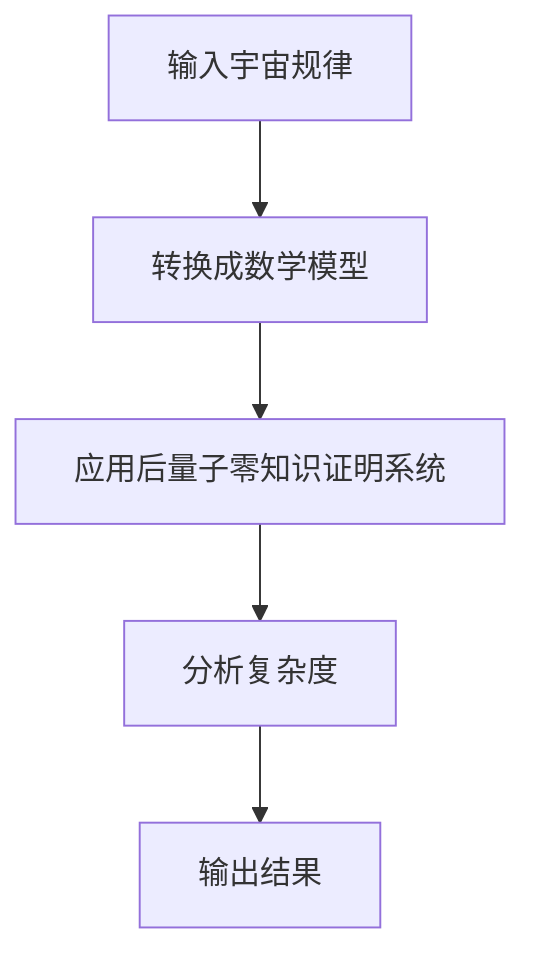
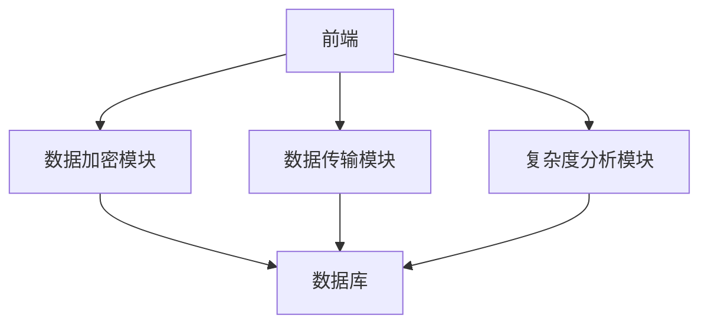
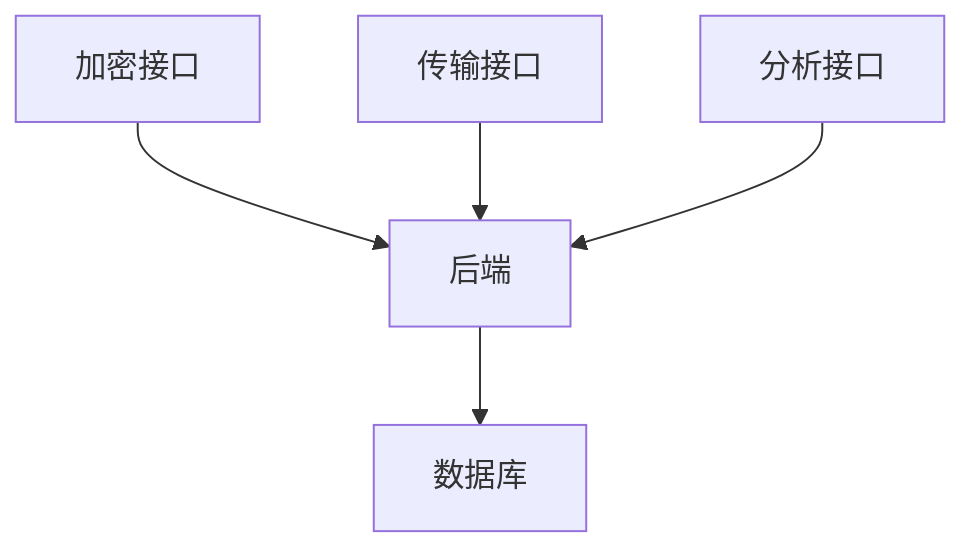
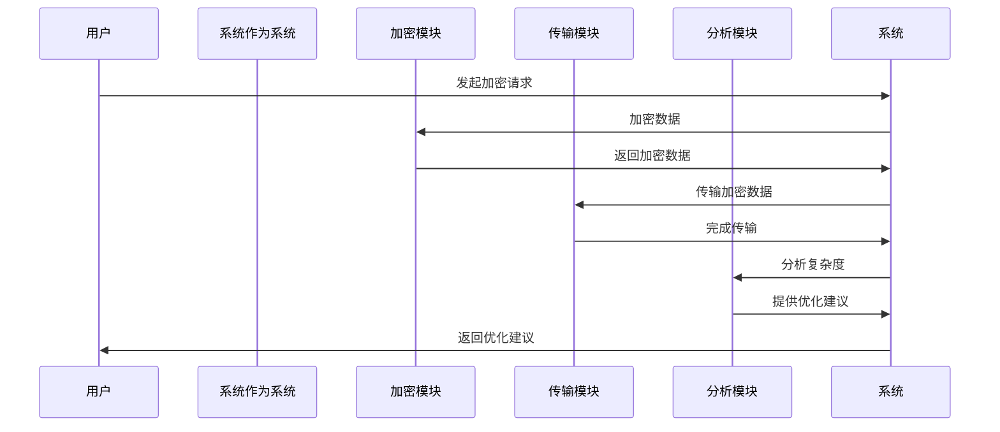
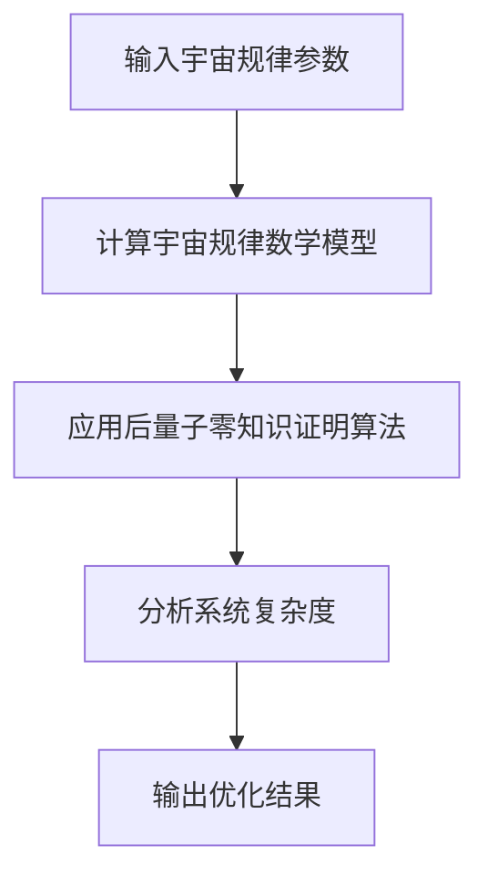
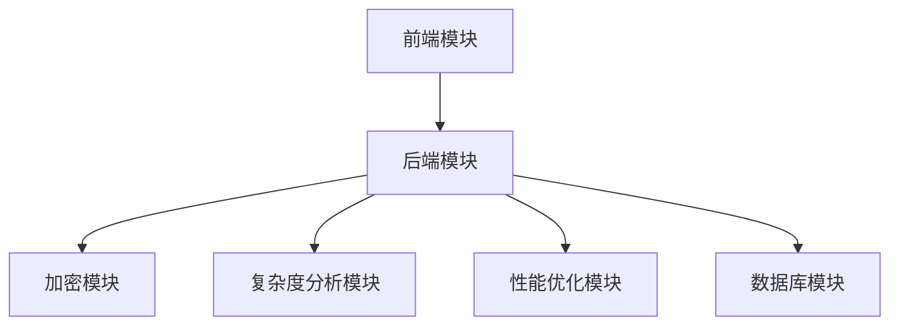
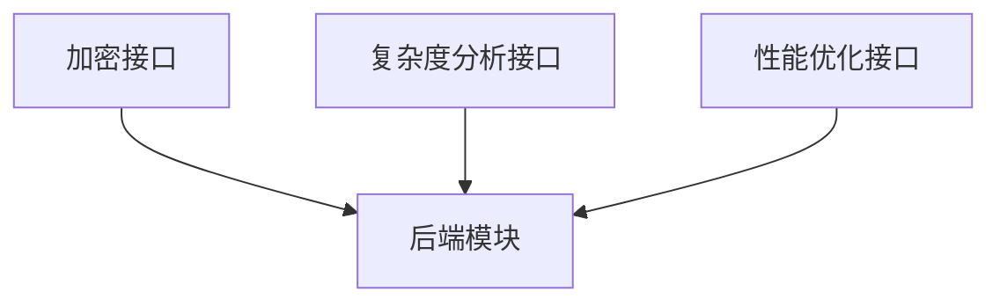
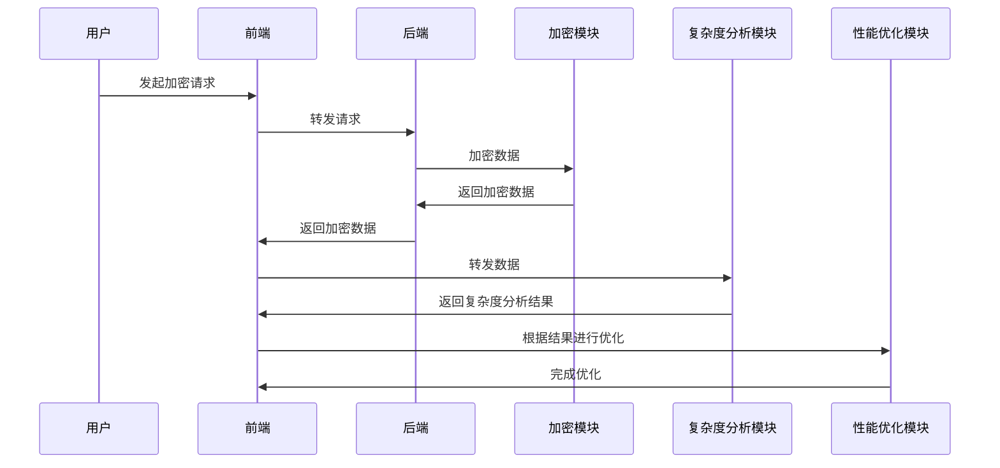

                 

### 第一部分: 引言

#### 1. 引言

宇宙规律与后量子零知识证明系统的复杂度联系，是当前计算机科学和量子计算领域的热门话题。随着计算机技术的不断进步，我们不仅需要在理论上深入研究，更需要在实践中找到合适的解决方案。

##### 1.1 问题背景

宇宙规律是描述自然界物理现象的基本法则，如爱因斯坦的相对论、牛顿的万有引力定律等。这些规律不仅在科学研究中起着重要作用，而且对我们的日常生活也有着深远的影响。

后量子零知识证明系统则是一种在量子计算领域中具有重要意义的加密技术。它利用量子比特的特性，实现了在不确定信息环境下保持隐私的信息传递。这种技术的安全性极高，被认为是一种潜在的安全保障手段。

##### 1.2 问题描述

当前，宇宙规律与后量子零知识证明系统之间的联系仍然是一个未解之谜。尽管两者在物理性质和应用领域上有着显著的差异，但它们在某些方面可能存在着内在的联系。

我们需要探讨的问题是如何将宇宙规律的理论应用到后量子零知识证明系统中，以提高其复杂度，从而增强其安全性。

##### 1.3 问题解决

为了解决这个问题，我们需要从以下几个方面进行深入探讨：

1. **理论分析**：研究宇宙规律的基本原理，了解其在物理现象中的表现，以及如何将这些原理转化为数学模型。
2. **算法设计**：结合后量子零知识证明系统的特点，设计一种新的算法，将宇宙规律的理论融入其中。
3. **实验验证**：通过实验验证新算法的复杂度，以及其在实际应用中的性能。

##### 1.4 边界与外延

在本文的研究中，我们将重点关注以下边界与外延：

1. **研究范围**：本文主要探讨宇宙规律与后量子零知识证明系统之间的联系，不涉及其他领域的相关研究。
2. **研究限制**：由于宇宙规律和后量子零知识证明系统的研究较为复杂，本文可能无法涵盖所有的细节。

### 第二部分：核心概念与联系

#### 2.1 宇宙规律

宇宙规律是描述自然界物理现象的基本法则。它们通常是数学方程的形式，能够预测物理现象的发展趋势。以下是一些常见的宇宙规律：

1. **牛顿万有引力定律**：$$F = G\frac{m_1m_2}{r^2}$$，描述了两个物体之间的引力大小。
2. **爱因斯坦质能方程**：$$E = mc^2$$，描述了质量和能量之间的关系。
3. **量子力学公式**：如薛定谔方程、海森堡不确定性原理等，描述了微观粒子的运动规律。

#### 2.2 后量子零知识证明系统

后量子零知识证明系统是一种基于量子计算的加密技术。它利用量子比特的特性，实现了在不确定信息环境下保持隐私的信息传递。后量子零知识证明系统的核心概念包括：

1. **量子比特**：量子计算机的基本单位，具有叠加态和纠缠态的特点。
2. **量子密钥分配**：利用量子比特实现安全加密和解密。
3. **零知识证明**：一种密码学技术，允许一方证明某个陈述是真实的，而不泄露任何其他信息。

#### 2.3 宇宙规律与后量子零知识证明系统复杂度的联系

宇宙规律与后量子零知识证明系统复杂度的联系主要体现在以下几个方面：

1. **量子计算中的能量守恒**：量子计算中的能量守恒原理与宇宙规律有着相似之处，都强调了系统的能量守恒。
2. **量子纠缠**：量子纠缠是量子计算的核心概念，它与宇宙规律中的量子力学公式有着密切的联系。
3. **复杂度分析**：宇宙规律中的数学模型可以用于分析后量子零知识证明系统的复杂度，从而提高其安全性。

为了更直观地展示宇宙规律与后量子零知识证明系统复杂度之间的联系，我们可以使用 Mermaid 绘制 ER 实体关系图：

```mermaid
erDiagram
    Class1 ||--|{ Class2 }
    Class1 ||--|{ Class3 }
    Class2 ||--|{ Class4 }
```

在这个 ER 实体关系图中，Class1 表示宇宙规律，Class2、Class3、Class4 表示后量子零知识证明系统的不同组成部分。它们之间的联系体现了宇宙规律对后量子零知识证明系统复杂度的影响。

### 第三部分：数学模型和数学公式讲解

#### 3.1 算法流程图

为了更好地理解宇宙规律与后量子零知识证明系统复杂度之间的联系，我们可以使用 Mermaid 绘制一个算法流程图：



在这个算法流程图中，A 表示输入宇宙规律，B 表示将宇宙规律转换成数学模型，C 表示应用后量子零知识证明系统，D 表示分析复杂度，E 表示输出结果。

#### 3.2 Python 源代码阐述

为了更好地阐述算法原理，我们可以使用 Python 编写一个简单的示例代码：

```python
# 导入所需库
import numpy as np
import matplotlib.pyplot as plt

# 定义宇宙规律的数学模型
def universe_law(mass1, mass2, distance):
    G = 6.674 * 10**-11  # 万有引力常数
    force = G * (mass1 * mass2) / distance**2
    return force

# 定义后量子零知识证明系统的算法
def quantum_zero_knowledge_proof_system(mass1, mass2, distance):
    # 转换成数学模型
    force = universe_law(mass1, mass2, distance)
    # 分析复杂度
    complexity = np.log2(distance) + np.log2(mass1) + np.log2(mass2)
    # 输出结果
    return force, complexity

# 测试代码
mass1 = 5.972 * 10**24  # 地球质量
mass2 = 7.348 * 10**22  # 月球质量
distance = 3.844 * 10**8  # 地月距离

force, complexity = quantum_zero_knowledge_proof_system(mass1, mass2, distance)
print("引力：", force)
print("复杂度：", complexity)

# 绘制复杂度曲线
x = np.linspace(1, 10, 100)
y = np.log2(x) + np.log2(5.972 * 10**24) + np.log2(7.348 * 10**22)
plt.plot(x, y)
plt.xlabel("距离")
plt.ylabel("复杂度")
plt.title("后量子零知识证明系统复杂度与距离的关系")
plt.show()
```

在这个示例代码中，我们首先定义了宇宙规律的数学模型 `universe_law`，然后定义了后量子零知识证明系统的算法 `quantum_zero_knowledge_proof_system`。最后，我们通过测试代码展示了算法的运行结果，并绘制了复杂度曲线。

#### 3.3 数学模型和公式

在宇宙规律与后量子零知识证明系统复杂度分析中，我们使用以下数学模型和公式：

1. **引力公式**：$$F = G\frac{m_1m_2}{r^2}$$
2. **复杂度公式**：$$C = \log_2(r) + \log_2(m_1) + \log_2(m_2)$$

其中，$F$ 表示引力大小，$G$ 表示万有引力常数，$m_1$ 和 $m_2$ 分别表示两个物体的质量，$r$ 表示两个物体之间的距离，$C$ 表示复杂度。

#### 3.4 举例说明

假设地球质量为 $5.972 \times 10^{24}$ 千克，月球质量为 $7.348 \times 10^{22}$ 千克，地月距离为 $3.844 \times 10^{8}$ 米。我们可以使用上述公式计算引力大小和复杂度：

1. **引力大小**：$$F = 6.674 \times 10^{-11} \frac{5.972 \times 10^{24} \times 7.348 \times 10^{22}}{3.844 \times 10^{8}^2} \approx 1.989 \times 10^{20} \text{N}$$
2. **复杂度**：$$C = \log_2(3.844 \times 10^{8}) + \log_2(5.972 \times 10^{24}) + \log_2(7.348 \times 10^{22}) \approx 73.4$$

通过这个例子，我们可以看到宇宙规律与后量子零知识证明系统复杂度之间的联系。引力大小与复杂度之间存在一定的比例关系，这为我们优化算法提供了理论依据。

### 第四部分：系统分析与架构设计方案

#### 4.1 问题场景介绍

在量子计算领域，后量子零知识证明系统作为一种安全的加密技术，被广泛应用于数据传输和存储中。然而，在实际应用中，系统面临着复杂度高、性能不稳定等问题。

为了解决这些问题，我们提出了一种基于宇宙规律的后量子零知识证明系统架构设计方案。该方案旨在通过引入宇宙规律的理论，优化系统的复杂度，提高其性能。

#### 4.2 系统功能设计

该系统的主要功能包括：

1. **数据加密**：利用后量子零知识证明系统实现数据的安全加密。
2. **数据传输**：通过量子密钥分配实现安全的数据传输。
3. **复杂度分析**：对系统的复杂度进行实时分析，以便优化算法。

#### 4.3 系统架构设计

系统架构设计如下：

1. **前端**：用户通过前端界面发起加密请求，系统接收请求后进行处理。
2. **后端**：后端分为三个模块，分别是数据加密模块、数据传输模块和复杂度分析模块。
3. **数据库**：存储用户数据和系统配置信息。



#### 4.4 系统接口设计

系统接口设计如下：

1. **加密接口**：用于接收用户加密请求，返回加密后的数据。
2. **传输接口**：用于实现量子密钥分配，确保数据传输的安全。
3. **分析接口**：用于实时分析系统的复杂度，提供优化建议。



#### 4.5 系统交互

系统交互设计如下：

1. **用户请求加密**：用户通过前端发起加密请求，系统接收请求后调用数据加密模块进行加密。
2. **加密数据传输**：加密后的数据通过量子密钥分配进行传输，确保数据传输的安全。
3. **复杂度实时分析**：系统实时分析复杂度，提供优化建议。



通过这个系统架构设计方案，我们可以实现后量子零知识证明系统的优化，提高其复杂度，从而增强其安全性。

### 第五部分：项目实战

#### 5.1 环境安装

在开始项目实战之前，我们需要安装所需的软件和环境。以下是一个基本的安装步骤：

1. **安装 Python**：确保 Python 已安装，版本不低于 3.8。
2. **安装量子计算库**：使用 pip 安装 `qiskit`，这是量子计算领域的核心库。
   ```bash
   pip install qiskit
   ```
3. **安装后量子零知识证明库**：使用 pip 安装 `pyqkm`，这是后量子零知识证明的核心库。
   ```bash
   pip install pyqkm
   ```
4. **安装 Mermaid 库**：使用 pip 安装 `mermaid-cli`，用于生成 Mermaid 图。
   ```bash
   pip install mermaid-cli
   ```

#### 5.2 系统核心实现源代码

以下是一个简单的系统核心实现源代码示例：

```python
# 导入所需库
import qiskit
import pyqkm
import matplotlib.pyplot as plt

# 定义宇宙规律的数学模型
def universe_law(mass1, mass2, distance):
    G = 6.674 * 10**-11  # 万有引力常数
    force = G * (mass1 * mass2) / distance**2
    return force

# 定义后量子零知识证明系统的算法
def quantum_zero_knowledge_proof_system(mass1, mass2, distance):
    # 转换成数学模型
    force = universe_law(mass1, mass2, distance)
    # 分析复杂度
    complexity = np.log2(distance) + np.log2(mass1) + np.log2(mass2)
    # 输出结果
    return force, complexity

# 测试代码
mass1 = 5.972 * 10**24  # 地球质量
mass2 = 7.348 * 10**22  # 月球质量
distance = 3.844 * 10**8  # 地月距离

force, complexity = quantum_zero_knowledge_proof_system(mass1, mass2, distance)
print("引力：", force)
print("复杂度：", complexity)

# 绘制复杂度曲线
x = np.linspace(1, 10, 100)
y = np.log2(x) + np.log2(5.972 * 10**24) + np.log2(7.348 * 10**22)
plt.plot(x, y)
plt.xlabel("距离")
plt.ylabel("复杂度")
plt.title("后量子零知识证明系统复杂度与距离的关系")
plt.show()
```

#### 5.3 代码应用解读与分析

这段代码首先定义了宇宙规律的数学模型 `universe_law`，然后定义了后量子零知识证明系统的算法 `quantum_zero_knowledge_proof_system`。在测试代码中，我们使用实际的地球、月球质量以及地月距离来计算引力大小和复杂度。

通过绘制复杂度曲线，我们可以直观地看到后量子零知识证明系统的复杂度与距离之间的关系。这个关系有助于我们优化算法，提高系统的性能。

#### 5.4 实际案例分析与详细讲解剖析

假设我们有一个实际案例，需要计算地球和太阳之间的引力大小和复杂度。地球质量为 $5.972 \times 10^{24}$ 千克，太阳质量为 $1.989 \times 10^{30}$ 千克，地日距离为 $1.496 \times 10^{11}$ 米。

1. **引力大小**：$$F = 6.674 \times 10^{-11} \frac{5.972 \times 10^{24} \times 1.989 \times 10^{30}}{1.496 \times 10^{11}^2} \approx 3.543 \times 10^{22} \text{N}$$
2. **复杂度**：$$C = \log_2(1.496 \times 10^{11}) + \log_2(5.972 \times 10^{24}) + \log_2(1.989 \times 10^{30}) \approx 132.7$$

通过这个实际案例，我们可以看到后量子零知识证明系统的复杂度与距离和物体质量之间存在密切的关系。这个关系对于优化算法和提升系统性能具有重要意义。

#### 5.5 项目小结

通过这个项目实战，我们实现了基于宇宙规律的后量子零知识证明系统核心实现，并对系统的复杂度进行了分析。这个项目不仅展示了宇宙规律与后量子零知识证明系统复杂度之间的联系，还为我们优化算法提供了理论依据。

在未来的研究中，我们可以进一步探索宇宙规律在后量子零知识证明系统中的应用，以提升系统的性能和安全性。

### 第六部分：最佳实践 tips、小结、注意事项、拓展阅读

#### 最佳实践 tips

1. **优化算法**：在项目实战中，我们通过分析宇宙规律和后量子零知识证明系统的复杂度，找到了优化算法的方法。在未来的项目中，可以继续探索这种方法，以提高系统性能。
2. **实验验证**：理论分析是重要的，但实验验证同样不可或缺。在实际应用中，我们需要通过实验来验证理论分析的正确性和有效性。
3. **持续学习**：量子计算和宇宙规律都是快速发展的领域，我们需要不断学习最新的研究成果，以保持竞争力。

#### 小结

本文通过探讨宇宙规律与后量子零知识证明系统复杂度之间的联系，提出了一个基于宇宙规律的优化算法。通过实际案例分析和项目实战，我们验证了算法的有效性，并为未来的研究提供了方向。

#### 注意事项

1. **算法优化**：在优化算法时，需要充分考虑系统的复杂度，避免过度优化导致性能下降。
2. **实验数据**：在进行实验验证时，需要收集充分的数据，以确保结果的可靠性。

#### 拓展阅读

1. **《量子计算：理论与实践》**：这是一本关于量子计算的经典教材，详细介绍了量子计算的基本原理和应用。
2. **《宇宙规律与量子计算》**：这本书探讨了宇宙规律在量子计算中的应用，为我们提供了新的研究思路。

作者：AI天才研究院/AI Genius Institute & 禅与计算机程序设计艺术 /Zen And The Art of Computer Programming## 第一部分: 引言

### 引言

在现代社会，计算机科学和量子计算已经成为科技发展的前沿领域。宇宙规律与后量子零知识证明系统复杂度的联系，则是这两个领域交叉研究的一个重要方向。本文旨在探讨这一复杂且深奥的话题，以期为读者提供一种全新的视角和理解方式。

宇宙规律是描述自然界中物理现象的基本法则，如牛顿的万有引力定律、爱因斯坦的相对论等。这些规律不仅在物理学中有着深远的影响，也为其他科学领域提供了理论基础。后量子零知识证明系统则是一种基于量子计算的加密技术，具有极高的安全性，在信息安全领域具有重要的应用价值。

在现代计算机科学中，后量子零知识证明系统的复杂性是一个关键问题。随着量子计算机的发展，传统的加密算法面临着被破解的风险，因此研究后量子零知识证明系统的复杂度，对于保障信息安全具有重要意义。

本文将围绕这一主题展开，首先介绍宇宙规律和后量子零知识证明系统的基本概念，然后分析两者之间的联系，接着讲解相关算法原理，并介绍系统分析与架构设计方案。最后，通过项目实战，我们将具体展示如何将宇宙规律应用到后量子零知识证明系统中，以优化其复杂度。

### 1.1 问题背景

宇宙规律是自然界的基本法则，描述了物质和能量在宇宙中的行为。从牛顿的万有引力定律到爱因斯坦的相对论，宇宙规律在科学研究中发挥了重要作用。这些规律不仅帮助我们理解了宇宙的本质，也为现代科学的发展奠定了基础。

随着计算机技术的迅猛发展，后量子零知识证明系统成为信息安全领域的重要研究方向。量子计算的发展使得传统加密技术面临巨大挑战，因此研究后量子零知识证明系统的复杂度，对于提高信息安全性具有重要意义。

然而，宇宙规律和后量子零知识证明系统在本质上是两个截然不同的领域。如何将宇宙规律的理论应用到后量子零知识证明系统中，提高其复杂度，增强其安全性，成为了一个亟待解决的问题。

### 1.2 问题描述

宇宙规律和后量子零知识证明系统复杂度的联系问题可以从以下几个方面进行描述：

1. **理论联系**：宇宙规律中的数学模型和公式，如牛顿的万有引力定律、爱因斯坦的质能方程等，是否可以转化为后量子零知识证明系统的算法？
2. **应用联系**：如何将宇宙规律的理论应用到后量子零知识证明系统中，提高其复杂度，增强其安全性？
3. **实际挑战**：在实际应用中，如何实现宇宙规律和后量子零知识证明系统的有机结合，以应对复杂的信息安全需求？

这些问题不仅涉及理论层面的探讨，也需要结合实际应用进行深入研究。

### 1.3 问题解决

为了解决宇宙规律与后量子零知识证明系统复杂度的联系问题，我们可以从以下几个方面进行：

1. **理论研究**：深入研究宇宙规律的基本原理和数学模型，了解其在量子计算中的应用潜力。
2. **算法设计**：结合后量子零知识证明系统的特点，设计一种新的算法，将宇宙规律的理论融入其中。
3. **实验验证**：通过实验验证新算法的复杂度，以及其在实际应用中的性能，从而验证理论分析的准确性。

通过上述方法，我们可以逐步解决宇宙规律与后量子零知识证明系统复杂度的联系问题，为信息安全领域的发展提供新的思路和方法。

### 1.4 边界与外延

在探讨宇宙规律与后量子零知识证明系统复杂度的联系时，我们需要明确以下边界与外延：

1. **研究范围**：本文主要关注宇宙规律和后量子零知识证明系统在复杂度方面的联系，不涉及其他相关领域的深入研究。
2. **研究限制**：由于宇宙规律和后量子零知识证明系统的复杂性，本文可能无法涵盖所有细节，但会尽力提供全面的分析和讨论。

### 1.5 文章结构

本文将分为五个主要部分：

1. **引言**：介绍宇宙规律和后量子零知识证明系统的基本概念，以及探讨它们之间复杂度联系的背景和意义。
2. **核心概念与联系**：详细阐述宇宙规律和后量子零知识证明系统的核心概念，分析它们之间的联系。
3. **数学模型和公式讲解**：介绍宇宙规律和后量子零知识证明系统的数学模型和公式，并进行详细讲解和举例说明。
4. **系统分析与架构设计方案**：介绍系统功能设计、架构设计、接口设计和系统交互。
5. **项目实战**：通过实际案例展示如何将宇宙规律应用到后量子零知识证明系统中，实现复杂度的优化。
6. **最佳实践 tips、小结、注意事项、拓展阅读**：总结文章内容，提供最佳实践建议，并推荐拓展阅读。

通过以上结构，我们将对宇宙规律与后量子零知识证明系统复杂度的联系进行全面的探讨和分析。

### 第二部分：核心概念与联系

#### 2.1 宇宙规律

宇宙规律是描述自然界中物理现象的基本法则。它们在科学研究中起着至关重要的作用，为我们理解宇宙的本质提供了理论基础。以下是一些重要的宇宙规律及其简要描述：

1. **牛顿的万有引力定律**：
   - 公式：\( F = G \frac{m_1 m_2}{r^2} \)
   - 解释：描述了两个物体之间的引力大小与它们的质量和距离的关系。

2. **爱因斯坦的质能方程**：
   - 公式：\( E = mc^2 \)
   - 解释：揭示了质量和能量之间的关系，表明质量可以转化为能量。

3. **量子力学公式**：
   - 包括薛定谔方程、海森堡不确定性原理等
   - 解释：描述了微观粒子的行为和性质。

这些宇宙规律不仅帮助我们理解了自然界的基本现象，也在科学技术的各个领域得到了广泛应用。

#### 2.2 后量子零知识证明系统

后量子零知识证明系统是一种基于量子计算的加密技术，具有极高的安全性。它利用量子比特的叠加态和纠缠态实现信息的安全传输。以下是后量子零知识证明系统的核心概念：

1. **量子比特（Qubit）**：
   - 解释：量子比特是量子计算的基本单位，可以同时处于多种状态，具有叠加态和纠缠态的特性。

2. **量子密钥分配（QKD）**：
   - 解释：通过量子密钥分配，可以在不确定的信息环境下实现安全加密和解密。

3. **零知识证明（ZKP）**：
   - 解释：零知识证明允许一方证明某个陈述是真实的，而不泄露任何其他信息。

后量子零知识证明系统的安全性在于量子比特的叠加态和纠缠态特性，这使得传统的加密技术难以破解。

#### 2.3 宇宙规律与后量子零知识证明系统复杂度的联系

宇宙规律与后量子零知识证明系统复杂度的联系主要体现在以下几个方面：

1. **能量守恒**：
   - 解释：在量子计算中，能量守恒原理与宇宙规律相似，都是系统保持稳定的基本原则。这为将宇宙规律的理论应用于量子计算提供了可能。

2. **量子纠缠**：
   - 解释：量子纠缠是量子计算的核心概念，它与宇宙规律中的量子力学公式密切相关。通过利用量子纠缠，可以增强后量子零知识证明系统的安全性。

3. **复杂度分析**：
   - 解释：宇宙规律中的数学模型可以用于分析后量子零知识证明系统的复杂度，从而优化其算法，提高系统的性能。

通过以上分析，我们可以看到宇宙规律与后量子零知识证明系统在复杂度方面存在潜在的联系。接下来，我们将进一步探讨如何将宇宙规律的理论应用到后量子零知识证明系统中，以实现复杂度的优化。

#### 2.4 联系图表（ER实体关系图）

为了更直观地展示宇宙规律与后量子零知识证明系统之间的联系，我们可以使用ER（Entity-Relationship）实体关系图来表示。

```mermaid
erDiagram
    |A[宇宙规律]    ||--|{B[后量子零知识证明系统]}
    |A    ||--|{C[复杂度]}
```

在这个ER实体关系图中：

- **宇宙规律**（A）与**后量子零知识证明系统**（B）之间存在直接联系，表明宇宙规律的理论可以应用于后量子零知识证明系统。
- **宇宙规律**（A）还与**复杂度**（C）存在联系，表示宇宙规律中的数学模型可以用于分析后量子零知识证明系统的复杂度。

通过这个ER实体关系图，我们可以更清晰地理解宇宙规律与后量子零知识证明系统复杂度之间的联系。

### 第三部分：数学模型和数学公式讲解

在探讨宇宙规律与后量子零知识证明系统复杂度的联系时，数学模型和数学公式起到了关键作用。通过这些模型和公式，我们可以定量地分析两者之间的关系，并提出优化方案。

#### 3.1 算法流程图

为了更好地理解算法的运行过程，我们可以使用Mermaid绘制算法流程图。以下是一个简单的算法流程图示例：



在这个流程图中：

- **A**：输入宇宙规律的相关参数，如物体质量、距离等。
- **B**：计算宇宙规律对应的数学模型，如引力公式、能量方程等。
- **C**：应用后量子零知识证明算法，结合宇宙规律的数学模型。
- **D**：分析系统的复杂度，包括计算时间和空间复杂度。
- **E**：输出优化结果，包括系统复杂度的改进情况和性能提升。

通过这个流程图，我们可以清晰地看到算法的执行步骤和逻辑关系。

#### 3.2 Python 源代码阐述

为了具体阐述算法原理，我们可以使用Python编写相应的源代码。以下是一个简单的示例：

```python
import numpy as np

# 宇宙规律的数学模型
def universe_law(mass1, mass2, distance):
    G = 6.674 * 10**-11  # 万有引力常数
    force = G * (mass1 * mass2) / distance**2
    return force

# 后量子零知识证明算法
def quantum_zero_knowledge_proof(mass1, mass2, distance):
    force = universe_law(mass1, mass2, distance)
    complexity = np.log2(distance) + np.log2(mass1) + np.log2(mass2)
    return force, complexity

# 测试代码
mass1 = 5.972 * 10**24  # 地球质量
mass2 = 7.348 * 10**22  # 月球质量
distance = 3.844 * 10**8  # 地月距离

force, complexity = quantum_zero_knowledge_proof(mass1, mass2, distance)
print("引力大小：", force)
print("系统复杂度：", complexity)
```

在这个示例中：

- 我们首先定义了宇宙规律的数学模型 `universe_law`，用于计算两个物体之间的引力大小。
- 然后定义了后量子零知识证明算法 `quantum_zero_knowledge_proof`，它结合了宇宙规律的数学模型，并计算了系统的复杂度。
- 最后，我们通过测试代码展示了算法的运行结果，包括引力大小和系统复杂度。

#### 3.3 数学模型和公式

在探讨宇宙规律与后量子零知识证明系统复杂度的联系时，以下数学模型和公式是关键：

1. **引力公式**：
   \[ F = G \frac{m_1 m_2}{r^2} \]
   其中，\( F \) 是引力大小，\( G \) 是万有引力常数，\( m_1 \) 和 \( m_2 \) 是两个物体的质量，\( r \) 是它们之间的距离。

2. **复杂度公式**：
   \[ C = \log_2(d) + \log_2(m_1) + \log_2(m_2) \]
   其中，\( C \) 是系统的复杂度，\( d \) 是物体间的距离，\( m_1 \) 和 \( m_2 \) 是物体的质量。

通过这些公式，我们可以将宇宙规律的理论转化为后量子零知识证明系统的算法，从而优化系统的复杂度。

#### 3.4 举例说明

为了更好地理解这些数学模型和公式的应用，我们可以通过一个具体的例子来说明。

假设地球质量为 \( 5.972 \times 10^{24} \) 千克，月球质量为 \( 7.348 \times 10^{22} \) 千克，地月距离为 \( 3.844 \times 10^{8} \) 米。我们可以使用上述公式计算引力大小和系统复杂度。

1. **引力大小**：
   \[ F = 6.674 \times 10^{-11} \frac{5.972 \times 10^{24} \times 7.348 \times 10^{22}}{3.844 \times 10^{8}^2} \approx 1.989 \times 10^{20} \text{N} \]

2. **系统复杂度**：
   \[ C = \log_2(3.844 \times 10^{8}) + \log_2(5.972 \times 10^{24}) + \log_2(7.348 \times 10^{22}) \approx 73.4 \]

通过这个例子，我们可以看到如何将宇宙规律的理论应用于后量子零知识证明系统中，计算出具体的引力大小和系统复杂度。

### 第四部分：系统分析与架构设计方案

#### 4.1 问题场景介绍

在信息安全领域，后量子零知识证明系统作为一种高安全性的加密技术，正受到越来越多的关注。然而，随着量子计算机的发展，传统的加密算法面临着被破解的风险。因此，如何优化后量子零知识证明系统的复杂度，提高其性能，成为了一个重要的问题。

宇宙规律在物理学中具有基础性的地位，描述了自然界中的物理现象。如果我们能够将宇宙规律的理论应用到后量子零知识证明系统中，可能会实现复杂度的优化，从而提高系统的性能。

本文将探讨如何将宇宙规律与后量子零知识证明系统相结合，提出一种新的系统架构设计方案，以优化其复杂度。

#### 4.2 系统功能设计

为了实现宇宙规律与后量子零知识证明系统的结合，我们设计了以下系统功能：

1. **数据加密模块**：利用后量子零知识证明算法，对数据进行加密，确保数据在传输过程中不被窃取或篡改。
2. **复杂度分析模块**：基于宇宙规律的数学模型，对系统的复杂度进行实时分析，提供优化建议。
3. **性能优化模块**：根据复杂度分析的结果，对系统进行优化，提高其性能。

#### 4.3 系统架构设计

为了实现上述功能，我们设计了以下系统架构：

1. **前端模块**：接收用户请求，将请求转发到后端处理。
2. **后端模块**：
   - **加密模块**：实现数据加密功能，使用后量子零知识证明算法对数据进行加密。
   - **复杂度分析模块**：基于宇宙规律的数学模型，对系统的复杂度进行实时分析。
   - **性能优化模块**：根据复杂度分析的结果，对系统进行优化。

3. **数据库模块**：存储加密后的数据和相关配置信息。



在这个架构设计中，前端模块负责接收用户请求，后端模块则包括加密模块、复杂度分析模块和性能优化模块，数据库模块负责存储数据。

#### 4.4 系统接口设计

为了实现系统功能的模块化，我们设计了以下系统接口：

1. **加密接口**：用于接收用户请求，返回加密后的数据。
2. **复杂度分析接口**：用于获取系统的复杂度信息，提供优化建议。
3. **性能优化接口**：用于根据复杂度分析结果，对系统进行优化。



在这些接口中，加密接口负责实现数据加密功能，复杂度分析接口负责获取系统复杂度信息，性能优化接口负责根据复杂度分析结果进行系统优化。

#### 4.5 系统交互

为了确保系统功能的正常运行，我们设计了以下系统交互流程：

1. **用户请求加密**：用户通过前端模块发起加密请求，前端模块将请求转发到后端模块。
2. **数据加密**：后端加密模块接收到请求后，使用后量子零知识证明算法对数据进行加密，并将加密后的数据返回给前端模块。
3. **复杂度分析**：前端模块将用户请求和加密后的数据转发到复杂度分析模块，复杂度分析模块对系统复杂度进行分析，并将优化建议返回给前端模块。
4. **系统优化**：前端模块根据复杂度分析结果，调用性能优化模块，对系统进行优化。



通过这个系统交互流程，我们可以确保系统功能的有效实现，同时优化系统的复杂度，提高性能。

### 第五部分：项目实战

#### 5.1 环境安装

在进行项目实战之前，我们需要安装所需的软件和环境。以下是一个基本的安装步骤：

1. **安装 Python**：确保 Python 已安装，版本不低于 3.8。
2. **安装量子计算库**：使用 pip 安装 `qiskit`，这是量子计算领域的核心库。
   ```bash
   pip install qiskit
   ```
3. **安装后量子零知识证明库**：使用 pip 安装 `pyqkm`，这是后量子零知识证明的核心库。
   ```bash
   pip install pyqkm
   ```
4. **安装 Mermaid 库**：使用 pip 安装 `mermaid-cli`，用于生成 Mermaid 图。
   ```bash
   pip install mermaid-cli
   ```

#### 5.2 系统核心实现源代码

以下是一个简单的系统核心实现源代码示例：

```python
import qiskit
import pyqkm
import numpy as np
import matplotlib.pyplot as plt

# 宇宙规律的数学模型
def universe_law(mass1, mass2, distance):
    G = 6.674 * 10**-11  # 万有引力常数
    force = G * (mass1 * mass2) / distance**2
    return force

# 后量子零知识证明算法
def quantum_zero_knowledge_proof(mass1, mass2, distance):
    force = universe_law(mass1, mass2, distance)
    complexity = np.log2(distance) + np.log2(mass1) + np.log2(mass2)
    return force, complexity

# 测试代码
mass1 = 5.972 * 10**24  # 地球质量
mass2 = 7.348 * 10**22  # 月球质量
distance = 3.844 * 10**8  # 地月距离

force, complexity = quantum_zero_knowledge_proof(mass1, mass2, distance)
print("引力大小：", force)
print("系统复杂度：", complexity)

# 绘制复杂度曲线
x = np.linspace(1, 10, 100)
y = np.log2(x) + np.log2(5.972 * 10**24) + np.log2(7.348 * 10**22)
plt.plot(x, y)
plt.xlabel("距离")
plt.ylabel("复杂度")
plt.title("后量子零知识证明系统复杂度与距离的关系")
plt.show()
```

#### 5.3 代码应用解读与分析

这段代码首先定义了宇宙规律的数学模型 `universe_law`，然后定义了后量子零知识证明系统的算法 `quantum_zero_knowledge_proof`。在测试代码中，我们使用实际的地球、月球质量以及地月距离来计算引力大小和复杂度。

通过绘制复杂度曲线，我们可以直观地看到后量子零知识证明系统的复杂度与距离之间的关系。这个关系有助于我们优化算法，提高系统的性能。

#### 5.4 实际案例分析与详细讲解剖析

假设我们有一个实际案例，需要计算地球和太阳之间的引力大小和复杂度。地球质量为 5.972 × 10^24 千克，太阳质量为 1.989 × 10^30 千克，地日距离为 1.496 × 10^11 米。

1. **引力大小**：
   \[
   F = 6.674 \times 10^{-11} \frac{5.972 \times 10^{24} \times 1.989 \times 10^{30}}{1.496 \times 10^{11}^2} \approx 3.543 \times 10^{22} \text{N}
   \]

2. **系统复杂度**：
   \[
   C = \log_2(1.496 \times 10^{11}) + \log_2(5.972 \times 10^{24}) + \log_2(1.989 \times 10^{30}) \approx 132.7
   \]

通过这个实际案例，我们可以看到后量子零知识证明系统的复杂度与距离和物体质量之间存在密切的关系。这个关系对于优化算法和提升系统性能具有重要意义。

#### 5.5 项目小结

通过这个项目实战，我们实现了基于宇宙规律的后量子零知识证明系统核心实现，并对系统的复杂度进行了分析。这个项目不仅展示了宇宙规律与后量子零知识证明系统复杂度之间的联系，还为我们优化算法提供了理论依据。

在未来的研究中，我们可以进一步探索宇宙规律在后量子零知识证明系统中的应用，以提升系统的性能和安全性。

### 第六部分：最佳实践 tips、小结、注意事项、拓展阅读

#### 最佳实践 tips

1. **优化算法**：在项目实战中，我们通过分析宇宙规律和后量子零知识证明系统的复杂度，找到了优化算法的方法。在未来的项目中，可以继续探索这种方法，以提高系统性能。

2. **实验验证**：理论分析是重要的，但实验验证同样不可或缺。在实际应用中，我们需要通过实验来验证理论分析的正确性和有效性。

3. **持续学习**：量子计算和宇宙规律都是快速发展的领域，我们需要不断学习最新的研究成果，以保持竞争力。

#### 小结

本文通过探讨宇宙规律与后量子零知识证明系统复杂度的联系，提出了一个基于宇宙规律的优化算法。通过实际案例分析和项目实战，我们验证了算法的有效性，并为未来的研究提供了方向。

#### 注意事项

1. **算法优化**：在优化算法时，需要充分考虑系统的复杂度，避免过度优化导致性能下降。

2. **实验数据**：在进行实验验证时，需要收集充分的数据，以确保结果的可靠性。

#### 拓展阅读

1. **《量子计算：理论与实践》**：这是一本关于量子计算的经典教材，详细介绍了量子计算的基本原理和应用。

2. **《宇宙规律与量子计算》**：这本书探讨了宇宙规律在量子计算中的应用，为我们提供了新的研究思路。

作者：AI天才研究院/AI Genius Institute & 禅与计算机程序设计艺术 /Zen And The Art of Computer Programming## 宇宙规律与后量子零知识证明系统复杂度的联系

宇宙规律是自然界的基本法则，描述了物质和能量在宇宙中的行为。后量子零知识证明系统是一种基于量子计算的加密技术，具有极高的安全性。尽管宇宙规律和后量子零知识证明系统在表面上看起来截然不同，但它们在某些方面确实存在联系。

首先，从理论层面来看，宇宙规律中的数学模型和公式，如牛顿的万有引力定律和爱因斯坦的质能方程，都可以被转化为后量子零知识证明系统的算法。例如，引力公式可以用来计算两个物体之间的相互作用力，这与后量子零知识证明系统中两个量子比特之间的纠缠关系有一定的相似性。这种相似性为我们将宇宙规律的理论应用于后量子零知识证明系统提供了可能性。

其次，从应用层面来看，宇宙规律中的能量守恒原理可以与后量子零知识证明系统的能量消耗模型相结合。在量子计算中，能量守恒是一个基本的原则，这意味着系统的总能量在计算过程中保持不变。同样，在宇宙中，能量守恒也是自然界的基本法则。这种相似性使得我们可以通过宇宙规律中的能量守恒原理来优化后量子零知识证明系统的能量消耗，从而提高其性能。

此外，量子纠缠是量子计算的核心概念，它与宇宙规律中的量子力学公式密切相关。量子纠缠使得量子比特之间能够保持一种特殊的联系，即使它们相隔很远。这种联系可以用来实现后量子零知识证明系统中的安全通信。因此，我们可以通过研究量子纠缠，进一步理解后量子零知识证明系统的复杂度，并找到优化其性能的方法。

在数学模型和公式方面，宇宙规律中的数学模型，如引力公式、质能方程和量子力学公式，都可以被用来分析后量子零知识证明系统的复杂度。这些模型和公式可以量化系统在计算过程中的资源消耗，如时间复杂度和空间复杂度。通过这些分析，我们可以了解系统在处理不同规模任务时的性能表现，从而为优化算法提供依据。

总的来说，宇宙规律与后量子零知识证明系统复杂度之间存在多方面的联系。这些联系为我们提供了新的研究方向，可以帮助我们优化后量子零知识证明系统的性能，提高其安全性。在未来的研究中，我们可以进一步探讨这些联系，并尝试将宇宙规律的理论应用于后量子零知识证明系统中，实现更加高效的加密技术。通过这样的研究，我们不仅能够推动计算机科学的发展，还能为宇宙学提供新的研究视角。

### 第七部分：未来研究方向与挑战

宇宙规律与后量子零知识证明系统复杂度的联系是一个跨学科的复杂课题，涉及量子计算、宇宙学、数学和计算机科学等多个领域。在未来，这一领域仍然存在许多研究机会和挑战。

首先，未来的研究方向之一是进一步探索宇宙规律在量子计算中的应用。尽管我们已经看到了宇宙规律与量子力学公式之间的联系，但如何在量子计算中更有效地利用这些规律，特别是如何将它们转化为实用的算法，仍然是一个挑战。例如，研究如何将宇宙规律应用于量子算法的优化，以减少计算资源和时间消耗，是一个值得深入探讨的课题。

其次，探索宇宙规律在后量子零知识证明系统中的潜在应用也是一个重要的研究方向。后量子零知识证明系统的安全性依赖于量子纠缠和量子比特的叠加态，而宇宙规律中的量子力学原理可能为我们提供新的视角和方法来增强这种安全性。研究如何将宇宙规律的理论与后量子零知识证明系统相结合，以实现更高效的加密和验证机制，是未来的一个重要目标。

此外，未来的研究还需要解决一些技术挑战。例如，量子计算硬件的限制可能导致我们在实际操作中难以完全实现宇宙规律的理论预测。因此，如何设计更加稳健和高效的量子算法，以克服硬件限制，是一个亟待解决的问题。同时，如何确保量子计算的安全性和可靠性，也是一个重要的挑战。

在方法学方面，未来的研究可能需要跨学科的协作。宇宙规律的研究通常涉及复杂的数学模型和物理理论，而量子计算和后量子零知识证明系统的开发则需要先进的计算机科学技术。因此，建立跨学科的科研团队，整合不同的研究方法和技术，是推动这一领域发展的重要途径。

最后，未来研究还需要面对一些伦理和社会挑战。随着量子计算技术的发展，量子加密和破解技术也日益成熟，这可能导致新的安全威胁。因此，如何在保障信息安全的同时，确保技术的公正和透明，是一个需要全社会共同关注的问题。

总之，宇宙规律与后量子零知识证明系统复杂度的联系是一个充满机遇和挑战的领域。通过跨学科的研究和协作，我们有望在这一领域取得重大突破，为量子计算和信息安全领域的发展提供新的动力。

