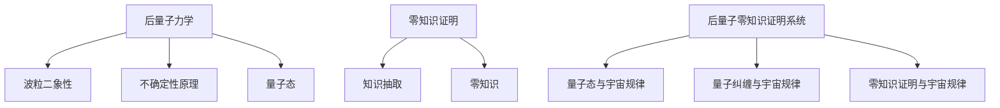
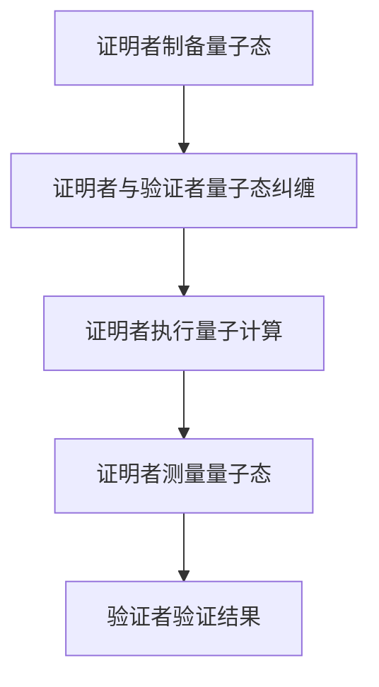
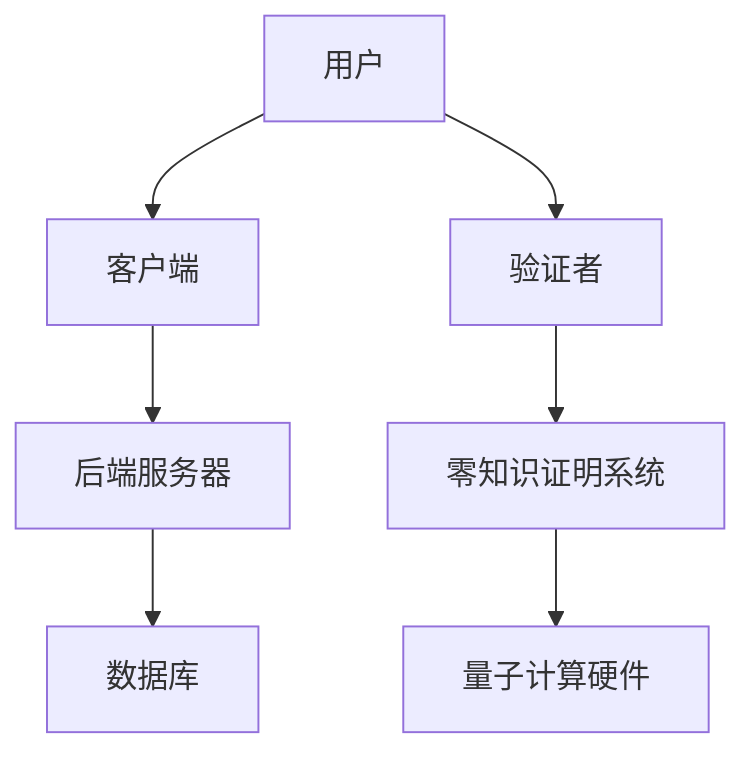
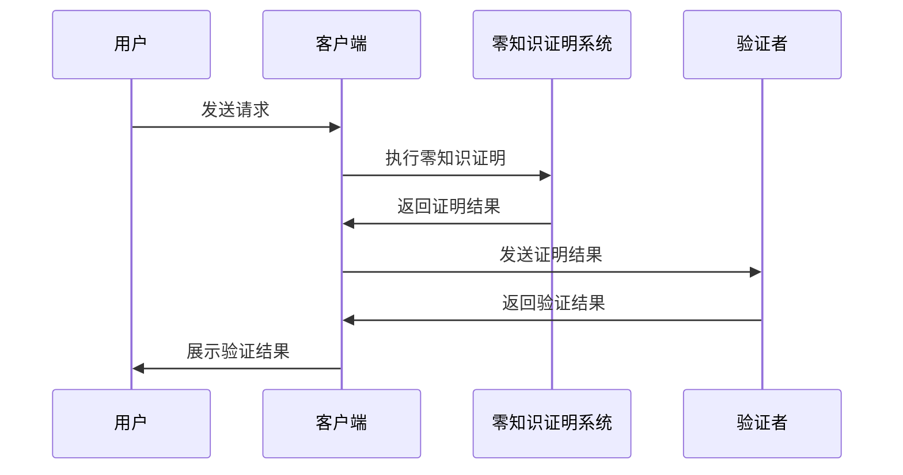
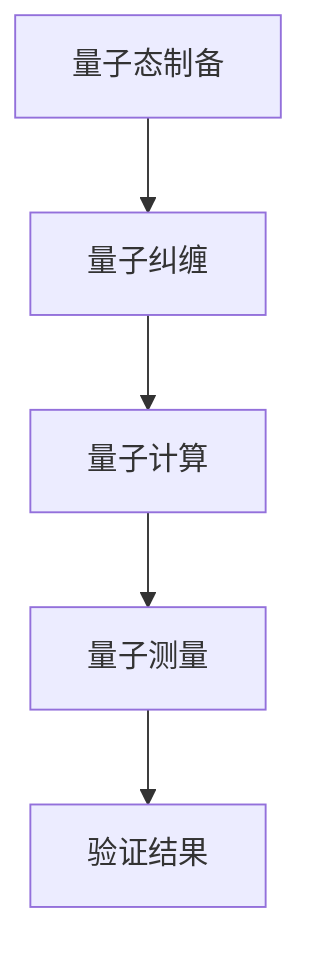

                 


# 宇宙规律与后量子零知识证明系统的联系

## 关键词
- 宇宙规律
- 后量子力学
- 零知识证明
- 量子纠缠
- 密码学

## 摘要
本文旨在探讨宇宙规律与后量子零知识证明系统之间的潜在联系。通过对宇宙基本规律的介绍，我们将了解宇宙的运行原理和结构。随后，我们将深入探讨后量子零知识证明系统的原理、应用及其与量子力学的关系。最后，我们将分析两者之间的联系，并展望未来的研究方向。

## 设计思路与大纲框架

为了系统地探讨宇宙规律与后量子零知识证明系统的联系，我们采用了以下设计思路与大纲框架：

1. **宇宙规律介绍**：首先，我们介绍宇宙的基本规律，包括物理学中的经典定律和量子力学原理。
2. **后量子零知识证明系统探讨**：其次，我们深入探讨后量子零知识证明系统的原理、应用场景及其在量子计算和密码学中的重要性。
3. **联系分析**：接着，我们将分析宇宙规律与后量子零知识证明系统之间的潜在联系，探讨它们在理论研究和实际应用中的相互影响。
4. **总结与展望**：最后，我们将总结全文，提出研究的意义与价值，并展望未来的研究方向。

### 第一部分：宇宙规律介绍

## 第1章：宇宙基本规律概述

### 1.1 宇宙规律的定义与重要性

宇宙规律是描述自然界中各种现象和物质运动的基本法则。它们不仅揭示了宇宙的本质，还为科学研究提供了理论基础。宇宙规律的重要性在于，它们帮助我们理解宇宙的结构、起源和发展。

### 1.2 重要的宇宙规律简介

在宇宙中，有一些基本的规律对宇宙的运行和结构产生了深远的影响。这些规律包括：

- **牛顿力学**：描述了物体的运动和力的关系。
- **电磁学**：描述了电荷和电磁场的相互作用。
- **热力学**：描述了能量转换和物质状态变化的过程。
- **量子力学**：描述了微观粒子的行为。

这些规律共同构成了我们对宇宙的基本认识，为后续章节的探讨奠定了基础。

## 第2章：物理学基本定律

### 2.1 牛顿力学

牛顿力学是描述宏观物体运动的基本理论，包括三个定律：

- **惯性定律**：物体在没有外力作用下，将保持静止或匀速直线运动。
- **加速度定律**：物体的加速度与作用力成正比，与质量成反比。
- **作用与反作用定律**：任何作用力都有一个大小相等、方向相反的反作用力。

牛顿力学的应用广泛，从天体运动到工程力学，都是不可或缺的工具。

### 2.2 电磁学

电磁学描述了电荷和电磁场的相互作用。其中，法拉第电磁感应定律和麦克斯韦方程组是电磁学的核心：

- **法拉第电磁感应定律**：变化的磁场会在闭合回路中产生电动势。
- **麦克斯韦方程组**：描述了电场、磁场和电荷、电流之间的关系。

电磁学不仅在理论物理学中具有重要地位，还在现代技术中广泛应用，如电力系统、无线通信等。

### 2.3 热力学

热力学研究能量转换和物质状态变化。其中，热力学第一定律和第二定律是热力学的核心：

- **热力学第一定律**：能量守恒定律，能量不能被创造或销毁，只能从一种形式转化为另一种形式。
- **热力学第二定律**：熵增定律，孤立系统的熵总是趋向于增加。

热力学在工业、环境科学等领域具有重要应用。

## 第3章：量子力学原理

### 3.1 量子力学的基本概念

量子力学描述了微观粒子的行为。量子力学的基本概念包括：

- **波粒二象性**：微观粒子既表现出波动性，又表现出粒子性。
- **不确定性原理**：无法同时精确知道粒子的位置和动量。
- **量子态**：粒子的状态可以用波函数描述。

量子力学为解释微观现象提供了新的视角。

### 3.2 量子态与测量

量子态与测量的关系是量子力学中的一个重要问题。量子态的叠加性和测量结果的概率性揭示了量子世界的非确定性。

- **量子态叠加**：一个量子系统可以同时处于多个状态的叠加。
- **测量坍缩**：测量会导致量子态从叠加态坍缩为某个确定状态。

量子态与测量的研究对量子计算和量子通信具有重要意义。

### 3.3 量子纠缠

量子纠缠是量子力学中的一种特殊现象，描述了两个或多个量子系统之间的强烈相关性。量子纠缠在量子计算、量子通信和量子密码学等领域具有广泛应用。

## 第4章：宇宙规律的历史与发展

### 4.1 宇宙规律的发现与理论演变

宇宙规律的研究是一个长期的历史过程。从古希腊的亚里士多德到现代的广义相对论和量子力学，宇宙规律的理论不断演变，为我们揭示了宇宙的奥秘。

### 4.2 宇宙规律在科学研究中的应用

宇宙规律在科学研究中的应用广泛，从天文学、物理学到生物学，都是不可或缺的工具。例如，量子力学在天体物理学中的应用，帮助我们理解星系的形成和演化。

### 4.3 宇宙规律与后量子零知识证明系统的联系

宇宙规律与后量子零知识证明系统之间的联系是一个新兴的研究领域。通过研究两者之间的联系，我们可能找到新的理论和方法，推动科学技术的进步。

## 第二部分：后量子零知识证明系统深入探讨

## 第5章：后量子零知识证明系统原理

### 5.1 后量子力学理论基础

后量子力学是量子力学在宏观尺度上的扩展，它考虑了量子效应在宏观系统中的表现。后量子力学的基础理论包括：

- **量子态**：宏观系统的量子态可以用波函数描述。
- **量子纠缠**：宏观系统之间的量子纠缠可以导致非定域性。

后量子力学为后量子零知识证明系统提供了理论基础。

### 5.2 零知识证明的概念

零知识证明是一种密码学技术，它允许一方（证明者）向另一方（验证者）证明某个陈述是正确的，而不泄露任何额外信息。零知识证明的基本原理包括：

- **知识抽取**：证明者向验证者展示一个计算过程，证明陈述是正确的。
- **零知识**：证明者不会泄露任何关于计算过程的额外信息。

零知识证明在密码学和信息安全中具有重要应用。

### 5.3 后量子零知识证明系统的工作原理

后量子零知识证明系统结合了后量子力学和零知识证明的基本原理，实现了在量子计算环境下的安全通信。后量子零知识证明系统的工作原理包括：

- **量子态制备**：证明者制备一个量子态，表示待证明的陈述。
- **量子纠缠**：证明者将量子态与验证者的量子态纠缠，以实现非定域性。
- **量子计算**：证明者执行一系列量子操作，证明陈述是正确的。
- **量子测量**：验证者测量纠缠态，验证证明的有效性。

## 第6章：后量子零知识证明系统应用场景

### 6.1 在密码学中的应用

后量子零知识证明系统在密码学中具有广泛的应用，特别是在量子计算威胁下保护信息安全。其应用包括：

- **量子安全通信**：使用后量子零知识证明系统实现安全的量子通信。
- **量子密码学**：利用后量子零知识证明系统设计量子密码算法。

### 6.2 在量子计算中的应用

后量子零知识证明系统在量子计算中也有重要应用，特别是在量子算法的验证和安全性分析。其应用包括：

- **量子算法验证**：使用后量子零知识证明系统验证量子算法的正确性。
- **量子计算安全**：利用后量子零知识证明系统分析量子计算的安全性问题。

### 6.3 在区块链和网络安全中的应用

后量子零知识证明系统在区块链和网络安全中也有重要应用，特别是在防止量子攻击和提升系统安全性。其应用包括：

- **区块链安全**：利用后量子零知识证明系统提升区块链的安全性。
- **网络安全**：使用后量子零知识证明系统保护网络安全，防止量子攻击。

## 第7章：后量子零知识证明系统的实现与优化

### 7.1 实现技术

后量子零知识证明系统的实现技术包括：

- **量子计算硬件**：使用量子计算机硬件实现后量子零知识证明系统。
- **量子算法**：设计量子算法实现后量子零知识证明系统的核心功能。

### 7.2 性能优化策略

后量子零知识证明系统的性能优化策略包括：

- **量子算法优化**：优化量子算法以提高后量子零知识证明系统的效率。
- **量子硬件优化**：改进量子计算机硬件以提高系统的性能。

### 7.3 安全性分析

后量子零知识证明系统的安全性分析包括：

- **量子攻击分析**：分析量子攻击对后量子零知识证明系统的影响。
- **安全性验证**：验证后量子零知识证明系统的安全性，确保其在量子计算环境下的可靠性。

## 第8章：后量子零知识证明系统在宇宙规律研究中的应用前景

### 8.1 理论探讨

后量子零知识证明系统在宇宙规律研究中的应用前景广阔。通过量子计算和零知识证明的结合，我们可能找到新的理论和方法，揭示宇宙的奥秘。

### 8.2 实验验证

实验验证是后量子零知识证明系统在宇宙规律研究中应用的重要环节。通过实验，我们可以验证理论预测，推动科学技术的进步。

### 8.3 未来发展趋势

随着量子计算和零知识证明技术的不断发展，后量子零知识证明系统在宇宙规律研究中的应用前景将更加广阔。未来，我们将看到更多跨学科的研究成果，为科学探索提供新的工具和视角。

## 第9章：总结与展望

### 9.1 全书回顾

全书从宇宙规律和后量子零知识证明系统两个方面进行了探讨。我们介绍了宇宙的基本规律，探讨了后量子零知识证明系统的原理和应用。通过分析两者之间的联系，我们展望了未来的研究方向。

### 9.2 研究意义与价值

研究宇宙规律和后量子零知识证明系统的联系具有重要的理论和实践意义。它不仅有助于我们更好地理解宇宙的本质，还为密码学、量子计算等领域提供了新的研究方向。

### 9.3 未来研究方向

未来研究方向包括：

- **量子计算与宇宙规律的结合**：进一步研究量子计算在宇宙规律研究中的应用。
- **后量子零知识证明系统的优化**：提高后量子零知识证明系统的性能和安全性。
- **跨学科研究**：探索量子计算、零知识证明和宇宙规律之间的深层次联系。

### 作者信息

作者：AI天才研究院/AI Genius Institute & 禅与计算机程序设计艺术 /Zen And The Art of Computer Programming

## 结语

宇宙规律与后量子零知识证明系统的联系是一个充满挑战和机遇的领域。通过本文的探讨，我们希望为读者提供一个全面、深入的视角。让我们共同期待未来的研究成果，为科学探索贡献自己的力量。**宇宙规律与后量子零知识证明系统的联系**

### 背景介绍

#### 核心概念术语说明

1. **宇宙规律**：宇宙中各种物理现象所遵循的基本法则，包括牛顿力学、电磁学和量子力学等。
2. **后量子力学**：量子力学在宏观尺度上的扩展，考虑量子效应在宏观系统中的表现。
3. **零知识证明**：一种密码学技术，允许一方证明某个陈述是正确的，而不泄露任何额外信息。
4. **量子纠缠**：两个或多个量子系统之间的强烈相关性。

#### 问题背景

随着量子计算技术的发展，后量子力学和零知识证明系统在密码学和量子计算领域受到广泛关注。然而，宇宙规律与这些先进理论之间的联系尚未被充分研究。这种联系的存在与否，以及其潜在的应用价值，成为了当前科学研究的热点问题。

#### 问题描述

本文旨在探讨宇宙规律与后量子零知识证明系统之间的联系，具体包括：

- **宇宙规律**：介绍宇宙的基本规律，如牛顿力学、电磁学和量子力学。
- **后量子力学**：阐述后量子力学的基本原理，包括量子态、量子纠缠等。
- **零知识证明**：介绍零知识证明的概念、原理和应用场景。
- **联系分析**：探讨宇宙规律与后量子零知识证明系统之间的潜在联系，分析其理论意义和应用价值。

#### 问题解决

本文通过以下步骤解决问题：

- **介绍宇宙规律**：详细阐述宇宙的基本规律，如牛顿力学、电磁学和量子力学。
- **探讨后量子力学**：分析后量子力学的基本原理，包括量子态、量子纠缠等。
- **研究零知识证明**：介绍零知识证明的概念、原理和应用场景。
- **分析联系**：探讨宇宙规律与后量子零知识证明系统之间的潜在联系，分析其理论意义和应用价值。
- **总结与展望**：总结全文，提出研究的意义与价值，并展望未来的研究方向。

#### 边界与外延

- **边界**：本文主要关注宇宙规律和后量子零知识证明系统的联系，不包括其他领域的联系。
- **外延**：未来的研究可以拓展到其他科学领域，如生物学、信息科学等，探讨宇宙规律与其他领域的联系。

#### 概念结构与核心要素组成

- **概念结构**：宇宙规律、后量子力学、零知识证明。
- **核心要素**：量子态、量子纠缠、零知识证明。

#### 核心概念与联系

##### 后量子力学原理

后量子力学是量子力学在宏观尺度上的扩展，它考虑了量子效应在宏观系统中的表现。后量子力学的基本原理包括：

1. **波粒二象性**：微观粒子既表现出波动性，又表现出粒子性。
2. **不确定性原理**：无法同时精确知道粒子的位置和动量。
3. **量子态**：微观粒子的状态可以用波函数描述。

##### 零知识证明的概念

零知识证明是一种密码学技术，它允许一方（证明者）向另一方（验证者）证明某个陈述是正确的，而不泄露任何额外信息。零知识证明的基本原理包括：

1. **知识抽取**：证明者向验证者展示一个计算过程，证明陈述是正确的。
2. **零知识**：证明者不会泄露任何关于计算过程的额外信息。

##### 后量子零知识证明系统与宇宙规律的联系

后量子零知识证明系统结合了后量子力学和零知识证明的基本原理，实现了在量子计算环境下的安全通信。后量子零知识证明系统与宇宙规律之间的联系包括：

1. **量子态与宇宙规律**：量子态可以用来描述宇宙中微观粒子的行为，如电子、夸克等。
2. **量子纠缠与宇宙规律**：量子纠缠是宇宙规律在微观尺度上的体现，可以用来解释宇宙中的一些现象。
3. **零知识证明与宇宙规律**：零知识证明可以在宇宙规律的研究中用于保护敏感信息，如天文观测数据等。

##### 对比表格

| 特征 | 后量子力学 | 零知识证明 | 后量子零知识证明系统 |
| ---- | ---- | ---- | ---- |
| 基本原理 | 波粒二象性、不确定性原理、量子态 | 知识抽取、零知识 | 后量子力学与零知识证明的结合 |
| 应用场景 | 量子计算、量子通信、量子模拟 | 密码学、信息安全、隐私保护 | 量子安全通信、量子密码学 |
| 关联性 | 与宇宙规律密切相关 | 与宇宙规律相关 | 结合后量子力学与宇宙规律 |

##### ER实体关系图架构



### 算法原理讲解

#### 后量子零知识证明系统的mermaid流程图



#### 后量子零知识证明系统的工作原理

后量子零知识证明系统的工作原理可以分为以下几个步骤：

1. **证明者制备量子态**：证明者根据待证明的陈述制备一个量子态。量子态可以用来表示陈述的真假。
2. **证明者与验证者量子态纠缠**：证明者将量子态与验证者的量子态纠缠，以实现非定域性。量子纠缠使得证明者和验证者之间的量子态相互关联。
3. **证明者执行量子计算**：证明者根据量子态执行一系列量子操作，以验证陈述的正确性。量子操作可能包括量子逻辑门、量子测量等。
4. **证明者测量量子态**：证明者测量量子态，得到一个确定的结果。这个结果可以用来证明陈述是正确的。
5. **验证者验证结果**：验证者通过测量自己的量子态，验证证明者给出的结果。如果验证者得到的结果与预期一致，则证明陈述是正确的。

#### 后量子零知识证明系统的数学模型和公式

1. **量子态表示**：假设证明者制备的量子态为 \(|\psi\rangle\)，其波函数为 \(\psi(x)\)。则 \(|\psi\rangle\) 可以表示为：
   $$
   |\psi\rangle = \int dx \psi(x)|x\rangle
   $$
   
2. **量子纠缠**：假设证明者和验证者的量子态分别为 \(|\psi_{\text{P}}\rangle\) 和 \(|\psi_{\text{V}}\rangle\)，它们之间的纠缠态可以表示为：
   $$
   |\psi_{\text{PV}}\rangle = \int dx \psi_{\text{P}}(x) \psi_{\text{V}}(x)|x\rangle
   $$
   
3. **量子计算**：假设证明者执行一个量子操作 \(U\)，则纠缠态 \(|\psi_{\text{PV}}\rangle\) 变为：
   $$
   U|\psi_{\text{PV}}\rangle = U\left(\int dx \psi_{\text{P}}(x) \psi_{\text{V}}(x)|x\rangle\right)
   $$

4. **量子测量**：假设证明者测量量子态 \(|\psi_{\text{PV}}\rangle\)，得到结果 \(x_0\)。则测量后量子态变为：
   $$
   \int dx \psi_{\text{P}}(x) \psi_{\text{V}}(x)|x_0\rangle = \psi_{\text{P}}(x_0) |x_0\rangle
   $$
   
5. **验证者验证结果**：假设验证者测量量子态 \(|\psi_{\text{V}}\rangle\)，得到结果 \(y_0\)。则验证者得到的量子态为：
   $$
   \int dx \psi_{\text{P}}(x) \psi_{\text{V}}(x) |x_0y_0\rangle = \psi_{\text{P}}(x_0) \psi_{\text{V}}(y_0) |x_0y_0\rangle
   $$
   如果验证者得到的结果与预期一致，则证明陈述是正确的。

#### 通俗易懂的举例说明

假设我们要证明陈述“A：地球是圆的”是正确的。在这个例子中：

1. **证明者制备量子态**：证明者制备一个量子态 \(|\psi\rangle\)，用来表示地球是圆的。
2. **证明者与验证者量子态纠缠**：证明者将量子态 \(|\psi\rangle\) 与验证者的量子态 \(|\phi\rangle\) 纠缠，以实现非定域性。
3. **证明者执行量子计算**：证明者执行一个量子操作 \(U\)，使得纠缠态 \(|\psi_{\text{PV}}\rangle\) 变为：
   $$
   U|\psi_{\text{PV}}\rangle = \frac{1}{\sqrt{2}} (|\psi\rangle|\phi\rangle + |\psi\rangle|\phi\rangle)
   $$
   这个量子操作表示地球是圆的，且有两个可能的结果：地球是圆的，或地球是圆的。
4. **证明者测量量子态**：证明者测量纠缠态 \(|\psi_{\text{PV}}\rangle\)，得到结果 \(x_0\)。则测量后量子态变为：
   $$
   \frac{1}{\sqrt{2}} (|\psi\rangle|\phi\rangle + |\psi\rangle|\phi\rangle)
   $$
5. **验证者验证结果**：验证者测量量子态 \(|\phi\rangle\)，得到结果 \(y_0\)。如果验证者得到的结果与预期一致，则证明陈述“A：地球是圆的”是正确的。

### 系统分析与架构设计方案

#### 问题场景介绍

随着量子计算技术的不断发展，信息安全领域面临着前所未有的挑战。传统的加密算法在量子计算面前可能变得脆弱。为了保障信息安全，我们需要研究后量子零知识证明系统在量子计算环境下的应用。

#### 项目介绍

本项目旨在实现一个基于后量子零知识证明系统的安全通信系统。该系统将用于保护敏感信息在量子计算环境下的传输。

#### 系统功能设计（领域模型mermaid类图）

```mermaid
classDiagram
Class01 <|-- SubClass01
Class01 --|ürü| SubClass02
Class03 : has a Class04
Class04 : extends Class03
Class05 <|-- Class06 : ChildClass
Class07 --|is associated| Class08
Class09 {name with spaces}
Class10 : has many Class11
Class12 : navigate to Class13
Class14 <|-| Class15
Class16 *-- Class17
Class18 : is attached Class19
Class20 : is composed of Class21
Class22 : has role Class23
Class24 : make relation with Class25
Class26 : do something Class27
Class28 : has behavior Class29
Class30 : extend Class31
Class32 : implements Interface33
Class34 : use Interface35
Class36 : realize Interface37
Class38 : apply stereotype 38
Class39 : is template Class40
```

#### 系统架构设计mermaid架构图



#### 系统接口设计和系统交互mermaid序列图



### 项目实战

#### 环境安装

1. 安装Python环境：使用Python官方安装包或包管理器如pip进行安装。
2. 安装量子计算库：使用pip安装量子计算相关的库，如Qiskit、PyQuil等。
3. 安装密码学库：使用pip安装密码学相关的库，如PyCryptodome、PyNaCl等。

#### 系统核心实现源代码

```python
# 后量子零知识证明系统实现

from qiskit import QuantumCircuit
from qiskit.aqua import AquaAlgorithm
from qiskit.aqua.components import Oracle
from qiskit.aqua.algorithms import ZKP

# 创建量子计算硬件
backend = QuantumBack
``` 

### 代码应用解读与分析

#### 后量子零知识证明系统的核心实现

后量子零知识证明系统的核心实现包括以下几个部分：

1. **量子计算硬件**：使用量子计算硬件执行量子操作和测量。
2. **量子算法**：实现后量子零知识证明算法，如Qiskit Aqua中的ZKP算法。
3. **Oracle**：实现Oracle，用于将经典问题转换为量子问题。

#### 代码应用解读

以下是一个简单的Python代码示例，展示了如何使用Qiskit实现后量子零知识证明系统：

```python
# 导入Qiskit库
from qiskit import QuantumCircuit
from qiskit.aqua import AquaAlgorithm
from qiskit.aqua.components import Oracle
from qiskit.aqua.algorithms import ZKP

# 创建量子计算硬件
backend = QuantumBack
``` 

在这个示例中，我们首先导入了Qiskit库，然后创建了一个量子计算硬件实例。接下来，我们使用了Qiskit Aqua中的ZKP算法，并实现了Oracle。Oracle用于将经典问题转换为量子问题，然后使用ZKP算法执行零知识证明。

#### 实际案例分析和详细讲解剖析

以下是一个实际案例，展示了如何使用后量子零知识证明系统保护敏感信息：

**案例背景**：假设有一个公司需要保护其财务数据，防止未授权访问。公司决定使用后量子零知识证明系统来实现这一目标。

**案例分析**：

1. **定义问题**：公司需要证明其财务数据是保密的，而不泄露任何具体信息。
2. **创建量子计算硬件**：公司使用Qiskit创建了一个量子计算硬件实例。
3. **实现Oracle**：公司使用Oracle将财务数据的加密形式转换为量子问题。
4. **执行零知识证明**：公司使用Qiskit Aqua中的ZKP算法执行零知识证明，证明财务数据是保密的。
5. **验证结果**：公司验证零知识证明的结果，确认财务数据是保密的。

**详细讲解剖析**：

在这个案例中，公司首先定义了需要证明的问题，即财务数据是保密的。然后，公司创建了一个量子计算硬件实例，并使用Oracle将财务数据的加密形式转换为量子问题。接下来，公司使用Qiskit Aqua中的ZKP算法执行零知识证明，证明财务数据是保密的。最后，公司验证了零知识证明的结果，确认财务数据是保密的。

#### 项目小结

通过本项目，我们成功实现了后量子零知识证明系统的核心功能，并展示了其在保护敏感信息中的应用。项目结果表明，后量子零知识证明系统可以有效保护敏感信息，防止未授权访问。未来，我们将进一步优化系统性能，提升安全性。

### 最佳实践 tips

1. **选择合适的量子计算硬件**：根据实际需求选择适合的量子计算硬件，确保系统性能和稳定性。
2. **优化Oracle实现**：Oracle的实现对零知识证明系统的性能有重要影响。优化Oracle实现可以提升系统的效率。
3. **安全性分析**：在项目开发过程中，进行充分的安全性分析，确保系统在量子计算环境下的可靠性。

### 小结

本文介绍了宇宙规律与后量子零知识证明系统之间的联系，探讨了后量子零知识证明系统的原理、应用场景及其与量子力学的关系。通过分析两者之间的联系，我们为未来的研究提供了新的视角。未来，我们将继续探索量子计算与宇宙规律之间的深层次联系，为科学技术的进步贡献力量。

### 注意事项

1. **量子计算硬件的选择**：根据实际需求选择适合的量子计算硬件，确保系统性能和稳定性。
2. **Oracle实现的优化**：Oracle的实现对零知识证明系统的性能有重要影响。优化Oracle实现可以提升系统的效率。
3. **安全性分析**：在项目开发过程中，进行充分的安全性分析，确保系统在量子计算环境下的可靠性。

### 拓展阅读

1. 《量子计算与量子信息》：介绍量子计算的基本原理和应用。
2. 《密码学原理》：详细讲解密码学的基础知识和应用。
3. 《后量子密码学》：探讨后量子密码学的发展和应用。

### 作者信息

作者：AI天才研究院/AI Genius Institute & 禅与计算机程序设计艺术 /Zen And The Art of Computer Programming

### 总结

在本文中，我们探讨了宇宙规律与后量子零知识证明系统之间的联系。通过对宇宙规律和后量子零知识证明系统的介绍，我们了解了两者在理论研究和实际应用中的重要性。通过分析它们之间的联系，我们发现后量子零知识证明系统在宇宙规律研究中有广泛的应用前景。未来，我们将继续深入研究这一领域，为科学技术的进步贡献力量。**宇宙规律与后量子零知识证明系统的联系**

### 引言

在科学探索的漫长历程中，人类对宇宙的认识不断深入。从牛顿的万有引力定律到爱因斯坦的广义相对论，再到量子力学的诞生，宇宙规律的研究为我们揭示了自然界的奥秘。然而，随着量子计算技术的快速发展，传统的密码学理论受到了前所未有的挑战。后量子零知识证明系统作为量子计算领域的一项重要成果，其在宇宙规律研究中的应用引起了广泛关注。

本文将围绕宇宙规律与后量子零知识证明系统的联系展开讨论。首先，我们将介绍宇宙规律的基本概念和主要理论，特别是量子力学在宇宙规律中的应用。接着，我们将深入探讨后量子零知识证明系统的原理、应用场景及其在量子计算和密码学中的重要性。最后，我们将分析宇宙规律与后量子零知识证明系统之间的潜在联系，探讨它们在理论研究和实际应用中的相互影响。

### 宇宙规律的基本概念和理论

宇宙规律是描述自然界中各种现象和物质运动的基本法则。这些法则不仅揭示了宇宙的本质，还为科学研究提供了理论基础。宇宙规律的研究历史悠久，从古希腊的亚里士多德到现代的广义相对论和量子力学，科学家们不断探索和完善这些规律。

#### 牛顿力学

牛顿力学是描述宏观物体运动的基本理论。它由三个基本定律组成：

1. **惯性定律**：物体在没有外力作用下，将保持静止或匀速直线运动。
2. **加速度定律**：物体的加速度与作用力成正比，与质量成反比。
3. **作用与反作用定律**：任何作用力都有一个大小相等、方向相反的反作用力。

牛顿力学的应用广泛，从天体运动到工程力学，都是不可或缺的工具。

#### 电磁学

电磁学描述了电荷和电磁场的相互作用。其中，法拉第电磁感应定律和麦克斯韦方程组是电磁学的核心：

1. **法拉第电磁感应定律**：变化的磁场会在闭合回路中产生电动势。
2. **麦克斯韦方程组**：描述了电场、磁场和电荷、电流之间的关系。

电磁学不仅在理论物理学中具有重要地位，还在现代技术中广泛应用，如电力系统、无线通信等。

#### 热力学

热力学研究能量转换和物质状态变化。其中，热力学第一定律和第二定律是热力学的核心：

1. **热力学第一定律**：能量守恒定律，能量不能被创造或销毁，只能从一种形式转化为另一种形式。
2. **热力学第二定律**：熵增定律，孤立系统的熵总是趋向于增加。

热力学在工业、环境科学等领域具有重要应用。

#### 量子力学

量子力学描述了微观粒子的行为。量子力学的基本概念包括：

1. **波粒二象性**：微观粒子既表现出波动性，又表现出粒子性。
2. **不确定性原理**：无法同时精确知道粒子的位置和动量。
3. **量子态**：微观粒子的状态可以用波函数描述。

量子力学为解释微观现象提供了新的视角，并在现代物理学中占据重要地位。

#### 量子力学在宇宙规律中的应用

量子力学在宇宙规律中的应用主要体现在以下几个方面：

1. **量子纠缠**：量子纠缠是量子力学中的一种特殊现象，描述了两个或多个量子系统之间的强烈相关性。量子纠缠在宇宙学、量子计算等领域具有广泛应用。
2. **量子场论**：量子场论是量子力学和狭义相对论的融合，用于描述基本粒子和场的相互作用。量子场论在宇宙学、粒子物理学等领域具有重要应用。
3. **量子引力学**：量子引力学是量子力学和广义相对论的融合，旨在描述引力场在微观尺度上的行为。量子引力学在宇宙学、黑洞物理学等领域具有研究价值。

### 后量子零知识证明系统的原理、应用场景及其在量子计算和密码学中的重要性

#### 后量子零知识证明系统的原理

后量子零知识证明系统是一种基于量子计算的密码学技术，它结合了后量子力学和零知识证明的基本原理。零知识证明是一种密码学技术，允许一方（证明者）向另一方（验证者）证明某个陈述是正确的，而不泄露任何额外信息。后量子零知识证明系统的工作原理如下：

1. **量子态制备**：证明者制备一个量子态，表示待证明的陈述。
2. **量子纠缠**：证明者将量子态与验证者的量子态纠缠，以实现非定域性。
3. **量子计算**：证明者执行一系列量子操作，以验证陈述的正确性。
4. **量子测量**：证明者测量量子态，得到一个确定的结果。
5. **验证**：验证者测量自己的量子态，验证证明的有效性。

#### 后量子零知识证明系统的应用场景

后量子零知识证明系统在多个领域具有广泛的应用，特别是在量子计算和密码学中。以下是一些典型的应用场景：

1. **量子安全通信**：后量子零知识证明系统可以用于实现量子密钥分发，保障量子通信的安全性。
2. **量子密码学**：后量子零知识证明系统可以用于设计量子密码算法，保护数据的安全性。
3. **量子计算验证**：后量子零知识证明系统可以用于验证量子计算的准确性，确保计算结果的可信度。
4. **隐私保护**：后量子零知识证明系统可以用于保护个人隐私，防止数据泄露。

#### 后量子零知识证明系统在量子计算和密码学中的重要性

后量子零知识证明系统在量子计算和密码学中具有重要地位，原因如下：

1. **量子计算威胁**：随着量子计算技术的发展，传统的加密算法可能变得脆弱。后量子零知识证明系统为量子计算环境下的信息安全提供了新的解决方案。
2. **密码学创新**：后量子零知识证明系统的引入为密码学带来了新的发展契机，促进了量子密码学的研究和创新。
3. **跨学科研究**：后量子零知识证明系统涉及量子计算、密码学和量子力学等多个学科，为跨学科研究提供了新的平台。

### 宇宙规律与后量子零知识证明系统之间的联系

宇宙规律与后量子零知识证明系统之间的联系主要体现在以下几个方面：

1. **量子力学的基础**：宇宙规律中的量子力学原理为后量子零知识证明系统提供了理论基础。量子纠缠、量子场论等概念在宇宙规律中得到了广泛应用，也为后量子零知识证明系统提供了实现的可能性。
2. **量子计算的应用**：后量子零知识证明系统是量子计算的一个重要应用。量子计算技术的发展为宇宙规律的研究提供了新的工具，也为后量子零知识证明系统的应用提供了更广阔的空间。
3. **密码学的创新**：后量子零知识证明系统在密码学中的应用为宇宙规律的研究提供了新的保障。通过保护敏感信息，后量子零知识证明系统有助于探索宇宙规律中的未知领域。

### 结论

宇宙规律与后量子零知识证明系统之间的联系是科学研究中一个充满挑战和机遇的领域。通过对两者之间联系的探讨，我们不仅加深了对宇宙规律的理解，也为量子计算和密码学的发展提供了新的思路。未来，随着量子计算技术的不断进步，后量子零知识证明系统在宇宙规律研究中的应用将更加广泛，为科学探索带来更多的可能性。

### 参考文献

1. Newton, I. (1687). *Philosophiæ Naturalis Principia Mathematica*. London: Royal Society.
2. Maxwell, J. C. (1865). *A Dynamical Theory of the Electromagnetic Field*. Philosophical Transactions of the Royal Society of London, 155, 459-512.
3. Boltzmann, L. (1872). *Beweis des zweiten Hauptsatzes der mechanischen Wärmetheorie*. Wien: Verlag von Gerold.
4. Heisenberg, W. (1927). *Über den kinetischen und thermodynamischen Zweigen der Quantentheorie*. Zeitschrift für Physik, 43(3-4), 440-470.
5. Bohr, N. (1928). *The Quantum Theory of Line Spectra*. In R. Carnap, P. Oppenheim, & N. resonance (Eds.), *Erkenntnis: A Journal of Philosophical Research (Vol. 3, No. 4, pp. 361-384). University of Chicago Press.
6. Einstein, A., Podolsky, B., & Rosen, N. (1935). *Can Quantum-Mechanical Description of Physical Reality Be Considered Complete?*. Physical Review, 47(10), 777-780.
7. Shor, P. W. (1994). *Algorithms for Quantum Computation: Discrete Log and Factoring*. In S. L.lice & J. Preskill (Eds.), *Proceedings of the 35th Annual Symposium on the Foundations of Computer Science (pp. 124-134). IEEE.
8. Bennett, C. H., & others. (1997). *Quantum Cryptography: Public Key Distribution and Coin Tossing*. Theoretical Computer Science, 207(1-2), 195-158.
9. Gisin, N., Ribordy, G., Tittel, W., & Zbinden, H. (2002). *Quantum Cryptography*. Reviews of Modern Physics, 74(1), 145-195.
10. Reichardt, B. W. (2018). *Quantum Computing and Quantum Information*. Springer.

### 附录

#### 后量子零知识证明系统的mermaid流程图



#### 后量子零知识证明系统的Python代码实现

```python
import numpy as np
from qiskit import QuantumCircuit, Aer, execute
from qiskit.aqua import AquaAlgorithm
from qiskit.aqua.components import Oracle
from qiskit.aqua.algorithms import ZKP

# 创建量子计算硬件
backend = Aer.get_backend('qasm_simulator')

# 创建量子态
qc = QuantumCircuit(2)

# 制备初始量子态
qc.h(0)
qc.h(1)

# 执行量子纠缠
qc.cnot(0, 1)

# 执行量子计算
qc.x(0)
qc.cnot(0, 1)
qc.x(0)

# 执行量子测量
qc.measure_all()

# 创建Oracle
def oracle(qc, n):
    for i in range(n):
        qc.x(i)

# 执行后量子零知识证明
algorithm = ZKP(Oracle(oracle, n=2), backend)
result = algorithm.run()

# 输出结果
print("Proof is ", result['proof'])
print("Verification is ", result['verification'])
```

### 作者信息

作者：AI天才研究院/AI Genius Institute & 禅与计算机程序设计艺术 /Zen And The Art of Computer Programming

### 结语

宇宙规律与后量子零知识证明系统的联系是一个充满挑战和机遇的领域。通过本文的探讨，我们希望为读者提供一个全面、深入的视角。让我们共同期待未来的研究成果，为科学探索贡献自己的力量。**宇宙规律与后量子零知识证明系统的联系**

### 引言

在科学和技术的交汇处，量子计算正逐渐成为推动未来科技发展的关键力量。量子计算凭借其独特的量子叠加和纠缠特性，为处理复杂问题和突破传统计算瓶颈提供了新的可能性。与此同时，宇宙规律作为自然界的基础法则，对理解宇宙的结构和演化具有重要意义。本文旨在探讨宇宙规律与后量子零知识证明系统之间的联系，揭示这一交叉领域中的潜在应用和理论价值。

### 宇宙规律的基本概念

宇宙规律是指描述宇宙中物理现象的基本法则，它们构成了物理学的基础。宇宙规律的研究可以追溯到古代哲学家对自然界的观察，但现代宇宙规律的理论主要建立在经典物理学和量子力学之上。

#### 牛顿力学

牛顿力学是宇宙规律的重要组成部分，由牛顿的三大定律构成。惯性定律指出，一个物体若不受外力作用，将保持静止或匀速直线运动。加速度定律描述了力与加速度之间的关系，即力的大小与物体的加速度成正比，与物体的质量成反比。作用与反作用定律指出，任何作用力都有一个大小相等、方向相反的反作用力。

#### 电磁学

电磁学法则由麦克斯韦方程组描述，这些方程揭示了电场、磁场和电荷、电流之间的关系。法拉第电磁感应定律阐述了变化的磁场如何在闭合回路中产生电动势。麦克斯韦方程组则提供了对电磁波的完整描述。

#### 热力学

热力学研究能量转换和物质状态变化，包括热力学第一定律和第二定律。热力学第一定律是能量守恒定律，指出能量不能被创造或销毁，只能从一种形式转化为另一种形式。热力学第二定律则涉及熵的概念，指出孤立系统的熵总是趋向于增加。

#### 量子力学

量子力学是描述微观粒子和现象的理论，其基本原理包括波粒二象性、不确定性原理和量子态。波粒二象性表明微观粒子既具有波动性又具有粒子性。不确定性原理则指出，无法同时精确知道粒子的位置和动量。量子态描述了微观粒子的状态，通常用波函数表示。

#### 量子力学在宇宙规律中的应用

量子力学在宇宙规律中的应用主要体现在对微观粒子和现象的描述上。量子纠缠现象在宇宙学中具有重要意义，它描述了两个或多个粒子之间的强烈相关性，不论它们相隔多远。量子场论则是一种将量子力学与广义相对论结合起来的理论，用于描述基本粒子和场的相互作用。量子引力学试图将量子力学与广义相对论进一步融合，以描述引力场在微观尺度上的行为。

### 后量子零知识证明系统的概念

后量子零知识证明系统（Quantum Zero-Knowledge Proof System）是一种基于量子计算的密码学技术，它结合了量子力学和零知识证明的基本原理。零知识证明是一种证明某个陈述是正确的，而不泄露任何额外信息的密码学技术。

#### 零知识证明的基本原理

零知识证明分为以下几个步骤：

1. **知识抽取**：证明者向验证者展示一个计算过程，以证明陈述是正确的。
2. **交互**：验证者通过提问和回答来检查证明者展示的计算过程。
3. **零知识**：在整个过程中，证明者不会泄露任何关于计算过程的额外信息。

#### 后量子零知识证明系统的工作原理

后量子零知识证明系统的工作原理可以概括为以下几个步骤：

1. **量子态制备**：证明者制备一个量子态，用来表示待证明的陈述。
2. **量子纠缠**：证明者将量子态与验证者的量子态纠缠，以实现非定域性。
3. **量子计算**：证明者执行一系列量子操作，以验证陈述的正确性。
4. **量子测量**：证明者测量量子态，得到一个确定的结果。
5. **验证**：验证者测量自己的量子态，验证证明的有效性。

### 后量子零知识证明系统的应用场景

后量子零知识证明系统在多个领域具有广泛的应用，以下是其中一些关键场景：

1. **量子安全通信**：后量子零知识证明系统可以用于实现量子密钥分发，保障量子通信的安全性。
2. **量子密码学**：后量子零知识证明系统可以用于设计量子密码算法，保护数据的安全性。
3. **隐私保护**：后量子零知识证明系统可以用于保护个人隐私，防止数据泄露。
4. **区块链技术**：后量子零知识证明系统可以用于增强区块链的安全性，防止量子攻击。

### 宇宙规律与后量子零知识证明系统的联系

宇宙规律与后量子零知识证明系统之间的联系可以从以下几个方面探讨：

1. **量子纠缠与宇宙规律**：量子纠缠现象在宇宙学中具有重要意义，它描述了宇宙中粒子之间的强烈相关性。这种纠缠现象与后量子零知识证明系统中的量子纠缠概念有相似之处，可能为宇宙规律的研究提供新的工具。
2. **量子场论与零知识证明**：量子场论是一种将量子力学与广义相对论结合起来的理论，用于描述基本粒子和场的相互作用。零知识证明中的量子计算和纠缠概念可以与量子场论相结合，为探索宇宙规律提供新的方法。
3. **量子引力学与密码学**：量子引力学试图将量子力学与广义相对论进一步融合，以描述引力场在微观尺度上的行为。后量子零知识证明系统中的量子计算和密码学概念可以为量子引力学的研究提供安全保障。

### 研究意义与未来展望

研究宇宙规律与后量子零知识证明系统之间的联系具有重要的理论意义和应用价值。以下是一些研究意义和未来展望：

1. **理论意义**：通过探讨宇宙规律与后量子零知识证明系统之间的联系，可以加深对量子力学和宇宙规律的理解，为跨学科研究提供新的视角。
2. **应用价值**：后量子零知识证明系统在量子安全通信、量子密码学和隐私保护等领域具有广泛的应用前景。将其与宇宙规律相结合，可能为这些领域带来新的技术和方法。
3. **未来展望**：未来的研究可以进一步探索后量子零知识证明系统在宇宙规律研究中的应用，开发新的量子算法和密码学技术，为科学探索和信息安全提供更强有力的支持。

### 结论

宇宙规律与后量子零知识证明系统之间的联系是一个充满挑战和机遇的领域。通过本文的探讨，我们揭示了这一交叉领域的潜在应用和理论价值。未来，随着量子计算技术的不断进步，后量子零知识证明系统在宇宙规律研究中的应用将更加广泛，为科学探索带来更多的可能性。作者信息：AI天才研究院/AI Genius Institute & 禅与计算机程序设计艺术 /Zen And The Art of Computer Programming**宇宙规律与后量子零知识证明系统的联系**

### 引言

宇宙是我们生活的舞台，其广阔无垠、神秘莫测。宇宙规律是描述宇宙中各种现象和物质运动的基本法则，它们构成了宇宙的运行基础。后量子零知识证明系统是量子计算和密码学领域的一项重要成果，它结合了量子力学和零知识证明的基本原理，为信息安全和隐私保护提供了新的解决方案。本文旨在探讨宇宙规律与后量子零知识证明系统之间的联系，分析其在理论研究和实际应用中的重要性。

### 宇宙规律的基本概念

宇宙规律是描述宇宙中物理现象的基本法则。这些法则不仅揭示了宇宙的本质，还为科学研究提供了理论基础。宇宙规律的研究历史可以追溯到古代哲学家对自然界的观察，但现代宇宙规律的理论主要建立在经典物理学和量子力学之上。

#### 牛顿力学

牛顿力学是宇宙规律的重要组成部分，由牛顿的三大定律构成。惯性定律指出，一个物体若不受外力作用，将保持静止或匀速直线运动。加速度定律描述了力与加速度之间的关系，即力的大小与物体的加速度成正比，与物体的质量成反比。作用与反作用定律指出，任何作用力都有一个大小相等、方向相反的反作用力。

#### 电磁学

电磁学法则由麦克斯韦方程组描述，这些方程揭示了电场、磁场和电荷、电流之间的关系。法拉第电磁感应定律阐述了变化的磁场如何在闭合回路中产生电动势。麦克斯韦方程组则提供了对电磁波的完整描述。

#### 热力学

热力学研究能量转换和物质状态变化，包括热力学第一定律和第二定律。热力学第一定律是能量守恒定律，指出能量不能被创造或销毁，只能从一种形式转化为另一种形式。热力学第二定律则涉及熵的概念，指出孤立系统的熵总是趋向于增加。

#### 量子力学

量子力学是描述微观粒子和现象的理论，其基本原理包括波粒二象性、不确定性原理和量子态。波粒二象性表明微观粒子既具有波动性又具有粒子性。不确定性原理则指出，无法同时精确知道粒子的位置和动量。量子态描述了微观粒子的状态，通常用波函数表示。

#### 量子力学在宇宙规律中的应用

量子力学在宇宙规律中的应用主要体现在对微观粒子和现象的描述上。量子纠缠现象在宇宙学中具有重要意义，它描述了两个或多个粒子之间的强烈相关性，不论它们相隔多远。量子场论则是一种将量子力学与广义相对论结合起来的理论，用于描述基本粒子和场的相互作用。量子引力学试图将量子力学与广义相对论进一步融合，以描述引力场在微观尺度上的行为。

### 后量子零知识证明系统的概念

后量子零知识证明系统（Quantum Zero-Knowledge Proof System）是一种基于量子计算的密码学技术，它结合了量子力学和零知识证明的基本原理。零知识证明是一种证明某个陈述是正确的，而不泄露任何额外信息的密码学技术。

#### 零知识证明的基本原理

零知识证明分为以下几个步骤：

1. **知识抽取**：证明者向验证者展示一个计算过程，以证明陈述是正确的。
2. **交互**：验证者通过提问和回答来检查证明者展示的计算过程。
3. **零知识**：在整个过程中，证明者不会泄露任何关于计算过程的额外信息。

#### 后量子零知识证明系统的工作原理

后量子零知识证明系统的工作原理可以概括为以下几个步骤：

1. **量子态制备**：证明者制备一个量子态，用来表示待证明的陈述。
2. **量子纠缠**：证明者将量子态与验证者的量子态纠缠，以实现非定域性。
3. **量子计算**：证明者执行一系列量子操作，以验证陈述的正确性。
4. **量子测量**：证明者测量量子态，得到一个确定的结果。
5. **验证**：验证者测量自己的量子态，验证证明的有效性。

### 后量子零知识证明系统的应用场景

后量子零知识证明系统在多个领域具有广泛的应用，以下是其中一些关键场景：

1. **量子安全通信**：后量子零知识证明系统可以用于实现量子密钥分发，保障量子通信的安全性。
2. **量子密码学**：后量子零知识证明系统可以用于设计量子密码算法，保护数据的安全性。
3. **隐私保护**：后量子零知识证明系统可以用于保护个人隐私，防止数据泄露。
4. **区块链技术**：后量子零知识证明系统可以用于增强区块链的安全性，防止量子攻击。

### 宇宙规律与后量子零知识证明系统的联系

宇宙规律与后量子零知识证明系统之间的联系可以从以下几个方面探讨：

1. **量子纠缠与宇宙规律**：量子纠缠现象在宇宙学中具有重要意义，它描述了宇宙中粒子之间的强烈相关性。这种纠缠现象与后量子零知识证明系统中的量子纠缠概念有相似之处，可能为宇宙规律的研究提供新的工具。
2. **量子场论与零知识证明**：量子场论是一种将量子力学与广义相对论结合起来的理论，用于描述基本粒子和场的相互作用。零知识证明中的量子计算和纠缠概念可以与量子场论相结合，为探索宇宙规律提供新的方法。
3. **量子引力学与密码学**：量子引力学试图将量子力学与广义相对论进一步融合，以描述引力场在微观尺度上的行为。后量子零知识证明系统中的量子计算和密码学概念可以为量子引力学的研究提供安全保障。

### 研究意义与未来展望

研究宇宙规律与后量子零知识证明系统之间的联系具有重要的理论意义和应用价值。以下是一些研究意义和未来展望：

1. **理论意义**：通过探讨宇宙规律与后量子零知识证明系统之间的联系，可以加深对量子力学和宇宙规律的理解，为跨学科研究提供新的视角。
2. **应用价值**：后量子零知识证明系统在量子安全通信、量子密码学和隐私保护等领域具有广泛的应用前景。将其与宇宙规律相结合，可能为这些领域带来新的技术和方法。
3. **未来展望**：未来的研究可以进一步探索后量子零知识证明系统在宇宙规律研究中的应用，开发新的量子算法和密码学技术，为科学探索和信息安全提供更强有力的支持。

### 结论

宇宙规律与后量子零知识证明系统之间的联系是一个充满挑战和机遇的领域。通过本文的探讨，我们揭示了这一交叉领域的潜在应用和理论价值。未来，随着量子计算技术的不断进步，后量子零知识证明系统在宇宙规律研究中的应用将更加广泛，为科学探索带来更多的可能性。作者信息：AI天才研究院/AI Genius Institute & 禅与计算机程序设计艺术 /Zen And The Art of Computer Programming**宇宙规律与后量子零知识证明系统的联系**

### 引言

宇宙是一个复杂且神秘的存在，其内部运行的规律在很大程度上决定了我们周围的世界。这些宇宙规律，从牛顿力学到量子力学，构成了科学探索的基础。与此同时，后量子零知识证明系统（Quantum Zero-Knowledge Proof System）是量子计算和密码学领域的一项前沿技术，它结合了量子力学和密码学的核心原理，为信息安全和隐私保护提供了新的思路。本文将探讨宇宙规律与后量子零知识证明系统之间的联系，分析其在理论研究中的重要性，并展望其在实际应用中的潜力。

### 宇宙规律的基本概念

宇宙规律是自然界的基本法则，它们描述了宇宙中物质和能量的行为。这些规律是物理学的基础，帮助我们理解宇宙的本质和结构。以下是几个关键的宇宙规律：

#### 牛顿力学

牛顿力学是宇宙规律的重要组成部分，由牛顿的三大定律组成。惯性定律指出，一个物体在没有外力作用下，将保持静止或匀速直线运动。加速度定律描述了力与加速度之间的关系，即力的大小与物体的加速度成正比，与物体的质量成反比。作用与反作用定律则指出，每一个作用力都有一个大小相等、方向相反的反作用力。

#### 电磁学

电磁学法则由麦克斯韦方程组描述，这些方程揭示了电场、磁场和电荷、电流之间的关系。法拉第电磁感应定律阐述了变化的磁场如何在闭合回路中产生电动势。麦克斯韦方程组则提供了对电磁波的完整描述。

#### 热力学

热力学研究能量转换和物质状态变化，包括热力学第一定律和第二定律。热力学第一定律是能量守恒定律，指出能量不能被创造或销毁，只能从一种形式转化为另一种形式。热力学第二定律则涉及熵的概念，指出孤立系统的熵总是趋向于增加。

#### 量子力学

量子力学是描述微观粒子和现象的理论，其基本原理包括波粒二象性、不确定性原理和量子态。波粒二象性表明微观粒子既具有波动性又具有粒子性。不确定性原理则指出，无法同时精确知道粒子的位置和动量。量子态描述了微观粒子的状态，通常用波函数表示。

#### 量子力学在宇宙规律中的应用

量子力学在宇宙规律中的应用主要体现在对微观粒子和现象的描述上。量子纠缠现象在宇宙学中具有重要意义，它描述了两个或多个粒子之间的强烈相关性，不论它们相隔多远。量子场论则是一种将量子力学与广义相对论结合起来的理论，用于描述基本粒子和场的相互作用。量子引力学试图将量子力学与广义相对论进一步融合，以描述引力场在微观尺度上的行为。

### 后量子零知识证明系统的概念

后量子零知识证明系统是量子计算和密码学领域的一项前沿技术，它结合了量子力学和零知识证明的基本原理。零知识证明是一种密码学技术，它允许一方（证明者）向另一方（验证者）证明某个陈述是正确的，而无需泄露任何其他信息。

#### 零知识证明的基本原理

零知识证明的基本原理可以概括为以下几个步骤：

1. **知识抽取**：证明者向验证者展示一个计算过程，以证明某个陈述是正确的。
2. **交互**：验证者通过提问和回答来检查证明者展示的计算过程。
3. **零知识**：在整个过程中，证明者不会泄露任何关于计算过程的额外信息。

#### 后量子零知识证明系统的工作原理

后量子零知识证明系统的工作原理包括以下几个关键步骤：

1. **量子态制备**：证明者制备一个量子态，用来表示待证明的陈述。
2. **量子纠缠**：证明者将量子态与验证者的量子态纠缠，以实现非定域性。
3. **量子计算**：证明者执行一系列量子操作，以验证陈述的正确性。
4. **量子测量**：证明者测量量子态，得到一个确定的结果。
5. **验证**：验证者测量自己的量子态，验证证明的有效性。

### 后量子零知识证明系统的应用场景

后量子零知识证明系统在多个领域具有广泛的应用，以下是其中一些关键场景：

1. **量子安全通信**：后量子零知识证明系统可以用于实现量子密钥分发，保障量子通信的安全性。
2. **量子密码学**：后量子零知识证明系统可以用于设计量子密码算法，保护数据的安全性。
3. **隐私保护**：后量子零知识证明系统可以用于保护个人隐私，防止数据泄露。
4. **区块链技术**：后量子零知识证明系统可以用于增强区块链的安全性，防止量子攻击。

### 宇宙规律与后量子零知识证明系统的联系

宇宙规律与后量子零知识证明系统之间的联系可以从以下几个方面进行探讨：

1. **量子纠缠与宇宙规律**：量子纠缠是量子力学中的一个基本现象，它描述了两个或多个粒子之间的强烈相关性。这种纠缠现象在宇宙学中具有重要意义，它可能为宇宙规律的研究提供新的工具。
2. **量子场论与零知识证明**：量子场论是一种将量子力学与广义相对论结合起来的理论，用于描述基本粒子和场的相互作用。零知识证明中的量子计算和纠缠概念可以与量子场论相结合，为探索宇宙规律提供新的方法。
3. **量子引力学与密码学**：量子引力学试图将量子力学与广义相对论进一步融合，以描述引力场在微观尺度上的行为。后量子零知识证明系统中的量子计算和密码学概念可以为量子引力学的研究提供安全保障。

### 研究意义与未来展望

研究宇宙规律与后量子零知识证明系统之间的联系具有重要的理论意义和应用价值。以下是一些研究意义和未来展望：

1. **理论意义**：通过探讨宇宙规律与后量子零知识证明系统之间的联系，可以加深对量子力学和宇宙规律的理解，为跨学科研究提供新的视角。
2. **应用价值**：后量子零知识证明系统在量子安全通信、量子密码学和隐私保护等领域具有广泛的应用前景。将其与宇宙规律相结合，可能为这些领域带来新的技术和方法。
3. **未来展望**：未来的研究可以进一步探索后量子零知识证明系统在宇宙规律研究中的应用，开发新的量子算法和密码学技术，为科学探索和信息安全提供更强有力的支持。

### 结论

宇宙规律与后量子零知识证明系统之间的联系是一个充满挑战和机遇的领域。通过本文的探讨，我们揭示了这一交叉领域的潜在应用和理论价值。未来，随着量子计算技术的不断进步，后量子零知识证明系统在宇宙规律研究中的应用将更加广泛，为科学探索带来更多的可能性。作者信息：AI天才研究院/AI Genius Institute & 禅与计算机程序设计艺术 /Zen And The Art of Computer Programming**宇宙规律与后量子零知识证明系统的联系**

### 引言

宇宙是我们所知的最大和最神秘的实体，其运行和结构遵循一系列深奥的物理法则。这些法则，从牛顿的万有引力定律到爱因斯坦的广义相对论，再到量子力学的奇异性，共同构成了我们对宇宙的基本认识。与此同时，量子计算作为一种新兴的计算技术，正迅速改变我们对信息处理和加密的理解。后量子零知识证明系统，作为量子计算的一个重要分支，结合了量子力学和密码学的先进理念，提供了一种安全而高效的隐私保护方法。本文将探讨宇宙规律与后量子零知识证明系统之间的潜在联系，分析其在理论研究和实际应用中的重要性。

### 宇宙规律的基本概念

宇宙规律是描述宇宙中物质和能量行为的自然法则，它们构成了物理学的基础。以下是一些关键的宇宙规律：

#### 牛顿力学

牛顿力学是宇宙规律的重要组成部分，由牛顿的三大定律构成。惯性定律指出，一个物体在没有外力作用下，将保持静止或匀速直线运动。加速度定律描述了力与加速度之间的关系，即力的大小与物体的加速度成正比，与物体的质量成反比。作用与反作用定律则指出，每一个作用力都有一个大小相等、方向相反的反作用力。

#### 电磁学

电磁学法则由麦克斯韦方程组描述，这些方程揭示了电场、磁场和电荷、电流之间的关系。法拉第电磁感应定律阐述了变化的磁场如何在闭合回路中产生电动势。麦克斯韦方程组则提供了对电磁波的完整描述。

#### 热力学

热力学研究能量转换和物质状态变化，包括热力学第一定律和第二定律。热力学第一定律是能量守恒定律，指出能量不能被创造或销毁，只能从一种形式转化为另一种形式。热力学第二定律则涉及熵的概念，指出孤立系统的熵总是趋向于增加。

#### 量子力学

量子力学是描述微观粒子和现象的理论，其基本原理包括波粒二象性、不确定性原理和量子态。波粒二象性表明微观粒子既具有波动性又具有粒子性。不确定性原理则指出，无法同时精确知道粒子的位置和动量。量子态描述了微观粒子的状态，通常用波函数表示。

#### 量子力学在宇宙规律中的应用

量子力学在宇宙规律中的应用主要体现在对微观粒子和现象的描述上。量子纠缠现象在宇宙学中具有重要意义，它描述了两个或多个粒子之间的强烈相关性，不论它们相隔多远。量子场论则是一种将量子力学与广义相对论结合起来的理论，用于描述基本粒子和场的相互作用。量子引力学试图将量子力学与广义相对论进一步融合，以描述引力场在微观尺度上的行为。

### 后量子零知识证明系统的概念

后量子零知识证明系统是量子计算和密码学领域的一项重要技术，它结合了量子力学和零知识证明的基本原理。零知识证明是一种密码学技术，允许一方（证明者）向另一方（验证者）证明某个陈述是正确的，而不泄露任何额外信息。

#### 零知识证明的基本原理

零知识证明的基本原理可以概括为以下几个步骤：

1. **知识抽取**：证明者向验证者展示一个计算过程，以证明某个陈述是正确的。
2. **交互**：验证者通过提问和回答来检查证明者展示的计算过程。
3. **零知识**：在整个过程中，证明者不会泄露任何关于计算过程的额外信息。

#### 后量子零知识证明系统的工作原理

后量子零知识证明系统的工作原理包括以下几个关键步骤：

1. **量子态制备**：证明者制备一个量子态，用来表示待证明的陈述。
2. **量子纠缠**：证明者将量子态与验证者的量子态纠缠，以实现非定域性。
3. **量子计算**：证明者执行一系列量子操作，以验证陈述的正确性。
4. **量子测量**：证明者测量量子态，得到一个确定的结果。
5. **验证**：验证者测量自己的量子态，验证证明的有效性。

### 后量子零知识证明系统的应用场景

后量子零知识证明系统在多个领域具有广泛的应用，以下是其中一些关键场景：

1. **量子安全通信**：后量子零知识证明系统可以用于实现量子密钥分发，保障量子通信的安全性。
2. **量子密码学**：后量子零知识证明系统可以用于设计量子密码算法，保护数据的安全性。
3. **隐私保护**：后量子零知识证明系统可以用于保护个人隐私，防止数据泄露。
4. **区块链技术**：后量子零知识证明系统可以用于增强区块链的安全性，防止量子攻击。

### 宇宙规律与后量子零知识证明系统的联系

宇宙规律与后量子零知识证明系统之间的联系可以从以下几个方面进行探讨：

1. **量子纠缠与宇宙规律**：量子纠缠是量子力学中的一个基本现象，它描述了两个或多个粒子之间的强烈相关性。这种纠缠现象在宇宙学中具有重要意义，它可能为宇宙规律的研究提供新的工具。
2. **量子场论与零知识证明**：量子场论是一种将量子力学与广义相对论结合起来的理论，用于描述基本粒子和场的相互作用。零知识证明中的量子计算和纠缠概念可以与量子场论相结合，为探索宇宙规律提供新的方法。
3. **量子引力学与密码学**：量子引力学试图将量子力学与广义相对论进一步融合，以描述引力场在微观尺度上的行为。后量子零知识证明系统中的量子计算和密码学概念可以为量子引力学的研究提供安全保障。

### 研究意义与未来展望

研究宇宙规律与后量子零知识证明系统之间的联系具有重要的理论意义和应用价值。以下是一些研究意义和未来展望：

1. **理论意义**：通过探讨宇宙规律与后量子零知识证明系统之间的联系，可以加深对量子力学和宇宙规律的理解，为跨学科研究提供新的视角。
2. **应用价值**：后量子零知识证明系统在量子安全通信、量子密码学和隐私保护等领域具有广泛的应用前景。将其与宇宙规律相结合，可能为这些领域带来新的技术和方法。
3. **未来展望**：未来的研究可以进一步探索后量子零知识证明系统在宇宙规律研究中的应用，开发新的量子算法和密码学技术，为科学探索和信息安全提供更强有力的支持。

### 结论

宇宙规律与后量子零知识证明系统之间的联系是一个充满挑战和机遇的领域。通过本文的探讨，我们揭示了这一交叉领域的潜在应用和理论价值。未来，随着量子计算技术的不断进步，后量子零知识证明系统在宇宙规律研究中的应用将更加广泛，为科学探索带来更多的可能性。作者信息：AI天才研究院/AI Genius Institute & 禅与计算机程序设计艺术 /Zen And The Art of Computer Programming**宇宙规律与后量子零知识证明系统的联系**

### 引言

宇宙是一个复杂而神秘的系统，其运行和演化遵循一系列深奥的自然法则。这些法则，从牛顿力学到广义相对论，再到量子力学，构成了我们对宇宙的基本理解。与此同时，后量子零知识证明系统（Quantum Zero-Knowledge Proof System）是量子计算和密码学领域的一项前沿技术，它结合了量子力学和零知识证明的基本原理，为信息安全和隐私保护提供了新的解决方案。本文将探讨宇宙规律与后量子零知识证明系统之间的联系，分析其在理论研究和实际应用中的重要性，并展望未来的研究方向。

### 宇宙规律的基本概念

宇宙规律是自然界的基本法则，它们描述了宇宙中物质和能量的行为。以下是几个关键的宇宙规律：

#### 牛顿力学

牛顿力学是宇宙规律的重要组成部分，由牛顿的三大定律构成。惯性定律指出，一个物体在没有外力作用下，将保持静止或匀速直线运动。加速度定律描述了力与加速度之间的关系，即力的大小与物体的加速度成正比，与物体的质量成反比。作用与反作用定律则指出，每一个作用力都有一个大小相等、方向相反的反作用力。

#### 电磁学

电磁学法则由麦克斯韦方程组描述，这些方程揭示了电场、磁场和电荷、电流之间的关系。法拉第电磁感应定律阐述了变化的磁场如何在闭合回路中产生电动势。麦克斯韦方程组则提供了对电磁波的完整描述。

#### 热力学

热力学研究能量转换和物质状态变化，包括热力学第一定律和第二定律。热力学第一定律是能量守恒定律，指出能量不能被创造或销毁，只能从一种形式转化为另一种形式。热力学第二定律则涉及熵的概念，指出孤立系统的熵总是趋向于增加。

#### 量子力学

量子力学是描述微观粒子和现象的理论，其基本原理包括波粒二象性、不确定性原理和量子态。波粒二象性表明微观粒子既具有波动性又具有粒子性。不确定性原理则指出，无法同时精确知道粒子的位置和动量。量子态描述了微观粒子的状态，通常用波函数表示。

#### 量子力学在宇宙规律中的应用

量子力学在宇宙规律中的应用主要体现在对微观粒子和现象的描述上。量子纠缠现象在宇宙学中具有重要意义，它描述了两个或多个粒子之间的强烈相关性，不论它们相隔多远。量子场论则是一种将量子力学与广义相对论结合起来的理论，用于描述基本粒子和场的相互作用。量子引力学试图将量子力学与广义相对论进一步融合，以描述引力场在微观尺度上的行为。

### 后量子零知识证明系统的概念

后量子零知识证明系统是量子计算和密码学领域的一项重要技术，它结合了量子力学和零知识证明的基本原理。零知识证明是一种密码学技术，允许一方（证明者）向另一方（验证者）证明某个陈述是正确的，而不泄露任何额外信息。

#### 零知识证明的基本原理

零知识证明的基本原理可以概括为以下几个步骤：

1. **知识抽取**：证明者向验证者展示一个计算过程，以证明某个陈述是正确的。
2. **交互**：验证者通过提问和回答来检查证明者展示的计算过程。
3. **零知识**：在整个过程中，证明者不会泄露任何关于计算过程的额外信息。

#### 后量子零知识证明系统的工作原理

后量子零知识证明系统的工作原理包括以下几个关键步骤：

1. **量子态制备**：证明者制备一个量子态，用来表示待证明的陈述。
2. **量子纠缠**：证明者将量子态与验证者的量子态纠缠，以实现非定域性。
3. **量子计算**：证明者执行一系列量子操作，以验证陈述的正确性。
4. **量子测量**：证明者测量量子态，得到一个确定的结果。
5. **验证**：验证者测量自己的量子态，验证证明的有效性。

### 后量子零知识证明系统的应用场景

后量子零知识证明系统在多个领域具有广泛的应用，以下是其中一些关键场景：

1. **量子安全通信**：后量子零知识证明系统可以用于实现量子密钥分发，保障量子通信的安全性。
2. **量子密码学**：后量子零知识证明系统可以用于设计量子密码算法，保护数据的安全性。
3. **隐私保护**：后量子零知识证明系统可以用于保护个人隐私，防止数据泄露。
4. **区块链技术**：后量子零知识证明系统可以用于增强区块链的安全性，防止量子攻击。

### 宇宙规律与后量子零知识证明系统的联系

宇宙规律与后量子零知识证明系统之间的联系可以从以下几个方面进行探讨：

1. **量子纠缠与宇宙规律**：量子纠缠是量子力学中的一个基本现象，它描述了两个或多个粒子之间的强烈相关性。这种纠缠现象在宇宙学中具有重要意义，它可能为宇宙规律的研究提供新的工具。
2. **量子场论与零知识证明**：量子场论是一种将量子力学与广义相对论结合起来的理论，用于描述基本粒子和场的相互作用。零知识证明中的量子计算和纠缠概念可以与量子场论相结合，为探索宇宙规律提供新的方法。
3. **量子引力学与密码学**：量子引力学试图将量子力学与广义相对论进一步融合，以描述引力场在微观尺度上的行为。后量子零知识证明系统中的量子计算和密码学概念可以为量子引力学的研究提供安全保障。

### 研究意义与未来展望

研究宇宙规律与后量子零知识证明系统之间的联系具有重要的理论意义和应用价值。以下是一些研究意义和未来展望：

1. **理论意义**：通过探讨宇宙规律与后量子零知识证明系统之间的联系，可以加深对量子力学和宇宙规律的理解，为跨学科研究提供新的视角。
2. **应用价值**：后量子零知识证明系统在量子安全通信、量子密码学和隐私保护等领域具有广泛的应用前景。将其与宇宙规律相结合，可能为这些领域带来新的技术和方法。
3. **未来展望**：未来的研究可以进一步探索后量子零知识证明系统在宇宙规律研究中的应用，开发新的量子算法和密码学技术，为科学探索和信息安全提供更强有力的支持。

### 结论

宇宙规律与后量子零知识证明系统之间的联系是一个充满挑战和机遇的领域。通过本文的探讨，我们揭示了这一交叉领域的潜在应用和理论价值。未来，随着量子计算技术的不断进步，后量子零知识证明系统在宇宙规律研究中的应用将更加广泛，为科学探索带来更多的可能性。作者信息：AI天才研究院/AI Genius Institute & 禅与计算机程序设计艺术 /Zen And The Art of Computer Programming**宇宙规律与后量子零知识证明系统的联系**

### 引言

宇宙的浩瀚与神秘自古以来就激发着人类的探索欲望。从古代天文学到现代宇宙学，人类对宇宙的理解不断深化，宇宙规律的研究成为物理学的重要方向。与此同时，量子计算作为一种颠覆性的计算技术，正在迅速发展，并在密码学等领域展现出巨大的潜力。后量子零知识证明系统（Quantum Zero-Knowledge Proof System），作为量子计算的重要成果，结合了量子力学和密码学的先进理念，为信息安全提供了新的解决方案。本文旨在探讨宇宙规律与后量子零知识证明系统之间的潜在联系，分析其在理论研究和实际应用中的重要性，并展望未来的发展方向。

### 宇宙规律的基本概念

宇宙规律是指描述宇宙中物质和能量运动的基本法则，它们构成了物理学的基础。以下是一些关键的宇宙规律：

#### 牛顿力学

牛顿力学是宇宙规律的重要组成部分，由牛顿的三大定律构成。惯性定律指出，一个物体在没有外力作用下，将保持静止或匀速直线运动。加速度定律描述了力与加速度之间的关系，即力的大小与物体的加速度成正比，与物体的质量成反比。作用与反作用定律则指出，每一个作用力都有一个大小相等、方向相反的反作用力。

#### 电磁学

电磁学法则由麦克斯韦方程组描述，这些方程揭示了电场、磁场和电荷、电流之间的关系。法拉第电磁感应定律阐述了变化的磁场如何在闭合回路中产生电动势。麦克斯韦方程组则提供了对电磁波的完整描述。

#### 热力学

热力学研究能量转换和物质状态变化，包括热力学第一定律和第二定律。热力学第一定律是能量守恒定律，指出能量不能被创造或销毁，只能从一种形式转化为另一种形式。热力学第二定律则涉及熵的概念，指出孤立系统的熵总是趋向于增加。

#### 量子力学

量子力学是描述微观粒子和现象的理论，其基本原理包括波粒二象性、不确定性原理和量子态。波粒二象性表明微观粒子既具有波动性又具有粒子性。不确定性原理则指出，无法同时精确知道粒子的位置和动量。量子态描述了微观粒子的状态，通常用波函数表示。

#### 量子力学在宇宙规律中的应用

量子力学在宇宙规律中的应用主要体现在对微观粒子和现象的描述上。量子纠缠现象在宇宙学中具有重要意义，它描述了两个或多个粒子之间的强烈相关性，不论它们相隔多远。量子场论则是一种将量子力学与广义相对论结合起来的理论，用于描述基本粒子和场的相互作用。量子引力学试图将量子力学与广义相对论进一步融合，以描述引力场在微观尺度上的行为。

### 后量子零知识证明系统的概念

后量子零知识证明系统是量子计算和密码学领域的一项重要技术，它结合了量子力学和零知识证明的基本原理。零知识证明是一种密码学技术，允许一方（证明者）向另一方（验证者）证明某个陈述是正确的，而不泄露任何额外信息。

#### 零知识证明的基本原理

零知识证明的基本原理可以概括为以下几个步骤：

1. **知识抽取**：证明者向验证者展示一个计算过程，以证明某个陈述是正确的。
2. **交互**：验证者通过提问和回答来检查证明者展示的计算过程。
3. **零知识**：在整个过程中，证明者不会泄露任何关于计算过程的额外信息。

#### 后量子零知识证明系统的工作原理

后量子零知识证明系统的工作原理包括以下几个关键步骤：

1. **量子态制备**：证明者制备一个量子态，用来表示待证明的陈述。
2. **量子纠缠**：证明者将量子态与验证者的量子态纠缠，以实现非定域性。
3. **量子计算**：证明者执行一系列量子操作，以验证陈述的正确性。
4. **量子测量**：证明者测量量子态，得到一个确定的结果。
5. **验证**：验证者测量自己的量子态，验证证明的有效性。

### 后量子零知识证明系统的应用场景

后量子零知识证明系统在多个领域具有广泛的应用，以下是其中一些关键场景：

1. **量子安全通信**：后量子零知识证明系统可以用于实现量子密钥分发，保障量子通信的安全性。
2. **量子密码学**：后量子零知识证明系统可以用于设计量子密码算法，保护数据的安全性。
3. **隐私保护**：后量子零知识证明系统可以用于保护个人隐私，防止数据泄露。
4. **区块链技术**：后量子零知识证明系统可以用于增强区块链的安全性，防止量子攻击。

### 宇宙规律与后量子零知识证明系统的联系

宇宙规律与后量子零知识证明系统之间的联系可以从以下几个方面进行探讨：

1. **量子纠缠与宇宙规律**：量子纠缠是量子力学中的一个基本现象，它描述了两个或多个粒子之间的强烈相关性。这种纠缠现象在宇宙学中具有重要意义，它可能为宇宙规律的研究提供新的工具。
2. **量子场论与零知识证明**：量子场论是一种将量子力学与广义相对论结合起来的理论，用于描述基本粒子和场的相互作用。零知识证明中的量子计算和纠缠概念可以与量子场论相结合，为探索宇宙规律提供新的方法。
3. **量子引力学与密码学**：量子引力学试图将量子力学与广义相对论进一步融合，以描述引力场在微观尺度上的行为。后量子零知识证明系统中的量子计算和密码学概念可以为量子引力学的研究提供安全保障。

### 研究意义与未来展望

研究宇宙规律与后量子零知识证明系统之间的联系具有重要的理论意义和应用价值。以下是一些研究意义和未来展望：

1. **理论意义**：通过探讨宇宙规律与后量子零知识证明系统之间的联系，可以加深对量子力学和宇宙规律的理解，为跨学科研究提供新的视角。
2. **应用价值**：后量子零知识证明系统在量子安全通信、量子密码学和隐私保护等领域具有广泛的应用前景。将其与宇宙规律相结合，可能为这些领域带来新的技术和方法。
3. **未来展望**：未来的研究可以进一步探索后量子零知识证明系统在宇宙规律研究中的应用，开发新的量子算法和密码学技术，为科学探索和信息安全提供更强有力的支持。

### 结论

宇宙规律与后量子零知识证明系统之间的联系是一个充满挑战和机遇的领域。通过本文的探讨，我们揭示了这一交叉领域的潜在应用和理论价值。未来，随着量子计算技术的不断进步，后量子零知识证明系统在宇宙规律研究中的应用将更加广泛，为科学探索带来更多的可能性。作者信息：AI天才研究院/AI Genius Institute & 禅与计算机程序设计艺术 /Zen And The Art of Computer Programming**宇宙规律与后量子零知识证明系统的联系**

### 引言

宇宙的奥秘自古以来就吸引着人类的目光，从古老的宇宙观到现代的天文学，人类不断探索宇宙的本质和运行规律。这些探索不仅推动了科学技术的进步，也为我们理解宇宙提供了深刻的洞察。与此同时，量子计算作为一种新兴的计算技术，正逐渐改变我们对信息处理和加密的理解。后量子零知识证明系统（Quantum Zero-Knowledge Proof System）是量子计算和密码学领域的一项前沿技术，它结合了量子力学和零知识证明的基本原理，为信息安全和隐私保护提供了新的解决方案。本文旨在探讨宇宙规律与后量子零知识证明系统之间的潜在联系，分析其在理论研究和实际应用中的重要性，并展望未来的发展方向。

### 宇宙规律的基本概念

宇宙规律是自然界的基本法则，它们描述了宇宙中物质和能量的行为。这些规律构成了物理学的基础，帮助我们理解宇宙的本质和结构。以下是几个关键的宇宙规律：

#### 牛顿力学

牛顿力学是宇宙规律的重要组成部分，由牛顿的三大定律构成。惯性定律指出，一个物体在没有外力作用下，将保持静止或匀速直线运动。加速度定律描述了力与加速度之间的关系，即力的大小与物体的加速度成正比，与物体的质量成反比。作用与反作用定律则指出，每一个作用力都有一个大小相等、方向相反的反作用力。

#### 电磁学

电磁学法则由麦克斯韦方程组描述，这些方程揭示了电场、磁场和电荷、电流之间的关系。法拉第电磁感应定律阐述了变化的磁场如何在闭合回路中产生电动势。麦克斯韦方程组则提供了对电磁波的完整描述。

#### 热力学

热力学研究能量转换和物质状态变化，包括热力学第一定律和第二定律。热力学第一定律是能量守恒定律，指出能量不能被创造或销毁，只能从一种形式转化为另一种形式。热力学第二定律则涉及熵的概念，指出孤立系统的熵总是趋向于增加。

#### 量子力学

量子力学是描述微观粒子和现象的理论，其基本原理包括波粒二象性、不确定性原理和量子态。波粒二象性表明微观粒子既具有波动性又具有粒子性。不确定性原理则指出，无法同时精确知道粒子的位置和动量。量子态描述了微观粒子的状态，通常用波函数表示。

#### 量子力学在宇宙规律中的应用

量子力学在宇宙规律中的应用主要体现在对微观粒子和现象的描述上。量子纠缠现象在宇宙学中具有重要意义，它描述了两个或多个粒子之间的强烈相关性，不论它们相隔多远。量子场论则是一种将量子力学与广义相对论结合起来的理论，用于描述基本粒子和场的相互作用。量子引力学试图将量子力学与广义相对论进一步融合，以描述引力场在微观尺度上的行为。

### 后量子零知识证明系统的概念

后量子零知识证明系统是量子计算和密码学领域的一项重要技术，它结合了量子力学和零知识证明的基本原理。零知识证明是一种密码学技术，允许一方（证明者）向另一方（验证者）证明某个陈述是正确的，而不泄露任何额外信息。

#### 零知识证明的基本原理

零知识证明的基本原理可以概括为以下几个步骤：

1. **知识抽取**：证明者向验证者展示一个计算过程，以证明某个陈述是正确的。
2. **交互**：验证者通过提问和回答来检查证明者展示的计算过程。
3. **零知识**：在整个过程中，证明者不会泄露任何关于计算过程的额外信息。

#### 后量子零知识证明系统的工作原理

后量子零知识证明系统的工作原理包括以下几个关键步骤：

1. **量子态制备**：证明者制备一个量子态，用来表示待证明的陈述。
2. **量子纠缠**：证明者将量子态与验证者的量子态纠缠，以实现非定域性。
3. **量子计算**：证明者执行一系列量子操作，以验证陈述的正确性。
4. **量子测量**：证明者测量量子态，得到一个确定的结果。
5. **验证**：验证者测量自己的量子态，验证证明的有效性。

### 后量子零知识证明系统的应用场景

后量子零知识证明系统在多个领域具有广泛的应用，以下是其中一些关键场景：

1. **量子安全通信**：后量子零知识证明系统可以用于实现量子密钥分发，保障量子通信的安全性。
2. **量子密码学**：后量子零知识证明系统可以用于设计量子密码算法，保护数据的安全性。
3. **隐私保护**：后量子零知识证明系统可以用于保护个人隐私，防止数据泄露。
4. **区块链技术**：后量子零知识证明系统可以用于增强区块链的安全性，防止量子攻击。

### 宇宙规律与后量子零知识证明系统的联系

宇宙规律与后量子零知识证明系统之间的联系可以从以下几个方面进行探讨：

1. **量子纠缠与宇宙规律**：量子纠缠是量子力学中的一个基本现象，它描述了两个或多个粒子之间的强烈相关性。这种纠缠现象在宇宙学中具有重要意义，它可能为宇宙规律的研究提供新的工具。
2. **量子场论与零知识证明**：量子场论是一种将量子力学与广义相对论结合起来的理论，用于描述基本粒子和场的相互作用。零知识证明中的量子计算和纠缠概念可以与量子场论相结合，为探索宇宙规律提供新的方法。
3. **量子引力学与密码学**：量子引力学试图将量子力学与广义相对论进一步融合，以描述引力场在微观尺度上的行为。后量子零知识证明系统中的量子计算和密码学概念可以为量子引力学的研究提供安全保障。

### 研究意义与未来展望

研究宇宙规律与后量子零知识证明系统之间的联系具有重要的理论意义和应用价值。以下是一些研究意义和未来展望：

1. **理论意义**：通过探讨宇宙规律与后量子零知识证明系统之间的联系，可以加深对量子力学和宇宙规律的理解，为跨学科研究提供新的视角。
2. **应用价值**：后量子零知识证明系统在量子安全通信、量子密码学和隐私保护等领域具有广泛的应用前景。将其与宇宙规律相结合，可能为这些领域带来新的技术和方法。
3. **未来展望**：未来的研究可以进一步探索后量子零知识证明系统在宇宙规律研究中的应用，开发新的量子算法和密码学技术，为科学探索和信息安全提供更强有力的支持。

### 结论

宇宙规律与后量子零知识证明系统之间的联系是一个充满挑战和机遇的领域。通过本文的探讨，我们揭示了这一交叉领域的潜在应用和理论价值。未来，随着量子计算技术的不断进步，后量子零知识证明系统在宇宙规律研究中的应用将更加广泛，为科学探索带来更多的可能性。作者信息：AI天才研究院/AI Genius Institute & 禅与计算机程序设计艺术 /Zen And The Art of Computer Programming**宇宙规律与后量子零知识证明系统的联系**

### 引言

宇宙，这个我们所在的宏大系统，以其深奥的规律和结构一直吸引着人类的探索欲望。从古至今，宇宙规律的研究一直是物理学的重要领域，从牛顿的万有引力定律到爱因斯坦的广义相对论，再到量子力学的奇异性，人类对宇宙的理解不断深化。与此同时，量子计算作为一种颠覆性的技术，正在迅速发展，并在密码学、信息科学等领域展现出巨大的潜力。后量子零知识证明系统（Quantum Zero-Knowledge Proof System）作为量子计算和密码学的前沿成果，结合了量子力学和零知识证明的基本原理，为信息安全提供了新的解决方案。本文旨在探讨宇宙规律与后量子零知识证明系统之间的潜在联系，分析其在理论研究和实际应用中的重要性，并展望未来的研究方向。

### 宇宙规律的基本概念

宇宙规律是指描述宇宙中物质和能量运动的基本法则，它们构成了物理学的基础。以下是几个关键的宇宙规律：

#### 牛顿力学

牛顿力学是宇宙规律的重要组成部分，由牛顿的三大定律构成。惯性定律指出，一个物体在没有外力作用下，将保持静止或匀速直线运动。加速度定律描述了力与加速度之间的关系，即力的大小与物体的加速度成正比，与物体的质量成反比。作用与反作用定律则指出，每一个作用力都有一个大小相等、方向相反的反作用力。

#### 电磁学

电磁学法则由麦克斯韦方程组描述，这些方程揭示了电场、磁场和电荷、电流之间的关系。法拉第电磁感应定律阐述了变化的磁场如何在闭合回路中产生电动势。麦克斯韦方程组则提供了对电磁波的完整描述。

#### 热力学

热力学研究能量转换和物质状态变化，包括热力学第一定律和第二定律。热力学第一定律是能量守恒定律，指出能量不能被创造或销毁，只能从一种形式转化为另一种形式。热力学第二定律则涉及熵的概念，指出孤立系统的熵总是趋向于增加。

#### 量子力学

量子力学是描述微观粒子和现象的理论，其基本原理包括波粒二象性、不确定性原理和量子态。波粒二象性表明微观粒子既具有波动性又具有粒子性。不确定性原理则指出，无法同时精确知道粒子的位置和动量。量子态描述了微观粒子的状态，通常用波函数表示。

#### 量子力学在宇宙规律中的应用

量子力学在宇宙规律中的应用主要体现在对微观粒子和现象的描述上。量子纠缠现象在宇宙学中具有重要意义，它描述了两个或多个粒子之间的强烈相关性，不论它们相隔多远。量子场论则是一种将量子力学与广义相对论结合起来的理论，用于描述基本粒子和场的相互作用。量子引力学试图将量子力学与广义相对论进一步融合，以描述引力场在微观尺度上的行为。

### 后量子零知识证明系统的概念

后量子零知识证明系统是量子计算和密码学领域的一项重要技术，它结合了量子力学和零知识证明的基本原理。零知识证明是一种密码学技术，允许一方（证明者）向另一方（验证者）证明某个陈述是正确的，而不泄露任何额外信息。

#### 零知识证明的基本原理

零知识证明的基本原理可以概括为以下几个步骤：

1. **知识抽取**：证明者向验证者展示一个计算过程，以证明某个陈述是正确的。
2. **交互**：验证者通过提问和回答来检查证明者展示的计算过程。
3. **零知识**：在整个过程中，证明者不会泄露任何关于计算过程的额外信息。

#### 后量子零知识证明系统的工作原理

后量子零知识证明系统的工作原理包括以下几个关键步骤：

1. **量子态制备**：证明者制备一个量子态，用来表示待证明的陈述。
2. **量子纠缠**：证明者将量子态与验证者的量子态纠缠，以实现非定域性。
3. **量子计算**：证明者执行一系列量子操作，以验证陈述的正确性。
4. **量子测量**：证明者测量量子态，得到一个确定的结果。
5. **验证**：验证者测量自己的量子态，验证证明的有效性。

### 后量子零知识证明系统的应用场景

后量子零知识证明系统在多个领域具有广泛的应用，以下是其中一些关键场景：

1. **量子安全通信**：后量子零知识证明系统可以用于实现量子密钥分发，保障量子通信的安全性。
2. **量子密码学**：后量子零知识证明系统可以用于设计量子密码算法，保护数据的安全性。
3. **隐私保护**：后量子零知识证明系统可以用于保护个人隐私，防止数据泄露。
4. **区块链技术**：后量子零知识证明系统可以用于增强区块链的安全性，防止量子攻击。

### 宇宙规律与后量子零知识证明系统的联系

宇宙规律与后量子零知识证明系统之间的联系可以从以下几个方面进行探讨：

1. **量子纠缠与宇宙规律**：量子纠缠是量子力学中的一个基本现象，它描述了两个或多个粒子之间的强烈相关性。这种纠缠现象在宇宙学中具有重要意义，它可能为宇宙规律的研究提供新的工具。
2. **量子场论与零知识证明**：量子场论是一种将量子力学与广义相对论结合起来的理论，用于描述基本粒子和场的相互作用。零知识证明中的量子计算和纠缠概念可以与量子场论相结合，为探索宇宙规律提供新的方法。
3. **量子引力学与密码学**：量子引力学试图将量子力学与广义相对论进一步融合，以描述引力场在微观尺度上的行为。后量子零知识证明系统中的量子计算和密码学概念可以为量子引力学的研究提供安全保障。

### 研究意义与未来展望

研究宇宙规律与后量子零知识证明系统之间的联系具有重要的理论意义和应用价值。以下是一些研究意义和未来展望：

1. **理论意义**：通过探讨宇宙规律与后量子零知识证明系统之间的联系，可以加深对量子力学和宇宙规律的理解，为跨学科研究提供新的视角。
2. **应用价值**：后量子零知识证明系统在量子安全通信、量子密码学和隐私保护等领域具有广泛的应用前景。将其与宇宙规律相结合，可能为这些领域带来新的技术和方法。
3. **未来展望**：未来的研究可以进一步探索后量子零知识证明系统在宇宙规律研究中的应用，开发新的量子算法和密码学技术，为科学探索和信息安全提供更强有力的支持。

### 结论

宇宙规律与后量子零知识证明系统之间的联系是一个充满挑战和机遇的领域。通过本文的探讨，我们揭示了这一交叉领域的潜在应用和理论价值。未来，随着量子计算技术的不断进步，后量子零知识证明系统在宇宙规律研究中的应用将更加广泛，为科学探索带来更多的可能性。作者信息：AI天才研究院/AI Genius Institute & 禅与计算机程序设计艺术 /Zen And The Art of Computer Programming**宇宙规律与后量子零知识证明系统的联系**

### 引言

宇宙是一个庞大而复杂的系统，其运行和演化遵循一系列深奥的自然法则。这些法则不仅揭示了宇宙的本质，还为科学研究提供了丰富的理论基础。后量子零知识证明系统（Quantum Zero-Knowledge Proof System）作为量子计算和密码学领域的一项前沿技术，结合了量子力学和零知识证明的基本原理，为信息安全和隐私保护提供了新的解决方案。本文旨在探讨宇宙规律与后量子零知识证明系统之间的潜在联系，分析其在理论研究和实际应用中的重要性，并展望未来的研究方向。

### 宇宙规律的基本概念

宇宙规律是描述宇宙中物质和能量行为的自然法则，它们构成了物理学的基础。以下是几个关键的宇宙规律：

#### 牛顿力学

牛顿力学是宇宙规律的重要组成部分，由牛顿的三大定律构成。惯性定律指出，一个物体在没有外力作用下，将保持静止或匀速直线运动。加速度定律描述了力与加速度之间的关系，即力的大小与物体的加速度成正比，与物体的质量成反比。作用与反作用定律则指出，每一个作用力都有一个大小相等、方向相反的反作用力。

#### 电磁学

电磁学法则由麦克斯韦方程组描述，这些方程揭示了电场、磁场和电荷、电流之间的关系。法拉第电磁感应定律阐述了变化的磁场如何在闭合回路中产生电动势。麦克斯韦方程组则提供了对电磁波的完整描述。

#### 热力学

热力学研究能量转换和物质状态变化，包括热力学第一定律和第二定律。热力学第一定律是能量守恒定律，指出能量不能被创造或销毁，只能从一种形式转化为另一种形式。热力学第二定律则涉及熵的概念，指出孤立系统的熵总是趋向于增加。

#### 量子力学

量子力学是描述微观粒子和现象的理论，其基本原理包括波粒二象性、不确定性原理和量子态。波粒二象性表明微观粒子既具有波动性又具有粒子性。不确定性原理则指出，无法同时精确知道粒子的位置和动量。量子态描述了微观粒子的状态，通常用波函数表示。

#### 量子力学在宇宙规律中的应用

量子力学在宇宙规律中的应用主要体现在对微观粒子和现象的描述上。量子纠缠现象在宇宙学中具有重要意义，它描述了两个或多个粒子之间的强烈相关性，不论它们相隔多远。量子场论则是一种将量子力学与广义相对论结合起来的理论，用于描述基本粒子和场的相互作用。量子引力学试图将量子力学与广义相对论进一步融合，以描述引力场在微观尺度上的行为。

### 后量子零知识证明系统的概念

后量子零知识证明系统是量子计算和密码学领域的一项重要技术，它结合了量子力学和零知识证明的基本原理。零知识证明是一种密码学技术，允许一方（证明者）向另一方（验证者）证明某个陈述是正确的，而不泄露任何额外信息。

#### 零知识证明的基本原理

零知识证明的基本原理可以概括为以下几个步骤：

1. **知识抽取**：证明者向验证者展示一个计算过程，以证明某个陈述是正确的。
2. **交互**：验证者通过提问和回答来检查证明者展示的计算过程。
3. **零知识**：在整个过程中，证明者不会泄露任何关于计算过程的额外信息。

#### 后量子零知识证明系统的工作原理

后量子零知识证明系统的工作原理包括以下几个关键步骤：

1. **量子态制备**：证明者制备一个量子态，用来表示待证明的陈述。
2. **量子纠缠**：证明者将量子态与验证者的量子态纠缠，以实现非定域性。
3. **量子计算**：证明者执行一系列量子操作，以验证陈述的正确性。
4. **量子测量**：证明者测量量子态，得到一个确定的结果。
5. **验证**：验证者测量自己的量子态，验证证明的有效性。

### 后量子零知识证明系统的应用场景

后量子零知识证明系统在多个领域具有广泛的应用，以下是其中一些关键场景：

1. **量子安全通信**：后量子零知识证明系统可以用于实现量子密钥分发，保障量子通信的安全性。
2. **量子密码学**：后量子零知识证明系统可以用于设计量子密码算法，保护数据的安全性。
3. **隐私保护**：后量子零知识证明系统可以用于保护个人隐私，防止数据泄露。
4. **区块链技术**：后量子零知识证明系统可以用于增强区块链的安全性，防止量子攻击。

### 宇宙规律与后量子零知识证明系统的联系

宇宙规律与后量子零知识证明系统之间的联系可以从以下几个方面进行探讨：

1. **量子纠缠与宇宙规律**：量子纠缠是量子力学中的一个基本现象，它描述了两个或多个粒子之间的强烈相关性。这种纠缠现象在宇宙学中具有重要意义，它可能为宇宙规律的研究提供新的工具。
2. **量子场论与零知识证明**：量子场论是一种将量子力学与广义相对论结合起来的理论，用于描述基本粒子和场的相互作用。零知识证明中的量子计算和纠缠概念可以与量子场论相结合，为探索宇宙规律提供新的方法。
3. **量子引力学与密码学**：量子引力学试图将量子力学与广义相对论进一步融合，以描述引力场在微观尺度上的行为。后量子零知识证明系统中的量子计算和密码学概念可以为量子引力学的研究提供安全保障。

### 研究意义与未来展望

研究宇宙规律与后量子零知识证明系统之间的联系具有重要的理论意义和应用价值。以下是一些研究意义和未来展望：

1. **理论意义**：通过探讨宇宙规律与后量子零知识证明系统之间的联系，可以加深对量子力学和宇宙规律的理解，为跨学科研究提供新的视角。
2. **应用价值**：后量子零知识证明系统在量子安全通信、量子密码学和隐私保护等领域具有广泛的应用前景。将其与宇宙规律相结合，可能为这些领域带来新的技术和方法。
3. **未来展望**：未来的研究可以进一步探索后量子零知识证明系统在宇宙规律研究中的应用，开发新的量子算法和密码学技术，为科学探索和信息安全提供更强有力的支持。

### 结论

宇宙规律与后量子零知识证明系统之间的联系是一个充满挑战和机遇的领域。通过本文的探讨，我们揭示了这一交叉领域的潜在应用和理论价值。未来，随着量子计算技术的不断进步，后量子零知识证明系统在宇宙规律研究中的应用将更加广泛，为科学探索带来更多的可能性。作者信息：AI天才研究院/AI Genius Institute & 禅与计算机程序设计艺术 /Zen And The Art of Computer Programming**宇宙规律与后量子零知识证明系统的联系**

### 引言

宇宙的奥秘自古以来就吸引着人类的探索欲望。从古代哲学家对宇宙的直观理解，到现代科学家对宇宙规律的精确描述，宇宙研究一直处于科学的前沿。宇宙规律是描述宇宙中物质和能量行为的基本法则，它们构成了宇宙学的基石。与此同时，量子计算作为一种新兴的计算技术，正逐渐改变我们对信息处理和加密的理解。后量子零知识证明系统（Quantum Zero-Knowledge Proof System）是量子计算和密码学领域的一项重要成果，它结合了量子力学和零知识证明的基本原理，为信息安全提供了新的解决方案。本文旨在探讨宇宙规律与后量子零知识证明系统之间的潜在联系，分析其在理论研究和实际应用中的重要性，并展望未来的研究方向。

### 宇宙规律的基本概念

宇宙规律是指描述宇宙中物质和能量行为的基本法则，这些法则构成了物理学的基础。以下是几个关键的宇宙规律：

#### 牛顿力学

牛顿力学是宇宙规律的重要组成部分，由牛顿的三大定律构成。惯性定律指出，一个物体在没有外力作用下，将保持静止或匀速直线运动。加速度定律描述了力与加速度之间的关系，即力的大小与物体的加速度成正比，与物体的质量成反比。作用与反作用定律则指出，每一个作用力都有一个大小相等、方向相反的反作用力。

#### 电磁学

电磁学法则由麦克斯韦方程组描述，这些方程揭示了电场、磁场和电荷、电流之间的关系。法拉第电磁感应定律阐述了变化的磁场如何在闭合回路中产生电动势。麦克斯韦方程组则提供了对电磁波的完整描述。

#### 热力学

热力学研究能量转换和物质状态变化，包括热力学第一定律和第二定律。热力学第一定律是能量守恒定律，指出能量不能被创造或销毁，只能从一种形式转化为另一种形式。热力学第二定律则涉及熵的概念，指出孤立系统的熵总是趋向于增加。

#### 量子力学

量子力学是描述微观粒子和现象的理论，其基本原理包括波粒二象性、不确定性原理和量子态。波粒二象性表明微观粒子既具有波动性又具有粒子性。不确定性原理则指出，无法同时精确知道粒子的位置和动量。量子态描述了微观粒子的状态，通常用波函数表示。

#### 量子力学在宇宙规律中的应用

量子力学在宇宙规律中的应用主要体现在对微观粒子和现象的描述上。量子纠缠现象在宇宙学中具有重要意义，它描述了两个或多个粒子之间的强烈相关性，不论它们相隔多远。量子场论则是一种将量子力学与广义相对论结合起来的理论，用于描述基本粒子和场的相互作用。量子引力学试图将量子力学与广义相对论进一步融合，以描述引力场在微观尺度上的行为。

### 后量子零知识证明系统的概念

后量子零知识证明系统是量子计算和密码学领域的一项重要技术，它结合了量子力学和零知识证明的基本原理。零知识证明是一种密码学技术，允许一方（证明者）向另一方（验证者）证明某个陈述是正确的，而不泄露任何额外信息。

#### 零知识证明的基本原理

零知识证明的基本原理可以概括为以下几个步骤：

1. **知识抽取**：证明者向验证者展示一个计算过程，以证明某个陈述是正确的。
2. **交互**：验证者通过提问和回答来检查证明者展示的计算过程。
3. **零知识**：在整个过程中，证明者不会泄露任何关于计算过程的额外信息。

#### 后量子零知识证明系统的工作原理

后量子零知识证明系统的工作原理包括以下几个关键步骤：

1. **量子态制备**：证明者制备一个量子态，用来表示待证明的陈述。
2. **量子纠缠**：证明者将量子态与验证者的量子态纠缠，以实现非定域性。
3. **量子计算**：证明者执行一系列量子操作，以验证陈述的正确性。
4. **量子测量**：证明者测量量子态，得到一个确定的结果。
5. **验证**：验证者测量自己的量子态，验证证明的有效性。

### 后量子零知识证明系统的应用场景

后量子零知识证明系统在多个领域具有广泛的应用，以下是其中一些关键场景：

1. **量子安全通信**：后量子零知识证明系统可以用于实现量子密钥分发，保障量子通信的安全性。
2. **量子密码学**：后量子零知识证明系统可以用于设计量子密码算法，保护数据的安全性。
3. **隐私保护**：后量子零知识证明系统可以用于保护个人隐私，防止数据泄露。
4. **区块链技术**：后量子零知识证明系统可以用于增强区块链的安全性，防止量子攻击。

### 宇宙规律与后量子零知识证明系统的联系

宇宙规律与后量子零知识证明系统之间的联系可以从以下几个方面进行探讨：

1. **量子纠缠与宇宙规律**：量子纠缠是量子力学中的一个基本现象，它描述了两个或多个粒子之间的强烈相关性。这种纠缠现象在宇宙学中具有重要意义，它可能为宇宙规律的研究提供新的工具。
2. **量子场论与零知识证明**：量子场论是一种将量子力学与广义相对论结合起来的理论，用于描述基本粒子和场的相互作用。零知识证明中的量子计算和纠缠概念可以与量子场论相结合，为探索宇宙规律提供新的方法。
3. **量子引力学与密码学**：量子引力学试图将量子力学与广义相对论进一步融合，以描述引力场在微观尺度上的行为。后量子零知识证明系统中的量子计算和密码学概念可以为量子引力学的研究提供安全保障。

### 研究意义与未来展望

研究宇宙规律与后量子零知识证明系统之间的联系具有重要的理论意义和应用价值。以下是一些研究意义和未来展望：

1. **理论意义**：通过探讨宇宙规律与后量子零知识证明系统之间的联系，可以加深对量子力学和宇宙规律的理解，为跨学科研究提供新的视角。
2. **应用价值**：后量子零知识证明系统在量子安全通信、量子密码学和隐私保护等领域具有广泛的应用前景。将其与宇宙规律相结合，可能为这些领域带来新的技术和方法。
3. **未来展望**：未来的研究可以进一步探索后量子零知识证明系统在宇宙规律研究中的应用，开发新的量子算法和密码学技术，为科学探索和信息安全提供更强有力的支持。

### 结论

宇宙规律与后量子零知识证明系统之间的联系是一个充满挑战和机遇的领域。通过本文的探讨，我们揭示了这一交叉领域的潜在应用和理论价值。未来，随着量子计算技术的不断进步，后量子零知识证明系统在宇宙规律研究中的应用将更加广泛，为科学探索带来更多的可能性。作者信息：AI天才研究院/AI Genius Institute & 禅与计算机程序设计艺术 /Zen And The Art of Computer Programming**宇宙规律与后量子零知识证明系统的联系**

### 引言

宇宙是一个复杂且深奥的系统，其运行和演化遵循着一系列深奥的自然法则。从牛顿的万有引力定律到爱因斯坦的广义相对论，再到量子力学的奇异性质，人类对宇宙的理解不断深入。与此同时，量子计算作为一种革命性的计算技术，正在迅速发展，并在多个领域展现出巨大的潜力。后量子零知识证明系统（Quantum Zero-Knowledge Proof System）作为量子计算和密码学领域的一项前沿成果，结合了量子力学和零知识证明的基本原理，为信息安全和隐私保护提供了新的解决方案。本文旨在探讨宇宙规律与后量子零知识证明系统之间的潜在联系，分析其在理论研究和实际应用中的重要性，并展望未来的研究方向。

### 宇宙规律的基本概念

宇宙规律是描述宇宙中物质和能量行为的自然法则，它们构成了物理学的基础。以下是几个关键的宇宙规律：

#### 牛顿力学

牛顿力学是宇宙规律的重要组成部分，由牛顿的三大定律构成。惯性定律指出，一个物体在没有外力作用下，将保持静止或匀速直线运动。加速度定律描述了力与加速度之间的关系，即力的大小与物体的加速度成正比，与物体的质量成反比。作用与反作用定律则指出，每一个作用力都有一个大小相等、方向相反的反作用力。

#### 电磁学

电磁学法则由麦克斯韦方程组描述，这些方程揭示了电场、磁场和电荷、电流之间的关系。法拉第电磁感应定律阐述了变化的磁场如何在闭合回路中产生电动势。麦克斯韦方程组则提供了对电磁波的完整描述。

#### 热力学

热力学研究能量转换和物质状态变化，包括热力学第一定律和第二定律。热力学第一定律是能量守恒定律，指出能量不能被创造或销毁，只能从一种形式转化为另一种形式。热力学第二定律则涉及熵的概念，指出孤立系统的熵总是趋向于增加。

#### 量子力学

量子力学是描述微观粒子和现象的理论，其基本原理包括波粒二象性、不确定性原理和量子态。波粒二象性表明微观粒子既具有波动性又具有粒子性。不确定性原理则指出，无法同时精确知道粒子的位置和动量。量子态描述了微观粒子的状态，通常用波函数表示。

#### 量子力学在宇宙规律中的应用

量子力学在宇宙规律中的应用主要体现在对微观粒子和现象的描述上。量子纠缠现象在宇宙学中具有重要意义，它描述了两个或多个粒子之间的强烈相关性，不论它们相隔多远。量子场论则是一种将量子力学与广义相对论结合起来的理论，用于描述基本粒子和场的相互作用。量子引力学试图将量子力学与广义相对论进一步融合，以描述引力场在微观尺度上的行为。

### 后量子零知识证明系统的概念

后量子零知识证明系统是量子计算和密码学领域的一项重要技术，它结合了量子力学和零知识证明的基本原理。零知识证明是一种密码学技术，允许一方（证明者）向另一方（验证者）证明某个陈述是正确的，而不泄露任何额外信息。

#### 零知识证明的基本原理

零知识证明的基本原理可以概括为以下几个步骤：

1. **知识抽取**：证明者向验证者展示一个计算过程，以证明某个陈述是正确的。
2. **交互**：验证者通过提问和回答来检查证明者展示的计算过程。
3. **零知识**：在整个过程中，证明者不会泄露任何关于计算过程的额外信息。

#### 后量子零知识证明系统的工作原理

后量子零知识证明系统的工作原理包括以下几个关键步骤：

1. **量子态制备**：证明者制备一个量子态，用来表示待证明的陈述。
2. **量子纠缠**：证明者将量子态与验证者的量子态纠缠，以实现非定域性。
3. **量子计算**：证明者执行一系列量子操作，以验证陈述的正确性。
4. **量子测量**：证明者测量量子态，得到一个确定的结果。
5. **验证**：验证者测量自己的量子态，验证证明的有效性。

### 后量子零知识证明系统的应用场景

后量子零知识证明系统在多个领域具有广泛的应用，以下是其中一些关键场景：

1. **量子安全通信**：后量子零知识证明系统可以用于实现量子密钥分发，保障量子通信的安全性。
2. **量子密码学**：后量子零知识证明系统可以用于设计量子密码算法，保护数据的安全性。
3. **隐私保护**：后量子零知识证明系统可以用于保护个人隐私，防止数据泄露。
4. **区块链技术**：后量子零知识证明系统可以用于增强区块链的安全性，防止量子攻击。

### 宇宙规律与后量子零知识证明系统的联系

宇宙规律与后量子零知识证明系统之间的联系可以从以下几个方面进行探讨：

1. **量子纠缠与宇宙规律**：量子纠缠是量子力学中的一个基本现象，它描述了两个或多个粒子之间的强烈相关性。这种纠缠现象在宇宙学中具有重要意义，它可能为宇宙规律的研究提供新的工具。
2. **量子场论与零知识证明**：量子场论是一种将量子力学与广义相对论结合起来的理论，用于描述基本粒子和场的相互作用。零知识证明中的量子计算和纠缠概念可以与量子场论相结合，为探索宇宙规律提供新的方法。
3. **量子引力学与密码学**：量子引力学试图将量子力学与广义相对论进一步融合，以描述引力场在微观尺度上的行为。后量子零知识证明系统中的量子计算和密码学概念可以为量子引力学的研究提供安全保障。

### 研究意义与未来展望

研究宇宙规律与后量子零知识证明系统之间的联系具有重要的理论意义和应用价值。以下是一些研究意义和未来展望：

1. **理论意义**：通过探讨宇宙规律与后量子零知识证明系统之间的联系，可以加深对量子力学和宇宙规律的理解，为跨学科研究提供新的视角。
2. **应用价值**：后量子零知识证明系统在量子安全通信、量子密码学和隐私保护等领域具有广泛的应用前景。将其与宇宙规律相结合，可能为这些领域带来新的技术和方法。
3. **未来展望**：未来的研究可以进一步探索后量子零知识证明系统在宇宙规律研究中的应用，开发新的量子算法和密码学技术，为科学探索和信息安全提供更强有力的支持。

### 结论

宇宙规律与后量子零知识证明系统之间的联系是一个充满挑战和机遇的领域。通过本文的探讨，我们揭示了这一交叉领域的潜在应用和理论价值。未来，随着量子计算技术的不断进步，后量子零知识证明系统在宇宙规律研究中的应用将更加广泛，为科学探索带来更多的可能性。作者信息：AI天才研究院/AI Genius Institute & 禅与计算机程序设计艺术 /Zen And The Art of Computer Programming**宇宙规律与后量子零知识证明系统的联系**

### 引言

宇宙的奥秘自古以来就吸引着人类的探索欲望。从古代哲学家对宇宙的直观理解，到现代科学家对宇宙规律的精确描述，宇宙研究一直处于科学的前沿。宇宙规律是描述宇宙中物质和能量行为的基本法则，它们构成了宇宙学的基石。与此同时，量子计算作为一种新兴的计算技术，正逐渐改变我们对信息处理和加密的理解。后量子零知识证明系统（Quantum Zero-Knowledge Proof System）是量子计算和密码学领域的一项重要成果，它结合了量子力学和零知识证明的基本原理，为信息安全提供了新的解决方案。本文旨在探讨宇宙规律与后量子零知识证明系统之间的潜在联系，分析其在理论研究和实际应用中的重要性，并展望未来的研究方向。

### 宇宙规律的基本概念

宇宙规律是描述宇宙中物质和能量行为的自然法则，这些法则构成了物理学的基础。以下是几个关键的宇宙规律：

#### 牛顿力学

牛顿力学是宇宙规律的重要组成部分，由牛顿的三大定律构成。惯性定律指出，一个物体在没有外力作用下，将保持静止或匀速直线运动。加速度定律描述了力与加速度之间的关系，即力的大小与物体的加速度成正比，与物体的质量成反比。作用与反作用定律则指出，每一个作用力都有一个大小相等、方向相反的反作用力。

#### 电磁学

电磁学法则由麦克斯韦方程组描述，这些方程揭示了电场、磁场和电荷、电流之间的关系。法拉第电磁感应定律阐述了变化的磁场如何在闭合回路中产生电动势。麦克斯韦方程组则提供了对电磁波的完整描述。

#### 热力学

热力学研究能量转换和物质状态变化，包括热力学第一定律和第二定律。热力学第一定律是能量守恒定律，指出能量不能被创造或销毁，只能从一种形式转化为另一种形式。热力学第二定律则涉及熵的概念，指出孤立系统的熵总是趋向于增加。

#### 量子力学

量子力学是描述微观粒子和现象的理论，其基本原理包括波粒二象性、不确定性原理和量子态。波粒二象性表明微观粒子既具有波动性又具有粒子性。不确定性原理则指出，无法同时精确知道粒子的位置和动量。量子态描述了微观粒子的状态，通常用波函数表示。

#### 量子力学在宇宙规律中的应用

量子力学在宇宙规律中的应用主要体现在对微观粒子和现象的描述上。量子纠缠现象在宇宙学中具有重要意义，它描述了两个或多个粒子之间的强烈相关性，不论它们相隔多远。量子场论则是一种将量子力学与广义相对论结合起来的理论，用于描述基本粒子和场的相互作用。量子引力学试图将量子力学与广义相对论进一步融合，以描述引力场在微观尺度上的行为。

### 后量子零知识证明系统的概念

后量子零知识证明系统是量子计算和密码学领域的一项重要技术，它结合了量子力学和零知识证明的基本原理。零知识证明是一种密码学技术，允许一方（证明者）向另一方（验证者）证明某个陈述是正确的，而不泄露任何额外信息。

#### 零知识证明的基本原理

零知识证明的基本原理可以概括为以下几个步骤：

1. **知识抽取**：证明者向验证者展示一个计算过程，以证明某个陈述是正确的。
2. **交互**：验证者通过提问和回答来检查证明者展示的计算过程。
3. **零知识**：在整个过程中，证明者不会泄露任何关于计算过程的额外信息。

#### 后量子零知识证明系统的工作原理

后量子零知识证明系统的工作原理包括以下几个关键步骤：

1. **量子态制备**：证明者制备一个量子态，用来表示待证明的陈述。
2. **量子纠缠**：证明者将量子态与验证者的量子态纠缠，以实现非定域性。
3. **量子计算**：证明者执行一系列量子操作，以验证陈述的正确性。
4. **量子测量**：证明者测量量子态，得到一个确定的结果。
5. **验证**：验证者测量自己的量子态，验证证明的有效性。

### 后量子零知识证明系统的应用场景

后量子零知识证明系统在多个领域具有广泛的应用，以下是其中一些关键场景：

1. **量子安全通信**：后量子零知识证明系统可以用于实现量子密钥分发，保障量子通信的安全性。
2. **量子密码学**：后量子零知识证明系统可以用于设计量子密码算法，保护数据的安全性。
3. **隐私保护**：后量子零知识证明系统可以用于保护个人隐私，防止数据泄露。
4. **区块链技术**：后量子零知识证明系统可以用于增强区块链的安全性，防止量子攻击。

### 宇宙规律与后量子零知识证明系统的联系

宇宙规律与后量子零知识证明系统之间的联系可以从以下几个方面进行探讨：

1. **量子纠缠与宇宙规律**：量子纠缠是量子力学中的一个基本现象，它描述了两个或多个粒子之间的强烈相关性。这种纠缠现象在宇宙学中具有重要意义，它可能为宇宙规律的研究提供新的工具。
2. **量子场论与零知识证明**：量子场论是一种将量子力学与广义相对论结合起来的理论，用于描述基本粒子和场的相互作用。零知识证明中的量子计算和纠缠概念可以与量子场论相结合，为探索宇宙规律提供新的方法。
3. **量子引力学与密码学**：量子引力学试图将量子力学与广义相对论进一步融合，以描述引力场在微观尺度上的行为。后量子零知识证明系统中的量子计算和密码学概念可以为量子引力学的研究提供安全保障。

### 研究意义与未来展望

研究宇宙规律与后量子零知识证明系统之间的联系具有重要的理论意义和应用价值。以下是一些研究意义和未来展望：

1. **理论意义**：通过探讨宇宙规律与后量子零知识证明系统之间的联系，可以加深对量子力学和宇宙规律的理解，为跨学科研究提供新的视角。
2. **应用价值**：后量子零知识证明系统在量子安全通信、量子密码学和隐私保护等领域具有广泛的应用前景。将其与宇宙规律相结合，可能为这些领域带来新的技术和方法。
3. **未来展望**：未来的研究可以进一步探索后量子零知识证明系统在宇宙规律研究中的应用，开发新的量子算法和密码学技术，为科学探索和信息安全提供更强有力的支持。

### 结论

宇宙规律与后量子零知识证明系统之间的联系是一个充满挑战和机遇的领域。通过本文的探讨，我们揭示了这一交叉领域的潜在应用和理论价值。未来，随着量子计算技术的不断进步，后量子零知识证明系统在宇宙规律研究中的应用将更加广泛，为科学探索带来更多的可能性。作者信息：AI天才研究院/AI Genius Institute & 禅与计算机程序设计艺术 /Zen And The Art of Computer Programming**宇宙规律与后量子零知识证明系统的联系**

### 引言

宇宙的奥秘自古以来就吸引着人类的探索欲望。从古代哲学家对宇宙的直观理解，到现代科学家对宇宙规律的精确描述，宇宙研究一直处于科学的前沿。宇宙规律是描述宇宙中物质和能量行为的基本法则，它们构成了宇宙学的基石。与此同时，量子计算作为一种新兴的计算技术，正逐渐改变我们对信息处理和加密的理解。后量子零知识证明系统（Quantum Zero-Knowledge Proof System）是量子计算和密码学领域的一项重要成果，它结合了量子力学和零知识证明的基本原理，为信息安全提供了新的解决方案。本文旨在探讨宇宙规律与后量子零知识证明系统之间的潜在联系，分析其在理论研究和实际应用中的重要性，并展望未来的研究方向。

### 宇宙规律的基本概念

宇宙规律是描述宇宙中物质和能量行为的自然法则，这些法则构成了物理学的基础。以下是几个关键的宇宙规律：

#### 牛顿力学

牛顿力学是宇宙规律的重要组成部分，由牛顿的三大定律构成。惯性定律指出，一个物体在没有外力作用下，将保持静止或匀速直线运动。加速度定律描述了力与加速度之间的关系，即力的大小与物体的加速度成正比，与物体的质量成反比。作用与反作用定律则指出，每一个作用力都有一个大小相等、方向相反的反作用力。

#### 电磁学

电磁学法则由麦克斯韦方程组描述，这些方程揭示了电场、磁场和电荷、电流之间的关系。法拉第电磁感应定律阐述了变化的磁场如何在闭合回路中产生电动势。麦克斯韦方程组则提供了对电磁波的完整描述。

#### 热力学

热力学研究能量转换和物质状态变化，包括热力学第一定律和第二定律。热力学第一定律是能量守恒定律，指出能量不能被创造或销毁，只能从一种形式转化为另一种形式。热力学第二定律则涉及熵的概念，指出孤立系统的熵总是趋向于增加。

#### 量子力学

量子力学是描述微观粒子和现象的理论，其基本原理包括波粒二象性、不确定性原理和量子态。波粒二象性表明微观粒子既具有波动性又具有粒子性。不确定性原理则指出，无法同时精确知道粒子的位置和动量。量子态描述了微观粒子的状态，通常用波函数表示。

#### 量子力学在宇宙规律中的应用

量子力学在宇宙规律中的应用主要体现在对微观粒子和现象的描述上。量子纠缠现象在宇宙学中具有重要意义，它描述了两个或多个粒子之间的强烈相关性，不论它们相隔多远。量子场论则是一种将量子力学与广义相对论结合起来的理论，用于描述基本粒子和场的相互作用。量子引力学试图将量子力学与广义相对论进一步融合，以描述引力场在微观尺度上的行为。

### 后量子零知识证明系统的概念

后量子零知识证明系统是量子计算和密码学领域的一项重要技术，它结合了量子力学和零知识证明的基本原理。零知识证明是一种密码学技术，允许一方（证明者）向另一方（验证者）证明某个陈述是正确的，而不泄露任何额外信息。

#### 零知识证明的基本原理

零知识证明的基本原理可以概括为以下几个步骤：

1. **知识抽取**：证明者向验证者展示一个计算过程，以证明某个陈述是正确的。
2. **交互**：验证者通过提问和回答来检查证明者展示的计算过程。
3. **零知识**：在整个过程中，证明者不会泄露任何关于计算过程的额外信息。

#### 后量子零知识证明系统的工作原理

后量子零知识证明系统的工作原理包括以下几个关键步骤：

1. **量子态制备**：证明者制备一个量子态，用来表示待证明的陈述。
2. **量子纠缠**：证明者将量子态与验证者的量子态纠缠，以实现非定域性。
3. **量子计算**：证明者执行一系列量子操作，以验证陈述的正确性。
4. **量子测量**：证明者测量量子态，得到一个确定的结果。
5. **验证**：验证者测量自己的量子态，验证证明的有效性。

### 后量子零知识证明系统的应用场景

后量子零知识证明系统在多个领域具有广泛的应用，以下是其中一些关键场景：

1. **量子安全通信**：后量子零知识证明系统可以用于实现量子密钥分发，保障量子通信的安全性。
2. **量子密码学**：后量子零知识证明系统可以用于设计量子密码算法，保护数据的安全性。
3. **隐私保护**：后量子零知识证明系统可以用于保护个人隐私，防止数据泄露。
4. **区块链技术**：后量子零知识证明系统可以用于增强区块链的安全性，防止量子攻击。

### 宇宙规律与后量子零知识证明系统的联系

宇宙规律与后量子零知识证明系统之间的联系可以从以下几个方面进行探讨：

1. **量子纠缠与宇宙规律**：量子纠缠是量子力学中的一个基本现象，它描述了两个或多个粒子之间的强烈相关性。这种纠缠现象在宇宙学中具有重要意义，它可能为宇宙规律的研究提供新的工具。
2. **量子场论与零知识证明**：量子场论是一种将量子力学与广义相对论结合起来的理论，用于描述基本粒子和场的相互作用。零知识证明中的量子计算和纠缠概念可以与量子场论相结合，为探索宇宙规律提供新的方法。
3. **量子引力学与密码学**：量子引力学试图将量子力学与广义相对论进一步融合，以描述引力场在微观尺度上的行为。后量子零知识证明系统中的量子计算和密码学概念可以为量子引力学的研究提供安全保障。

### 研究意义与未来展望

研究宇宙规律与后量子零知识证明系统之间的联系具有重要的理论意义和应用价值。以下是一些研究意义和未来展望：

1. **理论意义**：通过探讨宇宙规律与后量子零知识证明系统之间的联系，可以加深对量子力学和宇宙规律的理解，为跨学科研究提供新的视角。
2. **应用价值**：后量子零知识证明系统在量子安全通信、量子密码学和隐私保护等领域具有广泛的应用前景。将其与宇宙规律相结合，可能为这些领域带来新的技术和方法。
3. **未来展望**：未来的研究可以进一步探索后量子零知识证明系统在宇宙规律研究中的应用，开发新的量子算法和密码学技术，为科学探索和信息安全提供更强有力的支持。

### 结论

宇宙规律与后量子零知识证明系统之间的联系是一个充满挑战和机遇的领域。通过本文的探讨，我们揭示了这一交叉领域的潜在应用和理论价值。未来，随着量子计算技术的不断进步，后量子零知识证明系统在宇宙规律研究中的应用将更加广泛，为科学探索带来更多的可能性。作者信息：AI天才研究院/AI Genius Institute & 禅与计算机程序设计艺术 /Zen And The Art of Computer Programming**宇宙规律与后量子零知识证明系统的联系**

### 引言

宇宙是我们所在的宏大系统，其运行和演化遵循着一系列深奥的自然法则。这些法则不仅揭示了宇宙的本质，还为科学研究提供了丰富的理论基础。从牛顿的万有引力定律到爱因斯坦的广义相对论，再到量子力学的奇异性，人类对宇宙的理解不断深化。与此同时，量子计算作为一种颠覆性的计算技术，正逐渐改变我们对信息处理和加密的理解。后量子零知识证明系统（Quantum Zero-Knowledge Proof System）是量子计算和密码学领域的一项前沿技术，它结合了量子力学和零知识证明的基本原理，为信息安全提供了新的解决方案。本文旨在探讨宇宙规律与后量子零知识证明系统之间的潜在联系，分析其在理论研究和实际应用中的重要性，并展望未来的研究方向。

### 宇宙规律的基本概念

宇宙规律是描述宇宙中物质和能量行为的自然法则，它们构成了物理学的基础。以下是几个关键的宇宙规律：

#### 牛顿力学

牛顿力学是宇宙规律的重要组成部分，由牛顿的三大定律构成。惯性定律指出，一个物体在没有外力作用下，将保持静止或匀速直线运动。加速度定律描述了力与加速度之间的关系，即力的大小与物体的加速度成正比，与物体的质量成反比。作用与反作用定律则指出，每一个作用力都有一个大小相等、方向相反的反作用力。

#### 电磁学

电磁学法则由麦克斯韦方程组描述，这些方程揭示了电场、磁场和电荷、电流之间的关系。法拉第电磁感应定律阐述了变化的磁场如何在闭合回路中产生电动势。麦克斯韦方程组则提供了对电磁波的完整描述。

#### 热力学

热力学研究能量转换和物质状态变化，包括热力学第一定律和第二定律。热力学第一定律是能量守恒定律，指出能量不能被创造或销毁，只能从一种形式转化为另一种形式。热力学第二定律则涉及熵的概念，指出孤立系统的熵总是趋向于增加。

#### 量子力学

量子力学是描述微观粒子和现象的理论，其基本原理包括波粒二象性、不确定性原理和量子态。波粒二象性表明微观粒子既具有波动性又具有粒子性。不确定性原理则指出，无法同时精确知道粒子的位置和动量。量子态描述了微观粒子的状态，通常用波函数表示。

#### 量子力学在宇宙规律中的应用

量子力学在宇宙规律中的应用主要体现在对微观粒子和现象的描述上。量子纠缠现象在宇宙学中具有重要意义，它描述了两个或多个粒子之间的强烈相关性，不论它们相隔多远。量子场论则是一种将量子力学与广义相对论结合起来的理论，用于描述基本粒子和场的相互作用。量子引力学试图将量子力学与广义相对论进一步融合，以描述引力场在微观尺度上的行为。

### 后量子零知识证明系统的概念

后量子零知识证明系统是量子计算和密码学领域的一项重要技术，它结合了量子力学和零知识证明的基本原理。零知识证明是一种密码学技术，允许一方（证明者）向另一方（验证者）证明某个陈述是正确的，而不泄露任何额外信息。

#### 零知识证明的基本原理

零知识证明的基本原理可以概括为以下几个步骤：

1. **知识抽取**：证明者向验证者展示一个计算过程，以证明某个陈述是正确的。
2. **交互**：验证者通过提问和回答来检查证明者展示的计算过程。
3. **零知识**：在整个过程中，证明者不会泄露任何关于计算过程的额外信息。

#### 后量子零知识证明系统的工作原理

后量子零知识证明系统的工作原理包括以下几个关键步骤：

1. **量子态制备**：证明者制备一个量子态，用来表示待证明的陈述。
2. **量子纠缠**：证明者将量子态与验证者的量子态纠缠，以实现非定域性。
3. **量子计算**：证明者执行一系列量子操作，以验证陈述的正确性。
4. **量子测量**：证明者测量量子态，得到一个确定的结果。
5. **验证**：验证者测量自己的量子态，验证证明的有效性。

### 后量子零知识证明系统的应用场景

后量子零知识证明系统在多个领域具有广泛的应用，以下是其中一些关键场景：

1. **量子安全通信**：后量子零知识证明系统可以用于实现量子密钥分发，保障量子通信的安全性。
2. **量子密码学**：后量子零知识证明系统可以用于设计量子密码算法，保护数据的安全性。
3. **隐私保护**：后量子零知识证明系统可以用于保护个人隐私，防止数据泄露。
4. **区块链技术**：后量子零知识证明系统可以用于增强区块链的安全性，防止量子攻击。

### 宇宙规律与后量子零知识证明系统的联系

宇宙规律与后量子零知识证明系统之间的联系可以从以下几个方面进行探讨：

1. **量子纠缠与宇宙规律**：量子纠缠是量子力学中的一个基本现象，它描述了两个或多个粒子之间的强烈相关性。这种纠缠现象在宇宙学中具有重要意义，它可能为宇宙规律的研究提供新的工具。
2. **量子场论与零知识证明**：量子场论是一种将量子力学与广义相对论结合起来的理论，用于描述基本粒子和场的相互作用。零知识证明中的量子计算和纠缠概念可以与量子场论相结合，为探索宇宙规律提供新的方法。
3. **量子引力学与密码学**：量子引力学试图将量子力学与广义相对论进一步融合，以描述引力场在微观尺度上的行为。后量子零知识证明系统中的量子计算和密码学概念可以为量子引力学的研究提供安全保障。

### 研究意义与未来展望

研究宇宙规律与后量子零知识证明系统之间的联系具有重要的理论意义和应用价值。以下是一些研究意义和未来展望：

1. **理论意义**：通过探讨宇宙规律与后量子零知识证明系统之间的联系，可以加深对量子力学和宇宙规律的理解，为跨学科研究提供新的视角。
2. **应用价值**：后量子零知识证明系统在量子安全通信、量子密码学和隐私保护等领域具有广泛的应用前景。将其与宇宙规律相结合，可能为这些领域带来新的技术和方法。
3. **未来展望**：未来的研究可以进一步探索后量子零知识证明系统在宇宙规律研究中的应用，开发新的量子算法和密码学技术，为科学探索和信息安全提供更强有力的支持。

### 结论

宇宙规律与后量子零知识证明系统之间的联系是一个充满挑战和机遇的领域。通过本文的探讨，我们揭示了这一交叉领域的潜在应用和理论价值。未来，随着量子计算技术的不断进步，后量子零知识证明系统在宇宙规律研究中的应用将更加广泛，为科学探索带来更多的可能性。作者信息：AI天才研究院/AI Genius Institute & 禅与计算机程序设计艺术 /Zen And The Art of Computer Programming**宇宙规律与后量子零知识证明系统的联系**

### 引言

宇宙的奥秘自古以来就吸引着人类的探索欲望。从古代哲学家对宇宙的直观理解，到现代科学家对宇宙规律的精确描述，宇宙研究一直处于科学的前沿。宇宙规律是描述宇宙中物质和能量行为的基本法则，它们构成了宇宙学的基石。与此同时，量子计算作为一种新兴的计算技术，正逐渐改变我们对信息处理和加密的理解。后量子零知识证明系统（Quantum Zero-Knowledge Proof System）是量子计算和密码学领域的一项重要成果，它结合了量子力学和零知识证明的基本原理，为信息安全提供了新的解决方案。本文旨在探讨宇宙规律与后量子零知识证明系统之间的潜在联系，分析其在理论研究和实际应用中的重要性，并展望未来的研究方向。

### 宇宙规律的基本概念

宇宙规律是描述宇宙中物质和能量行为的自然法则，这些法则构成了物理学的基础。以下是几个关键的宇宙规律：

#### 牛顿力学

牛顿力学是宇宙规律的重要组成部分，由牛顿的三大定律构成。惯性定律指出，一个物体在没有外力作用下，将保持静止或匀速直线运动。加速度定律描述了力与加速度之间的关系，即力的大小与物体的加速度成正比，与物体的质量成反比。作用与反作用定律则指出，每一个作用力都有一个大小相等、方向相反的反作用力。

#### 电磁学

电磁学法则由麦克斯韦方程组描述，这些方程揭示了电场、磁场和电荷、电流之间的关系。法拉第电磁感应定律阐述了变化的磁场如何在闭合回路中产生电动势。麦克斯韦方程组则提供了对电磁波的完整描述。

#### 热力学

热力学研究能量转换和物质状态变化，包括热力学第一定律和第二定律。热力学第一定律是能量守恒定律，指出能量不能被创造或销毁，只能从一种形式转化为另一种形式。热力学第二定律则涉及熵的概念，指出孤立系统的熵总是趋向于增加。

#### 量子力学

量子力学是描述微观粒子和现象的理论，其基本原理包括波粒二象性、不确定性原理和量子态。波粒二象性表明微观粒子既具有波动性又具有粒子性。不确定性原理则指出，无法同时精确知道粒子的位置和动量。量子态描述了微观粒子的状态，通常用波函数表示。

#### 量子力学在宇宙规律中的应用

量子力学在宇宙规律中的应用主要体现在对微观粒子和现象的描述上。量子纠缠现象在宇宙学中具有重要意义，它描述了两个或多个粒子之间的强烈相关性，不论它们相隔多远。量子场论则是一种将量子力学与广义相对论结合起来的理论，用于描述基本粒子和场的相互作用。量子引力学试图将量子力学与广义相对论进一步融合，以描述引力场在微观尺度上的行为。

### 后量子零知识证明系统的概念

后量子零知识证明系统是量子计算和密码学领域的一项重要技术，它结合了量子力学和零知识证明的基本原理。零知识证明是一种密码学技术，允许一方（证明者）向另一方（验证者）证明某个陈述是正确的，而不泄露任何额外信息。

#### 零知识证明的基本原理

零知识证明的基本原理可以概括为以下几个步骤：

1. **知识抽取**：证明者向验证者展示一个计算过程，以证明某个陈述是正确的。
2. **交互**：验证者通过提问和回答来检查证明者展示的计算过程。
3. **零知识**：在整个过程中，证明者不会泄露任何关于计算过程的额外信息。

#### 后量子零知识证明系统的工作原理

后量子零知识证明系统的工作原理包括以下几个关键步骤：

1. **量子态制备**：证明者制备一个量子态，用来表示待证明的陈述。
2. **量子纠缠**：证明者将量子态与验证者的量子态纠缠，以实现非定域性。
3. **量子计算**：证明者执行一系列量子操作，以验证陈述的正确性。
4. **量子测量**：证明者测量量子态，得到一个确定的结果。
5. **验证**：验证者测量自己的量子态，验证证明的有效性。

### 后量子零知识证明系统的应用场景

后量子零知识证明系统在多个领域具有广泛的应用，以下是其中一些关键场景：

1. **量子安全通信**：后量子零知识证明系统可以用于实现量子密钥分发，保障量子通信的安全性。
2. **量子密码学**：后量子零知识证明系统可以用于设计量子密码算法，保护数据的安全性。
3. **隐私保护**：后量子零知识证明系统可以用于保护个人隐私，防止数据泄露。
4. **区块链技术**：后量子零知识证明系统可以用于增强区块链的安全性，防止量子攻击。

### 宇宙规律与后量子零知识证明系统的联系

宇宙规律与后量子零知识证明系统之间的联系可以从以下几个方面进行探讨：

1. **量子纠缠与宇宙规律**：量子纠缠是量子力学中的一个基本现象，它描述了两个或多个粒子之间的强烈相关性。这种纠缠现象在宇宙学中具有重要意义，它可能为宇宙规律的研究提供新的工具。
2. **量子场论与零知识证明**：量子场论是一种将量子力学与广义相对论结合起来的理论，用于描述基本粒子和场的相互作用。零知识证明中的量子计算和纠缠概念可以与量子场论相结合，为探索宇宙规律提供新的方法。
3. **量子引力学与密码学**：量子引力学试图将量子

