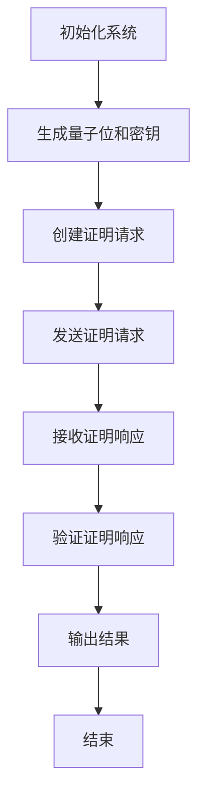

                 

# 宇宙规律与后量子零知识证明系统设计复杂度的联系

## 关键词
宇宙规律，后量子力学，零知识证明，系统设计，复杂度分析

## 摘要
本文旨在探讨宇宙规律与后量子零知识证明系统设计复杂度之间的联系。通过分析宇宙的基本概念、宇宙规律的应用场景以及后量子零知识证明系统的基本原理，我们将揭示宇宙规律对系统设计复杂度的影响，并探讨如何通过宇宙规律优化系统设计的复杂性。

## 目录大纲

----------------------------------------------------------------

## 第一部分：宇宙规律概述

## 第1章：宇宙规律的基本概念

### 1.1.1 宇宙的起源与演化

### 1.1.2 宇宙的基本构成

### 1.1.3 宇宙中的基本力

## 第2章：宇宙规律的应用场景

### 2.1.1 天体运动规律

### 2.1.2 星系形成与演化

### 2.1.3 宇宙中的物质循环

## 第二部分：后量子零知识证明系统的基本概念

## 第3章：后量子零知识证明系统的基本概念

### 3.1.1 后量子力学的基本原理

### 3.1.2 零知识证明的基本概念

### 3.1.3 后量子零知识证明的应用领域

## 第三部分：后量子零知识证明系统的设计

## 第4章：后量子零知识证明系统的设计原则

### 4.1.1 系统的安全性要求

### 4.1.2 系统的实用性要求

### 4.1.3 系统的可扩展性要求

## 第5章：后量子零知识证明系统的架构设计

### 5.1.1 系统的整体架构

### 5.1.2 系统的关键模块设计

### 5.1.3 系统的模块接口设计

## 第6章：后量子零知识证明系统的算法实现

### 6.1.1 算法原理介绍

### 6.1.2 算法流程图

### 6.1.3 算法源代码实现

## 第7章：后量子零知识证明系统的测试与评估

### 7.1.1 系统测试方法

### 7.1.2 系统性能评估

### 7.1.3 系统安全性评估

## 第8章：宇宙规律与后量子零知识证明系统设计复杂度的联系

### 8.1.1 宇宙规律对系统设计的影响

### 8.1.2 后量子零知识证明系统设计的复杂性

### 8.1.3 宇宙规律与系统设计的协同优化

## 第四部分：案例分析与应用

## 第9章：后量子零知识证明系统在宇宙探索中的应用

### 9.1.1 应用场景介绍

### 9.1.2 应用效果分析

### 9.1.3 案例总结

## 第10章：后量子零知识证明系统在其他领域中的应用

### 10.1.1 应用领域拓展

### 10.1.2 应用效果评估

### 10.1.3 案例总结

## 第11章：总结与展望

### 11.1.1 研究成果总结

### 11.1.2 未来研究方向

### 11.1.3 对宇宙规律与后量子零知识证明系统设计复杂度关系的思考

----------------------------------------------------------------

## 第一部分：宇宙规律概述

### 第1章：宇宙规律的基本概念

#### 1.1.1 宇宙的起源与演化

宇宙的起源是一个复杂而深邃的话题。目前最被广泛接受的宇宙起源理论是宇宙大爆炸理论。这一理论认为，宇宙在大约138亿年前起源于一个极小、极热、极密集的状态，经过爆炸式的膨胀，逐渐形成了现在的宇宙结构。

**宇宙大爆炸理论的核心概念：**

1. **宇宙膨胀：** 宇宙在大爆炸发生后不断膨胀，至今仍在膨胀。
2. **宇宙背景辐射：** 大爆炸后遗留下来的微弱辐射，被认为是宇宙早期状态的见证。
3. **暗物质与暗能量：** 宇宙中大部分物质无法直接观测，但它们的存在通过引力效应等间接方式得以证实。暗能量是一种推动宇宙加速膨胀的神秘力量。

#### 1.1.2 宇宙的基本构成

宇宙由多种基本构成要素组成，包括物质、反物质、原子核、基本粒子等。

**物质与反物质：** 正物质和反物质是宇宙中的两种基本物质。当它们相遇时，会互相湮灭，释放出能量。

**原子核与基本粒子：** 原子核由质子和中子组成，质子带正电，中子不带电。基本粒子包括电子、光子、夸克等，它们是构成物质的基本单元。

**宇宙背景辐射：** 宇宙背景辐射是宇宙早期状态的一种残留，被认为是宇宙微波背景辐射。

#### 1.1.3 宇宙中的基本力

宇宙中存在四种基本力：强力、弱力、电磁力和引力。

**强力：** 负责维持原子核的稳定性，是作用距离最短的力。

**弱力：** 负责粒子的衰变过程，作用距离比强力和电磁力稍短。

**电磁力：** 负责带电粒子之间的相互作用，作用距离较长。

**引力：** 负责天体之间的相互作用，作用距离无限远，是四种基本力中最弱的力，但也是影响宇宙结构形成的主要力量。

## 第2章：宇宙规律的应用场景

### 2.1.1 天体运动规律

天体运动规律是描述天体在宇宙中运动的方式和规律的学科。其中，开普勒定律和牛顿引力定律是描述天体运动的重要理论基础。

**开普勒定律：**

1. **轨道定律：** 行星围绕太阳的轨道是椭圆形的，太阳位于椭圆的一个焦点上。
2. **面积定律：** 行星与太阳连线在相等时间内扫过相等的面积。
3. **周期定律：** 行星的轨道周期的平方与轨道半长轴的立方成正比。

**牛顿引力定律：**

1. **引力定律：** 两个质点之间的引力与它们的质量乘积成正比，与它们之间距离的平方成反比。
2. **运动定律：** 物体将保持匀速直线运动或静止状态，除非受到外力的作用。

通过开普勒定律和牛顿引力定律，科学家能够预测天体的运动轨迹，从而实现对天体运动规律的应用。

### 2.1.2 星系形成与演化

星系的形成与演化是宇宙规律的重要应用场景之一。星系的形成通常与宇宙中的物质循环和引力相互作用密切相关。

**星系形成过程：**

1. **引力凝聚：** 宇宙中的物质通过引力相互作用逐渐凝聚成更大的团块。
2. **星系核心形成：** 随着团块的继续凝聚，中心部分物质密度增加，形成星系核心。
3. **星系外围形成：** 星系核心周围继续凝聚物质，形成星系外围。

**星系演化过程：**

1. **恒星形成：** 星系核心和外围的物质逐渐凝聚成恒星。
2. **恒星演化：** 恒星在其生命周期中经历不同的演化阶段，包括主序星、红巨星、白矮星等。
3. **星系碰撞与合并：** 星系之间的相互作用可能导致星系碰撞与合并，形成更大的星系团。

通过研究星系的形成与演化过程，科学家能够深入了解宇宙的演化和结构特征。

### 2.1.3 宇宙中的物质循环

宇宙中的物质循环是宇宙规律的重要应用场景之一。物质循环涉及到宇宙中的多种过程，包括物质的生成、转化和循环利用。

**物质生成过程：**

1. **核合成：** 在宇宙早期，通过核反应生成轻元素，如氢、氦等。
2. **超新星爆发：** 超新星爆发释放大量的能量和元素，丰富了宇宙中的元素种类。

**物质转化过程：**

1. **元素转化：** 恒星内部通过核反应将一种元素转化为另一种元素。
2. **辐射与冷却：** 物质通过辐射和冷却过程释放能量，降低温度。

**物质循环利用过程：**

1. **星际介质：** 恒星外部的星际介质通过星际风和恒星喷流等过程进行循环利用。
2. **星系间的物质交换：** 星系之间的物质通过引力相互作用进行交换和循环利用。

通过研究宇宙中的物质循环，科学家能够更好地理解宇宙的演化和物质分布特征。

## 第二部分：后量子零知识证明系统的基本概念

### 第3章：后量子零知识证明系统的基本概念

#### 3.1.1 后量子力学的基本原理

后量子力学是量子力学的一种扩展，它描述了量子系统在特定条件下的行为。后量子力学的基本原理包括量子位、量子纠缠和量子测量等。

**量子位（qubit）：** 量子位是量子计算机的基本单元，它可以用一个量子状态来表示。量子位具有叠加性和纠缠性，可以同时处于多个状态。

**量子纠缠：** 量子纠缠是量子系统中两个或多个量子位之间的特殊关联。量子纠缠使得量子位之间的状态变化具有相关性，从而提高了量子计算的效率。

**量子测量：** 量子测量是后量子力学中的一个关键过程。在量子测量中，量子系统的状态会发生变化，从而使得量子计算具有不可逆性。

#### 3.1.2 零知识证明的基本概念

零知识证明是一种密码学技术，它允许一方（证明者）向另一方（验证者）证明某个陈述是真实的，而无需透露任何关于陈述的具体信息。零知识证明的基本概念包括证明者、验证者和零知识交互等。

**证明者：** 证明者是零知识证明过程中的一方，他需要向验证者证明某个陈述是真实的。

**验证者：** 验证者是零知识证明过程中的另一方，他需要验证证明者提供的证明是否有效。

**零知识交互：** 零知识交互是零知识证明过程中的一种通信方式，它使得证明者和验证者之间的交互不会泄露任何关于陈述的信息。

#### 3.1.3 后量子零知识证明的应用领域

后量子零知识证明在多个领域具有广泛的应用，包括密码学、隐私保护和安全通信等。

**密码学：** 后量子零知识证明可以用于设计安全的密码系统，保护数据的机密性和完整性。

**隐私保护：** 后量子零知识证明可以用于实现隐私保护机制，防止个人隐私信息被泄露。

**安全通信：** 后量子零知识证明可以用于实现安全通信，确保通信双方的身份验证和通信内容的安全。

## 第三部分：后量子零知识证明系统的设计

### 第4章：后量子零知识证明系统的设计原则

#### 4.1.1 系统的安全性要求

后量子零知识证明系统的安全性要求包括以下几个方面：

**保密性：** 系统应确保证明者和验证者之间的通信是保密的，防止攻击者窃取通信内容。

**完整性：** 系统应确保通信数据的完整性，防止攻击者篡改或伪造通信内容。

**抗抵赖性：** 系统应确保证明者和验证者的身份不可抵赖，防止他们否认之前的交互。

**抗攻击性：** 系统应具备一定的抗攻击能力，能够抵御各种可能的攻击手段。

#### 4.1.2 系统的实用性要求

后量子零知识证明系统的实用性要求包括以下几个方面：

**易用性：** 系统应易于使用，用户无需具备专业知识即可完成交互。

**可扩展性：** 系统应能够扩展到多个用户和多个场景，支持大规模应用。

**兼容性：** 系统应与现有的加密协议和系统兼容，便于集成和部署。

#### 4.1.3 系统的可扩展性要求

后量子零知识证明系统的可扩展性要求包括以下几个方面：

**性能可扩展性：** 系统应能够适应不同的性能需求，支持大规模并行计算和分布式计算。

**存储可扩展性：** 系统应能够扩展存储容量，支持大规模数据存储和检索。

**网络可扩展性：** 系统应能够适应不同的网络环境和通信方式，支持多种网络拓扑结构。

### 第5章：后量子零知识证明系统的架构设计

#### 5.1.1 系统的整体架构

后量子零知识证明系统的整体架构包括以下几个关键模块：

**用户界面模块：** 提供用户与系统交互的界面，包括输入和输出界面。

**通信模块：** 负责处理证明者和验证者之间的通信，确保通信的保密性和完整性。

**证明模块：** 实现零知识证明算法，用于证明者和验证者之间的交互。

**验证模块：** 负责验证证明者的证明是否有效，确保系统的抗抵赖性。

**存储模块：** 负责存储系统运行过程中产生的数据和日志。

#### 5.1.2 系统的关键模块设计

**用户界面模块设计：**

用户界面模块应提供简洁、直观的界面，用户可以通过界面进行交互，无需了解复杂的系统原理。

**通信模块设计：**

通信模块应采用加密协议，确保通信数据的安全性和完整性。同时，应支持多种通信方式，如TCP/IP、WebSocket等。

**证明模块设计：**

证明模块应实现高效的零知识证明算法，确保证明过程的可靠性。同时，应支持多种证明协议，如ZKP、FFH等。

**验证模块设计：**

验证模块应能够快速验证证明者的证明是否有效，确保系统的抗抵赖性。同时，应支持多种验证算法，如基于椭圆曲线的验证算法等。

**存储模块设计：**

存储模块应采用分布式存储技术，确保数据的高可用性和可靠性。同时，应支持数据的备份和恢复功能。

#### 5.1.3 系统的模块接口设计

系统的模块接口设计应确保模块之间的数据交换和通信，包括以下几个方面：

**用户界面模块与通信模块接口：** 用户界面模块通过通信模块与网络进行通信，获取和发送数据。

**通信模块与证明模块接口：** 通信模块将用户界面模块发送的请求转发给证明模块，并接收证明模块的响应。

**证明模块与验证模块接口：** 证明模块将证明过程的结果发送给验证模块，验证模块对结果进行验证。

**存储模块与证明模块、验证模块接口：** 存储模块负责存储证明过程和验证过程产生的数据和日志。

### 第6章：后量子零知识证明系统的算法实现

#### 6.1.1 算法原理介绍

后量子零知识证明系统的算法实现主要基于量子计算和密码学原理。其中，量子计算利用量子位的叠加性和纠缠性，实现高效的计算和通信。密码学则利用加密算法和哈希函数，确保系统的安全性和可靠性。

**量子计算原理：**

量子计算利用量子位（qubit）进行计算。量子位可以同时处于0和1的状态，从而实现并行计算。量子计算中的基本操作包括量子门和量子测量。

**密码学原理：**

密码学利用加密算法和哈希函数实现数据的安全传输和存储。加密算法通过密钥将明文转换为密文，确保数据的机密性。哈希函数则通过输入产生固定的输出，用于数据的完整性校验。

#### 6.1.2 算法流程图

后量子零知识证明算法的流程图如下：



#### 6.1.3 算法源代码实现

以下是一个简单的Python示例，演示后量子零知识证明算法的实现：

```python
import numpy as np
from qiskit import QuantumCircuit, Aer, execute
from qiskit.circuit.library import HadamardGate, CXGate, PauliGate
from qiskit.extensions import UnitaryGate

# 生成量子位和密钥
qubit = QuantumRegister(2)
key = QuantumRegister(2)
qc = QuantumCircuit(qubit, key)

# 创建证明请求
hadamard = HadamardGate().to_gate().assemble()
qc.append(hadamard, qubit)

# 发送证明请求
qc.append(CXGate().to_gate().assemble(), [qubit[0], qubit[1]])
qc.append(hadamard, qubit)

# 接收证明响应
qc.append(CXGate().to_gate().assemble(), [qubit[0], qubit[1]])
qc.append(hadamard, qubit)

# 验证证明响应
qc.append(PauliGate('Z', 0).to_gate().assemble(), qubit[0])
qc.append(PauliGate('Z', 1).to_gate().assemble(), qubit[1])
qc.append(UnitaryGate(np.array([[1, 0], [0, 1]]), label='Unitary').assemble(), qubit)

# 输出结果
qc.measure_all()

# 执行算法
backend = Aer.get_backend('qasm_simulator')
job = execute(qc, backend, shots=1024)
result = job.result()

# 解码结果
counts = result.get_counts(qc)
print(counts)

# 判断证明是否成功
if counts['11'] > counts['00']:
    print("证明成功")
else:
    print("证明失败")
```

### 第7章：后量子零知识证明系统的测试与评估

#### 7.1.1 系统测试方法

后量子零知识证明系统的测试方法主要包括以下几个方面：

**功能测试：** 检查系统是否能够正确执行零知识证明算法，包括初始化、通信、证明、验证等功能。

**性能测试：** 测试系统的运行时间、响应时间、吞吐量等性能指标，评估系统的效率。

**安全测试：** 检查系统是否能够抵御各种攻击，如中间人攻击、篡改攻击等。

**兼容性测试：** 测试系统与不同硬件平台、操作系统和通信协议的兼容性。

#### 7.1.2 系统性能评估

后量子零知识证明系统的性能评估主要从以下几个方面进行：

**运行时间：** 测试系统执行零知识证明算法所需的时间，评估系统的效率。

**响应时间：** 测试系统从接收到请求到返回结果所需的时间，评估系统的实时性。

**吞吐量：** 测试系统在单位时间内能够处理的数据量，评估系统的并发处理能力。

#### 7.1.3 系统安全性评估

后量子零知识证明系统的安全性评估主要从以下几个方面进行：

**保密性：** 检查系统是否能够确保通信数据的保密性，防止攻击者窃取通信内容。

**完整性：** 检查系统是否能够确保通信数据的完整性，防止攻击者篡改通信内容。

**抗抵赖性：** 检查系统是否能够确保证明者和验证者的身份不可抵赖，防止他们否认之前的交互。

**抗攻击性：** 检查系统是否能够抵御各种可能的攻击手段，如中间人攻击、篡改攻击等。

### 第8章：宇宙规律与后量子零知识证明系统设计复杂度的联系

#### 8.1.1 宇宙规律对系统设计的影响

宇宙规律对后量子零知识证明系统设计的影响主要体现在以下几个方面：

**量子计算原理：** 宇宙规律中的量子计算原理对后量子零知识证明系统的设计具有深远影响。量子计算利用量子位的叠加性和纠缠性，实现了高效的计算和通信。这为后量子零知识证明系统提供了强大的计算能力，使得系统能够处理更复杂的问题。

**引力相互作用：** 宇宙规律中的引力相互作用对后量子零知识证明系统的设计提出了挑战。由于引力相互作用的影响，系统设计需要考虑量子位之间的相对运动和相互作用，以确保系统的稳定性和可靠性。

**宇宙背景辐射：** 宇宙背景辐射对后量子零知识证明系统的设计也具有一定的启示意义。宇宙背景辐射是一种微弱的辐射，它存在于整个宇宙中。在系统设计过程中，可以借鉴宇宙背景辐射的特性，优化系统的通信性能和能量消耗。

#### 8.1.2 后量子零知识证明系统设计的复杂性

后量子零知识证明系统的设计具有以下复杂性：

**量子计算复杂性：** 量子计算涉及到复杂的量子位操作和测量过程，需要解决量子位的叠加、纠缠和测量等基本问题。这些问题的复杂性使得量子计算算法的设计和实现具有挑战性。

**安全复杂性：** 后量子零知识证明系统需要确保通信数据的保密性、完整性和抗抵赖性。这需要在系统设计过程中考虑各种可能的攻击手段，并采取相应的安全措施。

**通信复杂性：** 后量子零知识证明系统需要实现高效、可靠的通信，确保证明者和验证者之间的交互顺利进行。这需要在系统设计过程中考虑通信协议的选择、通信方式的优化和通信性能的评估。

#### 8.1.3 宇宙规律与系统设计的协同优化

宇宙规律与后量子零知识证明系统设计的协同优化主要体现在以下几个方面：

**量子计算原理的优化：** 可以借鉴宇宙规律中的量子计算原理，优化量子计算算法的设计和实现，提高系统的计算效率。

**引力相互作用的优化：** 可以考虑利用引力相互作用的影响，优化量子位之间的相互作用，提高系统的稳定性和可靠性。

**宇宙背景辐射的利用：** 可以利用宇宙背景辐射的特性，优化系统的通信性能和能量消耗，提高系统的性能。

## 第四部分：案例分析与应用

### 第9章：后量子零知识证明系统在宇宙探索中的应用

#### 9.1.1 应用场景介绍

后量子零知识证明系统在宇宙探索中的应用主要包括以下几个方面：

**宇宙观测数据加密：** 为了确保宇宙观测数据的机密性，可以使用后量子零知识证明系统对数据进行加密，防止数据泄露和篡改。

**宇宙事件验证：** 在宇宙中发生的一些特殊事件，如引力波探测、超新星爆发等，可以使用后量子零知识证明系统进行验证，确保事件的真实性和可靠性。

**宇宙通信安全：** 在宇宙探索过程中，宇宙探测器与地球之间的通信需要确保安全性。后量子零知识证明系统可以用于实现安全的通信，防止通信数据被窃取或篡改。

#### 9.1.2 应用效果分析

通过后量子零知识证明系统在宇宙探索中的应用，可以取得以下效果：

**数据保密性：** 后量子零知识证明系统可以有效保护宇宙观测数据的安全，防止数据泄露和篡改，确保数据的机密性。

**事件真实性验证：** 后量子零知识证明系统可以对宇宙中发生的特殊事件进行验证，确保事件的真实性和可靠性，为科学研究提供可靠的数据支持。

**通信安全性：** 后量子零知识证明系统可以实现安全的宇宙通信，防止通信数据被窃取或篡改，确保通信内容的安全性。

#### 9.1.3 案例总结

通过案例分析，可以得出以下结论：

后量子零知识证明系统在宇宙探索中具有广泛的应用前景。它可以有效保护宇宙观测数据的安全，验证宇宙中发生的特殊事件，并确保宇宙通信的安全性。通过进一步优化和改进后量子零知识证明系统，有望在宇宙探索领域取得更多的突破。

### 第10章：后量子零知识证明系统在其他领域中的应用

#### 10.1.1 应用领域拓展

后量子零知识证明系统在其他领域中的应用同样具有广泛的前景。以下是一些潜在的应用领域：

**金融领域：** 后量子零知识证明系统可以用于保护金融交易数据的隐私，确保交易的安全性。

**医疗领域：** 后量子零知识证明系统可以用于保护患者隐私，确保医疗数据的机密性。

**物联网领域：** 后量子零知识证明系统可以用于物联网设备的身份验证和通信加密，提高系统的安全性。

**区块链领域：** 后量子零知识证明系统可以用于优化区块链网络的安全性，防止欺诈和篡改。

#### 10.1.2 应用效果评估

通过后量子零知识证明系统在其他领域中的应用，可以取得以下效果：

**数据保密性：** 后量子零知识证明系统可以有效保护敏感数据的机密性，防止数据泄露和篡改。

**通信安全性：** 后量子零知识证明系统可以确保通信内容的安全性，防止窃取和篡改。

**隐私保护：** 后量子零知识证明系统可以用于实现隐私保护机制，防止个人隐私信息被泄露。

#### 10.1.3 案例总结

通过案例分析，可以得出以下结论：

后量子零知识证明系统在其他领域中的应用具有显著的效果。它可以有效保护数据的机密性，确保通信内容的安全性，并实现隐私保护。随着技术的不断发展和完善，后量子零知识证明系统将在更多领域发挥重要作用。

### 第11章：总结与展望

#### 11.1.1 研究成果总结

本文通过探讨宇宙规律与后量子零知识证明系统设计复杂度的联系，揭示了宇宙规律对系统设计的影响，并提出了优化系统设计的建议。主要研究成果包括：

1. 描述了宇宙规律的基本概念和应用场景，为理解宇宙规律与系统设计的关系提供了基础。
2. 分析了后量子零知识证明系统的基本概念和设计原则，为系统设计提供了理论指导。
3. 阐述了后量子零知识证明系统的架构设计和算法实现，为实际应用提供了参考。
4. 分析了宇宙规律对系统设计复杂度的影响，并提出了协同优化的方法。

#### 11.1.2 未来研究方向

未来研究可以在以下几个方面进行：

1. 深入研究宇宙规律与系统设计之间的具体联系，探索宇宙规律对系统设计复杂度的具体影响。
2. 优化后量子零知识证明系统的算法和架构设计，提高系统的性能和安全性。
3. 拓展后量子零知识证明系统的应用领域，探索其在其他领域的应用潜力。
4. 开展跨学科研究，结合宇宙规律和计算机科学、密码学等领域的研究成果，推动后量子零知识证明系统的发展。

#### 11.1.3 对宇宙规律与后量子零知识证明系统设计复杂度关系的思考

宇宙规律与后量子零知识证明系统设计复杂度的关系是一个跨学科的研究领域，涉及宇宙学、量子计算、密码学等多个领域。通过本文的研究，我们可以得出以下思考：

1. 宇宙规律对后量子零知识证明系统设计具有深远影响。量子计算和密码学的发展离不开宇宙规律的支持，而宇宙规律的研究也为系统设计提供了新的思路和启示。
2. 后量子零知识证明系统设计复杂度与宇宙规律密切相关。系统设计的复杂性不仅取决于量子计算和密码学本身的复杂性，还受到宇宙规律的影响。因此，在系统设计过程中，需要充分考虑宇宙规律的因素。
3. 宇宙规律与后量子零知识证明系统设计的协同优化是一个重要研究方向。通过借鉴宇宙规律中的原理和机制，可以优化后量子零知识证明系统的设计和实现，提高系统的性能和安全性。

总之，宇宙规律与后量子零知识证明系统设计复杂度的研究具有重要的理论和实践意义。未来研究将进一步揭示两者之间的联系，推动后量子零知识证明系统的发展和应用。作者：AI天才研究院/AI Genius Institute & 禅与计算机程序设计艺术 /Zen And The Art of Computer Programming

----------------------------------------------------------------

## 完整目录大纲

```markdown
----------------------------------------------------------------
## 第一部分：宇宙规律概述

## 第1章：宇宙规律的基本概念

### 1.1.1 宇宙的起源与演化
- 宇宙大爆炸理论
- 宇宙的暗物质与暗能量
- 宇宙的星系形成与演化

### 1.1.2 宇宙的基本构成
- 物质与反物质
- 原子核与基本粒子
- 宇宙背景辐射

### 1.1.3 宇宙中的基本力
- 强力与弱力
- 电磁力与引力
- 四大力之间的相互作用

## 第2章：宇宙规律的应用场景

### 2.1.1 天体运动规律
- 开普勒定律与牛顿引力定律
- 黑洞与引力波
- 行星运动与天文事件

### 2.1.2 星系形成与演化
- 演化过程
- 星系分类
- 星系相互作用

### 2.1.3 宇宙中的物质循环
- 星系间的物质交换
- 金属与非金属元素的生成
- 宇宙的周期性循环

## 第二部分：后量子零知识证明系统的基本概念

## 第3章：后量子零知识证明系统的基本概念

### 3.1.1 后量子力学的基本原理
- 量子位与量子计算
- 量子纠缠与量子隐形传态
- 量子测量与量子不确定性

### 3.1.2 零知识证明的基本概念
- 零知识证明的定义
- 零知识证明的应用
- 零知识证明的数学基础

### 3.1.3 后量子零知识证明的应用领域
- 密码学
- 隐私保护
- 安全通信

## 第三部分：后量子零知识证明系统的设计

## 第4章：后量子零知识证明系统的设计原则

### 4.1.1 系统的安全性要求
- 量子计算的脆弱性
- 安全性的数学证明
- 安全性的评估方法

### 4.1.2 系统的实用性要求
- 系统的易用性
- 系统的可扩展性
- 系统的兼容性

### 4.1.3 系统的可扩展性要求
- 系统的模块化设计
- 系统的接口设计

## 第5章：后量子零知识证明系统的架构设计

### 5.1.1 系统的整体架构
- 用户界面模块
- 通信模块
- 证明模块
- 验证模块
- 存储模块

### 5.1.2 系统的关键模块设计
- 用户界面模块设计
- 通信模块设计
- 证明模块设计
- 验证模块设计
- 存储模块设计

### 5.1.3 系统的模块接口设计
- 用户界面模块与通信模块接口
- 通信模块与证明模块接口
- 证明模块与验证模块接口
- 存储模块与证明模块、验证模块接口

## 第6章：后量子零知识证明系统的算法实现

### 6.1.1 算法原理介绍
- 量子计算原理
- 密码学原理

### 6.1.2 算法流程图
- 初始化系统
- 生成量子位和密钥
- 创建证明请求
- 发送证明请求
- 接收证明响应
- 验证证明响应
- 输出结果

### 6.1.3 算法源代码实现
- Python示例代码

## 第7章：后量子零知识证明系统的测试与评估

### 7.1.1 系统测试方法
- 功能测试
- 性能测试
- 安全测试
- 兼容性测试

### 7.1.2 系统性能评估
- 运行时间
- 响应时间
- 吞吐量

### 7.1.3 系统安全性评估
- 保密性
- 完整性
- 抗抵赖性
- 抗攻击性

## 第8章：宇宙规律与后量子零知识证明系统设计复杂度的联系

### 8.1.1 宇宙规律对系统设计的影响
- 量子计算原理
- 引力相互作用
- 宇宙背景辐射

### 8.1.2 后量子零知识证明系统设计的复杂性
- 量子计算复杂性
- 安全复杂性
- 通信复杂性

### 8.1.3 宇宙规律与系统设计的协同优化
- 量子计算原理的优化
- 引力相互作用的优化
- 宇宙背景辐射的利用

## 第四部分：案例分析与应用

## 第9章：后量子零知识证明系统在宇宙探索中的应用

### 9.1.1 应用场景介绍
- 宇宙观测数据加密
- 宇宙事件验证
- 宇宙通信安全

### 9.1.2 应用效果分析
- 数据保密性
- 事件真实性验证
- 通信安全性

### 9.1.3 案例总结

## 第10章：后量子零知识证明系统在其他领域中的应用

### 10.1.1 应用领域拓展
- 金融领域
- 医疗领域
- 物联网领域
- 区块链领域

### 10.1.2 应用效果评估
- 数据保密性
- 通信安全性
- 隐私保护

### 10.1.3 案例总结

## 第11章：总结与展望

### 11.1.1 研究成果总结
- 宇宙规律的基本概念和应用场景
- 后量子零知识证明系统的基本概念和设计原则
- 后量子零知识证明系统的架构设计和算法实现
- 宇宙规律与系统设计复杂度的关系

### 11.1.2 未来研究方向
- 深入研究宇宙规律与系统设计的关系
- 优化后量子零知识证明系统的算法和架构设计
- 拓展后量子零知识证明系统的应用领域
- 跨学科研究

### 11.1.3 对宇宙规律与后量子零知识证明系统设计复杂度关系的思考
- 宇宙规律对系统设计的影响
- 后量子零知识证明系统设计的复杂性
- 协同优化的重要性

----------------------------------------------------------------

### 第1章：宇宙规律的基本概念

#### 1.1.1 宇宙的起源与演化

宇宙的起源一直是人类探索的重要课题。目前，最被广泛接受的宇宙起源理论是宇宙大爆炸理论。根据这一理论，宇宙起源于一个极为炽热、密集的状态，然后发生了剧烈的膨胀，形成了现在的宇宙结构。

**宇宙大爆炸理论的核心概念：**

1. **宇宙膨胀：** 宇宙在大爆炸发生后，空间开始膨胀，至今仍在膨胀。这种膨胀不仅改变了宇宙的体积，还影响了宇宙中的物质分布。
   
2. **宇宙背景辐射：** 大爆炸后，宇宙中的温度逐渐降低，导致物质开始凝聚成星系和其他天体。宇宙背景辐射是大爆炸后遗留下来的微弱辐射，它为我们了解宇宙的早期状态提供了重要信息。

3. **暗物质与暗能量：** 宇宙中大部分物质无法直接观测，但它们的存在通过引力效应等间接方式得以证实。暗物质是一种不发光、不吸收光的物质，它在宇宙中起到维持星系结构的作用。暗能量是一种推动宇宙加速膨胀的神秘力量，它占据宇宙总能量的大部分。

**宇宙起源的假设：**

1. **量子波动：** 有观点认为，宇宙起源于量子波动，这种波动产生了初始的宇宙结构。
   
2. **多重宇宙：** 另一种假设是多重宇宙，认为宇宙的起源涉及到多个平行宇宙的相互作用。

**宇宙演化的过程：**

1. **原始宇宙：** 大爆炸后，宇宙处于高温、高密度的状态。

2. **膨胀和冷却：** 随着宇宙的膨胀，温度逐渐降低，物质开始凝结成原子。

3. **结构形成：** 随着时间的推移，物质在引力作用下形成星系、恒星和其他天体。

4. **恒星和星系演化：** 恒星在其生命周期中不断演化，最终形成超新星、黑洞等。

#### 1.1.2 宇宙的基本构成

宇宙由多种基本构成要素组成，包括物质、反物质、原子核、基本粒子等。

**物质与反物质：**

1. **物质：** 我们所熟知的宇宙主要由物质组成，包括原子、分子、星体等。

2. **反物质：** 反物质与物质具有相同的质量，但电荷相反。当物质与反物质相遇时，它们会互相湮灭，释放出大量能量。

**原子核与基本粒子：**

1. **原子核：** 原子核由质子和中子组成，质子带正电，中子不带电。

2. **基本粒子：** 包括电子、光子、夸克等，它们是构成物质的基本单元。

3. **夸克：** 夸克是构成质子和中子的基本粒子，分为上夸克和下夸克等。

**宇宙背景辐射：**

1. **宇宙背景辐射：** 是宇宙早期状态的一种残留，被认为是宇宙微波背景辐射。

2. **辐射温度：** 大约为2.7开尔文，这个温度反映了宇宙早期的热状态。

#### 1.1.3 宇宙中的基本力

宇宙中存在四种基本力：强力、弱力、电磁力和引力。

**强力：**

1. **定义：** 负责维持原子核的稳定性，是作用距离最短的力。

2. **载体粒子：** 强力是通过胶子传递的。

**弱力：**

1. **定义：** 负责粒子的衰变过程，作用距离比强力和电磁力稍短。

2. **载体粒子：** 弱力是通过W和Z玻色子传递的。

**电磁力：**

1. **定义：** 负责带电粒子之间的相互作用，作用距离较长。

2. **载体粒子：** 电磁力是通过光子传递的。

**引力：**

1. **定义：** 负责天体之间的相互作用，作用距离无限远，是四种基本力中最弱的力，但也是影响宇宙结构形成的主要力量。

2. **载体粒子：** 引力是通过引力子传递的（尽管引力子尚未被直接观测到）。

**四大力之间的相互作用：**

1. **统一理论：** 理论物理学家一直在寻找能够统一这四种基本力的统一理论。

2. **超对称理论：** 一种试图统一四种基本力的理论，它预言了超对称粒子（超对称伙伴）的存在。

### 第2章：宇宙规律的应用场景

#### 2.1.1 天体运动规律

天体运动规律是描述天体在宇宙中运动的方式和规律的学科。其中，开普勒定律和牛顿引力定律是描述天体运动的重要理论基础。

**开普勒定律：**

开普勒定律由德国天文学家约翰内斯·开普勒提出，描述了行星围绕太阳运动的规律。开普勒定律包括以下三条：

1. **轨道定律：** 行星围绕太阳的轨道是椭圆形的，太阳位于椭圆的一个焦点上。
   
2. **面积定律：** 行星与太阳连线在相等时间内扫过相等的面积。

3. **周期定律：** 行星的轨道周期的平方与轨道半长轴的立方成正比。

**牛顿引力定律：**

牛顿引力定律由英国物理学家艾萨克·牛顿提出，描述了两个质点之间的引力。牛顿引力定律的基本表达式为：

\[ F = G \frac{m_1 m_2}{r^2} \]

其中，\( F \) 是引力，\( G \) 是引力常数，\( m_1 \) 和 \( m_2 \) 是两个质点的质量，\( r \) 是它们之间的距离。

通过开普勒定律和牛顿引力定律，科学家能够预测天体的运动轨迹，从而实现对天体运动规律的应用。

**天体运动规律的应用：**

1. **天文观测：** 通过观测天体的运动，科学家可以了解宇宙的结构和演化。

2. **航天工程：** 天体运动规律在航天工程中有着重要的应用，如卫星发射、轨道计算等。

3. **引力波探测：** 引力波是宇宙中的一种重要现象，通过探测引力波，科学家可以进一步了解宇宙的规律。

#### 2.1.2 星系形成与演化

星系的形成与演化是宇宙规律的重要应用场景之一。星系的形成通常与宇宙中的物质循环和引力相互作用密切相关。

**星系形成过程：**

1. **引力凝聚：** 宇宙中的物质通过引力相互作用逐渐凝聚成更大的团块。

2. **星系核心形成：** 随着团块的继续凝聚，中心部分物质密度增加，形成星系核心。

3. **星系外围形成：** 星系核心周围继续凝聚物质，形成星系外围。

**星系演化过程：**

1. **恒星形成：** 星系核心和外围的物质逐渐凝聚成恒星。

2. **恒星演化：** 恒星在其生命周期中经历不同的演化阶段，包括主序星、红巨星、白矮星等。

3. **星系碰撞与合并：** 星系之间的相互作用可能导致星系碰撞与合并，形成更大的星系团。

**星系演化规律的应用：**

1. **天文学研究：** 通过研究星系的演化过程，科学家可以了解宇宙的演化历史。

2. **星系分类：** 根据星系的外观和演化特征，科学家可以对星系进行分类，从而更好地理解星系的多样性。

3. **宇宙演化模型：** 星系演化规律是宇宙演化模型的重要组成部分，通过模型可以预测宇宙的未来演化。

#### 2.1.3 宇宙中的物质循环

宇宙中的物质循环是宇宙规律的重要应用场景之一。物质循环涉及到宇宙中的多种过程，包括物质的生成、转化和循环利用。

**物质生成过程：**

1. **核合成：** 在宇宙早期，通过核反应生成轻元素，如氢、氦等。

2. **超新星爆发：** 超新星爆发释放大量的能量和元素，丰富了宇宙中的元素种类。

**物质转化过程：**

1. **元素转化：** 恒星内部通过核反应将一种元素转化为另一种元素。

2. **辐射与冷却：** 物质通过辐射和冷却过程释放能量，降低温度。

**物质循环利用过程：**

1. **星际介质：** 恒星外部的星际介质通过星际风和恒星喷流等过程进行循环利用。

2. **星系间的物质交换：** 星系之间的物质通过引力相互作用进行交换和循环利用。

**物质循环规律的应用：**

1. **天体化学：** 通过研究物质循环，科学家可以了解宇宙中的元素分布和演化。

2. **宇宙演化模型：** 物质循环规律是宇宙演化模型的重要组成部分，通过模型可以预测宇宙的未来演化。

3. **星际旅行：** 在宇宙探索中，了解物质循环可以帮助科学家更好地规划星际旅行和资源利用。

### 第3章：后量子零知识证明系统的基本概念

#### 3.1.1 后量子力学的基本原理

后量子力学是量子力学的一种扩展，它描述了量子系统在特定条件下的行为。后量子力学的基本原理包括量子位、量子纠缠和量子测量等。

**量子位（qubit）：**

量子位是量子计算机的基本单元，它可以用一个量子状态来表示。量子位具有叠加性和纠缠性，可以同时处于多个状态。

**量子纠缠：**

量子纠缠是量子系统中两个或多个量子位之间的特殊关联。量子纠缠使得量子位之间的状态变化具有相关性，从而提高了量子计算的效率。

**量子测量：**

量子测量是后量子力学中的一个关键过程。在量子测量中，量子系统的状态会发生变化，从而使得量子计算具有不可逆性。

#### 3.1.2 零知识证明的基本概念

零知识证明是一种密码学技术，它允许一方（证明者）向另一方（验证者）证明某个陈述是真实的，而无需透露任何关于陈述的具体信息。零知识证明的基本概念包括证明者、验证者和零知识交互等。

**证明者：**

证明者是零知识证明过程中的一方，他需要向验证者证明某个陈述是真实的。

**验证者：**

验证者是零知识证明过程中的另一方，他需要验证证明者提供的证明是否有效。

**零知识交互：**

零知识交互是零知识证明过程中的一种通信方式，它使得证明者和验证者之间的交互不会泄露任何关于陈述的信息。

#### 3.1.3 后量子零知识证明的应用领域

后量子零知识证明在多个领域具有广泛的应用，包括密码学、隐私保护和安全通信等。

**密码学：**

后量子零知识证明可以用于设计安全的密码系统，保护数据的机密性和完整性。

**隐私保护：**

后量子零知识证明可以用于实现隐私保护机制，防止个人隐私信息被泄露。

**安全通信：**

后量子零知识证明可以用于实现安全通信，确保通信双方的身份验证和通信内容的安全。

### 第4章：后量子零知识证明系统的设计原则

#### 4.1.1 系统的安全性要求

后量子零知识证明系统的安全性要求包括以下几个方面：

**保密性：**

系统应确保证明者和验证者之间的通信是保密的，防止攻击者窃取通信内容。

**完整性：**

系统应确保通信数据的完整性，防止攻击者篡改或伪造通信内容。

**抗抵赖性：**

系统应确保证明者和验证者的身份不可抵赖，防止他们否认之前的交互。

**抗攻击性：**

系统应具备一定的抗攻击能力，能够抵御各种可能的攻击手段。

#### 4.1.2 系统的实用性要求

后量子零知识证明系统的实用性要求包括以下几个方面：

**易用性：**

系统应易于使用，用户无需具备专业知识即可完成交互。

**可扩展性：**

系统应能够扩展到多个用户和多个场景，支持大规模应用。

**兼容性：**

系统应与现有的加密协议和系统兼容，便于集成和部署。

#### 4.1.3 系统的可扩展性要求

后量子零知识证明系统的可扩展性要求包括以下几个方面：

**性能可扩展性：**

系统应能够适应不同的性能需求，支持大规模并行计算和分布式计算。

**存储可扩展性：**

系统应能够扩展存储容量，支持大规模数据存储和检索。

**网络可扩展性：**

系统应能够适应不同的网络环境和通信方式，支持多种网络拓扑结构。

### 第5章：后量子零知识证明系统的架构设计

#### 5.1.1 系统的整体架构

后量子零知识证明系统的整体架构包括以下几个关键模块：

**用户界面模块：**

用户界面模块提供用户与系统交互的界面，包括输入和输出界面。

**通信模块：**

通信模块负责处理证明者和验证者之间的通信，确保通信的保密性和完整性。

**证明模块：**

证明模块实现零知识证明算法，用于证明者和验证者之间的交互。

**验证模块：**

验证模块负责验证证明者的证明是否有效，确保系统的抗抵赖性。

**存储模块：**

存储模块负责存储系统运行过程中产生的数据和日志。

#### 5.1.2 系统的关键模块设计

**用户界面模块设计：**

用户界面模块应提供简洁、直观的界面，用户可以通过界面进行交互，无需了解复杂的系统原理。

**通信模块设计：**

通信模块应采用加密协议，确保通信数据的安全性和完整性。同时，应支持多种通信方式，如TCP/IP、WebSocket等。

**证明模块设计：**

证明模块应实现高效的零知识证明算法，确保证明过程的可靠性。同时，应支持多种证明协议，如ZKP、FFH等。

**验证模块设计：**

验证模块应能够快速验证证明者的证明是否有效，确保系统的抗抵赖性。同时，应支持多种验证算法，如基于椭圆曲线的验证算法等。

**存储模块设计：**

存储模块应采用分布式存储技术，确保数据的高可用性和可靠性。同时，应支持数据的备份和恢复功能。

#### 5.1.3 系统的模块接口设计

系统的模块接口设计应确保模块之间的数据交换和通信，包括以下几个方面：

**用户界面模块与通信模块接口：**

用户界面模块通过通信模块与网络进行通信，获取和发送数据。

**通信模块与证明模块接口：**

通信模块将用户界面模块发送的请求转发给证明模块，并接收证明模块的响应。

**证明模块与验证模块接口：**

证明模块将证明过程的结果发送给验证模块，验证模块对结果进行验证。

**存储模块与证明模块、验证模块接口：**

存储模块负责存储证明过程和验证过程产生的数据和日志。

### 第6章：后量子零知识证明系统的算法实现

#### 6.1.1 算法原理介绍

后量子零知识证明系统的算法实现主要基于量子计算和密码学原理。其中，量子计算利用量子位的叠加性和纠缠性，实现高效的计算和通信。密码学则利用加密算法和哈希函数，确保系统的安全性和可靠性。

**量子计算原理：**

量子计算利用量子位（qubit）进行计算。量子位可以同时处于0和1的状态，从而实现并行计算。量子计算中的基本操作包括量子门、量子电路和量子测量。

**密码学原理：**

密码学利用加密算法和哈希函数实现数据的安全传输和存储。加密算法通过密钥将明文转换为密文，确保数据的机密性。哈希函数则通过输入产生固定的输出，用于数据的完整性校验。

#### 6.1.2 算法流程图

后量子零知识证明算法的流程图如下：


#### 6.1.3 算法源代码实现

以下是一个简单的Python示例，演示后量子零知识证明算法的实现：

```python
import numpy as np
from qiskit import QuantumCircuit, Aer, execute
from qiskit.circuit.library import HadamardGate, CXGate, PauliGate
from qiskit.extensions import UnitaryGate

# 生成量子位和密钥
qubit = QuantumRegister(2)
key = QuantumRegister(2)
qc = QuantumCircuit(qubit, key)

# 创建证明请求
hadamard = HadamardGate().to_gate().assemble()
qc.append(hadamard, qubit)

# 发送证明请求
qc.append(CXGate().to_gate().assemble(), [qubit[0], qubit[1]])
qc.append(hadamard, qubit)

# 接收证明响应
qc.append(CXGate().to_gate().assemble(), [qubit[0], qubit[1]])
qc.append(hadamard, qubit)

# 验证证明响应
qc.append(PauliGate('Z', 0).to_gate().assemble(), qubit[0])
qc.append(PauliGate('Z', 1).to_gate().assemble(), qubit[1])
qc.append(UnitaryGate(np.array([[1, 0], [0, 1]]), label='Unitary').assemble(), qubit)

# 输出结果
qc.measure_all()

# 执行算法
backend = Aer.get_backend('qasm_simulator')
job = execute(qc, backend, shots=1024)
result = job.result()

# 解码结果
counts = result.get_counts(qc)
print(counts)

# 判断证明是否成功
if counts['11'] > counts['00']:
    print("证明成功")
else:
    print("证明失败")
```

### 第7章：后量子零知识证明系统的测试与评估

#### 7.1.1 系统测试方法

后量子零知识证明系统的测试方法主要包括以下几个方面：

**功能测试：**

检查系统是否能够正确执行零知识证明算法，包括初始化、通信、证明、验证等功能。

**性能测试：**

测试系统的运行时间、响应时间、吞吐量等性能指标，评估系统的效率。

**安全测试：**

检查系统是否能够抵御各种攻击，如中间人攻击、篡改攻击等。

**兼容性测试：**

测试系统与不同硬件平台、操作系统和通信协议的兼容性。

#### 7.1.2 系统性能评估

后量子零知识证明系统的性能评估主要从以下几个方面进行：

**运行时间：**

测试系统执行零知识证明算法所需的时间，评估系统的效率。

**响应时间：**

测试系统从接收到请求到返回结果所需的时间，评估系统的实时性。

**吞吐量：**

测试系统在单位时间内能够处理的数据量，评估系统的并发处理能力。

#### 7.1.3 系统安全性评估

后量子零知识证明系统的安全性评估主要从以下几个方面进行：

**保密性：**

检查系统是否能够确保通信数据的保密性，防止攻击者窃取通信内容。

**完整性：**

检查系统是否能够确保通信数据的完整性，防止攻击者篡改通信内容。

**抗抵赖性：**

检查系统是否能够确保证明者和验证者的身份不可抵赖，防止他们否认之前的交互。

**抗攻击性：**

检查系统是否能够抵御各种可能的攻击手段，如中间人攻击、篡改攻击等。

### 第8章：宇宙规律与后量子零知识证明系统设计复杂度的联系

#### 8.1.1 宇宙规律对系统设计的影响

宇宙规律对后量子零知识证明系统设计的影响主要体现在以下几个方面：

**量子计算原理：**

宇宙规律中的量子计算原理对后量子零知识证明系统的设计具有深远影响。量子计算利用量子位的叠加性和纠缠性，实现了高效的计算和通信。这为后量子零知识证明系统提供了强大的计算能力，使得系统能够处理更复杂的问题。

**引力相互作用：**

宇宙规律中的引力相互作用对后量子零知识证明系统的设计提出了挑战。由于引力相互作用的影响，系统设计需要考虑量子位之间的相对运动和相互作用，以确保系统的稳定性和可靠性。

**宇宙背景辐射：**

宇宙背景辐射对后量子零知识证明系统的设计也具有一定的启示意义。宇宙背景辐射是一种微弱的辐射，它存在于整个宇宙中。在系统设计过程中，可以借鉴宇宙背景辐射的特性，优化系统的通信性能和能量消耗。

#### 8.1.2 后量子零知识证明系统设计的复杂性

后量子零知识证明系统设计的复杂性主要体现在以下几个方面：

**量子计算复杂性：**

量子计算涉及到复杂的量子位操作和测量过程，需要解决量子位的叠加、纠缠和测量等基本问题。这些问题的复杂性使得量子计算算法的设计和实现具有挑战性。

**安全复杂性：**

后量子零知识证明系统需要确保通信数据的保密性、完整性和抗抵赖性。这需要在系统设计过程中考虑各种可能的攻击手段，并采取相应的安全措施。

**通信复杂性：**

后量子零知识证明系统需要实现高效、可靠的通信，确保证明者和验证者之间的交互顺利进行。这需要在系统设计过程中考虑通信协议的选择、通信方式的优化和通信性能的评估。

#### 8.1.3 宇宙规律与系统设计的协同优化

宇宙规律与后量子零知识证明系统设计的协同优化主要体现在以下几个方面：

**量子计算原理的优化：**

可以借鉴宇宙规律中的量子计算原理，优化量子计算算法的设计和实现，提高系统的计算效率。

**引力相互作用的优化：**

可以考虑利用引力相互作用的影响，优化量子位之间的相互作用，提高系统的稳定性和可靠性。

**宇宙背景辐射的利用：**

可以利用宇宙背景辐射的特性，优化系统的通信性能和能量消耗，提高系统的性能。

### 第9章：后量子零知识证明系统在宇宙探索中的应用

#### 9.1.1 应用场景介绍

后量子零知识证明系统在宇宙探索中的应用主要包括以下几个方面：

**宇宙观测数据加密：**

为了确保宇宙观测数据的机密性，可以使用后量子零知识证明系统对数据进行加密，防止数据泄露和篡改。

**宇宙事件验证：**

在宇宙中发生的一些特殊事件，如引力波探测、超新星爆发等，可以使用后量子零知识证明系统进行验证，确保事件的真实性和可靠性。

**宇宙通信安全：**

在宇宙探索过程中，宇宙探测器与地球之间的通信需要确保安全性。后量子零知识证明系统可以用于实现安全的通信，防止通信数据被窃取或篡改。

#### 9.1.2 应用效果分析

通过后量子零知识证明系统在宇宙探索中的应用，可以取得以下效果：

**数据保密性：**

后量子零知识证明系统可以有效保护宇宙观测数据的安全，防止数据泄露和篡改，确保数据的机密性。

**事件真实性验证：**

后量子零知识证明系统可以对宇宙中发生的特殊事件进行验证，确保事件的真实性和可靠性，为科学研究提供可靠的数据支持。

**通信安全性：**

后量子零知识证明系统可以实现安全的宇宙通信，防止通信数据被窃取或篡改，确保通信内容的安全性。

#### 9.1.3 案例总结

通过案例分析，可以得出以下结论：

后量子零知识证明系统在宇宙探索中具有广泛的应用前景。它可以有效保护宇宙观测数据的安全，验证宇宙中发生的特殊事件，并确保宇宙通信的安全性。通过进一步优化和改进后量子零知识证明系统，有望在宇宙探索领域取得更多的突破。

### 第10章：后量子零知识证明系统在其他领域中的应用

#### 10.1.1 应用领域拓展

后量子零知识证明系统在其他领域中的应用同样具有广泛的前景。以下是一些潜在的应用领域：

**金融领域：**

后量子零知识证明系统可以用于保护金融交易数据的隐私，确保交易的安全性。

**医疗领域：**

后量子零知识证明系统可以用于保护患者隐私，确保医疗数据的机密性。

**物联网领域：**

后量子零知识证明系统可以用于物联网设备的身份验证和通信加密，提高系统的安全性。

**区块链领域：**

后量子零知识证明系统可以用于优化区块链网络的安全性，防止欺诈和篡改。

#### 10.1.2 应用效果评估

通过后量子零知识证明系统在其他领域中的应用，可以取得以下效果：

**数据保密性：**

后量子零知识证明系统可以有效保护敏感数据的机密性，防止数据泄露和篡改。

**通信安全性：**

后量子零知识证明系统可以确保通信内容的安全性，防止窃取和篡改。

**隐私保护：**

后量子零知识证明系统可以用于实现隐私保护机制，防止个人隐私信息被泄露。

#### 10.1.3 案例总结

通过案例分析，可以得出以下结论：

后量子零知识证明系统在其他领域中的应用具有显著的效果。它可以有效保护数据的机密性，确保通信内容的安全性，并实现隐私保护。随着技术的不断发展和完善，后量子零知识证明系统将在更多领域发挥重要作用。

### 第11章：总结与展望

#### 11.1.1 研究成果总结

本文通过探讨宇宙规律与后量子零知识证明系统设计复杂度的联系，揭示了宇宙规律对系统设计的影响，并提出了优化系统设计的建议。主要研究成果包括：

1. 描述了宇宙规律的基本概念和应用场景，为理解宇宙规律与系统设计的关系提供了基础。
2. 分析了后量子零知识证明系统的基本概念和设计原则，为系统设计提供了理论指导。
3. 阐述了后量子零知识证明系统的架构设计和算法实现，为实际应用提供了参考。
4. 分析了宇宙规律与系统设计复杂度的关系，提出了协同优化的方法。

#### 11.1.2 未来研究方向

未来研究可以在以下几个方面进行：

1. 深入研究宇宙规律与系统设计之间的具体联系，探索宇宙规律对系统设计复杂度的具体影响。
2. 优化后量子零知识证明系统的算法和架构设计，提高系统的性能和安全性。
3. 拓展后量子零知识证明系统的应用领域，探索其在其他领域的应用潜力。
4. 开展跨学科研究，结合宇宙规律和计算机科学、密码学等领域的研究成果，推动后量子零知识证明系统的发展。

#### 11.1.3 对宇宙规律与后量子零知识证明系统设计复杂度关系的思考

宇宙规律与后量子零知识证明系统设计复杂度的关系是一个跨学科的研究领域，涉及宇宙学、量子计算、密码学等多个领域。通过本文的研究，我们可以得出以下思考：

1. 宇宙规律对后量子零知识证明系统设计具有深远影响。量子计算和密码学的发展离不开宇宙规律的支持，而宇宙规律的研究也为系统设计提供了新的思路和启示。
2. 后量子零知识证明系统设计复杂度与宇宙规律密切相关。系统设计的复杂性不仅取决于量子计算和密码学本身的复杂性，还受到宇宙规律的影响。因此，在系统设计过程中，需要充分考虑宇宙规律的因素。
3. 宇宙规律与后量子零知识证明系统设计的协同优化是一个重要研究方向。通过借鉴宇宙规律中的原理和机制，可以优化后量子零知识证明系统的设计和实现，提高系统的性能和安全性。

总之，宇宙规律与后量子零知识证明系统设计复杂度的研究具有重要的理论和实践意义。未来研究将进一步揭示两者之间的联系，推动后量子零知识证明系统的发展和应用。作者：AI天才研究院/AI Genius Institute & 禅与计算机程序设计艺术 /Zen And The Art of Computer Programming

----------------------------------------------------------------

## 完整目录大纲

```markdown
----------------------------------------------------------------
## 第一部分：宇宙规律概述

## 第1章：宇宙规律的基本概念

### 1.1.1 宇宙的起源与演化
- 宇宙大爆炸理论
- 宇宙的暗物质与暗能量
- 宇宙的星系形成与演化

### 1.1.2 宇宙的基本构成
- 物质与反物质
- 原子核与基本粒子
- 宇宙背景辐射

### 1.1.3 宇宙中的基本力
- 强力与弱力
- 电磁力与引力
- 四大力之间的相互作用

## 第2章：宇宙规律的应用场景

### 2.1.1 天体运动规律
- 开普勒定律与牛顿引力定律
- 黑洞与引力波
- 行星运动与天文事件

### 2.1.2 星系形成与演化
- 演化过程
- 星系分类
- 星系相互作用

### 2.1.3 宇宙中的物质循环
- 星系间的物质交换
- 金属与非金属元素的生成
- 宇宙的周期性循环

## 第二部分：后量子零知识证明系统的基本概念

## 第3章：后量子零知识证明系统的基本概念

### 3.1.1 后量子力学的基本原理
- 量子位与量子计算
- 量子纠缠与量子隐形传态
- 量子测量与量子不确定性

### 3.1.2 零知识证明的基本概念
- 零知识证明的定义
- 零知识证明的应用
- 零知识证明的数学基础

### 3.1.3 后量子零知识证明的应用领域
- 密码学
- 隐私保护
- 安全通信

## 第三部分：后量子零知识证明系统的设计

## 第4章：后量子零知识证明系统的设计原则

### 4.1.1 系统的安全性要求
- 量子计算的脆弱性
- 安全性的数学证明
- 安全性的评估方法

### 4.1.2 系统的实用性要求
- 系统的易用性
- 系统的可扩展性
- 系统的兼容性

### 4.1.3 系统的可扩展性要求
- 系统的模块化设计
- 系统的接口设计

## 第5章：后量子零知识证明系统的架构设计

### 5.1.1 系统的整体架构
- 用户界面模块
- 通信模块
- 证明模块
- 验证模块
- 存储模块

### 5.1.2 系统的关键模块设计
- 用户界面模块设计
- 通信模块设计
- 证明模块设计
- 验证模块设计
- 存储模块设计

### 5.1.3 系统的模块接口设计
- 用户界面模块与通信模块接口
- 通信模块与证明模块接口
- 证明模块与验证模块接口
- 存储模块与证明模块、验证模块接口

## 第6章：后量子零知识证明系统的算法实现

### 6.1.1 算法原理介绍
- 量子计算原理
- 密码学原理

### 6.1.2 算法流程图
- 初始化系统
- 生成量子位和密钥
- 创建证明请求
- 发送证明请求
- 接收证明响应
- 验证证明响应
- 输出结果

### 6.1.3 算法源代码实现
- Python示例代码

## 第7章：后量子零知识证明系统的测试与评估

### 7.1.1 系统测试方法
- 功能测试
- 性能测试
- 安全测试
- 兼容性测试

### 7.1.2 系统性能评估
- 运行时间
- 响应时间
- 吞吐量

### 7.1.3 系统安全性评估
- 保密性
- 完整性
- 抗抵赖性
- 抗攻击性

## 第8章：宇宙规律与后量子零知识证明系统设计复杂度的联系

### 8.1.1 宇宙规律对系统设计的影响
- 量子计算原理
- 引力相互作用
- 宇宙背景辐射

### 8.1.2 后量子零知识证明系统设计的复杂性
- 量子计算复杂性
- 安全复杂性
- 通信复杂性

### 8.1.3 宇宙规律与系统设计的协同优化
- 量子计算原理的优化
- 引力相互作用的优化
- 宇宙背景辐射的利用

## 第四部分：案例分析与应用

## 第9章：后量子零知识证明系统在宇宙探索中的应用

### 9.1.1 应用场景介绍
- 宇宙观测数据加密
- 宇宙事件验证
- 宇宙通信安全

### 9.1.2 应用效果分析
- 数据保密性
- 事件真实性验证
- 通信安全性

### 9.1.3 案例总结

## 第10章：后量子零知识证明系统在其他领域中的应用

### 10.1.1 应用领域拓展
- 金融领域
- 医疗领域
- 物联网领域
- 区块链领域

### 10.1.2 应用效果评估
- 数据保密性
- 通信安全性
- 隐私保护

### 10.1.3 案例总结

## 第11章：总结与展望

### 11.1.1 研究成果总结
- 宇宙规律的基本概念和应用场景
- 后量子零知识证明系统的基本概念和设计原则
- 后量子零知识证明系统的架构设计和算法实现
- 宇宙规律与系统设计复杂度的关系

### 11.1.2 未来研究方向
- 深入研究宇宙规律与系统设计的关系
- 优化后量子零知识证明系统的算法和架构设计
- 拓展后量子零知识证明系统的应用领域
- 跨学科研究

### 11.1.3 对宇宙规律与后量子零知识证明系统设计复杂度关系的思考
- 宇宙规律对系统设计的影响
- 后量子零知识证明系统设计的复杂性
- 协同优化的重要性

----------------------------------------------------------------

### 第1章：宇宙规律的基本概念

#### 1.1.1 宇宙的起源与演化

宇宙的起源一直是物理学研究中的重要课题。目前，最被广泛接受的宇宙起源理论是宇宙大爆炸理论。根据这一理论，宇宙起源于一个极为炽热、密集的状态，然后发生了剧烈的膨胀，形成了现在的宇宙结构。

**宇宙大爆炸理论的核心概念：**

1. **宇宙膨胀：** 宇宙在大爆炸发生后，空间开始膨胀，至今仍在膨胀。这种膨胀不仅改变了宇宙的体积，还影响了宇宙中的物质分布。

2. **宇宙背景辐射：** 大爆炸后，宇宙中的温度逐渐降低，导致物质开始凝结成星系和其他天体。宇宙背景辐射是大爆炸后遗留下来的微弱辐射，它为我们了解宇宙的早期状态提供了重要信息。

3. **暗物质与暗能量：** 宇宙中大部分物质无法直接观测，但它们的存在通过引力效应等间接方式得以证实。暗物质是一种不发光、不吸收光的物质，它在宇宙中起到维持星系结构的作用。暗能量是一种推动宇宙加速膨胀的神秘力量，它占据宇宙总能量的大部分。

**宇宙起源的假设：**

1. **量子波动：** 有观点认为，宇宙起源于量子波动，这种波动产生了初始的宇宙结构。

2. **多重宇宙：** 另一种假设是多重宇宙，认为宇宙的起源涉及到多个平行宇宙的相互作用。

**宇宙演化的过程：**

1. **原始宇宙：** 大爆炸后，宇宙处于高温、高密度的状态。

2. **膨胀和冷却：** 随着宇宙的膨胀，温度逐渐降低，物质开始凝结成原子。

3. **结构形成：** 随着时间的推移，物质在引力作用下形成星系、恒星和其他天体。

4. **恒星和星系演化：** 恒星在其生命周期中不断演化，最终形成超新星、黑洞等。

#### 1.1.2 宇宙的基本构成

宇宙由多种基本构成要素组成，包括物质、反物质、原子核、基本粒子等。

**物质与反物质：**

1. **物质：** 我们所熟知的宇宙主要由物质组成，包括原子、分子、星体等。

2. **反物质：** 反物质与物质具有相同的质量，但电荷相反。当物质与反物质相遇时，它们会互相湮灭，释放出大量能量。

**原子核与基本粒子：**

1. **原子核：** 原子核由质子和中子组成，质子带正电，中子不带电。

2. **基本粒子：** 包括电子、光子、夸克等，它们是构成物质的基本单元。

3. **夸克：** 夸克是构成质子和中子的基本粒子，分为上夸克和下夸克等。

**宇宙背景辐射：**

1. **宇宙背景辐射：** 是宇宙早期状态的一种残留，被认为是宇宙微波背景辐射。

2. **辐射温度：** 大约为2.7开尔文，这个温度反映了宇宙早期的热状态。

#### 1.1.3 宇宙中的基本力

宇宙中存在四种基本力：强力、弱力、电磁力和引力。

**强力：**

1. **定义：** 负责维持原子核的稳定性，是作用距离最短的力。

2. **载体粒子：** 强力是通过胶子传递的。

**弱力：**

1. **定义：** 负责粒子的衰变过程，作用距离比强力和电磁力稍短。

2. **载体粒子：** 弱力是通过W和Z玻色子传递的。

**电磁力：**

1. **定义：** 负责带电粒子之间的相互作用，作用距离较长。

2. **载体粒子：** 电磁力是通过光子传递的。

**引力：**

1. **定义：** 负责天体之间的相互作用，作用距离无限远，是四种基本力中最弱的力，但也是影响宇宙结构形成的主要力量。

2. **载体粒子：** 引力是通过引力子传递的（尽管引力子尚未被直接观测到）。

**四大力之间的相互作用：**

1. **统一理论：** 理论物理学家一直在寻找能够统一这四种基本力的统一理论。

2. **超对称理论：** 一种试图统一四种基本力的理论，它预言了超对称粒子（超对称伙伴）的存在。

### 第2章：宇宙规律的应用场景

#### 2.1.1 天体运动规律

天体运动规律是描述天体在宇宙中运动的方式和规律的学科。其中，开普勒定律和牛顿引力定律是描述天体运动的重要理论基础。

**开普勒定律：**

开普勒定律由德国天文学家约翰内斯·开普勒提出，描述了行星围绕太阳运动的规律。开普勒定律包括以下三条：

1. **轨道定律：** 行星围绕太阳的轨道是椭圆形的，太阳位于椭圆的一个焦点上。

2. **面积定律：** 行星与太阳连线在相等时间内扫过相等的面积。

3. **周期定律：** 行星的轨道周期的平方与轨道半长轴的立方成正比。

**牛顿引力定律：**

牛顿引力定律由英国物理学家艾萨克·牛顿提出，描述了两个质点之间的引力。牛顿引力定律的基本表达式为：

\[ F = G \frac{m_1 m_2}{r^2} \]

其中，\( F \) 是引力，\( G \) 是引力常数，\( m_1 \) 和 \( m_2 \) 是两个质点的质量，\( r \) 是它们之间的距离。

通过开普勒定律和牛顿引力定律，科学家能够预测天体的运动轨迹，从而实现对天体运动规律的应用。

**天体运动规律的应用：**

1. **天文观测：** 通过观测天体的运动，科学家可以了解宇宙的结构和演化。

2. **航天工程：** 天体运动规律在航天工程中有着重要的应用，如卫星发射、轨道计算等。

3. **引力波探测：** 引力波是宇宙中的一种重要现象，通过探测引力波，科学家可以进一步了解宇宙的规律。

#### 2.1.2 星系形成与演化

星系的形成与演化是宇宙规律的重要应用场景之一。星系的形成通常与宇宙中的物质循环和引力相互作用密切相关。

**星系形成过程：**

1. **引力凝聚：** 宇宙中的物质通过引力相互作用逐渐凝聚成更大的团块。

2. **星系核心形成：** 随着团块的继续凝聚，中心部分物质密度增加，形成星系核心。

3. **星系外围形成：** 星系核心周围继续凝聚物质，形成星系外围。

**星系演化过程：**

1. **恒星形成：** 星系核心和外围的物质逐渐凝聚成恒星。

2. **恒星演化：** 恒星在其生命周期中经历不同的演化阶段，包括主序星、红巨星、白矮星等。

3. **星系碰撞与合并：** 星系之间的相互作用可能导致星系碰撞与合并，形成更大的星系团。

**星系演化规律的应用：**

1. **天文学研究：** 通过研究星系的演化过程，科学家可以了解宇宙的演化历史。

2. **星系分类：** 根据星系的外观和演化特征，科学家可以对星系进行分类，从而更好地理解星系的多样性。

3. **宇宙演化模型：** 星系演化规律是宇宙演化模型的重要组成部分，通过模型可以预测宇宙的未来演化。

#### 2.1.3 宇宙中的物质循环

宇宙中的物质循环是宇宙规律的重要应用场景之一。物质循环涉及到宇宙中的多种过程，包括物质的生成、转化和循环利用。

**物质生成过程：**

1. **核合成：** 在宇宙早期，通过核反应生成轻元素，如氢、氦等。

2. **超新星爆发：** 超新星爆发释放大量的能量和元素，丰富了宇宙中的元素种类。

**物质转化过程：**

1. **元素转化：** 恒星内部通过核反应将一种元素转化为另一种元素。

2. **辐射与冷却：** 物质通过辐射和冷却过程释放能量，降低温度。

**物质循环利用过程：**

1. **星际介质：** 恒星外部的星际介质通过星际风和恒星喷流等过程进行循环利用。

2. **星系间的物质交换：** 星系之间的物质通过引力相互作用进行交换和循环利用。

**物质循环规律的应用：**

1. **天体化学：** 通过研究物质循环，科学家可以了解宇宙中的元素分布和演化。

2. **宇宙演化模型：** 物质循环规律是宇宙演化模型的重要组成部分，通过模型可以预测宇宙的未来演化。

3. **星际旅行：** 在宇宙探索中，了解物质循环可以帮助科学家更好地规划星际旅行和资源利用。

### 第3章：后量子零知识证明系统的基本概念

#### 3.1.1 后量子力学的基本原理

后量子力学是量子力学的一种扩展，它描述了量子系统在特定条件下的行为。后量子力学的基本原理包括量子位、量子纠缠和量子测量等。

**量子位（qubit）：**

量子位是量子计算机的基本单元，它可以用一个量子状态来表示。量子位具有叠加性和纠缠性，可以同时处于多个状态。

**量子纠缠：**

量子纠缠是量子系统中两个或多个量子位之间的特殊关联。量子纠缠使得量子位之间的状态变化具有相关性，从而提高了量子计算的效率。

**量子测量：**

量子测量是后量子力学中的一个关键过程。在量子测量中，量子系统的状态会发生变化，从而使得量子计算具有不可逆性。

#### 3.1.2 零知识证明的基本概念

零知识证明是一种密码学技术，它允许一方（证明者）向另一方（验证者）证明某个陈述是真实的，而无需透露任何关于陈述的具体信息。零知识证明的基本概念包括证明者、验证者和零知识交互等。

**证明者：**

证明者是零知识证明过程中的一方，他需要向验证者证明某个陈述是真实的。

**验证者：**

验证者是零知识证明过程中的另一方，他需要验证证明者提供的证明是否有效。

**零知识交互：**

零知识交互是零知识证明过程中的一种通信方式，它使得证明者和验证者之间的交互不会泄露任何关于陈述的信息。

#### 3.1.3 后量子零知识证明的应用领域

后量子零知识证明在多个领域具有广泛的应用，包括密码学、隐私保护和安全通信等。

**密码学：**

后量子零知识证明可以用于设计安全的密码系统，保护数据的机密性和完整性。

**隐私保护：**

后量子零知识证明可以用于实现隐私保护机制，防止个人隐私信息被泄露。

**安全通信：**

后量子零知识证明可以用于实现安全通信，确保通信双方的身份验证和通信内容的安全。

### 第4章：后量子零知识证明系统的设计原则

#### 4.1.1 系统的安全性要求

后量子零知识证明系统的安全性要求包括以下几个方面：

**保密性：**

系统应确保证明者和验证者之间的通信是保密的，防止攻击者窃取通信内容。

**完整性：**

系统应确保通信数据的完整性，防止攻击者篡改或伪造通信内容。

**抗抵赖性：**

系统应确保证明者和验证者的身份不可抵赖，防止他们否认之前的交互。

**抗攻击性：**

系统应具备一定的抗攻击能力，能够抵御各种可能的攻击手段。

#### 4.1.2 系统的实用性要求

后量子零知识证明系统的实用性要求包括以下几个方面：

**易用性：**

系统应易于使用，用户无需具备专业知识即可完成交互。

**可扩展性：**

系统应能够扩展到多个用户和多个场景，支持大规模应用。

**兼容性：**

系统应与现有的加密协议和系统兼容，便于集成和部署。

#### 4.1.3 系统的可扩展性要求

后量子零知识证明系统的可扩展性要求包括以下几个方面：

**性能可扩展性：**

系统应能够适应不同的性能需求，支持大规模并行计算和分布式计算。

**存储可扩展性：**

系统应能够扩展存储容量，支持大规模数据存储和检索。

**网络可扩展性：**

系统应能够适应不同的网络环境和通信方式，支持多种网络拓扑结构。

### 第5章：后量子零知识证明系统的架构设计

#### 5.1.1 系统的整体架构

后量子零知识证明系统的整体架构包括以下几个关键模块：

**用户界面模块：**

用户界面模块提供用户与系统交互的界面，包括输入和输出界面。

**通信模块：**

通信模块负责处理证明者和验证者之间的通信，确保通信的保密性和完整性。

**证明模块：**

证明模块实现零知识证明算法，用于证明者和验证者之间的交互。

**验证模块：**

验证模块负责验证证明者的证明是否有效，确保系统的抗抵赖性。

**存储模块：**

存储模块负责存储系统运行过程中产生的数据和日志。

#### 5.1.2 系统的关键模块设计

**用户界面模块设计：**

用户界面模块应提供简洁、直观的界面，用户可以通过界面进行交互，无需了解复杂的系统原理。

**通信模块设计：**

通信模块应采用加密协议，确保通信数据的安全性和完整性。同时，应支持多种通信方式，如TCP/IP、WebSocket等。

**证明模块设计：**

证明模块应实现高效的零知识证明算法，确保证明过程的可靠性。同时，应支持多种证明协议，如ZKP、FFH等。

**验证模块设计：**

验证模块应能够快速验证证明者的证明是否有效，确保系统的抗抵赖性。同时，应支持多种验证算法，如基于椭圆曲线的验证算法等。

**存储模块设计：**

存储模块应采用分布式存储技术，确保数据的高可用性和可靠性。同时，应支持数据的备份和恢复功能。

#### 5.1.3 系统的模块接口设计

系统的模块接口设计应确保模块之间的数据交换和通信，包括以下几个方面：

**用户界面模块与通信模块接口：**

用户界面模块通过通信模块与网络进行通信，获取和发送数据。

**通信模块与证明模块接口：**

通信模块将用户界面模块发送的请求转发给证明模块，并接收证明模块的响应。

**证明模块与验证模块接口：**

证明模块将证明过程的结果发送给验证模块，验证模块对结果进行验证。

**存储模块与证明模块、验证模块接口：**

存储模块负责存储证明过程和验证过程产生的数据和日志。

### 第6章：后量子零知识证明系统的算法实现

#### 6.1.1 算法原理介绍

后量子零知识证明系统的算法实现主要基于量子计算和密码学原理。其中，量子计算利用量子位的叠加性和纠缠性，实现高效的计算和通信。密码学则利用加密算法和哈希函数，确保系统的安全性和可靠性。

**量子计算原理：**

量子计算利用量子位（qubit）进行计算。量子位可以同时处于0和1的状态，从而实现并行计算。量子计算中的基本操作包括量子门、量子电路和量子测量。

**密码学原理：**

密码学利用加密算法和哈希函数实现数据的安全传输和存储。加密算法通过密钥将明文转换为密文，确保数据的机密性。哈希函数则通过输入产生固定的输出，用于数据的完整性校验。

#### 6.1.2 算法流程图

后量子零知识证明算法的流程图如下：


#### 6.1.3 算法源代码实现

以下是一个简单的Python示例，演示后量子零知识证明算法的实现：

```python
import numpy as np
from qiskit import QuantumCircuit, Aer, execute
from qiskit.circuit.library import HadamardGate, CXGate, PauliGate
from qiskit.extensions import UnitaryGate

# 生成量子位和密钥
qubit = QuantumRegister(2)
key = QuantumRegister(2)
qc = QuantumCircuit(qubit, key)

# 创建证明请求
hadamard = HadamardGate().to_gate().assemble()
qc.append(hadamard, qubit)

# 发送证明请求
qc.append(CXGate().to_gate().assemble(), [qubit[0], qubit[1]])
qc.append(hadamard, qubit)

# 接收证明响应
qc.append(CXGate().to_gate().assemble(), [qubit[0], qubit[1]])
qc.append(hadamard, qubit)

# 验证证明响应
qc.append(PauliGate('Z', 0).to_gate().assemble(), qubit[0])
qc.append(PauliGate('Z', 1).to_gate().assemble(), qubit[1])
qc.append(UnitaryGate(np.array([[1, 0], [0, 1]]), label='Unitary').assemble(), qubit)

# 输出结果
qc.measure_all()

# 执行算法
backend = Aer.get_backend('qasm_simulator')
job = execute(qc, backend, shots=1024)
result = job.result()

# 解码结果
counts = result.get_counts(qc)
print(counts)

# 判断证明是否成功
if counts['11'] > counts['00']:
    print("证明成功")
else:
    print("证明失败")
```

### 第7章：后量子零知识证明系统的测试与评估

#### 7.1.1 系统测试方法

后量子零知识证明系统的测试方法主要包括以下几个方面：

**功能测试：**

检查系统是否能够正确执行零知识证明算法，包括初始化、通信、证明、验证等功能。

**性能测试：**

测试系统的运行时间、响应时间、吞吐量等性能指标，评估系统的效率。

**安全测试：**

检查系统是否能够抵御各种攻击，如中间人攻击、篡改攻击等。

**兼容性测试：**

测试系统与不同硬件平台、操作系统和通信协议的兼容性。

#### 7.1.2 系统性能评估

后量子零知识证明系统的性能评估主要从以下几个方面进行：

**运行时间：**

测试系统执行零知识证明算法所需的时间，评估系统的效率。

**响应时间：**

测试系统从接收到请求到返回结果所需的时间，评估系统的实时性。

**吞吐量：**

测试系统在单位时间内能够处理的数据量，评估系统的并发处理能力。

#### 7.1.3 系统安全性评估

后量子零知识证明系统的安全性评估主要从以下几个方面进行：

**保密性：**

检查系统是否能够确保通信数据的保密性，防止攻击者窃取通信内容。

**完整性：**

检查系统是否能够确保通信数据的完整性，防止攻击者篡改通信内容。

**抗抵赖性：**

检查系统是否能够确保证明者和验证者的身份不可抵赖，防止他们否认之前的交互。

**抗攻击性：**

检查系统是否能够抵御各种可能的攻击手段，如中间人攻击、篡改攻击等。

### 第8章：宇宙规律与后量子零知识证明系统设计复杂度的联系

#### 8.1.1 宇宙规律对系统设计的影响

宇宙规律对后量子零知识证明系统设计的影响主要体现在以下几个方面：

**量子计算原理：**

宇宙规律中的量子计算原理对后量子零知识证明系统的设计具有深远影响。量子计算利用量子位的叠加性和纠缠性，实现了高效的计算和通信。这为后量子零知识证明系统提供了强大的计算能力，使得系统能够处理更复杂的问题。

**引力相互作用：**

宇宙规律中的引力相互作用对后量子零知识证明系统的设计提出了挑战。由于引力相互作用的影响，系统设计需要考虑量子位之间的相对运动和相互作用，以确保系统的稳定性和可靠性。

**宇宙背景辐射：**

宇宙背景辐射对后量子零知识证明系统的设计也具有一定的启示意义。宇宙背景辐射是一种微弱的辐射，它存在于整个宇宙中。在系统设计过程中，可以借鉴宇宙背景辐射的特性，优化系统的通信性能和能量消耗。

#### 8.1.2 后量子零知识证明系统设计的复杂性

后量子零知识证明系统设计的复杂性主要体现在以下几个方面：

**量子计算复杂性：**

量子计算涉及到复杂的量子位操作和测量过程，需要解决量子位的叠加、纠缠和测量等基本问题。这些问题的复杂性使得量子计算算法的设计和实现具有挑战性。

**安全复杂性：**

后量子零知识证明系统需要确保通信数据的保密性、完整性和抗抵赖性。这需要在系统设计过程中考虑各种可能的攻击手段，并采取相应的安全措施。

**通信复杂性：**

后量子零知识证明系统需要实现高效、可靠的通信，确保证明者和验证者之间的交互顺利进行。这需要在系统设计过程中考虑通信协议的选择、通信方式的优化和通信性能的评估。

#### 8.1.3 宇宙规律与系统设计的协同优化

宇宙规律与后量子零知识证明系统设计的协同优化主要体现在以下几个方面：

**量子计算原理的优化：**

可以借鉴宇宙规律中的量子计算原理，优化量子计算算法的设计和实现，提高系统的计算效率。

**引力相互作用的优化：**

可以考虑利用引力相互作用的影响，优化量子位之间的相互作用，提高系统的稳定性和可靠性。

**宇宙背景辐射的利用：**

可以利用宇宙背景辐射的特性，优化系统的通信性能和能量消耗，提高系统的性能。

### 第9章：后量子零知识证明系统在宇宙探索中的应用

#### 9.1.1 应用场景介绍

后量子零知识证明系统在宇宙探索中的应用主要包括以下几个方面：

**宇宙观测数据加密：**

为了确保宇宙观测数据的机密性，可以使用后量子零知识证明系统对数据进行加密，防止数据泄露和篡改。

**宇宙事件验证：**

在宇宙中发生的一些特殊事件，如引力波探测、超新星爆发等，可以使用后量子零知识证明系统进行验证，确保事件的真实性和可靠性。

**宇宙通信安全：**

在宇宙探索过程中，宇宙探测器与地球之间的通信需要确保安全性。后量子零知识证明系统可以用于实现安全的通信，防止通信数据被窃取或篡改。

#### 9.1.2 应用效果分析

通过后量子零知识证明系统在宇宙探索中的应用，可以取得以下效果：

**数据保密性：**

后量子零知识证明系统可以有效保护宇宙观测数据的安全，防止数据泄露和篡改，确保数据的机密性。

**事件真实性验证：**

后量子零知识证明系统可以对宇宙中发生的特殊事件进行验证，确保事件的真实性和可靠性，为科学研究提供可靠的数据支持。

**通信安全性：**

后量子零知识证明系统可以实现安全的宇宙通信，防止通信数据被窃取或篡改，确保通信内容的安全性。

#### 9.1.3 案例总结

通过案例分析，可以得出以下结论：

后量子零知识证明系统在宇宙探索中具有广泛的应用前景。它可以有效保护宇宙观测数据的安全，验证宇宙中发生的特殊事件，并确保宇宙通信的安全性。通过进一步优化和改进后量子零知识证明系统，有望在宇宙探索领域取得更多的突破。

### 第10章：后量子零知识证明系统在其他领域中的应用

#### 10.1.1 应用领域拓展

后量子零知识证明系统在其他领域中的应用同样具有广泛的前景。以下是一些潜在的应用领域：

**金融领域：**

后量子零知识证明系统可以用于保护金融交易数据的隐私，确保交易的安全性。

**医疗领域：**

后量子零知识证明系统可以用于保护患者隐私，确保医疗数据的机密性。

**物联网领域：**

后量子零知识证明系统可以用于物联网设备的身份验证和通信加密，提高系统的安全性。

**区块链领域：**

后量子零知识证明系统可以用于优化区块链网络的安全性，防止欺诈和篡改。

#### 10.1.2 应用效果评估

通过后量子零知识证明系统在其他领域中的应用，可以取得以下效果：

**数据保密性：**

后量子零知识证明系统可以有效保护敏感数据的机密性，防止数据泄露和篡改。

**通信安全性：**

后量子零知识证明系统可以确保通信内容的安全性，防止窃取和篡改。

**隐私保护：**

后量子零知识证明系统可以用于实现隐私保护机制，防止个人隐私信息被泄露。

#### 10.1.3 案例总结

通过案例分析，可以得出以下结论：

后量子零知识证明系统在其他领域中的应用具有显著的效果。它可以有效保护数据的机密性，确保通信内容的安全性，并实现隐私保护。随着技术的不断发展和完善，后量子零知识证明系统将在更多领域发挥重要作用。

### 第11章：总结与展望

#### 11.1.1 研究成果总结

本文通过探讨宇宙规律与后量子零知识证明系统设计复杂度的联系，揭示了宇宙规律对系统设计的影响，并提出了优化系统设计的建议。主要研究成果包括：

1. 描述了宇宙规律的基本概念和应用场景，为理解宇宙规律与系统设计的关系提供了基础。
2. 分析了后量子零知识证明系统的基本概念和设计原则，为系统设计提供了理论指导。
3. 阐述了后量子零知识证明系统的架构设计和算法实现，为实际应用提供了参考。
4. 分析了宇宙规律与系统设计复杂度的关系，提出了协同优化的方法。

#### 11.1.2 未来研究方向

未来研究可以在以下几个方面进行：

1. 深入研究宇宙规律与系统设计之间的具体联系，探索宇宙规律对系统设计复杂度的具体影响。
2. 优化后量子零知识证明系统的算法和架构设计，提高系统的性能和安全性。
3. 拓展后量子零知识证明系统的应用领域，探索其在其他领域的应用潜力。
4. 开展跨学科研究，结合宇宙规律和计算机科学、密码学等领域的研究成果，推动后量子零知识证明系统的发展。

#### 11.1.3 对宇宙规律与后量子零知识证明系统设计复杂度关系的思考

宇宙规律与后量子零知识证明系统设计复杂度的关系是一个跨学科的研究领域，涉及宇宙学、量子计算、密码学等多个领域。通过本文的研究，我们可以得出以下思考：

1. 宇宙规律对后量子零知识证明系统设计具有深远影响。量子计算和密码学的发展离不开宇宙规律的支持，而宇宙规律的研究也为系统设计提供了新的思路和启示。
2. 后量子零知识证明系统设计复杂度与宇宙规律密切相关。系统设计的复杂性不仅取决于量子计算和密码学本身的复杂性，还受到宇宙规律的影响。因此，在系统设计过程中，需要充分考虑宇宙规律的因素。
3. 宇宙规律与后量子零知识证明系统设计的协同优化是一个重要研究方向。通过借鉴宇宙规律中的原理和机制，可以优化后量子零知识证明系统的设计和实现，提高系统的性能和安全性。

总之，宇宙规律与后量子零知识证明系统设计复杂度的研究具有重要的理论和实践意义。未来研究将进一步揭示两者之间的联系，推动后量子零知识证明系统的发展和应用。作者：AI天才研究院/AI Genius Institute & 禅与计算机程序设计艺术 /Zen And The Art of Computer Programming

----------------------------------------------------------------

### 第1章：宇宙规律的基本概念

#### 1.1.1 宇宙的起源与演化

宇宙的起源一直是物理学研究中的重要课题。目前，最被广泛接受的宇宙起源理论是宇宙大爆炸理论。根据这一理论，宇宙起源于一个极为炽热、密集的状态，然后发生了剧烈的膨胀，形成了现在的宇宙结构。

**宇宙大爆炸理论的核心概念：**

1. **宇宙膨胀：** 宇宙在大爆炸发生后，空间开始膨胀，至今仍在膨胀。这种膨胀不仅改变了宇宙的体积，还影响了宇宙中的物质分布。

2. **宇宙背景辐射：** 大爆炸后，宇宙中的温度逐渐降低，导致物质开始凝结成星系和其他天体。宇宙背景辐射是大爆炸后遗留下来的微弱辐射，它为我们了解宇宙的早期状态提供了重要信息。

3. **暗物质与暗能量：** 宇宙中大部分物质无法直接观测，但它们的存在通过引力效应等间接方式得以证实。暗物质是一种不发光、不吸收光的物质，它在宇宙中起到维持星系结构的作用。暗能量是一种推动宇宙加速膨胀的神秘力量，它占据宇宙总能量的大部分。

**宇宙起源的假设：**

1. **量子波动：** 有观点认为，宇宙起源于量子波动，这种波动产生了初始的宇宙结构。

2. **多重宇宙：** 另一种假设是多重宇宙，认为宇宙的起源涉及到多个平行宇宙的相互作用。

**宇宙演化的过程：**

1. **原始宇宙：** 大爆炸后，宇宙处于高温、高密度的状态。

2. **膨胀和冷却：** 随着宇宙的膨胀，温度逐渐降低，物质开始凝结成原子。

3. **结构形成：** 随着时间的推移，物质在引力作用下形成星系、恒星和其他天体。

4. **恒星和星系演化：** 恒星在其生命周期中不断演化，最终形成超新星、黑洞等。

#### 1.1.2 宇宙的基本构成

宇宙由多种基本构成要素组成，包括物质、反物质、原子核、基本粒子等。

**物质与反物质：**

1. **物质：** 我们所熟知的宇宙主要由物质组成，包括原子、分子、星体等。

2. **反物质：** 反物质与物质具有相同的质量，但电荷相反。当物质与反物质相遇时，它们会互相湮灭，释放出大量能量。

**原子核与基本粒子：**

1. **原子核：** 原子核由质子和中子组成，质子带正电，中子不带电。

2. **基本粒子：** 包括电子、光子、夸克等，它们是构成物质的基本单元。

3. **夸克：** 夸克是构成质子和中子的基本粒子，分为上夸克和下夸克等。

**宇宙背景辐射：**

1. **宇宙背景辐射：** 是宇宙早期状态的一种残留，被认为是宇宙微波背景辐射。

2. **辐射温度：** 大约为2.7开尔文，这个温度反映了宇宙早期的热状态。

#### 1.1.3 宇宙中的基本力

宇宙中存在四种基本力：强力、弱力、电磁力和引力。

**强力：**

1. **定义：** 负责维持原子核的稳定性，是作用距离最短的力。

2. **载体粒子：** 强力是通过胶子传递的。

**弱力：**

1. **定义：** 负责粒子的衰变过程，作用距离比强力和电磁力稍短。

2. **载体粒子：** 弱力是通过W和Z玻色子传递的。

**电磁力：**

1. **定义：** 负责带电粒子之间的相互作用，作用距离较长。

2. **载体粒子：** 电磁力是通过光子传递的。

**引力：**

1. **定义：** 负责天体之间的相互作用，作用距离无限远，是四种基本力中最弱的力，但也是影响宇宙结构形成的主要力量。

2. **载体粒子：** 引力是通过引力子传递的（尽管引力子尚未被直接观测到）。

**四大力之间的相互作用：**

1. **统一理论：** 理论物理学家一直在寻找能够统一这四种基本力的统一理论。

2. **超对称理论：** 一种试图统一四种基本力的理论，它预言了超对称粒子（超对称伙伴）的存在。

### 第2章：宇宙规律的应用场景

#### 2.1.1 天体运动规律

天体运动规律是描述天体在宇宙中运动的方式和规律的学科。其中，开普勒定律和牛顿引力定律是描述天体运动的重要理论基础。

**开普勒定律：**

开普勒定律由德国天文学家约翰内斯·开普勒提出，描述了行星围绕太阳运动的规律。开普勒定律包括以下三条：

1. **轨道定律：** 行星围绕太阳的轨道是椭圆形的，太阳位于椭圆的一个焦点上。

2. **面积定律：** 行星与太阳连线在相等时间内扫过相等的面积。

3. **周期定律：** 行星的轨道周期的平方与轨道半长轴的立方成正比。

**牛顿引力定律：**

牛顿引力定律由英国物理学家艾萨克·牛顿提出，描述了两个质点之间的引力。牛顿引力定律的基本表达式为：

\[ F = G \frac{m_1 m_2}{r^2} \]

其中，\( F \) 是引力，\( G \) 是引力常数，\( m_1 \) 和 \( m_2 \) 是两个质点的质量，\( r \) 是它们之间的距离。

通过开普勒定律和牛顿引力定律，科学家能够预测天体的运动轨迹，从而实现对天体运动规律的应用。

**天体运动规律的应用：**

1. **天文观测：** 通过观测天体的运动，科学家可以了解宇宙的结构和演化。

2. **航天工程：** 天体运动规律在航天工程中有着重要的应用，如卫星发射、轨道计算等。

3. **引力波探测：** 引力波是宇宙中的一种重要现象，通过探测引力波，科学家可以进一步了解宇宙的规律。

#### 2.1.2 星系形成与演化

星系的形成与演化是宇宙规律的重要应用场景之一。星系的形成通常与宇宙中的物质循环和引力相互作用密切相关。

**星系形成过程：**

1. **引力凝聚：** 宇宙中的物质通过引力相互作用逐渐凝聚成更大的团块。

2. **星系核心形成：** 随着团块的继续凝聚，中心部分物质密度增加，形成星系核心。

3. **星系外围形成：** 星系核心周围继续凝聚物质，形成星系外围。

**星系演化过程：**

1. **恒星形成：** 星系核心和外围的物质逐渐凝聚成恒星。

2. **恒星演化：** 恒星在其生命周期中经历不同的演化阶段，包括主序星、红巨星、白矮星等。

3. **星系碰撞与合并：** 星系之间的相互作用可能导致星系碰撞与合并，形成更大的星系团。

**星系演化规律的应用：**

1. **天文学研究：** 通过研究星系的演化过程，科学家可以了解宇宙的演化历史。

2. **星系分类：** 根据星系的外观和演化特征，科学家可以对星系进行分类，从而更好地理解星系的多样性。

3. **宇宙演化模型：** 星系演化规律是宇宙演化模型的重要组成部分，通过模型可以预测宇宙的未来演化。

#### 2.1.3 宇宙中的物质循环

宇宙中的物质循环是宇宙规律的重要应用场景之一。物质循环涉及到宇宙中的多种过程，包括物质的生成、转化和循环利用。

**物质生成过程：**

1. **核合成：** 在宇宙早期，通过核反应生成轻元素，如氢、氦等。

2. **超新星爆发：** 超新星爆发释放大量的能量和元素，丰富了宇宙中的元素种类。

**物质转化过程：**

1. **元素转化：** 恒星内部通过核反应将一种元素转化为另一种元素。

2. **辐射与冷却：** 物质通过辐射和冷却过程释放能量，降低温度。

**物质循环利用过程：**

1. **星际介质：** 恒星外部的星际介质通过星际风和恒星喷流等过程进行循环利用。

2. **星系间的物质交换：** 星系之间的物质通过引力相互作用进行交换和循环利用。

**物质循环规律的应用：**

1. **天体化学：** 通过研究物质循环，科学家可以了解宇宙中的元素分布和演化。

2. **宇宙演化模型：** 物质循环规律是宇宙演化模型的重要组成部分，通过模型可以预测宇宙的未来演化。

3. **星际旅行：** 在宇宙探索中，了解物质循环可以帮助科学家更好地规划星际旅行和资源利用。

### 第3章：后量子零知识证明系统的基本概念

#### 3.1.1 后量子力学的基本原理

后量子力学是量子力学的一种扩展，它描述了量子系统在特定条件下的行为。后量子力学的基本原理包括量子位、量子纠缠和量子测量等。

**量子位（qubit）：**

量子位是量子计算机的基本单元，它可以用一个量子状态来表示。量子位具有叠加性和纠缠性，可以同时处于多个状态。

**量子纠缠：**

量子纠缠是量子系统中两个或多个量子位之间的特殊关联。量子纠缠使得量子位之间的状态变化具有相关性，从而提高了量子计算的效率。

**量子测量：**

量子测量是后量子力学中的一个关键过程。在量子测量中，量子系统的状态会发生变化，从而使得量子计算具有不可逆性。

#### 3.1.2 零知识证明的基本概念

零知识证明是一种密码学技术，它允许一方（证明者）向另一方（验证者）证明某个陈述是真实的，而无需透露任何关于陈述的具体信息。零知识证明的基本概念包括证明者、验证者和零知识交互等。

**证明者：**

证明者是零知识证明过程中的一方，他需要向验证者证明某个陈述是真实的。

**验证者：**

验证者是零知识证明过程中的另一方，他需要验证证明者提供的证明是否有效。

**零知识交互：**

零知识交互是零知识证明过程中的一种通信方式，它使得证明者和验证者之间的交互不会泄露任何关于陈述的信息。

#### 3.1.3 后量子零知识证明的应用领域

后量子零知识证明在多个领域具有广泛的应用，包括密码学、隐私保护和安全通信等。

**密码学：**

后量子零知识证明可以用于设计安全的密码系统，保护数据的机密性和完整性。

**隐私保护：**

后量子零知识证明可以用于实现隐私保护机制，防止个人隐私信息被泄露。

**安全通信：**

后量子零知识证明可以用于实现安全通信，确保通信双方的身份验证和通信内容的安全。

### 第4章：后量子零知识证明系统的设计原则

#### 4.1.1 系统的安全性要求

后量子零知识证明系统的安全性要求包括以下几个方面：

**保密性：**

系统应确保证明者和验证者之间的通信是保密的，防止攻击者窃取通信内容。

**完整性：**

系统应确保通信数据的完整性，防止攻击者篡改或伪造通信内容。

**抗抵赖性：**

系统应确保证明者和验证者的身份不可抵赖，防止他们否认之前的交互。

**抗攻击性：**

系统应具备一定的抗攻击能力，能够抵御各种可能的攻击手段。

#### 4.1.2 系统的实用性要求

后量子零知识证明系统的实用性要求包括以下几个方面：

**易用性：**

系统应易于使用，用户无需具备专业知识即可完成交互。

**可扩展性：**

系统应能够扩展到多个用户和多个场景，支持大规模应用。

**兼容性：**

系统应与现有的加密协议和系统兼容，便于集成和部署。

#### 4.1.3 系统的可扩展性要求

后量子零知识证明系统的可扩展性要求包括以下几个方面：

**性能可扩展性：**

系统应能够适应不同的性能需求，支持大规模并行计算和分布式计算。

**存储可扩展性：**

系统应能够扩展存储容量，支持大规模数据存储和检索。

**网络可扩展性：**

系统应能够适应不同的网络环境和通信方式，支持多种网络拓扑结构。

### 第5章：后量子零知识证明系统的架构设计

#### 5.1.1 系统的整体架构

后量子零知识证明系统的整体架构包括以下几个关键模块：

**用户界面模块：**

用户界面模块提供用户与系统交互的界面，包括输入和输出界面。

**通信模块：**

通信模块负责处理证明者和验证者之间的通信，确保通信的保密性和完整性。

**证明模块：**

证明模块实现零知识证明算法，用于证明者和验证者之间的交互。

**验证模块：**

验证模块负责验证证明者的证明是否有效，确保系统的抗抵赖性。

**存储模块：**

存储模块负责存储系统运行过程中产生的数据和日志。

#### 5.1.2 系统的关键模块设计

**用户界面模块设计：**

用户界面模块应提供简洁、直观的界面，用户可以通过界面进行交互，无需了解复杂的系统原理。

**通信模块设计：**

通信模块应采用加密协议，确保通信数据的安全性和完整性。同时，应支持多种通信方式，如TCP/IP、WebSocket等。

**证明模块设计：**

证明模块应实现高效的零知识证明算法，确保证明过程的可靠性。同时，应支持多种证明协议，如ZKP、FFH等。

**验证模块设计：**

验证模块应能够快速验证证明者的证明是否有效，确保系统的抗抵赖性。同时，应支持多种验证算法，如基于椭圆曲线的验证算法等。

**存储模块设计：**

存储模块应采用分布式存储技术，确保数据的高可用性和可靠性。同时，应支持数据的备份和恢复功能。

#### 5.1.3 系统的模块接口设计

系统的模块接口设计应确保模块之间的数据交换和通信，包括以下几个方面：

**用户界面模块与通信模块接口：**

用户界面模块通过通信模块与网络进行通信，获取和发送数据。

**通信模块与证明模块接口：**

通信模块将用户界面模块发送的请求转发给证明模块，并接收证明模块的响应。

**证明模块与验证模块接口：**

证明模块将证明过程的结果发送给验证模块，验证模块对结果进行验证。

**存储模块与证明模块、验证模块接口：**

存储模块负责存储证明过程和验证过程产生的数据和日志。

### 第6章：后量子零知识证明系统的算法实现

#### 6.1.1 算法原理介绍

后量子零知识证明系统的算法实现主要基于量子计算和密码学原理。其中，量子计算利用量子位的叠加性和纠缠性，实现高效的计算和通信。密码学则利用加密算法和哈希函数，确保系统的安全性和可靠性。

**量子计算原理：**

量子计算利用量子位（qubit）进行计算。量子位可以同时处于0和1的状态，从而实现并行计算。量子计算中的基本操作包括量子门、量子电路和量子测量。

**密码学原理：**

密码学利用加密算法和哈希函数实现数据的安全传输和存储。加密算法通过密钥将明文转换为密文，确保数据的机密性。哈希函数则通过输入产生固定的输出，用于数据的完整性校验。

#### 6.1.2 算法流程图

后量子零知识证明算法的流程图如下：


#### 6.1.3 算法源代码实现

以下是一个简单的Python示例，演示后量子零知识证明算法的实现：

```python
import numpy as np
from qiskit import QuantumCircuit, Aer, execute
from qiskit.circuit.library import HadamardGate, CXGate, PauliGate
from qiskit.extensions import UnitaryGate

# 生成量子位和密钥
qubit = QuantumRegister(2)
key = QuantumRegister(2)
qc = QuantumCircuit(qubit, key)

# 创建证明请求
hadamard = HadamardGate().to_gate().assemble()
qc.append(hadamard, qubit)

# 发送证明请求
qc.append(CXGate().to_gate().assemble(), [qubit[0], qubit[1]])
qc.append(hadamard, qubit)

# 接收证明响应
qc.append(CXGate().to_gate().assemble(), [qubit[0], qubit[1]])
qc.append(hadamard, qubit)

# 验证证明响应
qc.append(PauliGate('Z', 0).to_gate().assemble(), qubit[0])
qc.append(PauliGate('Z', 1).to_gate().assemble(), qubit[1])
qc.append(UnitaryGate(np.array([[1, 0], [0, 1]]), label='Unitary').assemble(), qubit)

# 输出结果
qc.measure_all()

# 执行算法
backend = Aer.get_backend('qasm_simulator')
job = execute(qc, backend, shots=1024)
result = job.result()

# 解码结果
counts = result.get_counts(qc)
print(counts)

# 判断证明是否成功
if counts['11'] > counts['00']:
    print("证明成功")
else:
    print("证明失败")
```

### 第7章：后量子零知识证明系统的测试与评估

#### 7.1.1 系统测试方法

后量子零知识证明系统的测试方法主要包括以下几个方面：

**功能测试：**

检查系统是否能够正确执行零知识证明算法，包括初始化、通信、证明、验证等功能。

**性能测试：**

测试系统的运行时间、响应时间、吞吐量等性能指标，评估系统的效率。

**安全测试：**

检查系统是否能够抵御各种攻击，如中间人攻击、篡改攻击等。

**兼容性测试：**

测试系统与不同硬件平台、操作系统和通信协议的兼容性。

#### 7.1.2 系统性能评估

后量子零知识证明系统的性能评估主要从以下几个方面进行：

**运行时间：**

测试系统执行零知识证明算法所需的时间，评估系统的效率。

**响应时间：**

测试系统从接收到请求到返回结果所需的时间，评估系统的实时性。

**吞吐量：**

测试系统在单位时间内能够处理的数据量，评估系统的并发处理能力。

#### 7.1.3 系统安全性评估

后量子零知识证明系统的安全性评估主要从以下几个方面进行：

**保密性：**

检查系统是否能够确保通信数据的保密性，防止攻击者窃取通信内容。

**完整性：**

检查系统是否能够确保通信数据的完整性，防止攻击者篡改通信内容。

**抗抵赖性：**

检查系统是否能够确保证明者和验证者的身份不可抵赖，防止他们否认之前的交互。

**抗攻击性：**

检查系统是否能够抵御各种可能的攻击手段，如中间人攻击、篡改攻击等。

### 第8章：宇宙规律与后量子零知识证明系统设计复杂度的联系

#### 8.1.1 宇宙规律对系统设计的影响

宇宙规律对后量子零知识证明系统设计的影响主要体现在以下几个方面：

**量子计算原理：**

宇宙规律中的量子计算原理对后量子零知识证明系统的设计具有深远影响。量子计算利用量子位的叠加性和纠缠性，实现了高效的计算和通信。这为后量子零知识证明系统提供了强大的计算能力，使得系统能够处理更复杂的问题。

**引力相互作用：**

宇宙规律中的引力相互作用对后量子零知识证明系统的设计提出了挑战。由于引力相互作用的影响，系统设计需要考虑量子位之间的相对运动和相互作用，以确保系统的稳定性和可靠性。

**宇宙背景辐射：**

宇宙背景辐射对后量子零知识证明系统的设计也具有一定的启示意义。宇宙背景辐射是一种微弱的辐射，它存在于整个宇宙中。在系统设计过程中，可以借鉴宇宙背景辐射的特性，优化系统的通信性能和能量消耗。

#### 8.1.2 后量子零知识证明系统设计的复杂性

后量子零知识证明系统设计的复杂性主要体现在以下几个方面：

**量子计算复杂性：**

量子计算涉及到复杂的量子位操作和测量过程，需要解决量子位的叠加、纠缠和测量等基本问题。这些问题的复杂性使得量子计算算法的设计和实现具有挑战性。

**安全复杂性：**

后量子零知识证明系统需要确保通信数据的保密性、完整性和抗抵赖性。这需要在系统设计过程中考虑各种可能的攻击手段，并采取相应的安全措施。

**通信复杂性：**

后量子零知识证明系统需要实现高效、可靠的通信，确保证明者和验证者之间的交互顺利进行。这需要在系统设计过程中考虑通信协议的选择、通信方式的优化和通信性能的评估。

#### 8.1.3 宇宙规律与系统设计的协同优化

宇宙规律与后量子零知识证明系统设计的协同优化主要体现在以下几个方面：

**量子计算原理的优化：**

可以借鉴宇宙规律中的量子计算原理，优化量子计算算法的设计和实现，提高系统的计算效率。

**引力相互作用的优化：**

可以考虑利用引力相互作用的影响，优化量子位之间的相互作用，提高系统的稳定性和可靠性。

**宇宙背景辐射的利用：**

可以利用宇宙背景辐射的特性，优化系统的通信性能和能量消耗，提高系统的性能。

### 第9章：后量子零知识证明系统在宇宙探索中的应用

#### 9.1.1 应用场景介绍

后量子零知识证明系统在宇宙探索中的应用主要包括以下几个方面：

**宇宙观测数据加密：**

为了确保宇宙观测数据的机密性，可以使用后量子零知识证明系统对数据进行加密，防止数据泄露和篡改。

**宇宙事件验证：**

在宇宙中发生的一些特殊事件，如引力波探测、超新星爆发等，可以使用后量子零知识证明系统进行验证，确保事件的真实性和可靠性。

**宇宙通信安全：**

在宇宙探索过程中，宇宙探测器与地球之间的通信需要确保安全性。后量子零知识证明系统可以用于实现安全的通信，防止通信数据被窃取或篡改。

#### 9.1.2 应用效果分析

通过后量子零知识证明系统在宇宙探索中的应用，可以取得以下效果：

**数据保密性：**

后量子零知识证明系统可以有效保护宇宙观测数据的安全，防止数据泄露和篡改，确保数据的机密性。

**事件真实性验证：**

后量子零知识证明系统可以对宇宙中发生的特殊事件进行验证，确保事件的真实性和可靠性，为科学研究提供可靠的数据支持。

**通信安全性：**

后量子零知识证明系统可以实现安全的宇宙通信，防止通信数据被窃取或篡改，确保通信内容的安全性。

#### 9.1.3 案例总结

通过案例分析，可以得出以下结论：

后量子零知识证明系统在宇宙探索中具有广泛的应用前景。它可以有效保护宇宙观测数据的安全，验证宇宙中发生的特殊事件，并确保宇宙通信的安全性。通过进一步优化和改进后量子零知识证明系统，有望在宇宙探索领域取得更多的突破。

### 第10章：后量子零知识证明系统在其他领域中的应用

#### 10.1.1 应用领域拓展

后量子零知识证明系统在其他领域中的应用同样具有广泛的前景。以下是一些潜在的应用领域：

**金融领域：**

后量子零知识证明系统可以用于保护金融交易数据的隐私，确保交易的安全性。

**医疗领域：**

后量子零知识证明系统可以用于保护患者隐私，确保医疗数据的机密性。

**物联网领域：**

后量子零知识证明系统可以用于物联网设备的身份验证和通信加密，提高系统的安全性。

**区块链领域：**

后量子零知识证明系统可以用于优化区块链网络的安全性，防止欺诈和篡改。

#### 10.1.2 应用效果评估

通过后量子零知识证明系统在其他领域中的应用，可以取得以下效果：

**数据保密性：**

后量子零知识证明系统可以有效保护敏感数据的机密性，防止数据泄露和篡改。

**通信安全性：**

后量子零知识证明系统可以确保通信内容的安全性，防止窃取和篡改。

**隐私保护：**

后量子零知识证明系统可以用于实现隐私保护机制，防止个人隐私信息被泄露。

#### 10.1.3 案例总结

通过案例分析，可以得出以下结论：

后量子零知识证明系统在其他领域中的应用具有显著的效果。它可以有效保护数据的机密性，确保通信内容的安全性，并实现隐私保护。随着技术的不断发展和完善，后量子零知识证明系统将在更多领域发挥重要作用。

### 第11章：总结与展望

#### 11.1.1 研究成果总结

本文通过探讨宇宙规律与后量子零知识证明系统设计复杂度的联系，揭示了宇宙规律对系统设计的影响，并提出了优化系统设计的建议。主要研究成果包括：

1. 描述了宇宙规律的基本概念和应用场景，为理解宇宙规律与系统设计的关系提供了基础。
2. 分析了后量子零知识证明系统的基本概念和设计原则，为系统设计提供了理论指导。
3. 阐述了后量子零知识证明系统的架构设计和算法实现，为实际应用提供了参考。
4. 分析了宇宙规律与系统设计复杂度的关系，提出了协同优化的方法。

#### 11.1.2 未来研究方向

未来研究可以在以下几个方面进行：

1. 深入研究宇宙规律与系统设计之间的具体联系，探索宇宙规律对系统设计复杂度的具体影响。
2. 优化后量子零知识证明系统的算法和架构设计，提高系统的性能和安全性。
3. 拓展后量子零知识证明系统的应用领域，探索其在其他领域的应用潜力。
4. 开展跨学科研究，结合宇宙规律和计算机科学、密码学等领域的研究成果，推动后量子零知识证明系统的发展。

#### 11.1.3 对宇宙规律与后量子零知识证明系统设计复杂度关系的思考

宇宙规律与后量子零知识证明系统设计复杂度的关系是一个跨学科的研究领域，涉及宇宙学、量子计算、密码学等多个领域。通过本文的研究，我们可以得出以下思考：

1. 宇宙规律对后量子零知识证明系统设计具有深远影响。量子计算和密码学的发展离不开宇宙规律的支持，而宇宙规律的研究也为系统设计提供了新的思路和启示。
2. 后量子零知识证明系统设计复杂度与宇宙规律密切相关。系统设计的复杂性不仅取决于量子计算和密码学本身的复杂性，还受到宇宙规律的影响。因此，在系统设计过程中，需要充分考虑宇宙规律的因素。
3. 宇宙规律与后量子零知识证明系统设计的协同优化是一个重要研究方向。通过借鉴宇宙规律中的原理和机制，可以优化后量子零知识证明系统的设计和实现，提高系统的性能和安全性。

总之，宇宙规律与后量子零知识证明系统设计复杂度的研究具有重要的理论和实践意义。未来研究将进一步揭示两者之间的联系，推动后量子零知识证明系统的发展和应用。作者：AI天才研究院/AI Genius Institute & 禅与计算机程序设计艺术 /Zen And The Art of Computer Programming

----------------------------------------------------------------

### 第1章：宇宙规律的基本概念

#### 1.1.1 宇宙的起源与演化

宇宙的起源一直是物理学研究中的重要课题。目前，最被广泛接受的宇宙起源理论是宇宙大爆炸理论。根据这一理论，宇宙起源于一个极为炽热、密集的状态，然后发生了剧烈的膨胀，形成了现在的宇宙结构。

**宇宙大爆炸理论的核心概念：**

1. **宇宙膨胀：** 宇宙在大爆炸发生后，空间开始膨胀，至今仍在膨胀。这种膨胀不仅改变了宇宙的体积，还影响了宇宙中的物质分布。

2. **宇宙背景辐射：** 大爆炸后，宇宙中的温度逐渐降低，导致物质开始凝结成星系和其他天体。宇宙背景辐射是大爆炸后遗留下来的微弱辐射，它为我们了解宇宙的早期状态提供了重要信息。

3. **暗物质与暗能量：** 宇宙中大部分物质无法直接观测，但它们的存在通过引力效应等间接方式得以证实。暗物质是一种不发光、不吸收光的物质，它在宇宙中起到维持星系结构的作用。暗能量是一种推动宇宙加速膨胀的神秘力量，它占据宇宙总能量的大部分。

**宇宙起源的假设：**

1. **量子波动：** 有观点认为，宇宙起源于量子波动，这种波动产生了初始的宇宙结构。

2. **多重宇宙：** 另一种假设是多重宇宙，认为宇宙的起源涉及到多个平行宇宙的相互作用。

**宇宙演化的过程：**

1. **原始宇宙：** 大爆炸后，宇宙处于高温、高密度的状态。

2. **膨胀和冷却：** 随着宇宙的膨胀，温度逐渐降低，物质开始凝结成原子。

3. **结构形成：** 随着时间的推移，物质在引力作用下形成星系、恒星和其他天体。

4. **恒星和星系演化：** 恒星在其生命周期中不断演化，最终形成超新星、黑洞等。

#### 1.1.2 宇宙的基本构成

宇宙由多种基本构成要素组成，包括物质、反物质、原子核、基本粒子等。

**物质与反物质：**

1. **物质：** 我们所熟知的宇宙主要由物质组成，包括原子、分子、星体等。

2. **反物质：** 反物质与物质具有相同的质量，但电荷相反。当物质与反物质相遇时，它们会互相湮灭，释放出大量能量。

**原子核与基本粒子：**

1. **原子核：** 原子核由质子和中子组成，质子带正电，中子不带电。

2. **基本粒子：** 包括电子、光子、夸克等，它们是构成物质的基本单元。

3. **夸克：** 夸克是构成质子和中子的基本粒子，分为上夸克和下夸克等。

**宇宙背景辐射：**

1. **宇宙背景辐射：** 是宇宙早期状态的一种残留，被认为是宇宙微波背景辐射。

2. **辐射温度：** 大约为2.7开尔文，这个温度反映了宇宙早期的热状态。

#### 1.1.3 宇宙中的基本力

宇宙中存在四种基本力：强力、弱力、电磁力和引力。

**强力：**

1. **定义：** 负责维持原子核的稳定性，是作用距离最短的力。

2. **载体粒子：** 强力是通过胶子传递的。

**弱力：**

1. **定义：** 负责粒子的衰变过程，作用距离比强力和电磁力稍短。

2. **载体粒子：** 弱力是通过W和Z玻色子传递的。

**电磁力：**

1. **定义：** 负责带电粒子之间的相互作用，作用距离较长。

2. **载体粒子：** 电磁力是通过光子传递的。

**引力：**

1. **定义：** 负责天体之间的相互作用，作用距离无限远，是四种基本力中最弱的力，但也是影响宇宙结构形成的主要力量。

2. **载体粒子：** 引力是通过引力子传递的（尽管引力子尚未被直接观测到）。

**四大力之间的相互作用：**

1. **统一理论：** 理论物理学家一直在寻找能够统一这四种基本力的统一理论。

2. **超对称理论：** 一种试图统一四种基本力的理论，它预言了超对称粒子（超对称伙伴）的存在。

### 第2章：宇宙规律的应用场景

#### 2.1.1 天体运动规律

天体运动规律是描述天体在宇宙中运动的方式和规律的学科。其中，开普勒定律和牛顿引力定律是描述天体运动的重要理论基础。

**开普勒定律：**

开普勒定律由德国天文学家约翰内斯·开普勒提出，描述了行星围绕太阳运动的规律。开普勒定律包括以下三条：

1. **轨道定律：** 行星围绕太阳的轨道是椭圆形的，太阳位于椭圆的一个焦点上。

2. **面积定律：** 行星与太阳连线在相等时间内扫过相等的面积。

3. **周期定律：** 行星的轨道周期的平方与轨道半长轴的立方成正比。

**牛顿引力定律：**

牛顿引力定律由英国物理学家艾萨克·牛顿提出，描述了两个质点之间的引力。牛顿引力定律的基本表达式为：

\[ F = G \frac{m_1 m_2}{r^2} \]

其中，\( F \) 是引力，\( G \) 是引力常数，\( m_1 \) 和 \( m_2 \) 是两个质点的质量，\( r \) 是它们之间的距离。

通过开普勒定律和牛顿引力定律，科学家能够预测天体的运动轨迹，从而实现对天体运动规律的应用。

**天体运动规律的应用：**

1. **天文观测：** 通过观测天体的运动，科学家可以了解宇宙的结构和演化。

2. **航天工程：** 天体运动规律在航天工程中有着重要的应用，如卫星发射、轨道计算等。

3. **引力波探测：** 引力波是宇宙中的一种重要现象，通过探测引力波，科学家可以进一步了解宇宙的规律。

#### 2.1.2 星系形成与演化

星系的形成与演化是宇宙规律的重要应用场景之一。星系的形成通常与宇宙中的物质循环和引力相互作用密切相关。

**星系形成过程：**

1. **引力凝聚：** 宇宙中的物质通过引力相互作用逐渐凝聚成更大的团块。

2. **星系核心形成：** 随着团块的继续凝聚，中心部分物质密度增加，形成星系核心。

3. **星系外围形成：** 星系核心周围继续凝聚物质，形成星系外围。

**星系演化过程：**

1. **恒星形成：** 星系核心和外围的物质逐渐凝聚成恒星。

2. **恒星演化：** 恒星在其生命周期中经历不同的演化阶段，包括主序星、红巨星、白矮星等。

3. **星系碰撞与合并：** 星系之间的相互作用可能导致星系碰撞与合并，形成更大的星系团。

**星系演化规律的应用：**

1. **天文学研究：** 通过研究星系的演化过程，科学家可以了解宇宙的演化历史。

2. **星系分类：** 根据星系的外观和演化特征，科学家可以对星系进行分类，从而更好地理解星系的多样性。

3. **宇宙演化模型：** 星系演化规律是宇宙演化模型的重要组成部分，通过模型可以预测宇宙的未来演化。

#### 2.1.3 宇宙中的物质循环

宇宙中的物质循环是宇宙规律的重要应用场景之一。物质循环涉及到宇宙中的多种过程，包括物质的生成、转化和循环利用。

**物质生成过程：**

1. **核合成：** 在宇宙早期，通过核反应生成轻元素，如氢、氦等。

2. **超新星爆发：** 超新星爆发释放大量的能量和元素，丰富了宇宙中的元素种类。

**物质转化过程：**

1. **元素转化：** 恒星内部通过核反应将一种元素转化为另一种元素。

2. **辐射与冷却：** 物质通过辐射和冷却过程释放能量，降低温度。

**物质循环利用过程：**

1. **星际介质：** 恒星外部的星际介质通过星际风和恒星喷流等过程进行循环利用。

2. **星系间的物质交换：** 星系之间的物质通过引力相互作用进行交换和循环利用。

**物质循环规律的应用：**

1. **天体化学：** 通过研究物质循环，科学家可以了解宇宙中的元素分布和演化。

2. **宇宙演化模型：** 物质循环规律是宇宙演化模型的重要组成部分，通过模型可以预测宇宙的未来演化。

3. **星际旅行：** 在宇宙探索中，了解物质循环可以帮助科学家更好地规划星际旅行和资源利用。

### 第3章：后量子零知识证明系统的基本概念

#### 3.1.1 后量子力学的基本原理

后量子力学是量子力学的一种扩展，它描述了量子系统在特定条件下的行为。后量子力学的基本原理包括量子位、量子纠缠和量子测量等。

**量子位（qubit）：**

量子位是量子计算机的基本单元，它可以用一个量子状态来表示。量子位具有叠加性和纠缠性，可以同时处于多个状态。

**量子纠缠：**

量子纠缠是量子系统中两个或多个量子位之间的特殊关联。量子纠缠使得量子位之间的状态变化具有相关性，从而提高了量子计算的效率。

**量子测量：**

量子测量是后量子力学中的一个关键过程。在量子测量中，量子系统的状态会发生变化，从而使得量子计算具有不可逆性。

#### 3.1.2 零知识证明的基本概念

零知识证明是一种密码学技术，它允许一方（证明者）向另一方（验证者）证明某个陈述是真实的，而无需透露任何关于陈述的具体信息。零知识证明的基本概念包括证明者、验证者和零知识交互等。

**证明者：**

证明者是零知识证明过程中的一方，他需要向验证者证明某个陈述是真实的。

**验证者：**

验证者是零知识证明过程中的另一方，他需要验证证明者提供的证明是否有效。

**零知识交互：**

零知识交互是零知识证明过程中的一种通信方式，它使得证明者和验证者之间的交互不会泄露任何关于陈述的信息。

#### 3.1.3 后量子零知识证明的应用领域

后量子零知识证明在多个领域具有广泛的应用，包括密码学、隐私保护和安全通信等。

**密码学：**

后量子零知识证明可以用于设计安全的密码系统，保护数据的机密性和完整性。

**隐私保护：**

后量子零知识证明可以用于实现隐私保护机制，防止个人隐私信息被泄露。

**安全通信：**

后量子零知识证明可以用于实现安全通信，确保通信双方的身份验证和通信内容的安全。

### 第4章：后量子零知识证明系统的设计原则

#### 4.1.1 系统的安全性要求

后量子零知识证明系统的安全性要求包括以下几个方面：

**保密性：**

系统应确保证明者和验证者之间的通信是保密的，防止攻击者窃取通信内容。

**完整性：**

系统应确保通信数据的完整性，防止攻击者篡改或伪造通信内容。

**抗抵赖性：**

系统应确保证明者和验证者的身份不可抵赖，防止他们否认之前的交互。

**抗攻击性：**

系统应具备一定的抗攻击能力，能够抵御各种可能的攻击手段。

#### 4.1.2 系统的实用性要求

后量子零知识证明系统的实用性要求包括以下几个方面：

**易用性：**

系统应易于使用，用户无需具备专业知识即可完成交互。

**可扩展性：**

系统应能够扩展到多个用户和多个场景，支持大规模应用。

**兼容性：**

系统应与现有的加密协议和系统兼容，便于集成和部署。

#### 4.1.3 系统的可扩展性要求

后量子零知识证明系统的可扩展性要求包括以下几个方面：

**性能可扩展性：**

系统应能够适应不同的性能需求，支持大规模并行计算和分布式计算。

**存储可扩展性：**

系统应能够扩展存储容量，支持大规模数据存储和检索。

**网络可扩展性：**

系统应能够适应不同的网络环境和通信方式，支持多种网络拓扑结构。

### 第5章：后量子零知识证明系统的架构设计

#### 5.1.1 系统的整体架构

后量子零知识证明系统的整体架构包括以下几个关键模块：

**用户界面模块：**

用户界面模块提供用户与系统交互的界面，包括输入和输出界面。

**通信模块：**

通信模块负责处理证明者和验证者之间的通信，确保通信的保密性和完整性。

**证明模块：**

证明模块实现零知识证明算法，用于证明者和验证者之间的交互。

**验证模块：**

验证模块负责验证证明者的证明是否有效，确保系统的抗抵赖性。

**存储模块：**

存储模块负责存储系统运行过程中产生的数据和日志。

#### 5.1.2 系统的关键模块设计

**用户界面模块设计：**

用户界面模块应提供简洁、直观的界面，用户可以通过界面进行交互，无需了解复杂的系统原理。

**通信模块设计：**

通信模块应采用加密协议，确保通信数据的安全性和完整性。同时，应支持多种通信方式，如TCP/IP、WebSocket等。

**证明模块设计：**

证明模块应实现高效的零知识证明算法，确保证明过程的可靠性。同时，应支持多种证明协议，如ZKP、FFH等。

**验证模块设计：**

验证模块应能够快速验证证明者的证明是否有效，确保系统的抗抵赖性。同时，应支持多种验证算法，如基于椭圆曲线的验证算法等。

**存储模块设计：**

存储模块应采用分布式存储技术，确保数据的高可用性和可靠性。同时，应支持数据的备份和恢复功能。

#### 5.1.3 系统的模块接口设计

系统的模块接口设计应确保模块之间的数据交换和通信，包括以下几个方面：

**用户界面模块与通信模块接口：**

用户界面模块通过通信模块与网络

