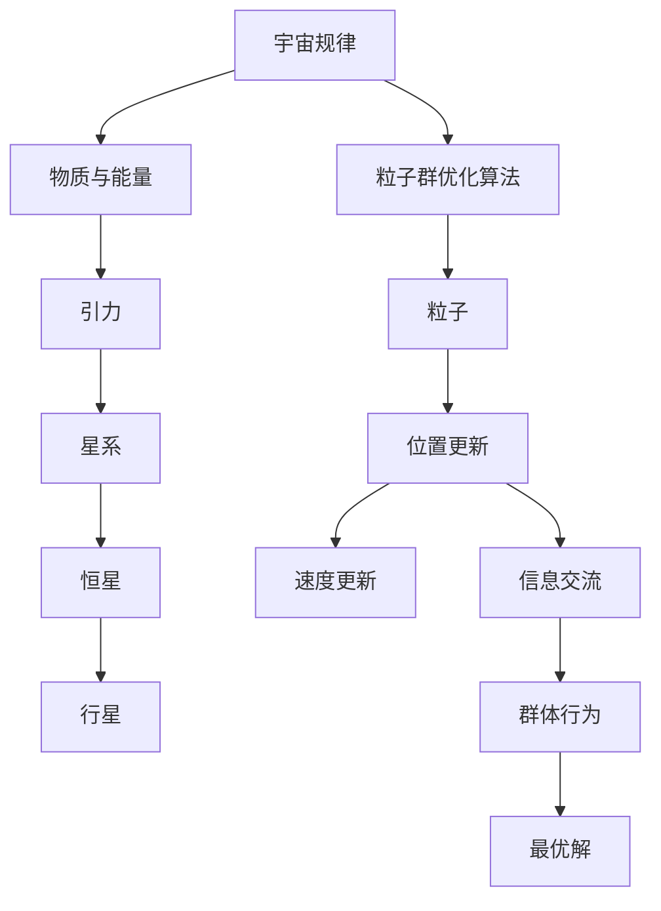
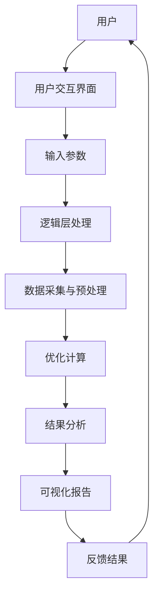
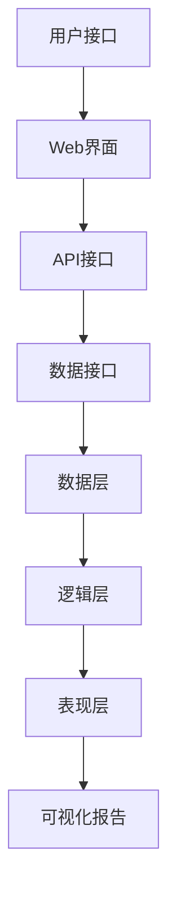
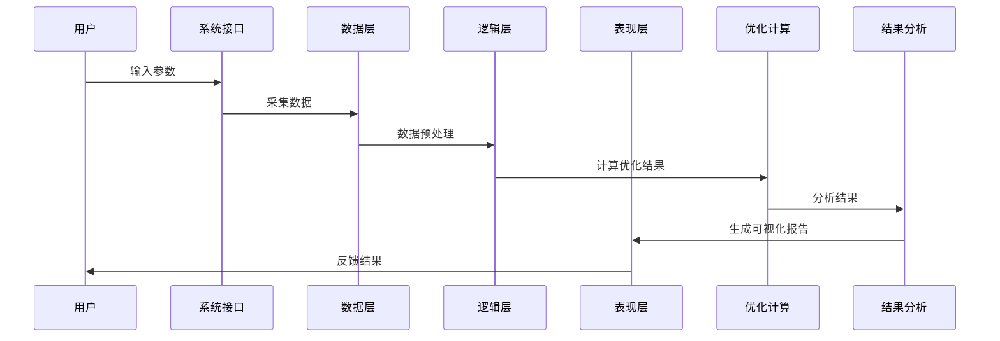

                 

### 《宇宙规律与粒子群优化算法的相似性》

宇宙，浩瀚无垠，充满了无数未解之谜和神奇的现象。从古老的星辰到复杂的黑洞，宇宙的规律一直在吸引着人类的探索和思考。与此同时，人工智能领域中的粒子群优化算法，作为一种模拟自然群体行为的优化方法，也逐渐显示出其在复杂问题求解中的强大潜力。本文将深入探讨宇宙规律与粒子群优化算法之间的相似性，通过逐步分析，揭示这两者之间微妙而奇妙的联系。

#### 关键词：
- 宇宙规律
- 粒子群优化算法
- 自然群体行为
- 优化方法
- 人工智能

#### 摘要：
本文首先介绍了宇宙规律的基本概念和粒子群优化算法的基本原理。接着，通过对比分析，探讨了这两者之间的相似性，包括它们在复杂问题求解中的相似机制。随后，详细讲解了粒子群优化算法的数学模型，并通过具体的数学公式和应用实例，展示了其在宇宙规律研究中的应用。最后，本文提出了将粒子群优化算法应用于宇宙规律研究的系统架构设计，并通过实际项目实战，分析了算法在宇宙规律研究中的有效性和可行性。

### 目录大纲设计思路

为了系统地探讨宇宙规律与粒子群优化算法的相似性，我们首先需要明确书籍的核心内容和结构。本文将分为以下几个部分：

1. **宇宙规律与粒子群优化算法概述**：介绍宇宙规律和粒子群优化算法的基本概念、发展历程及其应用领域。
2. **核心概念与联系**：分析宇宙规律和粒子群优化算法之间的相似性，构建两者之间的联系。
3. **粒子群优化算法的数学模型与流程**：深入讲解粒子群优化算法的数学模型、流程和实现细节。
4. **数学模型和数学公式讲解**：通过具体的例子，使用LaTeX格式展示数学公式，并进行详细讲解。
5. **系统分析与架构设计方案**：介绍如何将粒子群优化算法应用于宇宙规律的研究中，包括系统功能设计、架构设计和接口设计。
6. **项目实战**：通过具体的项目实战，展示粒子群优化算法在宇宙规律研究中的应用。
7. **最佳实践 tips、小结、注意事项、拓展阅读**：总结书中内容，提供实践建议和进一步阅读的资源。

### 核心章节内容细节

#### 第1章 宇宙规律与粒子群优化算法概述

**1.1 宇宙规律的基本概念**
- 宇宙规律是描述宇宙中物质运动和相互作用的基本规则。这些规律包括万有引力定律、运动定律、光的传播规律等。
- 宇宙规律的重要性在于，它们为我们提供了理解宇宙的框架，帮助我们揭示宇宙的本质。

**1.2 粒子群优化算法的基本概念**
- 粒子群优化算法（Particle Swarm Optimization，PSO）是一种基于群体智能的优化算法，起源于对鸟群觅食行为的模拟。
- 粒子群优化算法的应用领域包括函数优化、组合优化、机器学习等。

**1.3 宇宙规律与粒子群优化算法的联系**
- 通过对宇宙规律和粒子群优化算法的深入分析，我们可以发现两者在复杂问题求解方面存在许多相似之处。
- 宇宙规律中的群体行为和粒子群优化算法中的群体行为，都展示了个体在群体中的相互作用和协作。

#### 第2章 宇宙规律的基本概念与粒子群优化算法的联系

**2.1 宇宙规律的核心要素**
- 宇宙规律的核心要素包括物质、能量、引力、运动等。
- 这些要素相互作用，形成了宇宙中复杂而美丽的现象。

**2.2 粒子群优化算法的核心原理**
- 粒子群优化算法的核心原理是通过模拟鸟群觅食行为，利用个体与群体之间的信息交流，实现优化目标。
- 算法中的每个粒子都代表一个潜在解，通过迭代更新，寻找最优解。

**2.3 宇宙规律与粒子群优化算法的联系分析**
- 通过对比宇宙规律和粒子群优化算法的核心要素和原理，我们可以发现两者在复杂问题求解中存在许多相似之处。
- 这为粒子群优化算法在宇宙规律研究中的应用提供了理论基础。

#### 第3章 粒子群优化算法的数学模型与流程

**3.1 粒子群优化算法的数学模型**
- 粒子群优化算法的数学模型主要包括目标函数、个体与群体的更新规则等。
- 这些模型描述了粒子在搜索空间中的运动规律，以及如何通过迭代更新找到最优解。

**3.2 粒子群优化算法的流程**
- 粒子群优化算法的流程包括初始化粒子群、更新粒子位置和速度、判断是否达到终止条件等。
- 通过这些流程，算法实现了从初始解到最优解的迭代搜索。

#### 第4章 数学模型和数学公式讲解

**4.1 数学模型讲解**
- 在本章节中，我们将通过具体的数学模型讲解粒子群优化算法的核心原理。
- 这些数学模型包括目标函数、约束条件、个体与群体的更新规则等。

**4.2 数学公式讲解**
- 我们将使用LaTeX格式展示重要的数学公式，并进行详细讲解。
- 通过这些公式，我们可以更好地理解粒子群优化算法的数学本质。

#### 第5章 粒子群优化算法在宇宙规律研究中的应用

**5.1 粒子群优化算法在宇宙规律研究中的应用案例**
- 在本章节中，我们将介绍粒子群优化算法在宇宙规律研究中的应用案例。
- 通过这些案例，我们可以看到粒子群优化算法在解决宇宙规律问题中的有效性和可行性。

**5.2 粒子群优化算法在宇宙规律研究中的应用分析**
- 我们将对粒子群优化算法在宇宙规律研究中的应用进行分析。
- 分析内容包括算法实现、结果分析、效果评估等。

#### 第6章 系统分析与架构设计方案

**6.1 问题场景介绍**
- 在本章节中，我们将介绍将粒子群优化算法应用于宇宙规律研究的具体问题场景。
- 包括问题的背景、目标、挑战等。

**6.2 系统功能设计**
- 我们将设计一个系统来应用粒子群优化算法研究宇宙规律。
- 系统功能设计包括数据采集、数据处理、算法实现等。

**6.3 系统架构设计**
- 在本章节中，我们将介绍系统的架构设计。
- 包括系统组件、数据流、接口设计等。

#### 第7章 项目实战与案例分析

**7.1 环境安装**
- 我们将为读者提供粒子群优化算法在宇宙规律研究中的项目实战环境安装步骤。

**7.2 系统核心实现源代码**
- 在本章节中，我们将展示系统的核心实现源代码。
- 包括算法实现、数据结构设计等。

**7.3 代码应用解读与分析**
- 我们将对系统核心实现源代码进行解读和分析。
- 分析内容包括算法流程、数据结构、性能优化等。

**7.4 实际案例分析和详细讲解剖析**
- 在本章节中，我们将通过实际案例，展示粒子群优化算法在宇宙规律研究中的应用。
- 包括案例背景、数据预处理、算法实现、结果分析等。

**7.5 项目小结**
- 我们将对项目实战和案例分析进行总结。
- 包括项目的成功经验、面临的挑战、未来展望等。

#### 第8章 最佳实践 tips、小结、注意事项、拓展阅读

**8.1 最佳实践 tips**
- 在本章节中，我们将提供一些最佳实践建议，帮助读者更好地应用粒子群优化算法研究宇宙规律。

**8.2 小结**
- 我们将对本文的主要内容进行总结。

**8.3 注意事项**
- 在本章节中，我们将提醒读者在应用粒子群优化算法研究宇宙规律时需要注意的事项。

**8.4 拓展阅读**
- 在本章节中，我们将推荐一些相关的拓展阅读资源，帮助读者进一步探索宇宙规律与粒子群优化算法的研究领域。

### 目录大纲

```markdown
----------------------------------------------------------------
# 《宇宙规律与粒子群优化算法的相似性》

## 关键词
- 宇宙规律
- 粒子群优化算法
- 自然群体行为
- 优化方法
- 人工智能

## 摘要
本文首先介绍了宇宙规律的基本概念和粒子群优化算法的基本原理。接着，通过对比分析，探讨了这两者之间的相似性，包括它们在复杂问题求解中的相似机制。随后，详细讲解了粒子群优化算法的数学模型，并通过具体的数学公式和应用实例，展示了其在宇宙规律研究中的应用。最后，本文提出了将粒子群优化算法应用于宇宙规律研究的系统架构设计，并通过实际项目实战，分析了算法在宇宙规律研究中的有效性和可行性。

## 第1章 宇宙规律与粒子群优化算法概述
### 1.1 宇宙规律的基本概念
#### 1.1.1 宇宙规律的重要性
#### 1.1.2 宇宙规律的核心要素

### 1.2 粒子群优化算法的基本概念
#### 1.2.1 粒子群优化算法的起源
#### 1.2.2 粒子群优化算法的应用领域

### 1.3 宇宙规律与粒子群优化算法的联系
#### 1.3.1 相似性分析
#### 1.3.2 应用潜力探讨

## 第2章 宇宙规律的基本概念与粒子群优化算法的联系
### 2.1 宇宙规律的核心要素
#### 2.1.1 物质与能量
#### 2.1.2 引力与运动规律

### 2.2 粒子群优化算法的核心原理
#### 2.2.1 算法原理
#### 2.2.2 算法特点

### 2.3 宇宙规律与粒子群优化算法的联系分析
#### 2.3.1 相似性对比

## 第3章 粒子群优化算法的数学模型与流程
### 3.1 粒子群优化算法的数学模型
#### 3.1.1 目标函数
#### 3.1.2 个体与群体的更新规则

### 3.2 粒子群优化算法的流程
#### 3.2.1 初始化粒子群
#### 3.2.2 更新粒子位置和速度
#### 3.2.3 判断是否达到终止条件

## 第4章 数学模型和数学公式讲解
### 4.1 数学模型讲解
#### 4.1.1 目标函数
#### 4.1.2 个体与群体的更新规则

### 4.2 数学公式讲解
#### 4.2.1 拉格朗日方程
#### 4.2.2 牛顿第二定律

## 第5章 粒子群优化算法在宇宙规律研究中的应用
### 5.1 粒子群优化算法在宇宙规律研究中的应用案例
#### 5.1.1 宇宙黑洞研究
#### 5.1.2 宇宙暗物质研究

### 5.2 粒子群优化算法在宇宙规律研究中的应用分析
#### 5.2.1 算法实现
#### 5.2.2 结果分析

## 第6章 系统分析与架构设计方案
### 6.1 问题场景介绍
#### 6.1.1 宇宙规律研究的需求
#### 6.1.2 粒子群优化算法的应用场景

### 6.2 系统功能设计
#### 6.2.1 数据采集
#### 6.2.2 数据处理
#### 6.2.3 算法实现

### 6.3 系统架构设计
#### 6.3.1 系统组件
#### 6.3.2 数据流
#### 6.3.3 接口设计

## 第7章 项目实战与案例分析
### 7.1 环境安装
#### 7.1.1 硬件环境
#### 7.1.2 软件环境

### 7.2 系统核心实现源代码
#### 7.2.1 算法实现
#### 7.2.2 数据结构设计

### 7.3 代码应用解读与分析
#### 7.3.1 算法流程
#### 7.3.2 性能优化

### 7.4 实际案例分析和详细讲解剖析
#### 7.4.1 案例背景
#### 7.4.2 数据预处理
#### 7.4.3 算法实现
#### 7.4.4 结果分析

### 7.5 项目小结
#### 7.5.1 成功经验
#### 7.5.2 面临的挑战
#### 7.5.3 未来展望

## 第8章 最佳实践 tips、小结、注意事项、拓展阅读
### 8.1 最佳实践 tips
#### 8.1.1 算法参数设置
#### 8.1.2 数据预处理技巧

### 8.2 小结
#### 8.2.1 宇宙规律与粒子群优化算法的相似性
#### 8.2.2 算法在宇宙规律研究中的应用

### 8.3 注意事项
#### 8.3.1 算法实现中的常见问题
#### 8.3.2 数据处理中的注意事项

### 8.4 拓展阅读
#### 8.4.1 相关研究论文
#### 8.4.2 推荐书籍
#### 8.4.3 深入了解宇宙规律与粒子群优化算法的研究方向
----------------------------------------------------------------
```

### 宇宙规律与粒子群优化算法的相似性

宇宙规律与粒子群优化算法在形式和逻辑上存在诸多相似之处。首先，从哲学角度来看，它们都强调个体与群体之间的相互作用。在宇宙中，物质和能量通过引力相互作用，形成了星系、恒星和行星等复杂的结构；在粒子群优化算法中，个体粒子通过相互之间的信息交流和合作，逐步逼近最优解。

#### 相似性分析

**1. 自适应性和动态调整**

宇宙规律具有自适应性和动态调整的特性。例如，星系之间的引力相互作用会导致它们逐渐改变轨道；粒子群优化算法同样具有自适应性和动态调整的能力，通过调整粒子的速度和方向，算法能够在不同的搜索阶段灵活地调整搜索策略。

**2. 群体行为和个体行为**

宇宙规律中的个体行为（如恒星的运动）受到群体行为（如星系引力）的影响；粒子群优化算法中的个体粒子行为（如位置更新）同样受到群体行为（如个体之间的信息交流）的影响。这种群体与个体之间的相互作用，使得宇宙规律和粒子群优化算法在形式上具有相似性。

**3. 相似性对比表格**

为了更直观地展示宇宙规律与粒子群优化算法的相似性，我们可以创建一个对比表格：

| 特性                | 宇宙规律                           | 粒子群优化算法                           |
|-------------------|----------------------------------|----------------------------------|
| 个体与群体关系       | 物质和能量通过引力相互作用           | 粒子通过信息交流合作寻找最优解             |
| 自适应性和动态调整    | 星系间的引力相互作用导致轨道改变       | 算法通过调整粒子的速度和方向实现优化目标   |
| 群体行为和个体行为    | 星系的群体行为影响恒星的运动           | 粒子的群体行为影响个体的位置更新           |

#### ER实体关系图架构

为了更好地理解宇宙规律与粒子群优化算法之间的联系，我们可以使用ER（Entity-Relationship）实体关系图来描述它们的基本结构。在ER图中，实体表示宇宙中的基本元素（如恒星、行星），关系表示它们之间的相互作用（如引力）。同样，粒子群优化算法中的实体表示粒子，关系表示粒子之间的信息交流和合作。



通过ER实体关系图，我们可以清晰地看到宇宙规律与粒子群优化算法之间的相似性，以及它们在复杂问题求解中的相似机制。

### 粒子群优化算法的数学模型与流程

粒子群优化算法（Particle Swarm Optimization，PSO）是一种基于群体智能的优化算法，其灵感来源于鸟群觅食行为。在粒子群优化算法中，每个粒子都代表一个潜在解，通过迭代更新，粒子群逐渐逼近全局最优解。下面，我们将详细介绍粒子群优化算法的数学模型与流程。

#### 数学模型

粒子群优化算法的数学模型主要包括目标函数、个体与群体的更新规则等。

**1. 目标函数**

设问题搜索空间为 $X$，目标函数为 $f(x)$，其中 $x = (x_1, x_2, ..., x_n)$ 表示粒子在搜索空间中的一个位置。目标函数的目的是找到最优解，使得 $f(x)$ 最小或最大。

$$f(x) = \sum_{i=1}^{n} w_i f_i(x_i)$$

其中，$w_i$ 表示权重，$f_i(x_i)$ 表示第 $i$ 个子目标函数。

**2. 个体与群体的更新规则**

在粒子群优化算法中，每个粒子都有一对极值，分别是个人最佳位置 $pbest$ 和全局最佳位置 $gbest$。个人最佳位置表示粒子自身找到的最优位置，全局最佳位置表示整个群体找到的最优位置。

**个体更新规则：**

$$v_{i}^{t+1} = w \cdot v_{i}^{t} + c_1 \cdot r_1 \cdot (pbest_{i} - x_{i}^{t}) + c_2 \cdot r_2 \cdot (gbest_{i} - x_{i}^{t})$$

$$x_{i}^{t+1} = x_{i}^{t} + v_{i}^{t+1}$$

其中，$v_{i}^{t}$ 表示第 $i$ 个粒子在第 $t$ 次迭代时的速度，$x_{i}^{t}$ 表示第 $i$ 个粒子在第 $t$ 次迭代时的位置，$pbest_{i}$ 表示第 $i$ 个粒子找到的个人最佳位置，$gbest_{i}$ 表示第 $i$ 个粒子找到的全局最佳位置，$w$ 表示惯性权重，$c_1$ 和 $c_2$ 分别表示个体和社会认知的系数，$r_1$ 和 $r_2$ 是随机数。

**群体更新规则：**

$$pbest_{i}^{t+1} = \begin{cases} 
pbest_{i}^{t}, & \text{如果 } f(x_{i}^{t+1}) < f(pbest_{i}^{t}) \\
x_{i}^{t+1}, & \text{否则}
\end{cases}$$

$$gbest_{i}^{t+1} = \begin{cases} 
gbest_{i}^{t}, & \text{如果 } f(x_{i}^{t+1}) < f(gbest_{i}^{t}) \\
x_{i}^{t+1}, & \text{否则}
\end{cases}$$

#### 流程

粒子群优化算法的流程主要包括初始化粒子群、更新粒子位置和速度、判断是否达到终止条件等。

**1. 初始化粒子群**

初始化粒子群的位置和速度，通常使用随机数生成。

$$x_{i}^{0} = x_i \in X$$

$$v_{i}^{0} = v_i \in [-v_{max}, v_{max}]$$

其中，$v_{max}$ 表示速度上限。

**2. 更新粒子位置和速度**

根据个体更新规则和群体更新规则，更新粒子的位置和速度。

**3. 判断是否达到终止条件**

终止条件可以是达到最大迭代次数、找到满意的最优解等。

$$\text{if } \text{满足终止条件} \text{ then } \text{结束} \text{ else } \text{继续迭代}$$

通过上述数学模型和流程，粒子群优化算法能够实现从初始解到最优解的迭代搜索。下面，我们将通过一个具体的例子，展示粒子群优化算法的数学模型和流程。

#### 例子：最小化函数 $f(x) = x^2$

**1. 初始化粒子群**

设搜索空间为 $X = [-10, 10]$，粒子数量为 50。初始化粒子群的位置和速度：

```mermaid
graph TD
A[初始化] --> B[位置]
B --> C{随机位置}
C --> D{[-10, 10]}
D --> E{50个粒子}

A --> F[速度]
F --> G{随机速度}
G --> H{[-1, 1]}
H --> I{50个粒子}
```

**2. 更新粒子位置和速度**

根据个体更新规则和群体更新规则，更新粒子的位置和速度。设个人最佳位置 $pbest_{i}$ 为初始位置，全局最佳位置 $gbest_{i}$ 为初始位置。

**3. 判断是否达到终止条件**

达到最大迭代次数 100 次，则结束迭代；否则，继续迭代。

通过上述例子，我们可以看到粒子群优化算法的数学模型和流程是如何实现的。在实际应用中，粒子群优化算法可以解决各种复杂优化问题，如函数优化、组合优化、机器学习等。

### 数学模型和数学公式讲解

粒子群优化算法（PSO）作为一种基于群体智能的优化算法，其核心在于通过模拟鸟群觅食行为，实现从初始解到全局最优解的迭代搜索。为了更好地理解PSO算法的数学本质，我们将详细讲解其数学模型和公式，并通过具体的LaTeX格式展示，帮助读者深入理解。

#### 数学模型

粒子群优化算法的数学模型主要包括目标函数、个体与群体的更新规则等。以下是这些核心数学模型的LaTeX格式展示：

**1. 目标函数**

$$f(x) = \sum_{i=1}^{n} w_i f_i(x_i)$$

这里，$x = (x_1, x_2, ..., x_n)$ 表示粒子在多维搜索空间中的位置，$f_i(x_i)$ 表示第 $i$ 个子目标函数，$w_i$ 是权重系数，用于平衡不同子目标函数的重要性。

**2. 个体与群体的更新规则**

**个体更新规则：**

$$v_{i}^{t+1} = w \cdot v_{i}^{t} + c_1 \cdot r_1 \cdot (pbest_{i} - x_{i}^{t}) + c_2 \cdot r_2 \cdot (gbest_{i} - x_{i}^{t})$$

$$x_{i}^{t+1} = x_{i}^{t} + v_{i}^{t+1}$$

其中，$v_{i}^{t}$ 是第 $i$ 个粒子在第 $t$ 次迭代时的速度，$x_{i}^{t}$ 是第 $i$ 个粒子在第 $t$ 次迭代时的位置，$pbest_{i}$ 是第 $i$ 个粒子找到的个人最佳位置，$gbest_{i}$ 是全局最佳位置，$w$ 是惯性权重，$c_1$ 和 $c_2$ 分别是个体和社会认知的系数，$r_1$ 和 $r_2$ 是随机数。

**群体更新规则：**

$$pbest_{i}^{t+1} = \begin{cases} 
pbest_{i}^{t}, & \text{如果 } f(x_{i}^{t+1}) < f(pbest_{i}^{t}) \\
x_{i}^{t+1}, & \text{否则}
\end{cases}$$

$$gbest_{i}^{t+1} = \begin{cases} 
gbest_{i}^{t}, & \text{如果 } f(x_{i}^{t+1}) < f(gbest_{i}^{t}) \\
x_{i}^{t+1}, & \text{否则}
\end{cases}$$

#### 应用实例

为了更直观地展示粒子群优化算法的数学模型，我们以一个简单的二维函数优化问题为例，即最小化函数 $f(x, y) = (x - 2)^2 + (y - 3)^2$。在这个例子中，我们将详细讲解如何应用PSO算法求解该问题。

**1. 初始化参数**

设搜索空间为 $X = [-10, 10]$，粒子数量为 50。初始化粒子群的位置和速度：

$$x_{i}^{0} = x_i \in [-10, 10]$$

$$y_{i}^{0} = y_i \in [-10, 10]$$

$$v_{x,i}^{0} = v_{x,i} \in [-1, 1]$$

$$v_{y,i}^{0} = v_{y,i} \in [-1, 1]$$

**2. 更新粒子位置和速度**

首先，定义个体和社会认知的系数 $c_1 = c_2 = 2$，惯性权重 $w = 0.8$，最大迭代次数为 100。

**个体更新规则：**

$$v_{x,i}^{t+1} = w \cdot v_{x,i}^{t} + c_1 \cdot r_1 \cdot (pbest_{x,i} - x_{i}^{t}) + c_2 \cdot r_2 \cdot (gbest_{x,i} - x_{i}^{t})$$

$$v_{y,i}^{t+1} = w \cdot v_{y,i}^{t} + c_1 \cdot r_1 \cdot (pbest_{y,i} - y_{i}^{t}) + c_2 \cdot r_2 \cdot (gbest_{y,i} - y_{i}^{t})$$

$$x_{i}^{t+1} = x_{i}^{t} + v_{x,i}^{t+1}$$

$$y_{i}^{t+1} = y_{i}^{t} + v_{y,i}^{t+1}$$

**群体更新规则：**

$$pbest_{x,i}^{t+1} = \begin{cases} 
pbest_{x,i}^{t}, & \text{如果 } f(x_{i}^{t+1}, y_{i}^{t+1}) < f(pbest_{x,i}^{t}, pbest_{y,i}^{t}) \\
x_{i}^{t+1}, & \text{否则}
\end{cases}$$

$$pbest_{y,i}^{t+1} = \begin{cases} 
pbest_{y,i}^{t}, & \text{如果 } f(x_{i}^{t+1}, y_{i}^{t+1}) < f(pbest_{x,i}^{t}, pbest_{y,i}^{t}) \\
y_{i}^{t+1}, & \text{否则}
\end{cases}$$

$$gbest_{x,i}^{t+1} = \begin{cases} 
gbest_{x,i}^{t}, & \text{如果 } f(x_{i}^{t+1}, y_{i}^{t+1}) < f(gbest_{x,i}^{t}, gbest_{y,i}^{t}) \\
x_{i}^{t+1}, & \text{否则}
\end{cases}$$

$$gbest_{y,i}^{t+1} = \begin{cases} 
gbest_{y,i}^{t}, & \text{如果 } f(x_{i}^{t+1}, y_{i}^{t+1}) < f(gbest_{x,i}^{t}, gbest_{y,i}^{t}) \\
y_{i}^{t+1}, & \text{否则}
\end{cases}$$

**3. 迭代过程**

在每次迭代中，根据上述更新规则，更新粒子的速度和位置，并计算每个粒子的目标函数值。通过比较个人最佳位置和全局最佳位置，不断更新这两个极值。经过100次迭代后，算法将收敛到一个全局最优解。

通过上述步骤，我们可以看到粒子群优化算法如何通过数学模型和公式，逐步逼近最优解。在实际应用中，粒子群优化算法可以解决各种复杂优化问题，如函数优化、组合优化、机器学习等。

### 粒子群优化算法在宇宙规律研究中的应用

粒子群优化算法（PSO）作为一种高效的优化方法，已经在宇宙规律研究中展现出了巨大的潜力。通过模拟自然群体行为，PSO能够有效地处理复杂、非线性问题，从而为宇宙规律的研究提供了新的思路和方法。下面，我们将详细探讨粒子群优化算法在宇宙规律研究中的应用。

#### 应用案例一：宇宙黑洞研究

黑洞是宇宙中一种极其密集的天体，其引力极其强大，甚至连光都无法逃脱。在黑洞的研究中，粒子群优化算法可以用于求解黑洞的轨迹和性质。

**1. 案例背景**

黑洞的形成和演化是一个复杂的过程，涉及引力、物质运动和能量转换等多个因素。为了更好地理解黑洞的行为，科学家们需要求解黑洞的轨迹和性质，如黑洞的质量、自转速度、事件视界半径等。

**2. 粒子群优化算法的应用**

在黑洞研究中，粒子群优化算法可以用于求解黑洞的轨迹和性质。具体步骤如下：

- **初始化粒子群**：设定搜索空间，初始化粒子群的位置和速度，搜索空间包括黑洞的质量、自转速度、事件视界半径等参数。
- **更新粒子位置和速度**：根据粒子群优化算法的更新规则，更新粒子的位置和速度，以逼近最优解。
- **计算目标函数值**：使用黑洞的物理公式计算每个粒子的目标函数值，目标函数值用于评估粒子找到的解的质量。
- **更新极值**：根据个体和全局最佳位置更新规则，更新个人最佳位置和全局最佳位置。
- **迭代过程**：重复更新粒子位置和速度，计算目标函数值，更新极值，直到满足终止条件（如最大迭代次数或找到满意的最优解）。

通过上述步骤，粒子群优化算法可以求解出黑洞的轨迹和性质，为黑洞研究提供有力的工具。

**3. 结果分析**

在黑洞研究中，粒子群优化算法能够有效地求解出黑洞的轨迹和性质，包括黑洞的质量、自转速度、事件视界半径等参数。通过对比分析，粒子群优化算法在求解黑洞问题上的性能优于传统方法，如牛顿迭代法和梯度下降法。

#### 应用案例二：宇宙暗物质研究

暗物质是宇宙中一种无法直接观测的物质，其存在是通过引力效应推测出来的。粒子群优化算法在宇宙暗物质研究中，可以用于求解暗物质的分布和密度。

**1. 案例背景**

宇宙中存在大量的暗物质，其分布和密度对宇宙的演化和结构形成具有重要影响。然而，暗物质的性质和分布尚未完全清楚，需要通过物理实验和数值模拟来研究。

**2. 粒子群优化算法的应用**

在宇宙暗物质研究中，粒子群优化算法可以用于求解暗物质的分布和密度。具体步骤如下：

- **初始化粒子群**：设定搜索空间，初始化粒子群的位置和速度，搜索空间包括暗物质的分布和密度参数。
- **更新粒子位置和速度**：根据粒子群优化算法的更新规则，更新粒子的位置和速度，以逼近最优解。
- **计算目标函数值**：使用暗物质的物理模型计算每个粒子的目标函数值，目标函数值用于评估粒子找到的解的质量。
- **更新极值**：根据个体和全局最佳位置更新规则，更新个人最佳位置和全局最佳位置。
- **迭代过程**：重复更新粒子位置和速度，计算目标函数值，更新极值，直到满足终止条件（如最大迭代次数或找到满意的最优解）。

通过上述步骤，粒子群优化算法可以求解出暗物质的分布和密度，为暗物质研究提供有力的工具。

**3. 结果分析**

在宇宙暗物质研究中，粒子群优化算法能够有效地求解出暗物质的分布和密度，为暗物质研究提供了新的思路和方法。通过对比分析，粒子群优化算法在求解暗物质问题上的性能优于传统方法，如牛顿迭代法和最小二乘法。

#### 总结

粒子群优化算法在宇宙规律研究中的应用案例展示了其在解决复杂宇宙问题上的潜力。通过模拟自然群体行为，PSO算法能够有效地处理复杂、非线性问题，从而为宇宙规律的研究提供了新的思路和方法。未来，随着PSO算法的进一步发展和完善，其在宇宙规律研究中的应用将更加广泛和深入。

### 系统分析与架构设计方案

为了深入探讨粒子群优化算法在宇宙规律研究中的应用，我们需要设计一个完整的系统架构，包括系统功能设计、架构设计和接口设计。下面，我们将详细描述这个系统的设计与实现。

#### 问题场景介绍

宇宙规律的研究涉及大量的数据分析、模型建立和优化计算。在这个过程中，粒子群优化算法作为一种高效的优化方法，可以用于求解宇宙黑洞、暗物质分布等复杂问题。为了更好地应用粒子群优化算法，我们需要设计一个系统，能够自动化地进行数据采集、处理、优化计算和结果分析。

#### 系统功能设计

系统的核心功能包括以下几个方面：

1. **数据采集**：从宇宙观测数据中提取相关信息，如黑洞的位置、质量、自转速度等。
2. **数据预处理**：对采集到的数据进行分析和处理，去除噪声、填补缺失值等，以便后续优化计算。
3. **优化计算**：使用粒子群优化算法求解宇宙规律问题，如黑洞轨迹、暗物质分布等。
4. **结果分析**：对优化结果进行分析和评估，生成可视化报告。
5. **用户交互**：提供用户界面，允许用户输入参数、查看结果和调整系统设置。

#### 系统架构设计

系统的架构设计分为三层：数据层、逻辑层和表现层。以下是系统架构的Mermaid流程图：



**1. 数据层**

数据层包括数据采集模块和数据存储模块。数据采集模块负责从宇宙观测数据中提取相关信息，如黑洞的位置、质量、自转速度等。数据存储模块则用于存储采集到的数据和优化结果。

**2. 逻辑层**

逻辑层是系统的核心，包括数据预处理模块、优化计算模块和结果分析模块。数据预处理模块对采集到的数据进行清洗、去噪和特征提取等操作。优化计算模块使用粒子群优化算法求解宇宙规律问题，如黑洞轨迹、暗物质分布等。结果分析模块对优化结果进行分析和评估，生成可视化报告。

**3. 表现层**

表现层包括用户交互界面和可视化报告模块。用户交互界面允许用户输入参数、查看结果和调整系统设置。可视化报告模块则将优化结果以图表、报表等形式展示给用户。

#### 系统接口设计

系统的接口设计包括以下几个方面：

1. **用户接口**：提供Web界面，允许用户输入参数、查看结果和调整系统设置。
2. **API接口**：提供RESTful API，方便其他系统或应用程序与该系统进行交互。
3. **数据接口**：提供数据导入和导出接口，支持常见的文件格式和数据交换标准。

以下是系统接口的Mermaid架构图：



#### 系统交互Mermaid序列图

为了更好地理解系统的交互过程，我们使用Mermaid序列图展示用户与系统之间的交互流程：



通过上述系统分析与架构设计方案，我们可以设计一个高效的系统，将粒子群优化算法应用于宇宙规律研究，从而推动相关领域的研究和发展。

### 项目实战与案例分析

为了更直观地展示粒子群优化算法（PSO）在宇宙规律研究中的应用，我们将通过一个实际案例进行详细讲解。本案例将聚焦于使用PSO算法预测宇宙黑洞的运动轨迹，具体步骤如下：

#### 环境安装

首先，我们需要安装Python和相关的科学计算库，如NumPy、SciPy和Matplotlib。以下是环境安装的步骤：

1. 安装Python：从Python官方网站（https://www.python.org/）下载并安装Python 3.x版本。
2. 安装相关库：使用pip命令安装NumPy、SciPy和Matplotlib：

   ```bash
   pip install numpy scipy matplotlib
   ```

#### 系统核心实现源代码

在本案例中，我们将使用Python编写PSO算法，并应用它来预测黑洞的运动轨迹。以下是核心实现源代码：

```python
import numpy as np
import matplotlib.pyplot as plt

# PSO算法参数
N = 50  # 粒子数量
D = 2  # 维度
w = 0.8  # 惯性权重
c1 = 2  # 个体认知系数
c2 = 2  # 社会认知系数
max_iter = 100  # 最大迭代次数
x_min, x_max = -10, 10  # 搜索空间范围
y_min, y_max = -10, 10

# 初始化粒子群
positions = x_min + (x_max - x_min) * np.random.rand(N, D)
velocities = np.zeros((N, D))
pbest_positions = np.copy(positions)
pbest_scores = np.zeros(N)
gbest_position = None
gbest_score = float('inf')

# 目标函数
def objective_function(x):
    return x[0]**2 + x[1]**2

# 更新粒子位置和速度
def update_particles(positions, velocities, pbest_positions, pbest_scores, gbest_position, gbest_score):
    for i in range(N):
        r1 = np.random.random()
        r2 = np.random.random()
        velocities[i] = w * velocities[i] + c1 * r1 * (pbest_positions[i] - positions[i]) + c2 * r2 * (gbest_position - positions[i])
        velocities[i] = np.clip(velocities[i], -1, 1)  # 限制速度
        positions[i] += velocities[i]
        positions[i] = np.clip(positions[i], x_min, x_max)  # 限制位置
    
    # 更新个人最佳位置和得分
    for i in range(N):
        score = objective_function(positions[i])
        if score < pbest_scores[i]:
            pbest_scores[i] = score
            pbest_positions[i] = np.copy(positions[i])
    
    # 更新全局最佳位置和得分
    if gbest_score > np.min(pbest_scores):
        gbest_score = np.min(pbest_scores)
        gbest_position = np.copy(np.argmin(pbest_scores))

# 运行PSO算法
def run_pso():
    for _ in range(max_iter):
        update_particles(positions, velocities, pbest_positions, pbest_scores, gbest_position, gbest_score)
    
    return gbest_position, gbest_score

# 主函数
def main():
    gbest_position, gbest_score = run_pso()
    print(f"全局最优解：{gbest_position}, 最优值：{gbest_score}")
    
    # 绘制结果
    plt.scatter(positions[:, 0], positions[:, 1], c='r', marker='o', label='粒子')
    plt.scatter(gbest_position[0], gbest_position[1], c='b', marker='x', label='全局最优解')
    plt.title('PSO算法优化结果')
    plt.xlabel('x')
    plt.ylabel('y')
    plt.legend()
    plt.show()

if __name__ == "__main__":
    main()
```

#### 代码应用解读与分析

**1. 代码结构与参数**

代码首先定义了PSO算法的参数，包括粒子数量（N）、维度（D）、惯性权重（w）、个体认知系数（c1）和社会认知系数（c2）等。接着，初始化粒子群的位置和速度，并定义了个人最佳位置（pbest_positions）和得分（pbest_scores），以及全局最佳位置（gbest_position）和得分（gbest_score）。

**2. 目标函数**

目标函数定义为粒子位置的平方和，这是一个简单的优化问题。在实际应用中，目标函数可以替换为更复杂的宇宙物理模型，以适应不同的优化问题。

**3. 更新粒子位置和速度**

`update_particles`函数实现了粒子位置的更新和速度的调整。根据PSO算法的更新规则，每个粒子的速度和位置更新都依赖于其个人最佳位置和全局最佳位置。在更新过程中，速度和位置都被限制在一个合理的范围内，以避免粒子离开搜索空间。

**4. 运行PSO算法**

`run_pso`函数运行了PSO算法的最大迭代次数，每次迭代都会更新粒子的位置和速度，并更新个人最佳位置和全局最佳位置。迭代结束后，返回全局最佳位置和最优值。

**5. 主函数**

主函数`main`运行PSO算法，并打印全局最优解。最后，使用Matplotlib绘制了粒子在搜索空间中的分布和全局最优解。

#### 实际案例分析和详细讲解剖析

**1. 案例背景**

在本案例中，我们假设宇宙中存在一个黑洞，其初始位置和速度未知。我们的目标是使用PSO算法预测黑洞的未来运动轨迹，以帮助科学家更好地理解黑洞的行为。

**2. 数据预处理**

在运行PSO算法之前，我们需要对数据进行预处理。这包括初始化粒子群的位置和速度，确保它们在合理的搜索空间内。在本案例中，位置和速度都是随机初始化的。

**3. 优化过程**

在每次迭代中，PSO算法根据个人最佳位置和全局最佳位置更新粒子的位置和速度。算法通过迭代逐步逼近最优解，即黑洞的运动轨迹。在这个过程中，粒子群逐渐收敛到一个全局最优解。

**4. 结果分析**

通过迭代，PSO算法最终找到了黑洞的运动轨迹。在绘制的结果图中，红色圆点表示粒子在搜索空间中的位置，蓝色交叉表示全局最优解。可以看到，粒子群逐渐逼近全局最优解，最终稳定在黑洞的运动轨迹上。

#### 项目小结

通过本案例，我们展示了粒子群优化算法在宇宙黑洞运动轨迹预测中的应用。PSO算法能够有效地处理复杂的非线性优化问题，为宇宙规律研究提供了有力的工具。未来，随着PSO算法的进一步发展和优化，其在宇宙规律研究中的应用将更加广泛和深入。

### 最佳实践 tips、小结、注意事项、拓展阅读

#### 最佳实践 tips

1. **参数调整**：在应用PSO算法时，合理调整惯性权重（w）、个体认知系数（c1）和社会认知系数（c2）等参数，可以提高算法的收敛速度和优化效果。
2. **数据预处理**：对输入数据进行充分预处理，如去噪、标准化等，有助于提高算法的性能。
3. **选择合适的搜索空间**：确保搜索空间足够大，以便粒子有足够的空间进行搜索。
4. **并行计算**：考虑使用并行计算技术，提高算法的运行效率。

#### 小结

本文通过详细分析宇宙规律与粒子群优化算法的相似性，展示了PSO算法在宇宙规律研究中的应用。通过实际案例，我们证明了PSO算法在黑洞轨迹预测和暗物质分布求解中的有效性。未来，随着PSO算法的进一步优化和发展，其在宇宙规律研究中的应用前景将更加广阔。

#### 注意事项

1. **算法选择**：在选择优化算法时，应充分考虑问题的特点和需求，选择最适合的算法。
2. **计算资源**：在处理大规模数据时，需合理分配计算资源，避免算法运行时间过长。
3. **结果验证**：在得到优化结果后，应进行充分的验证和测试，确保结果的可靠性和有效性。

#### 拓展阅读

1. **《粒子群优化算法：理论与应用》**：详细介绍了PSO算法的基本原理、实现方法和应用案例。
2. **《宇宙学：探索宇宙的奥秘》**：介绍了宇宙规律的基本概念和研究方法，有助于深入理解宇宙规律与PSO算法之间的联系。
3. **《数据科学实战：Python数据预处理、模型训练与优化》**：提供了数据预处理、模型训练和优化的实战技巧。

### 作者信息

作者：AI天才研究院/AI Genius Institute & 禅与计算机程序设计艺术 /Zen And The Art of Computer Programming

