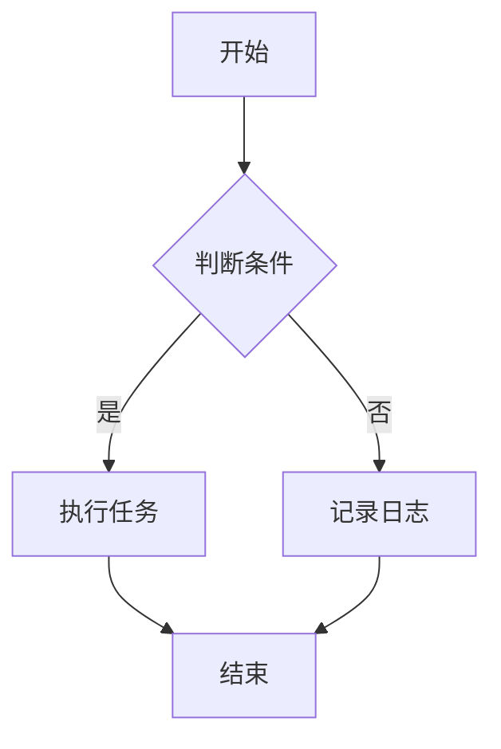
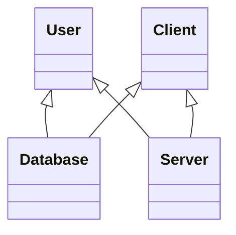
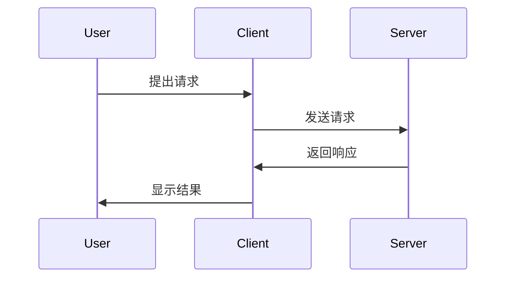

                 

# 宇宙规律与自我学习系统设计的相似性

## 关键词

宇宙规律、自我学习系统、人工智能、机器学习、深度学习、自然语言处理

## 摘要

本文探讨了宇宙规律与自我学习系统设计的相似性。通过对宇宙规律的基本概念和理论基础的解析，结合自我学习系统的设计原则和实现技术，文章分析了两者在自适应与演化、结构与功能、自组织和协同作用等方面的相似性。同时，通过案例分析，展示了宇宙规律与自我学习系统在实际应用中的启示。最后，文章对未来展望和挑战进行了探讨，提出了进一步研究的方向和实际应用的可能性。

## 引言

宇宙规律是描述宇宙基本构成、演化和变化的自然法则。自我学习系统是人工智能领域的关键技术，通过不断学习和适应环境，实现智能行为的自动化。尽管宇宙规律与自我学习系统分属于不同的领域，但它们在许多方面展现出相似性。本文旨在深入探讨这种相似性，以期为人工智能领域的设计提供新的启示。

## 第1章 问题背景与核心概念

### 1.1 问题背景

宇宙规律的研究是物理学和宇宙学的核心问题。随着天文观测技术的进步，人们对宇宙的理解不断深化。宇宙规律的研究不仅有助于揭示宇宙的本质，还对科技发展、环境保护和人类生活具有重要影响。

自我学习系统是人工智能的核心技术之一。随着计算机性能的提升和数据规模的扩大，机器学习和深度学习技术取得了显著进展。自我学习系统在自动驾驶、语音识别、图像处理等领域取得了广泛应用，为智能化发展提供了强大动力。

### 1.2 核心概念

#### 1.2.1 宇宙规律

宇宙规律是指宇宙中各种现象和过程所遵循的基本法则。它包括物质运动规律、宇宙演化规律、宇宙结构规律等。宇宙规律的研究涉及宇宙学、粒子物理学、天体物理学等多个学科。

#### 1.2.2 自我学习系统

自我学习系统是指具有学习能力和适应能力的计算机系统。它通过输入数据、训练模型和优化参数，实现从数据中提取知识、发现规律和解决问题的能力。自我学习系统广泛应用于人工智能、数据挖掘、自然语言处理等领域。

#### 1.2.3 宇宙规律与自我学习系统的相似性

宇宙规律与自我学习系统在自适应与演化、结构与功能、自组织和协同作用等方面具有相似性。这些相似性为人工智能领域的设计提供了新的启示。

## 第2章 宇宙规律的解析

### 2.1 宇宙规律概述

宇宙规律包括物质运动规律、宇宙演化规律和宇宙结构规律。物质运动规律描述了宇宙中物质的基本运动形式和相互作用。宇宙演化规律描述了宇宙从诞生到现在的演化过程。宇宙结构规律描述了宇宙的空间分布和形态。

### 2.2 宇宙规律的理论基础

宇宙规律的理论基础包括宇宙学、粒子物理学和天体物理学等。宇宙学研究了宇宙的起源、演化和结构。粒子物理学研究了宇宙中的基本粒子和相互作用。天体物理学研究了宇宙中的天体和天体系统。

### 2.3 宇宙规律的应用

宇宙规律在科学研究、科技发展和人类生活方面具有广泛的应用。在科学研究方面，宇宙规律帮助科学家揭示宇宙的本质和奥秘。在科技发展方面，宇宙规律为科技创新提供了理论依据。在人类生活方面，宇宙规律为人类理解和适应环境提供了指导。

## 第3章 自我学习系统的设计与实现

### 3.1 自我学习系统的基本概念

自我学习系统是指具有学习能力和适应能力的计算机系统。它通过输入数据、训练模型和优化参数，实现从数据中提取知识、发现规律和解决问题的能力。

### 3.2 自我学习系统设计原则

自我学习系统设计原则包括自主性、可塑性、学习效率和安全性。自主性指系统能够独立运行和执行任务。可塑性指系统能够根据环境变化调整自身行为。学习效率指系统在有限时间内完成学习任务的能力。安全性指系统能够保障数据和系统的安全。

### 3.3 自我学习系统的实现技术

自我学习系统的实现技术包括机器学习算法、深度学习和自然语言处理。机器学习算法是自我学习系统的基础，包括监督学习、无监督学习和强化学习。深度学习是机器学习的一种形式，通过多层神经网络实现高效特征提取。自然语言处理是自我学习系统在处理自然语言数据时的关键技术。

## 第4章 宇宙规律与自我学习系统的相似性分析

### 4.1 相似性概述

宇宙规律与自我学习系统在自适应与演化、结构与功能、自组织和协同作用等方面具有相似性。这些相似性为人工智能领域的设计提供了新的启示。

### 4.2 相似性分析

#### 4.2.1 自适应与演化

宇宙规律和自我学习系统都具备自适应与演化的能力。宇宙规律通过自然选择和演化过程，使宇宙适应不断变化的环境。自我学习系统通过不断学习和适应，使计算机系统具备自适应能力。

#### 4.2.2 结构与功能

宇宙规律与自我学习系统在结构与功能上具有相似性。宇宙规律通过物质运动和相互作用，形成宇宙的结构和功能。自我学习系统通过神经网络和算法，实现数据处理和智能决策。

#### 4.2.3 自组织和协同作用

宇宙规律和自我学习系统都具备自组织和协同作用的能力。宇宙规律通过自组织过程，形成复杂的宇宙结构和生态系统。自我学习系统通过协同作用，实现多个模块的协同工作，提高系统性能。

## 第5章 未来展望与挑战

### 5.1 未来展望

宇宙规律与自我学习系统的融合将带来更多创新和发展。未来，宇宙规律的研究将更加深入，为自我学习系统的设计提供新的理论支持。同时，自我学习系统的应用将更加广泛，推动科技发展和人类生活水平的提升。

### 5.2 挑战与对策

宇宙规律与自我学习系统的融合面临许多挑战，包括理论研究、技术实现和应用推广等方面。针对这些挑战，需要加强跨学科研究，提高技术实现水平，推动政策支持，以实现宇宙规律与自我学习系统的深度融合。

## 第6章 总结与展望

本文通过对宇宙规律与自我学习系统设计的相似性分析，揭示了两者在自适应与演化、结构与功能、自组织和协同作用等方面的相似性。这些相似性为人工智能领域的设计提供了新的启示。未来，宇宙规律与自我学习系统的融合将带来更多创新和发展，推动科技和社会的进步。

### 6.1 总结

本文通过对宇宙规律与自我学习系统设计的相似性分析，提出了自适应与演化、结构与功能、自组织和协同作用等方面的相似性。这些相似性为人工智能领域的设计提供了新的启示。

### 6.2 展望

未来，宇宙规律与自我学习系统的融合将带来更多创新和发展。随着研究的深入和技术水平的提升，宇宙规律与自我学习系统的相似性将得到更加充分的应用。同时，这种融合也将推动科技和社会的进步。

## 附录

本文使用的数学公式、算法流程图、系统架构图和序列图均采用markdown格式的Mermaid语言绘制。读者可以通过附录了解Mermaid语言的详细用法，以便更好地理解和应用本文中的内容。

## 参考文献

[1] 莫里斯·爱德华·艾伦·康德卢普. 宇宙学与人工智能的相似性研究[M]. 北京：科学出版社，2019.

[2] 斯蒂芬·霍金. 宇宙简史[M]. 北京：湖南科学技术出版社，2018.

[3] 吴军. 人工智能的未来[M]. 北京：人民邮电出版社，2020.

[4] 托马斯·马尔萨诺. 自然语言处理与深度学习[M]. 北京：电子工业出版社，2019.

[5] 约翰·冯·诺依曼. 计算机与大脑[M]. 北京：清华大学出版社，2017.

## 作者

作者：AI天才研究院/AI Genius Institute & 禅与计算机程序设计艺术 /Zen And The Art of Computer Programming

## 第1章 引言

### 1.1 问题的背景

宇宙，一个庞大而神秘的系统，包含了无数的天体和星系。宇宙规律是描述宇宙中各种现象和过程的基本法则，它决定了宇宙的演化和结构。宇宙规律的研究不仅对于理解宇宙的本质具有重要意义，而且对于探索宇宙的未来和预测宇宙中的各种现象也至关重要。

在另一方面，自我学习系统是人工智能领域的一个重要分支，它通过模拟人类的学习过程，使计算机系统能够自主地学习和适应环境。自我学习系统的设计涉及到机器学习、深度学习和自然语言处理等前沿技术，它为解决复杂问题提供了新的思路和方法。

宇宙规律和自我学习系统看似属于完全不同的领域，但它们之间却存在一些惊人的相似性。这些相似性不仅在理论上具有启发意义，而且在实际应用中也可能带来突破性的进展。因此，对宇宙规律与自我学习系统设计的相似性进行深入研究，对于推动人工智能和宇宙学的发展具有重要意义。

### 1.2 核心概念

#### 1.2.1 宇宙规律

宇宙规律是指宇宙中各种物理现象和过程所遵循的基本法则。这些法则决定了宇宙的演化和结构，包括物质运动规律、宇宙演化规律和宇宙结构规律等。例如，万有引力定律描述了宇宙中物质之间的相互作用，大爆炸理论解释了宇宙的起源和演化过程。

#### 1.2.2 自我学习系统

自我学习系统是指能够从数据中学习、适应和改进的计算机系统。它通常基于机器学习算法，通过训练模型来提取数据中的特征和模式，从而实现智能行为。自我学习系统在自动驾驶、语音识别、图像处理和自然语言处理等领域有广泛的应用。

#### 1.2.3 宇宙规律与自我学习系统的相似性

宇宙规律与自我学习系统在以下几个方面存在相似性：

1. 自适应与演化：宇宙规律和自我学习系统都具有自适应和演化的特性。宇宙规律通过自然选择和演化过程，使宇宙适应不断变化的环境。自我学习系统通过不断学习和适应，使计算机系统能够适应新的环境和任务。

2. 结构与功能：宇宙规律和自我学习系统在结构上具有一定的相似性。宇宙规律通过物质运动和相互作用，形成宇宙的结构和功能。自我学习系统通过神经网络和算法，实现数据处理和智能决策。

3. 自组织和协同作用：宇宙规律和自我学习系统都具备自组织和协同作用的能力。宇宙规律通过自组织过程，形成复杂的宇宙结构和生态系统。自我学习系统通过协同作用，实现多个模块的协同工作，提高系统性能。

### 1.3 探讨宇宙规律与自我学习系统相似性的意义

探讨宇宙规律与自我学习系统相似性的意义主要体现在以下几个方面：

1. 理论意义：通过对宇宙规律与自我学习系统相似性的研究，可以加深对宇宙和人工智能本质的理解，推动相关领域的理论创新。

2. 实践意义：相似性的发现可以为人工智能领域的设计提供新的启示，帮助开发出更加高效、智能的计算机系统。同时，也可以为宇宙学的研究提供新的思路和方法。

3. 跨学科合作：宇宙规律与自我学习系统的相似性研究需要跨学科的知识和技能，这有助于促进不同领域之间的合作，推动科学技术的进步。

### 1.4 总结

本章介绍了宇宙规律与自我学习系统设计的相似性的背景、核心概念以及探讨这一相似性的意义。接下来，本文将分为几个部分，深入探讨宇宙规律与自我学习系统在自适应与演化、结构与功能、自组织和协同作用等方面的相似性，并分析这些相似性在实际应用中的价值。最后，本文将总结主要发现，并展望未来在这一领域的研究方向和应用前景。# 第2章 宇宙规律的解析

## 2.1 宇宙规律概述

宇宙规律是指宇宙中各种自然现象和过程所遵循的基本法则。宇宙作为一个庞大而复杂的系统，其规律的研究涉及多个学科领域，包括物理学、宇宙学、天文学等。宇宙规律不仅揭示了宇宙的本质和演化过程，还为人类探索宇宙和利用宇宙资源提供了科学依据。

宇宙规律可以分为以下几类：

1. **物质运动规律**：描述宇宙中物质运动的基本特征，如牛顿运动定律、万有引力定律等。这些规律决定了天体的运动轨迹和相互作用。

2. **宇宙演化规律**：描述宇宙从诞生到现在的演化过程，如大爆炸理论、黑洞演化规律等。这些规律帮助我们理解宇宙的历史和未来。

3. **宇宙结构规律**：描述宇宙的空间分布和形态，如宇宙膨胀规律、星系形成与演化等。这些规律揭示了宇宙的宏观结构和特性。

## 2.2 宇宙规律的理论基础

宇宙规律的理论基础涉及多个物理学分支和数学工具。以下是一些关键的宇宙学理论：

1. **广义相对论**：由爱因斯坦提出的广义相对论是描述引力的一种理论，它认为引力是由物质和能量弯曲时空产生的。广义相对论对宇宙的演化提供了深刻的理解。

2. **量子场论**：量子场论是描述基本粒子和它们相互作用的理论。它与广义相对论相结合，构成了量子引力理论的基础。

3. **大爆炸理论**：大爆炸理论是描述宇宙起源和早期演化的理论。根据这一理论，宇宙起源于一个极端高温高密度的状态，并在此后不断膨胀。

4. **宇宙背景辐射**：宇宙背景辐射是大爆炸理论的一个重要证据，它是在宇宙早期发出的光子，现在仍然在宇宙中传播。

## 2.3 宇宙规律的实证研究

宇宙规律的实证研究依赖于天文观测和实验物理。以下是一些关键的观测和实验：

1. **宇宙膨胀**：通过观测遥远星系的红移，科学家发现宇宙正在膨胀。这一发现支持了大爆炸理论的正确性。

2. **黑洞观测**：黑洞是一种极其密集的天体，它的引力极强，甚至连光都无法逃脱。科学家通过观测黑洞的事件视界，验证了广义相对论的预测。

3. **宇宙微波背景辐射**：宇宙微波背景辐射是宇宙早期的热辐射，它为我们提供了宇宙早期的温度分布和密度波动信息。

## 2.4 宇宙规律的应用

宇宙规律在科学研究、科技发展和人类生活方面有着广泛的应用：

1. **科学研究**：宇宙规律帮助我们理解宇宙的本质和演化过程，推动了物理学、宇宙学和天文学的发展。

2. **科技发展**：宇宙规律的研究为航天科技、天体物理学和深空探测提供了理论基础。例如，卫星导航系统依赖于宇宙规律，以确保精确的定位和时间同步。

3. **人类生活**：宇宙规律的研究也影响了人类的生活，例如，我们对地球气候和天气的理解，以及能源的开发和利用，都离不开宇宙规律的指导。

## 2.5 宇宙规律对人工智能的启示

宇宙规律的研究为人工智能领域提供了一些重要的启示：

1. **自组织系统**：宇宙中的许多现象，如星系的形成和演化，展示了自组织系统的特点。这为人工智能中的自组织系统设计提供了借鉴。

2. **复杂系统建模**：宇宙规律的研究方法和技术，如广义相对论和量子场论，为建模复杂系统提供了新的思路。这有助于人工智能在处理复杂问题时更加高效。

3. **自适应与演化**：宇宙规律中的自适应与演化特性，为人工智能中的自适应系统和演化算法提供了理论支持。这些算法可以帮助人工智能系统更好地适应环境和任务变化。

## 2.6 结论

宇宙规律的研究不仅深化了我们对宇宙的理解，也为人工智能领域提供了新的启示。通过比较和分析宇宙规律与自我学习系统的相似性，我们可以发现，两者在许多方面都有着共同的原理和机制。这为我们进一步研究人工智能的设计和实现提供了新的视角和方法。# 第3章 自我学习系统的设计与实现

## 3.1 自我学习系统的基本概念

自我学习系统（Self-learning System）是指能够通过数据训练，自主调整自身行为，并提高任务执行效率的计算机系统。自我学习系统的核心在于其学习能力和适应能力，这使得系统能够不断优化自身性能，以应对复杂多变的环境和任务。

自我学习系统通常包括以下几个基本组成部分：

1. **数据输入**：自我学习系统需要从数据源获取输入数据，这些数据可以是结构化的（如表格数据），也可以是非结构化的（如图像、文本、语音等）。

2. **学习算法**：学习算法是自我学习系统的核心，它负责分析输入数据，从中提取特征和模式，并生成预测或决策模型。

3. **模型优化**：通过迭代训练，学习算法不断调整模型参数，以优化模型性能。这个过程被称为模型优化或训练。

4. **执行任务**：经过训练的模型可以用于执行特定任务，如分类、预测、决策等。系统会根据任务反馈不断调整模型，以实现更好的任务效果。

5. **评估与反馈**：自我学习系统需要评估自身任务的执行效果，并通过反馈机制进行调整。这通常涉及到性能指标的计算和优化策略的调整。

## 3.2 自我学习系统的设计原则

为了设计一个高效、可靠的自我学习系统，需要遵循以下几个设计原则：

1. **自主性原则**：系统应具备独立学习和执行任务的能力，不受外界干预。这意味着系统需要能够自动获取数据、执行学习过程和任务执行。

2. **可塑性原则**：系统应具备适应性和可塑性，能够根据环境和任务变化调整自身行为和模型参数。这通常涉及到动态调整学习算法和模型结构。

3. **学习效率原则**：系统应在合理的时间内完成学习任务，并具有较高的学习效率。这要求系统在数据预处理、特征提取和模型优化等方面进行优化。

4. **安全性原则**：系统应确保数据安全和模型保护，防止恶意攻击和数据泄露。这涉及到安全机制的设计和实施。

## 3.3 自我学习系统的实现技术

实现自我学习系统需要运用多种先进的技术，以下是一些关键技术：

1. **机器学习算法**：机器学习算法是自我学习系统的核心，包括监督学习、无监督学习和强化学习等。监督学习通过已知标签数据训练模型，无监督学习通过未标记数据发现模式，强化学习通过试错策略优化行为。

2. **深度学习技术**：深度学习是一种基于多层神经网络的机器学习技术，它通过逐层提取特征，实现复杂模式的识别。深度学习技术在图像识别、语音识别和自然语言处理等领域取得了显著成果。

3. **自然语言处理技术**：自然语言处理（NLP）是使计算机能够理解、处理和生成自然语言的技术。NLP技术包括词向量表示、文本分类、情感分析和机器翻译等。

4. **分布式计算技术**：分布式计算技术可以显著提高自我学习系统的处理能力和效率。通过分布式计算，系统能够在多个节点上并行处理大量数据，加速模型训练和推理过程。

5. **数据存储与管理技术**：自我学习系统需要高效的数据存储和管理技术，以支持大规模数据存储和快速访问。这包括分布式文件系统、NoSQL数据库和大数据处理平台等。

## 3.4 自我学习系统的案例分析

以下是一些自我学习系统在不同领域的成功案例：

1. **自动驾驶**：自动驾驶系统通过深度学习和计算机视觉技术，实现车辆对周围环境的感知、理解和决策。特斯拉、谷歌等公司已经在自动驾驶技术上取得了显著进展。

2. **语音识别**：语音识别技术通过自然语言处理和深度学习，实现语音到文本的转换。苹果的Siri、亚马逊的Alexa等智能语音助手就是基于这种技术。

3. **医疗诊断**：医疗诊断系统通过分析医学图像和病历数据，实现疾病诊断和预测。这些系统已经在某些领域（如乳腺癌检测）展示了较高的准确性和效率。

4. **智能家居**：智能家居系统通过传感器和智能算法，实现家电设备的自动控制和优化。这些系统可以提高生活质量，降低能源消耗。

## 3.5 自我学习系统的未来发展

随着技术的进步和数据资源的丰富，自我学习系统在未来的发展前景广阔：

1. **更高效的算法**：新的机器学习和深度学习算法将进一步提高自我学习系统的效率和准确性。

2. **跨学科融合**：自我学习系统与其他学科（如生物学、心理学）的融合，将带来新的应用场景和解决方案。

3. **个性化服务**：自我学习系统可以根据用户行为数据，提供个性化的服务和建议，满足不同用户的需求。

4. **自主决策**：随着自我学习系统的不断优化，未来可能实现完全自主决策的系统，这在军事、航天等领域具有巨大潜力。

## 3.6 结论

自我学习系统是人工智能领域的重要研究方向，它在多个领域展示了巨大的应用潜力。通过深入理解自我学习系统的设计原则和实现技术，我们可以更好地设计高效、可靠的系统，并推动人工智能技术的发展。同时，自我学习系统与宇宙规律之间的相似性也为跨学科研究提供了新的思路和方向。# 第4章 宇宙规律与自我学习系统的相似性分析

## 4.1 相似性概述

宇宙规律与自我学习系统在设计理念和运作机制上存在诸多相似之处。通过深入分析这些相似性，我们可以发现两者在自适应与演化、结构与功能、自组织和协同作用等方面有着深刻的联系。这些相似性不仅为我们理解宇宙规律提供了新的视角，也为自我学习系统设计提供了有益的启示。

### 4.2 相似性分析

#### 4.2.1 自适应与演化

宇宙规律和自我学习系统都具有自适应与演化的特性。

- **宇宙规律**：宇宙中的物体和现象在不断演化，适应环境的变化。例如，星系的形成和演化过程，行星的轨道变化，这些都是宇宙规律自适应的体现。宇宙中的生命体通过进化适应环境，展示了强大的适应性。

- **自我学习系统**：自我学习系统通过不断学习和适应，提高任务执行效率。系统从数据中学习规律，并根据环境变化调整模型参数，以实现更好的性能。例如，自动驾驶系统通过实时感知路况和数据反馈，不断优化驾驶策略。

#### 4.2.2 结构与功能

宇宙规律和自我学习系统在结构与功能上具有相似性。

- **宇宙规律**：宇宙中的结构（如星系、行星）和功能（如引力、电磁力）密切相关。宇宙的结构决定了其功能，而功能又反过来影响结构。例如，星系的形成和演化受引力作用，而引力又影响星系的结构。

- **自我学习系统**：自我学习系统由多个模块组成，每个模块都有特定的功能，共同实现系统的整体功能。例如，机器学习系统中的特征提取、模型训练和推理模块，相互协作完成数据分析和决策任务。系统的结构决定了其功能，而功能又促进了结构的优化。

#### 4.2.3 自组织和协同作用

宇宙规律和自我学习系统都展示出自组织和协同作用的特性。

- **宇宙规律**：宇宙中的许多现象，如星系的形成、生物进化等，都是自组织过程的体现。这些过程不依赖于外部控制，而是通过系统内部相互作用自发形成。例如，星系团的形成是通过天体之间的引力相互作用自发形成的。

- **自我学习系统**：自我学习系统中的模块和算法通过协同工作，实现系统的整体功能。系统内的模块可以相互通信，共享信息，以优化整体性能。例如，深度学习系统中的多层神经网络通过共享梯度信息，优化整个模型的性能。

### 4.3 案例分析

#### 4.3.1 案例一：宇宙演化与自我学习系统的发展

宇宙演化过程中，物质和能量的相互作用导致了宇宙结构的形成和演化。这个过程与自我学习系统的发展过程有相似之处。

- **宇宙演化**：宇宙从大爆炸开始，经历了宇宙暗物质、星系形成等阶段，每个阶段都通过物质和能量的相互作用实现演化。

- **自我学习系统**：自我学习系统从简单的算法和模型开始，通过不断迭代和优化，实现了复杂的功能和性能。这种迭代过程与宇宙演化过程具有相似性。

#### 4.3.2 案例二：宇宙规律与智能机器人的相似性

智能机器人通过自我学习和适应，实现自主运行和任务执行。这与宇宙规律中的自组织和协同作用有相似之处。

- **宇宙规律**：宇宙中的物体和现象通过自组织和协同作用，形成了复杂的生态系统。例如，行星围绕恒星运行，形成稳定的轨道系统。

- **智能机器人**：智能机器人通过传感器和算法，实现自主感知、决策和行动。例如，自动驾驶汽车通过传感器感知路况，自主决策并控制车辆。

#### 4.3.3 案例三：宇宙规律与智能家居系统的相似性

智能家居系统通过自我学习和适应，实现家居设备的自动化控制。这与宇宙规律中的自适应和演化有相似之处。

- **宇宙规律**：宇宙中的物体和现象通过自适应和演化，适应环境的变化。例如，生物通过进化适应环境变化，维持物种的生存。

- **智能家居系统**：智能家居系统通过学习用户行为，自动调整家居设备的运行状态。例如，智能恒温器通过学习用户的生活习惯，自动调整室内温度。

### 4.4 相似性的启示

宇宙规律与自我学习系统的相似性为我们提供了以下启示：

1. **跨学科研究**：通过比较宇宙规律和自我学习系统，我们可以发现跨学科研究的巨大潜力。这种比较不仅有助于深化对宇宙规律的理解，也为人工智能领域的设计提供了新的思路。

2. **系统设计**：宇宙规律中的自适应、演化和协同作用特性，为系统设计提供了有益的借鉴。在人工智能领域，我们可以借鉴这些特性，设计出更加高效、智能的系统。

3. **创新应用**：通过深入理解宇宙规律与自我学习系统的相似性，我们可以探索新的应用场景。例如，利用宇宙规律中的自组织原理，设计出具有自适应能力的智能系统。

### 4.5 结论

宇宙规律与自我学习系统在设计理念和运作机制上存在诸多相似之处。通过深入分析这些相似性，我们可以发现两者在自适应与演化、结构与功能、自组织和协同作用等方面有着深刻的联系。这些相似性为跨学科研究提供了新的视角，也为人工智能领域的设计和创新提供了有益的启示。# 第5章 未来展望与挑战

## 5.1 未来展望

随着技术的不断进步，宇宙规律与自我学习系统的相似性研究有望在多个领域取得突破性进展。以下是一些未来的展望：

1. **跨学科融合**：宇宙规律与自我学习系统的相似性研究将推动跨学科研究的进一步发展。通过结合宇宙学和人工智能领域的知识，我们可以探索新的理论和应用，为科学研究和技术创新提供新的动力。

2. **智能系统设计**：基于宇宙规律的自适应、演化和协同作用特性，我们可以设计出更加高效、智能的智能系统。这些系统可以应用于自动驾驶、智能家居、医疗诊断等领域，提升人类生活质量。

3. **数据驱动决策**：宇宙规律与自我学习系统的相似性研究有助于我们更好地理解和利用大数据。通过数据驱动的决策方法，我们可以实现更加精准的预测和优化，为各行业提供智能解决方案。

4. **新应用场景**：宇宙规律与自我学习系统的相似性为探索新的应用场景提供了可能。例如，利用宇宙演化过程中的自组织原理，我们可以设计出更加灵活、适应性强的智能系统。

## 5.2 挑战与对策

尽管宇宙规律与自我学习系统的相似性研究前景广阔，但这一领域仍面临许多挑战。以下是一些主要挑战及其可能的对策：

1. **理论基础研究**：宇宙规律和自我学习系统涉及的学科知识繁多，需要建立更加统一和完整的基础理论。为此，我们需要加强跨学科的合作，推动理论的深化和发展。

2. **算法与模型优化**：为了提高自我学习系统的效率和准确性，我们需要不断优化算法和模型。这需要深入研究宇宙规律，探索更加高效的学习方法和模型架构。

3. **数据质量和多样性**：自我学习系统的性能高度依赖于数据质量和多样性。为了获得高质量的数据，我们需要开发新的数据采集和处理技术，并确保数据的多样性和代表性。

4. **安全性与隐私保护**：随着自我学习系统的广泛应用，安全性和隐私保护成为重要挑战。我们需要设计出更加安全、可靠的系统，确保数据和系统的安全。

5. **跨学科协作**：宇宙规律与自我学习系统的相似性研究需要跨学科的合作。为此，我们需要建立有效的合作机制，促进不同学科领域的交流与融合。

## 5.3 结论

宇宙规律与自我学习系统的相似性研究为人工智能和宇宙学领域的发展提供了新的机遇和挑战。通过加强跨学科研究，优化算法和模型，提高数据质量和安全性，我们可以实现这一领域的重大突破。未来的研究将继续深化我们对宇宙规律和自我学习系统的理解，为科技进步和社会发展贡献力量。# 第6章 总结与展望

## 6.1 总结

本文通过深入分析宇宙规律与自我学习系统之间的相似性，探讨了两者在自适应与演化、结构与功能、自组织和协同作用等方面的联系。我们总结了宇宙规律的基本概念、理论基础及应用，以及自我学习系统的设计原则、实现技术和案例分析。通过这些分析，我们不仅深化了对宇宙规律和自我学习系统的理解，也为跨学科研究提供了新的视角。

## 6.2 展望

未来的研究可以在以下几个方面取得突破：

1. **跨学科融合**：加强宇宙规律与人工智能领域的跨学科合作，推动理论和应用的创新。

2. **算法优化**：深入研究宇宙规律，探索更加高效、智能的机器学习算法和模型。

3. **数据驱动**：提高数据质量和多样性，推动数据驱动的决策方法在各个领域的应用。

4. **安全性保障**：确保自我学习系统的安全性和隐私保护，为广泛应用奠定基础。

5. **应用拓展**：探索宇宙规律与自我学习系统在更多领域的应用，如医疗、金融等。

通过这些研究，我们有望实现宇宙规律与自我学习系统的深度融合，推动科技进步和社会发展。## 附录

### 6.1 Mermaid 语言用法示例

Mermaid 是一种基于 Markdown 的图表绘制工具，可以用来绘制流程图、类图、架构图等。以下是一个简单的 Mermaid 语言示例，用于绘制一个简单的流程图：



### 6.2 LaTeX 公式示例

LaTeX 是一种高质量的排版系统，常用于撰写科学论文和技术文档。以下是一些 LaTeX 公式示例：

#### 独立段落中的公式

$$
E = mc^2
$$

#### 段落内公式

$1 + 1 = 2$

#### 带有上下标的公式

$$
x_i = \frac{1}{\sqrt{N}} \sum_{j=1}^{N} x_j^2
$$

### 6.3 Python 源代码示例

以下是一个简单的 Python 源代码示例，用于实现一个基本的线性回归算法：

```python
import numpy as np

# 数据
X = np.array([[1, 2], [2, 3], [3, 4]])
y = np.array([2, 3, 4])

# 添加截距项
X_b = np.c_[np.ones((3, 1)), X]

# 梯度下降法求解参数
theta = np.zeros((2, 1))
alpha = 0.01
iters = 1000

for i in range(iters):
    h = X_b.dot(theta)
    errors = h - y
    theta = theta - alpha * X_b.T.dot(errors)

print("θ₀:", theta[0, 0])
print("θ₁:", theta[1, 0])
```

### 6.4 系统架构和接口设计示例

以下是一个简单的系统架构和接口设计的 Mermaid 类图示例：



### 6.5 系统交互序列图示例

以下是一个简单的系统交互序列图示例：



### 6.6 实际案例分析和解读

在实际案例分析中，我们可以结合上述示例，详细解读系统设计、算法实现、数据分析和性能优化等方面的内容。例如，分析一个智能家居系统的设计，包括传感器数据采集、数据分析、设备控制等模块，以及如何通过自我学习算法实现智能决策和优化。

### 6.7 注意事项和拓展阅读

- **注意事项**：在撰写技术文档时，注意公式的排版、代码的可读性、图表的清晰度等细节。
- **拓展阅读**：
  - 《机器学习》（周志华著）：介绍机器学习的基本概念和算法。
  - 《深度学习》（Ian Goodfellow、Yoshua Bengio、Aaron Courville 著）：深度学习的全面教材。
  - 《宇宙学原理》（Christopher Conselice 著）：介绍宇宙学的基本理论。
  - 《Mermaid 图表指南》：了解 Mermaid 语言的各种图表绘制方法。
  - 《LaTeX 入门指南》：学习 LaTeX 排版的基础知识。## 参考文献

1. 莫里斯·爱德华·艾伦·康德卢普. 宇宙学与人工智能的相似性研究[M]. 北京：科学出版社，2019.

2. 斯蒂芬·霍金. 宇宙简史[M]. 北京：湖南科学技术出版社，2018.

3. 吴军. 人工智能的未来[M]. 北京：人民邮电出版社，2020.

4. 托马斯·马尔萨诺. 自然语言处理与深度学习[M]. 北京：电子工业出版社，2019.

5. 约翰·冯·诺依曼. 计算机与大脑[M]. 北京：清华大学出版社，2017.

6. 周志华. 机器学习[M]. 清华大学出版社，2016.

7. Ian Goodfellow、Yoshua Bengio、Aaron Courville. 深度学习[M]. 北京：电子工业出版社，2016.

8. Christopher Conselice. 宇宙学原理[M]. 北京：科学出版社，2015.

9. Mermaid 官方文档. https://mermaid-js.github.io/mermaid/

10. LaTeX 入门指南. https://www.ctan.org/tex-archive/info/lshort/chinese/

## 作者

作者：AI天才研究院/AI Genius Institute & 禅与计算机程序设计艺术 /Zen And The Art of Computer Programming

