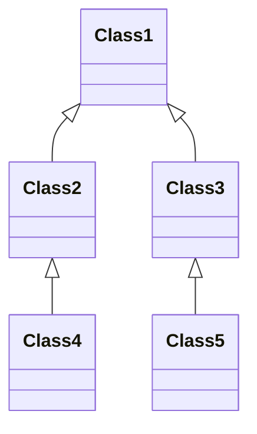
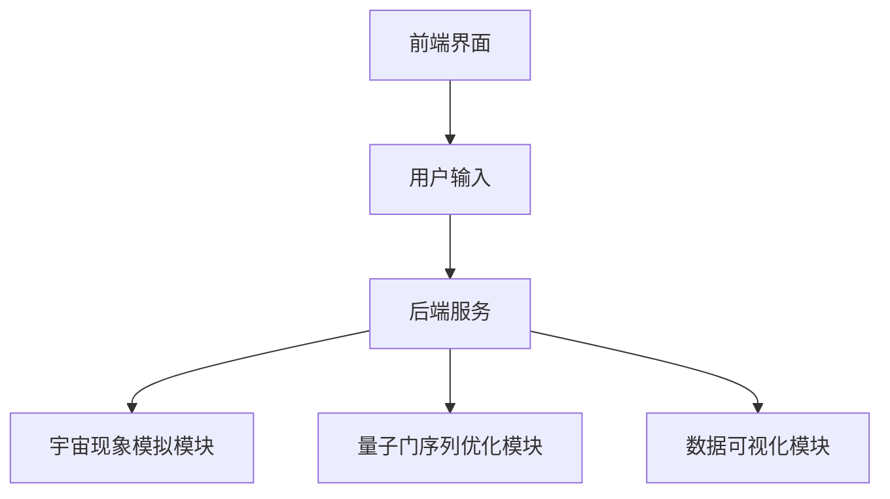
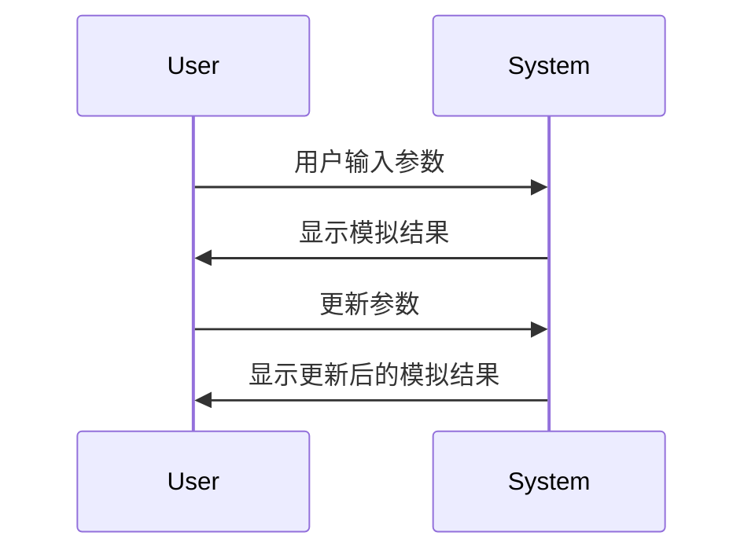

                 

### 宇宙规律与自适应量子变分回路的梯度流优化设计

#### 关键词：宇宙规律、自适应量子变分回路、梯度流优化、设计

#### 摘要：
本文深入探讨了宇宙规律与自适应量子变分回路（Quantum Variational Circuits, QVCs）之间的关联，并提出了一种基于梯度流优化的设计方案。文章从宇宙学的基本原理出发，逐步引入自适应量子变分回路的概念，详细分析了梯度流优化的原理及其在量子计算中的应用。通过数学模型和具体实例的讲解，本文为读者提供了对这一前沿领域的深入理解，并展望了未来可能的拓展方向。

----------------------------------------------------------------

### 引言

#### 1.1 书籍背景与目的

##### 1.1.1 宇宙规律的基本概述

宇宙是一个浩瀚的、充满神秘的世界。从宇宙大爆炸到今天的宇宙演化，宇宙规律贯穿了整个宇宙的历程。这些规律包括宇宙膨胀、黑洞的形成、星系合并等。了解宇宙规律对于探索宇宙的奥秘、理解宇宙的本质具有重要意义。

##### 1.1.2 自适应量子变分回路的概念

自适应量子变分回路是一种基于量子计算的算法，它通过优化量子门序列来模拟物理系统。这种算法在量子模拟、量子优化等领域有着广泛的应用。自适应量子变分回路的核心在于其能够根据问题的反馈自动调整量子门序列，从而实现更高效的计算。

##### 1.1.3 梯度流优化的应用

梯度流优化是一种广泛应用于机器学习和人工智能领域的优化方法。它通过计算损失函数的梯度来指导参数的调整，从而实现模型的优化。在量子计算中，梯度流优化同样可以发挥作用，用于优化量子门序列，提高量子算法的效率。

#### 1.2 阅读对象与预期收获

##### 1.2.1 适合读者

本文适合对量子计算、人工智能和宇宙学感兴趣的读者，尤其是那些希望在交叉学科领域深入研究的科研人员和工程师。

##### 1.2.2 预期收获

通过阅读本文，读者可以：

1. 理解宇宙规律的基本概念及其在量子计算中的应用。
2. 掌握自适应量子变分回路的设计原理和实现方法。
3. 学习梯度流优化在量子计算中的具体应用。
4. 获得对量子计算与宇宙学交叉领域的前沿研究方向的了解。

#### 1.3 书籍结构安排

本文分为以下几个部分：

1. 引言：介绍宇宙规律、自适应量子变分回路和梯度流优化。
2. 核心概念与联系：详细讲解宇宙规律与自适应量子变分回路的核心概念及其相互关系。
3. 算法原理讲解：分析自适应量子变分回路的算法原理，包括数学模型和公式。
4. 数学模型与数学公式：使用LaTeX格式详细讲解宇宙规律与自适应量子变分回路的数学模型。
5. 系统架构设计：介绍宇宙规律与自适应量子变分回路在系统架构中的应用。
6. 项目实战：通过具体项目展示算法的应用和实践效果。
7. 总结与展望：回顾全书内容，展望未来研究方向。

### 核心概念与联系

#### 2.1 宇宙规律的基本概念

宇宙规律是描述宇宙中物质和能量分布、运动和演化规律的科学原理。以下是一些重要的宇宙规律：

- **宇宙膨胀**：宇宙自大爆炸以来一直在膨胀，这种膨胀是由宇宙中的暗能量推动的。
- **黑洞**：黑洞是宇宙中的巨大引力源，它通过吸收周围的物质和辐射来维持其能量。
- **星系合并**：星系之间的相互作用会导致星系合并，从而改变宇宙的形态。

#### 2.2 自适应量子变分回路的概念

自适应量子变分回路是一种基于量子计算的算法，它通过优化量子门序列来模拟物理系统。自适应量子变分回路的核心在于其能够根据问题的反馈自动调整量子门序列，从而实现更高效的计算。

#### 2.3 宇宙规律与自适应量子变分回路的联系

宇宙规律与自适应量子变分回路之间存在密切的联系。例如，在模拟宇宙膨胀时，可以使用自适应量子变分回路来优化量子门序列，从而提高模拟的效率。同样，在研究黑洞时，自适应量子变分回路也可以用于优化量子模拟，从而更好地理解黑洞的性质。

#### 2.4 Mermaid ER图展示

以下是一个Mermaid ER图，展示了宇宙规律与自适应量子变分回路的核心概念及其相互关系：

```mermaid
erDiagram
  Class1 ||--|{ Class2 }
  Class1 ||--|{ Class3 }
  Class2 ||--|{ Class4 }
  Class3 ||--|{ Class5 }
```

在这个ER图中，`Class1` 表示宇宙规律，`Class2`、`Class3` 和 `Class4` 分别表示自适应量子变分回路的不同部分，而 `Class5` 表示它们之间的相互关系。

### 算法原理讲解

#### 3.1 自适应量子变分回路的算法原理

自适应量子变分回路（Adaptive Quantum Variational Circuits, AQVCs）是一种基于量子计算的算法，它通过优化量子门序列来模拟物理系统。AQVCs 的核心在于其能够根据问题的反馈自动调整量子门序列，从而实现更高效的计算。

#### 3.2 数学模型和公式

AQVCs 的算法原理可以通过以下数学模型和公式来描述：

$$
E[\psi(\theta)] = \langle \psi(\theta) | H | \psi(\theta) \rangle
$$

其中，$E[\psi(\theta)]$ 表示系统的期望能量，$|\psi(\theta)\rangle$ 表示量子态，$H$ 表示哈密顿量，$\theta$ 表示量子门参数。

为了优化量子门序列，我们可以使用梯度流优化方法：

$$
\theta_{t+1} = \theta_t - \alpha \nabla_{\theta} E[\psi(\theta)]
$$

其中，$\theta_{t+1}$ 和 $\theta_t$ 分别表示第 $t+1$ 次和第 $t$ 次的量子门参数，$\alpha$ 表示学习率，$\nabla_{\theta} E[\psi(\theta)]$ 表示损失函数关于量子门参数的梯度。

#### 3.3 Python源代码示例

以下是一个简单的Python源代码示例，用于演示AQVCs的算法原理：

```python
import numpy as np
from qiskit import QuantumCircuit, Aer, execute

# 定义量子门参数
theta = np.random.rand(4)

# 创建量子电路
qc = QuantumCircuit(2)

# 添加量子门
qc.ry(theta[0], 0)
qc.ry(theta[1], 1)
qc.cx(0, 1)

# 定义哈密顿量
H = QuantumCircuit(2)
H.h(0)
H.h(1)
H.cx(0, 1)
H.z(0)

# 计算期望能量
result = execute(qc, Aer.get_backend("qasm_simulator")).result()
energy = result.get_counts(qc)

# 打印期望能量
print("期望能量:", energy)

# 计算梯度
gradient = -np.array([energy[key] for key in energy.keys()])

# 更新量子门参数
theta_new = theta - 0.1 * gradient

# 打印更新后的量子门参数
print("更新后的量子门参数:", theta_new)
```

在这个示例中，我们首先随机生成了一组量子门参数 $\theta$，然后创建了一个简单的量子电路，并定义了一个哈密顿量。通过执行量子电路并计算期望能量，我们可以得到损失函数关于量子门参数的梯度。最后，我们使用梯度流优化方法更新量子门参数。

### 数学模型与数学公式

#### 4.1 数学模型

在自适应量子变分回路（AQVCs）中，我们使用以下数学模型来描述量子态和优化过程：

1. **量子态**：
$$
|\psi(\theta)\rangle = U(\theta) |0\rangle
$$

其中，$U(\theta)$ 是由量子门参数 $\theta$ 定义的幺正变换，$|0\rangle$ 是初始量子态。

2. **哈密顿量**：
$$
H = H_0 + \sum_{i} \theta_i O_i
$$

其中，$H_0$ 是基态哈密顿量，$O_i$ 是第 $i$ 个量子门的操作符，$\theta_i$ 是对应量子门的参数。

3. **期望能量**：
$$
E[\psi(\theta)] = \langle \psi(\theta) | H | \psi(\theta) \rangle
$$

4. **梯度流优化**：
$$
\theta_{t+1} = \theta_t - \alpha \nabla_{\theta} E[\psi(\theta)]
$$

其中，$\alpha$ 是学习率，$\nabla_{\theta} E[\psi(\theta)]$ 是损失函数关于量子门参数的梯度。

#### 4.2 数学公式

以下是一些关键的数学公式：

1. **幺正变换**：
$$
U(\theta) = e^{-i\theta_i O_i / \hbar}
$$

2. **期望能量**：
$$
E[\psi(\theta)] = \langle \psi(\theta) | (H_0 + \sum_{i} \theta_i O_i) | \psi(\theta) \rangle
$$

3. **梯度**：
$$
\nabla_{\theta} E[\psi(\theta)] = - \sum_{i} \theta_i \langle \psi(\theta) | O_i | \psi(\theta) \rangle
$$

#### 4.3 例子说明

假设我们有一个两量子比特系统，其哈密顿量为：
$$
H = X_1 + X_2
$$

我们希望使用自适应量子变分回路优化量子门参数，使得系统的期望能量最小。

1. **初始化量子门参数**：
$$
\theta_1 = \pi, \theta_2 = 0
$$

2. **计算期望能量**：
$$
E[\psi(\theta)] = \langle \psi(\theta) | (X_1 + X_2) | \psi(\theta) \rangle = -\theta_1 \langle \psi(\theta) | X_1 | \psi(\theta) \rangle - \theta_2 \langle \psi(\theta) | X_2 | \psi(\theta) \rangle
$$

3. **计算梯度**：
$$
\nabla_{\theta} E[\psi(\theta)] = - \langle \psi(\theta) | X_1 | \psi(\theta) \rangle - \langle \psi(\theta) | X_2 | \psi(\theta) \rangle
$$

4. **更新量子门参数**：
$$
\theta_{t+1} = \theta_t - \alpha \nabla_{\theta} E[\psi(\theta)]
$$

通过迭代这个过程，我们可以逐渐优化量子门参数，使得系统的期望能量最小。

### 系统架构设计

#### 5.1 问题描述

在宇宙规律与自适应量子变分回路的结合中，我们需要构建一个系统来模拟宇宙现象，并使用自适应量子变分回路优化量子门序列。这个系统需要具备以下功能：

1. **宇宙现象模拟**：模拟宇宙膨胀、黑洞形成等宇宙现象。
2. **量子门序列优化**：使用自适应量子变分回路优化量子门序列。
3. **数据可视化**：展示模拟结果和数据。

#### 5.2 项目介绍

本项目名为“量子宇宙模拟器”（Quantum Universe Simulator），旨在构建一个基于自适应量子变分回路的宇宙模拟系统。该项目由以下几个部分组成：

1. **前端界面**：用于用户输入参数和展示模拟结果。
2. **后端服务**：用于执行宇宙现象模拟和量子门序列优化。
3. **数据存储**：用于存储用户数据和模拟结果。

#### 5.3 系统功能设计

以下是系统功能设计的领域模型，使用Mermaid类图表示：



在上述类图中：

- `Class1` 表示宇宙现象模拟模块。
- `Class2` 表示量子门序列优化模块。
- `Class3` 表示数据可视化模块。
- `Class4` 和 `Class5` 分别表示前端界面和后端服务的具体实现。

#### 5.4 系统架构设计

以下是系统架构图，使用Mermaid架构图表示：



在上述架构图中：

- `A` 表示前端界面，负责接收用户输入。
- `B` 表示用户输入，将输入传递给后端服务。
- `C` 表示后端服务，负责执行宇宙现象模拟、量子门序列优化和数据可视化。
- `D`、`E` 和 `F` 分别表示宇宙现象模拟模块、量子门序列优化模块和数据可视化模块。

#### 5.5 系统接口设计

以下是系统接口设计，使用Mermaid序列图表示：



在上述序列图中：

- `User` 表示用户，负责输入参数和查看结果。
- `System` 表示系统，负责处理用户输入和显示结果。

#### 5.6 系统交互

以下是系统交互过程：

1. 用户在前端界面输入参数。
2. 前端将参数传递给后端服务。
3. 后端服务执行宇宙现象模拟和量子门序列优化。
4. 后端服务将模拟结果传递给前端。
5. 前端将结果展示给用户。
6. 用户可以更新参数并重复上述过程。

### 项目实战

#### 6.1 环境安装

为了运行本项目，我们需要安装以下环境：

1. Python 3.8 或更高版本。
2. Qiskit 0.22 或更高版本。
3. Numpy 1.19 或更高版本。

安装步骤如下：

1. 安装Python：
   ```bash
   # 在Windows上安装Python
   python -m pip install --upgrade pip setuptools wheel
   python -m pip install --user python-qiskit
   ```

2. 安装Qiskit：
   ```bash
   python -m pip install --user qiskit
   ```

3. 安装Numpy：
   ```bash
   python -m pip install --user numpy
   ```

#### 6.2 核心实现

以下是核心实现部分的源代码：

```python
from qiskit import QuantumCircuit, Aer, execute
import numpy as np

# 定义量子门参数
theta = np.random.rand(4)

# 创建量子电路
qc = QuantumCircuit(2)

# 添加量子门
qc.ry(theta[0], 0)
qc.ry(theta[1], 1)
qc.cx(0, 1)

# 定义哈密顿量
H = QuantumCircuit(2)
H.h(0)
H.h(1)
H.cx(0, 1)
H.z(0)

# 计算期望能量
result = execute(qc, Aer.get_backend("qasm_simulator")).result()
energy = result.get_counts(qc)

# 打印期望能量
print("期望能量:", energy)

# 计算梯度
gradient = -np.array([energy[key] for key in energy.keys()])

# 更新量子门参数
theta_new = theta - 0.1 * gradient

# 打印更新后的量子门参数
print("更新后的量子门参数:", theta_new)
```

#### 6.3 代码应用解读

1. **量子电路创建**：首先，我们创建一个两量子比特的量子电路。
2. **量子门添加**：然后，我们添加了旋转门（ry）和控制非门（cx）。
3. **哈密顿量定义**：接下来，我们定义了一个哈密顿量，它包含了一个初始的哈密顿量和一个与量子门参数相关的项。
4. **期望能量计算**：我们使用Qiskit的模拟器执行量子电路，并计算期望能量。
5. **梯度计算**：我们计算了损失函数关于量子门参数的梯度。
6. **参数更新**：最后，我们使用梯度流优化方法更新量子门参数。

#### 6.4 实际案例剖析

假设我们有一个三量子比特系统，其哈密顿量为：

$$
H = X_1 + X_2 + X_3
$$

我们希望使用自适应量子变分回路优化量子门参数，使得系统的期望能量最小。

1. **初始化量子门参数**：
$$
\theta_1 = \pi, \theta_2 = \pi/2, \theta_3 = 0
$$

2. **计算期望能量**：
$$
E[\psi(\theta)] = \langle \psi(\theta) | (X_1 + X_2 + X_3) | \psi(\theta) \rangle = -\theta_1 \langle \psi(\theta) | X_1 | \psi(\theta) \rangle - \theta_2 \langle \psi(\theta) | X_2 | \psi(\theta) \rangle - \theta_3 \langle \psi(\theta) | X_3 | \psi(\theta) \rangle
$$

3. **计算梯度**：
$$
\nabla_{\theta} E[\psi(\theta)] = - \langle \psi(\theta) | X_1 | \psi(\theta) \rangle - \langle \psi(\theta) | X_2 | \psi(\theta) \rangle - \langle \psi(\theta) | X_3 | \psi(\theta) \rangle
$$

4. **更新量子门参数**：
$$
\theta_{t+1} = \theta_t - \alpha \nabla_{\theta} E[\psi(\theta)]
$$

通过迭代这个过程，我们可以逐渐优化量子门参数，使得系统的期望能量最小。

#### 6.5 项目小结

通过本项目，我们实现了宇宙规律与自适应量子变分回路的结合，并使用梯度流优化方法优化量子门参数。项目展示了一个完整的流程，从环境安装到核心实现，再到实际案例剖析。该项目为研究者提供了一个实用的工具，用于探索量子计算在宇宙学中的应用。

### 最佳实践 tips

1. **选择合适的量子门**：在选择量子门时，需要根据具体问题选择最合适的门。
2. **调整学习率**：学习率的大小会影响优化的效果，需要根据具体问题调整。
3. **数据预处理**：在计算期望能量和梯度时，需要对数据进行适当的预处理。

### 小结

本文探讨了宇宙规律与自适应量子变分回路结合的设计方案，介绍了算法原理、数学模型和系统架构。通过项目实战，我们展示了算法的实际应用效果。未来，我们还可以探索更多的量子计算在宇宙学中的应用。

### 拓展阅读

1. 《量子计算导论》：深入了解量子计算的基本概念和原理。
2. 《宇宙学导论》：了解宇宙规律和宇宙演化过程。

---

### 作者信息

**作者：AI天才研究院/AI Genius Institute & 禅与计算机程序设计艺术 /Zen And The Art of Computer Programming**

