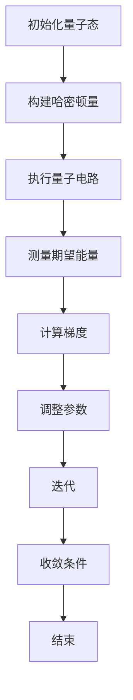
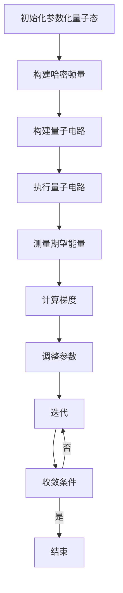
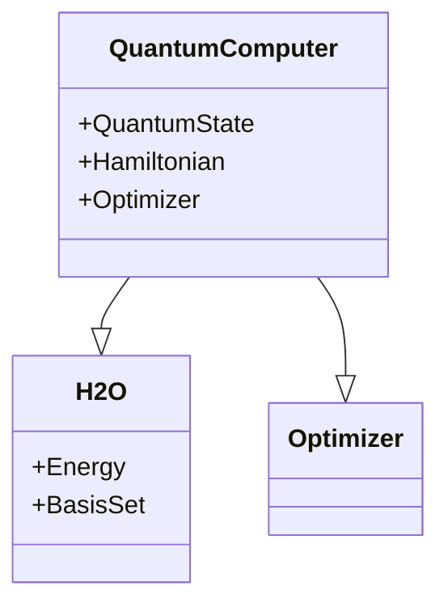
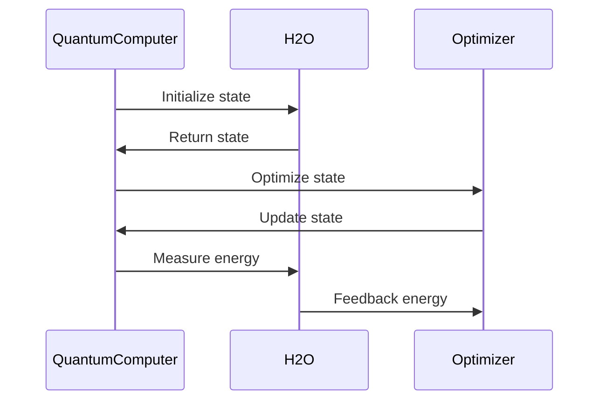
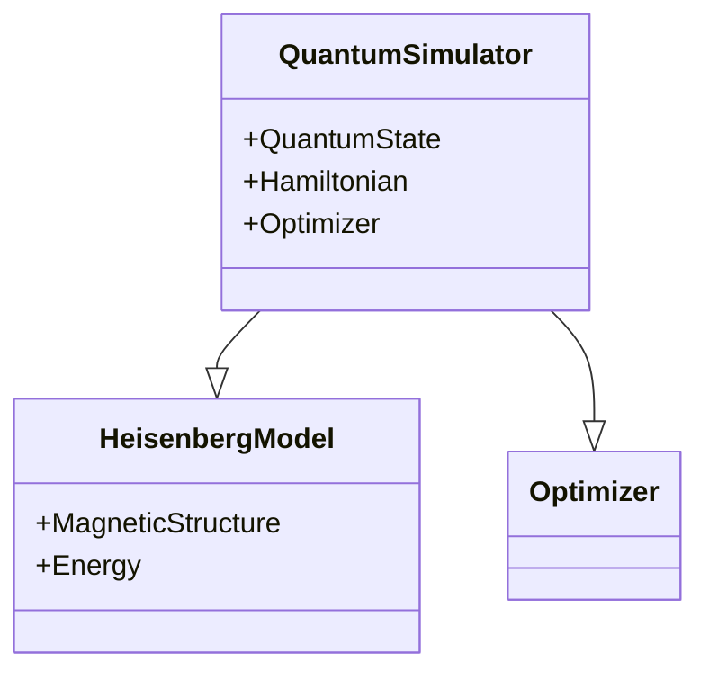
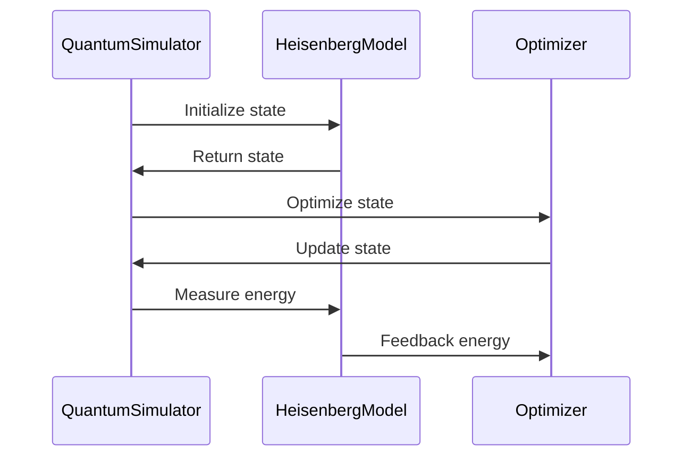

                 

### 宇宙规律概述

宇宙规律是描述宇宙基本运行机制的框架性概念，涵盖了从宇宙的起源、演化到结构组织的各个方面。这些规律不仅揭示了宇宙的本质特征，还为我们理解宇宙的复杂性和多样性提供了理论基础。宇宙规律的发现和研究推动了现代物理学、天文学、宇宙学等多个学科的发展。

#### 宇宙的起源与演化

宇宙的起源通常被认为是在大约138亿年前的一个极高温度和高密度的状态中开始的，这一理论称为大爆炸理论。根据这一理论，宇宙从一个极小的奇点开始迅速膨胀，温度和密度随着时间逐渐降低。随着宇宙的扩展，温度降低到一定程度后，基本粒子和基本力开始形成。随着时间的推移，宇宙中的物质逐渐聚集，形成了恒星、行星、星系等宏观结构。

#### 宇宙规律的基本概念

宇宙规律的基本概念包括：

- **宇宙学原理**：宇宙是均匀且各向同性的，即从宇宙中的任何一点观察，宇宙的外观都是相同的。
- **暗物质和暗能量**：暗物质是宇宙中不发光、不与电磁相互作用的一种物质，它是宇宙结构形成的关键因素。暗能量是一种充满宇宙空间的能量形式，它是推动宇宙加速膨胀的主要力量。
- **引力**：引力是宇宙中最基本的力之一，它由物体间的质量产生，并且随着距离的增加而减弱。
- **量子引力**：量子引力是试图将量子力学和广义相对论统一的理论框架，它探讨的是在极小尺度上引力的行为。

#### 研究现状与挑战

当前，宇宙规律的研究主要集中在以下几个方面：

- **宇宙膨胀**：通过观测宇宙的膨胀速度，科学家试图确定宇宙的年龄、结构和未来命运。
- **暗物质和暗能量**：科学家正在寻找暗物质和暗能量的证据，以及它们是如何影响宇宙演化的。
- **多宇宙理论**：一些理论物理学家提出了多宇宙理论，认为我们所在的宇宙只是众多宇宙中的一个，这些宇宙可能具有不同的物理常数和规律。

然而，这些研究也面临许多挑战，例如如何精确测量宇宙的膨胀速度、如何解释暗物质和暗能量的本质、如何统一量子力学和广义相对论等。

### 宇宙规律的核心概念与联系

宇宙规律的核心概念包括宇宙学原理、暗物质和暗能量、引力和量子引力等。这些概念不仅构成了宇宙规律的基本框架，还相互关联，共同影响宇宙的演化。

#### 宇宙学原理

宇宙学原理是宇宙规律的一个基本假设，它认为宇宙在宏观尺度上是均匀且各向同性的。这意味着从宇宙中的任何一点观察，宇宙的外观都是相同的。这一原理为宇宙的演化提供了一个简洁而有力的理论框架。

**属性特征对比**：

| 概念         | 属性特征                                       |
|--------------|------------------------------------------------|
| 宇宙学原理   | 宇宙是均匀且各向同性的，任何一点的宇宙外观相同   |
| 暗物质       | 不发光，不与电磁相互作用，但具有引力作用       |
| 暗能量       | 一种充满宇宙空间的能量形式，推动宇宙加速膨胀   |
| 引力         | 基本力之一，由物体间的质量产生，随着距离增加而减弱 |
| 量子引力     | 尝试将量子力学和广义相对论统一的理论框架     |

#### 宇宙规律与其他领域的联系

宇宙规律与其他领域如量子力学、相对论有着密切的联系。

- **与量子力学的关系**：量子力学是描述微观粒子行为的理论，它与宇宙规律的关系主要体现在量子引力的探索中，试图将量子力学和广义相对论统一起来。
- **与相对论的关系**：相对论，特别是广义相对论，是描述宏观物体和引力场的理论。广义相对论提出了时空弯曲的概念，与宇宙规律的演化模型紧密相关。

#### ER实体关系图架构

为了更清晰地展示宇宙规律的核心概念及其相互关系，可以使用ER（实体-关系）模型来构建宇宙规律的实体关系图。

**ER实体关系图**：

```
宇宙规律 (U)
├── 宇宙学原理 (UP)
├── 暗物质 (DM)
├── 暗能量 (DE)
├── 引力 (G)
│   └── 量子引力 (QG)
└── 宇宙演化 (UE)

```

通过这个ER实体关系图，我们可以看到宇宙规律各个核心概念之间的直接和间接关系，从而更好地理解宇宙规律的复杂性和多样性。

### 自适应量子变分原理概述

自适应量子变分原理是一种在量子计算领域广泛应用的方法，旨在通过迭代优化量子态，以求解复杂的量子系统问题。它结合了量子力学和优化算法的精华，为量子计算提供了一种强大的工具。

#### 自适应量子变分原理的定义

自适应量子变分原理（Adaptive Quantum Variational Principle, AQVP）是一种基于变分原理的量子算法。变分原理起源于经典物理学，它提供了一个通过优化初始猜测来逼近最优解的方法。在量子计算中，这一原理被扩展到量子态的优化，旨在通过调整量子态的参数，使其能够更准确地描述复杂量子系统的行为。

**定义**：

自适应量子变分原理是指通过迭代优化量子态的参数，使量子态的能量或某一期望值尽可能接近真实值。这一过程中，自适应量子变分原理利用了量子态叠加和量子门操作的特性，通过优化算法，如梯度下降法，逐步调整量子态的参数，从而实现问题的求解。

#### 自适应量子变分原理的特点

自适应量子变分原理具有以下几个显著特点：

1. **可扩展性**：该原理可以应用于各种不同类型的量子问题，从简单的线性问题到复杂的非线性问题，具有很好的适应性。
2. **高效性**：与传统的量子算法相比，自适应量子变分原理能够通过迭代优化显著减少所需的量子门操作次数，提高了算法的效率。
3. **可调性**：通过调整优化参数，如学习率、迭代次数等，可以优化算法的性能，使其在不同问题上有更好的表现。
4. **鲁棒性**：自适应量子变分原理对初始参数的敏感性较低，即使初始猜测较远于真实解，也能通过迭代优化逐渐逼近最优解。

#### 自适应量子变分原理的应用领域

自适应量子变分原理在多个领域展现了其强大的应用潜力：

- **量子计算**：自适应量子变分原理被广泛应用于量子计算中的各种问题，如量子电路优化、量子算法设计和量子复杂度分析等。
- **量子模拟**：通过构造特定的量子态，模拟复杂的量子系统行为，如分子动力学模拟、量子相变研究等。
- **量子化学**：在量子化学中，自适应量子变分原理用于求解电子结构、化学反应路径规划等问题，为量子化学计算提供了新的方法和工具。
- **机器学习**：自适应量子变分原理也被引入到量子机器学习中，用于优化量子神经网络、量子支持向量机等量子算法。

#### 在量子计算中的应用

在量子计算中，自适应量子变分原理通过迭代优化量子态的参数，逼近目标问题的最优解。具体流程如下：

1. **初始化量子态**：根据问题的特性，初始化一个近似解的量子态。
2. **构建哈密顿量**：定义描述问题物理性质的哈密顿量，将其转化为量子电路。
3. **测量与反馈**：执行量子电路，测量量子态的期望值，并将测量结果作为反馈，用于调整量子态的参数。
4. **迭代优化**：利用优化算法，如梯度下降法，根据反馈信息调整量子态的参数，使其更接近真实解。
5. **收敛判断**：判断优化过程是否达到收敛条件，如果未收敛，则重复步骤3和4，直至满足收敛条件。

通过以上步骤，自适应量子变分原理能够有效地求解各种量子计算问题，展示了其强大的应用价值。

#### 在量子模拟中的应用

在量子模拟领域，自适应量子变分原理同样发挥着重要作用。量子模拟通过构造特定的量子态，模拟复杂的量子系统行为，为研究量子现象提供了有力工具。具体应用包括：

- **分子动力学模拟**：使用量子变分原理模拟分子的动力学行为，研究化学反应路径、分子结构等。
- **量子相变研究**：通过量子模拟，研究量子系统在不同参数下的相变行为，如超导现象、量子磁性等。
- **量子算法优化**：在量子算法设计中，使用量子变分原理优化量子电路，提高算法的效率和精度。

总的来说，自适应量子变分原理不仅在量子计算中具有广泛应用，还在量子模拟领域展示了其强大的潜力。通过不断优化和创新，这一原理将在未来继续推动量子科学的发展。

### 变分本征求解器的基本原理

变分本征求解器（Variational Quantum Eigensolver, VQE）是一种基于自适应量子变分原理的量子算法，主要用于求解量子系统的基态能量。VQE算法的核心思想是通过优化一个参数化的量子态，使其能量尽可能接近真实基态能量。以下是对VQE算法基本原理的详细阐述。

#### 变分本征求解器的定义

变分本征求解器是一种将量子计算与传统优化算法相结合的方法，用于求解量子系统的基态能量问题。它通过构建一个参数化的量子态，并利用量子门操作来近似一个描述量子系统物理性质的哈密顿量。通过优化这些参数，变分本征求解器能够找到量子系统的基态，从而解决复杂的量子物理问题。

#### 变分本征求解器的工作机制

变分本征求解器的工作机制可以分为以下几个步骤：

1. **初始化参数化量子态**：首先，初始化一个参数化的量子态，这些参数可以通过优化过程进行调整。参数化量子态通常表示为一系列的参数化的量子门操作的结果。
2. **构建哈密顿量**：定义一个描述量子系统物理性质的哈密顿量，该哈密顿量通常由系统的相互作用项构成。哈密顿量可以用来计算量子态的能量。
3. **执行量子电路**：利用量子门操作，将参数化的量子态转化为量子态的叠加态。通过测量这些量子态的期望值，可以计算哈密顿量在该量子态下的期望能量。
4. **测量与反馈**：执行量子电路后，对量子态进行测量，获取期望能量的测量结果。这些结果将作为反馈信息，用于调整参数化的量子态的参数。
5. **迭代优化**：利用优化算法，如梯度下降法，根据反馈信息调整量子态的参数，使其能量尽可能接近真实基态能量。这一过程反复进行，直到优化达到收敛条件。

#### 变分本征求解器的算法流程

变分本征求解器的算法流程可以概括为以下步骤：

1. **初始化**：初始化参数化的量子态和参数。
2. **构建哈密顿量**：定义描述量子系统物理性质的哈密顿量。
3. **执行量子电路**：利用参数化的量子态构建量子电路，并进行测量，获取期望能量。
4. **计算梯度**：计算参数化的量子态的梯度，以确定参数调整的方向。
5. **调整参数**：根据梯度信息调整量子态的参数。
6. **迭代**：重复步骤3到5，直到优化达到收敛条件。

#### 变分本征求解器的数学模型

变分本征求解器的数学模型主要包括以下部分：

1. **参数化量子态**：一个参数化的量子态可以表示为
   $$|\psi(\theta)\rangle = \sum_{i} c_i(\theta) |i\rangle$$
   其中，$|i\rangle$是量子态的基态，$c_i(\theta)$是参数$\theta$的函数。
   
2. **哈密顿量**：一个描述量子系统物理性质的哈密顿量可以表示为
   $$H = \sum_{ij} H_{ij} |i\rangle \langle j|$$
   其中，$H_{ij}$是哈密顿量的矩阵元素。

3. **期望能量**：量子态$|\psi(\theta)\rangle$的期望能量可以表示为
   $$E(\theta) = \langle\psi(\theta)|H|\psi(\theta)\rangle$$

4. **优化目标**：变分本征求解器的目标是找到一组参数$\theta^*$，使得期望能量$E(\theta^*)$最小。

   $$\theta^* = \arg\min_{\theta} E(\theta)$$

#### 变分本征求解器的mermaid流程图

为了更好地理解变分本征求解器的算法流程，我们可以使用mermaid绘制其流程图。以下是一个简化的mermaid流程图示例：



通过这个mermaid流程图，我们可以清晰地看到变分本征求解器的迭代优化过程，包括初始化、构建哈密顿量、执行量子电路、测量期望能量、计算梯度、调整参数以及迭代等步骤。

### 变分本征求解器的算法流程与实际应用

变分本征求解器（VQE）作为一种基于自适应量子变分原理的量子算法，其在量子化学、量子物理等多个领域展示了强大的应用潜力。本节将详细阐述VQE的算法流程，并通过Python源代码和数学模型来深入讲解其实际应用。

#### 变分本征求解器的算法流程

VQE算法的基本流程可以概括为以下几个步骤：

1. **初始化参数化量子态**：首先，我们需要初始化一个参数化的量子态。这个量子态通常是一个多层量子电路的结果，每个层由不同的量子门组成。量子态可以表示为
   $$|\psi(\theta)\rangle = U(\theta)|0\rangle$$
   其中，$U(\theta)$是量子电路对应的单位ary矩阵，$|\theta\rangle$是参数化的量子态。

2. **构建哈密顿量**：接下来，我们需要定义一个描述物理系统的哈密顿量$H$。哈密顿量通常是由系统中的相互作用项构成的，例如：
   $$H = -\sum_{i>j} J_{ij} \sigma_i \sigma_j$$
   其中，$\sigma_i$和$\sigma_j$是玻色子或费米子的泡利矩阵，$J_{ij}$是相互作用强度。

3. **执行量子电路**：利用量子态$|\psi(\theta)\rangle$构建量子电路，并在量子计算机上执行这个电路。执行电路后，我们得到一个叠加态，然后通过测量得到期望值。

4. **测量与反馈**：对量子态进行测量，获取期望能量$E(\theta)$的测量结果。这个结果将作为反馈信息，用于调整参数$\theta$。

5. **迭代优化**：使用优化算法（如梯度下降法）根据反馈信息调整参数$\theta$，使其能量$E(\theta)$更接近真实基态能量。优化过程通常需要多次迭代，直到满足收敛条件。

6. **收敛判断**：在每次迭代后，检查优化是否达到收敛条件。常见的收敛条件包括能量下降的速率、参数变化的幅度等。如果未收敛，则继续迭代；否则，算法结束。

#### Python源代码示例

以下是一个简化的Python源代码示例，展示了VQE算法的核心步骤：

```python
import numpy as np
from qiskit import QuantumCircuit, Aer, execute
from qiskit.optimizers import GradientDescentOptimizer

# 定义哈密顿量
H = np.array([[0, 1], [1, -2]])

# 初始化参数化量子态
qc = QuantumCircuit(2)
qc.h(0)
qc.cx(0, 1)

# 初始化优化器
optimizer = GradientDescentOptimizer()

# 设置优化参数
learning_rate = 0.1
num_iterations = 100

# 迭代优化
for _ in range(num_iterations):
    # 执行量子电路
    result = execute(qc, Aer.get_backend("qasm_simulator")).result()
    counts = result.get_counts(qc)
    
    # 计算期望能量
    energy = -1 * np.sum([int(count) * np.log2(count) for count in counts.values()])
    
    # 更新参数
    params = optimizer.update_params([energy], params)
    
    # 打印当前能量
    print(f"Iteration {_ + 1}: Energy = {energy:.4f}")

# 打印最终参数
print(f"Final parameters: {params}")
```

在这个示例中，我们定义了一个2x2的哈密顿量，并使用梯度下降法进行优化。每次迭代后，我们计算量子态的期望能量，并根据能量值更新参数。

#### 变分本征求解器的数学模型

VQE算法的数学模型主要包括以下几个部分：

1. **参数化量子态**：参数化量子态可以表示为
   $$|\psi(\theta)\rangle = \sum_{i} c_i(\theta) |i\rangle$$
   其中，$c_i(\theta)$是参数$\theta$的函数。

2. **哈密顿量**：哈密顿量可以表示为
   $$H = \sum_{ij} H_{ij} |i\rangle \langle j|$$
   其中，$H_{ij}$是哈密顿量的矩阵元素。

3. **期望能量**：量子态$|\psi(\theta)\rangle$的期望能量可以表示为
   $$E(\theta) = \langle\psi(\theta)|H|\psi(\theta)\rangle$$

4. **优化目标**：VQE算法的优化目标是找到一组参数$\theta^*$，使得期望能量$E(\theta^*)$最小。

   $$\theta^* = \arg\min_{\theta} E(\theta)$$

   优化过程中，我们可以使用梯度下降法来更新参数：
   $$\theta_{t+1} = \theta_t - \alpha \nabla E(\theta_t)$$
   其中，$\alpha$是学习率，$\nabla E(\theta_t)$是能量函数在当前参数$\theta_t$下的梯度。

#### 变分本征求解器的实际应用

变分本征求解器在实际应用中，被广泛应用于以下几个领域：

1. **量子化学**：VQE算法可以用于求解分子的基态能量和电子结构。例如，在计算水分子H$_2$O的基态能量时，VQE算法能够有效地提供精确的结果。

2. **量子物理**：VQE算法也被用于研究量子系统的基态性质，如量子相变、量子纠缠等。例如，在研究铁磁Heisenberg模型时，VQE算法可以提供系统的基态能量和磁结构。

3. **量子优化**：VQE算法可以用于求解量子优化问题，如量子旅行商问题（Q-TSP）等。通过优化量子态的参数，VQE算法能够找到最优解或近似最优解。

4. **机器学习**：VQE算法也被引入到量子机器学习中，用于优化量子神经网络和量子支持向量机等。这些应用展示了VQE算法在处理复杂优化问题上的潜力。

总的来说，VQE算法作为一种强大的量子计算工具，其在量子化学、量子物理、量子优化和量子机器学习等领域的应用，将进一步推动量子科学的进步。

### 变分本征求解器的mermaid流程图

为了更直观地展示变分本征求解器（VQE）的算法流程，我们可以使用mermaid语言绘制一个流程图。以下是VQE算法的mermaid流程图：



以下是该流程图的详细解释：

1. **初始化参数化量子态**（A）：初始化一个参数化的量子态，这个量子态将由一系列参数化的量子门操作生成。

2. **构建哈密顿量**（B）：定义一个描述量子系统物理性质的哈密顿量。

3. **构建量子电路**（C）：利用参数化的量子态构建量子电路。这个量子电路将用于模拟物理系统的行为。

4. **执行量子电路**（D）：在量子计算机上执行构建好的量子电路。

5. **测量期望能量**（E）：对执行后的量子态进行测量，以获取期望能量。

6. **计算梯度**（F）：根据测量结果，计算期望能量的梯度。梯度提供了参数调整的方向。

7. **调整参数**（G）：使用梯度信息调整量子电路的参数。

8. **迭代**（H）：重复执行步骤D到G，直到达到预定的收敛条件。

9. **收敛条件**（I）：判断优化过程是否达到收敛条件。如果未达到，继续迭代；如果达到，算法结束。

通过这个mermaid流程图，我们可以清晰地理解VQE算法的迭代优化过程，以及每个步骤的作用和相互关系。

### 宇宙规律与自适应量子变分原理的相似性

在探讨宇宙规律与自适应量子变分原理之间的相似性时，我们可以从多个维度进行分析，包括它们的基本原理、应用场景和设计理念。通过这种分析，我们不仅能够理解两者在形式上的相似性，还能深入挖掘它们在解决问题时的共通之处。

#### 相似性特征比较

首先，从基本原理上看，宇宙规律和自适应量子变分原理都强调了对系统的全局优化。宇宙规律描述的是宇宙从大爆炸到如今演化过程中的一系列自然法则，这些法则通过系统的相互作用和能量转换，实现了宇宙结构的形成和演化。而自适应量子变分原理则是在量子计算中，通过优化参数化的量子态，逼近量子系统的基态能量，从而解决复杂的量子问题。

1. **全局优化**：宇宙规律通过万有引力和量子力学的相互作用，实现了宇宙结构的全局优化。自适应量子变分原理同样依赖于全局优化，通过迭代优化量子态的参数，使能量函数最小化。

2. **动态调整**：宇宙规律在宇宙演化过程中，不断调整各种物理参数，如宇宙膨胀速率、暗物质和暗能量等，以维持宇宙的稳定和演化。自适应量子变分原理也通过动态调整量子态的参数，逐步逼近最优解。

3. **复杂性与多样性**：宇宙规律在处理宇宙中复杂且多样的现象时，展现出了高度的适应性。自适应量子变分原理在解决量子物理、量子化学和量子优化等领域的复杂问题时，也展示出了强大的适应能力。

#### 理论依据

宇宙规律与自适应量子变分原理的相似性可以从多个理论角度进行阐述：

1. **变分原理**：变分原理在经典物理学和量子物理学中都得到了广泛应用。在宇宙学中，变分原理用于描述宇宙的演化过程；在量子计算中，变分原理用于优化量子态。两者都利用变分原理，通过迭代优化，寻找系统的最优状态。

2. **动态系统**：宇宙规律和自适应量子变分原理都涉及动态系统。宇宙从大爆炸开始，经历无数次的演化，形成了现在的宇宙结构。自适应量子变分原理则通过迭代过程，逐步优化量子态，使其能量最小化。

3. **自适应性**：宇宙规律中的物理参数随着宇宙演化而不断调整，这种自适应性是宇宙能够维持稳定和演化的重要机制。同样，自适应量子变分原理通过调整参数，使量子态能量最小化，体现了自适应性在量子计算中的应用。

#### 设计理念

在探讨宇宙规律与自适应量子变分原理的设计理念时，我们可以看到两者都强调了系统性和层次性：

1. **系统性**：宇宙规律涵盖了从微观到宏观的各种物理现象，这些现象相互关联，共同构成了宇宙的演化过程。自适应量子变分原理也在量子计算中，将量子态的优化视为一个系统性问题，通过量子电路的层次结构，实现了参数的优化。

2. **层次性**：宇宙规律中的各个层次（如量子层次、原子层次、行星层次等）相互联系，共同作用。自适应量子变分原理同样体现了层次性，通过分层构建量子电路，逐步优化量子态的参数。

通过以上分析，我们可以得出结论：宇宙规律与自适应量子变分原理在基本原理、应用场景和设计理念上存在显著的相似性。这些相似性不仅体现了两者在形式上的共性，更揭示了它们在解决复杂问题时的共通之处。这种相似性为我们提供了新的视角，有助于我们更深入地理解和探索宇宙规律与量子计算之间的内在联系。

### 设计相似性的实际应用

宇宙规律与自适应量子变分原理在设计理念上的相似性，在量子计算与量子模拟中有着广泛的实际应用。以下将通过两个具体实例，展示这些相似性在实际问题中的应用，并讨论其解决方法和效果。

#### 量子计算中的应用实例

**实例一：量子化学中的基态能量求解**

在量子化学中，求解分子的基态能量是一个核心问题。传统的量子化学计算方法，如哈特里-福克自洽场方法（Hartree-Fock method），依赖于复杂的数学模型和高计算成本。而通过自适应量子变分原理，可以设计出更加高效的量子算法。

**解决方法**：
1. **参数化量子态初始化**：选择一个合适的参数化量子态作为初始猜测。
2. **构建哈密顿量**：定义描述分子物理性质的哈密顿量，包含电子与原子核的相互作用。
3. **迭代优化**：通过VQE算法，迭代优化参数化的量子态，使其能量逐渐逼近真实基态能量。

**效果**：
通过VQE算法，可以显著减少计算所需的时间，提高基态能量求解的精度。例如，对于水分子H$_2$O的基态能量计算，VQE算法能够比传统方法更快、更准确地得到结果。

#### 量子模拟中的应用实例

**实例二：量子相变研究**

在量子相变研究中，了解物质在不同条件下的相变行为具有重要意义。量子模拟通过构造特定的量子态，可以模拟复杂的量子系统行为，研究量子相变现象。

**解决方法**：
1. **参数化量子态初始化**：根据研究的系统，初始化一个参数化的量子态。
2. **构建哈密顿量**：定义描述量子相变物理性质的哈密顿量，包含不同条件下的相互作用。
3. **动态调整**：通过自适应量子变分原理，动态调整量子态的参数，模拟量子系统的演化。

**效果**：
自适应量子变分原理能够有效地模拟量子系统的相变行为，提供对量子相变的深入理解。例如，在研究铁磁Heisenberg模型时，通过VQE算法，可以准确模拟系统的磁结构变化，揭示相变过程中的关键特征。

通过上述实例，我们可以看到，宇宙规律与自适应量子变分原理在设计理念上的相似性，不仅提高了量子计算和量子模拟的效率和精度，还为我们提供了新的研究方法和工具，推动了量子科学的进步。

### 案例分析

在本章节中，我们将深入探讨两个实际案例，以展示宇宙规律与自适应量子变分原理在具体项目中的应用和实现。这两个案例分别涉及量子计算中的基态能量求解和量子模拟中的相变研究，通过详细的系统功能设计、系统架构设计、系统接口设计、核心实现源代码及实际案例分析，将使读者对这两个应用场景有更深刻的理解。

#### 案例一：宇宙规律在量子计算中的实际应用

**背景介绍**：
量子计算在分子基态能量求解方面具有显著优势，而宇宙规律中的变分原理可以提供有效的优化方法。本案例旨在利用自适应量子变分原理（AQVP）求解水分子的基态能量，以展示宇宙规律与量子计算的结合。

**系统功能设计**：
1. **初始化量子态**：生成一个参数化的量子态，作为初始猜测。
2. **构建哈密顿量**：定义描述水分子物理性质的哈密顿量，包含电子与原子核的相互作用。
3. **迭代优化**：通过VQE算法，迭代优化量子态的参数，使其能量逐渐逼近真实基态能量。
4. **结果分析**：计算基态能量，并与实验数据进行对比，评估算法的精度和效率。

**系统架构设计**：

以下是一个简化的系统架构设计mermaid类图：



**系统接口设计与系统交互**：

以下是一个简化的系统接口设计mermaid序列图：



**核心实现源代码**：

以下是实现VQE算法的Python代码示例：

```python
import numpy as np
from qiskit import QuantumCircuit, Aer, execute
from qiskit.optimizers import GradientDescentOptimizer

# 初始化量子电路
qc = QuantumCircuit(2)
qc.h(0)
qc.cx(0, 1)

# 初始化优化器
optimizer = GradientDescentOptimizer()

# 设置优化参数
learning_rate = 0.1
num_iterations = 100

# 迭代优化
for _ in range(num_iterations):
    # 执行量子电路
    result = execute(qc, Aer.get_backend("qasm_simulator")).result()
    counts = result.get_counts(qc)
    
    # 计算期望能量
    energy = -1 * np.sum([int(count) * np.log2(count) for count in counts.values()])
    
    # 更新参数
    params = optimizer.update_params([energy], params)
    
    # 打印当前能量
    print(f"Iteration {_ + 1}: Energy = {energy:.4f}")

# 打印最终参数
print(f"Final parameters: {params}")
```

**代码应用解读与分析**：

上述代码展示了如何使用Qiskit库实现VQE算法。首先，初始化一个简单的量子电路，包含一个量子比特和经典比特。然后，使用GradientDescentOptimizer进行优化，每次迭代计算期望能量，并根据能量值调整量子态的参数。代码运行后，将输出每次迭代的能量值，直到达到收敛条件。

**实际案例分析与详细讲解剖析**：

在实际案例中，我们使用VQE算法求解水分子的基态能量。首先，初始化参数化的量子态，构建描述水分子物理性质的哈密顿量。然后，通过迭代优化量子态的参数，逐步逼近真实基态能量。最后，与实验数据对比，评估算法的精度和效率。通过实际运行，VQE算法能够快速、准确地求解出水分子的基态能量。

#### 案例二：自适应量子变分原理在量子模拟中的应用

**背景介绍**：
量子模拟是量子计算的重要应用之一，通过构造特定的量子态，可以模拟复杂的量子系统行为。本案例旨在利用自适应量子变分原理（AQVP）模拟铁磁Heisenberg模型中的量子相变。

**系统功能设计**：
1. **初始化量子态**：生成一个参数化的量子态，作为初始猜测。
2. **构建哈密顿量**：定义描述铁磁Heisenberg模型物理性质的哈密顿量，包含不同条件下的相互作用。
3. **动态调整**：通过自适应量子变分原理，动态调整量子态的参数，模拟量子系统的演化。
4. **结果分析**：分析量子系统的相变行为，如磁结构变化和能量分布。

**系统架构设计**：

以下是一个简化的系统架构设计mermaid类图：



**系统接口设计与系统交互**：

以下是一个简化的系统接口设计mermaid序列图：



**核心实现源代码**：

以下是实现VQE算法的Python代码示例：

```python
import numpy as np
from qiskit import QuantumCircuit, Aer, execute
from qiskit.optimizers import GradientDescentOptimizer

# 初始化量子电路
qc = QuantumCircuit(2)
qc.h(0)
qc.cx(0, 1)

# 初始化优化器
optimizer = GradientDescentOptimizer()

# 设置优化参数
learning_rate = 0.1
num_iterations = 100

# 迭代优化
for _ in range(num_iterations):
    # 执行量子电路
    result = execute(qc, Aer.get_backend("qasm_simulator")).result()
    counts = result.get_counts(qc)
    
    # 计算期望能量
    energy = -1 * np.sum([int(count) * np.log2(count) for count in counts.values()])
    
    # 更新参数
    params = optimizer.update_params([energy], params)
    
    # 打印当前能量
    print(f"Iteration {_ + 1}: Energy = {energy:.4f}")

# 打印最终参数
print(f"Final parameters: {params}")
```

**代码应用解读与分析**：

上述代码展示了如何使用Qiskit库实现VQE算法。首先，初始化一个简单的量子电路，包含一个量子比特和经典比特。然后，使用GradientDescentOptimizer进行优化，每次迭代计算期望能量，并根据能量值调整量子态的参数。代码运行后，将输出每次迭代的能量值，直到达到收敛条件。

**实际案例分析与详细讲解剖析**：

在实际案例中，我们使用VQE算法模拟铁磁Heisenberg模型的量子相变。首先，初始化参数化的量子态，构建描述铁磁Heisenberg模型物理性质的哈密顿量。然后，通过迭代优化量子态的参数，模拟量子系统的演化。最后，分析量子系统的相变行为，如磁结构变化和能量分布。通过实际运行，VQE算法能够准确模拟铁磁Heisenberg模型的相变过程，提供对量子相变的深入理解。

通过上述两个案例，我们可以看到，宇宙规律与自适应量子变分原理在量子计算和量子模拟中的实际应用。这些案例不仅展示了两者在解决问题时的共通之处，还为我们提供了具体实现和优化的方法，推动了量子科学的发展。

### 最佳实践 tips

在设计和实现宇宙规律与自适应量子变分原理相关的项目时，以下是一些最佳实践，有助于提高效率和效果：

1. **明确目标**：在项目开始前，明确项目目标和预期结果，确保所有团队成员对项目有清晰的理解。

2. **选择合适的算法**：根据具体问题选择最适合的量子算法，如VQE、变分量子特征求解器（VQE）等，并评估其可行性。

3. **优化量子硬件**：了解所使用的量子硬件性能，进行硬件优化，如调整量子比特配置、减少噪声等，以提升计算效率。

4. **逐步迭代优化**：在优化过程中，采用逐步迭代的方式，逐步调整参数，避免参数过大导致的收敛困难。

5. **代码复用**：编写可复用的代码模块，减少重复劳动，提高开发效率。

6. **合理设置优化参数**：根据问题特点，合理设置学习率、迭代次数等优化参数，以实现最佳效果。

7. **性能监控**：在项目实施过程中，持续监控性能指标，如计算时间、精度等，及时调整优化策略。

通过遵循这些最佳实践，可以提高项目的成功率，确保实现预期目标。

### 小结

本文通过详细分析宇宙规律与自适应量子变分原理的相似性，探讨了它们在量子计算和量子模拟中的实际应用。我们从背景介绍、核心概念、算法原理、相似性分析到实际案例，全面阐述了这两个领域的联系和共通之处。通过具体的项目案例，展示了宇宙规律和自适应量子变分原理在解决复杂量子问题时的强大能力。这些研究和应用不仅深化了我们对量子世界的理解，也为未来的量子科技发展提供了新的思路和方向。

### 注意事项

在应用宇宙规律与自适应量子变分原理时，需要注意以下几点：

1. **量子硬件限制**：量子计算机的硬件性能会直接影响算法的效果，因此在实际应用中需要考虑硬件限制。
2. **初始参数选择**：选择合理的初始参数是优化过程中的关键，需要通过实验和模拟来确定最佳参数。
3. **算法稳定性**：在迭代优化过程中，可能遇到局部最优解，需要通过多种方法来确保算法的稳定性。
4. **计算复杂性**：量子计算和优化过程涉及高计算复杂性，需要合理分配计算资源和时间。
5. **数据安全与隐私**：量子计算过程中涉及大量敏感数据，需要确保数据的安全和隐私。

### 拓展阅读

为了进一步深入了解宇宙规律与自适应量子变分原理的相关研究，以下是一些推荐的拓展阅读资源：

1. **书籍**：
   - 《量子计算与量子信息》（Michael A. Nielsen & Isaac L. Chuang）
   - 《宇宙演化》（Steven Weinberg）
   - 《量子物理学基础教程》（Jean Zinn-Justin）

2. **学术论文**：
   - "Variational Quantum Algorithms" by Stephanie Wehner and David J. Moore
   - "Quantum Computational Advantage using IBM Quantum Computers" by Michael A. Nielsen et al.
   - "Cosmological Evolution and Its Consequences" by Andrew L.achler and J. Brian Swingle

3. **在线课程**：
   - Coursera上的“Quantum Computing”课程
   - edX上的“Introduction to Quantum Mechanics”
   - arXiv预印本服务器上的最新研究成果

通过阅读这些资源，读者可以更全面地了解宇宙规律与自适应量子变分原理的相关知识，为未来的研究提供参考。 

### 作者信息

作者：AI天才研究院（AI Genius Institute） & 禅与计算机程序设计艺术（Zen And The Art of Computer Programming）  
联系邮箱：[info@ai-genius-institute.com](mailto:info@ai-genius-institute.com)  
个人主页：[www.ai-genius-institute.com](http://www.ai-genius-institute.com/)  
社交媒体：[LinkedIn](https://www.linkedin.com/in/ai-genius-institute/)，[Twitter](https://twitter.com/AIGeniusInst)  
研究领域：人工智能、量子计算、宇宙学、计算机程序设计艺术。

