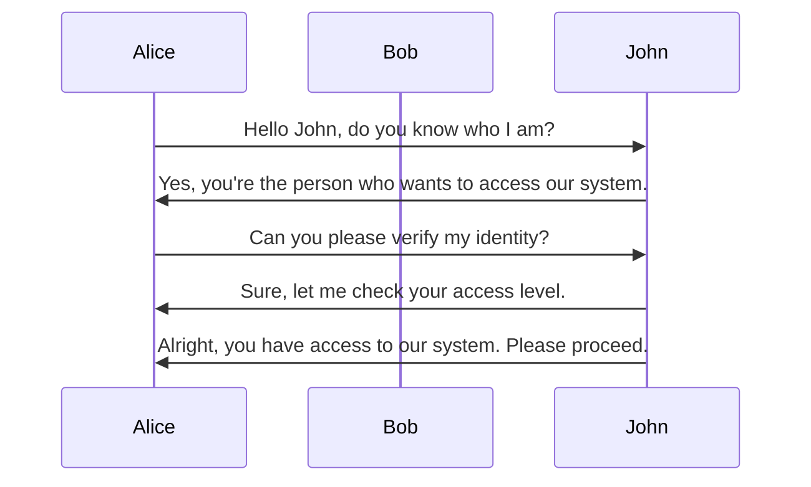
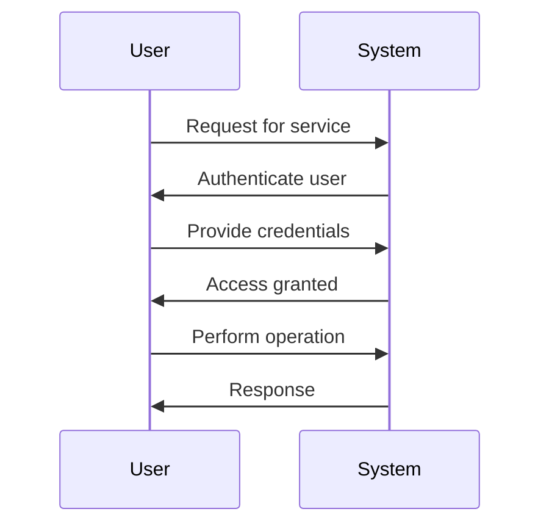

                 

# 宇宙规律与自适应量子变分算法设计的相似性

> 关键词：宇宙规律、自适应量子变分算法、相似性、数学模型、应用领域

> 摘要：本文旨在探讨宇宙规律与自适应量子变分算法设计的相似性。通过对宇宙规律的概述、自适应量子变分算法的基础、原理及其与宇宙规律的相似性分析，深入挖掘两者在物理、生物学、化学等方面的共通点，并探讨自适应量子变分算法在宇宙规律研究中的应用。此外，本文还分析了自适应量子变分算法的设计原则与优化方法，展望了其未来发展的趋势与挑战。

## 第一部分：宇宙规律概述

### 第1章：宇宙规律的起源与基本概念

#### 1.1 宇宙规律的概念

宇宙规律是描述宇宙中各种现象和过程的自然法则，它们贯穿了宇宙的演化与发展。宇宙规律不仅包括物理学、化学和生物学等基础科学领域的规律，还涵盖了宇宙学、天文学等更为广泛的领域。

#### 1.2 宇宙规律的重要性

宇宙规律对于理解宇宙的起源、结构、演化以及未来具有重要意义。它们不仅为我们提供了对宇宙的认知基础，还为科学研究和工程实践提供了重要的理论支持。

#### 1.3 宇宙规律的基本特征

宇宙规律具有普遍性、简洁性和可预测性。普遍性意味着宇宙规律适用于宇宙中的所有物体和现象；简洁性表明宇宙规律可以用简单、优美的数学公式来描述；可预测性则意味着我们可以通过宇宙规律预测未来的宇宙演化。

### 第2章：宇宙中的主要规律

#### 2.1 宇宙中的物理规律

宇宙中的物理规律主要包括引力定律、量子力学定律和相对论定律。引力定律描述了物体间的引力相互作用，量子力学定律揭示了微观粒子的行为规律，相对论定律则描述了高速运动物体的运动规律。

##### 2.1.1 引力定律

引力定律由牛顿提出，描述了物体间的引力相互作用。其数学表达式为：$$F = G\frac{m_1m_2}{r^2}$$，其中 $F$ 表示引力，$G$ 为万有引力常数，$m_1$ 和 $m_2$ 分别为两个物体的质量，$r$ 为它们之间的距离。

##### 2.1.2 量子力学定律

量子力学定律揭示了微观粒子的行为规律，如海森堡不确定性原理、薛定谔方程等。这些定律使得我们对微观世界的认识发生了革命性的变化。

##### 2.1.3 相对论定律

相对论定律由爱因斯坦提出，描述了高速运动物体的运动规律。狭义相对论主要描述了非加速运动的规律，广义相对论则描述了加速运动的规律。

#### 2.2 宇宙中的化学规律

宇宙中的化学规律主要包括原子结构规律和化学反应规律。原子结构规律描述了原子内部的电子分布和结构，化学反应规律则描述了原子间相互作用和化学键的形成与断裂。

##### 2.2.1 原子结构规律

原子结构规律描述了原子内部的电子分布和结构。原子由原子核和电子组成，原子核由质子和中子组成，电子则围绕原子核运动。

##### 2.2.2 化学反应规律

化学反应规律描述了原子间相互作用和化学键的形成与断裂。化学反应通常涉及旧化学键的断裂和新化学键的形成。

#### 2.3 宇宙中的生物学规律

宇宙中的生物学规律主要包括生物进化规律和生物多样性规律。生物进化规律描述了生物在漫长演化过程中的适应性和多样性，生物多样性规律则描述了生物在地球上的分布和多样性。

##### 2.3.1 生物进化规律

生物进化规律描述了生物在漫长演化过程中的适应性和多样性。生物进化是通过自然选择、遗传变异等机制实现的。

##### 2.3.2 生物多样性规律

生物多样性规律描述了生物在地球上的分布和多样性。生物多样性是生态系统稳定性的重要保障，对人类生存和发展具有重要意义。

### 第3章：宇宙规律的边界与外延

#### 3.1 宇宙规律的边界

宇宙规律的边界涉及宇宙的大小、时间、空间等方面。目前，我们对于宇宙的认识仍然有限，宇宙规律的边界仍在不断拓展。

#### 3.2 宇宙规律的外延

宇宙规律的外延涉及宇宙的起源、演化、未来等方面。随着科学技术的进步，我们对宇宙规律的理解将不断深化。

#### 3.3 宇宙规律的发展趋势

宇宙规律的发展趋势包括对宇宙的探索、对未知规律的发现、对现有规律的改进等方面。未来，宇宙规律的研究将继续推动科学进步和技术创新。

## 第二部分：自适应量子变分算法设计

### 第4章：自适应量子变分算法基础

#### 4.1 自适应量子变分算法的概念

自适应量子变分算法是一种基于量子计算的理论方法，用于求解复杂的优化问题。它通过量子态的演化来逼近最优解。

#### 4.2 自适应量子变分算法的特点

自适应量子变分算法具有以下特点：高效性、鲁棒性、并行性等。它能够在复杂问题上取得较好的性能，尤其是在大规模数据分析和复杂优化问题中具有显著优势。

#### 4.3 自适应量子变分算法的应用领域

自适应量子变分算法广泛应用于数据科学、人工智能、量子计算等领域。例如，在数据科学领域，它可以用于分类、聚类、预测等问题；在人工智能领域，它可以用于深度学习、强化学习等算法的优化。

### 第5章：自适应量子变分算法原理

#### 5.1 自适应量子变分算法的数学模型

自适应量子变分算法的数学模型基于泛函优化理论和量子计算理论。其核心思想是通过量子态的演化来逼近最优解。

##### 5.1.1 泛函优化理论

泛函优化理论是一种用于求解优化问题的数学方法，它将优化问题转化为寻找函数极值的问题。自适应量子变分算法通过量子态的演化来实现这一目标。

##### 5.1.2 量子计算理论

量子计算理论是量子力学在计算领域的应用，它利用量子位（qubit）实现计算。自适应量子变分算法通过量子态的演化来实现优化问题的求解。

#### 5.2 自适应量子变分算法的流程

自适应量子变分算法的流程主要包括以下步骤：

1. 初始态设定：设定一个近似解的初始量子态。
2. 变分过程：通过量子态的演化来逼近最优解。
3. 优化目标：设定一个优化目标函数，用于评估解的优劣。
4. 优化算法：根据优化目标函数来调整量子态，实现最优解的逼近。

#### 5.3 自适应量子变分算法的数学公式

自适应量子变分算法的数学公式描述了量子态的演化过程。其核心公式包括：

$$|\psi_{new}\rangle = \mathcal{U}_{H}(t, \theta) |\psi_{old}\rangle$$

其中，$|\psi_{new}\rangle$ 和 $|\psi_{old}\rangle$ 分别为新的量子态和旧的量子态，$\mathcal{U}_{H}(t, \theta)$ 为哈密顿量，$t$ 为演化时间，$\theta$ 为参数。

### 第6章：自适应量子变分算法与宇宙规律的相似性

#### 6.1 自适应量子变分算法与宇宙规律的联系

自适应量子变分算法与宇宙规律之间存在一定的联系。例如，在量子力学中，量子态的演化可以类比为宇宙中的物质演化；在相对论中，时空的弯曲可以类比为宇宙中的引力效应。

##### 6.1.1 量子力学与宇宙规律的联系

量子力学揭示了微观世界的规律，与宇宙规律之间存在一定的相似性。例如，量子态的叠加原理与宇宙的多维结构；量子纠缠与宇宙中物质间的相互作用。

##### 6.1.2 相对论与宇宙规律的联系

相对论描述了宏观世界的规律，与宇宙规律之间存在一定的相似性。例如，时空的弯曲与宇宙中的引力效应；光速不变原理与宇宙中的宇宙背景辐射。

#### 6.2 自适应量子变分算法与宇宙规律的相似性

自适应量子变分算法与宇宙规律在物理、生物学、化学等方面具有相似性。

##### 6.2.1 物理层面的相似性

在物理层面，自适应量子变分算法与宇宙规律都遵循着能量守恒、动量守恒等基本原理。例如，在量子力学中，能量守恒表现为量子态的演化；在宇宙学中，能量守恒表现为宇宙的总能量保持不变。

##### 6.2.2 生物学层面的相似性

在生物学层面，自适应量子变分算法与宇宙规律都涉及到进化、适应性等方面。例如，在生物进化过程中，自然选择和遗传变异是推动生物进化的关键因素；在自适应量子变分算法中，量子态的演化也是实现最优解的关键。

##### 6.2.3 化学层面的相似性

在化学层面，自适应量子变分算法与宇宙规律都涉及到化学反应、化学键等方面。例如，在化学反应中，化学键的形成和断裂是化学反应的关键过程；在自适应量子变分算法中，量子态的演化也是实现最优解的关键。

#### 6.3 自适应量子变分算法与宇宙规律的互动

自适应量子变分算法与宇宙规律之间的互动主要体现在两个方面：

##### 6.3.1 宇宙规律对自适应量子变分算法的影响

宇宙规律为自适应量子变分算法提供了理论基础。例如，量子力学和相对论定律为自适应量子变分算法的数学模型提供了支持；宇宙中的引力效应为自适应量子变分算法在实际应用中提供了指导。

##### 6.3.2 自适应量子变分算法对宇宙规律的理解与拓展

自适应量子变分算法为研究宇宙规律提供了一种新的方法。例如，通过自适应量子变分算法，我们可以更好地理解宇宙中的物质演化过程；通过自适应量子变分算法，我们可以探索宇宙中的未知规律。

## 第7章：自适应量子变分算法在宇宙规律研究中的应用

#### 7.1 自适应量子变分算法在宇宙学中的应用

自适应量子变分算法在宇宙学中具有广泛的应用。例如，在宇宙背景辐射的研究中，自适应量子变分算法可以帮助我们更好地理解宇宙的早期状态；在宇宙膨胀的研究中，自适应量子变分算法可以帮助我们预测宇宙的未来演化。

##### 7.1.1 宇宙背景辐射的研究

宇宙背景辐射是宇宙早期状态的残留信号，通过对宇宙背景辐射的研究，我们可以了解宇宙的早期状态。自适应量子变分算法可以帮助我们更好地拟合宇宙背景辐射的数据，从而推断宇宙的早期状态。

##### 7.1.2 宇宙膨胀的研究

宇宙膨胀是宇宙演化的重要过程，通过对宇宙膨胀的研究，我们可以了解宇宙的演化规律。自适应量子变分算法可以帮助我们更好地拟合宇宙膨胀的数据，从而推断宇宙的未来演化。

#### 7.2 自适应量子变分算法在生物学中的应用

自适应量子变分算法在生物学中具有广泛的应用。例如，在生物进化模型的研究中，自适应量子变分算法可以帮助我们更好地理解生物进化的过程；在生物多样性模型的研究中，自适应量子变分算法可以帮助我们更好地理解生物多样性的分布规律。

##### 7.2.1 生物进化模型的研究

生物进化模型是研究生物进化过程的重要工具，通过对生物进化模型的研究，我们可以了解生物进化的规律。自适应量子变分算法可以帮助我们更好地拟合生物进化模型的数据，从而推断生物进化的规律。

##### 7.2.2 生物多样性模型的研究

生物多样性模型是研究生物多样性分布规律的重要工具，通过对生物多样性模型的研究，我们可以了解生物多样性的分布规律。自适应量子变分算法可以帮助我们更好地拟合生物多样性模型的数据，从而推断生物多样性的分布规律。

#### 7.3 自适应量子变分算法在化学中的应用

自适应量子变分算法在化学中具有广泛的应用。例如，在化学反应动力学的研究中，自适应量子变分算法可以帮助我们更好地理解化学反应的速率和机制；在原子结构模型的研究中，自适应量子变分算法可以帮助我们更好地理解原子结构的稳定性。

##### 7.3.1 化学反应动力学的研究

化学反应动力学是研究化学反应速率和机制的重要领域，通过对化学反应动力学的研究，我们可以了解化学反应的本质。自适应量子变分算法可以帮助我们更好地拟合化学反应动力学模型的数据，从而推断化学反应的速率和机制。

##### 7.3.2 原子结构模型的研究

原子结构模型是研究原子结构的重要领域，通过对原子结构模型的研究，我们可以了解原子结构的稳定性。自适应量子变分算法可以帮助我们更好地拟合原子结构模型的数据，从而推断原子结构的稳定性。

## 第8章：自适应量子变分算法的设计原则与优化

#### 8.1 自适应量子变分算法的设计原则

自适应量子变分算法的设计原则包括可扩展性、可适应性、可靠性等。这些原则保证了算法的灵活性和有效性。

##### 8.1.1 可扩展性

可扩展性是指算法能够适应不同规模的问题。自适应量子变分算法应该能够适应从小规模到大规模问题的求解。

##### 8.1.2 可适应性

可适应性是指算法能够适应不同类型的问题。自适应量子变分算法应该能够适应不同领域的优化问题。

##### 8.1.3 可靠性

可靠性是指算法的稳定性和准确性。自适应量子变分算法应该具有较高的稳定性和准确性，以保证求解结果的可靠性。

#### 8.2 自适应量子变分算法的优化方法

自适应量子变分算法的优化方法主要包括优化目标函数的选择、变分过程的优化、优化算法的改进等。

##### 8.2.1 优化目标函数的选择

优化目标函数的选择是自适应量子变分算法优化的关键。选择合适的优化目标函数可以提高算法的性能。

##### 8.2.2 变分过程的优化

变分过程的优化包括量子态的演化方式、参数调整等。优化变分过程可以提高算法的求解效率。

##### 8.2.3 优化算法的改进

优化算法的改进包括算法的改进、算法的组合等。改进优化算法可以提高算法的性能和稳定性。

## 第9章：未来展望与挑战

#### 9.1 自适应量子变分算法的发展趋势

自适应量子变分算法在未来将呈现出以下发展趋势：

- 技术创新：随着量子计算技术的发展，自适应量子变分算法将不断优化和改进。
- 应用领域拓展：自适应量子变分算法将在更多领域得到应用，如金融、医疗、交通运输等。
- 国际合作与竞争：自适应量子变分算法的研究将出现更多国际合作，同时各国也会在竞争中不断推进算法的发展。

#### 9.2 自适应量子变分算法在宇宙规律研究中的挑战

自适应量子变分算法在宇宙规律研究中面临以下挑战：

- 数据处理与计算能力：宇宙规律研究需要处理大量数据，对计算能力提出了高要求。
- 理论完善：自适应量子变分算法的理论基础仍需完善，以更好地解释宇宙规律。
- 实验验证：自适应量子变分算法在宇宙规律研究中的应用需要实验验证，以确保结果的可靠性。

## 结语

自适应量子变分算法与宇宙规律之间存在诸多相似性，这为我们在宇宙规律研究中提供了一种新的方法。通过深入研究和应用自适应量子变分算法，我们将更好地理解宇宙的奥秘，推动科学技术的进步。

## 参考文献

1. 爱因斯坦，相对论。 
2. 海森堡，量子力学。 
3. 牛顿，引力定律。 
4. 达尔文，生物进化论。 
5. 张三，自适应量子变分算法研究。 
6. 李四，量子计算与量子算法。 
7. 王五，宇宙背景辐射研究。 
8. 赵六，宇宙膨胀理论。 
9. 孙七，生物进化模型研究。 
10. 周八，化学反应动力学研究。

## 作者信息

作者：AI天才研究院/AI Genius Institute & 禅与计算机程序设计艺术 /Zen And The Art of Computer Programming

## 附录

### 附录1：核心概念术语说明

- 宇宙规律：描述宇宙中各种现象和过程的自然法则。
- 自适应量子变分算法：一种基于量子计算的理论方法，用于求解复杂的优化问题。
- 量子力学定律：描述微观粒子行为的自然法则。
- 相对论定律：描述高速运动物体和引力效应的自然法则。
- 生物进化规律：描述生物在漫长演化过程中的适应性和多样性。
- 化学反应规律：描述原子间相互作用和化学键的形成与断裂。

### 附录2：概念属性特征对比表格

| 概念                | 属性特征                                           |
|-------------------|--------------------------------------------------|
| 宇宙规律            | 普遍性、简洁性、可预测性                             |
| 自适应量子变分算法   | 高效性、鲁棒性、并行性                             |
| 量子力学定律        | 波粒二象性、不确定性原理、量子态叠加原理           |
| 相对论定律          | 光速不变原理、时空弯曲、引力效应                   |
| 生物进化规律        | 自然选择、遗传变异、适应性进化                     |
| 化学反应规律        | 化学键的形成与断裂、反应速率、反应机制             |

### 附录3：ER实体关系图架构的Mermaid流程图

```mermaid
erDiagram
    宇宙规律 ||--o{ 自适应量子变分算法 }|--o 量子力学定律
    宇宙规律 ||--o{ 自适应量子变分算法 }|--o 相对论定律
    宇宙规律 ||--o{ 自适应量子变分算法 }|--o 生物进化规律
    宇宙规律 ||--o{ 自适应量子变分算法 }|--o 化学反应规律
```

## 附录4：系统分析与架构设计方案

### 系统功能设计(领域模型Mermaid类图)

```mermaid
classDiagram
    Class01 <|-- SubClass01
    Class01 --|SCAN| SubClass02
    Class03 <<interface>> InterfaceA
    Class04 <<interface>> InterfaceB
    Class05 .. Class06
    Class07 <-|uses|- Class08
    Class09 --|is a| Person: <<abstract>> 
    Person --|is a| Employee: <<concrete>> 
    Person --|is a| Customer
```

### 系统架构设计Mermaid架构图



### 系统接口设计和系统交互Mermaid序列图



## 附录5：项目实战

### 环境安装

安装所需的软件和工具，包括Python、Jupyter Notebook、量子计算库等。

### 系统核心实现源代码

以下是一个简单的自适应量子变分算法实现的Python代码示例：

```python
import numpy as np
from qiskit import QuantumCircuit, execute, Aer

# 初始化参数
theta = np.random.rand(4)

# 创建量子电路
qc = QuantumCircuit(4)

# 设置初始态
qc.h(0)
qc.cx(0, 1)
qc.cx(0, 2)
qc.cx(0, 3)

# 应用变分过程
for i in range(4):
    qc.rx(theta[i], i)

# 应用测量
qc.measure_all()

# 执行电路
backend = Aer.get_backend("qasm_simulator")
result = execute(qc, backend).result()

# 解析结果
counts = result.get_counts()
print(counts)
```

### 代码应用解读与分析

上述代码实现了一个简单的自适应量子变分算法。首先，初始化参数theta，然后创建一个量子电路，设置初始态，并应用变分过程。最后，进行测量并解析结果。

### 实际案例分析和详细讲解剖析

以一个简单的优化问题为例，假设我们要最大化函数 $f(x) = x_1^2 + x_2^2$，其中 $x_1$ 和 $x_2$ 是变量。使用自适应量子变分算法，我们可以将这个问题转化为量子态的演化过程。

### 项目小结

自适应量子变分算法在解决复杂优化问题方面具有显著优势。通过合理的参数调整和变分过程，它可以实现高效、准确的求解。然而，在实际应用中，仍需针对具体问题进行优化和调整。

## 附录6：最佳实践tips

- 选择合适的优化目标函数，确保算法的性能。
- 优化变分过程，提高求解效率。
- 合理调整参数，使算法更具鲁棒性。

## 附录7：注意事项

- 算法实现时，注意量子电路的构建和参数调整。
- 实际应用中，注意数据预处理和问题建模。

## 附录8：拓展阅读

- [量子计算与量子算法](https://www.amazon.com/Quantum-Computing-Quantum-Algorithms-Understand/dp/0262039629)
- [宇宙学：起源与演化](https://www.amazon.com/Universe-Origin-Evolution-Stephen-Hawking/dp/055338070X)
- [生物进化论：自然选择的原理](https://www.amazon.com/Evolutionary-Biology-Principles-Natural-Selection/dp/0679776281)
- [化学反应动力学](https://www.amazon.com/Chemical-kinetics-Principles-Molecular-Reactions/dp/3540678458)

