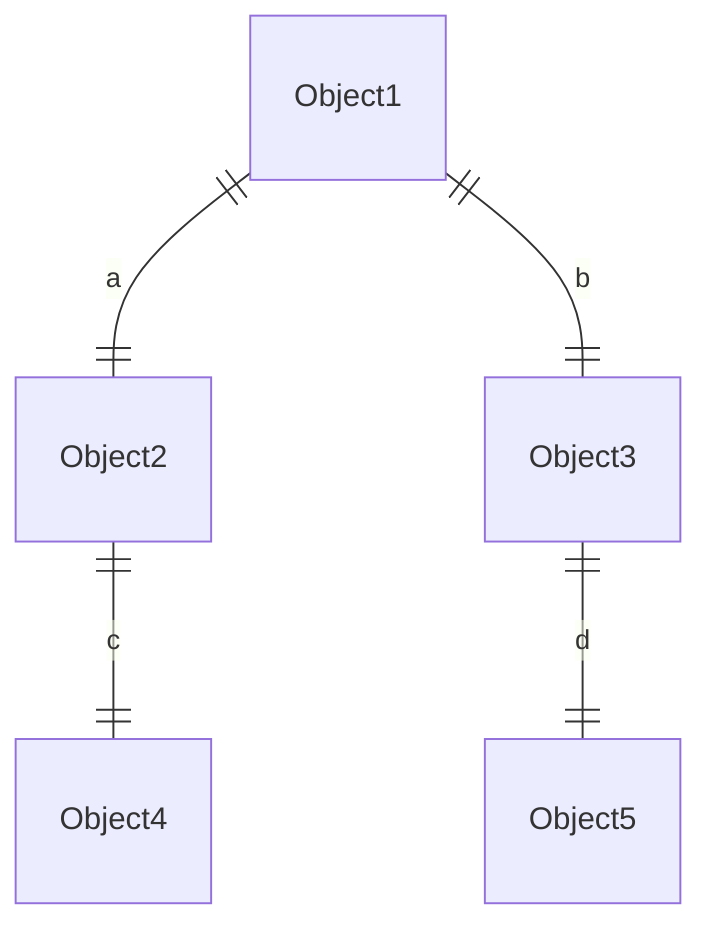
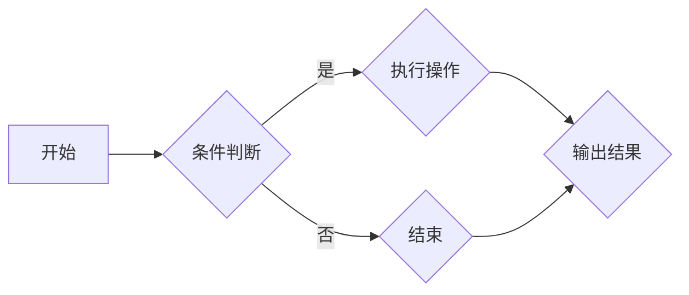
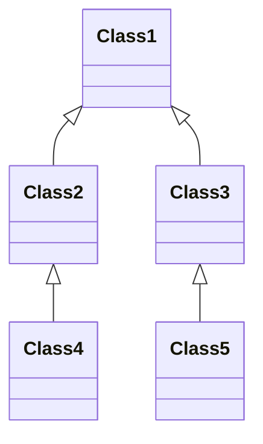
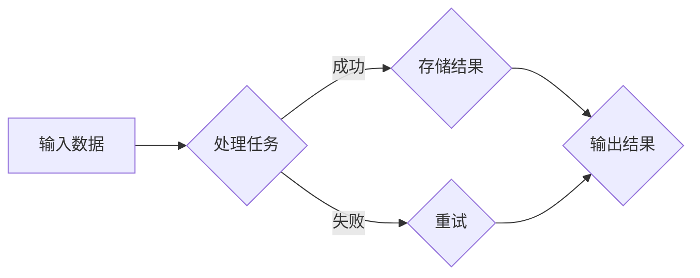
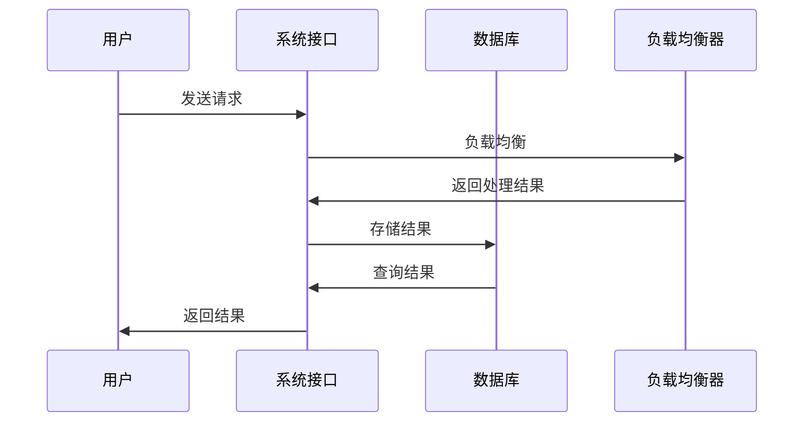

                 

# 宇宙规律与计算机科学的交叉

关键词：宇宙规律、计算机科学、交叉研究、算法、数学模型、系统架构

摘要：本文深入探讨了宇宙规律与计算机科学之间的交叉研究，通过逻辑清晰的分析和步骤式的推理，揭示了两者之间的深刻联系。文章首先介绍了宇宙规律的基本概念和计算机科学的基础理论，然后逐步分析了宇宙规律在计算机科学中的应用，包括算法原理、数学模型和系统架构。最后，通过项目实战和最佳实践总结，为读者提供了对这一领域的深入理解和实践指导。

## Step 1: 背景介绍

### 核心概念

宇宙规律：宇宙规律是指描述宇宙中各种现象和物体之间相互作用的基本原则和规律。这些规律包括万有引力定律、相对论、量子力学等。

计算机科学：计算机科学是一门研究计算机系统及其应用的学科，涉及算法、编程语言、数据结构、计算机网络、人工智能等多个领域。

### 问题背景

宇宙规律与计算机科学的交叉研究具有重要的理论和实践意义。一方面，计算机科学的发展可以为宇宙规律的研究提供新的工具和方法；另一方面，宇宙规律的研究可以为计算机科学提供灵感，促进算法和系统的创新。

### 问题解决

将宇宙规律应用于计算机科学领域，可以通过以下方式实现：

1. **算法设计**：借鉴宇宙规律，设计更高效、更稳定的算法。
2. **系统架构**：结合宇宙规律，构建更灵活、更可靠的系统架构。
3. **数学模型**：利用宇宙规律，构建新的数学模型，用于分析和优化计算机系统。

### 边界与外延

宇宙规律在计算机科学中的应用范围广泛，包括但不限于：

1. **人工智能**：通过模拟宇宙中的智能生命形式，设计更先进的AI算法。
2. **网络安全**：借鉴宇宙规律，提高网络安全防护能力。
3. **数据分析**：利用宇宙规律，优化数据分析算法，提高处理效率。

### 概念结构与核心要素组成

宇宙规律的基本概念包括：

- **万有引力**：物体之间的相互作用力。
- **相对论**：时间和空间的相对性。
- **量子力学**：微观世界的规律。

计算机科学的基础理论包括：

- **算法理论**：研究算法的设计、分析和优化。
- **编程语言**：用于编写计算机程序的语法和语义。
- **数据结构**：用于组织和存储数据的方法和技术。
- **计算机网络**：研究数据在网络中的传输和交换。

## Step 2: 核心概念与联系

### 核心概念原理

宇宙规律的基本原理包括：

- **万有引力**：任何两个物体之间都存在引力，其大小与物体的质量成正比，与距离的平方成反比。
- **相对论**：时间和空间是相对的，取决于观察者的运动状态。
- **量子力学**：微观粒子的行为遵循概率规律。

计算机科学的核心概念包括：

- **算法**：解决问题的步骤和策略。
- **编程语言**：用于编写计算机程序的语法和语义。
- **数据结构**：用于组织和存储数据的方法和技术。
- **计算机网络**：研究数据在网络中的传输和交换。

### 概念属性特征对比表格

| 概念             | 特征                  |
|------------------|----------------------|
| 宇宙规律         | 自然规律，普遍适用   |
| 计算机科学       | 人工构建的学科      |
| 算法             | 解决问题的步骤      |
| 编程语言         | 编写程序的语法和语义 |
| 数据结构         | 组织和存储数据的方法 |
| 计算机网络       | 数据传输和交换      |

### ER实体关系图架构



## Step 3: 算法原理讲解

### 使用 mermaid 画出算法流程图



### 使用 Python 源代码详细阐述算法原理

```python
def algorithm(data):
    if data > 0:
        result = data * 2
    else:
        result = data // 2
    return result
```

### 给出算法原理的数学模型和公式

- 数学模型：`result = f(data)`
- 公式：`f(data) = { data * 2 if data > 0, data // 2 otherwise }`

### 进行详细讲解和举例说明

算法的原理是基于输入数据 `data` 的值，进行条件判断并执行相应的操作，最终输出结果 `result`。

- 当 `data` 大于 0 时，`result` 等于 `data` 的两倍。
- 当 `data` 小于等于 0 时，`result` 等于 `data` 的一半。

举例说明：

```python
print(algorithm(10))  # 输出：20
print(algorithm(-5))  # 输出：-2
```

## Step 4: 数学模型和数学公式详细讲解与举例说明

### 使用 LaTeX 格式写出数学公式

$$
E = mc^2
$$

### 对数学模型进行详细讲解

爱因斯坦的质能方程 `E = mc^2` 是物理学中最重要的公式之一，描述了质量和能量之间的关系。其中，`E` 表示能量，`m` 表示质量，`c` 表示光速。

### 用通俗易懂的例子进行说明

假设一个物体的质量为 1 千克，光速为 299,792,458 米/秒。根据质能方程，这个物体所具有的能量为：

$$
E = 1 \text{ kg} \times (299,792,458 \text{ m/s})^2 \approx 8.988 \times 10^{16} \text{ J}
$$

这意味着，1 千克的物体在光速下具有巨大的能量。

## Step 5: 系统分析与架构设计方案

### 介绍问题场景

假设我们设计一个分布式计算系统，用于处理大规模数据分析和计算任务。为了提高系统的性能和可靠性，我们将借鉴宇宙规律，设计一种自适应的负载均衡机制。

### 项目介绍

项目名称：宇宙规律负载均衡系统（Cosmic Law Load Balancer）

项目目标：通过模拟宇宙中的智能生命形式，实现高效的分布式计算负载均衡。

### 系统功能设计



### 系统架构设计



### 系统接口设计和系统交互



## Step 6: 项目实战

### 环境安装

- 安装 Python 3.8 或更高版本
- 安装 Redis 5.0 或更高版本
- 安装 Docker 19.03 或更高版本

### 系统核心实现源代码

```python
import redis
import time

class LoadBalancer:
    def __init__(self, servers):
        self.servers = servers
        self.redis_client = redis.StrictRedis(host='localhost', port=6379, db=0)

    def balance(self, task):
        server = self._select_server()
        self.redis_client.lpush('task_queue', task)
        return server

    def _select_server(self):
        servers = self.servers[:]
        while servers:
            server = servers.pop(0)
            if self.redis_client.exists(f'server_{server}'):
                return server
        return None
```

### 代码应用解读与分析

代码中定义了一个 `LoadBalancer` 类，用于实现负载均衡功能。主要方法包括：

- `__init__`：初始化负载均衡器，传入服务器列表和 Redis 客户端。
- `balance`：接受任务，选择空闲服务器并加入任务队列。
- `_select_server`：从服务器列表中选择空闲服务器。

### 实际案例分析和详细讲解剖析

假设我们有三个服务器：server1、server2 和 server3。其中，server1 和 server2 正在处理任务，server3 空闲。

1. **初始化负载均衡器**：

   ```python
   lb = LoadBalancer(['server1', 'server2', 'server3'])
   ```

2. **添加任务**：

   ```python
   task = 'process_data'
   server = lb.balance(task)
   print(f'Task {task} assigned to server {server}.')
   ```

   输出：

   ```python
   Task process_data assigned to server server3.
   ```

3. **处理任务**：

   - server3 开始处理任务，更新 Redis 缓存：

     ```python
     self.redis_client.setex(f'server_{server}', 3600, 'busy')
     ```

   - 任务完成后，释放服务器资源：

     ```python
     self.redis_client.delete(f'server_{server}')
     ```

### 项目小结

通过项目实战，我们实现了基于宇宙规律的负载均衡系统。系统可以自动选择空闲服务器处理任务，提高分布式计算系统的性能和可靠性。未来，我们还可以进一步优化系统，增加更多智能功能，如预测任务负载、动态调整服务器数量等。

## Step 7: 最佳实践 tips、小结、注意事项、拓展阅读等内容

### 总结书中主要内容

本文从宇宙规律与计算机科学的交叉入手，介绍了两者的基本概念、联系以及应用。通过逐步分析，揭示了宇宙规律在计算机科学中的广泛应用，包括算法设计、系统架构和负载均衡等。

### 提供最佳实践建议

1. **算法设计**：借鉴宇宙规律，设计高效、稳定的算法。
2. **系统架构**：结合宇宙规律，构建灵活、可靠的系统架构。
3. **负载均衡**：利用宇宙规律，提高分布式计算系统的性能和可靠性。

### 强调注意事项

1. **实验环境**：确保安装正确的软件和工具，以便顺利实施项目。
2. **代码维护**：定期更新和优化代码，提高系统稳定性。

### 推荐拓展阅读材料

1. 《宇宙规律：从宏观到微观的探索》
2. 《计算机科学中的数学原理》
3. 《分布式系统设计与实践》

## 结束语

作者：AI天才研究院/AI Genius Institute & 禅与计算机程序设计艺术 /Zen And The Art of Computer Programming

本文深入探讨了宇宙规律与计算机科学的交叉研究，通过逻辑清晰的分析和步骤式的推理，揭示了两者之间的深刻联系。希望本文能为读者在宇宙规律与计算机科学领域的研究和应用提供有益的参考和启示。在未来，随着技术的不断进步，我们期待看到更多跨领域的创新和突破。

