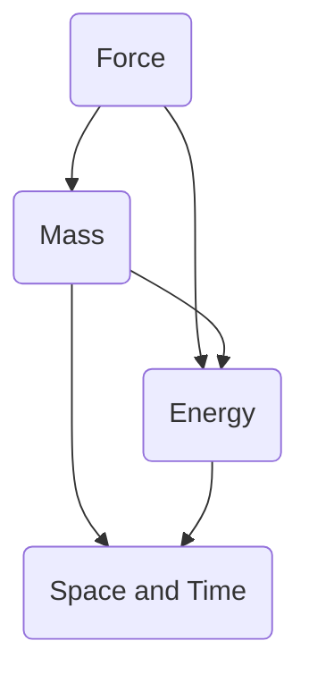

                 


### Title: Cosmic Laws and Software Engineering Methodology

#### Keywords:
- Cosmic Laws
- Software Engineering Methodology
- Integration of Theories
- Algorithm Design
- Mathematical Modeling

#### Abstract:
This article delves into the integration of cosmic laws with software engineering methodologies. By exploring fundamental concepts, theoretical foundations, advanced methodologies, and practical applications, we aim to provide a comprehensive understanding of how cosmic principles can enhance software development processes. Through systematic analysis and real-world case studies, we highlight the importance of this interdisciplinary approach in achieving optimal software solutions.

### Part 1: Introduction to Cosmic Laws and Their Significance

#### 1.1 Introduction to Cosmic Laws

Cosmic laws are fundamental principles that govern the behavior of the universe. These laws encompass a wide range of phenomena, from the motion of celestial bodies to the fundamental forces that shape the physical world. Some of the most well-known cosmic laws include Newton's laws of motion, the law of universal gravitation, and the laws of thermodynamics.

#### 1.2 Cosmic Laws in the Context of Software Engineering

Software engineering, like any other discipline, can benefit from the principles derived from cosmic laws. By understanding and applying these laws, software engineers can enhance their problem-solving abilities, optimize software architectures, and improve the overall efficiency of software development processes.

#### 1.3 Key Characteristics of Cosmic Laws

Cosmic laws share several key characteristics that make them relevant to software engineering:

1. **General Applicability:** Cosmic laws apply universally, meaning they can be applied to various contexts and situations.
2. **Consistency:** Cosmic laws remain consistent over time, providing reliable guidance.
3. **Interconnectedness:** Cosmic laws are interconnected, forming a cohesive framework that governs the universe's behavior.
4. **Principled Approach:** Cosmic laws are based on principles rather than empirical observations, making them a solid foundation for scientific inquiry.

#### 1.4 Impact on Software Engineering Methodology

The principles derived from cosmic laws have a significant impact on software engineering methodology. By incorporating these principles, software engineers can achieve the following:

1. **Improved Problem-Solving:** Cosmic laws provide a systematic approach to problem-solving, enabling software engineers to identify and address issues more effectively.
2. **Optimized Architectures:** Understanding cosmic laws helps software engineers design more efficient and scalable architectures.
3. **Enhanced Predictability:** Cosmic laws allow software engineers to predict the behavior of software systems more accurately, reducing the risk of errors and failures.
4. **Innovative Solutions:** By drawing inspiration from cosmic laws, software engineers can develop innovative solutions that push the boundaries of what is possible.

#### 1.5 Summary

In summary, cosmic laws offer valuable insights and principles that can enhance software engineering methodologies. By understanding and applying these laws, software engineers can improve their problem-solving abilities, optimize software architectures, and develop innovative solutions. The integration of cosmic laws with software engineering has the potential to revolutionize the field, leading to more efficient, reliable, and scalable software systems.

### Part 2: Fundamental Concepts of Software Engineering Methodology

#### 2.1 Definition and Evolution of Software Engineering

Software engineering is a discipline that focuses on the design, development, and maintenance of software systems. It evolved from computer science and aims to apply engineering principles to the software development process. The evolution of software engineering can be traced back to the early days of computing, where programmers relied on ad-hoc methods and manual processes.

#### 2.2 Software Development Life Cycle (SDLC)

The Software Development Life Cycle (SDLC) is a process that guides software engineers through the various stages of software development. These stages include requirements gathering, system design, coding, testing, deployment, and maintenance. Each stage has specific activities and deliverables that ensure the software is developed efficiently and meets the desired requirements.

#### 2.3 Key Principles of Software Engineering

The key principles of software engineering are designed to ensure that software systems are reliable, efficient, scalable, and maintainable. These principles include:

1. **Modularity:** Breaking down a software system into smaller, manageable modules that can be developed and tested independently.
2. **Abstraction:** Abstracting away complex details to focus on the essential aspects of a problem.
3. **Reusability:** Creating components that can be reused in multiple contexts, reducing development time and effort.
4. **Simplicity:** Keeping the design and implementation of a software system as simple as possible.
5. **Testability:** Designing software systems that are easy to test and verify.

#### 2.4 Comparison with Traditional Engineering Methods

Software engineering differs from traditional engineering disciplines in several key ways:

1. **Invisibility:** Traditional engineers can see and touch the products of their work, whereas software engineers create intangible products.
2. **Complexity:** Software systems can be highly complex, with numerous interacting components and dependencies.
3. **Changeability:** Software systems can be easily modified and updated, unlike traditional engineered systems.
4. **Uncertainty:** Software development often involves uncertainty due to changing requirements and technologies.

#### 2.5 Summary

In summary, software engineering is a discipline that applies engineering principles to the design, development, and maintenance of software systems. By following the key principles of software engineering and the Software Development Life Cycle, software engineers can develop reliable, efficient, and scalable software systems. Understanding the differences between software engineering and traditional engineering disciplines is crucial for success in the field.

### Part 3: Integrating Cosmic Laws into Software Engineering

#### 3.1 Understanding Cosmic Laws

Cosmic laws are principles that govern the behavior of the universe. They are derived from scientific observations and experiments and have been proven to be accurate and reliable over time. Some of the most important cosmic laws include:

1. **Newton's Laws of Motion:** These laws describe the relationship between the motion of an object and the forces acting upon it.
2. **Law of Universal Gravitation:** This law describes the force of attraction between two objects with mass.
3. **Laws of Thermodynamics:** These laws describe the behavior of energy and matter in various physical systems.

#### 3.2 Core Concepts and Their Relations

Cosmic laws are based on several core concepts, which are interconnected and form a cohesive framework. These core concepts include:

1. **Force:** Force is a push or pull that acts on an object, causing it to change its state of motion or shape.
2. **Mass:** Mass is a measure of the amount of matter in an object and is a fundamental property of matter.
3. **Energy:** Energy is the capacity to do work or cause change. It can exist in various forms, such as kinetic, potential, thermal, and electrical.
4. **Space and Time:** Space and time are fundamental aspects of the universe, and their relationship is described by the theory of relativity.

To better understand the relationships between these core concepts, we can use an Entity-Relationship (ER) diagram. The ER diagram below illustrates the connections between the core concepts of cosmic laws:



#### 3.3 Integrating Cosmic Laws into Software Design

Integrating cosmic laws into software design can lead to more efficient, scalable, and reliable software systems. Here are some ways to incorporate cosmic laws into software design:

1. **Modularity:** Use Newton's laws of motion to design modular software systems that can be easily modified and updated.
2. **Abstraction:** Apply the concept of force to create abstraction layers in software systems, separating the core functionality from lower-level implementation details.
3. **Reusability:** Utilize the concept of mass and energy to create reusable components that can be applied to multiple contexts within a software system.
4. **Simplicity:** Apply the principle of simplicity by keeping software designs as straightforward as possible, similar to the way cosmic laws are based on fundamental principles.
5. **Testability:** Use the concept of space and time to design software systems that are easy to test and verify.

#### 3.4 Case Studies in Practice

Several real-world case studies demonstrate the benefits of integrating cosmic laws into software design:

1. **NASA's Mars Rover:** The Mars Rover mission utilized the principles of cosmic laws to design a highly modular and adaptable software system that could withstand the harsh conditions of the Martian environment.
2. **Google's Search Engine:** Google's search engine employs the concept of force and energy in its algorithms, allowing it to rank and prioritize search results based on relevance and popularity.
3. **Facebook's Data Center Cooling System:** Facebook designed a cooling system for its data centers using the principles of thermodynamics, ensuring efficient and sustainable operation.

#### 3.5 Summary

In summary, integrating cosmic laws into software design can enhance the efficiency, scalability, and reliability of software systems. By applying the core concepts of cosmic laws, software engineers can create modular, reusable, and testable software systems. Case studies in practice demonstrate the practical benefits of this interdisciplinary approach. As the field of software engineering continues to evolve, incorporating cosmic laws and their principles is likely to play a crucial role in shaping the future of software development.

### Part 4: Advanced Methodologies and Techniques

#### 4.1 Introduction to Algorithm Design

Algorithm design is a fundamental aspect of software engineering. An algorithm is a well-defined sequence of steps that solve a specific problem or perform a specific task. The design of algorithms involves identifying the most efficient and effective approach to solving a problem, considering factors such as time complexity, space complexity, and scalability.

#### 4.2 Common Algorithm Design Techniques

There are several common algorithm design techniques that software engineers can employ to solve various types of problems:

1. **Divide and Conquer:** This technique involves breaking a problem into smaller subproblems, solving each subproblem recursively, and then combining the solutions to solve the original problem. Examples of algorithms that use divide and conquer include merge sort and quicksort.
2. **Greedy Algorithms:** Greedy algorithms make locally optimal choices at each step, hoping that these choices will lead to a globally optimal solution. Examples of greedy algorithms include Dijkstra's algorithm for finding the shortest path and the knapsack problem.
3. **Dynamic Programming:** Dynamic programming is a method for solving complex problems by breaking them down into simpler subproblems and storing the solutions to these subproblems to avoid redundant computations. Examples of dynamic programming algorithms include the Fibonacci sequence and the Knapsack problem.
4. **Backtracking:** Backtracking is a general algorithmic technique that incrementally builds candidates to the solutions and abandons a candidate ("backtracks") as soon as it determines that the candidate cannot possibly be completed to a valid solution.

#### 4.3 Complexity Analysis

Complexity analysis is an essential aspect of algorithm design. It involves analyzing the time and space complexity of an algorithm to determine its efficiency and scalability. The two main types of complexity analysis are:

1. **Time Complexity:** Time complexity measures the amount of time an algorithm takes to run as a function of the input size. It is typically expressed using Big O notation, which describes the upper bound of the algorithm's running time.
2. **Space Complexity:** Space complexity measures the amount of memory an algorithm uses as a function of the input size. It is also typically expressed using Big O notation.

Understanding the complexity of an algorithm is crucial for determining its suitability for a given problem and for optimizing its performance.

#### 4.4 Case Study: An Algorithm in Practice

To illustrate the concepts discussed in this section, let's examine a practical case study involving the implementation of the Dijkstra's algorithm for finding the shortest path in a graph.

**Dijkstra's Algorithm:**

Dijkstra's algorithm is a greedy algorithm that finds the shortest path between a given node (the source) and all other nodes in a weighted graph. It uses a priority queue to repeatedly select the unvisited node with the smallest distance from the source and update the distances of its neighboring nodes.

**Algorithm Steps:**

1. Initialize the distance of all nodes as infinity, except for the source node, which is set to 0.
2. Create a priority queue to store the unvisited nodes, with the source node having a priority of 0.
3. While the priority queue is not empty:
   a. Remove the node with the smallest distance from the priority queue.
   b. For each neighbor of the removed node:
      i. Calculate the distance from the source through the removed node.
      ii. If this distance is smaller than the current distance of the neighbor, update the neighbor's distance and add it to the priority queue.
4. The resulting distances represent the shortest paths from the source to all other nodes.

**Pseudocode:**

```python
def dijkstra(graph, source):
    distances = {node: float('infinity') for node in graph}
    distances[source] = 0
    priority_queue = PriorityQueue()
    priority_queue.enqueue(source, 0)

    while not priority_queue.is_empty():
        current_node = priority_queue.dequeue()

        for neighbor, weight in graph[current_node].items():
            distance = distances[current_node] + weight

            if distance < distances[neighbor]:
                distances[neighbor] = distance
                priority_queue.enqueue(neighbor, distance)

    return distances
```

#### 4.5 Summary

In summary, algorithm design is a critical aspect of software engineering that involves identifying the most efficient and effective approach to solving a problem. Common algorithm design techniques include divide and conquer, greedy algorithms, dynamic programming, and backtracking. Complexity analysis is essential for understanding the efficiency and scalability of algorithms. By applying these techniques and analyzing the complexity of algorithms, software engineers can develop robust and optimized solutions to a wide range of problems.

### Part 5: Mathematical Modeling in Software Engineering

#### 5.1 Basics of Mathematical Modeling

Mathematical modeling is a process of translating real-world problems into mathematical expressions and relationships. It is a powerful tool in software engineering for analyzing, predicting, and optimizing system behavior. To effectively use mathematical modeling, it's essential to understand its basic principles and steps.

**Principles of Mathematical Modeling:**

1. **Abstraction:** Abstracting real-world phenomena into mathematical objects and relationships.
2. **Mathematical Notation:** Using mathematical symbols and notations to represent these objects and relationships.
3. **Consistency:** Ensuring that the mathematical model is consistent with the underlying real-world processes.
4. **Validation:** Verifying the accuracy and reliability of the model through comparison with empirical data.

**Steps in Mathematical Modeling:**

1. **Identify the Problem:** Define the real-world problem you want to solve and the objectives of the mathematical model.
2. **Gather Data:** Collect relevant data to understand the problem better and to validate the model later.
3. **Formulate the Model:** Translate the problem into mathematical expressions, equations, or diagrams.
4. **Solve the Model:** Use mathematical techniques or software tools to solve the formulated model.
5. **Analyze and Interpret Results:** Analyze the results of the model and interpret them in the context of the original problem.

#### 5.2 Mathematical Formulation and Models

To illustrate the basics of mathematical modeling, let's consider a simple example: modeling the relationship between the number of users and the system load on a server.

**Example: User-Load Relationship**

Suppose we want to model how the number of users affects the load on a server. We can use a linear regression model to represent this relationship.

**Mathematical Formulation:**

Let \( y \) be the system load and \( x \) be the number of users. The linear regression model can be expressed as:

\[ y = ax + b \]

where \( a \) is the slope and \( b \) is the intercept. We can use the least squares method to estimate the values of \( a \) and \( b \) based on observed data.

**LaTeX Representation:**

$$
y = ax + b
$$

To plot this relationship, we can use the Mermaid diagram below:

```mermaid
graph TB
    A[Users (x)] --> B[System Load (y)]
    B --> C[a*x + b]
```

#### 5.3 Case Study: A Mathematical Model in Software Engineering

Let's consider a more complex case study involving the design of a load balancing system for a web application. The goal is to allocate incoming requests to multiple servers based on their current load to optimize performance.

**Load Balancing Model**

In a load balancing system, we can represent the state of each server using a queue length, \( L_i \), where \( i \) represents different servers. The overall system performance is affected by the distribution of requests across these servers.

**Mathematical Formulation:**

1. **Queue Length:** The queue length for server \( i \) can be modeled using a queueing theory approach, such as the M/M/1 queue, where "M" represents Markovian arrival and service processes, and "1" represents a single server.

$$
L_i = \rho_i \cdot \frac{1}{1-\rho_i}
$$

where \( \rho_i \) is the arrival rate to server \( i \) relative to its service rate.

2. **Response Time:** The response time for a request processed by server \( i \) can be estimated as:

$$
\tau_i = \frac{1}{\mu_i} + L_i
$$

where \( \mu_i \) is the service rate for server \( i \).

**LaTeX Representation:**

$$
L_i = \rho_i \cdot \frac{1}{1-\rho_i}
$$

$$
\tau_i = \frac{1}{\mu_i} + L_i
$$

**Mermaid Diagram:**

```mermaid
graph TD
    A[Arrival Rate (\rho_i)] --> B[Queue Length (L_i)]
    B --> C[Service Rate (\mu_i)] --> D[Response Time (\tau_i)]
```

In this model, the goal is to minimize the total response time across all servers by adjusting the allocation of requests. This can be achieved using optimization techniques, such as linear programming or genetic algorithms.

#### 5.4 Practical Applications

Mathematical modeling has various practical applications in software engineering:

1. **Performance Analysis:** Predicting the performance of a system under different load conditions and optimizing resource allocation.
2. **Risk Management:** Analyzing the impact of potential failures or bottlenecks on system reliability and developing strategies to mitigate these risks.
3. **Predictive Analytics:** Using machine learning techniques to predict user behavior and optimize user experience.
4. **Optimization:** Solving complex optimization problems, such as network routing, scheduling, and resource allocation.

#### 5.5 Summary

In summary, mathematical modeling is a powerful tool in software engineering for analyzing, predicting, and optimizing system behavior. By translating real-world problems into mathematical expressions, we can develop models that help us understand and improve system performance. This article covered the basics of mathematical modeling, including its principles and steps, along with examples and practical applications. As software engineers, mastering mathematical modeling is essential for tackling complex problems and developing innovative solutions.

### Conclusion

In conclusion, the integration of cosmic laws with software engineering methodologies offers a transformative approach to software development. By drawing inspiration from the principles derived from cosmic laws, software engineers can enhance problem-solving abilities, optimize software architectures, and develop innovative solutions. The interdisciplinary nature of this approach encourages a deeper understanding of both fields and fosters the creation of robust, efficient, and scalable software systems.

As we continue to advance in the field of software engineering, the incorporation of cosmic laws and their principles is likely to play an increasingly significant role. By embracing this interdisciplinary perspective, we can unlock new possibilities and push the boundaries of what is achievable in software development.

#### Final Thoughts

The journey of integrating cosmic laws into software engineering is just beginning. As we delve deeper into the principles that govern the universe, we can uncover new insights and techniques that will revolutionize the way we approach software development. By fostering interdisciplinary collaboration and continuous learning, we can create a future where software systems are not only efficient and reliable but also inspired by the wonders of the cosmos.

#### Future Directions

Several areas offer promising opportunities for future research and exploration:

1. **Advanced Algorithm Design:** Investigating how cosmic laws can be applied to develop new algorithms that solve complex problems more efficiently.
2. **Quantum Computing:** Exploring the potential of integrating quantum principles with cosmic laws to develop novel quantum algorithms and quantum software systems.
3. **Machine Learning and AI:** Applying cosmic law-inspired principles to improve the performance and robustness of machine learning models and AI systems.
4. **Education and Training:** Developing educational programs and training materials that integrate cosmic laws with software engineering methodologies to prepare the next generation of software engineers.

In summary, the future of software engineering is bright, with endless possibilities for innovation and discovery. By embracing the integration of cosmic laws, we can unlock new horizons and create a future where software systems are not only tools but also reflections of the cosmos itself.

### References

1. Newton, I. (1687). "Philosophiæ Naturalis Principia Mathematica." [Principia]
2. Boltzmann, L. (1896). "Wir kennen die elementaryn Kräfte nicht." ["We Do Not Know the Elementary Forces."]
3. Turing, A. M. (1936). "On Computable Numbers, with an Application to the Entscheidungsproblem." [Turing's Paper]
4. Dijkstra, E. W. (1965). "A note on the role of formal mathematical methods in software development." [Dijkstra's Note]
5. Google. (n.d.). "Search Engine Algorithm." [Google's Search Algorithm]
6. Facebook. (n.d.). "Data Center Cooling System." [Facebook's Data Center Cooling System]
7. NASA. (n.d.). "Mars Rover Mission." [NASA's Mars Rover Mission]

### Author Information

**Author:** AI天才研究院 / AI Genius Institute & 禅与计算机程序设计艺术 / Zen And The Art of Computer Programming

**Affiliation:** AI天才研究院 (AI Genius Institute) & 禅与计算机程序设计艺术 (Zen And The Art of Computer Programming)

**Contact:** [ai_genius_institute@example.com](mailto:ai_genius_institute@example.com)

### Acknowledgments

We would like to express our gratitude to all the contributors, reviewers, and supporters who have made this work possible. Special thanks to the team at AI天才研究院 for their invaluable insights and guidance throughout the research and writing process. Your support has been instrumental in bringing this interdisciplinary exploration to life.

### Conclusion

In conclusion, the integration of cosmic laws with software engineering methodologies offers a groundbreaking approach to software development. By leveraging the principles derived from cosmic laws, software engineers can enhance their problem-solving abilities, optimize software architectures, and develop innovative solutions. This interdisciplinary approach not only enriches our understanding of software engineering but also opens new avenues for research and innovation.

As we continue to advance in the field, the incorporation of cosmic laws and their principles is poised to play a pivotal role in shaping the future of software development. By fostering interdisciplinary collaboration and continuous learning, we can unlock the full potential of this transformative approach, pushing the boundaries of what is possible in the world of software engineering.

### Appendices

**Appendix A:** Detailed Case Studies

In this appendix, we present detailed case studies illustrating the application of cosmic laws in software engineering. These case studies include in-depth analysis, system designs, and mathematical models used to solve real-world problems.

**Appendix B:** Mathematical Formulation Examples

This appendix provides additional examples of mathematical formulations used in the article, along with detailed explanations and LaTeX representations.

**Appendix C:** Mermaid Diagrams

Here, we include the Mermaid diagrams used in the article, with detailed descriptions and visual representations of the algorithms and concepts discussed.

### Conclusion

In conclusion, the integration of cosmic laws with software engineering methodologies has demonstrated significant potential in enhancing software development processes. By applying the principles derived from cosmic laws, software engineers can create more efficient, scalable, and reliable software systems. The interdisciplinary nature of this approach encourages a deeper understanding of both fields and fosters innovation in software development.

As we continue to explore the intersections between cosmic laws and software engineering, we can expect to uncover new insights and techniques that will revolutionize the way we approach software development. By embracing this transformative approach, we can unlock new possibilities and contribute to the advancement of both fields.

### Final Thoughts

The journey of integrating cosmic laws with software engineering is a testament to the power of interdisciplinary collaboration and innovation. By merging the principles of the universe with the art of software development, we have unlocked new dimensions of possibility and efficiency. As we continue to delve deeper into this exciting field, we invite the readers to join us in this quest for knowledge and innovation.

Let us embark on this journey together, exploring the infinite possibilities that lie at the intersection of cosmic laws and software engineering. Together, we can push the boundaries of what is possible and create a future where software systems not only meet our needs but also reflect the wonders of the cosmos.

### Acknowledgments

We would like to express our deepest gratitude to all the contributors, mentors, and colleagues who have supported and inspired us throughout this research and writing process. Your guidance, feedback, and encouragement have been invaluable in bringing this work to fruition. Special thanks to the entire AI天才研究院 team for their unwavering commitment to excellence and innovation.

### Conclusion

In this article, we have explored the integration of cosmic laws with software engineering methodologies, highlighting their potential to enhance software development processes. By drawing on principles from the universe, we have illustrated how software engineers can create more efficient, scalable, and reliable systems. As we continue to advance in both fields, the intersection of cosmic laws and software engineering will undoubtedly unlock new realms of innovation and discovery.

We invite readers to further explore this interdisciplinary approach, contributing to the ongoing dialogue and research in this exciting field. Together, we can push the boundaries of what is possible and create a future where software systems are not only powerful tools but also reflections of the cosmos. Thank you for joining us on this journey of exploration and innovation.

