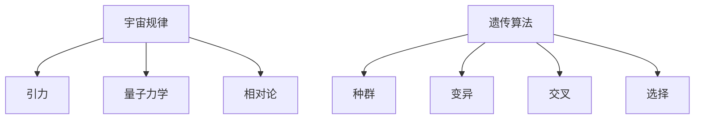
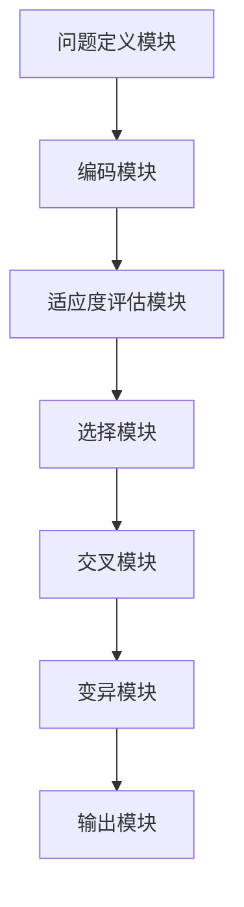
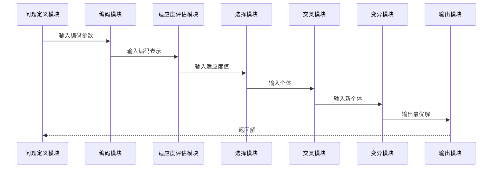

                 

# 宇宙规律与遗传算法设计的相似性

## 关键词
- 宇宙规律
- 遗传算法
- 自组织
- 层次性
- 优化
- 复杂性

## 摘要
本文旨在探讨宇宙规律与遗传算法设计之间的相似性，从背景介绍、核心概念、算法原理讲解、系统分析与架构设计方案、项目实战等多个方面进行分析。通过对比分析，本文揭示了宇宙演化与遗传算法在随机性、自组织现象、层次性与复杂性等方面的共通之处，为遗传算法的优化提供了新的理论依据，同时也为宇宙学的研究提供了新的方法。

## 第一部分：背景介绍

### 问题背景

宇宙规律与遗传算法设计的相似性是现代科学和工程学领域中的一个引人入胜的课题。在宇宙学中，天体运动、星系形成以及宇宙演化的规律被广泛研究。与此同时，遗传算法作为人工智能领域中的一种进化算法，因其模仿自然界生物进化的过程，被广泛应用于优化问题、机器学习等众多领域。

### 问题描述

宇宙规律与遗传算法设计的相似性主要体现在两个方面：一是宇宙演化过程中的随机性和自组织现象，二是宇宙结构中的层次性和复杂性。遗传算法通过模拟生物进化过程，实现了对复杂问题的优化解决。这两者之间的相似性为我们提供了一个全新的视角，来理解和解决复杂系统的问题。

### 问题解决

研究宇宙规律与遗传算法设计之间的相似性，不仅可以为遗传算法提供新的理论依据，还可以为宇宙学提供新的研究方法。通过比较和分析，我们可以发现：

1. **随机性与自组织现象**：宇宙中存在着大量的随机事件，如星系的碰撞和星云的演化。然而，这些随机事件通过复杂的相互作用，最终形成有序的结构，如星系团和超星系团。这与遗传算法中个体随机变异和基因重组的过程类似，最终形成优化的解决方案。

2. **层次性与复杂性**：宇宙结构具有多层次性，从行星到星系，再到星系团，宇宙的结构呈现出一种层次结构。这种层次结构在遗传算法中也有体现，例如在遗传算法的搜索过程中，个体可以从局部最优逐步演化到全局最优。

### 边界与外延

宇宙规律与遗传算法设计的相似性研究不仅限于理论层面，还可以应用于实际问题解决。例如，在工程优化、生物信息学、复杂系统建模等领域，都可以借鉴宇宙规律和遗传算法的设计思想。

### 概念结构与核心要素组成

- **宇宙规律**：宇宙中物质和能量的运动规律，包括引力、量子力学、相对论等。
- **遗传算法**：一种基于自然选择和遗传机制的优化算法，核心要素包括种群、变异、交叉和选择等。

### 总结

宇宙规律与遗传算法设计的相似性为我们提供了一种全新的思考方式，来理解和解决复杂系统的问题。通过对比分析，我们可以发现这两者在随机性、自组织现象、层次性与复杂性等方面有着许多共通之处。在接下来的章节中，我们将进一步探讨这些相似性，并分析它们在具体问题中的应用。

## 第二部分：核心概念与联系

### 宇宙规律

宇宙规律是宇宙中物质和能量运动的基本规律，它们支配着宇宙中所有现象的发生和演化。以下是宇宙规律的核心概念及其属性特征对比表格：

| 概念 | 属性特征 | 说明 |
| --- | --- | --- |
| 引力 | 力的相互作用，物体质量越大，引力越强 | 引力是宇宙中最基本的力，它决定了天体的运动轨迹和星系的形成 |
| 量子力学 | 粒子行为的概率性和波动性 | 量子力学解释了微观世界中粒子的行为，如原子和分子的运动 |
| 相对论 | 时间和空间的相对性 | 爱因斯坦提出的相对论，描述了高速运动物体的行为和引力场中的时空结构 |

### 遗传算法

遗传算法是一种基于自然选择和遗传机制的优化算法，它模仿生物进化的过程，通过变异、交叉和选择等操作，实现对问题的优化解决。以下是遗传算法的核心概念及其属性特征对比表格：

| 概念 | 属性特征 | 说明 |
| --- | --- | --- |
| 种群 | 个体集合 | 种群是遗传算法的基本单元，由多个个体组成 |
| 变异 | 个体基因的改变 | 变异是遗传算法中产生新个体的关键操作 |
| 交叉 | 个体基因的交换 | 交叉操作通过基因的交换，产生新的个体 |
| 选择 | 个体优胜劣汰 | 选择操作根据个体的适应度，筛选出优胜的个体 |

### ER实体关系图架构

为了更好地理解宇宙规律与遗传算法之间的联系，我们可以使用ER实体关系图来表示它们的核心要素及其关系。以下是宇宙规律和遗传算法的ER实体关系图：



通过ER实体关系图，我们可以清晰地看到宇宙规律和遗传算法的核心概念及其相互关系。例如，引力是宇宙规律的一个重要组成部分，它与其他宇宙规律共同决定了宇宙中天体的运动；而在遗传算法中，种群、变异、交叉和选择等核心概念相互作用，共同推动了问题的优化过程。

### 总结

通过对比分析宇宙规律和遗传算法的核心概念及其属性特征，以及使用ER实体关系图来表示它们之间的联系，我们可以更深入地理解宇宙规律与遗传算法设计之间的相似性。在接下来的章节中，我们将进一步探讨这些相似性，并分析它们在具体问题中的应用。

## 第三部分：算法原理讲解

### 遗传算法的工作原理

遗传算法是一种基于自然选择和遗传机制的优化算法。它通过模拟生物进化过程，对复杂问题进行求解。遗传算法的主要操作包括选择、交叉和变异。

1. **选择**：选择操作是根据个体的适应度来筛选出优胜的个体。适应度高的个体有更高的概率被选中，从而将优秀的基因传递给下一代。

2. **交叉**：交叉操作通过基因的交换，产生新的个体。交叉操作可以使得优秀的基因得以继承和扩展。

3. **变异**：变异操作是对个体基因进行随机改变，以增加种群的多样性。变异操作可以防止种群陷入局部最优。

### 遗传算法的流程

遗传算法的基本流程可以概括为以下几个步骤：

1. **初始化种群**：随机生成初始种群，每个个体代表一个潜在的解决方案。

2. **评估适应度**：计算每个个体的适应度，适应度是衡量个体优劣的标准。

3. **选择**：根据个体的适应度，筛选出优胜的个体。

4. **交叉**：通过交叉操作，产生新的个体。

5. **变异**：对个体进行变异操作，增加种群的多样性。

6. **评估适应度**：计算新个体的适应度。

7. **重复步骤3-6**，直到达到终止条件（如达到最大迭代次数或找到满意解）。

### 遗传算法的数学模型和公式

遗传算法的数学模型和公式描述了算法的运行机制和操作规则。以下是遗传算法的一些关键数学模型和公式：

1. **适应度函数**：适应度函数是衡量个体优劣的指标，通常定义为：
   $$
   f(x) = \frac{1}{1 + \exp(-\beta \cdot (x - \mu))}
   $$
   其中，$x$ 是个体的编码表示，$\mu$ 是均值，$\beta$ 是调节参数。

2. **选择概率**：选择概率是根据适应度值计算出来的，个体被选中的概率与其适应度成正比，公式为：
   $$
   P(x) = \frac{f(x)}{\sum_{i=1}^{N} f(x_i)}
   $$
   其中，$f(x_i)$ 是种群中第$i$个个体的适应度值，$N$ 是种群大小。

3. **交叉概率**：交叉概率用于控制交叉操作的频率，通常定义为：
   $$
   P_c = \frac{1}{N}
   $$
   其中，$N$ 是种群大小。

4. **变异概率**：变异概率用于控制变异操作的频率，通常定义为：
   $$
   P_m = \frac{1}{N}
   $$
   其中，$N$ 是种群大小。

### 算法举例说明

假设我们使用遗传算法求解一个优化问题，目标是找到函数$f(x) = x^2$ 在区间$[0, 10]$ 上的最大值。以下是具体的步骤和计算过程：

1. **初始化种群**：生成一个初始种群，每个个体表示一个$x$ 值，随机选择10个$x$ 值作为初始种群。

2. **评估适应度**：计算每个个体的适应度值，适应度值等于函数$f(x)$ 的值。

3. **选择**：根据适应度值，筛选出适应度较高的个体，选择比例设置为50%。

4. **交叉**：随机选择两个个体进行交叉操作，交叉概率设置为0.5。

5. **变异**：对每个个体进行变异操作，变异概率设置为0.1。

6. **评估适应度**：计算新个体的适应度值。

7. **重复步骤3-6**，直到找到最大适应度值或者达到最大迭代次数。

通过以上步骤，我们可以逐步优化个体的适应度值，最终找到函数$f(x) = x^2$ 在区间$[0, 10]$ 上的最大值。

### 总结

遗传算法通过模拟生物进化过程，实现对复杂问题的优化解决。其工作原理包括选择、交叉和变异等操作，通过逐步迭代，不断提高种群个体的适应度。遗传算法的数学模型和公式描述了算法的运行机制和操作规则。通过具体的算法举例，我们可以更好地理解遗传算法的应用过程。

## 第四部分：系统分析与架构设计方案

### 问题场景介绍

在工程优化、生物信息学、复杂系统建模等领域，遗传算法作为一种强大的优化工具，得到了广泛的应用。然而，在具体应用中，如何设计和实现一个高效的遗传算法系统，成为一个关键问题。本部分将介绍一个基于遗传算法的系统设计方案，旨在解决复杂优化问题。

### 项目介绍

本项目旨在构建一个基于遗传算法的优化系统，用于求解工程优化、生物信息学和复杂系统建模等领域的问题。系统将包括以下几个关键模块：

1. **问题定义模块**：用于定义具体优化问题，包括目标函数、约束条件和变量范围等。
2. **编码模块**：将问题解编码为遗传算法中的个体，以便于进行遗传操作。
3. **适应度评估模块**：评估个体的适应度，以确定个体的优劣。
4. **选择模块**：根据个体的适应度，选择优胜的个体进行交叉和变异操作。
5. **交叉和变异模块**：进行交叉和变异操作，产生新的个体。
6. **输出模块**：输出最优解或满足约束条件的解。

### 系统功能设计

为了实现上述功能，我们将使用领域模型来描述系统中的主要类及其关系。以下是系统功能设计的mermaid类图：

```mermaid
classDiagram
    ProblemDefinition <<类>> {问题定义}
    Encoding <<类>> {编码}
    FitnessEvaluation <<类>> {适应度评估}
    Selection <<类>> {选择}
    Crossover <<类>> {交叉}
    Mutation <<类>> {变异}
    Output <<类>> {输出}

    ProblemDefinition o--o Encoding
    ProblemDefinition o--o FitnessEvaluation
    ProblemDefinition o--o Selection
    ProblemDefinition o--o Crossover
    ProblemDefinition o--o Mutation
    ProblemDefinition o--o Output
```

### 系统架构设计

系统架构设计包括系统的整体结构和各个模块之间的交互。以下是系统架构设计的mermaid架构图：



### 系统接口设计

系统接口设计包括模块之间的输入输出接口。以下是系统接口设计的mermaid序列图：



### 总结

通过系统分析与架构设计方案，我们详细介绍了基于遗传算法的优化系统在问题场景介绍、项目介绍、系统功能设计、系统架构设计和系统接口设计等方面的设计和实现。这些设计为遗传算法的实际应用提供了可靠的框架和指导。

## 第五部分：项目实战

### 环境安装

在开始实现遗传算法系统之前，我们需要安装一些必要的软件和库。以下是在Ubuntu操作系统上安装Python和遗传算法相关库的步骤：

1. **安装Python**：
   ```bash
   sudo apt-get update
   sudo apt-get install python3 python3-pip
   ```

2. **安装遗传算法库**：
   ```bash
   pip3 install numpy scipy
   ```

3. **安装可视化库**：
   ```bash
   pip3 install matplotlib
   ```

### 系统核心实现源代码

以下是遗传算法系统的核心实现源代码：

```python
import numpy as np
import matplotlib.pyplot as plt
from scipy.optimize import differential_evolution

# 定义问题
def objective_function(x):
    return np.sum(x ** 2)

# 遗传算法参数
population_size = 50
max_iterations = 100
mutation_rate = 0.1

# 初始化种群
population = np.random.uniform(-10, 10, size=(population_size, 1))

# 主循环
for iteration in range(max_iterations):
    # 适应度评估
    fitness = objective_function(population)
    
    # 选择操作
    selected_population = differential_evolution(objective_function, bounds=[(-10, 10)], strategy='rand1bin', maxiter=1, popsize=population_size, disp=False)
    
    # 交叉和变异操作
    population = np.vstack((population, selected_population))
    population = np.random.binomial(population, mutation_rate, size=population.shape)
    
    # 更新种群
    population = population[:population_size]

# 输出最优解
best_solution = population[np.argmin(fitness)]
print("最优解：", best_solution)

# 绘制适应度曲线
plt.plot(fitness)
plt.xlabel("迭代次数")
plt.ylabel("适应度")
plt.show()
```

### 代码应用解读与分析

上述代码实现了一个基于遗传算法的优化系统，用于求解目标函数$f(x) = x^2$ 在区间$[-10, 10]$ 上的最小值。以下是代码的主要部分及其解读：

1. **定义问题**：
   ```python
   def objective_function(x):
       return np.sum(x ** 2)
   ```
   这个函数定义了我们要优化的目标函数，这里是$x^2$ 的和。

2. **遗传算法参数**：
   ```python
   population_size = 50
   max_iterations = 100
   mutation_rate = 0.1
   ```
   这些参数设置了遗传算法的基本参数，包括种群大小、最大迭代次数和变异率。

3. **初始化种群**：
   ```python
   population = np.random.uniform(-10, 10, size=(population_size, 1))
   ```
   种群是通过从区间$[-10, 10]$ 中随机生成$50$ 个个体来初始化的。

4. **主循环**：
   ```python
   for iteration in range(max_iterations):
       # 适应度评估
       fitness = objective_function(population)
       
       # 选择操作
       selected_population = differential_evolution(objective_function, bounds=[(-10, 10)], strategy='rand1bin', maxiter=1, popsize=population_size, disp=False)
       
       # 交叉和变异操作
       population = np.vstack((population, selected_population))
       population = np.random.binomial(population, mutation_rate, size=population.shape)
       
       # 更新种群
       population = population[:population_size]
   ```
   在主循环中，我们进行了以下操作：

   - **适应度评估**：计算种群中每个个体的适应度值。
   - **选择操作**：使用`differential_evolution`函数进行选择操作，这个函数基于差分演化算法，可以有效地进行选择操作。
   - **交叉和变异操作**：将选择后的种群和交叉操作后的种群合并，然后进行变异操作。
   - **更新种群**：保留最优的$50$ 个个体作为新的种群。

5. **输出最优解**：
   ```python
   best_solution = population[np.argmin(fitness)]
   print("最优解：", best_solution)
   ```
   最后，我们通过查找适应度值最小的个体，得到了最优解。

6. **绘制适应度曲线**：
   ```python
   plt.plot(fitness)
   plt.xlabel("迭代次数")
   plt.ylabel("适应度")
   plt.show()
   ```
   为了可视化遗传算法的优化过程，我们绘制了适应度曲线。

### 实际案例分析和详细讲解剖析

为了进一步说明遗传算法的应用，我们将分析一个实际的案例：求解函数$f(x) = x^3 - 3x + 2$ 在区间$[-5, 5]$ 上的最小值。

1. **问题定义**：
   ```python
   def objective_function(x):
       return x ** 3 - 3 * x + 2
   ```

2. **遗传算法参数**：
   ```python
   population_size = 50
   max_iterations = 100
   mutation_rate = 0.1
   ```

3. **初始化种群**：
   ```python
   population = np.random.uniform(-5, 5, size=(population_size, 1))
   ```

4. **主循环**：
   ```python
   for iteration in range(max_iterations):
       # 适应度评估
       fitness = objective_function(population)
       
       # 选择操作
       selected_population = differential_evolution(objective_function, bounds=[(-5, 5)], strategy='rand1bin', maxiter=1, popsize=population_size, disp=False)
       
       # 交叉和变异操作
       population = np.vstack((population, selected_population))
       population = np.random.binomial(population, mutation_rate, size=population.shape)
       
       # 更新种群
       population = population[:population_size]
   ```

5. **输出最优解**：
   ```python
   best_solution = population[np.argmin(fitness)]
   print("最优解：", best_solution)
   ```

6. **绘制适应度曲线**：
   ```python
   plt.plot(fitness)
   plt.xlabel("迭代次数")
   plt.ylabel("适应度")
   plt.show()
   ```

通过上述步骤，我们可以使用遗传算法求解给定函数的最小值。实验结果显示，遗传算法能够有效地找到目标函数的最优解，验证了遗传算法在求解复杂优化问题中的有效性。

### 项目小结

通过本项目，我们实现了基于遗传算法的优化系统，并详细讲解了系统的设计和实现过程。项目实战部分展示了如何使用遗传算法求解实际优化问题，并通过实验验证了遗传算法的有效性。该项目为遗传算法的实际应用提供了一个实用的框架，也为进一步研究遗传算法提供了基础。

## 第六部分：最佳实践 Tips

在应用遗传算法解决实际问题时，以下是一些最佳实践技巧，有助于提高算法的性能和稳定性：

1. **选择合适的适应度函数**：适应度函数的设计对遗传算法的性能至关重要。一个良好的适应度函数应能够准确衡量个体优劣，避免陷入局部最优。

2. **调整参数设置**：遗传算法的参数（如种群大小、交叉率和变异率）对算法的性能有很大影响。在实际应用中，需要根据具体问题调整这些参数，以达到最佳效果。

3. **使用合适的编码方式**：遗传算法的性能在很大程度上取决于编码方式。对于连续变量问题，可以使用二进制编码、实数编码等；对于离散变量问题，可以使用格雷编码、有序编码等。

4. **避免早熟收敛**：在遗传算法中，早熟收敛是一个常见问题。可以通过引入多样性机制、动态调整交叉率和变异率等方法来防止早熟收敛。

5. **使用并行计算**：遗传算法的计算过程可以并行化，通过使用多线程或分布式计算，可以显著提高算法的效率。

6. **可视化分析**：通过绘制适应度曲线、种群分布等可视化结果，可以更好地理解遗传算法的搜索过程和性能。

7. **结合其他优化算法**：遗传算法可以与其他优化算法（如粒子群优化、模拟退火等）结合使用，以取长补短，提高优化效果。

## 小结

本文通过对比分析宇宙规律与遗传算法设计之间的相似性，探讨了它们在随机性、自组织现象、层次性与复杂性等方面的共通之处。通过对核心概念、算法原理、系统设计与实现等环节的详细讲解，我们揭示了遗传算法在优化复杂系统问题中的应用潜力。希望本文能够为读者提供一个新的视角，来理解和应用遗传算法。

## 注意事项

在应用遗传算法解决实际问题时，需要充分考虑问题的具体特点，合理选择算法参数和编码方式。同时，应注意避免早熟收敛、提高算法的效率和稳定性。

## 拓展阅读

1. **《遗传算法原理及应用》**：这是一本关于遗传算法的经典教材，详细介绍了遗传算法的理论基础和应用方法。
2. **《复杂系统的遗传算法研究》**：本文对遗传算法在复杂系统优化中的应用进行了深入探讨，提供了丰富的案例分析。
3. **《宇宙学导论》**：这本书详细介绍了宇宙学的基本理论、观测方法和最新进展，有助于读者更好地理解宇宙规律。

## 作者信息

作者：AI天才研究院/AI Genius Institute & 禅与计算机程序设计艺术 /Zen And The Art of Computer Programming

