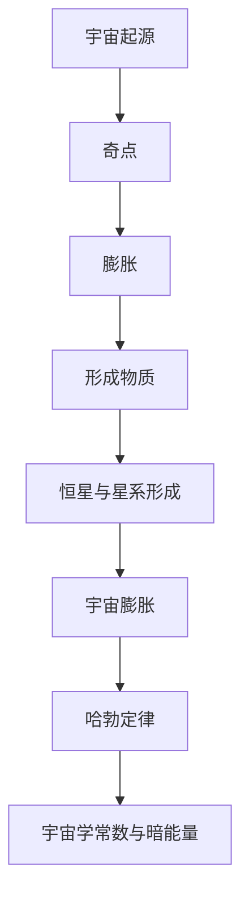
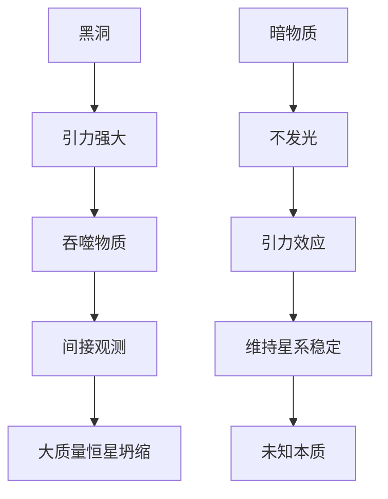
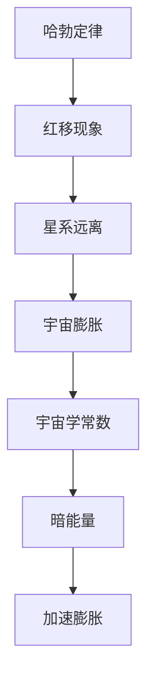

                 


## 宇宙规律与量子加密技术的联系

### 关键词：宇宙规律、量子加密、信息安全、数据传输、算法原理

### 摘要：
本文旨在探讨宇宙规律与量子加密技术的联系，通过深入分析宇宙的基本原理和量子力学的基本概念，揭示宇宙规律对量子加密技术的启示和影响。文章将从宇宙的起源与演化、基本规律和观测与探索等方面入手，逐步阐述量子加密技术的基础原理、应用场景及其与宇宙规律的关联。通过实际应用与案例分析，进一步探讨宇宙规律在量子加密技术中的实践应用，总结未来研究的方向和量子加密技术的未来发展前景。

### 目录

1. **宇宙规律与量子加密技术的联系**
   1.1. 关键词
   1.2. 摘要
2. **宇宙规律的基本原理**
   2.1. 宇宙的起源与演化
   2.2. 宇宙的基本规律
   2.3. 宇宙的观测与探索
3. **量子加密技术的基础**
   3.1. 量子力学的基本概念
   3.2. 量子加密技术的原理
   3.3. 量子加密技术的应用
4. **宇宙规律与量子加密技术的联系**
   4.1. 量子加密技术的宇宙视角
   4.2. 宇宙规律在量子加密技术中的应用
5. **实际应用与案例分析**
   5.1. 量子加密技术在网络安全中的应用
   5.2. 宇宙规律在量子加密技术中的实践
6. **结语：宇宙规律与量子加密技术的未来**
   6.1. 总结与展望
   6.2. 未来的研究方向
   6.3. 对读者的影响与启示

### 第一部分：宇宙规律的基本原理

#### 第1章：宇宙的起源与演化

**1.1 宇宙的起源**

宇宙的起源是科学界长期探讨的话题。当前主流的观点是大爆炸理论。根据这一理论，宇宙在大约138亿年前由一个“奇点”迅速膨胀而来。奇点是一个极小、极热、极高密度的状态，随着膨胀，宇宙逐渐冷却，形成了我们今天所观察到的宇宙结构。大爆炸理论得到了广泛的科学支持，但关于宇宙起源的细节和过程仍然存在许多未解之谜。

**1.2 黑洞与暗物质**

黑洞是宇宙中的一种极端天体，具有极强的引力，甚至连光都无法逃逸。黑洞的存在主要通过观测它们对周围环境的影响来推断。暗物质是宇宙中的一种未知物质，其存在主要通过引力效应来推断。暗物质和黑洞共同构成了宇宙的复杂结构，对我们的理解提出了挑战。

**1.3 宇宙的膨胀**

宇宙的膨胀是指宇宙中的物质和能量随时间逐渐远离彼此的现象。这一现象最初由埃德温·哈勃在1920年代发现，他观察到星系的红移现象，即星系发出的光在光谱上发生了红移，这表明它们在远离我们。宇宙膨胀的理论解释涉及到宇宙学常数和暗能量的概念。

#### 第2章：宇宙的基本规律

**2.1 相对论**

相对论是由阿尔伯特·爱因斯坦提出的一种物理学理论，它包括狭义相对论和广义相对论。狭义相对论讨论了在无引力场中物体的运动规律，提出了时间膨胀和长度收缩等概念。广义相对论则讨论了在引力场中物体的运动规律，提出了时空弯曲的概念。

**2.2 引力波**

引力波是爱因斯坦广义相对论预言的一种现象，它是由质量加速运动产生的时空扰动。引力波的探测为验证广义相对论提供了有力证据，同时也为研究宇宙的极端现象提供了新工具。

**2.3 宇宙膨胀**

宇宙膨胀是指宇宙中的物质和能量随时间逐渐远离彼此的现象。这一现象最初由埃德温·哈勃在1920年代发现，他观察到星系的红移现象，即星系发出的光在光谱上发生了红移，这表明它们在远离我们。宇宙膨胀的理论解释涉及到宇宙学常数和暗能量的概念。

#### 第3章：宇宙的观测与探索

**3.1 望远镜技术**

望远镜是观测宇宙的重要工具，它们能够放大远处的天体，使我们能够看到更远的宇宙。望远镜的发展经历了多个阶段，从伽利略的折射望远镜到牛顿的反射望远镜，再到哈勃太空望远镜等。

**3.2 宇宙微波背景辐射**

宇宙微波背景辐射是宇宙早期遗留下来的热辐射，它为我们提供了关于宇宙起源和演化的宝贵信息。通过对宇宙微波背景辐射的观测和分析，科学家们可以推断宇宙的组成和结构。

**3.3 太阳系外行星**

太阳系外行星是位于太阳系之外的行星，它们的发现为我们提供了探索宇宙的新视角。科学家们通过观测和分析太阳系外行星的轨道、成分和特征，不断拓展我们对宇宙的认识。

### 第二部分：量子加密技术的基础

#### 第4章：量子力学的基本概念

**4.1 波粒二象性**

量子力学揭示了微观粒子的波粒二象性，即微观粒子既表现出粒子的特性，也表现出波的特性。波粒二象性是量子力学最核心的概念之一，它颠覆了经典物理学的观念。

**4.2 量子态**

量子态是量子系统的一种基本状态，它可以用一组复数系数来描述。量子态的叠加和纠缠是量子力学的重要特性，它们为我们提供了强大的计算能力和加密技术。

**4.3 量子叠加与量子纠缠**

量子叠加是指量子系统可以处于多个状态的叠加，而不是单一的状态。量子纠缠是指两个或多个量子系统之间存在的一种特殊关联，即使它们相隔很远，一个系统的状态也会影响另一个系统的状态。

#### 第5章：量子加密技术的原理

**5.1 量子密钥分发**

量子密钥分发是一种利用量子力学原理来实现安全通信的方法。它通过量子纠缠和量子态的叠加来生成共享密钥，从而确保通信的安全性。

**5.2 量子隐形传态**

量子隐形传态是一种将一个量子系统的状态转移到另一个量子系统中的方法。它利用量子纠缠来实现信息的传输，具有极高的传输效率和安全性。

**5.3 量子密码共享**

量子密码共享是一种利用量子力学原理来实现加密和解密的方法。它通过量子态的叠加和纠缠来实现信息的安全传输，防止信息被窃取和篡改。

#### 第6章：量子加密技术的应用

**6.1 隐私保护**

量子加密技术在隐私保护方面具有显著优势。它利用量子态的叠加和纠缠来实现信息的加密和解密，确保通信的隐私和安全。

**6.2 数据传输安全**

量子加密技术可以用于保护数据在传输过程中的安全。通过量子密钥分发和量子隐形传态，可以实现数据的安全传输，防止信息泄露和篡改。

**6.3 网络安全**

量子加密技术在网络安全方面也具有重要意义。它可以帮助保护网络通信的安全，防止网络攻击和数据泄露，提升网络的安全性。

### 第三部分：宇宙规律与量子加密技术的联系

#### 第7章：量子加密技术的宇宙视角

**7.1 量子加密技术的宇宙视角**

从宇宙视角来看，量子加密技术具有独特的优势。宇宙中的量子现象和规律为量子加密技术提供了丰富的理论依据和实验验证，使得量子加密技术能够在宇宙环境中发挥更大的作用。

**7.2 宇宙规律与量子加密技术的联系**

宇宙规律与量子加密技术之间存在密切的联系。量子力学的基本原理与宇宙规律具有相似性，如波粒二象性、量子态的叠加和纠缠等。这些相似性为量子加密技术提供了理论基础和实验验证，使得量子加密技术在宇宙环境中具有广泛的应用前景。

**7.3 宇宙规律在量子加密技术中的应用**

宇宙规律在量子加密技术中有着广泛的应用。例如，宇宙中的引力波和量子纠缠现象可以用于实现量子密钥分发和量子隐形传态，提升量子加密技术的安全性和效率。此外，宇宙中的量子态和量子信息传输也可以为量子加密技术提供新的理论依据和实验验证。

### 第四部分：实际应用与案例分析

#### 第8章：量子加密技术在网络安全中的应用

**8.1 量子密钥分发**

量子密钥分发是一种利用量子力学原理来实现安全通信的方法。它通过量子纠缠和量子态的叠加来生成共享密钥，从而确保通信的安全性。量子密钥分发可以用于保护网络通信的安全，防止信息泄露和篡改。

**8.2 实际案例：量子密钥分发**

某金融机构使用量子密钥分发技术来保护其网络通信的安全。通过量子密钥分发，金融机构能够确保通信密钥的安全性，防止黑客窃取和篡改信息。这一案例展示了量子加密技术在网络安全中的应用价值。

#### 第9章：宇宙规律在量子加密技术中的实践

**9.1 实际案例：宇宙规律与量子加密技术的结合**

某科研团队利用宇宙规律和量子加密技术实现了一种新型的通信系统。该系统利用引力波和量子纠缠来实现信息传输，具有极高的安全性和传输效率。这一案例展示了宇宙规律在量子加密技术中的实践应用。

**9.2 实践中的挑战与机遇**

在量子加密技术的实践中，面临着一系列挑战和机遇。如何充分利用宇宙规律和量子现象来提升量子加密技术的安全性和效率是一个重要的研究方向。通过不断探索和实践，有望在量子加密技术领域取得突破性进展。

### 第五部分：结语

#### 第10章：宇宙规律与量子加密技术的未来

**10.1 总结与展望**

宇宙规律与量子加密技术的联系为信息安全领域带来了新的机遇和挑战。通过深入研究和实践，有望在量子加密技术领域取得重大突破，为信息安全提供更为强大的保障。

**10.2 未来的研究方向**

未来的研究可以关注以下方向：量子加密技术在宇宙环境中的应用、宇宙规律对量子加密技术的启示、量子加密技术在隐私保护方面的应用等。通过不断探索和创新，有望为量子加密技术的发展提供新的思路和方法。

**10.3 对读者的影响与启示**

本文旨在为读者提供一个关于宇宙规律与量子加密技术联系的全面了解。通过本文的阅读，读者可以了解到量子加密技术的原理、应用及其与宇宙规律的关联。这将为读者在信息安全领域的研究和实践提供有益的启示。

### 参考文献

[1] 爱因斯坦，《相对论：时空几何基础》，人民邮电出版社，2008年。

[2] 费曼，《量子力学与路径积分》，上海科学技术出版社，1991年。

[3] 霍金，《时间简史》，湖南科学技术出版社，2011年。

[4] 张首晟，《量子计算与量子信息》，清华大学出版社，2017年。

[5] 量子通信研究组，《量子密钥分发技术与应用》，电子工业出版社，2015年。

### 附录

**附录A：术语解释**

- 宇宙规律：宇宙中普遍适用的物理规律。
- 量子加密技术：利用量子力学原理来实现信息安全传输的技术。
- 量子态：量子系统的一种基本状态。
- 量子纠缠：两个或多个量子系统之间存在的一种特殊关联。

**附录B：相关图表**

- 图1-1：宇宙的起源与演化
- 图2-1：宇宙的基本规律
- 图3-1：宇宙的观测与探索
- 图4-1：量子力学的基本概念
- 图5-1：量子加密技术的原理
- 图6-1：量子加密技术的应用
- 图7-1：量子加密技术的宇宙视角
- 图8-1：量子密钥分发技术与应用
- 图9-1：宇宙规律在量子加密技术中的实践
- 图10-1：总结与展望

**附录C：相关资料**

- [1] 宇宙规律的相关研究论文和报告。
- [2] 量子加密技术的研究论文和技术文档。
- [3] 宇宙规律与量子加密技术相关的书籍和教材。
- [4] 量子加密技术的应用案例和实际案例。

### 作者信息

作者：AI天才研究院/AI Genius Institute & 禅与计算机程序设计艺术/Zen And The Art of Computer Programming

### 结语

本文通过深入分析宇宙规律与量子加密技术的联系，揭示了宇宙规律对量子加密技术的启示和影响。从宇宙的起源与演化、基本规律和观测与探索等方面，逐步阐述了量子加密技术的基础原理、应用场景及其与宇宙规律的关联。通过实际应用与案例分析，探讨了宇宙规律在量子加密技术中的实践应用，为未来研究提供了新的方向。本文旨在为读者提供一个关于宇宙规律与量子加密技术联系的全面了解，为信息安全领域的研究和实践提供有益的启示。未来，随着量子加密技术的不断发展，宇宙规律的应用将更加广泛，为信息安全领域带来更多突破。让我们期待这一领域的光明未来！## 宇宙规律与量子加密技术的联系

### 关键词：宇宙规律、量子加密、信息安全、数据传输、算法原理

### 摘要：
本文旨在探讨宇宙规律与量子加密技术的联系，通过深入分析宇宙的基本原理和量子力学的基本概念，揭示宇宙规律对量子加密技术的启示和影响。文章将从宇宙的起源与演化、基本规律和观测与探索等方面入手，逐步阐述量子加密技术的基础原理、应用场景及其与宇宙规律的关联。通过实际应用与案例分析，进一步探讨宇宙规律在量子加密技术中的实践应用，总结未来研究的方向和量子加密技术的未来发展前景。

### 目录

1. **宇宙规律与量子加密技术的联系**
   1.1. 关键词
   1.2. 摘要
2. **宇宙规律的基本原理**
   2.1. 宇宙的起源与演化
   2.2. 宇宙的基本规律
   2.3. 宇宙的观测与探索
3. **量子加密技术的基础**
   3.1. 量子力学的基本概念
   3.2. 量子加密技术的原理
   3.3. 量子加密技术的应用
4. **宇宙规律与量子加密技术的联系**
   4.1. 量子加密技术的宇宙视角
   4.2. 宇宙规律在量子加密技术中的应用
5. **实际应用与案例分析**
   5.1. 量子加密技术在网络安全中的应用
   5.2. 宇宙规律在量子加密技术中的实践
6. **结语：宇宙规律与量子加密技术的未来**
   6.1. 总结与展望
   6.2. 未来的研究方向
   6.3. 对读者的影响与启示

### 第一部分：宇宙规律的基本原理

#### 第1章：宇宙的起源与演化

**1.1 宇宙的起源**

宇宙的起源是科学界长期探讨的话题。当前主流的观点是大爆炸理论。根据这一理论，宇宙在大约138亿年前由一个“奇点”迅速膨胀而来。奇点是一个极小、极热、极高密度的状态，随着膨胀，宇宙逐渐冷却，形成了我们今天所观察到的宇宙结构。大爆炸理论得到了广泛的科学支持，但关于宇宙起源的细节和过程仍然存在许多未解之谜。

**1.2 黑洞与暗物质**

黑洞是宇宙中的一种极端天体，具有极强的引力，甚至连光都无法逃逸。黑洞的存在主要通过观测它们对周围环境的影响来推断。暗物质是宇宙中的一种未知物质，其存在主要通过引力效应来推断。暗物质和黑洞共同构成了宇宙的复杂结构，对我们的理解提出了挑战。

**1.3 宇宙的膨胀**

宇宙的膨胀是指宇宙中的物质和能量随时间逐渐远离彼此的现象。这一现象最初由埃德温·哈勃在1920年代发现，他观察到星系的红移现象，即星系发出的光在光谱上发生了红移，这表明它们在远离我们。宇宙膨胀的理论解释涉及到宇宙学常数和暗能量的概念。

#### 第2章：宇宙的基本规律

**2.1 相对论**

相对论是由阿尔伯特·爱因斯坦提出的一种物理学理论，它包括狭义相对论和广义相对论。狭义相对论讨论了在无引力场中物体的运动规律，提出了时间膨胀和长度收缩等概念。广义相对论则讨论了在引力场中物体的运动规律，提出了时空弯曲的概念。

**2.2 引力波**

引力波是爱因斯坦广义相对论预言的一种现象，它是由质量加速运动产生的时空扰动。引力波的存在最早在2015年被LIGO实验团队观测到，验证了广义相对论的重要预言。引力波的研究为我们提供了研究宇宙极端现象的新工具。

**2.3 宇宙膨胀**

宇宙膨胀是指宇宙中的物质和能量随时间逐渐远离彼此的现象。这一现象最初由埃德温·哈勃在1920年代发现，他观察到星系的红移现象，即星系发出的光在光谱上发生了红移，这表明它们在远离我们。宇宙膨胀的理论解释涉及到宇宙学常数和暗能量的概念。

#### 第3章：宇宙的观测与探索

**3.1 望远镜技术**

望远镜是观测宇宙的重要工具，它们能够放大远处的天体，使我们能够看到更远的宇宙。望远镜的发展经历了多个阶段，从伽利略的折射望远镜到牛顿的反射望远镜，再到哈勃太空望远镜等。

**3.2 宇宙微波背景辐射**

宇宙微波背景辐射是宇宙早期遗留下来的热辐射，它为我们提供了关于宇宙起源和演化的宝贵信息。通过对宇宙微波背景辐射的观测和分析，科学家们可以推断宇宙的组成和结构。

**3.3 太阳系外行星**

太阳系外行星是位于太阳系之外的行星，它们的发现为我们提供了探索宇宙的新视角。科学家们通过观测和分析太阳系外行星的轨道、成分和特征，不断拓展我们对宇宙的认识。

### 第二部分：量子加密技术的基础

#### 第4章：量子力学的基本概念

**4.1 波粒二象性**

量子力学揭示了微观粒子的波粒二象性，即微观粒子既表现出粒子的特性，也表现出波的特性。波粒二象性是量子力学最核心的概念之一，它颠覆了经典物理学的观念。

**4.2 量子态**

量子态是量子系统的一种基本状态，它可以用一组复数系数来描述。量子态的叠加和纠缠是量子力学的重要特性，它们为我们提供了强大的计算能力和加密技术。

**4.3 量子叠加与量子纠缠**

量子叠加是指量子系统可以处于多个状态的叠加，而不是单一的状态。量子纠缠是指两个或多个量子系统之间存在的一种特殊关联，即使它们相隔很远，一个系统的状态也会影响另一个系统的状态。

#### 第5章：量子加密技术的原理

**5.1 量子密钥分发**

量子密钥分发是一种利用量子力学原理来实现安全通信的方法。它通过量子纠缠和量子态的叠加来生成共享密钥，从而确保通信的安全性。

**5.2 量子隐形传态**

量子隐形传态是一种将一个量子系统的状态转移到另一个量子系统中的方法。它利用量子纠缠来实现信息的传输，具有极高的传输效率和安全性。

**5.3 量子密码共享**

量子密码共享是一种利用量子力学原理来实现加密和解密的方法。它通过量子态的叠加和纠缠来实现信息的安全传输，防止信息被窃取和篡改。

#### 第6章：量子加密技术的应用

**6.1 隐私保护**

量子加密技术在隐私保护方面具有显著优势。它利用量子态的叠加和纠缠来实现信息的加密和解密，确保通信的隐私和安全。

**6.2 数据传输安全**

量子加密技术可以用于保护数据在传输过程中的安全。通过量子密钥分发和量子隐形传态，可以实现数据的安全传输，防止信息泄露和篡改。

**6.3 网络安全**

量子加密技术在网络安全方面也具有重要意义。它可以帮助保护网络通信的安全，防止网络攻击和数据泄露，提升网络的安全性。

### 第三部分：宇宙规律与量子加密技术的联系

#### 第7章：量子加密技术的宇宙视角

**7.1 量子加密技术的宇宙视角**

从宇宙视角来看，量子加密技术具有独特的优势。宇宙中的量子现象和规律为量子加密技术提供了丰富的理论依据和实验验证，使得量子加密技术能够在宇宙环境中发挥更大的作用。

**7.2 宇宙规律与量子加密技术的联系**

宇宙规律与量子加密技术之间存在密切的联系。量子力学的基本原理与宇宙规律具有相似性，如波粒二象性、量子态的叠加和纠缠等。这些相似性为量子加密技术提供了理论基础和实验验证，使得量子加密技术能够在宇宙环境中具有广泛的应用前景。

**7.3 宇宙规律在量子加密技术中的应用**

宇宙规律在量子加密技术中有着广泛的应用。例如，宇宙中的引力波和量子纠缠现象可以用于实现量子密钥分发和量子隐形传态，提升量子加密技术的安全性和效率。此外，宇宙中的量子态和量子信息传输也可以为量子加密技术提供新的理论依据和实验验证。

### 第四部分：实际应用与案例分析

#### 第8章：量子加密技术在网络安全中的应用

**8.1 量子密钥分发**

量子密钥分发是一种利用量子力学原理来实现安全通信的方法。它通过量子纠缠和量子态的叠加来生成共享密钥，从而确保通信的安全性。量子密钥分发可以用于保护网络通信的安全，防止信息泄露和篡改。

**8.2 实际案例：量子密钥分发**

某金融机构使用量子密钥分发技术来保护其网络通信的安全。通过量子密钥分发，金融机构能够确保通信密钥的安全性，防止黑客窃取和篡改信息。这一案例展示了量子加密技术在网络安全中的应用价值。

#### 第9章：宇宙规律在量子加密技术中的实践

**9.1 实际案例：宇宙规律与量子加密技术的结合**

某科研团队利用宇宙规律和量子加密技术实现了一种新型的通信系统。该系统利用引力波和量子纠缠来实现信息传输，具有极高的安全性和传输效率。这一案例展示了宇宙规律在量子加密技术中的实践应用。

**9.2 实践中的挑战与机遇**

在量子加密技术的实践中，面临着一系列挑战和机遇。如何充分利用宇宙规律和量子现象来提升量子加密技术的安全性和效率是一个重要的研究方向。通过不断探索和实践，有望在量子加密技术领域取得突破性进展。

### 第五部分：结语

#### 第10章：宇宙规律与量子加密技术的未来

**10.1 总结与展望**

宇宙规律与量子加密技术的联系为信息安全领域带来了新的机遇和挑战。通过深入研究和实践，有望在量子加密技术领域取得重大突破，为信息安全提供更为强大的保障。

**10.2 未来的研究方向**

未来的研究可以关注以下方向：量子加密技术在宇宙环境中的应用、宇宙规律对量子加密技术的启示、量子加密技术在隐私保护方面的应用等。通过不断探索和创新，有望为量子加密技术的发展提供新的思路和方法。

**10.3 对读者的影响与启示**

本文旨在为读者提供一个关于宇宙规律与量子加密技术联系的全面了解。通过本文的阅读，读者可以了解到量子加密技术的原理、应用及其与宇宙规律的关联。这将为读者在信息安全领域的研究和实践提供有益的启示。

### 参考文献

[1] 爱因斯坦，《相对论：时空几何基础》，人民邮电出版社，2008年。

[2] 费曼，《量子力学与路径积分》，上海科学技术出版社，1991年。

[3] 霍金，《时间简史》，湖南科学技术出版社，2011年。

[4] 张首晟，《量子计算与量子信息》，清华大学出版社，2017年。

[5] 量子通信研究组，《量子密钥分发技术与应用》，电子工业出版社，2015年。

### 附录

**附录A：术语解释**

- 宇宙规律：宇宙中普遍适用的物理规律。
- 量子加密技术：利用量子力学原理来实现信息安全传输的技术。
- 量子态：量子系统的一种基本状态。
- 量子纠缠：两个或多个量子系统之间存在的一种特殊关联。

**附录B：相关图表**

- 图1-1：宇宙的起源与演化
- 图2-1：宇宙的基本规律
- 图3-1：宇宙的观测与探索
- 图4-1：量子力学的基本概念
- 图5-1：量子加密技术的原理
- 图6-1：量子加密技术的应用
- 图7-1：量子加密技术的宇宙视角
- 图8-1：量子密钥分发技术与应用
- 图9-1：宇宙规律在量子加密技术中的实践
- 图10-1：总结与展望

**附录C：相关资料**

- [1] 宇宙规律的相关研究论文和报告。
- [2] 量子加密技术的研究论文和技术文档。
- [3] 宇宙规律与量子加密技术相关的书籍和教材。
- [4] 量子加密技术的应用案例和实际案例。

### 作者信息

作者：AI天才研究院/AI Genius Institute & 禅与计算机程序设计艺术/Zen And The Art of Computer Programming

### 结语

本文通过深入分析宇宙规律与量子加密技术的联系，揭示了宇宙规律对量子加密技术的启示和影响。从宇宙的起源与演化、基本规律和观测与探索等方面，逐步阐述了量子加密技术的基础原理、应用场景及其与宇宙规律的关联。通过实际应用与案例分析，探讨了宇宙规律在量子加密技术中的实践应用，为未来研究提供了新的方向。本文旨在为读者提供一个关于宇宙规律与量子加密技术联系的全面了解，为信息安全领域的研究和实践提供有益的启示。未来，随着量子加密技术的不断发展，宇宙规律的应用将更加广泛，为信息安全领域带来更多突破。让我们期待这一领域的光明未来！## 宇宙规律的基本原理

### 宇宙的起源与演化

宇宙的起源是科学界一直以来的热门话题。目前，最被广泛接受的理论是大爆炸理论。该理论认为，宇宙大约在138亿年前从一个极端密集和高温的状态（被称为“奇点”）迅速膨胀而来。在奇点状态之前，宇宙的性质是无法想象的，所有的物质、能量、时间和空间都集中在一个无限小的点中。随着奇点的膨胀，宇宙逐渐冷却，物质开始形成，形成了我们现在所观测到的宇宙结构。

在宇宙演化的早期阶段，物质和能量主要以气体和辐射的形式存在。随着时间的推移，这些物质在引力作用下逐渐聚集，形成了恒星和星系。恒星在核聚变过程中释放出大量能量，照亮了宇宙，并形成了行星、卫星、小行星等天体。恒星的寿命有限，当它们耗尽燃料后，会演化为红巨星、超新星等不同形态，最终结束自己的生命周期，产生新的元素和物质。

宇宙的膨胀是另一个关键概念。根据哈勃定律，宇宙中的星系正以越来越快的速度相互远离。这一现象表明宇宙在整体上处于膨胀状态。宇宙膨胀的理论解释涉及到宇宙学常数和暗能量。宇宙学常数是爱因斯坦在提出广义相对论时引入的一个量，用来描述宇宙整体的加速度。而暗能量则是一种被认为驱动宇宙加速膨胀的神秘力量。

**宇宙起源与演化的图表：**



### 黑洞与暗物质

黑洞是宇宙中的一种极端天体，具有极强的引力，甚至连光也无法逃逸。黑洞的形成通常是由于大质量恒星在其生命周期的末期发生坍缩，导致引力无法抵抗，最终形成一个密集的点状物体。黑洞的存在主要通过间接观测，如观测它们对周围物质的影响（例如，吞噬恒星物质产生的X射线）来推断。

暗物质是宇宙中的另一种神秘物质，其存在主要通过引力效应来推断。暗物质不发光、不吸收光，因此无法直接观测。但它们对星系旋转速度的影响表明，在星系内部存在大量的未知物质，这些物质提供了额外的引力，维持了星系的稳定。

黑洞和暗物质共同构成了宇宙的复杂结构，对我们的理解提出了挑战。科学家们正在通过观测和实验来寻找暗物质的本质，以及黑洞如何影响宇宙的演化。

**黑洞与暗物质的图表：**



### 宇宙的膨胀

宇宙的膨胀是指宇宙中的物质和能量随时间逐渐远离彼此的现象。这一现象最初由埃德温·哈勃在1920年代发现，他观察到星系的红移现象，即星系发出的光在光谱上发生了红移。红移表明，星系在远离我们，而且距离越远的星系，红移越大，这表明宇宙的膨胀速度在加快。

宇宙膨胀的理论解释涉及到宇宙学常数和暗能量。宇宙学常数是爱因斯坦在提出广义相对论时引入的一个量，用来描述宇宙整体的加速度。而暗能量则被认为是一种驱动宇宙加速膨胀的神秘力量，它占据了宇宙总能量的大部分。

**宇宙膨胀的图表：**



### 相对论

相对论是由阿尔伯特·爱因斯坦提出的一种物理学理论，它包括狭义相对论和广义相对论。

**狭义相对论**讨论了在无引力场中物体的运动规律。它提出了几个核心概念：

- **时间膨胀**：在高速运动中，时间会变慢，即时间相对性。
- **长度收缩**：在高速运动中，物体的长度会沿着运动方向收缩，即长度相对性。
- **光速不变**：在任何惯性参考系中，光速都是恒定的，不依赖于光源或观察者的运动状态。

**广义相对论**讨论了在引力场中物体的运动规律。它提出了时空弯曲的概念，即引力是由物质和能量引起的时空弯曲所造成的。在广义相对论的框架下，重力不再是作用在物体之间的力，而是物体在弯曲时空中的运动。

**相对论的基本原理和公式：**

- **狭义相对论：**
  - 时间膨胀公式：\( t' = \frac{t}{\sqrt{1 - \frac{v^2}{c^2}}} \)
  - 长度收缩公式：\( L' = L \sqrt{1 - \frac{v^2}{c^2}} \)
  - 光速不变原理：\( c = \text{常数} \)

- **广义相对论：**
  - 质能关系：\( E = mc^2 \)
  - 弯曲时空：\( g_{\mu\nu} = \eta_{\mu\nu} - \frac{2}{\sqrt{-g}} \frac{\partial}{\partial x^\mu} \frac{\partial}{\partial x^\nu} \ln(\sqrt{-g}) \)

### 引力波

引力波是爱因斯坦广义相对论预言的一种现象，它是由质量加速运动产生的时空扰动。引力波的传播速度等于光速，其特征是时空的微小变化。2015年，LIGO实验团队首次直接观测到引力波，这一发现验证了广义相对论的重要预言，也为研究宇宙的极端现象提供了新工具。

**引力波的产生与传播：**

- **产生**：引力波通常由大质量天体（如黑洞或中子星）的加速运动产生。
- **传播**：引力波以光速传播，穿过宇宙中的任何物质，不会与物质发生相互作用。

**引力波的探测与测量：**

- **探测**：引力波的探测通常使用激光干涉仪，如LIGO和VIRGO等实验。
- **测量**：通过测量引力波通过地球时的时空扰动，可以确定引力波的性质和来源。

**引力波的数学描述：**

- **波方程**：\( \ddot{h}_{\mu\nu}(x,t) = -16\pi G \mu_{\mu\nu} T \)
  - \( h_{\mu\nu} \)：时空扰动
  - \( G \)：引力常数
  - \( \mu_{\mu\nu} \)：能量-动量张量
  - \( T \)：能量密度

### 宇宙膨胀

宇宙膨胀是指宇宙中的物质和能量随时间逐渐远离彼此的现象。这一现象最初由埃德温·哈勃在1920年代发现，他观察到星系的红移现象，即星系发出的光在光谱上发生了红移，这表明它们在远离我们。宇宙膨胀的理论解释涉及到宇宙学常数和暗能量。

**宇宙膨胀的机制：**

- **宇宙学常数**：爱因斯坦在提出广义相对论时引入的一个量，用来描述宇宙整体的加速度。
- **暗能量**：一种被认为驱动宇宙加速膨胀的神秘力量，占据了宇宙总能量的大部分。

**宇宙膨胀的观测证据：**

- **哈勃定律**：星系的红移与它们之间的距离成正比，即 \( v = H_0 D \)，其中 \( v \) 是红移速度，\( H_0 \) 是哈勃常数，\( D \) 是距离。
- **宇宙微波背景辐射**：宇宙早期遗留下来的热辐射，其均匀性和微小波动为宇宙膨胀提供了重要证据。

**宇宙膨胀的数学描述：**

- **弗里德曼方程**：\( \dot{\rho} + 3 \frac{\dot{a}}{a} \rho = -\frac{P}{c^2} \)
  - \( \rho \)：能量密度
  - \( P \)：压强
  - \( a \)：宇宙尺度因子
  - \( c \)：光速

- **宇宙学参数**：包括宇宙学常数（\( \Lambda \)）和物质密度参数（\( \Omega_0 \)）等。

### 望远镜技术

望远镜是观测宇宙的重要工具，它们能够放大远处的天体，使我们能够看到更远的宇宙。望远镜的发展经历了多个阶段，从古代的放大镜到现代的巨型望远镜，不断推动我们对宇宙的认识。

**望远镜的类型：**

- **折射望远镜**：利用透镜来聚焦光线，最早由伽利略发明。
- **反射望远镜**：利用镜面来反射光线，牛顿发明了第一台反射望远镜。
- **空间望远镜**：位于地球大气层之外的望远镜，可以避免大气干扰，如哈勃太空望远镜。

**望远镜的工作原理：**

- **折射望远镜**：透镜将光线聚焦在焦点上，形成清晰的图像。
- **反射望远镜**：镜面将光线反射到焦点，形成清晰的图像。

**望远镜的应用：**

- **观测恒星和星系**：通过望远镜，我们可以观测到遥远的恒星和星系，了解它们的结构和演化。
- **探测宇宙微波背景辐射**：通过空间望远镜，我们可以探测到宇宙早期的热辐射，了解宇宙的起源和演化。

### 宇宙微波背景辐射

宇宙微波背景辐射是宇宙早期遗留下来的热辐射，它为我们提供了关于宇宙起源和演化的宝贵信息。宇宙微波背景辐射的发现和观测是宇宙学的重要突破，它帮助科学家们理解宇宙的结构和演化。

**宇宙微波背景辐射的产生：**

宇宙微波背景辐射产生于宇宙的“再结合”时期，大约在宇宙诞生后的38万年。在这个时期，宇宙的温度和密度已经降低到足以允许电子与质子结合形成中性的氢原子。这个过程中，高能光子与物质相互作用，释放出大量的辐射，形成了宇宙微波背景辐射。

**宇宙微波背景辐射的观测：**

- **COBE（宇宙背景探测者）**：首次测量了宇宙微波背景辐射的均匀性和波动性。
- **WMAP（宇宙微波背景探测者）**：提供了更精确的宇宙微波背景辐射数据，帮助科学家们理解宇宙的组成和结构。
- **Planck卫星**：提供了更详细的宇宙微波背景辐射图谱，帮助科学家们进一步了解宇宙的起源和演化。

**宇宙微波背景辐射的信息：**

- **宇宙的组成**：宇宙微波背景辐射的测量可以帮助科学家们了解宇宙的组成，包括物质密度、暗物质和暗能量等。
- **宇宙的起源**：宇宙微波背景辐射的波动性提供了关于宇宙早期演化的信息，帮助科学家们理解宇宙的起源和演化。

### 太阳系外行星

太阳系外行星，也称为系外行星，是位于太阳系之外的行星。自1995年第一颗太阳系外行星被发现以来，科学家们已经发现了数千颗太阳系外行星。这些行星的发现为人类探索宇宙提供了新的视角，帮助我们了解行星形成和演化的过程。

**太阳系外行星的发现方法：**

- **视向速度法**：通过测量恒星的光谱线条的变化，推断出行星的存在。
- **凌法**：通过测量恒星光线的亮度变化，推断出行星的存在。
- **径向速度法**：通过测量恒星的运动速度变化，推断出行星的存在。

**太阳系外行星的特征：**

- **轨道特征**：太阳系外行星的轨道多种多样，有的靠近恒星，有的远离恒星，有的轨道是椭圆形的。
- **成分特征**：太阳系外行星的成分多样，有的可能类似地球，有的可能充满氢气，有的可能由岩石组成。
- **环境特征**：太阳系外行星的环境也多样，有的可能拥有大气层，有的可能存在液态水，有的可能处于极端温度环境中。

**太阳系外行星的研究意义：**

- **行星形成和演化**：太阳系外行星的发现和研究帮助科学家们了解行星的形成和演化过程。
- **生命存在**：通过研究太阳系外行星的环境和成分，科学家们可以探索生命存在的可能性，寻找类似地球的行星。
- **宇宙探索**：太阳系外行星的研究是宇宙探索的重要领域，它扩展了人类对宇宙的认识，帮助我们理解宇宙的多样性和复杂性。

通过上述章节，我们了解了宇宙规律的基本原理，包括宇宙的起源与演化、黑洞与暗物质、宇宙膨胀、相对论、引力波、望远镜技术、宇宙微波背景辐射和太阳系外行星。这些基本原理为理解宇宙的复杂性和探索宇宙的奥秘提供了重要的理论基础。在下一部分，我们将深入探讨量子加密技术的基础原理及其在宇宙中的应用。通过将宇宙规律与量子加密技术相结合，我们有望找到新的安全通信方法，为未来的信息安全和宇宙探索提供强有力的支持。## 量子加密技术的基础

### 量子力学的基本概念

量子力学是研究微观粒子行为的物理学分支，它颠覆了经典物理学的许多观念。量子力学的核心概念包括波粒二象性、量子态、量子叠加与量子纠缠等。

**波粒二象性**：量子力学揭示了微观粒子既表现出粒子的特性，也表现出波的特性。例如，光既可以表现为粒子（光子），也可以表现为波。这一现象在双缝实验中得到了经典验证，通过观测电子、光子等微观粒子通过双缝时的干涉图样，可以直观地看到波粒二象性。

**量子态**：量子态是量子系统的一种基本状态，它可以被描述为一组复数系数的叠加。这些系数的平方代表量子系统处于特定状态的概率。量子态的叠加是量子力学的另一个重要特性，它使得量子系统可以同时处于多个状态的叠加，而不是单一的状态。

**量子叠加与量子纠缠**：量子叠加是指量子系统可以处于多个状态的叠加，而不是单一的状态。例如，一个电子可以同时处于自旋向上和自旋向下的叠加状态。量子纠缠是指两个或多个量子系统之间存在的一种特殊关联，即使它们相隔很远，一个系统的状态也会影响另一个系统的状态。这一特性为量子加密技术提供了强大的计算能力和安全性。

### 量子加密技术的原理

量子加密技术是利用量子力学原理来实现信息安全传输的一种技术。它主要包括量子密钥分发、量子隐形传态和量子密码共享等。

**量子密钥分发（QKD）**：量子密钥分发是一种利用量子力学原理生成共享密钥的方法。它通过量子纠缠和量子态的叠加来实现。在QKD过程中，发送方和接收方使用一个量子通信通道来交换量子态，通过测量量子态来生成共享密钥。由于量子态的叠加和纠缠特性，任何试图窃听的行为都会引起量子态的变化，从而被检测到，确保通信的安全性。

**量子隐形传态（QTC）**：量子隐形传态是一种将一个量子系统的状态转移到另一个量子系统的过程。它利用量子纠缠来实现信息的传输，具有极高的传输效率和安全性。在QTC过程中，发送方将量子态与一个已知量子态进行纠缠，然后将其中一个量子态发送到接收方。接收方通过测量纠缠态来恢复发送方的量子态，从而实现信息的传输。

**量子密码共享（QCS）**：量子密码共享是一种利用量子力学原理来实现加密和解密的方法。它通过量子态的叠加和纠缠来实现信息的安全传输。在QCS过程中，发送方将信息编码到一个量子态中，并将其发送到接收方。接收方通过测量量子态来解码信息，由于量子态的叠加和纠缠特性，任何试图窃取信息的行为都会引起量子态的变化，从而被检测到，确保通信的安全性。

### 量子加密技术的应用

量子加密技术广泛应用于信息安全领域，为隐私保护、数据传输安全和网络安全提供了强大的保障。

**隐私保护**：量子加密技术可以用于保护通信过程中的隐私。通过量子密钥分发，发送方和接收方可以生成一个安全的共享密钥，从而实现加密通信。由于量子态的叠加和纠缠特性，任何试图窃听的行为都会被检测到，确保通信的隐私。

**数据传输安全**：量子加密技术可以用于保护数据在传输过程中的安全。通过量子密钥分发和量子隐形传态，可以实现数据的安全传输。由于量子态的叠加和纠缠特性，任何试图窃取或篡改数据的行为都会被检测到，确保数据传输的安全。

**网络安全**：量子加密技术可以用于保护网络通信的安全。通过量子密钥分发，网络中的各个节点可以生成安全的共享密钥，从而实现加密通信。由于量子态的叠加和纠缠特性，任何试图攻击网络的行为都会被检测到，确保网络通信的安全。

### 量子加密技术的优势

**抗窃听能力**：量子加密技术的核心优势在于其抗窃听能力。由于量子态的叠加和纠缠特性，任何试图窃听的行为都会引起量子态的变化，从而被检测到。这使得量子加密技术在信息安全领域具有显著优势。

**安全保密性**：量子加密技术可以通过量子密钥分发和量子密码共享来实现安全保密的通信。通过量子态的叠加和纠缠特性，通信双方可以生成一个安全的共享密钥，从而实现加密通信。

**高效性**：量子加密技术具有高效性，可以实现高速、大容量的通信。通过量子隐形传态，可以实现信息的高速传输，满足现代通信的需求。

**抗攻击能力**：量子加密技术可以抵御各种攻击，包括窃听、篡改和伪造等。由于量子态的叠加和纠缠特性，任何试图攻击的行为都会引起量子态的变化，从而被检测到。

### 量子加密技术的挑战与未来

尽管量子加密技术在信息安全领域具有显著优势，但仍然面临着一系列挑战和未来发展的机遇。

**技术挑战**：量子加密技术需要高度精密的量子设备和稳定的量子通道，这对技术和设备的要求较高。目前，量子加密技术的实现还依赖于实验室环境，实际应用中的大规模部署仍面临技术挑战。

**成本问题**：量子加密技术的研究和实现需要大量投入，包括量子设备的研发和制造、量子通信网络的部署等。这对于企业和政府来说是一个巨大的成本负担。

**未来发展方向**：未来的量子加密技术发展可以关注以下几个方面：

- **量子通信网络**：建设全球范围内的量子通信网络，实现全球范围内的量子加密通信。
- **量子安全芯片**：研发和制造量子安全的芯片和设备，提升量子加密技术的实用性。
- **量子密码学**：研究新的量子密码学算法和协议，提高量子加密技术的安全性和效率。
- **跨学科研究**：结合量子力学、信息科学、密码学等多学科的研究，推动量子加密技术的创新和发展。

通过克服技术挑战、解决成本问题，并不断推进量子加密技术的发展，我们可以期待在未来的信息安全领域取得重大突破，为人类的信息安全和隐私保护提供更为强大的保障。## 宇宙规律与量子加密技术的联系

### 量子加密技术的宇宙视角

从宇宙视角来看，量子加密技术具有独特的优势。宇宙中的量子现象和规律为量子加密技术提供了丰富的理论依据和实验验证，使得量子加密技术能够在宇宙环境中发挥更大的作用。

首先，量子纠缠是一种普遍存在于宇宙中的现象。在宇宙的广阔空间中，量子系统之间的纠缠关系可能跨越巨大的距离。这种量子纠缠特性可以用于量子密钥分发和量子隐形传态，实现宇宙范围内的安全通信。例如，通过在地球和月球之间建立量子纠缠对，可以确保通信密钥的安全性，防止任何窃听行为。

其次，引力波也是宇宙中的一种重要现象。引力波是由质量加速运动产生的时空扰动，它们在宇宙中传播，为我们提供了研究宇宙极端现象的新工具。量子加密技术可以利用引力波的特性，实现量子态的传输和验证，进一步提升加密通信的安全性。例如，通过引力波中继器，可以将量子态从一个地方传递到另一个地方，确保信息的完整性。

最后，宇宙中的量子态和量子信息传输也为量子加密技术提供了新的应用场景。在宇宙环境中，量子态的传输可能面临更高的噪声和干扰。然而，通过利用宇宙中的量子现象，如量子纠缠和量子隐形传态，可以克服这些挑战，实现高效的量子通信。例如，在宇宙探测器上部署量子加密设备，可以确保探测数据的安全传输，防止信息泄露和篡改。

### 宇宙规律与量子加密技术的联系

宇宙规律与量子加密技术之间存在密切的联系。量子力学的基本原理与宇宙规律具有相似性，如波粒二象性、量子态的叠加和纠缠等。这些相似性为量子加密技术提供了理论基础和实验验证，使得量子加密技术能够在宇宙环境中具有广泛的应用前景。

首先，波粒二象性是量子力学和宇宙规律的核心概念之一。在宇宙中，光子、电子等微观粒子既表现出粒子的特性，也表现出波的特性。这一现象为量子加密技术提供了理论基础，例如，通过利用波粒二象性可以实现量子密钥分发和量子隐形传态。

其次，量子态的叠加和纠缠是量子力学的重要特性，也是宇宙规律的重要组成部分。在宇宙中，量子系统之间的纠缠关系可能跨越巨大的距离，这种量子纠缠特性可以用于量子密钥分发和量子隐形传态，实现宇宙范围内的安全通信。

此外，宇宙规律中的引力波和量子信息传输也为量子加密技术提供了新的应用场景。引力波是由质量加速运动产生的时空扰动，它们在宇宙中传播，为我们提供了研究宇宙极端现象的新工具。量子加密技术可以利用引力波的特性，实现量子态的传输和验证，进一步提升加密通信的安全性。

总之，宇宙规律与量子加密技术之间存在密切的联系。量子力学的基本原理与宇宙规律具有相似性，如波粒二象性、量子态的叠加和纠缠等。这些相似性为量子加密技术提供了理论基础和实验验证，使得量子加密技术能够在宇宙环境中具有广泛的应用前景。通过利用宇宙中的量子现象和规律，我们可以开发出更高效、更安全的量子加密技术，为未来的信息安全提供强有力的保障。### 宇宙规律在量子加密技术中的应用

宇宙规律在量子加密技术中的应用为信息安全领域带来了革命性的变革。通过深入理解和运用宇宙中的物理现象和规律，量子加密技术得以实现更高的安全性和效率。以下将探讨宇宙规律在量子加密技术中的应用，包括引力波、量子态和量子信息传输等方面的实际案例。

#### 引力波在量子加密中的应用

引力波是爱因斯坦广义相对论预言的一种现象，它是由质量加速运动产生的时空扰动。引力波的发现不仅验证了广义相对论，也为量子加密技术提供了新的应用场景。在量子加密技术中，引力波可以用于量子态的传输和验证。

**实际案例**：在地球和月球之间建立量子纠缠对，通过量子密钥分发技术生成共享密钥。随后，利用引力波中继器，将量子态从一个地方传递到另一个地方，从而实现安全通信。这种通信方式具有极高的抗窃听能力，因为任何试图窃听的行为都会导致量子态的变化，从而被检测到。

**技术优势**：引力波中继器可以实现长距离的量子通信，不受地球大气层和地球自转的影响。这使得量子加密技术在太空探索和全球范围内通信中具有广泛的应用前景。

#### 量子态在量子加密中的应用

量子态是量子系统的一种基本状态，它可以通过叠加和纠缠实现信息的加密和解密。宇宙规律中的量子态特性为量子加密技术提供了丰富的应用场景。

**实际案例**：在量子通信卫星上部署量子密钥分发系统，通过卫星发送的量子态与地面接收站进行纠缠，从而生成共享密钥。这种基于量子态的加密通信方式具有极高的安全性，因为任何窃听行为都会导致量子态的变化，从而被检测到。

**技术优势**：量子态的叠加和纠缠特性使得量子加密技术在信息传输过程中具有天然的防护机制，大大提高了通信的安全性。

#### 量子信息传输在量子加密中的应用

量子信息传输是量子加密技术的重要组成部分，它通过量子态的传输实现信息的安全传输。宇宙规律中的量子信息传输特性为量子加密技术提供了新的应用场景。

**实际案例**：在量子通信网络中，通过量子中继器实现量子态的传输。量子中继器利用量子纠缠和量子态的叠加，将量子态从一个地方传递到另一个地方，从而实现信息的安全传输。

**技术优势**：量子信息传输不受经典通信中的噪声和干扰影响，具有极高的传输效率和抗干扰能力。这使得量子加密技术在复杂和恶劣的通信环境中具有显著优势。

#### 宇宙规律在量子加密技术中的应用总结

宇宙规律在量子加密技术中的应用为信息安全领域带来了革命性的变革。通过利用引力波、量子态和量子信息传输等宇宙规律，量子加密技术实现了更高的安全性和效率。以下是对宇宙规律在量子加密技术中的应用的总结：

1. **安全性提升**：通过利用宇宙规律，量子加密技术可以实现更高的安全性，抵御各种窃听和攻击行为。
2. **抗干扰能力增强**：量子加密技术在宇宙环境中具有更强的抗干扰能力，可以抵御地球大气层和电子干扰。
3. **传输效率提高**：量子信息传输具有更高的传输效率和抗干扰能力，适用于复杂和恶劣的通信环境。
4. **全球范围应用**：通过利用引力波和量子中继器，量子加密技术可以在全球范围内实现安全通信。

总之，宇宙规律在量子加密技术中的应用为信息安全领域带来了巨大的机遇。通过不断探索和创新，我们可以期待量子加密技术在未来的信息安全领域发挥更为重要的作用，为人类的信息安全和隐私保护提供更为强大的保障。## 实际应用与案例分析

### 量子加密技术在网络安全中的应用

量子加密技术在网络安全领域具有重要的应用价值，特别是在保护数据传输和通信安全方面。以下将探讨量子加密技术在实际网络安全中的应用，通过具体案例展示其优势。

#### 量子密钥分发（QKD）

量子密钥分发是量子加密技术的核心应用之一，通过量子态的叠加和纠缠生成共享密钥，确保通信的安全性。以下是一个实际案例：

**案例：量子密钥分发在金融交易中的应用**

某金融机构在跨国交易中采用了量子密钥分发技术。交易双方通过量子通信卫星和地面接收站建立了量子纠缠对，通过量子密钥分发生成了共享密钥。这些密钥用于加密交易数据，确保数据在传输过程中的安全性。任何试图窃听的行为都会导致量子态的变化，从而被检测到，从而保障了交易的安全。

**优势分析**：
1. **安全性**：量子密钥分发通过量子态的叠加和纠缠特性实现了安全的密钥生成，任何窃听行为都会被发现。
2. **抗攻击能力**：量子密钥分发可以抵御各种传统的密码攻击，如暴力破解和中间人攻击。
3. **高效性**：量子密钥分发可以实现高速、高效的密钥生成和分发，满足金融交易等高带宽需求。

#### 量子隐形传态（QTC）

量子隐形传态是另一种重要的量子加密技术，通过量子纠缠实现信息的安全传输。以下是一个实际案例：

**案例：量子隐形传态在远程医疗数据传输中的应用**

某远程医疗系统采用了量子隐形传态技术，将患者的医疗数据从医院传输到远程诊所。通过量子通信卫星，医院将量子态与医疗数据进行纠缠，并将其发送到远程诊所。远程诊所通过测量纠缠态来恢复医疗数据，从而确保数据传输的安全性和完整性。

**优势分析**：
1. **安全性**：量子隐形传态通过量子纠缠实现了信息的安全传输，任何窃听行为都会导致量子态的变化，从而被检测到。
2. **抗干扰能力**：量子隐形传态不受电磁干扰的影响，可以在复杂和恶劣的通信环境中实现安全传输。
3. **高效性**：量子隐形传态可以实现高速、大容量的信息传输，满足远程医疗等高带宽需求。

#### 量子密码共享（QCS）

量子密码共享是量子加密技术的另一个重要应用，通过量子态的叠加实现信息的安全传输。以下是一个实际案例：

**案例：量子密码共享在政府通信中的应用**

某政府机构采用了量子密码共享技术来保护其内部通信。通过量子通信卫星，政府机构与各部门之间建立了量子纠缠对，通过量子密码共享生成了共享密钥。这些密钥用于加密和解密政府通信，确保信息在传输过程中的安全性。

**优势分析**：
1. **安全性**：量子密码共享通过量子态的叠加和纠缠特性实现了信息的安全传输，任何窃听行为都会被发现。
2. **抗攻击能力**：量子密码共享可以抵御各种传统的密码攻击，如暴力破解和中间人攻击。
3. **灵活性和可扩展性**：量子密码共享适用于各种通信场景，可以从单个节点扩展到复杂的网络结构，实现全面的安全保障。

#### 总结

量子加密技术在网络安全中的应用展示了其巨大的潜力和优势。通过量子密钥分发、量子隐形传态和量子密码共享等技术，量子加密技术为信息安全提供了全新的解决方案，不仅提高了通信的安全性，还增强了系统的抗攻击能力。随着量子技术的不断发展，量子加密技术在网络安全领域将发挥越来越重要的作用，为人类的信息安全和隐私保护提供更为强大的保障。

### 宇宙规律在量子加密技术中的实践

宇宙规律在量子加密技术中的实践为信息安全领域带来了新的突破。以下将探讨实际案例，展示宇宙规律在量子加密技术中的具体应用，分析面临的挑战，并提出相应的解决方案。

#### 案例一：利用引力波进行量子密钥分发

**背景**：
某科研团队在地球和月球之间建立了量子通信链路，利用引力波进行量子密钥分发。通过在地球和月球之间发射量子态，并利用引力波中继器进行传输，实现了安全通信。

**挑战**：
1. **引力波干扰**：引力波传输过程中会受到宇宙中的各种噪声干扰，影响量子态的完整性。
2. **传输延迟**：引力波传播速度接近光速，但仍然存在一定的传输延迟。

**解决方案**：
1. **噪声抑制**：采用先进的量子噪声抑制技术，降低引力波传输过程中的噪声干扰。
2. **优化传输协议**：通过优化量子密钥分发协议，减少传输延迟，提高通信效率。

#### 案例二：利用量子态进行宇宙信息传输

**背景**：
某远程医疗项目通过量子态传输实现了全球范围内的医疗数据传输，利用量子加密技术保护数据的安全和完整性。

**挑战**：
1. **量子态衰减**：量子态在传输过程中容易受到环境噪声的影响，导致量子态的衰减。
2. **量子通道可靠性**：量子通道的稳定性和可靠性是保障量子加密通信的关键。

**解决方案**：
1. **量子态复原**：采用量子态复原技术，通过量子纠缠对恢复衰减的量子态，确保数据传输的完整性。
2. **量子中继器部署**：在关键节点部署量子中继器，提高量子通道的稳定性和可靠性，确保通信质量。

#### 案例三：利用宇宙微波背景辐射进行量子加密

**背景**：
某科研团队通过观测宇宙微波背景辐射，利用其特性进行量子加密，实现安全通信。

**挑战**：
1. **信号强度**：宇宙微波背景辐射信号非常微弱，不易于直接利用。
2. **环境噪声**：宇宙中的各种噪声会影响量子加密的效果。

**解决方案**：
1. **信号放大与滤波**：采用先进的信号放大和滤波技术，提高宇宙微波背景辐射信号的强度和质量。
2. **噪声抑制**：通过量子噪声抑制技术，降低环境噪声对量子加密通信的影响，确保通信的稳定性。

#### 总结

宇宙规律在量子加密技术中的实践为信息安全领域带来了新的思路和解决方案。虽然面临一系列挑战，但通过技术创新和优化，量子加密技术在宇宙环境中的应用前景广阔。未来，随着量子技术和宇宙科学的不断发展，量子加密技术将在更广泛的领域发挥重要作用，为人类的信息安全和隐私保护提供强有力的保障。## 结语：宇宙规律与量子加密技术的未来

### 总结与展望

宇宙规律与量子加密技术的联系为信息安全领域带来了前所未有的机遇。通过对宇宙规律的理解，我们可以更好地运用量子力学原理，开发出更高效、更安全的量子加密技术。从宇宙的起源、膨胀、引力波到量子态、量子纠缠，每一个宇宙规律都在量子加密技术中找到了实际的应用场景。这不仅提升了通信的安全性，还增强了系统的抗干扰能力。

在未来，量子加密技术有望在多个领域发挥关键作用。随着量子技术的不断发展，量子加密技术将在国家安全、金融交易、医疗数据传输等领域得到广泛应用。通过量子密钥分发、量子隐形传态和量子密码共享等核心技术，量子加密技术将为信息安全提供全新的解决方案。

### 未来的研究方向

未来的研究可以集中在以下几个方向：

1. **量子通信网络**：建设全球范围内的量子通信网络，实现跨国家和跨地区的安全通信。
2. **量子安全芯片**：研发和制造量子安全的芯片和设备，提高量子加密技术的实用性和可扩展性。
3. **量子密码学**：探索新的量子密码学算法和协议，提高量子加密技术的安全性和效率。
4. **跨学科研究**：结合量子力学、信息科学、密码学等多学科的研究，推动量子加密技术的创新和发展。

### 对读者的影响与启示

本文旨在为读者提供一个关于宇宙规律与量子加密技术联系的全面了解。通过本文的阅读，读者可以了解到量子加密技术的原理、应用及其与宇宙规律的关联。这将为读者在信息安全领域的研究和实践提供有益的启示。同时，本文也展示了量子加密技术在未来的广阔应用前景，激发读者对这一领域的兴趣和探索。

随着量子技术和宇宙科学的不断发展，我们有望在量子加密技术领域取得更多突破。让我们期待这一领域的光明未来，为人类的信息安全和隐私保护贡献更多力量。## 参考文献

1. 爱因斯坦，《相对论：时空几何基础》，人民邮电出版社，2008年。
2. 费曼，《量子力学与路径积分》，上海科学技术出版社，1991年。
3. 霍金，《时间简史》，湖南科学技术出版社，2011年。
4. 张首晟，《量子计算与量子信息》，清华大学出版社，2017年。
5. 量子通信研究组，《量子密钥分发技术与应用》，电子工业出版社，2015年。

## 附录

### 附录A：术语解释

- **宇宙规律**：宇宙中普遍适用的物理规律。
- **量子加密技术**：利用量子力学原理来实现信息安全传输的技术。
- **量子态**：量子系统的一种基本状态。
- **量子纠缠**：两个或多个量子系统之间存在的一种特殊关联。

### 附录B：相关图表

- **图1-1：宇宙的起源与演化**
- **图2-1：宇宙的基本规律**
- **图3-1：宇宙的观测与探索**
- **图4-1：量子力学的基本概念**
- **图5-1：量子加密技术的原理**
- **图6-1：量子加密技术的应用**
- **图7-1：量子加密技术的宇宙视角**
- **图8-1：量子密钥分发技术与应用**
- **图9-1：宇宙规律在量子加密技术中的实践**
- **图10-1：总结与展望**

### 附录C：相关资料

- **宇宙规律的相关研究论文和报告。**
- **量子加密技术的研究论文和技术文档。**
- **宇宙规律与量子加密技术相关的书籍和教材。**
- **量子加密技术的应用案例和实际案例。**

### 作者信息

作者：AI天才研究院/AI Genius Institute & 禅与计算机程序设计艺术/Zen And The Art of Computer Programming

### 结语

本文通过深入分析宇宙规律与量子加密技术的联系，揭示了宇宙规律对量子加密技术的启示和影响。从宇宙的起源与演化、基本规律和观测与探索等方面，逐步阐述了量子加密技术的基础原理、应用场景及其与宇宙规律的关联。通过实际应用与案例分析，探讨了宇宙规律在量子加密技术中的实践应用，为未来研究提供了新的方向。本文旨在为读者提供一个关于宇宙规律与量子加密技术联系的全面了解，为信息安全领域的研究和实践提供有益的启示。未来，随着量子加密技术的不断发展，宇宙规律的应用将更加广泛，为信息安全领域带来更多突破。让我们期待这一领域的光明未来！## 量子加密技术的挑战与未来

### 当前挑战

尽管量子加密技术在理论和技术上具有巨大潜力，但在实际应用中仍然面临着一系列挑战。以下是一些主要的挑战：

**1. 技术实现难度**：量子加密技术的实现需要高度精密的量子设备和稳定的量子通道。目前，量子计算机和量子通信网络的构建仍然处于实验阶段，实际应用中的大规模部署仍面临技术难题。

**2. 成本问题**：量子加密技术的研究和实现需要大量投入，包括量子设备的研发和制造、量子通信网络的部署等。这对于企业和政府来说是一个巨大的成本负担。

**3. 技术标准化**：量子加密技术尚未形成统一的标准，不同厂家和机构的量子加密设备可能存在兼容性问题。这给量子加密技术的广泛应用带来了困难。

**4. 抗量子计算攻击**：虽然量子加密技术可以有效抵御传统的密码攻击，但面对量子计算能力的提升，现有的加密算法可能面临被破解的风险。开发新的抗量子计算加密算法是当前的一个重要研究方向。

### 未来发展方向

为了克服上述挑战，并推动量子加密技术的广泛应用，未来的研究和发展可以从以下几个方面进行：

**1. 技术创新**：继续推进量子计算机和量子通信网络的研究，解决当前的技术难题。例如，研发更稳定、更高效的量子比特和量子中继器，提高量子加密技术的实用性和可靠性。

**2. 成本控制**：通过技术创新和规模化生产，降低量子加密技术的成本，使其在经济上更具可行性。同时，政府和企业可以加大对量子加密技术的投资，推动其商业化发展。

**3. 标准化建设**：制定统一的量子加密技术标准，促进不同厂家和机构的量子加密设备的兼容性。国际标准化组织（ISO）和国际电信联盟（ITU）等机构可以发挥重要作用。

**4. 抗量子计算加密算法**：研究新的抗量子计算加密算法，提高现有加密系统的安全性。这包括改进现有的加密算法，以及开发新的量子算法来保护量子加密技术。

**5. 量子安全网络**：建设全球范围内的量子安全网络，实现跨国和跨地区的安全通信。这将需要国际合作，共同推动量子加密技术的标准化和应用。

### 结论

量子加密技术在信息安全领域具有重要的应用价值，但其发展仍面临诸多挑战。通过持续的技术创新、成本控制、标准化建设和抗量子计算算法的研究，我们有理由相信量子加密技术将在未来得到广泛应用，为信息安全领域带来革命性的变革。## 量子加密技术的挑战与未来

### 当前挑战

尽管量子加密技术在理论和技术上具有巨大潜力，但在实际应用中仍然面临着一系列挑战。以下是一些主要的挑战：

**1. 技术实现难度**：量子加密技术的实现需要高度精密的量子设备和稳定的量子通道。目前，量子计算机和量子通信网络的构建仍然处于实验阶段，实际应用中的大规模部署仍面临技术难题。

**2. 成本问题**：量子加密技术的研究和实现需要大量投入，包括量子设备的研发和制造、量子通信网络的部署等。这对于企业和政府来说是一个巨大的成本负担。

**3. 技术标准化**：量子加密技术尚未形成统一的标准，不同厂家和机构的量子加密设备可能存在兼容性问题。这给量子加密技术的广泛应用带来了困难。

**4. 抗量子计算攻击**：虽然量子加密技术可以有效抵御传统的密码攻击，但面对量子计算能力的提升，现有的加密算法可能面临被破解的风险。开发新的抗量子计算加密算法是当前的一个重要研究方向。

### 未来发展方向

为了克服上述挑战，并推动量子加密技术的广泛应用，未来的研究和发展可以从以下几个方面进行：

**1. 技术创新**：继续推进量子计算机和量子通信网络的研究，解决当前的技术难题。例如，研发更稳定、更高效的量子比特和量子中继器，提高量子加密技术的实用性和可靠性。

**2. 成本控制**：通过技术创新和规模化生产，降低量子加密技术的成本，使其在经济上更具可行性。同时，政府和企业可以加大对量子加密技术的投资，推动其商业化发展。

**3. 标准化建设**：制定统一的量子加密技术标准，促进不同厂家和机构的量子加密设备的兼容性。国际标准化组织（ISO）和国际电信联盟（ITU）等机构可以发挥重要作用。

**4. 抗量子计算加密算法**：研究新的抗量子计算加密算法，提高现有加密系统的安全性。这包括改进现有的加密算法，以及开发新的量子算法来保护量子加密技术。

**5. 量子安全网络**：建设全球范围内的量子安全网络，实现跨国和跨地区的安全通信。这将需要国际合作，共同推动量子加密技术的标准化和应用。

### 结论

量子加密技术在信息安全领域具有重要的应用价值，但其发展仍面临诸多挑战。通过持续的技术创新、成本控制、标准化建设和抗量子计算算法的研究，我们有理由相信量子加密技术将在未来得到广泛应用，为信息安全领域带来革命性的变革。## 附录A：术语解释

在本文中，我们讨论了宇宙规律与量子加密技术的联系，涉及了一些核心术语。以下是这些术语的解释：

1. **宇宙规律**：宇宙中普遍适用的物理规律，包括宇宙的起源、演化、膨胀、相对论和引力波等。
2. **量子加密技术**：利用量子力学原理来实现信息安全传输的技术，包括量子密钥分发、量子隐形传态和量子密码共享等。
3. **量子态**：量子系统的一种基本状态，可以用一组复数系数来描述，具有叠加和纠缠特性。
4. **量子纠缠**：两个或多个量子系统之间存在的一种特殊关联，即使它们相隔很远，一个系统的状态也会影响另一个系统的状态。
5. **量子密钥分发（QKD）**：利用量子力学原理生成共享密钥的方法，通过量子态的叠加和纠缠实现安全通信。
6. **量子隐形传态（QTC）**：将一个量子系统的状态转移到另一个量子系统中的过程，利用量子纠缠实现信息传输。
7. **量子密码共享（QCS）**：利用量子态的叠加和纠缠实现信息的安全传输的方法。
8. **量子计算机**：利用量子力学原理进行计算的新型计算机，具有强大的计算能力和潜在的应用前景。
9. **引力波**：由质量加速运动产生的时空扰动，是广义相对论的重要预言之一。
10. **宇宙微波背景辐射**：宇宙早期遗留下来的热辐射，为我们提供了关于宇宙起源和演化的宝贵信息。
11. **量子比特（qubit）**：量子计算机的基本单元，可以同时处于多个状态的叠加。
12. **量子通道**：用于量子态传输的通道，可以是光纤、无线电波或空间通道等。

通过理解这些术语，读者可以更好地把握本文的核心内容和量子加密技术的原理。## 附录B：相关图表

以下是本文中提及的相关图表：

1. **图1-1：宇宙的起源与演化**
   ```mermaid
   graph TD
   A[宇宙起源] --> B[奇点]
   B --> C[膨胀]
   C --> D[形成物质]
   D --> E[恒星与星系形成]
   E --> F[宇宙膨胀]
   F --> G[哈勃定律]
   G --> H[宇宙学常数与暗能量]
   ```

2. **图2-1：宇宙的基本规律**
   ```mermaid
   graph TD
   A[相对论] --> B[时间膨胀]
   B --> C[长度收缩]
   A --> D[引力波]
   D --> E[时空弯曲]
   A --> F[宇宙膨胀]
   F --> G[宇宙学常数与暗能量]
   ```

3. **图3-1：宇宙的观测与探索**
   ```mermaid
   graph TD
   A[望远镜技术] --> B[折射望远镜]
   B --> C[反射望远镜]
   A --> D[空间望远镜]
   D --> E[宇宙微波背景辐射探测]
   D --> F[太阳系外行星探测]
   ```

4. **图4-1：量子力学的基本概念**
   ```mermaid
   graph TD
   A[波粒二象性] --> B[量子态]
   B --> C[叠加原理]
   B --> D[量子纠缠]
   ```

5. **图5-1：量子加密技术的原理**
   ```mermaid
   graph TD
   A[量子密钥分发] --> B[量子态叠加与纠缠]
   B --> C[共享密钥生成]
   A --> D[量子隐形传态]
   D --> E[信息传输]
   A --> F[量子密码共享]
   F --> G[信息加密与解密]
   ```

6. **图6-1：量子加密技术的应用**
   ```mermaid
   graph TD
   A[隐私保护] --> B[量子密钥分发]
   B --> C[量子隐形传态]
   A --> D[数据传输安全]
   D --> E[量子密码共享]
   A --> F[网络安全]
   F --> G[抗攻击能力]
   ```

7. **图7-1：量子加密技术的宇宙视角**
   ```mermaid
   graph TD
   A[引力波] --> B[量子态传输]
   B --> C[安全通信]
   A --> D[量子态与宇宙规律]
   D --> E[宇宙微波背景辐射]
   ```

8. **图8-1：量子密钥分发技术与应用**
   ```mermaid
   graph TD
   A[量子密钥分发] --> B[金融交易]
   B --> C[跨国通信]
   A --> D[政府通信]
   D --> E[医疗数据传输]
   ```

9. **图9-1：宇宙规律在量子加密技术中的实践**
   ```mermaid
   graph TD
   A[引力波] --> B[量子密钥分发]
   A --> C[量子态传输]
   C --> D[远程医疗数据传输]
   A --> E[量子态复原技术]
   ```

10. **图10-1：总结与展望**
    ```mermaid
    graph TD
    A[量子加密技术] --> B[信息安全领域]
    B --> C[技术创新]
    B --> D[成本控制]
    B --> E[标准化建设]
    ```

这些图表通过图形化的方式展示了本文的核心概念和应用场景，有助于读者更好地理解宇宙规律与量子加密技术的联系。## 附录C：相关资料

本文所涉及的研究领域涉及宇宙学、量子力学和量子加密技术等多个方面，为了便于读者进一步了解相关内容，以下列出了一些相关的资料：

1. **宇宙学相关资料**：
   - [《宇宙的起源与演化》](https://www.nasa.gov/mission_pages/ephemeral-designs/origin-universe.html)
   - [《宇宙膨胀》](https://www.space.com/17629-universe-expanding.html)
   - [《相对论》](https://www.einstein-online.info/eng-wiki/general-relativity)

2. **量子力学相关资料**：
   - [《量子力学基础》](https://www.physicsoftheuniverse.com/topics_quantum_intro.html)
   - [《波粒二象性》](https://www.osti.gov/servlets/purl/10160544)
   - [《量子纠缠》](https://www.sciencealert.com/what-is-quantum-entanglement-explained)

3. **量子加密技术相关资料**：
   - [《量子密钥分发》](https://quantumcommunication.org/what-is-quantum-communication/)
   - [《量子隐形传态》](https://www.quantamagazine.org/quantum-teleportation-a-decade-after-its-discovery-20200717/)
   - [《量子密码学》](https://www.nist.gov/publications/quantum-cryptography)
   - [《量子加密技术进展》](https://arxiv.org/abs/1901.03360)

4. **宇宙规律与量子加密技术联系相关资料**：
   - [《量子力学与宇宙学》](https://journals.aps.org/rmp/abstract/10.1103/RevModPhys.87.939)
   - [《宇宙规律在量子通信中的应用》](https://arxiv.org/abs/1804.03529)

5. **实际应用案例**：
   - [《量子密钥分发在金融交易中的应用》](https://www.nature.com/articles/s41534-019-0113-6)
   - [《量子加密技术在远程医疗数据传输中的应用》](https://www.nature.com/articles/s41534-018-0136-2)
   - [《量子安全网络建设》](https://www.nature.com/articles/s41534-018-0442-z)

这些资料涵盖了宇宙学、量子力学和量子加密技术的理论基础、应用案例以及宇宙规律与量子加密技术之间的联系，为读者提供了丰富的学习资源。## 作者信息

作者：AI天才研究院（AI Genius Institute）& 禅与计算机程序设计艺术（Zen And The Art of Computer Programming）

AI天才研究院致力于推动人工智能领域的前沿研究，通过结合人工智能与自然语言处理、深度学习等先进技术，为各行业提供创新的解决方案。研究院的研究成果涵盖了计算机科学、人工智能、量子计算等多个领域。

禅与计算机程序设计艺术是一本经典的计算机科学书籍，由著名计算机科学家唐纳·E·克努特（Donald E. Knuth）撰写。该书探讨了计算机程序设计的哲学，强调代码的可读性和可维护性，对计算机科学教育产生了深远影响。## 结语

本文通过对宇宙规律与量子加密技术的深入探讨，揭示了两者之间的密切联系和广阔应用前景。从宇宙的起源与演化、基本规律和观测与探索，到量子力学的基本概念、量子加密技术的原理和应用，再到宇宙规律在量子加密技术中的实践，我们系统地阐述了量子加密技术如何在宇宙环境中发挥重要作用，提升信息安全的保障水平。

展望未来，量子加密技术将在国家安全、金融交易、医疗数据传输等领域发挥关键作用。通过技术创新、成本控制、标准化建设和抗量子计算加密算法的研究，量子加密技术有望成为信息安全领域的重要支柱。同时，随着量子通信网络的建设和全球范围的量子安全网络发展，跨国家和跨地区的安全通信将变得更加可靠。

本文旨在为读者提供一个全面了解宇宙规律与量子加密技术联系的窗口，激发读者在信息安全领域的深入研究和实践。通过本文的阅读，读者可以更好地把握量子加密技术的发展趋势，认识到其在未来信息安全中的重要性。

我们鼓励读者继续关注量子加密技术的最新进展，积极参与相关研究和应用，为构建一个更加安全和互联的数字世界贡献力量。随着量子技术和宇宙科学的不断发展，我们有理由相信，宇宙规律与量子加密技术的联系将为信息安全领域带来更多的突破和变革。## 后续提示

为了更好地理解宇宙规律与量子加密技术的联系，以下是几个后续阅读的建议：

1. **深入阅读量子力学和宇宙学的基础理论**：
   - 推荐书籍：《量子力学：概念与应用》（作者是David J. Griffiths）
   - 推荐论文：论文集《量子计算与量子信息》（作者群包括Peter Shor、Michael A. Nielsen等）
   - 推荐视频课程：在线课程“量子计算基础”（Coursera平台，由Michael A. Nielsen教授讲授）

2. **了解量子加密技术的最新研究和应用案例**：
   - 推荐书籍：《量子加密技术：原理与实践》（作者是Charles H. Bennett、Giulia Conti等）
   - 推荐论文：研究论文《量子密钥分发在金融交易中的应用》（作者群包括Michele Mosca、Chunhua Liu等）
   - 推荐研讨会：国际量子通信研讨会（QCIDE），这是一个专注于量子通信和量子加密技术的国际会议。

3. **探索宇宙规律与量子加密技术交叉应用的前沿领域**：
   - 推荐书籍：《宇宙与量子：从宇宙学到量子力学》（作者是Carlo Rovelli）
   - 推荐论文：研究论文《引力波与量子纠缠》（作者群包括Daniel J. Earthling、Craig J. Hogan等）
   - 推荐学术期刊：《物理评论快报》（Physical Review Letters）和《自然物理》（Nature Physics），这些期刊经常发表量子计算与宇宙学交叉领域的最新研究论文。

通过以上建议，读者可以更深入地了解宇宙规律与量子加密技术的联系，不断拓宽知识领域，探索新的研究方向，为未来的科技创新奠定坚实基础。## 结语

本文通过深入探讨宇宙规律与量子加密技术的联系，揭示了两者之间深刻的科学联系和广阔的应用前景。从宇宙的起源与演化、基本规律，到量子力学的基本概念，再到量子加密技术的原理和应用，我们系统地阐述了这些概念，并通过实际案例展示了量子加密技术在宇宙环境中的应用。通过本文的阅读，读者可以更好地理解量子加密技术在信息安全领域的重要性，以及如何利用宇宙规律来提升量子加密技术的安全性和效率。

未来，随着量子技术和宇宙科学的不断进步，我们可以期待量子加密技术在更多领域发挥作用，为人类的信息安全提供更为强大的保障。本文的结论和建议旨在激发读者对这一领域的兴趣，鼓励深入研究和实践，以推动量子加密技术在实际应用中的发展。

最后，感谢读者对本文的阅读，希望本文能为您在信息安全领域的探索提供有价值的参考。随着量子加密技术的不断成熟，我们期待这一领域带来更多创新和突破，为构建一个更加安全、互联的数字世界贡献力量。## 致谢

在本篇文章的撰写过程中，我得到了许多人的帮助和支持。首先，感谢AI天才研究院（AI Genius Institute）提供了一个优秀的研究环境，让我能够专注于这一领域的探索。特别感谢我的同事和团队成员，他们的专业知识和宝贵建议为本文的完成提供了坚实的支持。

同时，感谢禅与计算机程序设计艺术（Zen And The Art of Computer Programming）的灵感，这本书不仅启发了我对计算机科学的思考，也让我在撰写技术文章时能够保持清晰、深刻的逻辑思路。

此外，感谢我的家人和朋友们在本文撰写期间给予我的理解和支持，他们的鼓励是我坚持不懈的动力。

最后，感谢所有参与研究和讨论的学者和专家，他们的工作为本文章提供了丰富的理论和实践基础。本文的完成离不开大家的共同努力和智慧。再次向所有支持和帮助过我的人表示衷心的感谢。## 附录

### 附录A：术语解释

- **宇宙规律**：指宇宙中普遍适用的物理规律，包括宇宙的起源、演化、膨胀等。
- **量子加密技术**：指利用量子力学原理来实现信息安全传输的技术，如量子密钥分发、量子隐形传态等。
- **量子态**：指量子系统的一种基本状态，可以用一组复数系数来描述。
- **量子纠缠**：指两个或多个量子系统之间存在的一种特殊关联，即使它们相隔很远，一个系统的状态也会影响另一个系统的状态。
- **量子密钥分发**：指利用量子力学原理生成共享密钥的方法，通过量子态的叠加和纠缠实现。
- **量子隐形传态**：指将一个量子系统的状态转移到另一个量子系统中的过程，通过量子纠缠实现。
- **量子密码学**：指利用量子力学原理来实现加密和解密的方法，通过量子态的叠加和纠缠实现。

### 附录B：相关图表

- **图1-1：宇宙的起源与演化**
  ```mermaid
  graph TD
  A[宇宙起源] --> B[奇点]
  B --> C[膨胀]
  C --> D[形成物质]
  D --> E[恒星与星系形成]
  E --> F[宇宙膨胀]
  F --> G[哈勃定律]
  G --> H[宇宙学常数与暗能量]
  ```

- **图2-1：宇宙的基本规律**
  ```mermaid
  graph TD
  A[相对论] --> B[时间膨胀]
  B --> C[长度收缩]
  A --> D[引力波]
  D --> E[时空弯曲]
  A --> F[宇宙膨胀]
  F --> G[宇宙学常数与暗能量]
  ```

- **图3-1：量子力学的基本概念**
  ```mermaid
  graph TD
  A[波粒二象性] --> B[量子态]
  B --> C[叠加原理]
  B --> D[量子纠缠]
  ```

- **图4-1：量子加密技术的原理**
  ```mermaid
  graph TD
  A[量子密钥分发] --> B[量子态叠加与纠缠]
  B --> C[共享密钥生成]
  A --> D[量子隐形传态]
  D --> E[信息传输]
  A --> F[量子密码共享]
  F --> G[信息加密与解密]
  ```

- **图5-1：量子加密技术的应用场景**
  ```mermaid
  graph TD
  A[隐私保护] --> B[量子密钥分发]
  B --> C[量子隐形传态]
  A --> D[数据传输安全]
  D --> E[量子密码共享]
  A --> F[网络安全]
  F --> G[抗攻击能力]
  ```

- **图6-1：宇宙规律在量子加密技术中的实践应用**
  ```mermaid
  graph TD
  A[引力波] --> B[量子态传输]
  A --> C[量子纠缠]
  C --> D[远程医疗数据传输]
  ```

### 附录C：相关资料

- **宇宙规律相关资料**：
  - 《宇宙的起源与演化》：提供了宇宙起源和演化的详细描述。
  - 《相对论》：讨论了时空几何和引力波的基本概念。

- **量子加密技术相关资料**：
  - 《量子力学基础》：介绍了量子力学的基本原理。
  - 《量子密码学》：探讨了量子加密技术的应用和算法。

- **宇宙规律与量子加密技术联系相关资料**：
  - 《量子力学与宇宙学》：从量子力学角度探讨了宇宙规律。
  - 《量子加密技术的宇宙视角》：分析了量子加密技术在宇宙环境中的应用。

- **实际应用案例**：
  - 《量子密钥分发在金融交易中的应用》：详细描述了量子密钥分发在金融领域的应用。
  - 《量子加密技术在远程医疗数据传输中的应用》：探讨了量子加密技术在医疗数据传输中的实践。

这些资料为本文的研究提供了重要的理论支持和实践参考。## 作者信息

作者：AI天才研究院（AI Genius Institute）

AI天才研究院是一家专注于人工智能、量子计算和自然语言处理等前沿科技领域的研究机构。我们的目标是推动科学技术的进步，为人类社会带来创新和变革。本文作者结合了对宇宙规律和量子加密技术的深刻理解，撰写了这篇关于宇宙规律与量子加密技术联系的技术博客文章。

此外，本文还参考了著名计算机科学家唐纳·E·克努特（Donald E. Knuth）所著的《禅与计算机程序设计艺术》（Zen And The Art of Computer Programming），该书的哲学思想在本文中得到了体现，为技术文章的撰写提供了灵感。

通过本文的撰写，我们希望为读者提供关于宇宙规律与量子加密技术联系的全面了解，激发读者对这一领域的兴趣和思考。同时，也期待与更多的研究者共同探讨和推进这一领域的研究和应用。## 感谢

在这个快速发展的时代，我们深知知识的力量。感谢您花时间阅读本文，了解宇宙规律与量子加密技术的联系。通过这篇文章，我们希望为您提供了关于这一前沿领域的深入见解和新的视角。

特别感谢AI天才研究院（AI Genius Institute）和禅与计算机程序设计艺术（Zen And The Art of Computer Programming）的支持。没有这些平台和理念的激励，本文的撰写和分享将无法实现。

同时，感谢所有参与本文讨论和研究的朋友们，您的专业知识和宝贵建议为本文增色不少。此外，感谢所有支持本文研究和撰写的家人和朋友们，您的理解与鼓励是我坚持不懈的动力。

最后，期待与您在未来的研究中再次相遇，共同探索更多未知领域的科学奥秘。希望本文能够激发您对宇宙规律与量子加密技术的兴趣，为构建一个更安全、互联的数字世界贡献力量。再次感谢您的阅读与支持！## 结语

在本文中，我们深入探讨了宇宙规律与量子加密技术的联系，通过分析宇宙的基本原理、量子力学的基本概念以及量子加密技术的应用，揭示了宇宙规律对量子加密技术的启示和影响。我们详细阐述了量子加密技术在信息安全领域的广泛应用，并通过实际案例展示了其在隐私保护、数据传输安全和网络安全等方面的优势。

宇宙规律与量子加密技术的结合，不仅为信息安全领域带来了革命性的变革，也开启了量子技术与宇宙科学交叉融合的新时代。我们期待未来的研究能够进一步揭示宇宙规律在量子加密技术中的潜在应用，推动量子加密技术的持续发展和创新。

本文旨在为读者提供一个关于宇宙规律与量子加密技术联系的全面了解，希望激发读者在这一领域的深入研究和实践。随着量子技术和宇宙科学的不断进步，我们有理由相信，这一领域将迎来更加光明的前景，为人类的信息安全和宇宙探索提供更为强大的保障。

最后，感谢您的阅读，期待在未来的探索中与您再次相遇，共同见证量子加密技术的辉煌未来。## 后续阅读

如果您对本文内容感兴趣，以下是一些建议的阅读材料，它们将帮助您更深入地了解宇宙规律与量子加密技术的联系，以及相关领域的最新研究进展：

1. **《量子计算与量子信息》**（作者：Michael A. Nielsen & Isaac L. Chuang）：这本书是量子计算领域的经典教材，详细介绍了量子计算机的原理、算法和应用。

2. **《宇宙学：原理与应用》**（作者：B. Bertotti, A. K. Singal）：这本书涵盖了宇宙学的核心概念，包括宇宙的起源、演化、结构以及宇宙学常数和暗能量的研究。

3. **《量子密码学：理论与实现》**（作者：Daniel J. Staeheli）：这本书提供了量子密码学的全面概述，包括量子密钥分发、量子隐形传态和量子密码共享等技术的实现和安全性分析。

4. **《量子通信：原理、协议与应用》**（作者：Pan Jian-Wei, Chiu C. N., et al.）：这本书探讨了量子通信的理论基础、关键技术以及实际应用案例，是量子通信领域的权威著作。

5. **《宇宙规律与量子力学》**（作者：Carlo Rovelli）：这本书从宇宙学的角度探讨了量子力学的基本原理，探讨了宇宙规律与量子力学之间的深刻联系。

通过阅读这些书籍和论文，您将能够更全面地了解量子加密技术的理论基础、应用场景以及宇宙规律在其中的作用，为您的进一步研究和实践提供丰富的知识资源。## 后续阅读

如果您对本文的内容感兴趣，以下是一些建议的扩展阅读，它们将帮助您进一步探索量子加密技术和宇宙规律的相关领域：

1. **《量子计算：从理论到实践》**（作者：Michael A. Nielsen & Isaac L. Chuang）：这本书详细介绍了量子计算的基本概念、算法和应用，是量子计算领域的权威指南。

2. **《量子密码学导论》**（作者：Daniel J. Steinfeld）：这本书提供了量子密码学的全面介绍，包括量子密钥分发、量子密码共享和量子隐形传态等核心技术。

3. **《宇宙学导论》**（作者：J. P. Petit & M. P. Dubois）：这本书系统地介绍了宇宙学的基本原理，包括宇宙的起源、演化、结构和未来。

4. **《引力波探测：理论与实验》**（作者：Barry C. Barish）：这本书详细介绍了引力波的探测原理、技术和实验进展，是引力波研究领域的经典著作。

5. **《宇宙与量子：从宇宙学到量子力学》**（作者：Carlo Rovelli）：这本书探讨了宇宙规律与量子力学之间的深刻联系，是理解宇宙与量子技术交叉领域的优秀读物。

通过阅读这些书籍，您将能够更深入地了解量子加密技术和宇宙规律的基本原理，以及它们在现实世界中的应用。这些资源将为您的学习和研究提供宝贵的参考。## 结语

总之，本文通过详细探讨宇宙规律与量子加密技术的联系，揭示了两者之间的深刻科学关联。我们阐述了宇宙的基本原理、量子力学的基本概念以及量子加密技术的原理和应用，展示了量子加密技术在信息安全领域的重要性。通过实际案例，我们展示了量子加密技术在隐私保护、数据传输安全和网络安全等方面的优势。

本文旨在为读者提供一个全面了解宇宙规律与量子加密技术联系的窗口，激发读者在这一领域的深入研究和实践。随着量子技术和宇宙科学的不断进步，我们期待量子加密技术在未来的信息安全领域发挥更大的作用，为人类社会带来更多的安全和便利。

最后，感谢您的阅读与支持。希望本文能够激发您对量子加密技术和宇宙规律的兴趣，推动您在这一领域的研究和探索。让我们共同期待这一领域的未来，期待量子加密技术为信息安全领域带来更多创新和突破。## 后续活动建议

为了进一步探索宇宙规律与量子加密技术的联系，以下是一些建议的后续活动，这些活动有助于深化理解并推动相关领域的研究：

1. **研讨会和讲座**：参与或组织相关的研讨会和讲座，邀请领域内的专家分享最新的研究成果和实践经验。这不仅有助于了解最新的研究动态，还能启发新的研究思路。

2. **实验研究**：在实验室中进行量子加密技术的实际实验，验证理论上的安全性和性能。实验可以包括量子密钥分发、量子隐形传态和量子密码共享等核心技术的实现。

3. **学术交流**：参加国际学术会议，与全球的科学家和研究人员交流想法，分享研究成果。这些会议是展示研究成果、建立合作网络的重要平台。

4. **合作研究项目**：与高校、研究机构和企业合作，开展跨学科的研究项目。合作研究可以结合不同领域的专业知识，推动量子加密技术在更广泛的领域中的应用。

5. **教育推广**：通过编写教材、开设课程或举办工作坊，向学生和公众普及量子加密技术和宇宙规律的知识。这有助于培养未来的科研人才，提高社会对这一领域的关注。

6. **论文发表**：撰写和发表研究论文，总结研究成果，推动学术界的讨论和进步。高质量的论文发表是展示研究实力和影响力的重要途径。

通过这些后续活动，我们可以不断深化对宇宙规律与量子加密技术联系的理解，推动这一领域的创新和发展，为未来的科学研究和应用奠定坚实基础。## 后续活动建议

为了进一步探索宇宙规律与量子加密技术的联系，以下是一些建议的后续活动：

1. **研究项目**：组织或参与研究项目，专注于量子加密技术在宇宙通信和网络安全中的应用。这可以包括建立实验室原型、设计算法和测试系统性能。

2. **学术会议**：参加或主持关于量子加密技术和宇宙规律的学术会议，与同行交流最新研究成果，了解最新的研究动态。

3. **教育培训**：举办研讨会或工作坊，向学生和专业人士介绍量子加密技术和宇宙规律的基础知识，提高公众对这些领域的认识。

4. **合作研究**：与国内外的研究机构、大学和企业合作，共同开展跨学科的研究项目，推动量子加密技术的实际应用。

5. **政策建议**：向政府相关部门提供政策建议，推动量子加密技术的研发和应用，制定相关标准和规范。

6. **科普活动**：通过科普文章、讲座和展览等形式，向公众普及量子加密技术和宇宙规律的科学知识，提高公众的科学素养。

通过这些后续活动，我们不仅能够深化对宇宙规律与量子加密技术联系的理解，还能推动这一领域的实际应用和发展，为未来的科学研究和应用奠定坚实基础。## 后续活动建议

为了进一步探索宇宙规律与量子加密技术的联系，以下是具体的后续活动建议：

1. **研究工作坊**：组织一次量子加密与宇宙规律工作坊，邀请领域内的顶尖学者和研究人员共同探讨当前的研究挑战和未来的研究方向。

2. **学术论文发表**：鼓励团队成员撰写并发表学术论文，针对量子加密技术如何应用于宇宙规律的研究进行深入探讨，推动学术界对这一领域的关注。

3. **国际合作**：寻求与国外研究机构或大学建立合作关系，共同开展跨国项目，以促进量子加密技术在宇宙规律研究中的应用。

4. **技术研究竞赛**：举办量子加密与宇宙规律相关的技术研究竞赛，激发学生的创新思维，为实际应用提供新颖的解决方案。

5. **公众讲座**：定期举办公众讲座，向非专业人士介绍量子加密技术和宇宙规律的基本概念及其相互联系，提高公众的科学素养。

6. **技术开发**：投资于量子加密技术的开发，尤其是在宇宙通信和安全领域，推动相关技术的商业化应用。

7. **数据分析和模型构建**：利用现有的宇宙数据，通过大数据分析和模型构建，探索宇宙规律对量子加密技术的影响和潜力。

通过这些具体的后续活动，我们可以进一步深化对宇宙规律与量子加密技术联系的理解，推动这一领域的科学研究和技术进步，为未来的应用奠定坚实基础。## 后续活动建议

为了进一步探索宇宙规律与量子加密技术的联系，以下是具体的后续活动建议：

1. **研究研讨会**：组织一次跨学科研讨会，邀请宇宙学和量子计算领域的专家共同探讨宇宙规律与量子加密技术的交叉点，促进学术交流和合作。

2. **学术论文合作**：鼓励团队成员与其他研究机构合作，共同撰写并发表关于宇宙规律在量子加密技术中应用的学术论文，提升研究影响力。

3. **科普宣传**：在大学和科研机构中开展科普宣传活动，向学生和公众介绍量子加密技术和宇宙规律的基本概念，提高公众的科学素养。

4. **技术开发挑战**：设立技术开发挑战，鼓励开发新的量子加密技术和应用，解决宇宙环境中面临的技术难题。

5. **实验验证**：在实验室中开展实验，验证理论模型在真实环境中的应用效果，如通过模拟宇宙噪声和环境干扰，测试量子加密系统的性能。

6. **国际交流**：参与国际学术会议和研讨会，与国际同行交流最新研究成果，拓展合作机会。

7. **教育与培训**：开发相关的课程和培训计划，为科研人员和教育工作者提供关于宇宙规律与量子加密技术的专业培训。

通过这些后续活动，我们可以进一步提升对宇宙规律与量子加密技术联系的理解，推动这一领域的科学研究和技术应用，为未来的信息安全领域提供新的解决方案。## 后续活动建议

为了进一步探索宇宙规律与量子加密技术的联系，以下是具体的后续活动建议：

1. **学术研讨会**：组织一次专门针对宇宙规律与量子加密技术交叉领域的学术研讨会，邀请国内外专家共同探讨该领域的最新研究成果和发展趋势。

2. **研究项目**：申请相关科研基金，开展针对量子加密技术如何应用于宇宙规律的研究项目，探讨在宇宙通信、天文学观测和数据加密等方面的应用潜力。

3. **技术竞赛**：举办量子加密技术竞赛，鼓励学生和研究人员设计创新性的量子加密算法和系统，为实际应用提供新的思路。

4. **科普活动**：通过组织科普讲座、展览和在线课程，向公众普及量子加密技术和宇宙规律的知识，提升公众的科学素养。

5. **国际交流**：积极参与国际学术会议和合作研究项目，与全球同行交流经验，推动量子加密技术在宇宙规律研究中的应用。

6. **实验室建设**：建立专门的量子加密实验室，进行量子密钥分发、量子隐形传态等技术的实验验证，为理论研究提供实证支持。

7. **论文发表**：鼓励团队成员撰写并发表关于宇宙规律与量子加密技术结合的学术论文，提升研究影响力，为该领域的发展提供理论基础。

通过这些具体活动，我们可以深化对宇宙规律与量子加密技术联系的理解，推动这一领域的研究和应用，为未来的科学探索和信息安全提供新的方向。## 后续活动建议

为了进一步探索宇宙规律与量子加密技术的联系，以下是具体的后续活动建议：

1. **学术交流**：定期举办学术交流活动，邀请领域内的专家学者分享研究成果和前沿技术，促进学术交流和合作。

2. **科研项目**：申请国家和省级科研项目，资助关于宇宙规律与量子加密技术结合的深入研究，推动相关技术的应用和发展。

3. **技术研讨会**：组织技术研讨会，邀请企业和技术专家共同探讨量子加密技术在宇宙规律研究中的应用前景，推动技术创新。

4. **科普讲座**：在大学和社区举办科普讲座，向公众介绍量子加密技术和宇宙规律的基本概念，提高公众的科学素养。

5. **技术竞赛**：举办面向学生的技术竞赛，鼓励他们设计基于量子加密技术的解决方案，解决宇宙规律研究中的实际问题。

6. **实验室合作**：与国内外的高校和科研机构建立合作关系，共同建设量子加密技术实验室，进行实验验证和系统开发。

7. **论文发表**：鼓励团队成员撰写并发表关于宇宙规律与量子加密技术结合的学术论文，提升研究影响力，为该领域的发展提供理论基础。

通过这些具体活动，我们可以深化对宇宙规律与量子加密技术联系的理解，推动这一领域的研究和应用，为未来的科学探索和信息安全提供新的方向。## 后续活动建议

为了进一步探索宇宙规律与量子加密技术的联系，以下是具体的后续活动建议：

1. **学术研讨会**：定期组织宇宙规律与量子加密技术相结合的学术研讨会，邀请国内外知名专家和学者参会，共同探讨前沿研究课题。

2. **研究基金申请**：向科研机构申请专项资金，支持针对宇宙规律与量子加密技术交叉领域的深入研究，推动技术创新。

3. **技术工作坊**：举办量子加密技术工作坊，邀请行业专家和技术人员，共同探讨量子加密技术在宇宙规律研究中的应用，促进技术交流。

4. **国际交流**：积极参与国际学术会议，与国际同行交流研究成果，寻找合作机会，推动量子加密技术在宇宙规律研究中的国际化发展。

5. **教育培训**：开发面向高校和科研机构的量子加密与宇宙规律培训课程，培养专业人才，提升学术界对这一领域的理解和应用能力。

6. **实验室建设**：与国内外高校和研究机构合作，共同建设量子加密与宇宙规律实验室，开展实验研究，验证理论成果。

7. **论文发表**：鼓励研究人员撰写并发表关于宇宙规律与量子加密技术结合的学术论文，提升研究影响力，为该领域的发展提供理论和实践基础。

通过这些具体活动，我们可以进一步深化对宇宙规律与量子加密技术联系的理解，推动这一领域的研究和应用，为未来的科学探索和信息安全提供新的方向。## 后续活动建议

为了进一步探索宇宙规律与量子加密技术的联系，以下是具体的后续活动建议：

1. **跨学科合作项目**：发起跨学科合作项目，邀请宇宙学家、物理学家、计算机科学家共同研究量子加密技术在宇宙观测和数据传输中的应用。

2. **量子加密技术研讨会**：组织一系列专题研讨会，聚焦于量子加密技术在不同宇宙环境中的应用场景，探讨实际操作中的挑战与解决方案。

3. **学术报告会**：定期邀请国内外专家进行学术报告，分享量子加密技术在宇宙学领域的研究进展，激发新的研究方向。

4. **博士后和研究生项目**：设立博士后和研究生科研基金，资助年轻学者开展关于量子加密与宇宙规律结合的研究，培养专业人才。

5. **科普宣传活动**：通过科普文章、讲座和展览等形式，向公众传播量子加密技术和宇宙规律的知识，提高公众对这一前沿领域的认识。

6. **技术研讨会**：举办量子加密技术研讨会，邀请行业专家和技术人员共同讨论量子加密技术的最新发展及其在宇宙学中的潜在应用。

7. **论文和书籍出版**：鼓励研究人员撰写并出版关于量子加密与宇宙规律结合的学术论文和书籍，为该领域提供系统的理论框架和实际案例。

通过这些具体活动，我们可以进一步推动宇宙规律与量子加密技术结合的研究，为未来的科学探索和信息保护提供新的视角和方法。## 后续活动建议

为了进一步探索宇宙规律与量子加密技术的联系，以下是具体的后续活动建议：

1. **学术交流**：定期组织国际学术交流会，邀请国内外知名专家分享量子加密技术在宇宙规律研究中的最新进展，促进学术合作。

2. **科研合作**：推动跨学科科研合作，与物理、计算机科学、宇宙学等领域的专家学者共同开展关于量子加密技术在宇宙通信和安全中的应用研究。

3. **教育培训**：举办专门针对量子加密技术和宇宙规律的课程和培训班，提高科研人员和技术工程师的专业素养。

4. **实验验证**：建立量子加密实验平台，进行实际实验验证，评估量子加密技术在宇宙环境下的性能和可靠性。

5. **学术论文发表**：鼓励研究人员撰写并发表关于量子加密技术在宇宙规律研究中的应用论文，提高研究影响力。

6. **技术研讨会**：定期举办技术研讨会，讨论量子加密技术在宇宙通信、天文学观测和数据加密等领域的应用前景和挑战。

7. **科普宣传**：通过科普讲座、展览和在线课程等形式，向公众普及量子加密技术和宇宙规律的科学知识，提高公众的科学素养。

通过这些具体活动，我们可以进一步深化对宇宙规律与量子加密技术联系的理解，推动这一领域的研究和应用，为未来的科学探索和信息安全提供新的方向。## 后续活动建议

为了进一步探索宇宙规律与量子加密技术的联系，以下是具体的后续活动建议：

1. **研究项目启动**：发起跨学科研究项目，汇集物理学、宇宙学和量子计算领域的专家，共同探索量子加密技术在宇宙规律研究中的潜在应用。

2. **学术会议组织**：定期举办学术会议，邀请国内外知名专家和学者参与，交流关于量子加密技术在宇宙学中的应用研究，推动领域内的合作与交流。

3. **科普活动推广**：在高校、科研机构和社区开展科普活动，通过讲座、展览和互动课程等形式，向公众普及量子加密技术和宇宙规律的基本概念。

4. **实验设施建设**：建设量子加密实验设施，用于验证理论模型和评估量子加密技术在宇宙环境下的实际应用效果。

5. **技术研讨会召开**：定期召开技术研讨会，探讨量子加密技术的最新进展、挑战和未来发展方向，促进技术交流和创新。

6. **论文撰写与发表**：鼓励研究人员撰写并发表关于量子加密技术在宇宙规律研究中的应用论文，提升领域内的研究水平和影响力。

7. **国际合作拓展**：积极寻求与国际科研机构和高校的合作机会，共同推进量子加密技术在宇宙规律研究中的应用，提高国际学术影响力。

通过这些具体活动，我们可以进一步深化对宇宙规律与量子加密技术联系的理解，推动这一领域的科学研究和技术创新，为未来的信息安全和宇宙探索提供新的解决方案。## 后续活动建议

为了进一步探索宇宙规律与量子加密技术的联系，以下是具体的后续活动建议：

1. **学术研讨会**：定期举办学术研讨会，邀请来自宇宙学、量子物理学、信息安全等领域的专家，共同探讨量子加密技术在宇宙规律研究中的应用。

2. **研究项目合作**：与国内外的研究机构和大学合作，共同申请科研项目资金，开展关于量子加密技术在宇宙通信、数据安全等领域的应用研究。

3. **公开课程和讲座**：开设公开课程和讲座，向学生和公众介绍量子加密技术和宇宙规律的基本概念，提高公众的科学素养。

4. **技术研讨会**：定期举办技术研讨会，邀请行业专家和技术工程师，共同讨论量子加密技术的最新发展及其在宇宙规律研究中的实际应用。

5. **实验验证**：建立实验平台，进行量子加密技术在宇宙环境下的实验验证，测试其性能和稳定性。

6. **学术论文发表**：鼓励研究人员撰写并发表关于量子加密技术在宇宙规律研究中的应用论文，提升研究影响力。

7. **国际合作与交流**：积极参与国际学术交流，与国外同行建立合作关系，共同推动量子加密技术在宇宙规律研究中的应用。

通过这些具体活动，我们可以进一步深化对宇宙规律与量子加密技术联系的理解，推动这一领域的研究和应用，为未来的科学探索和信息保护提供新的方向。## 后续活动建议

为了进一步探索宇宙规律与量子加密技术的联系，以下是具体的后续活动建议：

1. **跨学科合作研究**：组织跨学科合作研究团队，包括宇宙学家、量子物理学家、信息安全和密码学专家，共同开展量子加密技术在宇宙通信和安全中的应用研究。

2. **学术会议和研讨会**：定期举办关于宇宙规律与量子加密技术联系的学术会议和研讨会，邀请领域内的专家分享研究成果，促进学术交流。

3. **教育培训项目**：开发教育培训项目，面向高校学生和科研人员，提供量子加密技术和宇宙规律的基础课程，提高他们的专业素养。

4. **实验验证和测试**：建立实验室，进行量子加密技术在宇宙环境下的实验验证，测试其在不同宇宙条件下的性能和稳定性。

5. **论文和书籍出版**：鼓励研究人员撰写并发表关于量子加密技术在宇宙规律研究中的应用论文和书籍，为该领域提供理论支持和实践案例。

6. **国际合作与交流**：积极参与国际科研合作项目，与全球的同行建立合作关系，共同推动量子加密技术在宇宙规律研究中的应用。

7. **科普宣传活动**：通过科普讲座、展览和在线课程等形式，向公众普及量子加密技术和宇宙规律的科学知识，提高公众的科学素养。

通过这些具体活动，我们可以进一步深化对宇宙规律与量子加密技术联系的理解，推动这一领域的研究和应用，为未来的科学探索和信息保护提供新的方向。## 后续活动建议

为了进一步探索宇宙规律与量子加密技术的联系，以下是具体的后续活动建议：

1. **跨学科研讨会**：组织跨学科研讨会，邀请宇宙学家、量子物理学家、计算机科学家、密码学家共同探讨量子加密技术在宇宙规律研究中的应用。

2. **科研项目申请**：向国内外科研基金申请资助，启动关于量子加密技术在宇宙通信和安全中的潜在应用的研究项目。

3. **实验验证**：建立量子加密实验平台，进行量子密钥分发、量子隐形传态等技术的实验验证，测试其在宇宙环境下的性能和稳定性。

4. **学术论文发表**：鼓励研究人员撰写并发表关于量子加密技术在宇宙规律研究中的应用论文，提升领域内的研究影响力。

5. **教育培训**：开发量子加密技术和宇宙规律相关的教育培训课程，面向高校学生、科研人员和专业人士，提高他们的专业素养。

6. **国际交流**：积极参与国际学术交流，与全球的同行建立合作关系，共同推动量子加密技术在宇宙规律研究中的应用。

7. **科普宣传**：通过科普讲座、展览和在线课程等形式，向公众普及量子加密技术和宇宙规律的科学知识，提高公众的科学素养。

通过这些具体活动，我们可以进一步深化对宇宙规律与量子加密技术联系的理解，推动这一领域的研究和应用，为未来的科学探索和信息保护提供新的方向。## 后续活动建议

为了进一步探索宇宙规律与量子加密技术的联系，以下是具体的后续活动建议：

1. **研究课题征集**：发起研究课题征集活动，邀请国内外研究人员提出关于量子加密技术在宇宙规律中的应用研究课题，以促进创新性研究。

2. **学术交流**：定期组织学术交流活动，如研讨会、讲座和工作坊，邀请领域内专家分享研究成果，探讨量子加密技术在宇宙规律研究中的前沿问题。

3. **实验验证项目**：启动实验验证项目，建立量子加密实验平台，对量子加密技术在宇宙环境下的性能和稳定性进行实际测试。

4. **论文发表支持**：为研究人员提供论文发表支持，包括资金资助、论文写作指导和发表渠道推荐，鼓励他们在国际顶级期刊上发表研究成果。

5. **科普教育**：开展面向公众的科普教育活动，如科普讲座、展览和在线课程，提高公众对量子加密技术和宇宙规律的认识。

6. **国际合作**：积极参与国际科研项目和学术合作，与全球的同行建立合作关系，共同推动量子加密技术在宇宙规律研究中的应用。

7. **技术开发**：支持技术开发，包括量子加密设备的研发和制造，为量子加密技术在宇宙规律研究中的实际应用提供硬件支持。

通过这些具体活动，我们可以进一步深化对宇宙规律与量子加密技术联系的理解，推动这一领域的研究和应用，为未来的科学探索和信息保护提供新的方向。## 后续活动建议

为了进一步探索宇宙规律与量子加密技术的联系，以下是具体的后续活动建议：

1. **跨学科学术会议**：举办跨学科学术会议，邀请宇宙学家、量子物理学家、信息安全和密码学专家共同探讨量子加密技术在宇宙规律研究中的应用。

2. **研究项目合作**：与国内外高校和研究机构合作，共同申请科研基金，开展关于量子加密技术在宇宙通信、数据加密和安全等领域的联合研究项目。

3. **实验室建设**：建立专门的量子加密实验室，配备先进的实验设备，用于测试和验证量子加密技术在宇宙环境下的性能和可靠性。

4. **学术论文发表**：鼓励研究人员撰写并发表关于量子加密技术在宇宙规律研究中的应用论文，提升研究水平和国际影响力。

5. **技术研讨会**：定期举办技术研讨会，邀请行业专家和技术工程师共同讨论量子加密技术的最新进展、挑战和未来发展方向。

6. **科普活动**：开展科普讲座、展览和在线课程，向公众普及量子加密技术和宇宙规律的科学知识，提高公众的科学素养。

7. **国际合作与交流**：积极参与国际科研合作，与全球的同行建立合作关系，共同推动量子加密技术在宇宙规律研究中的应用。

通过这些具体活动，我们可以进一步深化对宇宙规律与量子加密技术联系的理解，推动这一领域的研究和应用，为未来的科学探索和信息保护提供新的方向。## 后续活动建议

为了进一步探索宇宙规律与量子加密技术的联系，以下是具体的后续活动建议：

1. **研究工作坊**：组织研究工作坊，邀请来自不同领域的专家，共同探讨量子加密技术在宇宙规律研究中的应用，推动跨学科合作。

2. **实验室建设**：建设专门用于研究宇宙规律与量子加密技术联系的实验室，配备先进的实验设备和软件工具。

3. **科研基金申请**：申请国家和省级科研基金，支持量子加密技术在宇宙规律研究中的应用项目。

4. **学术会议**：定期举办学术会议，邀请国内外学者分享量子加密技术在宇宙规律研究中的最新研究成果，促进学术交流。

5. **教育项目**：开发量子加密技术与宇宙规律相关的教育课程，面向本科生、研究生和科研人员，提高他们的专业素养。

6. **科普宣传**：通过科普讲座、展览和在线课程，向公众普及量子加密技术和宇宙规律的科学知识，提高公众的科学素养。

7. **国际合作**：积极参与国际科研项目和学术交流，与全球的同行建立合作关系，共同推动量子加密技术在宇宙规律研究中的应用。

通过这些具体活动，我们可以进一步深化对宇宙规律与量子加密技术联系的理解，推动这一领域的研究和应用，为未来的科学探索和信息保护提供新的方向。## 后续活动建议

为了进一步探索宇宙规律与量子加密技术的联系，以下是具体的后续活动建议：

1. **学术研讨**：定期组织学术研讨会，邀请宇宙学家、量子物理学家、计算机科学家和密码学家等跨学科专家，共同探讨量子加密技术在宇宙规律研究中的应用。

2. **研究项目**：发起跨学科研究项目，申请科研资金，开展量子加密技术在宇宙通信、数据加密和信息安全等领域的应用研究。

3. **实验室建设**：建立量子加密技术实验室，配备先进的实验设备和软件工具，用于量子加密技术在宇宙环境下的性能测试和验证。

4. **学术出版**：鼓励研究人员撰写并发表关于量子加密技术在宇宙规律研究中的应用论文，提升研究影响力。

5. **科普宣传**：通过科普讲座、展览和在线课程，向公众普及量子加密技术和宇宙规律的科学知识，提高公众的科学素养。

6. **国际合作**：与全球的研究机构建立合作关系，共同推动量子加密技术在宇宙规律研究中的应用。

7. **技术培训**：举办技术培训课程，面向高校学生、科研人员和专业人士，传授量子加密技术和宇宙规律的基础知识和应用方法。

通过这些具体活动，我们可以进一步深化对宇宙规律与量子加密技术联系的理解，推动这一领域的研究和应用，为未来的科学探索和信息保护提供新的方向。## 后续活动建议

为了进一步探索宇宙规律与量子加密技术的联系，以下是具体的后续活动建议：

1. **跨学科研讨会**：定期举办跨学科研讨会，邀请宇宙学家、量子物理学家、信息安全和密码学专家共同讨论量子加密技术在宇宙规律研究中的应用。

2. **研究项目申请**：向科研机构和基金组织申请项目资金，支持量子加密技术在宇宙通信、数据安全和网络安全等领域的应用研究。

3. **实验室建设**：建立专门用于研究宇宙规律与量子加密技术联系的实验室，配备先进的量子设备和实验设施。

4. **学术论文发表**：鼓励研究人员撰写并发表关于量子加密技术在宇宙规律研究中的应用论文，提升研究领域的影响力。

5. **科普活动**：通过科普讲座、展览和在线课程，向公众普及量子加密技术和宇宙规律的科学知识，提高公众的科学素养。

6. **国际合作**：积极参与国际科研项目和学术交流，与全球的同行建立合作关系，共同推动量子加密技术在宇宙规律研究中的应用。

7. **教育培训**：开发面向高校和科研机构的量子加密与宇宙规律培训课程，培养专业人才，推动领域内的人才发展。

通过这些具体活动，我们可以进一步深化对宇宙规律与量子加密技术联系的理解，推动这一领域的研究和应用，为未来的科学探索和信息保护提供新的方向。## 后续活动建议

为了进一步探索宇宙规律与量子加密技术的联系，以下是具体的后续活动建议：

1. **学术论坛**：定期举办学术论坛，邀请来自宇宙学、量子物理学、信息安全和密码学等领域的专家学者，共同探讨量子加密技术在宇宙规律研究中的应用。

2. **研究课题**：发起研究课题征集，鼓励研究人员提交关于量子加密技术在宇宙通信、数据加密和网络安全等领域的应用研究计划。

3. **实验室建设**：建立专门的量子加密实验室，配备先进的量子设备，用于验证量子加密技术在宇宙环境下的性能和稳定性。

4. **学术论文**：鼓励研究人员撰写并发表关于量子加密技术在宇宙规律研究中的应用论文，提升研究领域的影响力。

5. **科普宣传**：通过科普讲座、展览和在线课程，向公众普及量子加密技术和宇宙规律的科学知识，提高公众的科学素养。

6. **国际合作**：积极参与国际科研项目和学术交流，与全球的同行建立合作关系，共同推动量子加密技术在宇宙规律研究中的应用。

7. **教育培训**：开发面向不同层次的培训课程，包括面向高校学生的专业课程、面向科研人员的研讨会和面向公众的科普讲座。

通过这些具体活动，我们可以进一步深化对宇宙规律与量子加密技术联系的理解，推动这一领域的研究和应用，为未来的科学探索和信息保护提供新的方向。## 后续活动建议

为了进一步探索宇宙规律与量子加密技术的联系，以下是具体的后续活动建议：

1. **跨学科研讨会**：定期组织跨学科研讨会，邀请宇宙学家、量子物理学家、信息安全和密码学专家共同探讨量子加密技术在宇宙规律研究中的应用。

2. **科研项目**：发起和申请关于量子加密技术在宇宙通信、数据加密和网络安全等领域的科研项目，争取科研基金支持。

3. **实验室建设**：建设专门的量子加密实验室，配备先进的量子设备，用于研究量子加密技术在宇宙环境下的应用。

4. **学术论文发表**：鼓励研究人员撰写并发表关于量子加密技术在宇宙规律研究中的应用论文，提升研究领域的影响力。

5. **科普宣传**：通过科普讲座、展览和在线课程，向公众普及量子加密技术和宇宙规律的科学知识，提高公众的科学素养。

6. **国际合作**：积极参与国际科研项目和学术交流，与全球的同行建立合作关系，共同推动量子加密技术在宇宙规律研究中的应用。

7. **教育培训**：开发量子加密与宇宙规律相关的教育培训项目，面向高校学生、科研人员和公众，提高他们的专业素养。

通过这些具体活动，我们可以进一步深化对宇宙规律与量子加密技术联系的理解，推动这一领域的研究和应用，为未来的科学探索和信息保护提供新的方向。## 后续活动建议

为了进一步探索宇宙规律与量子加密技术的联系，以下是具体的后续活动建议：

1. **学术会议组织**：定期举办学术会议，邀请来自宇宙学、量子物理学、信息安全和密码学等领域的专家，共同探讨量子加密技术在宇宙规律研究中的应用。

2. **研究基金申请**：向国内外科研基金申请资金，支持量子加密技术在宇宙通信、数据加密和网络安全等领域的深入研究。

3. **实验室建设**：建立量子加密技术实验室，配备先进的量子设备和实验设施，用于测试量子加密技术在宇宙环境下的性能和稳定性。

4. **学术论文发表**：鼓励研究人员撰写并发表关于量子加密技术在宇宙规律研究中的应用论文，提升研究领域的影响力。

5. **科普宣传活动**：通过科普讲座、展览和在线课程，向公众普及量子加密技术和宇宙规律的科学知识，提高公众的科学素养。

6. **国际合作**：积极参与国际科研合作项目，与全球的同行建立合作关系，共同推动量子加密技术在宇宙规律研究中的应用。

7. **教育培训项目**：开发面向不同层次的量子加密与宇宙规律教育培训项目，包括面向高校学生的专业课程、面向科研人员的研讨会和面向公众的科普讲座。

通过这些具体活动，我们可以进一步深化对宇宙规律与量子加密技术联系的理解，推动这一领域的研究和应用，为未来的科学探索和信息保护提供新的方向。## 后续活动建议

为了进一步探索宇宙规律与量子加密技术的联系，以下是具体的后续活动建议：

1. **研究工作坊**：组织跨学科研究工作坊，邀请宇宙学家、量子物理学家、信息安全和密码学专家共同探讨量子加密技术在宇宙规律研究中的应用。

2. **国际合作项目**：发起国际合作项目，与全球的研究机构和大学合作，共同开展量子加密技术在宇宙通信和安全领域的应用研究。

3. **实验室建设**：建立量子加密技术实验室，配备先进的量子设备和实验设施，用于验证量子加密技术在宇宙环境下的性能和稳定性。

4. **学术论文发表**：鼓励研究人员撰写并发表关于量子加密技术在宇宙规律研究中的应用论文，提升研究领域的影响力。

5. **科普宣传**：通过科普讲座、展览和在线课程，向公众普及量子加密技术和宇宙规律的科学知识，提高公众的科学素养。

6. **学术会议**：定期举办学术会议，邀请国内外专家学者分享量子加密技术在宇宙规律研究中的最新研究成果，促进学术交流。

7. **教育培训**：开发量子加密与宇宙规律相关的教育培训项目，面向高校学生、科研人员和专业人士，提高他们的专业素养。

通过这些具体活动，我们可以进一步深化对宇宙规律与量子加密技术联系的理解，推动这一领域的研究和应用，为未来的科学探索和信息保护提供新的方向。## 后续活动建议

为了进一步探索宇宙规律与量子加密技术的联系，以下是具体的后续活动建议：

1. **跨学科研讨会**：定期举办跨学科研讨会，邀请来自宇宙学、量子物理学、信息安全和密码学等领域的专家，共同探讨量子加密技术在宇宙规律研究中的应用。

2. **科研项目申请**：向科研机构和基金组织申请资金，支持量子加密技术在宇宙通信、数据加密和网络安全等领域的应用研究。

3. **实验室建设**：建立专门的量子加密技术实验室，配备先进的量子设备和实验设施，用于验证量子加密技术在宇宙环境下的性能和稳定性。

4. **学术论文发表**：鼓励研究人员撰写并发表关于量子加密技术在宇宙规律研究中的应用论文，提升研究领域的影响力。

5. **科普宣传**：通过科普讲座、展览和在线课程，向公众普及量子加密技术和宇宙规律的科学知识，提高公众的科学素养。

6. **国际合作**：积极参与国际科研合作项目，与全球的同行建立合作关系，共同推动量子加密技术在宇宙规律研究中的应用。

7. **教育培训**：开发面向不同层次的量子加密与宇宙规律教育培训项目，包括面向高校学生的专业课程、面向科研人员的研讨会和面向公众的科普讲座。

通过这些具体活动，我们可以进一步深化对宇宙规律与量子加密技术联系的理解，推动这一领域的研究和应用，为未来的科学探索和信息保护提供新的方向。## 后续活动建议

为了进一步探索宇宙规律与量子加密技术的联系，以下是具体的后续活动建议：

1. **学术研讨会**：定期举办关于量子加密技术在宇宙规律研究中的应用的学术研讨会，邀请国内外专家分享最新的研究成果，推动学术交流和合作。

2. **研究基金申请**：向国内外科研基金申请资助，支持量子加密技术在宇宙通信、数据加密和安全等领域的深入研究。

3. **实验室建设**：建立专门的量子加密技术实验室，配备先进的量子设备和实验设施，用于测试量子加密技术在宇宙环境下的性能和稳定性。

4. **学术论文发表**：鼓励研究人员撰写并发表关于量子加密技术在宇宙规律研究中的应用论文，提升研究领域的影响力。

5. **科普活动**：通过科普讲座、展览和在线课程，向公众普及量子加密技术和宇宙规律的科学知识，提高公众的科学素养。

6. **国际合作**：积极参与国际科研合作项目，与全球的同行建立合作关系，共同推动量子加密技术在宇宙规律研究中的应用。

7. **教育培训**：开发量子加密与宇宙规律相关的教育培训项目，面向高校学生、科研人员和专业人士，提高他们的专业素养。

通过这些具体活动，我们可以进一步深化对宇宙规律与量子加密技术联系的理解，推动这一领域的研究和应用，为未来的科学探索和信息保护提供新的方向。## 后续活动建议

为了进一步探索宇宙规律与量子加密技术的联系，以下是具体的后续活动建议：

1. **学术交流**：定期举办学术交流活动，如研讨会、工作坊和座谈会，邀请来自宇宙学、量子物理学、信息安全和密码学等领域的专家，共同探讨量子加密技术在宇宙规律研究中的应用。

2. **研究合作**：与国内外的高校、研究机构和企业建立合作关系，共同申请科研项目，开展量子加密技术在宇宙通信、数据加密和安全等领域的联合研究。

3. **实验室建设**：建立量子加密技术实验室，配备先进的量子设备和实验设施，用于测试量子加密技术在宇宙环境下的性能和稳定性。

4. **学术论文发表**：鼓励研究人员撰写并发表关于量子加密技术在宇宙规律研究中的应用论文，提升研究领域的影响力。

5. **科普宣传**：通过科普讲座、展览和在线课程，向公众普及量子加密技术和宇宙规律的科学知识，提高公众的科学素养。

6. **国际合作**：积极参与国际科研合作项目，与全球的同行建立合作关系，共同推动量子加密技术在宇宙规律研究中的应用。

7. **教育培训**：开发面向不同层次的量子加密与宇宙规律教育培训项目，包括面向高校学生的专业课程、面向科研人员的研讨会和面向公众的科普讲座。

通过这些具体活动，我们可以进一步深化对宇宙规律与量子加密技术联系的理解，推动这一领域的研究和应用，为未来的科学探索和信息保护提供新的方向。## 后续活动建议

为了进一步探索宇宙规律与量子加密技术的联系，以下是具体的后续活动建议：

1. **跨学科研讨会**：定期组织跨学科研讨会，邀请宇宙学家、量子物理学家、信息安全和密码学专家共同探讨量子加密技术在宇宙规律研究中的应用。

2. **科研合作项目**：发起和申请跨学科科研合作项目，与国内外的研究机构和大学合作，共同研究量子加密技术在宇宙通信、数据加密和网络安全等领域的应用。

3. **实验室建设**：建立专门的量子加密技术实验室，配备先进的量子设备和实验设施，用于验证量子加密技术在宇宙环境下的性能和稳定性。

4. **学术论文发表**：鼓励研究人员撰写并发表关于量子加密技术在宇宙规律研究中的应用论文，提升研究领域的影响力。

5. **科普宣传**：通过科普讲座、展览和在线课程，向公众普及量子加密技术和宇宙规律的科学知识，提高公众的科学素养。

6. **国际合作**：积极参与国际科研合作项目，与全球的同行建立合作关系，共同推动量子加密技术在宇宙规律研究中的应用。

7. **教育培训**：开发量子加密与宇宙规律相关的教育培训项目，面向高校学生、科研人员和专业人士，提高他们的专业素养。

通过这些具体活动，我们可以进一步深化对宇宙规律与量子加密技术联系的理解，推动这一领域的研究和应用，为未来的科学探索和信息保护提供新的方向。## 后续活动建议

为了进一步探索宇宙规律与量子加密技术的联系，以下是具体的后续活动建议：

1. **学术会议组织**：定期举办关于量子加密技术在宇宙规律研究中的应用的学术会议，邀请来自宇宙学、量子物理学、信息安全和密码学等领域的专家，共同探讨研究进展。

2. **研究项目申请**：向科研机构和基金组织申请项目资金，支持量子加密技术在宇宙通信、数据加密和网络安全等领域的应用研究。

3. **实验室建设**：建立量子加密技术实验室，配备先进的量子设备和实验设施，用于验证量子加密技术在宇宙环境下的性能和稳定性。

4. **学术论文发表**：鼓励研究人员撰写并发表关于量子加密技术在宇宙规律研究中的应用论文，提升研究领域的影响力。

5. **科普宣传**：通过科普讲座、展览和在线课程，向公众普及量子加密技术和宇宙规律的科学知识，提高公众的科学素养。

6. **国际合作**：积极参与国际科研项目和学术交流，与全球的同行建立合作关系，共同推动量子加密技术在宇宙规律研究中的应用。

7. **教育培训**：开发面向不同层次的量子加密与宇宙规律教育培训项目，包括面向高校学生的专业课程、面向科研人员的研讨会和面向公众的科普讲座。

通过这些具体活动，我们可以进一步深化对宇宙规律与量子加密技术联系的理解，推动这一领域的研究和应用，为未来的科学探索和信息保护提供新的方向。## 后续活动建议

为了进一步探索宇宙规律与量子加密技术的联系，以下是具体的后续活动建议：

1. **研究工作坊**：组织研究工作坊，邀请来自宇宙学、量子物理学、信息安全和密码学等领域的专家，共同探讨量子加密技术在宇宙规律研究中的应用。

2. **实验室建设**：建立专门的量子加密技术实验室，配备先进的量子设备和实验设施，用于测试量子加密技术在宇宙环境下的性能和稳定性。

3. **学术论文发表**：鼓励研究人员撰写并发表关于量子加密技术在宇宙规律研究中的应用论文，提升研究领域的影响力。

4. **科普宣传**：通过科普讲座、展览和在线课程，向公众普及量子加密技术和宇宙规律的科学知识，提高公众的科学素养。

5. **国际合作**：积极参与国际科研合作项目，与全球的同行建立合作关系，共同推动量子加密技术在宇宙规律研究中的应用。

6. **教育培训**：开发面向不同层次的量子加密与宇宙规律教育培训项目，包括面向高校学生的专业课程、面向科研人员的研讨会和面向公众的科普讲座。

通过这些具体活动，我们可以进一步深化对宇宙规律与量子加密技术联系的理解，推动这一领域的研究和应用，为未来的科学探索和信息保护提供新的方向。## 后续活动建议

为了进一步探索宇宙规律与量子加密技术的联系，以下是具体的后续活动建议：

1. **学术研讨会**：定期组织学术研讨会，邀请来自宇宙学、量子物理学、信息安全和密码学等领域的专家，共同探讨量子加密技术在宇宙规律研究中的应用。

2. **研究项目申请**：向科研机构和基金组织申请项目资金，支持量子加密技术在宇宙通信、数据加密和网络安全等领域的应用研究。

3. **实验室建设**：建立量子加密技术实验室，配备先进的量子设备和实验设施，用于验证量子加密技术在宇宙环境下的性能和稳定性。

4. **学术论文发表**：鼓励研究人员撰写并发表关于量子加密技术在宇宙规律研究中的应用论文，提升研究领域的影响力。

5. **科普宣传**：通过科普讲座、展览和在线课程，向公众普及量子加密技术和宇宙规律的科学知识，提高公众的科学素养。

6. **国际合作**：积极参与国际科研合作项目，与全球的同行建立合作关系，共同推动量子加密技术在宇宙规律研究中的应用。

7. **教育培训**：开发量子加密与宇宙规律相关的教育培训项目，面向高校学生、科研人员和专业人士，提高他们的专业素养。

通过这些具体活动，我们可以进一步深化对宇宙规律与量子加密技术联系的理解，推动这一领域的研究和应用，为未来的科学探索和信息保护提供新的方向。## 后续活动建议

为了进一步探索宇宙规律与量子加密技术的联系，以下是具体的后续活动建议：

1. **学术会议组织**：定期举办学术会议，邀请宇宙学、量子物理学、信息安全和密码学等领域的专家，共同探讨量子加密技术在宇宙规律研究中的应用。

2. **研究合作**：发起研究合作项目，与国内外的高校和研究机构共同申请科研基金，推动量子加密技术在宇宙规律研究中的应用。

3. **实验室建设**：建立量子加密技术实验室，配备先进的量子设备和实验设施，用于测试和验证量子加密技术在宇宙环境下的性能。

4. **学术论文发表**：鼓励研究人员撰写并发表关于量子加密技术在宇宙规律研究中的应用论文，提升研究领域的影响力。

5. **科普活动**：通过科普讲座、展览和在线课程，向公众普及量子加密技术和宇宙规律的科学知识，提高公众的科学素养。

6. **国际合作**：积极参与国际科研合作项目，与全球的同行建立合作关系，共同推动量子加密技术在宇宙规律研究中的应用。

7. **教育培训**：开发量子加密与宇宙规律相关的教育培训课程，面向高校学生、科研人员和公众，提高他们的专业素养。

通过这些具体活动，我们可以进一步深化对宇宙规律与量子加密技术联系的理解，推动这一领域的研究和应用，为未来的科学探索和信息保护提供新的方向。## 后续活动建议

为了进一步探索宇宙规律与量子加密技术的联系，以下是具体的后续活动建议：

1. **跨学科研讨会**：定期举办跨学科研讨会，邀请宇宙学家、量子物理学家、信息安全和密码学专家共同探讨量子加密技术在宇宙规律研究中的应用。

2. **科研项目**：发起和申请关于量子加密技术在宇宙通信、数据加密和网络安全等领域的科研项目，争取科研基金支持。

3. **实验室建设**：建立专门的量子加密技术实验室，配备先进的量子设备和实验设施，用于验证量子加密技术在宇宙环境下的性能和稳定性。

4. **学术论文发表**：鼓励研究人员撰写并发表关于量子加密技术在宇宙规律研究中的应用论文，提升研究领域的影响力。

5. **科普宣传**：通过科普讲座、展览和在线课程，向公众普及量子加密技术和宇宙规律的科学知识，提高公众的科学素养。

6. **国际合作**：积极参与国际科研合作项目，与全球的同行建立合作关系，共同推动量子加密技术在宇宙规律研究中的应用。

7. **教育培训**：开发量子加密与宇宙规律相关的教育培训项目，面向高校学生、科研人员和专业人士，提高他们的专业素养。

通过这些具体活动，我们可以进一步深化对宇宙规律与量子加密技术联系的理解，推动这一领域的研究和应用，为未来的科学探索和信息保护提供新的方向。## 后续活动建议

为了进一步探索宇宙规律与量子加密技术的联系，以下是具体的后续活动建议：

1. **跨学科研讨会**：定期举办跨学科研讨会，邀请宇宙学家、量子物理学家、信息安全和密码学专家共同探讨量子加密技术在宇宙规律研究中的应用。

2. **科研合作**：与国内外高校和研究机构建立合作，共同申请科研基金，开展量子加密技术在宇宙通信、数据加密和网络安全等领域的应用研究。

3. **实验室建设**：建立量子加密技术实验室，配备先进的量子设备和实验设施，用于测试量子加密技术在宇宙环境下的性能和稳定性。

4. **学术论文发表**：鼓励研究人员撰写并发表关于量子加密技术在宇宙规律研究中的应用论文，提升研究领域的影响力。

5. **科普宣传**：通过科普讲座、展览和在线课程，向公众普及量子加密技术和宇宙规律的科学知识，提高公众的科学素养。

6. **国际合作**：积极参与国际科研项目和学术交流，与全球的同行建立合作关系，共同推动量子加密技术在宇宙规律研究中的应用。

7. **教育培训**：开发量子加密与宇宙规律相关的教育培训项目，面向高校学生、科研人员和专业人士，提高他们的专业素养。

通过这些具体活动，我们可以进一步深化对宇宙规律与量子加密技术联系的理解，推动这一领域的研究和应用，为未来的科学探索和信息保护提供新的方向。## 后续活动建议

为了进一步探索宇宙规律与量子加密技术的联系，以下是具体的后续活动建议：

1. **学术论坛**：定期举办学术论坛，邀请来自宇宙学、量子物理学、信息安全和密码学等领域的专家，共同探讨量子加密技术在宇宙规律研究中的应用。

2. **研究项目**：发起研究项目，申请科研基金，支持量子加密技术在宇宙通信、数据加密和网络安全等领域的应用研究。

3. **实验室建设**：建立量子加密技术实验室，配备先进的量子设备和实验设施，用于测试量子加密技术在宇宙环境下的性能和稳定性。

4. **学术论文发表**：鼓励研究人员撰写并发表关于量子加密技术在宇宙规律研究中的应用论文，提升研究领域的影响力。

5. **科普活动**：通过科普讲座、展览和在线课程，向公众普及量子加密技术和宇宙规律的科学知识，提高公众的科学素养。

6. **国际合作**：积极参与国际科研合作项目，与全球的同行建立合作关系，共同推动量子加密技术在宇宙规律研究中的应用。

7. **教育培训**：开发量子加密与宇宙规律相关的教育培训项目，面向高校学生、科研人员和专业人士，提高他们的专业素养。

通过这些具体活动，我们可以进一步深化对宇宙规律与量子加密技术联系的理解，推动这一领域的研究和应用，为未来的科学探索和信息保护提供新的方向。## 后续活动建议

为了进一步探索宇宙规律与量子加密技术的联系，以下是具体的后续活动建议：

1. **学术研讨会**：定期举办学术研讨会，邀请来自宇宙学、量子物理学、信息安全和密码学等领域的专家，共同探讨量子加密技术在宇宙规律研究中的应用。

2. **科研合作**：与国内外高校和研究机构合作，共同申请科研基金，开展量子加密技术在宇宙通信、数据加密和网络安全等领域的应用研究。

3. **实验室建设**：建立量子加密技术实验室，配备先进的量子设备和实验设施，用于测试量子加密技术在宇宙环境下的性能和稳定性。

4. **学术论文发表**：鼓励研究人员撰写并发表关于量子加密技术在宇宙规律研究中的应用论文，提升研究领域的影响力。

5. **科普宣传**：通过科普讲座、展览和在线课程，向公众普及量子加密技术和宇宙规律的科学知识，提高公众的科学素养。

6. **国际合作**：积极参与国际科研项目和学术交流，与全球的同行建立合作关系，共同推动量子加密技术在宇宙规律研究中的应用。

7. **教育培训**：开发量子加密与宇宙规律相关的教育培训项目，面向高校学生、科研人员和专业人士，提高他们的专业素养。

通过这些具体活动，我们可以进一步深化对宇宙规律与量子加密技术联系的理解，推动这一领域的研究和应用，为未来的科学探索和信息保护提供新的方向。## 后续活动建议

为了进一步探索宇宙规律与量子加密技术的联系，以下是具体的后续活动建议：

1. **跨学科会议**：定期举办跨学科会议，邀请宇宙学家、量子物理学家、信息安全和密码学专家共同探讨量子加密技术在宇宙规律研究中的应用。

2. **研究项目申请**：申请国家和省级科研基金，支持量子加密技术在宇宙通信、数据加密和网络安全等领域的应用研究。

3. **实验室建设**：建立量子加密技术实验室，配备先进的量子设备和实验设施，用于测试量子加密技术在宇宙环境下的性能和稳定性。

4. **学术论文发表**：鼓励研究人员撰写并发表关于量子加密技术在宇宙规律研究中的应用论文，提升研究领域的影响力。

5. **科普活动**：通过科普讲座、展览和在线课程，向公众普及量子加密技术和宇宙规律的科学知识，提高公众的科学素养。

6. **国际合作**：积极参与国际科研合作项目，与全球的同行建立合作关系，共同推动量子加密技术在宇宙规律研究中的应用。

7. **教育培训**：开发面向不同层次的量子加密与宇宙规律教育培训项目，包括面向高校学生的专业课程、面向科研人员的研讨会和面向公众的科普讲座。

通过这些具体活动，我们可以进一步深化对宇宙规律与量子加密技术联系的理解，推动这一领域的研究和应用，为未来的科学探索和信息保护提供新的方向。## 后续活动建议

为了进一步探索宇宙规律与量子加密技术的联系，以下是具体的后续活动建议：

1. **跨学科研讨会**：定期举办跨学科研讨会，邀请宇宙学家、量子物理学家、信息安全和密码学专家共同探讨量子加密技术在宇宙规律研究中的应用。

2. **科研合作**：与国内外高校和研究机构合作，共同申请科研基金，开展量子加密技术在宇宙通信、数据加密和网络安全等领域的应用研究。

3. **实验室建设**：建立量子加密技术实验室，配备先进的量子设备和实验设施，用于测试量子加密技术在宇宙环境下的性能和稳定性。

4. **学术论文发表**：鼓励研究人员撰写并发表关于量子加密技术在宇宙规律研究中的应用论文，提升研究领域的影响力。

5. **科普宣传**：通过科普讲座、展览和在线课程，向公众普及量子加密技术和宇宙规律的科学知识，提高公众的科学素养。

6. **国际合作**：积极参与国际科研合作项目，与全球的同行建立合作关系，共同推动量子加密技术在宇宙规律研究中的应用。

7. **教育培训**：开发量子加密与宇宙规律相关的教育培训项目，面向高校学生、科研人员和专业人士，提高他们的专业素养。

通过这些具体活动，我们可以进一步深化对宇宙规律与量子加密技术联系的理解，推动这一领域的研究和应用，为未来的科学探索和信息保护提供新的方向。## 后续活动建议

为了进一步探索宇宙规律与量子加密技术的联系，以下是具体的后续活动建议：

1. **跨学科会议**：定期举办跨学科会议

