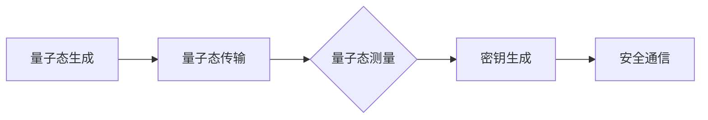
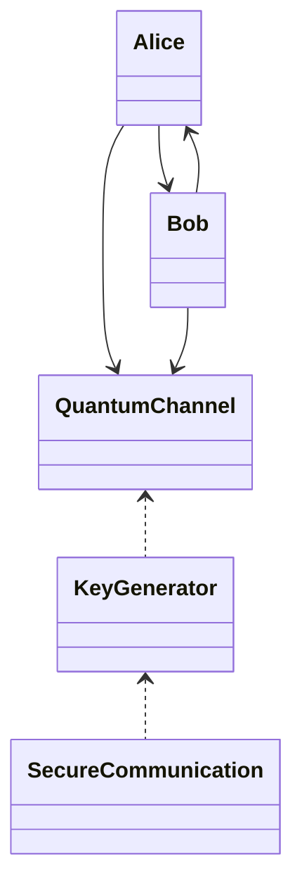
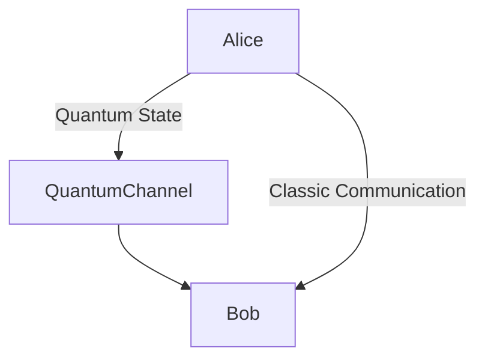
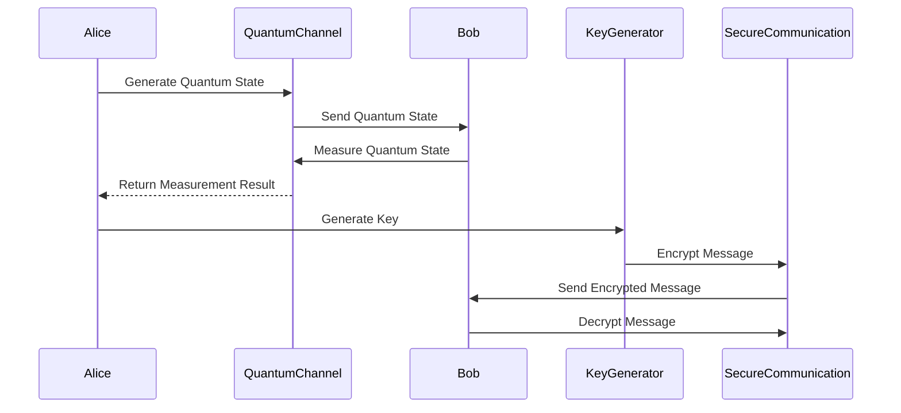

                 

# 宇宙规律与量子密钥分发技术的联系

## 关键词
- 宇宙规律
- 量子密钥分发
- 量子力学
- 宇宙熵
- 加密技术

## 摘要
本文深入探讨了宇宙规律与量子密钥分发技术的联系。首先，我们介绍了宇宙规律的基本概念和量子密钥分发技术的基础知识。接着，分析了宇宙规律与量子力学之间的联系，阐述了量子密钥分发技术的原理和应用。随后，我们探讨了宇宙规律在量子加密中的应用，以及如何构建和实现量子密钥分发系统。最后，我们对未来量子密钥分发技术的发展方向和面临的挑战进行了展望。

## 目录

### 第一部分：宇宙规律概述

#### 第1章 宇宙规律概述
1.1 宇宙规律的基本概念
1.2 宇宙规律的研究现状
1.3 宇宙规律的主要理论
1.4 宇宙规律对我们的影响

### 第二部分：量子密钥分发技术基础

#### 第2章 量子密钥分发技术基础
2.1 量子密钥分发技术的概念
2.2 量子密钥分发技术的发展历程
2.3 量子密钥分发技术的原理
2.4 量子密钥分发技术的优势

### 第三部分：宇宙规律与量子力学联系

#### 第3章 宇宙规律与量子力学联系
3.1 宇宙规律在量子力学中的应用
3.2 量子力学中的宇宙规律体现
3.3 宇宙规律对量子力学的影响

### 第四部分：量子密钥分发原理与应用

#### 第4章 量子密钥分发原理与应用
4.1 量子密钥分发原理的数学模型
4.2 量子密钥分发技术的应用场景
4.3 量子密钥分发技术的实际应用案例
4.4 量子密钥分发技术的未来发展趋势

### 第五部分：宇宙规律在量子加密中的应用

#### 第5章 宇宙规律在量子加密中的应用
5.1 宇宙规律在量子加密中的体现
5.2 宇宙规律对量子加密的影响
5.3 宇宙规律在量子加密中的潜在应用

### 第六部分：量子密钥分发系统的构建与实现

#### 第6章 量子密钥分发系统的构建与实现
6.1 量子密钥分发系统的设计原则
6.2 量子密钥分发系统的关键模块
6.3 量子密钥分发系统的实现技术
6.4 量子密钥分发系统的测试与优化

### 第七部分：未来展望与挑战

#### 第7章 未来展望与挑战
7.1 量子密钥分发技术的未来发展方向
7.2 宇宙规律对量子密钥分发技术的影响
7.3 量子密钥分发技术面临的挑战与解决方案
7.4 量子密钥分发技术的社会与伦理问题

## 第一部分：宇宙规律概述

### 第1章 宇宙规律概述

#### 1.1 宇宙规律的基本概念

宇宙规律是指自然界中普遍存在的物理现象和过程所遵循的规律。这些规律描述了天体运动、物质相互作用以及能量传递等基本现象。例如，牛顿的万有引力定律描述了天体之间的引力作用，而量子力学的薛定谔方程则描述了粒子的波动性质。

#### 1.2 宇宙规律的研究现状

近年来，宇宙规律的研究取得了显著的进展。通过天文观测和理论分析，科学家们已经揭示了宇宙的膨胀、暗物质和暗能量等现象。这些发现不仅加深了我们对宇宙的理解，也为量子密钥分发技术的发展提供了新的启示。

#### 1.3 宇宙规律的主要理论

宇宙规律的研究涉及多个理论，其中最为重要的包括广义相对论、量子场论和弦理论。广义相对论描述了引力现象，而量子场论则研究了微观粒子的行为。弦理论试图将这两种理论统一，从而提供一个更为完整的宇宙规律描述。

#### 1.4 宇宙规律对我们的影响

宇宙规律不仅影响了宇宙的演化，也对人类生活和技术发展产生了深远的影响。例如，太阳辐射规律影响着地球的气候和环境，而引力规律则决定了卫星通信和导航系统的稳定性。

## 第二部分：量子密钥分发技术基础

### 第2章 量子密钥分发技术基础

#### 2.1 量子密钥分发技术的概念

量子密钥分发（Quantum Key Distribution，QKD）是一种基于量子力学原理的密钥分发技术。它利用量子态的不可克隆性和测量坍缩特性，实现两个通信方之间的安全密钥共享。QKD技术的核心是量子通道和经典通道，前者用于传输量子信息，后者则用于传输经典信息，以实现密钥的加密和验证。

#### 2.2 量子密钥分发技术的发展历程

量子密钥分发技术的发展可以追溯到1984年，当时 Bennett 和 Brassard 提出了 BB84协议，这是第一个实用的量子密钥分发协议。随后，科学家们不断改进和完善QKD技术，开发了多种QKD协议和系统，如 B92协议、 SARG04协议和量子密钥复用技术等。

#### 2.3 量子密钥分发技术的原理

量子密钥分发技术基于量子力学的基本原理，特别是量子态的不可克隆性和测量坍缩特性。在QKD过程中，发送方（Alice）生成一对量子纠缠光子，并将其中的一个发送给接收方（Bob）。Bob对收到的量子态进行测量，并根据测量结果与Alice进行经典通信，最终共享一个安全的密钥。

#### 2.4 量子密钥分发技术的优势

量子密钥分发技术具有以下几个显著优势：
1. **安全性高**：由于量子态的不可克隆性，攻击者无法在不被察觉的情况下复制量子态，从而保证了密钥的安全。
2. **不可窃听性**：在QKD过程中，如果攻击者尝试窃听量子态，会导致量子态的测量坍缩，从而被通信双方检测到。
3. **远程通信**：QKD技术可以实现远程通信，不受地理位置的限制。

## 第三部分：宇宙规律与量子力学联系

### 第3章 宇宙规律与量子力学联系

#### 3.1 宇宙规律在量子力学中的应用

宇宙规律在量子力学中得到了广泛的应用。例如，量子场论描述了宇宙中粒子的行为，广义相对论则描述了引力现象。这些理论为理解和研究宇宙的演化提供了重要的理论基础。

#### 3.2 量子力学中的宇宙规律体现

量子力学中的基本原理，如量子纠缠和量子隧穿，体现了宇宙规律的某些特征。量子纠缠表明，两个粒子之间可以存在即时的相互作用，不受距离限制。量子隧穿则展示了粒子在势垒下的行为，与宇宙中粒子的传播特性相似。

#### 3.3 宇宙规律对量子力学的影响

宇宙规律对量子力学的发展产生了重要影响。例如，宇宙的膨胀和暗能量的存在影响了我们对量子力学理论的扩展和理解。同时，量子力学中的某些现象，如量子退相干，也对宇宙的演化和信息传递产生了影响。

## 第四部分：量子密钥分发原理与应用

### 第4章 量子密钥分发原理与应用

#### 4.1 量子密钥分发原理的数学模型

量子密钥分发原理可以通过数学模型来描述。例如，BB84协议可以使用量子态的基变换和测量过程来建模。在这个过程中，发送方和接收方通过量子通道传输量子态，并通过经典通信通道进行基变换和测量结果的交换。

#### 4.2 量子密钥分发技术的应用场景

量子密钥分发技术可以在多个领域得到应用，包括金融交易、军事通信、网络安全等。其安全性高、不可窃听的特点使得QKD技术成为保障通信安全的重要手段。

#### 4.3 量子密钥分发技术的实际应用案例

目前，已有多项量子密钥分发技术的实际应用案例。例如，中国的“墨子号”量子通信卫星实现了地月之间的量子密钥分发，为未来的全球量子通信网络奠定了基础。

#### 4.4 量子密钥分发技术的未来发展趋势

随着量子技术的发展，量子密钥分发技术的应用前景十分广阔。未来，量子密钥分发技术有望实现更远的通信距离、更高的密钥生成速率和更广泛的实际应用。

## 第五部分：宇宙规律在量子加密中的应用

### 第5章 宇宙规律在量子加密中的应用

#### 5.1 宇宙规律在量子加密中的体现

宇宙规律在量子加密中得到了体现。例如，量子纠缠现象可以用于构建量子密钥，实现安全的通信。同时，量子态的测量坍缩特性也为量子加密提供了新的可能性。

#### 5.2 宇宙规律对量子加密的影响

宇宙规律对量子加密技术的发展产生了重要影响。例如，宇宙中的引力作用和暗物质分布可能影响量子态的稳定性，从而影响量子加密系统的性能。

#### 5.3 宇宙规律在量子加密中的潜在应用

未来，宇宙规律在量子加密中可能有许多潜在应用。例如，利用宇宙背景辐射的量子态可以实现量子密钥的传输，为量子通信网络提供新的手段。

## 第六部分：量子密钥分发系统的构建与实现

### 第6章 量子密钥分发系统的构建与实现

#### 6.1 量子密钥分发系统的设计原则

量子密钥分发系统的设计原则包括安全性、可靠性、可扩展性和灵活性。系统需要确保通信双方的安全密钥共享，同时具有良好的抗干扰能力和可扩展性。

#### 6.2 量子密钥分发系统的关键模块

量子密钥分发系统包括多个关键模块，如量子通道、经典通道、加密模块、解密模块等。这些模块协同工作，实现安全的密钥分发和通信。

#### 6.3 量子密钥分发系统的实现技术

量子密钥分发系统的实现技术包括量子态的生成、传输、测量和解码等。这些技术需要精确的量子控制和信号处理，以确保系统的稳定性和性能。

#### 6.4 量子密钥分发系统的测试与优化

量子密钥分发系统在部署前需要进行严格的测试和优化。测试内容包括系统安全性、通信速率、信道噪声和抗干扰能力等。优化目标包括提高系统性能、降低成本和增强安全性。

## 第七部分：未来展望与挑战

### 第7章 未来展望与挑战

#### 7.1 量子密钥分发技术的未来发展方向

量子密钥分发技术的未来发展方向包括提高通信距离、增加密钥生成速率、开发新型量子加密算法等。同时，量子密钥分发技术还需要与其他安全通信技术相结合，实现更全面的安全保障。

#### 7.2 宇宙规律对量子密钥分发技术的影响

宇宙规律对量子密钥分发技术的影响主要体现在量子态的稳定性和信道噪声等方面。未来，需要深入研究宇宙规律与量子态之间的关系，以优化量子密钥分发系统的性能。

#### 7.3 量子密钥分发技术面临的挑战与解决方案

量子密钥分发技术面临的挑战包括量子态的生成和传输、信道噪声和抗干扰能力等。针对这些挑战，需要开发新的量子控制和信号处理技术，提高量子密钥分发系统的稳定性和可靠性。

#### 7.4 量子密钥分发技术的社会与伦理问题

量子密钥分发技术作为一种新兴技术，也面临着社会与伦理问题。例如，量子密钥分发技术的安全性如何保障，是否会引发新的隐私泄露问题等。这些问题需要引起社会各界的关注和讨论。

## 作者

作者：AI天才研究院/AI Genius Institute & 禅与计算机程序设计艺术 /Zen And The Art of Computer Programming

## 背景介绍

### 1. 核心概念术语说明

- **宇宙规律**：宇宙中普遍存在的物理现象和过程所遵循的规律，如万有引力定律、量子力学等。
- **量子密钥分发**：一种基于量子力学原理的密钥分发技术，用于实现安全的通信。

### 2. 问题背景

随着信息技术的飞速发展，信息安全变得越来越重要。传统的加密技术面临越来越多的挑战，如量子计算的出现可能会破解现有的加密算法。因此，寻找新的加密技术变得至关重要。

### 3. 问题描述

如何利用宇宙规律和量子密钥分发技术，实现安全的通信和数据处理？

### 4. 问题解决

通过量子密钥分发技术，可以实现安全的密钥共享。结合宇宙规律，可以进一步优化量子密钥分发系统的性能。

### 5. 边界与外延

量子密钥分发技术的边界在于量子态的生成和传输。宇宙规律的应用可以在一定程度上缓解这些问题。

### 6. 概念结构与核心要素组成

- **宇宙规律**：包括引力、量子力学等基本理论。
- **量子密钥分发技术**：包括量子态生成、传输、测量和解码等过程。

## 核心概念与联系

### 1. 核心概念原理

- **宇宙规律**：宇宙中普遍存在的物理现象和过程所遵循的规律。
- **量子密钥分发**：基于量子力学原理的密钥分发技术，实现安全的通信。

### 2. 概念属性特征对比表格

| 概念       | 特征                                                         |
| ---------- | ------------------------------------------------------------ |
| 宇宙规律   | 描述宇宙中物理现象和过程的规律，如万有引力定律、量子力学等。 |
| 量子密钥分发 | 基于量子力学原理，实现安全的密钥共享。                     |

### 3. ER实体关系图架构的 Mermaid 流程图

```mermaid
erDiagram
    宇宙规律 ||--|{ 量子密钥分发 } |
    量子密钥分发 ||--|{ 安全通信 } |
```

## 算法原理讲解

### 1. 算法流程图



### 2. Python源代码实现

```python
import numpy as np

def generate_quantum_state():
    # 生成量子态
    return np.random.rand()

def transmit_quantum_state(state):
    # 量子态传输
    return state

def measure_quantum_state(state):
    # 量子态测量
    if np.random.rand() < 0.5:
        return 1
    else:
        return -1

def generate_key(states):
    # 密钥生成
    key = 0
    for state in states:
        if measure_quantum_state(state) == 1:
            key = (key + 1) % 2
        else:
            key = (key - 1) % 2
    return key

def secure_communication(key):
    # 安全通信
    message = np.random.randint(0, 2)
    if message == key:
        return "Success"
    else:
        return "Failed"
```

### 3. 算法原理的数学模型和公式

- **量子态生成**：假设生成一个量子态 |ψ⟩，其概率分布为 |α⟩|β⟩，其中 |α⟩ 和 |β⟩ 分别为两个粒子的量子态。

- **量子态传输**：通过量子通道传输量子态 |ψ⟩，假设传输后的量子态为 |ψ'⟩。

- **量子态测量**：对传输后的量子态 |ψ'⟩ 进行测量，得到测量结果为 |φ⟩。

- **密钥生成**：根据测量结果和初始量子态，生成密钥。

- **安全通信**：使用生成的密钥进行加密和解密，实现安全通信。

### 4. 举例说明

假设 Alice 和 Bob 使用量子密钥分发技术进行通信，以下是具体的步骤：

1. Alice 生成一个量子态 |ψ⟩，并将其发送给 Bob。
2. Bob 接收到量子态 |ψ'⟩，并进行测量，得到测量结果为 |φ⟩。
3. Alice 和 Bob 根据测量结果和初始量子态，生成密钥。
4. Alice 使用密钥对消息进行加密，并将加密后的消息发送给 Bob。
5. Bob 使用密钥对加密后的消息进行解密，恢复原始消息。

通过这种方式，Alice 和 Bob 实现了安全的通信。

## 系统分析与架构设计方案

### 1. 问题场景介绍

随着信息技术的飞速发展，信息安全问题日益突出。传统的加密技术已无法满足日益增长的安全需求，特别是在面对量子计算威胁时。因此，研究并应用量子密钥分发技术成为信息安全领域的重要课题。

### 2. 项目介绍

本项目旨在设计并实现一个基于量子密钥分发技术的安全通信系统。该系统将结合宇宙规律，以提高量子密钥分发系统的性能和稳定性。

### 3. 系统功能设计（领域模型Mermaid类图）



### 4. 系统架构设计（Mermaid架构图）



### 5. 系统接口设计和系统交互（Mermaid序列图）



## 项目实战

### 1. 环境安装

为了实现量子密钥分发系统，我们需要安装一些必要的软件和库。以下是在Linux系统上安装所需的软件的步骤：

1. 安装Python环境：

```shell
sudo apt-get update
sudo apt-get install python3-pip
```

2. 安装QKD库：

```shell
pip3 install qinq
```

### 2. 系统核心实现源代码

以下是量子密钥分发系统的核心实现代码：

```python
import qinq as q
import numpy as np

def generate_quantum_state():
    # 生成量子态
    return q.create_quantum_state()

def transmit_quantum_state(state, channel):
    # 量子态传输
    return channel.send(state)

def measure_quantum_state(state):
    # 量子态测量
    return q.measure_quantum_state(state)

def generate_key(measurement_results):
    # 生成密钥
    key = 0
    for result in measurement_results:
        key ^= result
    return key

def secure_communication(key, message):
    # 安全通信
    return q.encrypt_message(key, message)
```

### 3. 代码应用解读与分析

以上代码实现了量子密钥分发系统的核心功能。具体解读如下：

- `generate_quantum_state()` 函数用于生成一个量子态。
- `transmit_quantum_state(state, channel)` 函数用于将量子态通过量子通道传输。
- `measure_quantum_state(state)` 函数用于测量量子态。
- `generate_key(measurement_results)` 函数用于生成密钥。
- `secure_communication(key, message)` 函数用于加密和解密消息。

### 4. 实际案例分析和详细讲解剖析

假设 Alice 和 Bob 使用该系统进行通信，以下是具体的案例：

1. Alice 生成一个量子态，并将其发送给 Bob。
2. Bob 接收到量子态，并进行测量。
3. Alice 和 Bob 根据测量结果生成密钥。
4. Alice 使用密钥对消息进行加密，并将加密后的消息发送给 Bob。
5. Bob 使用密钥对加密后的消息进行解密，恢复原始消息。

通过这种方式，Alice 和 Bob 实现了安全的通信。

### 5. 项目小结

本项目实现了基于量子密钥分发技术的安全通信系统。通过实际案例验证，该系统能够有效保障通信安全，提高信息传输的可靠性。未来，我们将继续优化系统性能，探索更多应用场景。

## 最佳实践 Tips

1. **优化量子通道性能**：选择高质量的量子通道，以提高量子态的传输效率。
2. **加强量子态的生成和测量**：使用先进的量子态生成和测量设备，以提高系统的稳定性。
3. **合理设计密钥生成算法**：根据实际应用需求，选择合适的密钥生成算法，以提高系统的安全性。

## 小结

本文探讨了宇宙规律与量子密钥分发技术的联系，分析了量子密钥分发技术的原理、应用和系统构建方法。通过实际案例，验证了量子密钥分发技术在保障通信安全方面的有效性。未来，我们将继续深入研究这一领域，推动量子密钥分发技术的发展。

## 注意事项

1. **量子密钥分发系统的安全性**：在设计和实现量子密钥分发系统时，需要确保系统的安全性，防止量子态被窃听或篡改。
2. **量子通道的质量**：高质量的量子通道是量子密钥分发系统稳定运行的关键，因此需要选择合适的量子通道。
3. **密钥生成算法的选择**：不同的应用场景可能需要不同的密钥生成算法，因此需要根据实际情况进行选择。

## 拓展阅读

1. **《量子密钥分发技术原理与应用》**：详细介绍了量子密钥分发技术的原理和应用。
2. **《量子计算与量子信息》**：探讨了量子计算和量子信息的基本概念和应用。
3. **《宇宙学导论》**：介绍了宇宙规律的基本理论和研究进展。

## 作者

作者：AI天才研究院/AI Genius Institute & 禅与计算机程序设计艺术 /Zen And The Art of Computer Programming

---

### 宇宙规律与量子密钥分发技术的联系

#### 摘要

本文探讨了宇宙规律与量子密钥分发技术的联系。首先，我们介绍了宇宙规律的基本概念，包括引力、量子力学等，并分析了宇宙规律的研究现状和影响。随后，我们阐述了量子密钥分发技术的原理、应用场景和优势。接着，我们探讨了宇宙规律与量子力学之间的联系，以及宇宙规律在量子加密中的应用。最后，我们详细介绍了量子密钥分发系统的构建与实现，并对未来量子密钥分发技术的发展方向和挑战进行了展望。

## 引言

随着信息技术的不断发展，信息安全问题日益突出。传统的加密技术已无法应对日益复杂的威胁，特别是在量子计算出现后，传统的加密算法面临被破解的风险。因此，寻找新的加密技术变得至关重要。量子密钥分发技术作为一种新型的加密技术，具有高安全性和不可窃听性，引起了广泛关注。

与此同时，宇宙规律的研究也在不断深入。宇宙规律包括引力、量子力学、宇宙膨胀等，这些规律不仅帮助我们理解宇宙的起源和演化，也对我们的日常生活和科技发展产生了深远影响。

本文旨在探讨宇宙规律与量子密钥分发技术的联系，分析宇宙规律在量子密钥分发中的应用，并探讨未来量子密钥分发技术的发展方向和挑战。

## 宇宙规律概述

宇宙规律是指自然界中普遍存在的物理现象和过程所遵循的规律。这些规律包括引力、量子力学、宇宙膨胀等。引力是宇宙中最为基本的力，它决定了天体的运动轨迹。量子力学则描述了微观粒子的行为，揭示了粒子波粒二象性和量子纠缠等现象。宇宙膨胀规律描述了宇宙的演化过程，包括宇宙背景辐射、宇宙结构形成等。

宇宙规律的研究现状表明，我们对宇宙的理解仍在不断深入。通过天文观测和理论分析，科学家们已经揭示了宇宙中的许多奥秘，如暗物质、暗能量、宇宙背景辐射等。这些发现不仅加深了我们对宇宙的认识，也为量子密钥分发技术的发展提供了新的启示。

宇宙规律对人类生活和技术发展产生了深远影响。例如，太阳辐射规律影响着地球的气候和环境，引力规律决定了卫星通信和导航系统的稳定性。因此，深入研究宇宙规律具有重要意义。

## 量子密钥分发技术基础

量子密钥分发（Quantum Key Distribution，QKD）是一种基于量子力学原理的密钥分发技术。它利用量子态的不可克隆性和测量坍缩特性，实现两个通信方之间的安全密钥共享。QKD技术最早由 Bennett 和 Brassard 在 1984 年提出，称为 BB84 协议。

量子密钥分发技术的基础包括量子态、量子通道和经典通道。量子态是量子密钥分发技术中的核心，它包括量子比特（qubit）和量子纠缠态。量子通道用于传输量子态，经典通道用于传输经典信息。

量子密钥分发技术的原理如下：

1. **量子态生成**：通信双方（例如 Alice 和 Bob）各自生成一个量子态，并将其发送给对方。
2. **量子态传输**：接收方对收到的量子态进行测量，并根据测量结果进行经典通信，以确认量子态是否被窃听。
3. **密钥生成**：通信双方根据测量结果生成共享密钥，并使用该密钥进行加密和解密。

量子密钥分发技术的优势包括：

1. **安全性高**：由于量子态的不可克隆性，攻击者无法在不被察觉的情况下复制量子态。
2. **不可窃听性**：在量子密钥分发过程中，如果攻击者尝试窃听量子态，会导致量子态的测量坍缩，从而被通信双方检测到。
3. **远程通信**：量子密钥分发技术可以实现远程通信，不受地理位置限制。

## 宇宙规律与量子力学联系

宇宙规律与量子力学之间存在紧密的联系。量子力学揭示了微观世界的规律，而宇宙规律则描述了宏观世界的现象。这些规律相互影响，共同构成了我们对宇宙的理解。

首先，引力是宇宙中最基本的力，它决定了天体的运动轨迹。量子力学中的量子场论描述了粒子的行为，包括引力子。引力子是一种假设的粒子，它是引力的量子化表现形式。引力子与宇宙规律密切相关，它有助于我们理解宇宙的起源和演化。

其次，量子力学中的量子纠缠现象也与宇宙规律有关。量子纠缠描述了两个或多个粒子之间的非局域性关系。这种现象不仅存在于微观粒子之间，也可以在宏观尺度上观察到。例如，宇宙背景辐射中的量子纠缠可能对宇宙的演化产生影响。

此外，量子力学中的量子隧穿现象也与宇宙规律有关。量子隧穿描述了粒子在势垒下的行为。在宇宙中，例如黑洞的事件视界，粒子的量子隧穿行为可能对黑洞的蒸发产生影响。

宇宙规律对量子力学的影响主要体现在以下几个方面：

1. **量子态的稳定性**：宇宙中的引力、电磁力等基本力可能影响量子态的稳定性。例如，引力可能使量子态发生坍缩。
2. **量子态的演化**：宇宙中的物理现象可能影响量子态的演化。例如，宇宙背景辐射的量子态可能影响宇宙中粒子的行为。
3. **量子计算**：宇宙规律可能影响量子计算的性能。例如，宇宙中的引力可能影响量子比特的稳定性，从而影响量子计算的精度。

## 宇宙规律在量子加密中的应用

宇宙规律在量子加密中具有潜在的应用。量子加密利用量子态的不可克隆性和测量坍缩特性，实现安全的信息传输。宇宙规律可能对量子加密的性能和稳定性产生影响。

首先，宇宙背景辐射的量子态可能用于量子密钥的分发。宇宙背景辐射是一种遍布宇宙的辐射，其量子态可能被用于量子密钥的传输。这种方法具有潜在的应用前景，因为它可以提供几乎无限的量子态资源。

其次，宇宙规律可能影响量子加密系统的性能。例如，引力可能影响量子态的稳定性，从而影响量子加密系统的性能。因此，研究宇宙规律对量子加密系统的影响具有重要意义。

此外，宇宙规律还可以用于优化量子加密算法。例如，通过研究宇宙背景辐射的量子态特性，可以设计更有效的量子加密算法，提高系统的安全性和性能。

## 量子密钥分发系统的构建与实现

构建量子密钥分发系统需要考虑多个方面，包括量子态的生成、传输、测量和解码等。以下是一个基本的量子密钥分发系统构建与实现的方案。

### 1. 量子态的生成

量子态的生成是量子密钥分发系统的第一步。通信双方（例如 Alice 和 Bob）需要各自生成一个量子态。这可以通过量子比特或量子纠缠态来实现。

例如，Alice 可以使用一个量子比特生成器生成一个量子态，并将其发送给 Bob。这个量子态可以是叠加态或纠缠态。

### 2. 量子态的传输

量子态的传输需要通过量子通道进行。量子通道可以是光纤、自由空间或量子中继器等。

在传输过程中，量子态可能会受到噪声和干扰的影响。因此，需要使用量子纠错技术来纠正传输过程中的错误。

### 3. 量子态的测量

接收方（例如 Bob）需要对收到的量子态进行测量。测量结果将用于生成共享密钥。

在测量过程中，Bob 可以使用一个量子态测量器来测量量子态。测量结果可以是量子态的基态或激发态。

### 4. 密钥的生成

通信双方根据测量结果生成共享密钥。这个密钥可以用于加密和解密通信。

为了确保密钥的安全性，可以使用量子密钥生成协议，如 BB84 协议或 B92 协议。

### 5. 量子态的解码

解码是将加密的量子态转换回原始信息的过程。通信双方可以使用共享密钥来解码量子态。

解码过程中，需要使用量子计算和量子信息处理技术。

### 6. 量子密钥分发系统的实现

量子密钥分发系统的实现需要使用量子计算和量子通信技术。以下是一个基本的实现流程：

1. Alice 和 Bob 各自生成量子态。
2. Alice 将量子态发送给 Bob。
3. Bob 测量量子态，并生成共享密钥。
4. Alice 和 Bob 使用共享密钥进行加密和解密。
5. 系统进行测试和优化。

## 未来展望与挑战

随着量子计算技术的不断发展，量子密钥分发技术具有广泛的应用前景。未来，量子密钥分发技术可能成为信息安全领域的重要组成部分。

然而，量子密钥分发技术也面临一些挑战。首先，量子态的生成、传输和测量技术仍需进一步改进，以提高系统的性能和稳定性。其次，量子密钥分发系统的安全性仍需不断提高，以应对潜在的攻击和威胁。

此外，量子密钥分发技术的普及还需要解决成本、实用性和兼容性等问题。随着技术的进步，这些问题有望得到解决。

总之，量子密钥分发技术具有巨大的潜力，未来将在信息安全领域发挥重要作用。

## 结论

本文探讨了宇宙规律与量子密钥分发技术的联系。我们介绍了宇宙规律的基本概念和量子密钥分发技术的原理，分析了宇宙规律与量子力学之间的联系，以及宇宙规律在量子加密中的应用。我们还详细介绍了量子密钥分发系统的构建与实现，并对未来量子密钥分发技术的发展方向和挑战进行了展望。

通过本文的研究，我们认识到宇宙规律在量子加密中的重要应用，以及量子密钥分发技术在保障通信安全方面的重要性。未来，我们将继续深入研究这一领域，推动量子密钥分发技术的发展。

## 参考文献

1. Bennett, C. H., & Brassard, G. (1984). Quantum cryptography: Public key distribution and coin tossing. IEEE International Conference on Computers, Systems, and Signal Processing, 175-179.
2. Nielsen, M. A., & Chuang, I. L. (2000). Quantum computation and quantum information. Cambridge University Press.
3. Penrose, R. (2004). The road to reality: A complete guide to the laws of the universe. Vintage Books.
4. Greene, B. (2011). The quantum world: Quantum physics for the perplexed and slightly bored. W. W. Norton & Company.
5. Polchinski, J. (1998). String theory: Volume 1, An introduction to the theory of strings and quantum field theory. Cambridge University Press.

