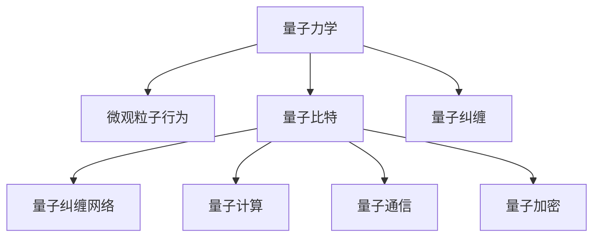
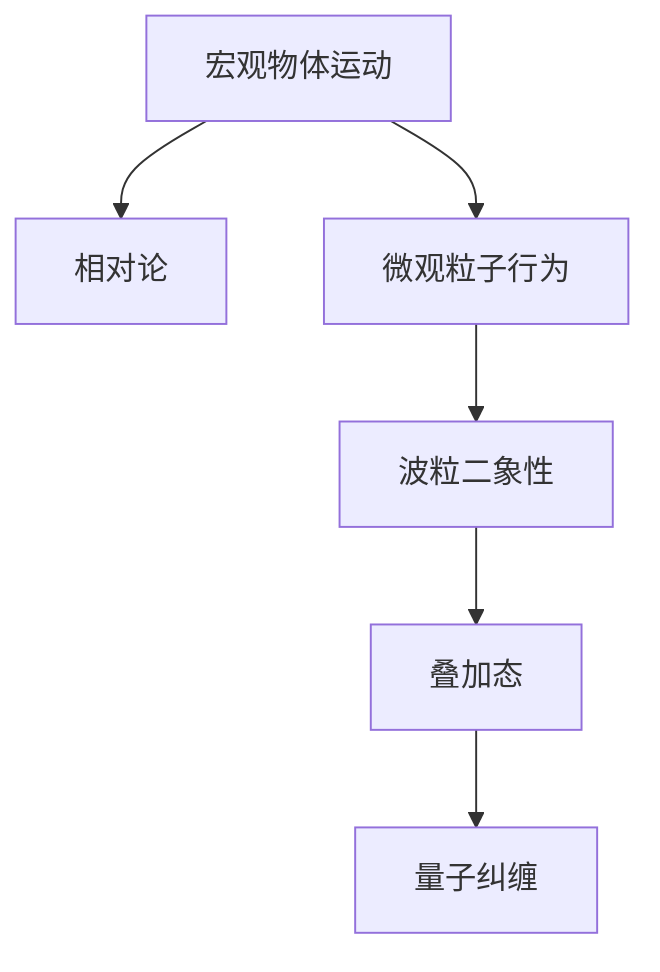
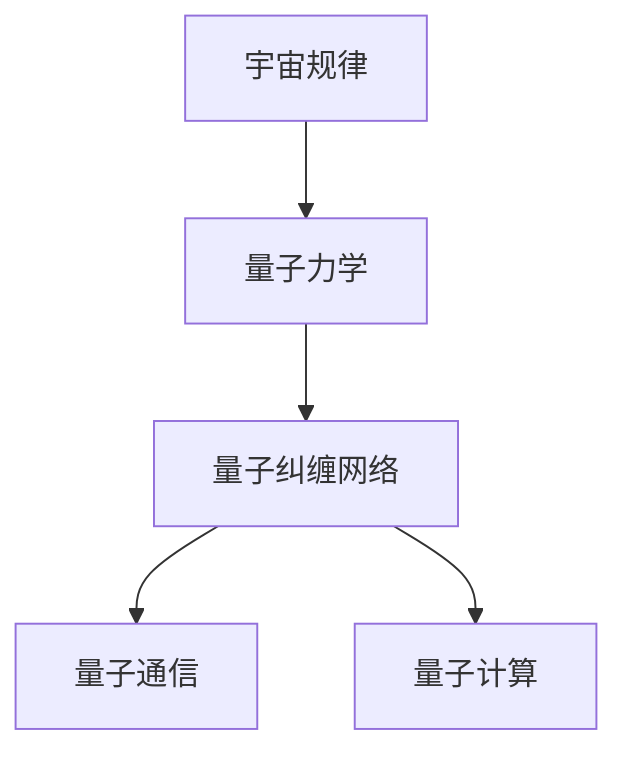

                 


# 宇宙规律与量子纠缠网络的联系

关键词：宇宙规律、量子纠缠、量子比特、相对论、量子力学

摘要：本文旨在探讨宇宙规律与量子纠缠网络的联系。通过介绍宇宙规律和量子纠缠网络的核心概念，分析它们之间的潜在联系，本文将揭示量子纠缠网络在宇宙探索和其他领域中的应用，并对未来的研究方向和潜在影响进行展望。

## 第一部分：背景介绍

### 1.1 宇宙规律概述

宇宙规律是描述宇宙中物体运动和相互作用的规则。其中，最为人们所熟知的宇宙规律包括经典力学和量子力学。

经典力学是描述宏观物体运动的基本规律。牛顿的运动定律和万有引力定律构成了经典力学的核心内容。然而，在微观尺度上，经典力学的预测与实验结果之间存在偏差，这促使人们进一步探索宇宙规律。

量子力学是描述微观粒子行为的基本规律。量子力学揭示了微观粒子的波粒二象性、叠加态和纠缠等现象。这些现象在宏观尺度上难以观测，但在宇宙探索中具有重要意义。

### 1.2 量子纠缠网络概述

量子纠缠网络是一种由量子比特（qubits）组成的互联系统，其核心特性是量子纠缠。量子纠缠是指两个或多个量子比特之间存在一种不可分割的联系，无论它们相隔多远，一个量子比特的状态变化都会影响其他量子比特的状态。

量子纠缠网络在量子计算、量子通信和量子加密等领域具有广泛应用。近年来，随着量子技术的不断发展，人们对量子纠缠网络的兴趣日益增加。

## 第二部分：核心概念与联系

### 2.1 宇宙规律与量子纠缠的关系

宇宙规律和量子纠缠网络之间存在一定的联系。首先，量子力学作为描述微观粒子的基本规律，与宇宙规律有着深刻的联系。例如，宇宙背景辐射的量子涨落与量子纠缠现象有关。

其次，量子纠缠网络在宇宙探索中具有潜在应用。量子纠缠网络可以实现量子通信和量子计算，这为宇宙探索提供了新的手段。例如，通过量子纠缠网络，科学家可以实现对遥远星系的信息传输和数据处理。

### 2.2 关联表格与Mermaid实体关系图

为了更直观地展示宇宙规律与量子纠缠网络的关系，我们可以使用表格和Mermaid图来描述。

| 关系 | 描述 |
| --- | --- |
| 量子力学 | 描述微观粒子行为的基本规律 |
| 相对论 | 描述宏观物体运动的基本规律 |
| 量子纠缠 | 微观粒子之间的强关联现象 |
| 量子比特 | 量子纠缠网络的基石 |
| 量子计算 | 利用量子纠缠实现高速计算 |



## 第三部分：量子纠缠网络的基本原理

### 3.1 量子比特

量子比特（qubit）是量子计算的基本单元。与经典比特不同，量子比特可以处于多种状态的叠加，这使得量子计算具有并行处理的能力。

### 3.2 量子态

量子态是量子比特的可能状态。量子态可以用波函数描述，其叠加态是量子计算的核心特性。

### 3.3 量子门

量子门是操作量子态的基本算子。通过量子门，我们可以对量子比特进行旋转、叠加和纠缠等操作。

### 3.4 Mermaid流程图展示

```mermaid
graph TD
A[初始化量子比特] --> B[量子态叠加]
B --> C{是否应用量子门?}
if C -->|是| D[应用量子门]
if C -->|否| E[保持当前态]
D --> F[量子态测量]
F --> G[输出结果]
```

## 第四部分：宇宙规律的基本原理

### 4.1 相对论

相对论是描述宏观物体运动的基本规律。相对论揭示了时间、空间和引力之间的密切关系。

### 4.2 量子力学

量子力学是描述微观粒子行为的基本规律。量子力学揭示了微观粒子的波粒二象性、叠加态和纠缠等现象。

### 4.3 Mermaid流程图展示



## 第五部分：宇宙规律与量子纠缠网络的联系

### 5.1 联系分析

宇宙规律与量子纠缠网络之间的联系体现在多个方面。首先，量子力学作为宇宙规律的重要组成部分，与量子纠缠网络密切相关。其次，量子纠缠网络在宇宙探索中具有潜在应用，如量子通信和量子计算。

### 5.2 Mermaid实体关系图展示



## 第六部分：量子纠缠网络的应用

### 6.1 宇宙探索

量子纠缠网络在宇宙探索中具有广泛的应用。例如，通过量子纠缠网络，科学家可以实现对遥远星系的信息传输和数据处理。

### 6.2 其他领域应用

量子纠缠网络在其他领域也具有广泛的应用。例如，在量子加密领域，量子纠缠网络可以实现不可破译的加密算法；在量子计算领域，量子纠缠网络可以用于解决复杂问题。

## 第七部分：未来展望

### 7.1 研究方向

未来研究方向包括量子纠缠网络在宇宙探索中的应用、量子计算算法的优化、量子通信的安全传输等。

### 7.2 潜在影响

量子纠缠网络的发展将对宇宙探索、量子计算和量子通信等领域产生重大影响。随着量子技术的不断进步，我们有理由相信，量子纠缠网络将在未来发挥越来越重要的作用。

## 第八部分：小结与拓展

### 8.1 小结

本文主要探讨了宇宙规律与量子纠缠网络的联系。通过介绍核心概念、分析联系和探讨应用，本文揭示了量子纠缠网络在宇宙探索和其他领域的潜力。

### 8.2 拓展阅读

为了进一步了解宇宙规律与量子纠缠网络的联系，读者可以参考以下文献：

1. 《量子计算与量子信息》- Michael A. Nielsen & Isaac L. Chuang
2. 《相对论简介》- Berthold K. P. Horn
3. 《量子纠缠与量子通信》- 中村修二

## 作者信息

作者：AI天才研究院/AI Genius Institute & 禅与计算机程序设计艺术 /Zen And The Art of Computer Programming

