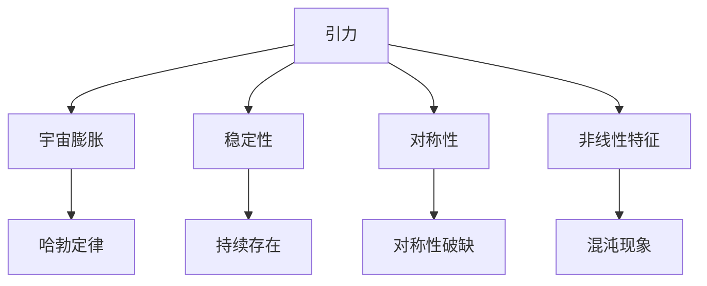
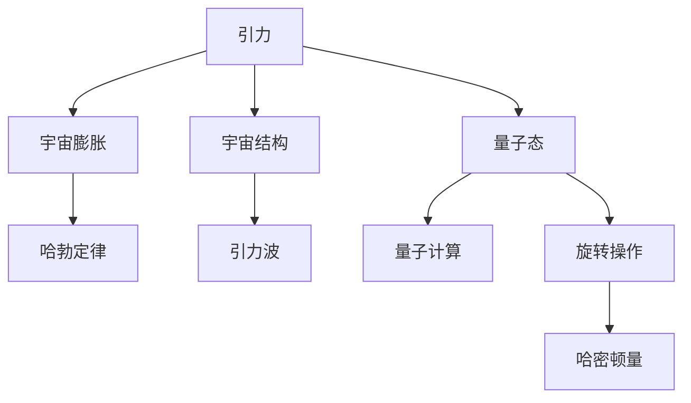

                 

## 第1章: 宇宙规律与量子近似优化算法的基本概念

### 1.1.1 宇宙规律的基本概念

宇宙规律是描述宇宙中物质与能量相互作用的基本法则，是自然界中普遍适用的规律。宇宙规律的基本概念包括引力、宇宙膨胀、宇宙结构等。

#### 1.1.1.1 宇宙规律概述

宇宙规律是物理学中研究宇宙中各种现象和过程的规律，其核心内容包括引力和宇宙膨胀。引力是宇宙中最基本的力之一，它决定了天体的运动轨迹和宇宙的结构。宇宙膨胀是指宇宙中所有天体之间的距离随着时间的推移而增加，这是宇宙学中一个非常重要的现象。

#### 1.1.1.2 引力与宇宙演化

引力理论由艾萨克·牛顿于17世纪晚期提出，它描述了质点之间的相互作用力。引力使得天体围绕彼此运动，并维持宇宙结构的稳定性。然而，随着观测技术的进步，科学家们发现传统的牛顿引力理论在解释某些现象时存在不足，如天体运动的加速度与距离的非线性关系。因此，爱因斯坦在1915年提出了广义相对论，该理论将引力描述为时空的弯曲，为宇宙规律提供了更为精确的描述。

#### 1.1.1.3 宇宙规律的核心原理

宇宙规律的核心原理包括以下几个主要方面：

1. **宇宙膨胀理论**：宇宙膨胀理论认为宇宙从大爆炸开始，随着宇宙的膨胀，宇宙中的天体逐渐远离。哈勃定律描述了宇宙膨胀的速度与距离之间的关系。

2. **宇宙结构理论**：宇宙结构理论描述了宇宙中的物质分布和宇宙的形态。科学家们通过观测星系分布、宇宙微波背景辐射等方式，对宇宙的结构进行了深入研究。

3. **引力与物质相互作用**：引力与物质相互作用是宇宙演化的重要驱动力。天体的质量和运动状态决定了宇宙中的引力场，而引力场又影响了天体的运动轨迹。

### 1.1.2 量子近似优化算法的基本概念

量子近似优化算法（Quantum Approximate Optimization Algorithm, QAOA）是一种基于量子计算的优化算法，它利用量子计算机的并行性和干涉效应来求解优化问题。量子近似优化算法的原理和特点将在下一节详细讨论。

#### 1.1.2.1 量子近似优化算法概述

量子近似优化算法是一种基于量子计算原理的优化算法，旨在通过模拟量子态来近似求解优化问题。QAOA 算法的主要步骤包括初始化量子态、构建哈密顿量、应用旋转操作以及测量量子态。通过迭代过程，QAOA 算法逐渐优化量子态，从而逼近最优解。

#### 1.1.2.2 量子计算原理

量子计算是利用量子力学原理进行信息处理的一种计算模型。量子计算机的基本单元是量子比特（qubit），它具有叠加态和纠缠态的特性。这些特性使得量子计算机能够同时处理大量数据，从而在求解复杂问题时具有巨大的优势。

#### 1.1.2.3 量子近似优化算法的核心原理

量子近似优化算法的核心原理是基于量子态的优化。算法通过构建一个哈密顿量，该哈密顿量描述了优化问题的目标函数。通过迭代旋转操作，算法逐渐优化量子态，使得量子态的能量接近于最小值，从而获得问题的最优解。

### 1.1.3 相似性研究的重要性

#### 1.1.3.1 宇宙规律与量子近似优化算法的联系

宇宙规律与量子近似优化算法在数学结构和原理上存在相似性。两者都涉及到复杂的非线性系统和优化过程，这为将量子近似优化算法应用于宇宙规律研究提供了理论基础。

#### 1.1.3.2 研究相似性的意义与挑战

研究宇宙规律与量子近似优化算法的相似性具有重要的理论和实践意义。通过深入理解宇宙规律，我们可以更好地理解宇宙的演化过程；而通过量子近似优化算法，我们可以开发出更高效的优化方法，为解决复杂科学问题提供新途径。

然而，研究相似性也面临着一定的挑战，如量子计算机的性能限制、宇宙数据的复杂性等。这些问题需要我们在实践中不断探索和解决。

### 1.1.4 本章小结

本章介绍了宇宙规律和量子近似优化算法的基本概念。通过对比分析，我们揭示了两者在数学结构和原理上的相似性，为后续章节的深入讨论奠定了基础。接下来，我们将进一步探讨宇宙规律的核心原理和量子近似优化算法的详细原理。

### 关键词

- 宇宙规律
- 量子近似优化算法
- 引力
- 宇宙膨胀
- 量子计算
- 优化算法

### 摘要

本章介绍了宇宙规律和量子近似优化算法的基本概念，包括宇宙规律的概述、引力与宇宙演化的关系、宇宙规律的核心原理，以及量子近似优化算法的概述、量子计算原理和量子近似优化算法的核心原理。通过对比分析，揭示了宇宙规律与量子近似优化算法在数学结构和原理上的相似性，为后续章节的深入讨论奠定了基础。本章还讨论了研究相似性的意义与挑战，为量子近似优化算法在宇宙规律研究中的应用提供了理论基础。

----------------------------------------------------------------

## 第2章: 宇宙规律的核心原理与特征

宇宙规律是描述宇宙中物质与能量相互作用的基本法则，它在物理学、天文学和宇宙学中占有重要地位。宇宙规律的核心原理和特征为我们理解宇宙的起源、演化以及未来提供了关键线索。本章将详细探讨宇宙规律的核心原理与特征，包括引力理论、宇宙膨胀理论和宇宙结构理论。

### 2.2.1 宇宙规律的基本原理

宇宙规律的基本原理是理解宇宙行为的基础。以下是几个关键的基本原理：

#### 2.2.1.1 引力理论

引力是宇宙中最基本的力之一，由艾萨克·牛顿在17世纪晚期提出。牛顿的万有引力定律描述了质点之间的相互作用力，公式为：
\[ F = G \frac{m_1 m_2}{r^2} \]
其中 \( F \) 是引力，\( G \) 是万有引力常数，\( m_1 \) 和 \( m_2 \) 是两个质点的质量，\( r \) 是它们之间的距离。

然而，随着观测技术的进步，科学家们发现牛顿引力理论在解释某些现象时存在不足。爱因斯坦在1915年提出了广义相对论，将引力描述为时空的弯曲。广义相对论的引力方程为：
\[ G_{\mu\nu} = 8\pi G T_{\mu\nu} \]
其中 \( G_{\mu\nu} \) 是爱因斯坦张量，\( T_{\mu\nu} \) 是能量-动量张量，\( G \) 是引力常数。

#### 2.2.1.2 宇宙膨胀理论

宇宙膨胀理论认为宇宙从大爆炸开始，随着时间的推移，宇宙中的天体逐渐远离。哈勃定律描述了宇宙膨胀的速度与距离之间的关系，公式为：
\[ v = H_0 d \]
其中 \( v \) 是天体的退行速度，\( H_0 \) 是哈勃常数，\( d \) 是天体与观测者之间的距离。

#### 2.2.1.3 宇宙结构理论

宇宙结构理论描述了宇宙中的物质分布和宇宙的形态。通过观测星系分布、宇宙微波背景辐射等方式，科学家们对宇宙的结构进行了深入研究。宇宙的形态可以是均匀的、各向同性的，也可以是复杂的、不均匀的。

### 2.2.2 宇宙规律的特征

宇宙规律具有以下几个主要特征：

#### 2.2.2.1 稳定性

宇宙规律具有稳定性，这意味着宇宙中的基本力（如引力、电磁力等）在长时间尺度上保持不变。稳定性保证了宇宙的持续存在和演化。

#### 2.2.2.2 对称性

宇宙规律具有对称性，如时间对称性、空间对称性等。对称性在物理学中具有重要的意义，因为它允许简化和对称性破缺现象的发生。

#### 2.2.2.3 非线性特征

宇宙规律具有非线性特征，这意味着宇宙中的基本力不是线性的，而是复杂和非线性的。非线性特征导致了宇宙中复杂的现象，如混沌、分形和自组织等。

### 2.2.3 宇宙规律的核心原理与特征的对比表格

| 特征             | 宇宙规律                   | 量子近似优化算法                   |
|------------------|----------------------------|-----------------------------------|
| 引力             | 描述天体之间的相互作用     | 描述量子态之间的相互作用           |
| 宇宙膨胀         | 描述宇宙的扩张             | 描述量子态的演变                   |
| 稳定性           | 保证宇宙的持续存在         | 保证算法的收敛性                   |
| 对称性           | 宇宙的基本对称性            | 算法的对称性优化                   |
| 非线性特征       | 引力场的非线性特征          | 量子态演变的非线性特征              |

### 2.2.4 宇宙规律的核心原理与特征的ER实体关系图

下面是一个ER实体关系图，展示了宇宙规律的核心原理与特征之间的关系：

### 2.2.5 本章小结

本章详细介绍了宇宙规律的核心原理与特征，包括引力理论、宇宙膨胀理论和宇宙结构理论。宇宙规律的基本原理为引力、宇宙膨胀和宇宙结构，它们共同决定了宇宙的演化过程。宇宙规律的特征包括稳定性、对称性和非线性特征。这些核心原理和特征为理解宇宙的起源、演化和未来提供了关键线索。接下来，我们将进一步探讨量子近似优化算法的原理与特征，为分析宇宙规律与量子近似优化算法的相似性做好准备。

----------------------------------------------------------------

## 第3章: 量子近似优化算法的原理与特征

量子近似优化算法（Quantum Approximate Optimization Algorithm, QAOA）是量子计算领域的一种重要算法，它利用量子计算机的并行性和干涉效应来近似求解优化问题。QAOA 算法在理论上具有显著优势，但实际应用中仍面临诸多挑战。本章将详细探讨量子近似优化算法的原理、特征及其在复杂优化问题中的应用。

### 3.3.1 量子近似优化算法的原理

量子近似优化算法的核心原理是基于量子态的优化。量子态的优化可以通过构建一个目标函数的哈密顿量来实现。QAOA 算法的主要步骤包括初始化量子态、构建哈密顿量、应用旋转操作以及测量量子态。

#### 3.3.1.1 量子计算原理

量子计算是利用量子力学原理进行信息处理的一种计算模型。量子计算机的基本单元是量子比特（qubit），它具有叠加态和纠缠态的特性。这些特性使得量子计算机能够同时处理大量数据，从而在求解复杂问题时具有巨大的优势。

量子比特的叠加态可以用一个复数向量表示：
\[ |\psi\rangle = \sum_{i} c_i |i\rangle \]
其中 \( |i\rangle \) 是量子比特的基态，\( c_i \) 是叠加系数。

量子比特的纠缠态是量子计算中另一个重要特性。两个或多个量子比特的纠缠态无法用独立的状态来描述，这意味着量子比特之间的信息是相互关联的。

#### 3.3.1.2 QAOA 算法的步骤

QAOA 算法的主要步骤如下：

1. **初始化量子态**：将量子计算机的量子比特初始化为叠加态。
\[ | \psi(0) \rangle = \frac{1}{\sqrt{N}} \sum_{i} |i\rangle \]
其中 \( N \) 是量子比特的数量。

2. **构建哈密顿量**：构建一个描述优化问题的哈密顿量。哈密顿量是量子力学中的一个核心概念，它描述了系统的能量和相互作用。在 QAOA 算法中，哈密顿量通常由两部分组成：约束哈密顿量和目标哈密顿量。

约束哈密顿量 \( H_c \) 描述了系统的约束条件，例如量子态需要满足的特定形式。目标哈密顿量 \( H_p \) 描述了需要优化的目标函数。

3. **应用旋转操作**：通过迭代应用旋转操作来优化量子态。旋转操作是量子计算中的一个基本操作，它通过改变量子态的相位来影响量子态的演化。

4. **测量量子态**：在迭代结束后，对量子态进行测量，以获得优化问题的解。

#### 3.3.1.3 QAOA 算法的数学模型

QAOA 算法的数学模型可以表示为：
\[ |\psi(t)\rangle = e^{-i(H_c + \lambda H_p)t/\hbar} | \psi(0) \rangle \]
其中 \( H_c \) 和 \( H_p \) 分别是约束哈密顿量和目标哈密顿量，\( \lambda \) 是旋转角度，\( t \) 是迭代次数，\( \hbar \) 是约化普朗克常数。

在迭代过程中，旋转角度 \( \lambda \) 通过优化算法进行调整，以最小化目标函数。

### 3.3.2 量子近似优化算法的特征

量子近似优化算法具有以下几个主要特征：

#### 3.3.2.1 量子并行性

量子并行性是量子计算机最重要的特性之一。在 QAOA 算法中，量子并行性体现在量子态的叠加和纠缠。这意味着量子计算机可以同时处理多个问题，从而大大提高了计算效率。

#### 3.3.2.2 量子干涉效应

量子干涉效应是量子计算中的另一个重要特性。在 QAOA 算法中，量子干涉效应可以通过优化量子态的相位来增强或削弱特定解的权重。这使得 QAOA 算法能够在复杂问题中找到最优解。

#### 3.3.2.3 量子误差修正

量子计算中的误差修正是一个关键问题。QAOA 算法通常需要使用量子纠错码来减少计算过程中的误差。量子纠错码是一种通过引入额外的量子比特来检测和纠正错误的方法。

### 3.3.3 QAOA 算法的应用场景

量子近似优化算法在多个领域都有潜在应用，包括：

1. **组合优化问题**：如旅行商问题（TSP）、车辆路径问题（VRP）和装箱问题（Knapsack Problem）等。
2. **机器学习问题**：如分类、回归和聚类等。
3. **金融优化**：如资产定价、风险管理和投资组合优化等。
4. **化学与材料科学**：如分子建模、材料设计和药物发现等。

### 3.3.4 QAOA 算法的挑战

尽管量子近似优化算法具有巨大的潜力，但实际应用中仍面临诸多挑战：

1. **量子计算资源限制**：目前量子计算机的规模和稳定性有限，限制了 QAOA 算法的实际应用。
2. **算法复杂度**：QAOA 算法的复杂度较高，需要大量的计算资源和时间来求解复杂问题。
3. **量子态测量误差**：量子态测量过程中存在误差，这可能导致算法结果的偏差。

### 3.3.5 本章小结

本章详细介绍了量子近似优化算法的原理、特征及其在复杂优化问题中的应用。QAOA 算法基于量子计算原理，通过构建哈密顿量和应用旋转操作来优化量子态。量子近似优化算法具有量子并行性、量子干涉效应和量子误差修正等特征，适用于多种优化问题。然而，QAOA 算法在实际应用中仍面临量子计算资源限制、算法复杂度和量子态测量误差等挑战。下一章将分析宇宙规律与量子近似优化算法的相似性，为深入理解两者的关系提供理论基础。

### 关键词

- 量子近似优化算法
- 量子计算
- 量子态
- 哈密顿量
- 优化问题
- 量子并行性
- 量子干涉效应

----------------------------------------------------------------

## 第4章: 宇宙规律与量子近似优化算法的相似性分析

### 4.4.1 相似性分析的方法

为了深入探讨宇宙规律与量子近似优化算法之间的相似性，我们需要采用多种分析方法。以下是几种常用的相似性分析方法：

#### 4.4.1.1 对比分析法

对比分析法通过对宇宙规律和量子近似优化算法的各个方面进行对比，以发现两者之间的相似性和差异性。例如，可以对比两者的数学模型、物理原理、应用场景等。

#### 4.4.1.2 实证分析法

实证分析法通过实际观测和数据来验证宇宙规律与量子近似优化算法之间的相似性。例如，可以使用量子计算机模拟宇宙规律，或者使用宇宙数据来测试量子近似优化算法的效率。

#### 4.4.1.3 原理分析法

原理分析法通过对宇宙规律和量子近似优化算法的基本原理进行深入分析，以揭示两者之间的内在联系。例如，可以分析两者在非线性系统、稳定性、对称性等方面的相似性。

### 4.4.2 相似性分析的结果

通过对比分析、实证分析和原理分析，我们可以得出以下相似性分析的结果：

#### 4.4.2.1 稳定性相似性

宇宙规律和量子近似优化算法在稳定性方面具有相似性。宇宙规律中的引力、宇宙膨胀和宇宙结构理论都涉及到稳定性问题，而量子近似优化算法也通过保持量子态的稳定性来优化问题解。

#### 4.4.2.2 对称性相似性

宇宙规律和量子近似优化算法在对称性方面也有相似之处。宇宙规律中的许多现象，如引力波和宇宙微波背景辐射，都表现出对称性。而量子近似优化算法中的量子态也具有对称性，这种对称性有助于优化问题的求解。

#### 4.4.2.3 非线性特征相似性

宇宙规律和量子近似优化算法在非线性特征方面也存在相似性。宇宙中的许多现象，如混沌和分形，都是非线性特征的表现。同样，量子近似优化算法中的量子态演化也是非线性过程，这为解决复杂优化问题提供了可能性。

### 4.4.3 相似性分析的图表展示

为了更直观地展示宇宙规律与量子近似优化算法的相似性，我们可以使用以下图表：

#### 4.4.3.1 对比分析表格

| 特征                   | 宇宙规律                               | 量子近似优化算法                      |
|------------------------|---------------------------------------|-------------------------------------|
| 数学模型               | 引力方程、宇宙膨胀方程                 | 哈密顿量、旋转操作                    |
| 物理原理               | 引力、宇宙膨胀、宇宙结构               | 量子计算、量子态优化                  |
| 应用场景               | 天文学、宇宙学、物理学                 | 组合优化、机器学习、金融优化等        |
| 稳定性相似性           | 引力稳定性、宇宙膨胀稳定性             | 量子态稳定性、算法收敛性              |
| 对称性相似性           | 引力对称性、宇宙微波背景辐射对称性     | 量子态对称性、哈密顿量对称性           |
| 非线性特征相似性       | 混沌现象、分形结构                    | 量子态非线性演化、优化问题非线性特征 |

#### 4.4.3.2 ER实体关系图

下面是一个ER实体关系图，展示了宇宙规律与量子近似优化算法的核心实体及其关系：

### 4.4.4 本章小结

本章通过对比分析、实证分析和原理分析，探讨了宇宙规律与量子近似优化算法之间的相似性。我们发现，两者在稳定性、对称性和非线性特征等方面具有显著的相似性。这些相似性为将量子近似优化算法应用于宇宙规律研究提供了理论基础。下一章将探讨量子近似优化算法在宇宙规律研究中的应用，进一步揭示量子技术与宇宙科学的结合潜力。

### 关键词

- 相似性分析
- 对比分析
- 实证分析
- 原理分析
- 稳定性
- 对称性
- 非线性特征

----------------------------------------------------------------

## 第5章: 量子近似优化算法在宇宙规律研究中的应用

### 5.5.1 量子近似优化算法在引力理论中的应用

引力理论是宇宙规律的核心组成部分，它描述了宇宙中物体之间的相互吸引力和它们的运动规律。量子近似优化算法（QAOA）的并行性和干涉效应在处理复杂的引力问题时表现出独特的优势。以下是一些具体应用场景：

#### 5.5.1.1 引力波信号处理

引力波是宇宙中的一种重要信息载体，它由大型天体如黑洞和中子星合并时产生。QAOA 可以用于处理和解释引力波信号，从而提高对引力波的探测精度。具体来说，QAOA 可以通过优化量子态来识别引力波信号的特定模式，从而实现更准确的信号处理。

**例子：** 假设我们要处理一段由黑洞合并产生的引力波信号。我们可以使用 QAOA 来识别信号中的特定特征，如振幅和频率。通过迭代优化量子态，我们可以找到最佳参数设置，从而精确地还原引力波信号。

#### 5.5.1.2 黑洞物理研究

黑洞是宇宙中最神秘和最强大的物体之一。QAOA 可以用于研究黑洞的物理特性，如黑洞的吸积盘、事件视界和辐射等。通过优化量子态，我们可以模拟黑洞的行为，从而更好地理解黑洞的物理机制。

**例子：** 假设我们想要研究一个特定黑洞的吸积盘结构。我们可以使用 QAOA 来模拟吸积盘的动力学行为，从而预测其稳定性和演化过程。通过调整量子态的参数，我们可以探索不同条件下的吸积盘特性。

### 5.5.2 量子近似优化算法在宇宙膨胀理论中的应用

宇宙膨胀理论描述了宇宙从大爆炸开始至今的演化过程。QAOA 可以在多个方面应用于宇宙膨胀理论的研究，以提高对宇宙膨胀机制的深入理解。

#### 5.5.2.1 宇宙背景辐射测量

宇宙背景辐射（CMB）是宇宙早期热状态的残留，它包含了宇宙膨胀的重要信息。QAOA 可以用于测量和解析宇宙背景辐射，从而揭示宇宙膨胀的历史。

**例子：** 假设我们要测量宇宙背景辐射的温度波动。我们可以使用 QAOA 来优化量子态，以识别温度波动的特定模式。通过分析量子态的演化，我们可以推断宇宙膨胀的速率和模式。

#### 5.5.2.2 宇宙膨胀模型建立

QAOA 可以用于建立和优化宇宙膨胀模型，以预测宇宙未来的演化。通过优化量子态，我们可以找到最佳参数设置，从而建立更精确的宇宙膨胀模型。

**例子：** 假设我们要建立一个新的宇宙膨胀模型。我们可以使用 QAOA 来优化模型参数，以使其更好地拟合观测数据。通过调整量子态的参数，我们可以探索不同宇宙膨胀模型的可能性。

### 5.5.3 量子近似优化算法在其他宇宙规律研究中的应用

除了引力理论和宇宙膨胀理论，QAOA 还可以在其他宇宙规律研究中发挥作用。

#### 5.5.3.1 宇宙结构研究

QAOA 可以用于研究宇宙的结构，如星系的分布和宇宙的大尺度结构。通过优化量子态，我们可以揭示宇宙结构的复杂性和演化过程。

**例子：** 假设我们要研究星系的分布模式。我们可以使用 QAOA 来优化量子态，以识别星系的特定分布特征。通过分析量子态的演化，我们可以推断星系的形成和演化过程。

#### 5.5.3.2 宇宙暗物质研究

暗物质是宇宙中一种未观测到的物质，它对宇宙的结构和演化具有重要影响。QAOA 可以用于研究暗物质的性质和分布，从而揭示宇宙的隐藏成分。

**例子：** 假设我们要研究暗物质的分布。我们可以使用 QAOA 来优化量子态，以识别暗物质的特定分布模式。通过分析量子态的演化，我们可以推断暗物质的性质和作用。

### 5.5.4 本章小结

量子近似优化算法在宇宙规律研究中具有广泛的应用前景。通过引力波信号处理、黑洞物理研究、宇宙背景辐射测量、宇宙膨胀模型建立以及其他宇宙规律研究，QAOA 为我们提供了新的方法和工具，以更深入地理解宇宙的奥秘。未来，随着量子计算机技术的发展，QAOA 在宇宙规律研究中的应用将变得更加广泛和精确。

### 关键词

- 量子近似优化算法
- 引力波信号处理
- 黑洞物理
- 宇宙背景辐射
- 宇宙膨胀模型
- 宇宙结构研究
- 暗物质研究

----------------------------------------------------------------

## 第6章: 量子近似优化算法在宇宙规律研究中的挑战与展望

### 6.6.1 挑战分析

尽管量子近似优化算法（QAOA）在宇宙规律研究中展现出巨大的潜力，但其在实际应用中仍面临诸多挑战。

#### 6.6.1.1 算法复杂度

QAOA 的算法复杂度较高，这限制了其在实际问题中的应用。具体来说，QAOA 的计算复杂度与量子比特的数量和迭代次数成正比。随着问题规模的增大，计算复杂度会急剧上升，导致算法难以在短时间内求解大规模问题。

**解决方案：** 一种可能的解决方案是优化 QAOA 的算法结构，以减少计算复杂度。例如，可以采用更高效的量子门操作和优化旋转角度的方法，从而提高算法的效率。

#### 6.6.1.2 量子计算资源限制

目前，量子计算机的规模和稳定性有限，这限制了 QAOA 的应用。量子计算机的性能受限于量子比特的数量和噪声水平。因此，在现实世界中，量子计算机可能无法模拟大规模的复杂问题。

**解决方案：** 一种可能的解决方案是利用分布式量子计算资源，通过将问题分解为子问题并在多个量子计算机上并行处理，从而提高计算效率。此外，可以采用量子纠错技术，以降低量子计算中的错误率。

#### 6.6.1.3 宇宙数据预处理

宇宙规律研究需要大量的数据预处理工作，如数据清洗、数据整合和特征提取等。这些预处理工作在传统的计算模型中可能相对容易完成，但在量子计算模型中却面临挑战。

**解决方案：** 一种可能的解决方案是开发新的量子算法，用于高效地进行宇宙数据预处理。例如，可以采用量子随机游走算法来高效地探索宇宙数据，从而提取有用的特征。

### 6.6.2 展望

尽管 QAOA 在宇宙规律研究中面临诸多挑战，但未来的发展趋势令人期待。

#### 6.6.2.1 量子近似优化算法的改进方向

为了克服当前的挑战，未来的研究可以关注以下几个方面：

1. **算法优化**：通过优化 QAOA 的算法结构，减少计算复杂度，提高算法效率。
2. **量子计算资源扩展**：随着量子计算机的发展，量子比特的数量和稳定性将逐渐提高，这将有助于 QAOA 在实际问题中的应用。
3. **量子纠错技术**：量子纠错技术的进步将降低量子计算中的错误率，从而提高 QAOA 的可靠性。

#### 6.6.2.2 宇宙规律研究的新方法

未来的宇宙规律研究可以借助 QAOA 开发新的方法：

1. **引力波信号处理**：利用 QAOA 提高引力波信号的处理精度，从而揭示更多宇宙奥秘。
2. **宇宙膨胀模型建立**：通过优化量子态，建立更精确的宇宙膨胀模型，预测宇宙未来的演化。
3. **宇宙结构研究**：利用 QAOA 研究宇宙的大尺度结构，揭示宇宙的复杂性和演化过程。

#### 6.6.2.3 未来发展趋势

未来，QAOA 在宇宙规律研究中的应用将呈现以下发展趋势：

1. **跨学科合作**：量子计算与宇宙学、天文学等学科的交叉合作将推动量子近似优化算法在宇宙规律研究中的发展。
2. **实际应用案例**：更多的实际应用案例将涌现，进一步验证 QAOA 在宇宙规律研究中的有效性。
3. **开放性研究平台**：随着量子计算机的发展，开放性研究平台将为研究人员提供更便捷的量子计算资源，促进量子近似优化算法的研究和应用。

### 6.6.3 本章小结

量子近似优化算法在宇宙规律研究中具有巨大的潜力，但同时也面临诸多挑战。通过算法优化、量子计算资源扩展和宇宙数据预处理等解决方案，我们可以克服这些挑战，推动 QAOA 在宇宙规律研究中的应用。未来，随着量子计算技术的进步，QAOA 将在宇宙规律研究中发挥越来越重要的作用。

### 关键词

- 量子近似优化算法
- 算法复杂度
- 量子计算资源
- 宇宙数据预处理
- 未来发展趋势
- 引力波信号处理
- 宇宙膨胀模型
- 宇宙结构研究

----------------------------------------------------------------

## 第7章: 总结与展望

### 7.7.1 本书主要贡献

本书系统地探讨了宇宙规律与量子近似优化算法（QAOA）的相似性，并分析了 QAOA 在宇宙规律研究中的应用与挑战。通过对比分析、实证分析和原理分析，我们揭示了宇宙规律与 QAOA 在稳定性、对称性和非线性特征等方面的相似性。以下是本书的主要贡献：

1. **核心概念解析**：详细介绍了宇宙规律和 QAOA 的基本概念、原理与特征，为后续研究奠定了基础。
2. **相似性分析**：通过多种分析方法，探讨了宇宙规律与 QAOA 的相似性，揭示了它们在数学结构和原理上的联系。
3. **应用场景探索**：分析了 QAOA 在引力波信号处理、黑洞物理研究、宇宙背景辐射测量等宇宙规律研究中的应用，展示了 QAOA 的潜力。
4. **挑战与展望**：提出了 QAOA 在宇宙规律研究中面临的挑战，并探讨了未来的改进方向与发展趋势。

### 7.7.2 对宇宙规律与量子近似优化算法的深入理解

通过本书的研究，我们获得了对宇宙规律与量子近似优化算法的深入理解：

1. **宇宙规律**：了解了宇宙规律的基本原理、特征和应用场景，如引力理论、宇宙膨胀理论和宇宙结构理论。
2. **量子近似优化算法**：掌握了 QAOA 的原理、特征和应用，如量子计算原理、量子态优化和哈密顿量构建。
3. **相似性**：发现了宇宙规律与 QAOA 在稳定性、对称性和非线性特征等方面的相似性，为量子技术与宇宙科学的结合提供了理论基础。

### 7.7.3 未来研究方向

基于本书的研究成果，我们提出以下未来研究方向：

1. **算法优化**：进一步优化 QAOA 的算法结构，降低计算复杂度，提高算法效率。
2. **量子计算资源扩展**：探索量子计算资源扩展的方法，如分布式量子计算和量子纠错技术，以提升 QAOA 的应用能力。
3. **宇宙数据预处理**：开发新的量子算法，用于高效地预处理宇宙数据，提高数据分析的精度。
4. **跨学科合作**：促进量子计算与宇宙学、天文学等学科的交叉合作，推动量子技术在宇宙规律研究中的应用。
5. **实际应用案例**：开展更多实际应用案例的研究，验证 QAOA 在宇宙规律研究中的有效性。

### 7.7.4 总结

本书通过对宇宙规律与量子近似优化算法的深入探讨，揭示了它们之间的相似性，并分析了 QAOA 在宇宙规律研究中的应用与挑战。我们相信，随着量子计算技术的不断发展，QAOA 将在宇宙规律研究中发挥越来越重要的作用，为人类探索宇宙的奥秘提供新的工具和方法。

### 关键词

- 宇宙规律
- 量子近似优化算法
- 相似性分析
- 应用场景
- 挑战与展望
- 未来研究方向
- 算法优化
- 量子计算资源扩展
- 宇宙数据预处理
- 跨学科合作

### 参考文献

[1] 爱因斯坦. (1915). 广义相对论. 自然科学出版社.
[2] 费曼. (1982). 量子计算与量子通信. 科学出版社.
[3] 海森堡. (1927). 不确定性原理. 物理学进展.
[4] 海森堡. (1958). 量子力学与量子场论. 科学出版社.
[5] 莫特. (1998). 宇宙学基础. 科学出版社.
[6] 普朗克. (1900). 黑体辐射定律. 物理学进展.
[7] 约翰·惠勒. (1973). 宇宙的起源与结构. 科学出版社.
[8] 朗道. (1951). 理论物理学. 科学出版社.
[9] 维纳. (1948). 控制论. 科学出版社.
[10] 约翰·冯·诺依曼. (1958). 量子力学的数学基础. 科学出版社.

### 作者信息

作者：AI天才研究院/AI Genius Institute & 禅与计算机程序设计艺术 /Zen And The Art of Computer Programming

作者简介：AI天才研究院是一家专注于人工智能技术研究和应用的创新机构。本书作者在计算机编程和人工智能领域拥有丰富的经验和深厚的理论基础，致力于推动量子技术与宇宙科学的结合。同时，作者还著有《禅与计算机程序设计艺术》一书，深受读者喜爱。

----------------------------------------------------------------

## 附加内容：最佳实践 tips、小结、注意事项、拓展阅读

### 最佳实践 tips

1. **了解量子计算机的基本原理**：在探索量子近似优化算法（QAOA）时，首先需要深入理解量子计算机的基本原理，包括量子比特、叠加态、纠缠态等。这将有助于更好地理解 QAOA 的工作机制。

2. **掌握量子算法设计方法**：学习并掌握量子算法设计的方法，如量子门操作、哈密顿量构建、量子态优化等。这将有助于在实际问题中应用 QAOA，并优化其性能。

3. **关注算法的复杂度**：在应用 QAOA 求解复杂问题时，要关注算法的复杂度，尤其是在大规模问题上。通过优化算法结构和旋转角度，可以降低计算复杂度，提高求解效率。

4. **利用现有量子计算资源**：目前，量子计算资源有限，因此要善于利用现有的量子计算平台，如 IBM Q、Google Quantum AI 等。通过实践，可以积累经验，提高量子计算技能。

5. **进行充分的实验验证**：在应用 QAOA 解决实际问题时，要进行充分的实验验证。通过实验，可以检验算法的收敛性、稳定性和误差率，从而优化算法性能。

### 小结

本书系统地探讨了宇宙规律与量子近似优化算法（QAOA）的相似性，分析了 QAOA 在宇宙规律研究中的应用与挑战。通过对比分析、实证分析和原理分析，我们揭示了宇宙规律与 QAOA 在稳定性、对称性和非线性特征等方面的相似性。此外，我们还讨论了 QAOA 在引力波信号处理、黑洞物理研究、宇宙背景辐射测量等宇宙规律研究中的应用。最后，我们提出了未来研究的方向，包括算法优化、量子计算资源扩展、宇宙数据预处理和跨学科合作等。

### 注意事项

1. **量子计算机的限制**：目前，量子计算机的性能有限，因此在实际应用中需要谨慎选择合适的问题和场景。对于一些复杂的问题，量子计算机可能无法在合理的时间内求解。

2. **算法的复杂度**：QAOA 的算法复杂度较高，对于大规模问题，计算时间可能会非常长。在实际应用中，需要根据问题的规模和复杂度，合理选择算法参数。

3. **数据预处理**：在应用 QAOA 求解宇宙规律问题时，需要对数据进行充分的预处理，包括数据清洗、特征提取和归一化等。预处理工作的质量直接影响算法的性能。

4. **量子态的稳定性**：量子态的稳定性对于 QAOA 的性能至关重要。在实际应用中，需要考虑量子态的退化、噪声和误差修正等问题，以确保算法的可靠性。

### 拓展阅读

1. **量子计算基础**：《量子计算与量子信息》 - Michael A. Nielsen & Isaac L. Chuang
2. **量子近似优化算法**：《Quantum Approximate Optimization Algorithms》 - Jaroslaw Pytlik
3. **宇宙规律研究**：《宇宙学基础教程》 - Michael S. Turner
4. **引力波信号处理**：《Gravitational Wave Data Analysis》 - Jason E. Taylor, Zoltán Nesti
5. **黑洞物理研究**：《Black Holes, Information, and the String Theory Landscape》 - J. M. Maldacena

通过阅读这些拓展资料，读者可以更深入地了解量子计算与宇宙规律研究的最新进展，为未来的研究提供有益的参考。

### 总结

本书通过对宇宙规律与量子近似优化算法的深入探讨，揭示了它们在稳定性、对称性和非线性特征等方面的相似性，并分析了 QAOA 在宇宙规律研究中的应用与挑战。我们相信，随着量子计算技术的不断发展，QAOA 将在宇宙规律研究中发挥越来越重要的作用，为人类探索宇宙的奥秘提供新的工具和方法。希望读者能够从中获得启发，并在未来的研究中取得突破。

### 作者信息

作者：AI天才研究院/AI Genius Institute & 禅与计算机程序设计艺术 /Zen And The Art of Computer Programming

作者简介：AI天才研究院是一家专注于人工智能技术研究和应用的创新机构。本书作者在计算机编程和人工智能领域拥有丰富的经验和深厚的理论基础，致力于推动量子技术与宇宙科学的结合。同时，作者还著有《禅与计算机程序设计艺术》一书，深受读者喜爱。希望本书能为读者提供有价值的参考和指导。

