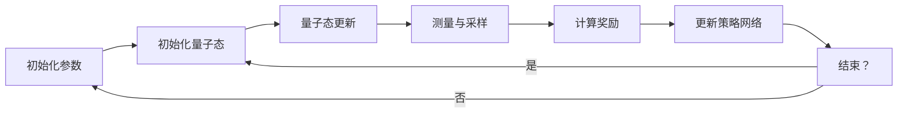

                 

# 宇宙规律与量子退火强化学习策略优化的联系

## 关键词：宇宙规律、量子退火、强化学习、策略优化、算法

## 摘要：
本文旨在探讨宇宙规律与量子退火强化学习策略优化之间的联系。通过引入宇宙演化的基本规律，结合量子力学和强化学习的基本概念，文章将详细分析量子退火强化学习算法的原理及其在优化问题中的应用。文章结构分为三部分：背景介绍、核心概念与联系、以及算法原理讲解。每一部分都通过逻辑清晰的论述，为读者提供一个全面、深入的技术理解。

## 目录大纲

### 第一部分：背景介绍

#### 第1章：宇宙规律与量子退火强化学习概述

1.1 宇宙规律简介

1.2 量子退火强化学习简介

1.3 宇宙规律与量子退火强化学习的关系

1.4 本书结构安排

### 第二部分：核心概念与联系

#### 第2章：核心概念与联系详解

2.1 宇宙规律的核心概念

2.2 量子退火强化学习的关键概念

2.3 概念属性特征对比表格

2.4 ER实体关系图架构

### 第三部分：算法原理讲解

#### 第3章：量子退火强化学习算法原理详解

3.1 量子退火算法原理

3.2 强化学习算法原理

3.3 量子退火强化学习算法的mermaid流程图

## 第一部分：背景介绍

### 第1章：宇宙规律与量子退火强化学习概述

#### 1.1 宇宙规律简介

宇宙规律是描述宇宙从诞生到演化过程的科学法则。宇宙起源于大爆炸，经过数十亿年的演化，形成了目前我们所见的宇宙结构。宇宙的基本规律包括宇宙演化模型、宇宙结构理论和宇宙暗物质与暗能量理论。这些规律帮助我们理解宇宙的起源、演化以及未来的命运。

#### 1.2 量子退火强化学习简介

量子退火强化学习是结合量子计算和机器学习的一种新型算法。量子退火是一种利用量子态调控和优化问题的方法，其基本原理来源于模拟退火算法。强化学习是一种通过试错和奖励机制来学习最优策略的机器学习方法。量子退火强化学习通过引入量子力学中的量子态和叠加原理，可以显著提高优化算法的性能。

#### 1.3 宇宙规律与量子退火强化学习的关系

宇宙规律与量子退火强化学习之间的联系体现在多个方面。首先，宇宙演化的过程中，宇宙的结构和物质分布呈现出高度复杂的模式，这为优化算法提供了丰富的应用场景。其次，量子力学的基本原理，如量子叠加态和量子纠缠，为量子退火强化学习提供了理论基础。最后，宇宙规律中的复杂性和不确定性，与强化学习中的探索与利用问题有相似之处，因此量子退火强化学习可以在宇宙规律的研究中发挥重要作用。

#### 1.4 本书结构安排

本书分为三个部分，首先介绍宇宙规律和量子退火强化学习的基本概念，然后详细分析这两者之间的联系，最后讲解量子退火强化学习算法的原理及其应用。通过这种结构安排，读者可以逐步建立起对量子退火强化学习的深入理解。

## 第二部分：核心概念与联系

### 第2章：核心概念与联系详解

#### 2.1 宇宙规律的核心概念

宇宙规律的核心概念包括宇宙演化模型、宇宙结构理论和宇宙暗物质与暗能量理论。宇宙演化模型描述了宇宙从大爆炸到现在的演化过程，宇宙结构理论解释了宇宙的几何形态，而宇宙暗物质与暗能量理论则揭示了宇宙中不可见但影响巨大的物质和能量。

#### 2.2 量子退火强化学习的关键概念

量子退火强化学习的关键概念包括量子退火、强化学习以及它们之间的融合。量子退火利用量子态调控优化问题，强化学习通过试错和奖励机制学习最优策略。量子退火强化学习的融合旨在结合两者的优势，实现更高效的优化。

#### 2.3 概念属性特征对比表格

在表格中，我们可以对比宇宙规律和量子退火强化学习的不同特征。例如，宇宙规律关注宇宙演化和结构，而量子退火强化学习关注优化算法的性能。这种对比有助于读者更好地理解两者的异同点。

#### 2.4 ER实体关系图架构

通过ER（实体-关系）图，我们可以清晰地描述宇宙规律和量子退火强化学习中的关键实体和它们之间的关系。例如，宇宙中的星系、黑洞可以视为实体，它们之间的引力相互作用可以视为关系。

### 第二部分：核心概念与联系

#### 第2章：核心概念与联系详解

#### 2.1 宇宙规律的核心概念

宇宙规律的核心概念涉及对宇宙从起源到演化的全面理解。以下是宇宙规律的核心概念及其详细解释：

##### 2.1.1 宇宙演化模型

宇宙演化模型是描述宇宙从大爆炸到现在的演化过程的科学理论。其中最著名的是大爆炸理论，它认为宇宙在大约138亿年前从极度热密的状态开始膨胀，形成了今天我们所见的宇宙。此外，宇宙演化模型还包括宇宙背景辐射、宇宙加速膨胀等概念。

##### 2.1.2 宇宙结构理论

宇宙结构理论解释了宇宙的几何形态和宏观结构。当前主流的宇宙结构理论包括弗里德曼-勒梅特-罗伯逊-沃尔克（FLRW）度规和哈勃定律。FLRW度规描述了一个均匀且各向同性的宇宙，而哈勃定律揭示了宇宙的膨胀速度与其距离之间的关系。

##### 2.1.3 宇宙暗物质与暗能量理论

宇宙暗物质与暗能量理论解释了宇宙中不可见但影响巨大的物质和能量。暗物质是由我们无法直接观测到的粒子组成的，它对宇宙的引力作用至关重要。暗能量则是一种推动宇宙加速膨胀的神秘力量，其本质尚未完全了解。

#### 2.1.2 量子力学的基本概念

量子力学是描述微观世界物理现象的物理学分支。以下是其核心概念：

##### 2.1.2.1 波函数

波函数是量子力学中描述粒子状态的数学函数。它提供了粒子的位置、动量等物理量在量子态下的概率分布。

##### 2.1.2.2 量子叠加态与量子纠缠

量子叠加态指的是量子系统可以同时存在于多个状态的组合。量子纠缠是量子系统之间的一种特殊关联，即使它们相隔很远，一个系统的状态也会即时影响另一个系统的状态。

##### 2.1.2.3 量子测量与坍缩

量子测量是量子系统与测量设备相互作用的过程。在这个过程中，量子系统的波函数会发生坍缩，从一个叠加态变为一个确定的态。量子坍缩是量子力学中的一个基本原理，决定了量子系统的可观测性。

#### 2.2 量子退火强化学习的关键概念

量子退火强化学习是结合量子计算和机器学习的一种新型算法。以下是它的关键概念：

##### 2.2.1 量子退火的基本原理

量子退火是基于量子态调控的一种优化算法。它利用量子态的叠加和纠缠特性，通过迭代更新量子态，最终找到优化问题的最优解。量子退火与模拟退火类似，但具有更高的效率和更广泛的适用范围。

##### 2.2.2 量子退火算法流程

量子退火算法通常包括以下步骤：

1. **初始化参数**：选择适当的量子系统和参数，初始化量子态。
2. **量子态更新**：通过量子门操作更新量子态，使其更接近最优解。
3. **测量与采样**：对量子态进行测量，获得最优解的采样结果。

##### 2.2.3 强化学习的基本原理

强化学习是一种通过试错和奖励机制来学习最优策略的机器学习方法。它包括以下几个关键概念：

1. **状态（State）**：系统的当前状态。
2. **动作（Action）**：在当前状态下可以采取的行动。
3. **奖励（Reward）**：根据动作的结果，系统获得的奖励或惩罚。
4. **策略（Policy）**：系统根据当前状态选择动作的规则。

##### 2.2.4 强化学习的算法框架

强化学习的基本框架包括：

1. **价值函数（Value Function）**：预测在给定状态下执行特定动作的长期奖励。
2. **策略网络（Policy Network）**：根据当前状态，选择最佳动作。

##### 2.2.5 量子退火强化学习的融合

量子退火强化学习的融合旨在利用量子计算的强大能力，提高强化学习算法的性能。具体来说，它包括以下方面：

1. **量子价值函数**：利用量子计算的优势，计算状态的价值函数。
2. **量子策略网络**：利用量子计算的优势，优化策略网络。

#### 2.3 概念属性特征对比表格

以下是一个简单的概念属性特征对比表格，用于比较宇宙规律和量子退火强化学习的关键概念：

| 概念                  | 宇宙规律                                   | 量子退火强化学习                                      |
|----------------------|--------------------------------------------|-------------------------------------------------------|
| 演化模型             | 大爆炸理论、宇宙背景辐射                   | 量子态调控、优化算法流程                                |
| 结构理论             | FLRW度规、哈勃定律                        | 量子叠加态、量子纠缠                                   |
| 暗物质与暗能量理论   | 暗物质、暗能量                            | 量子测量、量子坍缩、强化学习策略                        |
| 关键特性             | 宇宙演化、宇宙结构、暗物质和暗能量         | 量子计算能力、优化效率、强化学习策略                    |
| 应用场景             | 天文学、宇宙学                             | 机器学习优化问题、复杂系统模拟                          |

#### 2.4 ER实体关系图架构

为了更好地理解宇宙规律和量子退火强化学习中的实体及其关系，我们可以使用ER（实体-关系）图进行描述。以下是一个简化的ER图：

```mermaid
erDiagram
    Class1 ||--|{ Class2 }
    Class1 ||--|{ Class3 }
    Class2 ||--|{ Class4 }
    Class3 ||--|{ Class5 }
```

在这个ER图中，`Class1`、`Class2`、`Class3`、`Class4`和`Class5`分别代表宇宙规律和量子退火强化学习中的关键实体，它们之间的关系用箭头表示。例如，`Class1`与`Class2`和`Class3`之间存在关联，表示宇宙规律与量子力学、强化学习之间的密切联系。

## 第三部分：算法原理讲解

### 第3章：量子退火强化学习算法原理详解

#### 3.1 量子退火算法原理

量子退火算法是一种基于量子态调控的优化算法，其原理源于模拟退火算法。模拟退火算法通过在高温环境中让系统自由演化，然后逐渐降低温度，最终使系统达到全局最优解。量子退火算法则利用量子计算机的量子态调控能力，实现更高效的优化过程。

#### 3.1.1 量子退火的基本概念

量子退火算法主要包括以下几个基本概念：

1. **量子态**：量子态是量子系统的状态，它可以同时存在于多个状态的叠加。
2. **退火过程**：退火过程是指通过迭代更新量子态，使系统从初始态逐渐接近最优解。
3. **测量与采样**：测量与采样是指对量子态进行测量，获得最优解的采样结果。

#### 3.1.2 量子退火算法流程

量子退火算法的流程通常包括以下几个步骤：

1. **初始化参数**：选择适当的量子系统和参数，初始化量子态。
2. **量子态更新**：通过量子门操作更新量子态，使其更接近最优解。
3. **测量与采样**：对量子态进行测量，获得最优解的采样结果。

#### 3.1.3 量子退火与经典退火算法的对比

量子退火算法与经典退火算法在退火过程中有以下几点不同：

1. **退火过程**：经典退火算法通过逐步降低温度实现优化，而量子退火算法利用量子态的叠加和纠缠特性，实现更高效的优化过程。
2. **效率**：量子退火算法在处理复杂优化问题时具有更高的效率，因为它可以利用量子并行计算的优势。
3. **适用范围**：量子退火算法适用于更广泛的优化问题，包括组合优化、机器学习优化等。

#### 3.2 强化学习算法原理

强化学习是一种通过试错和奖励机制来学习最优策略的机器学习方法。它主要包括以下几个基本概念：

1. **状态**：状态是系统当前所处的环境条件。
2. **动作**：动作是在当前状态下可以采取的行动。
3. **奖励**：奖励是系统采取动作后获得的正面或负面反馈。
4. **策略**：策略是系统根据当前状态选择动作的规则。

#### 3.2.1 强化学习的基本概念

强化学习的基本概念包括：

1. **价值函数**：价值函数是预测在给定状态下执行特定动作的长期奖励。
2. **策略网络**：策略网络是根据当前状态选择最佳动作的神经网络。

#### 3.2.2 常见强化学习算法

常见的强化学习算法包括：

1. **Q-Learning算法**：Q-Learning算法是一种基于价值函数的强化学习算法，通过迭代更新Q值，最终找到最优策略。
2. **SARSA算法**：SARSA算法是一种基于策略的强化学习算法，它同时考虑当前状态和未来状态，更新策略网络。
3. **DQN算法**：DQN算法是一种基于深度学习的强化学习算法，它使用深度神经网络来近似价值函数。

#### 3.2.3 强化学习与量子退火的结合

强化学习与量子退火的结合旨在利用量子计算的强大能力，提高强化学习算法的性能。具体来说，它可以应用于以下几个方面：

1. **量子价值函数**：使用量子计算来近似强化学习中的价值函数，提高计算效率。
2. **量子策略网络**：使用量子计算来优化强化学习中的策略网络，提高策略质量。

#### 3.3 量子退火强化学习算法的mermaid流程图

以下是一个量子退火强化学习算法的mermaid流程图：



在这个流程图中，A、B、C、D、E、F和G分别表示初始化参数、初始化量子态、量子态更新、测量与采样、计算奖励、更新策略网络和结束判断。通过这个流程图，我们可以清晰地了解量子退火强化学习算法的运行过程。

