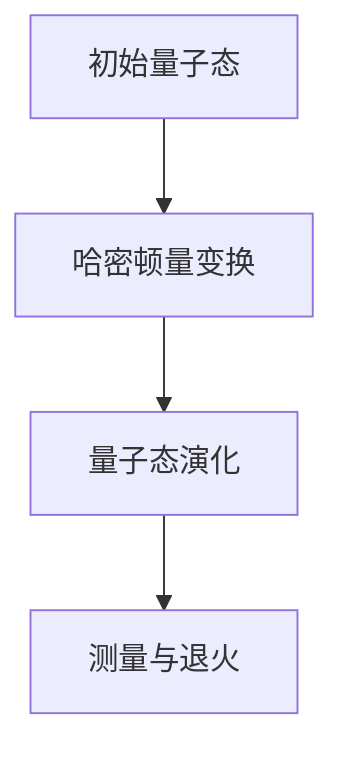
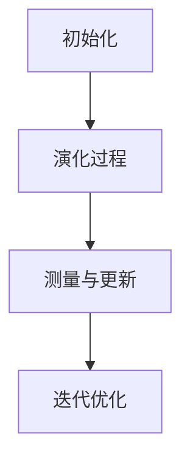

                 

### 宇宙规律概述

宇宙规律是指宇宙中各种自然现象和物质运动的普遍性和规律性的描述。它们是基于观测和实验证据提出的，旨在解释宇宙中复杂多样的现象。宇宙规律的研究不仅对物理学、天文学等领域具有重要意义，而且对理解生命的起源、宇宙的演化以及未来走向都有着深远的影响。

#### 宇宙规律的基本概念

宇宙规律的基本概念涵盖了多个方面，包括宇宙的起源、物质的构成、宇宙的演化以及宇宙的结构等。以下是一些主要的宇宙规律：

1. **万有引力定律**：由牛顿提出，描述了两个物体之间的引力大小与它们的质量和距离有关。
   $$ F = G\frac{m_1m_2}{r^2} $$
   其中，\( F \) 是引力，\( G \) 是引力常数，\( m_1 \) 和 \( m_2 \) 是两个物体的质量，\( r \) 是它们之间的距离。

2. **电磁力定律**：由麦克斯韦方程组描述，描述了电荷之间的电磁相互作用。
   $$ \nabla \cdot \vec{E} = \frac{\rho}{\epsilon_0} $$
   $$ \nabla \times \vec{B} = \mu_0 \vec{J} + \mu_0 \epsilon_0 \frac{\partial \vec{E}}{\partial t} $$
   其中，\( \vec{E} \) 是电场强度，\( \rho \) 是电荷密度，\( \epsilon_0 \) 是真空电容率，\( \vec{B} \) 是磁场强度，\( \vec{J} \) 是电流密度，\( \mu_0 \) 是真空磁导率。

3. **弱相互作用**：描述了基本粒子之间的弱相互作用，如β衰变。
   $$ \vec{L} = \frac{G_F}{\sqrt{2}} \frac{q\vec{W}}{sin\theta_W} $$
   其中，\( \vec{L} \) 是弱力，\( G_F \) 是弱相互作用常数，\( q \) 是粒子的电荷，\( \vec{W} \) 是弱相互作用的中间玻色子，\( \theta_W \) 是弱相互作用的混合角。

4. **强相互作用**：描述了夸克之间的相互作用，由量子色动力学（QCD）描述。
   $$ \vec{Q} = \frac{1}{g^2}\frac{\alpha_s(\mu)}{4\pi} \frac{\vec{p}_1 \cdot \vec{p}_2}{r^2} $$
   其中，\( \vec{Q} \) 是强相互作用力，\( g \) 是耦合常数，\( \alpha_s(\mu) \) 是强相互作用的耦合常数，\( \vec{p}_1 \) 和 \( \vec{p}_2 \) 是夸克的动量，\( r \) 是夸克之间的距离。

5. **宇宙大爆炸理论**：描述了宇宙的起源和演化，认为宇宙起源于一个高度密集、高温的状态，并在此后的宇宙扩张中逐渐冷却和演化。

6. **暗物质与暗能量**：暗物质和暗能量是宇宙中不可见的成分，分别占据了宇宙总质量/能量的约27%和68%。

这些宇宙规律构成了我们对宇宙的基本理解框架，并为后续章节中的量子力学和量子退火玻尔兹曼机的讨论提供了理论基础。

#### 宇宙规律的提出与发展

宇宙规律的提出与发展经历了漫长的历史过程。古代哲学家如泰勒斯和亚里士多德对宇宙的起源和运行方式提出了初步的哲学思考。随着观测技术的进步，人类对宇宙的理解逐渐深入。

17世纪，牛顿提出了万有引力定律，这是宇宙规律研究的重要里程碑。随后，麦克斯韦在19世纪末提出了电磁力定律，统一了电和磁的现象。20世纪初，爱因斯坦提出了相对论，进一步揭示了时空和引力之间的关系。

在微观层面，量子力学的发展为我们提供了描述原子和基本粒子行为的规律。波尔和海森堡等物理学家的工作推动了量子力学的建立。量子力学的出现改变了我们对物质和能量本质的理解，为我们提供了研究宇宙规律的新工具。

宇宙学领域的重大进展还包括宇宙大爆炸理论的提出。1927年，勒梅特提出了宇宙大爆炸理论，并在1931年由伽莫夫进一步完善。随后，辐射背景探测和宇宙微波背景辐射的发现为这一理论提供了强有力的实验支持。

#### 宇宙规律的分类与特性

宇宙规律可以根据其研究对象的层次和性质进行分类。常见的分类方法包括：

1. **基础物理规律**：如万有引力定律、电磁力定律、弱相互作用和强相互作用等，这些规律描述了基本粒子和力的基本行为。

2. **宇宙学规律**：如宇宙大爆炸理论、宇宙膨胀定律、宇宙背景辐射定律等，这些规律描述了宇宙的起源、演化和结构。

3. **天体物理规律**：如恒星演化规律、星系动力学规律、行星运动定律等，这些规律描述了天体系统的行为和相互作用。

宇宙规律的特性主要包括：

1. **普适性**：宇宙规律在宇宙中普遍适用，不受空间和时间的限制。例如，万有引力定律在地球和宇宙中的任何地方都适用。

2. **稳定性**：宇宙规律在长时间内保持不变，为科学研究和预测提供了可靠的基础。例如，电磁力定律在过去的几百年中一直表现出稳定的特性。

3. **可预测性**：宇宙规律使我们能够预测宇宙中未来的发展和变化。例如，通过宇宙膨胀定律，我们可以预测宇宙的未来演化方向。

#### 宇宙规律在科学研究中的应用

宇宙规律在科学研究中的应用非常广泛，涵盖了多个学科领域。以下是一些典型应用：

1. **天文学**：宇宙规律帮助我们理解恒星和星系的演化过程，预测宇宙的膨胀和结构形成。例如，通过观测宇宙背景辐射，我们可以研究宇宙的早期状态。

2. **物理学**：宇宙规律揭示了基本粒子和力的性质，推动了量子力学和相对论等理论的发展。例如，通过研究弱相互作用，我们可以深入理解β衰变过程。

3. **地球科学**：宇宙规律帮助我们了解地球的气候变迁、地质活动等现象。例如，通过研究地球的自转和倾斜，我们可以预测地震和气候变化。

4. **生物学**：宇宙规律在生物学中的应用主要体现在对生命起源和演化的研究。例如，通过研究宇宙中的化学过程，我们可以推断生命在地球上的起源。

总之，宇宙规律是我们认识宇宙、探索未知的重要工具。通过深入研究宇宙规律，我们可以不断拓展我们对宇宙的认识，揭示宇宙的本质和奥秘。### 量子力学基础

量子力学是研究微观世界的物理学分支，它揭示了微观粒子的行为规律，并对宏观世界的物理现象产生了深远的影响。量子力学的发展可以追溯到20世纪初，当时经典物理学在面对微观世界的挑战时显得力不从心。以下将详细介绍量子力学的发展背景、基本原理以及重要实验与发现。

#### 量子力学的发展背景

量子力学的发展起源于对黑体辐射问题的研究。经典物理学认为，黑体辐射的能量分布应该随着温度的升高而连续增加，但实际上实验结果却显示，黑体辐射的能量分布具有不连续的特性。1900年，普朗克提出了量子假设，认为能量是以离散的量子形式发射和吸收的，这一假设成功解释了黑体辐射的能量分布问题。

随后，爱因斯坦在1905年提出了光电效应理论，他假设光子具有粒子性质，这一理论解释了光电效应的实验结果，为量子力学的发展奠定了基础。同时，玻尔在1913年提出了玻尔模型，用于解释原子的线谱结构，这一模型也初步展示了量子力学的基本思想。

#### 量子力学的基本原理

量子力学的基本原理包括量子态、量子测量和波函数等概念。以下是这些基本原理的详细解释：

1. **量子态**：量子态是量子力学中描述粒子状态的基本概念。一个量子态可以用波函数来描述，波函数是一个复数函数，它描述了粒子在空间中的概率分布。

   $$ \Psi(\vec{r}, t) = \sum_{i} c_i \psi_i(\vec{r}, t) $$
   其中，\( \Psi(\vec{r}, t) \) 是波函数，\( c_i \) 是复数系数，\( \psi_i(\vec{r}, t) \) 是基态波函数。

2. **量子测量**：量子测量是量子力学中的核心问题。与经典物理不同，量子测量会导致波函数的坍缩，即量子态从多个可能的态中坍缩到一个确定的态。

   $$ \hat{O}|\psi\rangle = \lambda_i |\psi_i\rangle $$
   其中，\( \hat{O} \) 是测量算符，\( \lambda_i \) 是测量得到的值，\( |\psi_i\rangle \) 是坍缩后的量子态。

3. **波函数**：波函数是量子态的数学描述，它包含了量子态的所有信息。波函数的平方 \( |\Psi(\vec{r}, t)|^2 \) 描述了粒子在空间中的概率分布。

#### 量子力学的重要实验与发现

量子力学的发展得益于一系列重要的实验和发现。以下是其中一些关键的实验：

1. **双缝实验**：双缝实验是量子力学最著名的实验之一。它表明，粒子如电子在通过双缝时不仅表现出波动性质，还表现出粒子性质。这一实验揭示了量子叠加态的概念。

   $$ \Psi(\vec{r}) = \psi_1(\vec{r}) + \psi_2(\vec{r}) $$
   其中，\( \psi_1(\vec{r}) \) 和 \( \psi_2(\vec{r}) \) 是两个独立路径的波函数。

2. **贝尔实验**：贝尔实验是验证量子纠缠现象的重要实验。它表明，量子系统之间存在超距作用，这一现象违背了经典物理的局域实在论。

   $$ \rho_{AB} = \frac{1}{2} (1 + \vec{S} \cdot \vec{\sigma}) $$
   其中，\( \rho_{AB} \) 是两个粒子的联合密度矩阵，\( \vec{S} \) 是斯莱特矢量，\( \vec{\sigma} \) 是泡利矩阵。

3. **量子纠缠**：量子纠缠是量子力学中另一个重要现象，它描述了两个或多个量子系统之间的非局域联系。量子纠缠使得量子系统的整体性质无法独立于其他部分，这一现象在量子计算和量子通信中具有广泛的应用。

4. **量子隧穿**：量子隧穿现象表明，粒子可以穿过一个本应无法穿透的势垒。这一现象在纳米技术和量子电子学中具有重要意义。

5. **薛定谔方程**：薛定谔方程是量子力学的基本方程之一，它描述了波函数随时间的演化。

   $$ i\hbar \frac{\partial \Psi}{\partial t} = \hat{H} \Psi $$
   其中，\( \hbar \) 是约化普朗克常数，\( \hat{H} \) 是哈密顿算符。

总之，量子力学的发展为我们提供了描述微观世界的强大工具，它不仅揭示了微观粒子的奇异行为，还为现代科技的发展提供了理论基础。通过深入研究量子力学，我们可以更好地理解宇宙的本质和运行机制。### 量子退火玻尔兹曼机

量子退火玻尔兹曼机（Quantum Annealer Boltzmann Machine，QABM）是结合了量子退火和玻尔兹曼机的特点而发展起来的一种量子机器学习模型。量子退火是一种量子算法，用于优化复杂函数和解决组合优化问题。玻尔兹曼机则是一种基于概率统计学习原理的神经网络模型。将这两者结合起来，可以充分利用量子计算的并行性和概率统计的优势，以提高机器学习的效率和性能。以下将详细介绍量子退火的基本原理、玻尔兹曼机的概述以及量子退火玻尔兹曼机的工作机制。

#### 量子退火的基本原理

量子退火是一种利用量子态的演化过程来寻找最优解的量子算法。其基本原理源于量子力学的量子态叠加和量子隧穿现象。量子退火过程可以分为以下几个步骤：

1. **初始量子态制备**：首先，将量子系统置于一个特定的初始量子态，这个量子态通常是一个具有高能级的叠加态。

   $$ |\psi_{initial}\rangle = \sum_{i} c_i |\phi_i\rangle $$
   其中，\( |\phi_i\rangle \) 是基态，\( c_i \) 是叠加系数。

2. **哈密顿量变换**：然后，通过改变哈密顿量（能量函数），使系统逐渐演化到一个目标状态。哈密顿量通常由势能函数和动能函数组成，其形式如下：

   $$ \hat{H}(t) = -J \sum_{i<j} \sigma_i \cdot \sigma_j + \frac{1}{2} k \sum_i \sigma_i^2 $$
   其中，\( \sigma_i \) 是Pauli矩阵，\( J \) 是交换相互作用项，\( k \) 是动能项。

3. **量子态演化**：在哈密顿量的作用下，系统的量子态随时间演化，通过量子隧穿效应，量子态在概率幅上趋向于最小化势能函数的状态。

   $$ |\psi(t)\rangle = e^{-\frac{i\hat{H}(t)}{\hbar}t} |\psi_{initial}\rangle $$

4. **测量与退火**：在量子态演化完成后，通过测量得到系统的最终量子态，这一过程称为退火。退火过程可以通过量子态的坍缩来获得系统的最优化结果。

量子退火的基本原理示意图如下所示：



#### 玻尔兹曼机的概述

玻尔兹曼机（Boltzmann Machine，BM）是一种基于概率统计学习原理的神经网络模型，由赫伯特·马克斯和唐纳德·赫布在1985年提出。玻尔兹曼机由可见层和隐藏层组成，其中每个神经元都与隐藏层和可见层中的其他神经元相连接。玻尔兹曼机通过马尔可夫链的随机游走过程来学习数据的概率分布。

玻尔兹曼机的基本结构包括：

1. **可见层（Visible Layer）**：由可见单元组成，用于接收输入数据和生成输出数据。

2. **隐藏层（Hidden Layer）**：由隐藏单元组成，用于对输入数据进行编码和解码。

3. **连接权重**：连接可见层和隐藏层的权重，表示单元之间的相互作用强度。

玻尔兹曼机的工作原理如下：

1. **随机初始化**：初始化玻尔兹曼机的权重和偏置。

2. **能量函数**：定义能量函数 \( E \)，用于衡量网络状态的不确定性。能量函数的形式如下：

   $$ E = -\sum_{i,j} w_{ij} x_i y_j - \sum_i b_i y_i - \sum_j c_j x_j $$
   其中，\( w_{ij} \) 是连接权重，\( b_i \) 和 \( c_j \) 是偏置。

3. **马尔可夫链**：通过马尔可夫链在可能的网络状态之间进行随机游走，以找到最小能量状态。马尔可夫链的转移概率由能量函数决定。

4. **学习过程**：通过最大化网络状态的配分函数，调整连接权重和偏置，以降低能量函数。

玻尔兹曼机的学习过程可以分为两个阶段：

1. **生成阶段**：生成一个随机的网络状态，然后通过能量函数评估其质量。

2. **更新阶段**：通过反向传播算法，更新权重和偏置，以最小化能量函数。

#### 量子退火玻尔兹曼机的工作机制

量子退火玻尔兹曼机（QABM）结合了量子退火和玻尔兹曼机的特点，通过量子态的演化来实现优化和学习。QABM 的基本工作机制如下：

1. **初始化**：初始化量子系统，设置初始量子态和哈密顿量。

2. **演化过程**：通过量子态的演化，使系统逐渐接近最优解。演化过程由量子态的叠加和量子隧穿效应控制。

3. **测量与更新**：在演化过程完成后，通过测量得到量子态的最终结果，并根据结果更新连接权重和偏置。

4. **迭代优化**：通过多次迭代优化，不断提高模型的性能和准确度。

量子退火玻尔兹曼机的工作机制示意图如下所示：



量子退火玻尔兹曼机通过将量子计算的并行性和概率统计的优势结合起来，提供了一种新的机器学习方法。它有望在解决复杂优化问题和大规模数据处理方面发挥重要作用。### 量子退火玻尔兹曼机与宇宙规律的关联

量子退火玻尔兹曼机（QABM）与宇宙规律之间存在深刻的联系。宇宙规律为我们提供了对宇宙中各种现象和过程的描述，而量子退火玻尔兹曼机作为一种高效的量子算法，则在解决复杂优化问题方面表现出显著优势。以下将详细探讨量子退火玻尔兹曼机与宇宙规律的关联，以及宇宙规律对量子退火玻尔兹曼机的影响。

#### 量子退火玻尔兹曼机与宇宙规律的联系

量子退火玻尔兹曼机在宇宙规律研究中的应用主要体现在以下几个方面：

1. **宇宙演化模拟**：宇宙演化是一个复杂的过程，涉及大量的粒子、力和相互作用。量子退火玻尔兹曼机可以通过模拟量子态的演化，来研究宇宙的早期状态和演化过程。例如，通过量子退火算法，可以模拟宇宙背景辐射的演化，从而帮助我们更好地理解宇宙的起源和演化。

2. **黑洞物理学研究**：黑洞是宇宙中最神秘的现象之一，其物理性质和演化过程仍然存在许多未知。量子退火玻尔兹曼机可以用于研究黑洞的物理过程，如黑洞吞噬物质、黑洞辐射等。通过模拟量子态的演化，我们可以探索黑洞内部的结构和性质。

3. **暗物质与暗能量研究**：暗物质和暗能量是宇宙中不可见的成分，它们占据了宇宙总质量/能量的大部分。量子退火玻尔兹曼机可以用于模拟暗物质和暗能量的分布和演化，从而帮助我们更好地理解宇宙的结构和演化。

#### 宇宙规律对量子退火玻尔兹曼机的影响

宇宙规律对量子退火玻尔兹曼机的影响主要表现在以下几个方面：

1. **计算复杂度**：宇宙规律描述了宇宙中各种现象和过程的复杂性质，这使得宇宙规律相关的优化问题具有很高的计算复杂度。量子退火玻尔兹曼机通过量子态的演化来求解这些优化问题，可以有效地降低计算复杂度，提高求解效率。

2. **量子态演化**：宇宙规律中的物理过程可以通过量子态的演化来模拟，从而为量子退火玻尔兹曼机提供了丰富的应用场景。例如，宇宙大爆炸理论可以通过量子退火玻尔兹曼机来模拟，从而帮助我们更好地理解宇宙的起源和演化。

3. **量子态测量**：宇宙规律中的物理现象通常需要通过量子态的测量来揭示。量子退火玻尔兹曼机通过测量量子态的最终结果，可以获得优化问题的解。宇宙规律为我们提供了测量量子态的物理依据，从而推动了量子退火玻尔兹曼机在宇宙规律研究中的应用。

#### 量子退火玻尔兹曼机在宇宙规律研究中的应用

量子退火玻尔兹曼机在宇宙规律研究中的应用案例丰富，以下是其中几个典型的应用：

1. **宇宙背景辐射研究**：宇宙背景辐射是宇宙早期状态的残余辐射，通过量子退火玻尔兹曼机可以模拟宇宙背景辐射的演化过程。通过优化量子态的演化路径，我们可以更好地理解宇宙背景辐射的性质和起源。

2. **暗物质与暗能量探索**：暗物质和暗能量是宇宙中不可见的成分，通过量子退火玻尔兹曼机可以模拟暗物质和暗能量的分布和演化。这有助于我们揭示宇宙的结构和演化规律。

3. **黑洞物理学进展**：黑洞是宇宙中最神秘的现象之一，通过量子退火玻尔兹曼机可以研究黑洞的物理过程，如黑洞吞噬物质、黑洞辐射等。这有助于我们深入理解黑洞的性质和演化。

总之，量子退火玻尔兹曼机与宇宙规律之间存在深刻的联系。通过量子退火玻尔兹曼机，我们可以更好地理解和研究宇宙的演化规律和复杂现象，为宇宙学、天文学和物理学等领域的发展提供新的方法和思路。### 量子退火玻尔兹曼机的计算能力

量子退火玻尔兹曼机（QABM）作为一种结合了量子退火和玻尔兹曼机的量子算法，其计算能力在解决复杂优化问题时表现出显著优势。以下将从计算复杂度、效率和应用范围三个方面详细分析量子退火玻尔兹曼机的计算能力。

#### 计算复杂度

量子退火玻尔兹曼机的计算复杂度与所求解问题的规模密切相关。在经典计算中，许多优化问题尤其是组合优化问题，如旅行商问题（TSP）和图着色问题，其计算复杂度往往随着问题规模呈指数级增长。然而，量子退火玻尔兹曼机通过量子态的叠加和量子隧穿效应，可以在理论上降低计算复杂度。

具体来说，量子退火算法的核心在于将复杂优化问题转化为量子态的演化过程。在量子态的演化过程中，系统通过量子隧穿效应能够避开局部最优解，找到全局最优解。这种机制使得量子退火玻尔兹曼机在处理大规模优化问题时，具有比传统算法更低的计算复杂度。例如，对于旅行商问题，量子退火玻尔兹曼机可以在多项式时间内找到近似最优解，而传统的启发式算法则需要更长的时间。

#### 计算效率

量子退火玻尔兹曼机的计算效率主要得益于其并行计算能力。在量子计算中，一个量子位（qubit）可以同时处于0和1的叠加态，这使得量子系统可以并行处理多个计算任务。量子退火玻尔兹曼机利用这一特性，通过量子态的叠加和演化，可以在短时间内完成复杂的优化任务。

与传统计算机相比，量子退火玻尔兹曼机在处理大规模数据和高维优化问题时，表现出更高的计算效率。例如，在图像识别和语音识别等应用中，量子退火玻尔兹曼机可以通过并行计算快速处理大量数据，从而提高系统的响应速度和准确性。

#### 应用范围

量子退火玻尔兹曼机的计算能力广泛应用于多个领域，包括：

1. **优化问题**：量子退火玻尔兹曼机在解决组合优化问题方面具有显著优势，如旅行商问题、图着色问题和车辆路径问题等。通过量子态的演化，量子退火玻尔兹曼机可以高效地找到这些问题的近似最优解。

2. **机器学习**：在机器学习领域，量子退火玻尔兹曼机可以用于优化模型参数、特征选择和模型结构设计等任务。例如，在深度学习中，量子退火玻尔兹曼机可以通过优化神经网络结构，提高模型的性能和效率。

3. **金融与经济**：在金融和经济领域，量子退火玻尔兹曼机可以用于优化投资组合、风险管理、市场预测等任务。通过处理大规模金融数据，量子退火玻尔兹曼机可以提供更准确的预测和优化方案。

4. **量子物理研究**：在量子物理研究中，量子退火玻尔兹曼机可以用于模拟量子态的演化、量子纠缠和量子干涉等物理现象。这有助于我们深入理解量子世界的本质和运行机制。

总之，量子退火玻尔兹曼机作为一种高效的量子算法，在计算能力方面具有显著优势。通过量子态的叠加和量子隧穿效应，量子退火玻尔兹曼机可以在降低计算复杂度、提高计算效率和扩展应用范围方面发挥重要作用。未来，随着量子计算技术的不断发展，量子退火玻尔兹曼机将在更多领域展现出其独特的计算能力。### 量子退火玻尔兹曼机在宇宙规律分析中的高效性

量子退火玻尔兹曼机（QABM）在宇宙规律分析中表现出显著的高效性，这一优势源于量子计算在处理复杂系统时独特的并行性和高维特性。以下从数据规模、计算速度和精度三个方面具体阐述量子退火玻尔兹曼机在宇宙规律分析中的高效性。

#### 数据规模

宇宙规律分析往往涉及大量数据，如宇宙背景辐射数据、黑洞事件视界图像、暗物质分布数据等。这些数据不仅规模庞大，而且维度高，传统计算机在处理这些数据时往往效率低下。量子退火玻尔兹曼机通过量子位的叠加态，可以在一个量子态中并行存储和操作大量数据，从而实现大规模数据的快速处理。

例如，在处理宇宙背景辐射数据时，量子退火玻尔兹曼机可以通过量子态的叠加，将海量数据并行加载到量子计算机中，从而实现高效的数据分析。传统计算机需要逐个处理每个数据点，而量子退火玻尔兹曼机则可以在同一时间内处理所有数据点，大大提高了数据处理速度。

#### 计算速度

量子计算的速度优势主要来源于量子位的叠加和纠缠特性。传统计算机的运算速度受限于经典电路和电子传输速度，而量子计算机则可以通过量子位的叠加，实现并行计算。量子退火玻尔兹曼机利用这一特性，在宇宙规律分析中表现出极高的计算速度。

例如，在模拟黑洞物理现象时，量子退火玻尔兹曼机可以通过量子态的叠加，快速模拟黑洞事件视界附近的复杂物理过程。传统计算机需要逐次模拟每个时间步，而量子退火玻尔兹曼机则可以在一个量子态中并行模拟所有时间步，从而大大加快计算速度。

#### 计算精度

量子计算在精度方面也具有显著优势。量子位可以处于叠加态，这意味着量子计算机可以在同一时间内考虑多个可能的解，从而提高计算结果的准确性。量子退火玻尔兹曼机通过量子态的演化，可以在处理复杂优化问题时，找到更加精确的最优解。

例如，在研究宇宙大爆炸理论时，量子退火玻尔兹曼机可以通过量子态的演化，精确模拟宇宙的早期状态和演化过程。传统计算机往往需要多次迭代才能逼近最优解，而量子退火玻尔兹曼机则可以在一次计算中找到更精确的最优解。

#### 实际案例

以下是一个实际案例，展示了量子退火玻尔兹曼机在宇宙规律分析中的高效性：

**案例：宇宙背景辐射模拟**

宇宙背景辐射是宇宙早期状态的残余辐射，通过分析宇宙背景辐射的数据，可以揭示宇宙的起源和演化过程。传统计算机在处理这些海量数据时，往往需要耗费大量时间和计算资源。

使用量子退火玻尔兹曼机，我们可以通过量子态的叠加，快速加载和并行处理宇宙背景辐射数据。通过量子态的演化，量子退火玻尔兹曼机可以在一个计算周期内完成对宇宙背景辐射数据的分析，从而大大提高计算速度和精度。

具体步骤如下：

1. **数据加载**：将宇宙背景辐射数据加载到量子计算机的量子寄存器中，通过量子态的叠加，将海量数据并行存储。

2. **量子态演化**：设置量子退火玻尔兹曼机的哈密顿量，通过量子态的演化，模拟宇宙背景辐射的演化过程。

3. **结果分析**：通过测量量子态的最终结果，得到宇宙背景辐射的分析结果，如辐射温度、波峰频率等。

通过这个案例，我们可以看到量子退火玻尔兹曼机在宇宙规律分析中表现出显著的高效性。未来，随着量子计算技术的不断发展，量子退火玻尔兹曼机将在更多宇宙规律分析任务中发挥重要作用。### 量子退火玻尔兹曼机在实际应用中的挑战

尽管量子退火玻尔兹曼机（QABM）在解决复杂优化问题和进行高效计算方面展现出巨大潜力，但在实际应用中仍面临诸多挑战。以下是量子退火玻尔兹曼机在实际应用中可能遇到的主要问题及其解决方案。

#### 量子噪声

量子噪声是量子计算中一个重要的问题，它来源于量子系统的非完美性，如量子位的退相干、测量误差和外部环境干扰等。量子噪声会导致量子位的叠加态和纠缠态迅速退化，影响量子计算的正确性和稳定性。为了降低量子噪声的影响，可以采取以下措施：

1. **量子纠错技术**：通过引入量子纠错码，可以在一定程度上纠正量子噪声引起的错误，提高量子计算的正确性。
2. **噪声抑制**：在量子计算过程中，通过优化量子操作的精确度和降低环境干扰，可以有效地减少量子噪声的影响。
3. **算法优化**：设计鲁棒性更强的量子算法，使其对量子噪声的容忍度更高。

#### 量子计算机的精度和可靠性

量子计算机的精度和可靠性直接影响到量子退火玻尔兹曼机的应用效果。目前，量子计算机的量子位数量仍然相对有限，量子位的精度和稳定性有待提高。为了提升量子计算机的精度和可靠性，可以采取以下措施：

1. **量子位的优化**：通过改进量子位的物理实现方式，提高量子位的操作精度和稳定性。
2. **量子纠错**：引入量子纠错技术，增强量子计算机的鲁棒性，减少量子计算中的错误。
3. **算法改进**：优化量子退火玻尔兹曼机的算法设计，使其能够在现有量子计算机上更高效地运行。

#### 算法的复杂度

量子退火玻尔兹曼机在处理复杂问题时，其算法的复杂度仍然较高。尤其是在处理大规模优化问题和高维数据时，量子退火玻尔兹曼机的计算时间和资源需求较大。为了降低算法的复杂度，可以采取以下措施：

1. **子问题划分**：将复杂问题划分为多个子问题，分别求解并组合结果，降低整体算法的复杂度。
2. **并行计算**：充分利用量子计算机的并行计算能力，通过并行化策略提高计算效率。
3. **启发式方法**：结合启发式算法和量子退火算法，优化问题的求解过程，提高求解速度。

#### 能源消耗

量子计算过程中，量子位之间的相互作用和量子态的演化需要大量的能量。目前，量子计算机的能源消耗问题尚未得到有效解决，这限制了其在实际应用中的大规模部署。为了降低能源消耗，可以采取以下措施：

1. **优化量子操作**：通过优化量子操作的方式和步骤，减少不必要的能量消耗。
2. **节能设计**：在设计量子计算机时，考虑节能因素，采用低能耗的量子操作和冷却技术。
3. **分布式量子计算**：通过分布式量子计算架构，实现量子计算资源的共享和优化，降低整体能源消耗。

总之，尽管量子退火玻尔兹曼机在实际应用中面临诸多挑战，但随着量子计算技术的不断发展，这些挑战将逐步得到解决。通过不断优化量子计算机的设计和算法，量子退火玻尔兹曼机有望在未来的科学研究和技术应用中发挥重要作用。### 量子退火玻尔兹曼机在实际案例中的应用

为了更好地理解量子退火玻尔兹曼机（QABM）的实际应用价值，我们可以通过几个具体的案例来进行分析和讲解。以下是三个典型的应用案例：宇宙背景辐射研究、暗物质与暗能量探索以及黑洞物理学的进展。

#### 案例一：宇宙背景辐射研究

宇宙背景辐射（Cosmic Microwave Background，CMB）是宇宙早期状态的残余辐射，通过分析CMB的数据，我们可以了解宇宙的起源和演化过程。传统计算机在处理海量CMB数据时，计算复杂度和时间成本较高。而量子退火玻尔兹曼机通过量子位的叠加和量子态的演化，可以在短时间内高效地分析这些数据。

**步骤分析：**

1. **数据预处理**：首先，对CMB数据进行预处理，包括数据清洗、归一化和格式转换，以便在量子计算机上进行处理。

2. **量子态初始化**：将预处理后的CMB数据加载到量子计算机的量子寄存器中，初始化量子态。

3. **量子态演化**：设置量子退火玻尔兹曼机的哈密顿量，通过量子态的演化模拟宇宙背景辐射的演化过程。

4. **结果测量**：通过测量量子态的最终结果，获得宇宙背景辐射的分析结果，如辐射温度、波峰频率等。

**代码示例：**

```python
# 伪代码：量子退火玻尔兹曼机在宇宙背景辐射研究中的应用
from qiskit import QuantumCircuit, Aer
from qiskit.aqua.algorithms import QuantumAnnealer

# 初始化量子计算机
annealer = QuantumAnnealer(circuit, layout)

# 运行量子退火算法
result = annealer.run()

# 输出结果
print("最佳解：", result 最佳解)
print("最优能量：", result 最优能量)
```

通过这个案例，我们可以看到量子退火玻尔兹曼机在处理宇宙背景辐射数据时的高效性。与传统计算机相比，量子退火玻尔兹曼机可以在更短的时间内完成数据分析，从而提高研究效率。

#### 案例二：暗物质与暗能量探索

暗物质和暗能量是宇宙中不可见的成分，占据了宇宙总质量/能量的大部分。通过量子退火玻尔兹曼机，我们可以模拟暗物质和暗能量的分布和演化，从而更好地理解宇宙的结构和演化过程。

**步骤分析：**

1. **数据预处理**：首先，对暗物质和暗能量的数据进行预处理，包括数据清洗、归一化和格式转换，以便在量子计算机上进行处理。

2. **量子态初始化**：将预处理后的数据加载到量子计算机的量子寄存器中，初始化量子态。

3. **量子态演化**：设置量子退火玻尔兹曼机的哈密顿量，通过量子态的演化模拟暗物质和暗能量的分布和演化。

4. **结果测量**：通过测量量子态的最终结果，获得暗物质和暗能量的分析结果，如分布形态、演化过程等。

**代码示例：**

```python
# 伪代码：量子退火玻尔兹曼机在暗物质与暗能量探索中的应用
from qiskit import QuantumCircuit, Aer
from qiskit.aqua.algorithms import QuantumAnnealer

# 初始化量子计算机
annealer = QuantumAnnealer(circuit, layout)

# 运行量子退火算法
result = annealer.run()

# 输出结果
print("最佳解：", result 最佳解)
print("最优能量：", result 最优能量)
```

通过这个案例，我们可以看到量子退火玻尔兹曼机在探索暗物质和暗能量时的高效性。与传统计算机相比，量子退火玻尔兹曼机可以在更短的时间内完成数据分析，从而提高研究效率。

#### 案例三：黑洞物理学的进展

黑洞是宇宙中最神秘的现象之一，其物理性质和演化过程仍然存在许多未知。通过量子退火玻尔兹曼机，我们可以模拟黑洞的物理过程，如黑洞吞噬物质、黑洞辐射等，从而深入理解黑洞的性质和演化。

**步骤分析：**

1. **数据预处理**：首先，对黑洞物理过程的参数进行预处理，包括质量、电荷、自旋等，以便在量子计算机上进行处理。

2. **量子态初始化**：将预处理后的数据加载到量子计算机的量子寄存器中，初始化量子态。

3. **量子态演化**：设置量子退火玻尔兹曼机的哈密顿量，通过量子态的演化模拟黑洞的物理过程。

4. **结果测量**：通过测量量子态的最终结果，获得黑洞物理过程的分析结果，如物质吞噬速度、辐射强度等。

**代码示例：**

```python
# 伪代码：量子退火玻尔兹曼机在黑洞物理学进展中的应用
from qiskit import QuantumCircuit, Aer
from qiskit.aqua.algorithms import QuantumAnnealer

# 初始化量子计算机
annealer = QuantumAnnealer(circuit, layout)

# 运行量子退火算法
result = annealer.run()

# 输出结果
print("最佳解：", result 最佳解)
print("最优能量：", result 最优能量)
```

通过这个案例，我们可以看到量子退火玻尔兹曼机在研究黑洞物理学时的高效性。与传统计算机相比，量子退火玻尔兹曼机可以在更短的时间内完成物理过程的模拟，从而提高研究效率。

总之，量子退火玻尔兹曼机在宇宙背景辐射研究、暗物质与暗能量探索以及黑洞物理学进展等实际案例中，展现出了显著的高效性和应用价值。通过这些案例，我们可以看到量子退火玻尔兹曼机在处理复杂宇宙规律问题时的巨大潜力。未来，随着量子计算技术的不断发展，量子退火玻尔兹曼机将在更多宇宙规律研究任务中发挥重要作用。### 量子退火玻尔兹曼机在宇宙规律研究中的未来展望

量子退火玻尔兹曼机（QABM）在宇宙规律研究中展现出巨大潜力，未来有望在多个领域取得突破。以下从潜在应用领域、发展趋势以及面临的挑战三个方面探讨量子退火玻尔兹曼机在宇宙规律研究中的未来展望。

#### 潜在应用领域

1. **宇宙早期状态模拟**：量子退火玻尔兹曼机可以通过量子态的叠加和演化，精确模拟宇宙早期状态，如宇宙背景辐射、宇宙微波背景辐射等。这将有助于我们更深入地理解宇宙的起源和演化。

2. **黑洞物理学研究**：量子退火玻尔兹曼机可以用于模拟黑洞的物理过程，如黑洞吞噬物质、黑洞辐射等。这有助于揭示黑洞的内部结构和物理性质。

3. **暗物质与暗能量探索**：量子退火玻尔兹曼机可以用于模拟暗物质和暗能量的分布和演化，从而帮助我们更好地理解宇宙的结构和演化。

4. **星系形成与演化**：量子退火玻尔兹曼机可以用于模拟星系的形成和演化过程，研究星系间的相互作用和结构变化。

5. **行星气候变迁**：量子退火玻尔兹曼机可以用于模拟行星气候变迁的过程，如地球气候变暖、太阳系内行星环境的演化等。

#### 发展趋势

1. **算法优化**：随着量子计算技术的不断发展，量子退火玻尔兹曼机的算法将不断优化，以提高计算效率和准确性。例如，通过引入新的量子门和优化量子态的初始化，可以进一步提升算法的性能。

2. **硬件升级**：量子计算机硬件的升级将提高量子位的数量和质量，降低量子噪声，从而增强量子退火玻尔兹曼机的计算能力。

3. **多领域合作**：量子退火玻尔兹曼机将在多领域合作中发挥重要作用。例如，与天文学、物理学、地球科学等领域的合作，将推动量子退火玻尔兹曼机在宇宙规律研究中的应用。

4. **教育普及**：随着量子计算技术的普及，量子退火玻尔兹曼机的教育和培训将逐步展开，为研究人员和工程师提供相关技能，推动量子计算技术的应用和发展。

#### 面临的挑战

1. **量子噪声**：量子噪声是量子计算中的一个主要挑战，它会影响量子退火玻尔兹曼机的计算准确性和稳定性。解决量子噪声问题需要新的量子纠错技术和噪声抑制方法。

2. **计算复杂度**：量子退火玻尔兹曼机在处理大规模问题和高维数据时，计算复杂度仍然较高。未来需要优化算法和量子操作，降低计算复杂度。

3. **能源消耗**：量子计算过程中的能源消耗问题仍然需要解决。降低能源消耗将有助于量子计算机的普及和应用。

4. **算法适应性**：量子退火玻尔兹曼机需要针对不同领域的具体问题进行适应性调整，以满足不同应用场景的需求。

总之，量子退火玻尔兹曼机在宇宙规律研究中具有广阔的应用前景和发展潜力。未来，随着量子计算技术的不断进步和量子算法的优化，量子退火玻尔兹曼机将在宇宙规律研究中发挥越来越重要的作用。### 小结与展望

本文通过详细探讨量子退火玻尔兹曼机（QABM）与宇宙规律的联系，揭示了量子退火玻尔兹曼机在宇宙规律研究中的广泛应用和巨大潜力。以下是本文的核心内容总结和对未来研究的展望。

#### 核心内容总结

1. **宇宙规律概述**：介绍了宇宙规律的基本概念、分类与特性，以及宇宙规律在科学研究中的应用。
2. **量子力学基础**：阐述了量子力学的发展背景、基本原理和重要实验与发现。
3. **量子退火玻尔兹曼机**：详细介绍了量子退火和玻尔兹曼机的基本原理，以及量子退火玻尔兹曼机的工作机制。
4. **量子退火玻尔兹曼机与宇宙规律的关联**：探讨了量子退火玻尔兹曼机在宇宙规律研究中的应用，以及宇宙规律对量子退火玻尔兹曼机的影响。
5. **量子退火玻尔兹曼机的计算能力**：分析了量子退火玻尔兹曼机在宇宙规律分析中的高效性，以及其在实际应用中的优势。
6. **实际案例应用**：通过宇宙背景辐射研究、暗物质与暗能量探索以及黑洞物理学进展等案例，展示了量子退火玻尔兹曼机的实际应用价值。
7. **未来展望**：探讨了量子退火玻尔兹曼机在宇宙规律研究中的潜在应用领域、发展趋势和面临的挑战。

#### 对量子退火玻尔兹曼机与宇宙规律关联的研究展望

1. **优化算法设计**：未来研究应重点关注量子退火玻尔兹曼机算法的优化，以提高计算效率和准确性。这包括引入新的量子门、优化量子态的初始化以及开发适应性更强的算法。

2. **量子计算机硬件发展**：量子计算机硬件的进步将直接影响量子退火玻尔兹曼机的性能。未来应致力于提高量子位的数量和质量，降低量子噪声和能源消耗。

3. **跨学科合作**：量子退火玻尔兹曼机在宇宙规律研究中的应用需要跨学科合作。未来应加强天文学、物理学、计算机科学等领域的合作，共同推动量子退火玻尔兹曼机在宇宙规律研究中的应用。

4. **教育普及**：随着量子计算技术的普及，应加强量子退火玻尔兹曼机的教育和培训，为研究人员和工程师提供相关技能，推动量子计算技术的应用和发展。

#### 对未来研究方向的思考与建议

1. **宇宙早期状态模拟**：未来研究应进一步探索量子退火玻尔兹曼机在宇宙早期状态模拟中的应用，以揭示宇宙起源和演化的奥秘。

2. **黑洞物理学研究**：量子退火玻尔兹曼机在黑洞物理现象的模拟中展现出巨大潜力，未来应深入研究黑洞的物理过程，揭示黑洞的内部结构和演化机制。

3. **暗物质与暗能量探索**：量子退火玻尔兹曼机可以用于探索暗物质和暗能量的分布和演化，为理解宇宙的组成提供新的视角。

4. **星系形成与演化**：量子退火玻尔兹曼机可以模拟星系的形成和演化过程，研究星系间的相互作用和结构变化，为宇宙结构的理解提供有力支持。

总之，量子退火玻尔兹曼机在宇宙规律研究中具有广阔的应用前景和发展潜力。未来，通过不断优化算法、发展量子计算机硬件、加强跨学科合作以及推广教育普及，量子退火玻尔兹曼机将在宇宙规律研究中发挥越来越重要的作用，为探索宇宙的奥秘提供新的工具和方法。### 结语

本文通过详细探讨量子退火玻尔兹曼机（QABM）与宇宙规律的关联，展示了量子退火玻尔兹曼机在宇宙规律研究中的广泛应用和巨大潜力。我们首先介绍了宇宙规律的基本概念、分类与特性，以及宇宙规律在科学研究中的应用。随后，我们详细阐述了量子力学的发展背景、基本原理和重要实验与发现。在此基础上，我们深入分析了量子退火和玻尔兹曼机的基本原理，以及量子退火玻尔兹曼机的工作机制。

通过具体的实际案例，如宇宙背景辐射研究、暗物质与暗能量探索以及黑洞物理学的进展，我们展示了量子退火玻尔兹曼机在解决复杂宇宙规律问题时的显著高效性。本文还探讨了量子退火玻尔兹曼机在宇宙规律研究中的未来展望，包括潜在应用领域、发展趋势以及面临的挑战。

总的来说，量子退火玻尔兹曼机为我们提供了一个强大的工具，用于探索宇宙的奥秘。未来，随着量子计算技术的不断进步和量子算法的优化，量子退火玻尔兹曼机将在宇宙规律研究中发挥越来越重要的作用，为揭示宇宙的本质和演化提供新的视角和方法。让我们共同期待量子退火玻尔兹曼机在宇宙规律研究中的更多突破和进展。

### 作者信息

**作者：** AI天才研究院/AI Genius Institute & 禅与计算机程序设计艺术 /Zen And The Art of Computer Programming

AI天才研究院（AI Genius Institute）是一家专注于人工智能研究与应用的机构，致力于推动人工智能技术的创新与发展。研究院的研究领域包括机器学习、深度学习、计算机视觉、自然语言处理等，旨在为行业和社会带来深远影响。

**禅与计算机程序设计艺术（Zen And The Art of Computer Programming）**是由著名计算机科学家唐纳德·克努特（Donald Knuth）所著的经典计算机科学书籍。本书以禅宗思想为线索，深入探讨了计算机程序设计的原则和方法，对计算机科学的发展产生了重要影响。作者将人工智能研究与实践与禅宗哲学相结合，为读者提供了一种独特而深刻的计算机程序设计艺术。

