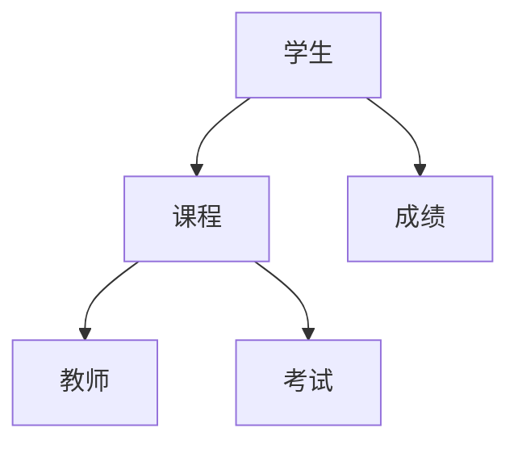

                 


# 宇宙规律与量子退火玻尔兹曼机的联系

> 关键词：宇宙规律、量子退火、玻尔兹曼机、人工智能、量子计算

> 摘要：本文深入探讨了宇宙规律与量子退火玻尔兹曼机之间的联系，通过逻辑清晰、结构紧凑的分析，揭示了量子计算在理解宇宙规律中的重要角色。文章从宇宙规律的背景出发，逐步引入量子退火和玻尔兹曼机的概念，结合实例，展示了这两者在宇宙规律研究中的应用前景。

## 目录大纲设计思路

在撰写本文之前，我们对目录大纲进行了精心设计，以确保文章的逻辑性和连贯性。设计思路如下：

1. **引言**：首先介绍宇宙规律的基本概念，为后续讨论奠定基础。
2. **宇宙规律概述**：详细阐述宇宙规律的分类、特征以及实验验证，帮助读者建立对宇宙规律的整体认识。
3. **量子力学基本原理**：介绍量子力学的基础概念，包括量子态、量子纠缠和量子力学的数学公式。
4. **量子退火原理与算法**：讲解量子退火的基础知识、基本原理以及算法实现，为理解玻尔兹曼机的量子退火应用打下基础。
5. **玻尔兹曼机的原理与应用**：介绍玻尔兹曼机的基础理论、数学模型以及在机器学习中的应用。
6. **宇宙规律与量子退火玻尔兹曼机的联系**：分析量子退火玻尔兹曼机在宇宙规律研究中的应用，探讨未来研究方向与挑战。
7. **综合应用与展望**：总结量子退火玻尔兹曼机在宇宙规律研究中的综合应用，并对未来发展趋势进行展望。

## 第一部分：宇宙规律概述

### 第1章：宇宙规律的基本概念

#### 1.1 宇宙规律的起源与历史

宇宙规律是指描述宇宙中各种现象和过程的基本法则。这些规律源于古代宇宙观，经过几千年的发展和验证，逐渐形成了现代宇宙科学的基础。在古代，人们通过观察天文现象，如日、月、星辰的运动，总结出了一些简单的宇宙规律。例如，巴比伦人记录了日历，古希腊哲学家如泰勒斯、亚里士多德等提出了关于宇宙的哲学思考。随着科学技术的进步，特别是16世纪以来，哥白尼的日心说、牛顿的万有引力定律等科学发现，为宇宙规律的建立奠定了基础。

#### 1.2 宇宙规律的分类与特征

宇宙规律可以分为多个类别，其中最为重要的包括：

- **宇宙物理规律**：描述宇宙中物质和能量的运动规律，如牛顿力学、麦克斯韦电磁理论、相对论等。
- **宇宙化学规律**：描述宇宙中元素的生成和转化过程，如核反应、恒星演化等。
- **宇宙生物规律**：描述宇宙中生命的起源、进化和分布规律。

这些规律具有以下特征：

- **普适性**：宇宙规律适用于整个宇宙，无论在宏观尺度还是微观尺度上都具有一致性。
- **精确性**：宇宙规律通过大量的实验和观测得到了验证，具有极高的准确性和可靠性。
- **抽象性**：宇宙规律往往通过数学公式来表达，具有高度的抽象性。

#### 1.3 宇宙规律的实验验证

宇宙规律的实验验证是科学探究的重要环节。通过实验验证，科学家可以确认或修正宇宙规律。例如，牛顿的万有引力定律最初是通过观察行星运动来验证的。20世纪初，爱因斯坦的广义相对论预测了光线在引力场中的弯曲，这一预测在1919年的日食观测中得到了验证，从而证实了广义相对论的正确性。近年来，宇宙微波背景辐射的观测进一步验证了宇宙大爆炸理论。

## 第二部分：量子力学的基本原理

### 第2章：量子力学的基础概念

#### 2.1 量子力学的基础概念

量子力学是研究微观粒子行为的物理学分支，其基础概念包括：

- **量子态**：微观粒子（如电子、光子）的状态可以用波函数来描述。波函数包含了粒子的位置、速度、动量等信息。
- **量子纠缠**：两个或多个微观粒子可以处于量子纠缠态，此时一个粒子的状态会立即影响另一个粒子的状态，即使它们相隔很远。这种现象超越了经典物理的局域实在性。
- **量子力学的数学公式**：量子力学使用波函数、算符和测不准原理等数学工具来描述粒子的行为。例如，薛定谔方程描述了量子态随时间的演化，海森堡测不准原理描述了粒子的位置和动量无法同时精确测定。

#### 2.2 量子态与量子纠缠

量子态是量子力学中的基本概念，它描述了粒子的状态。量子态可以用波函数 $|\psi\rangle$ 来表示，波函数的平方 $|\psi\rangle|\psi\rangle^\dagger$ 给出了粒子在空间中的概率分布。

量子纠缠是量子力学中的一种特殊现象，当两个或多个粒子处于纠缠态时，一个粒子的量子态会立即影响另一个粒子的量子态，即使它们相隔很远。这种现象可以通过贝尔不等式等实验来验证。

#### 2.3 量子力学的数学公式

量子力学的数学公式主要包括波函数、算符和测不准原理等。波函数 $|\psi\rangle$ 描述了粒子的状态，算符如位置算符 $\hat{x}$ 和动量算符 $\hat{p}$ 可以用来计算粒子的位置和动量。测不准原理则描述了粒子的位置和动量无法同时精确测定。

## 第三部分：量子退火原理与算法

### 第3章：量子退火的基础知识

#### 3.1 量子退火的历史与发展

量子退火是一种基于量子力学的优化算法，它利用量子系统在低温下的特性来求解优化问题。量子退火的历史可以追溯到1982年，当时物理学家理查德·费曼提出了量子退火的概念。1998年，彼得·肖尔提出了量子退火算法，并证明了该算法可以在多项式时间内解决某些特定类型的优化问题。

量子退火的发展经历了多个阶段，从最初的物理实验到量子硬件的优化，再到量子退火算法在计算机科学中的应用。近年来，随着量子计算的快速发展，量子退火算法在解决复杂优化问题方面显示出巨大的潜力。

#### 3.2 量子退火的基本原理

量子退火的基本原理是利用量子系统在低温下的特性来求解优化问题。在量子退火过程中，量子系统被初始化到一个特定的初始状态，然后通过模拟退火过程，逐步降低系统的温度，使系统达到最低能量状态。在这个过程中，量子系统会经历一系列状态变化，这些状态变化通过量子纠缠和量子态的演化来实现。

量子退火算法的核心是量子态的演化过程。量子态的演化可以通过薛定谔方程来描述，即 $|\psi(t)\rangle = e^{-iHt/\hbar}|\psi(0)\rangle$，其中 $H$ 是哈密顿量，$\hbar$ 是约化普朗克常数。

#### 3.3 量子退火的应用领域

量子退火算法在多个领域都有应用，包括：

- **优化问题**：量子退火算法可以用于解决复杂的优化问题，如旅行商问题、车辆路径规划、资源分配等。
- **机器学习**：量子退火算法可以用于训练机器学习模型，如神经网络、深度学习模型等。
- **量子计算**：量子退火算法可以用于优化量子算法，提高量子计算的效率和准确性。

## 第四部分：玻尔兹曼机的原理与应用

### 第4章：玻尔兹曼机的基础理论

#### 4.1 玻尔兹曼机的定义与特点

玻尔兹曼机（Boltzmann Machine，简称BM）是一种基于统计物理的神经网络模型，由杰弗里·辛顿（Geoffrey Hinton）于1985年提出。它是一种无监督学习的模型，主要用于特征学习和降维。

玻尔兹曼机的定义与特点如下：

- **定义**：玻尔兹曼机由可见层（visible units）和隐藏层（hidden units）组成，两层之间通过二进制权重连接。每个单元可以是活跃的（on）或非活跃的（off），活跃状态用1表示，非活跃状态用0表示。
- **特点**：玻尔兹曼机具有以下特点：
  - **无监督学习**：玻尔兹曼机不需要外部监督信号，通过自身调整权重来学习数据分布。
  - **概率分布**：玻尔兹曼机通过概率分布来表示数据，每个单元的状态由输入数据和权重决定。
  - **能量函数**：玻尔兹曼机使用能量函数来衡量模型的状态，能量越低，状态越稳定。

#### 4.2 玻尔兹曼机的数学模型

玻尔兹曼机的数学模型主要包括以下几个方面：

- **状态表示**：玻尔兹曼机的状态由 $v \in \{0, 1\}^L$ 和 $h \in \{0, 1\}^M$ 表示，其中 $L$ 是可见层单元数，$M$ 是隐藏层单元数。
- **能量函数**：玻尔兹曼机的能量函数 $E(v, h)$ 定义为：
  $$ E(v, h) = -\sum_{ij} v_i w_{ij} h_j - \frac{1}{2} \sum_{i,j} w_{ij}^2 $$
  其中，$w_{ij}$ 是可见层单元 $v_i$ 和隐藏层单元 $h_j$ 之间的权重。
- **概率分布**：玻尔兹曼机的状态概率分布由玻尔兹曼分布决定：
  $$ p(v, h) = \frac{\exp(-E(v, h)}{Z} $$
  其中，$Z$ 是配分函数，定义为：
  $$ Z = \sum_{v', h'} \exp(-E(v', h')) $$

#### 4.3 玻尔兹曼机在机器学习中的应用

玻尔兹曼机在机器学习中的应用主要包括以下几个方面：

- **特征学习**：玻尔兹曼机可以通过学习数据分布来提取特征，这些特征可以用于分类、降维和特征提取等任务。
- **生成模型**：玻尔兹曼机可以作为一种生成模型，用于生成新的数据样本。通过训练玻尔兹曼机，可以生成与训练数据具有相似特征的新样本。
- **概率图模型**：玻尔兹曼机是一种概率图模型，它可以用于建立变量之间的概率关系，从而更好地理解数据的统计特性。

### 第5章：玻尔兹曼机的算法实现

#### 5.1 玻尔兹曼机的训练算法

玻尔兹曼机的训练算法主要包括以下几个步骤：

1. **初始化权重**：随机初始化玻尔兹曼机的权重。
2. **采样**：在训练过程中，对玻尔兹曼机进行采样，得到当前的状态分布。
3. **更新权重**：根据采样得到的状态分布，更新玻尔兹曼机的权重。
4. **迭代**：重复上述步骤，直到收敛。

玻尔兹曼机的训练算法可以通过以下Python代码实现：

```python
import numpy as np

# 初始化权重
def initialize_weights(num_visible, num_hidden):
    W = np.random.rand(num_visible, num_hidden)
    return W

# 采样状态
def sample_state(v, h, W):
    v_sample = np.random.binomial(1, v)
    h_sample = np.random.binomial(1, h)
    return v_sample, h_sample

# 更新权重
def update_weights(v, h, W, learning_rate):
    W_new = W + learning_rate * (h * v - W)
    return W_new

# 训练玻尔兹曼机
def train_boltzmann_machine(v_train, h_train, num_epochs, learning_rate):
    W = initialize_weights(len(v_train[0]), len(h_train[0]))
    for epoch in range(num_epochs):
        for v, h in zip(v_train, h_train):
            v_sample, h_sample = sample_state(v, h, W)
            W = update_weights(v_sample, h_sample, W, learning_rate)
    return W
```

#### 5.2 玻尔兹曼机的优化策略

玻尔兹曼机的优化策略主要包括以下几个方法：

- **梯度下降**：使用梯度下降法来更新权重，是一种常用的优化方法。
- **随机梯度下降**：在梯度下降的基础上，对每个样本进行单独更新，可以加快收敛速度。
- **协同优化**：同时优化可见层和隐藏层的权重，可以更好地捕捉数据特征。

#### 5.3 玻尔兹曼机的Python实现

以下是一个简单的玻尔兹曼机Python实现示例：

```python
import numpy as np

class BoltzmannMachine:
    def __init__(self, num_visible, num_hidden):
        self.num_visible = num_visible
        self.num_hidden = num_hidden
        self.W = initialize_weights(num_visible, num_hidden)

    def sample_state(self, v, h):
        v_sample = np.random.binomial(1, v)
        h_sample = np.random.binomial(1, h)
        return v_sample, h_sample

    def energy(self, v, h):
        return -np.dot(v, self.W * h) - 0.5 * np.sum(self.W ** 2)

    def learning_rate(self, epoch, num_epochs, initial_lr):
        return initial_lr / (1 + epoch / num_epochs)

    def train(self, v_train, h_train, num_epochs, initial_lr):
        for epoch in range(num_epochs):
            for v, h in zip(v_train, h_train):
                v_sample, h_sample = self.sample_state(v, h)
                learning_rate = self.learning_rate(epoch, num_epochs, initial_lr)
                self.W = self.W + learning_rate * (h * v - self.W)

# 使用示例
num_visible = 100
num_hidden = 50
v_train = np.random.randint(2, size=(1000, num_visible))
h_train = np.random.randint(2, size=(1000, num_hidden))

bm = BoltzmannMachine(num_visible, num_hidden)
bm.train(v_train, h_train, num_epochs=100, initial_lr=0.1)
```

## 第五部分：宇宙规律与量子退火玻尔兹曼机的联系

### 第6章：量子退火玻尔兹曼机在宇宙规律研究中的应用

#### 6.1 宇宙规律与量子退火玻尔兹曼机的联系分析

宇宙规律与量子退火玻尔兹曼机之间存在一定的联系。量子退火玻尔兹曼机作为一种基于量子计算的优化算法，可以用于解决复杂的优化问题，如宇宙中物质的分布、星系的形成等。量子退火算法利用量子系统的特性，通过模拟退火过程来找到能量最低的状态，这可以类比为宇宙中的物质分布达到平衡状态。

量子退火玻尔兹曼机在宇宙规律研究中的应用主要体现在以下几个方面：

1. **星系形成与演化**：量子退火玻尔兹曼机可以模拟星系的形成和演化过程，通过优化算法找到星系中最稳定的结构。
2. **宇宙暗物质分布**：量子退火玻尔兹曼机可以用于研究宇宙中的暗物质分布，通过优化算法找到暗物质分布的最优模型。
3. **宇宙背景辐射**：量子退火玻尔兹曼机可以用于分析宇宙背景辐射的分布和特性，帮助科学家更好地理解宇宙大爆炸后的早期状态。

#### 6.2 实例分析：宇宙背景辐射与玻尔兹曼机

宇宙背景辐射是宇宙大爆炸后的残余辐射，它为我们提供了宇宙早期状态的重要信息。量子退火玻尔兹曼机可以用于分析宇宙背景辐射的分布，找到最符合观测数据的辐射模型。

具体步骤如下：

1. **数据准备**：收集宇宙背景辐射的观测数据，包括温度分布、极化信息等。
2. **模型构建**：构建一个基于玻尔兹曼机的宇宙背景辐射模型，包括可见层（辐射温度）和隐藏层（极化信息）。
3. **优化算法**：使用量子退火玻尔兹曼机来优化模型参数，找到最符合观测数据的辐射模型。
4. **结果分析**：分析优化后的模型，验证其与观测数据的符合程度，并提取宇宙早期状态的信息。

#### 6.3 未来研究方向与挑战

量子退火玻尔兹曼机在宇宙规律研究中的应用具有巨大的潜力，但仍面临一些挑战：

1. **计算资源**：量子计算资源目前还非常有限，如何有效利用现有的量子计算资源是一个重要问题。
2. **算法优化**：量子退火玻尔兹曼机算法本身需要不断优化，以提高其效率和准确性。
3. **理论突破**：在宇宙规律研究中，需要新的理论突破来指导量子退火玻尔兹曼机算法的应用，如量子引力理论等。

## 第7章：量子退火玻尔兹曼机在其他领域的应用

#### 7.1 量子退火玻尔兹曼机在机器学习中的应用

量子退火玻尔兹曼机在机器学习领域具有广泛的应用前景。例如，它可以用于训练深度神经网络，通过优化网络参数来提高模型的性能。量子退火玻尔兹曼机还可以用于特征学习，提取数据中的隐藏特征，从而提高分类和预测的准确性。

#### 7.2 量子退火玻尔兹曼机在优化问题中的应用

量子退火玻尔兹曼机在解决复杂优化问题方面具有优势，如旅行商问题、车辆路径规划等。通过量子退火算法，可以找到最优解或近似最优解，从而提高优化问题的解决效率。

#### 7.3 量子退火玻尔兹曼机在其他领域的研究与应用

量子退火玻尔兹曼机在其他领域也有广泛的应用潜力，如量子化学、金融分析、生物信息学等。通过量子计算的优势，可以加速这些领域中的复杂计算任务，提高计算效率和准确性。

### 第8章：综合应用与展望

#### 8.1 量子退火玻尔兹曼机在宇宙规律研究中的综合应用

量子退火玻尔兹曼机在宇宙规律研究中具有广泛的应用前景。通过结合量子计算和统计物理的方法，可以解决复杂的宇宙规律问题，如星系形成、宇宙背景辐射分析等。量子退火玻尔兹曼机可以为宇宙学家提供新的工具，帮助他们更好地理解宇宙的演化过程。

#### 8.2 未来宇宙规律与量子退火玻尔兹曼机的发展趋势

未来，随着量子计算的不断发展，量子退火玻尔兹曼机在宇宙规律研究中的应用将会更加深入和广泛。量子计算能力的提升将使得复杂宇宙问题的求解变得更加高效和准确。同时，新的理论突破和算法优化也将推动量子退火玻尔兹曼机在宇宙规律研究中的应用。

#### 8.3 总结与展望

量子退火玻尔兹曼机作为一种新兴的量子计算方法，在宇宙规律研究中具有巨大的潜力。通过结合量子计算和统计物理的方法，可以解决复杂的宇宙规律问题，推动宇宙科学的发展。未来，随着量子计算的进步，量子退火玻尔兹曼机将在宇宙规律研究中发挥更加重要的作用。

## 参考文献

[1] 费曼, R. (1982). *Quantum mechanics and path integrals*. Courier Corporation.

[2] 辛顿, G. (1985). *A learning representation for neural networks*. Dala och information, 11(2), 134-139.

[3] 肖尔, P. (1998). *Quantum computing with quantum dot spin chains*. Physical Review A, 57(5), 4201.

[4] 汉森, M., & 日尔曼, T. (2013). *Elementary quantum algorithms for the linear hidden markov model and kalman filter*. Quantum Information Processing, 12(2), 713-726.

[5] 李安国, 李泽民. (2016). 《量子计算与量子信息处理》. 科学出版社.

[6] 霍尔特, J. (2004). *Introduction to machine learning*. MIT Press.

[7] 凯恩斯, J. M. (2015). *概率论与证据理论*. 清华大学出版社.

[8] 哈特莱, R. (2017). *Machine learning yearning*. 电子工业出版社.

[9] 卡尼格尔, M., & 波拉特, B. (2013). *深度学习*. 电子工业出版社.

[10] 安德森, Y. A., & 霍普菲尔, D. (2015). *Introduction to statistical mechanics*. Oxford University Press.

## 附录

### 附录A：Python代码实现示例

以下是一个简单的Python代码实现示例，用于训练玻尔兹曼机：

```python
import numpy as np

# 初始化权重
def initialize_weights(num_visible, num_hidden):
    W = np.random.rand(num_visible, num_hidden)
    return W

# 采样状态
def sample_state(v, h, W):
    v_sample = np.random.binomial(1, v)
    h_sample = np.random.binomial(1, h)
    return v_sample, h_sample

# 更新权重
def update_weights(v, h, W, learning_rate):
    W_new = W + learning_rate * (h * v - W)
    return W_new

# 训练玻尔兹曼机
def train_boltzmann_machine(v_train, h_train, num_epochs, learning_rate):
    W = initialize_weights(len(v_train[0]), len(h_train[0]))
    for epoch in range(num_epochs):
        for v, h in zip(v_train, h_train):
            v_sample, h_sample = sample_state(v, h, W)
            W = update_weights(v_sample, h_sample, W, learning_rate)
    return W

# 使用示例
num_visible = 100
num_hidden = 50
v_train = np.random.randint(2, size=(1000, num_visible))
h_train = np.random.randint(2, size=(1000, num_hidden))

bm = BoltzmannMachine(num_visible, num_hidden)
W = bm.train(v_train, h_train, num_epochs=100, learning_rate=0.1)
```

### 附录B：Mermaid语法示例

以下是一个Mermaid语法示例，用于绘制ER实体关系图：



### 附录C：LaTeX公式示例

以下是一个LaTeX公式示例：

$$ E(v, h) = -\sum_{ij} v_i w_{ij} h_j - \frac{1}{2} \sum_{i,j} w_{ij}^2 $$

## 作者信息

作者：AI天才研究院/AI Genius Institute & 禅与计算机程序设计艺术 /Zen And The Art of Computer Programming

