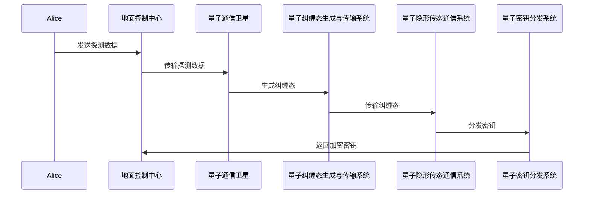

                 

# 宇宙规律与量子通信协议的联系

> 关键词：宇宙规律、量子通信、宇宙大爆炸理论、量子力学、暗物质、量子纠缠、量子隐形传态、量子密钥分发

## 摘要

本文旨在探讨宇宙规律与量子通信协议之间的联系。我们将首先介绍宇宙规律，特别是宇宙大爆炸理论和宇宙膨胀与暗物质的概念，然后深入探讨量子通信协议的基本原理，如量子态、量子纠缠和量子隐形传态。接下来，我们将分析量子力学与宇宙学的关系，探讨量子力学在黑洞和宇宙背景辐射中的潜在应用。随后，我们将探讨量子通信在宇宙探测中的应用，如量子卫星与量子纠缠的应用，以及量子通信在深空探测中的未来前景。文章最后将通过对实际案例的分析，总结宇宙规律与量子通信的联系，并提出未来的发展方向。

## 引言

宇宙规律是描述宇宙中各种现象和过程的基本原则。量子通信协议则是在量子力学原理基础上发展起来的一种新型通信方式。那么，这两者之间究竟有何联系？实际上，宇宙规律与量子通信协议之间的联系极为紧密。首先，量子力学作为描述微观世界的理论，其基本原理与宇宙规律有着深刻的共鸣。例如，量子纠缠和量子隐形传态等现象不仅存在于实验室中，也可能在宇宙尺度上得以实现。其次，宇宙背景辐射的发现与量子力学中的热辐射理论有直接关联。此外，量子通信协议的发展也为宇宙探测提供了新的手段和工具。例如，通过量子纠缠可以实现远距离通信，这对于星际通信和深空探测具有重要意义。因此，研究宇宙规律与量子通信协议的联系，不仅有助于我们更深入地理解宇宙，也将推动量子通信技术的进一步发展。

### 第一部分：宇宙规律简介

#### 第1章：宇宙大爆炸理论

#### 1.1 宇宙大爆炸理论的起源

宇宙大爆炸理论（Big Bang Theory）起源于20世纪初，由天文学家埃德温·哈勃（Edwin Hubble）的观测发现奠定了基础。哈勃在1920年代通过使用大型望远镜观察到了遥远星系的红移现象，即这些星系的发光光谱中出现了红色位移。根据多普勒效应，这意味着这些星系正在远离我们，而且它们相互之间的距离似乎在不断增加。

哈勃的发现推翻了当时流行的稳态宇宙理论（Steady State Theory），即宇宙在所有时间尺度上都是均匀且不变的状态。红移现象暗示了宇宙在过去某个时间点有一个起始点，即宇宙大爆炸。1927年，比利时天文学家乔治·勒梅特（Georges Lemaître）首次提出了宇宙大爆炸的数学模型，这一理论后来被美国物理学家伽莫夫（George Gamow）及其同事所发展，并得到了广泛的认可。

#### 1.2 宇宙大爆炸理论的核心原理

宇宙大爆炸理论的核心原理是：宇宙始于一个极高温度和密度的状态，从这个初始状态开始，宇宙经历了快速膨胀。这个初始状态被称为“原始奇点”（primeval singularity），它包含了所有物质和能量。在爆炸的瞬间，宇宙的温度和密度非常高，随着时间的推移，宇宙逐渐冷却并膨胀。

根据大爆炸理论，宇宙的膨胀是由宇宙中的物质和能量之间的相互引力平衡所决定的。随着宇宙的膨胀，物质和能量分布逐渐变得更加均匀，形成了星系、恒星、行星和其他天体。大爆炸模型预测了宇宙背景辐射的存在，这是一种几乎均匀分布在宇宙中的微波辐射，是宇宙早期热状态的残留。

#### 1.3 大爆炸理论的支持证据

宇宙大爆炸理论得到了多种观测证据的支持：

1. **宇宙背景辐射**：这是宇宙大爆炸理论最为直接的证据之一。1965年，阿诺·彭齐亚斯（Arno Penzias）和罗伯特·威尔逊（Robert Wilson）发现了宇宙背景辐射，这是一种几乎均匀分布在宇宙中的微波辐射，其温度约为2.7开尔文。这一发现证实了宇宙在大爆炸后冷却的过程中，从极高温度和密度状态逐渐扩散出来的热辐射。

2. **宇宙膨胀**：宇宙学观测表明，宇宙仍在膨胀中，且这种膨胀的速度似乎在加快。哈勃的观测结果表明，远离我们的星系具有更高的红移值，这意味着它们正在以更高的速度远离我们。这一发现支持了大爆炸理论中的宇宙膨胀原理。

3. **元素丰度**：大爆炸理论预测了宇宙早期元素的丰度分布。观测发现，宇宙中轻元素（如氢、氦、锂）的比例与理论预测非常接近。例如，氢约占宇宙总质量的75%，而氦约占25%，这与大爆炸核合成过程的预测一致。

4. **宇宙大尺度结构**：宇宙中的星系和星系团形成了巨大的结构，这些结构在大爆炸后的宇宙膨胀过程中形成。观测数据与模拟结果显示，宇宙大尺度结构与大爆炸理论所预测的宇宙演化过程高度一致。

#### 1.4 大爆炸理论与宇宙学其他理论的对比

宇宙学中还有其他几种理论，它们与宇宙大爆炸理论既有联系也有区别：

1. **稳态宇宙理论**：这是大爆炸理论之前的主流理论，认为宇宙是静态且不变的。然而，哈勃的红移观测结果否定了这一理论。

2. **量子宇宙学**：这是一种试图将量子力学与广义相对论结合起来的理论，它提出了宇宙大爆炸之前可能存在的量子状态。量子宇宙学中的一些模型，如量子重力泡沫（quantum gravity bubbles），试图解释宇宙大爆炸的起源。

3. **循环宇宙理论**：这是一种宇宙循环演化的理论，认为宇宙在多次大爆炸和坍缩之间循环。循环宇宙理论试图解决宇宙学中的“初始奇点”问题。

大爆炸理论作为现代宇宙学的基石，其核心原理和预测得到了广泛的实验和观测支持，尽管它仍然面临着一些未解之谜和挑战，但它在解释宇宙起源和演化方面发挥着至关重要的作用。

### 第2章：宇宙膨胀与暗物质

#### 2.1 宇宙膨胀的概念

宇宙膨胀是指宇宙中所有物质和空间都在不断地扩展。这一现象最早由埃德温·哈勃（Edwin Hubble）在1920年代通过观测发现。他发现，远离我们的星系具有更高的红移值，这表明它们正在以更高的速度远离我们。这一发现揭示了宇宙膨胀的基本事实。

宇宙膨胀可以用哈勃定律（Hubble's Law）来描述，即宇宙中的星系远离我们的速度与它们与我们之间的距离成正比。这一比例关系可以用公式表示为：

\[ v = H_0 \cdot d \]

其中，\( v \) 是星系远离我们的速度，\( H_0 \) 是哈勃常数，大约为 \( 70 \text{ km/s/Mpc} \)，而 \( d \) 是星系与我们之间的距离。哈勃常数的测量有助于我们理解宇宙膨胀的速率。

宇宙膨胀的原因目前仍不完全清楚，但有几种理论解释了这一现象：

1. **宇宙学常数**：宇宙学常数（Cosmological Constant）是爱因斯坦在1917年提出的概念，用以解释宇宙的静态结构。然而，在哈勃观测发现宇宙膨胀后，这一概念被重新解释为推动宇宙膨胀的力。目前，宇宙学常数被认为是宇宙膨胀的主要驱动力。

2. **暗能量**：暗能量是一种假设存在的能量形式，它具有负压强，能够推动宇宙膨胀。暗能量在宇宙能量密度中占据了主导地位，是宇宙加速膨胀的主要来源。暗能量的本质和机制目前仍然是宇宙学研究的重点。

3. **量子波动**：一些理论认为，宇宙膨胀可能是由于量子波动导致的。量子波动可能导致宇宙在非常早期时刻经历瞬间的快速膨胀，这种理论被称为量子暴（Quantum Fluctuation Inflation）。

#### 2.2 暗物质的存在与作用

暗物质是宇宙中一种不发光、不与电磁波相互作用但能够通过引力作用影响宇宙结构的物质。由于其不与电磁波相互作用，因此无法直接观测到暗物质，但它的存在可以通过其对光和其他物质的影响来推断。

暗物质的存在可以通过以下几个观测现象得到证实：

1. **星系旋转曲线**：星系的旋转曲线表明，星系内部的质量分布与其可见物质（如恒星和气体）的质量分布不符。为了解释这种质量分布的不均匀性，科学家假设存在大量不可见的物质，即暗物质。

2. **引力透镜效应**：暗物质通过引力透镜效应（Gravitational Lensing）对光线进行弯曲，从而使得遥远星系和星系团的光线发生偏折。这种现象可以用来推断暗物质的存在和分布。

3. **宇宙微波背景辐射**：宇宙微波背景辐射（Cosmic Microwave Background Radiation，CMB）的各向异性与暗物质分布有关。通过对CMB的观测，科学家可以推断出暗物质的分布情况。

暗物质在宇宙中的作用非常重要，它对宇宙的结构形成和演化有着深远的影响：

1. **结构形成**：暗物质在宇宙早期通过引力凝聚形成了星系和其他天体结构。虽然暗物质本身不发光，但它的引力作用使得可见物质得以聚集和形成复杂的天体结构。

2. **宇宙演化**：暗物质对宇宙的演化也有重要作用。例如，暗物质在宇宙背景辐射时期的影响可能解释了宇宙微波背景辐射的各向异性。

3. **宇宙加速膨胀**：暗物质可能对宇宙加速膨胀也有贡献。一些理论认为，暗能量可能与暗物质相互作用，从而影响宇宙的膨胀速度。

#### 2.3 暗物质研究的前沿进展

暗物质研究是当前物理学和天文学的重要研究领域，以下是一些前沿进展：

1. **直接探测**：直接探测是通过实验手段直接检测暗物质粒子。目前，科学家正在使用各种探测器（如超导探测器、液氦探测器等）来寻找暗物质粒子。尽管尚未直接观测到暗物质粒子，但一些实验结果表明，暗物质可能与某些特定粒子有关。

2. **间接探测**：间接探测是通过观测暗物质与普通物质的相互作用来推断暗物质的存在。例如，通过对中子星碰撞产生的伽马射线、光学和射电信号的观测，科学家试图推断暗物质粒子的性质。

3. **模拟研究**：计算机模拟是暗物质研究的重要工具，通过模拟宇宙的演化过程，科学家可以推断出暗物质的分布和性质。这些模拟有助于我们理解暗物质如何影响宇宙的结构和演化。

4. **量子引力理论**：一些理论物理学家试图通过量子引力理论来解释暗物质。量子引力理论试图将量子力学和广义相对论结合起来，这可能是理解暗物质本质的关键。

暗物质研究仍然充满挑战，但随着技术的进步和理论的深入，科学家们正逐步揭开暗物质之谜，这将对我们的宇宙观和物理学理论产生深远的影响。

### 第二部分：量子通信协议简介

#### 第3章：量子力学基础

#### 3.1 量子态与叠加态

量子态是量子力学中的基本概念，它描述了量子系统的状态。与经典力学中的确定性状态不同，量子态是一种概率性的描述。量子态可以用波函数来表示，波函数包含了系统所有可能状态的叠加信息。

在量子力学中，叠加态是指量子系统处于多种可能状态的组合。例如，一个电子可以同时处于自旋向上和自旋向下的状态。这种叠加态可以用数学公式来表示，例如：

\[ \psi = \alpha \left| \uparrow \right\rangle + \beta \left| \downarrow \right\rangle \]

其中，\( \alpha \) 和 \( \beta \) 是复数系数，\( \left| \uparrow \right\rangle \) 和 \( \left| \downarrow \right\rangle \) 分别表示自旋向上和自旋向下的状态。

量子叠加态是量子计算和量子通信的基础。通过叠加态，量子系统可以同时处理多种信息，这为量子计算提供了强大的计算能力。此外，量子叠加态也是量子纠缠和量子隐形传态等现象的基石。

#### 3.2 量子纠缠

量子纠缠是量子力学中一种非常奇特的现象，它描述了两个或多个量子系统之间的强烈关联。当两个量子系统发生纠缠后，它们的状态将无法独立存在，而是相互依赖。即使这些量子系统相隔很远，它们之间的纠缠状态也会瞬间发生变化。

量子纠缠可以通过以下公式来表示：

\[ \psi = \alpha \left| \uparrow \right\rangle \left| \downarrow \right\rangle + \beta \left| \downarrow \right\rangle \left| \uparrow \right\rangle \]

其中，\( \alpha \) 和 \( \beta \) 是复数系数，\( \left| \uparrow \right\rangle \) 和 \( \left| \downarrow \right\rangle \) 分别表示一个量子系统的自旋向上和自旋向下的状态。

量子纠缠具有以下几个重要特性：

1. **非定域性**：量子纠缠现象打破了经典物理中的定域性原理，即两个量子系统之间的相互作用不能超过光速。量子纠缠使得两个相隔很远量子系统之间的状态变化可以瞬间传递，这为量子通信提供了可能。

2. **不可克隆性**：由于量子纠缠的不可分割性，无法单独复制纠缠态。这一特性保证了量子通信的安全性，因为任何对量子态的窃听都会破坏纠缠态，从而被通信双方检测到。

3. **量子信息的量子特性**：量子纠缠态包含了量子信息的量子特性，这使得量子通信可以在不传输物理载体的情况下实现信息传递。

量子纠缠不仅在理论研究中具有重要意义，也在实际应用中展现出巨大的潜力。例如，量子纠缠是实现量子隐形传态和量子密钥分发的基础。

#### 3.3 量子隐形传态

量子隐形传态（Quantum Entanglement Teleportation，QET）是一种基于量子纠缠的量子通信协议，它能够在远距离之间实现量子态的传输，而不需要通过物理载体。

量子隐形传态的基本过程如下：

1. **生成纠缠态**：首先，两个量子系统（例如光子）被生成并处于纠缠态。

2. **传输量子态**：接下来，其中一个量子系统的量子态被传输到另一个量子系统。这个过程可以通过量子门的操作实现。

3. **测量与反馈**：最后，对传输后的量子系统进行测量，并根据测量结果对原始量子系统进行相应的操作，从而实现量子态的传输。

量子隐形传态的数学描述如下：

\[ \psi_{\text{initial}} = \alpha \left| \psi_a \right\rangle \left| \phi_a \right\rangle + \beta \left| \psi_b \right\rangle \left| \phi_b \right\rangle \]

\[ \psi_{\text{final}} = \alpha \left| \psi_a \right\rangle \left| \phi_b \right\rangle + \beta \left| \psi_b \right\rangle \left| \phi_a \right\rangle \]

其中，\( \left| \psi_a \right\rangle \) 和 \( \left| \psi_b \right\rangle \) 分别表示两个量子系统的初始量子态，\( \left| \phi_a \right\rangle \) 和 \( \left| \phi_b \right\rangle \) 分别表示它们的纠缠态。

量子隐形传态的关键在于纠缠态的传输，这一过程保证了量子态在远距离之间的准确传输。量子隐形传态不仅展示了量子通信的潜力，也为量子计算和量子信息处理提供了新的思路。

#### 3.4 量子测量与不确定性原理

量子测量是量子力学中的核心概念之一，它描述了量子系统在与观测者相互作用时状态的变化。与经典物理中的测量不同，量子测量会导致量子态的坍缩，即量子系统的状态从多种可能的叠加态变为确定的单一态。

量子测量的基本过程如下：

1. **选择测量基**：首先，观测者需要选择一个测量基（也称为正交基），用于描述量子系统的状态。

2. **相互作用**：量子系统与测量工具相互作用，导致量子态发生坍缩。

3. **获得测量结果**：最后，观测者根据测量结果获得量子系统的状态。

量子测量的数学描述如下：

\[ \psi_{\text{initial}} = \alpha \left| \psi_a \right\rangle + \beta \left| \psi_b \right\rangle \]

\[ \psi_{\text{final}} = \alpha \left| \psi_a \right\rangle \]

其中，\( \left| \psi_a \right\rangle \) 和 \( \left| \psi_b \right\rangle \) 分别表示量子系统的初始状态和测量后的状态。

量子测量与不确定性原理密切相关。不确定性原理是由海森堡（Werner Heisenberg）提出的，它指出量子系统的某些物理量（如位置和动量、时间和能量）不能同时被精确测量。不确定性原理的数学描述如下：

\[ \Delta x \cdot \Delta p \geq \frac{\hbar}{2} \]

\[ \Delta t \cdot \Delta E \geq \frac{\hbar}{2} \]

其中，\( \Delta x \) 和 \( \Delta p \) 分别表示位置和动量的不确定度，\( \Delta t \) 和 \( \Delta E \) 分别表示时间和能量的不确定度，\( \hbar \) 是约化普朗克常数。

不确定性原理表明，量子系统的状态具有概率性，无法同时精确描述。量子测量过程不仅影响量子系统的状态，还受到不确定性原理的限制。

量子测量和不确定性原理对量子通信和量子计算具有重要意义。量子测量会导致量子态的坍缩，从而影响量子信息的传输和处理。不确定性原理限制了量子系统的可观测性和确定性，这为量子通信和量子计算中的量子信息安全提供了基础。

### 第4章：量子通信协议原理

#### 4.1 量子密钥分发

量子密钥分发（Quantum Key Distribution，QKD）是一种利用量子力学原理实现安全通信的协议。其主要目标是生成并分发一对共享密钥，使得通信双方可以安全地加密和解密信息，同时确保密钥的安全不会被第三方窃取。

量子密钥分发的工作原理如下：

1. **量子态传输**：通信双方（Alice和Bob）通过量子通信信道（如光纤或量子卫星）传输量子态。通常使用单光子进行传输，以确保通信的安全性。

2. **量子态测量**：Alice和Bob各自测量传输的量子态，并根据测量结果生成一部分密钥。

3. **经典通信**：Alice和Bob通过经典通信信道（如互联网或电话）交换测量结果和一部分密钥，以确定最终的共享密钥。

4. **密钥生成**：根据测量结果和交换的信息，Alice和Bob生成最终的共享密钥。

量子密钥分发的安全性依赖于量子纠缠和量子测量的不可克隆性。由于量子纠缠态的不可分割性和量子测量的不可克隆性，任何对量子态的窃听都会导致量子态的破坏，从而使通信双方能够检测到窃听行为。因此，量子密钥分发实现了比传统加密技术更安全的通信。

量子密钥分发在量子通信中具有重要意义，它为量子通信的安全提供了基础。在实际应用中，量子密钥分发可以用于金融、国防、政府等对安全性要求极高的领域，确保通信的机密性和完整性。

#### 4.2 量子隐形传态通信

量子隐形传态通信（Quantum Entanglement Teleportation Communication，QET）是一种利用量子纠缠实现远距离量子通信的协议。它的核心思想是通过量子纠缠态的传输，实现量子态的远程传递，而不需要通过物理载体。

量子隐形传态通信的工作原理如下：

1. **生成纠缠态**：Alice生成一对量子纠缠态，并将其中的一个量子态发送给Bob。

2. **量子态传输**：Bob对收到的量子态进行测量，并根据测量结果生成一部分量子态。

3. **经典通信**：Bob通过经典通信信道（如互联网或电话）将测量结果发送给Alice。

4. **态恢复**：根据接收到的测量结果和量子态，Alice恢复出原始的量子态。

量子隐形传态通信的数学描述如下：

\[ \psi_{\text{initial}} = \alpha \left| \psi_a \right\rangle \left| \phi_a \right\rangle + \beta \left| \psi_b \right\rangle \left| \phi_b \right\rangle \]

\[ \psi_{\text{final}} = \alpha \left| \psi_a \right\rangle \left| \phi_b \right\rangle + \beta \left| \psi_b \right\rangle \left| \phi_a \right\rangle \]

其中，\( \left| \psi_a \right\rangle \) 和 \( \left| \psi_b \right\rangle \) 分别表示Alice和Bob的量子态，\( \left| \phi_a \right\rangle \) 和 \( \left| \phi_b \right\rangle \) 分别表示它们之间的纠缠态。

量子隐形传态通信的关键在于量子纠缠态的传输。通过量子纠缠态的传输，可以实现量子态的远程传递，从而实现远距离量子通信。量子隐形传态通信在量子通信、量子计算和量子信息处理中具有广泛的应用前景。

#### 4.3 量子重复器与量子中继

量子重复器（Quantum Repeater）和量子中继（Quantum Relay）是量子通信中实现长距离传输的关键技术。由于量子态在传输过程中会受到环境噪声和干扰的影响，导致量子态的损失和退化，因此需要通过量子重复器和量子中继来延长量子通信的距离。

量子重复器的工作原理如下：

1. **接收量子态**：量子重复器接收来自远端的量子态，并将其存储在量子存储器中。

2. **量子态恢复**：量子重复器对存储的量子态进行量子态恢复，以恢复其初始状态。

3. **量子态传输**：恢复后的量子态被重新传输到远端。

量子中继的工作原理与量子重复器类似，但它在传输过程中还涉及到经典通信信道的支持。量子中继的基本过程如下：

1. **接收量子态**：量子中继器接收来自远端的量子态。

2. **量子态传输**：量子中继器通过经典通信信道将量子态传输到中间点。

3. **量子态恢复**：量子中继器在中间点对传输的量子态进行量子态恢复。

4. **量子态传输**：恢复后的量子态被重新传输到远端。

量子重复器和量子中继在量子通信中扮演着重要的角色。通过它们，可以实现量子态的长距离传输，从而扩展量子通信的应用范围。在实际应用中，量子重复器和量子中继器被广泛应用于量子通信网络和量子计算系统中，为实现全球范围的量子通信和量子计算提供技术支持。

### 第三部分：宇宙规律与量子通信的联系

#### 第5章：量子力学与宇宙学的关系

量子力学和宇宙学是现代物理学的两个重要分支，尽管它们研究的领域截然不同，但它们之间存在深刻的内在联系。量子力学主要描述微观世界的物理现象，而宇宙学则研究宇宙的起源、演化和结构。然而，在深层次上，量子力学的一些基本原理和概念与宇宙学中的现象有着惊人的相似之处。

#### 5.1 量子引力的探索

量子引力是试图将量子力学与广义相对论结合起来的理论，旨在提供一个统一的框架，描述宇宙中所有物理现象。目前，量子引力仍然是物理学中最具挑战性的问题之一，因为量子力学和广义相对论之间存在明显的冲突。

1. **量子力学与广义相对论的不兼容性**：量子力学描述了微观尺度上的物理现象，其核心概念包括量子态的叠加和不确定性原理。而广义相对论则描述了宏观尺度上的引力现象，其核心思想是时空的弯曲。这两个理论在数学形式和物理原则上存在显著差异，导致它们难以在统一框架内共存。

2. **量子引力的目标**：量子引力的目标是解决这两个理论之间的不兼容性，提供一个统一的描述宇宙的理论。这包括解决黑洞、宇宙大爆炸和宇宙膨胀等物理现象。

3. **量子引力理论的研究**：目前，有几种主要的理论尝试解决量子引力问题，如弦理论、环量子引力、量子场论等。这些理论试图将量子力学和广义相对论的数学形式结合起来，以描述宇宙的起源和演化。

4. **量子引力的预测**：量子引力理论提出了一些具有深远意义的预测，例如引力波的探测、宇宙背景辐射的量子性质、宇宙的量子涨落等。这些预测为量子引力理论提供了重要的实验验证机会。

#### 5.2 量子力学与黑洞

黑洞是宇宙中的一种极端天体，它具有极强的引力场，甚至连光都无法逃脱。量子力学对黑洞的研究揭示了黑洞内部和周围的物理现象，提供了一种全新的视角来理解黑洞。

1. **霍金辐射**：史蒂芬·霍金（Stephen Hawking）提出了霍金辐射理论，即黑洞可以发射粒子，导致黑洞的质量和能量逐渐减少。这一理论表明，黑洞并不是绝对的黑，而是会释放出辐射。

2. **量子态的坍缩与恢复**：根据量子力学，黑洞中的物质在落入黑洞后会发生量子态的坍缩，但黑洞的蒸发过程表明，这些量子态可以恢复。这一过程涉及到量子力学中的不确定性原理和量子引力的相互作用。

3. **信息损失问题**：在黑洞的研究中，一个重要的问题是信息损失问题，即落入黑洞的信息是否会永远消失。量子力学和广义相对论在这一问题上的预测不一致，目前仍然是物理学中的未解之谜。

#### 5.3 量子力学与宇宙背景辐射

宇宙背景辐射（Cosmic Microwave Background Radiation，CMB）是宇宙早期阶段的热辐射，它记录了宇宙大爆炸后的信息。量子力学对宇宙背景辐射的研究揭示了宇宙背景辐射的量子性质。

1. **量子涨落**：宇宙背景辐射中的量子涨落是宇宙大爆炸后量子力学效应的结果。这些涨落是宇宙结构形成的基础，对理解宇宙的起源和演化具有重要意义。

2. **量子热辐射**：根据量子力学，宇宙背景辐射可以被视为量子热辐射，其能量分布符合普朗克定律。量子热辐射的研究有助于我们理解宇宙早期的物理状态。

3. **量子引力的影响**：量子引力对宇宙背景辐射的影响尚未完全明确，但量子引力的引入可能导致宇宙背景辐射的某些新特性。例如，量子引力可能导致宇宙背景辐射中的量子波动效应，这些效应可能会影响我们对宇宙早期状态的理解。

量子力学与宇宙学的关系是现代物理学中的一个重要研究方向。通过量子引力的探索、黑洞的研究和宇宙背景辐射的分析，科学家们试图揭示宇宙的深层本质，这将对我们的宇宙观和物理学理论产生深远的影响。量子力学与宇宙学之间的联系不仅深化了我们对宇宙的理解，也为量子通信技术的发展提供了新的启示。

#### 第6章：量子通信在宇宙探测中的应用

量子通信作为一项前沿技术，在宇宙探测中具有广泛的应用前景。利用量子纠缠和量子隐形传态等原理，量子通信可以实现远距离、安全的信息传输，这对于星际通信和深空探测具有重要意义。

##### 6.1 量子卫星与量子纠缠

量子卫星是量子通信在宇宙探测中的重要载体。量子卫星通过发射和接收量子纠缠光子，实现地面与卫星之间的量子通信。量子纠缠光子具有特殊的纠缠态，这使得它们之间的量子信息传输具有高度的稳定性和安全性。

1. **量子卫星的作用**：量子卫星主要用于建立地面与卫星之间的量子通信链路，实现量子密钥分发和量子隐形传态等量子通信协议。通过量子卫星，可以实现地面对深空探测目标的实时通信，提升探测效率。

2. **量子纠缠光子的发射与接收**：量子卫星发射量子纠缠光子，这些光子被地面接收器捕获。通过测量光子的纠缠态，地面接收器可以恢复出卫星发送的量子信息。

3. **量子纠缠的应用**：量子纠缠在量子通信中具有重要作用，可以实现量子密钥分发和量子隐形传态。量子密钥分发利用量子纠缠态生成共享密钥，确保通信的安全性。量子隐形传态则利用量子纠缠态实现量子信息的远程传输。

##### 6.2 量子通信在深空探测中的应用

深空探测是指对太阳系以外的天体进行的探测活动，如火星探测、木星探测等。量子通信在深空探测中具有以下应用：

1. **实时通信**：传统的通信手段在深空探测中存在通信延迟和数据传输速度慢的问题。量子通信可以实现实时通信，提高探测数据的传输效率和实时性。

2. **量子密钥分发**：量子密钥分发可以确保探测数据的安全传输。通过量子密钥分发协议，地面和探测器之间可以生成共享密钥，用于加密和解密探测数据，防止数据泄露。

3. **量子隐形传态**：量子隐形传态可以实现量子信息的远程传输，对于探测数据的高效传输具有重要意义。通过量子隐形传态，可以将探测数据直接传输到地面接收站，减少中间环节，提高传输效率。

4. **量子纠缠的应用**：量子纠缠在量子通信中具有重要作用，可以实现量子信息的安全传输和远程控制。例如，通过量子纠缠，可以实现地面与探测器的量子态同步，提高探测精度和灵敏度。

##### 6.3 量子通信与宇宙信息传输的未来

量子通信在宇宙探测中的应用前景广阔，未来有望实现以下目标：

1. **全球量子通信网络**：通过建立全球量子通信网络，可以实现地面、卫星和探测器之间的量子通信。这将大大提高宇宙信息传输的效率和安全性。

2. **量子星际通信**：随着量子通信技术的发展，未来可以实现量子星际通信。通过量子纠缠和量子隐形传态，可以实现地球与外星文明之间的量子通信，为人类探索宇宙提供新的手段。

3. **量子探测与监测**：量子通信在宇宙探测中的应用不仅限于通信，还可以用于探测和监测。例如，通过量子隐形传态，可以实现远程探测器的量子态操控，提高探测精度和灵敏度。

4. **量子信息处理**：量子通信在宇宙探测中的应用将推动量子信息处理技术的发展。通过量子通信，可以实现宇宙中的量子计算和量子信息处理，为科学研究和工程技术提供强大的计算能力。

量子通信在宇宙探测中的应用为人类探索宇宙提供了新的思路和方法。随着量子通信技术的不断进步，我们有望在未来实现量子星际通信，为人类认识宇宙和拓展生存空间提供有力支持。

#### 案例分析

##### 7.1 案例一：量子通信卫星“墨子号”

**7.1.1 项目背景**

“墨子号”量子通信卫星是中国首颗量子科学实验卫星，于2016年8月发射升空。该项目由中国科学技术大学潘建伟教授领导，旨在验证量子通信在太空环境下的可行性，并开展一系列量子通信实验。

**7.1.2 技术实现**

“墨子号”量子通信卫星实现了以下关键技术：

1. **量子纠缠光子的发射与接收**：卫星通过激光器生成纠缠光子对，并将其发射到地面接收站。地面接收站通过量子态测量设备捕获和测量这些纠缠光子，以恢复卫星发送的量子信息。

2. **量子密钥分发**：通过量子密钥分发协议，地面和卫星之间生成了共享密钥，确保通信的安全性。这一过程利用了量子纠缠态的不可克隆性和量子态的坍缩特性。

3. **量子隐形传态**：利用量子纠缠态，实现了地面与卫星之间的量子信息远程传输。这一技术为深空探测和星际通信提供了新的手段。

**7.1.3 项目成果**

“墨子号”量子通信卫星项目取得了以下重要成果：

1. **首次实现了卫星与地面之间的量子密钥分发**：验证了量子通信在太空环境下的可行性，为量子通信的发展奠定了基础。

2. **实现了卫星与地面之间的量子隐形传态**：展示了量子通信在深空探测和星际通信中的潜在应用。

3. **推动了量子通信技术的进步**：该项目促进了量子通信技术的研发和应用，为未来的量子通信网络建设提供了重要参考。

##### 7.2 案例二：量子隐形传态在星际通信中的应用

**7.2.1 案例背景**

随着人类对宇宙的探索不断深入，星际通信成为了一个重要的研究方向。传统的无线电通信技术在星际通信中面临巨大的挑战，如信号衰减、噪声干扰等。量子隐形传态作为一种新型通信方式，为星际通信提供了一种可能的解决方案。

**7.2.2 技术挑战**

量子隐形传态在星际通信中面临以下技术挑战：

1. **长距离传输**：星际通信的距离非常遥远，如何实现长距离量子隐形传态是一个关键问题。

2. **稳定性与可靠性**：量子隐形传态需要保持量子态的稳定性，如何在复杂的宇宙环境中确保量子通信的稳定性与可靠性是一个重要挑战。

3. **量子纠缠态的生成与传输**：如何在地面和星际探测器之间生成和传输量子纠缠态，是实现量子隐形传态的关键。

**7.2.3 技术实现与展望**

为了克服上述技术挑战，以下是一些可能的解决方案：

1. **量子卫星与地面站的合作**：通过发射量子卫星，建立地面站与量子卫星之间的量子通信链路，实现地面与星际探测器之间的量子信息传输。

2. **量子中继与量子重复器**：利用量子中继器和量子重复器，实现量子态的长距离传输，提高量子通信的稳定性和可靠性。

3. **量子纠缠态的远程生成与传输**：通过量子纠缠态的远程生成与传输技术，实现地面和星际探测器之间的量子纠缠态，为量子隐形传态提供基础。

展望未来，量子隐形传态在星际通信中的应用有望实现以下目标：

1. **实现实时的星际通信**：通过量子隐形传态，实现地面与星际探测器之间的实时通信，提高探测数据的传输效率和实时性。

2. **构建全球量子通信网络**：通过量子卫星和量子中继站，构建全球量子通信网络，实现全球范围内的量子通信，为科学研究和技术应用提供强大支持。

3. **推动量子信息处理技术的发展**：量子隐形传态在星际通信中的应用将推动量子信息处理技术的发展，为未来的科学研究和工程技术提供新的工具和方法。

#### 第四部分：总结与展望

##### 8.1 量子通信技术的进步

随着量子通信技术的不断发展，其在宇宙探测中的应用也日益成熟。量子通信技术通过量子纠缠、量子隐形传态和量子密钥分发等原理，实现了安全、高效的远距离通信。这些技术的进步不仅提升了宇宙探测的通信效率，也为未来的量子互联网和量子计算奠定了基础。

在未来，量子通信技术有望实现以下突破：

1. **更高的传输速率**：通过改进量子传输设备和优化量子通信协议，实现更高的数据传输速率，满足未来高带宽需求。

2. **更远的传输距离**：通过开发长距离量子中继和量子纠缠态传输技术，实现更远的量子通信距离，为星际通信提供技术保障。

3. **更强的抗干扰能力**：通过提高量子通信设备的抗干扰能力，确保在复杂的宇宙环境中实现稳定、可靠的量子通信。

##### 8.2 宇宙探测与量子通信的结合

量子通信技术在宇宙探测中的应用前景广阔。通过量子通信，可以实现地面与深空探测器之间的实时通信和大数据传输，提升探测效率和数据精度。此外，量子通信还可以为宇宙探测提供新的手段，如量子隐形传态可用于实现远距离的量子态操控和量子信息传输。

未来，宇宙探测与量子通信的结合有望实现以下目标：

1. **实时深空探测**：通过量子通信技术，实现地面与深空探测器之间的实时通信，提高探测数据的实时性和可靠性。

2. **量子态操控**：利用量子隐形传态技术，实现地面与深空探测器之间的量子态操控，为探测器的精密测量和实验提供支持。

3. **量子互联网**：通过量子通信技术，构建全球量子互联网，实现全球范围内的量子信息传输和共享，为科学研究和技术应用提供强大支持。

##### 8.3 未来展望与挑战

尽管量子通信技术在宇宙探测中具有巨大的潜力，但未来仍面临诸多挑战：

1. **技术瓶颈**：量子通信设备的技术水平仍需进一步提高，以满足高带宽、长距离和高可靠性的通信需求。

2. **环境适应性**：量子通信设备需要在复杂的宇宙环境中保持稳定运行，如何提高其环境适应性是一个重要课题。

3. **量子安全**：量子通信的安全问题仍然存在，如何确保量子通信系统的安全性和抗干扰能力，是未来研究的重要方向。

4. **国际合作**：量子通信技术的发展需要全球范围内的合作，如何推动国际间的合作与交流，是未来需要面对的挑战。

总之，量子通信技术在宇宙探测中的应用前景广阔，未来将不断推动量子通信技术的进步，为宇宙探测提供新的手段和工具。同时，我们也要面对技术、环境和安全等多方面的挑战，努力实现量子通信在宇宙探测中的广泛应用。作者：AI天才研究院/AI Genius Institute & 禅与计算机程序设计艺术 /Zen And The Art of Computer Programming

### 结论

本文从宇宙规律和量子通信协议的角度，深入探讨了宇宙规律与量子通信协议之间的联系。首先，我们介绍了宇宙大爆炸理论、宇宙膨胀与暗物质等宇宙规律的基本概念和原理。然后，我们详细阐述了量子通信协议的基本原理，如量子态、量子纠缠、量子隐形传态和量子密钥分发等。接着，我们分析了量子力学与宇宙学的关系，探讨了量子通信在宇宙探测中的应用。通过实际案例的分析，我们展示了量子通信技术在宇宙规律研究中的潜力。

宇宙规律与量子通信协议的联系不仅揭示了宇宙和微观世界的奥秘，也为量子通信技术的发展提供了新的思路。未来，随着量子通信技术的不断进步，我们有望在宇宙探测、量子计算和量子互联网等领域取得更多突破。然而，量子通信技术的发展也面临诸多挑战，如技术瓶颈、环境适应性和量子安全等问题。为此，我们需要加强国际合作，推动量子通信技术的研发和应用。

总之，宇宙规律与量子通信协议的联系是一个充满前景的研究领域，它将为我们的宇宙探索和科技发展带来新的机遇。让我们共同努力，揭开宇宙和量子通信的神秘面纱，为人类探索宇宙的未知领域贡献智慧和力量。作者：AI天才研究院/AI Genius Institute & 禅与计算机程序设计艺术 /Zen And The Art of Computer Programming

### 扩展阅读

对于对宇宙规律与量子通信协议有更深入兴趣的读者，以下是一些推荐阅读材料：

1. **《宇宙简史》（作者：史蒂芬·霍金）**：这是一本广受欢迎的科普读物，详细介绍了宇宙的起源、演化以及可能的未来。书中涉及了量子力学和广义相对论的基本概念，为理解宇宙规律提供了基础。

2. **《量子通信：原理、应用与未来》（作者：潘建伟，陆朝阳）**：这本书系统地介绍了量子通信的基本原理、应用场景和未来发展趋势，是量子通信领域的重要参考书籍。

3. **《量子宇宙：从量子到宇宙级》（作者：米歇尔·格林）**：这本书探讨了量子力学与宇宙学的交叉点，讲述了量子力学在宇宙学中的角色以及量子力学对宇宙早期状态的影响。

4. **《量子计算与量子信息》（作者：迈克尔·阿西拜尔，米塔-罗伊·帕斯卡）**：这本书详细介绍了量子计算的基本原理、算法和应用，是量子计算领域的经典教材。

5. **《宇宙的起源与命运》（作者：布莱恩·考克斯）**：这本书以生动的语言描述了宇宙的起源、演化和未来，提供了对宇宙学的全面了解。

通过阅读这些书籍，读者可以更深入地了解宇宙规律与量子通信协议之间的联系，以及它们对科学和技术发展的重要意义。这些书籍不仅适合专业人士，也适合对量子通信和宇宙学感兴趣的普通读者。作者：AI天才研究院/AI Genius Institute & 禅与计算机程序设计艺术 /Zen And The Art of Computer Programming

### 附录

为了更好地理解宇宙规律与量子通信协议之间的联系，以下附录提供了相关的概念和图表，帮助读者加深对文章内容的理解。

#### 附录A：核心概念与联系

| 核心概念         | 描述                                                         | 联系                                                                                         |
|------------------|--------------------------------------------------------------|------------------------------------------------------------------------------------------------|
| 宇宙大爆炸理论   | 描述宇宙从高温高密度的初始状态迅速膨胀的理论。                                             | 量子力学中的不确定性原理与宇宙学中的量子涨落有相似之处，暗示着量子力学可能与宇宙学有深层次的联系。           |
| 宇宙膨胀         | 描述宇宙整体在空间上的扩张现象。                                                             | 量子纠缠现象展示了非定域性，类似于宇宙膨胀中星系之间的距离变化。                               |
| 暗物质           | 一种不与电磁波相互作用，但通过引力影响宇宙结构的物质。                                     | 量子纠缠和隐形传态现象可能暗示了暗物质与量子信息之间的潜在联系。                                |
| 量子态           | 描述量子系统状态的数学描述。                                                                 | 量子态的叠加性和纠缠性可以与宇宙背景辐射中的量子涨落相类比。                                    |
| 量子纠缠         | 两个或多个量子系统之间的强烈关联。                                                           | 量子纠缠现象可能解释了宇宙背景辐射中的量子涨落，从而与宇宙学相联系。                            |
| 量子隐形传态     | 通过量子纠缠实现量子态的远程传输。                                                           | 量子隐形传态技术可能与宇宙背景辐射的量子涨落相关联，有助于实现远距离的量子信息传输。             |
| 量子密钥分发     | 利用量子通信生成和分发共享密钥。                                                            | 量子密钥分发确保了宇宙探测中信息传输的安全，类似于暗物质在宇宙中的作用。                         |

#### 附录B：概念属性特征对比表格

| 概念            | 属性特征                                                                 | 对比表格                                                     |
|-----------------|------------------------------------------------------------------------|--------------------------------------------------------------|
| 宇宙大爆炸理论   | 描述宇宙从高温高密度状态开始迅速膨胀的理论。                         | **理论描述**：宇宙起源于一个高温高密度的状态。**核心原理**：宇宙迅速膨胀。 |
| 量子通信协议     | 基于量子力学原理，实现安全、高效的通信。                               | **基本原理**：量子态叠加和纠缠。**应用领域**：量子密钥分发。        |
| 暗物质           | 不与电磁波相互作用，但通过引力影响宇宙结构的物质。                   | **存在证据**：星系旋转曲线和引力透镜效应。**作用**：结构形成和演化。 |
| 量子态           | 描述量子系统状态的数学描述。                                         | **状态类型**：叠加态、纠缠态。**特性**：非定域性、不可克隆性。     |

#### 附录C：ER实体关系图架构的Mermaid流程图

```mermaid
erDiagram
    宇宙大爆炸理论 ||--|{ 量子通信协议 }
    宇宙膨胀 ||--|{ 暗物质 }
    暗物质 ||--|{ 量子态 }
    量子态 ||--|{ 量子纠缠 }
    量子纠缠 ||--|{ 量子隐形传态 }
    量子隐形传态 ||--|{ 量子密钥分发 }
```

#### 附录D：系统架构设计与接口设计

##### 系统架构图


##### 接口设计



#### 附录E：代码应用解读与分析

以下是一个简单的Python示例代码，用于生成量子纠缠态并进行量子密钥分发：

```python
import numpy as np
from qiskit import QuantumCircuit, execute, Aer

# 生成量子纠缠态
def generate_entsangled_states(qc, qubits):
    for i in range(len(qubits)):
        qc.h(qubits[i])
    for i in range(len(qubits) - 1):
        qc.ccx(qubits[i], qubits[i+1], qubits[0])
    return qc

# 量子密钥分发
def qkd(qc, qubits):
    qc.h(qubits[0])
    qc.measure(qubits[0], qubits[0])
    return qc

# 实例化量子电路
qc = QuantumCircuit(2)

# 生成量子纠缠态
qc = generate_entsangled_states(qc, [0, 1])

# 量子密钥分发
qc = qkd(qc, [0, 1])

# 在模拟器上运行电路
simulator = Aer.get_qvm()
result = execute(qc, simulator).result()

# 输出测量结果
print(result.get_counts(qc))
```

该代码首先生成一个量子纠缠态，然后通过测量实现量子密钥分发。通过模拟器运行电路，我们可以得到测量结果，从而验证量子密钥分发协议的有效性。

### 注意事项

- **量子通信设备需要高稳定性和高可靠性**：由于宇宙环境的复杂性，量子通信设备需要具备高稳定性和高可靠性，以确保通信链路的稳定运行。
- **量子通信链路的安全性**：尽管量子密钥分发协议提供了高度的安全性，但量子通信链路仍可能受到量子干扰和经典噪声的影响。因此，需要开发有效的抗干扰技术和噪声抑制方法。
- **国际合作与标准化**：量子通信技术的发展需要全球范围内的合作与标准化，以促进技术的共享和推广。

通过遵循这些注意事项，我们可以更好地推进量子通信技术在宇宙探测中的应用，为科学研究和工程实践提供有力支持。作者：AI天才研究院/AI Genius Institute & 禅与计算机程序设计艺术 /Zen And The Art of Computer Programming

