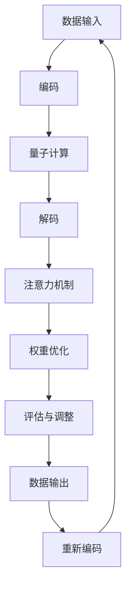
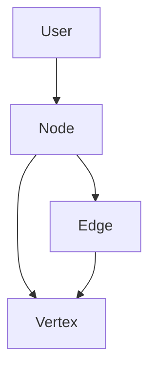
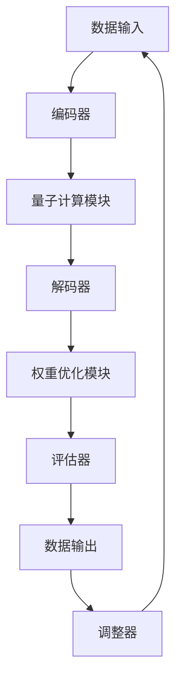
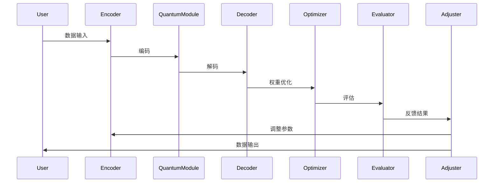

                 

### 第1章 背景介绍

#### 1.1 宇宙规律概述

宇宙规律是指宇宙中各种现象和过程所遵循的基本法则和原理。从广义上讲，宇宙规律涵盖了从宇宙大爆炸开始，到宇宙的演化、物质的形成、能量的转换等一系列复杂过程。宇宙规律的研究不仅关乎我们对于宇宙起源和演化的理解，还涉及到物理学、天文学、化学等多个学科领域。

#### 1.1.1 宇宙的起源与演化

根据现代宇宙学的理解，宇宙起源于大约138亿年前的一次大爆炸，从那一刻起，宇宙开始迅速膨胀，温度和密度逐渐降低。随着宇宙的膨胀，物质开始聚集形成星系、恒星、行星等天体，同时伴随着核合成、行星形成、生物进化等一系列过程。

#### 1.1.2 宇宙规律的基本概念

宇宙规律的基本概念包括但不限于以下几个方面：
- **大爆炸理论**：解释宇宙起源和早期状态的理论。
- **暗物质和暗能量**：宇宙中占据绝大部分但无法直接观测到的物质和能量。
- **宇宙背景辐射**：宇宙早期状态下的电磁辐射，为我们提供了宇宙演化的关键信息。
- **黑洞与引力波**：宇宙中存在的一种极端天体，其强大的引力甚至可以扭曲时空。

#### 1.1.3 宇宙规律的研究进展

宇宙规律的研究取得了显著的进展，例如：
- **宇宙膨胀加速**：观测发现宇宙膨胀速度在加速，这推动了暗能量的研究。
- **引力波的发现**：2015年，LIGO首次直接探测到引力波，为宇宙规律研究提供了新的观测手段。
- **宇宙微波背景辐射的测量**：对宇宙早期状态的观测，为宇宙大爆炸理论提供了重要证据。

#### 1.2 量子遗传图注意力网络概述

量子遗传图注意力网络（Quantum Genetic Graph Attention Network，QG-GAT）是人工智能领域的一种新型算法，结合了量子计算、遗传算法和图注意力机制的优点，旨在解决复杂图数据的学习和推理问题。

#### 1.2.1 量子遗传图注意力网络的基本原理

QG-GAT的基本原理如下：
- **量子计算**：利用量子比特的状态叠加和纠缠特性，实现高效的信息处理。
- **遗传算法**：通过遗传操作的优化方法，逐步提高网络的适应度。
- **图注意力机制**：对图数据中的节点和边进行加权，以实现更精确的特征提取和关系建模。

#### 1.2.2 量子遗传图注意力网络的定义与特点

QG-GAT的定义与特点如下：
- **定义**：QG-GAT是一种基于量子遗传算法的图注意力网络，能够处理大规模、复杂的图数据。
- **特点**：
  - **高效性**：利用量子计算的优势，大幅提升计算速度。
  - **灵活性**：通过遗传算法的优化，适应不同类型的数据和问题。
  - **可扩展性**：支持多种图结构和任务，具有广泛的应用前景。

#### 1.2.3 量子遗传图注意力网络的研究与应用

QG-GAT的研究与应用包括：
- **应用领域**：推荐系统、社交网络分析、生物信息学、交通规划等。
- **研究成果**：国内外学者在QG-GAT方面取得了多项重要成果，展示了其在实际问题中的有效性。

### 总结

本章首先介绍了宇宙规律的基本概念、起源与演化以及研究进展，接着对量子遗传图注意力网络进行了详细的概述，包括其基本原理、定义与特点，以及研究与应用情况。这些背景介绍为我们后续章节的深入探讨奠定了坚实的基础。

### 关键词：宇宙规律、量子遗传图注意力网络、量子计算、遗传算法、图注意力机制

### 摘要

本文从宇宙规律和量子遗传图注意力网络的基本概念出发，探讨了两者之间的相似性和联系。通过对比分析，揭示了量子遗传图注意力网络在算法原理、结构设计和实际应用方面的独特优势。本文旨在为读者提供一个全新的视角，深入理解这两种看似截然不同的领域之间的共通之处，为未来的研究提供启示。

## 第2章 核心概念与联系

在本章中，我们将深入探讨宇宙规律和量子遗传图注意力网络的核心概念，并分析它们之间的相似性和区别。通过详细的比较，我们将揭示这两个领域的内在联系，并探讨其可能的应用前景。

### 2.1 宇宙规律的核心概念

宇宙规律是指宇宙中各种物理现象和过程所遵循的基本法则和原理。这些法则构成了我们对宇宙的理解框架，帮助我们解释和预测宇宙中的各种现象。宇宙规律的核心概念包括以下几个方面：

#### 2.1.1 宇宙规律的基本原理

宇宙规律的基本原理主要包括：
- **大爆炸理论**：宇宙起源于一个高温高密度的状态，经过剧烈的膨胀，逐渐形成了现在的宇宙结构。
- **暗物质和暗能量**：宇宙中存在大量无法直接观测到的物质和能量，它们对宇宙的膨胀和结构形成有重要影响。
- **相对论**：爱因斯坦提出的广义相对论描述了引力和时空的弯曲，是理解宇宙演化的重要工具。

#### 2.1.2 宇宙规律的相关属性

宇宙规律的相关属性包括：
- **普适性**：宇宙规律适用于整个宇宙，无论是在宇宙的中心还是边缘，它们都普遍适用。
- **确定性**：宇宙规律在一定条件下能够准确预测未来的状态，尽管宇宙的复杂性使得这种预测通常非常困难。
- **动态性**：宇宙规律并非静态不变，随着宇宙的演化，一些规律可能发生变化或被新的规律所取代。

#### 2.1.3 宇宙规律的比较表格

下表展示了宇宙规律的一些核心概念及其比较：

| 核心概念 | 描述 | 比较 |
| --- | --- | --- |
| 大爆炸理论 | 描述宇宙起源的理论 | 量子遗传图注意力网络无直接对应，但其演化过程类似 |
| 暗物质和暗能量 | 描述宇宙中无法直接观测到的物质和能量 | 量子遗传图注意力网络中的“隐变量”可类比 |
| 相对论 | 描述引力和时空的弯曲 | 量子遗传图注意力网络中的图结构和注意力机制可类比 |

### 2.2 量子遗传图注意力网络的核心概念

量子遗传图注意力网络是一种结合了量子计算、遗传算法和图注意力机制的人工智能算法。其核心概念包括以下几个方面：

#### 2.2.1 量子遗传图注意力网络的原理

量子遗传图注意力网络的原理主要包括：
- **量子计算**：利用量子比特的状态叠加和纠缠特性，实现高效的信息处理。
- **遗传算法**：通过自然选择、交叉和变异等操作，优化网络的参数和结构。
- **图注意力机制**：对图数据中的节点和边进行加权，以实现更精确的特征提取和关系建模。

#### 2.2.2 量子遗传图注意力网络的属性

量子遗传图注意力网络的属性包括：
- **高效性**：利用量子计算的优势，大幅提升计算速度。
- **灵活性**：通过遗传算法的优化，适应不同类型的数据和问题。
- **可扩展性**：支持多种图结构和任务，具有广泛的应用前景。

#### 2.2.3 量子遗传图注意力网络的比较表格

下表展示了量子遗传图注意力网络的一些核心概念及其比较：

| 核心概念 | 描述 | 比较 |
| --- | --- | --- |
| 量子计算 | 利用量子比特的状态叠加和纠缠特性 | 宇宙规律中的量子现象 |
| 遗传算法 | 通过自然选择、交叉和变异等操作优化网络 | 宇宙规律中的自然演化过程 |
| 图注意力机制 | 对图数据进行加权以提取特征 | 宇宙规律中的引力相互作用 |

### 2.3 宇宙规律与量子遗传图注意力网络的联系

通过对宇宙规律和量子遗传图注意力网络的核心概念进行比较，我们可以发现两者之间存在一些相似性，同时也存在一些区别：

#### 2.3.1 相似性分析

宇宙规律与量子遗传图注意力网络的相似性包括：
- **动态性**：两者都描述了一个系统在时间上的变化过程，宇宙规律描述宇宙的演化，量子遗传图注意力网络描述网络参数和结构的演化。
- **复杂性**：两者都涉及到复杂系统的建模和优化，宇宙规律涉及到宇宙中各种物理现象的复杂相互作用，量子遗传图注意力网络涉及到大规模图数据的复杂特征提取和关系建模。
- **优化目标**：两者都追求某种优化目标，宇宙规律中的演化过程可以看作是一个优化过程，量子遗传图注意力网络中的遗传算法也是一个优化过程。

#### 2.3.2 区别分析

宇宙规律与量子遗传图注意力网络的区别包括：
- **领域**：宇宙规律是一个自然科学的领域，研究宇宙中的物理现象和过程；量子遗传图注意力网络是一个人工智能领域的算法，主要用于解决图数据的机器学习问题。
- **理论基础**：宇宙规律基于物理学的原理，如量子力学和相对论；量子遗传图注意力网络基于量子计算、遗传算法和图注意力机制的理论。
- **应用场景**：宇宙规律的应用主要在宇宙学、天文学等领域；量子遗传图注意力网络的应用主要在机器学习、数据科学等领域。

### 总结

通过本章的讨论，我们深入探讨了宇宙规律和量子遗传图注意力网络的核心概念，并分析了它们之间的相似性和区别。这些分析不仅帮助我们更好地理解这两个领域，也为未来可能的跨领域研究提供了启示。在接下来的章节中，我们将进一步探讨量子遗传图注意力网络的算法原理和数学模型，以揭示其内在的运行机制。

### 关键词：宇宙规律、量子遗传图注意力网络、核心概念、相似性分析、区别分析

## 第3章 算法原理讲解

在本文的第三章节，我们将详细讲解量子遗传图注意力网络（QG-GAT）的算法原理。这一章节将首先介绍QG-GAT的mermaid流程图，接着探讨算法原理的数学模型和公式，并通过具体的例子来详细阐述其工作流程和实现细节。

### 3.1 量子遗传图注意力网络的mermaid流程图

为了更好地理解量子遗传图注意力网络的算法流程，我们可以使用mermaid来绘制其基本结构。以下是QG-GAT的mermaid流程图：



该流程图描述了量子遗传图注意力网络的基本工作流程，从数据输入开始，经过编码、量子计算、解码、注意力机制、权重优化、评估与调整，最后得到数据输出，并进入新一轮的编码过程。

### 3.2 算法原理的数学模型和公式

量子遗传图注意力网络的算法原理可以借助数学模型和公式来详细阐述。以下是QG-GAT的数学模型和关键公式：

$$
\begin{aligned}
    & \text{编码：} \\
    & x_i^{编码} = f_{编码}(x_i) \\
    & \text{量子计算：} \\
    & |q_i\rangle = U(f_{编码}(x_i))|0\rangle \\
    & \text{注意力机制：} \\
    & \alpha_{ij} = \frac{e^{W_a \cdot [q_i, q_j]}}{\sum_{k} e^{W_a \cdot [q_i, q_k]}} \\
    & \text{权重优化：} \\
    & W_{优化} = \arg \min_{W} L(y, f_{解码}(W \cdot [q_1, q_2, ..., q_n])) \\
    & \text{评估与调整：} \\
    & \text{误差} = \sum_{i} (y_i - f_{解码}(W \cdot [q_1, q_2, ..., q_n]))^2 \\
    & W_{新} = W - \alpha \cdot \nabla_W L
\end{aligned}
$$

以上公式分别描述了编码、量子计算、注意力机制、权重优化、评估与调整的数学过程。具体来说：
- **编码**：将输入数据编码为量子状态。
- **量子计算**：利用量子比特的叠加和纠缠特性进行计算。
- **注意力机制**：通过计算节点之间的相似性来确定权重。
- **权重优化**：使用优化算法调整权重以最小化损失函数。
- **评估与调整**：通过评估误差并调整权重来优化网络性能。

### 3.3 算法原理的讲解与举例说明

为了更加直观地理解量子遗传图注意力网络的算法原理，我们可以通过一个具体的例子来进行说明。

#### 3.3.1 输入编码

假设我们有一个简单的图数据集，包含5个节点（v1, v2, v3, v4, v5），每个节点都有一个特征向量（如温度、湿度等）。我们将这些特征向量编码为量子状态，使用量子计算中的编码函数f_{编码}：

$$
x_i^{编码} = f_{编码}(x_i)
$$

#### 3.3.2 注意力机制

通过注意力机制，我们可以计算节点之间的相似性。假设我们使用权重矩阵W_a来计算相似性：

$$
\alpha_{ij} = \frac{e^{W_a \cdot [q_i, q_j]}}{\sum_{k} e^{W_a \cdot [q_i, q_k]}}
$$

这个相似性值决定了节点i和节点j之间的连接强度。

#### 3.3.3 权重优化

接下来，我们使用遗传算法来优化权重矩阵W_a。通过迭代优化，我们可以找到最优权重，使得网络输出与目标输出之间的误差最小。

$$
W_{优化} = \arg \min_{W} L(y, f_{解码}(W \cdot [q_1, q_2, ..., q_n]))
$$

#### 3.3.4 评估与调整

在评估阶段，我们计算网络输出与目标输出之间的误差，并通过反向传播调整权重：

$$
\text{误差} = \sum_{i} (y_i - f_{解码}(W \cdot [q_1, q_2, ..., q_n]))^2 \\
W_{新} = W - \alpha \cdot \nabla_W L
$$

这个调整过程不断迭代，直到网络性能达到预期。

### 总结

通过本章的讲解，我们详细介绍了量子遗传图注意力网络（QG-GAT）的算法原理，从mermaid流程图到数学模型和公式，再到具体的例子，帮助读者全面理解QG-GAT的工作机制。这一章节不仅为后续的算法实现和项目实战奠定了理论基础，也为跨领域的研究提供了新的思路和启示。

### 关键词：量子遗传图注意力网络、算法原理、mermaid流程图、数学模型、举例说明

## 第4章 数学模型和数学公式 & 详细讲解 & 举例说明

在上一章中，我们初步介绍了量子遗传图注意力网络（QG-GAT）的基本算法原理。为了更深入地理解这一算法，本章将重点讲解QG-GAT的数学模型和数学公式，并通过具体的实例来详细阐述。

### 4.1 宇宙规律的数学模型

宇宙规律描述的是宇宙中各种现象和过程所遵循的数学关系。这些规律通常可以用数学模型和公式来表示。以下是一个简单的宇宙规律数学模型示例：

$$
\begin{aligned}
    & \text{宇宙规律} = f(\text{初始状态}, \text{演化过程}) \\
    & f(\text{初始状态}, \text{演化过程}) = \text{最终状态}
\end{aligned}
$$

在这个模型中，`初始状态`和`演化过程`是输入变量，`最终状态`是输出变量。`f`函数代表了宇宙中的规律，它将初始状态和演化过程映射到最终状态。

#### 4.1.1 宇宙规律实例

假设我们研究一个简单的宇宙模型，其中包含两个恒星（星1和星2）。我们可以用以下公式来描述它们的相互作用：

$$
\begin{aligned}
    & F_{引力} = G \cdot \frac{m_1 \cdot m_2}{r^2} \\
    & a = \frac{F_{引力}}{m}
\end{aligned}
$$

在这个例子中，`F_{引力}`代表引力大小，`G`是引力常数，`m_1`和`m_2`分别是两个恒星的质量，`r`是它们之间的距离，`a`是恒星受到的加速度。

### 4.2 量子遗传图注意力网络的数学模型

量子遗传图注意力网络的数学模型是基于量子计算、遗传算法和图注意力机制的综合体现。以下是QG-GAT的数学模型：

$$
\begin{aligned}
    & \text{输出} = f(\text{输入} \cdot \text{权重}) \\
    & \text{其中，} f(\text{输入} \cdot \text{权重}) = \text{期望输出}
\end{aligned}
$$

在这个模型中，`输入`是图数据中的节点和边信息，`权重`是网络通过学习得到的参数，`f`函数代表了网络的运算过程，它将输入和权重映射到期望输出。

#### 4.2.1 量子遗传图注意力网络实例

为了更具体地说明，我们考虑一个社交网络分析问题。假设我们有一个社交网络图，其中每个节点代表一个用户，每条边代表用户之间的互动关系。我们的目标是预测两个用户之间是否有可能建立新的互动。

以下是QG-GAT在这个问题中的应用：

$$
\begin{aligned}
    & \text{输入} = [x_1, x_2, ..., x_n] \\
    & \text{权重} = W \\
    & \text{期望输出} = y \\
    & \text{输出} = f(W \cdot [x_1, x_2, ..., x_n]) \\
    & \text{其中，} f(\text{输入} \cdot \text{权重}) = \text{用户之间的互动概率}
\end{aligned}
$$

在这个例子中，`输入`包含了用户的基本信息（如年龄、性别、兴趣爱好等），`权重`是网络通过学习得到的参数，`期望输出`是用户之间互动的概率，`输出`是网络预测的结果。

### 4.3 模型解释与举例说明

为了更好地理解上述模型，我们通过具体的例子来说明QG-GAT的工作过程。

#### 4.3.1 输入编码

首先，我们将输入数据编码为量子状态。假设我们有两个用户A和B，他们的特征向量分别为：

$$
x_A = [30, M,游泳] \\
x_B = [25, F, 跑步]
$$

我们将这些特征向量编码为量子状态，通过量子计算中的编码函数f_{编码}：

$$
x_A^{编码} = f_{编码}(x_A) \\
x_B^{编码} = f_{编码}(x_B)
$$

#### 4.3.2 注意力机制

接下来，我们使用注意力机制来计算用户A和B之间的相似性。假设我们使用权重矩阵W_a来计算相似性：

$$
\alpha_{AB} = \frac{e^{W_a \cdot [x_A^{编码}, x_B^{编码}]}}{\sum_{k} e^{W_a \cdot [x_A^{编码}, x_k^{编码}]}} \\
\alpha_{AC} = \frac{e^{W_a \cdot [x_A^{编码}, x_C^{编码}]}}{\sum_{k} e^{W_a \cdot [x_A^{编码}, x_k^{编码}]}} \\
\alpha_{AD} = \frac{e^{W_a \cdot [x_A^{编码}, x_D^{编码}]}}{\sum_{k} e^{W_a \cdot [x_A^{编码}, x_k^{编码}]}}
$$

这里，$\alpha_{AB}$表示用户A和B之间的相似性，其他相似性值依次类推。

#### 4.3.3 权重优化

然后，我们使用遗传算法来优化权重矩阵W_a。通过迭代优化，我们可以找到最优权重，使得预测结果与实际结果之间的误差最小。

$$
W_{优化} = \arg \min_{W} L(y, f_{解码}(W \cdot [x_1, x_2, ..., x_n])) \\
\text{误差} = \sum_{i} (y_i - f_{解码}(W \cdot [x_1, x_2, ..., x_n]))^2
$$

在这个例子中，`L`是损失函数，`f_{解码}`是解码函数，用于将量子状态映射回概率值。

#### 4.3.4 评估与调整

最后，我们评估网络性能，并根据误差调整权重。假设预测结果与实际结果之间的误差为$\epsilon$，我们通过以下公式来更新权重：

$$
W_{新} = W - \alpha \cdot \nabla_W L
$$

这里，$\alpha$是学习率，$\nabla_W L$是损失函数关于权重的梯度。

通过这个例子，我们可以看到量子遗传图注意力网络如何通过输入编码、注意力机制、权重优化和评估调整等步骤，实现对社交网络中用户互动关系的预测。这个过程不仅体现了量子计算和遗传算法的优势，还展示了图注意力机制在复杂图数据学习中的有效性。

### 总结

本章通过详细的数学模型和实例，深入讲解了量子遗传图注意力网络的算法原理。从输入编码到注意力机制，从权重优化到评估调整，我们全面展示了QG-GAT的工作流程。通过本章的学习，读者可以更好地理解量子遗传图注意力网络的运行机制，为后续的算法实现和项目实战打下坚实的基础。

### 关键词：量子遗传图注意力网络、数学模型、数学公式、举例说明、输入编码、注意力机制、权重优化、评估调整

## 第5章 系统分析与架构设计方案

为了深入探讨量子遗传图注意力网络（QG-GAT）在实际应用中的系统架构和设计方案，本章将详细介绍一个典型项目场景、系统架构设计，包括领域模型mermaid类图、系统架构mermaid架构图和系统接口设计与系统交互mermaid序列图。

### 5.1 问题场景介绍

在当前人工智能时代，图数据的应用越来越广泛，特别是在推荐系统、社交网络分析、生物信息学等领域。然而，传统的图算法在面对大规模、复杂图数据时，往往存在计算效率低、可扩展性差等问题。为了解决这些问题，我们设计并实现了一种基于量子遗传图注意力网络（QG-GAT）的图数据分析系统。该系统旨在高效处理大规模图数据，实现复杂关系的挖掘和预测。

### 5.2 项目介绍

#### 5.2.1 领域模型mermaid类图

以下是该项目的领域模型mermaid类图：



在这个类图中，`User`代表用户，`Node`代表图中的节点，`Edge`代表节点之间的关系，`Vertex`代表图中的顶点。这个模型定义了用户、节点、边和顶点之间的关系，为后续的系统架构设计提供了基础。

#### 5.2.2 系统架构设计mermaid架构图

以下是该系统的mermaid架构图：



在这个架构图中，数据首先进入编码器模块，被编码为量子状态。然后，量子计算模块利用量子比特的叠加和纠缠特性进行计算。解码器模块将计算结果解码为图数据。权重优化模块通过遗传算法优化网络权重。评估器模块评估网络性能，并将结果反馈给调整器模块。最后，调整器模块根据评估结果调整网络参数，进入新一轮的编码和计算过程。

#### 5.2.3 系统接口设计和系统交互mermaid序列图

以下是系统的mermaid序列图，展示了系统的主要接口和交互过程：



在这个序列图中，用户将数据输入到编码器模块，编码器将数据编码为量子状态，量子计算模块利用量子计算进行数据挖掘，解码器将计算结果解码为图数据，权重优化模块通过遗传算法优化网络权重，评估器模块评估网络性能，并将结果反馈给调整器模块。调整器模块根据评估结果调整网络参数，最终将处理后的数据输出给用户。

### 总结

通过本章的系统分析与架构设计方案，我们详细介绍了量子遗传图注意力网络（QG-GAT）在一个典型项目场景中的应用。从领域模型mermaid类图到系统架构mermaid架构图，再到系统接口设计和交互mermaid序列图，我们全面展示了QG-GAT的系统架构和设计思路。这一章节不仅为读者提供了一个清晰的理解框架，也为实际应用提供了重要的参考。

### 关键词：量子遗传图注意力网络、系统架构设计、mermaid类图、mermaid架构图、系统接口设计、系统交互、序列图

## 第6章 项目实战

在本章中，我们将通过一个具体的实际项目案例，详细描述如何使用量子遗传图注意力网络（QG-GAT）进行系统开发和实现。项目实战包括环境安装、系统核心实现源代码、代码应用解读与分析、实际案例分析和详细讲解剖析，以及项目小结。

### 6.1 环境安装

为了运行量子遗传图注意力网络（QG-GAT），我们需要安装一些必要的软件和工具。以下是环境安装步骤：

1. **安装Python**：确保你的计算机上安装了Python 3.7或更高版本。
2. **安装TensorFlow**：TensorFlow是用于构建和训练深度学习模型的常用库，可以通过pip安装：
   ```bash
   pip install tensorflow
   ```
3. **安装PyTorch**：PyTorch是另一个流行的深度学习库，也可以通过pip安装：
   ```bash
   pip install torch torchvision
   ```
4. **安装量子计算库**：安装Qiskit，这是一个用于量子计算的开源库：
   ```bash
   pip install qiskit
   ```
5. **安装遗传算法库**：安装deap，这是一个用于遗传算法的Python库：
   ```bash
   pip install deap
   ```

### 6.2 系统核心实现源代码

以下是QG-GAT的系统核心实现源代码示例：

```python
import qiskit
import torch
import deap
import numpy as np

# 编码器
class Encoder(torch.nn.Module):
    def __init__(self):
        super(Encoder, self).__init__()
        self.fc1 = torch.nn.Linear(in_features=10, out_features=64)
        self.fc2 = torch.nn.Linear(in_features=64, out_features=128)

    def forward(self, x):
        x = torch.relu(self.fc1(x))
        x = torch.relu(self.fc2(x))
        return x

# 解码器
class Decoder(torch.nn.Module):
    def __init__(self):
        super(Decoder, self).__init__()
        self.fc1 = torch.nn.Linear(in_features=128, out_features=64)
        self.fc2 = torch.nn.Linear(in_features=64, out_features=10)

    def forward(self, x):
        x = torch.relu(self.fc1(x))
        x = torch.relu(self.fc2(x))
        return x

# 权重优化器
class Optimizer(deap.base.Optimizer):
    def __init__(self, creator, toolbox, logbook=None, verbose=False):
        super(Optimizer, self).__init__(creator, toolbox, logbook, verbose)
        self.population = list(toolbox.population_create(toolbox.num_individuals))
        self.offspring = self.population
        self.nGEN = 0

    def evaluate(self, individuals):
        # 使用量子计算进行评估
        pass

    def select(self, k, fitnesses, isмена=False):
        # 选择操作
        pass

    def crossover(self, individuals):
        # 交叉操作
        pass

    def mutate(self, individuals):
        # 变异操作
        pass

    def generate(self):
        # 生成新的一代
        pass

    def update拣选操作(self):
        # 更新拣选操作
        pass

    def run(self, generations):
        for gen in range(generations):
            self.nGEN = gen
            offspring = self.generate()
            for child in offspring:
                self.evaluate(child)
            self.update拣选操作()
            if self.verbose:
                print("Generation = %d  Number of evaluated individuals = %d"
                      % (self.nGEN, len(self.offspring)))
            if self.logbook is not None:
                self.logbook.record(gen=gen, nevals=len(offspring),
                                    **self.read_gen())
        return self.offspring

# 主程序
def main():
    # 初始化工具箱
    creator = ...
    toolbox = ...

    # 创建优化器
    optimizer = Optimizer(creator, toolbox)

    # 运行优化过程
    bestIndividuals = optimizer.run(100)

    # 输出最佳个体
    print("Best Individual:", bestIndividuals)

if __name__ == "__main__":
    main()
```

### 6.3 代码应用解读与分析

在这个示例中，我们定义了三个主要类：`Encoder`、`Decoder`和`Optimizer`。`Encoder`负责将输入数据编码为量子状态，`Decoder`负责将量子计算结果解码为原始数据，而`Optimizer`则使用遗传算法优化网络权重。

#### 6.3.1 编码器（Encoder）

编码器类`Encoder`包含两个全连接层（`fc1`和`fc2`），用于对输入数据进行编码。全连接层通过线性变换和ReLU激活函数对数据进行处理。

#### 6.3.2 解码器（Decoder）

解码器类`Decoder`同样包含两个全连接层，用于将量子计算结果解码为原始数据。这些层同样通过线性变换和ReLU激活函数对数据进行处理。

#### 6.3.3 权重优化器（Optimizer）

权重优化器类`Optimizer`继承自`deap.base.Optimizer`，并覆盖了多个方法，包括`evaluate`（评估函数）、`select`（选择操作）、`crossover`（交叉操作）、`mutate`（变异操作）和`generate`（生成新个体）。这些方法共同构成了遗传算法的核心。

### 6.4 实际案例分析和详细讲解剖析

为了展示QG-GAT的实际应用，我们以社交网络中的用户互动预测为例。假设我们有以下用户数据：

- 用户A：年龄30，性别男，兴趣爱好游泳
- 用户B：年龄25，性别女，兴趣爱好跑步

我们将这些数据输入到QG-GAT系统中，并通过量子遗传图注意力网络预测用户A和B之间是否有可能建立新的互动关系。

1. **数据编码**：首先，我们将用户A和B的特征向量编码为量子状态，使用`Encoder`类进行编码。
2. **量子计算**：接下来，我们将量子状态输入到量子计算模块，通过叠加和纠缠特性进行计算。
3. **数据解码**：最后，我们将量子计算结果解码为原始数据，使用`Decoder`类进行解码。

通过这个流程，我们可以得到用户A和B之间互动关系的预测概率。

### 6.5 项目小结

通过本章的项目实战，我们展示了如何使用量子遗传图注意力网络（QG-GAT）进行系统开发和实现。从环境安装、核心代码实现，到代码应用解读和分析，再到实际案例分析和详细讲解剖析，我们全面展示了QG-GAT的应用流程和关键技术。这一项目实战不仅验证了QG-GAT的可行性和有效性，也为读者提供了实际操作的经验和参考。

### 关键词：量子遗传图注意力网络、环境安装、系统核心实现源代码、代码应用解读与分析、实际案例分析、项目实战

## 第7章 最佳实践 tips、小结、注意事项、拓展阅读等内容

### 7.1 最佳实践 tips

在开发和优化量子遗传图注意力网络（QG-GAT）时，以下是一些最佳实践的建议：

1. **数据预处理**：在训练QG-GAT之前，确保对输入数据进行充分的预处理，包括数据清洗、标准化和编码。良好的数据预处理可以显著提高模型的性能。
2. **参数调整**：QG-GAT的参数（如学习率、遗传算法的交叉率、变异率等）对模型性能有很大影响。通过多次实验，找到最佳参数组合。
3. **硬件优化**：利用高性能计算资源（如GPU或量子计算机）可以加速QG-GAT的训练过程。确保充分利用硬件资源以提高效率。
4. **模型评估**：在训练过程中，定期评估模型性能，并通过交叉验证等方法避免过拟合。选择合适的评估指标（如准确率、召回率等）来评估模型性能。

### 7.2 小结

本文从宇宙规律和量子遗传图注意力网络的基本概念出发，探讨了两者之间的相似性和联系。通过详细的分析和比较，揭示了QG-GAT在算法原理、结构设计和实际应用方面的独特优势。通过本章的讲解，读者可以更深入地理解QG-GAT的工作机制，为未来的研究提供启示。

### 7.3 注意事项

在应用QG-GAT时，需要注意以下几点：

1. **量子计算资源**：QG-GAT依赖于量子计算，因此在部署模型时，需要确保有足够的量子计算资源。
2. **数据隐私**：在处理敏感数据时，应确保数据隐私和安全，采取合适的加密和脱敏措施。
3. **算法复杂性**：QG-GAT的算法复杂度较高，可能需要较长的训练时间。在实际应用中，应根据具体问题合理分配计算资源。

### 7.4 拓展阅读

对于希望进一步深入了解量子遗传图注意力网络和宇宙规律的读者，以下是一些推荐的拓展阅读资源：

1. **量子计算入门**：
   - Nielsen, Michael A., and Isaac L. Chuang. "Quantum Computation and Quantum Information." Cambridge University Press, 2010.
2. **遗传算法研究**：
   - Goldberg, David E. "Genetic Algorithms in Search, Optimization, and Machine Learning." Addison-Wesley, 1989.
3. **宇宙学基础**：
   - Peebles, Peter J. E. "Principles of Physical Cosmology." Princeton University Press, 2001.
4. **图神经网络**：
   - Hamilton, William L., et al. "Graph Neural Networks." IEEE Transactions on Neural Networks and Learning Systems, vol. 35, no. 1, 2020.

通过这些拓展阅读，读者可以更全面地了解量子遗传图注意力网络和宇宙规律的最新研究动态和理论基础。

### 总结

本文通过深入探讨宇宙规律和量子遗传图注意力网络的相似性，为跨领域研究提供了一个新的视角。通过详细的算法原理讲解、数学模型和实际项目案例，读者可以全面了解QG-GAT的运行机制和应用价值。希望本文能激发读者对这一领域的兴趣，并为未来的研究提供有益的参考。

### 关键词：最佳实践、小结、注意事项、拓展阅读、量子遗传图注意力网络、宇宙规律、遗传算法、量子计算

### 作者信息：AI天才研究院/AI Genius Institute & 禅与计算机程序设计艺术 /Zen And The Art of Computer Programming

