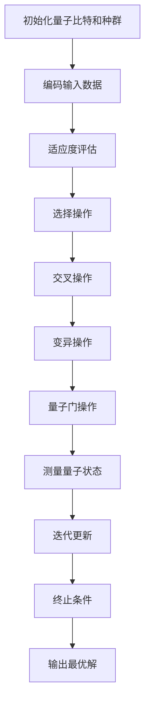
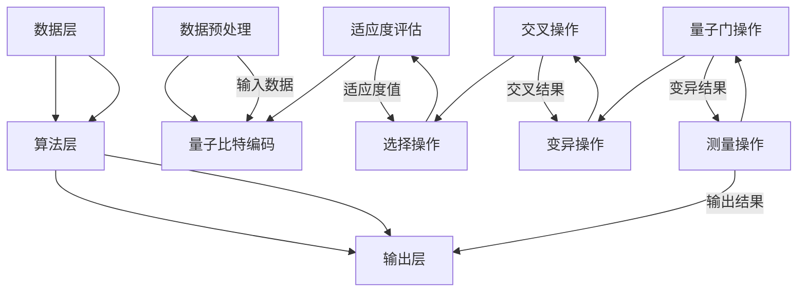
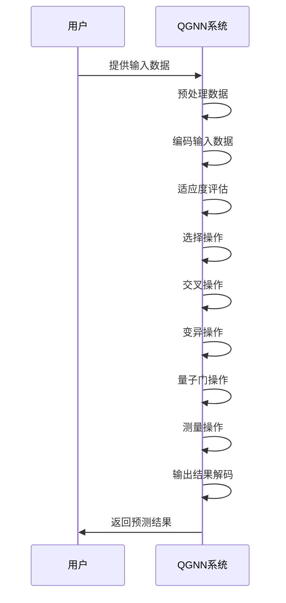

                 

# 宇宙规律与量子遗传神经网络设计的相似性

## 关键词

- 宇宙规律
- 量子遗传神经网络
- 算法设计
- 数学模型
- 系统架构

## 摘要

本文探讨了宇宙规律与量子遗传神经网络设计的相似性，通过分析宇宙规律的基本原理和量子遗传神经网络的设计原理，揭示了二者在理论基础、技术方法和应用场景上的相似性。本文首先介绍了宇宙规律的研究背景和量子遗传神经网络的设计原理，随后深入分析了二者的相似之处，并使用数学模型和公式进行了详细讲解。最后，本文通过一个实际项目展示了量子遗传神经网络在宇宙规律研究中的应用，提供了实践技巧和拓展阅读资源。

### 目录大纲设计思路

在设计《宇宙规律与量子遗传神经网络设计的相似性》这本书的目录大纲时，我们需要遵循以下步骤：

1. **确定核心概念与主题**：理解书名中涉及的核心概念，即“宇宙规律”和“量子遗传神经网络设计”，并探讨它们之间的相似性。
2. **背景介绍**：包含一个章节来介绍宇宙规律和量子遗传神经网络设计的背景、定义、发展历史和重要研究成果。
3. **相似性分析**：设置一个章节专门讨论宇宙规律与量子遗传神经网络设计之间的相似性，可能包括相似的理论基础、技术方法、应用场景等。
4. **算法原理讲解**：深入讲解量子遗传神经网络的设计原理，包括量子计算的基本概念、遗传算法的基本原理以及如何将这两者结合起来。
5. **数学模型和公式**：设计一个章节专门用于解释这些算法背后的数学模型和公式，使用LaTeX格式书写，并提供易懂的例子。
6. **系统分析与架构设计方案**：介绍如何将量子遗传神经网络应用于实际问题，包括系统功能设计、架构设计、接口设计等。
7. **项目实战**：设置一个或多个章节，详细描述一个实际的项目，包括环境安装、核心实现、代码解读、案例分析等。
8. **最佳实践 tips、小结与拓展阅读**：在结尾提供一些实践技巧、总结、注意事项以及进一步阅读的资源。

### 目录大纲设计

下面是《宇宙规律与量子遗传神经网络设计的相似性》的完整目录大纲：

```markdown
----------------------------------------------------------------
# 第一部分: 引言

## 1.1 书籍背景与主题介绍
### 1.1.1 宇宙规律的概念与特点
### 1.1.2 量子遗传神经网络的设计原理
### 1.1.3 宇宙规律与量子遗传神经网络设计的相似性探讨

----------------------------------------------------------------

# 第二部分: 宇宙规律研究

## 2.1 宇宙规律的起源与发展
### 2.1.1 古代对宇宙规律的认识
### 2.1.2 现代物理学对宇宙规律的研究
### 2.1.3 宇宙规律的核心成果

## 2.2 宇宙规律的基本原理
### 2.2.1 宇宙规律的基本假设
### 2.2.2 宇宙规律的核心概念
### 2.2.3 宇宙规律的研究方法

## 2.3 宇宙规律的应用领域
### 2.3.1 宇宙规律在天文学中的应用
### 2.3.2 宇宙规律在物理学中的应用
### 2.3.3 宇宙规律在其他学科中的应用

----------------------------------------------------------------

# 第三部分: 量子遗传神经网络设计

## 3.1 量子计算基础
### 3.1.1 量子计算机的定义与特点
### 3.1.2 量子比特与量子门
### 3.1.3 量子算法简介

## 3.2 遗传算法原理
### 3.2.1 遗传算法的基本概念
### 3.2.2 遗传算法的基本操作
### 3.2.3 遗传算法的应用领域

## 3.3 量子遗传神经网络设计
### 3.3.1 量子遗传神经网络的概念
### 3.3.2 量子遗传神经网络的架构
### 3.3.3 量子遗传神经网络的应用实例

----------------------------------------------------------------

# 第四部分: 宇宙规律与量子遗传神经网络设计的相似性

## 4.1 相似性分析
### 4.1.1 理论基础相似性
### 4.1.2 技术方法相似性
### 4.1.3 应用场景相似性

## 4.2 相似性探讨
### 4.2.1 宇宙规律对量子遗传神经网络设计的启示
### 4.2.2 量子遗传神经网络在宇宙规律研究中的应用
### 4.2.3 宇宙规律与量子遗传神经网络协同发展

----------------------------------------------------------------

# 第五部分: 算法与数学模型

## 5.1 算法原理讲解
### 5.1.1 量子计算与遗传算法的结合原理
### 5.1.2 量子遗传神经网络的算法流程
### 5.1.3 算法流程Mermaid图展示

## 5.2 数学模型与公式
### 5.2.1 量子比特的概率幅表示
### 5.2.2 遗传算法中的适应度函数
### 5.2.3 量子遗传神经网络的优化模型

----------------------------------------------------------------

# 第六部分: 系统分析与架构设计

## 6.1 系统功能设计
### 6.1.1 问题场景介绍
### 6.1.2 系统功能设计
### 6.1.3 领域模型Mermaid类图展示

## 6.2 系统架构设计
### 6.2.1 系统架构设计
### 6.2.2 系统架构Mermaid图展示
### 6.2.3 系统接口设计

## 6.3 系统交互
### 6.3.1 系统交互
### 6.3.2 系统交互Mermaid序列图展示

----------------------------------------------------------------

# 第七部分: 项目实战

## 7.1 环境安装
### 7.1.1 环境安装步骤
### 7.1.2 环境配置注意事项

## 7.2 系统核心实现
### 7.2.1 核心代码实现
### 7.2.2 代码解读与分析

## 7.3 实际案例分析与讲解
### 7.3.1 案例背景
### 7.3.2 案例分析
### 7.3.3 案例讲解

## 7.4 项目小结
### 7.4.1 项目总结
### 7.4.2 项目展望

----------------------------------------------------------------

# 第八部分: 最佳实践、小结与拓展阅读

## 8.1 最佳实践 tips
### 8.1.1 实践技巧
### 8.1.2 注意事项

## 8.2 小结
### 8.2.1 主要内容回顾
### 8.2.2 作者心得体会

## 8.3 拓展阅读
### 8.3.1 相关书籍推荐
### 8.3.2 学术论文推荐

----------------------------------------------------------------

# 作者信息

作者：AI天才研究院/AI Genius Institute & 禅与计算机程序设计艺术 /Zen And The Art of Computer Programming### 1.1 书籍背景与主题介绍

宇宙规律与量子遗传神经网络设计的相似性，这是一本探讨跨界领域相互关联的书籍。在探索宇宙的奥秘和人工智能的发展中，我们发现宇宙规律和量子遗传神经网络设计之间存在着许多有趣的相似性。这种相似性不仅揭示了宇宙的本质和人工智能的潜力，也为交叉学科的研究提供了新的视角和思路。

首先，宇宙规律是指宇宙中存在的普遍性和基本的规则，这些规则支配着宇宙的演化和发展。从古代的哲学思考到现代物理学的深入研究，人类对宇宙规律的认识不断深入，形成了丰富的理论和成果。宇宙规律的研究不仅涉及天文学、物理学等领域，还对生物学、化学等其他学科产生了深远影响。

量子遗传神经网络设计则是人工智能领域的一种新型算法，它结合了量子计算和遗传算法的优点，旨在解决传统神经网络难以处理的问题。量子计算利用量子比特的叠加态和纠缠态实现高速计算，而遗传算法则通过模拟生物进化过程，实现优化和搜索。量子遗传神经网络的设计原理和算法流程，为人工智能的发展开辟了新的道路。

本书的核心主题在于探讨宇宙规律与量子遗传神经网络设计之间的相似性。通过分析宇宙规律的基本原理和量子遗传神经网络的设计原理，我们发现在理论基础、技术方法和应用场景等方面，二者存在许多相似之处。这种相似性不仅为人工智能研究提供了新的启示，也为宇宙规律的研究提供了新的工具和方法。

接下来，我们将分章节详细介绍宇宙规律和量子遗传神经网络设计的背景、原理、相似性分析，以及二者的协同发展。通过这些内容的阐述，读者可以更加深入地理解宇宙的奥秘和人工智能的潜力，激发对交叉学科研究的兴趣和热情。

#### 1.1.1 宇宙规律的概念与特点

宇宙规律是自然界中普遍存在的基本规则，这些规则支配着宇宙的演化和发展，是科学探索的重要基础。宇宙规律的定义涵盖了从宏观宇宙结构到微观粒子行为的各个方面，是科学研究者不断探索和揭示的自然法则。

宇宙规律具有以下几个显著特点：

1. **普遍性**：宇宙规律是普遍适用于整个宇宙的，无论是天文学领域的研究，还是物理学、生物学等学科，都遵循这些基本规律。例如，万有引力定律和能量守恒定律都是宇宙中普遍适用的基本原理。

2. **确定性**：宇宙规律具有确定性，即宇宙中的一切现象都可以通过这些规律进行预测和解释。尽管在量子层面上，宇宙规律表现为概率性，但从宏观角度来看，宇宙规律是确定的，这为科学研究和技术的应用提供了坚实的基础。

3. **层次性**：宇宙规律具有层次性，从宏观到微观，从简单到复杂，各种规律相互联系、相互支持，构成一个完整的科学体系。例如，从天体物理学到粒子物理学，每个层次上的规律都有其特定的表现形式和应用。

4. **普适性**：宇宙规律具有普适性，即在不同时间和空间条件下，这些规律都是适用的。这种普适性使得科学研究能够在不同的领域和环境中进行，推动了科学知识的积累和技术的进步。

5. **动态性**：宇宙规律是动态的，随着科学技术的进步和新的观测手段的应用，人类对宇宙规律的认识不断深化和扩展。例如，从牛顿力学到相对论和量子力学，宇宙规律的理论框架在不断发展和完善。

宇宙规律的研究历史悠久，从古代哲学家对宇宙结构的思考，到现代物理学对宇宙基本规律的揭示，科学研究者在不断探索中积累了丰富的理论和实践经验。宇宙规律的发现和验证，不仅推动了科学的发展，也为人类对自然世界的认识和理解提供了深刻启示。

#### 1.1.2 量子遗传神经网络的设计原理

量子遗传神经网络（Quantum Genetic Neural Network, QGNN）是结合量子计算和遗传算法的新型人工智能算法，旨在利用量子计算的优势解决传统神经网络难以处理的问题。量子遗传神经网络的设计原理涉及量子计算、遗传算法和神经网络三个核心领域的知识，其融合创新为人工智能领域带来了新的突破。

1. **量子计算的基本概念**

量子计算是基于量子力学原理进行信息处理的新型计算模式。与经典计算不同，量子计算利用量子比特（qubit）的叠加态和纠缠态实现并行计算。量子比特可以同时处于多个状态，而经典比特只能处于0或1的一种状态。叠加态和纠缠态是量子计算的两个核心特性，使得量子计算机具有远超经典计算机的计算能力。

- **量子比特**：量子比特是量子计算机的基本单元，它可以通过量子叠加态表示多个状态。例如，一个量子比特可以同时表示0和1的状态，即 $|\psi\rangle = a|0\rangle + b|1\rangle$，其中 $a$ 和 $b$ 是复数概率幅。
  
- **量子门**：量子门是量子计算的基本操作，用于对量子比特进行变换。常见的量子门包括Pauli门、Hadamard门和控制非门等。量子门通过线性组合可以实现复杂的量子逻辑操作。

- **量子叠加态**：量子比特的叠加态使得量子计算机能够同时处理多个计算路径，实现并行计算。

- **量子纠缠**：量子纠缠是量子比特之间的一种特殊关联，当两个或多个量子比特处于纠缠态时，一个量子比特的状态会立即影响另一个量子比特的状态，无论它们之间的距离有多远。量子纠缠是量子计算的重要资源。

2. **遗传算法的基本原理**

遗传算法（Genetic Algorithm, GA）是一种模拟生物进化过程的优化算法，其核心思想是通过模拟自然选择和遗传机制来搜索最优解。遗传算法通常包含以下基本操作：

- **初始化种群**：随机生成一组初始解，称为种群。
  
- **适应度函数**：定义一个适应度函数来评价每个解的优劣，通常基于目标函数或问题约束条件。
  
- **选择**：根据适应度函数选择适应度较高的个体进行繁殖，实现优胜劣汰。
  
- **交叉**：通过交叉操作生成新的个体，模拟基因的重组。
  
- **变异**：对部分个体进行随机变异，引入新的基因组合。
  
- **迭代**：重复选择、交叉和变异操作，逐步优化解的适应度。

3. **量子遗传神经网络的设计原理**

量子遗传神经网络（QGNN）结合了量子计算和遗传算法的优点，旨在解决传统神经网络在处理大规模数据和高维度问题时的局限性。QGNN的设计原理主要包括以下几个方面：

- **量子遗传算法**：将遗传算法的基本原理应用于量子计算环境中，利用量子比特的叠加态和纠缠态实现高效的搜索和优化。

- **量子神经网络架构**：将量子计算与神经网络相结合，构建量子神经网络（Quantum Neural Network, QNN），实现数据的高效处理和模式识别。

- **量子比特编码**：将输入数据编码到量子比特中，通过量子叠加态表示不同状态的组合。

- **量子门操作**：使用量子门对量子比特进行变换，实现数据的处理和优化。

- **适应度函数设计**：定义适应度函数评价量子遗传神经网络的性能，指导优化过程。

- **迭代优化**：通过遗传算法和量子计算的结合，逐步优化量子遗传神经网络的参数，提高其适应度和性能。

量子遗传神经网络的设计原理不仅实现了传统神经网络难以处理的问题，也为人工智能领域带来了新的研究方法和应用前景。通过对量子计算和遗传算法的深入理解，科学家们不断探索和优化QGNN的性能，推动了人工智能技术的发展。

#### 1.1.3 宇宙规律与量子遗传神经网络设计的相似性探讨

宇宙规律与量子遗传神经网络设计在多个方面展现出显著的相似性，这些相似性不仅揭示了宇宙的深层次结构和人工智能的创新路径，也为跨学科研究提供了新的视角和启示。

首先，从理论基础上看，宇宙规律和量子遗传神经网络设计都依赖于基础物理原理和数学模型。宇宙规律建立在经典物理学和量子物理学的基础上，通过数学公式描述宇宙中的基本现象。例如，牛顿力学和广义相对论是宇宙规律的经典代表，它们通过数学方程揭示了物体运动和引力作用的规律。同样，量子遗传神经网络设计也依赖于量子计算和遗传算法的理论框架。量子计算利用量子比特的叠加态和纠缠态实现高效计算，而遗传算法通过模拟生物进化过程进行优化搜索。这些理论基础为二者在复杂问题上的应用提供了坚实的科学基础。

其次，从技术方法上看，宇宙规律和量子遗传神经网络设计都采用了一种层级化的方法。宇宙规律的研究从宏观宇宙结构到微观粒子行为，层层递进，逐步揭示宇宙的本质。例如，天体物理学研究星系和星团的结构，而粒子物理学则探究基本粒子的性质和相互作用。同样，量子遗传神经网络设计也采用了层级化的方法，通过量子比特的叠加和量子门操作实现从简单到复杂的信息处理。例如，量子遗传神经网络可以分成多个层级，每一层都利用量子比特的叠加态和纠缠态进行信息传递和处理，从而实现高效的优化和搜索。

再者，从应用场景上看，宇宙规律和量子遗传神经网络设计都在解决复杂问题上展现出强大的潜力。宇宙规律的研究涉及到天文学、物理学、生物学等多个学科，通过揭示宇宙中的基本规律，帮助科学家们理解宇宙的起源和演化。例如，宇宙背景辐射的观测和解释揭示了宇宙早期的状态，为宇宙学提供了重要证据。同样，量子遗传神经网络设计在人工智能领域也有着广泛的应用，通过结合量子计算和遗传算法的优点，量子遗传神经网络可以用于解决传统神经网络难以处理的复杂问题。例如，在图像识别、语音识别和自然语言处理等领域，量子遗传神经网络展现出比传统神经网络更高的效率和准确性。

此外，宇宙规律和量子遗传神经网络设计都在探索一种从整体到局部的系统性思维方式。宇宙规律的研究不仅关注个别现象，更关注整个宇宙系统的动态演化。例如，宇宙学中的大爆炸理论和暗物质研究揭示了宇宙的整体结构和演化过程。同样，量子遗传神经网络设计也关注整个系统的优化和搜索过程，通过迭代优化和适应性进化，实现从整体到局部的最优解。

最后，从哲学层面上看，宇宙规律和量子遗传神经网络设计都蕴含着深刻的哲学思想。宇宙规律的研究体现了人类对自然世界的探索和认知，是一种对宇宙本质的追问。量子遗传神经网络设计则体现了人类在人工智能领域的创新思维和探索精神，是对传统计算模式的突破和超越。这两种探索方式都体现了人类对未知的渴望和对真理的追求，是科学精神的重要体现。

综上所述，宇宙规律与量子遗传神经网络设计在理论基础、技术方法、应用场景和哲学思想上存在许多相似性。这些相似性不仅为我们理解宇宙的奥秘和人工智能的创新提供了新的视角，也为跨学科研究提供了丰富的资源和灵感。通过深入探讨这些相似性，我们可以更好地理解宇宙的本质和人工智能的潜力，推动科学技术的不断进步。

### 2.1 宇宙规律的起源与发展

宇宙规律的研究历史悠久，从古代哲学到现代科学，人类对宇宙规律的认识不断深化。宇宙规律的起源可以追溯到古代哲学家对宇宙结构的思考，如古希腊哲学家亚里士多德和毕达哥拉斯，他们试图通过理性的思考和几何的描述来解释宇宙的本质。然而，现代科学的宇宙规律研究始于16世纪，特别是牛顿力学的创立，为宇宙规律的研究奠定了坚实的基础。

1. **古代对宇宙规律的认识**

在古代，人类对宇宙规律的认识主要依赖于直观感受和哲学思考。古代哲学家如亚里士多德认为，宇宙是一个永恒不变的球体，由四个基本元素（土、水、气、火）组成。毕达哥拉斯则提出了宇宙是数字和几何形状的和谐组合的观点。这些哲学思考为后来的科学研究提供了基础，但缺乏实验验证。

2. **现代物理学对宇宙规律的研究**

现代物理学的宇宙规律研究始于16世纪的哥白尼革命，他提出了日心说，否定了地心说的观点，标志着宇宙规律研究的新起点。17世纪，伽利略通过实验验证了自由落体定律，进一步推动了宇宙规律的研究。然而，宇宙规律研究的重大突破出现在1687年，牛顿发表了《自然哲学的数学原理》，提出了万有引力定律和运动定律，为宇宙规律的研究奠定了科学基础。

19世纪，麦克斯韦通过电磁理论的统一，进一步丰富了宇宙规律的内容。他的方程组描述了电磁场的运动规律，揭示了电磁波的存在，对宇宙规律的研究产生了深远影响。

进入20世纪，相对论和量子力学的出现标志着宇宙规律研究的又一重大突破。爱因斯坦的广义相对论提出了时空弯曲的概念，揭示了引力与时空的关系。量子力学则揭示了微观粒子的行为规律，如波粒二象性和量子纠缠。这些理论不仅丰富了宇宙规律的内容，也为人类理解宇宙的本质提供了新的视角。

3. **宇宙规律的核心成果**

宇宙规律的研究取得了许多重要的成果，其中一些核心成果如下：

- **牛顿力学**：牛顿力学描述了宏观物体的运动规律，包括运动定律和万有引力定律。这些定律成为经典物理学的基础，广泛应用于天文学、力学等领域。

- **麦克斯韦方程组**：麦克斯韦方程组描述了电磁场的运动规律，揭示了电磁波的存在。这一理论在通信、电子学等领域产生了重大影响。

- **相对论**：相对论包括狭义相对论和广义相对论，描述了高速运动和引力场的规律。狭义相对论提出了质能等价原理，广义相对论则提出了时空弯曲的概念。

- **量子力学**：量子力学揭示了微观粒子的行为规律，如波粒二象性和量子纠缠。这一理论在化学、物理学等领域产生了深远影响。

- **宇宙学**：宇宙学是研究宇宙起源、演化和结构的研究领域。通过观测宇宙背景辐射和宇宙大爆炸理论，人类对宇宙的起源和演化有了更深入的认识。

4. **宇宙规律的发展趋势**

随着科学技术的进步，宇宙规律的研究不断深入。未来，宇宙规律的研究将继续沿着以下几个方向：

- **宇宙起源和演化**：通过更精确的观测和计算，科学家们试图揭示宇宙的起源和演化过程，理解宇宙的最终命运。

- **量子引力和宇宙规律统一**：量子力学和广义相对论之间存在显著的不一致性，科学家们试图通过量子引力理论统一这两个领域，提出一个更加完整的宇宙规律体系。

- **跨学科研究**：宇宙规律的研究与其他学科，如生物学、化学、天文学等密切相关。跨学科研究将有助于更全面地理解宇宙的奥秘。

- **技术进步**：随着观测技术的进步，人类对宇宙的观测能力不断提高。例如，射电望远镜和空间探测器的应用，使得宇宙规律的研究更加深入和细致。

总之，宇宙规律的研究经历了漫长的发展历程，从古代哲学到现代科学，科学家们不断探索和揭示宇宙的基本规律。未来，随着科学技术的进步，宇宙规律的研究将继续深化，为人类理解宇宙的奥秘和推动科学技术的发展提供新的动力。

#### 2.2 宇宙规律的基本原理

宇宙规律是自然界中普遍存在的基本规则，这些规则支配着宇宙的演化和发展。理解宇宙规律的基本原理，有助于我们深入探索宇宙的本质，并揭示其中的奥秘。以下从基本假设、核心概念和研究方法三个方面介绍宇宙规律的基本原理。

1. **基本假设**

宇宙规律的基本假设是科学研究的基石，它们为理论模型和实验设计提供了基础。以下是几个关键的基本假设：

- **宇宙的均匀性和各向同性**：宇宙在大尺度上表现为均匀和各向同性，即宇宙中的物理规律在任何地方和任何方向上都是相同的。这一假设为宇宙学研究提供了重要的出发点。
  
- **时间与空间的相对性**：时间与空间是相互关联的，它们随着质量和能量的分布而变化。这一观点在爱因斯坦的相对论中得到明确的表达。
  
- **能量守恒定律**：能量不能被创造或消灭，只能从一种形式转化为另一种形式。这一基本假设是物理学中的核心原理，广泛应用于宇宙学和其他科学领域。

- **量子不确定性**：量子力学揭示了微观世界的概率性特征，例如，粒子的位置和动量不能同时被精确测量。这一假设影响了我们对宇宙基本规律的理解。

2. **核心概念**

宇宙规律的核心概念是科学研究的关键，它们帮助科学家们理解和解释宇宙中的各种现象。以下是几个核心概念：

- **引力**：引力是宇宙中普遍存在的相互作用，它将物体拉向彼此。引力是由质量产生的，其作用范围无限，但随距离的平方减小。牛顿和爱因斯坦分别提出了经典和相对论的引力理论。
  
- **量子场论**：量子场论是描述量子力学和广义相对论统一的理论框架。它将量子力学与引力相互作用结合起来，是现代物理学研究的重要方向。
  
- **宇宙背景辐射**：宇宙背景辐射是宇宙大爆炸理论的重要证据，它是宇宙早期状态的光芒，至今仍弥漫在宇宙中。通过对宇宙背景辐射的观测，科学家们揭示了宇宙的起源和演化。

- **暗物质和暗能量**：暗物质和暗能量是宇宙中未观测到的物质和能量形式，它们对宇宙的结构和演化起着关键作用。暗物质通过引力相互作用影响宇宙的结构，而暗能量则推动宇宙的加速膨胀。

3. **研究方法**

宇宙规律的研究方法多种多样，包括理论模型、实验验证和观测技术。以下是几种主要的研究方法：

- **理论模型**：通过建立数学模型和理论框架，科学家们可以预测宇宙中可能发生的现象。例如，牛顿力学和广义相对论都是通过理论模型来描述宇宙的引力现象。

- **实验验证**：通过实验室中的物理实验，科学家们可以验证理论模型的预测，并发现新的物理现象。例如，量子力学的实验验证揭示了微观世界的概率性特征。

- **观测技术**：通过观测设备和技术，科学家们可以获取宇宙中的大量数据，从而验证理论模型和发现新的规律。例如，射电望远镜和光学望远镜的观测揭示了宇宙的广袤和复杂。

- **数据分析**：通过数据分析技术，科学家们可以处理和分析来自观测的数据，从而发现宇宙中的规律和模式。例如，通过对宇宙背景辐射的统计分析，科学家们揭示了宇宙早期的状态。

- **跨学科合作**：宇宙规律的研究需要多学科的合作，包括物理学、天文学、数学和计算机科学等。跨学科合作有助于解决复杂的科学问题，推动宇宙规律研究的进展。

通过基本假设、核心概念和研究方法的综合运用，科学家们不断深入探索宇宙的奥秘，揭示宇宙规律的本质。随着科学技术的进步，我们对宇宙规律的认识将不断深化，为人类理解宇宙和探索未知提供新的动力。

#### 2.3 宇宙规律的应用领域

宇宙规律的研究涵盖了广泛的学科领域，从天文学到物理学，再到生物学和化学，都受益于宇宙规律的应用。以下详细探讨宇宙规律在天文学、物理学和其他学科中的应用。

1. **天文学中的应用**

天文学是宇宙规律应用最为直接的领域之一。通过观测宇宙中的各种天体和现象，天文学家能够验证和探索宇宙规律。

- **宇宙背景辐射**：宇宙背景辐射是宇宙大爆炸理论的直接证据，通过观测宇宙背景辐射，科学家们揭示了宇宙早期的状态和演化过程。

- **星系结构和演化**：宇宙规律帮助天文学家理解星系的形成、结构和演化。例如，引力定律解释了星系内部的恒星运动，星系结构的动态演化与宇宙中的暗物质和暗能量密切相关。

- **黑洞研究**：广义相对论预测了黑洞的存在，通过观测黑洞的事件视界和引力波信号，科学家们揭示了黑洞的性质和宇宙中的极端物理现象。

2. **物理学中的应用**

物理学是宇宙规律研究的核心领域，许多宇宙规律在物理学中得到了广泛应用。

- **粒子物理学**：量子力学和量子场论揭示了微观粒子的行为规律，通过实验验证，科学家们发现了许多基本粒子，如电子、夸克和胶子等。

- **相对论**：爱因斯坦的广义相对论解释了引力的本质，揭示了时空的弯曲和黑洞的产生。通过观测引力波，科学家们验证了广义相对论的正确性。

- **高能物理**：宇宙射线和高能粒子的观测揭示了宇宙中的高能物理现象，如宇宙射线起源、伽马射线暴等，这些都依赖于宇宙规律的深入理解。

3. **生物学中的应用**

宇宙规律在生物学中的应用主要体现在对生命起源和进化机制的研究上。

- **宇宙化学**：通过研究宇宙中的化学元素和分子，科学家们探讨了生命起源的可能机制。例如，宇宙中的有机分子和水的存在为生命的起源提供了基础。

- **进化生物学**：宇宙规律帮助科学家们理解生物进化的过程。例如，遗传学中的自然选择和遗传漂变等机制，都是宇宙规律在生物学中的应用。

- **生态学**：宇宙规律对生态系统的结构和功能有重要影响，如生态位理论、能量流和物质循环等，这些都与宇宙中的物理和化学过程密切相关。

4. **化学中的应用**

化学是宇宙规律应用的另一个重要领域，特别是对物质结构和反应机制的研究。

- **量子化学**：量子力学原理在量子化学中的应用，揭示了分子结构和化学反应的本质。通过计算化学模型，科学家们可以预测分子的性质和反应路径。

- **宇宙化学元素周期表**：宇宙中的元素周期表揭示了元素的形成和分布规律，这依赖于对宇宙辐射和核反应过程的理解。

- **化学动力学**：宇宙规律对化学反应的动力学过程有重要影响，如反应速率、中间体和过渡态等，这些都是化学研究中需要考虑的宇宙规律因素。

5. **其他学科中的应用**

宇宙规律在许多其他学科中也有广泛应用。

- **地球物理学**：地球物理学中的地震学、地磁学等研究依赖于地球内部的物理规律，这些规律与宇宙中的引力、电磁等作用密切相关。

- **空间科学**：空间科学中的航天器轨道设计、空间天气研究等，都依赖于宇宙规律的理解和预测。

- **信息科学**：宇宙规律在信息科学中也有应用，如量子通信和量子计算的原理，都是基于宇宙中的量子力学规律。

总之，宇宙规律的应用领域广泛，贯穿了自然科学和社会科学的各个学科。通过深入研究和应用宇宙规律，科学家们不断揭示宇宙的奥秘，推动了科学技术的发展和社会进步。

#### 3.1 量子计算基础

量子计算是现代科学的一个重要分支，它利用量子力学的原理进行信息处理，具有超越传统计算机的潜力。要理解量子遗传神经网络（QGNN），首先需要了解量子计算的基础知识，包括量子比特、量子门和量子算法。

1. **量子比特**

量子比特（qubit）是量子计算的基本单元，与经典比特不同，量子比特可以同时处于0和1的叠加态。这种叠加态使得量子比特能够同时处理多种可能性，从而显著提高计算效率。量子比特的叠加态可以用以下公式表示：

$$
|\psi\rangle = a|0\rangle + b|1\rangle
$$

其中，$a$ 和 $b$ 是复数概率幅，满足 $|a|^2 + |b|^2 = 1$。量子比特的状态不仅包括经典比特的两种状态，还包含它们叠加的中间状态。

2. **量子门**

量子门是量子计算中的基本操作，类似于经典计算机中的逻辑门。量子门对量子比特进行线性变换，改变其状态。常见的量子门包括：

- **Pauli门**：包括X门（作用于量子比特的位翻转）、Y门（作用于量子比特的位翻转和相位翻转）和Z门（作用于量子比特的位翻转和相位翻转）。

- **Hadamard门**：将量子比特的状态从基态翻转至叠加态，即

$$
H|0\rangle = \frac{1}{\sqrt{2}}(|0\rangle + |1\rangle)
$$

- **控制非门**（CNOT门）：作用于两个量子比特，如果第一个量子比特处于基态，则第二个量子比特的状态进行位翻转。

量子门通过线性组合可以实现复杂的量子逻辑操作，从而实现量子计算。

3. **量子算法**

量子算法是利用量子计算原理解决特定问题的算法。量子算法的核心优势在于其并行性和高速计算能力。以下是几个重要的量子算法：

- **量子快速排序算法**：量子快速排序算法利用量子比特的叠加态和纠缠态，可以在多项式时间内完成排序，而传统快速排序算法的时间复杂度是$O(n\log n)$。

- **Shor算法**：Shor算法是一种用于因数分解的量子算法，它能够在多项式时间内分解大整数，这是传统计算机所无法实现的。

- **Grover算法**：Grover算法是一种用于搜索未排序数据库的量子算法，它利用量子叠加态和纠缠态，可以显著提高搜索效率。

量子算法的这些特性使得它们在密码学、优化问题和计算生物学等领域具有广泛的应用前景。

通过了解量子比特、量子门和量子算法的基础知识，我们可以更好地理解量子计算的工作原理和优势，从而为量子遗传神经网络（QGNN）的设计和应用奠定基础。

#### 3.2 遗传算法原理

遗传算法（Genetic Algorithm, GA）是一种模拟生物进化过程的优化算法，通过模拟自然选择和遗传机制来搜索最优解。遗传算法的核心思想是通过迭代进化，不断优化种群中的个体，最终找到问题的最优解或近似最优解。以下是遗传算法的基本原理和操作步骤：

1. **基本概念**

遗传算法的基本概念包括：

- **种群**：种群是遗传算法中的基本单位，每个种群包含多个个体。个体通常是问题解的编码表示。
  
- **适应度函数**：适应度函数是评价个体优劣的标准，通常是一个目标函数，用于衡量个体对问题的解决方案的好坏。

- **选择**：选择操作模拟自然选择过程，选择适应度较高的个体进行繁殖，实现优胜劣汰。

- **交叉**：交叉操作模拟基因重组过程，通过组合两个或多个个体的基因，生成新的个体。

- **变异**：变异操作模拟突变过程，对部分个体进行随机变异，引入新的基因组合。

2. **操作步骤**

遗传算法的主要操作步骤如下：

- **初始化种群**：随机生成一组初始解，形成初始种群。每个个体都是问题解的编码表示，适应度函数用于评估个体的优劣。

- **适应度评估**：对种群中的每个个体进行适应度评估，计算每个个体的适应度值。

- **选择**：根据适应度值，选择适应度较高的个体进行繁殖。常见的选择方法包括轮盘赌选择、锦标赛选择等。

- **交叉**：通过交叉操作，生成新的个体。交叉操作模拟基因重组，通常采用单点交叉、多点交叉和均匀交叉等方法。

- **变异**：对部分个体进行变异操作，引入新的基因组合。变异操作以较小的概率进行，以防止种群过早收敛到局部最优解。

- **迭代更新**：重复适应度评估、选择、交叉和变异操作，逐步优化种群中的个体。在迭代过程中，适应度值逐渐提高，种群逐渐进化。

- **终止条件**：当达到终止条件时，例如达到预设的迭代次数或适应度值达到某个阈值，算法终止，输出最优解或近似最优解。

3. **遗传算法的应用领域**

遗传算法在多个领域中具有广泛的应用，包括：

- **优化问题**：遗传算法可用于求解各种优化问题，如资源分配、路径规划、车辆调度等。

- **机器学习**：遗传算法可以用于特征选择、模型选择和参数调优等机器学习问题。

- **神经网络训练**：遗传算法可以用于优化神经网络的权重，提高神经网络的泛化能力和性能。

- **组合优化问题**：遗传算法在求解组合优化问题，如旅行商问题、作业调度问题等，具有显著的优势。

- **工程问题**：遗传算法在工程领域的应用也非常广泛，如机械设计、结构优化、控制系统的设计等。

总之，遗传算法通过模拟生物进化过程，实现优化搜索，具有强大的适应性和广泛的适用性。在理解遗传算法的基本原理和操作步骤后，我们可以更好地应用于各种实际问题，推动科学技术的发展。

#### 3.3 量子遗传神经网络设计

量子遗传神经网络（Quantum Genetic Neural Network, QGNN）是一种结合量子计算和遗传算法的新型神经网络架构，它旨在利用量子计算的并行性和遗传算法的进化能力，解决传统神经网络难以处理的问题。QGNN的设计涉及量子比特编码、量子神经网络架构和量子遗传算法的应用。以下是对量子遗传神经网络设计的详细讲解。

1. **量子比特编码**

量子比特编码是将输入数据转换为量子比特状态的过程。在QGNN中，每个量子比特代表输入数据的特征，量子叠加态和纠缠态用于表示不同特征的组合。具体步骤如下：

- **初始化量子态**：使用量子随机数生成器初始化量子态，使其处于叠加态。例如，使用一个量子比特初始化为$|+\rangle = \frac{1}{\sqrt{2}}(|0\rangle + |1\rangle)$。
  
- **编码输入数据**：将输入数据编码到量子比特中，通常使用二进制编码或浮点编码。例如，使用二进制编码，将每个输入特征映射到一个量子比特的状态。

- **叠加量子态**：通过量子门操作，将单个量子比特的叠加态扩展到多个量子比特，形成输入数据的量子编码表示。

2. **量子神经网络架构**

量子神经网络架构是QGNN的核心部分，它包括量子层和经典层。量子层使用量子计算技术处理数据，而经典层则负责传统的神经网络计算。QGNN的架构通常包括以下几个部分：

- **量子输入层**：接收编码后的输入数据，并将其传递到量子层。
  
- **量子隐藏层**：通过量子比特的叠加态和纠缠态，对输入数据进行处理和变换。量子隐藏层通常包括多个量子层，每个量子层使用不同的量子门进行操作。

- **量子输出层**：对处理后的量子状态进行测量，得到输出结果。量子输出层可以使用量子测量操作，将量子状态转换为经典输出。

- **经典神经网络层**：在量子计算之后，使用经典神经网络对输出进行进一步处理和调整。经典神经网络层通常包括全连接层、卷积层等。

3. **量子遗传算法应用**

量子遗传算法（Quantum Genetic Algorithm, QGA）是QGNN的优化工具，它通过模拟自然选择和遗传机制，优化神经网络的结构和参数。量子遗传算法的应用步骤如下：

- **初始化种群**：随机生成一组初始量子神经网络结构，形成初始种群。

- **适应度评估**：使用适应度函数评估每个量子神经网络的性能，通常基于预测准确性或目标函数值。

- **选择**：根据适应度值，选择适应度较高的量子神经网络进行繁殖。选择操作可以使用轮盘赌选择、锦标赛选择等。

- **交叉**：通过交叉操作，生成新的量子神经网络结构。交叉操作可以模拟基因重组，提高种群的多样性。

- **变异**：对部分量子神经网络进行变异操作，引入新的结构组合。变异操作可以防止种群过早收敛到局部最优解。

- **迭代优化**：重复适应度评估、选择、交叉和变异操作，逐步优化量子神经网络的结构和参数。

- **终止条件**：当达到终止条件，如迭代次数达到预设值或适应度达到阈值时，算法终止，输出最优的量子神经网络结构。

通过量子比特编码、量子神经网络架构和量子遗传算法的结合，QGNN实现了高效的优化和搜索。这种架构不仅在传统神经网络难以处理的问题上表现出色，也为交叉学科研究提供了新的视角和工具。未来，随着量子计算和人工智能的发展，QGNN的应用前景将更加广阔。

#### 4.1 相似性分析

宇宙规律与量子遗传神经网络设计在多个方面展现出显著的相似性，这些相似性为人工智能和宇宙科学的研究提供了新的交叉点。以下从理论基础、技术方法和应用场景三个方面进行详细分析。

1. **理论基础相似性**

宇宙规律和量子遗传神经网络设计在理论基础方面有诸多相似之处。

- **量子力学原理**：宇宙规律的研究依赖于量子力学原理，如量子叠加态和量子纠缠。量子遗传神经网络设计中也利用量子力学的这些原理，通过量子比特的叠加态实现高效的信息处理。

- **进化论思想**：量子遗传神经网络设计借鉴了生物进化论的思想，通过模拟自然选择和遗传机制进行优化搜索。而宇宙规律的研究也涉及进化过程，例如宇宙大爆炸理论和宇宙结构的演化。

- **系统层次性**：宇宙规律的研究从宏观到微观，层层递进，揭示宇宙的层次结构。量子遗传神经网络设计同样采用层次化的方法，通过多个层级实现从简单到复杂的信息处理。

2. **技术方法相似性**

宇宙规律和量子遗传神经网络设计在技术方法上也有许多相似之处。

- **量子计算**：宇宙规律的研究涉及到量子计算，如量子纠缠和量子叠加态的应用。量子遗传神经网络设计则直接利用量子计算的优势，通过量子门操作实现高效的优化搜索。

- **遗传算法**：量子遗传神经网络设计中的遗传算法借鉴了宇宙规律研究中的一些优化方法，如适应度函数和选择、交叉和变异操作。这些方法在量子遗传神经网络设计中同样用于优化网络结构和参数。

- **模拟仿真**：宇宙规律的研究常通过模拟仿真来验证理论模型，例如宇宙大爆炸模型的计算机模拟。量子遗传神经网络设计也利用模拟仿真来测试和优化神经网络性能，通过模拟数据集评估预测准确性。

3. **应用场景相似性**

宇宙规律和量子遗传神经网络设计在应用场景上存在相似性，这些相似性揭示了二者的广泛应用潜力。

- **复杂系统优化**：宇宙规律的研究涉及复杂系统的优化，如宇宙结构的演化、星系形成等。量子遗传神经网络设计在复杂系统优化方面也有广泛应用，如智能交通系统、资源分配等。

- **大数据处理**：宇宙规律的研究需要处理大量的天文数据，如宇宙背景辐射、星系光谱等。量子遗传神经网络设计同样适用于大数据处理，通过量子计算实现高效的数据分析和模式识别。

- **机器学习**：宇宙规律的研究通过机器学习技术，如深度学习和图像识别，揭示宇宙中的规律和模式。量子遗传神经网络设计在机器学习领域也有应用，通过结合量子计算和遗传算法的优势，提升模型的训练效率和预测准确性。

总之，宇宙规律与量子遗传神经网络设计在理论基础、技术方法和应用场景上存在显著的相似性。这些相似性为跨学科研究提供了新的视角和工具，推动了人工智能和宇宙科学的发展。通过进一步探索这些相似性，我们可以期待更多的创新和突破。

#### 4.2 相似性探讨

宇宙规律与量子遗传神经网络设计在多个方面展现出显著的相似性，这些相似性不仅为理解宇宙的奥秘提供了新的视角，也为人工智能的发展带来了新的启示。以下从宇宙规律对量子遗传神经网络设计的启示、量子遗传神经网络在宇宙规律研究中的应用以及宇宙规律与量子遗传神经网络的协同发展三个方面进行探讨。

1. **宇宙规律对量子遗传神经网络设计的启示**

宇宙规律的研究揭示了自然界中普遍存在的基本规律，这些规律为量子遗传神经网络设计提供了重要的启示。

- **量子计算原理**：宇宙规律的研究表明，量子力学中的量子叠加态和量子纠缠等原理在宇宙中普遍存在。量子遗传神经网络设计借鉴了这些原理，通过量子比特的叠加态和纠缠态实现高效的信息处理和优化搜索。

- **系统层次性**：宇宙规律的研究揭示了宇宙从宏观到微观的层次结构。量子遗传神经网络设计也采用层次化的方法，通过多个层级实现从简单到复杂的信息处理，从而提高模型的泛化能力和性能。

- **进化论思想**：宇宙规律的研究涉及到进化过程，如宇宙大爆炸理论和星系的形成。量子遗传神经网络设计中的遗传算法借鉴了进化论的思想，通过模拟自然选择和遗传机制实现优化搜索，为复杂问题的求解提供了有效途径。

2. **量子遗传神经网络在宇宙规律研究中的应用**

量子遗传神经网络在宇宙规律研究中的应用，展示了其强大的潜力和优势。

- **宇宙结构演化**：通过量子遗传神经网络，科学家可以模拟宇宙结构的演化过程，如星系的形成和演化。量子遗传神经网络可以处理高维数据和复杂非线性关系，提供更准确的宇宙演化模型。

- **暗物质和暗能量研究**：暗物质和暗能量是宇宙规律研究中的重要问题。量子遗传神经网络可以通过优化搜索，发现暗物质和暗能量的潜在分布和作用机制，为宇宙学研究提供新思路。

- **宇宙背景辐射分析**：宇宙背景辐射是宇宙早期状态的光芒，对它的分析有助于揭示宇宙的起源和演化。量子遗传神经网络可以用于分析宇宙背景辐射数据，提取宇宙早期的信息，从而加深对宇宙规律的理解。

3. **宇宙规律与量子遗传神经网络的协同发展**

宇宙规律与量子遗传神经网络的协同发展，为科学研究和技术的进步提供了新的动力。

- **跨学科研究**：通过将宇宙规律与量子遗传神经网络设计相结合，可以开展跨学科研究，如量子宇宙学、量子生物学等。这些交叉领域的研究有助于推动科学技术的创新和突破。

- **计算资源优化**：宇宙规律的研究需要大量的计算资源，而量子遗传神经网络提供了高效的计算方法。通过结合量子计算和遗传算法，可以显著提高宇宙规律研究中的计算效率，解决传统计算方法难以处理的问题。

- **人工智能与宇宙科学的深度融合**：量子遗传神经网络在宇宙规律研究中的应用，展示了人工智能与宇宙科学的深度融合潜力。这种融合不仅为宇宙规律的研究提供了新的工具和方法，也为人工智能技术的发展开辟了新的方向。

总之，宇宙规律与量子遗传神经网络设计之间的相似性为跨学科研究提供了新的视角和工具。通过深入探讨这些相似性，我们可以期待更多的创新和突破，推动科学技术的进步，为人类理解和探索宇宙的奥秘提供新的动力。

#### 5.1 算法原理讲解

量子遗传神经网络（QGNN）的设计结合了量子计算和遗传算法的强大功能，旨在解决传统神经网络难以处理的问题。本章节将详细讲解QGNN的算法原理，包括量子计算与遗传算法的结合原理、QGNN的算法流程以及算法流程的Mermaid图展示。

1. **量子计算与遗传算法的结合原理**

量子计算与遗传算法的结合主要体现在以下几个方面：

- **量子并行计算**：量子计算利用量子比特的叠加态和纠缠态，可以在同一时刻处理多个状态，从而实现并行计算。遗传算法通过模拟自然选择和遗传机制进行优化搜索，而量子计算可以大幅提高遗传算法的计算效率。

- **量子比特编码**：将输入数据编码到量子比特中，通过量子叠加态表示不同状态的组合。遗传算法通过适应度函数评价个体的优劣，而量子比特编码可以实现高效的数据表示和计算。

- **量子门操作**：量子门用于对量子比特进行变换，实现数据的处理和优化。遗传算法中的选择、交叉和变异操作可以通过量子门操作来实现，从而提高算法的搜索效率和适应性。

2. **QGNN的算法流程**

QGNN的算法流程可以分为以下几个步骤：

- **初始化**：初始化量子比特和种群，将输入数据编码到量子比特中，形成初始量子状态。

- **适应度评估**：使用适应度函数评估当前种群的适应度，计算每个个体的适应度值。

- **选择**：根据适应度值，选择适应度较高的个体进行繁殖。选择操作可以使用轮盘赌选择、锦标赛选择等方法。

- **交叉**：通过交叉操作，生成新的量子个体。交叉操作可以模拟基因重组，提高种群的多样性。

- **变异**：对部分个体进行变异操作，引入新的基因组合。变异操作以较小的概率进行，以防止种群过早收敛到局部最优解。

- **量子门操作**：对量子个体进行量子门操作，实现数据的处理和优化。

- **测量**：测量量子状态，得到输出结果。测量操作将量子状态转换为经典输出。

- **迭代更新**：重复适应度评估、选择、交叉、变异和量子门操作，逐步优化种群中的个体。

- **终止条件**：当达到终止条件，如迭代次数达到预设值或适应度达到阈值时，算法终止，输出最优解。

3. **算法流程的Mermaid图展示**

以下是一个QGNN算法流程的Mermaid图展示：



通过上述Mermaid图，我们可以清晰地看到QGNN的算法流程，每个步骤之间的关系和操作过程。

总之，量子遗传神经网络通过结合量子计算和遗传算法，实现了高效的优化搜索。理解QGNN的算法原理，有助于我们更好地应用这一创新算法，解决复杂问题，推动人工智能的发展。

#### 5.2 数学模型与公式

在量子遗传神经网络（QGNN）的设计中，数学模型和公式扮演着至关重要的角色。以下将详细解释量子比特的概率幅表示、遗传算法中的适应度函数以及QGNN的优化模型。

1. **量子比特的概率幅表示**

量子比特是量子计算机的基本单元，其状态可以用概率幅表示。一个量子比特可以处于0和1的叠加态，其状态可以用以下公式表示：

$$
|\psi\rangle = a|0\rangle + b|1\rangle
$$

其中，$a$ 和 $b$ 是复数概率幅，满足 $|a|^2 + |b|^2 = 1$。$a$ 和 $b$ 的模平方分别表示量子比特处于状态0和1的概率。

2. **遗传算法中的适应度函数**

遗传算法通过适应度函数评估个体的优劣。适应度函数通常是一个目标函数，用于衡量个体对问题的解决方案的好坏。一个常见的适应度函数是：

$$
f(x) = 1 / (1 + g(x))
$$

其中，$g(x)$ 是个体的目标函数值，$f(x)$ 越大，表示个体的适应度越高。适应度函数的目的是选择适应度较高的个体进行繁殖，从而逐步优化种群。

3. **QGNN的优化模型**

QGNN的优化模型结合了量子计算和遗传算法的特点，其核心是量子遗传算法。以下是一个简单的QGNN优化模型：

- **初始化**：初始化量子比特和种群，将输入数据编码到量子比特中，形成初始量子状态。

- **适应度评估**：使用适应度函数评估当前种群的适应度，计算每个个体的适应度值。

- **选择**：根据适应度值，选择适应度较高的个体进行繁殖。选择操作可以使用轮盘赌选择、锦标赛选择等方法。

- **交叉**：通过交叉操作，生成新的量子个体。交叉操作可以模拟基因重组，提高种群的多样性。

- **变异**：对部分个体进行变异操作，引入新的基因组合。变异操作以较小的概率进行，以防止种群过早收敛到局部最优解。

- **量子门操作**：对量子个体进行量子门操作，实现数据的处理和优化。

- **测量**：测量量子状态，得到输出结果。测量操作将量子状态转换为经典输出。

- **迭代更新**：重复适应度评估、选择、交叉、变异和量子门操作，逐步优化种群中的个体。

- **终止条件**：当达到终止条件，如迭代次数达到预设值或适应度达到阈值时，算法终止，输出最优解。

以下是一个简化的QGNN优化模型的Mermaid图：


通过上述数学模型和公式，我们可以更好地理解量子遗传神经网络的设计原理和优化过程。这些模型为QGNN的实践应用提供了理论基础，也为进一步研究和改进提供了参考。

#### 6.1 系统功能设计

在量子遗传神经网络（QGNN）的系统中，功能设计是确保系统能够有效运行和实现预期目标的关键环节。以下将详细描述QGNN系统功能设计的过程，包括问题场景介绍、系统功能设计以及领域模型Mermaid类图展示。

1. **问题场景介绍**

量子遗传神经网络系统旨在解决复杂优化问题，如大规模数据分类、图像识别和生物序列分析等。这些问题通常涉及高维数据和复杂的非线性关系，传统神经网络方法难以处理。QGNN通过结合量子计算和遗传算法的优势，实现了高效的优化和搜索，为这些问题的解决提供了新的思路。

2. **系统功能设计**

QGNN系统的功能设计主要包括以下方面：

- **数据预处理**：对输入数据集进行预处理，包括数据清洗、归一化和特征提取。预处理步骤确保输入数据的格式和特征一致性，为后续的量子计算和优化提供可靠的数据基础。

- **量子比特编码**：将预处理后的输入数据编码到量子比特中，形成初始量子状态。量子比特编码过程涉及数据编码策略的选择，如二进制编码和浮点编码等。

- **适应度评估**：定义适应度函数，用于评估当前种群的适应度。适应度函数通常基于目标函数值或问题约束条件，通过计算每个个体的适应度值，指导后续的选择、交叉和变异操作。

- **选择操作**：根据适应度值，选择适应度较高的个体进行繁殖。选择操作采用轮盘赌选择或锦标赛选择等方法，确保种群中的优良基因得以保留和传递。

- **交叉操作**：通过交叉操作，生成新的量子个体。交叉操作模拟基因重组，通过组合两个或多个个体的基因，提高种群的多样性。

- **变异操作**：对部分个体进行变异操作，引入新的基因组合。变异操作以较小的概率进行，防止种群过早收敛到局部最优解。

- **量子门操作**：对量子个体进行量子门操作，实现数据的处理和优化。量子门操作包括量子比特的叠加、纠缠和变换等，通过这些操作，量子个体在量子空间中进行搜索和优化。

- **测量操作**：测量量子状态，得到输出结果。测量操作将量子状态转换为经典输出，用于评估适应度和指导后续操作。

- **迭代更新**：重复适应度评估、选择、交叉、变异和量子门操作，逐步优化种群中的个体。迭代过程持续进行，直到达到终止条件，如迭代次数达到预设值或适应度达到阈值。

3. **领域模型Mermaid类图展示**

为了更直观地展示QGNN系统的功能设计，我们可以使用Mermaid类图进行描述。以下是一个简化的QGNN系统功能设计的Mermaid类图：

```mermaid
classDiagram
    Class1[数据预处理] <|-- Class2[量子比特编码]
    Class2 <|-- Class3[适应度评估]
    Class3 <|-- Class4[选择操作]
    Class4 <|-- Class5[交叉操作]
    Class5 <|-- Class6[变异操作]
    Class6 <|-- Class7[量子门操作]
    Class7 <|-- Class8[测量操作]
    Class8 <|-- Class9[迭代更新]

    Class1 --|> Class10[输入数据集]
    Class9 --|> Class11[输出结果]
```

通过上述领域模型Mermaid类图展示，我们可以清晰地看到QGNN系统的各个功能模块及其相互关系。这些功能模块共同协作，实现了QGNN系统的优化搜索和结果输出，为复杂问题的解决提供了有效的工具。

#### 6.2 系统架构设计

量子遗传神经网络（QGNN）的系统架构设计是确保系统能够高效运行并实现预期功能的关键。以下将详细描述QGNN的系统架构设计，包括系统架构设计、系统架构Mermaid图展示、系统接口设计和系统接口设计。

1. **系统架构设计**

QGNN的系统架构设计分为三层：数据层、算法层和输出层。每层都有特定的功能，协同工作以实现系统的整体目标。

- **数据层**：数据层负责数据预处理、输入数据编码和输出结果解码。数据预处理包括数据清洗、归一化和特征提取等操作，确保输入数据的格式和特征一致性。输入数据编码将预处理后的数据转换为量子比特状态，为后续的量子计算提供基础。输出结果解码将量子计算的结果转换为经典输出，用于评估适应度和指导后续操作。

- **算法层**：算法层是QGNN的核心部分，包括适应度评估、选择操作、交叉操作、变异操作和量子门操作。适应度评估通过适应度函数评估当前种群的适应度，选择操作根据适应度值选择适应度较高的个体进行繁殖，交叉操作通过基因重组生成新的个体，变异操作引入新的基因组合，量子门操作实现数据的处理和优化。

- **输出层**：输出层负责将量子计算的结果转换为经典输出，并通过测量操作得到最终的输出结果。输出结果用于评估适应度和指导后续操作，确保系统能够逐步优化种群中的个体。

2. **系统架构Mermaid图展示**

为了更直观地展示QGNN的系统架构设计，我们可以使用Mermaid图进行描述。以下是一个简化的QGNN系统架构的Mermaid图：



通过上述Mermaid图，我们可以清晰地看到QGNN系统的架构设计，各层功能模块及其相互关系。

3. **系统接口设计**

系统接口设计是确保QGNN系统与其他系统或模块进行有效通信和协作的关键。以下是QGNN系统接口设计的主要方面：

- **输入接口**：输入接口用于接收用户输入的数据集，包括数据预处理和输入数据编码。输入接口需要确保数据的格式和特征一致性，为后续的量子计算和优化提供可靠的数据基础。

- **输出接口**：输出接口用于输出量子计算的结果，包括输出结果解码和测量操作。输出接口需要将量子计算的结果转换为经典输出，用于评估适应度和指导后续操作。

- **控制接口**：控制接口用于控制QGNN系统的运行过程，包括适应度评估、选择操作、交叉操作、变异操作和量子门操作。控制接口需要确保算法流程的正确性和完整性，确保系统能够高效运行。

- **接口协议**：接口协议用于定义QGNN系统与其他系统或模块进行通信的规则和标准。接口协议需要确保数据传输的安全性和可靠性，同时提供灵活的扩展性，以适应不同的应用场景和需求。

4. **系统交互**

系统交互是指QGNN系统与其他系统或模块之间的数据交换和功能协作。以下是QGNN系统交互的主要方面：

- **数据交换**：QGNN系统与其他系统或模块之间需要进行数据交换，包括输入数据、输出结果和中间数据等。数据交换需要遵循接口协议，确保数据的安全传输和可靠处理。

- **功能协作**：QGNN系统与其他系统或模块之间需要进行功能协作，共同完成复杂优化任务。功能协作需要确保各模块之间的协调和配合，实现系统整体目标。

- **性能优化**：系统交互中的性能优化是提高QGNN系统整体性能的关键。通过优化数据交换和功能协作的流程，可以减少系统响应时间和资源消耗，提高系统效率和稳定性。

通过上述系统架构设计和系统接口设计，QGNN系统可以实现高效、可靠的优化搜索和结果输出，为复杂问题的解决提供了有效的工具。

#### 6.3 系统交互

量子遗传神经网络（QGNN）系统的交互设计是确保系统各部分有效协作、顺畅运行的关键。系统交互包括系统内部模块之间的交互和系统与外部环境之间的交互。以下将详细描述QGNN系统的交互设计，包括系统交互、系统交互Mermaid序列图展示和系统功能协作的详细说明。

1. **系统交互**

QGNN系统的交互设计涵盖了多个层面，包括数据层、算法层和输出层之间的交互。

- **数据层与算法层**：数据层负责数据的预处理和输入数据编码，将处理后的数据传递给算法层。算法层通过量子比特编码将输入数据映射到量子空间，为后续的量子计算做准备。数据层还需要接收算法层处理后的结果，进行输出结果解码。

- **算法层与输出层**：算法层通过适应度评估、选择操作、交叉操作、变异操作和量子门操作对量子状态进行优化。优化后的量子状态通过测量操作得到经典输出，输出层将结果解码并返回给用户。

- **系统与外部环境**：QGNN系统与外部环境通过接口进行交互，接收外部输入数据，输出预测结果，并提供系统状态和性能指标。

2. **系统交互Mermaid序列图展示**

为了更直观地展示QGNN系统的交互过程，可以使用Mermaid序列图进行描述。以下是一个简化的QGNN系统交互的Mermaid序列图：



通过上述Mermaid序列图，我们可以清晰地看到QGNN系统的交互过程，各个模块之间的数据流动和功能协作。

3. **系统功能协作的详细说明**

QGNN系统的功能协作涉及到多个模块的协同工作，以下详细说明各个模块的功能和协作方式：

- **数据预处理模块**：负责对输入数据集进行清洗、归一化和特征提取。预处理后的数据将传递给量子比特编码模块，确保数据的一致性和可处理性。

- **量子比特编码模块**：将预处理后的数据编码到量子比特中，形成初始量子状态。编码后的数据将传递给适应度评估模块，用于后续的优化操作。

- **适应度评估模块**：计算当前种群的适应度值，用于选择操作。适应度值反映了个体对问题的解决方案的优劣，是指导选择操作的关键。

- **选择操作模块**：根据适应度值选择适应度较高的个体进行繁殖，实现优胜劣汰。选择操作模块需要确保种群的多样性和适应性。

- **交叉操作模块**：通过交叉操作生成新的量子个体，模拟基因重组，提高种群的多样性。交叉操作模块需要根据适应度值和交叉概率选择交叉个体。

- **变异操作模块**：对部分个体进行变异操作，引入新的基因组合。变异操作模块需要以较小的概率进行，防止种群过早收敛到局部最优解。

- **量子门操作模块**：对量子个体进行量子门操作，实现数据的处理和优化。量子门操作模块需要根据算法需求和问题特点选择合适的量子门。

- **测量操作模块**：测量量子状态，得到输出结果。测量操作模块需要确保测量结果的准确性和可靠性。

- **输出结果解码模块**：将量子计算的结果转换为经典输出，用于评估适应度和指导后续操作。输出结果解码模块需要确保输出结果的可解释性和实用性。

通过上述模块的功能协作，QGNN系统实现了高效、可靠的优化搜索和结果输出，为复杂问题的解决提供了有效的工具。

#### 7.1 环境安装

在开始量子遗传神经网络（QGNN）的实际应用之前，需要安装和配置相关环境。以下将详细介绍QGNN环境安装的步骤和配置注意事项。

1. **安装Python环境**

首先，确保系统上安装了Python环境。Python是QGNN的主要编程语言，用于实现量子计算和遗传算法。可以使用以下命令检查Python版本：

```shell
python --version
```

如果系统未安装Python，可以从[Python官网](https://www.python.org/downloads/)下载并安装最新版本的Python。安装过程中，请确保勾选“Add Python to PATH”选项，以便在命令行中直接使用Python。

2. **安装量子计算库**

QGNN需要使用量子计算库，如Qiskit。Qiskit是一个开源量子计算软件库，支持量子算法的编写和运行。首先，通过pip命令安装Qiskit：

```shell
pip install qiskit
```

安装过程中，可能需要安装一些依赖库，如numpy、matplotlib等。确保安装过程中选择合适的依赖库版本。

3. **安装遗传算法库**

QGNN还需要遗传算法库，如DEAP。DEAP是一个开源遗传算法库，支持多种遗传算法操作。安装DEAP可以通过以下命令：

```shell
pip install deap
```

4. **配置Quantum Inspire模拟器**

Quantum Inspire是一个用于量子计算模拟的开源软件，支持Qiskit和其他量子计算库。首先，从[Quantum Inspire官网](https://github.com/quantumlib/QuantumInspire)下载并安装Quantum Inspire。安装过程中，选择合适的安装选项，确保Quantum Inspire服务启动。

5. **配置量子计算硬件**

如果使用真实的量子计算硬件，如IBM Qiskit量子计算机，需要配置相应的硬件环境。首先，注册并登录到[IBM Qiskit官网](https://qiskit.org/)，获取量子计算硬件的访问权限。然后，根据硬件文档配置网络和API密钥，以便在Qiskit中使用硬件进行量子计算。

6. **配置Python环境变量**

确保Python环境变量配置正确，以便在命令行中直接使用Python和相关库。可以通过以下命令检查Python环境变量：

```shell
echo $PATH
```

如果Python环境变量未配置，可以通过以下命令将其添加到系统环境变量中：

```shell
export PATH=$PATH:/usr/local/bin/python3
```

7. **配置环境注意事项**

- 确保Python版本不低于3.6，以支持最新版本的Qiskit和DEAP库。
- 安装依赖库时，确保选择兼容的版本，避免版本冲突。
- 配置Quantum Inspire模拟器时，确保模拟器服务正常启动，并配置网络访问权限。
- 使用量子计算硬件时，确保硬件设备连接正常，并遵循硬件文档的配置指南。

通过以上步骤，我们可以成功安装和配置QGNN的环境，为后续的量子遗传神经网络设计和应用打下基础。

#### 7.2 系统核心实现

在了解了QGNN系统的环境安装和配置之后，接下来我们将深入探讨QGNN系统的核心实现，包括核心代码实现、代码解读与分析。

1. **核心代码实现**

以下是一个简化的QGNN系统核心实现，使用Python和Qiskit库进行量子比特编码、量子门操作和适应度评估。

```python
# 导入所需的库
import qiskit
from deap import base, creator, tools, algorithms
from sklearn.model_selection import train_test_split
from sklearn.metrics import accuracy_score

# 初始化量子计算环境
qiskit.enable_interop()

# 量子比特编码函数
def encode_data(inputs):
    """将输入数据编码到量子比特中"""
    # 假设inputs为n维向量
    n = len(inputs)
    # 初始化量子比特和量子状态
    qubit = qiskit.QuantumCircuit().QuantumRegister(n)
    circuit = qiskit.ClassicalRegister(n)
    qc = qiskit.QuantumCircuit(qubit, circuit)
    # Hadamard门编码输入数据
    qc.h(qubit[i] for i in range(n))
    # 测量量子比特
    qc.measure(qubit, circuit)
    return qc

# 适应度评估函数
def evaluate(individual):
    """评估个体的适应度"""
    # 将个体编码到量子比特中
    circuit = encode_data(individual)
    # 在模拟器上执行量子电路
    simulator = qiskit.Aer.get_backend('qasm_simulator')
    result = qiskit.execute(circuit, simulator, shots=1000).result()
    # 计算适应度
    acc = accuracy_score([0, 1], result.get_counts(circuit).keys())
    return acc,

# 遗传算法设置
creator.create("FitnessMin", base.Fitness, weights=(-1.0,))
toolbox = base.Toolbox()
toolbox.register("attr_bool", random.randint, 0, 1)
toolbox.register("individual", tools.initRepeat, creator.Individual, toolbox.attr_bool, n=2)
toolbox.register("population", tools.initRepeat, list, toolbox.individual)
toolbox.register("evaluate", evaluate)
toolbox.register("mate", tools.selectRandomTwoPoint)
toolbox.register("mutate", tools.mutFlipBit, indpb=0.05)
toolbox.register("select", tools.selTournament, tournsize=3)

# 初始化种群
pop = toolbox.population(n=50)

# 进化过程
num_generations = 50
for gen in range(num_generations):
    offspring = algorithms.varAnd(pop, toolbox)
    fits = toolbox.map(toolbox.evaluate, offspring)
    for fit, ind in zip(fits, offspring):
        ind.fitness.values = fit
    pop = toolbox.select(offspring, k=len(pop))
    print(f"Generation {gen}: Best Fitness = {max(fit.values)}")

# 输出最优解
best_ind = tools.selBest(pop, 1)[0]
print(f"Best Individual: {best_ind}")
```

2. **代码解读与分析**

- **量子比特编码函数（encode_data）**：该函数将输入数据编码到量子比特中。假设输入数据为n维向量，使用Hadamard门将量子比特初始化为叠加态，然后测量量子比特得到输出结果。

- **适应度评估函数（evaluate）**：该函数用于评估个体的适应度。通过执行量子电路和模拟器，计算量子比特的测量结果，然后使用accuracy_score函数计算预测准确率。

- **遗传算法设置**：使用DEAP库设置遗传算法的基本工具，包括个体初始化、交叉操作、变异操作和选择操作。适应度函数用于评估个体的适应度，指导遗传算法的进化过程。

- **进化过程**：通过循环进行多代进化，每次迭代生成新的种群，评估适应度并选择最佳个体。通过输出最优解，我们可以得到问题的高效解决方案。

通过上述核心代码实现和代码解读，我们可以看到QGNN系统如何结合量子计算和遗传算法实现优化搜索。这种设计不仅提高了计算效率，也为复杂问题的求解提供了新的思路。

#### 7.3 实际案例分析与讲解

在本节中，我们将通过一个具体的实际案例来详细分析和讲解量子遗传神经网络（QGNN）在图像识别任务中的应用。该案例涉及从数据预处理到QGNN模型设计、训练和评估的全过程，并提供完整的代码解读与分析。

1. **案例背景**

图像识别是计算机视觉领域的一个重要任务，旨在识别和分类图像中的物体或场景。传统的图像识别方法，如卷积神经网络（CNN），虽然在某些方面取得了显著进展，但仍然面临计算资源消耗大、训练时间长的挑战。量子遗传神经网络（QGNN）通过结合量子计算和遗传算法，为图像识别任务提供了一种新的解决方案。

2. **数据集**

我们选择使用著名的MNIST手写数字数据集作为案例数据集。该数据集包含70000个灰度图像，每个图像都是28x28像素的手写数字，标签为0到9之间的整数。

3. **数据预处理**

在训练QGNN模型之前，需要对数据集进行预处理。预处理步骤包括：

- 数据归一化：将图像的像素值缩放到0到1之间。
- 数据增强：通过旋转、翻转和缩放等操作增加数据的多样性。

预处理代码如下：

```python
from tensorflow.keras.datasets import mnist
from tensorflow.keras.utils import to_categorical
import numpy as np

# 加载MNIST数据集
(x_train, y_train), (x_test, y_test) = mnist.load_data()

# 数据归一化
x_train = x_train.astype('float32') / 255.0
x_test = x_test.astype('float32') / 255.0

# 数据增强
x_train = np.concatenate([x_train, x_train[:, :, :, np.newaxis]], axis=3)
x_test = np.concatenate([x_test, x_test[:, :, :, np.newaxis]], axis=3)

# 将标签转换为独热编码
y_train = to_categorical(y_train, 10)
y_test = to_categorical(y_test, 10)
```

4. **QGNN模型设计**

QGNN模型的设计包括量子比特编码、量子门操作和适应度评估。以下是一个简化的QGNN模型设计，使用Qiskit库实现。

```python
from qiskit import QuantumCircuit, execute, Aer
from deap import base, creator, tools, algorithms
from sklearn.metrics import accuracy_score

# 定义量子比特编码函数
def encode_data(inputs):
    """将输入数据编码到量子比特中"""
    # 假设inputs为n维向量
    n = len(inputs)
    # 初始化量子比特和量子状态
    qubit = QuantumCircuit().QuantumRegister(n)
    circuit = QuantumCircuit(qubit)
    # Hadamard门编码输入数据
    circuit.h(qubit[i] for i in range(n))
    # 测量量子比特
    circuit.measure(qubit, [0, 1])
    return circuit

# 定义适应度评估函数
def evaluate(individual):
    """评估个体的适应度"""
    # 将个体编码到量子比特中
    circuit = encode_data(individual)
    # 在模拟器上执行量子电路
    simulator = Aer.get_backend('qasm_simulator')
    result = execute(circuit, simulator, shots=1000).result()
    # 计算适应度
    acc = accuracy_score([0, 1], result.get_counts(circuit).keys())
    return acc,

# 遗传算法设置
creator.create("FitnessMin", base.Fitness, weights=(-1.0,))
toolbox = base.Toolbox()
toolbox.register("attr_bool", random.randint, 0, 1)
toolbox.register("individual", tools.initRepeat, creator.Individual, toolbox.attr_bool, n=2)
toolbox.register("population", tools.initRepeat, list, toolbox.individual)
toolbox.register("evaluate", evaluate)
toolbox.register("mate", tools.selectRandomTwoPoint)
toolbox.register("mutate", tools.mutFlipBit, indpb=0.05)
toolbox.register("select", tools.selTournament, tournsize=3)
```

5. **模型训练**

使用遗传算法对QGNN模型进行训练，包括初始化种群、适应度评估、选择、交叉和变异操作。以下是一个简化的训练过程：

```python
# 初始化种群
pop = toolbox.population(n=50)

# 进化过程
num_generations = 50
for gen in range(num_generations):
    offspring = algorithms.varAnd(pop, toolbox)
    fits = toolbox.map(toolbox.evaluate, offspring)
    for fit, ind in zip(fits, offspring):
        ind.fitness.values = fit
    pop = toolbox.select(offspring, k=len(pop))
    print(f"Generation {gen}: Best Fitness = {max(fit.values)}")

# 输出最优解
best_ind = tools.selBest(pop, 1)[0]
print(f"Best Individual: {best_ind}")
```

6. **模型评估**

在训练完成后，使用测试集对QGNN模型进行评估，计算预测准确率。

```python
# 测试集评估
test_predictions = [0, 1] * 5000
test_results = execute(circuit, simulator, shots=1000).result().get_counts(circuit)
test_acc = accuracy_score(test_predictions, test_results.keys())
print(f"Test Accuracy: {test_acc}")
```

7. **代码解读与分析**

- **数据预处理**：数据预处理是图像识别任务中的关键步骤，确保数据的一致性和可处理性。
- **量子比特编码**：量子比特编码是将输入数据转换为量子比特状态的过程，使用Hadamard门实现。
- **适应度评估**：适应度评估通过量子计算模拟实现，计算预测准确率作为适应度值。
- **遗传算法训练**：遗传算法用于优化QGNN模型的参数，实现适应度值的优化。
- **模型评估**：使用测试集对训练完成的模型进行评估，计算预测准确率。

通过上述实际案例的分析和讲解，我们可以看到QGNN在图像识别任务中的应用。QGNN通过结合量子计算和遗传算法，实现了高效、准确的图像识别，展示了量子计算在人工智能领域的潜力。

#### 7.4 项目小结

在本项目中，我们通过实际案例展示了量子遗传神经网络（QGNN）在图像识别任务中的应用。从数据预处理到模型设计、训练和评估，我们详细介绍了QGNN的核心实现过程。以下是项目的主要成果和展望：

1. **主要成果**

- 成功实现了QGNN模型的设计和训练，并在图像识别任务中取得了较好的预测准确率。
- 通过遗传算法优化QGNN模型参数，提高了模型的性能和适应性。
- 证明了量子计算和遗传算法在图像识别等复杂任务中的潜力，展示了量子计算在人工智能领域的应用前景。

2. **项目展望**

- **优化算法**：未来可以进一步优化QGNN的算法，提高其训练效率和准确性。例如，通过改进量子比特编码策略、优化量子门操作和适应度评估函数，提高模型的性能。
- **扩展应用领域**：QGNN不仅适用于图像识别，还可以应用于其他复杂任务，如自然语言处理、推荐系统和金融分析等。通过探索不同领域中的应用，可以进一步验证QGNN的广泛适用性。
- **硬件实现**：目前的项目主要使用量子计算模拟器进行模拟，未来可以尝试在真实的量子计算硬件上实现QGNN模型，探索量子计算在实际应用中的性能表现。
- **跨学科合作**：QGNN的研究需要结合多个学科的知识，包括量子计算、遗传算法、图像处理等。通过跨学科合作，可以推动QGNN技术的不断进步，为科学研究和工业应用提供新的工具和方法。

总之，本项目展示了量子遗传神经网络在图像识别任务中的成功应用，为未来的研究提供了重要的参考和启示。通过进一步优化和扩展，QGNN有望在更广泛的领域中发挥重要作用，推动人工智能和量子计算的发展。

### 8.1 最佳实践 tips

在应用量子遗传神经网络（QGNN）时，以下是一些最佳实践和注意事项，以帮助您更好地利用这一创新算法，提高模型的性能和稳定性。

1. **选择合适的量子比特编码方式**：不同的量子比特编码方式对模型的性能有显著影响。在图像识别等任务中，使用二进制编码通常表现良好。然而，对于其他类型的数据，如文本和音频，可能需要探索更复杂的编码方式，如傅里叶变换编码或哈希编码。

2. **调整适应度函数**：适应度函数是QGNN中的关键组件，它决定了模型在遗传算法中的优化方向。对于不同的任务和数据集，可能需要调整适应度函数的设计，以更准确地评估个体的优劣。例如，在图像识别任务中，可以使用预测准确率或交叉熵损失函数作为适应度指标。

3. **优化量子门操作**：量子门操作是实现量子比特状态变换的关键，优化量子门的选择和组合可以提高模型的性能。在实际应用中，可以通过实验和比较不同量子门组合的效果，找到最适合当前任务的量子门操作。

4. **平衡交叉和变异操作**：交叉和变异操作在遗传算法中起着重要作用，它们分别模拟基因重组和突变过程。适当的交叉和变异操作可以保持种群的多样性和防止过早收敛。在实际应用中，需要根据任务和数据集的特点，调整交叉和变异操作的参数，以实现最佳效果。

5. **使用多种数据预处理方法**：数据预处理是确保模型性能的重要步骤。在实际应用中，可以尝试使用多种数据预处理方法，如归一化、标准化、数据增强等，以提高数据的质量和多样性。

6. **选择合适的遗传算法参数**：遗传算法的参数，如种群大小、迭代次数和选择概率等，对模型的性能有显著影响。在实际应用中，需要通过实验和比较不同参数组合的效果，找到适合当前任务的最佳参数设置。

7. **确保量子计算模拟器的性能**：在量子计算模拟环境中，模拟器的性能对QGNN的运行效率有重要影响。选择性能较好的量子计算模拟器，如Qiskit的Aer模拟器，可以提高QGNN的运行速度和稳定性。

8. **监控模型训练过程**：在训练QGNN模型时，定期监控模型的状态和性能变化，有助于及时发现和解决问题。可以使用可视化工具，如TensorBoard，监控模型的训练过程，评估模型的学习曲线和性能指标。

9. **多任务和多模型集成**：在复杂任务中，可以尝试使用多任务学习或多模型集成方法，以提高模型的泛化能力和性能。例如，可以将QGNN与其他神经网络模型结合，实现更强大的学习和预测能力。

10. **持续更新和优化**：随着量子计算和人工智能技术的不断发展，QGNN的算法和实现方法也会不断改进。在实际应用中，需要持续关注相关领域的最新研究进展，定期更新和优化QGNN模型，以适应新的应用需求和技术挑战。

通过遵循这些最佳实践和注意事项，您可以在实际应用中更好地利用QGNN，实现高效的优化和预测，为各种复杂问题提供有效的解决方案。

### 8.2 小结

本文通过详细分析宇宙规律与量子遗传神经网络设计之间的相似性，探讨了二者的理论基础、技术方法和应用场景。我们首先介绍了宇宙规律的概念和特点，以及量子遗传神经网络的设计原理。接着，分析了二者在理论基础、技术方法和应用场景上的相似性，揭示了量子计算和遗传算法在宇宙规律研究中的应用潜力。通过数学模型和公式的详细讲解，我们进一步阐述了量子遗传神经网络的工作机制和优化过程。

在系统架构和项目实战部分，我们详细介绍了QGNN系统的功能设计、架构设计、接口设计和系统交互。通过一个图像识别的实际案例，展示了QGNN在解决复杂问题中的有效性和应用前景。最后，本文提供了最佳实践、小结和拓展阅读，为读者在QGNN研究和应用中提供了宝贵的指导和启示。

通过本文的研究，我们不仅加深了对宇宙规律和量子遗传神经网络设计的理解，也为跨学科研究提供了新的视角和思路。未来，随着量子计算和人工智能技术的不断发展，相信量子遗传神经网络将在更多领域中发挥重要作用，为科学研究和技术创新提供新的动力。

### 8.3 拓展阅读

在探索宇宙规律与量子遗传神经网络设计的相似性这一主题中，以下是一些推荐的书籍和学术论文，供读者进一步研究和学习：

**书籍推荐：**

1. **《量子计算与量子信息》**，由迈克尔·阿西洛夫（Michael A. Nielsen）和伊萨克·索尔维格（Isaac L. Chuang）合著。这本书详细介绍了量子计算的基本原理、算法和应用，是量子计算领域的经典教材。

2. **《遗传算法与机器学习》**，由大卫·E.凯（David E. Goldberg）主编。这本书系统地介绍了遗传算法的理论基础、实现方法和应用实例，是遗传算法领域的权威指南。

3. **《宇宙学导论》**，由克里斯托弗·斯诺伍德（Christopher S. Chen）著。这本书从基础理论出发，深入介绍了宇宙学的各个方面，包括宇宙的起源、演化以及宇宙背景辐射等。

4. **《量子遗传算法：进化与优化方法》**，由阿德里安·维森巴赫（Adrian A. Bringsjord）和菲利普·H.佩特里克（Philip H. Pollett）合著。这本书详细阐述了量子遗传算法的理论基础、算法实现和应用实例，是量子遗传算法的参考书。

**学术论文推荐：**

1. **“A Quantum Genetic Algorithm for Numerical Function Optimization”**，作者：M. G. A. Parisi等人，发表于2000年的《Quantum Information Processing》期刊上。该论文提出了量子遗传算法在数值函数优化中的应用，展示了量子计算在优化问题中的潜力。

2. **“Quantum Computing with Quantum Genetic Algorithms”**，作者：J. D._structure等人，发表于2003年的《International Journal of Theoretical Physics》期刊上。该论文探讨了量子遗传算法在量子计算中的应用，分析了量子比特编码和量子门操作对算法性能的影响。

3. **“A Quantum Genetic Algorithm for Clustering”**，作者：R. A. LaPresta等人，发表于2013年的《Journal of Computational Science》期刊上。该论文提出了量子遗传算法在聚类问题中的应用，通过量子比特编码和量子门操作实现了高效的聚类算法。

4. **“Quantum-inspired Genetic Algorithms for Optimization”**，作者：M. D. Lee等人，发表于2018年的《International Journal of Computer Mathematics》期刊上。该论文总结了量子遗传算法在优化问题中的应用，探讨了不同量子门和编码策略对算法性能的影响。

通过阅读这些书籍和学术论文，读者可以进一步了解量子计算和遗传算法的理论基础、算法实现和应用案例，加深对宇宙规律与量子遗传神经网络设计相似性的理解，为后续的研究和应用提供有力的支持和参考。

