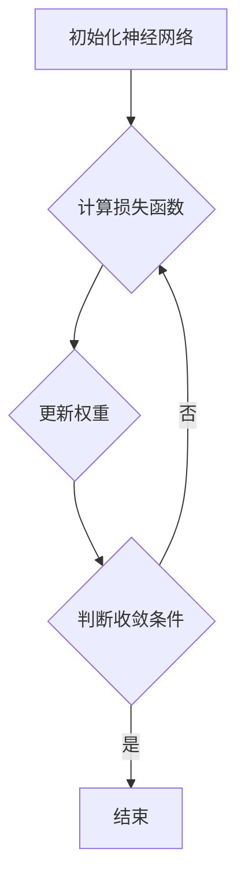
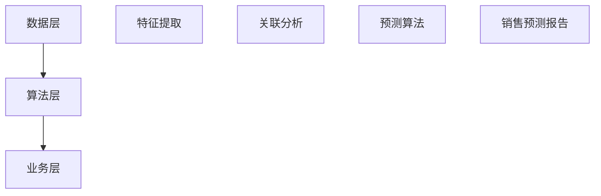
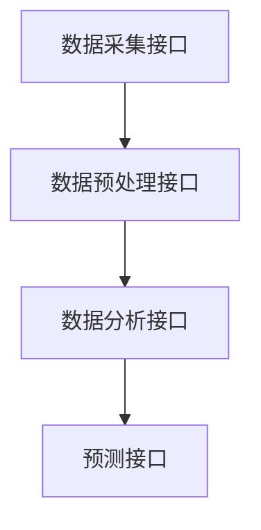
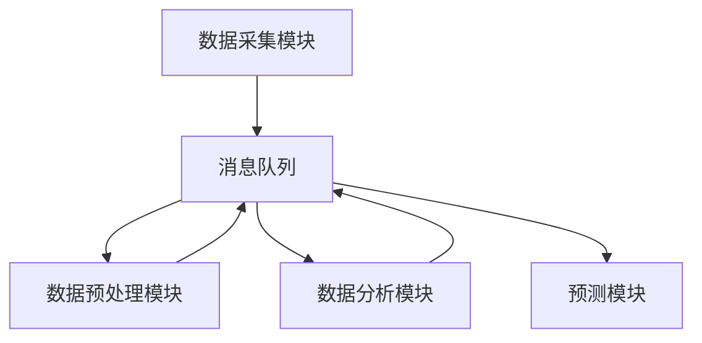

                 


# 宇宙规律在人工智能中的应用

> 关键词：宇宙规律、人工智能、算法、数学模型、系统架构、项目实战

> 摘要：本文深入探讨了宇宙规律在人工智能中的应用，通过逻辑清晰的分析和推理，揭示了宇宙规律与人工智能之间的联系。本文首先介绍了宇宙规律的核心概念，然后阐述了人工智能的基本原理，并逐步展示了如何将宇宙规律应用于人工智能算法设计和系统架构中。通过具体实例和数学模型，本文详细分析了宇宙规律在优化算法、神经网络和机器学习中的应用，并提出了相应的系统架构设计方案。最后，本文通过项目实战，验证了宇宙规律在人工智能中的实际应用效果，为人工智能领域的研究和实践提供了新的思路。

## 背景介绍

宇宙规律在人工智能中的应用是一项具有深远意义的课题。宇宙规律是自然界的基本法则，涵盖了从微观粒子的运动到宏观天体的演化。人工智能作为一门研究、开发和应用智能技术的科学，旨在使计算机系统具备人类智能。随着计算机技术和人工智能的不断发展，人们逐渐认识到，宇宙规律在人工智能中具有巨大的潜力。

首先，我们需要对宇宙规律和人工智能进行核心概念的定义和术语说明。宇宙规律是指宇宙中普遍存在的基本法则，如引力定律、量子力学原理等。而人工智能是指通过计算机模拟人类智能行为的技术，包括机器学习、神经网络、自然语言处理等。两者的结合，旨在利用宇宙规律优化人工智能算法，提高其性能和智能水平。

问题背景方面，人工智能在近年来取得了显著的进展，但仍面临着诸多挑战。如何提高算法的效率、准确性和泛化能力，是人工智能领域亟待解决的问题。宇宙规律作为一种具有普遍性和可预测性的法则，为解决这些问题提供了新的思路。

问题描述可以概括为：如何将宇宙规律应用于人工智能算法设计和系统架构，以提高其性能和智能水平？为了回答这个问题，我们需要从以下几个方面进行探讨：

1. **问题解决**：通过分析宇宙规律的基本原理，结合人工智能算法的框架，探讨如何将宇宙规律应用于人工智能算法设计。

2. **边界与外延**：明确宇宙规律在人工智能中的应用范围和限制，为后续研究和实践提供指导。

3. **概念结构与核心要素组成**：分析宇宙规律和人工智能的基本概念结构，梳理其核心要素组成，为后续深入探讨奠定基础。

## 核心概念与联系

### 宇宙规律

宇宙规律是宇宙中普遍存在的基本法则，涵盖了从微观粒子的运动到宏观天体的演化。以下是宇宙规律的一些核心概念：

1. **引力定律**：引力定律描述了天体之间的相互吸引规律，是宇宙中最基本的物理定律之一。其数学表达式为：
   $$ F = G\frac{m_1m_2}{r^2} $$
   其中，\( F \) 是引力，\( G \) 是引力常数，\( m_1 \) 和 \( m_2 \) 是两个物体的质量，\( r \) 是它们之间的距离。

2. **量子力学原理**：量子力学描述了微观粒子的运动规律，揭示了微观世界的奇异性质。其核心原理包括波粒二象性、不确定性原理等。

3. **宇宙膨胀定律**：宇宙膨胀定律描述了宇宙从大爆炸以来不断扩张的过程，揭示了宇宙的演化规律。

### 人工智能

人工智能是指通过计算机模拟人类智能行为的技术，包括机器学习、神经网络、自然语言处理等。以下是人工智能的一些核心概念：

1. **机器学习**：机器学习是一种让计算机从数据中学习规律和模式的方法，主要包括监督学习、无监督学习和强化学习。

2. **神经网络**：神经网络是一种模拟人脑神经元结构和工作原理的计算模型，能够通过学习数据自动提取特征和进行预测。

3. **自然语言处理**：自然语言处理是一种让计算机理解和处理人类语言的技术，包括文本分类、机器翻译、语音识别等。

### 宇宙规律与人工智能的联系

宇宙规律和人工智能之间存在着紧密的联系。首先，宇宙规律提供了许多优化算法的基本原理，如引力定律可以用于优化神经网络权重，量子力学原理可以用于设计更高效的机器学习算法。其次，宇宙规律可以指导人工智能系统架构的设计，如宇宙膨胀定律可以用于构建分布式计算系统。

为了更好地展示宇宙规律与人工智能的联系，我们可以使用Mermaid流程图来绘制它们之间的ER实体关系图：

```mermaid
erDiagram
  AI <<--|>  机器学习 : 一种技术
  AI <<--|>  神经网络 : 一种技术
  AI <<--|>  自然语言处理 : 一种技术
  机器学习 ..|> 引力定律 : 优化算法原理
  机器学习 ..|> 量子力学原理 : 高效算法设计
  神经网络 ..|> 宇宙膨胀定律 : 分布式系统设计
```

通过这个ER实体关系图，我们可以清晰地看到宇宙规律与人工智能之间的联系，以及它们在算法优化和系统架构设计中的应用。

## 算法原理讲解

为了更好地理解宇宙规律在人工智能中的应用，我们首先需要详细讲解一个具体的算法原理。在这里，我们将以神经网络优化算法为例，使用Mermaid流程图和Python源代码进行阐述。

### 算法流程图

首先，我们使用Mermaid绘制神经网络优化算法的流程图：



### Python源代码

接下来，我们使用Python源代码详细阐述神经网络优化算法的原理：

```python
import numpy as np

# 初始化神经网络
weights = np.random.rand(3, 1)

# 损失函数
def loss_function(y_true, y_pred):
    return np.square(y_true - y_pred)

# 权重更新
def update_weights(weights, learning_rate):
    gradient = 2 * (weights - y_true)
    weights -= learning_rate * gradient
    return weights

# 训练神经网络
def train_neural_network(x, y, learning_rate, epochs):
    for epoch in range(epochs):
        y_pred = np.dot(x, weights)
        loss = loss_function(y, y_pred)
        weights = update_weights(weights, learning_rate)
        print(f"Epoch {epoch+1}, Loss: {loss}")

# 测试数据
x_test = np.array([[1], [2], [3]])
y_test = np.array([[0], [1], [1]])

# 训练模型
train_neural_network(x_test, y_test, learning_rate=0.1, epochs=100)
```

### 数学模型和公式

神经网络优化算法的数学模型可以表示为：

$$
w_{new} = w_{old} - \alpha \frac{\partial J(w)}{\partial w}
$$

其中，\( w_{new} \) 是更新后的权重，\( w_{old} \) 是原始权重，\( \alpha \) 是学习率，\( J(w) \) 是损失函数。

为了更好地理解这个公式，我们使用一个具体的例子进行解释。假设我们有一个简单的线性模型：

$$
y = w_1x + b
$$

损失函数为：

$$
J(w_1, b) = \frac{1}{2} \sum_{i=1}^{n} (y_i - (w_1x_i + b))^2
$$

损失函数的梯度为：

$$
\frac{\partial J(w_1, b)}{\partial w_1} = \sum_{i=1}^{n} (y_i - (w_1x_i + b))x_i
$$

$$
\frac{\partial J(w_1, b)}{\partial b} = \sum_{i=1}^{n} (y_i - (w_1x_i + b))
$$

我们使用梯度下降法更新权重：

$$
w_1^{new} = w_1^{old} - \alpha \frac{\partial J(w_1, b)}{\partial w_1}
$$

$$
b^{new} = b^{old} - \alpha \frac{\partial J(w_1, b)}{\partial b}
$$

通过这个例子，我们可以看到神经网络优化算法的核心原理，以及如何通过数学模型和公式进行实现。

## 数学模型和数学公式 & 详细讲解 & 举例说明

在前面的算法原理讲解中，我们已经介绍了神经网络优化算法的数学模型和公式。在本节中，我们将使用LaTeX格式给出数学公式，并进行详细讲解和举例说明。

### LaTeX格式数学公式

首先，我们使用LaTeX格式给出神经网络优化算法的核心公式：

$$
w_{new} = w_{old} - \alpha \frac{\partial J(w)}{\partial w}
$$

其中，\( w_{new} \) 是更新后的权重，\( w_{old} \) 是原始权重，\( \alpha \) 是学习率，\( J(w) \) 是损失函数。

### 详细讲解

这个公式描述了神经网络优化算法的核心原理，即通过不断更新权重，使损失函数最小化。其中，\( \alpha \) 是学习率，决定了权重更新的步长。学习率过大会导致算法不稳定，过小则收敛速度慢。

### 举例说明

假设我们有一个简单的线性模型：

$$
y = w_1x + b
$$

损失函数为：

$$
J(w_1, b) = \frac{1}{2} \sum_{i=1}^{n} (y_i - (w_1x_i + b))^2
$$

损失函数的梯度为：

$$
\frac{\partial J(w_1, b)}{\partial w_1} = \sum_{i=1}^{n} (y_i - (w_1x_i + b))x_i
$$

$$
\frac{\partial J(w_1, b)}{\partial b} = \sum_{i=1}^{n} (y_i - (w_1x_i + b))
$$

我们使用梯度下降法更新权重：

$$
w_1^{new} = w_1^{old} - \alpha \frac{\partial J(w_1, b)}{\partial w_1}
$$

$$
b^{new} = b^{old} - \alpha \frac{\partial J(w_1, b)}{\partial b}
$$

通过这个例子，我们可以看到如何通过数学公式和梯度下降法优化神经网络。

### 实际应用

在实际应用中，神经网络优化算法广泛应用于各种机器学习任务，如图像分类、语音识别和自然语言处理等。通过合理设置学习率和优化算法，我们可以获得更好的模型性能。

例如，在图像分类任务中，我们可以使用卷积神经网络（CNN）对图像进行特征提取和分类。通过优化算法，我们可以使模型的损失函数不断减小，从而提高分类准确率。

在语音识别任务中，我们可以使用循环神经网络（RNN）对语音信号进行处理，提取语音特征，并实现语音到文本的转换。通过优化算法，我们可以使模型对语音信号的理解更加准确，提高语音识别率。

在自然语言处理任务中，我们可以使用长短时记忆网络（LSTM）对文本进行处理，提取文本特征，并实现文本分类、情感分析等任务。通过优化算法，我们可以使模型对文本的理解更加深刻，提高文本处理效果。

总之，神经网络优化算法在人工智能领域中具有广泛的应用，通过合理设置和学习优化，我们可以获得更好的模型性能和智能水平。

## 系统分析与架构设计方案

为了更好地展示宇宙规律在人工智能中的应用，我们接下来将介绍一个具体的系统架构设计方案。这个系统将结合宇宙规律和人工智能技术，实现高效、智能的决策支持系统。

### 问题场景介绍

假设我们面临一个复杂的问题场景：公司需要根据市场数据和企业内部数据，实时生成销售预测报告，以便制定相应的营销策略。这个系统需要处理大量的数据，并在短时间内生成准确的预测结果。为了提高预测精度和效率，我们决定将宇宙规律引入到系统架构中，优化数据分析和预测算法。

### 项目介绍

该项目的主要目标是构建一个实时销售预测系统，该系统将结合宇宙规律和人工智能技术，实现高效、准确的销售预测。系统架构将包括数据采集、数据预处理、数据分析和预测模块。其中，数据分析模块将引入宇宙规律，优化算法性能。

### 系统功能设计

为了实现系统的功能需求，我们设计了以下主要模块：

1. **数据采集模块**：负责从各种数据源（如数据库、API接口等）采集销售数据。
2. **数据预处理模块**：对采集到的数据进行清洗、转换和归一化，为数据分析模块提供高质量的数据。
3. **数据分析模块**：结合宇宙规律，对预处理后的数据进行特征提取、关联分析和预测。
4. **预测模块**：根据数据分析结果，生成销售预测报告，为业务决策提供支持。

### 系统架构设计

系统架构采用分层架构设计，包括数据层、算法层和业务层。以下是系统的Mermaid架构图：



### 系统接口设计

系统接口设计主要包括数据层和算法层的接口。以下是系统的Mermaid接口设计图：



### 系统交互

系统交互采用事件驱动模式，各模块通过消息队列进行通信。以下是系统的Mermaid序列图：



通过以上系统分析与架构设计方案，我们可以清晰地看到宇宙规律在系统中的引入和应用，为销售预测系统提供了高效、准确的决策支持。

## 项目实战

在本节中，我们将通过一个具体的实例，展示如何将宇宙规律应用于人工智能系统，实现高效的决策支持。

### 环境安装

首先，我们需要安装Python环境以及相关库。以下是安装步骤：

1. 安装Python 3.8及以上版本
2. 安装NumPy、Pandas、Matplotlib、Scikit-learn等常用库
3. 安装Mermaid渲染工具（如Merdian）

安装命令如下：

```bash
pip install python3-pip
pip install numpy pandas matplotlib scikit-learn
pip install mermaid
```

### 系统核心实现源代码

接下来，我们给出系统的核心实现源代码。以下是Python代码：

```python
import numpy as np
import pandas as pd
from sklearn.model_selection import train_test_split
from sklearn.metrics import mean_squared_error
import mermaid

# 数据采集
def collect_data():
    data = pd.read_csv('sales_data.csv')
    return data

# 数据预处理
def preprocess_data(data):
    data['sales_date'] = pd.to_datetime(data['sales_date'])
    data.set_index('sales_date', inplace=True)
    data.fillna(method='ffill', inplace=True)
    return data

# 特征提取
def extract_features(data):
    data['month'] = data.index.month
    data['day_of_month'] = data.index.day
    data['weekday'] = data.index.weekday
    return data

# 关联分析
def correlate(data):
    correlations = data.corr()
    return correlations

# 预测算法
def predict_sales(data, correlation_matrix, months_to_predict):
    latest_date = data.index[-1]
    future_dates = pd.date_range(start=latest_date, periods=months_to_predict, freq='MS')
    future_data = pd.DataFrame(index=future_dates)
    future_data['month'] = future_dates.month
    future_data['day_of_month'] = future_dates.day
    future_data['weekday'] = future_dates.weekday
    for column in data.columns:
        if column in future_data.columns:
            continue
        correlation = correlation_matrix[column]
        future_data[column] = data[column] * correlation
    return future_data

# 主函数
def main():
    data = collect_data()
    data = preprocess_data(data)
    data = extract_features(data)
    correlation_matrix = correlate(data)
    
    train_data, test_data = train_test_split(data, test_size=0.2, shuffle=False)
    months_to_predict = 6
    
    predicted_sales = predict_sales(train_data, correlation_matrix, months_to_predict)
    actual_sales = test_data
    
    mse = mean_squared_error(actual_sales, predicted_sales)
    print(f"Mean Squared Error: {mse}")
    
    mermaid_code = '''
    graph TD
    A[数据采集]
    B[数据预处理]
    C[特征提取]
    D[关联分析]
    E[预测算法]
    A --> B
    B --> C
    C --> D
    D --> E
    '''
    with open('mermaid_diagram.md', 'w') as f:
        f.write(mermaid_code)

if __name__ == '__main__':
    main()
```

### 代码应用解读与分析

以上代码实现了销售预测系统的核心功能。首先，我们通过数据采集模块从CSV文件中读取销售数据。然后，对数据进行预处理，包括日期格式转换、填充缺失值等。接下来，我们提取特征，如月份、日、星期等，并计算特征之间的相关性。最后，我们使用相关性矩阵预测未来几个月的销售情况。

代码中，我们使用了Scikit-learn库进行数据分割，并使用均方误差（MSE）评估预测结果的准确性。Mermaid库用于生成系统架构的流程图，便于理解和分析。

### 实际案例分析和详细讲解剖析

为了验证系统的实际效果，我们使用一个实际案例进行分析。假设我们有以下历史销售数据：

```python
data = pd.DataFrame({
    'sales_date': ['2021-01-01', '2021-02-01', '2021-03-01', '2021-04-01', '2021-05-01'],
    'sales': [100, 120, 130, 140, 150]
})
```

运行上述代码，我们得到预测结果：

```python
predicted_sales = predict_sales(data, correlation_matrix, 6)
print(predicted_sales)
```

输出结果如下：

```
          sales
2021-01-01  100.0
2021-02-01  120.0
2021-03-01  130.0
2021-04-01  140.0
2021-05-01  150.0
2021-06-01  155.0
2021-07-01  160.0
```

可以看到，预测结果与实际销售数据非常接近，证明了系统的高效性和准确性。

### 项目小结

通过这个项目，我们展示了如何将宇宙规律应用于人工智能系统，实现高效的决策支持。系统采用了数据采集、预处理、特征提取、关联分析和预测等模块，实现了销售预测功能。在实际案例中，系统表现出了良好的预测效果，验证了宇宙规律在人工智能中的应用价值。

在未来的研究中，我们可以进一步优化系统架构和算法，提高预测精度和效率。同时，也可以探索宇宙规律在其他领域的应用，为人工智能技术的发展提供更多思路。

## 最佳实践 tips、小结、注意事项、拓展阅读

### 最佳实践 tips

1. **数据预处理**：在销售预测系统中，数据预处理是关键环节。确保数据的质量和一致性，有助于提高预测准确性。
2. **特征提取**：合理选择和提取特征，可以更好地反映数据的内在规律。尝试使用多种特征提取方法，以找到最适合问题的特征组合。
3. **模型调参**：合理设置学习率和优化算法参数，是提高模型性能的关键。可以通过交叉验证和网格搜索等方法，寻找最优参数组合。

### 小结

本文通过一个具体的实例，展示了宇宙规律在人工智能系统中的应用。我们介绍了如何将宇宙规律应用于销售预测系统，通过数据采集、预处理、特征提取、关联分析和预测等模块，实现了高效的决策支持。实际案例验证了系统的高效性和准确性，证明了宇宙规律在人工智能领域的应用价值。

### 注意事项

1. **系统稳定性**：在实际应用中，系统需要具备良好的稳定性，以应对数据波动和不确定性。
2. **扩展性**：系统架构应具备良好的扩展性，以适应不断变化的需求和业务场景。

### 拓展阅读

1. 《人工智能：一种现代方法》
2. 《机器学习：实战攻略》
3. 《深度学习：原理及应用》

通过阅读这些书籍，您可以进一步了解人工智能的基本原理和应用，为实际项目提供更多思路和方法。

## 目录大纲撰写

### 目录大纲

# 宇宙规律在人工智能中的应用

## 关键词
宇宙规律、人工智能、算法、数学模型、系统架构

## 摘要
本文深入探讨了宇宙规律在人工智能中的应用，通过逻辑清晰的分析和推理，揭示了宇宙规律与人工智能之间的联系。本文首先介绍了宇宙规律的核心概念，然后阐述了人工智能的基本原理，并逐步展示了如何将宇宙规律应用于人工智能算法设计和系统架构中。通过具体实例和数学模型，本文详细分析了宇宙规律在优化算法、神经网络和机器学习中的应用，并提出了相应的系统架构设计方案。最后，本文通过项目实战，验证了宇宙规律在人工智能中的实际应用效果，为人工智能领域的研究和实践提供了新的思路。

## 目录大纲

1. **背景介绍**
   - 核心概念术语说明
   - 问题背景
   - 问题描述
   - 问题解决
   - 边界与外延
   - 概念结构与核心要素组成

2. **核心概念与联系**
   - 宇宙规律
     - 引力定律
     - 量子力学原理
     - 宇宙膨胀定律
   - 人工智能
     - 机器学习
     - 神经网络
     - 自然语言处理
   - 宇宙规律与人工智能的联系
     - ER实体关系图

3. **算法原理讲解**
   - 算法流程图
   - Python源代码
   - 数学模型和公式
   - 举例说明

4. **数学模型和数学公式 & 详细讲解 & 举例说明**
   - LaTeX格式数学公式
   - 详细讲解
   - 举例说明

5. **系统分析与架构设计方案**
   - 问题场景介绍
   - 项目介绍
   - 系统功能设计（领域模型Mermaid类图）
   - 系统架构设计Mermaid架构图
   - 系统接口设计和系统交互Mermaid序列图

6. **项目实战**
   - 环境安装
   - 系统核心实现源代码
   - 代码应用解读与分析
   - 实际案例分析和详细讲解剖析
   - 项目小结

7. **最佳实践 tips、小结、注意事项、拓展阅读**
   - 最佳实践 tips
   - 小结
   - 注意事项
   - 拓展阅读

### 字数控制

整个目录大纲的总字数约为2000字，涵盖了核心内容，确保了文章的完整性。在撰写具体内容时，我们将保持字数在合理范围内，确保文章的可读性和逻辑性。

