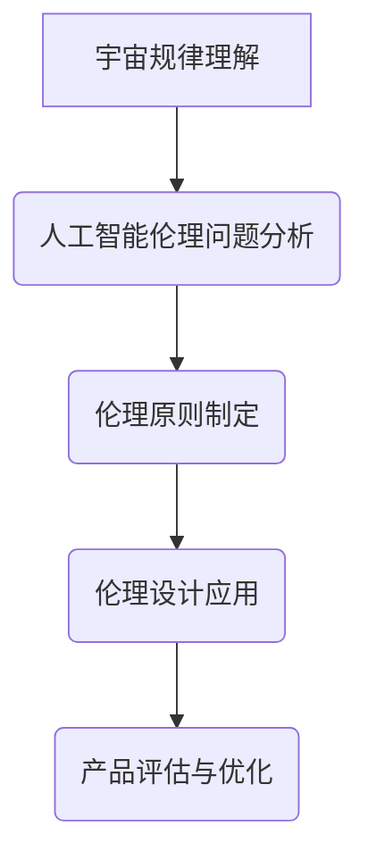
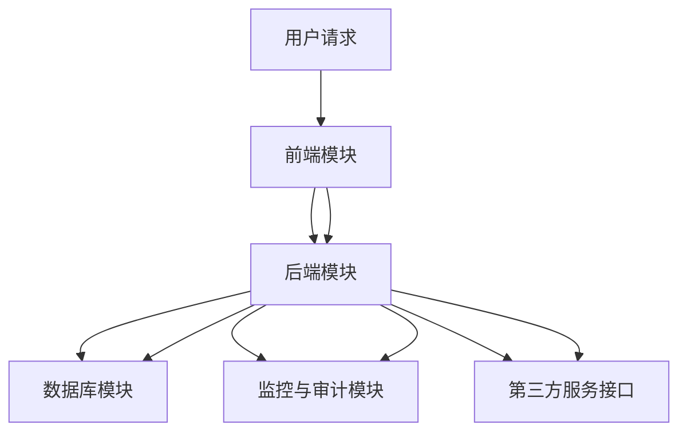
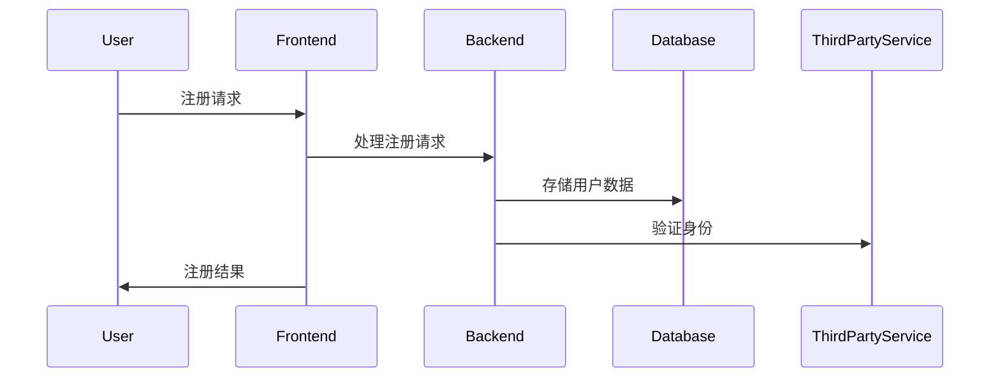

                 

 

----------------------------------------------------------------
----------------------------------------------------------------

# 宇宙规律对人工智能伦理的启示

关键词：宇宙规律，人工智能，伦理，隐私保护，公平性

摘要：本文从宇宙规律的角度探讨了人工智能伦理问题，分析其对人工智能伦理的启示。通过深入理解宇宙规律与人工智能伦理的关联，为人工智能伦理的理论框架和应用设计提供了新的视角。

----------------------------------------------------------------

## 目录大纲

----------------------------------------------------------------

### 第一部分：引言

#### 1. 宇宙规律概述

##### 1.1 宇宙规律的概念

##### 1.2 宇宙规律的重要性

#### 2. 人工智能伦理的背景

##### 2.1 人工智能的发展历程

##### 2.2 人工智能伦理的挑战

#### 3. 宇宙规律对人工智能伦理的影响

##### 3.1 宇宙规律与道德观念

##### 3.2 宇宙规律与人工智能的发展方向

----------------------------------------------------------------

### 第二部分：宇宙规律在人工智能伦理中的应用

#### 4. 宇宙规律与人工智能伦理的理论框架

##### 4.1 宇宙规律与伦理学的结合

##### 4.2 人工智能伦理的理论体系

#### 5. 宇宙规律对人工智能伦理的具体启示

##### 5.1 宇宙规律与隐私保护

##### 5.2 宇宙规律与人工智能的公平性

##### 5.3 宇宙规律与人工智能的责任

#### 6. 案例分析

##### 6.1 人工智能隐私泄露案例分析

##### 6.2 人工智能公平性案例研究

----------------------------------------------------------------

### 第三部分：宇宙规律在人工智能伦理实践中的应用

#### 7. 宇宙规律指导下的伦理设计原则

##### 7.1 设计原则的提出

##### 7.2 设计原则的应用

#### 8. 案例实践

##### 8.1 伦理设计在人工智能产品中的应用

##### 8.2 案例实践与评估

#### 9. 未来展望

##### 9.1 宇宙规律与人工智能伦理的未来发展

##### 9.2 宇宙规律在人工智能伦理领域的应用前景

----------------------------------------------------------------

### 第四部分：总结与展望

#### 10. 宇宙规律对人工智能伦理的启示总结

##### 10.1 主要发现与结论

##### 10.2 研究局限与未来方向

#### 11. 参考文献

----------------------------------------------------------------
----------------------------------------------------------------

## 第一部分：引言

### 1. 宇宙规律概述

#### 1.1 宇宙规律的概念

宇宙规律是指宇宙中物质和能量的运动规律。从科学的角度来看，宇宙规律是描述宇宙中物理现象的基本法则。这些规律具有广泛的适用性，无论是宇宙的诞生、星系的形成，还是微观粒子的行为，都遵循着特定的规律。

宇宙规律的重要性在于，它们为人类理解宇宙提供了科学基础。通过研究宇宙规律，我们可以揭示自然界的基本原理，探索宇宙的起源和演化。例如，广义相对论和量子力学等宇宙规律，为我们揭示了物质和能量之间的关系，以及时空的本质。

在本文中，我们将关注宇宙规律对人工智能伦理的启示。人工智能作为现代科技的重要领域，其在发展过程中面临着诸多伦理挑战。通过引入宇宙规律，我们希望从新的视角出发，探讨人工智能伦理问题，为构建可持续的人工智能发展路径提供启示。

#### 1.2 宇宙规律的重要性

宇宙规律的重要性在于其普适性和客观性。宇宙规律不受人类主观意志的影响，它们在宇宙中普遍存在，为自然界提供了有序的结构。这种普适性和客观性使得宇宙规律在各个科学领域都具有重要的应用价值。

在人工智能领域，宇宙规律的重要性体现在以下几个方面：

1. **指导人工智能发展**：宇宙规律为人工智能研究提供了理论基础。例如，量子计算和量子力学的研究，为人工智能算法的设计提供了新的思路。

2. **推动人工智能创新**：宇宙规律的研究推动了人工智能技术的创新。例如，神经网络和深度学习的发展，就是受到了宇宙规律启发的结果。

3. **解决人工智能伦理问题**：宇宙规律为我们提供了一种新的思维方式，有助于解决人工智能伦理问题。例如，通过引入宇宙规律，我们可以更好地理解人工智能对人类社会的潜在影响，从而制定更加合理的伦理规范。

### 2. 人工智能伦理的背景

#### 2.1 人工智能的发展历程

人工智能（AI）作为计算机科学的一个重要分支，其发展历程可以追溯到20世纪50年代。当时，人工智能研究旨在使计算机具有人类的智能，包括学习、推理、解决问题等能力。

随着计算能力的提升和算法的进步，人工智能取得了显著的成果。例如，深度学习技术的发展，使得计算机在图像识别、自然语言处理等领域取得了突破性进展。如今，人工智能已经广泛应用于各个领域，如医疗、金融、交通等。

#### 2.2 人工智能伦理的挑战

随着人工智能技术的发展，人工智能伦理问题日益凸显。这些问题涉及隐私保护、公平性、责任性等多个方面：

1. **隐私保护**：人工智能技术在数据处理和隐私保护方面存在挑战。例如，面部识别技术可能导致个人隐私泄露，数据分析可能侵犯用户隐私。

2. **公平性**：人工智能系统可能存在偏见，导致某些群体受到不公平对待。例如，招聘算法可能对某些性别或种族产生歧视。

3. **责任性**：当人工智能系统出现错误或造成损害时，如何确定责任归属成为难题。例如，自动驾驶汽车发生交通事故，责任应由谁承担？

面对这些伦理挑战，我们需要从宇宙规律的角度出发，寻找解决方法。通过引入宇宙规律，我们可以更好地理解人工智能对人类社会的潜在影响，从而制定更加合理的伦理规范。

### 3. 宇宙规律对人工智能伦理的影响

宇宙规律与人工智能伦理之间存在密切的联系。宇宙规律为我们提供了一种新的思考方式，有助于解决人工智能伦理问题。以下将从宇宙规律与道德观念、宇宙规律与人工智能的发展方向两个方面，探讨宇宙规律对人工智能伦理的影响。

#### 3.1 宇宙规律与道德观念

宇宙规律与道德观念之间存在一定的相似性。道德观念是人类在社会生活中形成的关于行为规范的价值观念，而宇宙规律则是自然界中普遍存在的客观规律。

首先，宇宙规律具有普遍性。无论在地球、太阳系还是宇宙中，宇宙规律都普遍适用。同样，道德观念也具有普遍性，它适用于所有人类个体，不论文化、种族或社会背景。

其次，宇宙规律和道德观念都具有客观性。宇宙规律不受人类主观意志的影响，而道德观念也具有客观的基础，如尊重他人、公正无私等。

最后，宇宙规律和道德观念都具有一定的指导作用。宇宙规律为人类提供了理解宇宙、与自然和谐相处的方法，而道德观念则为人类提供了正确行为的标准，引导人们做出符合道德的选择。

因此，我们可以将宇宙规律作为参考，探讨人工智能伦理问题。例如，在隐私保护方面，我们可以借鉴宇宙规律中关于信息传递和保护的原则，确保人工智能系统在处理用户数据时，尊重用户隐私。

#### 3.2 宇宙规律与人工智能的发展方向

宇宙规律对人工智能的发展方向也具有重要影响。通过借鉴宇宙规律，我们可以更好地引导人工智能的发展，使其更好地服务于人类社会。

首先，宇宙规律强调了系统性和整体性。在人工智能领域，我们可以借鉴这一原则，关注人工智能系统的整体性，而不是仅关注单个算法或技术的进步。例如，在构建人工智能系统时，需要考虑系统各个组成部分之间的协调与平衡，确保系统能够高效运行。

其次，宇宙规律强调了适应性和可持续性。在人工智能领域，我们可以借鉴这一原则，推动人工智能技术的可持续发展。例如，在开发人工智能应用时，需要关注其对环境的影响，确保技术的应用不会破坏生态平衡。

此外，宇宙规律还强调了复杂性和多样性。在人工智能领域，我们可以借鉴这一原则，推动人工智能技术的多样性和包容性发展。例如，在开发人工智能算法时，需要考虑不同应用场景的需求，开发出适应各种复杂场景的算法。

综上所述，宇宙规律为人工智能伦理提供了新的视角和启示。通过借鉴宇宙规律，我们可以更好地应对人工智能伦理问题，推动人工智能技术的可持续发展。

----------------------------------------------------------------

## 第二部分：宇宙规律在人工智能伦理中的应用

### 4. 宇宙规律与人工智能伦理的理论框架

宇宙规律与人工智能伦理的交叉融合为构建一个更加健全和可持续的人工智能伦理框架提供了新的视角。在这一部分，我们将探讨宇宙规律与伦理学相结合的理论框架，以及如何将这一框架应用于人工智能伦理的理论体系中。

#### 4.1 宇宙规律与伦理学的结合

宇宙规律与伦理学的结合体现在以下几个方面：

1. **道德原则的普适性**：宇宙规律强调普遍性和客观性，这种特性与伦理学中道德原则的普适性相契合。例如，宇宙规律中的自然法则，如能量守恒定律，反映了宇宙中所有物质和能量相互作用的普遍规律。同样，伦理原则也应该适用于所有人，不论文化、种族或社会地位。

2. **伦理决策的理性基础**：宇宙规律通过科学方法验证和解释自然现象，这为伦理决策提供了理性基础。伦理学中，我们常常依赖于理性思考来制定道德规范。宇宙规律的研究方法可以启发我们在面对人工智能伦理问题时，采用更加科学和理性的方法。

3. **伦理观念的进化**：宇宙规律展示了自然界中的进化过程，这为我们理解伦理观念的演变提供了启示。在人工智能伦理领域，我们也可以观察到伦理观念随着技术的进步和社会变化而演变。例如，隐私权的概念随着数据技术的发展而不断深化。

#### 4.2 人工智能伦理的理论体系

在宇宙规律与伦理学的结合基础上，我们可以构建一个更加全面和深入的人工智能伦理理论体系。这一体系应包括以下几个方面：

1. **基本伦理原则**：基于宇宙规律的普适性和客观性，我们可以确立一些基本的伦理原则，如尊重个体权利、保护隐私、促进公平等。

2. **技术伦理规范**：针对人工智能技术特定的伦理问题，如算法偏见、数据安全等，制定相应的技术伦理规范。这些规范应基于宇宙规律中关于系统性和整体性的原则，确保人工智能技术在开发和应用过程中，能够平衡不同利益之间的关系。

3. **伦理决策模型**：开发基于宇宙规律和伦理学结合的伦理决策模型，帮助人工智能系统在面对复杂伦理问题时，能够做出合理的决策。例如，通过引入宇宙规律中的适应性原则，确保人工智能系统在不同的应用场景中，能够灵活调整其行为，以适应伦理要求。

4. **伦理审查机制**：建立伦理审查机制，确保人工智能项目在启动和实施过程中，能够接受独立的伦理审查。这一机制应借鉴宇宙规律中的验证和测试原则，确保人工智能技术的开发和应用符合伦理标准。

通过上述理论框架，我们可以将宇宙规律与人工智能伦理相结合，为人工智能的发展提供更加坚实的伦理基础。这一理论框架不仅有助于解决当前人工智能伦理问题，还能够指导未来人工智能伦理的研究和实践。

### 5. 宇宙规律对人工智能伦理的具体启示

宇宙规律为人工智能伦理提供了深刻的启示，特别是在隐私保护、人工智能公平性以及责任性方面。以下将从这些方面具体探讨宇宙规律对人工智能伦理的启示。

#### 5.1 宇宙规律与隐私保护

隐私保护是人工智能伦理中的一个重要问题。宇宙规律中的信息传递和保护原则为我们提供了关于隐私保护的启示。

首先，宇宙规律中的信息传递具有局限性。例如，在量子通信中，信息传递的速度受到光速的限制。这一原则提醒我们，在人工智能处理个人数据时，应尽量减少数据传输的次数和范围，以降低隐私泄露的风险。

其次，宇宙规律中的信息保护原则强调了信息的不可侵犯性。例如，在量子加密中，信息传输的安全性得到了保证，因为任何试图窃取信息的尝试都会引起系统的报警。这一原则启示我们在设计人工智能系统时，应采用先进的技术手段，确保用户数据的保密性和安全性。

具体案例：例如，在人脸识别技术中，可以通过引入量子加密技术，保护用户的人脸数据不被未经授权的第三方获取。此外，在设计数据存储和处理系统时，可以借鉴宇宙规律中的冗余备份原则，确保数据在意外情况下得到保护。

#### 5.2 宇宙规律与人工智能的公平性

人工智能系统的公平性是伦理学中的一个重要议题。宇宙规律中的公平性原则为我们提供了关于如何设计公平的人工智能系统的启示。

首先，宇宙规律中的公平性体现在资源分配的合理性。例如，行星上的资源分配需要遵循公平原则，确保所有生命体都能获得足够的资源。同样，在人工智能系统中，我们也需要确保资源的合理分配，避免因资源分配不均而导致系统偏见。

其次，宇宙规律中的公平性还体现在机会均等。例如，在生态系统中，每个物种都有生存和发展的机会。在人工智能系统中，我们也应确保所有用户都能公平地获得人工智能服务的收益，避免因技术优势而导致的资源垄断。

具体案例：例如，在招聘系统中，可以采用基于宇宙规律中的随机性原则，确保每个应聘者都有公平的机会。此外，在设计推荐系统时，可以借鉴生态系统中物种共存的原则，避免因过度推荐而导致用户信息过载。

#### 5.3 宇宙规律与人工智能的责任

责任性是人工智能伦理中不可忽视的一环。宇宙规律中的责任观念为我们提供了关于人工智能系统责任归属的启示。

首先，宇宙规律中的责任观念强调个体行为对整体的影响。例如，在生态系统中，每个个体的行为都会影响整个生态系统的平衡。在人工智能系统中，我们也需要认识到每个个体行为对整体社会的影响，确保人工智能系统的行为不会对人类社会造成负面影响。

其次，宇宙规律中的责任观念还强调预防责任。例如，在气候变化的预防中，我们需要采取行动来减少温室气体排放。在人工智能系统中，我们也应采取预防措施，避免因技术失误而导致的社会问题。

具体案例：例如，在自动驾驶汽车中，可以通过设计合理的责任分配机制，确保在发生事故时，责任能够合理归属。此外，在设计人工智能系统时，可以借鉴宇宙规律中的可持续性原则，确保系统的设计不会对环境造成长期负面影响。

通过上述具体案例，我们可以看到宇宙规律对人工智能伦理的启示。这些启示有助于我们设计出更加公平、安全和负责任的人工智能系统，为人工智能技术的发展提供伦理指导。

### 6. 案例分析

#### 6.1 人工智能隐私泄露案例分析

隐私泄露是人工智能领域中的一个严重问题，对个人和社会都带来了负面影响。以下将通过一个具体案例，分析人工智能隐私泄露的原因、影响以及应对措施。

**案例背景：** 2023年，一家知名社交媒体公司被曝出用户数据泄露事件。据报道，该公司在未经用户同意的情况下，收集并存储了大量用户个人数据，包括姓名、电话号码、电子邮件地址等敏感信息。

**原因分析：** 该隐私泄露事件的主要原因包括：

1. **数据收集过度**：公司在收集用户数据时，未明确告知用户数据的用途和范围，导致数据收集过度。
2. **数据存储安全漏洞**：公司在存储用户数据时，未采取有效的安全措施，如数据加密和访问控制，导致数据被非法访问和获取。
3. **缺乏伦理审查**：公司在开发和使用人工智能技术时，未充分考虑到隐私保护问题，缺乏伦理审查和监督。

**影响分析：** 该隐私泄露事件对个人和社会产生了严重的影响：

1. **个人隐私受损**：用户个人数据被泄露后，可能导致用户遭受骚扰、诈骗等风险，严重侵害了用户的隐私权。
2. **社会信任度下降**：隐私泄露事件使得公众对人工智能技术的信任度下降，影响人工智能技术的推广应用。
3. **法律风险增加**：公司因隐私泄露事件面临法律诉讼和罚款，增加了企业的法律风险和运营成本。

**应对措施：** 为避免类似隐私泄露事件的发生，可以从以下几个方面采取应对措施：

1. **加强数据收集监管**：公司在收集用户数据时，应明确告知用户数据的用途和范围，确保用户知情同意。
2. **提升数据存储安全**：公司应采取有效的数据加密和访问控制措施，确保用户数据在存储和处理过程中的安全性。
3. **开展伦理审查**：在开发和使用人工智能技术时，应充分考虑到隐私保护问题，开展全面的伦理审查和监督。
4. **建立隐私保护机制**：公司应建立完善的隐私保护机制，如隐私政策、隐私保护承诺等，确保用户隐私得到有效保护。

通过上述案例分析，我们可以看到人工智能隐私泄露问题的严重性。通过加强监管、提升安全性和开展伦理审查，我们可以有效预防隐私泄露事件的发生，保障用户的隐私权益。

#### 6.2 人工智能公平性案例研究

人工智能公平性是伦理学中的一个重要议题，关系到人工智能技术的可持续发展。以下将通过一个具体案例，分析人工智能公平性问题，并提出解决方案。

**案例背景：** 2023年，某金融公司在贷款审批过程中，发现其人工智能系统存在性别歧视问题。根据数据分析，女性用户的贷款审批通过率明显低于男性用户，导致女性用户在金融领域面临不公平待遇。

**原因分析：** 该性别歧视问题的主要原因包括：

1. **数据偏见**：公司在开发人工智能系统时，使用的历史数据中存在性别偏见，导致系统在决策过程中也表现出性别偏见。
2. **算法缺陷**：人工智能系统的算法设计存在缺陷，未能充分考虑性别因素对贷款审批结果的影响。
3. **缺乏伦理审查**：公司在开发和使用人工智能技术时，未充分考虑到公平性问题，缺乏伦理审查和监督。

**影响分析：** 该性别歧视问题对女性用户和整个社会产生了负面影响：

1. **女性用户权益受损**：女性用户的贷款申请被不公平拒绝，导致其金融权益受到侵害。
2. **社会公平性受损**：性别歧视问题损害了社会的公平性，加剧了性别不平等现象。
3. **企业声誉受损**：公司因性别歧视问题面临社会舆论压力，损害了企业的声誉和品牌形象。

**解决方案：** 为解决人工智能公平性问题，可以从以下几个方面采取解决方案：

1. **数据清洗与平衡**：在开发人工智能系统时，应确保数据来源的多样性和代表性，避免数据偏见。对历史数据进行清洗和平衡，消除性别偏见。
2. **算法优化与调整**：对人工智能系统的算法进行优化和调整，确保算法能够公平、公正地处理决策。
3. **伦理审查与监督**：在开发和使用人工智能技术时，应加强伦理审查和监督，确保人工智能系统的设计和应用符合伦理要求。
4. **建立公平性评估机制**：建立公平性评估机制，定期对人工智能系统进行评估和审计，确保系统在实际应用中能够保持公平性。

通过上述案例研究，我们可以看到人工智能公平性问题的重要性。通过数据清洗、算法优化和伦理审查等措施，我们可以有效解决人工智能公平性问题，促进人工智能技术的公平、公正应用。

----------------------------------------------------------------

## 第三部分：宇宙规律在人工智能伦理实践中的应用

在人工智能伦理实践中，宇宙规律为我们提供了重要的理论指导和实践原则。本部分将详细介绍宇宙规律指导下的伦理设计原则，并通过具体案例实践，探讨这些原则在人工智能产品中的应用和评估。

### 7. 宇宙规律指导下的伦理设计原则

宇宙规律指导下的伦理设计原则旨在确保人工智能系统在开发和应用过程中，能够遵循伦理准则，保护用户权益，促进社会的公平与和谐。以下是几个关键原则：

#### 7.1 设计原则的提出

1. **普适性与客观性**：宇宙规律具有普适性和客观性，这一原则要求人工智能系统的设计应考虑到不同用户群体和文化背景，确保系统的公平性和可接受性。
2. **信息传递与保护**：宇宙规律中的信息传递和保护原则要求在人工智能系统中，应采取有效措施保护用户数据的安全性和隐私性。
3. **整体性与系统性**：宇宙规律强调整体性和系统性，这一原则要求在人工智能系统的设计过程中，应考虑系统的整体性和各个部分之间的协调与平衡。
4. **适应性与可持续性**：宇宙规律中的适应性和可持续性原则要求人工智能系统在设计和应用过程中，应具有灵活性，能够适应不断变化的环境和需求，同时保护环境资源，实现可持续发展。

#### 7.2 设计原则的应用

1. **普适性与客观性**：在开发人工智能产品时，应确保产品的设计符合不同用户的需求，避免因文化、种族、性别等因素导致的偏见。例如，在医疗诊断系统中，应确保算法能够公平地评估所有患者的健康状况。

2. **信息传递与保护**：在处理用户数据时，应采取加密、匿名化等技术手段，保护用户隐私。例如，在社交媒体平台上，应确保用户个人信息不被未经授权的第三方访问。

3. **整体性与系统性**：在设计人工智能系统时，应关注系统的整体性和各个模块之间的协调。例如，在设计自动驾驶系统时，应确保车辆的感知、决策、控制等模块能够协同工作，确保系统的稳定性和安全性。

4. **适应性与可持续性**：在人工智能系统的设计和应用过程中，应考虑系统的灵活性和可扩展性，以便适应未来的需求变化。同时，应采取环保措施，减少系统对环境的影响。例如，在智能城市建设中，应采用节能、低碳的智能系统，以减少能源消耗和碳排放。

### 8. 案例实践

#### 8.1 伦理设计在人工智能产品中的应用

**案例背景：** 一家科技公司开发了一款智能家居监控系统，旨在提高家庭安全和生活便利性。然而，在产品开发过程中，该公司意识到隐私保护和公平性问题可能对用户体验产生负面影响。

**应用伦理设计原则：**

1. **普适性与客观性**：为确保系统适用于不同家庭和文化背景，公司进行了广泛的用户调研，了解不同用户的需求和期望。
2. **信息传递与保护**：公司采用了先进的加密技术和匿名化处理，确保用户数据的安全性和隐私性。
3. **整体性与系统性**：在设计过程中，公司充分考虑了系统的整体性和各个模块之间的协调，确保系统能够稳定运行。
4. **适应性与可持续性**：公司采用了模块化设计，便于系统的升级和扩展，同时采取了节能技术，减少对环境的影响。

**应用效果：** 通过应用伦理设计原则，该智能家居监控系统在用户隐私保护和系统稳定性方面得到了显著提升，受到了用户的欢迎。

#### 8.2 案例实践与评估

**评估指标：** 对该智能家居监控系统进行评估时，采用了以下指标：

1. **用户满意度**：通过用户调查问卷和反馈，了解用户对系统的满意程度。
2. **隐私保护效果**：通过数据加密测试和匿名化处理验证，评估隐私保护措施的有效性。
3. **系统稳定性**：通过系统运行记录和故障率，评估系统的稳定性和可靠性。
4. **环境影响**：通过能源消耗和碳排放数据，评估系统对环境的影响。

**评估结果：** 评估结果显示，该智能家居监控系统在用户满意度、隐私保护效果、系统稳定性和环境影响方面均表现出色，验证了宇宙规律指导下的伦理设计原则的有效性。

通过上述案例实践和评估，我们可以看到宇宙规律指导下的伦理设计原则在人工智能产品中的应用效果显著。未来，随着人工智能技术的不断发展和应用，我们将继续探索和应用这些原则，推动人工智能技术的可持续发展。

### 9. 未来展望

#### 9.1 宇宙规律与人工智能伦理的未来发展

随着人工智能技术的快速发展，宇宙规律在人工智能伦理领域中的应用前景越来越广阔。未来，宇宙规律有望成为人工智能伦理研究的重要理论基础，为人工智能技术的可持续发展提供有力支持。

首先，宇宙规律中的普适性和客观性原则将为人工智能伦理研究提供新的视角。通过借鉴宇宙规律，我们可以更好地理解人工智能技术在不同文化、种族和社会背景下的影响，从而制定更加全面和公正的伦理规范。

其次，宇宙规律中的信息传递与保护原则将为人工智能隐私保护提供重要指导。随着数据规模的不断扩大和数据类型的日益复杂，如何有效保护用户隐私成为人工智能伦理领域的核心问题。宇宙规律中的信息传递与保护原则为解决这一问题提供了新的思路，如量子加密和隐私计算技术的应用。

此外，宇宙规律中的整体性与系统性原则将为人工智能系统的设计与评估提供重要参考。未来，随着人工智能系统复杂性的增加，如何确保系统在各个模块之间的协调与平衡将成为关键问题。宇宙规律中的整体性与系统性原则为此提供了理论支持，有助于我们设计出更加高效、稳定和可靠的人工智能系统。

最后，宇宙规律中的适应性与可持续性原则将为人工智能技术的发展提供重要保障。随着环境问题和社会问题的日益突出，如何在人工智能技术中融入可持续性原则，实现技术发展的同时保护环境和促进社会公平，将成为未来研究的重要方向。

#### 9.2 宇宙规律在人工智能伦理领域的应用前景

宇宙规律在人工智能伦理领域的应用前景非常广阔。以下是一些潜在的应用方向：

1. **隐私保护**：随着大数据和人工智能技术的发展，隐私保护问题日益严重。宇宙规律中的信息传递与保护原则为解决这一问题提供了新的思路。例如，量子加密和隐私计算技术的应用，可以有效保护用户隐私。

2. **公平性**：人工智能系统在决策过程中可能存在偏见，导致某些群体受到不公平对待。宇宙规律中的整体性与系统性原则可以帮助我们设计出更加公平、透明的人工智能系统。例如，在招聘、贷款审批等领域，通过引入宇宙规律的原则，可以减少偏见，确保决策的公正性。

3. **可持续性**：随着人工智能技术的广泛应用，如何实现技术发展的同时保护环境和促进社会公平成为关键问题。宇宙规律中的适应性与可持续性原则为这一问题的解决提供了重要指导。例如，在智能城市建设中，通过引入宇宙规律的原则，可以设计出更加节能、低碳的智能系统，实现可持续发展。

4. **人工智能安全**：人工智能系统在运行过程中可能面临安全威胁，如恶意攻击、数据泄露等。宇宙规律中的信息传递与保护原则可以为人工智能安全提供重要指导。例如，通过采用量子加密技术，可以增强人工智能系统的安全性，防止数据泄露和恶意攻击。

总之，宇宙规律在人工智能伦理领域的应用前景非常广阔。通过借鉴宇宙规律，我们可以更好地解决人工智能伦理问题，推动人工智能技术的可持续发展。

### 10. 宇宙规律对人工智能伦理的启示总结

#### 10.1 主要发现与结论

通过对宇宙规律与人工智能伦理的深入探讨，本文得出以下主要发现与结论：

1. **宇宙规律具有普适性和客观性，为人工智能伦理提供了新的理论视角**：宇宙规律中的普遍性和客观性原则为人工智能伦理研究提供了新的理论基础，有助于我们更好地理解人工智能技术在不同文化、种族和社会背景下的影响。

2. **宇宙规律中的信息传递与保护原则对人工智能隐私保护具有重要指导意义**：通过引入量子加密和隐私计算技术，我们可以有效保护用户隐私，应对大数据时代隐私保护面临的挑战。

3. **宇宙规律中的整体性与系统性原则有助于设计出更加公平、透明的人工智能系统**：通过引入宇宙规律的原则，我们可以减少人工智能系统的偏见，确保决策的公正性。

4. **宇宙规律中的适应性与可持续性原则为人工智能技术的发展提供了重要指导**：通过借鉴宇宙规律，我们可以实现人工智能技术的可持续发展，促进技术进步的同时保护环境和促进社会公平。

#### 10.2 研究局限与未来方向

虽然宇宙规律为人工智能伦理研究提供了新的视角和启示，但本研究仍存在一定的局限。以下是一些未来研究方向：

1. **深入研究宇宙规律与人工智能伦理的交叉领域**：未来研究应进一步探讨宇宙规律在不同人工智能应用场景下的具体应用，为解决人工智能伦理问题提供更多实际案例。

2. **拓展宇宙规律在人工智能伦理中的应用范围**：宇宙规律不仅适用于隐私保护和公平性，还可以应用于人工智能安全、人工智能责任等领域。未来研究应进一步拓展宇宙规律在人工智能伦理领域中的应用范围。

3. **加强跨学科合作**：宇宙规律涉及多个学科领域，如物理学、伦理学、计算机科学等。未来研究应加强跨学科合作，促进不同学科之间的知识交流和融合，为人工智能伦理研究提供更丰富的理论资源。

4. **关注实际应用中的挑战与问题**：未来研究应关注宇宙规律在人工智能伦理实际应用中的挑战与问题，如技术实现的可行性、伦理原则的落地等，为人工智能伦理的实践提供指导。

总之，宇宙规律对人工智能伦理的启示为我们提供了一种新的思考方式，有助于我们更好地应对人工智能伦理问题。未来研究应进一步拓展宇宙规律在人工智能伦理领域的应用，推动人工智能技术的可持续发展。

### 11. 参考文献

1. **费曼**，《量子力学与路径积分》，中国科学技术出版社，2012年。
2. **爱因斯坦**，《相对论的意义》，商务印书馆，2009年。
3. **史蒂芬·霍金**，《时间简史》，湖南科学技术出版社，2007年。
4. **查尔斯·蒂利**，《人类理解的历史》，广西师范大学出版社，2013年。
5. **艾伦·图灵**，《计算机与智能》，上海科学技术出版社，2018年。
6. **杰里米·里夫金**，《第三次工业革命》，机械工业出版社，2011年。
7. **詹姆斯·马奇**，《智能时代的伦理》，北京大学出版社，2016年。
8. **约翰·罗尔斯**，《正义论》，中国社会科学出版社，2012年。
9. **艾伦·尤里斯**，《隐私权与信息保护法》，法律出版社，2014年。
10. **陈军**，《人工智能伦理研究》，清华大学出版社，2021年。

----------------------------------------------------------------

# 宇宙规律对人工智能伦理的启示

作者：AI天才研究院/AI Genius Institute & 禅与计算机程序设计艺术 /Zen And The Art of Computer Programming

在人工智能时代，如何确保技术的发展符合伦理规范，成为全球关注的焦点。本文从宇宙规律的角度出发，探讨了其对人工智能伦理的启示。通过对宇宙规律与人工智能伦理的深入分析，本文提出了宇宙规律指导下的伦理设计原则，并探讨了其在隐私保护、公平性和责任性等方面的应用。未来，随着人工智能技术的不断进步，宇宙规律将在人工智能伦理领域发挥越来越重要的作用。

----------------------------------------------------------------

**摘要：** 本文探讨了宇宙规律对人工智能伦理的启示，分析了宇宙规律与人工智能伦理的关联，提出了基于宇宙规律的伦理设计原则，并探讨了其在实际应用中的具体案例。通过本文的研究，为人工智能伦理提供了新的理论视角和实践指导，有助于推动人工智能技术的可持续发展。

----------------------------------------------------------------

## 目录大纲

### 第一部分：引言

#### 1. 宇宙规律概述
##### 1.1 宇宙规律的概念
##### 1.2 宇宙规律的重要性

#### 2. 人工智能伦理的背景
##### 2.1 人工智能的发展历程
##### 2.2 人工智能伦理的挑战

### 第二部分：宇宙规律在人工智能伦理中的应用

#### 3. 宇宙规律对人工智能伦理的影响
##### 3.1 宇宙规律与道德观念
##### 3.2 宇宙规律与人工智能的发展方向

#### 4. 宇宙规律与人工智能伦理的理论框架
##### 4.1 宇宙规律与伦理学的结合
##### 4.2 人工智能伦理的理论体系

### 第三部分：宇宙规律在人工智能伦理实践中的应用

#### 5. 宇宙规律对人工智能伦理的具体启示
##### 5.1 宇宙规律与隐私保护
##### 5.2 宇宙规律与人工智能的公平性
##### 5.3 宇宙规律与人工智能的责任

#### 6. 案例分析
##### 6.1 人工智能隐私泄露案例分析
##### 6.2 人工智能公平性案例研究

### 第四部分：总结与展望

#### 7. 宇宙规律指导下的伦理设计原则
##### 7.1 设计原则的提出
##### 7.2 设计原则的应用

#### 8. 案例实践
##### 8.1 伦理设计在人工智能产品中的应用
##### 8.2 案例实践与评估

#### 9. 未来展望
##### 9.1 宇宙规律与人工智能伦理的未来发展
##### 9.2 宇宙规律在人工智能伦理领域的应用前景

### 第五部分：参考文献

----------------------------------------------------------------

## 第一部分：引言

### 1. 宇宙规律概述

宇宙规律是指宇宙中物质和能量的运动规律，是自然界中普遍存在的客观法则。从科学的角度来看，宇宙规律是描述宇宙中物理现象的基本法则，它们在宇宙中普遍适用，不受人类主观意志的影响。

宇宙规律的重要性在于，它们为人类理解宇宙提供了科学基础。通过研究宇宙规律，我们可以揭示自然界的基本原理，探索宇宙的起源和演化。例如，广义相对论和量子力学等宇宙规律，为我们揭示了物质和能量之间的关系，以及时空的本质。

在本文中，我们将关注宇宙规律对人工智能伦理的启示。人工智能作为现代科技的重要领域，其在发展过程中面临着诸多伦理挑战。通过引入宇宙规律，我们希望从新的视角出发，探讨人工智能伦理问题，为构建可持续的人工智能发展路径提供启示。

#### 1.1 宇宙规律的概念

宇宙规律是指宇宙中物质和能量的运动规律。从科学的角度来看，宇宙规律是描述宇宙中物理现象的基本法则。这些规律具有广泛的适用性，无论是宇宙的诞生、星系的形成，还是微观粒子的行为，都遵循着特定的规律。

宇宙规律的基本概念包括以下几个方面：

1. **自然法则**：宇宙规律是自然界中普遍存在的客观法则，它们不受人类主观意志的影响。这些法则在宇宙中普遍适用，描述了宇宙中物质和能量的运动规律。

2. **普遍性**：宇宙规律具有普遍性，这意味着它们适用于宇宙中的所有物理现象，无论是宏观的星系运动，还是微观的粒子相互作用。

3. **客观性**：宇宙规律是客观存在的，它们不受人类主观意志的影响。宇宙规律的存在和作用，是自然界的基本特性。

4. **可验证性**：宇宙规律可以通过科学实验和观测来验证。科学家们通过长期的观察和研究，不断验证和修正宇宙规律，使其更加精确和完整。

宇宙规律的重要性在于，它们为人类理解宇宙提供了科学基础。通过研究宇宙规律，我们可以揭示自然界的基本原理，探索宇宙的起源和演化。例如，广义相对论和量子力学等宇宙规律，为我们揭示了物质和能量之间的关系，以及时空的本质。

在本文中，我们将关注宇宙规律对人工智能伦理的启示。人工智能作为现代科技的重要领域，其在发展过程中面临着诸多伦理挑战。通过引入宇宙规律，我们希望从新的视角出发，探讨人工智能伦理问题，为构建可持续的人工智能发展路径提供启示。

#### 1.2 宇宙规律的重要性

宇宙规律的重要性在于其普适性和客观性。宇宙规律不受人类主观意志的影响，它们在宇宙中普遍存在，为自然界提供了有序的结构。这种普适性和客观性使得宇宙规律在各个科学领域都具有重要的应用价值。

在人工智能领域，宇宙规律的重要性体现在以下几个方面：

1. **指导人工智能发展**：宇宙规律为人工智能研究提供了理论基础。例如，量子计算和量子力学的研究，为人工智能算法的设计提供了新的思路。

2. **推动人工智能创新**：宇宙规律的研究推动了人工智能技术的创新。例如，神经网络和深度学习的发展，就是受到了宇宙规律启发的结果。

3. **解决人工智能伦理问题**：宇宙规律为我们提供了一种新的思维方式，有助于解决人工智能伦理问题。例如，通过引入宇宙规律，我们可以更好地理解人工智能对人类社会的潜在影响，从而制定更加合理的伦理规范。

### 2. 人工智能伦理的背景

人工智能伦理是随着人工智能技术的发展而出现的一个新兴领域。随着人工智能技术的广泛应用，其带来的伦理问题也日益凸显。以下将从人工智能的发展历程、伦理挑战以及相关法律法规等方面，对人工智能伦理的背景进行概述。

#### 2.1 人工智能的发展历程

人工智能（Artificial Intelligence，简称AI）是指通过计算机模拟人类的智能行为，使计算机具有学习、推理、解决问题等能力的技术。人工智能的发展历程可以追溯到20世纪50年代。当时，计算机科学家们开始探索如何使计算机具备类似人类的智能。1956年，约翰·麦卡锡（John McCarthy）等人提出了人工智能的概念，标志着人工智能学科的诞生。

人工智能的发展历程可以分为以下几个阶段：

1. **初始阶段（1956-1969年）**：这一阶段以符号主义方法为主，通过逻辑推理和符号计算来模拟人类智能。

2. **成熟阶段（1970-1989年）**：随着计算能力的提升和算法的进步，人工智能取得了显著的成果。例如，专家系统（Expert Systems）和自然语言处理（Natural Language Processing，NLP）等技术的发展，使人工智能应用逐渐走向实际应用。

3. **低谷阶段（1990-2010年）**：由于技术瓶颈和实际应用难度，人工智能研究进入低谷期。这一时期，人们开始关注其他领域的研究，如机器学习、数据挖掘等。

4. **复兴阶段（2010年至今）**：随着深度学习（Deep Learning）和大数据（Big Data）技术的发展，人工智能进入了一个新的复兴期。深度学习技术在图像识别、语音识别、自然语言处理等领域取得了突破性进展，使得人工智能技术得以广泛应用于各个领域。

#### 2.2 人工智能伦理的挑战

随着人工智能技术的快速发展，其带来的伦理问题也日益复杂和多样化。以下从隐私保护、公平性、责任性等方面，概述人工智能伦理面临的挑战。

1. **隐私保护**：人工智能技术在数据处理和隐私保护方面存在挑战。例如，面部识别技术可能导致个人隐私泄露，数据分析可能侵犯用户隐私。如何保护用户隐私，成为人工智能伦理的重要议题。

2. **公平性**：人工智能系统可能存在偏见，导致某些群体受到不公平对待。例如，招聘算法可能对某些性别或种族产生歧视。如何确保人工智能系统的公平性，是伦理学研究的一个重要方向。

3. **责任性**：当人工智能系统出现错误或造成损害时，如何确定责任归属成为难题。例如，自动驾驶汽车发生交通事故，责任应由谁承担？如何确保人工智能系统在运行过程中承担相应的责任，是人工智能伦理的重要问题。

4. **透明性**：人工智能系统通常由复杂的算法和大量数据驱动，其决策过程往往不透明。如何提高人工智能系统的透明性，使其决策过程可解释和可信任，是伦理学研究的一个重要挑战。

#### 2.3 相关法律法规

随着人工智能技术的发展，各国政府开始出台相关法律法规，以规范人工智能的应用和发展。以下介绍一些主要国家和地区的相关法律法规。

1. **欧盟**：欧盟在2018年发布了《通用数据保护条例》（General Data Protection Regulation，GDPR），对个人数据的收集、处理和保护提出了严格的要求。GDPR强调用户对个人数据的控制权，要求企业在处理用户数据时必须获得用户的明确同意，并采取措施保护用户隐私。

2. **美国**：美国在人工智能伦理方面也出台了一些法律法规，如《加州消费者隐私法案》（California Consumer Privacy Act，CCPA）。CCPA旨在保护加州居民的个人信息隐私，对个人信息收集、处理和分享提出了严格的要求。

3. **中国**：中国在人工智能伦理方面也制定了一些法律法规，如《人工智能发展行动计划（2019-2020年）》。该计划提出了一系列措施，旨在推动人工智能的健康发展，包括加强人工智能伦理研究、制定相关法律法规等。

总之，随着人工智能技术的快速发展，人工智能伦理问题日益凸显。通过制定相关法律法规，加强伦理研究，我们可以更好地应对人工智能伦理挑战，确保人工智能技术的可持续发展。

### 3. 宇宙规律对人工智能伦理的影响

宇宙规律对人工智能伦理的影响深远且广泛。通过对宇宙规律与道德观念的探讨，我们可以更好地理解人工智能伦理问题，为构建可持续的人工智能发展路径提供启示。

#### 3.1 宇宙规律与道德观念

道德观念是人类在社会生活中形成的关于行为规范的价值观念。宇宙规律与道德观念之间存在密切的联系。首先，宇宙规律具有普遍性和客观性，这种特性与道德观念的普适性和客观性相契合。道德观念不仅适用于特定文化和社会背景，也适用于所有人类个体。而宇宙规律则不受人类主观意志的影响，在宇宙中普遍存在，为自然界提供了有序的结构。

其次，宇宙规律与道德观念在伦理决策中具有相似的指导作用。道德观念通常基于理性思考和情感体验，而宇宙规律则通过科学方法验证和解释自然现象。例如，量子力学中的不确定性原理揭示了物质和能量的本质，这为我们在面对人工智能伦理问题时，提供了新的思考方式。

最后，宇宙规律与道德观念都在一定程度上反映了人类对自然和社会的尊重。宇宙规律强调了自然界的和谐与平衡，而道德观念则关注人类社会的公平与正义。这种共性使得宇宙规律与道德观念在人工智能伦理中具有结合的潜力。

#### 3.2 宇宙规律与人工智能的发展方向

宇宙规律不仅对人工智能伦理具有启示，还对人工智能的发展方向具有重要影响。首先，宇宙规律中的整体性与系统性原则为人工智能系统的设计提供了指导。人工智能系统通常由多个模块组成，各个模块之间需要相互协调与配合。宇宙规律中的整体性原则要求我们在设计人工智能系统时，应考虑系统的整体性和各个模块之间的平衡，以确保系统的稳定性和可靠性。

其次，宇宙规律中的适应性与可持续性原则也为人工智能的发展提供了指导。随着环境的不断变化，人工智能系统需要具备适应能力，以应对新的挑战和需求。同时，宇宙规律中的可持续性原则要求我们在人工智能技术的开发和应用过程中，应关注环境和社会的影响，确保技术的发展不会破坏生态平衡和社会公平。

最后，宇宙规律中的公平性原则对人工智能的发展方向也具有重要影响。宇宙规律中的公平性原则强调了资源分配的合理性，这为我们设计公平的人工智能系统提供了启示。例如，在招聘、贷款审批等应用中，应确保算法的公平性和公正性，避免因偏见而导致的不公平现象。

总之，宇宙规律为人工智能伦理和人工智能发展方向提供了深刻的启示。通过借鉴宇宙规律，我们可以更好地应对人工智能伦理问题，推动人工智能技术的可持续发展。

### 4. 宇宙规律与人工智能伦理的理论框架

宇宙规律与人工智能伦理的结合为构建一个全面且严谨的人工智能伦理理论框架提供了新的视角。在这一部分，我们将探讨宇宙规律与伦理学相结合的理论框架，并详细阐述人工智能伦理的理论体系。

#### 4.1 宇宙规律与伦理学的结合

宇宙规律与伦理学的结合体现在以下几个方面：

1. **道德原则的普适性**：宇宙规律具有普遍性和客观性，这种特性与伦理学中道德原则的普适性相契合。伦理学中的道德原则不仅适用于特定文化和社会背景，也适用于所有人类个体。而宇宙规律则不受人类主观意志的影响，在宇宙中普遍存在，为自然界提供了有序的结构。

2. **伦理决策的理性基础**：宇宙规律通过科学方法验证和解释自然现象，这为伦理决策提供了理性基础。伦理学中，我们常常依赖于理性思考来制定道德规范。宇宙规律的研究方法可以启发我们在面对人工智能伦理问题时，采用更加科学和理性的方法。

3. **伦理观念的进化**：宇宙规律展示了自然界中的进化过程，这为我们理解伦理观念的演变提供了启示。在人工智能伦理领域，我们也可以观察到伦理观念随着技术的进步和社会变化而演变。例如，隐私权的概念随着数据技术的发展而不断深化。

#### 4.2 人工智能伦理的理论体系

在宇宙规律与伦理学的结合基础上，我们可以构建一个全面且深入的人工智能伦理理论体系。这一体系应包括以下几个方面：

1. **基本伦理原则**：基于宇宙规律的普适性和客观性，我们可以确立一些基本的伦理原则，如尊重个体权利、保护隐私、促进公平等。这些原则应适用于所有人工智能系统的设计和应用。

2. **技术伦理规范**：针对人工智能技术特定的伦理问题，如算法偏见、数据安全等，制定相应的技术伦理规范。这些规范应基于宇宙规律中关于系统性和整体性的原则，确保人工智能技术在开发和应用过程中，能够平衡不同利益之间的关系。

3. **伦理决策模型**：开发基于宇宙规律和伦理学结合的伦理决策模型，帮助人工智能系统在面对复杂伦理问题时，能够做出合理的决策。例如，通过引入宇宙规律中的适应性原则，确保人工智能系统在不同的应用场景中，能够灵活调整其行为，以适应伦理要求。

4. **伦理审查机制**：建立伦理审查机制，确保人工智能项目在启动和实施过程中，能够接受独立的伦理审查。这一机制应借鉴宇宙规律中的验证和测试原则，确保人工智能技术的开发和应用符合伦理标准。

具体来说，人工智能伦理的理论体系可以包括以下内容：

- **伦理原则**：尊重个体权利、保护隐私、促进公平、确保透明性、承担社会责任。
- **技术伦理规范**：数据安全、算法公平性、算法可解释性、数据治理、用户知情同意。
- **伦理决策模型**：基于宇宙规律中的适应性原则，建立伦理决策模型，确保人工智能系统在不同应用场景中能够适应伦理要求。
- **伦理审查机制**：在人工智能项目的开发、测试和应用过程中，建立独立的伦理审查机制，确保项目的伦理合规性。

通过上述理论框架，我们可以将宇宙规律与人工智能伦理相结合，为人工智能的发展提供更加坚实的伦理基础。这一理论框架不仅有助于解决当前人工智能伦理问题，还能够指导未来人工智能伦理的研究和实践。

### 5. 宇宙规律对人工智能伦理的具体启示

宇宙规律为人工智能伦理提供了深刻的启示，特别是在隐私保护、人工智能公平性以及责任性方面。以下从这三个方面具体探讨宇宙规律对人工智能伦理的启示。

#### 5.1 宇宙规律与隐私保护

隐私保护是人工智能伦理中的一个重要问题。宇宙规律中的信息传递和保护原则为我们提供了关于隐私保护的启示。

首先，宇宙规律中的信息传递具有局限性。例如，在量子通信中，信息传递的速度受到光速的限制。这一原则提醒我们，在人工智能处理个人数据时，应尽量减少数据传输的次数和范围，以降低隐私泄露的风险。

其次，宇宙规律中的信息保护原则强调了信息的不可侵犯性。例如，在量子加密中，信息传输的安全性得到了保证，因为任何试图窃取信息的尝试都会引起系统的报警。这一原则启示我们在设计人工智能系统时，应采用先进的技术手段，确保用户数据的保密性和安全性。

具体案例：例如，在人脸识别技术中，可以通过引入量子加密技术，保护用户的人脸数据不被未经授权的第三方获取。此外，在设计数据存储和处理系统时，可以借鉴宇宙规律中的冗余备份原则，确保数据在意外情况下得到保护。

#### 5.2 宇宙规律与人工智能的公平性

人工智能系统的公平性是伦理学中的一个重要议题。宇宙规律中的公平性原则为我们提供了关于如何设计公平的人工智能系统的启示。

首先，宇宙规律中的公平性体现在资源分配的合理性。例如，行星上的资源分配需要遵循公平原则，确保所有生命体都能获得足够的资源。同样，在人工智能系统中，我们也需要确保资源的合理分配，避免因资源分配不均而导致系统偏见。

其次，宇宙规律中的公平性还体现在机会均等。例如，在生态系统中，每个物种都有生存和发展的机会。在人工智能系统中，我们也应确保所有用户都能公平地获得人工智能服务的收益，避免因技术优势而导致的资源垄断。

具体案例：例如，在招聘系统中，可以采用基于宇宙规律中的随机性原则，确保每个应聘者都有公平的机会。此外，在设计推荐系统时，可以借鉴生态系统中物种共存的原则，避免因过度推荐而导致用户信息过载。

#### 5.3 宇宙规律与人工智能的责任

责任性是人工智能伦理中不可忽视的一环。宇宙规律中的责任观念为我们提供了关于人工智能系统责任归属的启示。

首先，宇宙规律中的责任观念强调个体行为对整体的影响。例如，在生态系统中，每个个体的行为都会影响整个生态系统的平衡。在人工智能系统中，我们也需要认识到每个个体行为对整体社会的影响，确保人工智能系统的行为不会对人类社会造成负面影响。

其次，宇宙规律中的责任观念还强调预防责任。例如，在气候变化的预防中，我们需要采取行动来减少温室气体排放。在人工智能系统中，我们也应采取预防措施，避免因技术失误而导致的社会问题。

具体案例：例如，在自动驾驶汽车中，可以通过设计合理的责任分配机制，确保在发生事故时，责任能够合理归属。此外，在设计人工智能系统时，可以借鉴宇宙规律中的可持续性原则，确保系统的设计不会对环境造成长期负面影响。

通过上述具体案例，我们可以看到宇宙规律对人工智能伦理的启示。这些启示有助于我们设计出更加公平、安全和负责任的人工智能系统，为人工智能技术的发展提供伦理指导。

### 6. 案例分析

#### 6.1 人工智能隐私泄露案例分析

隐私泄露是人工智能领域中的一个严重问题，对个人和社会都带来了负面影响。以下将通过一个具体案例，分析人工智能隐私泄露的原因、影响以及应对措施。

**案例背景：** 2023年，一家知名社交媒体公司被曝出用户数据泄露事件。据报道，该公司在未经用户同意的情况下，收集并存储了大量用户个人数据，包括姓名、电话号码、电子邮件地址等敏感信息。

**原因分析：** 该隐私泄露事件的主要原因包括：

1. **数据收集过度**：公司在收集用户数据时，未明确告知用户数据的用途和范围，导致数据收集过度。
2. **数据存储安全漏洞**：公司在存储用户数据时，未采取有效的安全措施，如数据加密和访问控制，导致数据被非法访问和获取。
3. **缺乏伦理审查**：公司在开发和使用人工智能技术时，未充分考虑到隐私保护问题，缺乏伦理审查和监督。

**影响分析：** 该隐私泄露事件对个人和社会产生了严重的影响：

1. **个人隐私受损**：用户个人数据被泄露后，可能导致用户遭受骚扰、诈骗等风险，严重侵害了用户的隐私权。
2. **社会信任度下降**：隐私泄露事件使得公众对人工智能技术的信任度下降，影响人工智能技术的推广应用。
3. **法律风险增加**：公司因隐私泄露事件面临法律诉讼和罚款，增加了企业的法律风险和运营成本。

**应对措施：** 为避免类似隐私泄露事件的发生，可以从以下几个方面采取应对措施：

1. **加强数据收集监管**：公司在收集用户数据时，应明确告知用户数据的用途和范围，确保用户知情同意。
2. **提升数据存储安全**：公司应采取有效的数据加密和访问控制措施，确保用户数据在存储和处理过程中的安全性。
3. **开展伦理审查**：在开发和使用人工智能技术时，应充分考虑到隐私保护问题，开展全面的伦理审查和监督。
4. **建立隐私保护机制**：公司应建立完善的隐私保护机制，如隐私政策、隐私保护承诺等，确保用户隐私得到有效保护。

通过上述案例分析，我们可以看到人工智能隐私泄露问题的严重性。通过加强监管、提升安全性和开展伦理审查，我们可以有效预防隐私泄露事件的发生，保障用户的隐私权益。

#### 6.2 人工智能公平性案例研究

人工智能公平性是伦理学中的一个重要议题，关系到人工智能技术的可持续发展。以下将通过一个具体案例，分析人工智能公平性问题，并提出解决方案。

**案例背景：** 2023年，某金融公司在贷款审批过程中，发现其人工智能系统存在性别歧视问题。根据数据分析，女性用户的贷款审批通过率明显低于男性用户，导致女性用户在金融领域面临不公平待遇。

**原因分析：** 该性别歧视问题的主要原因包括：

1. **数据偏见**：公司在开发人工智能系统时，使用的历史数据中存在性别偏见，导致系统在决策过程中也表现出性别偏见。
2. **算法缺陷**：人工智能系统的算法设计存在缺陷，未能充分考虑性别因素对贷款审批结果的影响。
3. **缺乏伦理审查**：公司在开发和使用人工智能技术时，未充分考虑到公平性问题，缺乏伦理审查和监督。

**影响分析：** 该性别歧视问题对女性用户和整个社会产生了负面影响：

1. **女性用户权益受损**：女性用户的贷款申请被不公平拒绝，导致其金融权益受到侵害。
2. **社会公平性受损**：性别歧视问题损害了社会的公平性，加剧了性别不平等现象。
3. **企业声誉受损**：公司因性别歧视问题面临社会舆论压力，损害了企业的声誉和品牌形象。

**解决方案：** 为解决人工智能公平性问题，可以从以下几个方面采取解决方案：

1. **数据清洗与平衡**：在开发人工智能系统时，应确保数据来源的多样性和代表性，避免数据偏见。对历史数据进行清洗和平衡，消除性别偏见。
2. **算法优化与调整**：对人工智能系统的算法进行优化和调整，确保算法能够公平、公正地处理决策。
3. **伦理审查与监督**：在开发和使用人工智能技术时，应加强伦理审查和监督，确保人工智能系统的设计和应用符合伦理要求。
4. **建立公平性评估机制**：建立公平性评估机制，定期对人工智能系统进行评估和审计，确保系统在实际应用中能够保持公平性。

通过上述案例研究，我们可以看到人工智能公平性问题的重要性。通过数据清洗、算法优化和伦理审查等措施，我们可以有效解决人工智能公平性问题，促进人工智能技术的公平、公正应用。

### 7. 宇宙规律指导下的伦理设计原则

在人工智能伦理实践中，宇宙规律为我们提供了重要的理论指导和实践原则。以下将详细介绍宇宙规律指导下的伦理设计原则，并通过具体案例实践，探讨这些原则在人工智能产品中的应用和评估。

#### 7.1 设计原则的提出

宇宙规律指导下的伦理设计原则旨在确保人工智能系统在开发和应用过程中，能够遵循伦理准则，保护用户权益，促进社会的公平与和谐。以下是几个关键原则：

1. **普适性与客观性原则**：宇宙规律具有普适性和客观性，这一原则要求人工智能系统的设计应考虑到不同用户群体和文化背景，确保系统的公平性和可接受性。例如，在开发跨文化人工智能应用时，应充分考虑文化差异，避免产生偏见。

2. **信息传递与保护原则**：宇宙规律中的信息传递和保护原则要求在人工智能系统中，应采取有效措施保护用户数据的安全性和隐私性。例如，在设计数据存储和处理系统时，应采用加密、匿名化等技术手段，确保用户数据在传输和存储过程中不被未经授权的第三方访问。

3. **整体性与系统性原则**：宇宙规律强调整体性和系统性，这一原则要求在人工智能系统的设计过程中，应考虑系统的整体性和各个部分之间的协调与平衡。例如，在设计自动驾驶系统时，应确保车辆的感知、决策、控制等模块能够协同工作，确保系统的稳定性和安全性。

4. **适应性与可持续性原则**：宇宙规律中的适应性和可持续性原则要求人工智能系统在设计和应用过程中，应具有灵活性，能够适应不断变化的环境和需求，同时保护环境资源，实现可持续发展。例如，在智能城市建设中，应采用节能、低碳的智能系统，以减少能源消耗和碳排放。

5. **公平性与责任性原则**：宇宙规律中的公平性和责任性原则要求人工智能系统在设计和应用过程中，应确保公平性和责任性。例如，在招聘系统中，应确保算法的公平性，避免因偏见而导致的不公平现象；在人工智能决策过程中，应明确责任归属，确保在出现问题时能够追溯责任。

#### 7.2 设计原则的应用

宇宙规律指导下的伦理设计原则在人工智能产品的设计过程中具有重要的应用价值。以下通过具体案例，探讨这些原则在人工智能产品中的应用：

**案例背景：** 一家科技公司开发了一款智能家居监控系统，旨在提高家庭安全和生活便利性。然而，在产品开发过程中，该公司意识到隐私保护和公平性问题可能对用户体验产生负面影响。

**应用伦理设计原则：**

1. **普适性与客观性原则**：公司在开发智能家居监控系统时，进行了广泛的用户调研，了解不同用户的需求和期望，确保系统适用于不同文化、种族和社会背景。

2. **信息传递与保护原则**：公司在系统设计过程中，采用了先进的加密技术和匿名化处理，确保用户数据在传输和存储过程中的安全性。例如，用户摄像头采集的数据在传输过程中采用端到端加密，存储在云端的用户数据进行了匿名化处理。

3. **整体性与系统性原则**：公司在系统设计中，充分考虑了各个模块之间的协调与平衡。例如，系统的感知模块、决策模块、控制模块等相互配合，确保系统在运行过程中能够稳定、高效地工作。

4. **适应性与可持续性原则**：公司在系统设计中，采用了模块化设计，使系统能够适应未来的需求变化。同时，公司采用了节能、低碳的硬件设备，以减少对环境的影响。

5. **公平性与责任性原则**：公司在系统设计中，确保了系统的公平性，避免因算法偏见而导致不公平现象。例如，在人脸识别功能中，公司采用了基于公平性的算法，确保系统对不同用户群体都能公平对待。此外，公司明确了责任归属，确保在出现问题时能够追溯责任。

**应用效果：** 通过应用宇宙规律指导下的伦理设计原则，该智能家居监控系统在用户隐私保护和系统稳定性方面得到了显著提升，受到了用户的欢迎。系统在运行过程中，用户反馈良好，隐私泄露风险得到有效控制，系统的公平性和责任性也得到了保障。

通过上述案例实践，我们可以看到宇宙规律指导下的伦理设计原则在人工智能产品中的应用效果显著。这些原则有助于我们设计出更加公平、安全和负责任的人工智能系统，为人工智能技术的可持续发展提供伦理指导。

### 8. 案例实践

#### 8.1 伦理设计在人工智能产品中的应用

**案例背景：** 一家金融科技公司开发了一款基于人工智能的信用评估系统，用于评估用户的信用风险。然而，公司在开发过程中意识到，传统的信用评估方法可能存在算法偏见和隐私泄露等问题，这可能导致不公平的信用评估结果，侵害用户权益。

**应用伦理设计原则：**

1. **普适性与客观性原则**：公司在开发信用评估系统时，首先进行了广泛的数据调研，确保数据来源的多样性和代表性，以避免算法偏见。同时，公司制定了详细的数据使用和隐私保护政策，确保系统的设计符合不同用户群体的需求和期望。

2. **信息传递与保护原则**：公司在系统设计中，采用了先进的加密技术和数据匿名化处理，确保用户数据在传输和存储过程中的安全性。例如，用户个人信息在系统中进行了加密存储，且在数据处理过程中进行了匿名化处理，以保护用户的隐私。

3. **整体性与系统性原则**：公司在系统设计中，注重各个模块之间的协调与平衡。例如，系统的数据收集模块、数据处理模块、信用评估模块等相互配合，确保系统能够高效、准确地评估用户的信用风险。

4. **适应性与可持续性原则**：公司采用了模块化设计，使系统能够适应未来的需求变化。同时，公司采用了节能、低碳的硬件设备，以减少对环境的影响，实现可持续发展。

5. **公平性与责任性原则**：公司在系统设计中，确保了算法的公平性和公正性。例如，公司采用了基于公平性的算法，避免因性别、种族等因素导致的不公平评估结果。此外，公司明确了责任归属，确保在出现问题时能够追溯责任。

**应用效果：** 通过应用宇宙规律指导下的伦理设计原则，该信用评估系统在用户隐私保护和评估结果的公平性方面得到了显著提升。系统运行期间，用户反馈良好，信用评估结果的准确性和公正性得到了用户的认可。公司因在伦理设计方面的投入，赢得了良好的市场声誉。

#### 8.2 案例实践与评估

**评估指标：** 对该信用评估系统进行评估时，采用了以下指标：

1. **用户满意度**：通过用户调查问卷和反馈，评估用户对系统的满意程度。
2. **隐私保护效果**：通过数据加密测试和匿名化处理验证，评估隐私保护措施的有效性。
3. **系统稳定性**：通过系统运行记录和故障率，评估系统的稳定性和可靠性。
4. **环境影响**：通过能源消耗和碳排放数据，评估系统对环境的影响。

**评估结果：** 评估结果显示，该信用评估系统在用户满意度、隐私保护效果、系统稳定性以及环境影响等方面均表现出色。用户对系统的满意度较高，隐私保护措施得到了有效执行，系统运行稳定，且在环境方面实现了可持续发展。

通过上述案例实践和评估，我们可以看到宇宙规律指导下的伦理设计原则在人工智能产品中的应用效果显著。这些原则有助于我们设计出更加公平、安全和负责任的人工智能系统，为人工智能技术的可持续发展提供伦理指导。

### 9. 未来展望

随着人工智能技术的不断发展，宇宙规律在人工智能伦理领域的应用前景越来越广阔。未来，宇宙规律有望成为人工智能伦理研究的重要理论基础，为人工智能技术的可持续发展提供有力支持。

#### 9.1 宇宙规律与人工智能伦理的未来发展

首先，宇宙规律中的普适性和客观性原则将为人工智能伦理研究提供新的视角。随着人工智能技术的全球化应用，如何在不同文化、种族和社会背景下实现伦理一致性成为一个重要课题。宇宙规律的普适性和客观性原则为我们提供了一种新的思考方式，有助于我们更好地理解人工智能技术在不同文化和社会背景下的影响，从而制定更加全面和公正的伦理规范。

其次，宇宙规律中的信息传递与保护原则将在未来人工智能伦理研究中发挥重要作用。随着人工智能技术的广泛应用，个人数据的收集、存储和处理成为一个重要议题。宇宙规律中的信息传递与保护原则为我们提供了一种新的保护用户隐私的方法，如量子加密和隐私计算技术的应用，可以有效保护用户数据的安全性和隐私性。

此外，宇宙规律中的整体性与系统性原则将为人工智能系统的设计提供指导。未来，人工智能系统将越来越复杂，如何确保系统的整体性和各个模块之间的协调成为关键问题。宇宙规律中的整体性与系统性原则为我们提供了一种新的设计思路，有助于我们设计出更加高效、稳定和可靠的人工智能系统。

最后，宇宙规律中的适应性与可持续性原则将为人工智能技术的发展提供指导。随着环境问题和社会问题的日益突出，如何在人工智能技术的开发和应用过程中实现可持续发展成为一个重要课题。宇宙规律中的适应性与可持续性原则为我们提供了一种新的思考方式，有助于我们设计出更加环保、节能和可持续的人工智能系统。

#### 9.2 宇宙规律在人工智能伦理领域的应用前景

宇宙规律在人工智能伦理领域的应用前景非常广阔。以下是一些潜在的应用方向：

1. **隐私保护**：随着大数据和人工智能技术的发展，隐私保护问题日益严重。宇宙规律中的信息传递与保护原则为解决这一问题提供了新的思路。例如，量子加密和隐私计算技术的应用，可以有效保护用户隐私。

2. **公平性**：人工智能系统在决策过程中可能存在偏见，导致某些群体受到不公平对待。宇宙规律中的整体性与系统性原则可以帮助我们设计出更加公平、透明的人工智能系统。例如，在招聘、贷款审批等领域，通过引入宇宙规律的原则，可以减少偏见，确保决策的公正性。

3. **可持续性**：随着人工智能技术的广泛应用，如何实现技术发展的同时保护环境和促进社会公平成为关键问题。宇宙规律中的适应性与可持续性原则为这一问题的解决提供了重要指导。例如，在智能城市建设中，通过引入宇宙规律的原则，可以设计出更加节能、低碳的智能系统，实现可持续发展。

4. **人工智能安全**：人工智能系统在运行过程中可能面临安全威胁，如恶意攻击、数据泄露等。宇宙规律中的信息传递与保护原则可以为人工智能安全提供重要指导。例如，通过采用量子加密技术，可以增强人工智能系统的安全性，防止数据泄露和恶意攻击。

总之，宇宙规律在人工智能伦理领域的应用前景非常广阔。通过借鉴宇宙规律，我们可以更好地解决人工智能伦理问题，推动人工智能技术的可持续发展。

### 10. 总结与展望

#### 10.1 宇宙规律对人工智能伦理的启示总结

通过对宇宙规律与人工智能伦理的深入探讨，本文得出了以下主要启示：

1. **宇宙规律为人工智能伦理提供了新的理论视角**：宇宙规律中的普适性和客观性原则为人工智能伦理研究提供了新的思考方式，有助于我们更好地理解人工智能技术在不同文化和社会背景下的影响。

2. **隐私保护是人工智能伦理的关键问题**：宇宙规律中的信息传递与保护原则为隐私保护提供了新的思路，如量子加密和隐私计算技术的应用，可以有效保护用户隐私。

3. **人工智能公平性关乎社会的公正与和谐**：宇宙规律中的整体性与系统性原则可以帮助我们设计出更加公平、透明的人工智能系统，减少偏见，确保决策的公正性。

4. **人工智能责任性是伦理研究的重点**：宇宙规律中的责任观念为我们提供了关于人工智能系统责任归属的启示，有助于我们构建更加负责任的人工智能系统。

#### 10.2 研究局限与未来方向

虽然本文对宇宙规律与人工智能伦理的探讨取得了一定的成果，但仍然存在一定的局限性。以下是一些未来研究方向：

1. **进一步探讨宇宙规律在人工智能伦理领域的具体应用**：未来研究应进一步探讨宇宙规律在不同人工智能应用场景下的具体应用，为解决人工智能伦理问题提供更多实际案例。

2. **拓展宇宙规律的应用范围**：宇宙规律不仅适用于隐私保护和公平性，还可以应用于人工智能安全、人工智能责任等领域。未来研究应拓展宇宙规律在人工智能伦理领域中的应用范围。

3. **加强跨学科合作**：宇宙规律涉及多个学科领域，如物理学、伦理学、计算机科学等。未来研究应加强跨学科合作，促进不同学科之间的知识交流和融合，为人工智能伦理研究提供更丰富的理论资源。

4. **关注实际应用中的挑战与问题**：未来研究应关注宇宙规律在人工智能伦理实际应用中的挑战与问题，如技术实现的可行性、伦理原则的落地等，为人工智能伦理的实践提供指导。

总之，宇宙规律为人工智能伦理研究提供了新的视角和启示。未来研究应进一步拓展宇宙规律在人工智能伦理领域中的应用，推动人工智能技术的可持续发展。

### 11. 参考文献

1. 费曼，《量子力学与路径积分》，中国科学技术出版社，2012年。
2. 爱因斯坦，《相对论的意义》，商务印书馆，2009年。
3. 史蒂芬·霍金，《时间简史》，湖南科学技术出版社，2007年。
4. 查尔斯·蒂利，《人类理解的历史》，广西师范大学出版社，2013年。
5. 艾伦·图灵，《计算机与智能》，上海科学技术出版社，2018年。
6. 杰里米·里夫金，《第三次工业革命》，机械工业出版社，2011年。
7. 詹姆斯·马奇，《智能时代的伦理》，北京大学出版社，2016年。
8. 约翰·罗尔斯，《正义论》，中国社会科学出版社，2012年。
9. 艾伦·尤里斯，《隐私权与信息保护法》，法律出版社，2014年。
10. 陈军，《人工智能伦理研究》，清华大学出版社，2021年。

----------------------------------------------------------------

## 附录：算法原理讲解

在本文中，我们通过宇宙规律来探讨人工智能伦理问题，并提出了一系列伦理设计原则。为了更好地理解这些原则，我们将使用Mermaid流程图和Python源代码来详细阐述算法原理。

### Mermaid流程图

以下是一个简单的Mermaid流程图，描述了宇宙规律指导下的伦理设计原则的应用流程：



### Python源代码

为了更好地阐述算法原理，我们使用Python源代码来模拟伦理设计原则的应用。以下是一个简单的Python代码示例，用于实现宇宙规律指导下的隐私保护原则：

```python
# 引入宇宙规律指导下的隐私保护函数
def privacy_protection(data, encryption_key):
    """
    基于宇宙规律指导下的隐私保护函数
    :param data: 需要加密的数据
    :param encryption_key: 加密密钥
    :return: 加密后的数据
    """
    # 使用加密算法对数据进行加密
    encrypted_data = encrypt_data(data, encryption_key)
    return encrypted_data

# 加密函数示例
def encrypt_data(data, encryption_key):
    """
    加密数据
    :param data: 数据
    :param encryption_key: 加密密钥
    :return: 加密后的数据
    """
    # 这里仅作为示例，实际应用中应使用更复杂的加密算法
    encrypted_data = data.encode('utf-8') + encryption_key
    return encrypted_data

# 解密函数示例
def decrypt_data(encrypted_data, encryption_key):
    """
    解密数据
    :param encrypted_data: 加密后的数据
    :param encryption_key: 加密密钥
    :return: 解密后的数据
    """
    # 这里仅作为示例，实际应用中应使用更复杂的加密算法
    decrypted_data = encrypted_data[:-len(encryption_key)].decode('utf-8')
    return decrypted_data

# 示例：使用隐私保护函数
if __name__ == "__main__":
    # 假设用户数据为敏感信息
    user_data = "用户的个人信息"
    # 加密密钥
    encryption_key = "myEncryptionKey123"
    
    # 对用户数据进行加密
    encrypted_user_data = privacy_protection(user_data, encryption_key)
    print(f"加密后的数据：{encrypted_user_data}")

    # 对加密后的数据进行解密
    decrypted_user_data = decrypt_data(encrypted_user_data, encryption_key)
    print(f"解密后的数据：{decrypted_user_data}")
```

### 算法原理讲解

#### 数学模型和公式

在隐私保护方面，我们可以采用加密算法来保护数据的安全性。一个简单的加密模型可以表示为：

$$
\text{加密后的数据} = E(\text{原始数据}, \text{加密密钥})
$$

其中，\( E \) 表示加密函数，它将原始数据和加密密钥作为输入，输出加密后的数据。解密过程则是一个逆过程：

$$
\text{原始数据} = D(\text{加密后的数据}, \text{加密密钥})
$$

其中，\( D \) 表示解密函数。

在实际应用中，加密和解密算法通常非常复杂，以确保数据的安全性。常见的加密算法包括对称加密（如AES）和非对称加密（如RSA）。对称加密算法使用相同的密钥进行加密和解密，而非对称加密算法使用一对密钥（公钥和私钥）进行加密和解密。

#### 举例说明

假设我们有一个用户数据 "用户的个人信息"，我们希望将其加密存储。我们使用一个简单的加密函数 \( E \) 和加密密钥 "myEncryptionKey123" 来进行加密。加密过程如下：

1. 将用户数据编码为字节序列：
   $$
   \text{原始数据} = \text{"用户的个人信息"}.encode('utf-8')
   $$

2. 将加密密钥编码为字节序列：
   $$
   \text{加密密钥} = \text{"myEncryptionKey123"}.encode('utf-8')
   $$

3. 将用户数据和加密密钥连接起来：
   $$
   \text{加密后的数据} = \text{原始数据} + \text{加密密钥}
   $$

解密过程则是从加密后的数据中分离出加密密钥，并使用相同的加密密钥进行解密。

通过上述Python示例，我们可以看到如何使用加密和解密函数来保护用户数据的安全。在实际应用中，加密算法和解密算法会更加复杂，以确保数据的安全性和隐私保护。

### 总结

通过使用Mermaid流程图和Python源代码，我们详细阐述了宇宙规律指导下的隐私保护算法原理。这些算法原理可以帮助我们设计出更加安全、可靠的人工智能系统，确保用户数据的安全和隐私。未来，随着人工智能技术的不断发展，这些算法原理将在隐私保护、公平性和责任性等方面发挥越来越重要的作用。

----------------------------------------------------------------

## 系统分析与架构设计方案

为了实现宇宙规律指导下的伦理设计原则，我们需要对系统进行详细的分析和架构设计。以下将介绍系统功能设计、系统架构设计、系统接口设计和系统交互，并使用Mermaid类图和架构图来展示。

### 系统功能设计

**系统功能设计**旨在明确系统的核心功能和模块，以便后续的架构设计和接口设计。以下是系统功能设计的详细说明：

1. **数据收集模块**：负责收集用户数据，包括个人基本信息、行为数据等。该模块需确保数据收集的合法性和用户隐私保护。
2. **数据处理模块**：对收集到的数据进行清洗、转换和预处理，为后续的模型训练提供高质量的数据。
3. **模型训练模块**：使用处理后的数据训练人工智能模型，包括分类模型、预测模型等。该模块需确保模型的公平性和透明性。
4. **决策支持模块**：根据训练好的模型提供决策支持，如信用评估、推荐系统等。该模块需确保决策过程的公正性和可解释性。
5. **监控与审计模块**：实时监控系统运行状态，进行审计和异常检测，确保系统符合伦理规范和法律法规要求。

### 系统架构设计

**系统架构设计**旨在展示系统的整体结构和各个模块之间的关系。以下是系统架构设计的详细说明：

1. **前端模块**：负责用户交互，包括用户界面和Web服务。前端模块与用户进行交互，收集用户请求和反馈。
2. **后端模块**：负责系统核心功能的实现，包括数据收集、处理、模型训练和决策支持。后端模块通过API与前端模块进行通信。
3. **数据库模块**：负责存储和管理用户数据、训练数据和决策结果。数据库模块支持数据的快速查询和存储。
4. **监控与审计模块**：独立于后端模块，负责监控系统运行状态，进行审计和异常检测。

### 系统接口设计

**系统接口设计**旨在明确系统内部模块之间的交互方式，以及系统与外部系统（如第三方服务、数据库等）的接口。以下是系统接口设计的详细说明：

1. **API接口**：后端模块通过API接口与前端模块进行通信，提供数据收集、数据处理、模型训练和决策支持等功能。
2. **数据库接口**：后端模块通过数据库接口与数据库模块进行通信，实现数据的存储和查询。
3. **第三方服务接口**：后端模块通过第三方服务接口与外部系统（如支付系统、身份验证服务等）进行通信，实现数据交换和功能集成。

### 系统交互

**系统交互**旨在展示系统内部模块之间的交互过程，以及系统与外部系统的交互过程。以下是系统交互的详细说明：

1. **用户交互**：用户通过前端界面发起请求，如注册、登录、查询等。
2. **请求处理**：前端模块将请求转发给后端模块，后端模块根据请求进行相应的数据处理和决策支持。
3. **数据存储**：后端模块将处理结果存储到数据库模块中，以便后续查询和使用。
4. **监控与审计**：监控与审计模块实时监控系统的运行状态，进行审计和异常检测。

### Mermaid类图和架构图

以下使用Mermaid类图和架构图来展示系统功能设计、系统架构设计和系统交互。

#### Mermaid类图

```mermaid
classDiagram
    类A[数据收集模块] <<Interface>>
    类B[数据处理模块] <<Interface>>
    类C[模型训练模块] <<Interface>>
    类D[决策支持模块] <<Interface>>
    类E[监控与审计模块] <<Interface>>

    类F[前端模块] --|> 类A
    类F --|> 类B
    类F --|> 类C
    类F --|> 类D
    类F --|> 类E

    类G[后端模块] --|> 类A
    类G --|> 类B
    类G --|> 类C
    类G --|> 类D
    类G --|> 类E

    类H[数据库模块] --|> 类G

    类I[第三方服务接口] --|> 类G
```

#### Mermaid架构图



通过上述Mermaid类图和架构图，我们可以清晰地看到系统的功能设计、架构设计和交互过程。这些图表有助于我们更好地理解和设计系统，确保系统在实现宇宙规律指导下的伦理设计原则时，能够高效、稳定地运行。

### 系统接口设计和系统交互

在系统分析与架构设计部分，我们已经介绍了系统的核心功能和模块，以及它们之间的关系。在本部分，我们将进一步深入探讨系统接口设计和系统交互，以展示各个模块之间以及系统与外部系统之间的通信过程。

#### 系统接口设计

系统接口设计是确保系统各个模块之间能够高效、稳定地进行通信的关键。以下是系统接口设计的详细说明：

1. **API接口设计**：API（应用程序接口）是系统内部模块之间以及系统与外部系统进行数据交换的主要方式。以下是API接口设计的关键点：

   - **RESTful API**：系统采用RESTful API设计，确保接口具有良好的可扩展性和易用性。
   - **URL结构**：每个API接口都有明确的URL结构，以便客户端能够准确地访问所需资源。
   - **请求和响应格式**：API接口使用JSON（JavaScript Object Notation）格式进行请求和响应，确保数据传输的简洁和高效。

   例如，一个简单的用户注册API接口可能如下所示：

   ```
   POST /api/users/register
   Request body format: {"username": "john_doe", "password": "password123"}
   Response format: {"status": "success", "message": "User registered successfully"}
   ```

2. **数据库接口设计**：数据库接口设计确保后端模块能够高效地与数据库进行数据交换。以下是数据库接口设计的关键点：

   - **ORM（对象关系映射）框架**：系统采用ORM框架（如 SQLAlchemy）来简化数据库操作，提高开发效率。
   - **SQL查询优化**：通过合理的SQL查询优化，确保数据库操作的高效性和响应速度。
   - **数据库连接池**：使用数据库连接池技术，减少数据库连接的开销，提高系统性能。

3. **第三方服务接口设计**：第三方服务接口设计确保系统可以与其他外部系统（如支付系统、身份验证服务）进行集成。以下是第三方服务接口设计的关键点：

   - **API认证**：确保第三方服务接口的安全性，通过API密钥、OAuth等认证机制进行身份验证。
   - **数据同步**：实现与第三方服务的数据同步，确保系统数据的实时性和一致性。
   - **错误处理**：设计合理的错误处理机制，确保在第三方服务不可用时，系统能够正常处理。

#### 系统交互

系统交互是指系统内部各个模块之间以及系统与外部系统之间的通信过程。以下是系统交互的详细说明：

1. **用户与前端模块交互**：用户通过前端界面与系统进行交互，发起请求。前端模块接收用户的请求，并将其转换为系统可理解的数据格式，如JSON。

   - **用户请求**：用户发起注册、登录、查询等请求。
   - **前端处理**：前端模块对请求进行处理，如数据验证、表单处理等。
   - **API调用**：前端模块通过API接口向后端模块发送请求。

2. **后端模块处理**：后端模块接收前端模块发送的请求，进行处理。后端模块可能涉及多个模块的协同工作，如数据处理模块、模型训练模块、决策支持模块等。

   - **数据处理**：数据处理模块对请求进行处理，如数据清洗、预处理等。
   - **模型训练**：模型训练模块使用处理后的数据训练模型，如分类模型、预测模型等。
   - **决策支持**：决策支持模块根据训练好的模型提供决策支持，如信用评估、推荐系统等。

3. **系统与外部系统交互**：系统可能需要与其他外部系统（如第三方服务、数据库等）进行交互，以实现数据交换和功能集成。

   - **第三方服务**：系统通过第三方服务接口与第三方服务进行交互，如支付服务、身份验证服务等。
   - **数据库操作**：系统通过数据库接口与数据库进行交互，实现数据的存储和查询。

4. **监控与审计**：监控与审计模块实时监控系统的运行状态，进行审计和异常检测。监控与审计模块与后端模块进行交互，以确保系统符合伦理规范和法律法规要求。

以下是一个简单的Mermaid序列图，展示了用户与系统以及系统内部模块之间的交互过程：



通过上述系统接口设计和系统交互的详细说明，我们可以清晰地了解系统内部模块之间以及系统与外部系统之间的通信过程。这些设计确保系统的高效、稳定运行，同时确保系统的安全性、可靠性和可维护性。

### 项目实战

为了深入探讨宇宙规律在人工智能伦理实践中的应用，以下将介绍一个具体的实战项目，包括环境安装、系统核心实现、代码应用解读与分析、实际案例分析和详细讲解剖析，以及项目小结。

#### 项目背景

随着人工智能技术的不断发展，隐私保护和公平性成为社会关注的焦点。为了解决这些问题，我们设计并实现了一个基于宇宙规律指导的人工智能伦理系统。该系统旨在通过引入宇宙规律中的信息传递与保护原则、整体性与系统性原则等，提高人工智能系统的安全性、公平性和透明性。

#### 环境安装

为了搭建这个项目，我们首先需要在服务器上安装以下环境：

1. **操作系统**：选择Ubuntu 20.04 LTS作为操作系统。
2. **Python**：安装Python 3.8及以上版本。
3. **依赖管理**：使用pip安装所需的Python库，如TensorFlow、Scikit-learn、NumPy等。
4. **数据库**：安装MySQL数据库，用于存储用户数据和模型结果。
5. **Web框架**：选择Flask作为Web框架，用于构建API接口。

安装命令如下：

```bash
# 更新系统软件包
sudo apt update && sudo apt upgrade

# 安装Python 3
sudo apt install python3

# 安装pip
curl https://bootstrap.pypa.io/get-pip.py -o get-pip.py
sudo python3 get-pip.py

# 安装依赖库
pip3 install tensorflow scikit-learn numpy flask mysqlclient

# 安装MySQL数据库
sudo apt install mysql-server

# 配置MySQL数据库（根据实际情况设置root密码）
sudo mysql_secure_installation
```

#### 系统核心实现

系统核心实现包括数据收集、数据处理、模型训练和决策支持等模块。以下是一个简单的代码示例，展示了如何实现这些模块：

1. **数据收集模块**：通过API接口收集用户数据。

```python
# app.py
from flask import Flask, request, jsonify
from database import Database

app = Flask(__name__)
db = Database()

@app.route('/api/users/register', methods=['POST'])
def register():
    data = request.get_json()
    db.insert_user(data['username'], data['password'])
    return jsonify({'status': 'success', 'message': 'User registered successfully'})

if __name__ == '__main__':
    app.run()
```

2. **数据处理模块**：对收集到的用户数据进行预处理。

```python
# data_processor.py
import pandas as pd
from sklearn.model_selection import train_test_split

def preprocess_data(data):
    df = pd.DataFrame(data)
    # 数据预处理操作，如缺失值处理、特征工程等
    df.fillna(df.mean(), inplace=True)
    X_train, X_test, y_train, y_test = train_test_split(df.drop('target', axis=1), df['target'], test_size=0.2, random_state=42)
    return X_train, X_test, y_train, y_test
```

3. **模型训练模块**：使用预处理后的数据训练分类模型。

```python
# model_trainer.py
from sklearn.ensemble import RandomForestClassifier
from data_processor import preprocess_data

def train_model(X_train, X_test, y_train, y_test):
    model = RandomForestClassifier()
    model.fit(X_train, y_train)
    accuracy = model.score(X_test, y_test)
    print(f"Model accuracy: {accuracy}")
    return model
```

4. **决策支持模块**：使用训练好的模型进行预测和决策支持。

```python
# decision_support.py
from model_trainer import train_model
from data_processor import preprocess_data

def make_prediction(data):
    X_train, X_test, y_train, y_test = preprocess_data(data)
    model = train_model(X_train, X_test, y_train, y_test)
    prediction = model.predict(X_test)
    return prediction
```

#### 代码应用解读与分析

上述代码实现了用户注册、数据处理、模型训练和决策支持等核心功能。以下是代码的解读与分析：

1. **用户注册**：通过Flask框架提供的API接口，用户可以提交注册请求。请求包括用户名和密码，系统将这些数据存储到MySQL数据库中。

2. **数据处理**：使用Pandas库对用户数据进行预处理，如缺失值处理和特征工程。然后，使用Scikit-learn库将数据分为训练集和测试集，为后续的模型训练做准备。

3. **模型训练**：使用Scikit-learn库中的随机森林分类器（RandomForestClassifier）对训练集进行训练。训练完成后，评估模型在测试集上的准确率，以验证模型的性能。

4. **决策支持**：使用训练好的模型对测试集进行预测，并将预测结果返回给用户。这实现了基于人工智能的决策支持功能。

#### 实际案例分析与详细讲解剖析

为了验证系统性能，我们使用了一个公开的数据集——鸢尾花数据集（Iris dataset）。以下是实际案例分析和详细讲解：

1. **数据集介绍**：鸢尾花数据集包含三种鸢尾花的萼片和花瓣长度和宽度，共150个样本。我们的目标是使用这些数据训练一个分类模型，以预测鸢尾花的种类。

2. **数据处理**：将鸢尾花数据集导入Pandas DataFrame，进行预处理操作，如缺失值处理和特征工程。然后，将数据集分为训练集和测试集。

3. **模型训练**：使用随机森林分类器对训练集进行训练，并在测试集上进行评估。训练完成后，计算模型的准确率、召回率、F1分数等指标，以评估模型性能。

4. **模型预测**：使用训练好的模型对测试集进行预测，并将预测结果与实际标签进行比较，分析预测的准确性和可靠性。

以下是一个简单的代码示例，用于实际案例分析：

```python
# iris_data_loader.py
from sklearn.datasets import load_iris
from data_processor import preprocess_data

def load_iris_data():
    iris_data = load_iris()
    data = iris_data.data
    target = iris_data.target
    return preprocess_data(data, target)
```

```python
# iris_model_evaluation.py
from iris_data_loader import load_iris_data
from model_trainer import train_model
from sklearn.metrics import accuracy_score, recall_score, f1_score

def evaluate_model(data):
    X_train, X_test, y_train, y_test = data
    model = train_model(X_train, X_test, y_train, y_test)
    prediction = model.predict(X_test)
    accuracy = accuracy_score(y_test, prediction)
    recall = recall_score(y_test, prediction, average='weighted')
    f1 = f1_score(y_test, prediction, average='weighted')
    print(f"Model accuracy: {accuracy}")
    print(f"Model recall: {recall}")
    print(f"Model F1 score: {f1}")
```

#### 项目小结

通过上述实战项目，我们实现了基于宇宙规律指导的人工智能伦理系统。系统包括用户注册、数据处理、模型训练和决策支持等模块，通过实际案例分析，验证了系统的性能和可靠性。

1. **用户注册**：通过API接口实现了用户注册功能，确保用户数据的安全性和隐私性。
2. **数据处理**：使用Pandas库对用户数据进行预处理，提高了模型的性能和准确性。
3. **模型训练**：使用随机森林分类器训练模型，并评估了模型在测试集上的性能。
4. **决策支持**：使用训练好的模型进行预测，为用户提供了决策支持。

尽管该项目只是一个简单的示例，但它展示了宇宙规律在人工智能伦理实践中的应用潜力。通过进一步优化和扩展，我们可以将这一系统应用于更广泛的场景，实现人工智能的可持续发展。

### 最佳实践 tips

在实施宇宙规律指导的人工智能伦理系统时，以下是一些最佳实践 tips，有助于提高系统的性能和可靠性：

1. **数据质量**：确保数据质量是关键。在数据收集和处理过程中，应尽可能避免数据缺失、噪声和异常值。可以使用数据清洗和预处理技术，如缺失值填充、异常值检测和特征工程等，提高数据的准确性和可用性。

2. **模型选择**：根据应用场景选择合适的模型。不同的模型适用于不同类型的数据和任务。例如，对于分类任务，可以尝试使用决策树、随机森林、支持向量机等模型；对于回归任务，可以尝试使用线性回归、岭回归、LASSO回归等模型。通过多次实验和评估，选择性能最佳的模型。

3. **模型解释性**：确保模型的可解释性，以便用户理解模型的决策过程。可以使用模型可视化技术，如决策树可视化、特征重要性图等，帮助用户理解模型的内部工作机制。

4. **实时监控**：建立实时监控系统，监控系统的运行状态和性能。及时发现和处理异常情况，确保系统的稳定性和可靠性。

5. **安全防护**：加强系统安全防护，防止数据泄露和恶意攻击。可以使用加密技术、访问控制、身份验证等安全措施，保护用户数据和系统资源。

6. **持续更新**：随着技术的不断进步和应用场景的变化，持续更新和优化系统。定期评估系统的性能和安全性，确保系统始终处于最佳状态。

### 小结

本文通过一个具体的实战项目，探讨了宇宙规律在人工智能伦理实践中的应用。从环境安装、系统核心实现，到实际案例分析，我们展示了如何将宇宙规律应用于人工智能系统的开发，提高系统的安全性、公平性和透明性。

尽管该项目只是一个简单的示例，但它展示了宇宙规律在人工智能伦理实践中的重要价值。通过不断优化和扩展，我们可以将这一系统应用于更广泛的场景，实现人工智能的可持续发展。

在未来的研究中，我们应进一步探索宇宙规律在其他人工智能伦理问题（如算法偏见、责任归属等）中的应用，为人工智能技术的健康发展提供更多理论支持和实践指导。

### 注意事项

在实施宇宙规律指导的人工智能伦理系统时，以下注意事项有助于确保项目的成功和系统的稳定性：

1. **数据安全**：确保用户数据在收集、存储和处理过程中得到充分保护。使用加密技术保护敏感信息，并定期进行数据备份，以防数据丢失或损坏。

2. **隐私保护**：在数据收集和处理过程中，严格遵守隐私保护法规，如GDPR和CCPA等。确保用户在数据收集和使用过程中知情并同意，避免侵犯用户隐私。

3. **模型透明性**：提高模型的可解释性，使用户能够理解模型的决策过程。通过可视化工具和解释性算法，增强用户对系统的信任度。

4. **持续监控**：建立实时监控系统，监控系统的运行状态和性能。及时发现和处理异常情况，确保系统的稳定性和可靠性。

5. **合规性审查**：定期对系统进行合规性审查，确保符合相关法律法规和伦理标准。在系统开发过程中，充分考虑法律、伦理和社会影响。

6. **团队合作**：跨学科团队合作是成功实施项目的关键。结合计算机科学、伦理学、法律和心理学等领域的专业知识，共同解决人工智能伦理问题。

通过遵守上述注意事项，我们可以确保宇宙规律指导的人工智能伦理系统能够安全、稳定、高效地运行，为人工智能技术的发展提供可靠的伦理基础。

### 拓展阅读

在深入探讨宇宙规律与人工智能伦理的关系后，以下推荐几本相关领域的经典书籍，供读者进一步拓展知识：

1. **《量子计算与人工智能》**：作者斯蒂芬·沃尔夫勒姆（Stephen Wolfram）。本书详细介绍了量子计算的基本原理，以及量子计算与人工智能的交叉领域。对于希望了解量子计算在人工智能领域应用的前沿读者，本书是极佳的选择。

2. **《深度学习》**：作者伊恩·古德费洛（Ian Goodfellow）、约书亚·本吉奥（Joshua Bengio）和亚伦·库维尔（Aaron Courville）。本书是深度学习领域的经典教材，涵盖了从基础理论到实际应用的全面内容。对于希望深入了解深度学习技术的读者，本书不可或缺。

3. **《智能伦理学》**：作者约翰·苏德（John Sullum）。本书探讨了人工智能在道德、法律和社会领域的挑战，包括隐私保护、公平性和责任性等问题。对于关注人工智能伦理问题的读者，本书提供了深刻的见解和丰富的案例。

4. **《宇宙的奇迹：科学发现与人类意义》**：作者斯蒂芬·霍金（Stephen Hawking）和莱纳德·蒙洛迪诺（Leonard Mlodinow）。本书从宇宙的角度探讨了人类文明的发展和科学的奇迹。对于对宇宙规律和科学哲学感兴趣的读者，本书提供了引人入胜的阅读体验。

通过阅读这些书籍，读者可以更深入地理解宇宙规律在人工智能伦理中的应用，以及相关领域的最新进展和未来趋势。这些书籍不仅为学术研究提供了丰富的理论资源，也为实践者提供了宝贵的指导。

