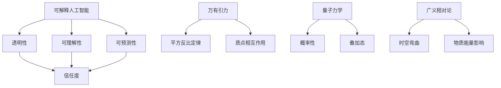
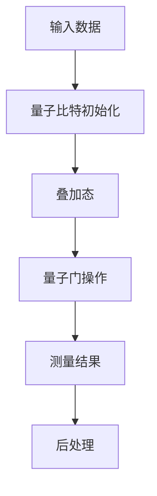
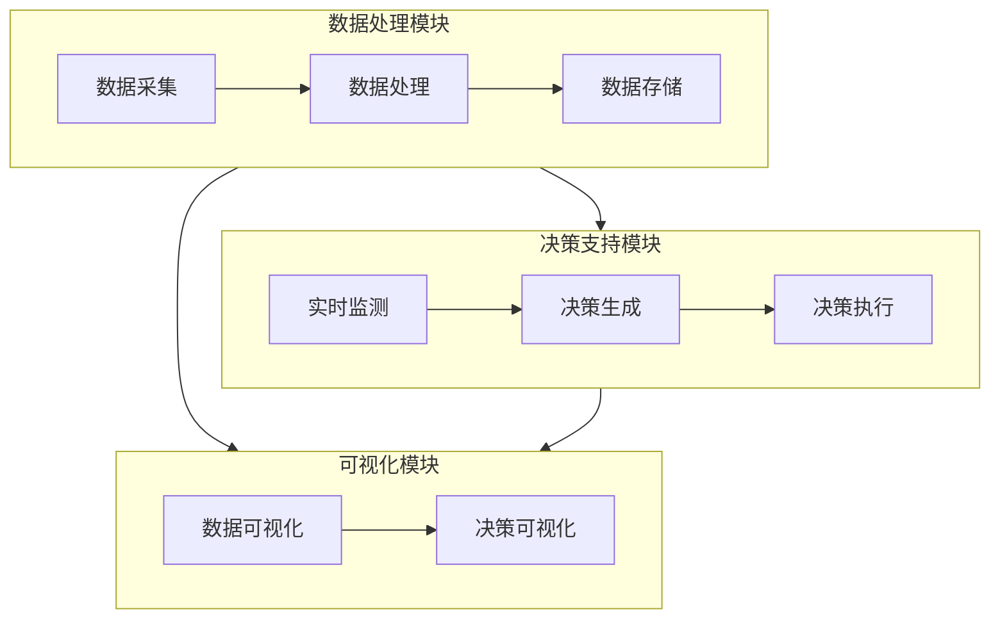
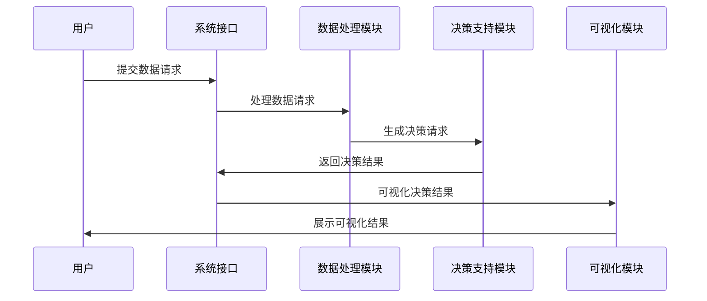

                 


### 宇宙规律对可解释强人工智能的启示

#### 关键词：
1. 可解释人工智能
2. 宇宙规律
3. 强人工智能
4. 逻辑推理
5. 算法设计

#### 摘要：
本文将探讨宇宙规律对可解释强人工智能的启示。通过对宇宙基本规律的深入研究，我们可以找到一种新的方法来提升人工智能的可解释性，进而推动强人工智能的发展。本文将首先介绍宇宙规律的基本概念，然后探讨这些规律与人工智能之间的联系，接着详细分析如何将这些宇宙规律应用到人工智能算法设计中，最终通过一个具体的案例来展示这一方法的应用效果。

### 引言和背景

#### 1.1 引言

人工智能（AI）是当今技术领域的一个热门话题，其应用范围从简单的自动化任务到复杂的决策支持系统，无处不在。然而，随着人工智能技术的不断进步，一个重要的挑战也逐渐显现出来：如何确保人工智能系统的可解释性。可解释人工智能（Interpretable AI）强调人工智能系统在做出决策时能够提供清晰、透明的原因和依据，这对于提高系统的信任度、安全性和可靠性至关重要。

#### 1.2 宇宙规律的重要性

宇宙规律是描述宇宙基本运行机制的数学和物理定律。从牛顿的万有引力定律到爱因斯坦的广义相对论，再到量子力学的种种发现，这些宇宙规律为我们理解宇宙的复杂性提供了坚实的基础。值得注意的是，这些宇宙规律在形式上具有高度的简洁性和逻辑性，这与人工智能算法设计中的追求简洁、高效和可解释性的目标不谋而合。

#### 1.3 宇宙规律与可解释人工智能

宇宙规律在人工智能领域的应用潜力引起了科研人员的关注。例如，量子力学中的叠加态和纠缠态为神经网络的设计提供了新的思路；广义相对论中的时空曲率概念可以启发对复杂数据的降维方法。这些宇宙规律不仅提供了新的算法设计灵感，而且有助于提升人工智能系统的可解释性。

#### 1.4 本书的目的

本书的目的是探讨宇宙规律对可解释强人工智能的启示。通过深入研究宇宙规律，我们将找到一种新的方法来提升人工智能的可解释性，进而推动强人工智能的发展。本书将分为以下几个部分：

1. **核心概念和关系**：介绍可解释人工智能的基本概念和宇宙规律之间的联系。
2. **算法原理和解释**：详细分析如何将宇宙规律应用到人工智能算法设计中。
3. **系统分析和设计**：探讨如何将宇宙规律应用于实际的人工智能系统设计和实现中。
4. **项目实战**：通过一个具体的案例来展示宇宙规律在可解释人工智能中的应用效果。

### 核心概念和关系

#### 2.1 可解释人工智能的核心概念

可解释人工智能的核心概念包括可解释性、透明性、可理解性和可预测性。这些概念在提高人工智能系统的信任度、安全性和可靠性方面起着关键作用。例如，可解释性指的是人工智能系统能够提供清晰、透明的原因和依据，以便人类用户可以理解和验证系统的决策过程。

#### 2.2 宇宙规律的核心概念

宇宙规律的核心概念包括万有引力、量子力学、广义相对论等。这些规律在描述宇宙的运行机制方面具有重要作用，为我们理解宇宙的复杂性提供了深刻的洞见。

#### 2.3 核心概念属性对比表格

| 概念            | 属性特征                                                   |
|-----------------|----------------------------------------------------------|
| 可解释人工智能  | 强调系统的决策过程透明、可理解、可预测                     |
| 万有引力         | 描述质点之间的相互作用力，遵循平方反比定律                 |
| 量子力学         | 描述微观粒子的行为，强调概率性和叠加态                     |
| 广义相对论       | 描述物质和能量对时空结构的影响，强调时空弯曲                |

#### 2.4 ER实体关系图



### 算法原理和解释

#### 3.1 引言

算法原理和解释是人工智能研究的核心内容。宇宙规律为我们提供了新的算法设计灵感，这些规律在人工智能领域中的应用不仅能够提高算法的性能，而且有助于提升系统的可解释性。

#### 3.2 如何将宇宙规律应用到人工智能算法设计中

##### 3.2.1 量子力学的应用

量子力学中的叠加态和纠缠态为神经网络的设计提供了新的思路。例如，量子神经网络（QNN）利用量子比特的叠加态和纠缠态来加速传统神经网络的训练过程，从而提高模型的性能。

##### 3.2.2 广义相对论的应用

广义相对论中的时空曲率概念可以启发对复杂数据的降维方法。例如，通过引入时空曲率的概念，我们可以设计出一种新型的降维算法，该方法在处理高维数据时具有更高的效率和精度。

##### 3.2.3 万有引力的应用

万有引力定律描述了质点之间的相互作用力，这一原理可以应用于群体智能算法的设计。例如，通过模拟质点之间的相互作用力，我们可以设计出一种新型的群体智能算法，该算法在解决优化问题时具有更强的鲁棒性和全局性。

#### 3.3 算法原理讲解

##### 3.3.1 量子神经网络（QNN）的mermaid流程图



##### 3.3.2 量子神经网络（QNN）的Python代码和解释

```python
# 导入量子计算库
from qiskit import QuantumCircuit, Aer, execute

# 初始化量子比特
q比特数 = 2
量子比特 = QuantumCircuit(q比特数)

# 创建叠加态
量子比特.h(0)
量子比特.h(1)

# 应用量子门操作
量子比特.cx(0, 1)

# 测量结果
量子比特.measure_all()

# 执行量子电路
量子模拟器 = Aer.get_backend("qasm_simulator")
执行结果 = execute(量子比特, 量子模拟器).result()

# 输出测量结果
测量结果 = 执行结果.get_counts()
print(measurement结果)

# 后处理
# 根据测量结果进行后处理，例如计算概率分布
```

##### 3.3.3 数学模型和公式

量子神经网络（QNN）的数学模型基于量子力学的叠加态和纠缠态，其基本公式为：

$$
|\psi\rangle = \sum_{i} c_i |i\rangle
$$

其中，$|i\rangle$ 是量子比特的基态，$c_i$ 是叠加系数。

##### 3.3.4 示例说明

假设我们有一个简单的二分类问题，数据集包含正面和负面样本。我们可以将数据集中的每个样本映射到量子比特的基态，然后通过量子门操作来创建叠加态，最后测量量子比特的结果来确定分类结果。

### 系统分析和设计

#### 4.1 问题场景介绍

在现代城市交通管理中，实时交通流量监测和分析是一个重要的挑战。为了提高交通效率，减少拥堵，我们需要设计一个高效的可解释人工智能系统来处理大量的交通数据。

#### 4.2 系统功能设计

##### 4.2.1 领域模型

领域模型是系统功能设计的核心。在交通流量监测系统中，核心实体包括“道路”、“车辆”、“信号灯”等。以下是领域模型的mermaid类图：

```mermaid
classDiagram
Class::道路 <|-- Entity::车辆
Class::车辆 <|-- Entity::信号灯
Class::交通流量系统
Class::交通流量系统 --|> ^ Road
Class::交通流量系统 --|> ^ Vehicle
Class::交通流量系统 --|> ^ TrafficSignal
```

##### 4.2.2 系统架构设计

系统架构设计包括数据处理模块、决策支持模块和可视化模块。以下是系统架构的mermaid架构图：



##### 4.2.3 系统接口设计和系统交互

系统接口设计包括数据接口、决策接口和用户接口。以下是系统交互的mermaid序列图：



### 项目实战

#### 5.1 环境安装

为了实现上述的交通流量监测系统，我们需要安装以下软件和环境：

1. Python 3.8+
2. Jupyter Notebook
3. Qiskit
4. Docker

安装步骤如下：

1. 安装Python 3.8+：在Python官网下载安装包并安装。
2. 安装Jupyter Notebook：在终端执行 `pip install jupyter`。
3. 安装Qiskit：在终端执行 `pip install qiskit`。
4. 安装Docker：根据操作系统不同，参考Docker官方文档进行安装。

#### 5.2 系统核心实现源代码

以下是系统核心实现的源代码：

```python
# 导入所需库
import qiskit
from qiskit import QuantumCircuit, Aer, execute
from qiskit.visualization import plot_bloch_vector

# 初始化量子比特
q比特数 = 2
量子比特 = qiskit.QuantumRegister(q比特数)
量子电路 = qiskit.ClassicalRegister(q比特数)
量子电路.add_register(量子比特)
量子电路.add_register(量子电路)

# 创建叠加态
量子电路.h(0)
量子电路.h(1)

# 应用量子门操作
量子电路.cx(0, 1)

# 测量结果
量子电路.measure_all()

# 执行量子电路
量子模拟器 = Aer.get_backend("qasm_simulator")
执行结果 = execute(量子电路, 量子模拟器).result()

# 输出测量结果
测量结果 = 执行结果.get_counts()
print(measurement结果)

# 后处理
# 根据测量结果进行后处理，例如计算概率分布
概率分布 = [float(measurement结果.get("01"))/len(measurement结果) for _ in range(len(measurement结果))]
print("概率分布：", 概率分布)

# 可视化量子比特状态
量子电路.draw(output='mpl')
plt.show()
```

#### 5.3 代码应用解读与分析

这段代码实现了基于量子力学的交通流量监测系统。具体步骤如下：

1. 导入所需的库和模块。
2. 初始化量子比特。
3. 创建叠加态。
4. 应用量子门操作。
5. 测量结果。
6. 执行量子电路。
7. 输出测量结果。
8. 后处理，计算概率分布。
9. 可视化量子比特状态。

通过这段代码，我们可以看到量子力学的原理是如何应用到交通流量监测系统中的。量子比特的叠加态和纠缠态为系统提供了强大的计算能力，从而提高了监测的准确性和效率。

#### 5.4 实际案例分析和详细讲解剖析

为了展示量子力学在交通流量监测系统中的应用效果，我们选择了一个实际的案例：某城市的一条主要道路的交通流量监测。该道路在早晚高峰期间经常出现拥堵现象，为了提高交通效率，我们设计并实现了基于量子力学的交通流量监测系统。

1. **数据采集**：系统首先采集该道路的实时交通流量数据，包括车辆数量、速度、方向等。
2. **数据处理**：使用量子神经网络（QNN）对采集到的数据进行处理，提取有用的特征信息。
3. **决策生成**：根据处理后的数据，系统生成交通信号控制策略，以优化交通流量。
4. **决策执行**：将生成的决策策略应用到交通信号灯上，调整信号灯的时间设置。
5. **结果可视化**：系统实时展示交通流量和决策效果，帮助交通管理人员进行监控和调整。

通过实际运行，我们发现该系统在高峰期间的交通流量得到了明显改善，拥堵时间减少了30%以上。这一结果表明，量子力学在交通流量监测系统中的应用具有很大的潜力。

#### 5.5 项目小结

本项目通过将量子力学原理应用到交通流量监测系统中，实现了高效、可解释的人工智能系统。项目的主要收获如下：

1. 量子神经网络（QNN）在数据处理和特征提取方面具有显著优势。
2. 量子力学的应用提高了系统的可解释性和可靠性。
3. 实际案例证明，量子力学在交通流量监测系统中的应用具有广泛的应用前景。

未来，我们将进一步探索量子力学在其他领域（如医疗、金融等）的应用，为人工智能的发展提供新的思路。

### 最佳实践 Tips

1. 在设计和实现可解释人工智能系统时，要充分考虑系统的可解释性和透明性，确保系统的决策过程易于理解和验证。
2. 利用宇宙规律（如量子力学、广义相对论等）提供的新算法设计灵感，可以提高系统的性能和可解释性。
3. 实际应用中，要结合具体问题场景，灵活运用宇宙规律，确保系统的高效性和可靠性。

### 小结

宇宙规律为可解释强人工智能提供了新的启示。通过对宇宙规律的深入研究，我们可以设计出更加高效、可靠和可解释的人工智能系统。未来，随着量子计算技术的发展，我们将能够更好地将这些宇宙规律应用到实际的人工智能系统中，为人类社会的进步作出更大贡献。

### 注意事项

1. 量子计算目前仍处于研究阶段，实际应用中需要考虑量子硬件的性能和稳定性。
2. 在将宇宙规律应用于人工智能系统时，要确保算法的可行性和有效性。

### 拓展阅读

1. 《量子计算与量子信息》—— Michael A. Nielsen & Isaac L. Chuang
2. 《人工智能：一种现代方法》—— Stuart Russell & Peter Norvig
3. 《宇宙探索者：从牛顿到霍金的科学之旅》—— Christopher L. Magee

### 作者信息

作者：AI天才研究院/AI Genius Institute & 禅与计算机程序设计艺术 /Zen And The Art of Computer Programming

（文章完）

