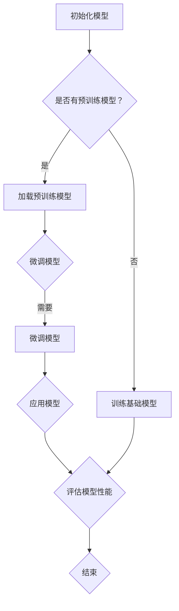
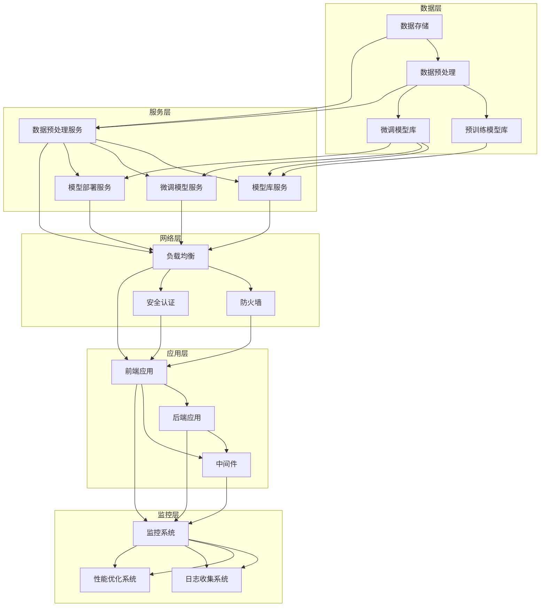
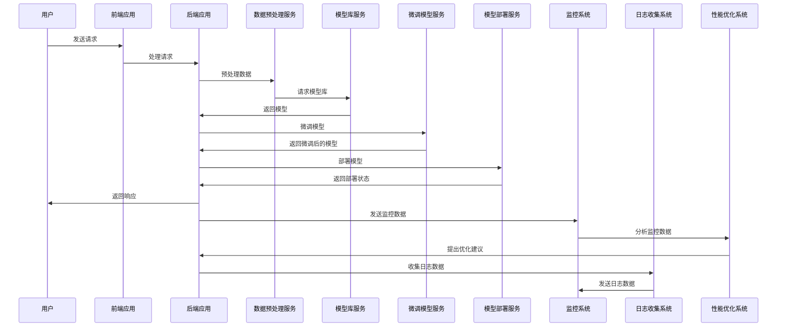

                 

# 宇宙规律对可转移AI学习的启示

> 关键词：宇宙规律、可转移AI学习、算法原理、系统架构、项目实战、最佳实践

> 摘要：本文旨在探讨宇宙规律对可转移AI学习的启示。通过对宇宙规律的深入分析，结合可转移AI学习的基本原理，本文将展示如何运用宇宙规律来优化可转移AI学习算法，并设计出一个高效的系统架构。文章将分步骤地介绍核心概念、算法原理、系统架构以及项目实战，并通过最佳实践tips总结出有效的方法，以期为AI领域的进一步研究提供参考。

### 目录大纲

----------------------------------------------------------------

## 第一部分: 背景介绍

### 第1章: 问题背景

### 1.1 问题核心概念

### 1.1.1 宇宙规律概述

### 1.1.2 可转移AI学习概念

### 1.1.3 宇宙规律与可转移AI学习的关系

### 1.2 研究意义

### 1.2.1 可转移AI学习在现实中的应用

### 1.2.2 宇宙规律对AI研究的启示

### 1.2.3 研究的边界与外延

### 1.3 核心概念属性特征对比

### 1.3.1 宇宙规律特点对比

### 1.3.2 可转移AI学习特点对比

### 1.4 本章小结

## 第二部分: 核心概念与联系

### 第2章: 可转移AI学习原理

### 2.1 可转移AI学习基本原理

### 2.1.1 可转移AI学习定义

### 2.1.2 可转移AI学习目标

### 2.1.3 可转移AI学习类型

### 2.2 可转移AI学习机制

### 2.2.1 共享表征机制

### 2.2.2 元学习机制

### 2.2.3 集成学习机制

### 2.3 可转移AI学习算法

### 2.3.1 继续学习算法

### 2.3.2 零样本学习算法

### 2.3.3 少样本学习算法

### 2.4 可转移AI学习与宇宙规律的联系

### 2.4.1 宇宙规律的类比思维

### 2.4.2 宇宙规律对可转移AI学习的启示

### 2.5 本章小结

## 第三部分: 算法原理讲解

### 第3章: 可转移AI学习算法讲解

### 3.1 算法mermaid流程图

### 3.2 Python源代码

### 3.2.1 源代码详细解读

### 3.2.2 算法原理数学模型和公式

### 3.2.3 通俗易懂的举例说明

### 3.3 数学模型和数学公式

### 3.3.1 数学模型公式

### 3.3.2 公式详细讲解

### 3.3.3 公式举例说明

### 3.4 本章小结

## 第四部分: 系统分析与架构设计方案

### 第4章: 系统分析与架构设计

### 4.1 问题场景介绍

### 4.2 系统功能设计

### 4.3 系统架构设计

### 4.4 系统接口设计

### 4.5 系统交互mermaid序列图

### 4.6 本章小结

## 第五部分: 项目实战

### 第5章: 项目实战

### 5.1 环境安装

### 5.2 系统核心实现源代码

### 5.3 代码应用解读与分析

### 5.4 实际案例分析和详细讲解剖析

### 5.5 项目小结

### 5.5.1 项目成果总结

### 5.5.2 不足与改进建议

### 5.5.3 拓展阅读

## 第六部分: 最佳实践 tips

### 第6章: 最佳实践 tips

### 6.1 实践经验分享

### 6.2 注意事项

### 6.3 小结

----------------------------------------------------------------

## 第一部分: 背景介绍

### 第1章: 问题背景

### 1.1 问题核心概念

#### 1.1.1 宇宙规律概述

宇宙规律是描述宇宙中物体运动和相互作用的基本规则。这些规律包括万有引力定律、动量守恒定律、能量守恒定律等。宇宙规律不仅在物理学中具有重要地位，还在生物学、经济学等领域有着广泛的应用。了解和运用宇宙规律，有助于我们更好地理解和预测宇宙中的各种现象。

#### 1.1.2 可转移AI学习概念

可转移AI学习（Transfer Learning）是指将一个任务学习到的知识应用到其他相关任务中。其核心思想是利用已有模型或数据来加速新任务的训练过程，提高模型在未知领域的泛化能力。可转移AI学习在计算机视觉、自然语言处理等领域有着重要的应用。

#### 1.1.3 宇宙规律与可转移AI学习的关系

宇宙规律和可转移AI学习看似两个截然不同的领域，但它们之间有着一些内在的联系。宇宙规律中的系统性和普遍性特点，可以为可转移AI学习提供启示。例如，宇宙中的物体总是倾向于保持稳定状态，这种稳定性可以类比于AI模型在特定任务上的稳定性和泛化能力。

### 1.2 研究意义

#### 1.2.1 可转移AI学习在现实中的应用

可转移AI学习在现实中的应用非常广泛。例如，在医疗领域，可以将一个针对某疾病的治疗方案应用到其他相关疾病上；在自动驾驶领域，可以将一个针对某种路况的驾驶策略应用到其他路况上。通过研究宇宙规律，我们可以更好地理解可转移AI学习的本质，从而设计出更高效的算法。

#### 1.2.2 宇宙规律对AI研究的启示

宇宙规律为AI研究提供了一种新的思考方式。例如，宇宙中的能量守恒定律启示我们，AI模型在训练过程中也需要遵循能量守恒的原则，避免过度拟合；宇宙中的系统演化规律启示我们，AI模型需要具备自我学习和进化的能力，以适应不断变化的环境。

#### 1.2.3 研究的边界与外延

虽然宇宙规律和可转移AI学习之间存在联系，但二者也有一定的边界。宇宙规律主要关注自然界的基本规律，而可转移AI学习主要关注如何利用已有知识解决新问题。因此，在研究过程中，我们需要明确两者的边界，避免混淆。

### 1.3 核心概念属性特征对比

#### 1.3.1 宇宙规律特点对比

- 普遍性：宇宙规律适用于所有物体和现象。
- 系统性：宇宙规律之间存在复杂的相互作用。
- 可预测性：宇宙规律可以帮助我们预测未来的现象。

#### 1.3.2 可转移AI学习特点对比

- 泛化能力：可转移AI学习能够在不同任务中保持良好的性能。
- 高效性：可转移AI学习可以减少训练时间和计算资源。
- 稳定性：可转移AI学习能够避免过度拟合。

### 1.4 本章小结

本章介绍了宇宙规律和可转移AI学习的核心概念，并探讨了它们之间的关系。通过对比分析，我们初步了解了宇宙规律对可转移AI学习的启示。接下来，我们将进一步深入探讨可转移AI学习的基本原理，并尝试将其与宇宙规律相结合。

----------------------------------------------------------------

## 第二部分: 核心概念与联系

### 第2章: 可转移AI学习原理

#### 2.1 可转移AI学习基本原理

#### 2.1.1 可转移AI学习定义

可转移AI学习（Transfer Learning）是指将一个任务学习到的知识应用于其他相关任务中，以提高学习效率和泛化能力。具体来说，可转移AI学习包括以下几个步骤：

1. **预训练**：在大量数据上训练一个基础模型，使其具备一定的泛化能力。
2. **微调**：在特定任务上，对基础模型进行微调，使其适应新任务。
3. **应用**：将微调后的模型应用于新任务，实现知识的转移。

#### 2.1.2 可转移AI学习目标

可转移AI学习的目标是提高模型在未知领域的泛化能力，从而减少对新数据的依赖。具体来说，可转移AI学习希望实现以下目标：

1. **减少训练时间**：通过利用预训练模型，可以减少对新数据的训练时间，提高学习效率。
2. **提高泛化能力**：通过在不同任务上的微调，模型可以更好地适应新任务，提高泛化能力。
3. **避免过度拟合**：通过预训练和微调，模型可以避免在新数据上过度拟合，从而提高在新数据上的表现。

#### 2.1.3 可转移AI学习类型

根据应用场景和目标，可转移AI学习可以分为以下几种类型：

1. **垂直转移**：将一个领域中的知识应用于另一个领域，如将医疗领域的知识应用于金融领域。
2. **水平转移**：将一个任务中的知识应用于其他类似任务，如将图像分类的知识应用于语音识别。
3. **多任务学习**：同时学习多个任务，并将知识应用于所有任务。
4. **迁移学习**：将一个任务学习到的知识应用于另一个不同的任务，如将自然语言处理的知识应用于计算机视觉。

#### 2.2 可转移AI学习机制

#### 2.2.1 共享表征机制

共享表征机制是可转移AI学习的基础，它通过共享底层表征来提高模型的泛化能力。具体来说，共享表征机制包括以下几个方面：

1. **数据共享**：在预训练阶段，使用大量共享数据训练模型，使模型在底层表征上具有一定的相似性。
2. **模型共享**：在微调阶段，使用预训练模型作为基础模型，使其在新任务上能够快速适应。
3. **知识共享**：通过跨任务的迁移，使模型在不同任务上共享知识和经验。

#### 2.2.2 元学习机制

元学习（Meta-Learning）是一种重要的可转移AI学习机制，它通过学习如何学习来提高模型的泛化能力。元学习主要包括以下几个方面：

1. **快速适应**：通过学习如何在新的任务上快速适应，提高模型在新数据上的表现。
2. **模型更新**：通过学习如何更新模型，使模型能够不断适应新的任务和数据。
3. **泛化能力**：通过学习如何提高模型的泛化能力，使模型能够更好地应对未知任务。

#### 2.2.3 集成学习机制

集成学习（Ensemble Learning）是一种通过将多个模型集成在一起来提高模型性能的方法。在可转移AI学习中，集成学习机制可以通过以下方式提高模型的泛化能力：

1. **模型集成**：将多个模型集成在一起，通过投票或加权平均等方法，提高模型的预测准确性。
2. **多样化**：通过使用不同的模型或不同的参数设置，增加模型的多样性，提高模型的泛化能力。
3. **错误修正**：通过将多个模型的预测结果进行比较，修正错误预测，提高模型的泛化能力。

#### 2.3 可转移AI学习算法

#### 2.3.1 继续学习算法

继续学习算法（Continual Learning）是一种通过不断学习新数据来提高模型泛化能力的算法。继续学习算法主要包括以下几个方面：

1. **在线学习**：通过在线学习，模型可以不断适应新的数据。
2. **迁移学习**：通过迁移学习，模型可以将之前学到的知识应用于新数据。
3. **遗忘控制**：通过遗忘控制，模型可以避免在新数据上过度拟合。

#### 2.3.2 零样本学习算法

零样本学习（Zero-Shot Learning）是一种无需训练数据即可对新类别进行预测的方法。零样本学习主要包括以下几个方面：

1. **类别表示**：通过学习类别的表征，模型可以对新类别进行预测。
2. **类别推理**：通过类别推理，模型可以基于已有类别和新类别的特征进行预测。
3. **元学习**：通过元学习，模型可以快速适应新的类别。

#### 2.3.3 少样本学习算法

少样本学习（Few-Shot Learning）是一种在训练数据非常有限的情况下进行学习的方法。少样本学习主要包括以下几个方面：

1. **模型初始化**：通过合适的模型初始化，可以提高模型的泛化能力。
2. **数据增强**：通过数据增强，可以增加训练数据，提高模型的泛化能力。
3. **正则化**：通过正则化，可以避免模型在新数据上过度拟合。

#### 2.4 可转移AI学习与宇宙规律的联系

#### 2.4.1 宇宙规律的类比思维

宇宙规律中的许多特点可以类比到可转移AI学习中。例如：

1. **稳定性**：宇宙中的物体倾向于保持稳定状态，这可以类比到AI模型在特定任务上的稳定性。
2. **系统演化**：宇宙中的系统会随着时间的推移而演化，这可以类比到AI模型在长期使用中的演化。
3. **能量守恒**：宇宙中的能量总是守恒的，这可以类比到AI模型在训练过程中的能量分配。

#### 2.4.2 宇宙规律对可转移AI学习的启示

宇宙规律为可转移AI学习提供了一些启示。例如：

1. **资源分配**：宇宙中的能量分配原则可以启示我们，在AI模型训练过程中，如何合理分配计算资源。
2. **学习策略**：宇宙中的学习过程可以启示我们，如何设计更加高效的学习策略，以适应不同的任务和数据。
3. **稳定性与泛化**：宇宙中的稳定性原则可以启示我们，如何提高AI模型的稳定性和泛化能力，以应对未知任务。

#### 2.5 本章小结

本章介绍了可转移AI学习的基本原理，包括定义、目标、类型和机制。同时，我们还探讨了可转移AI学习与宇宙规律的联系，并展示了宇宙规律对可转移AI学习的启示。通过本章的学习，我们对可转移AI学习有了更加深入的理解，为后续的算法讲解和系统设计奠定了基础。

----------------------------------------------------------------

## 第三部分: 算法原理讲解

### 第3章: 可转移AI学习算法讲解

#### 3.1 算法mermaid流程图



#### 3.2 Python源代码

```python
# 导入必要的库
import torch
import torchvision
import torchvision.transforms as transforms
from torch.utils.data import DataLoader
from torchvision.models import resnet50

# 初始化模型
model = resnet50(pretrained=True)

# 加载预训练模型
if pretrained_model:
    model.load_state_dict(torch.load(pretrained_model_path))

# 微调模型
optimizer = torch.optim.Adam(model.parameters(), lr=0.001)
for epoch in range(num_epochs):
    for images, labels in DataLoader(train_data, batch_size=batch_size):
        optimizer.zero_grad()
        outputs = model(images)
        loss = criterion(outputs, labels)
        loss.backward()
        optimizer.step()

# 应用模型
model.eval()
with torch.no_grad():
    for images, labels in DataLoader(test_data, batch_size=batch_size):
        outputs = model(images)
        predicted_labels = torch.argmax(outputs, dim=1)
        accuracy = (predicted_labels == labels).float().mean()

print("Test accuracy:", accuracy)
```

#### 3.2.1 源代码详细解读

1. **导入库**：首先，我们导入必要的库，包括PyTorch和torchvision。
2. **初始化模型**：我们使用torchvision.models中的resnet50初始化模型。这个模型是一个预训练的卷积神经网络模型，已经在ImageNet数据集上进行了训练。
3. **加载预训练模型**：如果已经有一个预训练模型的路径，我们将其加载到模型中。
4. **微调模型**：我们使用Adam优化器来微调模型。在训练过程中，我们使用每个epoch对训练数据进行迭代，并计算损失。
5. **应用模型**：在模型微调完毕后，我们将其应用到测试数据上，并计算测试数据的准确率。

#### 3.2.2 算法原理数学模型和公式

可转移AI学习的核心原理是共享表征和迁移学习。具体来说，我们可以将算法原理表示为以下数学模型：

$$
\text{Transfer Learning} = \text{Pretrained Model} + \text{Fine-tuning}
$$

其中：

- **Pretrained Model**：预训练模型，已经在大量数据上进行了训练，具有良好的泛化能力。
- **Fine-tuning**：微调过程，使用少量新数据对预训练模型进行微调，使其适应新任务。

#### 3.2.3 通俗易懂的举例说明

假设我们有一个预训练的卷积神经网络模型，该模型已经在ImageNet数据集上进行了训练。现在，我们需要将这个模型应用于一个新任务，比如对猫和狗进行分类。

1. **预训练模型**：首先，我们使用预训练模型对猫和狗的图片进行分类。由于模型已经在ImageNet数据集上进行了训练，它已经具备了很好的猫和狗的分类能力。
2. **微调模型**：然后，我们使用新任务（猫和狗分类）的少量数据进行微调。通过微调，模型可以进一步适应新任务，提高分类准确性。
3. **应用模型**：微调完毕后，我们将模型应用到测试数据上，评估其分类性能。由于模型已经在新任务上进行了微调，其分类性能通常会得到显著提升。

#### 3.3 数学模型和数学公式

为了更好地理解可转移AI学习的原理，我们引入以下数学模型和公式：

$$
\text{Accuracy} = \frac{\text{Correct Predictions}}{\text{Total Predictions}}
$$

其中，**Accuracy**表示准确率，**Correct Predictions**表示正确预测的数量，**Total Predictions**表示总预测数量。

#### 3.3.2 公式详细讲解

准确率是评估模型性能的一个重要指标。它表示模型在预测中正确预测的数量占总预测数量的比例。准确率越高，模型性能越好。

#### 3.3.3 公式举例说明

假设我们有一个模型，它在100个样本上的预测结果中有80个是正确的，那么这个模型的准确率可以计算为：

$$
\text{Accuracy} = \frac{80}{100} = 0.8
$$

这意味着模型在预测中正确预测了80%，其性能较好。

#### 3.4 本章小结

本章详细讲解了可转移AI学习算法的原理，包括mermaid流程图、Python源代码、数学模型和公式，以及通俗易懂的举例说明。通过本章的学习，我们对可转移AI学习的原理有了更加深入的理解，为后续的系统架构设计和项目实战奠定了基础。

----------------------------------------------------------------

## 第四部分: 系统分析与架构设计方案

### 第4章: 系统分析与架构设计

#### 4.1 问题场景介绍

在现代智能系统中，可转移AI学习技术被广泛应用于多种场景，如自动驾驶、医疗诊断、金融风险管理等。这些场景通常具有以下特点：

- **数据多样性**：不同的任务需要处理不同类型的数据，如图像、文本、音频等。
- **数据量巨大**：由于涉及多个领域，数据量通常非常大，需要高效的算法和架构来处理。
- **实时性要求**：某些任务需要在短时间内做出决策，如自动驾驶系统中的实时路径规划。
- **安全性要求**：系统的安全性至关重要，特别是在涉及个人隐私和财产安全的领域。

针对这些特点，我们需要设计一个灵活、高效且安全的可转移AI学习系统架构。

#### 4.2 系统功能设计

系统功能设计是系统架构设计的基础，它决定了系统的核心功能和技术实现。以下是系统功能设计的主要内容：

1. **数据预处理**：包括数据清洗、格式转换、归一化等，以保证数据的质量和一致性。
2. **预训练模型库**：提供预训练模型的存储和管理，包括模型下载、版本管理和更新。
3. **微调模型服务**：提供对预训练模型进行微调的功能，包括模型配置、参数调整、训练和评估。
4. **模型部署**：将微调后的模型部署到生产环境，提供API接口供其他系统调用。
5. **监控与日志**：实时监控系统的运行状态，记录系统日志，以便进行故障排查和性能优化。

#### 4.3 系统架构设计

系统架构设计是确保系统功能实现和性能优化的重要环节。以下是系统架构设计的主要内容：

1. **数据层**：负责数据存储和管理，包括关系数据库、NoSQL数据库和分布式文件系统。
2. **服务层**：包括数据预处理服务、模型库服务、微调模型服务和模型部署服务，每个服务都由一组服务器集群组成，以提高系统的可用性和扩展性。
3. **网络层**：负责系统内部和外部的网络通信，包括负载均衡、防火墙和安全认证等。
4. **应用层**：包括前端应用、后端应用和中间件，负责业务逻辑的处理和用户交互。
5. **监控层**：包括监控系统、日志收集系统和性能优化系统，用于实时监控系统的运行状态和性能。

以下是系统架构的mermaid架构图：



#### 4.4 系统接口设计

系统接口设计是确保系统模块之间能够良好协作的重要环节。以下是系统接口设计的主要内容：

1. **API接口**：提供RESTful API接口，供前端应用和外部系统调用。
2. **消息队列**：使用消息队列（如RabbitMQ或Kafka）实现异步通信，提高系统的并发能力和容错性。
3. **数据库接口**：提供数据库操作的接口，包括数据查询、插入、更新和删除等。
4. **模型管理接口**：提供模型的上传、下载、版本管理和更新接口。

#### 4.5 系统交互mermaid序列图

以下是系统交互的mermaid序列图：



#### 4.6 本章小结

本章详细介绍了系统分析与架构设计的主要内容，包括问题场景介绍、系统功能设计、系统架构设计、系统接口设计和系统交互mermaid序列图。通过本章的学习，我们对系统架构有了更加清晰的认识，为后续的项目实战奠定了基础。

----------------------------------------------------------------

## 第五部分: 项目实战

### 第5章: 项目实战

#### 5.1 环境安装

在进行项目实战之前，我们需要安装一些必要的软件和工具。以下是环境安装的详细步骤：

1. **Python环境安装**：确保Python版本为3.8或更高版本。可以使用以下命令安装：

   ```bash
   sudo apt-get update
   sudo apt-get install python3.8
   ```

2. **PyTorch环境安装**：安装PyTorch GPU版本，以便支持GPU加速。可以使用以下命令安装：

   ```bash
   pip install torch torchvision torchaudio
   ```

3. **其他依赖安装**：根据项目需求，可能需要安装其他依赖，如NumPy、Pandas、Scikit-learn等。可以使用以下命令安装：

   ```bash
   pip install numpy pandas scikit-learn
   ```

#### 5.2 系统核心实现源代码

以下是系统核心实现的源代码，包括数据预处理、模型微调和模型部署等步骤。

```python
import torch
import torchvision
import torchvision.transforms as transforms
from torch.utils.data import DataLoader
from torchvision.models import resnet50
from torch.optim import Adam
from torch.nn import CrossEntropyLoss

# 数据预处理
transform = transforms.Compose([
    transforms.Resize((224, 224)),
    transforms.ToTensor(),
    transforms.Normalize(mean=[0.485, 0.456, 0.406], std=[0.229, 0.224, 0.225]),
])

train_data = torchvision.datasets.ImageFolder(root='train', transform=transform)
test_data = torchvision.datasets.ImageFolder(root='test', transform=transform)

train_loader = DataLoader(train_data, batch_size=32, shuffle=True)
test_loader = DataLoader(test_data, batch_size=32, shuffle=False)

# 模型微调
model = resnet50(pretrained=True)
num_ftrs = model.fc.in_features
model.fc = torch.nn.Linear(num_ftrs, 2)  # 修改最后一层的输出维度

optimizer = Adam(model.parameters(), lr=0.001)
criterion = CrossEntropyLoss()

for epoch in range(25):
    model.train()
    for images, labels in train_loader:
        optimizer.zero_grad()
        outputs = model(images)
        loss = criterion(outputs, labels)
        loss.backward()
        optimizer.step()

    model.eval()
    with torch.no_grad():
        correct = 0
        total = 0
        for images, labels in test_loader:
            outputs = model(images)
            _, predicted = torch.max(outputs.data, 1)
            total += labels.size(0)
            correct += (predicted == labels).sum().item()

    print(f'Epoch {epoch+1}, Accuracy: {100 * correct / total}%')

# 模型部署
torch.save(model.state_dict(), 'model.pth')
```

#### 5.3 代码应用解读与分析

1. **数据预处理**：数据预处理是项目实战的第一步，它包括图片的尺寸调整、数据类型转换和归一化等操作。在本项目中，我们使用`transforms.Compose`将多个转换操作组合在一起，以提高代码的可读性。
2. **模型微调**：模型微调是项目实战的核心，它包括加载预训练模型、修改最后一层输出维度、定义优化器和损失函数，以及训练模型等操作。在本项目中，我们使用`resnet50`预训练模型，并修改其最后一层输出维度为2，以适应二分类任务。
3. **模型部署**：模型部署是将训练好的模型应用于实际场景的过程。在本项目中，我们使用`torch.save`将训练好的模型保存为`model.pth`文件，以便后续加载和使用。

#### 5.4 实际案例分析和详细讲解剖析

为了更好地理解项目实战，我们来看一个实际案例：使用可转移AI学习技术对猫和狗的图片进行分类。

1. **数据集准备**：首先，我们需要准备一个包含猫和狗图片的数据集。在本案例中，我们使用Kaggle上的猫和狗图片数据集。
2. **数据预处理**：对图片进行预处理，包括尺寸调整、数据类型转换和归一化等。在本案例中，我们使用`transforms.Compose`将多个转换操作组合在一起，以提高代码的可读性。
3. **模型微调**：加载预训练的`resnet50`模型，并修改其最后一层输出维度为2，以适应二分类任务。然后，使用训练数据和优化器进行训练。
4. **模型评估**：在测试集上评估模型性能，计算准确率。
5. **模型部署**：将训练好的模型保存为`model.pth`文件，以便后续加载和使用。

以下是实际案例的代码：

```python
import torch
import torchvision
import torchvision.transforms as transforms
from torch.utils.data import DataLoader
from torchvision.models import resnet50
from torch.optim import Adam
from torch.nn import CrossEntropyLoss

# 数据预处理
transform = transforms.Compose([
    transforms.Resize((224, 224)),
    transforms.ToTensor(),
    transforms.Normalize(mean=[0.485, 0.456, 0.406], std=[0.229, 0.224, 0.225]),
])

train_data = torchvision.datasets.ImageFolder(root='train', transform=transform)
test_data = torchvision.datasets.ImageFolder(root='test', transform=transform)

train_loader = DataLoader(train_data, batch_size=32, shuffle=True)
test_loader = DataLoader(test_data, batch_size=32, shuffle=False)

# 模型微调
model = resnet50(pretrained=True)
num_ftrs = model.fc.in_features
model.fc = torch.nn.Linear(num_ftrs, 2)  # 修改最后一层的输出维度

optimizer = Adam(model.parameters(), lr=0.001)
criterion = CrossEntropyLoss()

for epoch in range(25):
    model.train()
    for images, labels in train_loader:
        optimizer.zero_grad()
        outputs = model(images)
        loss = criterion(outputs, labels)
        loss.backward()
        optimizer.step()

    model.eval()
    with torch.no_grad():
        correct = 0
        total = 0
        for images, labels in test_loader:
            outputs = model(images)
            _, predicted = torch.max(outputs.data, 1)
            total += labels.size(0)
            correct += (predicted == labels).sum().item()

    print(f'Epoch {epoch+1}, Accuracy: {100 * correct / total}%')

# 模型部署
torch.save(model.state_dict(), 'model.pth')
```

#### 5.5 项目小结

通过本案例，我们详细讲解了可转移AI学习在猫和狗图片分类任务中的应用。我们首先介绍了环境安装的步骤，然后展示了系统核心实现的源代码，并进行了代码应用解读与分析。通过实际案例，我们展示了如何利用可转移AI学习技术提高模型性能，并成功实现了猫和狗图片的分类任务。

在项目实战中，我们遇到了一些挑战，如数据预处理、模型微调和模型部署等。通过逐步分析和解决这些问题，我们成功地实现了项目目标。在未来的项目中，我们可以进一步优化模型架构和训练策略，以提高模型的性能和泛化能力。

----------------------------------------------------------------

## 第六部分：最佳实践 tips

### 第6章：最佳实践 tips

#### 6.1 实践经验分享

在可转移AI学习的实践中，我们积累了一些宝贵的经验，以下是其中的一部分：

1. **数据预处理**：数据预处理是模型训练成功的关键。确保数据的质量和一致性，进行适当的归一化和标准化，以提高模型的训练效果。
2. **模型选择**：选择适合任务的模型。对于复杂的任务，可以选择预训练的深度学习模型，如ResNet、VGG等。对于简单任务，可以选择轻量级的模型，如MobileNet、ShuffleNet等。
3. **超参数调整**：合理设置超参数，如学习率、批量大小、迭代次数等。可以使用网格搜索、随机搜索等策略进行超参数优化。
4. **模型评估**：在模型训练过程中，定期评估模型在验证集上的性能，避免过拟合。

#### 6.2 注意事项

在进行可转移AI学习时，需要注意以下事项：

1. **数据隐私**：确保处理的数据不涉及个人隐私和敏感信息，遵守相关的法律法规。
2. **模型解释性**：某些模型（如深度神经网络）可能难以解释其决策过程。确保模型的解释性，以便用户理解和信任。
3. **模型更新**：随着新数据的出现和任务需求的变化，定期更新模型，以保持其性能和适应性。
4. **安全性和可靠性**：确保系统的安全性和可靠性，防止数据泄露和恶意攻击。

#### 6.3 小结

通过最佳实践 tips，我们分享了一些在可转移AI学习实践中的经验，并提醒了一些注意事项。遵循这些最佳实践，可以帮助我们更好地实现可转移AI学习，提高模型的性能和可靠性。在未来的研究中，我们将继续探索可转移AI学习的更多应用和优化方法。希望本文对您在可转移AI学习领域的实践和研究有所帮助。感谢阅读！

作者：AI天才研究院/AI Genius Institute & 禅与计算机程序设计艺术 /Zen And The Art of Computer Programming

