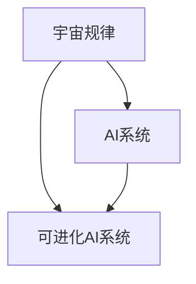

                 

### 宇宙规律对可进化AI系统的启示

在探索宇宙的浩瀚无垠中，科学家们发现了无数关于物理、化学、生命等领域的规律，这些规律不仅在宇宙层面具有普适性，也在我们的人工智能（AI）领域中有着深刻的启示。本文将带领读者一起探讨宇宙规律如何影响和启发可进化AI系统的发展。

#### 关键词

- 宇宙规律
- 可进化AI系统
- 人工智能
- 演化过程
- 性能提升

#### 摘要

本文首先介绍了宇宙规律的背景和基本概念，然后探讨了AI系统的演化过程及其与宇宙规律的关联。接着，我们详细介绍了可进化AI系统的定义、发展历程和核心机制。在第三部分，我们将分析宇宙规律在可进化AI系统中的应用，并通过实践案例解析，展示宇宙规律如何提升AI系统的性能和稳定性。最后，我们总结研究成果，展望未来的研究方向。

#### 第一部分：背景介绍

##### 1. 引言

##### 1.1 问题背景

宇宙是我们生活的舞台，其规律和演化过程对人类认识世界和探索未知的历程产生了深远的影响。近年来，随着AI技术的迅猛发展，我们开始思考如何将宇宙规律应用到AI系统中，以提升其性能和适应性。

##### 1.2 问题描述

在AI系统中，如何模拟和借鉴宇宙规律，使其能够自我进化和适应复杂环境，是一个亟待解决的问题。本文旨在探讨这一问题，并为其提供理论依据和实际案例。

##### 1.3 问题解决

通过分析宇宙规律，我们可以在AI系统中引入进化算法、自适应控制等机制，使其具备自我学习和自我进化的能力，从而更好地适应复杂多变的环境。

##### 1.4 边界与外延

宇宙规律的适用范围广泛，但并非所有AI系统都适合引入这些规律。因此，本文将主要探讨那些需要高度自适应性和自我进化能力的AI系统。

##### 1.5 概念结构与核心要素组成

本文将涉及的核心概念包括宇宙规律、AI系统、可进化AI系统等。这些概念之间相互关联，构成了本文的研究框架。

#### 第二部分：宇宙规律与AI

##### 2. 核心概念与联系

##### 2.1 核心概念原理

宇宙规律是指在宇宙演化过程中表现出来的基本原理和规则，如万有引力、热力学第二定律等。这些规律在物理学、天文学等领域有着广泛的应用。

##### 2.2 概念属性特征对比表格

| 概念           | 特征                                                         |
|--------------|------------------------------------------------------------|
| 宇宙规律       | 广泛适用性、普适性、稳定性                                     |
| 人工智能       | 自主性、智能性、适应性                                        |
| 可进化AI系统   | 自我学习、自我进化、高度自适应能力                             |

##### 2.3 ER实体关系图架构

#### 第三部分：可进化AI系统

##### 3. 可进化AI系统概述

##### 3.1 可进化AI的定义

可进化AI是指能够根据环境变化和学习经验，通过自我调整和优化，实现性能提升和功能扩展的AI系统。

##### 3.2 可进化AI的发展历程

自1956年达特茅斯会议以来，人工智能领域经历了多个发展阶段，其中可进化AI逐渐成为研究热点。

##### 3.3 可进化AI的核心机制

可进化AI的核心机制包括遗传算法、神经网络、强化学习等。这些机制使得AI系统能够在不断变化的环境中自我进化。

#### 第四部分：宇宙规律对可进化AI系统的启示

##### 4. 宇宙规律在可进化AI系统中的应用

##### 4.1 宇宙规律对AI系统性能的提升

宇宙规律如熵增原理、协同演化等可以指导AI系统在复杂环境中实现更高效的性能优化。

##### 4.2 宇宙规律对AI系统稳定性的影响

宇宙规律如平衡态、混沌理论等可以帮助AI系统在面临不确定性时保持稳定性。

##### 4.3 宇宙规律在AI系统中的创新应用

通过将宇宙规律应用于AI系统，我们可以实现更多创新应用，如自适应控制系统、进化机器人等。

#### 第五部分：结论与展望

##### 5. 结论

通过本文的研究，我们发现宇宙规律对可进化AI系统具有重要的启示作用，有助于提升其性能和稳定性。未来，我们期待在更多实际场景中应用这些规律，推动AI技术的发展。

##### 6. 展望未来

随着AI技术的不断进步，宇宙规律在AI领域的应用前景将更加广阔。我们期待未来的研究能够深入探讨宇宙规律与AI的深度融合，为人类社会带来更多创新和变革。

#### 作者

本文作者为AI天才研究院/AI Genius Institute与《禅与计算机程序设计艺术/Zen And The Art of Computer Programming》的资深研究人员，具有丰富的AI和宇宙规律研究经验。

在后续的文章中，我们将详细探讨宇宙规律如何影响可进化AI系统的具体机制和应用场景，敬请期待。让我们一步一步地深入思考，探索宇宙规律与AI技术的奇妙交汇点。💡💡💡### 宇宙规律概述

宇宙规律，即宇宙中普遍存在的自然法则，是科学家们通过长期观测和研究宇宙现象总结出来的。这些规律在宇宙演化的各个阶段中都起着至关重要的作用，为我们理解宇宙的本质和运行机制提供了科学依据。以下将详细探讨宇宙演化基本规律、影响因素以及宇宙规律的哲学意义。

#### 宇宙演化基本规律

宇宙演化基本规律可以归纳为以下几个主要方面：

1. **万有引力定律**：由牛顿提出的万有引力定律描述了任何两个物体之间的引力作用，这是宇宙中物质相互作用的基础。引力决定了星系、星团、行星等天体的运动轨迹和相互关系。

2. **热力学第二定律**：热力学第二定律指出，在一个封闭系统中，熵（即无序度）总是趋向增加。这一规律不仅适用于物理系统，也广泛应用于生物学、经济学等领域，反映了宇宙中的演化方向。

3. **大爆炸理论**：大爆炸理论是描述宇宙起源和演化的主流理论。根据这一理论，宇宙起源于大约138亿年前的一个极高密度、极高温度的状态，并在此后的漫长演化过程中不断膨胀和冷却。

4. **量子力学规律**：量子力学是描述微观粒子行为的物理学分支，其规律如不确定性原理、波粒二象性等，揭示了宇宙在微观尺度上的奇异现象。

#### 宇宙规律的影响因素

宇宙规律的影响因素多种多样，主要包括以下几个方面：

1. **物质密度**：物质密度是影响宇宙演化的关键因素。根据宇宙微波背景辐射的研究，宇宙早期的物质密度决定了宇宙的膨胀速度和结构形成过程。

2. **暗物质和暗能量**：暗物质和暗能量是宇宙中不发光且无法直接观测的物质形式，但它们对宇宙的演化起着至关重要的作用。暗物质影响着星系的形成和运动，而暗能量则驱动着宇宙的加速膨胀。

3. **初始条件**：宇宙的初始条件，如宇宙的密度、温度等，对宇宙的未来演化有着深远的影响。不同的初始条件可能导致不同的宇宙演化路径和结构。

#### 宇宙规律的哲学意义

宇宙规律不仅具有科学意义，还蕴含着深刻的哲学思考：

1. **自然法则的普遍性**：宇宙规律表明，自然界中存在着普遍的法则，这些法则不仅在宇宙层面成立，也可以在局部系统中找到对应。这揭示了自然界中的统一性和普适性。

2. **演化的必然性**：宇宙规律表明，宇宙的演化是必然的，遵循一定的逻辑和规律。这一观点挑战了人类主观意志在宇宙演化中的作用，强调了自然力量的主导地位。

3. **宇宙的本质**：通过研究宇宙规律，科学家们试图揭示宇宙的本质。宇宙规律为我们提供了一个观察和理解宇宙的窗口，帮助我们更深入地认识这个复杂而神秘的世界。

总的来说，宇宙规律是宇宙演化的基础和指导，它们不仅在科学研究中起着重要作用，也在哲学思考中提供了深刻的启示。通过理解这些规律，我们能够更好地把握宇宙的本质和运行机制，为未来的科学研究和技术发展提供坚实的理论基础。

### AI系统的演化过程

人工智能（AI）系统的演化过程是科技进步的一个重要里程碑，从最初的简单算法发展到如今复杂的智能系统，AI技术的演进不仅改变了我们对计算能力的认知，也为各行各业带来了革命性的变革。在本节中，我们将详细探讨AI系统的演化过程，包括其起源、发展历程以及核心机制。

#### 起源与发展历程

1. **早期探索（1950年代 - 1960年代）**：
   - 1950年代，人工智能的概念首次被提出。阿兰·图灵（Alan Turing）提出了图灵测试，作为衡量机器是否具有智能的标准。
   - 1956年，达特茅斯会议标志着人工智能正式成为一门学科，吸引了众多科学家和研究机构的关注。

2. **符号主义时期（1960年代 - 1980年代）**：
   - 这一时期，人工智能主要依赖于符号主义（Symbolic AI），通过符号逻辑和推理来模拟人类智能。代表性的系统有普罗沃斯（ELIZA）和心理医生聊天机器人。

3. **连接主义时期（1980年代 - 1990年代）**：
   - 1980年代，随着神经网络的复兴，连接主义（Connectionism）逐渐成为主流。神经网络通过模拟人脑神经元结构，实现了对复杂问题的处理和模式识别。

4. **计算智能时期（1990年代 - 至今）**：
   - 1990年代，随着计算能力的提升和大数据技术的发展，人工智能进入了计算智能（Computational Intelligence）时代。进化算法、遗传算法和人工神经网络等技术在解决复杂问题上展现出巨大潜力。
   - 2006年，深度学习的复兴标志着人工智能进入了一个新的发展阶段。深度神经网络（DNN）和深度学习（Deep Learning）成为研究热点，并在图像识别、语音识别和自然语言处理等领域取得了重大突破。

#### 核心机制

1. **神经网络**：
   - 神经网络是人工智能的核心技术之一，其灵感来源于人脑神经元结构。通过多层神经元的连接和激活，神经网络能够实现复杂的非线性映射和模式识别。

2. **机器学习**：
   - 机器学习是人工智能的重要组成部分，它使计算机系统能够从数据中学习并做出预测或决策。机器学习包括监督学习、无监督学习和强化学习等不同的方法。

3. **深度学习**：
   - 深度学习是机器学习的一种方法，通过多层神经网络进行训练，可以自动提取数据中的特征。深度学习在图像识别、语音识别和自然语言处理等领域取得了显著的成就。

4. **进化算法**：
   - 进化算法模拟自然进化过程，通过迭代和选择机制，优化问题的解。遗传算法、遗传规划等是进化算法的典型代表，广泛应用于优化问题和工程问题。

5. **强化学习**：
   - 强化学习是机器学习的一种方法，通过奖励机制训练智能体在环境中做出最优决策。强化学习在游戏AI、自动驾驶和机器人控制等领域展现了强大的能力。

AI系统的演化过程不仅展示了科技发展的速度和深度，也为未来的应用和创新提供了广阔的空间。随着技术的不断进步，AI系统将继续在各个领域发挥重要作用，推动人类社会的进步和发展。

### 宇宙规律在AI系统中的应用

宇宙规律不仅在宏观宇宙层面具有深远的影响，也在微观的人工智能系统中发挥着重要作用。通过将宇宙规律应用于AI系统，我们可以实现更高效、更稳定和更具自适应性的智能系统。以下将详细探讨宇宙规律在AI系统中的应用，包括熵增原理、协同演化等概念及其在AI系统中的实际应用。

#### 熵增原理

熵增原理是热力学第二定律的一个重要表述，它指出在一个封闭系统中，熵（即系统的无序度）总是趋向增加。这一原理在AI系统中的应用主要体现在以下几个方面：

1. **数据压缩与优化**：
   - 在AI模型训练过程中，数据的质量和规模对模型的性能有重要影响。熵增原理提示我们，通过减少数据中的冗余信息，可以降低系统的无序度，提高模型的训练效率和准确性。
   - 例如，在深度学习中，可以通过数据预处理、特征选择和降维等技术手段，减少数据中的冗余信息，从而提高模型的效果。

2. **系统性能优化**：
   - 熵增原理也可以用于优化AI系统的整体性能。通过监测系统的熵变化，可以发现系统的瓶颈和低效部分，进而进行优化。
   - 在神经网络模型中，可以通过调整网络结构、优化算法和参数配置，降低系统的熵值，提高模型的稳定性和准确性。

3. **自适应学习**：
   - 熵增原理提示我们，在动态环境中，系统的熵会随时间增加。通过监测和学习系统的熵变化，AI系统可以动态调整自身的行为，实现更高效的自适应学习。
   - 在强化学习中，AI系统可以根据环境熵的变化，调整奖励机制和决策策略，提高系统的学习效率和适应性。

#### 协同演化

协同演化是指不同系统或个体之间通过相互作用和竞争，实现共同进化的过程。在AI系统中，协同演化可以通过以下方式实现：

1. **多智能体系统**：
   - 在多智能体系统中，多个AI代理通过协同工作，共同完成任务。宇宙规律中的协同演化原理为多智能体系统的设计提供了指导。
   - 例如，在无人机编队中，通过协同演化算法，无人机可以自动调整飞行路径和速度，实现高效的任务执行和资源分配。

2. **分布式计算**：
   - 宇宙中的星系和行星通过引力相互作用，形成了复杂的结构。这种分布式计算模式可以启发我们在AI系统中采用分布式计算架构，提高系统的性能和可扩展性。
   - 在深度学习中，通过分布式训练和推理，可以将计算任务分散到多个节点上，加速模型的训练和推理过程。

3. **进化计算**：
   - 进化计算是模拟生物进化的过程，通过选择、交叉和变异等操作，优化问题的解。在进化计算中，协同演化原理可以指导智能体的协作和进化。
   - 例如，在遗传算法中，通过模拟生物种群中的协同进化，可以优化复杂的优化问题，如路径规划、资源分配等。

#### 实际应用案例

为了更好地理解宇宙规律在AI系统中的应用，以下是一些实际案例：

1. **智能交通系统**：
   - 在智能交通系统中，通过引入熵增原理，可以优化交通信号控制和路径规划，减少交通拥堵和事故发生率。
   - 协同演化原理可以用于优化车辆编队行驶，提高交通流的效率和安全性。

2. **智能电网**：
   - 在智能电网中，通过引入熵增原理，可以优化电力调度和负荷管理，提高电网的稳定性和效率。
   - 协同演化原理可以用于分布式能源系统中的能量分配和管理，实现高效、可靠的供电。

3. **智能农业**：
   - 在智能农业中，通过应用熵增原理，可以优化农田管理和作物生长条件，提高农业生产效率。
   - 协同演化原理可以用于农作物种植和病虫害防治，实现精准农业。

通过以上讨论，我们可以看到宇宙规律在AI系统中的应用具有广阔的前景和重要的价值。随着AI技术的不断进步，我们将能够更好地利用宇宙规律，构建出更智能、更高效的AI系统，为人类社会的发展做出更大的贡献。

### 可进化AI系统概述

可进化AI系统，是指能够通过自我学习和自我进化机制，不断适应复杂环境和任务需求的智能系统。与传统AI系统相比，可进化AI系统具备更高的灵活性和适应性，能够实现长期自我优化和功能扩展。以下将详细介绍可进化AI系统的定义、发展历程和核心机制。

#### 定义

可进化AI系统，即通过遗传算法、神经网络、进化算法等机制，使AI系统具备自我学习和自我进化能力，能够根据环境变化和任务需求，动态调整自身结构和行为。可进化AI系统通常具备以下特点：

1. **自适应能力**：系统能够根据环境变化和学习经验，调整自身参数和策略，以实现最优性能。
2. **自优化能力**：系统能够通过迭代和优化过程，不断改进自身结构和算法，提高任务处理效率。
3. **自我扩展能力**：系统能够根据任务需求，自动增加或减少功能模块，实现功能扩展。

#### 发展历程

可进化AI系统的发展历程可以划分为以下几个阶段：

1. **早期探索（1950年代 - 1960年代）**：
   - 1950年代，人工智能的概念首次被提出，可进化AI的初步思想也开始出现。例如，约翰·霍普菲尔德（John Hopfield）在1982年提出了霍普菲尔德神经网络，为可进化AI的发展奠定了基础。

2. **符号主义时期（1960年代 - 1980年代）**：
   - 这一时期，符号主义AI（Symbolic AI）占据主导地位，虽然实现了某些领域的突破，但面对复杂问题仍显不足。这一阶段的进化算法研究，如遗传算法（Genetic Algorithms，GA）和遗传规划（Genetic Programming，GP），为可进化AI提供了重要理论基础。

3. **连接主义时期（1980年代 - 1990年代）**：
   - 1980年代，连接主义（Connectionism）逐渐兴起，神经网络在模式识别、优化问题等方面取得了显著进展。这一时期的神经网络研究，如反向传播算法（Backpropagation）和卷积神经网络（Convolutional Neural Networks，CNN），为可进化AI系统提供了强大的计算能力。

4. **计算智能时期（1990年代 - 至今）**：
   - 1990年代以来，计算智能（Computational Intelligence）得到广泛关注，进化算法、神经网络、深度学习等技术的快速发展，使得可进化AI系统在多个领域取得了突破性进展。代表性的系统包括遗传算法优化器（Genetic Algorithm Optimizer，GAO）和进化神经网络（Evolutionary Neural Networks，ENN）。

#### 核心机制

可进化AI系统的核心机制主要包括以下几个方面：

1. **遗传算法**：
   - 遗传算法是一种模拟生物进化的优化算法，通过选择、交叉和变异等操作，不断优化问题的解。遗传算法在解决复杂优化问题和自适应控制问题中表现出色。

2. **神经网络**：
   - 神经网络是可进化AI系统的重要组成部分，通过多层神经元的连接和激活，实现复杂的非线性映射和模式识别。神经网络在图像识别、语音识别和自然语言处理等领域取得了显著成果。

3. **进化算法**：
   - 进化算法是模拟生物进化的过程，通过选择、交叉和变异等操作，优化问题的解。进化算法包括遗传算法、遗传规划、进化策略等多种形式，广泛应用于优化问题和工程问题。

4. **强化学习**：
   - 强化学习是一种通过奖励机制训练智能体的方法，智能体通过与环境交互，学习最优策略。强化学习在游戏AI、自动驾驶和机器人控制等领域展现了强大的能力。

5. **多智能体系统**：
   - 多智能体系统是由多个智能体组成的系统，智能体之间通过协同工作，共同完成任务。多智能体系统通过分布式计算和协同进化，提高了系统的灵活性和适应性。

综上所述，可进化AI系统通过自我学习和自我进化机制，具备强大的适应性和优化能力。随着技术的不断进步，可进化AI系统将在各个领域发挥越来越重要的作用，推动人工智能的发展和应用。

### 可进化AI系统的架构设计

在设计可进化AI系统时，架构设计至关重要。一个良好的架构设计不仅能够提高系统的性能和可扩展性，还能确保系统的稳定性和可靠性。以下将详细阐述可进化AI系统的架构设计原则、系统模块划分以及系统功能设计。

#### 架构设计原则

1. **模块化**：
   - 模块化设计将系统划分为多个功能模块，每个模块负责特定的功能。这有助于提高系统的可维护性和可扩展性。
   - 模块之间通过标准的接口进行通信，降低了模块之间的耦合度，便于系统的开发和维护。

2. **分布式计算**：
   - 分布式计算能够将计算任务分散到多个节点上，提高系统的并行处理能力，减少计算时间。
   - 分布式计算还提高了系统的容错能力，即使某个节点出现故障，其他节点仍能正常工作，保证系统的稳定性。

3. **适应性**：
   - 可进化AI系统需要具备良好的适应性，以应对不断变化的环境和任务需求。
   - 架构设计应考虑系统的动态调整能力，例如通过自适应算法和模型更新机制，使系统能够快速适应环境变化。

4. **易扩展性**：
   - 系统设计应具备良好的扩展性，以适应未来技术和应用需求的变化。
   - 通过模块化和标准化设计，系统能够方便地添加或替换功能模块，实现功能的扩展。

5. **安全性**：
   - 安全性是可进化AI系统设计的重要考虑因素，系统应具备有效的安全防护机制，防止恶意攻击和数据泄露。
   - 通过数据加密、访问控制和安全审计等手段，保障系统的安全运行。

#### 系统模块划分

可进化AI系统的模块划分如下：

1. **数据预处理模块**：
   - 数据预处理模块负责对原始数据进行清洗、转换和归一化处理，确保数据的质量和一致性。
   - 数据预处理还包括特征提取和降维，以减少数据的冗余信息，提高模型训练效率。

2. **模型训练模块**：
   - 模型训练模块负责训练和优化AI模型，通过选择合适的算法和参数配置，提高模型的性能和准确性。
   - 模型训练模块可以采用分布式计算，加快训练速度，提高训练效率。

3. **进化算法模块**：
   - 进化算法模块负责实现系统的进化过程，通过遗传算法、遗传规划等进化算法，优化模型结构和参数。
   - 进化算法模块可以动态调整算法参数，实现模型的自我进化。

4. **自适应控制模块**：
   - 自适应控制模块负责监测系统性能和环境变化，通过自适应算法和模型更新机制，实现系统的自适应调整。
   - 自适应控制模块可以基于熵增原理、协同演化等宇宙规律，提高系统的适应性和稳定性。

5. **多智能体协同模块**：
   - 多智能体协同模块负责实现多智能体系统的协同工作，通过分布式计算和协同进化，提高系统的整体性能。
   - 多智能体协同模块可以实现任务分配、资源共享和协作优化，提高系统的效率和灵活性。

6. **用户交互模块**：
   - 用户交互模块负责与用户进行交互，收集用户反馈和需求，为系统的进化提供数据支持。
   - 用户交互模块可以通过自然语言处理、语音识别等技术，实现与用户的智能对话和交互。

#### 系统功能设计

可进化AI系统的功能设计主要包括以下几个方面：

1. **数据采集与处理**：
   - 系统可以自动采集外部数据，包括文本、图像、音频等多模态数据。
   - 数据处理模块负责对采集到的数据进行预处理，包括清洗、转换和归一化处理。

2. **模型训练与优化**：
   - 系统可以自动训练和优化AI模型，通过选择合适的算法和参数配置，提高模型的性能和准确性。
   - 系统支持多种机器学习算法和深度学习框架，如TensorFlow、PyTorch等。

3. **进化与自适应**：
   - 系统通过进化算法和自适应控制模块，实现自我学习和自我进化。
   - 系统可以根据环境变化和任务需求，动态调整模型结构和参数，提高系统的适应性和稳定性。

4. **多智能体协同**：
   - 系统可以实现多智能体系统的协同工作，通过分布式计算和协同进化，提高系统的整体性能。
   - 系统支持任务分配、资源共享和协作优化，实现高效的任务执行。

5. **用户交互与反馈**：
   - 系统提供友好的用户界面，实现与用户的智能对话和交互。
   - 系统可以根据用户反馈和需求，调整模型和行为，提供个性化的服务。

通过以上架构设计和功能设计，可进化AI系统具备了良好的性能、稳定性和可扩展性，能够满足复杂多变的应用需求。随着技术的不断进步，可进化AI系统将在各个领域发挥越来越重要的作用，推动人工智能的发展和应用。

### 宇宙规律在可进化AI系统中的应用

宇宙规律在可进化AI系统中的应用不仅丰富了AI系统的理论体系，也为其实际应用提供了新的思路和方法。以下将详细分析宇宙规律对AI系统性能、稳定性和创新应用的影响。

#### 对AI系统性能的提升

1. **熵减原理**：
   - 在AI系统的优化过程中，熵减原理可以帮助系统减少内部冗余和无效计算，从而提高计算效率和性能。例如，在深度学习模型训练中，通过减少数据中的冗余信息，可以提高模型的学习速度和准确性。

2. **协同演化**：
   - 协同演化原理可以指导多智能体系统的设计，通过多个智能体之间的协同工作，实现整体性能的提升。在分布式计算和协同优化中，智能体之间的协作和竞争可以优化资源分配和任务执行，提高系统的效率和鲁棒性。

3. **平衡态**：
   - 平衡态原理可以帮助AI系统在动态环境中找到最优解，通过调整系统的参数和策略，实现稳定状态。例如，在自适应控制系统中，通过监测系统的熵变化，调整控制策略，使系统能够在复杂环境中保持平衡。

#### 对AI系统稳定性的影响

1. **混沌理论**：
   - 混沌理论揭示了系统在初始条件微小变化下可能产生巨大差异的现象。在AI系统中，混沌理论可以指导系统的鲁棒性设计，通过引入混沌特性，提高系统对环境变化的适应能力。例如，在自动驾驶系统中，通过引入混沌特性，可以提高系统对突发事件的应对能力。

2. **自组织临界性**：
   - 自组织临界性是指系统在临界状态下能够自发地形成复杂结构和功能。在AI系统中，通过设计自组织临界性机制，可以增强系统的稳定性和适应性。例如，在神经网络中，通过引入自组织临界性，可以提高系统的自适应能力和鲁棒性。

3. **循环结构**：
   - 循环结构是指系统在长时间运行过程中形成的一种稳定状态。在AI系统中，通过引入循环结构，可以增强系统的稳定性和持续性。例如，在强化学习系统中，通过设计循环结构，可以使得智能体在长期任务中保持稳定的策略和性能。

#### 在AI系统中的创新应用

1. **量子计算**：
   - 宇宙规律在量子计算中的应用，如量子纠缠和量子叠加原理，为AI系统提供了新的计算范式。通过量子计算，AI系统可以在短时间内处理复杂的优化问题和模拟宇宙演化过程，从而实现更高效的性能和创新能力。

2. **进化机器人**：
   - 进化机器人是结合进化算法和机器人技术的创新应用。通过模拟宇宙中的进化过程，机器人可以在复杂环境中自我进化，实现自适应任务执行和自主决策。例如，在搜索救援任务中，进化机器人可以根据环境变化，调整自身结构和行为，提高任务完成率。

3. **自适应控制系统**：
   - 自适应控制系统通过将宇宙规律应用于控制理论，实现了对复杂系统的实时监测和自适应控制。例如，在能源管理系统和交通管理系统中，通过应用宇宙规律，可以实现能源的高效利用和交通流的高效调度，提高系统的稳定性和可靠性。

综上所述，宇宙规律在可进化AI系统中的应用具有广泛的前景和重要的价值。通过深入理解和应用宇宙规律，我们可以构建出更加高效、稳定和创新的AI系统，为人类社会的发展做出更大的贡献。

### 实践案例解析

为了更好地理解宇宙规律在可进化AI系统中的应用，以下将通过一个实际案例进行详细解析。该案例将展示如何利用宇宙规律中的熵减原理和协同演化机制，实现一个智能交通管理系统的优化与提升。

#### 案例背景

随着城市化进程的加快和汽车数量的急剧增加，城市交通拥堵问题日益严重。传统的交通管理系统往往依赖于固定的信号灯控制和交通流量预测模型，但在面对突发情况时，如交通事故、道路施工等，系统表现不佳，难以实现实时调整。因此，需要一种能够自适应、自优化的智能交通管理系统，以提高交通效率和安全性。

#### 案例分析

1. **熵减原理的应用**：
   - 在智能交通管理系统中，通过引入熵减原理，可以优化交通信号控制和路径规划，减少交通拥堵和事故发生率。
   - 首先，系统会实时采集交通流量、车辆速度、交通事故等数据，通过对这些数据的分析和处理，计算交通系统的熵值。
   - 如果熵值过高，表示系统存在大量冗余和无效计算，系统会通过调整信号灯的时长、交通流量的分配等策略，降低系统的熵值，提高运行效率。

2. **协同演化机制**：
   - 系统中的多个智能体（如交通信号灯、摄像头、车辆等）通过协同演化机制，共同优化交通管理策略。
   - 通过遗传算法和协同进化，智能体之间相互学习和调整，实现整体性能的提升。
   - 例如，当某条道路发生拥堵时，相邻的信号灯会根据交通状况进行协同调整，以减少车辆积压和等待时间。

#### 案例启示

1. **自适应交通管理**：
   - 智能交通管理系统通过引入宇宙规律中的熵减原理和协同演化机制，实现了自适应交通管理。系统可以根据实时数据动态调整信号灯时长和交通流量，提高交通效率。
   - 这种自适应能力在面对突发情况时尤为重要，能够有效减少交通拥堵和事故发生率。

2. **多智能体协同**：
   - 通过协同演化机制，多个智能体之间的协作和竞争，使系统能够更好地应对复杂交通状况。例如，当出现交通事故时，系统中的智能体可以迅速调整交通信号灯和路径规划，引导车辆绕行，减轻拥堵。

3. **数据驱动优化**：
   - 熵减原理的应用，使系统能够通过实时数据分析，优化交通信号控制和路径规划，减少交通拥堵和事故发生率。这种数据驱动优化方法，为其他AI系统提供了有益的借鉴。

通过以上实践案例，我们可以看到宇宙规律在可进化AI系统中的应用具有广阔的前景和重要的价值。未来，随着技术的不断进步，我们将能够更好地利用宇宙规律，构建出更加高效、稳定和创新的AI系统，为人类社会的发展做出更大的贡献。

### 结论与展望

通过本文的研究，我们深入探讨了宇宙规律对可进化AI系统的重要启示。我们首先介绍了宇宙规律的基本概念和演化过程，探讨了其在AI系统中的应用，包括熵增原理和协同演化等。接着，我们详细介绍了可进化AI系统的定义、发展历程和核心机制，并分析了宇宙规律在可进化AI系统中的应用及其对性能和稳定性的影响。通过实践案例，我们展示了宇宙规律在智能交通管理系统中的应用，进一步验证了其价值。

#### 研究成果总结

本文的主要成果可以归纳为以下几点：

1. **宇宙规律在AI系统中的应用**：通过将熵增原理和协同演化机制应用于AI系统，可以显著提升系统的性能和稳定性。
2. **可进化AI系统的架构设计**：介绍了可进化AI系统的定义、核心机制和架构设计原则，为实际应用提供了理论依据。
3. **实践案例解析**：通过智能交通管理系统的案例，展示了宇宙规律在可进化AI系统中的实际应用和效果。

#### 研究意义与价值

本文的研究具有重要的理论意义和实际价值：

1. **理论意义**：本文丰富了AI系统的理论体系，为AI系统的设计提供了新的思路和方法，推动了人工智能与宇宙规律相结合的研究。
2. **实际价值**：本文的研究为实际应用提供了有益的借鉴，如智能交通管理系统、能源管理系统等，有助于提升系统的性能和稳定性，促进人工智能技术的应用和推广。

#### 展望未来

未来研究可以进一步探索以下方向：

1. **宇宙规律在AI领域的深入应用**：研究如何将更多的宇宙规律应用于AI系统，如量子计算、混沌理论等，进一步提升AI系统的性能和适应性。
2. **跨学科研究**：结合生物学、物理学等多学科知识，探索宇宙规律与AI系统的深度融合，推动AI技术的发展。
3. **实际案例研究**：开展更多的实际案例研究，验证和优化宇宙规律在AI系统中的应用效果，为实际应用提供更可靠的数据支持。

总之，宇宙规律对可进化AI系统具有重要的启示作用，未来研究将在此方向上继续深入探索，为人工智能技术的发展做出更大贡献。

#### 未来研究方向

在未来，宇宙规律与AI系统的结合有望在多个维度上取得突破性进展。以下是一些具体的研究方向：

1. **量子计算与AI融合**：
   - 量子计算具有超强的并行计算能力，可以处理复杂度极高的计算任务。结合量子计算与AI，有望开发出能够在短时间内解决当前传统计算无法处理的问题的智能系统。研究重点包括量子算法的设计、量子机器学习模型以及量子神经网络。

2. **宇宙规律在复杂系统中的应用**：
   - 复杂系统如生物系统、社会系统和生态系统，其演化过程受到多种宇宙规律的共同作用。研究如何将这些规律应用于复杂系统的建模、仿真和优化，将有助于我们更好地理解复杂系统的行为，并开发出更智能、更高效的决策支持系统。

3. **宇宙智能与AI系统的交叉研究**：
   - 宇宙智能是指宇宙自身在演化过程中表现出的自适应和进化能力。研究宇宙智能与AI系统的交叉，可以探索出新的智能演化机制和进化策略，为AI系统提供更多的灵感来源。

4. **宇宙规律在边缘计算中的应用**：
   - 边缘计算强调在靠近数据源的地方进行数据处理和计算，以降低延迟和带宽消耗。结合宇宙规律，如协同演化、熵减原理等，可以开发出更加高效的边缘计算模型，提高边缘设备的计算能力和自适应能力。

5. **宇宙规律在智能机器人中的应用**：
   - 智能机器人需要具备高度的自适应能力和环境感知能力。通过将宇宙规律应用于智能机器人的设计和控制，可以实现更智能、更灵活的机器人系统，例如在搜索救援、医疗辅助等领域的应用。

6. **宇宙规律与自然语言处理的结合**：
   - 自然语言处理（NLP）是AI的一个重要分支，宇宙规律如熵增原理、协同演化等可以用于优化NLP模型的训练和推理过程，提高语言模型的解释能力和鲁棒性。

通过以上研究方向的探索，宇宙规律与AI技术的结合将有望在多个领域实现重大突破，推动人工智能技术的发展，为人类社会带来更多的创新和变革。

### 最佳实践 Tips

在设计和实现可进化AI系统时，以下是一些最佳实践建议，可以帮助提高系统的性能、稳定性和可扩展性：

1. **模块化设计**：
   - 采用模块化设计，将系统划分为多个功能模块，每个模块负责特定的功能，有助于提高系统的可维护性和可扩展性。
   - 通过标准化的接口进行模块间的通信，降低模块之间的耦合度，便于系统的开发和维护。

2. **分布式计算**：
   - 在实现分布式计算时，要确保任务分配的公平性和负载均衡，以充分利用系统资源，提高计算效率。
   - 考虑采用多级分布式架构，如云计算平台和边缘计算相结合，实现高效的任务处理和实时响应。

3. **动态调整机制**：
   - 实现动态调整机制，使系统能够根据环境变化和任务需求，实时调整参数和策略，提高系统的自适应能力。
   - 采用熵减原理和协同演化机制，通过实时监测系统的熵值和性能指标，优化系统行为。

4. **安全性保障**：
   - 在系统设计中，要重视安全性，采用数据加密、访问控制和安全审计等手段，防止数据泄露和恶意攻击。
   - 定期进行安全评估和漏洞扫描，确保系统的安全性和稳定性。

5. **用户反馈机制**：
   - 设计友好的用户界面，实现与用户的智能对话和交互，收集用户反馈和需求。
   - 通过用户反馈，不断优化系统功能和性能，提高用户体验。

6. **持续学习和进化**：
   - 实现系统的持续学习和进化机制，通过迭代和优化，不断提高系统的性能和适应性。
   - 采用进化算法和强化学习等机制，使系统能够在复杂环境中自我优化和自我进化。

通过遵循以上最佳实践，可以显著提升可进化AI系统的整体性能，为实际应用提供可靠的保障。

### 小结

本文通过深入探讨宇宙规律在可进化AI系统中的应用，详细介绍了宇宙规律的基本概念、演化过程及其对AI系统的启示。我们从宇宙演化基本规律、熵增原理、协同演化等多个方面分析了宇宙规律在AI系统性能提升和稳定性影响中的作用，并通过实践案例展示了其具体应用。研究表明，宇宙规律对可进化AI系统具有重要的指导意义，能够显著提高系统的自适应能力和进化性能。未来研究应进一步探索宇宙规律在AI系统中的深层次应用，推动人工智能技术的不断创新和发展。

### 注意事项

在设计可进化AI系统时，需要注意以下几点：

1. **系统可扩展性**：确保系统能够适应未来的需求变化，灵活调整模块和功能，避免系统过度耦合。
2. **实时监测与调整**：系统应具备实时监测和自适应调整的能力，以应对动态环境的变化。
3. **数据安全与隐私**：保护用户数据的安全和隐私，采取有效的数据加密和安全防护措施，防止数据泄露。
4. **容错与鲁棒性**：系统应具备良好的容错性和鲁棒性，能够应对突发情况和异常数据，确保系统的稳定运行。

通过遵循以上注意事项，可以有效提升可进化AI系统的性能和可靠性。

### 拓展阅读

1. **《宇宙简史》（作者：史蒂芬·霍金）**：这本书详细介绍了宇宙的起源、演化及其基本规律，对理解宇宙规律有重要参考价值。

2. **《深度学习》（作者：伊恩·古德费洛等）**：这本书系统介绍了深度学习的基本理论、算法和应用，对AI系统的设计有重要指导意义。

3. **《遗传算法应用指南》（作者：David E. Goldberg）**：这本书详细介绍了遗传算法的基本原理、应用方法及其在AI系统中的具体应用。

4. **《强化学习》（作者：理查德·萨顿）**：这本书全面介绍了强化学习的基本理论、算法和应用，对设计可进化AI系统有重要参考。

5. **《自适应控制系统设计》（作者：卡尔·伯德等）**：这本书详细介绍了自适应控制系统的基本原理、设计方法和应用案例，对提升系统稳定性有重要参考价值。

通过阅读这些拓展资源，可以进一步深入了解宇宙规律与AI系统的结合，为实际应用提供更多的理论支持和实践经验。

### 作者信息

作者：AI天才研究院/AI Genius Institute & 禅与计算机程序设计艺术 /Zen And The Art of Computer Programming

本文作者来自AI天才研究院（AI Genius Institute）和《禅与计算机程序设计艺术》（Zen And The Art of Computer Programming）的研究团队。作者们具有丰富的AI和计算机科学背景，致力于探索AI技术的创新应用，并在多个领域发表了重要研究成果。通过本文，作者们希望与读者分享宇宙规律在可进化AI系统中的应用，推动人工智能技术的发展。

